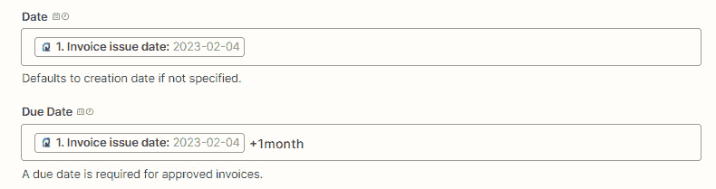
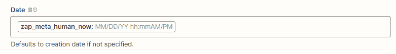

# 第十四章：日期和时间格式

出现在 Zaps 中的数据可能并非总是以您需要的格式呈现。您可能经常发现需要更改数据的格式，以便以特定方式查看它，或者使其与其他应用程序所需的数据格式兼容。例如，假设有新订阅者加入了您的通讯，但他们已经以小写形式输入了他们的名字；也许您希望将第一个字母大写。另外，一个日期可能以美国格式显示，但您可能希望将其更改为国际公认的格式。您还可能希望去除以 HTML 格式呈现的文本，或使用类似电子表格的公式计算某些内容。使用 Zapier 极其多功能的 Formatter by Zapier 内置应用程序，可以在不使用代码的情况下实现所有这些功能，将各种各样的值转换为您希望的格式，以满足特定目的的需求。

在本章中，我们将首先介绍 Zapier 内置应用程序 Formatter by Zapier，以及它用于处理日期和时间、数字、文本和各种其他数值的功能。我们将重点讨论如何格式化日期和时间，并了解如何调整 Zaps 中的日期和时间值的基础知识。然后，我们将讨论如何在 Zap 的其他操作步骤中使用 Zap 运行的日期和时间。之后，我们将探讨如何使用 Formatter by Zapier 内置应用程序添加和减去时间，并比较日期，然后深入探讨如何使用这个内置应用程序格式化日期和时间数值。

本章将涵盖以下关键主题：

+   介绍了 Zapier 内置应用程序 Formatter by Zapier

+   使用 Zapier 调整日期和时间数值的基础知识

+   使用 Zapier 的 Formatter 在处理日期和时间

处理完每个主题后，您将更好地了解可与 Formatter by Zapier 内置应用程序一起使用的不同动作事件。您还将了解如何在 Zaps 中调整日期和时间数值，使用 Zap 运行的日期和时间，以及如何使用 Formatter by Zapier 内置应用程序添加或减去时间并操作日期和时间数据。

# 技术要求

要充分利用本章节的内容和练习，您需要访问 Zapier 帐户。您将需要 Zapier Starter 计划才能使用 Formatter by Zapier 内置应用程序创建多步骤工作流程。

# 介绍了 Zapier 内置应用程序 Formatter by Zapier

在创建工作流自动化时，您可能会发现从一个应用程序中检索到的数据在另一个应用程序中无法识别，或者您可能希望以某种其他方式更改这些数据以呈现不同的样式。在不使用代码的情况下能够以这种方式操作数据值是一个巨大的好处。Zapier 允许您使用名为 Formatter by Zapier 的内置应用程序来实现这一点。

Zapier 的 Formatter 应用绝对是 Zapier 内置应用中最多功能、最有用的应用。它的功能是如此广泛，以至于我们将在五个单独的章节中介绍这个应用及其每个动作事件。

Formatter by Zapier 内置应用只能作为一个动作步骤，具有以下动作事件：

+   **日期/时间**：这个动作事件允许您将日期和时间值转换为不同格式（包括时区）并添加或减去时间。我们将在本章中介绍使用 Formatter by Zapier 内置应用进行日期和时间格式化。

+   **数字**：这个动作事件允许您操纵数字、电话号码和货币，并使用类似于电子表格的公式和数学运算。我们将在*第十五章*，*格式化数字*中介绍使用 Formatter by Zapier 内置应用进行数字格式化。

+   **文本**：你可以使用这个动作事件广泛地格式化文本。你可以调整标题大小写、大小写、查找和替换文本、修剪空白、计算单词并调整它们的长度，以及使文本复数化。我们将在*第十六章*，*Zapier 中的文本格式化函数-第一部分*中介绍这些功能。你还可以创建超级英雄名称；分割和截断文本；提取模式、URL、电话号码、数字和电子邮件地址；将 Markdown 转换为 HTML；将文本转换为 ASCII；使用**默认值**和**URL 编码/解码**；以及删除 HTML 标签。我们将在*第十七章*，*Zapier 中的文本格式化函数-第二部分*中讨论这些功能。

+   `.csv`文件。我们将在*第十八章*，*Zapier 的 Utilities Functions*中介绍 Formatter by Zapier 内置应用中的**实用功能**动作事件。

现在你应该更好地了解了 Formatter by Zapier 内置应用的不同动作事件和功能。

提示

你可以使用魔法 AI 要求 Zapier 在你的 Zap 步骤中格式化数据，然后创建具有相关转换选项的 Formatter by Zapier 步骤。我们将在*第十九章*，*AI* *和自动化*中讨论这一点。

接下来，我们将回顾一下如何在你的 Zaps 中调整时间和日期值的基础知识。

# 使用 Zapier 调整日期和时间值的基础知识

在我们深入使用 Formatter by Zapier 内置应用来操纵日期和时间值之前，了解如何在基本水平上调整 Zaps 中的日期和时间值将是有益的。

在*第三章*，*构建你的第一个自动化工作流（Zap）*中，我们向你介绍了**日期/时间**字段类型。当你在操作步骤中遇到这种类型的字段时，你可以使用**字段修饰符**，可以是独立的，也可以跟在静态或动态的日期或时间值后面，来调整日期/时间。

字段修饰符必须包括以下三个变量：

+   加号（`+`）或减号（`-`），表示增加或减少时间。

+   一个数字。

+   时间单位，可以是秒（`second`、`seconds`或`s`）、分钟（`minute`、`minutes`或`m`）、小时（`hour`、`hours`或`h`）、天（`day`、`days`或`d`）、月（`month`或`months`）、或年（`year`、`years`或`y`）。您可以使用缩写或全拼形式的单数或复数形式。

例如，如果您需要在您的会计应用中创建发票，并希望**日期**和**到期日期**字段填入从 Zap 运行的当天开始的 1 天的值和从您的 CRM 中某个交易到期关闭的日期起始的 1 个月的值，您可以使用修改器，如下面的截图所示：

图 14.1 – 在您的 Zaps 中使用日期/时间字段修改器的概述

以下是您可以使用的一些修改器示例：

+   `+1h`：Zap 运行后或字段中的日期/时间值后的 1 小时

+   `-2days`：Zap 运行前或字段中的日期/时间值前的 2 天

+   `+5y`：Zap 运行后或字段中的日期/时间值后的 5 年

+   `+30s`：Zap 运行后或字段中的日期/时间值后的 30 秒

+   `-10minutes`：Zap 运行前或字段中的日期/时间值前的 10 分钟

在静态或动态值之后使用修改器时，例如在*图 14**.1*中显示的**到期日期**字段中，您必须确保日期/时间值和修改器之间有一个空格。

您还可以添加多个修改器，可以独立使用或在日期/时间值之后使用。在这些情况下，您必须在它们之间留下一个空格 – 例如，`+``1month –5days`。

现在，您应该更好地了解如何使用 Zapier 调整日期和时间值。

现在，让我们探索如何将 Zap 运行的日期和时间插入到您的操作步骤中的字段中。

## 在字段中使用 Zap 运行的日期和时间

有时您可能希望将 Zap 触发的日期和时间插入到操作步骤中的一个或多个字段中。例如，您可能希望记录当新的数据行添加到 Google Sheets 电子表格时的日期和时间。这可以通过在字段中输入`{{zap_meta_human_now}}`来轻松实现。当 Zap 运行时，此命令将以`MM/DD/YY hh:mm AM/PM`的格式输出人类可读的字符串；例如，`11/01/23` `07:40 PM`。

这个命令可以用在日期/时间字段类型和文本字段中，在文本字段中您可以键入静态值。该命令使用您在 Zapier 帐户或 Zap 设置中指定的时区设置。如果未指定时区，则时间戳将默认为**协调世界时（UTC）**。在*第一章*，*介绍 Zapier 的业务流程自动化*中，我们讨论了如何调整帐户时区设置，以及在*第四章*，*管理您的 Zaps*中讨论了单个 Zap 时区设置。

在将命令输入到字段中后，当您创建或编辑 Zap 时，该字符串不会显示时间戳数据。它只会在触发并运行 Zap 后才会在指定的操作应用程序中显示。以下截图显示了这一点：

图 14.2 – 使用您的 Zap 运行的日期和时间的概述

您也可以按照以下时间戳使用：

+   `{{zap_meta_utc_iso}}`: 如果您需要一个可以被其他应用程序和 API 读取的字符串 - 即机器可读字符串而不是标准的、可读字符串 - 建议使用此命令。此命令忽略您的时区设置，将产生一个 UTC 时区下的 ISO 8601 时间戳，例如 `2023-11-01T08:19:12+00:00`。ISO 8601 是国际公认的时间标准，您可以在这里了解更多：[`en.wikipedia.org/wiki/ISO_8601`](https://en.wikipedia.org/wiki/ISO_8601)。

+   `{{zap_meta_timestamp}}`: 当应用程序或 API 需要 Unix 时间戳格式时，应使用此命令。Unix 时间戳广泛用于计算机硬件和软件操作系统，以及数字文件格式，并由自 1970 年 1 月 1 日以来的秒数表示，例如 `1591537509`。您可以在这里了解更多关于 Unix 时间的内容：[`en.wikipedia.org/wiki/Unix_time`](https://en.wikipedia.org/wiki/Unix_time)。

+   `{{zap_meta_[timezone]_iso}}`: 将 `[timezone]` 替换为三到五个字母的时区缩写格式。例如，`{{zap_meta_est_iso}}` 用于 `{{zap_meta_gmt_iso}}` 用于 **格林威治标准时间（GMT）**。您可以在这里了解更多关于时区缩写：[`en.wikipedia.org/wiki/List_of_time_zone_abbreviations`](https://en.wikipedia.org/wiki/List_of_time_zone_abbreviations)。

在您的 Zaps 中处理时区数据可能会很棘手，因为它常常需要试错来确保您的数据正确，并被各种应用程序所接受。您可以在 Zapier 网站上了解更多处理时区数据的提示：[`zapier.com/blog/format-datetimes/`](https://zapier.com/blog/format-datetimes/)。

重要提示

并非所有时区缩写都兼容`{{zap_meta_[timezone]_iso}}`命令。通常情况下，美国最常见的时区以及一些欧洲和亚太地区的时区是兼容的。建议您提前使用该命令进行一些测试。您可以在以下文章中了解更多信息：[`help.zapier.com/hc/zh-cn/articles/8496275717261-%E5%9C%A8%E6%95%B0%E6%8D%AE%E5%BA%93%E5%AD%98%E5%85%A5 Zap-%E8%BF%90%E8%A1%8C%E6%97%B6%E9%97%B4%E9%A1%B9%E7%9B%AE%E7%9A%84%E6%97%B6%E9%97%B4`](https://help.zapier.com/hc/zh-cn/articles/8496275717261-%E5%9C%A8%E6%95%B0%E6%8D%AE%E5%BA%93%E5%AD%98%E5%85%A5 Zap-%E8%BF%90%E8%A1%8C%E6%97%B6%E9%97%B4%E9%A1%B9%E7%9B%AE%E7%9A%84%E6%97%B6%E9%97%B4)。

现在您应该更好地理解了如何在操作步骤中使用您的 Zap 运行的日期和时间。

接下来，我们来看看如何使用 Zapier 内置的 Formatter 应用程序来操作日期和时间。

# 使用 Formatter by Zapier 操作日期和时间

现在您已经学会了如何调整日期和时间，以及如何在操作步骤中插入 Zap 运行的日期和时间，我们将进一步探讨如何通过 Zapier 内置的 Formatter 应用程序更广泛地操作日期和时间。

在许多情况下，您需要从触发器或操作步骤中转换日期和时间值，通过添加或减去时间、以特定格式显示日期或时间，或比较两个日期。您可以使用 Formatter by Zapier 来实现这一点。

要操作日期和时间，Formatter by Zapier 只能用作操作步骤，并作为**日期/时间**操作事件可用。

使用此操作事件时，您可以使用以下**日期/时间**转换选项，在**设置** **操作**部分中可以找到：

+   **添加/减去时间**

+   **比较日期**

+   **格式**

在我们依次探索如何设置每个转换选项之前，让我们先了解如何使用自定义日期格式。

## 使用自定义的日期格式

当您希望使用 Formatter by Zapier **日期/时间**转换选项来转换日期或时间时，您可以从下拉列表中选择要使用的格式或样式，也可以指定一个未列出的自定义格式。由于 Zapier 可能无法始终识别您要转换的格式，您还可以使用自定义格式来指定要转换的格式。

以下表格显示了 Zapier 可识别的日期和时间令牌格式列表。这些令牌可以以任意组合使用，以产生您想要的格式：

图 14.3 – 一个显示 Zapier 接受的日期和时间自定义格式的表格

*图 14.3*的数据来自[Zapier 帮助文章](https://zapier.com/help/create/format/modify-date-formats-in-zaps#customize-date-time-options)。请查阅此文章获取最新信息。

使用*图 14**.3*中的数据，我们可能希望将`2023-11-01T09:15:30`时间戳转换为`09:15 11 月 1 23`。为此，我们可以使用`HH:mm MMMM D YY`标记格式。

接下来，我们将深入了解如何使用 Formatter by Zapier 来添加和减去时间。

## 添加或减去时间

当您希望在后续操作步骤中以不同方式显示时间时，向时间戳值添加或减去时间是非常有用的。

以下是您可以使用 Formatter by Zapier 的**日期/时间**操作事件与**添加/减去时间**转换选项的几个示例：

+   当在 Salesforce CRM 中标记一个机会为赢得时，在**QuickBooks Online**中创建一个到期日期为关闭日期后 1 个月的发票

+   当接收到**Facebook Messenger**消息时，创建一个到期时间比消息接收时间晚 1 小时的 Trello 卡片

让我们探讨如何设置**添加/减去时间**转换选项。

### 设置带有添加/减去时间转换选项的日期/时间操作事件

一旦设置了您的触发步骤，您可以使用**日期/时间**操作事件。

一旦您通过选择**操作**步骤或单击**+**图标来添加操作步骤，并选择**Formatter by Zapier**作为应用程序，**日期/时间**作为操作事件，您可以编辑**操作**部分的字段，如下所示：

+   **转换**：从下拉菜单中选择**添加/减去时间**选项。这是一个必填字段，对于步骤成功运行需要有一个值。

+   **输入**：使用这个字段输入您想要操作的日期值。这可以是静态 URL 值，先前步骤的动态值，或两者的组合，以指定**输入**值。为了准确，**输入**值必须在接受的日期/时间格式中。虽然这不是一个必填字段，但如果没有值，格式化函数将不返回结果。

+   `+1h`，`-3 天`，或`+2 个月`。输入静态值、来自先前步骤的动态值，或两者的组合。为了准确，输入必须是接受的日期/时间格式，正如我们在*使用 Zapier 调整日期和时间值的基础知识*部分讨论的那样。这是一个必填字段，必须有一个值供 Zap 运行。

+   **输出格式**：指定您希望日期/时间输出显示的格式。从下拉菜单中选择日期/时间格式，或在**自定义**选项卡下添加自定义格式。您可以使用我们在*使用自定义日期* *格式*部分讨论过的自定义日期格式。

+   **起始格式**：Zapier 将尝试读取**输入**值的格式。如果 Zapier 读错了，您可以用这个字段指定确切的格式。选择下拉菜单中的日期/时间格式，或在**自定义**选项卡下添加自定义格式。您可以使用我们在*使用自定义日期* *格式*部分讨论过的自定义日期格式。

这些选项显示在以下截图中：

图 14.4 - 使用 Formatter by Zapier 的 "日期/时间" 操作事件来添加时间并将其转换为自定义日期格式的概述。

点击 **继续** 按钮。然后，您可以使用 **测试** 部分来测试此步骤以生成修改后的日期/时间格式。以下屏幕截图显示了图 14**.4** 中的场景的结果：

图 14.5 - 使用日期/时间操作事件添加或减去时间时修改后的时间格式的概述

在您的 **日期/时间** 操作步骤之后添加一个或多个操作步骤，或发布您的 Zap。

现在，您应该对如何使用内置的 Formatter by Zapier 应用程序来添加或减去日期和时间值有了更好的理解。

现在，让我们介绍一下如何使用内置的 Formatter by Zapier 应用程序比较两个日期。

## 比较两个日期

在许多场景中，比较两个日期或时间以获取它们之间的持续时间（以秒、分钟、小时或天为单位）或检查它们是否相同都很方便。

这里有几个使用 Formatter by Zapier 的 **日期/时间** 操作事件与 **比较日期** 变换选项的示例：

+   当您想要评估客户服务团队的响应时间，并确保他们在同一天内解答客户查询时。例如，您可以使用 **比较日期** 变换选项来比较 **ClickUp** 任务的创建时间与其关闭时间，并将两个值添加到 Google 表中。在这种情况下，触发器将是任务关闭时间列的变化。

+   当您在特定日期举办比赛并且仅想在当天收集参赛作品时。因此，当提交一个 Typeform 时，您可以使用 **比较日期** 变换选项将提交日期与今天的日期进行比较，并使用 Zapier 的路径功能指定工作流应该遵循的路径。如果日期匹配，则将条目添加到 **Airtable** 数据库并使用 Gmail 发送后续电子邮件；否则，使用 Gmail 发送电子邮件表示比赛已关闭。

现在，让我们来探讨如何设置 **比较日期** 变换选项。

### 使用 Compare Dates 变换选项设置 "日期/时间" 操作事件。

一旦您设置了触发器步骤，就可以使用 **日期/时间** 操作事件。

一旦您通过选择 **操作** 步骤或点击 **+** 图标，并选择将 app 设置为 **Formatter by Zapier**，将操作事件设置为 **日期/时间**，您可以编辑**操作**部分中的字段，如下所示：

+   **变换**：从下拉菜单中选择 **比较日期** 选项。这是一个必填字段，步骤需要一个值才能成功运行。

+   **开始日期**：指定要与另一个日期进行比较的第一个日期。这可以是静态 URL 值，也可以是来自先前步骤的动态值，或两者的组合。为了准确性，输入必须采用可接受的日期/时间格式。如果此日期在**结束日期**字段中指定的值之后，两个日期将在输出中交换位置。这是一个必填字段，步骤成功运行需要提供一个值。

+   **结束日期值**：指定要与**开始日期**字段中指定的第一个值进行比较的第二个日期。这可以是静态 URL 值，也可以是来自先前步骤的动态值，或两者的组合。为了准确性，输入必须采用可接受的日期/时间格式。这是一个必填字段，步骤成功运行需要提供一个值。

+   **日期格式-开始日期**：Zapier 将尝试读取**开始日期**的格式。Zapier 可能会弄错，因此，您可以使用此字段来指定确切的格式。如果**开始日期**和**结束日期**字段中指定的两个日期值具有不同的格式，也可以使用此字段。您可以从下拉菜单中选择日期/时间格式，或在**自定义**选项卡下添加自定义格式。您可以使用我们在*使用自定义日期格式*部分中讨论过的自定义日期格式。

+   **日期格式-结束日期**：Zapier 将尝试读取**结束日期**的格式。Zapier 可能会弄错，因此，您可以使用此字段来指定确切的格式。如果**开始日期**和**结束日期**字段中指定的两个日期值具有不同的格式，也可以使用此字段。您可以从下拉菜单中选择日期/时间格式，或在**自定义**选项卡下添加自定义格式。您可以使用我们在*使用自定义日期格式*部分中讨论过的自定义日期格式。

示例如下屏幕截图所示：

图 14.6-使用 Zapier 内置应用程序格式化日期/时间动作事件来比较两个日期/时间的概述

单击**继续**按钮。您可以使用**测试**部分来测试此步骤，以显示日期/时间比较的输出。在*图 14**.6*中的方案的结果显示在以下屏幕截图中：

图 14.7-比较两个日期/时间值的概述

输出显示日期是否在输出中被交换，日期是否相同（都用`true`或`false`表示），以及天数、小时、分钟和秒数的差异。

在**日期/时间**操作步骤之后添加一个或多个操作步骤，或发布您的 Zap。

现在，让我们来讨论如何使用 Zapier 内置应用程序 Formatter 来格式化日期和时间值。

## 格式化日期和时间

当您在 Zaps 中使用的应用程序之间的时间格式不同时，通常需要从触发或操作步骤格式化日期和时间。您可能还希望以更易读的方式显示时间格式，例如日期不包括小时、分钟和秒。

这里有几个您可以使用 Formatter by Zapier **日期/时间**动作事件与**格式**转换选项的示例：

+   当**Asana**中的任务标记为已完成时，转换完成日期和时间的格式，并在 Google 日历中创建一个新的会议

+   当收到 Microsoft Outlook 电子邮件时，将接收到的日期显示更易读的格式 - 例如，`2023 年 1 月 29 日`。

让我们来探索如何设置**格式**转换选项。

### 设置带有**格式**转换选项的**日期/时间**动作事件

一旦设置了触发步骤，您就可以使用**日期/时间**动作事件。

一旦选择了**动作**步骤或单击**+**图标添加了动作步骤，并且选择了**Formatter by Zapier**作为应用程序，选择了**日期/时间**作为动作事件，您可以编辑**动作**部分中的字段，如下所示：

+   **转换**：从下拉菜单中选择**格式**选项。这是一个必填字段，步骤成功运行需要提供一个值。

+   **输入**：使用此字段输入您想要操作的日期值。这可以是静态 URL 值，前面步骤的动态值，或两者的组合，以指定**输入**值。为了准确，输入必须是被接受的日期/时间格式。虽然这不是一个必填字段，但如果没有值，格式化函数将不会返回结果。

+   **格式设置**：指定要显示日期/时间输出的格式。可以从下拉菜单中选择日期/时间格式，或在**自定义**选项卡下添加自定义格式。您可以使用我们在*使用自定义日期格式*部分讨论过的自定义日期格式。这是一个必填字段，步骤成功运行需要提供一个值。

+   **时区设置**：从下拉列表中选择要显示的日期/时间输出所关联的时区。您还可以从上一步中映射自定义值。该字段的默认值为**UTC**。

+   **输入格式**：Zapier 将尝试读取输入值的格式。如果 Zapier 读取错误，您可以使用此字段指定确切的格式。可以从下拉菜单中选择日期/时间格式，或在**自定义**选项卡下添加自定义格式。您可以使用我们在*使用自定义日期格式*部分讨论过的自定义日期格式。

+   **输入时区**：从下拉列表中指定与您的输入值相关的时区。您还可以从上一步中映射自定义值。该字段的默认值为**UTC**。

下面的屏幕截图中显示了一个示例：

图 14.8 – 使用 Formatter by Zapier 日期/时间操作事件概述来更改 GMT 日期/时间的格式和时区

单击**继续**按钮。然后，您可以使用**测试**部分来测试此步骤，生成更改后的日期/时间格式。 *图 14**.8*的情景结果显示在以下屏幕截图中：

图 14.9 – 在使用日期/时间操作事件格式化日期和时间时更改时间格式的概述

在您的**日期/时间**操作步骤之后继续添加一个或多个操作步骤，或发布您的 Zap。

这是一个 Zapier 社区文章，进一步介绍了您如何使用 Formatter by Zapier 来操作日期和时间：[`community.zapier.com/featured-articles-65/working-with-date-time-fields-10439`](https://community.zapier.com/featured-articles-65/working-with-date-time-fields-10439)。

现在，您应该对如何使用 Zapier 内置应用程序格式化日期和时间有了更好的理解。

# 总结

在本章中，我们介绍了 Formatter by Zapier 应用程序的功能，以便您可以操作日期和时间、数字、文本和其他类型的数据。此后，本章内容的主要焦点是操作日期和时间。我们介绍了如何在 Zaps 中调整日期和时间值的基础知识。之后，我们讨论了如何在操作步骤中使用 Zap 运行的日期和时间。然后，我们探讨了如何使用 Zapier 内置应用程序添加和减去时间以及比较两个日期。最后，我们讨论了如何使用 Zapier 内置应用程序格式化日期和时间值。

您现在了解了 Formatter by Zapier 提供的操作事件。您现在也知道了如何在 Zaps 中调整日期和时间，并使用 Zap 运行的日期和时间。最后，您现在知道如何使用 Zapier 内置应用程序添加或减去时间，并将日期和时间值转换为不同的格式。

在下一章中，您将学习如何使用 Zapier 内置应用程序来操作数字、电话号码和货币，以及如何使用类似电子表格的公式和数学运算。

# 问题

1.  您如何在您的 Zap 中使用 Zap 运行的日期和时间？

1.  你能否在不使用 Zapier 内置应用的格式化程序的情况下调整日期/时间值？

1.  如何使用 Zapier 内置应用程序操作日期和时间？
