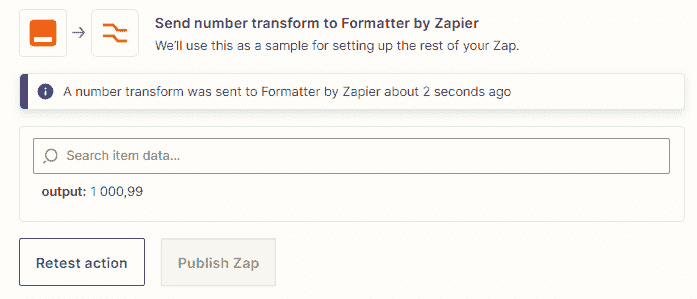
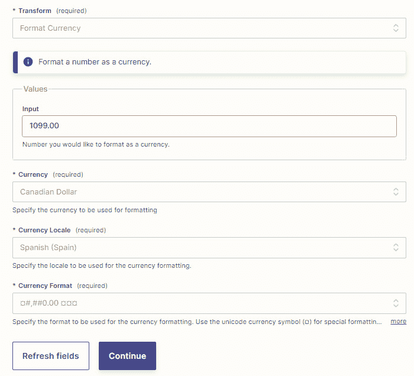
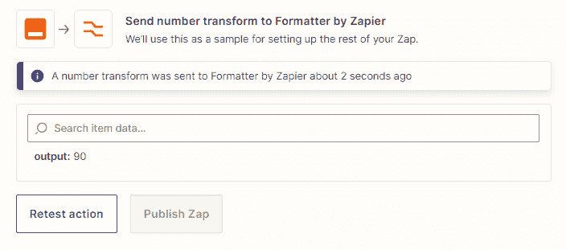
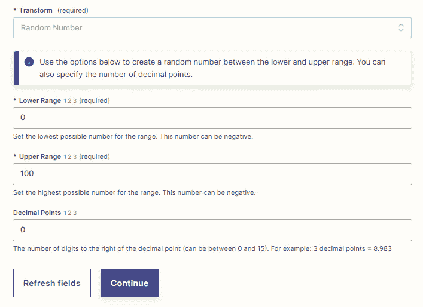
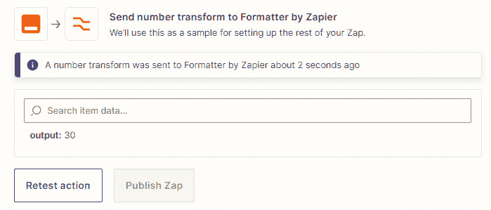
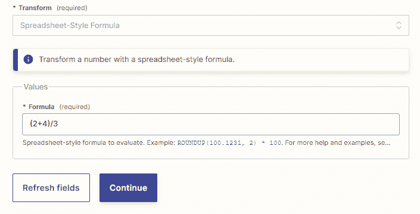
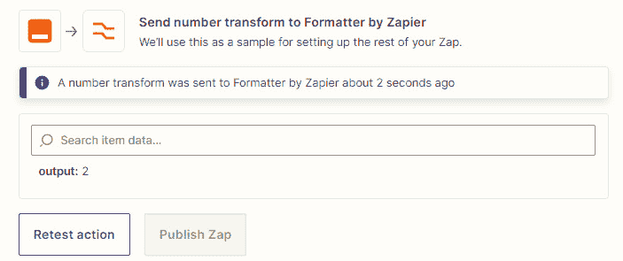

# 第十五章：格式化数字

通常情况下，您可能会发现数字数据值通常不会以您希望的方式在视觉上显示，或者您的其他应用程序不会接受它们的方式。可能有几种情况会出现这种情况。例如，一个潜在客户可能在提交查询表单时输入联系电话号码，但该格式可能不被您的短信应用程序识别。或者，如果您的团队提交时间表，您可能需要在通过电子邮件发送摘要之前计算他们的加班费。您可能还想要在数字中添加空格、句号或逗号，或将数字转换为特定的货币格式。正如您可以想象的那样，当您需要调整数字时，可能会出现许多可能的情况，这就是 Formatter by Zapier **Numbers** 动作事件发挥作用的地方。

在本章中，我们将深入使用 Formatter by Zapier 内置应用程序来操作各种数字格式。我们将首先介绍使用 Zapier 来转换数值。接下来，我们将探讨如何格式化数字、货币和电话号码。然后，我们将介绍如何使用 Formatter by Zapier 内置应用程序执行基本数学运算并生成随机数。最后，我们将讨论如何使用类似电子表格的公式进行计算。

本章中将涵盖以下关键内容：

+   使用 Zapier 转换数值

+   使用 Formatter by Zapier 格式化数字

+   使用 Formatter by Zapier 格式化货币

+   使用 Formatter by Zapier 格式化电话号码

+   使用 Formatter by Zapier 执行数学运算

+   使用 Formatter by Zapier 生成随机数

+   使用 Formatter by Zapier 使用类似电子表格的公式

提示

您可以使用魔法 AI 请求 Zapier 在您的 Zap 步骤中格式化数据，然后会创建具有相关转换选项的 Formatter by Zapier 步骤。我们将在 *第十九章* 中讨论这一点，*AI* *和自动化*。

一旦您完成了每个主题的学习，您将更好地理解 Formatter by Zapier 内置应用程序可用于转换数字的不同事件。您将了解如何调整数字、货币和电话号码，以及如何执行数学运算和在 Zaps 中使用类似电子表格的公式。

# 技术要求

要充分利用本章内容，您将需要访问 Zapier 帐户。您将需要 Zapier 入门套餐才能使用 Formatter by Zapier 内置应用程序创建多步工作流程。

# 使用 Zapier 转换数值

Formatter by Zapier 可轻松用于将数值从一种格式转换为另一种格式。在某些情况下，您可能需要转换数据，例如当某个值在您的某些应用程序中不被接受时，当您希望以不同的格式显示数据时，或者当您需要进行计算时。

对于数字操作，Formatter by Zapier 只能用作动作步骤，并且可用作**数字**操作事件。使用此操作事件时，您可以使用以下**数字**转换选项，在操作步骤的**操作**部分中找到：

+   **数字格式**

+   **格式货币**

+   **格式** **电话号码**

+   **执行** **数学运算**

+   **随机数**

+   **电子表格样式公式**

让我们从探索如何转换一般数字格式开始。

# 使用 Formatter by Zapier 格式化数字

当您希望调整小数点、千位分隔符和空格的显示方式时，更改数字的格式可以非常有用。一般来说，在数据从一个应用程序以一种格式呈现的情况下，您希望将其更改为以另一种方式显示的情况下，这些情况可能会出现。 Zapier 有解决此问题的方案。您可以使用 Formatter by Zapier **数字**操作事件和**数字格式**转换选项来调整数字的格式。

以下是使用此转换选项的几个示例：

+   当您希望使用句点作为小数标记来更改数字的格式，例如`1000.00`，以便它使用逗号作为小数标记，例如`1000,00`

+   当您希望使用逗号进行分组来更改数字的格式，例如`1,000,000`，以便它使用空格，例如`1` `000 000`

+   当您希望更改数字的格式而没有千分位分隔符，例如`1000000`，以便它具有带逗号的分隔符，例如`1,000,000`

本质上，此转换选项可用于将数字更改为新样式。但是，它不允许您舍入或填充数字。

探索如何设置**数字格式**转换选项。

## 使用数字格式转换选项设置数字操作事件

一旦设置了触发器步骤，就可以使用**数字**操作事件。

一旦您选择了**操作**步骤或单击**+**图标并选择**Formatter by Zapier**作为应用程序，**数字**作为操作事件后，您可以按以下方法编辑**操作**部分中的字段：

+   **转换**：从下拉菜单中选择**数字格式**选项。这是必填字段，必须有值才能运行 Zap。

+   **输入**：使用此字段输入要操作的数字格式。您可以输入静态值、来自之前步骤（使用**定制**选项卡）的动态值或两者的组合，以指定**输入**值。虽然这不是必填字段，但如果没有值，格式化程序函数将无法返回结果。

+   `,`或`.`字符，分别。这是必填字段，必须有值才能运行 Zap。

+   `0`、`1`、`2`或`3`。这是必填字段，必须有值才能运行 Zap。

在下面的截图中显示了一个示例，我们想要将包含点作为小数点的输入值转换为具有千位分隔符的空格，以及逗号作为小数点的输出：

图 15.1 – 使用 Formatter by Zapier Numbers 动作事件格式化数字的概述

点击**继续**按钮。然后，您可以使用**测试**部分测试此步骤以生成修改后的数字格式。来自*图 15**.1*中情景的结果如下截图所示：

图 15.2 – 使用 Numbers 动作事件格式化数字时修改后的数字值概述

在您的**Numbers**动作步骤之后添加一个或多个操作步骤或发布您的 Zap。

您现在应该更好地了解如何使用 Formatter by Zapier 内置应用程序格式化数字了。

接下来，让我们深入了解格式化货币值。

# 使用 Formatter by Zapier 格式化货币

无论您是在业务中使用单一货币还是多种货币，很可能在某个时候需要将数值转换为适合您（或其他人）的区域设置的货币格式，或以某种方式显示。您可以使用 Formatter by Zapier 的**Numbers**动作事件和**格式化货币**转换选项轻松完成此操作。

以下是您可以使用此转换选项的一些示例：

+   当您想要将数字格式更改为德文（德国）区域设置格式，小数点作为小数点，以欧元显示，并在开头显示货币符号以及在末尾显示货币缩写时，比如`€``1.000,23 EUR`

+   当您想要将数字格式更改为英文（美国）区域设置格式，小数点作为小数点，以美元显示，并在开头显示货币符号，没有千位分隔符时，比如`$1000.23`

在我们深入介绍带有**格式化货币**转换选项的操作步骤之前，让我们先了解一些有关国家区域设置和货币格式的有用信息。

## 了解国家区域设置和货币格式

在处理货币时，了解到大多数国家都有特定的货币显示格式是很有用的。例如，许多欧洲国家使用逗号作为小数点，而美国使用句点。

货币可以使用 Zapier 根据**Unicode**字符指南进行格式化以显示数字模式。根据维基百科的定义，Unicode 被定义为“*用于一致地编码、表示和处理世界上大部分* *书写系统* *的文本的信息技术（IT）标准*”。  

用于货币模式格式化的最常见的 Unicode 字符如下所示：

+   模式中的`.`指定了小数点的放置位置。

+   模式中的`,`指定了千位分隔符应放置的位置。

+   模式中的`0`指定了“零填充”。因此，如果输入的数字太短，将在那里放置一个零。

+   模式中的`#`指定了“无填充”。因此，如果输入的数字太短，将不会在那里放置任何值。

+   模式中的`¤`指定了货币符号或代码应该放置的位置。如果连续使用多个符号，货币将显示得略有不同。例如，对于英镑在英语（英国）区域设置中，`¤`等于`£`，`¤¤`等于`GBP`，`¤¤¤`等于`英镑`。

因此，您可以组合一串 Unicode 字符，将货币转换为您希望显示的格式。

有关 Unicode 数字模式的更多信息，包括一些示例模式格式，可以在[`www.unicode.org/reports/tr35/tr35-numbers.html#Number_Format_Patterns`](http://www.unicode.org/reports/tr35/tr35-numbers.html#Number_Format_Patterns)找到。

接下来，让我们探讨如何设置**格式货币**转换选项。

## 使用“格式货币”转换选项设置 Numbers 操作事件

设置了触发步骤后，您可以使用**Numbers**操作事件。

一旦您通过选择**操作**步骤或单击**+**图标添加了一个操作步骤，并将**Formatter by Zapier**作为应用程序选择，以及**Numbers**作为操作事件选择，您可以编辑**操作**部分中的字段，如下所示：

+   **转换**：从下拉菜单中选择**格式货币**选项。这是一个必填字段，必须为 Zap 设置一个值才能运行。

+   **输入**：使用此字段输入要转换为货币格式的数字。您可以输入静态值，来自以前步骤的动态值（使用**自定义**选项卡）或二者的组合，以指定**输入**值。虽然这不是一个必填字段，但如果没有值，格式化函数将不会返回结果。

+   **货币**：在这里，您可以指定要将数字输出显示为的货币。在下拉菜单中选择一个格式，或在**自定义**选项卡下添加**ISO**（国际标准）4217 三字符货币代码。货币代码的详细信息可以在[`en.wikipedia.org/wiki/ISO_4217`](https://en.wikipedia.org/wiki/ISO_4217)找到。这是一个必填字段，必须为 Zap 设置一个值才能运行。

+   `en_US` 格式适用于英语（美国）。语言代码的详细信息可以在 [`en.wikipedia.org/wiki/ISO_639`](https://en.wikipedia.org/wiki/ISO_639) 找到。国家代码的详细信息可以在 [`en.wikipedia.org/wiki/ISO_3166`](https://en.wikipedia.org/wiki/ISO_3166) 找到。这是一个必填字段，必须有值才能运行 Zap。

+   **货币格式**：在这里，您可以通过从下拉菜单中选择 Unicode 模式格式来指定货币输出的显示格式。或者，您可以在**自定义**选项卡下通过输入 Unicode 模式格式中的静态值、来自之前步骤的动态值或两者的组合来添加自定义格式。请参考 *了解国家区域设置和货币格式化* 部分中的 Unicode 字符作为指导。这是一个必填字段，必须有值才能运行 Zap。

以下截图显示了一个示例：

图 15.3 – 使用 Formatter by Zapier Numbers 动作事件格式化货币的概览

单击**继续**按钮。您然后可以使用**测试**部分测试此步骤，以生成修改后的货币格式。 *图 15**.3* 中的场景结果如下截屏所示：

图 15.4 – 在使用 Numbers 动作事件格式化货币时，修改值的概览

在您的**Numbers**动作步骤之后再添加一个或多个操作步骤，或者发布您的 Zap。

您现在应该更好地了解如何使用 Formatter by Zapier 内置应用程序格式化货币了。

接下来，让我们回顾一下如何转化电话号码的基础知识。

# 使用 Formatter by Zapier 格式化电话号码

电话沟通并没有消亡！在电子邮件之后，通过电话与潜在客户、客户和供应商交流是任何业务的重要部分。能够自动化您的电话沟通是一个优势。当潜在客户首次与您联系时，您可能希望自动发送短信或语音信箱。然而，有时我们的联系人提供给我们的电话号码格式并不总是适用于其他应用程序。因此，在使用多个应用程序进行电话通讯时，自动调整和操作电话号码的能力至关重要。这就是 Formatter by Zapier 的**Numbers**动作事件和**Format Phone Number**转换选项发挥作用的地方。

以下是几个您可以使用此选项的示例：

+   当您收到一个带有移动电话号码的潜在客户，并且您希望将其更改为国际认可的格式，以便您可以使用 Twilio 发送自动短信

+   当新客户注册您的服务并提供电话号码时，您希望将其更改为被语音信箱发送应用程序（例如 **Slybroadcast**）识别的格式时，

+   当 CRM 中添加新联系人并希望更改他们提供的电话号码格式，以便 CRM 能够识别呼叫模块时，

接下来，让我们看一下如何设置 **Format Phone Number** 转换选项。

## 使用格式电话号码选项设置 Numbers 操作事件

一旦设置了触发步骤，您就可以使用 **Numbers** 操作事件了。

一旦您添加了一个操作步骤（通过选择**Action**步骤或单击**+**图标），并选择 **Formatter by Zapier** 作为应用程序和 **Numbers** 作为操作事件，您可以编辑 **Actions** 部分中的字段，如下所示：

+   **Transform**：从下拉菜单中选择 **Format Phone Number** 选项。这是必填字段，必须为 Zap 提供一个值才能运行。

+   **Input**：您可以使用此字段输入要转换为其他电话号码格式的号码。要指定 **Input** 值，可以输入静态值、来自之前步骤的动态值（使用 **Custom** 标签）或两者的组合。虽然这不是必填字段，但如果没有值，格式化函数将无法返回结果。

+   `0`、`1`、`2` 到 `8`。这是必填字段，必须为 Zap 提供一个值才能运行。

+   `US` 国家代码）将产生一个电话号码，其中前两个字符为 `+1`。如果留空，则输出中不显示国家代码。

+   `true` 或 `false` 格式。仅当测试或仅需要格式化时设置为 **No**。如果号码无效，则将在未格式化的状态下输出 **Input** 字段中指定的号码。该字段的默认值为 **Yes**。

下图是一个示例：

图 15.5 - 使用 Formatter by Zapier Numbers 操作事件概述格式化电话号码

点击 **Continue** 按钮。然后可以使用 **Test** 部分测试此步骤以生成更改后的电话号码格式。*图 15.5* 中的示例结果如下所示：

图 15.6 - 使用 Numbers 操作事件格式化电话号码时的输出值概述

在您的 **Numbers** 操作步骤之后添加一个或多个操作步骤，或者发布您的 Zap。

现在您应该更好地了解如何使用内置的 Formatter by Zapier 应用程序格式化电话号码了。

接下来，让我们看一下如何执行基本的数学运算。

# 使用 Formatter 
by Zapier 进行数学运算

有时您可能会经常手动执行基本的数学运算。您可能希望将两个或三个值相加，或将数字转换为百分比。幸运的是，Zapier 的格式化工具允许您使用多个值进行标准数学运算。

使用 **数字** 操作事件和 **执行数学运算** 转换选项，Zapier 的格式化工具允许您进行以下基本的数学运算：

+   **加法**

+   **减法**

+   **乘法**

+   **除法**

+   **变为负数**

以下是您可以使用此转换选项的几个示例：

+   当您的客户在 **Google 表单** 上填写了一个订单表单，包括红球的订单量和黄球的订单量，并且您想要计算总订单金额

+   当您的团队成员使用 **FastField 移动表单**填写差旅费和生活补贴报销表单时，您想要从他们的月度津贴中扣除该值

+   当潜在客户通过电子邮件与您互动，您想要向潜在客户评分添加预定义的互动点值

接下来，让我们看看如何设置 **执行数学运算** 转换选项。

## 通过设置执行数学运算转换选项的数字操作事件

设置完触发器步骤后，您可以使用 **数字** 操作事件。

一旦您已经添加了一个操作步骤，无论是通过选择 **操作** 步骤还是点击 **+** 图标，并选择了 **Formatter by Zapier** 作为应用程序以及 **Numbers** 作为操作事件，您可以编辑 **操作** 部分的字段如下：

+   **转换**：从下拉菜单中选择 **执行数学运算** 选项。这是一个必填字段，Zap 运行时必须有数值。

+   `add`、`sub`、`mul`、`div` 或 `neg` 分别为其值。这是一个必填字段，Zap 运行时必须有数值。

+   **输入**：您可以使用此字段以多行输入您想要在计算中使用的数值。您可以输入静态值、前面步骤的动态值，或两者的组合。虽然这不是必填字段，但如果没有数值，格式化函数将不返回结果。

在下面的屏幕截图中显示了一个示例，我们想要将值 `9` 和 `10` 相乘：

图 15.7 - 使用 Zapier Formatter 数字操作事件执行数学运算的概述

点击 **继续** 按钮。您可以使用 **测试** 部分测试此步骤，生成数学运算的输出。在 *图 15.7* 场景中的结果如下图所示：

图 15.8 - 使用数字操作事件执行数学运算时的输出值概述

在您的**数字**操作步骤之后添加一个或多个动作步骤，或者发布您的 Zap。

现在您应该更好地理解了如何使用 Formatter by Zapier 内置应用程序执行基本数学运算。

接下来，让我们探讨如何在您的 Zaps 中创建随机数。

# 使用 Formatter by Zapier 生成随机数

Formatter by Zapier 的另一个功能是能够在较低值和较高值范围内生成随机数。它还允许您指定您希望输出显示的小数点数。如果您需要执行的操作不仅限于我们刚讨论的五种基本数学运算，您可以在您的 Zaps 中使用复杂的电子表格样式公式。您可以使用 Formatter by Zapier 的**数字**操作事件的**随机数公式**转换选项来实现这一点。

以下是您可以使用此转换选项的几个示例：

+   当您想要为团队成员随机分配 ID 号以供人力资源记录使用时

+   当您想要为新用户随机生成一个访问受保护数据的密码时

接下来，让我们回顾一下如何设置**随机数**转换选项。

## 设置具有随机数转换选项的数字操作事件

一旦您设置了触发步骤，就可以使用**数字**操作事件。

一旦您添加了一个动作步骤，要么选择**动作**步骤，要么点击**+**图标，并选择了**Formatter by Zapier**作为应用程序，**数字**作为动作事件，您可以编辑**动作**部分中的字段，如下所示：

+   **转换**：从下拉菜单中选择**随机数**选项。这是一个必填字段，必须为 Zap 设置一个值才能运行。

+   `0`。这是一个必填字段，必须为 Zap 设置一个值才能运行。

+   `100`。这是一个必填字段，必须为 Zap 设置一个值才能运行。

+   `0` 和 `15`，默认值为 `0`。此字段是可选的。

下面的截图显示了一个示例，我们希望生成一个介于 `0` 和 `100` 之间的随机数，不带小数点：

图 15.9 – 使用 Formatter by Zapier 的数字操作事件生成随机数的概览

单击**继续**按钮。然后，您可以使用**测试**部分来测试此步骤以生成输出。来自*图 15**.9*情景的结果如下截图所示：

图 15.10 – 使用数字操作事件生成随机数时的输出值概览

在您的**数字**操作步骤之后添加一个或多个动作步骤，或者发布您的 Zap。

接下来，让我们探讨如何在您的 Zaps 中使用类似电子表格的公式。

# 使用 Formatter 
by Zapier 的电子表格式公式

如果您需要执行的操作超出了我们刚刚讨论的五个基本数学运算，您可以在 Zaps 中使用复杂的电子表格式公式。您可以通过 Formatter by Zapier **Numbers**动作事件的**电子表格式公式**转换选项来实现这一点。

该转换选项允许您使用电子表格常用的公式进行复杂的数字计算，以及使用文本字符串进行文本操纵，而不是使用代码。

重要说明

当您在此转换选项中使用文本字符串时，您必须在字符串周围使用引号-例如，`=IF("string1"="string2", "``same", "different")`。

下面是您可以使用此转换选项的几个示例：

+   当您想要计算多个数字的平均值，例如`8`、`12`和`13`，以获得`11`，您可以使用`AVERAGE(number, [number, …])`公式。

+   当您想要输出一组值中的最大数，例如`1`、`9`和`53`，以获得`53`，您可以使用`MAX(number, [number, …])`公式。

+   当您想要生成介于 0 和 1 之间的随机数，例如`0.512453`，您可以使用`RAND()`公式。

+   当您想要执行一个`if`-`then`语句的替代。例如，如果您的第一个值是`car`，第二个值是`bicycle`，则返回`orange`；否则，返回`not relevant`。为此，您可以使用`=IF(AND("string1"="red", "string2"="yellow"), "orange", "not` `relevant")`公式。

这里有几篇 Zapier 社区文章，为您使用**电子表格式公式**转换选项提供了很好的背景信息：

+   *格式化功能：电子表格式公式中的 IF、AND 和 OR*：[`community.zapier.com/featured-articles-65/formatter-features-using-if-and-or-in-spreadsheet-style-formulas-10367`](https://community.zapier.com/featured-articles-65/formatter-features-using-if-and-or-in-spreadsheet-style-formulas-10367)

)

+   *格式化功能：电子表格式公式中的中位数/平均数和向上取整/向下取整*：[`community.zapier.com/featured-articles-65/formatter-features-median-average-and-roundup-rounddown-in-spreadsheet-style-formulas-10621`](https://community.zapier.com/featured-articles-65/formatter-features-median-average-and-roundup-rounddown-in-spreadsheet-style-formulas-10621)

)

+   *格式化功能：电子表格式公式中的 RAND/RANDBETWEEN 和 MIN/MAX*：[`community.zapier.com/featured-articles-65/formatter-features-rand-randbetween-and-min-max-in-spreadsheet-style-formulas-10599`](https://community.zapier.com/featured-articles-65/formatter-features-rand-randbetween-and-min-max-in-spreadsheet-style-formulas-10599)

)

接下来，让我们来看一下如何设置**电子表格式公式**的转换选项。

## 使用电子表格式公式的 Numbers 动作事件设置

一旦您设置了触发步骤，您可以使用**Numbers**动作事件。

一旦你添加了一个动作步骤，要么通过选择**Action**步骤，要么点击**+**图标，并选择**Formatter by Zapier**作为应用程序，**Numbers**作为动作事件，你可以编辑**Action**部分中的字段，如下所示：

+   **转换**：从下拉菜单中选择**电子表格式公式**选项。这是一个必需字段，必须为 Zap 提供一个值才能运行。

+   **公式**：你可以使用此字段指定带有要计算的值的公式。为公式和数值数值添加静态值，或在**Custom**选项卡下映射自前几步骤的动态值。这是一个必需字段，必须为 Zap 提供一个值才能运行。

Zapier 创建了一份方便的参考文档，其中包含了可与 Formatter by Zapier 结合使用的各种公式，你可以在[`help.zapier.com/hc/en-us/articles/8496181204877`](https://help.zapier.com/hc/en-us/articles/8496181204877)中查阅。

以下截图中显示了一个示例，其中我们想要将`2`和`4`的和除以`3`：

图 15.11 – 使用 Formatter by Zapier Numbers 动作事件进行电子表格样式操作的概述

点击**Continue**按钮。然后你可以使用**Test**部分测试这一步骤以生成输出。*图 15**.11*中的场景结果如下截图所示：

图 15.12 – 使用 Numbers 动作事件执行电子表格式操作时的输出值概述

在你的**Numbers**动作步骤之后添加一个或多个动作步骤，或者发布你的 Zap。

这是一个方便的 Zapier 社区文章，其中包含了如何使用 Formatter by Zapier 格式化数字的示例：[`community.zapier.com/featured-articles-65/formatter-features-currency-number-formatting-11091`](https://community.zapier.com/featured-articles-65/formatter-features-currency-number-formatting-11091)。

你现在应该更好地理解如何使用 Formatter by Zapier 内置应用程序的**Numbers**转换选项。

# 总结

在本章中，我们介绍了如何使用 Formatter by Zapier 内置应用程序来操纵各种数字格式。我们首先介绍了如何使用 Zapier 对数字进行一般格式化。然后，我们详细介绍了如何格式化数字、货币和电话号码。接下来，我们探讨了如何使用 Formatter by Zapier 内置应用程序执行基本数学运算并生成随机数字。最后，我们研究了如何使用电子表格式公式进行计算。

你现在已经知道如何使用 Zapier 内置的 Formatter 应用程序来转换数字值，例如数字，货币和电话号码，以及如何执行基本的数学运算并使用电子表格式的公式执行计算。

在下一章中，您将学习如何使用 Zapier 内置的 Formatter 应用程序的一些功能来格式化文本。我们将探讨调整标题大小写，大写和小写字母，查找和替换文本，修剪空白，计算字数，调整文本字符串的长度以及复数化文本。

# 问题

1.  你能使用 Formatter 应用程序来格式化英国电话号码，使其符合国际认可的格式吗？

1.  Formatter 应用程序能执行哪些数学运算？
