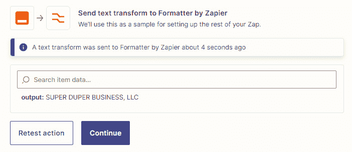

# 第十六章：Zapier 中的文本格式化函数 – 第一部分

到目前为止，在本书中，我们已经介绍了多功能的 Formatter by Zapier 内置应用的两个重要功能。在 *第十四章*，*日期和时间格式化* 中，我们讨论了如何使用 Formatter by Zapier 来操作日期和时间。在 *第十五章*，*数字格式化* 中，我们介绍了如何使用它来转换数字。正如在这两个章节中所涵盖的，能够将文本转换为各种不同格式是非常有用的。例如，联系人的姓名可能以全名（名和姓）的形式显示，您可能想要分开名字，以便您可以个性化邮件而不是使用联系人的全名。或者您可能想从一段文本中提取电子邮件地址，以便将其添加到您的营销自动化软件中。当在 Twitter 上分享内容摘要时，您可能还想将文本截断为指定的字符长度。在您可能需要调整文本时，有许多可能性，而这正是 Formatter by Zapier 的 **Text** 动作事件发挥作用的地方。熟悉 Microsoft Excel 的用户将会注意到这种 Zapier 功能与 Microsoft Excel 电子表格中文本转换公式使用之间的相似之处。

在本章中，我们将继续关注多功能的 Formatter by Zapier 内置应用，并学习如何使用其中丰富的功能来格式化文本。首先，我们将讨论如何使用 Zapier 来进行文本值的转换。接下来，我们将探讨文本的大写、标题大小写、大写和小写以及词语的复数形式。然后，我们将涵盖查找和替换文本的位置、计算字符和单词的数量以及移除空白字符。

在本章中，我们将涵盖以下关键主题：

+   使用 Zapier 转换文本值

+   将每个单词的首字母大写

+   对一串单词应用标题大小写

+   将文本字符串中的所有字符转换为大写

+   将文本字符串中的所有字符转换为小写

+   使单词成为复数

+   查找指定文本的第一个位置

+   替换字符、单词或短语

+   计算文本字符串中的字符数

+   计算文本字符串中的单词数

+   移除空白字符

一旦你完成了这些主题的学习，你将更好地了解 Formatter by Zapier 内置应用中可用于文本转换的一些不同函数。你将知道如何使用 Zapier 调整文本到各种格式。

# 技术要求

要充分利用本章内容，您需要访问 Zapier 帐户。您将需要使用 Zapier Starter 计划才能创建使用 Formatter by Zapier 内置应用的多步骤工作流。

# 使用 Zapier 转换文本值

Zapier Formatter 可以轻松地将文本值从一种格式转换为另一种。可能有多种情况需要转换数据，例如当您希望以不同的格式显示格式或从一段文本中提取特定类型的数据时。

用于操作文本的 Zapier Formatter 只能作为动作步骤使用，并且可以作为**文本**动作事件使用。

在使用此动作事件时，您可以使用以下**文本**转换选项。这些选项可以在动作步骤的**设置动作**部分中找到，在**转换**下拉菜单中列出：

+   **大写**

+   **将 HTML 转换为 Markdown**

+   **将 Markdown 转换为 HTML**

+   **转换为 ASCII**

+   **默认值**

+   **提取电子邮件地址**

+   **提取数字**

+   **提取模式**

+   **提取电话号码**

+   **提取 URL**

+   **查找**

+   **长度**

+   **小写**

+   **复数形式**

+   **删除 HTML 标签**

+   **替换**

+   **拆分文本**

+   **将文本拆分为 AI 提示的块（beta）**

+   **电子表格样式公式**

+   **超级英雄名称**

+   **大写**

+   **修剪空白**

+   **截断**

+   **大写**

+   **URL 解码**

+   **URL 编码**

+   **字数统计**

我们将在*第十七章*中介绍**将 HTML 转换为 Markdown**，**将 Markdown 转换为 HTML**，**转换为 ASCII**，**默认值**，**提取电子邮件地址**，**提取数字**，**提取模式**，**提取电话号码**，**提取 URL**，**拆分文本**，**电子表格样式公式**，**超级英雄名称**，**截断**，**URL 解码**和**URL 编码**文本转换选项。我们将在*第十九章*中介绍**将文本拆分为 AI 提示的块**（**beta**），*AI*和自动化。

提示

您可以使用魔术 AI 要求 Zapier 在您的 Zap 步骤中格式化数据，然后使用相关的转换选项创建 Zapier Formatter 步骤。我们将在*第十九章*中讨论这个问题，*AI*和自动化。

让我们开始探讨如何使每个单词的首字母大写。

# 每个单词的首字母大写

如果您严格要求正确格式化文本，您很可能会希望确保在适当的情况下，一段文本中的单词的首字母显示为大写。在称呼人名或在发票上显示商务名称和地址时，这一点尤为重要。您可以使用 Zapier Formatter 将一段文本中每个单词的首字母大写，例如将`this is a test`转换后的文本会变成`This Is A Test`。Microsoft Excel 用户会发现这个 Zapier 功能与 Microsoft Excel 电子表格中`PROPER`公式相似，用于将文本大写。

以下是一些可以使用此转换选项的示例：

+   当新联系人注册您的通讯时，他们可能会将自己的姓名全小写添加，例如`kelly`而不是`Kelly`。您可能希望在电子邮件中称呼他们时，使他们的姓名看起来应有的样子。因此，例如，当新订阅者被添加到 Mailchimp 时，您可以将他们的姓名转换为正式设置。

+   您可能通过要求客户填写网络表单来收集客户账单地址。他们可能会将地址全部小写添加，例如`99 hollow avenue, washington`。在将数据添加到您的会计系统之前，您可能希望将地址中每个单词的第一个字母大写，以便读取为`99 Hollow` `Avenue, Washington`。

接下来，让我们来看看如何设置带有**大写**转换选项的动作步骤。

## 使用大写转换选项设置 Text 动作事件

设置触发步骤后，您可以一次使用**Text**动作事件。

一旦您添加了一个动作步骤，无论是选择**动作**步骤还是单击**+**图标，并选择了**Formatter by Zapier**作为应用程序，**Text**作为动作事件，您可以编辑**动作**部分中的字段，如下所示：

+   **转换**：从下拉菜单中选择**大写**选项。这是一个必填字段，Zap 运行时必须有一个值。

+   **输入**：使用此字段输入要转换每个单词的第一个字符的文本。您可以输入静态值，先前步骤中的动态值，或两者的组合来指定**输入**值。虽然这不是必需的字段，但如果没有值，格式化程序函数将不会返回结果。

下面的截图显示了一个示例：

图 16.1 – 使用 Formatter by Zapier Text 动作事件将文本转换为大写

单击**继续**按钮。然后，您可以使用**测试**部分测试此步骤以生成修改后的大写文本。来自*图 16**.1*场景的结果如下截图所示：

图 16.2 – 使用 Text 动作事件将文本转换为大写时修改值的示例

在您的**Text**动作步骤之后添加一个或多个动作步骤。

您现在应该更好地了解如何使用**大写**转换函数了。接下来，让我们看看如何使用**Titlecase**转换函数将一串单词应用为标题大小写。

# 对一串单词应用标题大小写

继续从`这是使用的最佳测试的示例`，转换后的文本将是`This Is an Example of the Best Test` `to Use`。

以下是您可以使用此转换选项的几个示例：

+   当您的博客作者向您的**WordPress**网站添加新的草稿博客文章，并且您希望确保文章标题的格式始终保持在首字母大写的状态时。您可以使用**首字母大写**转换选项来更改标题的格式，然后使用 WordPress 操作事件相应地更新博客文章。

+   您可能会在 Google Sheets 电子表格或 ClickUp 等项目管理工具中管理**YouTube**视频发布计划。该计划可能包括 YouTube 视频的标题，您可能希望该标题始终以首字母大写的方式发布。您可以使用**首字母大写**转换选项来更改标题的格式，然后在将新视频发布到 YouTube 时添加已更正的标题。

接下来，让我们回顾如何设置带有**首字母大写**转换选项的操作步骤。

## 设置带有**首字母大写**转换选项的文本操作事件

一旦设置了触发步骤，您就可以使用**文本**操作事件。

一旦添加了一个操作步骤，通过选择**操作**步骤或单击**+**图标，并选择**Formatter by Zapier**作为应用程序，选择**文本**作为操作事件，您可以编辑**操作**部分中的字段，如下所示：

+   **转换**：从下拉菜单中选择**首字母大写**选项。这是一个必填字段，必须为 ZAP 指定一个值才能运行。

+   **输入**：使用此字段输入要转换为首字母大写的文本。您可以输入静态值、来自前面步骤的动态值或两者的组合以指定**输入**值。虽然这不是必填字段，但如果没有值，格式化器函数将不会返回结果。

以下是一个示例截图：

图 16.3 – 使用 Formatter by Zapier 文本操作事件将文本更改为首字母大写

单击**继续**按钮。然后，您可以使用**测试**部分测试此步骤以生成更改后的文本。来自*图 16*的结果显示在以下截图中：

图 16.4 – 使用文本操作事件更改为首字母大写时的变更值示例

在**文本**操作步骤之后添加一个或多个操作步骤。

现在，您应该更好地理解如何使用**首字母大写**转换功能了。接下来，让我们探讨如何使用**大写**转换功能将文本字符串中的所有字符转换为大写。

# 将文本字符串中的所有字符转换为大写

我们大多数人都知道，将文本消息或电子邮件以大写字母输入可能会被解释为提高您的虚拟“声音”或强调一个观点。最好节制使用这种方式。然而，也许还有其他时候需要以大写字母显示文本。原始文本可能全小写，或者大小写混合。为了将一串文本改为仅显示大写字母，您可以使用 Zapier 的格式化程序`wunderlust factory`，转换后的文本将是`WUNDERLUST FACTORY`。Microsoft Excel 用户将会注意到这种 Zapier 功能与 Microsoft Excel 电子表格中的`UPPER`公式的相似性，后者可将文本转换为大写字母。

以下是您可以使用此转换选项的几个示例：

+   当线索在您的网站上填写表单时，您可能希望将线索的公司名称完全显示为大写字母在您的**客户关系管理**（**CRM**）中。您可以使用**大写**转换选项来更改公司名称的格式为大写字母，然后使用新的公司名称格式将线索的详细信息添加到 CRM 中。

+   当您通过电子邮件收到附件时，您可能希望将文档的副本上传到**Google Drive**。您可能还更喜欢所有文件名都采用一致的大写格式。您可以使用**大写**转换选项来更改文件标题的格式为大写字母，然后再将其上传到 Google Drive。

接下来，让我们看看如何使用**大写**转换选项设置操作步骤。

## 设置带有**大写**转换选项的文本操作事件

一旦设置了触发步骤，您就可以使用**文本**操作事件。

一旦添加了操作步骤，无论是选择了**操作**步骤还是点击了**+**图标，并选择了**Zapier 的格式化程序**作为应用程序，以及**文本**作为操作事件，您都可以编辑**操作**部分中的字段，如下所示：

+   **转换**：从下拉菜单中选择**大写**选项。这是一个必填字段，必须为 Zap 运行提供一个值。

+   **输入**：使用此字段输入要转换为大写字母的文本。您可以输入静态值、先前步骤的动态值或两者的组合以指定**输入**值。虽然这不是必填字段，但如果没有值，格式化程序功能将不会返回结果。

下图显示了一个示例：

图 16.5 – 使用 Zapier 文本操作事件来将文本大写化

点击**继续**按钮。然后，您可以使用**测试**部分来测试此步骤，以生成大写字母中的更改文本。来自*图 16*的方案结果显示在下图中：

图 16.6 – 使用文本动作事件将所有文本更改为大写时的示例

在**文本**动作步骤之后添加一个或多个操作步骤。

现在你应该更好地理解如何使用**大写**转换函数了。接下来，让我们讨论如何使用**小写**转换函数将文本字符串中的所有字符转换为小写。

# 将文本字符串中的所有字符转换为小写

与`The Ice-cream Parlor`相比，转换后的文本将是`the ice-cream parlor`。Microsoft Excel 用户将注意到这个 Zapier 功能与 Microsoft Excel 电子表格中的`LOWER`公式将文本转换为小写的相似性。

以下是使用此转换选项的几个示例：

+   当你的联系人通过 Calendly 预订咨询电话时，你可能正在使用 Google Docs 为他们创建模板合同。你可能希望根据客户名称和文档创建日期，将所有 Google Docs 文件名以一致的小写格式进行格式化。

+   当你的联系人通过你的 Shopify 网站购买时，你可能想为他们生成唯一的用户别名，以便在其他应用程序中使用。如果在别名中使用他们的姓名，你可能希望将其转换为小写以保持一致性。

接下来，让我们回顾一下如何使用**小写**转换选项设置操作步骤。

## 使用小写转换选项设置文本动作事件

一旦设置了触发步骤，你就可以使用**文本**动作事件。

一旦添加了一个操作步骤，通过选择**操作**步骤或点击**+**图标，并选择**Formatter by Zapier**作为应用程序，选择**文本**作为动作事件，你可以编辑**操作**部分中的字段，如下所示：

+   **转换**：从下拉菜单中选择**小写**选项。这是一个必填字段，Zap 运行时必须有一个值。

+   **输入**：使用此字段输入要转换为小写字母的文本。你可以输入静态值、来自之前步骤的动态值，或二者的组合以指定**输入**值。虽然这不是必填字段，但如果没有值，格式化函数将不会返回结果。

以下是一个示例截图：

图 16.7 – 使用 Formatter by Zapier 文本动作事件将文本转换为小写字母

点击**继续**按钮。然后可以使用**测试**部分来测试此步骤，生成转换后的小写文本。*图 16**.7*中的场景的结果如下截图所示：

图 16.8 – 使用 Text 操作事件使所有文本变为小写时修改后值的示例

在设置了**文本**操作步骤后，继续添加一个或多个操作步骤。

您现在应该更好地理解如何使用**小写**转换函数了。接下来，让我们学习如何使用**复数化**转换函数将单词变为复数形式。

# 复数化词语

有时将一个单词从单数格式转换为复数格式会很方便。您可以使用 Zapier Formatter 的**文本**操作事件与**复数化**转换函数一起更改任何英语单词，使其成为复数形式。

下面是一个可以使用此转换选项的示例。您可能有一个使用 WooCommerce 平台的电子商务商店。当客户购买商品时，您可能希望以更个性化的方式跟进购买情况，使用格式化的文本来阅读更好。假设您的客户购买了六件红色 T 恤，但您的 WooCommerce 站点将产品列为`red t-shirt`；您可以根据客户订购的数量使用`red t-shirts`。这样，您的电子邮件将更好地呈现，显示`6` `red t-shirts`。

接下来，让我们回顾一下如何使用**复数化**转换选项设置操作步骤。

## 设置带有复数化转换选项的文本操作事件

一旦设置了触发步骤，您就可以使用**文本**操作事件。

一旦添加了操作步骤，无论是选择了**操作**步骤还是点击了**+**图标，并选择了**Zapier Formatter**作为应用程序，**文本**作为操作事件，您都可以编辑**操作**部分的字段，如下所示：

+   **转换**：从下拉菜单中选择**复数化**选项。这是一个必填字段，Zap 执行时必须有一个值。

+   **输入**：使用此字段输入您想要复数化的文本。您可以输入静态值、来自前几步的动态值或两者的组合来指定**输入**值。虽然这不是一个必填字段，但如果没有值，格式化函数将不会返回结果。

以下是示例截图：

图 16.9 – 使用 Zapier Formatter 文本操作事件将文本转为复数形式

单击**继续**按钮。然后，您可以使用**测试**部分来测试此步骤，以生成修改后的复数形式文本。*图 16**.9* 中的情景结果如下图所示：

图 16.10 – 使用 Text 操作事件将文本转为复数形式时修改后值的示例

在设置了**文本**操作步骤后，继续添加一个或多个操作步骤。

注意

**Pluralize**转换功能通常适用于单个词。如果出现多个词，一般情况下，字符串中的最后一个词会被复数形式表示。

现在，你应该更好地了解如何使用**Pluralize**转换功能了。接下来，让我们来看一下如何使用**Find**转换功能找到指定文本值的第一个位置。

# 查找指定文本的第一个位置

有时，你可能希望知道一个词在一段文本中首次出现的数字位置。你可以使用 Zapier 中的 Formatter `green`在文本字符串`green is a wonderful color`中，返回的值将是`0`。如果文本字符串是`isn't green a wonderful color?`，返回值将是`6`。如果搜索词在文本字符串中不存在，则返回的值将是`-1`。你还可以跳过一些你不想包括在搜索中的字符。例如，如果文本字符串是`plum and apple and pear and plum`，我们可以通过在搜索期间跳过字符串中的前四个或更多字符，来忽略单词`plum`的第一个位置。这将返回单词`plum`在字符串中的第二次出现的位置为`28`。

使用该转换选项的情况示例是，如果你有一个博客团队，他们根据一个主题和**搜索引擎优化**（**SEO**）信息撰写博客文章，并将其加入到 Microsoft Excel 电子表格中。当你的博客作者将新文章上传到 WordPress 时，你可能希望使用**Find**转换功能来查找你的 SEO 关键词短语的第一个位置，然后通过电子邮件通知你那个位置。

接下来，让我们来看一下如何使用**Find**转换选项设置操作步骤。

## 使用 Find 转换选项设置文本操作事件

一旦设置了触发步骤，你可以使用**Text**操作事件。

一旦你添加了一个操作步骤，通过选择**动作**步骤或点击**+**图标，并选择**Formatter by Zapier**作为应用程序，选择**Text**作为操作事件，你可以编辑**操作**部分中的字段，如下所示：

+   **转换**：从下拉菜单中选择**Find**选项。这是一个必填字段，Zap 才能运行。

+   **输入**：使用这个字段输入你想搜索的文本值，这个文本值是你在**Find**字段中所输入值的数字位置。你可以输入一个静态值，一个来自先前步骤的动态值，或者它们的组合来指定**输入**值。尽管这不是一个必填字段，但如果没有值，格式化功能将不返回结果。

+   **查找**：使用此字段输入要在**输入**字段中的文本中搜索的单词或短语。您可以输入静态值、前一步骤中的动态值，或两者的组合来指定此值。虽然这不是一个必填字段，但如果没有值，格式化函数将不会返回结果。

+   **跳过字符**：在查找**查找**字段中输入值时，使用此字段跳过多少个字符可能是有用的。您可以输入静态值、前一步骤中的动态值，或两者的组合来指定此值。此字段可以留空。当您不想找到第一个单词的位置，而只想找到后续单词时，请使用此字段。

下面的截图显示了一个示例：

图 16.11 – 使用 Formatter by Zapier 文本操作事件查找单词的数字位置

点击**继续**按钮。然后，您可以使用**测试**部分来测试此步骤，以生成单词的数字位置。在*图 16**.11*的情景中的结果如下截图所示：

图 16.12 – 使用文本操作事件的更改值示例，以复数形式显示文本

继续在**文本**操作步骤之后添加一个或多个动作步骤。

您现在应该更好地理解如何使用**查找**转换功能。接下来，让我们探讨如何使用**替换**转换功能替换字符、单词或短语。

# 替换字符、单词或短语

在编辑 Microsoft Word 或 Google Docs 中的文档、Microsoft Excel 或 Google Sheets 中的电子表格，或像 Smartsheet 或 Airtable 这样的数据库时，您可能已经多次使用过查找和替换功能。它做的就是它的名字所示的 – 找到某物，然后用其他东西替换它。Zapier 使用类似的功能，允许您在文本字符串中查找和替换单词和短语。您可以在 Microsoft Excel 电子表格中使用 Formatter by Zapier `REPLACE` 或 `SUBSTITUTE` 公式来查找和替换文本。

**替换**转换功能还允许您使用特殊字符语法查找特殊字符，如下所示：

+   `[:space:]`语法用于匹配空格（`\``s`）字符

+   `[:tab:]`语法用于匹配制表符（`\``t`）字符

+   `[:newline:]`语法用于匹配换行符（`\n`），这些符号用于标识文本行的结束或新行的开始。

+   `[:return:]`语法用于匹配回车符（`\r`），即表示当前行开始的字符（在左边距）。

让我们看一个可以使用此转换选项的示例。

您可以要求客户通过**Typeform**网页表单提交评论。提交表单后，您可能希望在将其上传到您的 WordPress 网站作为新帖子之前，搜索评论的正文以查找某个词或短语并将其替换为另一个。

接下来，让我们回顾一下如何设置一个具有**Replace**转换选项的操作步骤。

## 设置具有 Replace 转换选项的 Text 操作事件

设置触发步骤后，可以使用**Text**操作事件。

一旦您添加了一个操作步骤，可以通过选择**操作**步骤或点击**+**图标，并选择**Formatter by Zapier**作为应用程序和**Text**作为操作事件，您可以编辑**操作**部分中的字段，如下所示：

+   **转换**：从下拉菜单中选择**Replace**选项。这是一个必需的字段，必须为 Zap 设置一个值才能运行。

+   **输入**：使用此字段输入您想要搜索一个词或短语并用另一个替换它的文本。您可以输入静态值、来自先前步骤的动态值或二者的组合以指定**输入**值。虽然这不是一个必需的字段，但如果没有值，格式化程序函数将不会返回结果。

+   `[:``space:]` 语法。

+   **替换**：使用此字段输入您想要用来替换来自**查找**字段的值的单词或短语。您可以输入静态值、来自先前步骤的动态值或二者的组合以指定此值。虽然这不是一个必需的字段，但如果没有值，格式化程序函数将不会返回结果。

以下屏幕截图显示了一个示例：

图 16.13 – 使用 Formatter by Zapier Text 操作事件查找和替换文本

点击**继续**按钮。您可以使用**测试**部分测试此步骤以查找和替换任何文本。 *图 16**.13* 中的场景结果如下所示：

图 16.14 – 使用 Text 操作事件查找和替换文本时更改值的示例

在您的**Text**操作步骤之后添加一个或多个操作步骤。

您现在应该更好地了解如何使用**Replace**转换函数了。接下来，让我们讨论如何使用**Length**转换函数计算文本字符串中的字符数。

# 计算文本字符串中的字符数

在文本字符串中自动计算字符数的能力在多种情况下都非常有用。如果涉及到操作步骤的应用程序具有字符限制，这一点尤其重要。其中一个示例是 Twitter 上推文的字符限制。您可以在 Microsoft Excel 电子表格中使用 Formatter by Zapier `LEN` 公式来计算文本字符串中的字符数。

以下是可以使用此转换选项的几个示例：

+   您可能会在各种社交媒体渠道上转发内容；但是，某个内容可能太长而无法在 Twitter 等平台上分享。您可以使用**长度（Length）**转换函数计算字符长度，然后使用 Filter by Zapier 在字符长度超过 280 时停止工作流程。

+   在将数值添加到 Airtable 之前，您可能希望检查新 WordPress 博客文章正文中的字符数。

+   对于一些不使用社交媒体的客户，您可能希望通过短信转发社交媒体帖子，例如使用 Twilio 或 Voodoo SMS。大多数短信平台都有字符长度限制，因此您可以使用**长度（Length）**转换函数来计算字符长度，然后使用 Filter by Zapier 在工作流程超过字符长度限制时停止工作流程。

接下来，让我们回顾一下如何使用**长度（Length）**转换选项设置操作步骤。

## 使用长度（Length）转换选项设置文本操作事件

设置了**触发（Trigger）**步骤后，您可以使用**文本（Text）**操作事件。

一旦添加了操作步骤，无论是选择**操作（Action）**步骤还是单击**+**图标，然后选择了**Formatter by Zapier**作为应用程序和**Text**作为操作事件，都可以编辑**操作（Action）**部分中的字段，如下所示：

+   **转换（Transform）**：从下拉菜单中选择**长度（Length）**选项。这是一个必填字段，必须为 Zap 设置一个值才能运行。

+   **输入（Input）**：使用此字段输入要对其进行字符长度计数的文本。您可以输入静态值、来自先前步骤的动态值或两者的组合以指定**输入（Input）**值。虽然这不是一个必填字段，但如果没有值，格式化函数将不会返回结果。

+   **忽略空格字符**：使用此布尔字段选择是否要忽略所有空格字符，包括空格、制表符和换行符。选择**True**以忽略空格字符，选择**False**以包括空格字符。虽然这不是一个必填字段，但如果未选择任何选项，则默认情况下是包括空格字符。

下图显示了一个示例：

图 16.15 - 使用 Formatter by Zapier 文本操作事件计算字符数

点击**继续**按钮。然后您可以使用**操作**部分来测试此步骤以计算字符的数量。*图 16**.15*中的情景结果如下截图所示：

图 16.16 - 使用 Text 动作事件计算字符数量时返回值的示例

继续在**文本**动作步骤之后添加一个或多个操作步骤。

提示

如果字符串长度超过一定的字符长度（例如推文），则可以将**长度**变换函数与**截断**变换函数一起在同一工作流程中使用来减少文本字符串的长度。

您现在应该更好地了解如何使用**长度**变换函数。接下来，让我们讨论如何使用**单词计数**变换函数计算文本字符串中的单词数量。

# 计算文本字符串中的单词数量

与计算文本字符串中的字符数一样，能够计算单词数量通常很方便。在处理文档和文案编写情景时，这尤其有用。您可以使用 Formatter by Zapier **文本**动作事件与**单词计数**变换函数来实现这一点。

以下是可以使用此变换选项的几个示例情况：

+   在将数值添加到 Knack 之前，您可能想要检查新 WordPress 博客文章正文中的单词数量。

+   您可能在 Freshdesk 处理客户服务台查询，并希望将每张票更新的单词数量与更新时间进行比较，并将数字添加到 Google Sheets 电子表格中。

接下来，让我们回顾如何设置具有**单词计数**变换选项的操作步骤。

## 使用 Word Count 变换选项设置文本动作事件

一旦设置了触发器步骤，就可以使用**文本**动作事件。

一旦添加了一个操作步骤，无论是选择**操作**步骤还是点击**+**图标，并选择了 Formatter by Zapier 作为应用和**文本**作为动作事件，您都可以编辑**操作**部分中的字段，如下所示：

+   **变换**：从下拉菜单中选择**单词计数**选项。这是一个必填字段，必须为 Zap 设置一个值。

+   **输入**：使用此字段输入您要计算包含的单词数量的文本。您可以输入静态值、来自先前步骤的动态值，或二者的组合来指定**输入**值。虽然这不是必填字段，但如果没有值，格式化函数将不会返回结果。

下面是一个示例截图：

图 16.17 - 使用 Formatter by Zapier 文本动作事件计算文本字符串中的单词数量

点击**继续**按钮。然后，您可以使用**测试**部分测试此步骤，以返回定义文本字符串中单词数的值。*图 16.17*的场景结果显示在下图中：

图 16.18 – 使用文本操作事件计算单词数时返回的值的示例

在**文本**操作步骤之后，继续添加一个或多个操作步骤。

您现在应该更好地了解如何使用**单词计数**转换函数了。接下来，让我们探讨如何使用**修剪空格**转换函数去除空格。

# 去除空格

有时，文本字符串可能没有按照我们需要的方式进行编辑，以便在工作流程的其他步骤中使用。当某些应用以某种方式以空白字符间隔出现文本时，这种情况经常发生，这种情况经常发生，这种情况经常发生，这种情况经常需要在文本的开头或结尾没有空格时更改文本的格式。在这种情况下，如果您想要改变文本格式，使文本的开头或结尾没有空格，可以在 Microsoft Excel 电子表格中使用 Zapier `TRIM` 公式来删除文本中的空格。

可以使用此转换选项的一个示例是当您要求求职者通过填写网页表单发送申请时。网页表单可能存在格式问题，说明表单提交数据的部分主体前后存在大量空格块。您可以使用**修剪空格**转换函数在将申请添加到诸如 ClickUp 之类的任务管理应用程序之前删除空格。

接下来，让我们看一下如何使用**修剪空格**转换选项设置操作步骤。

## 使用**修剪空格**转换选项设置文本操作事件

在设置触发步骤之后，您可以使用**文本**操作事件。

添加完操作步骤后，无论是选择**操作**步骤还是点击**+**图标，并将**Zapier 格式化程序**设定为应用程序，**文本**设定为操作事件，您可以编辑**操作**部分中的字段，如下所示：

+   **转换**：从下拉菜单中选择**修剪空格**选项。这是一个必填字段，必须为 Zap 设定一个值。

+   **输入**：使用此字段输入要去除空格的文本。您可以输入静态值、来自先前步骤的动态值，或两者的组合来指定**输入**值。尽管这不是必填字段，但如果没有值，格式化函数将不返回结果。

下图显示了单词`pear`前的空格的示例

图 16.19 - 使用 Formatter by Zapier Text 操作事件修剪空格

点击**继续**按钮。然后，您可以使用**测试**部分测试此步骤以返回一个没有前导和尾随空白的值。 *图 16**.19* 中的情景结果如下截图所示：

图 16.20 - 使用文本操作事件修剪空格时返回的值示例

在**Text**操作步骤之后，继续添加一个或多个动作步骤。

您现在应该更好地了解如何使用**修剪空白字符**转换函数。

# 摘要

在本章中，我们继续关注多功能的 Formatter by Zapier 内置应用程序以及可用于格式化文本的广泛功能。首先，我们介绍了如何使用 Zapier 来通用转换文本值。接下来，我们探讨了大写文本、应用标题格式、大写、小写和使单词复数形式。最后，我们探讨了查找文本位置并替换文本、计算字符和单词数、截断文本以及移除空白字符。

你现在知道如何使用 Formatter by Zapier 内置应用程序对文本值进行多种不同方式的转换，包括大写、应用标题格式、大写、小写、使单词复数形式、查找文本位置并替换文本、计算字符和单词数、以及移除空白字符。

在下一章中，您将继续学习如何使用 Formatter by Zapier 内置应用程序的更多功能来格式化文本。我们将探讨如何创建超级英雄名称、将文本拆分成段落、截断文本、使用类似电子表格的公式转换文本，以及提取模式、URL、电话号码、数字和电子邮件地址。我们还将简要讨论更高级的功能，如将 HTML 转换为 Markdown，反之亦然，将文本转换为 ASCII，编码和解码 URL，使用默认值以及删除 HTML 标记。

# 问题

1.  Formatter by Zapier 内置应用程序中**Text**操作事件的**大写**转换选项执行什么操作？

1.  当您需要检查文本字符串中字符数时，Formatter by Zapier 内置应用程序的**Text**操作事件的哪个转换选项最适合使用？
