# 第十七章：Zapier 中的文本格式化函数 – 第二部分

在*第十六章*，*Zapier 中的文本格式化函数 – 第一部分* 中，我们介绍了几种 Formatter by Zapier 内置应用程序文本转换选项。在本章中，我们将继续讨论 Zapier 提供的格式化文本的功能。

首先，我们将探讨如何创建超级英雄名称，将文本分割成段落，以及截断文本的方法。然后，我们将介绍如何移除 HTML 以保留纯文本，如何分配默认值，以及如何使用类似电子表格的公式转换文本。之后，我们将讨论如何从文本块中提取电子邮件地址、数字、URL 和电话号码的可能性。最后，我们将简要讨论如何提取模式、将 HTML 转换为 Markdown 反之亦然，将文本转换为 ASCII，最后，对 URL 进行编码和解码的更高级功能。

我们将在本章中涵盖以下关键主题：

+   将名称转换为超级英雄的名称

+   将字符或单词分割成段落

+   将文本截断为指定的字符长度

+   移除 HTML 标签以保留纯文本

+   分配默认值

+   使用类似电子表格的公式转换文本

+   从文本块中提取数据

+   高级文本格式化功能

提示

您可以使用魔术 AI 请求 Zapier 在您的 Zap 步骤中格式化数据，然后创建带有相关转换选项的 Formatter by Zapier 步骤。我们将在*第十九章*，*AI* *和自动化* 中讨论这一点。

一旦您完成了每个主题，您就会更好地了解 Formatter by Zapier 内置应用程序可用于调整文本的不同文本转换功能。您将知道如何使用 Zapier 调整文本，使其处于各种格式中。

# 技术要求

要充分利用本章内容，您需要访问一个 Zapier 帐户。您将需要 Zapier Starter 计划才能使用 Formatter by Zapier 内置应用程序创建多步骤工作流程。

# 将名称转换为超级英雄的名称

到目前为止，在这本书中，我们已经介绍了很多有用的，尽管相当正式的格式化函数，这些函数可以用于各种业务情况。Zapier 并不完全只是关于正式的事情。有时候，您可能希望在文本格式化中稍微有些趣味和玩味。Zapier 可以通过使用 Formatter by Zapier 将任何名称或短文本字符串转换为随机选择的超级英雄名称，例如`Kelly Goss`，转换后的文本可能是`Space Fury`。当您希望在数据处理中做一些有趣和超出常规的事情时，这个文本转换函数非常好用。

下面是您可以使用此转换选项的一些示例：

+   你可能希望新的订阅者被随机分配超级英雄的名字，你将在电子邮件中用这些名字称呼他们。因此，当`John Smith`在`Scarlet Flame`订阅了你的电子邮件时。

+   当你把新员工添加为 Asana 的用户时，你可能想要跟他们开个玩笑，决定给他们分配超级英雄的名字。然后你可以给他们发送一封电子邮件，欢迎他们加入 Asana 团队，并告诉他们他们的新超级英雄名字。

接下来，让我们来看看如何设置带有**超级英雄名字**转换选项的动作步骤。

## 设置带有**超级英雄名字**转换选项的文本动作事件

一旦设置了触发步骤，就使用**文本**动作事件。

一旦你选中了**动作**步骤或点击**+**图标并选择**Formatter by Zapier**作为应用程序和**文本**作为动作事件，你就可以编辑**动作**部分中的字段，如下：

+   **转换**：从下拉菜单中选择**超级英雄名字**选项。这是一个必填字段，必须有值才能运行 Zap。

+   **输入**：使用此字段输入你想要转换为超级英雄名字的名称或单词字符串的文本。你可以输入静态值、前几个步骤的动态值，或二者的组合来指定**输入**值。虽然这不是一个必填字段，但如果没有值，格式化函数将不会返回结果。

以下截图中显示了一个例子：

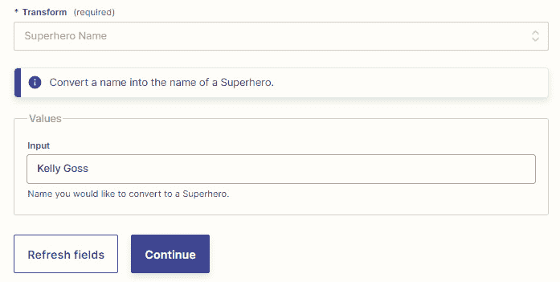

图 17.1 – 使用 Formatter by Zapier 文本动作事件将单词转换为超级英雄名字

点击**继续**按钮。然后你可以使用**测试**部分来测试这一步生成超级英雄的名字。*图 17.1*的情景结果如下截图所示：

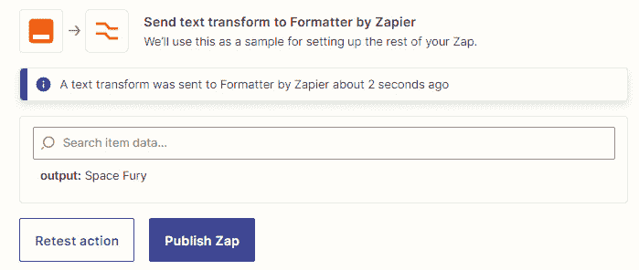

图 17.2 – 使用文本动作事件将单词转换为超级英雄名字时修改值的示例

在你的**文本**动作步骤之后，继续添加一个或多个动作步骤。

现在你应该更了解如何使用**超级英雄名字**转换函数了。接下来，让我们来看看如何使用**分割文本**转换函数将字符或单词分割成片段。

# 将字符或单词分割成片段

能够使用分割函数操纵文本可能是所有 Zapier 文本转换选项中最多才多艺的功能之一。会有许多场合，数据以一段文本的形式呈现，你会想要从该字符串中提取一个或多个单词，然后在你的工作流的其他部分中使用。这种情况的典型例子是只有全名时需要使用名字或姓氏中的一个。你可以使用 Formatter by Zapier 的**文本**动作事件和**分割文本**转换函数来分割单词字符串以返回这两个值。

你可以使用单词或字符来分割文本，**Split Text**转换函数允许你使用特殊字符语法来分割由特殊字符分隔的单词或字符串，如下所示：

+   用`[:space:]`语法匹配空格（`\s`）字符

+   用`[:tab:]`语法匹配制表符（`\t`）字符

+   用`[:newline:]`语法匹配换行符（`\n`）字符，它们用于标识文本行的结尾或新行的开始

+   用`[:return:]`语法匹配回车（`\r`）字符，它们表示当前行的起始位置（在左边缘）

这里是几个可以使用这个转换选项的例子：

+   当一个新的潜在客户填写网络表单时，你可能有一个字段让他们输入他们的全名，而不是分开的名字和姓氏字段。如果你想在电子邮件中仅使用他们的名字，或者将他们的名字和姓氏作为个别字段添加到你的 CRM 中，你可以相应地使用**Split Text**转换函数。

+   你可能会使用一个未与 Zapier 集成的电子签名应用程序，但一旦文档被签名并以文档的标题作为主题收到确认邮件，你可能会想要使用签署人公司名称在 Google 表格电子表格的一行中搜索数据，你已经将其作为文档名称的第一个单词放置。你可以使用**Split Text**转换函数来分割电子邮件主题字符串中的第一个单词。

让我们回顾一下如何使用**Split Text**转换选项设置操作步骤。

## 使用**Split Text**转换选项设置文本操作事件

一旦设置了触发器步骤，就可以使用**Text**操作事件。

一旦你通过选择**Action**步骤或点击**+**图标并选择**Formatter by Zapier**作为应用程序和**Text**作为操作事件添加了一个操作步骤，你可以编辑**Action**部分中的字段，如下所示：

+   **转换**：从下拉菜单中选择**Split Text**选项。这是一个必填字段，必须有一个值才能运行 Zap。

+   **输入**：在这个字段中输入你想要分割的文本字符串。你可以输入一个静态值，一个来自之前步骤的动态值，或者两者的组合来指定输入值。虽然这不是必填字段，但如果没有值，格式化函数将不返回结果。

+   用`[:space:]`语法。虽然这不是必填字段，但如果留空，缺省值是`[:space:]`语法。

+   **段落索引**：使用此下拉字段选择要返回的分割文本段。选项包括**第一个**、**第二个**、**最后一个**、**倒数第二个**、**全部（作为行项）**和**全部（作为单独字段）**。在使用**全部（作为行项）**时返回的值可以用在支持行项的步骤中——例如，在开票应用程序中。您可以输入静态值、先前步骤中的动态值，或两者的组合来指定此值。虽然这不是必需的字段，如果留空，将返回**第一个**索引。

下面的截图显示了一个例子，我们希望将由空格分隔的所有值提取为单独的项：

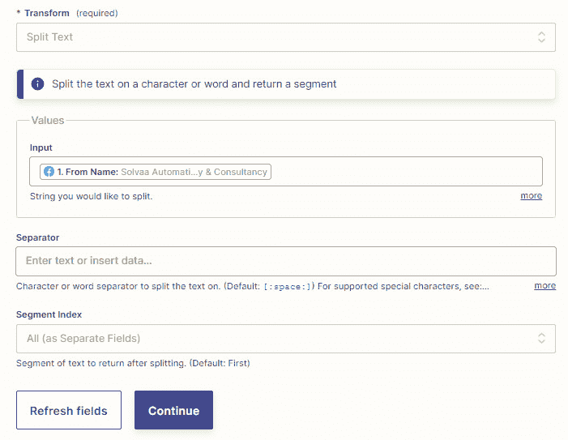

图 17.3 – 使用 Zapier 文本动作来分割由空格分隔的文本

点击**继续**按钮。然后，您可以使用**测试**部分测试此步骤，将文本拆分为单词字符串。来自*图 17**.3*的情景结果显示在以下截图中：

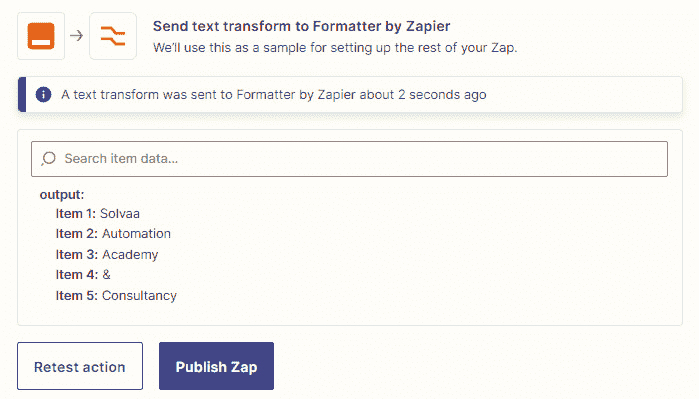

图 17.4 – 使用文本动作事件分割由空格分隔的文本时所更改值的示例

在您的**文本**操作步骤之后，继续添加一个或多个操作步骤。

现在，你应该更好地了解如何使用**分割文本**转换功能。

还有另一个类似的转换功能，称为**拆分文本为 AI 提示的片段（测试版）**，它允许您将更大量的数据修改为**片段**，以便在 AI 应用程序中使用。我们将在*第十九章* *AI* *和自动化*中讨论这个转换选项。

接下来，我们将讨论如何使用**截断**转换功能将文本截断至指定字符长度。

# 将文本截断至指定字符长度

有时，您可能希望将文本块的字符长度减少，以便用作摘要，或者可能对字符数有限制。这种情况的典型例子是在社交媒体上发布内容时，您需要固定的字符长度，比如将一个 Facebook 帖子（可能超过 60,000 个字符）转发到最大字符长度为 280 的 Twitter 上。您可以使用 Zapier 进行文本格式化`…`。

以下是一些您可以使用该转换选项的例子：

+   当您在 WordPress 上发布新博客帖子时，您可以将博客帖子的内容截断，制作适合在社交媒体上使用的摘要

+   当您发布新的 Facebook 帖子时，您可以将其截断为较短的字符长度，并将其转发到 Twitter 和 LinkedIn

让我们来看看如何设置一个带**截断**转换选项的操作步骤。

## 使用截断转换选项设置文本动作事件

一旦设置了触发步骤，就可以使用**文本**动作事件。

一旦您添加了一个动作步骤，可以通过选择**动作**步骤或单击**+**图标并选择**Formatter by Zapier**作为应用程序，选择**文本**作为动作事件，您可以编辑**动作**部分中的字段，如下所示：

+   **转换**：从下拉菜单中选择**截断**选项。这是一个必填字段，必须为 Zap 设置一个值才能运行。

+   **输入**：使用此字段输入您要截断的文本。您可以输入静态值、先前步骤中的动态值或两者的组合来指定**输入**值。虽然这不是一个必填字段，但如果没有值，格式化函数将不会返回结果。

+   **最大长度**：使用此数字字段输入您希望单词字符串截断到的最大字符数值。您可以输入静态值、先前步骤中的动态值或两者的组合来指定此值。这是一个必填字段，必须为 Zap 设置一个值才能运行。

+   `这是一个示例：今天的天气炎热而阳光明媚。`如果您想要截断`这是一个示例：`，您将输入`19`以跳过这些字符。您可以输入静态值、先前步骤中的动态值或两者的组合来指定此值。

+   `…`。您可以使用下拉菜单或输入静态值、先前步骤中的动态值或两者的组合来指定此值。

在下面的截图中显示了一个示例，我们要将一个长的 Facebook 帖子截断为 250 个字符并附加省略号：

图 17.5 – 使用 Formatter by Zapier Text 动作事件截断文本

单击**继续**按钮。然后，您可以使用**测试**部分来测试此步骤以截断单词字符串中的字符。*图 17**.5*中的情景结果如下截图所示：

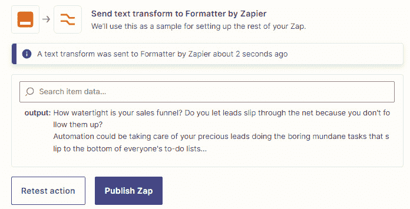

图 17.6 – 使用文本动作事件截断和附加省略号到文本字符串时值被改变的示例

在您的**文本**动作步骤之后添加一个或多个动作步骤。

您现在应该更好地了解如何使用**截断**转换函数了。接下来，让我们学习如何使用**删除 HTML 标签**转换函数来从文本块中删除 HTML。

# 删除 HTML 标签以留下纯文本

由于**超文本标记语言**（**HTML**）用于自定义数据在网页上的显示方式，例如网站、数字文档和电子邮件，有时你会想要仅查看纯文本，而不带任何编码。你可以使用 Zapier 的 Formatter **文本**操作事件，并使用**删除 HTML 标记**转换功能来实现这一目的，即摒弃所有 HTML 编码，只留下纯文本。

以下是一些可以使用此转换选项的示例：

+   当你想要提取电子邮件的正文，但数据只以 HTML 形式呈现时

+   当你在 WordPress 上发布新的博客文章，并希望在社交媒体上发布摘要前删除任何 HTML 时

让我们回顾如何设置一个带有**删除 HTML 标记**转换选项的操作步骤。

## 使用删除 HTML 标记转换选项设置文本操作事件

一旦设置了触发步骤，你可以使用**文本**操作事件。

一旦添加了一个操作步骤，不管是通过选择**操作**步骤或点击**+**图标，并选择 Zapier 作为应用程序，选择**文本**作为操作事件，你都可以编辑**操作**部分的字段，如下所示：

+   **转换**：从下拉菜单中选择**删除 HTML 标记**选项。这是一个必需字段，Zap 才能运行。

+   **输入**：在此字段中输入想要从中删除 HTML 标签的文本字符串。你可以输入静态值、前面步骤中的动态值，或两者的组合来指定**输入**值。尽管这不是一个必填字段，如果没有值，格式化函数将不返回结果。

以下是一个示例：

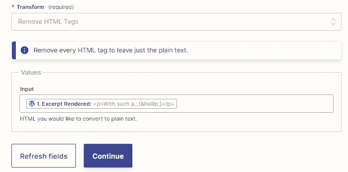

图 17.7 – 使用 Zapier 文本操作事件的 Formatter 来从一段文本中删除 HTML

点击**继续**按钮。然后，你可以使用**测试**部分来测试这一步骤，以从一段文本中删除 HTML。*图 17.7*中的情景结果显示在以下截屏中：

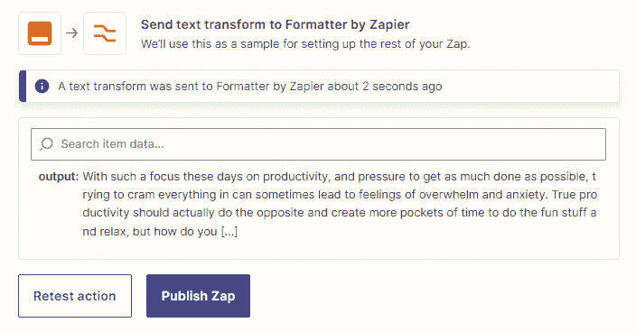

图 17.8 – 使用文本操作事件删除 HTML 后值修改的示例

在**文本**操作步骤之后添加一个或多个操作步骤。

你现在应该更好地理解如何使用**删除 HTML 标记**转换函数。接下来，让我们来学习如何分配默认值。

# 分配默认值

您可能会遇到某些情况，因某种原因未输入数据，因此留下了一个字段空白。在某些情况下，这种缺乏数据可能会在工作流程的后续步骤中造成问题。为了防止这种问题，您可能希望有条件地分配一个值，该值在特定字段中可能缺少数据时充当默认值。您可以使用 Formatter by Zapier **文本**操作事件与 **默认值**转换函数来实现此目的，当一个字段不包含数据时分配一个默认值。

以下是您可以使用此转换选项的几个示例情况：

+   当在 Zoho CRM 中创建新交易，但尚未分配所有者时，您可能希望自动将这些交易分配给特定用户，然后该用户可以将交易重新分配给团队成员

+   当在 Trello 中创建新卡片但尚未分配成员时，您可能希望自动将这些卡片分配给一个经理，然后由该经理将卡片分配给团队中的某人。

让我们回顾一下如何设置具有**默认值**转换选项的动作步骤。

## 使用**默认值**转换选项设置文本操作事件

设置触发步骤后，请使用**文本**操作事件。

一旦您通过选择**操作**步骤或单击**+**图标并选择 Formatter by Zapier 作为应用程序并选择**文本**作为操作事件添加了一个动作步骤，您可以编辑**操作**部分中的字段，如下所示：

+   **转换**：从下拉菜单中选择**默认值**选项。这是一个必填字段，必须为 Zap 提供一个值才能运行。

+   **输入**：使用此字段输入要截断的文本。您可以输入静态值、来自先前步骤的动态值或两者的组合来指定**输入**值。如果输入了一个行项值，则会返回一个行项字段。虽然这不是一个必填字段，但如果没有值，格式化函数将不会返回结果。

+   `[:空格:]`、`[:制表符:]`、`[:换行符:]`和`[:回车:]`特殊字符语法。这是一个必填字段，必须为 Zap 提供一个值才能运行。

下面的截图显示了一个示例，在该示例中，如果新的 Trello 卡片没有分配成员，那么在后续步骤中将会分配给高级员工，通过在**默认值**字段中使用他们的用户 ID：

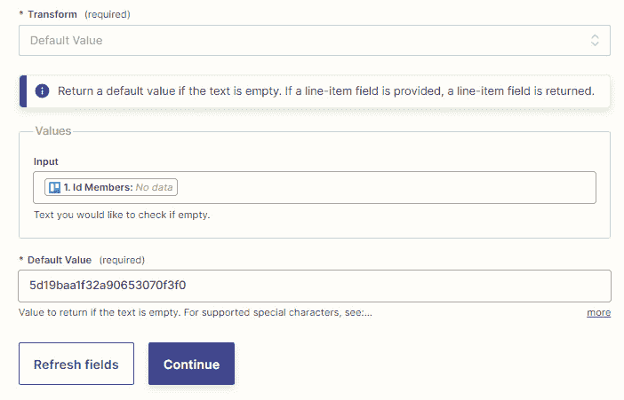

图 17.9 – 使用 Formatter by Zapier 文本操作事件来分配默认值

点击**继续**按钮。然后，您可以使用**测试**部分来测试此步骤，以便在文本字段为空时分配默认值。在*图 17.9*中的情景结果如下截图所示：

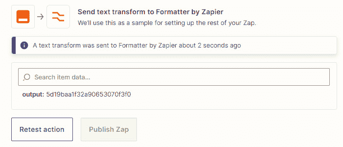

图 17.10 – 在文本操作事件中使用默认值时修改值的示例

在**文本**操作步骤之后添加一个或多个操作步骤。

你现在对如何使用**默认值**转换函数有了更好的理解。接下来，让我们介绍如何使用电子表格样式公式与**电子表格样式公式**转换函数转换文本。

# 使用电子表格样式公式转换文本

在*第十五章*，*格式化数字*中，我们探讨了如何使用 Zapier 的 Formatter **数字**操作事件和**电子表格样式公式**转换选项进行数字的复杂计算。您可以使用 Zapier 的 Formatter **文本**操作事件和**电子表格样式公式**转换选项来进行文本的相同处理。

一个例子是当你想要使用复杂的`IF`，`AND`或`OR`条件时，例如，如果两个文本值匹配，则输出一个结果，否则输出另一个。在这种情况下，你可以使用`IF("value1"="value2", "same", "different")`。

重要提示

使用此转换选项处理文本字符串时，必须在字符串周围使用引号，如前面的示例所示。

让我们回顾如何设置**电子表格样式公式**转换选项。

## 设置文本操作事件与电子表格样式公式转换选项

一旦设置了触发步骤，就可以使用**文本**操作事件。

添加了一个操作步骤后，通过选择**操作**步骤或单击**+**图标，并选择**Formatter by Zapier**作为应用程序和**文本**作为操作事件后，可以编辑**操作**部分的字段，如下所示：

+   **转换**：从下拉菜单中选择**电子表格样式公式**选项。这是一个必填字段，必须为 Zap 指定一个值才能运行。

+   **公式**：使用此字段指定要使用的文本值的公式。在**自定义**选项卡下添加公式和文本值的静态值，或者前面步骤映射的动态值。这是一个必填字段，必须为 Zap 指定一个值才能运行。

Zapier 已经创建了一个方便的参考文档，其中包含可以与 Zapier 的 Formatter 一起使用的各种公式，你可以在[`zapier.com/help/create/format/understand-spreadsheet-style-formula-functions`](https://zapier.com/help/create/format/understand-spreadsheet-style-formula-functions)上参考。

下面是一个示例屏幕截图：

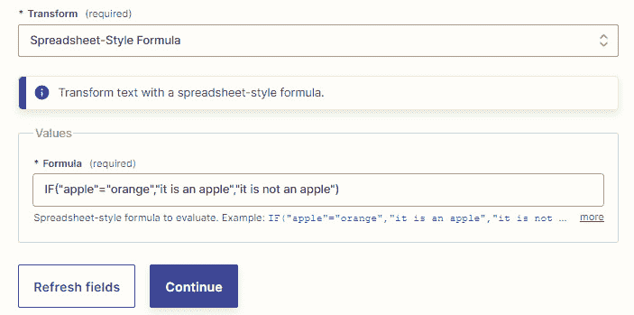

图 17.11 – 使用 Zapier Formatter 文本操作事件执行类似电子表格操作

点击**继续**按钮。然后可以使用**测试**部分测试此步骤以生成输出。*图 17**.11*中的情景结果显示在以下屏幕截图中：

图 17.12 – 使用文本操作事件执行类似电子表格操作时的输出值示例

在您的**文本**操作步骤之后添加一个或多个操作步骤。

现在，您应该对如何使用**电子表格样式公式**转换函数有了更好的理解。接下来，让我们讨论如何使用**提取**转换函数从文本块中提取电子邮件地址、数字、URL 和电话号码。

# 从文本块中提取数据

Formatter by Zapier 的**文本**操作的另一个出色功能是其从文本块中提取数据的能力。如果您有大量文本字符串并且希望返回电子邮件地址、数字、电话号码或 URL 的第一个表达值，则此功能特别有用。

例如，您的网络表单可能无法与 Zapier 集成，但您会收到一封带有提交详情的确认电子邮件。该表单要求提交人添加三个电子邮件地址，而您只想提取输入的第一个电子邮件地址。或者，您可能想要从此网络表单提交中检索电话号码、URL 或数字。您可以使用以下转换函数使用 Formatter by Zapier **文本**操作事件来实现此目的：

+   **提取电子邮件地址**

+   **提取数字**

+   **提取 URL**

+   **提取电话号码**

为了说明如何使用每个这些转换函数，我们将使用以下屏幕截图中突出显示的触发数据：

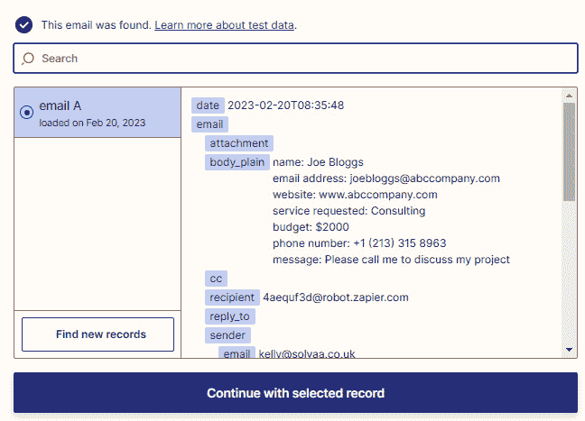

图 17.13 – 将用于说明从文本块中提取数据的触发数据

现在，让我们依次深入了解每个这些转换函数。

## 从文本块中提取电子邮件地址

当使用`@`符号和站点域名时，例如`solvaa.co.uk` – 例如，`joe-bloggs1@abccompany.com`。它不会识别具有空格的不连贯电子邮件地址字符串，例如`Joe Bloggs at abccompany` `dot com`。

让我们回顾一下如何设置带有**提取电子邮件地址**转换选项的操作步骤。

### 使用提取电子邮件地址转换选项设置文本操作事件

一旦设置了触发步骤，您就可以使用**文本**操作事件。

一旦您通过选择**操作**步骤或点击**+**图标并将**Formatter by Zapier**作为应用程序，**文本**作为操作事件添加了一个操作步骤，您可以编辑**操作**部分中的字段，如下所示：

+   **转换**：从下拉菜单中选择**提取电子邮件地址**选项。这是一个必填字段，Zap 必须运行。

+   **输入**：您可以使用此字段输入一些文本，以从文本块中提取第一个电子邮件地址。您可以输入静态值、先前步骤中的动态值或两者的组合来指定**输入**值。虽然这不是一个必需的字段，但如果没有值，格式化函数将不会返回结果。

示例如下截图所示：

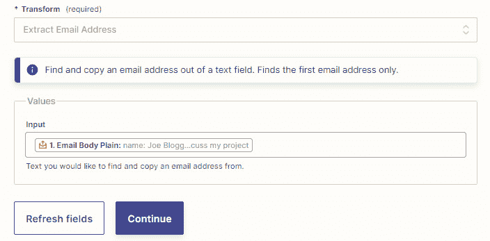

图 17.14 – 使用 Zapier 文本动作事件从文本块中提取电子邮件地址

单击**继续**按钮。您可以使用**测试**部分测试此步骤以从文本块中提取电子邮件地址。*图 17**.14*的情景结果如下截图所示：

图 17.15 – 使用文本动作事件从文本块中提取电子邮件地址时返回值的示例

在**文本**动作步骤之后添加一个或多个动作步骤。

接下来，让我们讨论如何使用**提取数字**转换函数从文本块中提取数字。

## 从文本块中提取数字

当使用`1,758,000.82`时，而`1-758-000-82`只会提取第一个破折号前的数字。换句话说，只会提取`1`。让我们回顾一下如何设置带有**提取数字**转换选项的动作步骤。

### 使用提取数字转换选项设置文本动作事件

一旦设置了触发步骤，您就可以使用**文本**动作事件。

添加一个动作步骤后，选择**动作**步骤或单击**+**图标，并将**Formatter by Zapier**作为应用程序，将**Text**作为动作事件，您可以编辑**动作**部分中的字段，如下所示：

+   **转换**：从下拉菜单中选择**提取数字**选项。这是一个必填字段，Zap 必须有一个值才能运行。

+   **输入**：使用此字段输入包含要提取的数字的文本块。您可以输入静态值、先前步骤中的动态值或两者的组合来指定**输入**值。虽然这不是一个必需的字段，但如果没有值，格式化函数将不会返回结果。

示例如下截图所示：

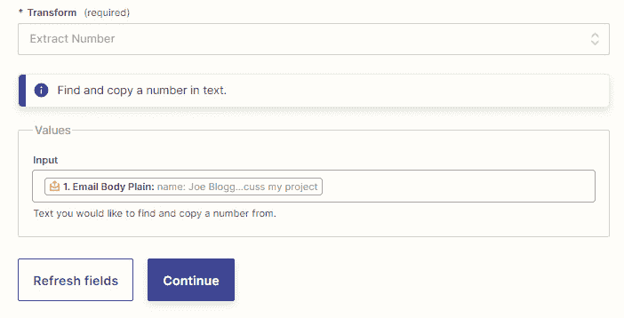

图 17.16 – 使用 Zapier 文本动作事件中的格式化器来从文本块中提取数字

点击**Continue**按钮。然后，你可以使用**Test**部分来测试从文本块中提取数字的步骤。*图 17**.16*中的场景结果如下截图所示：

图 17.17 – 使用 Text 操作事件从文本块中提取数字时返回值的示例

在你的**Text**操作步骤之后继续添加一个或多个动作步骤。

重要提示

从*图 17**.13*中显示的触发器数据中，如果电话号码首先显示，则电话号码返回的值将为`1`。

接下来，让我们探讨如何使用**Extract URL**转换功能从文本块中提取 URL。

## 从文本块中提取 URL

当使用`.com`、`.org`、`.co.uk`或`.com.au`时，你可以在此找到更多关于 TLD 的信息：[`en.wikipedia.org/wiki/Top-level_domain`](https://en.wikipedia.org/wiki/Top-level_domain)。该格式化程序还识别`https://`和`http://`前缀，以及子域、文件夹和查询参数。因此，接受的字符串示例可能是 [`solvaa.co.uk/?s=zapier`](https://solvaa.co.uk/?s=zapier)。它不会识别具有空格的不连续 URL 字符串，例如`solvaa` `dot com`。

现在，让我们回顾一下如何设置一个带有**Extract URL**转换选项的动作步骤。

### 设置 Text 操作事件并选择 Extract URL 转换选项

一旦设置了触发步骤，你可以使用**Text**操作事件。

一旦你选择了**Action**步骤或点击了**+**图标并选择了**Formatter by Zapier**作为应用程序，并选择了**Text**作为操作事件，你可以编辑**Action**部分中的字段，如下所示：

+   **转换**：从下拉菜单中选择**Extract URL**选项。这是一个必填字段，Zap 必须有值才能运行。

+   **输入**：使用此字段输入包含要提取的 URL 的文本块。你可以输入静态值、来自之前步骤的动态值或二者的组合以指定**输入**值。尽管这不是必填字段，但如果没有值，格式化程序函数将不会返回结果。

下面截图中显示了一个示例：

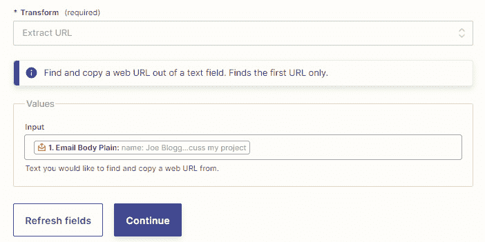

图 17.18 – 使用 Formatter by Zapier Text 操作事件从文本块中提取 URL 的示例

点击**Continue**按钮。然后，你可以使用**Action**部分来测试从文本块中提取 URL 的步骤。*图 17**.18*中的场景结果如下截图所示：

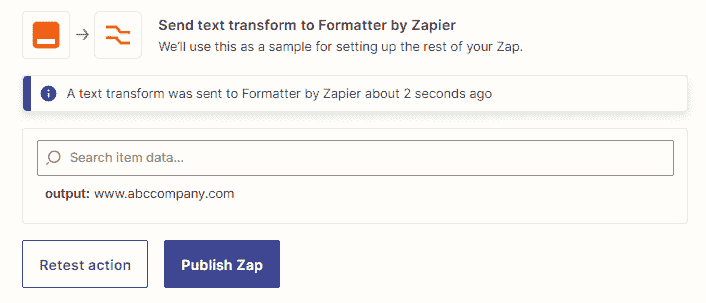

图 17.19 – 使用 Text 动作事件从文本块中提取 URL 时返回值的示例

在**Text**动作步骤之后，继续添加一个或多个动作步骤。

接下来，让我们看看如何使用**提取电话号码**转换功能从文本块中提取电话号码。

## 从文本块中提取电话号码

当使用`x`、`ext`或`extension`时。例如，一个可接受的电话号码字符串会是`+44 (``758) 592-0332`。

现在，让我们回顾如何使用**提取电话号码**转换选项设置动作步骤。

### 使用 Extract Phone Number 转换选项设置 Text 动作事件

一旦设置了触发步骤，就可以使用**Text**动作事件。

一旦您通过选择**动作**步骤或单击**+**图标并将**Formatter by Zapier**作为应用程序，**Text**作为动作事件添加了一个操作步骤，您可以编辑**动作**部分中的字段，如下所示：

+   **转换**：从下拉菜单中选择**提取电话号码**选项。这是一个必填字段，必须为 Zap 提供一个值。

+   **输入**：使用此字段输入包含要提取的电话号码的文本块。您可以输入一个静态值，一个来自以前步骤的动态值，或两者的组合来指定**输入**值。虽然这不是一个必填字段，但如果没有值，格式化功能将不返回结果。

+   **电话号码格式**：使用此下拉字段选择要用于搜索的电话号码格式。选项包括**北美号码计划 (NANP) 例如 (123) 456-7890**，**国际 例如 (12) 34-56-78-90**，**通用 1 (包括 NANP 和一些国际)** 和 **通用 2 (包括 NANP 和一些国际)**。在搜索中使用的默认设置是**通用 1 (包括 NANP 和一些国际)**，它将识别大多数 NANP 和国际号码。如果这被证明是不可靠的，请选择其他选项进行更具体的搜索。

下面的截图显示了一个示例：

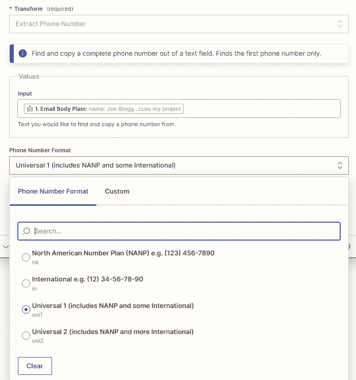

图 17.20 – 使用 Formatter by Zapier 的 Text 动作事件从文本块中提取数字

单击**继续**按钮。然后可以使用**测试**部分来测试从文本块中提取通用 1 格式的电话号码的步骤。在*图 17**.20*的方案结果显示在以下截图中：

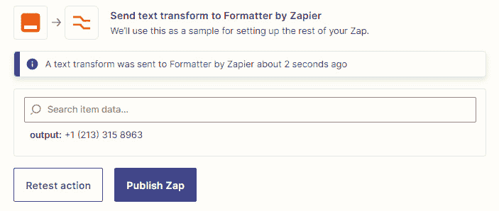

图 17.21 – 使用 Text 动作事件从文本块中提取数字时返回值的示例

在**Text**动作步骤之后，继续添加一个或多个动作步骤。

现在，您应该更好地了解了如何使用 **提取电子邮件地址**、**提取数字**、**提取 URL** 和 **提取电话号码** 转换函数从文本块中提取数据。接下来，让我们来看一下 Zapier 提供的高级文本格式化功能。

# 高级文本格式化功能

正如您迄今为止所学到的，Zapier 内置应用程序的格式化器允许您以许多多样化的方式操作文本，而无需任何编码知识或任何技术背景。然而，有一些转换函数允许您使用编程语言来操作文本。由于这些是高级主题，我们将只对其功能进行简要概述，而不会过多详细说明。

以下转换选项可用于使用编程语言操作文本：

+   **提取模式**：当您需要从具有更高特异性的字段中提取部分数据时，您可以使用此转换选项。这使您可以使用 Python **正则表达式** (**regexes**)。您可以在这里了解更多关于 Python 正则表达式的信息：[`developers.google.com/edu/python/regular-expressions`](https://developers.google.com/edu/python/regular-expressions)。

+   **将 HTML 转换为 Markdown**：当您想要将 **HTML** 转换为 **Markdown**，一种用于向纯文本添加格式化元素的标记语言时，您可以使用此转换选项。您可以在这里了解更多关于 Markdown 的信息：[`en.wikipedia.org/wiki/Markdown`](https://en.wikipedia.org/wiki/Markdown)。

+   **将 Markdown 转换为 HTML**：您可以使用此转换选项来执行前述操作的反向操作，将 Markdown 转换为 HTML。

+   **转换为 ASCII**：当您想要将纯文本转换为 **美国信息交换标准代码** (**ASCII**) 时，您可以使用此转换选项。您可以在这里了解更多关于 ASCII 的信息：[`en.wikipedia.org/wiki/ASCII`](https://en.wikipedia.org/wiki/ASCII)。

+   **URL 编码**：当您想要对非批准字符（如空格）进行编码以获得 **统一资源标识符** (**URI**) 批准字符时，您可以使用此转换选项。您可以在这里了解更多关于 **URL 编码** 的信息：[`en.wikipedia.org/wiki/URL_encoding`](https://en.wikipedia.org/wiki/URL_encoding)。

+   **URL 解码**：您可以使用此转换选项来执行前述操作的反向操作，并将 URI 批准的字符解码为非批准字符。

现在，您应该更好地了解了如何使用 Zapier 内置应用程序的各种高级文本格式化功能。

# 摘要

在本章中，我们继续关注多功能的 Formatter by Zapier 内置应用和可用于格式化文本的广泛功能。首先，我们探讨了如何创建超级英雄名字，将文本分割成段落，截断文本，移除 HTML，并使用默认值。然后，我们介绍了如何从文本中提取数据 - 具体来说，如何提取 URL、电话号码、数字和电子邮件地址。最后，我们简要讨论了更高级的功能，包括提取模式、将 Markdown 转换为 HTML 及其反向操作、将文本转换为 ASCII，以及编码或解码 URL。

在下一章中，您将学习如何在 Formatter 内置应用中使用 **Utilities** 函数。我们将介绍条目的创建和定制，将文本转换为条目及其反向操作，使用查找表和选项列表，并导入 CSV 文件。

# 问题

1.  如果你想将一个人的全名分成名和姓两个值，你可以使用 Formatter by Zapier 内置应用的哪个转换选项？

1.  你何时会想要使用 Formatter by Zapier 的 **Text** 操作事件的 **Truncate** 转换选项？
