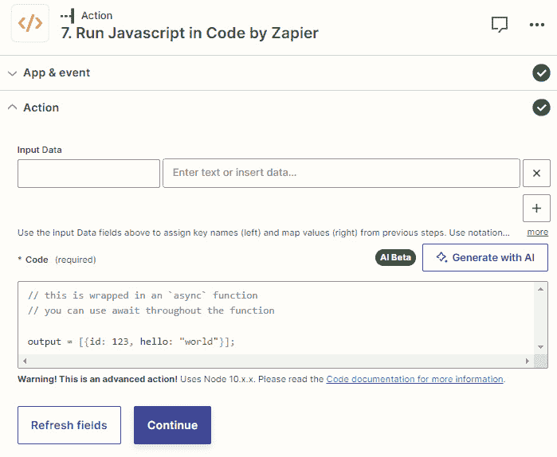

# 第十九章：人工智能与自动化

由于许多软件用户正在采用更好的方式使他们的日常工作更加高效，通过使用 **生成式人工智能** (**AI**)，将 **AI** 功能集成到他们的软件应用程序中已成为许多 SaaS 公司的首要任务。 Zapier 也不例外。随着 ChatGPT 向更广泛的市场发布，并且可以集成和整合 AI 功能，Zapier 也在释放许多已整合 AI 功能的功能，并已将其确定为近期的主要业务目标。一些 AI SaaS 公司也正在利用这个机会将他们的应用程序与 Zapier 集成，使 AI 和自动化的结合成为提高生产力的助推器。

在本章中，我们将探讨如何通过融合人工智能和自动化来提高效率。我们将探索一些 Zapier 内置的人工智能功能以及与 Zapier 的人工智能应用集成。首先，我们将介绍如何提前获取已整合人工智能功能的新 Zapier 功能的访问权限，然后我们将深入了解仪表板和 ZAP 编辑器中使用的 **创建 ZAP** 功能的概述。然后，我们将探索 **Zapier Chrome 扩展** 和 **ChatGPT 插件** 中的 NLA 和人工智能操作功能。之后，我们将介绍如何使用 **Zapier 接口** 创建 **人工智能聊天机器人**。接着，我们将介绍一些新的内置应用和功能，例如 **由 Zapier 提供支持的人工智能 Formatter 步骤**、**由 Zapier 提供支持的人工智能代码步骤**、**由 Zapier 提供支持的故障排除**、**Zapier 内置应用的人工智能** 等等。最后，我们将探索 Zapier 与 **ChatGPT** 和 **OpenAI** 的集成，以及 GPT 人工智能提示的基础知识。

注意

由于所有这些功能仍在进行 beta 测试，并且它们的功能可能会发生变化，因此我们只会简要概述它们的功能，而不会过多详细介绍。但是，我们将为您提供一些用例和进一步的参考资料。

我们将在本章中涵盖以下关键主题：

+   获取新 AI 功能的早期访问权限

+   创建 ZAP (beta) - 使用人工智能起草您的 ZAP

+   使用 Zapier Chrome 扩展和 ChatGPT 插件 (beta) 运行 ZAP AI 操作 (beta)

+   使用 Zapier 接口 (beta) 构建 AI 聊天机器人 (beta)

+   在 beta 版中的其他 AI 功能内置应用和功能

+   Zapier 与 OpenAI 和 ChatGPT 的集成

+   GPT 人工智能提示指南

在本章结束时，您将了解到自第一版本书出版以来，Zapier 发布的 AI 功能知识。

# 技术要求

要充分利用本章内容，你需要有一个 Zapier 账户。Zapier 的入门版计划将为你提供必要的功能，以有效地构建和实施多步骤的 Zaps，并使用本章讨论的功能。你必须加入 Zapier 的早期访问计划才能获得 beta 版功能。要使用 Zapier ChatGPT 插件，你必须订阅 ChatGPT Plus 账户，要使用 Zapier 的 OpenAI 集成，你必须订阅付费账户。

# 新人工智能功能的早期访问

Zapier 团队正在努力开发新的人工智能功能，这将使用户受益。这些功能在**alpha**阶段发布给一些特定的测试用户，然后在进行足够的测试后进入**beta**阶段，以分阶段的方式发布给更大范围的用户群体。换句话说，即使某个功能可能在 beta 版中发布，你也可能无法使用该功能。但是你可以加入 Zapier 的**早期访问计划**，以便被纳入早期阶段的用户测试组。你可以在[`zapier.com/early-access`](https://zapier.com/early-access)完成注册。你也可以注册通知，特别是有关即将发布的新人工智能功能的通知，网址是[`zapier.com/ai`](https://zapier.com/ai)。

你可以阅读 Zapier 首席执行官 Wade Foster 在这篇文章中关于正在开发的一些人工智能功能的说明：[`zapier.com/blog/ai-open-letter/`](https://zapier.com/blog/ai-open-letter/)，其中一些我们将在本章中介绍。

重要提示

要使用许多（但不是全部）Zapier 内置的人工智能功能，你必须同意 Zapier 的 AI 补充条款。你可以在这里找到这些条款：[`zapier.com/legal/ai-supplementary-terms`](https://zapier.com/legal/ai-supplementary-terms)。

你可以在这篇 McKinsey 文章中阅读有关生成式人工智能的概述：[`www.mckinsey.com/featured-insights/mckinsey-explainers/what-is-generative-ai`](https://www.mckinsey.com/featured-insights/mckinsey-explainers/what-is-generative-ai)。

想要获取关于如何使用自动化和人工智能的一些灵感，可以观看 Zapier 的网络研讨会*Zapathon: How to put AI to* *work*：[`zapier.com/resources/webinar/zapathon-put-ai-to-work`](https://zapier.com/resources/webinar/zapathon-put-ai-to-work)。

接下来，让我们简要介绍一下**创建 Zap（****beta)**功能的概况。

# 创建 Zap（beta）– 使用人工智能起草你的 Zaps

我们简要介绍了`当我在电子邮件中收到邮件时，在 ClickUp 中为我创建一个任务，使用 ChatGPT 起草一个响应，并在回复中发送此响应`。响应如下截图所示：

图 19.1 – 创建 Zap（beta）提示和响应的示例

您可以点击**显示更多示例**以展开**示例**部分，使用**分享**按钮分享 Zap，使用**试用**按钮在 Zap 编辑器中开始自定义它，或者通过点击**是**或**否**按钮指定是否有帮助。提供反馈对于训练 AI 以更好地为您工作至关重要。

下面的 Zapier 资源提供了关于如何最佳使用此功能的一些附加上下文和提示示例：[`help.zapier.com/hc/en-us/articles/15703650952077/`](https://help.zapier.com/hc/en-us/articles/15703650952077/).

现在，您应该更好地了解了何时以及如何使用“创建一个 Zap（测试版）”功能。

现在，让我们探讨如何使用人工智能运行 Zap 操作。

# 使用 Zapier Chrome 扩展和 ChatGPT 插件（测试版）运行 Zap AI 操作（测试版）

Zapier 已经将基于 AI 或与 AI 相关的功能集成到了一些 Zapier 内置应用程序中，更多的开发正在进行中。例如，Zapier Chrome 扩展内置应用程序现在具有**自然语言操作（NLA）**和**AI 操作（测试版）**功能，Formatter by Zapier 内置应用程序现在具有一个名为**将文本拆分为 AI 提示块**的转换函数。这些功能中的许多功能目前处于测试版阶段，可能会发生变化。在我们探索这些功能之前，让我们更详细地介绍一下 NLA 和 AI 操作。

## NLA 和 AI 操作

通过 Zapier 的**NLA API**，您可以使用 Zapier 平台来为自己的产品提供动力，它针对使用自然语言的产品进行了优化，例如聊天机器人等。您可以在文章 [`zapier.com/l/natural-language-actions`](https://zapier.com/l/natural-language-actions) 中了解有关 NLA API 和用例的更多信息。NLA API 允许您创建**AI 操作**，并与 Zapier 的 6,000+ 应用集成和 30,000+ 操作事件一起使用。您可以在文章 [`help.zapier.com/hc/en-us/articles/17013994198925-Zapier-AI-actions-in-other-apps`](https://help.zapier.com/hc/en-us/articles/17013994198925-Zapier-AI-actions-in-other-apps) 中了解有关 AI 操作的更多信息。

Zapier Chrome 扩展和 Zapier ChatGPT 插件（测试版）是两个引入了 NLA 功能和 AI 操作的示例。我们将在接下来的两节中介绍这些功能。

下面的 Zapier 帮助文章提供了有关创建、使用和管理 AI 操作的更多详细信息：

+   *在 AI 应用程序中创建 AI 操作*：[`help.zapier.com/hc/en-us/articles/17014153949709`](https://help.zapier.com/hc/en-us/articles/17014153949709

)

+   *在 AI 应用程序中使用 AI 操作*：[`help.zapier.com/hc/en-us/articles/17014427470477`](https://help.zapier.com/hc/en-us/articles/17014427470477

)

+   *管理您的 AI 操作*：[`help.zapier.com/hc/en-us/articles/17014677921037`](https://help.zapier.com/hc/en-us/articles/17014677921037

)

+   *决定 AI 是否应该猜测 AI* *动作*中特定字段的值：[`help.zapier.com/hc/en-us/articles/17014876778381`](https://help.zapier.com/hc/en-us/articles/17014876778381)

)

让我们从 Zapier Chrome 扩展 NLA 动作（测试版）开始。

## Zapier Chrome 扩展 NLA 动作（测试版）

NLA API 和 AI 动作的使用是 Zapier Chrome 扩展中新功能的基础，因此您可以通过简单的提示在 Zapier Chrome 扩展中直接运行由 AI 提供动力的动作。例如，您可以使用此功能起草回复电子邮件。

### 使用 Zapier Chrome 扩展进行 AI 动作

要开始，请按照*第十章*，*Zapier 内置其他有用应用程序*，中的说明来设置 Zapier Chrome 扩展内置应用程序，以便在使用 NLA 功能之前进行。一旦设置好了这一步，让我们来探索下一步：

1.  在您的浏览器中选择**Zapier Chrome 扩展**图标，然后点击**动作（测试版）**选项卡，然后点击**设置动作**按钮。

1.  在弹出窗口中，点击**允许**按钮以授予 Zapier 对您账户中 AI 动作的访问权限。

1.  在新打开的浏览器窗口中，点击**添加新动作**。您也可以通过点击**管理** **访问权限**链接来管理您 Zapier 应用程序的 NLA 访问权限。

1.  通过映射字段设置你的 Zapier Chrome 扩展动作。例如，我们可能想在 Slack 中给自己发送一条随机的励志引语的直接消息。该示例的操作设置如下截图所示：

图 19.2 – 设置 Zapier Chrome 扩展 NLA 动作（测试版）

1.  通过点击**启用动作**按钮来启用您的动作。

1.  导航到您的浏览器窗口，点击**Zapier Chrome 扩展**图标，从下拉菜单中选择您的动作，在**说明**字段中添加您的说明，然后选择**预览**按钮以显示预览或**运行**以运行该动作。如下截图所示：

图 19.3 – 创建一个 Zapier Chrome 扩展 NLA 运行

您还可以通过选择**使用字段提示（****高级）**复选框来激活字段提示。

Slack 中的结果如下所示：

图 19.4 – 使用 Zapier Chrome 扩展运行动作的 NLA 提示的结果

现在，让我们回顾一下如何使用 ChatGPT 插件（测试版）功能直接从 ChatGPT 聊天机器人界面连接并运行 Zapier 动作。

## Zapier ChatGPT 插件（测试版）– 从 ChatGPT 运行 Zap 动作

**OpenAI ChatGPT 聊天机器人**的开发和发布鼓励用户利用 AI 来执行多种通常需要数小时甚至需要特定技能（如文案撰写）的任务。ChatGPT 正在帮助用户执行如下任务的一些示例：

+   撰写冷启动邮件

+   起草电子邮件回复

+   撰写博客文章和时事通讯

+   研究主题并创建演示文稿

您现在可以通过将 Zapier 与 ChatGPT 连接，并使用 Zapier ChatGPT 插件（测试版）来运行 AI 动作来提高您新发现的 AI 增强型生产力，从而执行各种任务，无需从 ChatGPT 聊天机器人界面复制和粘贴文本。例如，您可以要求 ChatGPT 执行以下任务，然后执行相关的 Zapier AI 动作：

+   给特定人发送电子邮件的回复，并在 Gmail 中创建一封草稿电子邮件回复

+   撰写博客文章，并在 WordPress 中创建新帖子

+   起草演示文稿，并从模板中创建谷歌幻灯片演示文稿

该文章 [`zapier.com/blog/announcing-zapier-chatgpt-plugin/`](https://zapier.com/blog/announcing-zapier-chatgpt-plugin/) 展示了 Zapier ChatGPT 插件（测试版）的其他几个用例。

重要提示

您必须订阅 ChatGPT Plus 帐户才能使用插件。

### 使用 Zapier ChatGPT 插件（测试版）

在您使用 Zapier ChatGPT 插件（测试版）之前，您必须通过在 ChatGPT 中安装 Zapier 插件将您的 ChatGPT 帐户连接到 Zapier 帐户，然后设置您的 ChatGPT AI 动作。您可以在 [`zapier.com/blog/use-the-zapier-chatgpt-plugin/`](https://zapier.com/blog/use-the-zapier-chatgpt-plugin/) 和 [`help.zapier.com/hc/en-us/articles/14058263394573`](https://help.zapier.com/hc/en-us/articles/14058263394573) 找到详细的说明。

为了说明 Zapier ChatGPT 插件（测试版）的工作原理，我们将以提示 ChatGPT 给特定人发送电子邮件的回复为例，然后演示相关的 Zapier ChatGPT 插件（测试版）AI 动作在 Gmail 中创建一封草稿电子邮件回复。

您可以通过转到 [`nla.zapier.com/openai/actions/`](https://nla.zapier.com/openai/actions/) 来设置您的 ChatGPT 插件 AI 动作，与*Zapier Chrome 扩展 NLA 动作（测试版）*部分描述的类似。以下截图展示了如何设置 ChatGPT 动作：

图 19.5 – 设置 ChatGPT 动作（测试版）

以下截图展示了 ChatGPT 中的`请为 Joe Bloggs（joe@sabcompany.com）起草一封电子邮件，并让他们知道，周五到期的报告今天已经准备好审核。`提示和结果：

图 19.6 – 使用 Zapier ChatGPT 插件（测试版）

点击**审核和确认草稿**链接会打开另一个浏览器窗口，您可以选择通过点击**编辑**按钮更改 AI 操作，或者通过点击**运行**按钮处理运行请求。如下截图所示：

图 19.7 – 查看 ChatGPT 插件（beta 版）操作结果

运行该操作的结果如下截图所示：

图 19.8 – ChatGPT 插件（beta 版）在 Gmail 中运行的结果

现在，您应该对何时以及如何使用 Zapier ChatGPT 插件（beta 版）有了更好的理解。

现在，让我们来回顾如何使用 Zapier 接口构建 AI 聊天机器人。

# 使用 Zapier 接口（beta 版）构建 AI 聊天机器人（beta 版）

在*第十三章*中的 *新发布的应用程序和功能* 中，我们探讨了 Zapier 接口工具的激动人心的功能，使您能够构建具有表单和看板等可视界面的自定义页面，然后还可以将其链接到带有 Zapier 表的数据收集表。现在，借助 AI 的魔力，您可以使用 Zapier 接口创建**AI 动力聊天机器人**。您还可以创建显示多个聊天机器人的着陆页，甚至在您使用付费接口计划时将您的聊天机器人嵌入到您的网站上。您可以在[`zapier.com/ai/chatbot`](https://zapier.com/ai/chatbot)了解更多关于 Zapier 的 AI 聊天机器人（beta 版）功能的信息。

以下是您可以创建的一些聊天机器人示例：

+   **公关**：您可以创建一个聊天机器人，帮助您生成新闻稿。在[`external-communications.zapier.app/press-release`](https://external-communications.zapier.app/press-release)查看一个由 Zapier 构建的示例。

+   **营销**：您可以创建一个聊天机器人，帮助用户将企业行话翻译成通俗易懂的英语。

+   **反馈**：您可以创建一个聊天机器人，帮助您制定可以用于评估的积极反馈。

让我们探索如何开始构建 AI 聊天机器人。

## 创建一个 AI 聊天机器人（beta 版）

要开始使用，您只需创建一个带有聊天机器人组件的 Zapier 接口网页，该组件使用 OpenAI 的 GPT。请参阅*第十三章*中的 *新发布的应用程序和功能* 部分，了解如何启动您的 Zapier 接口之旅。有关如何创建您的 AI 动力聊天机器人的详细说明，请参阅此 Zapier 文章：[`zapier.com/blog/create-custom-ai-chatbots-with-interfaces/`](https://zapier.com/blog/create-custom-ai-chatbots-with-interfaces/)。

让我们看一个示例，您创建了一个评估品牌风险的聊天机器人，例如 Zapier 在 [`external-communications.zapier.app/brand-risk-assessment`](https://external-communications.zapier.app/brand-risk-assessment) 上创建的示例。使用提示诸如`一名员工公开发表了对客户的损害性言论`会产生如下屏幕截图中显示的响应：

图 19.9 – 一个品牌风险评估 AI 辅助聊天机器人的示例

您甚至可以询问聊天机器人您可以做些什么来纠正情况，响应将显示在屏幕截图中：

图 19.10 – 品牌风险评估 AI 辅助聊天机器人的一个跟进回复示例

请记住，您如何训练聊天机器人对其产生的响应至关重要。您可以阅读有关如何自定义用户交互体验的更多信息，请访问[`help.zapier.com/hc/en-us/articles/15931071482509-Create-chatbots-in-Zapier-Interfaces`](https://help.zapier.com/hc/en-us/articles/15931071482509-Create-chatbots-in-Zapier-Interfaces)，以及如何训练您的聊天机器人，请访问[`help.zapier.com/hc/en-us/articles/17211863510541-Use-a-data-source-with-your-Interfaces-AI-Chatbot`](https://help.zapier.com/hc/en-us/articles/17211863510541-Use-a-data-source-with-your-Interfaces-AI-Chatbot)。

重要提示

Zapier Interfaces 的聊天机器人组件默认使用 GPT-3.5-turbo。您可以通过添加来自您的 OpenAI 帐户的自己的 API 密钥来使用 GPT-4 和其他模型。使用默认设置是免费的；然而，请注意，要使用 OpenAI API，您将需要订阅付费服务，并根据使用情况对聊天机器人的使用进行收费。

现在，您应该更好地了解了何时以及如何使用 Zapier Interfaces 构建 AI 聊天机器人。

现在，让我们探索一些内置了 AI 功能的其他 Zapier 内置应用和功能。

# 其他 AI 动力的 Zapier 内置应用和功能

到目前为止，在本章中，我们已经介绍了 Zapier 中的几个 AI 动力功能，但还有许多功能已经发布为测试版，并有几个正在开发中。这些功能中的许多已经被整合到现有的 Zapier 内置应用和模块中。

在本节中，我们将探讨一些这些功能，并在适当的情况下提供用例和进一步的参考资料。我们将涵盖以下功能：

+   Zapier 的 Formatter – 将文本分割为 AI 提示

+   AI 动力的 Formatter by Zapier 步骤

+   AI 动力的 Code by Zapier 步骤

+   AI 动力的笔记

+   AI 动力的故障排除

+   AI 动力的应用扩展

+   Zapier 的 AI

首先，让我们来看看 Formatter by Zapier 内置应用**将文本分割为 AI 提示的块（测试版）**转换选项，这不是一个 AI 动力功能，而是一个 AI 助手。

## Formatter by Zapier – Split Text into Chunks for AI Prompt (beta) 转换选项

当使用 Zapier 的 AI 应用时，一个常见的问题是因为字符数量过高而达到 token 限制。这在使用 **Large Language Models**（**LLMs**）时很常见，例如，从您想在 AI 相关的 Zaps 中使用的网页中抓取数据。例如，使用 OpenAI，一个 token 可能是一个英文单词的四个字符。有关 OpenAI 如何计算 token 的更多细节，请参阅 [`help.openai.com/en/articles/4936856-what-are-tokens-and-how-to-count-them`](https://help.openai.com/en/articles/4936856-what-are-tokens-and-how-to-count-them)。通过 Formatter by Zapier Split Text into Chunks for AI Prompt (beta) 转换选项，您可以将大量文本数据进行修改，以生成较小的片段用于您的 AI 提示，从而降低遇到 token 限制错误的可能性。

重要说明

Formatter by Zapier Split Text into Chunks for AI Prompt 转换选项仅支持英文文本。

您可以在*第十七章*中了解如何设置 Formatter by Zapier Text 动作事件，*Zapier 中的文本格式化功能–第二部分*。一个好的开始是审查 **Split** 转换选项。

在设置动作步骤时，将您的大型数据集映射到 **Input** 字段，并在 **Prompt** 字段中添加您预期的提示文本，以帮助 Zapier 计算 chunk 大小。您还应指定在 **Output Style** 字段中是否应将结果生成为行项目或单独字段，与 **Split** 转换选项一样。

请记住，如果使用 GPT-3.5/ChatGPT 模型，建议将 chunk 大小指定为`256`，而 chunk 大小为`4096` tokens，这两个值分别是这些字段的默认值。以下是一个示例屏幕截图：

图 19.11 – 设置 Split Text into Chunks for AI Prompt 转换选项

有一篇有用的帮助文章详细解释了如何使用此转换选项，并提供了一个带有 Zap 模板的示例来说明，您可以在这里找到：[`help.zapier.com/hc/en-us/articles/15406374106765-Modify-large-data-for-your-AI-prompts`](https://help.zapier.com/hc/en-us/articles/15406374106765-Modify-large-data-for-your-AI-prompts)。建议您结合使用 Looping by Zapier 动作事件和 Formatter by Zapier Split Text into Chunks for AI Prompt 转换选项来对您的 chunk 进行多次迭代。您可以在*第十三章*中阅读有关 Looping by Zapier 的更多信息，*新发布的应用和功能*。

接下来，让我们介绍一下基于 AI 的 Formatter by Zapier 步骤。

## 基于 AI 的 Formatter by Zapier 步骤（测试版功能）

我们在 *第 14* 至 *18* 章广泛讨论了 Formatter by Zapier 内置应用程序的功能。现在，AI 功能的魔力允许您使用简单的语言提示要求 Zapier 在您的 Zap 步骤中格式化数据，然后将创建相应的 Formatter by Zapier 步骤以获取相关的转换选项。由于您不必手动创建步骤，这在构建 Zap 过程中节省了时间。

要从操作步骤中使用 **AI 动力的 Formatter** 功能，只需将光标悬停在字段的右侧即可显示 **格式化数据** 按钮。如下截图所示：

图 19.12 – 在操作步骤中显示的格式化数据按钮

点击 **格式化数据** 按钮后，在弹出的 **格式化数据（Beta 版）** 对话框中，使用 **描述如何编辑此数据的格式** 字段添加一个描述性提示，指定您希望执行的格式化操作，然后点击 **创建步骤** 按钮。如下截图所示：

图 19.13 – 使用格式化数据（beta 版）和提示的概览

在原始操作步骤之前将创建一个定制的 Formatter by Zapier 步骤，并将 `输出` 值映射到原始操作步骤中的字段。结果如下截图所示：

图 19.14 – 使用格式化数据（beta 版）和提示的结果

提示

在 Zapier 术语中，提示的准确度越高，结果的 Formatter by Zapier 步骤就越相关。例如，使用提示 `将此文本缩短为 200 个字符，并加上省略号` 可能会产生一个 Formatter by Zapier 步骤，它不会填充 `将文本截断为最大长度为 200 个字符，并附加省略号`。

以下 Zapier 帮助文章提供了关于如何使用此功能的进一步说明：

+   [`help.zapier.com/hc/zh-cn/articles/16727828367885-使用 AI Beta 快速格式化您的数据`](https://help.zapier.com/hc/zh-cn/articles/16727828367885-使用 AI Beta 快速格式化您的数据)

+   [`help.zapier.com/hc/zh-cn/articles/16720031282189-使用带 AI 的 Formatter 自动格式化数据`](https://help.zapier.com/hc/zh-cn/articles/16720031282189-使用带 AI 的 Formatter 自动格式化数据)

接下来，让我们来探索由 Zapier 驱动的 AI 代码步骤。

## 由 Zapier 驱动的 AI 代码步骤（beta 功能）

在 *Code by Zapier – 使用 JavaScript 或 Python 代码在您的 Zaps 中* 部分中的 *第十一章*，*Zapier 的高级内置应用程序*，我们探讨了如何使用 Code by Zapier。由于不是每个人都懂得如何使用 JavaScript 或 Python 编写代码，所以在 *使用 ChatGPT 生成 JavaScript 或 Python 代码* 部分中，我们介绍了如何使用 ChatGPT 生成代码以在 Code by Zapier 步骤中使用。现在，借助 AI 动力功能，您可以在 Code by Zapier 步骤中使用纯语言提示编写代码。再次强调，这是一个节省时间的工具，可帮助您在构建 Zap 过程中使用。  

要在 Code by Zapier 动作步骤中使用**AI 动力生成的代码**功能，只需单击**生成代码**按钮。如下截图所示：

图 19.15 – Code by Zapier 步骤中的使用 AI 按钮的概述

在 `我想要检索有关 Pipedrive 中联系人的详细信息，例如与联系人关联的所有电话号码。我还想要操纵这些电话号码，从中提取区号，并将这些结果显示为两个单独的值。Pipedrive API 允许请求关于人员信息的信息` [`developers.pipedrive.com/docs/api/v1/#!/Persons/getPerson`](https://developers.pipedrive.com/docs/api/v1/#!/Persons/getPerson) `。请生成 JavaScript 代码执行此操作。` 如下截图所示：

图 19.16 – 使用 AI 生成代码（AI Beta）的弹出窗口，带有提示

代码将在弹出窗口中生成，您可以查看后单击**添加代码**按钮将代码添加到动作步骤中的**代码**字段中。代码将被添加，并且如果您在提示中指定了足够的信息，则**输入数据**字段将被起草和映射。如下截图所示：

图 19.17 – 使用 AI 功能生成代码的结果概述，带有提示

您可以在 Zapier 帮助文章中了解有关使用此功能的更多信息 [`help.zapier.com/hc/en-us/articles/15666688064013-Generate-a-Code-step-using-AI-Beta-`](https://help.zapier.com/hc/en-us/articles/15666688064013-Generate-a-Code-step-using-AI-Beta-)。

接下来，让我们探索 AI 动力笔记。

## AI 动力笔记（Beta 功能）

在*第三章*的*在 Zap 编辑器中创建你的第一个 Zap*部分中，我们简要介绍了使用 **Notes** 功能为 Zap 步骤添加注释以及创建整体 Zap 描述的方法。现在，你可以利用 AI 功能在创建 Zap 注释时节省时间，根据 Zap 中的步骤生成你的 Zap 注释。

要使用**AI 动力注释功能**，只需在任何步骤内部单击*评论框*图标以**添加注释**。您还可以单击经典编辑器中右侧面板菜单或视觉编辑器中左侧面板上的**注释**菜单选项。这将展开以显示**Zap 注释 (Beta)**部分。单击**使用 AI 生成**按钮将为您的 Zap 创建一个草稿描述，您可以手动编辑，或者单击**重新生成 AI**按钮尝试另一个版本。以下是一个示例截图：

图 19.18 – 使用 AI 功能生成 Zap 注释

重要提示

AI 动力注释功能目前仅适用于整体 Zap 描述，而不适用于步骤注释。这些需要手动添加。

下面的 Zapier 帮助文章提供了如何使用此功能的更多上下文信息：[`help.zapier.com/hc/en-us/articles/16791272000525`](https://help.zapier.com/hc/en-us/articles/16791272000525)。

接下来，让我们探索 AI 动力的故障排除。

## AI 动力故障排除（测试版功能）

在*第五章*中，我们探讨了**Zap 历史记录**模块以及在 Zap 运行中发生错误时如何解决问题。当你的 Zap 步骤中的一个出现**停止错误**状态时，新的 AI 动力**故障排除 (beta)**功能使用 AI 建议错误的可能原因，并描述解决方案。该功能使用 Zapier 帮助中心搜索可能与错误相关的信息。当你开始熟悉 Zapier 的工作方式，并学习如何解决 Zapier 故障时，这是非常有用的；然而，请注意该功能仍处于测试阶段，可能不准确。

要在 Zap 运行中发生停止错误状态时使用该功能，请在 Zap 历史记录中找到具有相关状态的步骤，然后单击**故障排除 (beta)**选项卡。将生成建议的结果。以下是一个示例截图：

图 19.19 – 使用故障排除 (beta) AI 功能的示例结果

更多关于此功能的详细信息可在此 Zapier 帮助文章中找到：[`help.zapier.com/hc/en-us/articles/16977917727757`](https://help.zapier.com/hc/en-us/articles/16977917727757)。

接下来，让我们来探索 AI 动力的 App 扩展。

## AI 动力的 App 扩展（测试中的功能）

在 *第十一章*中的*在多个 Zaps 中使用 App 扩展（测试中的功能）*部分，*Zapier 的高级内置应用*中，我们简要介绍了如何使用 App 扩展（测试中的功能）功能，该功能允许您设置可以在多个 Zaps 中使用的 API 调用设置。使用此功能需要更高级的有关使用 API 的技术知识；然而，**AI 动力的 App 扩展功能**可以节省您的时间，如果您在多个 Zaps 中使用相同的 API 调用设置，则无需在每个 Zap 中重新构建步骤。

要在创建 App 扩展时使用此功能，请添加一个描述性提示到`在 ClickUp 中检索指定文件夹中的所有列表，其中指定了文件夹 id。`AI 将生成可能的选项供您使用，您可以通过单击**预览**按钮预览它们，或者单击**使用**按钮使用它们来创建 App 扩展。如下截图所示：

图 19.20 – 使用 AI 功能驱动的 App 扩展功能与提示

在我们的示例中，我们将点击**使用**按钮选择**获取文件夹中的列表**选项，这将预填 App 扩展所需的所有相关信息。**API 请求**选项卡中的预填细节如下截图所示：

图 19.21 – 使用 AI 功能预填的 App 扩展 API 请求选项卡示例

**输入字段**选项卡中的预填细节如下截图所示：

图 19.22 – 使用 AI 功能预填的 App 扩展输入字段选项卡概览

有关使用 App 扩展 AI 功能的更多信息，请参阅此 Zapier 帮助文章：[`help.zapier.com/hc/en-us/articles/17569084310925/`](https://help.zapier.com/hc/en-us/articles/17569084310925/)。

接下来，让我们来探索 AI by Zapier 内置应用。

## Zapier 的 AI 功能（测试中的功能）

Zapier 的 AI 功能内置应用可以帮助您执行多种不同的操作，例如根据文本输入（如电子邮件或 Google 文档）回答问题，或者根据网页数据（如博客和知识库）回答问题。该内置应用还可以帮助您分析和解析文本 – 例如，将电子邮件路由到正确的团队并识别垃圾内容。

Zapier 的 AI 功能有五个操作事件，如下截图所示：

图 19.23 – AI by Zapier 内置应用操作事件概览

这篇 Zapier 帮助文章提供了更多关于用例和如何设置应用程序的信息：[`community.zapier.com/product-updates/announcing-ai-by-zapier-beta-launch-7354`](https://community.zapier.com/product-updates/announcing-ai-by-zapier-beta-launch-7354)。

让我们以这篇博客文章为例：[`zapier.com/blog/how-employers-support-parents-working-remotely/`](https://zapier.com/blog/how-employers-support-parents-working-remotely/)。以下截图说明了如何使用此内置应用程序了解文章中涵盖了多少主题以及它们是什么：

图 19.24 – 带有问题提示的 Web 页面问题与答案动作事件概览

AI 提示的结果如下所示：

图 19.25 – 在 AI by Zapier 中测试 AI 问题提示的结果

以下 Zapier 帮助文章提供了更多用例信息：

+   *从文本文档中回答问题*：[`help.zapier.com/hc/en-us/articles/16287563950349-Answer-questions-from-text-documents-using-AI-by-Zapier`](https://help.zapier.com/hc/en-us/articles/16287563950349-Answer-questions-from-text-documents-using-AI-by-Zapier)

)

+   *从网页文档中回答问题*：[`help.zapier.com/hc/en-us/articles/16287096270221-Answer-questions-from-web-pages-using-AI-by-Zapier`](https://help.zapier.com/hc/en-us/articles/16287096270221-Answer-questions-from-web-pages-using-AI-by-Zapier)

)

+   *分析和解析数据*：[`help.zapier.com/hc/en-us/articles/8496342944013-Use-AI-in-Zaps-to-analyze-and-parse-your-text`](https://help.zapier.com/hc/en-us/articles/8496342944013-Use-AI-in-Zaps-to-analyze-and-parse-your-text)

您现在应该更好地理解了何时以及如何使用集成到 Zapier 内置应用程序和功能中的一些 AI 功能。

接下来，让我们深入了解如何在您的 Zaps 中使用 AI，特别是与 OpenAI 和 ChatGPT 集成的应用。

# Zapier 中的 OpenAI 和 ChatGPT 集成

Zapier 目前与 60 多个 AI 应用集成，让您可以更多地利用 AI 和自动化。例如，**Synthesia** 应用可以让您使用 AI 头像将文本转换为视频。通过 Zapier-Synthesia 集成，您可以在新视频准备就绪时触发 Zaps 并创建新视频，例如，当您收到潜在客户的服务信息请求时。更多信息请访问 [`www.synthesia.io/`](https://www.synthesia.io/) 和 [`zapier.com/apps/synthesia/integrations`](https://zapier.com/apps/synthesia/integrations)。

您可以在 [`zapier.com/apps/categories/artificial-intelligence`](https://zapier.com/apps/categories/artificial-intelligence) 探索所有的集成。

最流行的两个集成是**OpenAI**和**ChatGPT**集成。让我们依次看看这两个。

## Zapier-OpenAI 集成

OpenAI 是**GPT**、**DALL-E**和**Whisper**模型的制造商，大多数用户知道 OpenAI 是因其 ChatGPT 聊天机器人。通过 GPT 模型，OpenAI 使用自然语言提示来解决问题。通过 DALL-E 2 模型，OpenAI 使用自然语言描述来创建逼真的艺术和图像。通过 Whisper 模型，OpenAI 可以转录、识别和翻译文本和语言。您可以在[`openai.com/product`](https://openai.com/product)了解更多关于 OpenAI 产品的信息。

通过 OpenAI 集成，您可以检查文本的适度，发送提示，并使用 GPT 和查询字符串搜索文本，使用 Whisper 创建转录和翻译，使用 DALL-E 生成图像。您还可以使用 OpenAI API 的**应用扩展（beta）**和**API 请求（beta）**动作事件：[`platform.openai.com/docs/api-reference`](https://platform.openai.com/docs/api-reference)。

以下截图显示了 OpenAI 集成的支持触发器和动作：

图 19.26 – 支持的 Zapier-OpenAI 集成触发器和动作概述

您可以在[`zapier.com/apps/openai/integrations`](https://zapier.com/apps/openai/integrations)找到有关 Zapier-OpenAI 集成的更多详细信息。

重要说明

要使用 OpenAI 集成和 API，您必须订阅 OpenAI 付费账户。

以下是一些演示 OpenAI 与 Zapier 使用案例的有用文章：

+   *如何使用 OpenAI 的 GPT 和 Zapier 分析和评分潜在客户*: [`zapier.com/blog/analyze-leads-with-gpt-3/`](https://zapier.com/blog/analyze-leads-with-gpt-3/

)

+   *如何通过销售表单丰富潜在客户信息*: [`zapier.com/blog/enrich-leads-with-openai`](https://zapier.com/blog/enrich-leads-with-openai

)

+   *如何使用 OpenAI 和 Zapier 编写销售邮件*: [`zapier.com/blog/write-sales-emails-with-openai`](https://zapier.com/blog/write-sales-emails-with-openai

)

### 使用 OpenAI 集成与 Zapier

我们将使用**生成图像**动作事件演示如何使用 DALL-E 的 OpenAI 集成生成图像，如下所示：

1.  在`A 水彩画上的一只带翅膀的斗牛犬坐在篱笆上`中添加详细的提示描述。

1.  在**n**字段中添加 1 到 10 之间的图像变体数量。

1.  使用**大小**下拉菜单选择图像的大小。

见下图所示：

图 19.27 – 自定义使用 DALL-E 模型在 OpenAI 集成中生成图像动作事件的概述

测试产生了一个带有 URL 的结果，如下截图所示：

图 19.28 – 使用生成图像操作事件的结果示例

实际图像结果如下截图所示：

图 19.29 – 使用 OpenAI 集成中的生成图像操作事件时生成的图像示例

接下来，让我们来介绍一下 Zapier 中的 ChatGPT 集成。

## Zapier-ChatGPT 集成

GPT 聊天机器人 ChatGPT 席卷了世界，利用 AI 实现了显著的生产力提升，如“Zapier ChatGPT 插件（beta 版）- 从 ChatGPT 运行 Zap 操作”部分所述。您可以在 [`openai.com/chatgpt`](https://openai.com/chatgpt) 找到更多关于 ChatGPT 的信息。通过 ChatGPT 集成，您可以发送提示并保存对话，以便以后在其他步骤或 Zaps 中进行调用，并使用 OpenAI 的 **Function Calling** 功能。有关 Function Calling 的更多详细信息，请参阅 [`openai.com/blog/function-calling-and-other-api-updates`](https://openai.com/blog/function-calling-and-other-api-updates)。最重要的是，Zapier 与 ChatGPT 的集成允许一些 **ChatGPT Plus** 账户用户在 Zaps 中使用 OpenAI 的最先进模型 **GPT-4**，这是目前使用 OpenAI 集成无法实现的。

以下截图显示了 ChatGPT 集成的支持触发器和操作：

图 19.30 – Zapier – ChatGPT 集成支持的触发器和操作概述

您可以在 [`zapier.com/apps/chatgpt/integrations`](https://zapier.com/apps/chatgpt/integrations) 找到 Zapier-ChatGPT 集成的更多详细信息。

### 使用 Zapier 中的 ChatGPT 集成

为了演示如何使用 ChatGPT 集成，我们将以每月使用 ChatGPT 创建社交媒体想法和引用列表为例，并将每个想法和引用作为 ClickUp 中的单独任务添加。步骤如下：

1.  **触发器**：在 Zapier 的 Schedule by Zapier 中使用 **每月一次** 触发器，在每个月的第一天触发 Zap

1.  **操作**：在 ChatGPT 中使用 **对话** 操作来提示 ChatGPT 进行响应

1.  **操作**：在 Zapier 的 Formatter 中使用 **文本** 操作事件和 **拆分** 转换选项，将文本拆分为单独的行条目

1.  **操作**：在 Zapier 的 Looping by Zapier 中使用 **从行条目创建循环** 操作来循环行条目

1.  **循环操作**：**在 ClickUp 中创建任务**，将每一行条目都创建为 ClickUp 中的一个任务

这在以下截图中显示：

图 19.31 – 使用 ChatGPT 集成的 Zap 示例

在 **ChatGPT 对话** 步骤中，在 **用户消息** 字段输入描述性提示，在 **用户名** 字段中输入一个名称，在 **助手名称** 字段中输入一个助手名称，并在 **助手说明** 字段中输入使用说明。然后从 **模型** 下拉列表中选择模型，在 **最大标记数** 字段中输入可用于其他步骤或 Zaps 查找对话记录的唯一 **内存键**，以及 **最大标记数** 字段中的最大标记数。GPT 模型在文档 [`platform.openai.com/docs/guides/gpt/chat-completions-api`](https://platform.openai.com/docs/guides/gpt/chat-completions-api) 中有详细说明。有关标记的更多信息，请参阅本章前面的 *Formatter by Zapier – Split Text into Chunks for AI Prompt (beta)* 部分。

**温度** 和 **Top P** 字段的默认值都设置为 **1.0**。两者都可以调整以产生更准确或更随机的输出；但是，建议只调整一个而不是两个。如何调整字段值和相关性的说明在操作步骤中说明。

我们的示例显示在以下截图中：

图 19.32 – 自定义 ChatGPT 对话操作事件概览

结果显示在以下截图中：

图 19.33 – ChatGPT 对话操作事件测试结果

现在你应该对集成了 AI 的应用程序有了更好的理解。

接下来，让我们简要地了解一些关于 **GPT AI 提示** 的指南。

# GPT AI 提示指南

从你所使用的 AI 工具中得到高质量响应的写作提示可能需要一些尝试和错误，并且可能需要一些练习。学会写作提示以获得最佳结果可能需要整整一章的篇幅，最终，你必须训练 AI 给你更好的结果。以下是一些关于写作提示的建议：

+   使用描述性输入来构建场景，并解释提示的目的以及你想要实现的目标

+   确定明确、具体的期望和指南

+   指定 AI 应该模仿的角色或职业、要使用的语调以及观众是谁

+   给出你自己的例子，展示结果可能是什么样的

+   提供来源于互联网的 URL 引用，以获取更多示例

我们整理了一些有用的 Zapier 资源，这些资源将帮助你成为 AI 提示专家：

+   [`zapier.com/blog/gpt-prompt/`](https://zapier.com/blog/gpt-prompt/)

+   [`community.zapier.com/featured-articles-65/prompting-basics-get-quality-responses-when-interacting-with-ai-24314`](https://community.zapier.com/featured-articles-65/prompting-basics-get-quality-responses-when-interacting-with-ai-24314)

+   [`community.zapier.com/how-do-i-3/ai-voice-tone-when-creating-content-23182`](https://community.zapier.com/how-do-i-3/ai-voice-tone-when-creating-content-23182)

OpenAI API 文档还提供了关于最佳实践的非常有用的信息：[`platform.openai.com/docs/guides/gpt-best-practices`](https://platform.openai.com/docs/guides/gpt-best-practices)。

现在，您应该对 GPT AI 提示的最佳实践有了更好的理解。

# 摘要

在本章中，我们介绍了如何通过结合 AI 和自动化来提高您的生产力。我们探讨了一些 Zapier 内置的 AI 功能，以及 Zapier 与 AI 应用的集成。

首先，我们探讨了如何获取已整合 AI 功能的新 Zapier 功能的早期访问权限，然后我们介绍了“创建 Zap”功能的概述。接下来，我们看了 Zapier Chrome 扩展和 ChatGPT 插件中的 NLA 和 AI Actions 功能。然后，我们探讨了如何使用 Zapier 界面创建 AI 聊天机器人。接着，我们介绍了一些新的内置应用程序和功能，例如由 Zapier 步骤驱动的 AI 格式化器、由 Zapier 步骤驱动的 AI 代码、AI 驱动的故障排除以及 AI by Zapier 内置应用程序。最后，我们探讨了 ChatGPT 和 OpenAI 与 Zapier 的集成以及 GPT AI 提示的基础知识。

在下一章中，您将学习如何自动化您的营销工作流程。我们将讨论不同类型的营销流程，并提供这些流程如何使用 Zapier 自动化的工作示例。我们还将提供有关如何解决与营销工作流程相关的问题的实用提示。

# 问题

1.  说出三个由 AI 驱动的内置 Zapier 应用程序和功能的名称。

1.  OpenAI 创建了哪些模型和功能？

1.  Zapier 目前与多少个 AI 应用集成？

# 答案

1.  Zapier 内置了多个由 AI 驱动的应用程序和功能。一些示例是 Zapier 步骤的 AI 驱动的格式化器，Zapier 步骤的 AI 驱动的代码，以及 AI 驱动的故障排除。

1.  OpenAI 是 GPT、DALL-E 和 Whisper 模型的制造商，并且大多数用户都知道它的 ChatGPT 聊天机器人。

1.  Zapier 目前与超过 60 个基于 AI 的应用集成，包括 ChatGPT 和 OpenAI。
