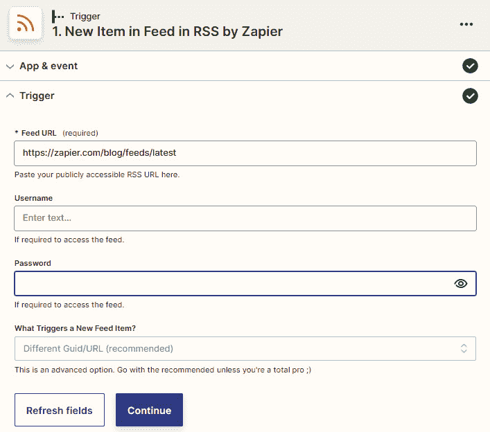
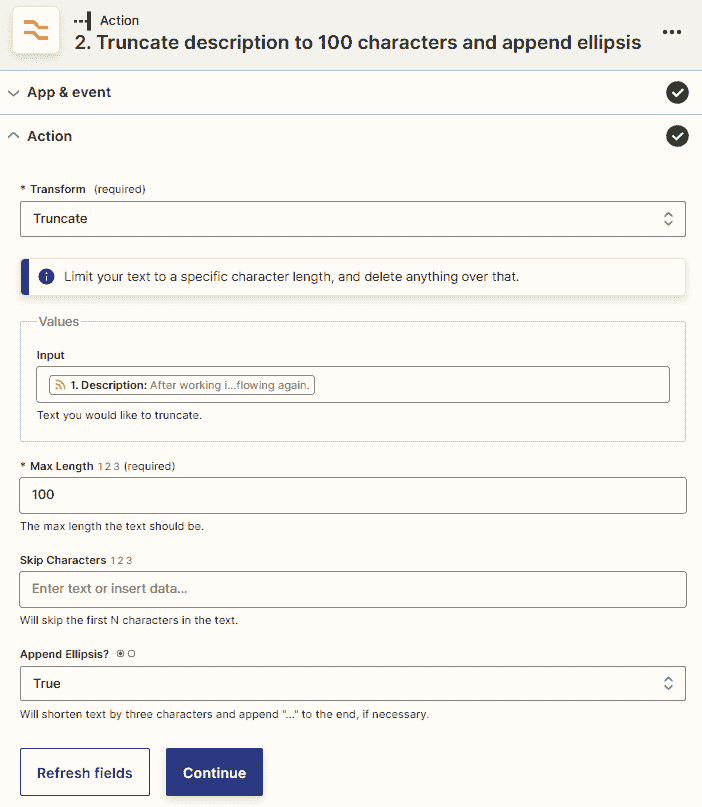
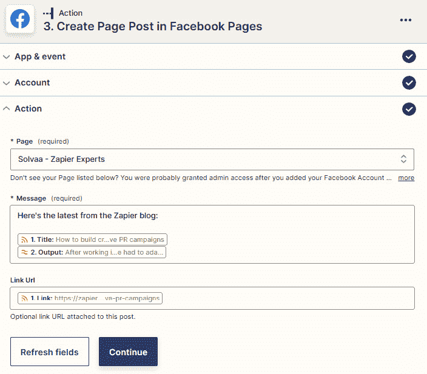
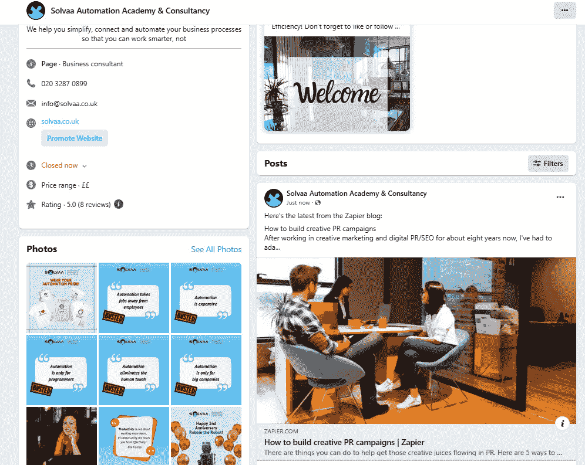

# 20

# 自动化您的营销流程

到目前为止，我们已经回顾了如何使用 Zapier 构建工作流自动化以及如何使用各种内置应用，包括 Formatter by Zapier，来增强你的自动化。现在，我们已经覆盖了这些主题，接下来更详细地介绍使用 Zapier 作为连接器工具自动化数千个业务应用程序之间的不同类型业务流程将非常有用。在接下来的几章中，我们将介绍如何自动化五个核心业务功能，即市场营销、销售、运营、财务和分析，并探讨与 Zapier 集成的一些常用数字工具的示例。我们还将更详细地介绍如何使用每个功能相关的特定集成。

首先，营销通常是业务周期的第一部分，也是非常重要的一部分。所有企业都需要不同程度的营销流程，以确保他们有吸引潜在客户的方式。在本章中，我们将讨论可以使用 Zapier 自动化的不同类型营销流程，并提供一些常见营销应用程序使用的工作流程示例。首先，我们将概述可以使用 Zapier 自动化的营销流程类型。接下来，我们将探讨使用 Zapier 自动化营销流程的起点在哪里。最后，我们将深入了解如何使用 Facebook 页面集成自动化社交媒体营销。

我们将在本章中涵盖以下关键主题：

+   介绍使用 Zapier 自动化您的营销流程

+   使用 Zapier 自动化您的营销流程从哪里开始

+   自动化社交媒体营销流程，并演示 Facebook 页面集成

一旦您研究了每个主题，您将更好地了解可以使用 Zapier 自动化的不同营销流程。您将知道如何使用 Zapier 自动化一些常见营销应用程序中的营销流程。

# 技术要求

要充分利用本章内容，您需要拥有 Zapier 帐户。您需要 Zapier 免费计划才能创建单步工作流程并使用 Zapier 的预构建模板。您需要 Zapier Starter 计划才能使用高级应用程序并创建多步骤工作流程。

您可以在[`bit.ly/zapier-book`](https://bit.ly/zapier-book)获取本章中使用的 Zap 模板。使用模板将帮助您可视化流程是如何工作的。

# 介绍使用 Zapier 自动化您的营销流程

每个企业都需要某种形式的市场营销，以确保他们的客户可以亲自光顾他们的门店或在线购买他们的产品和服务。每个企业都希望通过口碑或推荐的方式进行潜在客户生成; 换句话说，让您珍视和开心的客户为您做市场营销工作。然而，当您刚开始时，有义务让商业名称在某种方式中知名起来。在过去，最受欢迎的营销形式包括报纸和杂志广告、传单派发、广播广告，对于那些买得起的人来说，还有电视广告，这些广告通常局限于特定地理区域。在这个数字化时代，我们有互联网来吸引每个人，企业可以使用更多具有成本效益的营销工具和服务。然而，随之而来的选择更多，我们需要做的事情也更多，以保持竞争力。

首先，大多数企业都需要某种形式的数字化存在，以便潜在买家能够找到它们，这可能是一个网站或一个**Google 我的企业**页面。您的网站可能会有一个博客，以便您可以提高在 Google 等搜索引擎上的搜素度。您可能需要在各种社交媒体渠道上分享博客文章，同时通过有用的内容、梗图和激励帖子或战略性社交媒体活动与粉丝们互动，以吸引流量回您的网站。您可能会在网站中嵌入表单，以允许人们订阅您的新闻通讯。您可能会有着陆页面，以帮助您收集电子邮件地址或添加到您的营销活动的潜在客户。您可能还使用数字广告来增加这些专门的着陆页面的流量。所有这些努力，以及使用的所有这些工具，都是为了将观众引入您的销售周期并购买您的产品或服务。

## 理解可以使用 Zapier 自动化的市场营销过程

Zapier 与多种市场营销工具有多个集成，涵盖多种功能，使您能够自动化**市场营销过程**。您可以将这些应用与成千上万的其他应用程序连接起来，例如 Slack、Google Drive、Airtable 和 Zapier 短信，以自动化您的社交媒体营销过程。

以下是几个可以使用 Zapier 自动化的市场营销流程的示例：

+   在线存在流程

+   社交媒体营销流程

+   社交媒体排期流程

+   广告流程

+   电子邮件营销和市场自动化流程

让我们探讨每一个流程，并提供一些可以与 Zapier 一起使用的市场应用的示例，以自动化涉及它们的流程。

### 自动化涉及在线存在的应用程序的过程

如今，大多数企业都拥有某种形式的数字化存在，而在大多数情况下，这始于一个网站。为了帮助提高搜索引擎优化，通常建议您拥有一个博客，在其中定期发布新的相关内容。您可以使用**Tumblr**、**WordPress**、**Drupal**或**Webflow**来管理您的网站和博客内容。

管理博客可能是一项耗时的活动，因此您可能会发现自动化一些相关流程非常有用。一个与 Zapier 集成的流行网站构建器和博客是 WordPress。您可以使用 Zapier 自动化 WordPress 博客的流程，例如创建、更新和共享新内容，以及管理评论和用户。您可以在收到新评论时、添加新用户时、添加或更新帖子时以及添加新媒体时触发工作流程。将这些触发事件与通知应用程序中的操作事件相结合，例如使用 Zapier 的 Email 来获取电子邮件，使用 Twitter 或 Medium 等社交媒体应用程序分享新帖子，或者将新用户添加到列表中的 Google Sheets 电子表格。您还可以在例如向 Google Drive 添加新图像或向您的 CRM、**Dubsado**或任务管理应用程序 Asana 添加新用户时创建新帖子、更新现有帖子、上传媒体、创建新用户和搜索帖子。

许多具有实体、实体位置的企业，如零售店、牙医诊所或法律公司，可能会在 Google My Business 等服务上进行业务广告。通过这种类型的服务，您可以宣传您的营业时间和联系方式，并收集客户评价。使用 Google My Business 还会增加您在 Google 上的可搜索性。由于 Google My Business 与 Zapier 集成，您可以使用 Zapier 连接到其他应用程序并自动化您的在线存在。例如，您可以在收到新评论时触发工作流程，并获得 Slack 消息或短信等通知。您可以在收到新评论时回复特定评论，或者在 Airtable 的视图中出现记录时更新回复。

有许多与 Zapier 集成的网站构建应用程序，您可以在[`zapier.com/apps/categories/website-app-building`](https://zapier.com/apps/categories/website-app-building)上查看。

接下来，让我们讨论如何使用 Zapier 自动化社交媒体营销流程。

### 自动化社交媒体营销流程

大多数企业都使用某种形式的社交媒体来吸引他们的潜在客户和现有客户。您可能只使用一个或几个社交媒体平台，具体取决于您业务的需求。举几个例子，这些可能是 Facebook 群组、Twitter、Instagram for Business，或者**Pinterest**。无论您的社交媒体营销流程是什么，都有方法连接您的工具，并使用 Zapier 自动化这些流程。

通过 Instagram for Business 整合，可以在您的帐户上发布新的视频或照片或在照片或视频中标记您的帐户时触发工作流程。您可以将这些触发器与动作事件结合使用，将其分享到您的 Facebook 页面或 LinkedIn 上，或将文件保存在 Google Drive 中。例如，当您发布新的 Shopify 或 WooCommerce 产品时，您也可以在您的动态中发布新的照片。

通过 Pinterest 整合，您可以在添加新的 pin 时触发工作流程，创建新板或获得新的关注者。结合动作事件将其发布到 Facebook 页面或在 Slack 中通知团队。例如，您发布新的 WordPress 文章时，您还可以创建新的 pin。

有许多社交媒体营销应用程序与 Zapier 集成，您可以在此处查看：[`zapier.com/apps/categories/social`](https://zapier.com/apps/categories/social)。

接下来，让我们探讨如何使用 Zapier 自动化社交媒体排程流程。

### 自动化社交媒体排程流程

在社交媒体上发布内容是另一项耗时的营销活动。编写内容，设计图形，计划何时发布，以及实际发布可能需要一些时间，并且可能是一个非常手动的过程。使用社交媒体排程工具，如 **Buffer**、**Meet Edgar** 和 **Hootsuite** 可以轻松地在您选择的日期和时间将内容发布到多个社交媒体平台上。能够自动化这些排程应用程序涉及的流程使事情变得更加容易。因此，您可以使用 Zapier 自动化许多社交媒体排程工作流程。

通过 Meet Edgar 整合，当 Pinterest 上添加新的 pin 或发布新的 YouTube 视频时，您可以向库中添加新的内容。

通过 Buffer 整合，您可以在添加新项时触发工作流程，然后将新项作为新文章在 WordPress 上分享，创建 Trello 卡片或创建 Google 日历事件。添加新个人资料时，您也可以添加新行到 Google Sheets 电子表格中。您还可以在以后的某个日期安排发布或在例如发布新的 Instagram 照片或创建新的 Evernote 笔记时立即发送更新。

有许多社交媒体排程应用程序与 Zapier 集成，您可以在此处查看：[`zapier.com/apps/categories/social-marketing`](https://zapier.com/apps/categories/social-marketing)。

接下来，让我们介绍如何使用 Zapier 自动化在线广告流程。

### 自动化广告流程

在线付费广告是推动流量到您的网站或特定着陆页以促销产品和服务的流行方式。Facebook Lead Ads、Google Ads 和 Instagram Lead Ads 是用于在线付费广告的流行应用程序，您可以使用 Zapier 自动化与这三个应用程序相关的广告工作流程。

例如，使用 Facebook Lead Ads 集成，您可以在创建新的潜在客户时触发工作流程，将新行添加到 Google Sheets 电子表格，或将潜在客户添加到您的 CRM。

使用**Google Ads**集成，当创建新的广告系列或创建潜在客户表单时，您可以触发工作流程，并在 LinkedIn 上添加新帖子或在 Google 日历中创建事件。您还可以创建客户列表，向列表中添加或删除联系人，或设置状态并从其他应用程序发送脱机转化信息。您可以搜索客户列表和广告系列，并在不存在时创建客户列表。

有几款在线广告应用与 Zapier 集成，您可以在[`zapier.com/apps/categories/ads-conversion`](https://zapier.com/apps/categories/ads-conversion)上查看。

接下来，让我们探讨如何使用 Zapier 自动化电子邮件营销和营销自动化流程。

### 自动化电子邮件营销和营销自动化

另一种培养您的潜在客户并使客户更多地从您购买的流行方式是使用电子邮件营销或营销自动化。为了使用这些方法，一旦您通过社交媒体或广告将新的潜在客户推送到您的网站或特定的登陆页面，您首先需要收集联系人的电子邮件地址，以便您可以向他们发送新的免费但有价值的内容，让他们了解特别优惠，或向他们介绍您的团队和服务。您可以通过将表单嵌入您的网站以允许人们订阅您的新闻简报，或设置带有免费下载内容的登陆页面，例如速查表、电子书或有趣的测验来帮助您收集电子邮件地址，以便将其添加到您的营销活动中。

#### 电子邮件营销流程

诸如**Constant Contact**、Mailchimp 和**Campaign Monitor**之类的电子邮件营销应用通常允许您发送一次性的类似新闻简报的电子邮件，并带有一些简单的自动化功能。

使用 Constant Contact 集成，当新联系人或列表被添加以及邮件被打开时，您可以触发工作流程。您可以将这些触发器与动作事件结合起来，例如将新联系人添加到 Salesforce CRM 并在他们打开邮件时对其进行标记。您还可以在您的帐户中创建或更新联系人，在新的 Gravity Forms 或 Typeform 表单提交时查找联系人或创建联系人，或者当您收到新的 Facebook Lead Ad 潜在客户时进行操作。

有几款电子邮件营销应用与 Zapier 集成，您可以在[`zapier.com/apps/categories/email-newsletters`](https://zapier.com/apps/categories/email-newsletters)上查看。

#### 营销自动化流程

营销自动化应用程序如 ActiveCampaign、 **ClickFunnels**和 Keap 允许您设置带有条件逻辑的自动化序列，您可以根据其活动和行为从不同的列表、段和自动化中删除和添加联系人。它们通常也具有作为 CRM 工作的额外功能。

ActiveCampaign 集成具有长达 15 个触发事件、12 个操作事件和 4 个搜索操作事件的列表。由于 ActiveCampaign 还具有联系人管理、交易、任务和备注等 CRM 功能，因此您可以使用几个特定于 CRM 的事件，这里不进行讨论。然而，对于营销功能，您可以在以下情况下触发工作流：当一个活动开始发送电子邮件、一个活动反弹、一个活动中的链接被点击、一个联系人取消订阅活动或活动电子邮件被打开时。您可以将这些触发器与其他操作事件结合使用，例如使用 Slack 或通过 Zapier 的电子邮件告知通知，或将新活动发布到 Facebook 页面。您还可以查找联系人、创建联系人、将其添加到自动化、创建和发送新活动，或在出现新的 Thinkific 订单、从 Google 表格或** JotForm**获取新的表单条目、关闭 ManyChat 聊天或接收 PayPal 销售时添加跟踪事件。

有几个营销自动化应用程序与 Zapier 集成，您可以在[`zapier.com/apps/categories/marketing-automation（英文）`](https://zapier.com/apps/categories/marketing-automation)中进行查看。

提示

如果您为 B2B 市场提供服务，则可以利用内置的 Lead Score by Zapier 应用程序提取的数据，这些数据可以用于潜在客户的资格和评分。这对于没有大量潜在客户且可能无法支付数据洞察平台费用的小公司和初创公司特别有用。您可以检索有关您的潜在客户的其他数据，因为它们进入您的系统是无价的，而对于低容量来说是不需要额外费用的。您可以在*第十章*中更详细地了解 Lead Score by Zapier 应用程序，*其他有用的内置应用程序 by Zapier*。

现在您了解可使用 Zapier 自动化的营销流程类型。

现在让我们来看看开始自动化营销流程的基本第一步。

# 从哪里开始使用 Zapier 自动化营销流程

在开始自动化流程之前，始终进行一些预先工作是很好的。在*第二章*和*第三章*中，我们涵盖了一些重要的要点，这些要点在您制定营销工作流时会对您有所帮助，它们如下：

+   **绘制您的营销流程图**：您可能已经制定了营销策略，并清楚地了解您的营销流程如何与所有工具配合工作。但是，如果没有，请按照*第二章*中*简化您的流程并评估可以自动化的内容*一节中的步骤，以可视化方式绘制您的流程，以便您可以高层次地了解您的任务如何与现有软件配合工作。

+   **列出您的营销工具**：列出您在业务中使用的所有营销工具和服务，以实现您的目标。然后，评估这些工具如何符合您制定的流程。您随后将能够简化这些流程并决定哪些可以自动化。一旦您了解了您的流程和工具的概述，您将更好地了解哪些地方存在问题，以及 Zapier 如何帮助您填补这些空白并自动化您的流程。

+   **审查您的应用程序配置文件页面**：在*第二章*中，*准备自动化您的流程*，我们还讨论了审查您的各个应用程序配置文件页面作为了解您的业务应用程序如何与 Zapier 集成的最佳方法。这将为您提供有关在您的工作流中可用的触发器、操作和搜索的见解。制作这些的列表以便快速参考。

+   **使用 Zapier 的预先构建的指导性工作流模板**：这是开始自动化您的营销流程的最简单方法。这些模板是从其他用户常用的工作流构建的。它们非常适合用作灵感，设置速度快，并且会立即为您节省时间。

+   **定制您的营销工作流**：发挥创造力，开始构建多步骤工作流以在自动化中取得更多成就。使用 Zapier 的内置应用程序来帮助您做更多事情，并将您的营销工作流连接到您业务流程的其他部分，例如您的销售流程。

+   **结合人工智能和自动化**：利用 AI 动力的 Zapier 功能和集成的 AI 应用程序的魔力来增强您的营销工作流。在*第十九章*中了解更多信息，*AI 和自动化*。

有了所有这些，您将顺利为您的业务创建营销自动化。

提示

如果您正在寻找在您的业务中使用的其他营销应用程序的想法，您可以查看应用生态系统目录中的**营销**类别，以获取与 Zapier 集成的公共应用程序列表，网址为 [`zapier.com/apps/categories/marketing`](https://zapier.com/apps/categories/marketing)。请参阅*第二章*中*选择新应用程序的简要指南*一节，获取有关选择新应用程序的指导。

您现在知道如何开始使用 Zapier 自动化您的社交媒体流程了。

让我们更具体地讨论如何使用 Zapier 的 Facebook 页面集成来自动化社交媒体营销流程。

# 自动化社交媒体营销流程，以 Facebook 页面集成为例

Facebook 是最常用的社交媒体平台之一，它有两个与 Zapier 集成的热门社交媒体应用，即 Facebook 页面和 Facebook 群组。为了让您了解如何自动化社交媒体营销流程，我们将重点放在 Facebook 页面与 Zapier 的集成上。

大多数企业不会使用个人 Facebook 帐户进行社交媒体营销，但会创建 Facebook 页面。Facebook 页面非常适合提升企业的在线可见性，展示其产品和服务、营业时间和客户推荐，以及分享内容、特别优惠和新闻以吸引潜在客户和顾客。

如果您在业务中使用 Facebook 页面，则可以使用 Zapier 自动化您的营销流程，并且 Facebook 页面集成支持多个触发和动作事件。完整列表可以在 Facebook 页面应用程序配置文件页面上找到，网址为[`zapier.com/apps/facebook-pages/integrations`](https://zapier.com/apps/facebook-pages/integrations)。

## Facebook 页面触发事件和使用案例

以下是一些支持的触发事件列表，您可以使用这些事件与 Facebook 页面一起使用，并附有示例：

+   **您的时间轴上的新帖子**：当您或其他人向您的 Facebook 页面帐户的时间轴添加新帖子时触发此事件。除其他外，在您希望收到关于您的时间轴上新帖子的通知时，可以在自动化中使用此触发事件。例如，将此触发事件与 **发送短信** 等通知动作事件结合使用，通过 Zapier 的短信发送给您，或者使用 **发送频道消息** 动作事件与 Slack 在指定频道向您的团队发送消息。

+   **新推荐**：当您的 Facebook 页面收到新的推荐时触发此事件。除其他外，在您希望将任务分配给团队审查推荐时，可以在自动化中使用此触发事件。例如，将此触发事件与 Trello 的 **创建卡片** 动作事件结合使用，以在 Trello 中添加新卡片并将成员分配给它，或者使用 **创建任务** 动作事件将任务添加到 Clickup。您还可以在希望在其他社交媒体平台上分享推荐时使用它。

+   **您的新帖子**: 当您在您的 Facebook 页面时间轴上发布更新时，此事件将被触发。除其他事项外，您可以在自动化中使用此触发事件，当您希望在其他社交媒体平台上重新分享您的帖子时。例如，将此触发事件与**创建推文**等操作事件结合使用，以在 Twitter 上发布推文。如果您需要确保您的消息不超过推文的最大字符长度 280，在执行步骤之前，添加**Formatter by Zapier** 的**文本**操作事件并选择**截取**转换选项以截断字符长度。

接下来，让我们看一些 Facebook 页面的动作事件和用例。

## Facebook 页面的动作事件和用例

以下是您可以与 Facebook 页面一起使用的一些支持的操作事件列表及其使用示例：

+   从您的触发器中的`文件`字段映射到文件对象中。照片应小于 4 MB，保存为`.jpg`、`.png`、`.gif`、`.tiff`、HEIF 或 WebP 文件。

+   **创建页面发布**: 您可以使用此操作事件在您的 Facebook 页面上创建并发布新的动态内容。您可以将此操作事件与触发事件（如**Feed 中的新项目**在 RSS by Zapier 中）结合使用，以发布您最喜欢博客的新 feed 项目并与您的 Facebook 受众分享，或者与 WordPress 中的**新帖子**结合使用，以分享您博客中的新帖子。

+   从您的触发器中的`play_url`字段映射到公开可访问的 YouTube URL 中。

+   从您的触发器中的`文件`字段映射到文件对象中。

接下来，让我们探讨如何设置一个使用 Facebook 页面集成的多步 Zap 的示例。

## 使用 Facebook 页面集成设置多步 Zap

为了说明这一点，我们将使用在我们最喜欢的博客之一[`zapier.com/blog/feeds/latest/`](https://zapier.com/blog/feeds/latest/)添加 RSS feed 项目时，在 Facebook 页面上创建新帖子的示例。我们将截断博客描述，以使我们的消息更易阅读。

Zap 将涉及以下三个步骤：

1.  **触发器**：**RSS by Zapier** 应用程序与**Feed 中的新项目**触发事件。

1.  **操作**: 使用**Formatter by Zapier** 应用程序的**文本**操作事件和**截断**转换选项。

1.  **操作**: 使用**Facebook 页面** 应用程序的**新页面发布**操作事件。

以下截图展示了构建后的 Zap 应该是什么样子，带有一些自定义标签：

图 20.1 – 使用 Facebook 页面作为动作步骤的多步 Zap

让我们一步一步地走过这个过程，从触发步骤开始。

### 设置触发步骤

我们将使用内置的 RSS by Zapier 应用程序，以**feed**中的**新项目**触发事件作为触发步骤。请按照*第九章*中的 *使用 RSS feed 阅读器* 部分的说明，在 **Feed URL** 字段中添加 [`zapier.com/blog/feeds/latest/`](https://zapier.com/blog/feeds/latest/)。

以下截图显示了此步骤的外观：

图 20.2 – 使用 RSS by Zapier 在 feed 中触发工作流程的概述

接下来，让我们设置 ZAP 中的第二步 – 第一个操作步骤。

### 设置 ZAP 中的第二步

我们将使用 Zapier 的 Formatter 应用，并将触发步骤中的`Description`数据映射到`100`个字符，不跳过字符，并选择**真**以在**附加省略号？**字段中添加`…`到末尾。

以下截图显示了此步骤的外观：

图 20.3 – 使用 Formatter by Zapier 文本操作事件截断描述数据的概述

单击**继续**按钮。您随后可以使用**测试**部分截断文本。

接下来，让我们设置 ZAP 中的最后一个操作步骤。

### 设置 ZAP 中的第三步

我们将使用 Facebook 页面应用程序与**新页面帖子**操作事件，并通过按照以下方式完成字段来自定义此操作步骤：

+   **页面**：我们将使用此下拉字段选择我们有管理员访问权限的 Facebook 页面帐户。在这种情况下，我们选择了**Solvaa – Zapier 专家**选项。

+   `这是 Zapier 博客的最新内容：`，来自*步骤 2*的动态博客`Description`输出。

+   **链接网址**：我们将从*步骤 1*触发中映射动态**链接**数据，以便读者可以单击链接转到实际博客文章。

以下截图显示了此步骤的外观：

图 20.4 – 使用 Facebook 页面集成概述创建新页面帖子

单击**继续**按钮。您随后可以使用**测试**部分在 Facebook 页面上创建帖子。我们方案的结果显示在以下截图中：

图 20.5 – Zapier 在 Facebook 页面中创建的新页面帖子的概述

您可以在此处获取此 ZAP 模板的副本：[`bit.ly/zapier-book`](https://bit.ly/zapier-book)。

现在，你应该对如何使用 Facebook 页面集成自动化社交媒体营销流程有了更好的理解。

# 总结

在本章中，我们讨论了可以使用 Zapier 自动化的不同类型营销流程，并且探讨了一些常见营销应用程序中使用的工作流程示例。首先，我们概述了可以使用 Zapier 自动化的营销流程类型。然后，我们介绍了如何开始使用 Zapier 自动化营销流程。最后，我们讨论了如何通过 Facebook 页面集成自动化社交媒体营销。

你现在知道如何使用 Zapier 以及具体使用 Facebook 页面集成来自动化营销流程了。

在下一章中，你将学习如何自动化你的销售工作流程。我们将讨论不同类型的销售流程，并且给出使用 Zapier 如何自动化这些流程的实际示例。我们还将提供一些解决与销售工作流程相关问题的实用建议。

# 问题

1.  什么类型的营销流程可以使用 Zapier 自动化？

1.  新的 Facebook 页面照片可以上传哪些文件类型？
