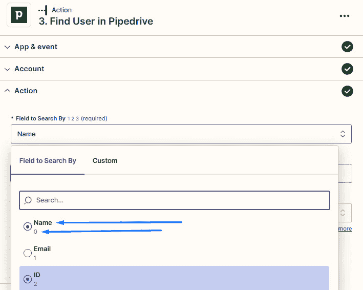
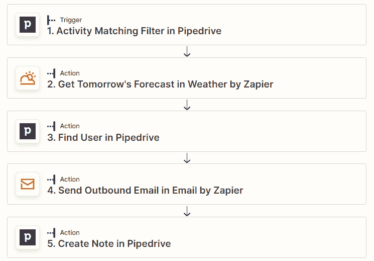
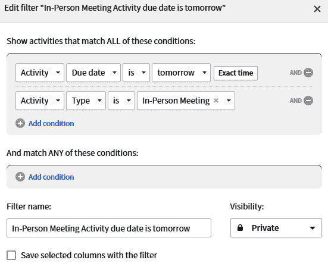
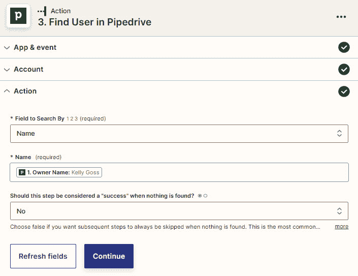
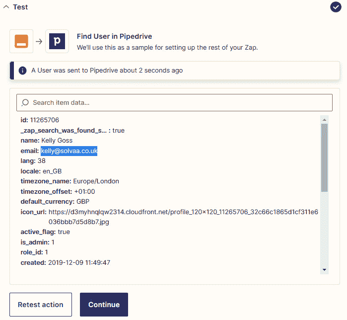
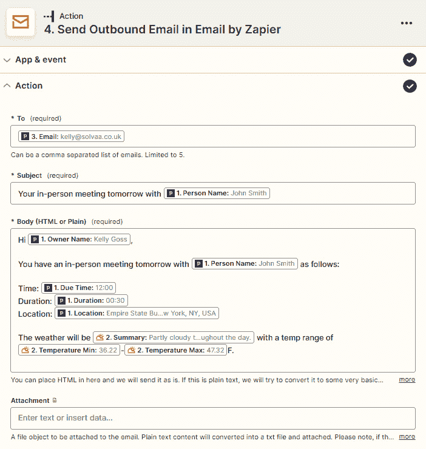
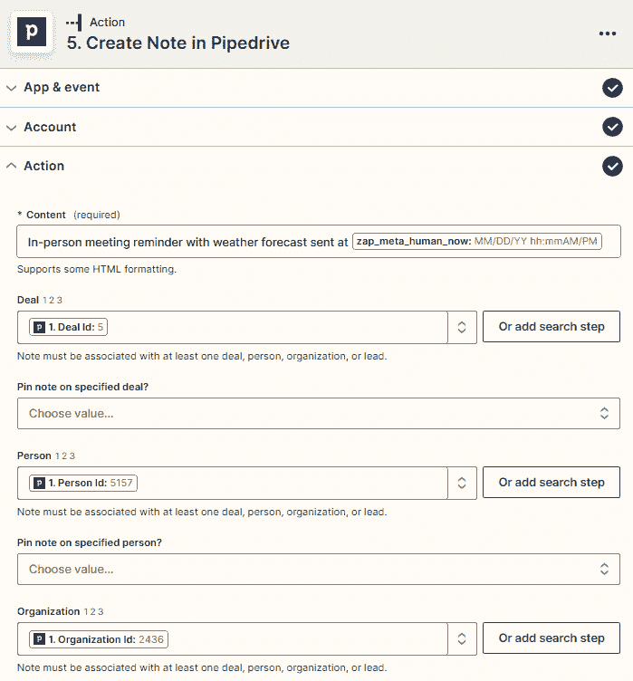
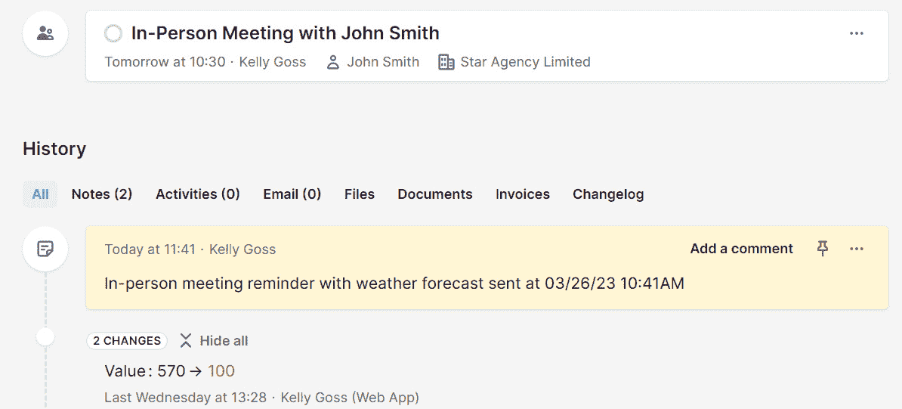

# 第二十一章：自动化您的销售流程

现在我们已经讨论了如何使用 Zapier 自动化营销流程，下一个需要探讨的重要业务功能是销售周期及其自动化流程。销售当然是最重要的业务功能之一。一旦您的营销流程自动运行以推动新的潜在客户，您将需要一种有效的方式将其转化为销售。没有销售意味着没有收入，没有收入的企业将无法长久生存。因此，拥有简化和自动化的销售流程肯定会有助于确保业务成功。

在本章中，我们将讨论可以使用 Zapier 自动化的不同类型的销售流程，并提供与一些常见销售应用程序一起使用的工作流示例。首先，我们将概述可以使用 Zapier 自动化的销售流程类型，例如数据收集、预约安排、潜在客户捕获和管理、获取数字签名以及处理在线销售交易。然后，我们将探讨如何开始使用 Zapier 自动化销售流程。最后，有几种不同的销售工具与 Zapier 集成，允许您自动化销售流程。为了说明这一点，我们将深入探讨如何使用 Pipedrive CRM 集成自动化潜在客户管理流程。

本章将涵盖以下关键内容：

+   介绍使用 Zapier 自动化您的销售流程

+   如何开始使用 Zapier 自动化您的销售流程

+   使用 CRM 集成自动化潜在客户管理流程，以 Pipedrive 集成为例

一旦您完成了每个主题的工作，您将更好地了解可以使用 Zapier 自动化的不同销售流程。您将知道如何使用 Zapier 来自动化一些最常见的销售应用程序的销售流程。

# 技术要求

要充分利用本章的内容，您将需要访问 Zapier 帐户。您将需要 Zapier 免费计划来创建单步工作流程并使用 Zapier 的预构建模板。您将需要 Zapier 入门计划来使用高级应用程序并创建多步工作流程。

您可以在 [`bit.ly/zapier-book`](https://bit.ly/zapier-book) 获取本章中使用的 Zap 模板。使用模板将帮助您可视化流程如何工作。

# 介绍使用 Zapier 自动化您的销售流程

过去，许多企业拥有的收银机每次收到销售款项时都会发出“咣当”声。如今，许多企业不太可能拥有这些古董收银机，但许多企业所有者可能会在完成销售时想象“咣当”声，然后偷偷欢呼。销售是保持业务运转并支付员工、供应商和企业所有者的动力。

在互联网出现之前，公司通常需要有营业场所，并在顾客走进门时销售他们的产品或服务。有些顾客知道自己想要什么，而其他人需要更多信息或一些劝说。销售人员在房间里工作并接待潜在买家，同时必须接听电话、解决询问问题并预约。客户详细信息可能已记录在纸质登记表、书籍或电子表格中，也可能没有记录。合同是手写或打印出来的，需要亲自签名。

随着数字时代的到来，公司现在拥有许多可用工具，能够更有效地运营他们的销售周期。销售人员现在手边有更好的流程可以建立与潜在客户更强的关系，以便他们购买并不失个性化的接触。

使用连接器工具（例如 Zapier）自动化各种任务可以显著改善销售流程的示例，请参见 [`solvaa.co.uk/automate-dental-practice/`](https://solvaa.co.uk/automate-dental-practice/)。

## 了解使用 Zapier 能够自动化的销售流程。

Zapier 与许多涵盖众多功能的销售工具集成，使您能够自动化您的**销售流程**。您可以将这些应用程序与数千个其他应用程序（如 Microsoft Outlook、Asana、Dropbox 和 Xero）连接起来，自动化您的销售流程。

以下是可以使用 Zapier 自动化的几个销售流程示例：

+   通过表单进行数据收集的流程。

+   预约预定流程。

+   潜在客户管理流程。

+   合同、提案和数字签名收集流程。

+   电子商务流程。

让我们探索每一个流程，并给出一些可以与 Zapier 一起使用的销售应用程序的示例，以自动化涉及它们的流程。

### 自动化涉及数据收集的流程。

许多企业使用表单构建器从潜在客户那里收集信息。您可以使用 Gravity Forms、Google Forms、JotForm、Typeform 或其他表单构建器。这些表单可能是为了在嵌入到公司网站时发送有关公司服务和产品的查询，或者为了营销目的，以便人们可以注册公司的通讯或填写调查问卷。

常见的情况是，当表单条目被创建时，您可能会收到电子邮件通知，但处理该数据并将其添加到其他系统可能是耗时且重复的。通过自动化流程，您可以将该表单数据添加到您应用程序堆栈中的多个工具中，并相应地启动工作流程。例如，当新表单条目被创建时，您可以通过 Slack 消息通知团队，给自己发送短信，将条目添加到 Google Drive 或 Dropbox 中作为文本文件，创建一个新的问题在 **Jira** 中，在 **Close.io** 中创建新的联系人和机会等等。

Gravity Forms 是一个流行的 WordPress 插件，允许您创建一个自定义表单，您可以将其嵌入到网页中，以便收集数据。通过 Gravity Forms 集成，您可以在表单提交时触发工作流程。您可以将此触发器与动作事件相结合，将表单数据添加到您的 CRM 中，将新任务添加到您的项目管理应用程序中，或使用 Gmail 发送自动化电子邮件，等等。您还可以创建一个表单条目，并额外触发与表单提交相关的规则，例如通知和 feed 插件。

使用 Google Forms 时，您可以创建表单，然后将其用作独立的 URL 或将其嵌入到网页中。表单条目还记录在 Google Sheets 电子表格上。通过 Google Forms 集成，您可以在将新表单响应添加到关联的 Google Sheets 底部时触发工作流程，并且还可以在修改表单响应时触发。您可以将这些触发器与动作事件结合使用，以添加或更新数据到您的电子邮件营销工具，例如 **ConvertKit**，将事件添加到 Google 日历中，或者使用 Slybroadcast 发送自动语音邮件，等等。您还可以创建新的表单响应和行条目，查找并创建新的响应，并按列和值查找响应行，返回该行的数据。

有许多与 Zapier 集成的表单和调查应用程序，您可以在 [`zapier.com/apps/categories/forms`](https://zapier.com/apps/categories/forms) 上查看。

接下来，让我们讨论如何使用 Zapier 自动化预约预订和安排流程。

### 自动化预约预订和安排流程

如果你是一个服务型企业，预约约见是一个确保收入持续增长的方法。这些约见可能是免费的发现性或信息性电话，收费咨询课程，或者其他需要亲自提供的服务，比如按摩或治疗。改进你的约见预定和安排流程的第一步是使用现有应用程序中的内置预订功能，比如一些 CRM 应用程序（例如 Pipedrive，Dubsado 或 HubSpot），或者使用专门的预定应用程序，比如 Acuity Scheduling 或 Calendly。这些应用程序允许你创建自定义时间段，可以在你的网站上显示或使用 URL 共享。它们与你的日历集成，所以你的可用性会显示出来，并且一旦预约成功，日历中就会自动创建事件。有些应用程序还允许你提前收款。一旦你使用了这些功能，你就可以根据需要创建包含这些应用程序的工作流程来自动化流程。

通过 Acuity Scheduling 集成，你可以在安排新约见、取消或重新安排约见时触发工作流程，当约见开始时，或者当新产品订单完成时。你可以将这些触发器与行动事件结合起来，在 ActiveCampaign 中创建新的订阅者和交易，创建新的 Asana 任务，并在 Google Sheet 中添加或更新行，等等。你还可以添加优惠券和套餐代码，在 Acuity 日程表中设置时间段，并通过客户信息或 ID 查找现有约见。

通过 Calendly 集成，你可以在受邀者安排活动或取消已安排的活动时触发工作流程。将这些触发器与行动事件结合起来，在**Zoom**中创建会议，发送 Slack 消息，创建或更新 CRM 中的联系人等等。

有许多与 Zapier 集成的预定应用程序，你可以在[`zapier.com/apps/categories/scheduling`](https://zapier.com/apps/categories/scheduling)上查看。

接下来，让我们看看如何通过 Zapier 自动化潜在客户管理流程。

### 自动化潜在客户管理流程

许多企业使用联系数据库或 CRM 应用程序来集中数据，以便他们可以管理潜在客户和客户。这些工具往往是联系人的唯一真实来源，因此，它们保存了有关联系人以及与该联系人的通信的所有信息。大多数 CRM 应用程序允许您根据联系人在购买过程中所处的阶段（如潜在客户、机会或客户）以及基于其活动的潜在客户的热度来对联系人进行分类。您可以创建交易或机会来跟踪潜在客户在销售周期中的进展，并创建活动或任务来帮助管理与潜在客户的接触点。在某些情况下，您可以连接您的电子邮件帐户，然后发送和记录电子邮件通信，连接您的日历，并直接从 CRM 安排约会。一些 CRM 具有产品模块，使您可以向您的交易添加产品和定价，有些允许您管理支持票证并执行电子邮件营销功能。

市场上有数百种 CRM，包括流行的应用程序，如 HubSpot、Salesforce、Zoho CRM、Microsoft Dynamics 365 CRM、Capsule CRM、Dubsado、ActiveCampaign 和 Pipedrive。其中许多与 Zapier 集成，允许您通过自动化将潜在客户和联系人管理流程提升到更高水平。大多数集成都有许多触发器、动作和可用于使用的搜索，使您可以强化您的潜在客户管理流程。

使用 Salesforce 集成，您可以在新记录，如`email address`或`status`被更新时，或者收到新的出站消息时触发工作流程。将这些触发器与动作事件相结合，例如在机会达到特定阶段时在 QuickBooks Online 中创建新联系人和发票，将潜在客户添加到 Mailchimp 或 MailerLite，或将新卡片添加到 Trello。您还可以创建新记录并更新现有记录，将联系人或潜在客户添加到活动中，创建新附件，查找一个或多个记录，以及在不存在记录时查找或创建记录（例如当您收到新的 Typeform 条目、新的 Facebook Lead Ads 潜在客户或新的**Unbounce**潜在客户时）。

您可以使用可定制的数据表，如 Airtable，来管理销售流程，以及业务的其他部分，例如社交媒体规划、库存管理、员工休假计划等，而不是使用 CRM。Airtable 的工作方式类似于电子表格；但是，您还可以利用表单和特定视图显示数据，例如看板视图等其他优势。通过 Airtable 集成，您可以在新记录可用时触发工作流程，在视图中可用新记录时触发工作流程以及在创建或更新记录时触发工作流程。

将这些触发器与操作事件相结合，例如使用 Gmail 或 Microsoft Outlook 发送电子邮件，创建 Google 日历事件或 ClickUp 任务。您还可以在出现新的 Google Forms 提交或新的联系人已添加到 **Google Contacts** 时创建或更新记录，并查找记录或创建记录。

有几个客户关系管理应用程序与 Zapier 集成，您可以在 [`zapier.com/apps/categories/crm`](https://zapier.com/apps/categories/crm) 查看。

接下来，让我们探讨如何使用 Zapier 自动化合同、提案和数字签名收集流程。

### 自动化合同、提案和数字签名收集流程

一些企业需要发送面向客户的文件，例如提案、报价或合同。在某些情况下，这些文件可能需要经过客户的数字签名。许多企业使用一系列工具来完成这项工作，通常涉及将信息复制并粘贴到 Microsoft Word 或 **PowerPoint** 文档中，或者可能是 Google Docs 或 **Google Slides** 文档。文件会通过电子邮件手动发送，然后，需要签名时，客户通常需要打印、签名并扫描签署文件，或下载软件。通过使用数字提案、报价和电子签名工具，例如 PandaDoc、**Proposify**、**HelloSign**、**DocuSign** 和 **ZohoSign**，流程可以更加轻松快捷。用户可以创建漂亮的品牌模板，并且由于这些工具经常与众多 CRM 系统集成，它们允许用户创建邮件合并字段，从而将所需信息添加到新文档中，例如姓名、电子邮件地址、地址和产品。有些应用程序还可以让您进行付款。使用这些工具后，您可以使用 Zapier 自动化其他流程。

使用 PandaDoc 集成，您可以在文档发送、完成、付款时或状态更改为 `草稿`、`已发送`、`已查看`、`已完成` 或 `已付款` 等情况下触发工作流程。您可以将这些触发器与操作事件结合起来，例如将已完成的 PDF 文档上传到 Google Drive 或 Dropbox，创建 Xero 或 FreshBooks 中的联系人和发票，更新 ActiveCampaign 或 HubSpot 中的交易阶段，或通过电子邮件、短信或 Slack 消息发送通知。您还可以在出现新的表单提交、销售机会进入 Salesforce 的某个阶段或在 Google 任务中标记完成任务时，从模板中创建新联系人和文档。

通过 DocuSign 集成，当创建新文件夹和发送或完成信封时，你可以触发工作流程。你可以将这些触发器与行为事件结合起来，比如将完成的信封上传到 Dropbox，创建 Todoist 中的任务，以及将新订阅者添加到 Autopilot。例如，当 Smartsheet 行被更新或 Google Sheet 添加了新行时，你也可以创建一个签名请求。

有几款与 Zapier 集成的合同、提案和数字签名收集应用，你可以在[`zapier.com/apps/categories/signatures`](https://zapier.com/apps/categories/signatures)查看。

接下来，让我们来探讨如何通过 Zapier 实现电子商务流程自动化。

### 自动化电子商务流程

到目前为止，我们主要专注于在销售之前涉及人为交互和各种接触点的销售流程。然而，许多企业已经通过在 Internet 上使用购物车（如 ThriveCart 或 **SamCart**）、电子商务商店（如 Shopify 或 WooCommerce）、销售目录（如 **eBay** 或 **Gumroad**）、以及在线课程平台（如 Kajabi 或 **Thinkific**）上列出他们的实体或数字产品，包括在线课程和订阅，来自动运行他们的销售流程。许多这些平台与 Zapier 集成，因此可以进一步自动化你的流程。

通过 eBay 集成，你可以在新订单生成时触发工作流程，并结合行为事件来创建新的 Google Sheets 行，创建 Xero 的新销售发票，创建新的 Airtable 记录，或者创建新的 Printful 订单，等等。你还可以在收到新的 Shopify 订单或新的 ShipStation 订单时创建一项创作发货，并搜索订单。

通过 SamCart 集成，你可以在新订单生成时，新的潜在客户信息被创建时，定期订阅被扣费时，新的退款生成时，和新的订阅取消时触发工作流程。你可以将这些触发器与行为事件结合起来，比如授予或取消对 Kajabi 产品的访问权限，给 Intercom 的用户打标签，添加新订单到 ShipStation，或者当支付被退款时取消 Thinkific 用户的课程。

有许多与 Zapier 集成的电子商务应用，你可以在[`zapier.com/apps/categories/ecommerce`](https://zapier.com/apps/categories/ecommerce)查看。

你现在了解哪些销售流程可以用 Zapier 进行自动化。

现在让我们看一下开始自动化销售流程的基本第一步。

# 如何开始使用 Zapier 自动化你的销售流程

在开始自动化流程之前进行一些预备工作总是不错的。在*第二章*，*准备自动化您的流程*，和*第三章*，*构建您的第一个自动化工作流程（Zap）*中，我们涵盖了一些重要的要点，这些要点在您策划销售工作流程时将会帮助您，如下所述：

+   **规划您的销售流程**：如果您不清楚您的销售流程如何与所有工具配合工作，请按照*第二章*，*准备自动化您的流程*中的 *简化您的流程并评估可以自动化的内容* 部分的步骤来可视化地规划您的流程，以便您对您的任务如何与您现有的软件配合工作有一个高层次的概述。

+   **列出您的销售工具**：列出您在业务中使用的所有销售工具和服务，以实现您的目标。然后，评估这些工具如何与您规划的流程相适应。然后，您将能够简化这些流程并决定哪些可以自动化。一旦您了解了流程和工具的概况，您将更好地了解存在哪些漏洞以及 Zapier 如何帮助您关闭这些漏洞并自动化您的流程。

+   **审查您的应用配置文件页面**：在*第二章*，*准备自动化您的流程*中，我们还讨论了审查您的单个应用配置文件页面作为确定您的业务应用如何与 Zapier 集成的最佳方法。这将为您提供有关可用于您的工作流中的触发器、操作和搜索的洞察。制作一个这样的列表以供快速参考。

+   **使用 Zapier 的预建引导工作流模板**：这是开始自动化您的销售流程的最简单方式。这些模板是从其他用户常用的工作流中构建的。它们非常适合用作灵感，设置快捷，并且能够立即节省您的时间。

+   **定制您的销售工作流程**：发挥创造力，开始构建多步骤工作流程，以从自动化中获得更多收益。使用 Zapier 的内置应用程序帮助您做更多事情，并将您的销售工作流程连接到业务流程的其他部分，例如您的运营流程。

+   **结合 AI 和自动化**：利用 AI 驱动的 Zapier 功能和集成的 AI 应用程序的魔力，使您的销售工作流程更加强大。在*第十九章*，*AI 和自动化* 中了解更多信息。

您将为您的业务创建销售自动化而努力。

提示

如果你正在寻找其他销售应用的使用想法，你可以在应用生态系统目录中查看**销售与 CRM**类别，以获取一个公共应用的列表，这些应用与 Zapier 集成在一起，网址为 [`zapier.com/apps/categories/sales-crm`](https://zapier.com/apps/categories/sales-crm)。请参阅*第二章*中的 *为你的业务选择新应用的简要指南* 部分，了解如何选择新应用。

现在你知道如何开始使用 Zapier 自动化你的销售流程了。

让我们更具体地讨论如何使用 Zapier 与 CRM 集成自动化领导管理流程，以 Pipedrive 为例进行说明。

# 使用 CRM 集成自动化领导管理流程，以 Pipedrive 集成为例进行说明。

正如我们在本章中迄今所见，有很多不同的销售工具可以与 Zapier 连接，让你自动化你的销售流程。我们特别讨论了自动化领导管理流程，并指出有一系列与 Zapier 集成的 CRM。为了进一步说明可能性，我们现在将重点放在 Zapier 最受欢迎的销售应用集成之一，即 Pipedrive 上。

本节将主要帮助正在考虑使用 Zapier 自动化其流程的 Pipedrive 用户了解他们可用的选项。但是，如果你不是 Pipedrive 用户，这一节对你仍然很有帮助，因为 Zapier 与其他知名 CRM 工具（如 Salesforce 和 HubSpot）的集成具有许多相似之处，这些集成同样全面，并且在某些情况下更加广泛。对于那些试图评估 CRM 是否适合其业务以及如何将其与销售流程自动化相结合的用户来说，这一节也可能有所帮助。

Pipedrive 是一款广受欢迎的 CRM 工具，被企业用于简化和高效地管理从潜在客户捕获到销售周期各个阶段的销售流程，并与其他工具集成以连接其他业务功能，如呼叫和发票。Pipedrive 主要用于 B2B 互动，但也可以适应 B2C 过程。Pipedrive 允许您创建表单，可以单独使用或嵌入到您的网站中，以便您可以自动将新线索添加到 CRM。您可以以人和相关组织的形式创建和管理联系人，并可以创建线索，然后将合格的线索转换为交易，以在一个或多个管道中推动其通过销售周期。您可以创建活动或任务，并设置特定的日期和时间，以确保您和销售团队记得通过各种接触点与潜在客户互动。您可以连接您的电子邮件帐户，以便您可以直接从平台内部发送和接收电子邮件，并将电子邮件记录在联系人和相关交易中。您还可以连接您的日历并安排会议。Pipedrive 还具有产品模块，允许您创建和管理具有数量和定价的行项目，可添加到交易中。

出于报告目的，Pipedrive 提供了仪表板报告，并且您可以为活动、联系人、组织、线索和交易创建自定义筛选器，这些筛选器可以在 Zapier 自动化中使用。Pipedrive 允许您在应用程序内创建自动化规则，并且与其他应用程序具有几个强大的原生集成，如呼叫应用程序、提案和电子签名工具、营销应用程序和发票应用程序。但您可以通过将 Pipedrive 连接到数千个其他应用程序来利用 Zapier 集成，从而为您的流程增添力量，以便自动化销售流程的许多部分。Pipedrive 的集成非常全面，目前支持多个触发、操作和搜索事件。完整列表可在 Pipedrive 应用程序配置页面的[`zapier.com/apps/pipedrive/integrations`](https://zapier.com/apps/pipedrive/integrations)找到。

让我们来看一下 Pipedrive 的触发事件和一些可能的使用案例。

## Pipedrive 的触发事件和使用案例

以下是可以与 Pipedrive 一起使用的一些受支持的触发事件的列表，并提供了何时使用它们的示例：

+   **新联系人**：当向 Pipedrive 新增联系人时，会触发此事件。除其他外，您可以在自动化中使用此触发事件，例如在联系人被添加到 Pipedrive 后立即将新联系人添加到其他应用程序，如您的电子邮件营销应用或发票平台。例如，将此触发事件与诸如 Constant Contact 的**创建联系人**或 FreshBooks Classic 的**创建客户**之类的操作事件结合使用。

+   **更新的联系人**：当在 Pipedrive 中更新现有联系人时，将触发此事件。您可以在自动化中使用此触发器事件，当您希望在将联系人添加到 Pipedrive 后立即更新其他应用中的现有联系人时。例如，将此触发器事件与动作事件结合使用，以更新 Google Sheets 中的一行，例如首先使用 **查找电子表格行** 查找要使用唯一标识符（例如电子邮件地址）更新的行的 ID，然后使用 **更新电子表格行** 更新行。

+   应用了`温暖`标签。设置此触发器事件时，请从**筛选器**下拉菜单中选择您的筛选器。除其他外，您可以在自动化中使用此触发器事件，当您只想在某人符合特定条件时触发工作流程时，而不使用 Filter by Zapier 时，然后在营销自动化应用中创建联系人并将其添加到自动化中。例如，将此触发器事件与动作事件结合使用，例如在 ActiveCampaign 中的 **将联系人添加到自动化**，以将联系人添加到培育序列中。

+   **新组织**：当向 Pipedrive 添加新组织时，将触发此事件。您可以在自动化中使用此触发器事件，当您希望将新公司详细信息添加到其他记录（如电子表格或数据库）时。例如，将此触发器事件与动作事件结合使用，例如使用 Smartsheet 的 **添加行到表格** 或 Airtable 的 **创建记录**。

+   **更新的组织**：当在 Pipedrive 中更新现有组织时，将触发此事件。与 **更新的联系人** 触发器类似，您可以在自动化中使用此触发器事件。

+   应用了`客户`标签。设置此触发器事件时，请从**筛选器**下拉菜单中选择您的筛选器。您可以在自动化中使用此触发器事件，当组织符合特定条件时触发工作流程，而不使用 Filter by Zapier 时，然后将这些详细信息添加到其他应用程序中。例如，将此触发器事件与动作事件结合使用，例如在 Google Tasks 中的 **创建任务列表**，以执行客户入职任务。

+   **新潜在客户**：当向 Pipedrive 添加新潜在客户时，将触发此事件。除其他外，您可以在自动化中使用此触发器事件，当添加新潜在客户时在 Pipedrive 中创建新交易。例如，将此触发器事件与动作事件结合使用，例如使用 Pipedrive 的 **创建交易**。

+   **新交易**：这是一个即时触发事件，当向 Pipedrive 添加新交易时触发。您可以在自动化中使用此触发器事件，当您想要向团队发送通知或向潜在客户发送电子邮件或短信时。例如，将此触发器事件与动作事件结合使用，例如使用 Gmail 的 **发送电子邮件** 或 Twilio 的 **发送短信**。

+   **更新的成交**: 当 Pipedrive 中的成交组件（如字段、跟随者和备注）被更新时，这是一个即时触发事件。由于您无法指定此事件何时触发，最好立即在其后使用 Filter by Zapier 操作步骤。例如，当您希望在其他应用程序中更新现有元素时，例如在您的任务管理应用程序中更新任务时，您可以将此触发事件与 Trello 中的**向卡片添加标签**或 monday.com 的**创建更新**等操作事件结合使用。

+   **更新的成交阶段**: 当成交移动到管道中的特定阶段时触发的即时触发事件。在其他方式之外，您可以在自动化中使用此触发事件，例如创建 Pipedrive 或其他应用程序中特定于成交阶段的活动。例如，当成交达到“筛选”阶段时，将此触发事件与 Process Street 中的**创建清单**结合使用，以创建详细的筛选清单，或者当成交达到“提议”阶段时，在 Proposify 中使用**创建提案**创建提议。

+   **成交匹配过滤器**: 当一个成交符合条件时，此事件就会触发。要使此触发器起作用，您必须在 Pipedrive 中创建一个适当的过滤器。例如，您可以创建一个包含成交在特定阶段（比如“需要定义”）以及电子邮件计数超过 10 时的过滤器。在设置此触发事件时，从**过滤器**下拉菜单中选择您的过滤器。当您希望仅在成交符合某些条件时触发工作流程，并且不使用 Filter by Zapier 时，您可以在自动化中使用此触发事件，然后在其他应用程序中添加这些细节。例如，将此触发事件与 Lead Score by Zapier 中的**查找个人和公司信息**等操作事件结合使用，以获取有关个人和组织的潜在客户评分信息。

+   **新活动**: 当在 Pipedrive 中向个人、组织或成交记录添加新活动时，此事件将触发。当您希望为新活动发送通知给您的团队，或者为您的团队分配任务以匹配活动（如果您的团队并非全部使用 Pipedrive）时，您可以在自动化中使用此触发事件。例如，将此触发事件与 Slack 中的**发送通道消息**或 Teamwork 项目的**创建任务**等操作事件结合使用。

+   **活动匹配过滤器**：当活动与过滤器匹配时，此事件将触发。为使此触发器正常工作，您必须在 Pipedrive 中创建一个合适的过滤器。例如，您可以创建一个包含下一天到期、分配给特定用户和“面对面”会议类型的活动的过滤器。在设置此触发器事件时，请从 **过滤器** 下拉菜单中选择您的过滤器。当您希望仅当活动符合某个条件时触发工作流程，而无需使用 Filter by Zapier 并将这些详细信息添加到其他应用时，您可以使用此触发器事件。例如，将此触发器事件与 **Weather by Zapier** 的 **获取明天的天气预报** 操作事件结合使用，以获取明天的天气预报，然后使用 **Email by Zapier** 的 **发送出站电子邮件** 向活动所有者发送电子邮件。

+   映射了`Content`字段，条件是`文本（包含）`，值是您指定的单词或短语，然后是另一个操作事件，例如 Pipedrive 的 **添加关注者**。

相比之下，HubSpot 集成具有类似的触发器结构，包括联系人、公司任务和交易创建和更新；然而，它具有更全面的触发事件范围，涵盖了其他模块组件，例如表单提交、产品、工单、行项目和电子邮件交互等。相反，Salesforce 集成可能具有较少的触发器，但这些触发器通常基于将记录分组在一起以允许从下拉菜单中选择记录类型，例如 **新记录**、**已更新的记录** 和 **记录上的已更新字段**，从而提供了涵盖大多数 Salesforce 模块属性的重要灵活性。

接下来，让我们看一些 Pipedrive 操作事件和用例。

## Pipedrive 操作事件和用例

以下是您可以与 Pipedrive 一起使用的一些支持的操作事件的列表，以及何时使用它们的示例：

+   **创建联系人**：当您想要在 Pipedrive 中创建新的联系人记录时，您可以使用此操作事件。您可以将此操作事件与 **AWeber** 的 **新订阅者** 触发事件结合使用，以将新的电子邮件通讯订阅者添加到 Pipedrive 并相应地加标签。

+   **更新联系人**：当您想要更新 Pipedrive 中现有的联系人记录时，您可以使用此操作事件。您可以将此操作事件与搜索操作事件结合使用，例如与 Acuity Scheduling 的 **开始约会** 触发事件一起使用，以在客户参加约会时更新联系人记录中的自定义字段。

+   **创建组织**：当您想要在 Pipedrive 中创建新的组织记录时，您可以使用此操作事件。您可以将此操作事件与 **Typeform** 的 **新条目** 触发事件结合使用，以将新表单条目中的公司详情添加到 Pipedrive 中作为组织。

+   **更新组织**：当您想要更新 Pipedrive 中的现有组织记录时，您可以使用此操作事件。您可以将此操作事件与 Google Sheets 的**新或更新的电子表格行**等触发事件以及搜索操作事件结合使用，以在电子表格行中添加新的公司详细信息时更新组织记录中的自定义字段。

+   **创建潜在客户**：当您想要在 Pipedrive 中创建新的潜在客户记录时，您可以使用此操作事件。您可以将此操作事件与 LinkedIn Lead Gen Forms 的**新表单响应**等触发事件结合使用，以将新的表单提交联系方式添加为潜在客户。在此步骤之前，您可以使用**新人员**或**新组织**操作事件之一来创建相关人员或组织的记录，然后相应地将相关 ID 值映射到**创建潜在客户**操作事件中。

+   **创建交易**：当您想要在 Pipedrive 中创建新的交易记录时，您可以使用此操作事件。您可以将此操作事件与 Email Parser by Zapier 的**新电子邮件**等触发事件结合使用，以将新解析的电子邮件详细信息添加到 Pipedrive 中作为新的交易。

+   `赢得`：当销售发票收到新的付款时。

+   **创建笔记**：当您想要在 Pipedrive 中的个人、组织或交易记录中创建新笔记时，您可以使用此操作事件。您可以将此操作事件与 ThriveCart 的**订阅暂停**或**订阅恢复**等触发事件结合使用，以在客户订阅发生更改时添加备注。

+   **创建产品**：当您想要在 Pipedrive 中创建新的产品记录时，您可以使用此操作事件。您可以将此操作事件与 Shopify 的**新产品**等触发事件结合使用，以在您的 Shopify 电子商务商店中添加新产品时将其添加到 Pipedrive 中。

+   **添加产品至交易**：当您想要将产品添加到 Pipedrive 中的现有交易记录时，您可以使用此操作事件。您可以将此操作事件与 JotForm 的**新提交**等触发事件以及搜索操作事件结合使用，以在潜在客户填写调查表格并选择产品时，将新产品添加到交易中。

+   **创建活动**：当您想要在 Pipedrive 中的个人、组织或交易记录中创建新活动时，您可以使用此操作事件。您可以将此操作事件与 Pipedrive 的**更新交易阶段**等触发事件结合使用，以在交易转至特定阶段时向交易添加活动。在这种情况下，无需使用搜索操作来查找记录 ID；它们可以从触发步骤映射。

+   `完成`：当 Asana 任务完成时。

+   **附加文件**：您可以在 Pipedrive 中使用此动作事件，当您想要上传文件并将其附加到个人、组织、交易、活动、产品或备注记录时。您可以将此动作事件与 PandaDoc 的触发事件（如**文档完成**）结合使用，将已完成的 PDF 文件添加到 Pipedrive 交易中。

+   **添加关注者**：您可以在 Pipedrive 中使用此动作事件，当您想要添加一个关注者文件并将其附加到个人、组织、交易或产品记录时。您可以将此动作事件与 Pipedrive 的触发事件（如**交易匹配过滤器**）结合使用，当交易符合某些条件时，将自己添加为关注者。

再次比较，与 HubSpot 集成相比，Pipedrive 的结构具有相似的动作事件，包括联系人、公司、任务和交易的创建和更新；然而，它具有更全面的动作事件范围，涵盖了其他模块组件，使您的自动化功能更加灵活。Salesforce 集成可能具有较少的动作事件；然而，这些动作事件通常基于将记录分组以允许从下拉菜单中选择记录类型，从而在覆盖大多数 Salesforce 模块属性时具有重大的灵活性。

接下来，让我们来看一下 Pipedrive 的搜索动作事件。

## Pipedrive 的搜索动作事件

请参考*Pipedrive 动作事件和用例*部分，了解如何使用各种搜索动作事件和 Pipedrive 动作步骤的示例。

与触发事件和动作事件一样，在与搜索动作事件相关的方面，与 HubSpot 集成具有更全面的动作事件范围，涵盖了其他模块组件。Salesforce 集成可能具有较少的可用搜索动作，但它们基于将记录分组以允许从下拉菜单中选择记录类型。

提示

在搜索中使用的最有用的值之一是记录 ID，特别是在 CRM 集成中。例如，当搜索联系人时，电子邮件地址可能是唯一的值；但是，在系统中可能会有重复联系人的可能性。检索记录最可靠的值是与该记录相关联的唯一 ID。在评估哪种 CRM 适合您的业务时，需要考虑的一点是 API 的健壮性。一个很好的参考点是集成是否允许您根据记录 ID 检索信息以及您可以检索到的信息范围。

接下来，让我们回顾一些最佳使用 Pipedrive 集成的技巧。

## 使用 Pipedrive 集成的技巧

以下是成功使用 Pipedrive 集成的一些建议：

+   始终检查您正在输入或映射数据的字段类型，并确保您的数据格式正确。这将确保数据准确性。您可以在*第三章*的*了解字段数据类型*部分中查看更多有关字段类型的信息，该章节名为*构建您的第一个自动化工作流程（Zap）*。

+   当使用`名称`时，字段标签为`0`。以下是示例截图：

图 21.1 – 在使用自定义标签页时映射字段标签

+   如果您在工作流程中使用 Pipedrive 触发器和操作事件的组合，请记住，如果您正在映射 ID 值，那么名称可能会在步骤之间有所不同。例如，在触发步骤中，`id` 是注释 ID，`deal_id` 是关联交易的 ID，`org_id` 是关联组织的 ID。然后，如果您使用**创建交易**等操作步骤，则生成的 ID 将是交易 ID。

+   与 Salesforce **记录上更新的字段** 触发器不同，Pipedrive 集成没有特定的触发事件，可以在字段更新时触发工作流程。解决此问题的方法涉及在 Pipedrive 中使用工作流自动化，这仅适用于高级计划和更高级别，并且使用筛选列表。您可以在 Pipedrive 中创建一个工作流自动化，触发正在更新的交易，并对一个或多个字段进行更改，以及创建一个标记为已完成的活动的操作，该操作将用于筛选列表。在筛选列表中，特定活动已经完成但是到期了。然后，您可以将其与 Zapier-Pipedrive **活动匹配过滤器** 触发事件结合使用，以在适当时触发工作流。

+   避免使用搜索操作步骤，在您连接的其他应用程序中显示 Pipedrive 记录的 ID 值，并反之亦然。例如，如果您的 Zap 包括 Pipedrive 和 Google Sheets，将 Pipedrive 记录 ID 添加到 Google 表格中的列中，将 Google 表格行 ID 添加到 Pipedrive 中的自定义字段中。这比使用搜索操作更可靠。

+   在 [`developers.pipedrive.com/docs/api/v1/#/`](https://developers.pipedrive.com/docs/api/v1/#/) 上查看 Pipedrive API，以获取有关使用 Webhooks by Zapier 和 Code by Zapier 进行的其他触发器和操作的信息。您可以在 [`experts.zapier.com/`](https://experts.zapier.com/) 聘请 Zapier 专家来帮助您进行定制集成工作。

您可以通过转到应用程序配置文件的**帮助**选项卡或访问以下链接查看与 Pipedrive 集成相关的常见问题：[`help.zapier.com/hc/en-us/articles/8495937445773`](https://help.zapier.com/hc/en-us/articles/8495937445773)。

接下来，让我们探讨如何使用 Pipedrive 集成设置多步骤 Zap 的示例。

## 使用 Pipedrive 集成设置多步骤 Zap

为了说明这一点，我们将使用明天的天气预报、向成交业务所有者发送提醒电子邮件，并在预约次日面谈的活动时向 Pipedrive 添加注释。

Zap 将包括以下五个步骤：

1.  **触发器**：Pipedrive 应用程序中的 **Activity Matching Filter** 触发器事件。

1.  **动作**：使用 Weather by Zapier 中的 **Get Tomorrow’s Forecast** 操作事件。

1.  **搜索操作**：Pipedrive 应用程序中的 **查找用户** 搜索操作事件。

1.  **动作**：使用 Email by Zapier 应用程序的 **发送出站电子邮件** 动作事件。

1.  **动作**：使用 Pipedrive 应用程序中的 **创建注释** 动作事件。

一旦构建完成，以下截图显示了您的 Zap 应该看起来的样子：

图 21.2 – 使用 Pipedrive 触发器和操作事件的多步 Zap

该场景下的 Pipedrive 筛选器设置如下截图所示：

图 21.3 – 由 Pipedrive 提供的预约次日面谈的筛选器

让我们一步一步地设置 Zap，从触发步骤开始。

### 设置 Zap 中的触发步骤

我们将使用 Pipedrive 应用程序中的 **Activity Matching Filter** 触发事件作为触发步骤。从**筛选器 ID**下拉菜单中选择相关的筛选器。

以下截图显示了此步骤的外观：

图 21.4 – 在 Pipedrive 中使用 Activity Matching Filter 触发工作流程

点击**继续**按钮，然后点击**测试触发器**按钮获取一些样本数据。

接下来，让我们设置 Zap 的第二步 – 第一个动作步骤。

### 设置 Zap 中的第二步

我们将使用 Weather by Zapier 应用程序中的 **Get Tomorrow’s Forecast** 操作事件。按照*第十章* 中的 *Weather by Zapier – 在您的 Zap 中使用天气条件* 部分的说明，定制此操作步骤，以添加纽约的 **纬度** 和 **经度** 详情，将 **单位** 设置为 **华氏度**，并将 **当没有找到内容时，此步骤是否被视为“成功”** 设置为 **否**。

以下截图显示了此步骤的外观：

图 21.5 – 使用 Weather by Zapier 中的 Get Tomorrow’s Forecast 操作事件概览，以获取明天的天气预报

点击**继续**按钮。然后您可以使用**测试**部分来获取天气预报。

接下来，让我们设置下一个操作步骤。

### 设置 Zap 中的第三步

将触发步骤的`Owner Name`映射到**Term**（或**Name**）字段。将**此步骤在未找到内容时是否被视为“成功”？**设置为**False**。

这在以下截图中显示：

图 21.6 – 使用 Pipedrive 搜索操作查找用户的概述

单击**继续**按钮。然后您可以使用**测试**部分检索用户数据。场景的结果显示在以下截图中：

图 21.7 – 使用 Pipedrive 搜索操作查找用户时找到的用户的详细信息

接下来，让我们设置下一个操作步骤。

### 设置 Zap 中的第四步

我们将使用 Email by Zapier 应用程序，该应用程序使用第二步中搜索操作中的`Email`地址，并使用前面步骤中的相关文本和映射的动态数据自定义**主题**和**正文（HTML 或纯文本）**字段，如以下截图所示：

图 21.8 – 使用 Email by Zapier 集成发送提醒邮件的概述

单击**继续**按钮。然后您可以使用**测试**部分发送电子邮件。

接下来，让我们设置最后的操作步骤。

### 设置 Zap 中的第五步

最后，我们将向与活动相关联的交易、人员和组织中的 Pipedrive 添加一条备注。我们将使用 Pipedrive 应用程序与`{{zap_meta_human_now}}`产生 Zap 运行的时间，并将其添加到备注中。将`Deal ID`映射到`Person ID`到`Organization ID`到*步骤 1*中的**组织**字段。这在以下截图中显示：

图 21.9 – 使用 Pipedrive 创建笔记的概述

我们将在*第十四章*中更详细地介绍如何使用**Zap Meta Human Now**和其他时间戳变体，*格式化日期和时间*。

单击**继续**按钮。然后您可以使用**测试**部分创建笔记。场景的结果显示在以下截图中：

图 21.10 – 在 Pipedrive 中创建的新笔记（由 Pipedrive 提供）

您可以在[`bit.ly/zapier-book`](https://bit.ly/zapier-book)获取此 Zap 模板的副本。

您现在应该更好地了解如何使用 Pipedrive 集成自动化领先管理流程。

# 摘要

在本章中，我们讨论了可以使用 Zapier 自动化的不同类型的销售流程，并探讨了一些在一些常见销售应用程序中使用的工作流程示例。首先，我们概述了可以使用 Zapier 自动化的销售流程类型。然后，我们介绍了如何开始使用 Zapier 自动化销售流程。最后，我们讨论了如何通过 Pipedrive CRM 集成自动化联系管理。

你现在知道如何通过 Zapier 自动化你的销售流程，特别是与 Pipedrive CRM 集成一起使用。

在接下来的一章中，您将学习如何自动化您的运营工作流程。我们将讨论一些不同类型的运营流程，并给出这些流程如何使用 Zapier 进行自动化的实际示例。我们还将提供关于如何解决与运营工作流程相关问题的实用技巧。

# 问题

1.  可以使用 Zapier 自动化哪些类型的销售流程？

1.  您在哪里可以找到有关与 Zapier 集成的调度应用程序类型的信息？
