# 22

# 自动化您的业务流程

一旦您通过高效的营销和销售流程使资金滚滚而来，下一个重要主题是探索如何自动化各种业务运营流程。拥有高效的运营流程肯定会帮助您和您的团队在背景中自动运行事物，让您有更多时间专注于通过更好的客户服务和针对性的留存活动使您的客户满意。

在本章中，我们将讨论可以使用 Zapier 自动化的不同类型的操作流程，并提供与一些常见以操作为重点的应用程序一起使用的工作流程示例。首先，我们将概述可以使用 Zapier 自动化的操作流程类型，例如任务和项目管理、存储和组织、通信，以及使用电子表格和数据库处理数据等。然后，我们将探讨从何处开始使用 Zapier 自动化操作流程。最后，我们将深入探讨如何使用 Google Docs 集成自动化在线 Word 文档流程，以说明操作流程可以如何自动化。

我们将在本章中涵盖以下关键主题：

+   使用 Zapier 自动化您的业务流程介绍

+   从何处开始使用 Zapier 自动化您的业务流程

+   使用 Google Docs 集成自动化在线 Word 文档处理流程

一旦您研究了每个主题，您就会更好地理解可以使用 Zapier 自动化的不同操作流程。您将知道如何使用 Zapier 来自动化一些最常见的以操作为重点的应用程序的操作流程。

# 技术要求

要充分利用本章内容，您将需要访问 Zapier 帐户。您需要 Zapier 免费计划才能创建单步工作流程并使用 Zapier 的预建模板。您需要 Zapier 入门计划才能使用高级应用程序并创建多步工作流程。

您可以在 [`bit.ly/zapier-book`](https://bit.ly/zapier-book) 获取本章中使用的 Zap 模板的访问权限。使用模板将帮助您可视化流程的工作方式。

# 使用 Zapier 自动化您的业务流程介绍

一旦您完成了那些非常重要的销售，您需要为您的客户提供他们辛勤赚来的钱所支付的产品或服务。当然，为了使您的业务成功并具有竞争力，您的产品或服务需要满足一种需求或解决一个问题，并且应该具有卓越的质量，以确保您的客户会再次购买。虽然您可以建立最佳的流程来推广和销售您的产品和服务，并提供具有物有所值的出色产品，但如果生产和交付背后的流程极为手动化、重复性高且容易出错，交付质量将会很差，您努力寻找的客户会逃之夭夭。低效的操作流程可能会导致您在回复客户服务查询时遇到重大延迟，或者您可能会完全忘记回复。这也可能意味着您在诸如制造或发货等阶段会经历订单处理延迟，因为有人忘记了订购关键部件。低效和组织不良的操作流程通常会给团队带来压力，并最终导致花费更多的时间和费用来招聘新员工，因为员工离职时工作太困难。

一旦您安排好了正确的基于云的应用程序来帮助您保持组织有序并更好地经营您的业务，能够自动化任何乏味和重复的事情将提高团队成员的生产力。您将能够使用 Zapier 自动化任务创建、项目更新、文档创建、通信（内部和与客户或供应商之间）、文档存储等等。

使用连接器工具（例如 Zapier）自动化各种任务可以显著改善操作流程的例子可以在[`solvaa.co.uk/how-iq-glass-saves-45-hours-per-week-with-zapier/`](https://solvaa.co.uk/how-iq-glass-saves-45-hours-per-week-with-zapier/)找到。

## 了解可以使用 Zapier 自动化的操作流程

Zapier 与多种不同的以操作为重点的工具集成，涵盖了众多功能，使您能够自动化**业务操作流程**。您可以将这些应用与成千上万的其他应用程序连接，例如 Google Drive、Microsoft 365、Asana 和 Wrike，以自动化您的操作流程。

操作可以涵盖业务的许多方面，包括人力资源功能，如招聘和入职，以及客户支持。虽然 Zapier 允许您自动化许多操作流程，并且我们可以进一步扩展此主题，但我们将只简单介绍一些可以使用 Zapier 自动化的示例：

+   任务和项目管理流程

+   文档存储流程

+   通信流程

+   单词文档和电子表格处理

让我们逐个探讨并给出一些重点操作应用的示例，这些应用可以与 Zapier 一起使用来自动化涉及它们的流程。

### 自动化任务和项目管理流程。

无论你是一家服务业务还是销售实物或数字产品的企业，某个时候，企业中的某个人都会做一些待办事项列表。大多数人会列出需要完成的任务清单，无论是为个人使用还是工作使用。你可能仍然喜欢在纸上或智能手机的 Notes 应用程序上记录这些项目，或使用专门的任务管理应用程序。你可能会使用 Google 任务、Todoist 或 Microsoft To Do 来记录和管理任务。其中许多应用程序可以通过允许你创建子任务、设置截止日期和时间、与你的日历集成以及发送提醒来帮助你提高生产力。一旦设置好这些应用程序，你可以使用 Zapier 根据触发器和操作自动化各种其他任务。

使用 Microsoft To Do 集成，你可以在创建新任务或列表、更新任务或完成任务时触发工作流程。你可以结合这些触发器和动作事件，通过 Microsoft Outlook 发送自动化电子邮件、通过 ClickSend SMS 发送短信，或在 Teamwork.com 项目中创建任务，等等。你还可以创建任务或列表，标记任务为完成状态，找到任务，如果找不到，可以选择创建任务。将这些操作与触发器结合使用，可将新的 Facebook lead 广告添加为任务，将新消息保存在 Slack 中的任务添加为任务，或将新的 OneNote 笔记添加为任务。

任务管理应用程序有助于你维护个人生产力。然而，当你需要管理具有多个任务和类别的简单或更复杂的项目，并且如果你需要将任务分配给团队的不同成员、客户或承包商，最好使用专门的项目管理应用程序。虽然许多企业在电子表格上处理其项目管理过程，但使用专门的项目管理应用程序在许多情况下可以让您在列表或看板视图以及甘特图中可视化您的任务和项目。这些应用程序还可以帮助你显示团队的时间表和可用性、管理时间线，并允许通知、评论和交流。例如，Trello、Asana、monday.com、Teamwork.com 项目、Zoho 项目、Wrike 和 ClickUp 是一些与 Zapier 集成的项目管理应用程序的示例。

使用 ClickUp 集成，你可以在创建新任务、文件夹或列表或任务更改时触发工作流程。你可以结合这些触发器和动作事件，在 Xero 中创建并发送发票，或在 ClickUp 本身中创建和分配新任务。你还可以创建任务、子任务、文件夹或列表；向任务添加新检查清单；将评论或附件发布到任务，并将时间跟踪添加到任务。将这些操作与触发器，如新的已加星标的 Gmail 电子邮件、新的 Google Form 响应或新的 GitHub 问题结合使用。

有几个任务和项目管理应用程序与 Zapier 集成，您可以在 [`zapier.com/apps/categories/todo-lists`](https://zapier.com/apps/categories/todo-lists) 和 [`zapier.com/apps/categories/project-management`](https://zapier.com/apps/categories/project-management) 上查看。

接下来，让我们讨论如何使用 Zapier 自动化文档存储流程。

### 自动化文档存储流程

每个企业都会处理来自客户或供应商以及潜在地来自员工的纸质或在线文档。将文档组织在专用存储位置中意味着一旦存储了文档，您就可以轻松定位文档。在过去的日子里，许多企业使用文件夹和文件柜系统来存储纸质文件，一些企业可能仍在使用此方法。如今，在数字时代，通常会将这些纸质文件的扫描版本或数字文件存储在桌面计算机上，更好的做法是在云中的文档存储应用程序中，这些文档可以从任何位置访问。诸如 Google Drive、Dropbox、OneDrive 和 Box 等应用程序是流行的在线存储解决方案，一旦实施，就可以与 Zapier 集成，以便您可以自动化文档存储。例如，您可能会通过电子邮件收到需要在在线文档存储应用程序中归档的文档，签署合同后可能需要将 PDF 副本存储在特定位置，或者希望在发布到 Facebook 页面后保存图像。

配置 OneDrive 集成后，您可以在文件夹中添加新文件或添加文件夹时触发工作流程。您可以将这些触发器与操作事件结合使用，例如将新文件复制到另一个存储应用程序，例如 Google Drive 或 Dropbox，或者添加带附件的新笔记到 Evernote。您还可以上传文件、创建文件夹或新文本文件，并搜索文件或文件夹，如果找不到，则可以选择创建文件或文件夹。将这些操作与触发器结合使用，以上传新的 Google 文档文件、Gmail 附件或 YouTube 视频。

配置 Google Drive 集成后，您可以在任何文件夹中添加新文件、在特定文件夹中添加新文件、添加文件夹或更新文件时触发工作流程。您可以将此触发器与操作事件结合使用，例如使用 Slack 发送团队通知或创建新的 Asana 任务。您还可以上传文件；创建文件夹；从文本创建文件；复制、移动或替换文件；或添加文件共享偏好设置。您还可以搜索文件或文件夹，如果未找到，可以选择创建文件或文件夹。将这些操作与触发器结合使用，以添加新的 Instagram 图像，在您的 CRM 中将交易标记为赢得时创建文件夹，或在新的 Google 日历事件创建以备份它们时触发。

有几款与 Zapier 集成的文档存储应用，你可以在[`zapier.com/apps/categories/files`](https://zapier.com/apps/categories/files)上查看。

接下来，让我们讨论如何使用 Zapier 自动化通讯流程。

### 自动化通讯流程

通讯是任何业务的重要组成部分。我们需要能够在内部彼此沟通，与潜在和现有客户以及供应商沟通。多年来，企业的通讯方式发生了重大变化，也许以前唯一的方法是面对面的口头交流，或者通过电报、电话或传真。现在，许多公司依赖于其他形式的通讯，如电子邮件、短信、电话和语音邮件、视频会议和在线消息工具。你可能正在使用 Gmail 或 Microsoft Outlook 发送电子邮件；Slack、Google Hangouts Chat 或 Microsoft Teams 进行团队协作；Zoom 或 GoToMeeting 进行视频会议；RingCentral 进行语音通话、发送传真和短信；VoodooSMS 发送短信；以及 Slybroadcast 进行语音邮件发送。有很多与 Zapier 集成的通讯应用，使你能够自动化你的许多，甚至所有的通讯流程。

Zoom 是一款视频会议工具，随着企业和团队 embracing 远程工作和协作，它变得非常流行。该平台支持视频和语音会议，以及网络研讨会。通过 Zoom 集成，你可以在创建新会议或网络研讨会、添加新注册人员到网络研讨会或完成新会议或网络研讨会的录音时触发工作流。你可以将这些触发器与动作事件结合起来，将新注册人员添加到 ClickFunnels、创建新的 Google Calendar 事件或在 Slack 中发送通知。你还可以创建新的会议或网络研讨会注册人员。你可以将这些动作事件与触发器结合起来，例如当新的 Eventbrite 订单创建时、成功的 PayPal 销售完成时或创建新的 Calendly 事件时。

Slybroadcast 允许你直接将语音消息发送到语音邮箱。这非常适合向潜在客户发送约会提醒或公司介绍。通过 Slybroadcast 集成，你可以使用上传到你的 Slybroadcast 帐户的音频文件或使用音频文件 URL 向个人或一组人发送语音邮件。你可以将这些动作事件与触发器结合起来，例如当新联系人被添加到 Agile CRM、在 WooCommerce 中下订单时，或者在 Teachable 课程中注册新用户时。

有几款与 Zapier 集成的通讯应用，你可以在[`zapier.com/apps/categories/communication`](https://zapier.com/apps/categories/communication)上查看。

接下来，让我们讨论如何使用 Zapier 自动化 Word 文档和电子表格流程。

### 自动化 Word 文档和电子表格流程

对于大多数企业来说，手写信件、使用打字机或手动文字处理器创建需要传真或邮寄的文档的时代已经一去不复返了。如今，公司通常使用桌面文字处理和演示软件包，例如 Microsoft Word 和 Microsoft PowerPoint。与此相比，使用云端替代品（例如 Google Docs 或 Zoho Writer）以及 Google Slides，能够实现更多功能。Zapier 与这些云端应用以及许多其他应用集成，让您能够自动化文本和演示文档流程。

通过 Google Slides 集成，您可以在创建新演示文稿时触发工作流程。您可以将此触发器与动作事件结合，例如将演示文稿发布到 Slack 频道或在 Twitter 上发布演示文稿。您还可以搜索现有的演示文稿，使用邮件合并占位变量，从模板创建演示文稿，或刷新链接到 Google Sheets 电子表格的演示文稿中所有图表的数据。您可以将这些动作事件与触发器结合，例如从 Docparser 解析 PDF 时、在 Zoho CRM 中的交易达到一定阶段时，或在 Gravity Forms 中提交表单时。

与文档一样，许多企业已摆脱了桌面版本的电子表格和数据库，让他们能够在任何地方访问数据，只要他们使用 Google Sheets、Smartsheet、Airtable、Knack 或 Microsoft Excel 等云端应用。使用 Zapier 与这些应用结合，可以自动化涉及记录、修改、分享和报告这些在线工具中的数据的流程。

通过 Microsoft Excel 集成，当在电子表格的工作表或表中添加新行时，您可以触发工作流程，当添加或更新行时，或当向电子表格中添加新工作表时。您可以将这些触发器与动作事件结合，例如在您的 CRM 中创建新交易、向 Google 电子表格中添加新行，或向 ConvertKit 添加新订户。您还可以向特定工作表或表的末尾添加新行，更新特定工作表中的行，创建新电子表格，按列或值搜索现有行，或者，如果未找到行，则创建新行。您可以将这些动作事件与触发器结合，例如当创建新的 **SurveyMonkey** 响应时、有新的 **Formstack** 提交时，或 **Toggl** 记录时间条目时。

重要提示

使用 Microsoft Excel 集成时需要牢记一点：Zapier 只与云端的 Microsoft Excel Online 商业版版配。你可以在 [`zapier.com/help/doc/how-get-started-microsoft-excel`](https://zapier.com/help/doc/how-get-started-microsoft-excel) 获取更多信息。

有许多不同的文档和电子表格应用程序与 Zapier 集成，您可以在以下网址查看：[`zapier.com/apps/categories/documents`](https://zapier.com/apps/categories/documents) 和 [`zapier.com/apps/categories/spreadsheets`](https://zapier.com/apps/categories/spreadsheets)。

您现在了解了哪些运营流程可以使用 Zapier 自动化。

现在让我们看看开始自动化您的运营流程的基本第一步。

# 如何开始使用 Zapier 自动化您的运营流程

在开始自动化您的流程之前，进行一些准备工作总是很有益的。在*第二章*，*准备自动化您的流程* 和*第三章*，*构建您的第一个自动化工作流程（Zap）* 中，我们涵盖了一些重要的要点，这些将在您策划您的运营工作流程时帮助您，它们如下：

1.  **规划您的运营工作流程**：如果您对如何使用所有工具执行您的运营流程没有明确的想法，请按照*简化您的流程并评估可自动化部分* 中的步骤，将您的流程视觉化，以便您对您的任务如何与现有软件配合具有高层概览。

1.  **列出您的运营工具**：列出您在业务中使用的所有运营工具和服务，以实现您的目标。然后，评估这些工具在您规划的流程中的适用性。然后，您将能够简化这些流程，并决定哪些可以自动化。一旦您了解了您的流程和工具的概况，您就能更好地理解其中存在的问题，并了解 Zapier 如何帮助您弥补这些漏洞并自动化您的流程。

1.  **查看您的应用程序配置文件页面**：在*第二章*，*准备自动化您的流程* 中，我们还讨论了查看个人应用程序配置文件页面以了解您的业务应用程序如何与 Zapier 集成的最佳方法。这将为您提供关于可用于工作流程中的触发器、操作和搜索的见解。列出这些以便快速参考。

1.  **使用 Zapier 的预构建指导工作流模板**：这是开始自动化您的运营流程的最简单方法。这些模板是基于其他用户常用的工作流构建的。它们非常适合作为灵感的来源，设置快速，立即节省您的时间。

1.  **自定义您的运营工作流程**：发挥创造力，开始构建多步骤的工作流程，以在自动化中取得更多成就。使用 Zapier 的内置应用程序来帮助您做更多事情，并将您的运营工作流程连接到业务流程的其他部分，例如您的发票流程。

1.  **结合 AI 和自动化**：使用 AI 功能强大的 Zapier 功能和集成的 AI 应用程序，来加速您的操作工作流程。在*第十九章*中了解更多 *AI* *和自动化*。

您将很快就能为您的业务创建操作自动化。

小贴士

如果您正在寻找其他与业务相关的操作性应用程序的想法，您可以查看应用程序生态系统库中的各种类别，以获取与 Zapier 集成的公共应用程序列表，网址为[`zapier.com/apps/`](https://zapier.com/apps/)。在*第二章*中的 *为您的业务选择新应用程序的简要指南* 部分，为您提供了选择新应用程序的指导。

您现在知道如何开始使用 Zapier 自动化操作流程了。

让我们更加具体地讨论如何使用 Zapier 的 Google Docs 集成来自动化在线 Word 文档的处理过程。

# 使用 Google Docs 集成自动化在线 Word 文档处理过程

Zapier 目前与 Google 套件中的 20 个应用集成，包括 Google Sheets、Gmail、Google Drive、Google Docs、Google Analytics 和 Google Ads。Google Docs 是一款流行的在线文字处理应用程序，可以创建和编辑文本文档，并邀请其他人进行协作。协作者可以实时进行更改和添加评论。您还可以上传 Word 文档，并将其转换为 Google Docs 格式，查看文档的修订历史，并将文档翻译成不同的语言。您可以以其他文件格式下载文档，例如 Word、RTF、PDF、HTML、OpenOffice，或者作为`.zip`文件发送电子邮件。如果您是 Microsoft Word 的铁杆粉丝，但想要一个具有类似功能和功能的基于云的文字处理器，并带有实时协作和集成 Zapier 等连接器工具的 Google Docs，那么您一定不会错。

您可以使用 Zapier 的 Google Docs 集成连接 Google Docs 到成千上万的其他应用程序，以便您可以自动化业务流程的许多部分。Google Docs 集成支持许多触发事件、动作事件和搜索动作事件。完整的列表可以在 Google Docs 应用程序概要页面上找到[`zapier.com/apps/google-docs/integrations`](https://zapier.com/apps/google-docs/integrations)。

让我们来看看 Google Docs 触发事件以及一些可能的用例。

## Google Docs 触发事件和用例

以下是您可以与 Google Docs 一起使用的一些触发事件的列表，以及如何使用它们的示例：

+   **新建文档**：当新文档添加到任何文件夹时触发此事件。当你想要转发文档的副本或提取文档内容并将其添加到另一个应用程序时，你可以在你的自动化中使用此触发事件。例如，将此触发事件与诸如**发送电子邮件**与 Gmail 之类的操作事件结合使用，以发送附有文档 PDF 的电子邮件，或者与 Salesforce 中的**更新记录**事件结合使用，以在机会中更新文档的直接 URL 的字段。

+   `开支`文件夹。

接下来，让我们看一些谷歌文档的操作事件和用例。

## 谷歌文档操作事件和用例

以下是一些您可以与谷歌文档一起使用的操作事件的列表，以及何时使用它们的示例：

+   **从文本创建文档**：您可以使用此操作事件从文本或有限 HTML 创建新文档。当您想要通过创建谷歌文档文件备份您的电子邮件时，您可以将此操作事件与诸如**新电子邮件**与 Microsoft Outlook 之类的触发事件结合使用，或者与**Solid**的**会议结束**结合使用，以将会议记录添加到新的谷歌文档文档中。

+   **上传文档**：当您想要将现有文件从另一个应用程序复制并添加为谷歌文档文件时，您可以使用此操作事件。您可以将此操作事件与诸如**Dropbox**的**文件夹中的新文件**之类的触发事件结合使用，以将新文档复制到谷歌文档中，或者与**Evernote**的**新笔记**结合使用，以将新笔记文件复制到谷歌文档中。

+   **追加文档文本**：当您想要将文本追加到现有的谷歌文档文档末尾时，您可以使用此操作事件。您可以将此操作事件与诸如**新评论**与 WordPress 之类的触发事件结合使用，以将新评论添加到指定的谷歌文档文档末尾，或者与**Cognito Forms**的**新条目**结合使用，以将表单条目备份到指定的谷歌文档文档。

+   **从模板创建文档**：当您想要使用包含可以填充字母数字值的自定义变量的现有模板文档创建新文档时，您可以使用此操作事件。当交易达到某个阶段时，您可以将此操作事件与诸如**更新交易阶段**与 Pipedrive 之类的触发事件结合使用，以从模板创建提案、报价或发票，或者与 Smartsheet 的**新行**结合使用，以从模板添加细节到新文档。

接下来，让我们看一下谷歌文档搜索操作事件和用例。

## 谷歌文档搜索操作事件

谷歌文档仅支持一种支持的搜索操作事件，即**查找文档**。当您想要查找谷歌文档文档以在其他步骤中使用时，您可以使用此搜索操作事件。

它可以与谷歌文档操作结合使用，以使文档规范更加准确，因为您可以检索文档 ID。

提示

在 Google Docs 操作步骤中，始终使用文件或文件夹的 ID，而不是名称，将来自上一步的动态数据映射或文本输入到**文档名称**或**文件夹**字段中。

您可以通过导航到应用程序配置文件的**帮助**选项卡或访问[`help.zapier.com/hc/en-us/articles/8495982583053`](https://help.zapier.com/hc/en-us/articles/8495982583053)查看 Google Docs 集成的常见问题。

接下来，让我们探讨如何设置一个使用 Google Docs 集成的多步 Zap 的示例。

## 使用 Google Docs 集成设置多步 Zap

为了说明这一点，我们将使用一个示例：当 Google 电子表格中包含联系人详细信息的行更新为联系人成为客户的日期时，在 Google Docs 中从模板创建新的入职文档。一旦模板创建完成，将向联系人发送带有文档链接和 PDF 复件的电子邮件。

Zap 将涉及五个步骤，如下所示：

1.  **触发器**：使用**新建或更新电子表格行**筛选器触发事件的 Google Sheets 应用程序。

1.  **操作**：使用 *Formatter by Zapier* 应用程序的 **Text** 动作事件和 **Split Text** 转换选项。

1.  **操作**：使用**从模板创建文档**动作事件的 Google Docs 应用程序。

1.  **搜索操作**：使用 *URL Shortener by Zapier* 应用程序的 **Shorten URL** 动作事件。

1.  **操作**：使用**发送电子邮件**动作事件的 Gmail 应用程序。

以下屏幕截图显示了构建后的 Zap 的外观以及一些步骤标题编辑：

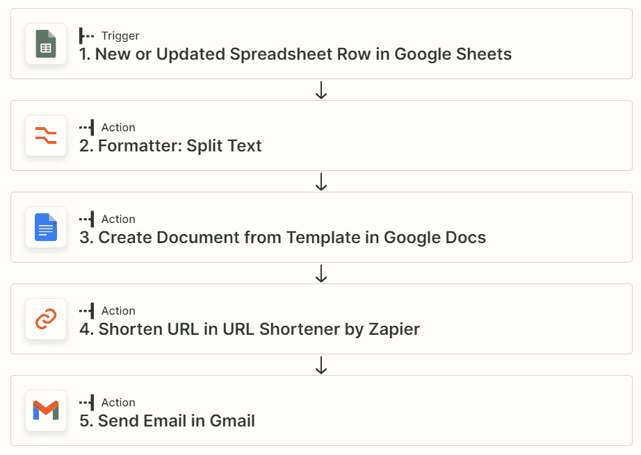

图 22.1 - 使用 Google Docs 操作事件的多步 Zap

让我们逐步设置 Zap，从触发步骤开始。

### 设置触发步骤

我们在触发步骤中使用的 Google Sheet 电子表格如下所示：

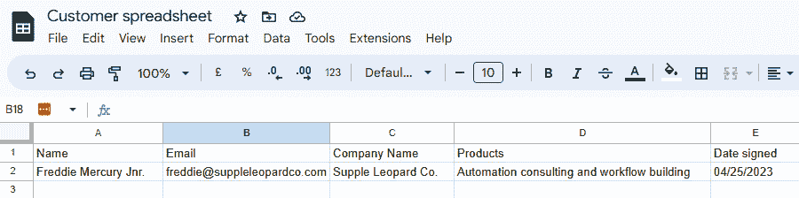

图 22.2 - 使用 Google 电子表格触发字段更新

一旦`Date signed`列更新了日期，Zap 就会触发。我们将使用 Google Sheets 应用程序，并选择工作表中更新了`Date signed`列的列，因此我们将从**触发器** **列**字段的下拉菜单中选择该列。

以下屏幕截图显示了此步骤的外观：

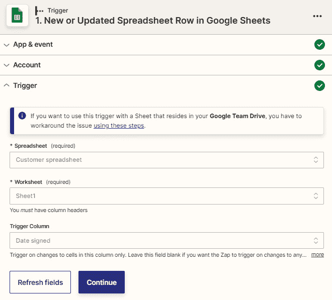

图 22.3 - Google Sheets 中使用新建或更新电子表格触发事件的概述

单击**继续**按钮，然后单击**测试触发器**按钮以提取一些测试数据。

接下来，让我们设置 Zap 的第二步 - 第一个操作步骤。

### 设置 Zap 的第二步

我们想要从全名中提取联系人的名字，以便我们可以个性化文档和电子邮件并使用更少正式的称谓。因此，我们将使用 *Formatter by Zapier* 应用程序，将来自触发步骤的 `Name` 动态数据输入到 **输入** 字段，并选择 **First** 作为 **Segment Index**。

下面的屏幕截图展示了此步骤应该看起来的样子：

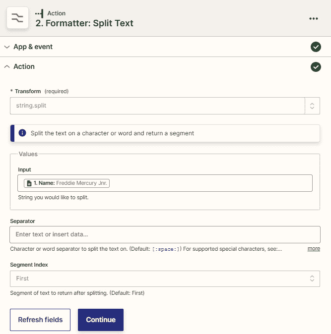

图 22.4 – 使用 Formatter by Zapier 的 Split 转换选项的 Text 动作事件概述以拆分掉名字的第一部分

点击 **继续** 按钮。然后，您可以使用 **测试** 部分来分割出名字的第一部分。

接下来，让我们设置下一个动作步骤。

### 设置 Zap 的第三步。

首先，我们需要创建并命名 Google Docs 模板，并将其存储在特定文件夹位置，例如，我们将其命名为 `模板`。接下来，根据您想要添加到模板的字段，创建自定义邮件合并字段。在本例中，我们将使用 `{{name}}`、`{{company}}`、`{{date}}` 和 `{{products}}`；但您也可以按照自己的需求命名它们。我们的 Google Docs 模板设置如以下屏幕截图所示：

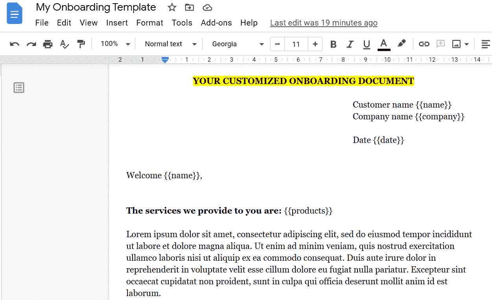

图 22.5 – 使用邮件合并字段创建的 Google Docs 模板

接下来，按照以下步骤自定义动作步骤：

1.  在 **新文档的文件夹** 字段的下拉菜单中选择 `模板` 文件夹，以便我们可以找到要使用的模板。一旦检索到模板文档，如果您想要将新文档存储在另一个文件夹中，可以更改此位置。

1.  在 `我的` `入职模板` 中。

1.  然后从触发步骤中映射 `Company Name` 数据，并将文本 `入职计划` 输入到 **新文档的名称** 字段中。

1.  从 **共享偏好** 字段的下拉菜单中选择 **任何人均可通过链接查看** 选项，以便联系人可以查看文档。

1.  在 **未使用字段偏好** 字段中选择 **保留** 选项，因为数据始终可用。

1.  根据以下两个屏幕截图所示，通过将来自触发步骤的动态数据和来自 Zap 的第二步的格式化文本输出映射到自定义邮件合并字段，完成自定义邮件合并字段：

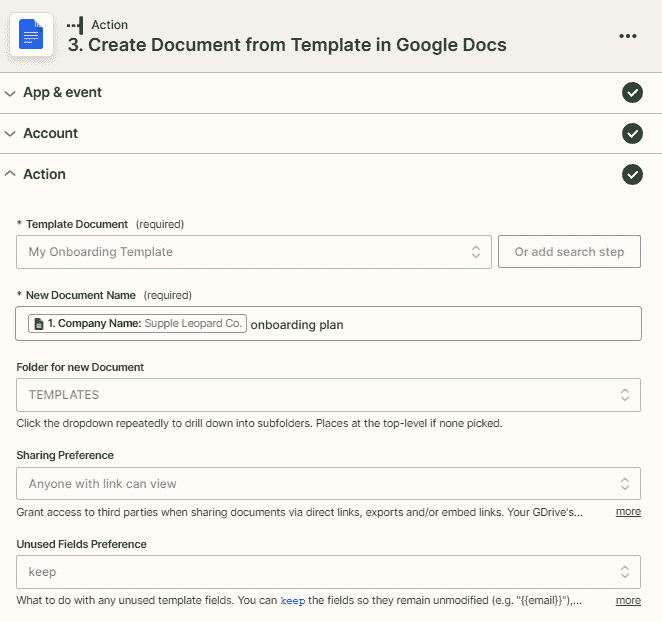

图 22.6 – 使用 Google Docs 集成中的创建模板文档动作事件的概述（1）

动作步骤的第二部分如下图所示：

图 22.7 – 使用 Google Docs 集成中的从模板创建文档的动作事件（2）

1.  点击**继续**按钮。然后您可以使用**测试**部分来创建文档。该场景的结果如下截图所示：

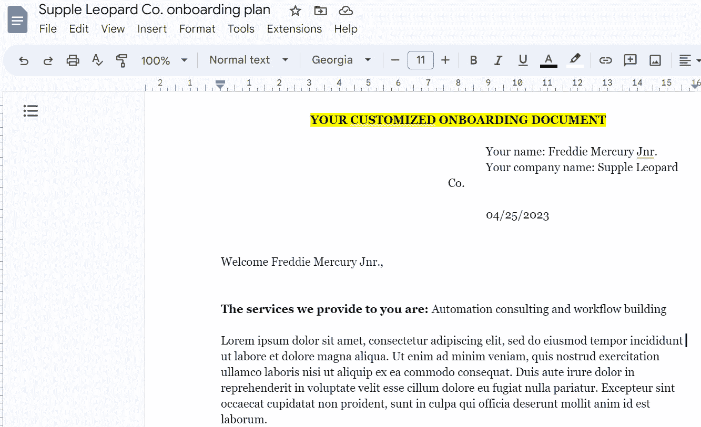

图 22.8 – 从模板创建的 Google 文档

接下来，让我们设置第三个动作步骤。

### 设置 Zap 中的第四步

我们希望能够与客户分享文档链接；但是我们希望使其更短更美观。因此，我们将使用*Zapier 的 URL 缩短器*应用程序，使用 Zap 的第三步动作中的`Alternate Link`数据，这是一个可共享的链接。

以下截图显示了此步骤应该是如何的：

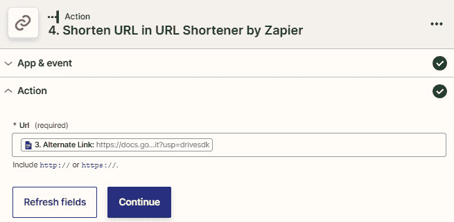

图 22.9 – 通过 Zapier 集成使用 URL 缩短器概述来缩短 URL

点击**继续**按钮。然后您可以使用**测试**部分来创建缩短的 URL。

接下来，让我们设置最终的动作步骤。

### 设置 Zap 中的第五步

最后，我们想要向联系人发送一封带有文档链接和 PDF 附件的电子邮件。我们将使用 Gmail 应用程序的**发送电子邮件**动作事件，并按照以下方式自定义此动作步骤：

1.  完成来自 Zap 触发步骤的`Email`地址动态数据。

1.  使用**发件人**和**签名**下拉字段从您的 Gmail 帐户中选择要使用的电子邮件地址和签名。

1.  为**主题**和**正文（HTML 或纯文本）**字段定制相关文本，并从 Zap 的第二步中为第一个名字和第四步中的缩短 URL 映射动态数据。

1.  将来自 Zap 的第三步的`Export Links Application/pdf`动态数据映射到**附件**字段。

这显示在以下三个截图中：

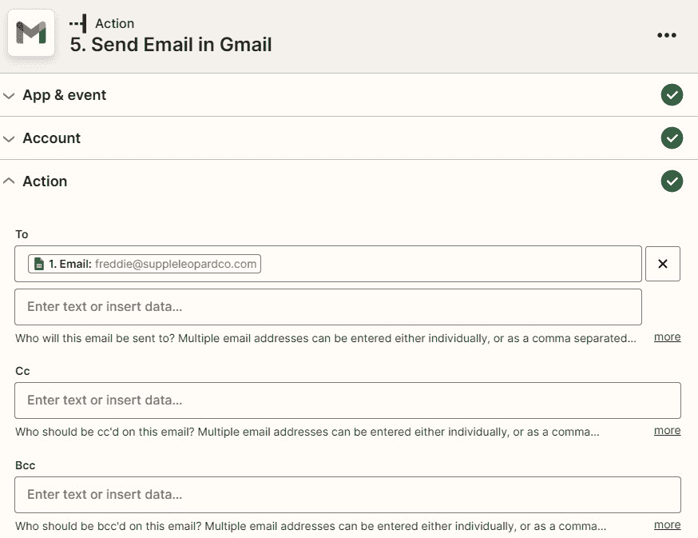

图 22.10 – 使用 Gmail 集成发送带有链接和附件的电子邮件的概述（1）

动作步骤的第二部分如下截图所示：

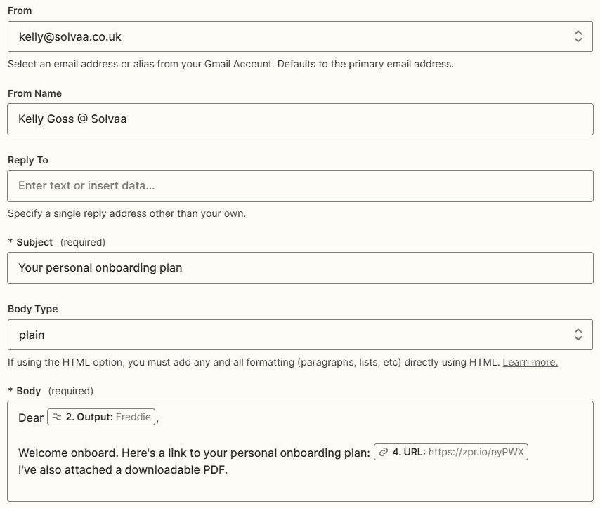

图 22.11 – 使用 Gmail 集成发送带有链接和附件的电子邮件（2）

动作步骤的第三部分如下截图所示：

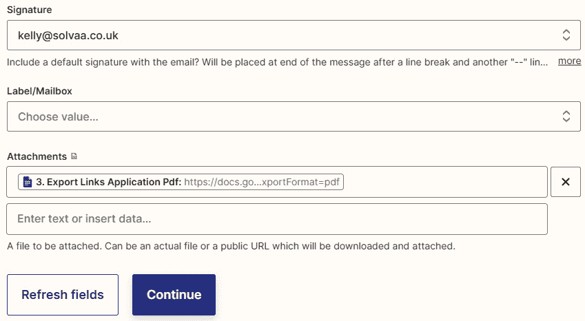

图 22.12 – 使用 Gmail 集成发送带有链接和附件的电子邮件（3）

1.  点击**继续**按钮。然后您可以使用**测试**部分来发送电子邮件。

以下是生成的电子邮件的两个截图：

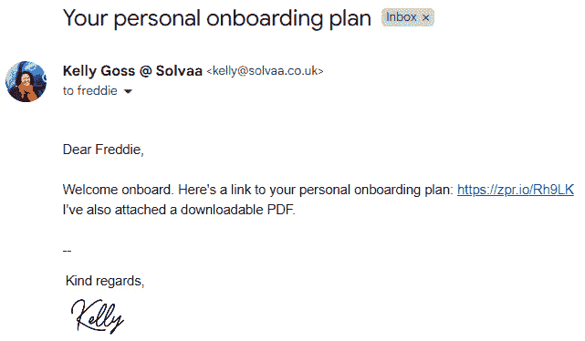

图 22.13 – 发送给联系人的显示链接的电子邮件（1）

附件的电子邮件的第二部分如下屏幕截图所示：

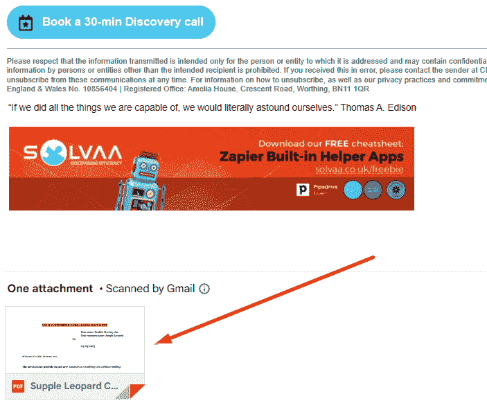

图 22.14 – 发送给联系人的显示附件的电子邮件概览（2）

如果您无法将文件视为 PDF，请检查并调整您的 Google Drive 共享首选项。您可以在 [`bit.ly/zapier-book`](https://bit.ly/zapier-book) 获取此 Zap 模板的副本。

现在，您应该更好地了解如何使用 Google Docs 集成自动化在线 Word 文档流程。

# 摘要

在本章中，我们讨论了可以使用 Zapier 自动化的不同类型的操作流程，并介绍了与一些常见的面向操作的应用程序一起使用的一些工作流程示例。首先，我们概述了一些可以使用 Zapier 自动化的操作流程类型。然后，我们探讨了如何开始使用 Zapier 自动化操作流程。最后，我们讨论了如何使用 Google Docs 集成自动化在线 Word 文档流程。

现在您知道如何使用 Zapier – 具体来说是与 Google Docs 集成 – 自动化您的操作流程了。

在下一章中，您将学习如何自动化您的财务和报告工作流程。我们将讨论一些不同类型的财务和报告流程，并提供这些流程如何使用 Zapier 进行自动化的实际示例。我们还将提供有关如何解决与财务和报告工作流相关的问题的实用技巧。

# 问题

1.  使用 Zapier 可以自动化哪些类型的操作流程？

1.  使用 Google Docs 集成时，您应该使用文件的名称还是 ID 来映射您的操作步骤？
