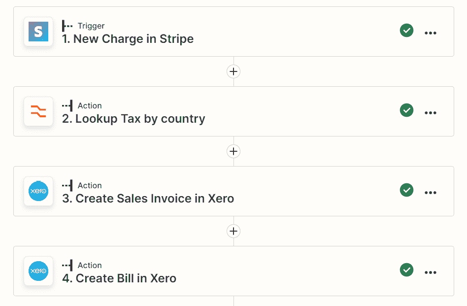
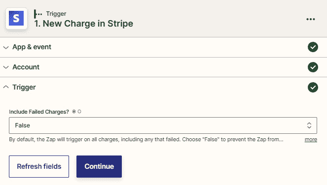
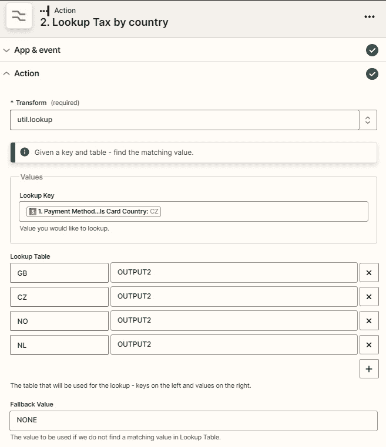
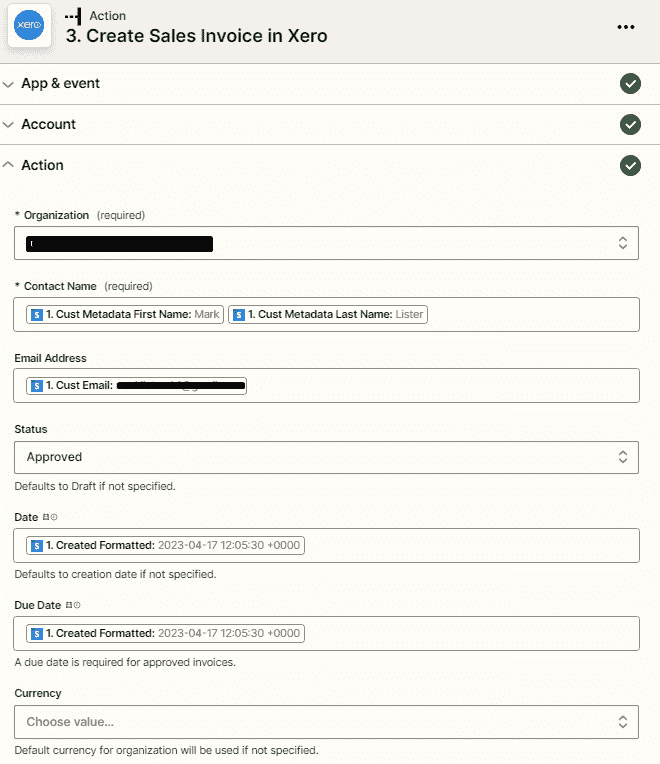
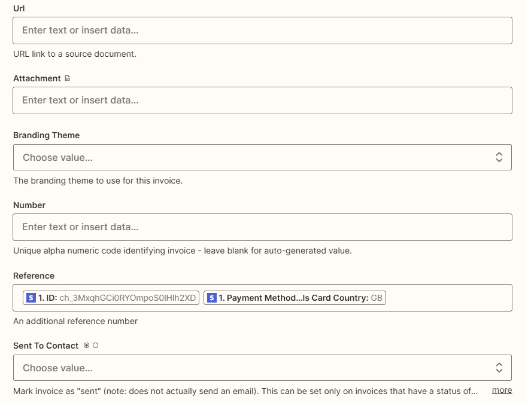
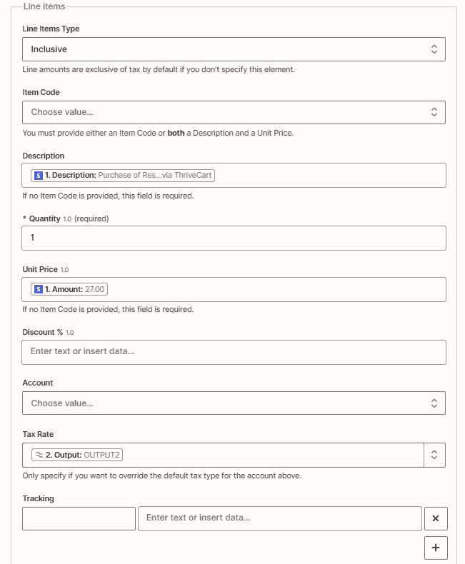
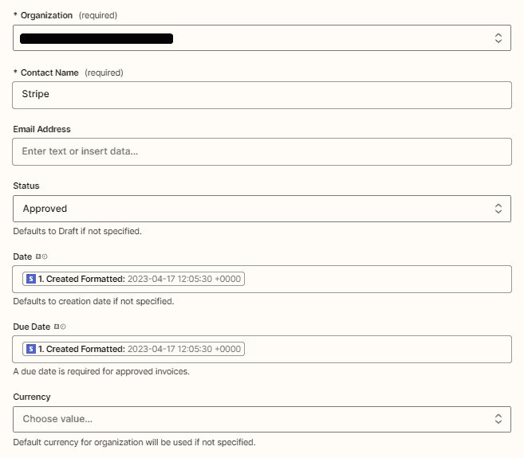
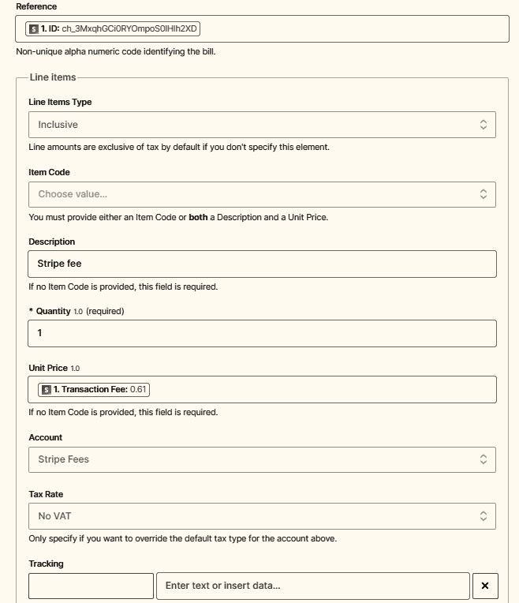

# 第二十三章：自动化您的财务和报告流程

到目前为止，我们已经介绍了如何自动化三个关键的业务功能，即营销、销售和运营。这三个领域的高效流程直接影响您的财务流程，因为更多的潜在客户转化为销售，然后顺利地提供服务，这意味着有更多的会计交易需要处理。因此，自动化您的财务流程意味着随着业务规模的扩大，您可以更快、更准确地处理更大量的交易，从而让您能够获得实时的财务绩效数据。

一旦您更好地掌握了您的会计流程，您可以集中精力获取来自业务各方面的高质量数据，通过自动化报告流程来获得更好的可见性。拥有这些即时和准确的数据让您能够主动地获得关于业务绩效的见解，而无需太多的手动干预。您可以轻松地为关键利益相关者制作管理报告，并分析业务的弱点和改进的机会。

在这一章中，我们将讨论可以利用 Zapier 自动化的不同类型的财务和报告流程，并且我们将提供一些常见应用程序使用的工作流示例。首先，我们将概述可以利用 Zapier 自动化的财务流程的类型，比如处理销售和采购发票以及管理在线付款交易等。接下来，我们将概述可以利用 Zapier 自动化的报告流程的类型，比如创建用于报告和可视化业务绩效数据的数据集。之后，我们将看看如何使用 Zapier 自动化财务和报告流程的起点。最后，我们将深入了解如何利用 Xero 集成来自动化会计流程。

我们将在本章中涵盖以下关键主题：

+   利用 Zapier 自动化您的财务流程的介绍

+   利用 Zapier 自动化报告流程的介绍

+   从哪里开始利用 Zapier 自动化您的财务和报告流程

+   利用 Xero 集成自动化会计流程

一旦您完成了这些主题中的每一个，您将更好地理解可以利用 Zapier 自动化的不同财务和报告流程。您将了解如何使用 Zapier 自动化一些最常见应用程序的财务和报告流程。

# 技术要求

要充分利用本章内容，您将需要一个 Zapier 账户。您需要 Zapier 的免费计划来创建单步工作流，并使用 Zapier 的预建模板。您需要 Zapier 的入门级计划来使用高级应用程序并创建多步工作流。

您可以在[`bit.ly/zapier-book`](https://bit.ly/zapier-book)获得本章中使用的 Zap 模板。使用模板将帮助您了解流程的运作方式。

# 使用 Zapier 自动化财务流程简介

许多企业都在努力保持其财务记录的最新状态。事实上，如果他们没有专门的记账员或会计团队，许多企业所有者会将记账作为最后一刻要做的任务之一。我们希望大多数企业现在在处理财务方面完全不使用纸张；然而，有时候，你无法避免需要购买和费用的纸质副本。即使企业可以通过电子邮件从供应商那里收到所有购买发票，使用允许你拍摄费用和购买的费用管理工具，并创建数字销售发票并通过电子邮件发送给客户的费用管理工具，实现完全数字化的会计管理系统，但将所有这些数据记录在一个地方的过程仍然可能是手动、重复、耗时且极易出错的过程。

随着应用程序之间本地集成和使用连接器工具（如 Zapier）将您业务流程的其他部分连接到特定于财务的工具的进步，企业现在能够快速准确地创建购买发票和收据，创建和发送销售发票，并将付款分配给现有发票——如果需要，还可以附上原始交易的副本。改进这些流程最终会增加实时财务报告的效率和准确性。

使用本地集成和连接器工具（如 Zapier）可以显著改善财务流程的一个例子可以在[`solvaa.co.uk/optimising-xero-to-deliver-cost-and-time-savings/`](https://solvaa.co.uk/optimising-xero-to-deliver-cost-and-time-savings/)找到。

## 了解可以使用 Zapier 自动化的财务流程

Zapier 与各种财务工具有许多集成，可以轻松准确地自动化您的**财务流程**。您可以将这些财务应用程序连接到其他成千上万个应用程序，例如 Salesforce、Shopify、Google Drive 和 Microsoft Excel，以自动化业务流程的所有部分，包括您的财务流程。

以下是可以使用 Zapier 自动化的一些财务流程的示例：

+   发票管理和会计工作流程

+   付款处理工作流程

让我们逐个探讨并举例说明可以与 Zapier 一起使用的财务应用程序，以自动执行涉及的流程。

### 自动化发票管理和会计流程

作为一个典型的企业，您很可能需要处理来自供应商的账单和费用交易，例如当您为客户在餐厅购买午餐，或者您的销售团队出差产生酒店和生活补贴费用并收集收据时。您可以通过自动将带有附件的电子邮件转发到 **光学字符识别**（**OCR**）应用程序（如 Dext（之前称为 ReceiptBank）和 Hubdoc）来自动在您的会计应用程序中创建这些采购发票和费用。这些 OCR 应用程序会将发票上的详细信息转录下来，并将数据直接推送到 Xero 和 QuickBooks Online 等会计应用程序中。

Dext 与 Zapier 集成，可以在处理完票据数据后触发工作流程，票据数据可用于导出，以及处理完票据通知时触发。您可以将这些触发器与操作事件结合使用，以在您的会计软件中创建新的发票或账单，或将信息添加到 Google Sheets 电子表格中。您还可以提交收据或销售发票，检查处理收据的数量，并在使用合作伙伴账户时创建新的客户账户。您可以将这些操作与触发器结合使用，例如将新文件添加到 Google Drive 或 Box 中，或者收到带附件的新电子邮件。或者，如果您使用的是 Hubdoc 等没有 Zapier 集成的 OCR 应用程序，则可以使用 Gmail 或 Microsoft Outlook Zapier 集成，分别使用 **New Labeled Email** 或 **New Email** 触发事件，将带附件的电子邮件转发到与 OCR 应用程序链接的电子邮件地址。

如果您使用费用管理应用程序，例如 **Expensify**，您可以通过 Zapier 自动化费用处理流程，通过整理收据、创建报告以及将数据导出到您的会计应用程序来实现。通过 Expensify 集成，您可以在创建新报告时触发工作流程。您可以将此触发器与操作事件结合使用，以在 Xero 或 Quickbooks Online 中为承包商添加或创建采购发票，或向经理发送费用报告副本的电子邮件。您还可以创建单个费用项目，创建费用报告，将报告导出为 PDF，并查找报告。将这些操作与触发器结合使用，以从新的 Dropbox 文件或 Google Sheets 电子表格行创建费用项目。

专用的发票应用程序，例如 Zoho Invoice、**Invoice Ninja** 和 **InvoiceBerry**，允许您即时创建发票并将其发送给客户。它们还允许您通过有用的仪表板和分析跟踪应收账款流程，通常用于收付款和发送提醒。这些应用程序与 Zapier 集成，因此允许您自动化发票创建和许多其他功能。

通过 Zoho Invoice 集成，当创建新的联系人、联系对象、估价、货物、发票或项目时，你可以触发自动化工作流程。你可以将这些触发与动作事件结合起来，将发票或估价详细信息添加到 Smartsheet 或通过 Email by Zapier 发送发票给联系人。你还可以创建新的联系人、联系对象、估价、货物或发票，以及搜索发票。将这些与触发事件相结合，当在 ActiveCampaign 中赢得一笔交易时创建联系人，或在 Acuity Scheduling 或 Calendly 中预订新约会时添加发票。

如果，另一方面，你正在使用像 Xero、Quickbooks Online、Freshbooks Classic 或 Zoho Books 这样的专用会计应用程序来集中管理你所有的应付款和应收款流程，你可以使用 Zapier 来自动化大量的财务流程，然后简化其他涉及它们的业务流程。这些应用程序都集成了 Zapier，并提供了许多触发、动作和搜索操作事件。与会计应用程序的 Zapier 集成通常具有行项支持，允许你在销售发票、账单和费用中创建多行数据。

使用 Quickbooks Online 集成，你可以使用多个触发、动作和搜索操作事件。这里有很多功能，我们只给出了一些使用该集成可以完成的例子。当添加新的账户、客户、估价、发票、销售收据、付款、供应商、账单或采购订单时，接收新的付款，或更新客户记录时，你可以触发工作流程。你可以将这些触发与动作事件结合起来，在 Microsoft Excel 表中添加新行，为 ShipStation 创建新订单，或在你的 CRM 中更新交易或机会。你还可以创建新的客户、估价、发票、销售收据、退款收据、信用备忘单、产品或服务、付款、供应商、账单、时间活动或采购订单，发送发票或销售收据，并更新客户或发票。将这些操作与触发结合起来，当在 Stripe 或 Paypal 中确认新付款时创建发票和付款，或者当在 Gravity Forms 或 **Wufoo** 提交表单时创建新客户。你还可以搜索或创建客户或供应商，以及查找账户、发票、产品或产品组。

在财务流程中使用自动化的威力真的是显而易见的，特别是如果你的业务有大量的销售交易 - 例如，如果企业通过 Shopify、Woocommerce、Kajabi 或 Thinkific 等电子商务平台出售热门的数字产品和服务，如课程和会员资格。能够自动化在会计 app 中创建销售发票对许多企业来说都是一个改变游戏规则的举措，大大减少了记账时间。你可以在*第二十一章*的*自动化电子商务流程*部分，*自动化你的销售流程*中了解更多信息。

有一些与 Zapier 集成的会计和发票 app，你可以在[`zapier.com/apps/categories/accounting`](https://zapier.com/apps/categories/accounting)和[`zapier.com/apps/categories/invoices`](https://zapier.com/apps/categories/invoices)上查看。

接下来，让我们讨论如何使用 Zapier 自动化支付处理流程。

### 自动化支付处理流程

我们刚刚谈到了如何使用 Zapier 来自动化在你的发票或会计 app 中创建销售发票。对于任何企业来说，准确记录你的销售非常重要，但可能更重要的是确保你尽快收到销售款项。使用在线支付解决方案自动收取发票款项，或者允许客户支付这些发票而无需进行银行转账，可以提高发票支付时间和业务资金流。Stripe 和 Paypal 是两个与许多发票和电子商务 app 集成的最受欢迎的在线支付解决方案。

通过 Paypal 集成，你可以在成功销售时触发工作流程，退款销售，或任何商家交易发生时。你可以将这些触发器与操作事件结合起来，将新联系人添加到 ActiveCampaign 并将其添加到自动化流程中，使用 Gmail 发送售后或退款邮件，将新发票或贷项通知添加到 Xero，或将销售记录添加到 Google Sheets 电子表格中。

许多企业已经抓住了提供会员资格、俱乐部和产品订阅的重复收入机会。这可能涉及到为你最喜欢的巧克力棒或健康食品产品支付月度订阅，或者与在线课程支持社区相关的年度订阅。有几种订阅管理工具，如**Chargebee**、**Recurly**和**Chargify**，它们帮助你管理重复支付。

使用 Chargify 集成，您可以在新订阅或发票创建时触发工作流程，添加新客户时触发，以及在订阅状态更改或更新时触发。将这些触发器与动作事件相结合，以在 Slack 或 Microsoft Outlook 中收到通知，在 Mailchimp 中更新联系人，或在 Asana 中添加任务。您还可以创建客户、优惠券和产品价格点，并创建或更新订阅。您可以将这些操作与触发器相结合，以便在 Smartsheet 中更新行或将新联系人添加到 Salesforce 时创建新订阅。您可以添加搜索操作以查找产品、产品系列或组件，并在需要时创建订阅或客户。

使用 Revolut Business 等数字银行解决方案也可以通过允许您自动化许多与财务相关的流程来提高效率。通过 Revolut Business 集成，您可以在兑换、发送或接收资金时触发工作流程。将此触发器与操作步骤结合使用，例如在收到资金时使用 Zapier 发送邮件通知。您还可以搜索帐户，以便在 Revolut Business 中发送资金后检索信息，然后将详细信息添加到 Google Sheets 电子表格中。

再次强调，在您的会计应用程序中自动化付款通知，尤其是在涉及大量交易时，将显着提高簿记流程的生产力。

有许多与 Zapier 集成的支付处理应用程序，您可以在[`zapier.com/apps/categories/payment-processing`](https://zapier.com/apps/categories/payment-processing)查看。

您现在了解了使用 Zapier 可以自动化哪些财务流程。现在让我们来看看如何使用 Zapier 自动化报告流程的介绍。

# 使用 Zapier 自动化您的报告流程介绍

现在，您已经花时间简化和自动化了营销、销售、运营和财务流程，了解这些关键领域如何根据关键绩效指标（KPI）和指标执行至关重要。企业只有在手头拥有最新和准确的报告信息时才能做出正确的决策。如果此信息可以即时获得，您就不必花费数小时下载和处理数据以呈现给关键决策者；他们将随时掌握顶级关键数据。

随着技术的进步，企业不再必须依靠手工制作的条形图和图表来可视化业务绩效数据。电子表格工具本身已成为先进的报告工具，允许进行复杂的计算和数据操作。我们用于各种业务功能的许多应用程序都有自己的报告模块，这使得企业能够提取有用的报告并在内部可视化报告数据。然后，企业面临的问题是，他们的报告存在于多个系统和工具中，仍然需要整合和汇总，以便您只需登录到更少的位置并查看重要的报告数据。使用 Zapier 等工具进行自动化可以帮助您将关键数据放入正确的位置，以增强您的报告和指标可视化流程。

## 理解可以使用 Zapier 自动化的报告流程

Zapier 与一些报告工具集成，使您能够自动化您的**报告流程**。您可以将这些应用连接到成千上万的其他应用程序，例如 Paypal、AgileCRM、**Quaderno**和 Google 表格，以自动化其他业务功能的报告。

以下是可以使用 Zapier 自动化的一些报告流程的示例：

+   电子表格报告工作流程

+   网站分析工作流程

+   业务智能和仪表板工作流程

让我们逐个探讨并举一些例子，说明可以与 Zapier 一起使用的报告应用程序，以自动化涉及它们的流程。

### 自动化电子表格报告流程

在*第二十二章*的“*理解可以使用 Zapier 自动化的运营流程*”部分，*自动化您的运营流程*，我们介绍了在各种运营流程中使用诸如 Microsoft Excel、Google Sheets 和 Smartsheet 等电子表格工具。这些工具被广泛用于记录和处理带有简单或复杂公式的数字数据，然后可以用于以图表和表格形式可视化报告。您还可以使用 Google Sheets 的附加组件从其他来源（如 Google Analytics）提取数据，或将 Google Sheets 与 Infogram 等仪表板工具集成，以在一个地方显示自定义数据。通过使用 Zapier，您可以将关键报告数据推送到您的电子表格中，然后可以对其进行显著的操作和转换，以自动显示您的数据可视化。

接下来，让我们讨论如何使用 Zapier 自动化网站分析流程。

### 自动化网站分析流程

许多企业在在线存在方面投入了大量时间和金钱，通过从各种来源吸引流量到他们的网站来创建网站并推广他们的产品、服务和声誉。正如我们在*第二十章*中讨论的*自动化营销流程*中所述，企业可以使用多种方法将流量推向他们的网站，这可能包括付费广告、客座博客发布和社交媒体营销。他们还尝试通过**搜索引擎优化**（**SEO**）来提高他们在搜索中的在线可见性。在所有这些情况下，企业需要一种方式来一目了然地看到其营销工作的结果，而 Google Analytics 和 **Hotjar** 都是分析和可视化网站流量的行业标准工具的例子，它们都能让您做到这一点。通过使用诸如此类的工具，您将更好地了解您的网站访问者，例如他们的来源和地理位置，并了解他们的行为，例如他们在您的网站上花了多长时间以及在哪些页面上。然后，通过使用 Zapier 等自动化工具，您可以通过自动化报告流程来提高您的生产力，例如安排报告每周在特定时间运行，并通过电子邮件交付报告，并跟踪来自您的呼叫应用程序 Twilio 的已完成呼叫的离线转换。

当使用 Google Analytics 时，您可以创建目标和针对这些目标的测量，以跟踪来自各种来源的数据。通过 Google Analytics 集成，您可以在添加新目标时触发工作流，并结合动作通过短信发送通知。您还可以创建测量、更新目标、运行报告，以及搜索目标。您可以将这些操作与触发器结合使用，从 Typeform 响应或 Calendly 预订中创建新的测量，或者安排报告在每周五的早上 9 点使用 Zapier 的计划运行。

有几个与 Zapier 集成的分析应用程序，您可以在[`zapier.com/apps/categories/analytics`](https://zapier.com/apps/categories/analytics)上查看。

接下来，让我们讨论如何使用 Zapier 自动化商业智能和仪表板流程。

### 自动化商业智能和仪表板流程

除了网站分析以外，你的技术堆栈中的大多数工具可能都有某种类型的报告功能。然而，当你有多个工具时，你需要从许多地方提取报告数据。如果我们可以将来自各种应用程序的所有关键报告统计在一个或几个关键仪表板上，在数据自动刷新的同时放在一个地方，那不是很棒吗？这就是商业智能和仪表板工具的作用所在。这些应用程序允许您在一个地方汇总所有重要的报告数据，创建衡量收集到的数据的关键绩效指标，并以适合您需求的图形形式呈现这些数据。许多这些工具与流行的应用程序（如 Facebook 和 Salesforce）进行集成，但通常并没有这些集成。像 Zapier 这样的自动化工具通过提取关键数据段并将您想要更改指标的确切数据推送到这些仪表板工具中来提高您的报告流程的效率。如果您的应用程序和选择的仪表板工具之间并没有集成，这将非常方便。 Databox，Geckoboard，Klipfolio，Dasheroo 和 Zoho Analytics 是一些商业智能和仪表板报告工具的例子，它们与 Zapier 集成。

例如，通过 Klipfolio 集成，您可以将数据添加到源中，更新数据源中的数据并刷新数据源。您可以将这些操作事件与涉及其他应用程序的触发器相结合，以允许您在不必手动导入数据的情况下更新见解。您可以跟踪 Klaviyo 或 Autopilot 中订阅者列表的特定部分的增长，或跟踪 ActiveCampaign 中的退订和广告系列单击次数。您还可以监视 Twitter 的关注者数量，SurveyMonkey 的反应，Toky 的通话或关闭的 Asana 任务。

有几种商业智能和仪表板应用程序与 Zapier 集成，您可以在[`zapier.com/apps/categories/dashboards`](https://zapier.com/apps/categories/dashboards)上查看。

提示

您可以使用商业智能和仪表板流程与其他关键领域（例如来自 Google Analytics 和 YouTube 的营销分析）链接，以更好地了解您的业务在所有业务功能中的表现。

您现在已经了解了可以使用 Zapier 自动化哪些类型的报告流程。让我们来看看开始自动化您的财务和报告流程的基本步骤。

# 从何处开始使用 Zapier 自动化您的财务和报告流程

在开始自动化你的流程之前，做一些准备工作总是很重要的。在*第二章*“准备自动化你的流程”和*第三章*“构建你的第一个自动化工作流（Zap）”中，我们讨论了一些重要的要点。当你在制定你的财务和报告工作流程时，它们很有帮助；具体如下：

1.  **绘制你的财务和报告流程**：如果你对你的财务和报告流程在所有工具中的运作方式没有明确的想法，可以按照*第二章*“简化流程和评估可自动化内容”部分的步骤，通过可视化绘制你的流程，这样你就可以对你的任务是如何与现有软件配合工作有一个总体的概览。

1.  **列出你的财务和报告工具**：列出你在业务中使用的所有财务和报告工具和服务，以实现你的目标。然后，评估这些工具在你绘制的流程中的适应性。这样，你就能简化这些流程，并决定哪些可以自动化。一旦你对你的流程和工具有了这个概览，你就能更好地了解其中的问题所在，以及 Zapier 如何帮助你填补这些空缺并自动化你的流程。

1.  **列出你的财务和报告工具**：按照*第二章*“准备自动化你的流程”的步骤，简化你的流程并列出你在业务中使用的所有工具，以评估哪些可以自动化。

1.  **查看你的应用程序配置文件页面**：在*第二章*“准备自动化你的流程”中，我们还讨论了查看你各个应用程序配置文件页面的重要性，这是确定你的业务应用程序如何与 Zapier 集成的最佳方式。这将让你了解可在你的工作流程中使用的触发器、操作和搜索功能。制作一个清单以供快速参考。

1.  **使用 Zapier 的预构建指导工作流模板**：这是开始自动化你的财务和报告流程的最简单方法。这些模板是根据其他用户常用的工作流程构建的。它们很适合用作灵感，可以快速设置，并立即节省你的时间。

1.  **自定义你的财务和报告工作流程**：创新点，开始构建多步骤的工作流程，以在自动化中实现更多功能。使用 Zapier 的内置应用程序来帮助你实现更多功能，并将你的财务和报告工作流程与业务流程的其他部分（比如操作流程）连接起来。

1.  **结合 AI 和自动化**：利用 AI 动力的 Zapier 功能和集成 AI 应用程序，提升你的财务和报告工作流程的效率。在*第十九章*“AI 和自动化”中获取更多信息。

您将为您的业务创建财务和报告自动化而努力。

提示

如果您正在寻找其他用于您业务的财务和报告应用程序的想法，您可以在应用生态系统目录中查看**商务**和**商业智能**类别，以提供一个与 Zapier 集成的公共应用程序列表：[`zapier.com/apps/categories/commerce`](https://zapier.com/apps/categories/commerce) 和 [`zapier.com/apps/categories/business-intelligence`](https://zapier.com/apps/categories/business-intelligence)。在*第二章*，*准备自动化您的流程*，中查看*选择新应用程序的简要指南*部分，以了解如何选择新应用程序。

您现在知道如何使用 Zapier 自动化您的财务和报告流程了。让我们更具体地讨论如何使用 Zapier 的 Xero 集成自动化会计流程。

# 使用 Xero 集成自动化会计流程

Xero 是一款广受小型和中型企业欢迎的基于云的会计软件包。使用 Xero，您可以管理应付账款和应收账款流程，以及管理费用报销和工资单，并跟踪库存项目。您可以创建并发送报价、销售发票和采购订单，并且可以全面报告您的财务情况。您还可以连接支付处理解决方案，如 PayPal、**GoCardless** 和 **Stripe**，以帮助您更快地收到客户的付款。连接银行到 Xero 的能力自动化了部分交易对账过程，省去了手动导入银行对账单和交易行条目的需要。根据您的位置，您可以直接从 Xero 提交税务申报并支付账单。Xero 还允许您处理多种货币。

Xero 本地集成了数百个其他应用程序，以允许您将您业务的其他部分连接到您的财务系统。但是，您可以使用 Zapier 集成来增强您的流程，通过将 Xero 连接到成千上万的其他应用程序，使您能够自动化会计流程的许多部分。Xero 集成非常全面，目前支持几个触发、操作和搜索事件。完整列表可以在 Xero 应用程序配置文件页面上找到：[`zapier.com/apps/xero/integrations`](https://zapier.com/apps/xero/integrations)。

让我们来看看一些 Xero 触发事件和一些可能的使用案例。

## Xero 触发事件和使用案例

以下是您可以与 Xero 一起使用的受支持的触发事件列表，以及何时使用它们的示例：

+   **新联系人**: 当在 Xero 中添加新联系人时触发此事件。除其他外，您可以在自动化中使用此触发器事件，当新联系人被添加到 Xero 后立即将其添加到其他应用程序（例如您的电子邮件营销应用程序或库存管理应用程序）中。例如，将此触发器事件与**使用 Klaviyo 创建订阅者**或**与 Dear Inventory 合并创建客户**等操作事件结合使用。

+   **新报价**: 当在 Xero 中创建新报价时触发此事件。除其他外，您可以在自动化中使用此触发器事件，当发送报价后希望在您的 CRM 中设置提醒以跟进接收方，或者如果要发送通知给您的团队以接受报价，则使用此触发器事件。例如，将此触发器事件与**使用 AgileCRM 创建任务**或**与 Ryver 合并创建帖子**等操作事件结合使用。

+   **新销售发票**: 当在 Xero 中创建新的销售发票（应收账款）时触发此事件。您可以在自动化中使用此触发器事件，当您希望将新提交的销售发票的详细信息添加到电子表格中或者为所有经授权的销售发票向客户发送传真时。例如，将此触发器事件与**与 Microsoft Excel 合并添加行**或**与 ClickSend SMS 合并发送传真**等操作事件结合使用。

+   **新采购订单**: 当在 Xero 中添加新采购订单时触发此事件。除其他外，您可以在自动化中使用此触发器事件，当您希望将新采购订单的详细信息添加到数据库中或根据采购订单的状态通知您的团队时。例如，将此触发器事件与**与 Knack 合并创建记录**或**与 Microsoft Teams 合并发送通道消息**等操作事件结合使用。

+   **新账单**: 当在 Xero 中创建新的账单（应付账款）时触发此事件。您可以在自动化中使用此触发器事件，当您希望在账单到期日添加新的日历事件或将任务添加到您的任务管理应用程序以在到期日支付账单时。例如，将此触发器事件与**与 Microsoft Outlook 合并创建事件**或**与 Any.Do 合并创建任务**等操作事件结合使用。

+   **新费用报销单**: 当在 Xero 中创建新的草稿费用报销单时触发此事件。除其他外，您可以在自动化中使用此触发器事件，当您希望通知审批人新的费用报销已准备好审核或将任务添加到您的待办事项列表时。例如，将此触发器事件与**通过 Zapier 发送出站邮件**或**与团队工作项目合并创建任务**等操作事件结合使用。

+   **新银行交易**：当在 Xero 中进行新银行交易时，此事件将触发。除其他方式外，当您想要跟踪正在处理的交易并将其添加到电子表格中时，您可以在自动化中使用此触发事件。例如，将此触发事件与**使用 Google Sheets 创建电子表格行**等动作事件结合使用。

+   **新支付**：当在 Xero 中进行新支付时，此事件将触发。当您想要在自动化中发送感谢邮件给客户以支付您的发票，或者当天发送所有已支付发票的摘要给团队时，您可以使用此触发事件。例如，将此触发事件与**使用 Gmail 发送电子邮件**或**使用 Digest by Zapier 追加条目和安排摘要**以及**使用 Slack 发送通道消息**等动作事件结合使用。您可以从[`bit.ly/zapier-book`](https://bit.ly/zapier-book)下载 Zap 模板。

接下来，让我们看一些 Xero 操作事件和用例。

## Xero 操作事件和用例

以下是一些与 Xero 配合使用的支持的操作事件列表，以及何时使用它们的示例：

+   **创建/更新联系人**：当您想要在 Xero 中创建新联系人或更新现有联系人时，可以使用此操作事件。您可以将此操作事件与**使用 Pipedrive 更新交易阶段**等触发事件结合使用，以在 CRM 中的交易达到某个阶段时将联系人添加到 Xero 中，或者将**在 Mailchimp 中点击链接**与 Xero 结合使用，以在电子邮件活动中点击链接时更新 Xero 中的联系人。

+   **创建新报价草稿**：当您想要在 Xero 中创建新的报价草稿时，可以使用此操作事件。您可以将此操作事件与**使用 HubSpot 新的表单提交**等触发事件结合使用，以便在联系人通过 HubSpot 表单请求报价时创建新的报价草稿，或者将**新联系人**与 Xero 结合使用，以在将新联系人添加到 Xero 时创建报价草稿。

+   **创建销售发票**：当您想要在 Xero 中创建新的销售发票（应收账款）时，可以使用此操作事件。例如，当交易移动到 CRM 中的**开票**阶段时，您只想在 Xero 中添加详细联系人（如果该联系人不存在），然后在 Xero 中创建与该联系人关联的销售发票时，可以使用此操作事件。您可以将 HubSpot 中的**阶段中的新交易**触发事件与 Xero 中的**查找联系人**搜索动作和 Xero 中的**创建销售发票**动作事件结合使用。您可以观看有关使用 Pipedrive CRM 触发事件的实际示例的视频，并从[`bit.ly/zapier-book`](https://bit.ly/zapier-book)下载 Zap 模板。

+   **向现有销售发票添加项目**：当您想使用新项目更新 Xero 中的现有销售发票时，您可以使用此操作事件。您可以将此操作事件与 Shopify 的**更新订单**触发事件结合使用，以向 Xero 中的现有发票添加额外项目，并且您可以使用 Xero 的**查找发票**搜索操作来查找发票，当发票编号或参考已填写了来自 Shopify 的适当参考时。

+   **通过电子邮件发送销售发票**：当您想发送 Xero 中的现有销售发票时，您可以使用此操作事件。当您想创建新发票并将其发送给 Xero 联系人时，您可以将此操作事件与 Xero 的**创建发票**操作事件结合使用。

+   **创建采购订单**：当您想在 Xero 中创建新的采购订单时，您可以使用此操作事件。您可以将此操作事件与 Airtable 中的**新或更新记录**触发事件结合使用，以在 Airtable 中填写字段时创建采购订单。

+   **创建账单**：当您想在 Xero 中创建新的账单（应付款）时，您可以使用此操作事件。当您想使用 Docparser 解析账单详情，然后在 Xero 中创建相应的账单时，您可以将此操作事件与 Docparser 的**可用解析文档数据**触发事件结合使用。

+   **创建信用票据**：当您想创建与 Xero 中联系人相关联的新应付款或应收款信用票据时，您可以使用此操作事件。您可以将此操作事件与 Magento 的**新销售订单信贷备忘录**触发事件和 Xero 的**查找发票**触发事件结合使用，以在 Magento 中提出信贷备忘录时，在 Xero 中针对相关发票创建信用票据。

+   **创建银行交易**：当您想在 Xero 中创建新的付款或收款交易时，您可以使用此操作事件。您可以将此操作事件与 Stripe 中的**新收费**或**新退款**触发事件结合使用，以在 Stripe 进行新付款或退款时创建、接收或发送资金直接支付。

+   **创建银行转账**：当您想在指定的 Xero 组织中在您的不同银行账户之间转账时，您可以使用此操作事件。您可以将此操作事件与 PayPal 中的**成功销售**触发事件结合使用，以在 PayPal 中定期将资金从您的 PayPal 银行账户转移到 Xero 的当前银行账户，每次完成销售时。

+   **创建支付**：当您想针对 Xero 中的发票、信用票据、预付款或过付款创建新的支付时，您可以使用此操作事件。您可以将此操作事件与 Square 的**新交易**触发事件和 Xero 的**查找发票**触发事件结合使用，以在 Square 中完成交易时针对 Xero 发票创建支付。

接下来，让我们看一些 Xero 搜索操作事件和使用案例。

## Xero 搜索操作事件和使用案例

现在让我们来看看你可以与 Xero 一起使用的两个支持的搜索操作事件：

+   **查找联系人**：当你想在 Xero 中找到联系人时，你可以使用此搜索操作事件。你可以将此搜索操作与其他 Xero 触发器或操作事件结合使用在你的自动化中。请参阅*Xero 操作事件*和使用案例部分，了解如何在使用此搜索操作事件后跟 Xero **创建销售发票** 操作步骤的示例。

+   **查找发票**：当你想在 Xero 中找到发票时，你可以使用此搜索操作事件。你可以将此搜索操作与其他 Xero 触发器或操作事件结合使用在你的自动化中。例如，当你想要为付款发票的客户发送感谢邮件，并且想要附上发票的 PDF 复件时，你可以使用 **New Payment** 触发事件与 **Find Invoice** 搜索操作以及 **Send Email** 与 Gmail 操作事件。你可以在 [`bit.ly/zapier-book`](https://bit.ly/zapier-book) 下载 Zap 模板。

接下来，让我们回顾一些最佳使用 Xero 集成的提示。

## 使用 Xero 集成的提示

以下是成功使用 Xero 集成的一些提示：

+   **只读**、**仅发票** 和 **现金账簿客户** 用户将无法使用集成。你必须拥有*标准*或*顾问*权限，并且你将能够使用的触发器和操作将取决于你对某些模块的访问权限。

+   只连接你的 Xero 帐户到一个 Zapier 帐户。这将防止断开连接的问题。

+   总是检查你输入或映射数据到的字段类型，并确保你的数据格式正确。这将确保数据的准确性。你可以查看*第三章*，*构建你的第一个自动化工作流（Zap）*，了解有关字段类型的更多信息。

+   在使用`已授权`时。

+   Xero 集成支持使用行项目。为了优化在你的工作流中使用此集成，你可以查看*第十八章*，*Zapier 的实用功能*，了解有关转换行项目数据的更多信息。如果你的触发器和操作步骤都支持行项目，你将不需要转换数据。

+   您可以通过使用 Xero 记录 ID 加上查看 URL 来创建您不同应用程序之间的连接。例如，当您在 Xero 中创建销售发票时，请使用发票 URL 更新 CRM 中交易或机会记录中的自定义字段，以便组织中的其他 Xero 用户可以查看发票。在本例中，URL 加上 ID 的组合将是 [`go.xero.com/AccountsReceivable/View.aspx?InvoiceID=b2f9e6df-73ab-4ccd-9978-258f22ef4665`](https://go.xero.com/AccountsReceivable/View.aspx?InvoiceID=b2f9e6df-73ab-4ccd-9978-258f22ef4665)，其中 `b2f9e6df-73ab-4ccd-9978-258f22ef4665` 是销售发票 ID。

+   查看 [`developer.xero.com/documentation`](https://developer.xero.com/documentation) 上的 Xero API，了解您可以使用 Webhooks by Zapier 和 Code by Zapier 执行的其他触发器和操作的信息。您可以从 [`experts.zapier.com/`](https://experts.zapier.com/) 聘请 Zapier 专家来帮助您进行自定义集成工作。

+   您可以通过导航到应用程序配置文件的 **帮助** 选项卡或点击此链接查看 Xero 集成的常见问题：[`help.zapier.com/hc/en-us/articles/8495985208589`](https://help.zapier.com/hc/en-us/articles/8495985208589)。

接下来，让我们探讨如何使用 Xero 集成设置多步 ZAP 的示例。

## 设置使用 Xero 集成的多步 ZAP

为了说明这一点，我们将使用在 Stripe 中创建新收费时在 Xero 中创建销售发票和账单的示例。我们还希望根据买方所在国家的位置正确分配 Xero 税码。

ZAP 将包括四个步骤，如下所示：

1.  **触发器**：Stripe 应用程序与 **New Charge** 触发事件。

1.  **操作**：Formatter by Zapier 应用程序与 **Utilities** 动作事件和 **Lookup Table** 转换函数。

1.  **操作**：Xero 应用程序与 **创建销售发票** 动作事件。

1.  **操作**：Xero 应用程序与 **创建账单** 动作事件。

以下屏幕截图显示了构建后的 ZAP 在进行了一些步骤名称自定义后的外观：

图 23.1 – 使用 Xero 动作事件的多步 ZAP

让我们逐步设置 ZAP，从触发步骤开始。

### 设置触发步骤

我们将使用 Stripe 应用程序的 **New Charge** 触发事件作为触发步骤。在 **Include Failed Charges?** 字段中，选择 **False**，因为我们不希望 ZAP 在失败的收费上触发。

下面的屏幕截图显示了此步骤的外观：

图 23.2 – 概述自定义 Stripe 触发事件中的新收费以触发工作流

单击**继续**按钮，然后使用**测试触发器**按钮拉取一些测试数据。

接下来，让我们设置 Zap 的第二个步骤 - 第一个动作步骤。

### 设置 Zap 的第二步

我们希望将销售发票税收定制为与客户的卡片链接的国家相匹配。在这种情况下，我们希望所有欧洲客户地点都有`OUTPUT2`，而所有其他国家都具有`NONE`。您的税务设置根据您的 Xero 地区而有所不同。我们将使用 Zapier 应用程序的格式化器与`Payment Method Details Card Country`和右侧的`OUTPUT2`。对于所有其他国家，我们将设置`NONE`。

以下屏幕截图显示此步骤应该是什么样子：

图 23.3 - 在 Formatter by Zapier 操作事件中使用 Utilities 操作事件并选中查找表转换选项来查找税码

单击`OUTPUT2`以获取`CZ`国家代码的税率。

接下来，让我们设置下一个动作步骤。

### 设置 Zap 的第三步

我们将使用 Xero 应用程序和**创建销售发票**动作事件，并通过使用下拉菜单选项或映射来自之前步骤的动态数据来自定义此操作步骤的**组织**，**联系人姓名**，**电子邮件地址**，**状态**，**日期**，**到期日期**，**货币**，**品牌主题**，**参考**，**说明**，**数量**，**单价**，**帐户**和**税率**字段。重要的是，我们可以输入联系人的姓名和电子邮件地址，并直接从此步骤创建新联系人，然后将**税率**字段与 Zap 中第二步的输出映射。使用下面的三个屏幕截图完成此步骤。这是第一部分:

图 23.4 - 使用 Xero 应用程序集成创建销售发票的概述（1）

操作步骤的第二部分如下截图所示：

图 23.5 - 使用 Xero 应用程序集成创建销售发票（2）

操作步骤的第三部分如下截图所示：

图 23.6 - 使用 Xero 应用程序集成创建销售发票的概述（3）

单击**继续**按钮。然后，您可以使用**测试**部分发送电子邮件。

接下来，让我们设置最终操作步骤。

### 设置 Zap 的最后一步

我们将使用 Xero 应用程序的**创建账单**操作事件，并通过使用下拉菜单选项、输入文本或映射来自先前步骤的动态数据来定制此操作步骤的**组织**、**联系人姓名**、**状态**、**日期**、**到期日期**、**参考**、**行项目类型**、**描述**、**数量**、**单价**、**帐户**和**税率**字段。请使用以下两个屏幕截图来完成此步骤：

图 23.7 – 使用 Xero 应用程序集成创建销售发票的概述（1）

此操作步骤的第二部分如下所示：

图 23.8 – 使用 Xero 应用程序集成创建销售发票的概述（2）

点击**继续**按钮。然后，您可以使用**测试**部分来创建笔记。

您可以在[`bit.ly/zapier-book`](https://bit.ly/zapier-book)上获得此 Zap 模板的副本。

现在您应该更好地了解如何使用 Xero 集成自动化财务流程。

# 摘要

在本章中，我们讨论了可以使用 Zapier 自动化的不同类型的财务和报告流程，并探讨了一些使用一些常见应用程序的工作流程示例。首先，我们概述了可以使用 Zapier 自动化的财务流程类型。接着，我们介绍了可以使用 Zapier 自动化的报告流程类型。之后，我们探讨了如何开始使用 Zapier 自动化财务和报告流程。最后，我们讨论了如何使用 Xero 集成来自动化会计流程。

现在您知道如何使用 Zapier 自动化您的财务和报告流程，特别是涉及 Xero 集成的财务流程。

在下一章中，您将学习一些增强使用 Zapier 在您的业务中取得成功的实用技巧、诀窍和最佳实践。

# 问题

1.  可以使用 Zapier 自动化哪些类型的财务流程？

1.  可以使用 Zapier 自动化哪些类型的报告流程？
