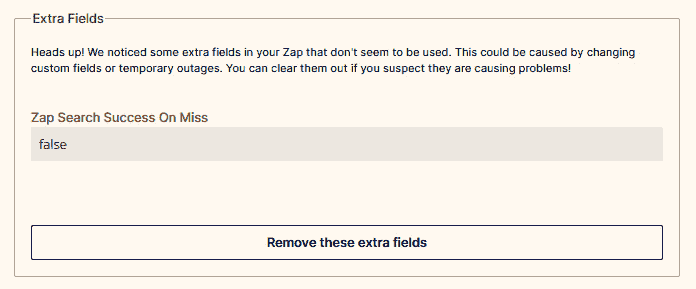
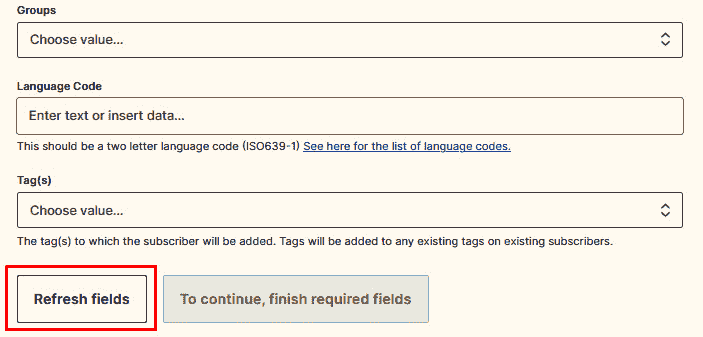

# 第二十四章：提升你的生产力的技巧、窍门和最佳实践

我们很快就要结束我们的 Zapier 指导之旅了。我们涵盖了许多主题，将帮助你在你的业务或为你的客户使用 Zapier 创建有效的工作流自动化。在这一章中，我们将讨论有效利用 Zapier 的最佳实践，并在每一章中学到的技巧和窍门的基础上建立。首先，我们将重述本书中涵盖的步骤，以帮助你构建你的 Zap。我们还将探讨一系列你可以使用的技巧和窍门，有效地在 Zapier 中创建工作流，以获得最佳性能。

在本章中，我们将涵盖以下关键主题：

+   有效使用 Zapier 的最佳实践

+   提升你对 Zapier 的使用的技巧和窍门

一旦你学习了每个主题，你就会更好地理解在 Zapier 构建工作流自动化时使用的最佳实践。

# 技术要求

要充分利用本章内容，你将需要访问 Zapier 账户。Zapier 免费计划足以让你创建单步工作流，并使用 Zapier 的预构建模板。Zapier 入门计划将需要你使用高级应用程序并创建多步骤工作流。

# 有效使用 Zapier 的最佳实践

了解如何优化在你的业务中使用 Zapier 的最佳方式是回顾我们在这本书的每一章中探讨的内容，这样你就有一个快速参考点。让我们简要探讨一下本书中涵盖的内容，作为在 Zapier 中构建工作流的最佳实践的概述。

## 从基础开始

在开始时做好基础工作将为你的成功做好准备。一旦你选择了最适合你的 Zapier 计划并创建了 Zapier 账户，下一步就是熟悉 Zapier 平台的导航，然后编辑你的设置和偏好以适应。确保你也掌握了 Zapier 平台使用的术语，这将在故障排除时帮助你。我们在*第一章*，*使用 Zapier 进行业务流程自动化*中涵盖了这些主题。

## 在自动化之前的准备

准备是成功的关键，也将从一开始为你节省大量时间。实施有效的自动化的一个重要部分是确保你已经确定了你的手工和重复的流程，对其进行记录并首先简化它们。一旦你做到这一点，你应该确定你的业务应用程序如何适应这些流程，以及这些应用程序如何与 Zapier 集成。利用 Zapier 应用程序生态系统目录提供的信息来帮助你做到这一点。我们在*第二章*，*准备自动化你的流程*中涵盖了这些主题。

当你准备好开始构建你的 Zaps 时，首先制定最佳的流程结构策略。由于你无法在 Zap 编辑器中拖放你的步骤，所以在构建你的 Zaps 之前先规划好步骤将节省你的时间。我们在*第三章*，*构建您的第一个自动化工作流（Zap）* 中涵盖了这个主题。

## 熟悉步骤、字段和数据映射

在构建你的 Zap 的关键第一步是理解触发器、操作和搜索操作步骤如何一起工作。了解如何通过下拉菜单、从你的 Zap 的先前步骤映射数据以及输入文本来输入数据到你的操作步骤中的字段也很重要。你还需要了解操作步骤中使用的不同字段类型以及这些字段中接受的数据类型。我们在*第三章*，*构建您的第一个自动化工作流（Zap）* 中涵盖了这些主题。

## 有效管理你的 Zaps

拥有一个组织良好的 Zapier 账户将帮助你在你构建的 Zaps 越多、在你的业务中自动化越多的情况下保持结构化。通过适当命名和存储在特定文件夹中来保持你的 Zaps 有条理，有助于保持整洁的账户。了解如何单独管理你的 Zaps 和连接的应用程序，以及了解状态，可以节省你在故障排除时的时间。你可能还想与其他 Zapier 用户分享 Zaps，以及与团队成员分享 Zaps、应用程序连接和文件夹。我们在*第四章*，*管理您的 Zaps* 中涵盖了这些主题。

## 了解任务使用情况的关键

当你开始熟悉 Zapier 时，你会想要关注你的任务使用情况。从一开始可能并不明显；然而，在你的 Zaps 中犯错是很容易的，这可能导致你的 Zaps 过度触发，导致任务使用量过高。当你使用任务分配较少的低价套餐时，这一点更为重要。解决方案通常是在触发步骤之后很快添加一个 Filter by Zapier 步骤，以允许你的 Zap 仅在触发数据满足某些条件时运行。现在，为了确保你能够监控你的任务使用情况，你可以使用内置应用程序 Zapier Manager 设置一个 Zap，并在需要时关闭特定的 Zap。我们在*第十二章*，*使用内置应用程序管理您的 Zapier 账户* 中涵盖了这个主题。

## 设置警报并了解如何解决问题

在某个时候，你会遇到 Zaps 的错误和问题。成功的关键提示是拥有一个良好监控的 Zapier 账户，这样你就可以迅速解决这些问题。确保你已经相应调整了你的账户设置，并创建了 Zap 错误和应用程序状态警报，以便通知你 Zaps 和 Zapier 账户的问题。一旦你做到了这一点，当你遇到错误或工作流程不按计划进行时，知道如何进行故障排除对于成功使用 Zapier 至关重要。当你无法自行解决问题时，你还需要知道去哪里寻求帮助。我们在 *第五章* 中涵盖了这些主题，*故障排除和处理 Zap 错误*，以及 *第十二章*，*使用内置应用程序管理您的 Zapier 账户*。

## 了解不同的内置 Zapier 应用程序和功能

你不需要一次性了解如何使用所有 Zapier 的内置应用程序，但了解它们的作用以及在构建 Zaps 时如何帮助你是非常有用的。

我们从 *第六章* 开始，提供了所有批准的内置应用程序的方便概述（不处于测试阶段的应用程序），*创建多步 Zaps 和使用内置应用程序*，然后从 *第七章* 开始，逐一详细讨论了每一个。

开始使用的最有用的内置应用程序是 Filter by Zapier，我们在 *第七章* 中进行了介绍，*开始使用内置应用程序*，以及多功能的 Formatter by Zapier 内置应用程序，我们从 *第十四章* 开始介绍，*格式化日期和时间*，到 *第十八章*，*Zapier 的实用功能*。

您还可以探索如何通过 AI 加速您的自动化。我们在 *第十九章* 中讨论了在 Zapier 中使用 AI，*AI 和自动化*。

您可以访问 [`bit.ly/zapier-book`](https://bit.ly/zapier-book) 获取所有 Zapier 内置应用程序的综合备忘单。

## 获得灵感

对于您的业务中可以自动化的内容有一个良好的了解是您构建 Zap 的重要起点。如果您需要一些灵感和示例，了解如何使用 Zapier 自动化不同的业务功能流程，您可以查看从 *第二十章* 到 *第二十三章*，*自动化您的营销流程*，*自动化您的财务和报告流程* 的内容。

## 定期审查您的流程和自动化

持续改进是保持成功自动化流程的另一个关键因素。一旦你构建了你的前几个 Zaps，请确保定期审查它们，并根据错误和流程的变化进行调整。定期审查你的 Zaps，并确保它们具有所需步骤的最少数量，也将有助于减少任务使用，并防止你多付费用。我们在*第三章*中已经涵盖了这个主题，*构建你的第一个自动化工作流程（Zap）*。

你现在应该对有效使用 Zapier 的最佳实践有了更好的了解。接下来，让我们回顾一些能进一步优化你的 Zapier 使用的技巧和诀窍。

# 提升你对 Zapier 的使用的技巧和诀窍

现在你已经学会了如何构建你的前几个 Zaps，你正在朝着为你的业务实现超级充电并让其自动运行的目标迈进，可能会遇到一些痛点，如果你知道下一步该怎么做，这些问题可能相对容易地得到解决。让我们来看看一些能帮助你的小贴士和技巧。

## 触发器数据未传输

有些应用集成可能会出现无法获取真实触发器数据的问题，当你尝试测试你的触发器时。在许多情况下，如果找不到触发器数据，Zapier 将传输虚拟数据，你可以在操作步骤映射中使用。有时，Zapier 不会生成任何虚拟数据，如果你点击**跳过测试**按钮，你应该可以在你的操作步骤中使用占位符，一旦 Zap 被打开并运行，这些占位符将填充数据。请放心，一旦你开始运行 Zap，你的 Zap 将以正确的映射方式运行。

你还可以使用节点 ID 的代码手动映射数据，该数据包含了数据的步骤和字段名称，例如看起来可能像这样：`{{122484559__First Name}}`。你可以在[Zapier 社区文章](https://community.zapier.com/featured-articles-65/how-to-manually-map-fields-that-do-not-appear-in-the-sample-data-aka-custom-pill-mapping-9738)中了解更多关于如何处理这个问题的信息。

## 时区设置

确保你已经在**账户设置**中指定了你的时区设置，并在必要时在具体的 Zaps 中也进行了设置。尽管许多应用程序使用你的计算机或位置设置来设置时区，但你的应用程序处理该信息的方式可能会有所不同。这可能会在你的 Zap 运行结果中引起时间或日期的差异，从而造成 Zaps 中的问题。时区可能很难处理，所以如果你需要一些额外的帮助来评估时区的问题，你应该联系 Zapier 支持。你可以在*第十四章*中阅读更多关于处理时间和日期的信息，*日期和时间格式化*。

## 额外字段提醒

您可能会发现，一旦您构建了步骤，当您更改动作步骤中的应用程序或文件夹时，您将收到**额外字段**警告。这意味着您之前填写的字段已不再存在。如下截图所示：

图 24.1 - 附加字段警告消息概览

最好确保您始终清除未使用的字段数据，否则在 Zaps 运行时可能会出现错误。只需点击**删除这些额外字段**按钮即可。

## 调整应用程序时刷新字段

当您在应用程序中添加新的自定义字段时，请确保在涉及此更改的任何步骤中刷新字段。这一点非常重要，因为通常旧字段中的数据可能会重新映射到较新的字段，导致当您的 Zap 打开时出现不准确性。如下截图所示：

图 24.2 - 使用刷新字段按钮获取新字段信息的概览

这是相当常见的，例如，如果您在 Google Sheets 电子表格中添加额外的列，尤其是在现有列之间，或者在 Google Docs 模板中添加新的合并字段。点击**刷新字段**按钮以获取新的字段信息。

## 超越 Zapier 与应用程序允许的范围

您可能会发现 Zapier 与您在业务中使用的一个或多个应用程序的集成是针对常见用例进行定制的。然而，您可能希望通过集成实现更多功能，例如不同的触发器、操作或搜索，或者您可能希望添加某些字段并以更可用的方式重组数据。通常情况下，您可以通过熟悉 API 文档并使用 Webhooks by Zapier 内置应用程序进行 HTTP 请求，或者通过一些应用程序中的**API 请求**动作（此功能还在测试中），或者使用内置应用程序中的代码来实现更多功能。您还可以联系 Zapier 支持团队，了解集成是由谁构建的，是 SaaS 应用程序供应商还是 Zapier，并讨论是否可以改进集成。当应用程序集成处于测试阶段时，通常都是提供反馈并建议改进的好机会。

## 跳出思维定式

在创建工作流程时，要有创造力。如果你无法通过 Zapier 集成与你的应用程序实现某些功能，并且你已经探索了所有途径，考虑使用一个免费工具作为一个跳板。你不必局限于应用程序的传统用途。例如，你可以使用 Formatter by Zapier **Utilities**动作事件与**Lookup Table**转换功能来查找与一个键匹配的一个值。然而，如果你想搜索与一个键相关的多个值，你可以使用 Google Sheets 电子表格作为查找表。

## 将 Zapier 社区作为资源使用

如果你遇到问题，很可能其他 Zapier 用户也会遇到。Zapier 社区论坛可以在[`community.zapier.com/`](https://community.zapier.com/)找到，记录了其他用户遇到的可搜索问题和解答。论坛也经常由 Zapier 支持团队、几名 Zapier 专家和其他高级用户访问，如果你发现之前没有解决过你的问题，他们会乐意帮助你。

现在你应该对增强 Zapier 使用的技巧和窍门有了更好的理解。

# 总结

在本章中，我们讨论了采用的最佳实践，以增强你在业务中使用 Zapier 的成功。首先，我们回顾了本书涵盖的主题，这将帮助你有效地使用 Zapier。然后，我们探讨了一些实用的 Zap 构建的技巧和窍门。

你现在已经知道了在实施和使用 Zapier 时要遵循的最佳实践，以增强成功。

在接下来的章节中，我们将探讨各种情景，这将帮助你评估解决问题和构建 Zapier 工作流的能力。我们将探讨一个可以使用 Zapier 解决的具体问题，并在实际操作中解决每个例子，并提供一些提示。这些情景根据技能水平进行分类，你将有机会测试你的知识，并调整你的问题解决和 Zap 构建技能。

# 问题

1.  要确保成功自动化流程，前两个最佳实践是什么？

1.  在 Zapier 集成中，是否可能做的比触发器、动作和搜索所呈现给你的更多？
