# 第一章：入门指南：ChatGPT、OpenAI API 和提示工程

**ChatGPT**是由**OpenAI**开发的一个**大型语言模型**（**LLM**），专门设计用于根据用户提供的提示生成具有上下文意识的响应和内容。它利用**生成式人工智能**的力量来理解并智能地回应各种查询，使其成为许多应用程序的宝贵工具，包括网络安全。

重要提示

**生成式人工智能**是**人工智能**（**AI**）的一个分支，它使用**机器学习**（**ML**）算法和**自然语言处理**（**NLP**）来分析数据集中的模式和结构，并生成类似原始数据集的新数据。如果你在文字处理应用程序、手机聊天应用等地方使用自动更正，那么你很可能每天都在使用这项技术。也就是说，LLM 的出现远远超出了简单的自动补全。

LLM 是一种经过大量文本数据训练的生成式人工智能，使其能够理解上下文，生成类似人类的响应，并根据用户输入创建内容。如果你曾与帮助台聊天机器人进行过沟通，那么你可能已经使用过 LLMs 了。

**GPT**代表**生成式预训练识别器**，顾名思义，它是一个预先训练的 LLM，用于提高准确性和/或提供特定的基于知识的数据生成。

ChatGPT 在一些学术和内容创作社区引起了关于抄袭的担忧。由于其生成逼真和类似人类的文本的能力，它还被牵涉到了误传和社会工程活动中。然而，其改革多个行业的潜力也是不可忽视的。特别是由于其深厚的知识基础和执行复杂任务的能力（比如即时分析数据甚至编写完全功能的代码），LLMs 在更严谨的领域，比如编程和网络安全，已经显示出了巨大的潜力。

在这一章中，我们将指导你完成与 OpenAI 建立账户、熟悉 ChatGPT 并掌握提示工程（这是发挥这项技术真正力量的关键）的过程。我们还将介绍 OpenAI API，为你提供必要的工具和技术，以充分发挥 ChatGPT 的潜力。

你将首先学习如何创建 ChatGPT 账户并生成 API 密钥，该密钥作为你访问 OpenAI 平台的唯一访问点。然后我们将探讨使用各种网络安全应用程序的基本 ChatGPT 提示技术，比如指导 ChatGPT 编写查找你的 IP 地址的 Python 代码以及模拟应用 ChatGPT 角色的 AI CISO 角色。

本章将深入探讨如何利用模板增强 ChatGPT 输出，生成全面的威胁报告，并将输出格式化为表格，以改善展示效果，例如创建安全控制表。在阅读本章的过程中，你将学会如何将 OpenAI API 密钥设置为环境变量，以简化开发流程；使用 Python 发送请求和处理响应；高效地利用文件进行提示和 API 密钥访问；有效地使用提示变量创建多功能应用程序，如根据用户输入生成手册页面。到本章结束时，你将对 ChatGPT 的各个方面有扎实的理解，以及如何在网络安全领域利用其功能。

小贴士

即使您已经熟悉基本的 ChatGPT 和 OpenAI API 设置和原理，回顾*第一章*中的菜谱仍然对您有利，因为几乎所有的例子都设置在网络安全的背景下，这在一些提示示例中得到了体现。

在本章中，我们将介绍以下的菜谱：

+   设置 ChatGPT 账号

+   创建 API 密钥和与 OpenAI 进行交互

+   基本提示（应用场景：查找您的 IP 地址）

+   应用 ChatGPT 角色（应用场景：AI CISO）

+   利用模板增强输出（应用场景：威胁报告）

+   将输出格式化为表格（应用场景：安全控制表）

+   将 OpenAI API 密钥设置为环境变量

+   使用 Python 发送 API 请求并处理响应

+   使用文件进行提示和 API 密钥访问

+   使用提示变量（应用场景：手册页面生成器）

# 技术要求

本章需要使用**网络浏览器**和稳定的**互联网连接**来访问 ChatGPT 平台并设置您的账户。需要基本熟悉 Python 编程语言和命令行操作，因为你将要使用**Python 3.x**，需要在系统上安装 Python 3.x，以便使用 OpenAI GPT API 并创建 Python 脚本。还需要一个**代码编辑器**来编写和编辑 Python 代码和提示文件，以便在此章节中编写和编辑代码。

本章的代码文件可以在此处找到：[`github.com/PacktPublishing/ChatGPT-for-Cybersecurity-Cookbook`](https://github.com/PacktPublishing/ChatGPT-for-Cybersecurity-Cookbook) 。

# 设置 ChatGPT 账号

在本节中，我们将学习生成式人工智能、LLMs 和 ChatGPT。然后，我们将为你介绍如何注册 OpenAI 账户并探索其提供的功能。

## 准备工作

要设置 ChatGPT 账户，您需要一个活跃的电子邮件地址和现代的网络浏览器。

重要提示

在撰写本书时，我们已经尽力确保每个插图和指令都是正确的。但是，这是一个快速发展的技术领域，本书中使用的许多工具目前正在快速更新。因此，您可能会发现细微的差异。

## 如何做... 

通过建立 ChatGPT 账号，您将获得访问一个强大 AI 工具的能力，可以极大地增强您的网络安全工作流程。在本节中，我们将指导您完成创建账号的步骤，让您能够利用 ChatGPT 的能力进行各种应用，从威胁分析到生成安全报告：

1.  访问 OpenAI 网站 [`platform.openai.com/`](https://platform.openai.com/) 并点击 **注册**。

1.  输入您的电子邮件地址然后点击 **继续**。另外，您也可以使用您现有的 Google 或 Microsoft 账号注册：


图 1.1 – OpenAI 注册表

1.  输入一个强密码然后点击 **继续**。

1.  检查您的电子邮件，看看来自 OpenAI 的验证消息。点击邮件中提供的链接验证您的账号。

1.  完成账号验证后，输入所需信息（名字、姓氏、可选的机构名称和生日）然后点击 **继续**。

1.  输入您的电话号码进行电话验证，然后点击 **发送验证码**。

1.  当您收到包含验证码的短信时，输入验证码然后点击 **继续**。

1.  访问并收藏 [`platform.openai.com/docs/`](https://platform.openai.com/docs/) 以开始熟悉 OpenAI 的文档和功能。

## 工作原理...

通过建立一个 OpenAI 账号，您将获得访问 ChatGPT API 和平台提供的其他功能的权限，如 **Playground** 和所有可用模型。这将使您能够在您的网络安全操作中利用 ChatGPT 的能力，提升您的效率和决策流程。

## 还有更多...

当您注册免费的 OpenAI 账号时，您将获得价值 $18 的免费信用额度。虽然您可能不会在本书的内容中用完所有的免费信用额度，但随着持续使用，最终会用完。考虑升级到付费的 OpenAI 计划以访问额外功能，如增加的 API 使用限制以及优先访问新功能和改进：

+   **升级到** **ChatGPT Plus**:

    ChatGPT Plus 是一个订阅计划，提供了比免费访问 ChatGPT 更多的好处。通过 ChatGPT Plus 订阅，您可以期待更快的响应时间，在高峰时段甚至有通用访问 ChatGPT，以及优先访问新功能和改进（在撰写本文时包括访问 GPT-4）。这个订阅计划旨在提供增强的用户体验，并确保您能充分利用 ChatGPT 来满足您的网络安全需求。

+   **拥有 API 密钥的好处**：

    拥有 API 密钥对通过 OpenAI API 以编程方式利用 ChatGPT 的功能至关重要。通过 API 密钥，您可以直接从您的应用程序、脚本或工具中访问 ChatGPT，从而实现更加定制化和自动化的交互。这使您可以构建各种应用程序，集成 ChatGPT 的智能以增强您的网络安全实践。通过设置 API 密钥，您将能够充分利用 ChatGPT 的全部功能，并根据您的具体需求定制其功能，使其成为您网络安全任务的不可或缺的工具。

提示

我强烈建议您升级到 ChatGPT Plus，这样您就可以访问 GPT-4。虽然 GPT-3.5 仍然非常强大，但 GPT-4 的编码效率和准确性使其更适合我们将在本书中涵盖的用例和普遍的网络安全。在撰写本文时，ChatGPT Plus 还具有其他附加功能，如插件的可用性和代码解释器，这些功能将在后续章节中介绍。

# 创建 API 密钥并与 OpenAI 交互

在此食谱中，我们将指导您完成获取 OpenAI API 密钥的过程，并向您介绍 OpenAI Playground，您可以在其中尝试不同的模型并了解它们的更多功能。

## 准备工作

要获得 OpenAI API 密钥，您需要拥有活跃的 OpenAI 帐户。如果还没有，请完成 *设置 ChatGPT 帐户* 食谱以设置您的 ChatGPT 帐户。

## 如何做…

创建 API 密钥并与 OpenAI 交互使您能够利用 ChatGPT 和其他 OpenAI 模型的功能进行应用程序开发。这意味着您将能够利用这些人工智能技术构建强大的工具，自动化任务，并定制与模型的交互。通过本食谱的最后，您将成功创建了用于程序访问 OpenAI 模型的 API 密钥，并学会如何使用 OpenAI Playground 进行实验。

现在，让我们按照创建 API 密钥并探索 OpenAI Playground 的步骤进行：

1.  在 [`platform.openai.com`](https://platform.openai.com) 上登录您的 OpenAI 帐户。

1.  登录后，单击屏幕右上角的 **个人资料图片/名称**，然后从下拉菜单中选择 **查看 API 密钥**：

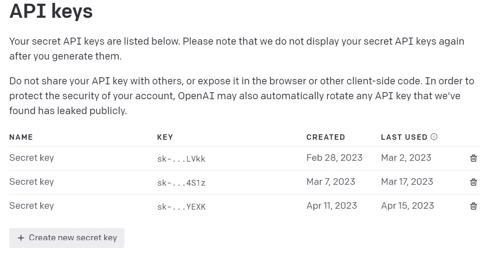

图 1.2 - API 密钥界面

1.  单击“+ 创建新的秘密密钥”按钮以生成新的 API 密钥。

1.  为您的 API 密钥命名（可选），然后单击 **创建秘密密钥**：


图 1.3 - 命名您的 API 密钥

1.  您的新 API 密钥将显示在屏幕上。单击 **复制图标** ，将密钥复制到剪贴板：

提示

立即将您的 API 密钥保存在安全的位置，因为稍后在使用 OpenAI API 时会需要它；一旦保存，您将无法再完整查看密钥。

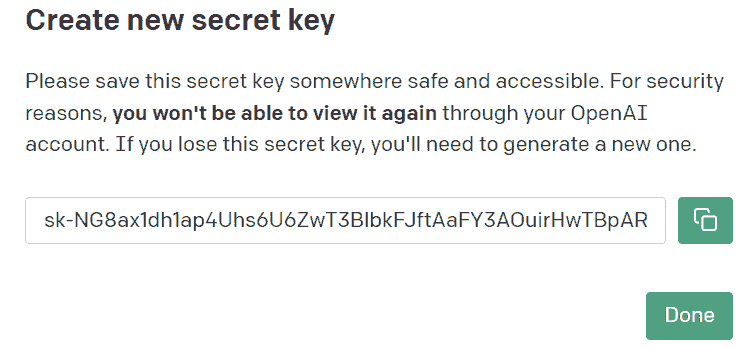

图 1.4 – 复制您的 API 密钥

## 工作原理…

通过创建 API 密钥，您可以通过 OpenAI API 实现对 ChatGPT 和其他 OpenAI 模型的编程访问。这使您能够将 ChatGPT 的功能集成到您的应用程序、脚本或工具中，从而实现更加定制化和自动化的交互。

## 更多内容…

**OpenAI Playground** 是一个交互式工具，允许您尝试不同的 OpenAI 模型，包括 ChatGPT，以及它们的各种参数，但不需要您编写任何代码。要访问和使用 Playground，请按照以下步骤操作：

重要提示

使用 Playground 需要令牌积分；您每个月都会为所使用的积分付费。从大多数情况来看，这个成本可以被认为是非常负担得起的，这取决于您的观点。然而，如果不加以监控，过度使用会导致显著的成本累积。

1.  登录到您的 OpenAI 账户。

1.  点击顶部导航栏中的 **Playground**：

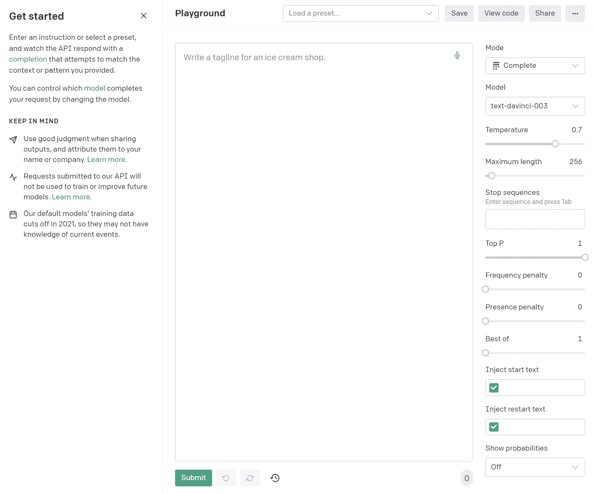

图 1.5 – OpenAI Playground

1.  在 Playground 中，您可以通过从**模型**下拉菜单中选择要使用的模型来选择不同的模型：

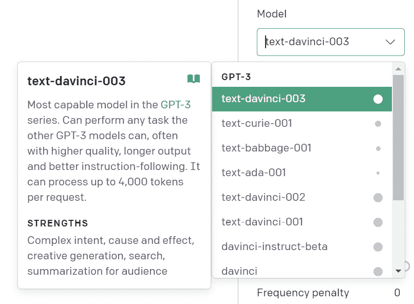

图 1.6 – 选择模型

1.  在提供的文本框中输入您的提示，然后点击 **提交** 查看模型的响应：

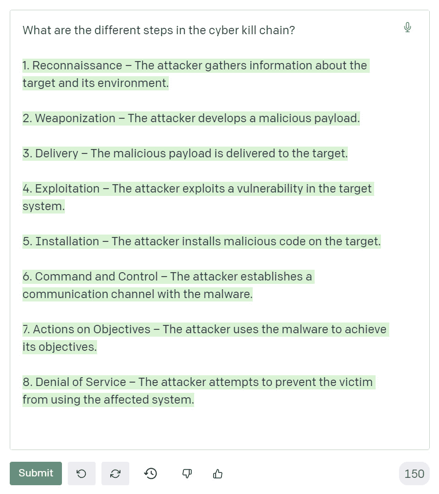

图 1.7 – 输入提示并生成响应

提示

即使您不需要输入 API 密钥来与 Playground 交互，使用仍然会计入您账户的令牌/积分使用情况。

1.  您还可以从消息框右侧的设置面板调整各种设置，如最大长度、生成的响应数量等：

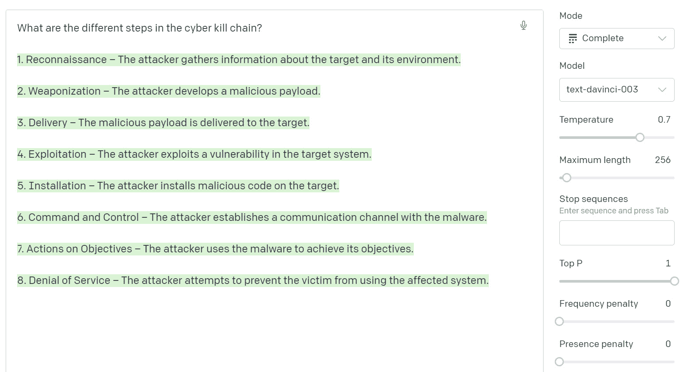

图 1.8 – 调整 Playground 中的设置

最重要的两个参数是**温度**和**最大长度**：

+   **温度**参数影响模型响应的随机性和创造性。较高的温度（例如，0.8）将产生更多样化和创造性的输出，而较低的温度（例如，0.2）将生成更加专注和确定性的响应。通过调整温度，您可以控制模型的创造性与对提供的上下文或提示的遵循之间的平衡。

+   **最大长度**参数控制模型在其响应中将生成的标记（单词或单词片段）的数量。通过设置较高的最大长度，您可以获得更长的响应，而较低的最大长度将产生更简洁的输出。调整最大长度可以帮助您将响应长度定制到您特定的需求或要求。

随意在 OpenAI Playground 中或在使用 API 时尝试这些参数，以找到适合您特定用例或期望输出的最佳设置。

Playground 允许您尝试不同的提示样式、预设和模型设置，帮助您更好地理解如何调整提示和 API 请求以获得最佳结果：

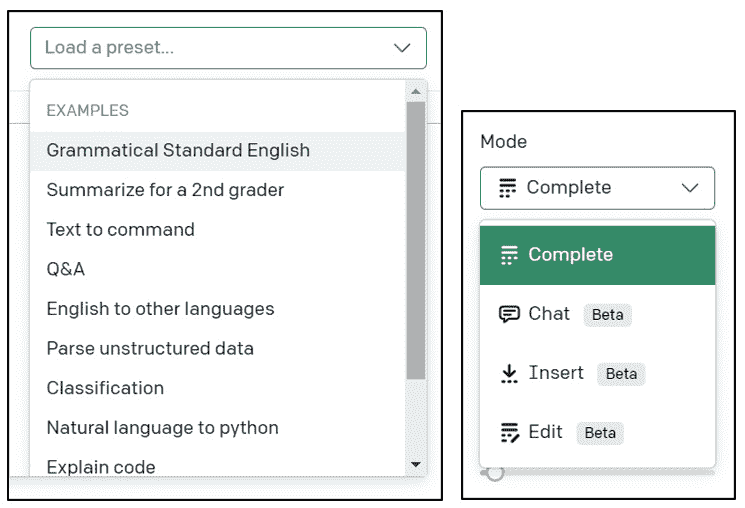

图 1.9 – 提示预设和模型模式

提示

虽然在本书中我们将使用 API 覆盖几种不同的提示设置，但我们不会涵盖所有情况。建议您查阅*OpenAPI 文档*以获取更多详情。

# 基本提示（应用程序：查找您的 IP 地址）

在本篇中，我们将使用 ChatGPT 界面探索 ChatGPT 提示的基础知识，该界面与我们在上一篇中使用的 OpenAI Playground 不同。使用 ChatGPT 界面的优点是它不消耗账户积分，并且更适合生成格式化输出，例如编写代码或创建表格。

## 准备工作

要使用 ChatGPT 界面，您需要拥有一个活跃的 OpenAI 账户。如果还没有，请完成*设置 ChatGPT 账户*的步骤来设置您的 ChatGPT 账户。

## 如何操作…

在本篇中，我们将指导您使用 ChatGPT 界面生成一个检索用户公共 IP 地址的 Python 脚本。通过按照这些步骤，您将学会如何与 ChatGPT 以对话方式交互，并接收上下文感知的响应，包括代码片段。

现在，让我们按照本篇的步骤进行：

1.  在浏览器中，转到[`chat.openai.com`](https://chat.openai.com)，然后单击**登录**。

1.  使用您的 OpenAI 凭据登录。

1.  一旦您登录，您将进入 ChatGPT 界面。该界面类似于聊天应用程序，在底部有一个文本框，您可以在其中输入您的提示：

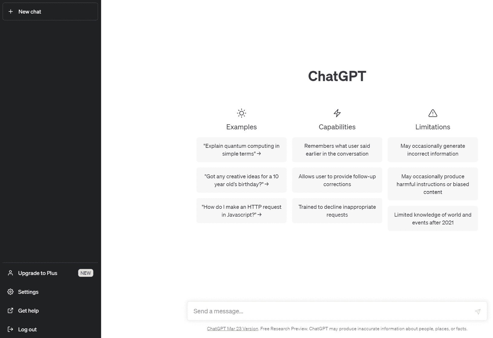

图 1.10 – ChatGPT 界面

1.  ChatGPT 采用基于对话的方法，因此您只需将您的提示作为消息键入并按下*Enter*或单击按钮，即可从模型接收响应。例如，您可以询问 ChatGPT 生成一段 Python 代码以查找用户的公共 IP 地址：


图 1.11 – 输入提示

ChatGPT 将生成一个包含请求的 Python 代码以及详细解释的响应：

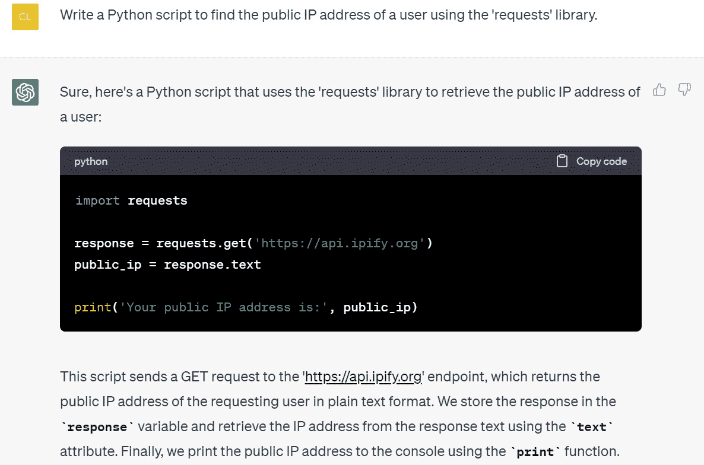

图 1.12 – ChatGPT 响应代码

1.  继续对话，提出后续问题或提供额外信息，ChatGPT 将相应作出回应：

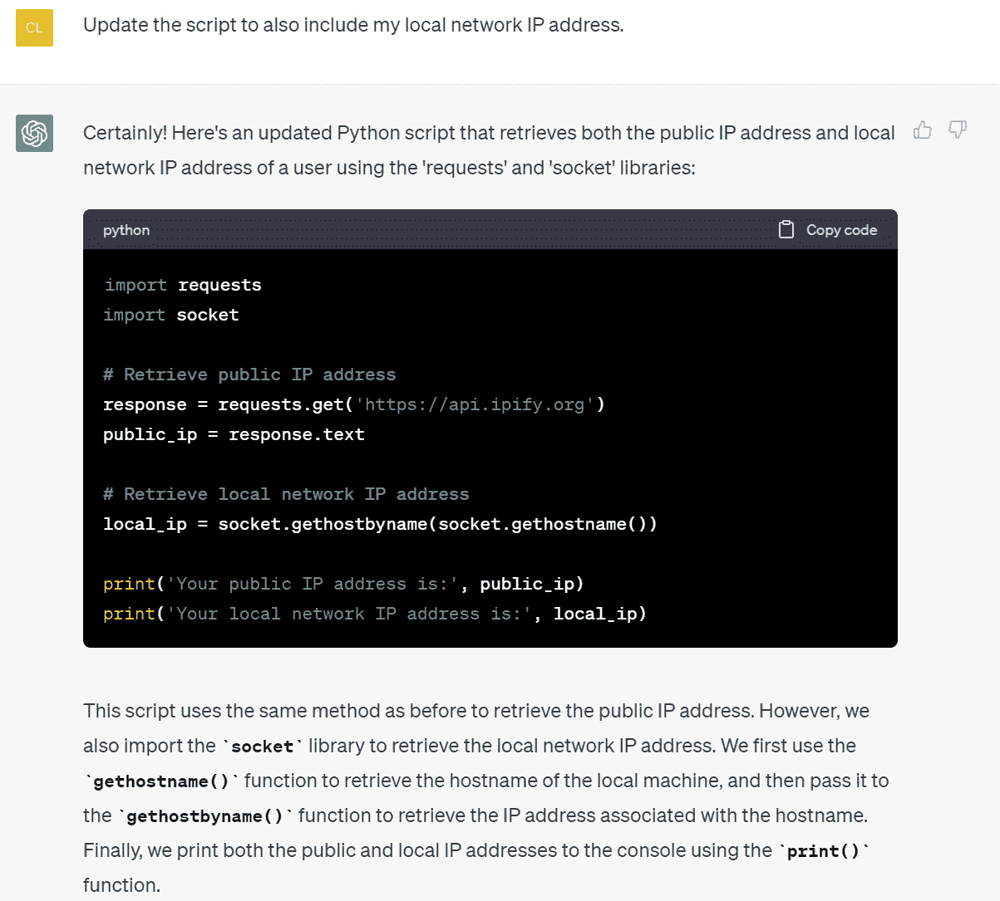

图 1.13 – ChatGPT 上下文跟进响应

1.  通过点击 `.py` Python 脚本运行 ChatGPT 生成的代码，并从终端运行：

    ```py
    PS D:\GPT\ChatGPT for Cybersecurity Cookbook> python .\my_ip.py
    Your public IP address is: 
    Your local network IP address is: 192.168.1.105
    ```

图 1.14 – 运行 ChatGPT 生成的脚本

## 工作原理…

通过使用 ChatGPT 界面输入提示，你可以生成贯穿整个对话的具有上下文感知的响应和内容，类似于聊天机器人。基于对话的方法允许更自然的交互和能力提出跟进问题或提供额外的上下文。响应甚至可以包括复杂的格式，如代码片段或表格（稍后会介绍更多关于表格的内容）。

## 还有更多…

随着你对 ChatGPT 越来越熟悉，你可以尝试不同的提示样式、说明和上下文，以获得你网络安全任务所需的输出。你还可以比较通过 ChatGPT 界面和 OpenAI Playground 生成的结果，以确定哪种方法最适合你的需求。

小贴士

你可以通过提供非常清晰和具体的说明或使用角色来进一步完善生成的输出。将复杂的提示分解为几个较小的提示也有帮助，每个提示一个指令，随着你的进展构建在前一个提示的基础上。

在即将到来的示例中，我们将深入探讨更高级的提示技术，利用这些技术来帮助你从 ChatGPT 获得最准确和详细的响应。

当你与 ChatGPT 交互时，你的对话历史会自动保存在 ChatGPT 界面的左侧面板中。这个功能允许你轻松访问和审阅你以前的提示和响应。

通过利用对话历史功能，你可以跟踪你与 ChatGPT 的交互，并快速查阅以前的响应，用于你的网络安全任务或其他项目：

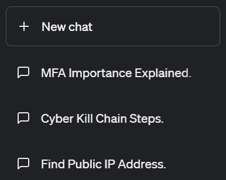

图 1.15 – ChatGPT 界面中的对话历史

要查看保存的对话，只需在左侧面板中点击所需对话即可。你也可以通过点击位于对话列表顶部的 **+ 新聊天** 按钮来创建新的对话。这样可以根据特定任务或主题分离和组织你的提示和响应。

注意事项

开始新对话时，请记住模型会失去之前对话的上下文。如果你想引用以前对话中的任何信息，你需要在新提示中包含该上下文。

# 应用 ChatGPT 角色（应用：AI CISO）

在这个示例中，我们将演示如何在你的提示中使用角色，以提高 ChatGPT 响应的准确性和详细程度。为 ChatGPT 分配角色有助于它生成更具上下文感知和相关性的内容，特别是当你需要专业水平的见解或建议时。

## 准备工作

确保你可以访问 ChatGPT 界面，方法是登录你的 OpenAI 帐号。

## 如何操作…

通过分配角色，您将能够从模型中获得专家级别的见解和建议。让我们深入了解此配方的步骤：

1.  要为 ChatGPT 分配一个角色，请在你的提示开头描述你希望模型扮演的角色。例如，你可以使用以下提示：

    ```py
    You are a cybersecurity expert with 20 years of experience. Explain the importance of multi-factor authentication (MFA) in securing online accounts, to an executive audience.
    ```

1.  ChatGPT 将生成一个符合分配角色的响应，根据网络安全专家的专业知识和观点提供关于该主题的详细解释：

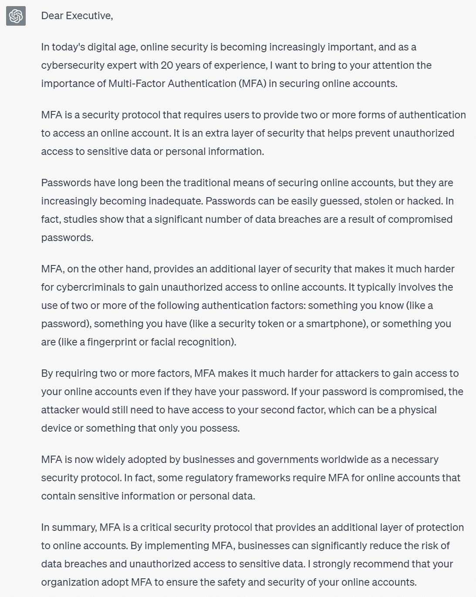

图 1.16 – 具有基于角色的专业知识的 ChatGPT 响应

1.  尝试为不同情景分配不同角色，例如以下情况：

    ```py
    You are a CISO with 30 years of experience. What are the top cybersecurity risks businesses should be aware of?
    ```

1.  或者，你可以使用以下方式：

    ```py
    You are an ethical hacker. Explain how a penetration test can help improve an organization's security posture.
    ```

注意事项

请记住，ChatGPT 的知识基于它所训练的数据，截止日期为 2021 年 9 月。因此，该模型可能不了解在其训练数据截止日期之后出现的网络安全领域的最新发展、趋势或技术。在解释其响应时，始终使用最新的来源验证 ChatGPT 生成的信息，并考虑其训练限制。我们将在本书的后面讨论如何克服这一限制的技术。

## 工作原理…

当你为 ChatGPT 分配一个角色时，你提供了一个特定的上下文或角色给模型参考。这有助于模型生成符合给定角色的响应，从而产生更准确、相关和详细的内容。该模型将生成符合分配角色的专业知识和观点的内容，提供更好的见解、意见或建议。

## 还有更多…

当你在提示中更加熟悉使用角色时，你可以尝试使用不同角色和场景的不同组合，以获得符合网络安全任务要求的期望输出。例如，你可以通过为每个角色交替提示来创建一个对话：

1.  **角色 1**：

    ```py
    You are a network administrator. What measures do you take to secure your organization's network?
    ```

1.  **角色 2**：

    ```py
    You are a cybersecurity consultant. What additional recommendations do you have for the network administrator to further enhance network security?
    ```

通过创造性地使用角色并尝试不同的组合，你可以利用 ChatGPT 的专业知识，并获得更准确和详细的响应，涵盖了各种网络安全主题和情景。

我们将在后面的章节中尝试自动化角色对话。

# 使用模板增强输出（应用：威胁报告）

在本配方中，我们将探讨如何使用输出模板来引导 ChatGPT 的响应，使其更加一致、结构良好，并适用于报告或其他正式文档。通过为输出提供一个具体的格式，你可以确保生成的内容符合你的要求，并且更容易集成到你的网络安全项目中。

## 准备工作

确保你可以通过登录你的 OpenAI 帐户访问 ChatGPT 接口。

## 怎么做…

要开始，请按照以下步骤进行：

1.  在制作提示时，您可以指定几种不同格式选项的输出，如标题、字体加粗、列表等。以下提示演示了如何创建带有标题、字体加粗和列表类型的输出：

    ```py
    Create an analysis report of the WannaCry Ransomware Attack as it relates to the cyber kill chain, using the following format:
    # Threat Report
    ## Overview
    - **Threat Name:**
    - **Date of Occurrence:**
    - **Industries Affected:**
    - **Impact:**
    ## Cyber Kill Chain Analysis
    1\. **Kill chain step 1:**
    2\. **Kill chain step 2:**
    3\. …
    ## Mitigation Recommendations
    - *Mitigation recommendation 1*
    - *Mitigaiton recommendation 2*
    …
    ```

1.  ChatGPT 将生成符合指定模板的响应，提供结构良好且一致的输出：

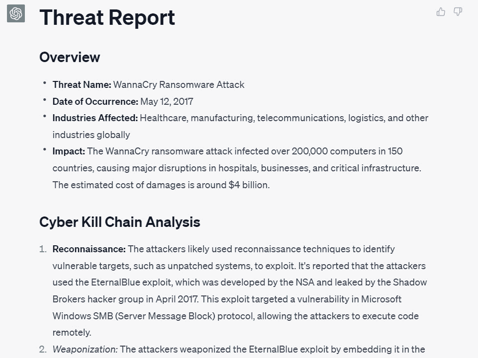

图 1.17 – ChatGPT 响应与格式化（标题、粗体字体和列表）


图 1.18 – ChatGPT 响应与格式化（标题、列表和斜体文本）

1.  现在，这种格式化的文本结构更加清晰，可以通过复制和粘贴轻松转移到其他文档中，并保留其格式。

## 它是如何工作的...

通过在提示中为输出提供清晰的模板，您可以引导 ChatGPT 生成符合指定结构和格式的响应。这有助于确保生成的内容一致、组织良好，并适用于报告、演示文稿或其他正式文档中使用。模型将重点放在生成符合您提供的输出模板格式和结构的内容，同时仍然提供您请求的信息。

在格式化 ChatGPT 输出时使用以下约定：

1.  要创建一个主`#`)，后跟一个空格和标题的文本。在这种情况下，主标题是*威胁报告*。

1.  要创建一个`##`)，后跟一个空格和子标题的文本。在这种情况下，子标题是*概述*、*网络攻击链分析*和*缓解建议*。您可以通过增加井号数来继续创建额外的子标题级别。

1.  要创建一个`-`)或星号（`*`），后跟一个空格和项目符号的文本。在这种情况下，项目符号在*概述*部分中用于指示威胁的名称、发生日期、受影响的行业和影响。

1.  要创建`**`)或下划线（`__`）来包围要加粗的文本。在这种情况下，每个项目符号和编号列表关键词都被加粗。

1.  要用`*`)或下划线（`_`）来包围您想要斜体的文本。在这种情况下，第二个攻击链步骤使用一对下划线斜体。这里，斜体文本用于*缓解建议项目符号*。  

1.  要创建一个**编号列表**，请使用一个数字后跟一个句点和一个空格，然后是列表项的文本。在这种情况下，*网络攻击链分析部分*是一个编号列表。

## 还有更多...

结合模板和其他技术，如角色，可以进一步提升生成内容的质量和相关性。通过应用模板和角色，您可以创建不仅结构良好、一致性强，而且还符合特定专家观点的输出。

随着您在提示中使用模板变得更加舒适，您可以尝试不同的格式、结构和场景，以获得您的网络安全任务所需的输出。例如，除了文本格式化之外，您还可以使用表格来进一步组织生成的内容，这是我们将在下一个示例中介绍的内容。

# 将输出格式化为表格（应用：安全控制表）

在本示例中，我们将演示如何创建引导 ChatGPT 生成表格格式输出的提示。表格可以是一种有效的组织和展示信息的方式，结构化且易于阅读。在本示例中，我们将创建一个安全控制比较表。

## 准备工作

确保您通过登录您的 OpenAI 账户来访问 ChatGPT 界面。

## 如何做到...

本示例将演示如何创建一个安全控制比较表。让我们深入了解如何实现这一目标：

1.  通过指定表格格式和您想要包含的信息来制作您的提示。对于本示例，我们将生成一个比较不同安全控制的表格：

    ```py
    Create a table comparing five different security controls. The table should have the following columns: Control Name, Description, Implementation Cost, Maintenance Cost, Effectiveness, and Ease of Implementation.
    ```

1.  ChatGPT 将生成一个响应，其中包含一个具有指定列的表，填充有相关信息：

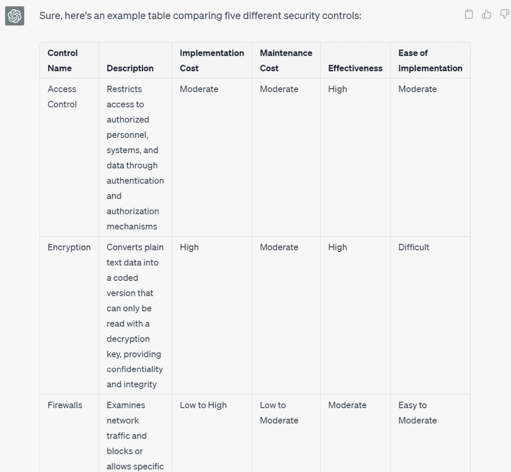

图 1.19 – ChatGPT 响应片段，带有表格

1.  您现在可以轻松地将生成的表格直接复制粘贴到文档或电子表格中，然后可以进一步格式化和完善：

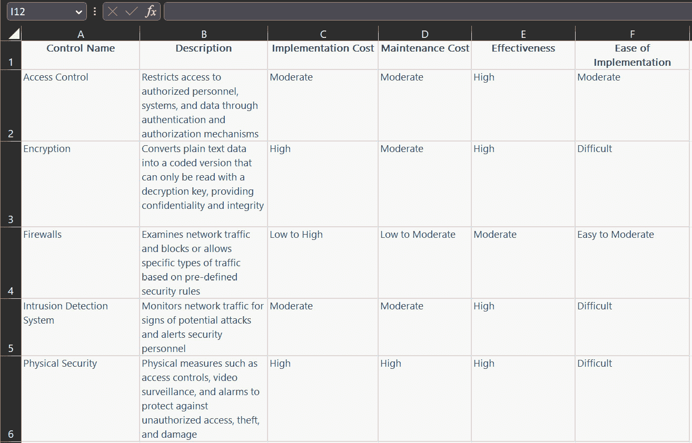

图 1.20 – ChatGPT 响应直接复制/粘贴到电子表格中

## 工作原理...

通过在提示中指定表格格式和所需信息，您引导 ChatGPT 以结构化的、表格化的方式生成内容。模型将专注于生成符合指定格式的内容，并填充表格所需的信息。ChatGPT 界面会自动理解如何使用 markdown 语言提供表格格式，然后由浏览器解释。

在本示例中，我们要求 ChatGPT 创建一个比较五种不同安全控制的表格，其中包括**控制名称**、**描述**、**实施成本**、**维护成本**、**有效性**和**实施易用性**等列。生成的表格提供了不同安全控制的有组织、易于理解的概览。

## 还有更多...

随着您在提示中使用表格变得更加熟练，您可以尝试不同的格式、结构和场景，以获得您的网络安全任务所需的输出。您还可以将表格与其他技术（如角色和模板）结合使用，以进一步提高生成内容的质量和相关性。

通过创造性地使用表格并尝试不同的组合，您可以利用 ChatGPT 的能力来为各种网络安全主题和情况生成结构化和有组织的内容。

# 将 OpenAI API 密钥设置为环境变量

在本教程中，我们将向您展示如何将您的 OpenAI API 密钥设置为环境变量。这是一个重要的步骤，因为它允许您在 Python 代码中使用 API 密钥而不是硬编码，这是出于安全目的的最佳做法。

## 准备工作

确保您已经通过注册帐户并访问 API 密钥部分获得了您的 OpenAI API 密钥，如*创建 API 密钥和与 OpenAI 互动*教程中所述。

## 如何做...

此示例将演示如何将您的 OpenAI API 密钥设置为环境变量，以在您的 Python 代码中安全访问。让我们深入了解实现这一目标的步骤。

1.  在您的操作系统上设置 API 密钥作为环境变量。

### 对于 Windows

1.  打开开始菜单，搜索`环境变量`，然后点击**编辑系统** **环境变量**。

1.  在**系统属性**窗口中，点击**环境** **变量**按钮。

1.  在**环境变量**窗口中，点击**用户变量**或**系统变量**下的**新建**（取决于您的偏好）。

1.  将`OPENAI_API_KEY`作为变量名称，并将您的 API 密钥粘贴为变量值。点击**确定**保存新的环境变量。

### 对于 macOS/Linux

1.  打开终端窗口。

1.  通过运行以下命令（将`your_api_key`替换为您的实际 API 密钥），将 API 密钥添加到您的 shell 配置文件（例如`.bashrc`、`.zshrc`或`.profile`）中：

    ```py
    echo 'export OPENAI_API_KEY="your_api_key"' >> ~/.bashrc
    ```

提示

如果您使用不同的 shell 配置文件，请用适当的文件（例如`.bashrc`、`.zshrc`或`.profile`）替换`~/.bashrc`。

1.  重新启动终端或运行`source ~/.bashrc`（或适当的配置文件）以应用更改。

1.  使用`os`模块在你的 Python 代码中访问 API 密钥：

    ```py
    import os
    # Access the OpenAI API key from the environment variable
    api_key = os.environ["OPENAI_API_KEY"]
    ```

重要提示

Linux 和基于 Unix 的系统有许多不同版本，设置环境变量的确切语法可能与此处所示略有不同。但是，一般的方法应该是类似的。如果遇到问题，请查阅您系统特定的文档，了解有关设置环境变量的指导。

## 工作原理...

通过将 OpenAI API 密钥设置为环境变量，您可以在 Python 代码中使用它，而无需将密钥硬编码，这是一种安全最佳实践。在 Python 代码中，您可以使用`os`模块从先前创建的环境变量中访问 API 密钥。

在处理敏感数据（如 API 密钥或其他凭证）时，使用环境变量是一个常见的做法。这种方法允许您将您的代码与敏感数据分离开来，并使您更容易地管理您的凭证，因为您只需要在一个地方更新它们（即环境变量）。此外，它还有助于在您与他人共享代码或在公共代码库中发布代码时，防止意外暴露敏感信息。

## 还有更多内容…

在某些情况下，您可能希望使用如`python-dotenv`这样的 Python 包来管理环境变量。这个包允许你将环境变量存储在`.env`文件中，并且你可以在 Python 代码中加载它。这种方法的优点是你可以将所有与项目相关的环境变量保存在单个文件中，从而更容易地管理和共享你的项目设置。不过要记住，你永远不应该将`.env`文件提交到公共的代码库中；要么将它包含在你的`.gitignore`文件或其他忽略版本控制的配置文件中。

# 使用 Python 发送 API 请求和处理响应

在这个配方中，我们将探讨如何使用 Python 发送请求到 OpenAI GPT API，以及如何处理响应。我们将逐步讲解构建 API 请求的过程，发送请求和使用`openai`模块处理响应。

## 准备就绪

1.  确保在您的系统上安装了 Python。

1.  在终端或命令提示符中运行以下命令以安装 OpenAI Python 模块：

    ```py
    pip install openai
    ```

## 怎么做…

使用 API 的重要性在于其在与 ChatGPT 实时通信并获取有价值的见解方面的能力。通过发送 API 请求和处理响应，您可以利用 GPT 的强大功能来回答问题、生成内容或以动态和可定制的方式解决问题。在接下来的步骤中，我们将演示如何构建 API 请求、发送请求和处理响应，使您能够有效地将 ChatGPT 集成到您的项目或应用程序中：

1.  首先导入所需的模块：

    ```py
    import openai
    from openai import OpenAI
    import os
    ```

1.  通过检索环境变量来设置 API 密钥，就像在 *将 OpenAI API 密钥设置为环境变量* 配方中所做的那样：

    ```py
    openai.api_key = os.getenv("OPENAI_API_KEY")
    ```

1.  定义一个函数来向 OpenAI API 发送提示信息并接收响应：

    ```py
    client = OpenAI()
    def get_chat_gpt_response(prompt):
      response = client.chat.completions.create(
        model="gpt-3.5-turbo",
        messages=[{"role": "user", "content": prompt}],
        max_tokens=2048,
        temperature=0.7
      )
      return response.choices[0].message.content.strip()
    ```

1.  使用提示调用函数来发送请求并接收响应：

    ```py
    prompt = "Explain the difference between symmetric and asymmetric encryption."
    response_text = get_chat_gpt_response(prompt)
    print(response_text)
    ```

## 它是如何工作的…

1.  首先，我们导入所需的模块。`openai`模块是 OpenAI API 库，而`os`模块帮助我们从环境变量中检索 API 密钥。

1.  我们通过使用`os`模块从环境变量中检索 API 密钥来设置 API 密钥。

1.  接下来，我们定义一个名为`get_chat_gpt_response()`的函数，它接受一个参数：提示信息。这个函数使用`openai.Completion.create()`方法向 OpenAI API 发送请求。这个方法有几个参数：

    +   `engine`：在这里，我们指定引擎（在本例中为`chat-3.5-turbo`）。

    +   `prompt`：用于模型生成响应的输入文本。

    +   `max_tokens`：生成响应中的标记的最大数量。标记可以短至一个字符或长至一个单词。

    +   `n`：您希望从模型接收的生成响应的数量。在本例中，我们将其设置为`1`以接收单个响应。

    +   `stop`：如果模型遇到的令牌序列将停止生成过程。这对于限制响应的长度或停止在特定点（例如句子或段落的末尾）非常有用。

    +   `temperature`：控制生成响应的随机性的值。较高的温度（例如，1.0）会导致更随机的响应，而较低的温度（例如，0.1）会使响应更加集中和确定性。

1.  最后，我们调用`get_chat_gpt_response()`函数并提供提示，向 OpenAI API 发送请求，接收响应。该函数返回响应文本，然后将其打印到控制台。`return response.choices[0].message.content.strip()`代码行通过访问选择列表中的第一个选择（`index 0`）来检索生成的响应文本。

1.  `response.choices`是从模型生成的响应列表。在我们的情况下，由于我们设置了`n=1`，因此列表中只有一个响应。`.text`属性检索响应的实际文本，`.strip()`方法删除任何前导或尾随空格。

1.  例如，来自 OpenAI API 的非格式化响应可能如下所示：

    ```py
    {
      'id': 'example_id',
      'object': 'text.completion',
      'created': 1234567890,
      'model': 'chat-3.5-turbo',
      'usage': {'prompt_tokens': 12, 'completion_tokens': 89, 'total_tokens': 101},
      'choices': [
        {
          'text': ' Symmetric encryption uses the same key for both encryption and decryption, while asymmetric encryption uses different keys for encryption and decryption, typically a public key for encryption and a private key for decryption. This difference in key usage leads to different security properties and use cases for each type of encryption.',
          'index': 0,
          'logprobs': None,
          'finish_reason': 'stop'
        }
      ]
    }
    ```

    在本示例中，我们使用`response.choices[0].text.strip()`访问响应文本，返回以下文本：

    ```py
    Symmetric encryption uses the same key for both encryption and decryption, while asymmetric encryption uses different keys for encryption and decryption, typically a public key for encryption and a private key for decryption. This difference in key usage leads to different security properties and use cases for each type of encryption.
    ```

## 还有更多...

您还可以通过修改`openai.Completion.create()`方法中的参数来进一步定制 API 请求。例如，您可以调整温度以获得更有创意或更有焦点的响应，将`max_tokens`值更改为限制或扩展生成内容的长度，或者使用`stop`参数来定义响应生成的特定停止点。

此外，您可以通过调整`n`参数来生成多个响应并比较它们的质量或多样性。请记住，生成多个响应将消耗更多的标记，并可能影响 API 请求的成本和执行时间。

了解和微调这些参数以从 ChatGPT 获取所需的输出非常重要，因为不同的任务或场景可能需要不同水平的创造力、响应长度或停止条件。随着您对 OpenAI API 的了解越来越深入，您将能够有效地利用这些参数，以便根据您特定的网络安全任务和要求定制生成的内容。

# 使用文件进行提示和 API 密钥访问

在这个配方中，你将学习如何使用外部文本文件来存储和检索与 Python 通过 OpenAI API 进行交互的提示。这种方法允许更好的组织和更容易的维护，因为你可以快速更新提示而不需要修改主要脚本。我们还将介绍一种访问 OpenAI API 密钥的新方法 - 即使用文件 - 使更改 API 密钥的过程更加灵活。

## 准备工作

确保你能够访问 OpenAI API，并根据*创建 API 密钥并与 OpenAI 进行交互*和*将 OpenAI API 密钥设置为环境变量*配方进行了设置。

## 如何做…

这个配方演示了一个实用的管理提示和 API 密钥的方法，使得更新和维护你的代码更加容易。通过使用外部文本文件，你可以有效地管理项目并与他人合作。让我们一起来实施这种方法的步骤：

1.  创建一个新的文本文件，并将其保存为`prompt.txt`。在这个文件中写下你想要的提示，并保存。

1.  修改你的 Python 脚本，以包含一个函数来读取文本文件的内容：

    ```py
    def open_file(filepath):
        with open(filepath, 'r', encoding='UTF-8') as infile:
            return infile.read()
    ```

1.  在*使用 Python 发送 API 请求并处理响应*配方中使用脚本，将硬编码的提示替换为调用`open_file`函数，将`prompt.txt`文件的路径作为参数传递：

    ```py
    prompt = open_file("prompt.txt")
    ```

1.  创建一个名为`prompt.txt`的文件并输入以下提示文本（与*使用 Python 发送 API 请求并处理响应*配方中的提示相同）：

    ```py
    Explain the difference between symmetric and asymmetric encryption.
    ```

1.  使用文件而不是环境变量设置 API 密钥：

    ```py
    openai.api_key = open_file('openai-key.txt')
    ```

重要提示

很重要的一点是，将这行代码放在`open_file`函数之后；否则，Python 会因为调用尚未声明的函数而抛出错误。

1.  创建一个名为`openai-key.txt`的文件，并将你的**OpenAI API 密钥**粘贴到该文件中，而不包括其他内容。

1.  在 API 调用中像往常一样使用提示变量。

    这里是一个示例，展示了修改自*使用 Python 发送 API 请求并处理响应*配方的脚本会是什么样子：

    ```py
    import openai
    from openai import OpenAI
    def open_file(filepath):
        with open(filepath, 'r', encoding='UTF-8') as infile:
            return infile.read()
    client = OpenAI()
    def get_chat_gpt_response(prompt):
      response = client.chat.completions.create(
        model="gpt-3.5-turbo",
        messages=[{"role": "user", "content": prompt}],
        max_tokens=2048,
        temperature=0.7
      )
      return response.choices[0].message.content.strip()
    openai.api_key = open_file('openai-key.txt')
    prompt = open_file("prompt.txt")
    response_text = get_chat_gpt_response(prompt)
    print(response_text)
    ```

## 工作原理...

`open_file()`函数接受一个文件路径作为参数，并使用`with open`语句打开文件。它读取文件的内容并将其作为字符串返回。然后，这个字符串被用作 API 调用的提示。第二个`open_file()`函数调用是用来访问一个包含 OpenAI API 密钥的文本文件，而不是使用环境变量来访问 API 密钥。

通过使用外部文本文件来存储提示和访问 API 密钥，你可以轻松更新或更改两者，而不需要修改主要脚本或环境变量。当你使用多个提示或与他人合作时，这一点尤其有帮助。

注意事项

使用此技术访问您的 API 密钥确实存在一定的风险。与环境变量相比，文本文件更容易被发现和访问，因此请确保采取必要的安全预防措施。重要的是要记住，在与他人分享脚本之前，从`openapi-key.txt`文件中删除您的 API 密钥，以防止对您的 OpenAI 账户进行无意或未经授权的扣费。

## 还有更多…

您还可以使用此方法存储您可能希望频繁更改或与他人分享的其他参数或配置。这可能包括 API 密钥、模型参数或与您的用例相关的任何其他设置。

# 使用提示变量（应用程序：手动页生成器）

在此示例中，我们将创建一个类似 Linux 风格的手动页生成器，它将接受用户输入，然后我们的脚本将生成手动页输出，类似于在 Linux 终端中输入`man`命令。通过这样做，我们将学习如何在文本文件中使用变量来创建一个标准的提示*模板*，可以通过修改其中的某些方面来轻松修改。当您希望使用用户输入或其他动态内容作为提示的一部分并保持一致的结构时，此方法特别有用。

## 准备工作

确保您通过登录到您的 OpenAI 账户并安装 Python 和`openai`模块来访问 ChatGPT API。

## 如何操作…

使用包含提示和占位符变量的文本文件，我们可以创建一个 Python 脚本，用于将占位符替换为用户输入。在本示例中，我们将使用此技术创建一个类似 Linux 风格的手动页生成器。以下是步骤：

1.  创建一个 Python 脚本并导入必要的模块：

    ```py
    from openai import OpenAI
    ```

1.  定义一个函数来打开和读取文件：

    ```py
    def open_file(filepath):
        with open(filepath, 'r', encoding='UTF-8') as infile:
            return infile.read()
    ```

1.  设置您的 API 密钥：

    ```py
    openai.api_key = open_file('openai-key.txt')
    ```

1.  以与上一个步骤相同的方式创建`openai-key.txt`文件。

1.  定义`get_chat_gpt_response()`函数，以将提示发送到 ChatGPT 并获取响应：

    ```py
    client = OpenAI()
    def get_chat_gpt_response(prompt):
      response = client.chat.completions.create(
        model="gpt-3.5-turbo",
        messages=[{"role": "user", "content": prompt}],
        max_tokens=600,
        temperature=0.7
      )
      text = response.choices[0].message.content.strip()
      return text
    ```

1.  接收文件名的用户输入并读取文件内容：

    ```py
    file = input("ManPageGPT> $ Enter the name of a tool: ")
    feed = open_file(file)
    ```

1.  用文件内容替换`prompt.txt`文件中的`<<INPUT>>`变量：

    ```py
    prompt = open_file("prompt.txt").replace('<<INPUT>>', feed)
    ```

1.  创建包含以下文本的`prompt.txt`文件：

    ```py
    Provide the manual-page output for the following tool. Provide the output exactly as it would appear in an actual Linux terminal and nothing else before or after the manual-page output.
    <<INPUT>>
    ```

1.  将修改后的提示发送到`get_chat_gpt_response()`函数并打印结果：

    ```py
    analysis = get_chat_gpt_response(prompt)
    print(analysis)
    ```

    这是完整脚本的示例：

    ```py
    import openai
    from openai import OpenAI
    def open_file(filepath):
        with open(filepath, 'r', encoding='UTF-8') as infile:
            return infile.read()
    openai.api_key = open_file('openai-key.txt')
    client = OpenAI()
    def get_chat_gpt_response(prompt):
      response = client.chat.completions.create(
        model="gpt-3.5-turbo",
        messages=[{"role": "user", "content": prompt}],
        max_tokens=600,
        temperature=0.7
      )
      text = response['choices'][0]['message']['content'].strip()
      return text
    feed = input("ManPageGPT> $ Enter the name of a tool: ")
    prompt = open_file("prompt.txt").replace('<<INPUT>>', feed)
    analysis = get_chat_gpt_response(prompt)
    print(analysis)
    ```

## 工作原理… 

在本示例中，我们创建了一个 Python 脚本，利用文本文件作为提示模板。文本文件包含一个名为`<<INPUT>>`的变量，可以替换为任何内容，允许动态修改提示而无需更改整体结构。特别是在这种情况下，我们将其替换为用户输入：

1.  导入`openai`模块以访问 ChatGPT API，并导入`os`模块以与操作系统进行交互并管理环境变量。

1.  `open_file()`函数被定义为打开和读取文件。它接受文件路径作为参数，使用读取访问和 UTF-8 编码打开文件，读取内容，然后返回内容。

1.  通过使用`open_file()`函数从文件中读取 API 密钥，并将其分配给`openai.api_key`来设置访问 ChatGPT 的 API 密钥。

1.  `get_chat_gpt_response()`函数被定义为向 ChatGPT 发送提示并返回响应。它接受提示作为参数，使用所需的设置配置 API 请求，然后将请求发送到 ChatGPT API。它提取响应文本，删除前导和尾随空白，并返回它。

1.  脚本接收 Linux 命令的用户输入。此内容将用于替换提示模板中的占位符。

1.  在`prompt.txt`文件中的`<<INPUT>>`变量被用户提供的文件内容替换。这是使用 Python 的字符串`replace()`方法完成的，该方法搜索指定的占位符并用所需内容替换它。

1.  `man`命令。

1.  修改后的提示，带有`<<INPUT>>`占位符替换，被发送到`get_chat_gpt_response()`函数。该函数将提示发送到 ChatGPT，ChatGPT 检索响应，脚本打印分析结果。这演示了如何使用带有可替换变量的提示模板，为不同输入创建定制的提示。

这种方法在网络安全环境中特别有用，因为它允许您为不同类型的分析或查询创建标准提示模板，并根据需要轻松修改输入数据。

## 还有更多...

1.  **在提示模板中使用多个变量**：您可以在提示模板中使用多个变量，使其更加灵活多变。例如，您可以创建一个包含不同组件占位符的模板，用于网络安全分析，如 IP 地址、域名和用户代理。只需确保在发送提示到 ChatGPT 之前替换所有必要的变量。

1.  `<<INPUT>>`格式，您可以自定义变量格式以更好地适应您的需求或偏好。例如，您可以使用花括号（例如，`{input}`）或任何您认为更可读和可管理的格式。

1.  `open_file()`函数读取环境变量而不是文件，确保敏感数据不会意外泄漏或暴露。

1.  **错误处理和输入验证**：为了使脚本更加健壮，您可以添加错误处理和输入验证。这可以帮助您捕获常见问题，例如丢失或格式不正确的文件，并为用户提供清晰的错误消息以指导其纠正问题。

通过探索这些额外的技术，您可以为在您的网络安全项目中与 ChatGPT 一起使用创建更强大、灵活和安全的提示模板。
