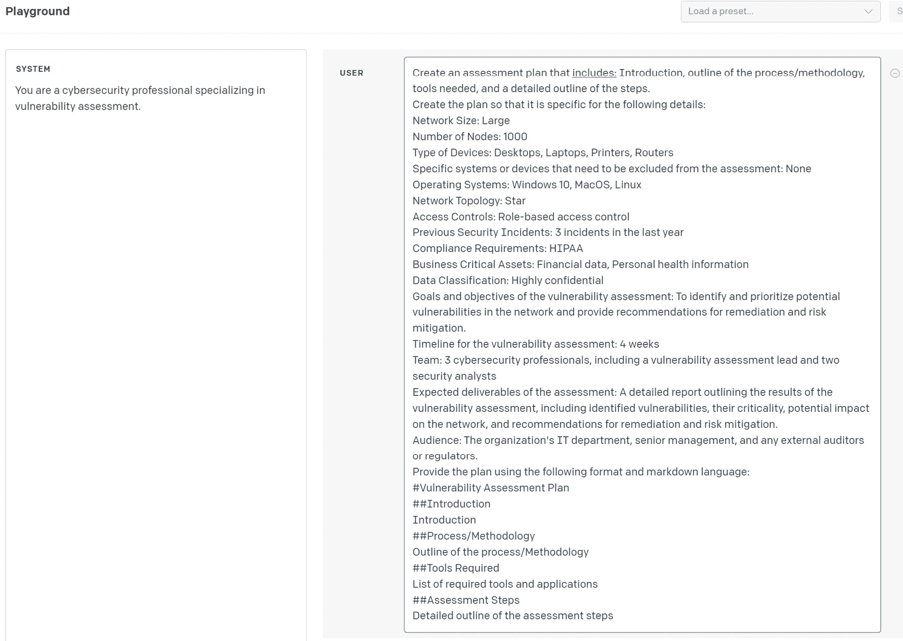
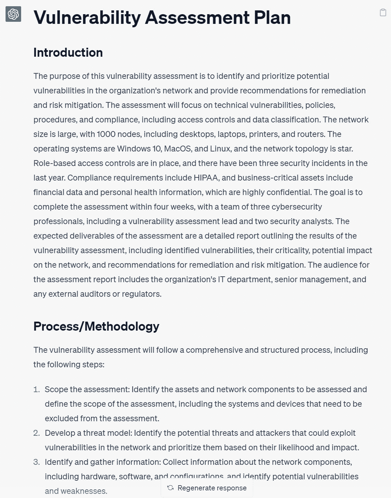
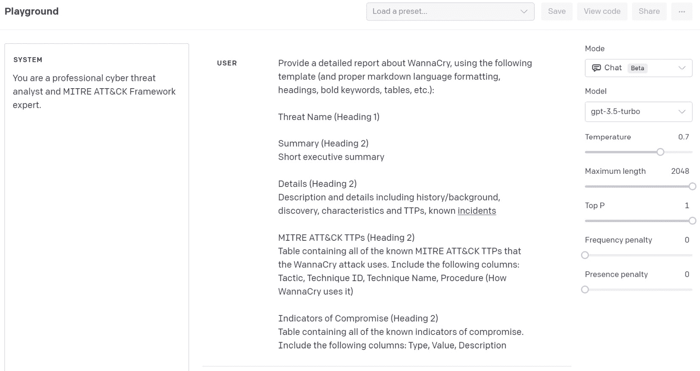
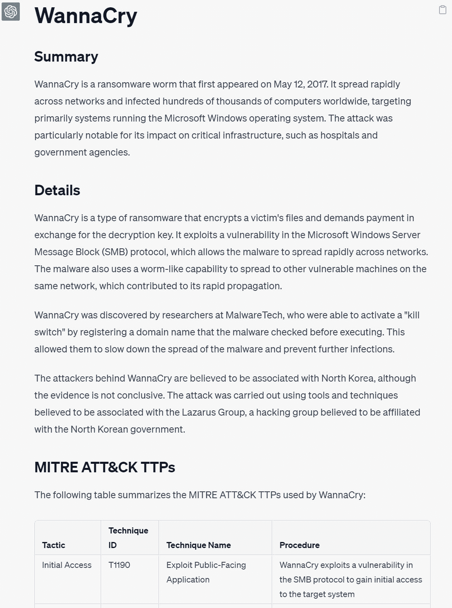
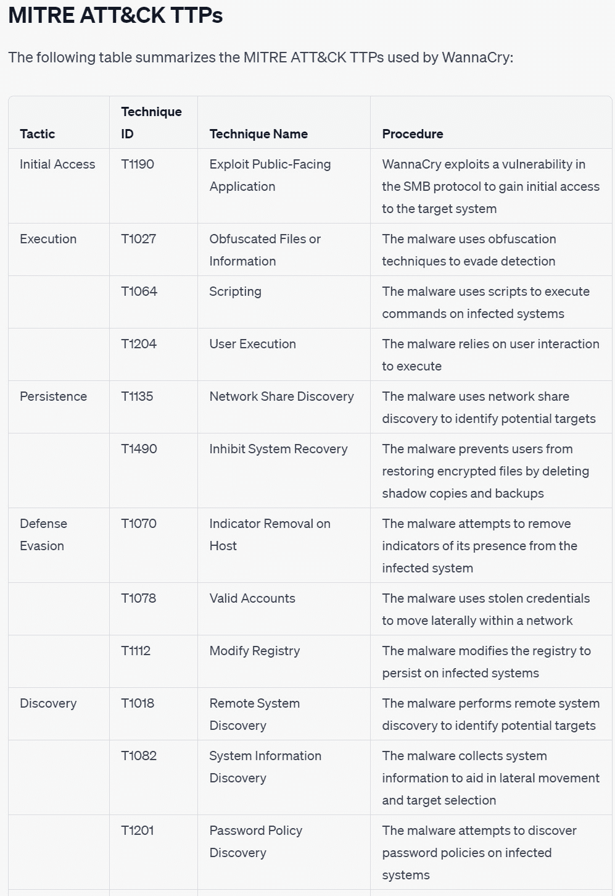
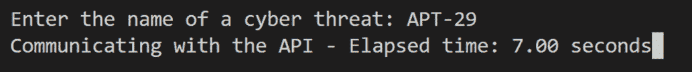
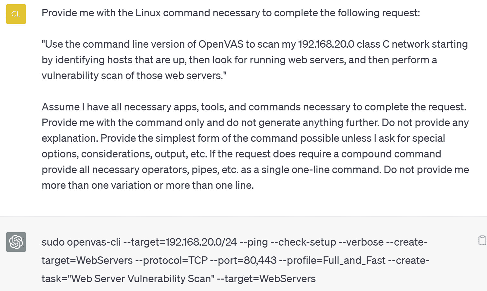

# 第二章：漏洞评估

建立在*第一章*建立的基本知识和技能的基础上，本章将探讨使用 ChatGPT 和 OpenAI API 来帮助和自动化许多漏洞评估任务。

在本章中，您将发现如何使用 ChatGPT 来创建漏洞和威胁评估计划，这是任何网络安全策略的重要组成部分。您将看到如何使用 OpenAI API 和 Python 自动化这些过程，特别是在需要处理众多网络配置或经常性计划需求的环境中，这将提供更高的效率。

此外，本章还将深入研究将 ChatGPT 与 MITRE ATT&CK 框架结合使用，该框架是一个全球可访问的对手战术和技术知识库。这种融合将使您能够生成详细的威胁报告，为威胁分析、攻击向量评估和威胁猎捕提供有价值的见解。

您将介绍**生成预训练变换器**（**GPT**）辅助漏洞扫描的概念。这种方法简化了漏洞扫描的一些复杂性，将自然语言请求转换为可以在**命令行接口**（**CLIs**）中执行的准确命令字符串。这种方法不仅节省时间，而且在执行漏洞扫描时增加了准确性和理解力。

最后，本章将解决分析大型漏洞评估报告的难题。使用 OpenAI API 与 LangChain 结合使用，LangChain 是一个旨在使语言模型能够帮助解决复杂任务的框架，您将看到如何处理和理解大型文档，尽管 ChatGPT 目前存在令牌限制。

在本章中，我们将介绍以下内容：

+   创建漏洞评估计划

+   使用 ChatGPT 和 MITRE ATT&CK 框架进行威胁评估

+   使用 GPT 辅助进行漏洞扫描

+   使用 LangChain 分析漏洞评估报告

# 技术要求

对于本章，您将需要一个稳定的**网络浏览器**和**互联网连接**来访问 ChatGPT 平台并设置您的账户。您还需要设置您的 OpenAI 账户并获得您的 API 密钥。如果没有，请查看*第一章*获取详细信息。由于您将使用**Python 3.x**来使用 OpenAI GPT API 和创建 Python 脚本，所以基本熟悉 Python 编程语言和工作命令行是必要的。一个**代码编辑器**也是编写和编辑 Python 代码和提示文件的必要工具，因为您将通过本章中的配方逐步完成这些工作。

本章的代码文件可以在此处找到：[`github.com/PacktPublishing/ChatGPT-for-Cybersecurity-Cookbook`](https://github.com/PacktPublishing/ChatGPT-for-Cybersecurity-Cookbook)。

# 创建漏洞评估计划

在此食谱中，您将学习如何利用**ChatGPT**和**OpenAI API**来使用网络、系统和业务细节创建全面的**漏洞评估计划**。此食谱对于既有网络安全专业学生和初学者尤其有价值，他们希望熟悉漏洞评估的适当方法和工具，也适用于有经验的网络安全专业人员，以节省在计划和文件记录上的时间。

基于*第一章*中所学到的技能，您将深入了解专门从事漏洞评估的网络安全专业人员的系统角色建立。您将学习如何使用 Markdown 语言制作有效的提示，生成格式良好的输出。此食谱还将扩展*第一章*中探讨的*使用模板增强输出（应用：威胁报告）*以及*将输出格式化为表格（应用：安全控制表）*的技术，使您能够设计生成所需输出格式的提示。

最后，您将了解如何使用 OpenAI API 和**Python**来生成漏洞评估计划，然后**将其导出为 Microsoft Word 文件**。此食谱将作为一个实用指南，教您如何使用 ChatGPT 和 OpenAI API 创建详细、高效的漏洞评估计划。

## 准备就绪

在进行食谱之前，您应该已经设置好 OpenAI 账户并获得了 API 密钥。如果没有，可以返回*第一章*了解详情。您还需要确保已安装以下 Python 库：

1.  `python-docx`：将使用此库生成 Microsoft Word 文件。您可以使用 `pip install python-docx` 命令安装它。

1.  `tqdm`：将使用此库显示进度条。您可以使用 `pip install tqdm` 命令安装它。

## 怎么做…

在本节中，我们将指导您使用 ChatGPT 创建针对特定网络和组织需求定制的全面漏洞评估计划的过程。通过提供必要的细节，并使用给定的系统角色和提示，您将能够生成结构良好的评估计划：

1.  首先登录到您的 ChatGPT 账户，然后导航到 ChatGPT Web UI。

1.  单击**新建** **聊天**按钮，与 ChatGPT 开始新对话。

1.  输入以下提示以建立系统角色：

    ```py
    You are a cybersecurity professional specializing in vulnerability assessment.
    ```

1.  输入以下消息文本，但用 `{ }` 括号中的适当数据替换占位符。您可以将此提示与系统角色结合使用，也可以分开输入，如下所示：

    ```py
    Using cybersecurity industry standards and best practices, create a complete and detailed assessment plan (not a penetration test) that includes: Introduction, outline of the process/methodology, tools needed, and a very detailed multi-layered outline of the steps. Provide a thorough and descriptive introduction and as much detail and description as possible throughout the plan. The plan should not be the only assessment of technical vulnerabilities on systems but also policies, procedures, and compliance. It should include the use of scanning tools as well as configuration review, staff interviews, and site walk-around. All recommendations should follow industry standard best practices and methods. The plan should be a minimum of 1500 words.
    Create the plan so that it is specific for the following details:
    Network Size: {Large}
    Number of Nodes: {1000}
    Type of Devices: {Desktops, Laptops, Printers, Routers}
    Specific systems or devices that need to be excluded from the assessment: {None}
    Operating Systems: {Windows 10, MacOS, Linux}
    Network Topology: {Star}
    Access Controls: {Role-based access control}
    Previous Security Incidents: {3 incidents in the last year}
    Compliance Requirements: {HIPAA}
    Business Critical Assets: {Financial data, Personal health information}
    Data Classification: {Highly confidential}
    Goals and objectives of the vulnerability assessment: {To identify and prioritize potential vulnerabilities in the network and provide recommendations for remediation and risk mitigation.}
    Timeline for the vulnerability assessment: {4 weeks{
    Team: {3 cybersecurity professionals, including a vulnerability assessment lead and two security analysts}
    Expected deliverables of the assessment: {A detailed report outlining the results of the vulnerability assessment, including identified vulnerabilities, their criticality, potential impact on the network, and recommendations for remediation and risk mitigation.}
    Audience: {The organization's IT department, senior management, and any external auditors or regulators.}
    Provide the plan using the following format and markdown language:
    #Vulnerability Assessment Plan
    ##Introduction
    Thorough Introduction to the plan including the scope, reasons for doing it, goals and objectives, and summary of the plan
    ##Process/Methodology
    Description and Outline of the process/Methodology
    ##Tools Required
    List of required tools and applications, with their descriptions and reasons needed
    ##Assessment Steps
    Detailed, multi-layered outline of the assessment steps
    ```

提示

如果您在**OpenAI Playground**中进行此操作，建议使用**聊天模式**，在**系统**窗口中输入角色，在**用户** **消息**窗口中输入提示。

*图 2**.1*展示了输入到**OpenAI Playground**的系统角色和用户提示：



图 2.1 - OpenAI Playground 方法

1.  查看 ChatGPT 生成的输出。如果输出满意并符合要求，您可以进入下一步。如果不符合，您可以修改提示或重新运行对话以生成新的输出。

1.  一旦您获得了期望的输出，您可以使用生成的 Markdown 在您喜欢的文本编辑器或 Markdown 查看器中创建一个结构良好的漏洞评估计划。

1.  *图 2**.2*展示了使用 Markdown 语言格式的 ChatGPT 生成的漏洞评估计划示例:



图 2.2 - ChatGPT 评估计划输出示例

## 工作原理...

这个 GPT 辅助的漏洞评估计划配方利用了自然语言处理（NLP）和机器学习（ML）算法的复杂性，以生成一个全面且详细的漏洞评估计划。通过采用特定的系统角色和详细的用户请求作为提示，ChatGPT 能够定制其响应以满足被委托评估广泛网络系统的资深网络安全专业人士的要求。

让我们更近距离地看看这个过程是如何运作的：

+   **系统角色和详细提示**：系统角色指定 ChatGPT 为专门从事漏洞评估的资深网络安全专业人员。提示作为用户请求，具体阐述了评估计划的细节，从网络规模和设备类型到所需的合规性和预期的可交付成果。这些输入提供了上下文并指导 ChatGPT 的响应，确保其定制到漏洞评估任务的复杂性和要求。

+   **NLP 和 ML**：NLP 和 ML 构成了 ChatGPT 能力的基础。它应用这些技术来理解用户请求的复杂性，从模式中学习，并生成一个详细、具体和可行的漏洞评估计划。

+   **知识和语言理解能力**：ChatGPT 利用其广泛的知识库和语言理解能力来遵循行业标准的方法和最佳实践。这在不断发展的网络安全领域尤为重要，确保生成的漏洞评估计划是最新的并符合公认的标准。

+   **Markdown 语言输出**：使用 Markdown 语言输出可以确保计划以一致且易于阅读的方式进行格式化。这种格式可以轻松地整合到报告、演示文稿和其他正式文件中，在将计划传达给 IT 部门、高级管理人员和外部审计员或监管机构时至关重要。

+   **简化评估计划过程**：使用这个 GPT 辅助的漏洞评估计划配方的整体优势在于它简化了创建全面漏洞评估计划的过程。您节省了规划和文档编制的时间，并可以生成符合行业标准并根据您组织特定需求定制的专业级评估计划。

通过应用这些详细的输入，您可以将 ChatGPT 转化为一个潜在的工具，以协助创建全面、定制的漏洞评估计划。这不仅增强了您的网络安全工作，还确保您有效利用资源来保护网络系统。

## 还有更多…

除了使用 ChatGPT 生成漏洞评估计划外，您还可以使用 OpenAI API 和 Python 来自动化该过程。当您需要评估大量网络配置或需要定期生成计划时，这种方法特别有用。

我们将在这里介绍的 Python 脚本从文本文件中读取输入数据，并将其用于填充提示中的占位符。然后，生成的 Markdown 输出可用于创建结构良好的漏洞评估计划。

虽然该过程与 ChatGPT 版本相似，但使用 OpenAI API 可以提供对生成内容的额外灵活性和控制。让我们深入了解 OpenAI API 版本的漏洞评估计划配方中涉及的步骤：

1.  导入必要的库并设置 OpenAI API：

    ```py
    import openai
    from openai import OpenAI
    import os
    from docx import Document
    from tqdm import tqdm
    import threading
    import time
    from datetime import datetime
    # Set up the OpenAI API
    openai.api_key = os.getenv("OPENAI_API_KEY")
    ```

    在本部分中，我们导入必要的库，如`openai`、`os`、`docx`、`tqdm`、`threading`、`time`和`datetime`。我们还通过提供 API 密钥来设置 OpenAI API。

1.  从文本文件中读取用户输入数据：

    ```py
    def read_user_input_file(file_path: str) -> dict:
        user_data = {}
        with open(file_path, 'r') as file:
            for line in file:
                key, value = line.strip().split(':')
                user_data[key.strip()] = value.strip()
        return user_data
    user_data_file = "assessment_data.txt"
    user_data = read_user_input_file(user_data_file)
    ```

    在这里，我们定义了一个`read_user_input_file`函数，用于从文本文件中读取用户输入数据并将其存储在字典中。然后，我们使用`assessment_data.txt`文件调用此功能以获得`user_data`字典。

1.  使用 OpenAI API 生成漏洞评估计划：

重要提示

`…'`注释表示我们将在稍后的步骤中填写此代码部分。

```py
def generate_report(network_size,
                    number_of_nodes,
                    type_of_devices,
                    special_devices,
                    operating_systems,
                    network_topology,
                    access_controls,
                    previous_security_incidents,
                    compliance_requirements,
                    business_critical_assets,
                    data_classification,
                    goals,
                    timeline,
                    team,
                    deliverables,
                    audience: str) -> str:
    # Define the conversation messages
    messages = [ ... ]
    client = OpenAI()
# Call the OpenAI API
response = client.chat.completions.create( ... )
    # Return the generated text
    return response.choices[0].message.content.strip()
```

在此代码块中，我们定义了一个`generate_report`函数，该函数接受用户输入数据并调用 OpenAI API 来生成漏洞评估计划。该函数返回所生成的文本。

1.  定义 API 消息：

    ```py
    # Define the conversation messages
    messages = [
        {"role": "system", "content": "You are a cybersecurity professional specializing in vulnerability assessment."},
        {"role": "user", "content": f'Using cybersecurity industry standards and best practices, create a complete and detailed assessment plan ... Detailed outline of the assessment steps'}
    ]
    client = OpenAI()
    # Call the OpenAI API
    response = client.chat.completions.create(
        model="gpt-3.5-turbo",
        messages=messages,
        max_tokens=2048,
        n=1,
        stop=None,
        temperature=0.7,
    )
    # Return the generated text
    return return response.choices[0].message.content.strip()
    ```

    在对话消息中，我们定义了两个角色：`system`和`user`。`system`角色用于为 AI 模型设置上下文，告知其是一位专门从事漏洞评估的网络安全专业人员。`user`角色为 AI 提供指令，包括基于行业标准、最佳实践和用户提供的数据生成详细的漏洞评估计划。

    `system` 角色有助于为 AI 设置舞台，而 `user` 角色则指导 AI 进行内容生成。这种方法遵循我们之前讨论的 ChatGPT UI 部分类似的模式，在那里我们向 AI 提供了一个初始消息来设置上下文。

    欲了解有关发送 API 请求和处理响应的更多信息，请参阅 *第一章* 中的 *使用 Python 发送 API 请求和处理响应* 配方。该配方提供了与 OpenAI API 交互的更深入理解，包括如何构建请求和处理生成的内容。

1.  将生成的 Markdown 文本转换为 Word 文档：

    ```py
    def markdown_to_docx(markdown_text: str, output_file: str):
        document = Document()
        # Iterate through the lines of the markdown text
        for line in markdown_text.split('\n'):
            # Add headings and paragraphs based on the markdown formatting
            ...
        # Save the Word document
        document.save(output_file)
    ```

    `markdown_to_docx` 函数将生成的 Markdown 文本转换为 Word 文档。它遍历 Markdown 文本的各行，根据 Markdown 格式添加标题和段落，并保存生成的 Word 文档。

1.  在等待 API 调用完成时显示经过时间：

    ```py
    def display_elapsed_time():
        start_time = time.time()
        while not api_call_completed:
            elapsed_time = time.time() - start_time
            print(f"\rCommunicating with the API - Elapsed time: {elapsed_time:.2f} seconds", end="")
            time.sleep(1)
    ```

    `display_elapsed_time` 函数用于在等待 API 调用完成时显示经过时间。它使用循环打印经过的秒数。

1.  编写主函数：

    ```py
    current_datetime = datetime.now().strftime('%Y-%m-%d_%H-%M-%S')
    assessment_name = f"Vuln_ Assessment_Plan_{current_datetime}"
    api_call_completed = False
    elapsed_time_thread = threading.Thread(target=display_elapsed_time)
    elapsed_time_thread.start()
    try:
        # Generate the report using the OpenAI API
        report = generate_report(
        user_data["Network Size"],
        user_data["Number of Nodes"],
        user_data["Type of Devices"],
        user_data["Specific systems or devices that need to be excluded from the assessment"],
        user_data["Operating Systems"],
        user_data["Network Topology"],
        user_data["Access Controls"],
        user_data["Previous Security Incidents"],
        user_data["Compliance Requirements"],
        user_data["Business Critical Assets"],
        user_data["Data Classification"],
        user_data["Goals and objectives of the vulnerability assessment"],
        user_data["Timeline for the vulnerability assessment"],
        user_data["Team"],
        user_data["Expected deliverables of the assessment"],
        user_data["Audience"]
        )
        api_call_completed = True
        elapsed_time_thread.join()
    except Exception as e:
        api_call_completed = True
        elapsed_time_thread.join()
        print(f"\nAn error occurred during the API call: {e}")
        exit()
    # Save the report as a Word document
    docx_output_file = f"{assessment_name}_report.docx"
    # Handle exceptions during the report generation
    try:
        with tqdm(total=1, desc="Generating plan") as pbar:
            markdown_to_docx(report, docx_output_file)
            pbar.update(1)
        print("\nPlan generated successfully!")
    except Exception as e:
        print(f"\nAn error occurred during the plan generation: {e}")
    ```

    在脚本的主要部分中，我们首先根据当前日期和时间定义一个 `assessment_name` 函数。然后我们使用线程来显示调用 API 时的经过时间。脚本使用用户数据调用 `generate_report` 函数，并在成功完成后使用 `markdown_to_docx` 函数将生成的报告保存为 Word 文档。进度使用 `tqdm` 库进行显示。如果在 API 调用或报告生成过程中发生任何错误，它们将显示给用户。

提示

如果您是 ChatGPT Plus 订阅者，可以将 **chat-3.5-turbo** 模型替换为 **GPT-4** 模型，以获得通常改进的结果。事实上，GPT-4 能够生成更长更详细的生成和/或文档。只需记住，GPT-4 模型比 chat-3.5-turbo 模型稍微昂贵一些。

这是完成的脚本应该如何看起来：

```py
import openai
from openai import OpenAI
import os
from docx import Document
from tqdm import tqdm
import threading
import time
from datetime import datetime
# Set up the OpenAI API
openai.api_key = os.getenv("OPENAI_API_KEY")
current_datetime = datetime.now().strftime('%Y-%m-%d_%H-%M-%S')
assessment_name = f"Vuln_Assessment_Plan_{current_datetime}"
def read_user_input_file(file_path: str) -> dict:
    user_data = {}
    with open(file_path, 'r') as file:
        for line in file:
            key, value = line.strip().split(':')
            user_data[key.strip()] = value.strip()
    return user_data
user_data_file = "assessment_data.txt"
user_data = read_user_input_file(user_data_file)
# Function to generate a report using the OpenAI API
def generate_report(network_size,
                    number_of_nodes,
                    type_of_devices,
                    special_devices,
                    operating_systems,
                    network_topology,
                    access_controls,
                    previous_security_incidents,
                    compliance_requirements,
                    business_critical_assets,
                    data_classification,
                    goals,
                    timeline,
                    team,
                    deliverables,
                    audience: str) -> str:
    # Define the conversation messages
    messages = [
        {"role": "system", "content": "You are a cybersecurity professional specializing in vulnerability assessment."},
        {"role": "user", "content": f'Using cybersecurity industry standards and best practices, create a complete and detailed assessment plan (not a penetration test) that includes: Introduction, outline of the process/methodology, tools needed, and a very detailed multi-layered outline of the steps. Provide a thorough and descriptive introduction and as much detail and description as possible throughout the plan. The plan should not only assessment of technical vulnerabilities on systems but also policies, procedures, and compliance. It should include the use of scanning tools as well as configuration review, staff interviews, and site walk-around. All recommendations should follow industry standard best practices and methods. The plan should be a minimum of 1500 words.\n\
        Create the plan so that it is specific for the following details:\n\
        Network Size: {network_size}\n\
        Number of Nodes: {number_of_nodes}\n\
        Type of Devices: {type_of_devices}\n\
        Specific systems or devices that need to be excluded from the assessment: {special_devices}\n\
        Operating Systems: {operating_systems}\n\
        Network Topology: {network_topology}\n\
        Access Controls: {access_controls}\n\
        Previous Security Incidents: {previous_security_incidents}\n\
        Compliance Requirements: {compliance_requirements}\n\
        Business Critical Assets: {business_critical_assets}\n\
        Data Classification: {data_classification}\n\
        Goals and objectives of the vulnerability assessment: {goals}\n\
        Timeline for the vulnerability assessment: {timeline}\n\
        Team: {team}\n\
        Expected deliverables of the assessment: {deliverables}\n\
        Audience: {audience}\n\
        Provide the plan using the following format and observe the markdown language:\n\
        #Vulnerability Assessment Plan\n\
        ##Introduction\n\
        Introduction\n\
        ##Process/Methodology\n\
        Outline of the process/Methodology\n\
        ##Tools Required\n\
        List of required tools and applications\n\
        ##Assessment Steps\n\
        Detailed outline of the assessment steps'}
    ]
    client = OpenAI()
    # Call the OpenAI API
    response = client.chat.completions.create(
        model="gpt-3.5-turbo",
        messages=messages,
        max_tokens=2048,
        n=1,
        stop=None,
        temperature=0.7,
    )
    # Return the generated text
    return response.choices[0].message.content.strip()
# Function to convert markdown text to a Word document
def markdown_to_docx(markdown_text: str, output_file: str):
    document = Document()
    # Iterate through the lines of the markdown text
    for line in markdown_text.split('\n'):
        # Add headings based on the markdown heading levels
        if line.startswith('# '):
            document.add_heading(line[2:], level=1)
        elif line.startswith('## '):
            document.add_heading(line[3:], level=2)
        elif line.startswith('### '):
            document.add_heading(line[4:], level=3)
        elif line.startswith('#### '):
            document.add_heading(line[5:], level=4)
        # Add paragraphs for other text
        else:
            document.add_paragraph(line)
    # Save the Word document
    document.save(output_file)
# Function to display elapsed time while waiting for the API call
def display_elapsed_time():
    start_time = time.time()
    while not api_call_completed:
        elapsed_time = time.time() - start_time
        print(f"\rCommunicating with the API - Elapsed time: {elapsed_time:.2f} seconds", end="")
        time.sleep(1)
api_call_completed = False
elapsed_time_thread = threading.Thread(target=display_elapsed_time)
elapsed_time_thread.start()
# Handle exceptions during the API call
try:
    # Generate the report using the OpenAI API
    report = generate_report(
    user_data["Network Size"],
    user_data["Number of Nodes"],
    user_data["Type of Devices"],
    user_data["Specific systems or devices that need to be excluded from the assessment"],
    user_data["Operating Systems"],
    user_data["Network Topology"],
    user_data["Access Controls"],
    user_data["Previous Security Incidents"],
    user_data["Compliance Requirements"],
    user_data["Business Critical Assets"],
    user_data["Data Classification"],
    user_data["Goals and objectives of the vulnerability assessment"],
    user_data["Timeline for the vulnerability assessment"],
    user_data["Team"],
    user_data["Expected deliverables of the assessment"],
    user_data["Audience"]
    )
    api_call_completed = True
    elapsed_time_thread.join()
except Exception as e:
    api_call_completed = True
    elapsed_time_thread.join()
    print(f"\nAn error occurred during the API call: {e}")
    exit()
# Save the report as a Word document
docx_output_file = f"{assessment_name}_report.docx"
# Handle exceptions during the report generation
try:
    with tqdm(total=1, desc="Generating plan") as pbar:
        markdown_to_docx(report, docx_output_file)
        pbar.update(1)
    print("\nPlan generated successfully!")
except Exception as e:
    print(f"\nAn error occurred during the plan generation: {e}")
```

此脚本通过结合使用 OpenAI API 和 Python 自动化生成漏洞评估计划的流程。它首先导入必要的库并设置 OpenAI API。然后从文本文件中读取用户输入数据（文件路径存储为 `user_data_file` 字符串），然后将此数据存储在字典中以便轻松访问。

脚本的核心是生成漏洞评估计划的函数。它利用 OpenAI API 基于用户输入数据创建详细报告。与 API 的对话以 `system` 和 `user` 角色的格式进行，以有效地指导生成过程。

一旦报告生成，它就会从 Markdown 文本转换为 Word 文档，提供结构良好、易读的输出。为了在过程中提供用户反馈，脚本包括一个在进行 API 调用时显示经过时间的函数。

最后，脚本的主函数将所有内容联系在一起。它启动使用 OpenAI API 生成报告的过程，在 API 调用期间显示经过时间，并最终将生成的报告转换为 Word 文档。如果在 API 调用或文档生成过程中发生任何错误，都会进行处理并向用户显示。

# 使用 ChatGPT 和 MITRE ATT&CK 框架进行威胁评估

在这个步骤中，你将学习如何利用**ChatGPT**和**OpenAI API**来通过提供威胁、攻击或活动名称进行威胁评估。通过将 ChatGPT 的能力与**MITRE ATT&CK**框架相结合，你将能够生成详细的威胁报告、**战术、技术和程序**（**TTPs**）映射，以及相关的**威胁指标**（**IoCs**）。这些信息将使网络安全专业人员能够分析其环境中的攻击向量，并将其能力扩展到威胁猎捕。

基于在*第一章*中获得的技能，本步骤将引导你建立网络安全分析员的系统角色，并设计能够生成格式良好的输出（包括表格）的有效提示。你将学习如何设计提示以从 ChatGPT 中获取所需的输出，包括使用 ChatGPT Web UI 和 Python 脚本。此外，你还将学习如何使用 OpenAI API 生成 Microsoft Word 文件格式的综合威胁报告。

## 准备工作

在着手执行该步骤之前，你应该已经设置好了你的 OpenAI 账户并获取了你的 API 密钥。如果没有，请返回*第一章*查看详情。你还需要执行以下操作：

1.  请确保在你的 Python 环境中安装了`python-docx`库，因为它将用于生成 Microsoft Word 文件。你可以使用`pip install` `python-docx`命令来安装它。

1.  **熟悉 MITRE ATT&CK 框架**：要充分利用这个步骤，了解 MITRE ATT&CK 框架的基本知识是有帮助的。访问[`attack.mitre.org/`](https://attack.mitre.org/)获取更多信息和资源。

1.  **列举样本威胁**：准备一个示例威胁名称、攻击活动或对手组织的列表，以便在执行该步骤时作为示例使用。

## 如何操作…

通过遵循以下步骤，您可以成功地利用 ChatGPT 利用 MITRE ATT&CK 框架和适当的 Markdown 格式生成基于 TTP 的威胁报告。我们将指定威胁的名称并应用提示工程技术。然后，ChatGPT 将生成一个格式良好的报告，其中包含有价值的见解，可帮助您进行威胁分析、攻击向量评估，甚至为威胁猎杀收集 IoC：

1.  登录到您的 ChatGPT 帐户并导航到 ChatGPT web UI。

1.  点击**新对话**按钮与 ChatGPT 开启新的对话。

1.  输入以下提示以建立一个系统角色：

    ```py
    You are a professional cyber threat analyst and MITRE ATT&CK Framework expert.
    ```

1.  在下面的用户提示中用您选择的威胁名称（在我们的示例中，我们将使用**WannaCry**）替换 `{threat_name}`。您可以将此提示与系统角色结合使用，也可以单独输入它：

    ```py
    Provide a detailed report about {threat_name}, using the following template (and proper markdown language formatting, headings, bold keywords, tables, etc.):
    Threat Name (Heading 1)
    Summary (Heading 2)
    Short executive summary
    Details (Heading 2)
    Description and details including history/background, discovery, characteristics and TTPs, known incidents
    MITRE ATT&CK TTPs (Heading 2)
    Table containing all of the known MITRE ATT&CK TTPs that the {threat_name} attack uses. Include the following columns: Tactic, Technique ID, Technique Name, Procedure (How WannaCry uses it)
    Indicators of Compromise (Heading 2)
    Table containing all of the known indicators of compromise. Include the following columns: Type, Value, Description
    ```

提示

就像之前的配方一样，您可以在 **OpenAI Playground** 中执行此操作，并使用 **Chat mode** 输入在 **System** 窗口中的角色，并在 **User** **message** 窗口中输入提示。

*图 2**.3* 显示了输入到 **OpenAI Playground** 的系统角色和用户提示：



图 2.3 – OpenAI Playground 方法

1.  输入适当的系统角色和用户提示后，按 *Enter*。

1.  ChatGPT 将处理提示并生成带有 Markdown 语言格式、标题、粗体关键字、表格和其他指定提示中的元素的格式化威胁报告。

    *图 2**.4* 和 *图 2**.5* 用 Markdown 语言格式化的表格显示了 ChatGPT 生成威胁报告的示例：



图 2.4 – ChatGPT 威胁报告叙述输出



图 2.5 – ChatGPT 威胁报告表输出

1.  查看生成的报告，确保其包含所需的信息和格式。如有必要，调整您的用户提示并重新提交以改善输出。

提示

有时，ChatGPT 在生成完整输出之前会停止生成。这是由于所使用的模型的令牌限制造成的。在这种情况下，您可以点击**继续生成**按钮。

## 工作原理…

正如我们在*应用 ChatGPT 角色（应用：AI CISO）*配方中所做的那样*第一章*，当您为 ChatGPT 分配一个角色时，您为模型提供一个特定的上下文或角色。这有助于模型生成与所分配角色相匹配的响应，从而产生更准确、相关和详细的内容。模型将生成与所分配角色的专业知识和观点相一致的内容，提供更好的见解、意见或建议。

当我们提供威胁名称并指示 ChatGPT 引用 MITRE ATT&CK 框架时，我们能够利用其庞大的数据集，其中包括关于威胁和 MITRE ATT&CK 框架的详细信息。因此，它能够将两者相关联，并快速为我们提供与框架中识别的 TTP 相关的威胁信息。

重要提示

当使用当前版本的 ChatGPT 和 OpenAI API 至本文撰写时，数据集仅训练至 2021 年 9 月。因此，它不会了解此后的任何威胁数据。但是，本书后面会介绍如何使用 API 和 Python 将最新数据输入到请求中的技术。

通过在提示中提供清晰的输出模板，你可以引导 ChatGPT 生成符合指定结构和格式的响应。这有助于确保生成的内容一致、组织良好，并适合用于报告、演示文稿或其他正式文件中。模型将专注于生成符合你提供的格式和结构的内容，同时仍然提供你请求的信息。有关更多详细信息，请参阅*第一章*中的 *使用模板增强输出（应用：威胁报告）* 和 *将输出格式化为表格（应用：安全控制表）* 小节。

## 还有更多内容…

通过使用 Python 脚本结合 OpenAI API 生成威胁报告，你可以扩展此方法的能力和灵活性，类似于在 ChatGPT web UI 中创建的报告。以下是操作步骤：

1.  从导入所需库开始：

    ```py
    import openai
    from openai import OpenAI
    import os
    from docx import Document
    from tqdm import tqdm
    import threading
    import time
    ```

1.  在*第一章*的*将 OpenAI API 密钥设置为环境变量*小节中，设置 OpenAI API，方法与我们之前相同：

    ```py
    openai.api_key = os.getenv("OPENAI_API_KEY")
    ```

1.  创建一个使用 OpenAI API 生成报告的函数：

    ```py
    def generate_report(threat_name: str) -> str:
        ...
        return response['choices'][0]['message']['content'].strip()
    ```

    此函数以威胁名称作为输入，并将其作为提示的一部分发送到 OpenAI API。它返回 API 响应中生成的文本。

1.  创建一个函数来将生成的 Markdown 格式文本转换为 Microsoft Word 文档：

    ```py
    def markdown_to_docx(markdown_text: str, output_file: str):
        ...
        document.save(output_file)
    ```

    此函数接受 Markdown 格式的生成文本和输出文件名作为参数。它解析 Markdown 文本并创建具有适当格式的 Word 文档。

1.  创建一个函数来从 Markdown 文本中提取表格：

    ```py
    def extract_tables(markdown_text: str):
        ...
        return tables
    ```

    此函数迭代 Markdown 文本并提取其中找到的任何表格。

1.  创建一个函数来显示等待 API 调用的经过时间：

    ```py
    def display_elapsed_time():
        ...
    ```

    此函数在等待 API 调用完成时显示经过的秒数。

1.  从用户输入中获取威胁名称：

    ```py
    threat_name = input("Enter the name of a cyber threat: ")
    ```

1.  启动一个单独的线程来显示进行 API 调用时经过的时间：

    ```py
    api_call_completed = False
    elapsed_time_thread = threading.Thread(target=display_elapsed_time)
    elapsed_time_thread.start()
    ```

1.  进行 API 调用并处理异常：

    ```py
    try:
        report = generate_report(threat_name)
        api_call_completed = True
        elapsed_time_thread.join()
    except Exception as e:
        ...
    ```

1.  将生成的报告保存为 Word 文档：

    ```py
    docx_output_file = f"{threat_name}_report.docx"
    ```

1.  生成报告并处理异常：

    ```py
    try:
        with tqdm(total=1, desc="Generating report and files") as pbar:
            markdown_to_docx(report, docx_output_file)
        print("\nReport and tables generated successfully!")
    except Exception as e:
        ...
    ```

这是完成的脚本应该看起来的样子：

```py
import openai
from openai import OpenAI
import os
from docx import Document
from tqdm import tqdm
import threading
import time
# Set up the OpenAI API
openai.api_key = os.getenv("OPENAI_API_KEY")
# Function to generate a report using the OpenAI API
def generate_report(threat_name: str) -> str:
    # Define the conversation messages
    messages = [
        {"role": "system", "content": "You are a professional cyber threat analyst and MITRE ATT&CK Framework expert."},
        {"role": "user", "content": f'Provide a detailed report about {threat_name}, using the following template (and proper markdown language formatting, headings, bold keywords, tables, etc.):\n\n\
        Threat Name (Heading 1)\n\n\
        Summary (Heading 2)\n\
        Short executive summary\n\n\
        Details (Heading 2)\n\
        Description and details including history/background, discovery, characteristics and TTPs, known incidents\n\n\
        MITRE ATT&CK TTPs (Heading 2)\n\
        Table containing all of the known MITRE ATT&CK TTPs that the {threat_name} attack uses. Include the following columns: Tactic, Technique ID, Technique Name, Procedure (How {threat_name} uses it)\n\n\
        Indicators of Compromise (Heading 2)\n\
        Table containing all of the known indicators of compromise. Include the following collumns: Type, Value, Description\n\n\  '}
    ]
    client = OpenAI()
    # Call the OpenAI API
    response = client.chat.completions.create
        model="gpt-3.5-turbo",
        messages=messages,
        max_tokens=2048,
        n=1,
        stop=None,
        temperature=0.7,
    )
    # Return the generated text
    return response.choices[0].message.content.strip()
# Function to convert markdown text to a Word document
def markdown_to_docx(markdown_text: str, output_file: str):
    document = Document()
    # Variables to keep track of the current table
    table = None
    in_table = False
    # Iterate through the lines of the markdown text
    for line in markdown_text.split('\n'):
        # Add headings based on the markdown heading levels
        if line.startswith('# '):
            document.add_heading(line[2:], level=1)
        elif line.startswith('## '):
            document.add_heading(line[3:], level=2)
        elif line.startswith('### '):
            document.add_heading(line[4:], level=3)
        elif line.startswith('#### '):
            document.add_heading(line[5:], level=4)
        # Handle tables in the markdown text
        elif line.startswith('|'):
            row = [cell.strip() for cell in line.split('|')[1:-1]]
            if not in_table:
                in_table = True
                table = document.add_table(rows=1, cols=len(row), style='Table Grid')
                for i, cell in enumerate(row):
                    table.cell(0, i).text = cell
            else:
                if len(row) != len(table.columns):  # If row length doesn't match table, it's a separator
                    continue
                new_row = table.add_row()
                for i, cell in enumerate(row):
                    new_row.cells[i].text = cell
        # Add paragraphs for other text
        else:
            if in_table:
                in_table = False
                table = None
            document.add_paragraph(line)
    # Save the Word document
    document.save(output_file)
# Function to extract tables from the markdown text
def extract_tables(markdown_text: str):
    tables = []
    current_table = []
    # Iterate through the lines of the markdown text
    for line in markdown_text.split('\n'):
        # Check if the line is part of a table
        if line.startswith('|'):
            current_table.append(line)
        # If the table ends, save it to the tables list
        elif current_table:
            tables.append('\n'.join(current_table))
            current_table = []
    return tables
# Function to display elapsed time while waiting for the API call
def display_elapsed_time():
    start_time = time.time()
    while not api_call_completed:
        elapsed_time = time.time() - start_time
        print(f"\rCommunicating with the API - Elapsed time: {elapsed_time:.2f} seconds", end="")
        time.sleep(1)
# Get user input
threat_name = input("Enter the name of a cyber threat: ")
api_call_completed = False
elapsed_time_thread = threading.Thread(target=display_elapsed_time)
elapsed_time_thread.start()
# Handle exceptions during the API call
try:
    # Generate the report using the OpenAI API
    report = generate_report(threat_name)
    api_call_completed = True
    elapsed_time_thread.join()
except Exception as e:
    api_call_completed = True
    elapsed_time_thread.join()
    print(f"\nAn error occurred during the API call: {e}")
    exit()
# Save the report as a Word document
docx_output_file = f"{threat_name}_report.docx"
# Handle exceptions during the report generation
try:
    with tqdm(total=1, desc="Generating report and files") as pbar:
        markdown_to_docx(report, docx_output_file)
    print("\nReport and tables generated successfully!")
except Exception as e:
    print(f"\nAn error occurred during the report generation: {e}")
```

此脚本使用**OpenAI API**生成网络威胁报告，格式为**Microsoft** **Word 文档**。

此脚本的关键在于几个关键函数。第一个函数，`generate_report()`，接收一个网络威胁名称，并将其用作 OpenAI API 的提示。它返回 API 响应中生成的文本。此文本采用 Markdown 格式，然后由`markdown_to_docx()`函数转换为 Microsoft Word 文档。

此函数逐行解析 Markdown 文本，根据需要创建表格和标题，最终将其保存为 Word 文档。同时，还有一个`extract_tables()`函数，用于定位和提取 Markdown 文本中的任何表格。

为了增强用户体验，`display_elapsed_time()`函数被整合进来。此函数跟踪并显示 API 调用完成所花费的时间。在进行 API 调用之前，它在一个单独的线程中运行：



图 2.6 – display_elapsed_time 函数示例输出

API 调用本身以及报告生成都包含在`try`-`except`块中，以处理任何潜在的异常。一旦报告生成完成，它将以用户输入的网络威胁名称为基础的文件名保存为 Word 文档。

执行此脚本成功后，将生成一个详细的威胁报告，格式为 Word 文档，模仿 ChatGPT Web UI 生成的输出。这个示例展示了如何在 Python 脚本中使用 OpenAI API，自动化生成综合报告的过程。

提示

如果您是 ChatGPT Plus 的订阅用户，可以将**chat-3.5-turbo**模型替换为**GPT-4**模型，通常会获得更好的结果。只需记住，GPT-4 模型比 chat-3.5-turbo 模型稍微昂贵一些。

通过降低`temperature`值，还可以提高准确性并获得更一致的输出。

# ChatGPT 辅助漏洞扫描

**漏洞扫描**在识别和消除漏洞之前被恶意行为者利用的过程中起着至关重要的作用。我们用于进行这些扫描的工具，如**NMAP**、**OpenVAS**或**Nessus**，提供了强大的功能，但通常会复杂且难以导航，特别是对于新手或不熟悉其高级选项的人来说。

这就是我们示例发挥作用的地方。它利用 ChatGPT 的功能简化了根据用户输入为这些工具生成命令字符串的过程。通过此示例，您将能够创建精确的命令字符串，可以直接复制并粘贴到 CLI 中以启动漏洞扫描，前提是已安装了相应的工具。

这个配方不仅仅是为了节省时间；它还能增强准确性、理解力和效果。这对于学习漏洞评估、对这些工具尚不熟悉的人以及需要快速参考以确保命令选项正确的经验丰富的专业人士都是有益的。当涉及到高级选项时，例如解析输出或将结果输出到文件或其他格式时，这非常有用。

在完成这个配方时，您将能够为 NMAP、OpenVAS 或 Nessus 生成精确的命令字符串，帮助您轻松自信地使用它们的功能。无论您是网络安全初学者还是经验丰富的专家，这个配方都将成为您漏洞评估工具库中宝贵的工具。

## 准备就绪

在开始这个配方之前，确保您已经正确设置了您的 OpenAI 账户并获得了您的 API 密钥是很重要的。如果还没有完成这一步，您可以查看*第一章*中的详细说明。另外，您将需要以下内容：

1.  **漏洞扫描工具**：对于这些特定工具而言，安装 NMAP、OpenVAS 或 Nessus 非常重要，因为该配方生成针对这些特定工具的命令字符串。请参考它们的官方文档以获取安装和设置指南。

1.  **基本工具的理解**：您对 NMAP、OpenVAS 或 Nessus 越熟悉，就越能够更好地利用这个配方。如果您对这些工具还不熟悉，考虑花些时间了解它们的基本功能和命令行选项。

1.  **命令行环境**：由于该配方生成供 CLI 使用的命令字符串，您应该能够访问一个适合的命令行环境，您可以在其中运行这些命令。这可以是 Unix/Linux 系统中的终端，也可以是 Windows 中的命令提示符或 PowerShell。

1.  **样本网络配置数据**：准备一些样本网络数据，供漏洞扫描工具使用。这可能包括 IP 地址、主机名或关于您想要扫描的系统的其他相关信息。

## 如何做…

在这个配方中，我们将向您展示如何使用 ChatGPT 创建用于漏洞扫描工具（如 NMAP、OpenVAS 和 Nessus）的命令字符串。我们将向 ChatGPT 提供必要的细节，并使用特定的系统角色和提示。这将使您能够生成完成您请求所需的命令的最简单形式：

1.  首先登录到您的 OpenAI 帐户，然后转到 ChatGPT Web UI。

1.  通过点击**New** **chat**按钮开始与 ChatGPT 进行新的对话。

1.  接下来，通过输入以下内容来确定系统的角色：

    ```py
    You are a professional cybersecurity red team specialist and an expert in penetration testing as well as vulnerability scanning tools such as NMap, OpenVAS, Nessus, Burpsuite, Metasploit, and more.
    ```

重要说明

就像在*创建漏洞评估计划*配方中一样，您可以在**OpenAI Playground**中单独输入角色，或者将其合并为 ChatGPT 中的单个提示。

1.  现在，准备好您的请求。这是将在下一步中替换`{user_input}`占位符的信息。它应该是一个自然语言请求，例如以下内容：

    ```py
    Use the command line version of OpenVAS to scan my 192.168.20.0 class C network starting by identifying hosts that are up, then look for running web servers, and then perform a vulnerability scan of those web servers.
    ```

1.  一旦您的请求准备好了，请输入以下消息文本，用前一步中的具体请求替换`{user_input}`占位符：

    ```py
    Provide me with the Linux command necessary to complete the following request:
    {user_input}
    Assume I have all the necessary apps, tools, and commands necessary to complete the request. Provide me with the command only and do not generate anything further. Do not provide any explanation. Provide the simplest form of the command possible unless I ask for special options, considerations, output, etc. If the request does require a compound command provide all necessary operators, pipes, etc. as a single one-line command. Do not provide me with more than one variation or more than one line.
    ```

    然后，ChatGPT 将根据您的请求生成命令字符串。审查输出。如果符合您的要求，您可以继续复制命令并根据需要使用它。如果不符合，您可能需要优化您的请求并重试。

    一旦您获得了满意的命令，您可以直接将其复制并粘贴到命令行中，以执行您请求中描述的漏洞扫描。

重要提示

记住——在您的环境中运行任何命令之前，审查和理解任何命令都是很重要的。虽然 ChatGPT 的目标是提供准确的命令，但最终您负责确保命令在您的具体环境中的安全性和适用性。

*图 2**.7*显示了从本配方中使用的提示生成的 ChatGPT 命令的示例：



图 2.7 – ChatGPT 命令生成示例

## 工作原理…

GPT 辅助的漏洞扫描配方利用了 NLP 的力量和 ML 算法的广泛知识，生成准确和适当的命令字符串，用于漏洞扫描工具，如 NMAP、OpenVAS 和 Nessus。当您提供了一个特定的系统角色和一个代表用户请求的提示时，ChatGPT 使用这些输入来理解上下文，并生成与给定角色一致的响应：

+   **系统角色定义**：通过将 ChatGPT 的角色定义为专业的网络安全红队专家和渗透测试和漏洞扫描工具方面的专家，您指示模型从深度技术理解和专业知识的角度来回答。这种背景有助于生成准确和相关的命令字符串。

+   **自然语言提示**：模拟用户请求的自然语言提示使 ChatGPT 能够以类似人类的方式理解手头的任务。与需要结构化数据或特定关键字不同，ChatGPT 可以像人类一样解释请求，并提供合适的响应。

+   **命令生成**：有了角色和提示，ChatGPT 生成完成请求所需的 Linux 命令。该命令基于用户输入的具体细节和所分配角色的专业知识。这是 AI 利用其对网络安全和语言理解的知识构建必要命令字符串的地方。

+   **一行命令**：规定提供一行命令，包括所有必要的运算符和管道，促使 ChatGPT 生成一个可立即粘贴到命令行中进行执行的命令。这消除了用户手动组合或修改命令的需要，节省了时间和可能的错误。

+   **简单和清晰**：只需请求命令的最简单形式，而无需进一步解释，输出就保持了清晰简洁，这对于那些在学习或需要快速参考的人来说特别有帮助。

总而言之，GPT 辅助的漏洞扫描配方利用了自然语言处理和机器学习算法的力量，生成精确的、可立即运行的漏洞扫描命令。通过使用定义的系统角色和提示，用户可以简化漏洞评估命令的制作过程，节省时间，并提高准确性。

## 还有更多...

这个由 GPT 辅助的流程的灵活性和功能远远超出了给出的示例。首先是提示的多功能性。它实际上旨在适应几乎任何对**任何** Linux 命令的请求，跨越任何领域或任务。这是一个重大优势，因为它使您能够在各种场景下利用 ChatGPT 的能力。通过适当地分配角色，比如 `"您是一名 Linux 系统管理员"`，并将您的具体请求替换为 `{user_input}`，您可以引导 AI 生成准确和特定上下文的命令字符串，用于大量的 Linux 操作。

除了简单地生成命令字符串之外，当与 OpenAI API 和 Python 结合使用时，这个配方的潜力得到了增强。通过正确设置，您不仅可以生成必要的 Linux 命令，还可以自动执行这些命令。基本上，这可以将 ChatGPT 变成您命令行操作的积极参与者，潜在地为您节省大量的时间和精力。这种程度的自动化代表了与 AI 模型交互的实质性进步，将它们转变为积极的助手而不是被动的信息生成器。

在本书的后续配方中，我们将更深入地探讨命令自动化。这只是 AI 与您的操作系统任务集成所开启的可能性的开始。

# 使用 LangChain 分析漏洞评估报告

尽管 ChatGPT 和 OpenAI API 非常强大，但它们目前有一个重大的限制—**令牌窗口**。这个窗口决定了用户和 ChatGPT 之间在完整消息中可以交换多少个字符。一旦令牌数量超出此限制，ChatGPT 可能会丢失原始上下文，使得分析大量文本或文档变得具有挑战性。

进入 **LangChain**—一个旨在绕过这个障碍的框架。LangChain 允许我们嵌入和向量化大量文本。

重要提示

**嵌入**指的是将文本转换为机器学习模型可以理解和处理的数字向量的过程。**向量化**，另一方面，是一种将非数字特征编码为数字的技术。通过将大量文本转换为向量，我们可以使 ChatGPT 能够访问和分析大量信息，从而有效地将文本转化为模型可以参考的*知识库*，即使该模型之前并没有在这些数据上进行训练。

在这个示例中，我们将利用 LangChain、Python、OpenAI API 和**Streamlit**（一个快速轻松创建 Web 应用程序的框架）的功能来分析大量文档，例如漏洞评估报告、威胁报告、标准等。通过一个简单的 UI 来上传文件和制作提示，分析这些文档的任务将简化到向 ChatGPT 直接提出简单的自然语言查询的程度。

## 准备开始

在开始本示例之前，请确保您已经设置了 OpenAI 账户并获得了 API 密钥。如果还没有完成此步骤，请返回第一章获取步骤。除此之外，您还需要以下内容：

1.  `python-docx`、`langchain`、`streamlit`和`openai`。您可以使用以下命令`pip install`安装这些软件：

    ```py
     pip install python-docx langchain streamlit openai
    ```

1.  **漏洞评估报告（或您选择的大型文档进行分析）**：准备一个漏洞评估报告或其他重要文档，您打算对其进行分析。只要可以将其转换为**PDF**格式，该文档可以采用任何格式。

1.  **获取 LangChain 文档**：在本示例中，我们将使用 LangChain，这是一个相对较新的框架。虽然我们会带您了解整个过程，但随手准备 LangChain 文档可能会有所益处。您可以在[`docs.langchain.com/docs/`](https://docs.langchain.com/docs/)获取它。

1.  **Streamlit**：我们将使用 Streamlit，这是一种快速简单的方法来为 Python 脚本创建 Web 应用程序。尽管在本示例中我们将引导您了解其基础知识，但您可能希望自行探索。您可以在[`streamlit.io/`](https://streamlit.io/)了解更多关于 Streamlit 的信息。

## 如何做…

在这个示例中，我们将带您了解如何使用 LangChain、Streamlit、OpenAI 和 Python 创建一个文档分析器。该应用程序允许您上传 PDF 文档，用自然语言提出相关问题，并根据文档内容生成语言模型的响应：

1.  使用`dotenv`加载环境变量，`streamlit`创建 Web 界面，`PyPDF2`读取 PDF 文件，以及来自`langchain`的各种组件来处理语言模型和文本处理：

    ```py
    import streamlit as st
    from PyPDF2 import PdfReader
    from langchain.text_splitter import CharacterTextSplitter
    from langchain.embeddings.openai import OpenAIEmbeddings
    from langchain.vectorstores import FAISS
    from langchain.chains.question_answering import load_qa_chain
    from langchain.llms import OpenAI
    from langchain.callbacks import get_openai_callback
    ```

1.  `"文档分析器"`和`"您想了解这个文档的什么情况？"`的标题文本提示：

    ```py
    def main():
        st.set_page_config(page_title="Document Analyzer")
        st.header("What would you like to know about this document?")
    ```

1.  **上传 PDF**：向 Streamlit 应用程序添加文件上传器，以允许用户上传 PDF 文档：

    ```py
    pdf = st.file_uploader("Upload your PDF", type="pdf")
    ```

1.  **从 PDF 中提取文本**：如果上传了 PDF，读取 PDF 并从中提取文本：

    ```py
    if pdf is not None:
        pdf_reader = PdfReader(pdf)
        text = ""
        for page in pdf_reader.pages:
            text += page.extract_text()
    ```

1.  **将文本分割成块**: 将提取的文本分解为可由语言模型处理的可管理块:

    ```py
    text_splitter = CharacterTextSplitter(
        separator="\n",
        chunk_size=1000,
        chunk_overlap=200,
        length_function=len
    )
    chunks = text_splitter.split_text(text)
    if not chunks:
        st.write("No text chunks were extracted from the PDF.")
        return
    ```

1.  使用`OpenAIEmbeddings`来创建对块的向量表示：

    ```py
    embeddings = OpenAIEmbeddings()
    if not embeddings:
        st.write("No embeddings found.")
        return
    knowledge_base = FAISS.from_texts(chunks, embeddings)
    ```

1.  **关于 PDF 提问**：在 Streamlit 应用程序中显示一个文本输入字段，用户可以就上传的 PDF 提问：

    ```py
    user_question = st.text_input("Ask a question about your PDF:")
    ```

1.  **生成响应**: 如果用户提问，找到与问题语义相似的块，将这些块输入语言模型，并生成响应:

    ```py
    if user_question:
        docs = knowledge_base.similarity_search(user_question)
        llm = OpenAI()
        chain = load_qa_chain(llm, chain_type="stuff")
        with get_openai_callback()
    ```

1.  使用 Streamlit 运行脚本。从与脚本相同的目录中使用命令行终端，运行以下命令：

    ```py
    localhost using a web browser.
    ```

这就是完成脚本应该是什么样子的：

```py
import streamlit as st
from PyPDF2 import PdfReader
from langchain.text_splitter import CharacterTextSplitter
from langchain.embeddings.openai import OpenAIEmbeddings
from langchain.vectorstores import FAISS
from langchain.chains.question_answering import load_qa_chain
from langchain.llms import OpenAI
from langchain.callbacks import get_openai_callback
def main():
    st.set_page_config(page_title="Ask your PDF")
    st.header("Ask your PDF")
    # upload file
    pdf = st.file_uploader("Upload your PDF", type="pdf")
    # extract the text
    if pdf is not None:
      pdf_reader = PdfReader(pdf)
      text = ""
      for page in pdf_reader.pages:
        text += page.extract_text()
      # split into chunks
      text_splitter = CharacterTextSplitter(
        separator="\n",
        chunk_size=1000,
        chunk_overlap=200,
        length_function=len
      )
      chunks = text_splitter.split_text(text)
      if not chunks:
            st.write("No text chunks were extracted from the PDF.")
            return
      # create embeddings
      embeddings = OpenAIEmbeddings()
      if not embeddings:
          st.write("No embeddings found.")
          return
      knowledge_base = FAISS.from_texts(chunks, embeddings)
      # show user input
      user_question = st.text_input("Ask a question about your PDF:")
      if user_question:
        docs = knowledge_base.similarity_search(user_question)
        llm = OpenAI()
        chain = load_qa_chain(llm, chain_type="stuff")
        with get_openai_callback() as cb:
          response = chain.run(input_documents=docs, question=user_question)
          print(cb)
        st.write(response)
if __name__ == '__main__':
    main()
```

该脚本主要是利用 LangChain 框架、Python 和 OpenAI 自动化分析大型文档，比如漏洞评估报告。它利用 Streamlit 创建直观的网络界面，用户可以上传 PDF 文件进行分析。

上传的文档经历了一系列操作：它被读取并提取文本，然后分成可管理的块。这些块使用 OpenAI Embeddings 转换成向量表示（嵌入），使语言模型能够语义解释和处理文本。这些嵌入被存储在数据库（**Facebook AI Similarity Search**）中，便于高效的相似度搜索。

然后，该脚本为用户提供一个界面，可以就上传的文档提问。收到问题后，它从数据库中识别最语义相关的文本块来回答问题。这些块以及用户的问题由 LangChain 中的问答链处理，生成的响应会显示给用户。

本质上，此脚本将大型的非结构化文档转换为交互式知识库，使用户能够提出问题，并根据文档内容接收 AI 生成的响应。

## 运行原理...

1.  首先，导入必要的模块。包括用于加载环境变量的`dotenv`模块，用于创建应用程序 UI 的`streamlit`，用于处理 PDF 文档的`PyPDF2`，以及来自`langchain`的各种模块，用于处理语言模型任务。

1.  使用`PyPDF2`来读取 PDF 的文本。

1.  然后，使用 LangChain 的`chunk` `size`，`overlap`和`separator`将 PDF 的文本分割成较小的块。

1.  接下来，使用 LangChain 的 OpenAI **Embeddings**将文本块转换为**向量表示**。这涉及将文本的语义信息编码为可由语言模型处理的数学形式。这些嵌入被存储在 FAISS 数据库中，允许对**高维向量**进行高效的相似度搜索。

1.  然后，应用程序以关于 PDF 的问题形式接受用户输入。它使用 FAISS 数据库来查找语义上与问题最相似的文本块。这些文本块很可能包含回答问题所需的信息。

1.  所选的文本块和用户的问题被馈送到 LangChain 的问答*链*中。此链加载了一个 OpenAI 语言模型的实例。该链处理输入文档和问题，使用语言模型生成响应。

1.  OpenAI 回调用于捕获有关 API 使用情况的元数据，例如请求中使用的令牌数量。

1.  最后，链的响应被显示在 Streamlit 应用程序中。

此过程允许对超出语言模型令牌限制的大型文档进行语义查询。通过将文档分割成较小的块，并使用语义相似性找到与用户问题最相关的块，即使语言模型无法一次处理整个文档，应用程序也可以提供有用的答案。这演示了在处理大型文档和语言模型时克服令牌限制挑战的一种方法。

## 还有更多…

LangChain 不仅仅是一种克服令牌窗口限制的工具；它是一个全面的框架，用于创建与语言模型智能交互的应用程序。这些应用程序可以连接语言模型与其他数据源，并允许模型与其环境交互——从根本上为模型提供了一定程度的代理。LangChain 提供了用于处理语言模型所需组件的模块化抽象，以及这些抽象的一系列实现。设计用于易于使用，这些组件可以在使用完整的 LangChain 框架或不使用时使用。

此外，LangChain 还引入了*链*的概念——这些是上述组件的组合，以特定方式组装以完成特定用例。链为用户提供了一个高级接口，以便轻松开始特定用例，并设计为可定制以满足各种任务的需求。

在后续的示例中，我们将演示如何使用 LangChain 的这些功能来分析更大更复杂的文档，例如`.csv`文件和电子表格。
