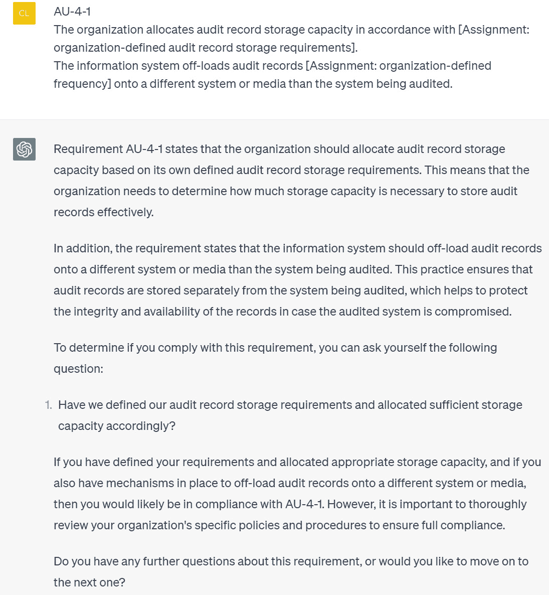
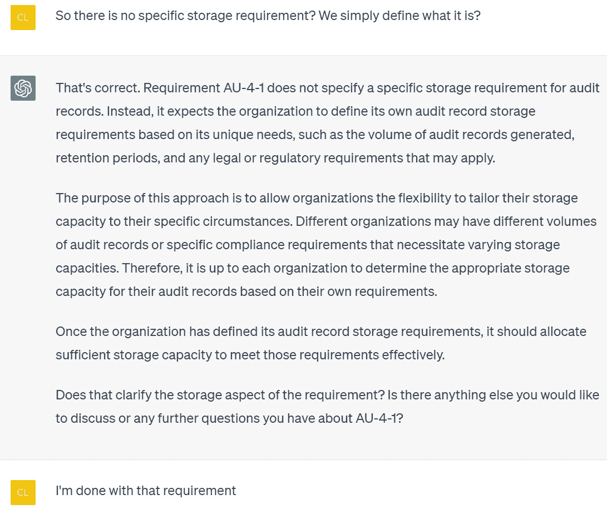
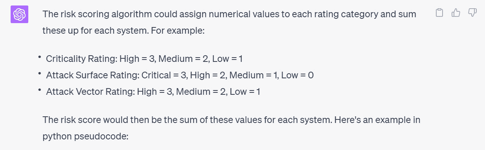
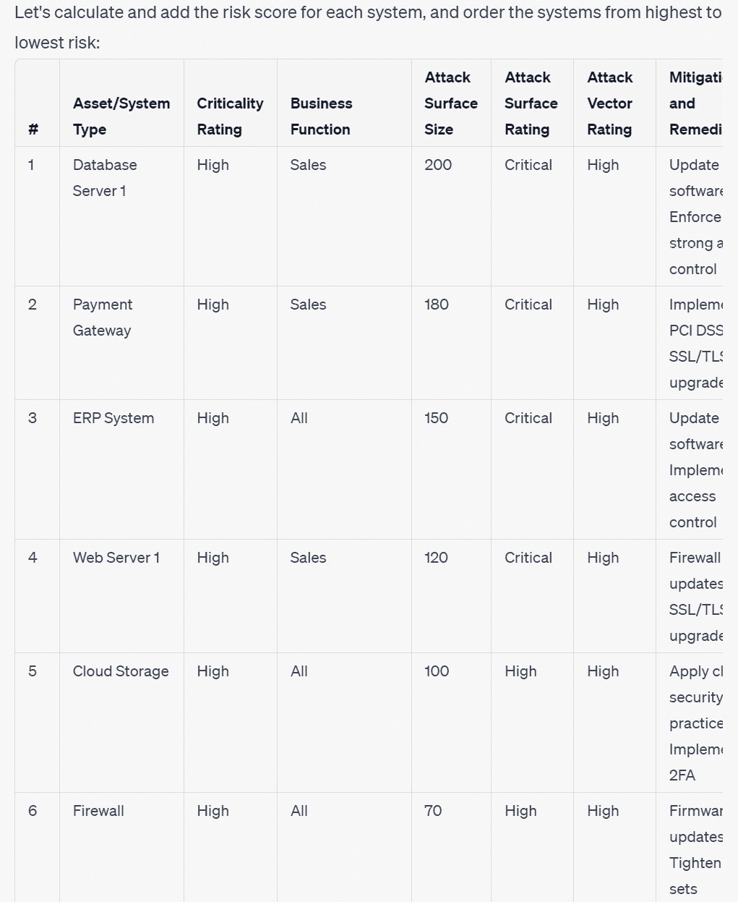

# 4

# 治理、风险和合规性（GRC）

随着数字化景观变得越来越紧密和复杂，管理网络安全风险和保持合规性变得越来越具有挑战性。本章通过展示如何利用 ChatGPT 搭配 OpenAI API 的力量，极大地提高了网络安全基础设施的效率和效果，提供了富有洞见的解决方案。

在整章中，您将发现如何利用 ChatGPT 的能力**生成全面的网络安全政策**，简化政策制定的复杂任务。我们将带您走过一种创新方法，允许对政策文件的每个部分进行细粒度控制，提供了一个符合您特定业务需求的健壮的网络安全框架。

在此基础上，我们将深入探讨**解读复杂的网络安全标准**的微妙之处。ChatGPT 充当向导，将复杂的合规要求分解为可管理、清晰的步骤，从而为确保合规提供了简化的路径。

此外，我们将探讨**网络风险评估**的关键领域，揭示自动化如何革新这一重要流程。您将深入了解如何识别潜在威胁，评估漏洞，并推荐合适的控制措施，从而大幅提升您的组织管理网络安全风险的能力。

在风险评估之后，焦点转向**有效地对这些风险进行优先排序**。您将学习如何使用 ChatGPT 辅助创建基于各种风险相关因素的**客观评分算法**，从而使您能够战略性地分配资源来管理最高优先级的风险。

最后，我们将解决**风险报告生成**这一重要任务。详细的风险评估报告不仅作为确定的风险和缓解策略的宝贵记录，还确保了各利益相关者之间的清晰沟通。我们将演示如何使用 ChatGPT 自动创建这些报告，节省时间并确保所有文档的一致性。

在本章中，我们将涵盖以下内容：

+   安全政策和程序生成

+   ChatGPT 辅助的网络安全标准合规

+   创建风险评估流程

+   ChatGPT 辅助风险排名和优先级排序

+   构建风险评估报告

# 技术要求

对于本章，你将需要一个**网络浏览器**和稳定的**互联网连接**来访问 ChatGPT 平台并设置你的账户。你还需要设置好你的 OpenAI 账户并获取你的 API 密钥。如果没有，请参考*第一章*中的详细信息。对 Python 编程语言的基本熟悉以及使用命令行工作的经验是必要的，因为你将使用**Python 3.x**，它需要安装在你的系统上，用于与 OpenAI GPT API 交互和创建 Python 脚本。一个**代码编辑器**也是必不可少的，用于编写和编辑 Python 代码和提示文件，因为你将在本章的示例中使用它们。

本章的代码文件可以在这里找到：[`github.com/PacktPublishing/ChatGPT-for-Cybersecurity-Cookbook`](https://github.com/PacktPublishing/ChatGPT-for-Cybersecurity-Cookbook)。

# 安全策略与程序生成

在本篇中，你将利用 ChatGPT 和 OpenAI API 的能力为你的组织生成一份**全面的网络安全策略**。对于希望创建符合其特定业务要求的健壮网络安全框架的 IT 管理员、**首席信息安全官（CISO）**和网络安全专业人员来说，这个过程是非常宝贵的。

基于前几章学到的知识，你将确立 ChatGPT 作为一名经验丰富的网络安全专业人员的角色，专注于**治理、风险和合规**（**GRC**）。你将学习如何使用 ChatGPT 生成一个组织良好的策略大纲，然后使用后续提示逐步填写每个部分的上下文。这种方法使你能够在 ChatGPT 的令牌限制和上下文窗口的情况下，对每个部分进行精细控制地生成综合文档。

另外，本篇将介绍如何使用 OpenAI API 和 Python 自动化策略生成过程，并随后生成一份网络安全策略作为 Microsoft Word 文档。这一步骤指南将为使用 ChatGPT 和 OpenAI API 生成详细和定制化的网络安全策略提供实用框架。

## 准备工作

在深入本篇之前，请确保你已经设置好你的 OpenAI 账户并准备好你的 API 密钥。如果没有，请参考*第一章*中的设置细节。你还需要确认你已安装以下 Python 库：

1.  `openai`：这个库使你能够与 OpenAI API 进行交互。使用`pip install openai`命令安装它。

1.  `os`：这是一个内置的 Python 库，允许你与操作系统进行交互，特别是用于访问环境变量。

1.  `docx`：这个库用于生成 Microsoft Word 文档。使用`pip install python-docx`安装它。

1.  `markdown`：此库用于将 Markdown 转换为 HTML，这对于生成格式化文档很有用。使用 `pip` `install markdown` 进行安装。

1.  `tqdm`：此库用于在策略生成过程中显示进度条。使用 `pip` `install tqdm` 进行安装。

一旦您确认所有这些要求都已满足，您就可以开始使用 ChatGPT 和 OpenAI API 生成网络安全策略。

## 如何操作…

在本节中，我们将指导您使用 ChatGPT 生成与您组织需求一致的详细网络安全政策的过程。通过提供必要的细节并使用给定的系统角色和提示，您将能够生成一个结构良好的网络安全政策文档：

1.  首先登录到您的 OpenAI 帐户，并导航到 ChatGPT Web UI。

1.  通过单击**新建** **聊天**按钮与 ChatGPT 开始新对话。

1.  输入以下系统角色以设置 ChatGPT 的上下文：

    ```py
    You are a cybersecurity professional specializing in governance, risk, and compliance (GRC) with more than 25 years of experience.
    ```

1.  然后，输入以下消息文本，根据您组织的需求替换 `{ }` 括号中的占位符。您可以将此提示与系统角色结合，也可以分开输入，如下所示（用您自己的公司名称和类型替换）：

    ```py
    Write a detailed cybersecurity policy outline for my company, {company name}, which is credit union. Provide the outline only, with no context or narrative. Use markdown language to denote the proper headings, lists, formatting, etc.
    ```

1.  查看 ChatGPT 的输出。如果满意且符合您的要求，则可以继续下一步。如果不符合，您可以选择修改您的提示或重新运行对话以生成不同的输出。

1.  从大纲中生成策略。对于大纲的每个部分，请使用以下内容提示 ChatGPT，将 `{section}` 替换为大纲中相应的部分标题：

    ```py
    You are currently writing a cybersecurity policy. Write the narrative, context, and details for the following section (and only this section): {section}. Use as much detail and explanation as possible. Do not write anything that should go in another section of the policy.
    ```

1.  一旦您获得所需的输出，您可以直接将生成的响应复制并粘贴到 Word 文档或您选择的编辑器中，以创建一个全面的网络安全政策文档。

## 工作原理…

这种 GPT 辅助的网络安全政策创建配方利用了自然语言处理（NLP）和机器学习算法的力量，产生了一个定制的、全面的网络安全政策，以满足您组织的需求。通过扮演特定的系统角色并利用详细的用户请求作为提示，ChatGPT 能够调整其输出以满足网络安全专业人士的要求，这些人负责生成详细的政策。以下是这个过程如何运作的更深入的解释：

1.  **系统角色和详细提示**：系统角色将 ChatGPT 描绘为一位经验丰富的网络安全专业人士，专业于 GRC。提示作为用户请求，详细描述了政策大纲的特定内容，从公司性质到网络安全政策的要求都有涉及。这些输入提供了上下文，并引导 ChatGPT 的响应，确保其满足政策创建任务的复杂性和要求。

1.  **自然语言处理和机器学习**：NLP 和机器学习是 ChatGPT 能力的基础。它使用这些技术来理解用户请求的复杂性，学习模式，并生成详细、具体、全面的结构良好的网络安全政策。

1.  **知识和语言理解能力**：ChatGPT 利用其广泛的知识库和语言理解能力，遵循行业标准方法和最佳实践。这在网络安全迅速发展的领域至关重要，确保生成的网络安全政策是最新的并符合公认标准。

1.  **迭代式政策生成**：从生成的大纲中创建详细政策的过程涉及到逐步提示 ChatGPT 每个政策部分。这样做可以更精细地控制每个部分的内容，有助于确保政策结构良好、有条理。

1.  **简化政策创建流程**：利用这个 GPT 辅助的网络安全政策创建配方的整体好处在于，它简化了创建全面网络安全政策的流程。它减少了政策制定所需的时间，允许生成符合行业标准和您组织特定需求的专业级政策。

通过采用这些详细的输入，您将 ChatGPT 转变为一个潜在的宝贵工具，可以帮助创建详尽、量身定制的网络安全政策。这不仅增强了您的网络安全姿态，还确保您的资源得到有效利用，保护您的组织。

## 还有更多…

在 ChatGPT 配方的基础上，您可以通过使用 OpenAI 的 API 来增强功能，不仅可以生成网络安全政策大纲，还可以填写每个部分的详细信息。当您想要即时创建详细文件或为具有不同要求的多家公司生成政策时，这种方法很有帮助。

此 Python 脚本采用与我们 ChatGPT 版本相同的思想，但 OpenAI API 提供的附加功能更多地控制了内容生成过程的灵活性。我们现在将讨论 OpenAI API 版本网络安全政策生成配方涉及的不同步骤：

1.  导入必要的库并设置 OpenAI API：

    ```py
    import os
    import openai
    from openai import OpenAI
    import docx
    from markdown import markdown
    from tqdm import tqdm
    # get the OpenAI API key from environment variable
    openai.api_key = os.getenv('OPENAI_API_KEY')
    ```

    在这一步中，我们导入所需的库，如 `openai`、`os`、`docx`、`markdown` 和 `tqdm`。我们通过提供 API 密钥来设置 OpenAI API。

1.  为网络安全政策大纲准备初始提示：

    ```py
    # prepare initial prompt
    messages=[
        {
            "role": "system",
            "content": "You are a cybersecurity
                professional specializing in governance,
                risk, and compliance (GRC) with more than
                25 years of experience."
        },
        {
            "role": "user",
            "content": "Write a detailed cybersecurity
                policy outline for my company,
                {company name}, which is a credit union.
                Provide the outline only, with no context
                or narrative. Use markdown language to
                denote the proper headings, lists,
                formatting, etc."
        }
    ]
    ```

    使用两个角色的对话构建初始提示：`系统`和`用户`。`系统`消息设置上下文，告知 AI 模型其作为经验丰富的网络安全专业人员的角色。`用户`消息指导 AI 模型为信用联盟创建网络安全政策大纲，指定需要 Markdown 格式。

1.  使用 OpenAI API 生成网络安全政策大纲：

    ```py
    print("Generating policy outline...")
    try:
        client = OpenAI()
        response = client.chat.completions.create(
            model="gpt-3.5-turbo",
            messages=messages,
            max_tokens=2048,
            n=1,
            stop=None,
            temperature=0.7,
        )
    except Exception as e:
        print("An error occurred while connecting to the
            OpenAI API:", e)
        exit(1)
    # get outline
    outline =
        response.choices[0].message.content.strip()
    print(outline + "\n")
    ```

    本部分将请求发送到 OpenAI API，成功后检索生成的政策大纲。

1.  将大纲分成不同的部分，准备 Word 文档：

    ```py
    # split outline into sections
    sections = outline.split("\n\n")
    # prepare Word document
    doc = docx.Document()
    html_text = ""
    ```

    在此我们将大纲分成不同的部分，每个部分都包含 Markdown 格式的标题或副标题。使用 `docx.Document()`函数初始化一个新的 Word 文档。

1.  循环处理大纲的每个部分，生成详细信息：

    ```py
    # for each section in the outline
    for i, section in tqdm(enumerate(sections, start=1),
    total=len(sections), leave=False):
        print(f"\nGenerating details for section {i}...")
    ```

    在此我们循环处理大纲的每个部分。使用`tqdm`函数显示进度条。

1.  准备 AI 模型生成当前部分详细信息的提示：

    ```py
        # prepare prompt for detailed info
        messages=[
            {
                "role": "system",
                "content": "You are a cybersecurity
                    professional specializing in
                    governance, risk, and compliance (GRC)
                    with more than 25 years of
                    experience."
            },
            {
                "role": "user",
                "content": f"You are currently writing a
                    cybersecurity policy. Write the
                    narrative, context, and details for
                    the following section (and only this
                    section): {section}. Use as much
                    detail and explanation as possible. Do
                    not write anything that should go in
                    another section of the policy."
            }
        ]
    ```

    准备 AI 模型生成当前部分详细信息的提示。

1.  生成当前部分的详细信息并将其添加到 Word 文档中：

    ```py
        try:
            response = client.chat.completions.create(
                model="gpt-3.5-turbo",
                messages=messages,
                max_tokens=2048,
                n=1,
                stop=None,
                temperature=0.7,
            )
        except Exception as e:
            print("An error occurred while connecting to
                the OpenAI API:", e)
            exit(1)
        # get detailed info
        detailed_info =
            response.choices[0].message.content.strip()
        # convert markdown to Word formatting
        doc.add_paragraph(detailed_info)
        doc.add_paragraph("\n")  # add extra line break
                                   for readability
        # convert markdown to HTML and add to the
          html_text string
        html_text += markdown(detailed_info)
    ```

    在此我们使用 OpenAI API 为当前部分生成详细信息。Markdown 格式的文本转换成 Word 格式，并添加到 Word 文档中。还将其转换为 HTML，并添加到 `html_text` 字符串中。

1.  保存当前 Word 和 HTML 文档的状态：

    ```py
        # save Word document
        print("Saving sections...")
        doc.save("Cybersecurity_Policy.docx")
        # save HTML document
        with open("Cybersecurity_Policy.html", 'w') as f:
            f.write(html_text)
    ```

    每处理完一个部分，都会保存 Word 文档和 HTML 文档的当前状态。这样，即使脚本中断，也不会丢失任何进度。

1.  处理完所有部分后，打印完成消息：

    ```py
    print("\nDone.")
    ```

这是脚本的完整样子：

```py
import os
import openai
from openai import OpenAI
import docx
from markdown import markdown
from tqdm import tqdm
# get the OpenAI API key from environment variable
openai.api_key = os.getenv('OPENAI_API_KEY')
# prepare initial prompt
messages=[
    {
        "role": "system",
        "content": "You are a cybersecurity professional
            specializing in governance, risk, and
            compliance (GRC) with more than 25 years of
            experience."
    },
    {
        "role": "user",
        "content": "Write a detailed cybersecurity policy
            outline for my company, XYZ Corp., which is a
            credit union. Provide the outline only, with no
            context or narrative. Use markdown language to
            denote the proper headings, lists, formatting,
            etc."
    }
]
print("Generating policy outline...")
try:
    client = OpenAI()
    response = client.chat.completions.create(
        model="gpt-3.5-turbo",
        messages=messages,
        max_tokens=2048,
        n=1,
        stop=None,
        temperature=0.7,
    )
except Exception as e:
    print("An error occurred while connecting to the OpenAI
        API:", e)
    exit(1)
# get outline
outline =
    response.choices[0].message.content.strip()
print(outline + "\n")
# split outline into sections
sections = outline.split("\n\n")
# prepare Word document
doc = docx.Document()
html_text = ""
# for each section in the outline
for i, section in tqdm(enumerate(sections, start=1),
total=len(sections), leave=False):
    print(f"\nGenerating details for section {i}...")
    # prepare prompt for detailed info
    messages=[
        {
            "role": "system",
            "content": "You are a cybersecurity
                professional specializing in governance,
                risk, and compliance (GRC) with more than
                25 years of experience."
        },
        {
            "role": "user",
            "content": f"You are currently writing a
                cybersecurity policy. Write the narrative,
                context, and details for the following
                section (and only this section): {section}.
                Use as much detail and explanation as
                possible. Do not write anything that should
                go in another section of the policy."
        }
    ]
    try:
        response = client.chat.completions.createcreate(
            model="gpt-3.5-turbo",
            messages=messages,
            max_tokens=2048,
            n=1,
            stop=None,
            temperature=0.7,
        )
    except Exception as e:
        print("An error occurred while connecting to the
            OpenAI API:", e)
        exit(1)
    # get detailed info
    detailed_info =
        response.choices[0].message.content.strip()
    # convert markdown to Word formatting
    doc.add_paragraph(detailed_info)
    doc.add_paragraph("\n")  # add extra line break for
                               readability
    # convert markdown to HTML and add to the html_text
      string
    html_text += markdown(detailed_info)
    # save Word document
    print("Saving sections...")
    doc.save("Cybersecurity_Policy.docx")
    # save HTML document
    with open("Cybersecurity_Policy.html", 'w') as f:
        f.write(html_text)
print("\nDone.")
```

此 Python 脚本自动化生成针对特定公司 XYZ Corp.（一家信用联盟）的详细网络安全政策大纲的过程。首先导入必要的库，设置 OpenAI API 密钥以及为 AI 模型准备初始提示，指示其生成政策大纲。

收到 OpenAI API 的成功响应后，脚本将策略大纲拆分为单独的部分以进一步详细描述。然后启动 Word 文档以记录这些详细信息。接着，脚本循环浏览策略大纲的每个部分，从 OpenAI API 中生成并附加详细信息到 Word 文档和 HTML 字符串中，有效地在 Word 和 HTML 格式中创建了一份详细的政策文件。

每次迭代之后，脚本都会确保文档已保存，以防中断导致数据丢失。一旦所有部分都被覆盖并且文档已保存，脚本就会表示其成功完成。因此，一个高级政策概要被扩展为一个详细的、全面的网络安全政策，在使用 OpenAI API 和 Python 完全自动化的过程中。

# ChatGPT 辅助网络安全标准合规性

在这个食谱中，我们将指导您如何使用 ChatGPT 辅助**网络安全标准合规性**。本食谱建立在前几章获得的技能基础之上。理解网络安全标准的要求可能是复杂的，这是因为它们通常的书写方式。使用 ChatGPT，您可以简化这个任务。通过用网络安全标准的摘录提示 ChatGPT，模型可以帮助分解这些要求为更简单的术语，帮助您确定是否符合要求，以及如果不符合要采取哪些步骤来达到合规性。

## 准备工作

确保您可以通过登录您的 OpenAI 账户访问 ChatGPT 界面。随手准备一份网络安全标准文档，您可以从中引用摘录。

## 如何操作…

要利用 ChatGPT 来理解和检查网络安全标准的合规性，请按照以下步骤操作：

1.  登录 ChatGPT 界面。

1.  通过以下提示为 ChatGPT 分配一个角色：

    ```py
    You are a cybersecurity professional and CISO with 30 years of experience in the industrial cybersecurity industry.
    ```

    您应该用您所在行业替换`industrial`。

1.  然后提供 ChatGPT 您的提示：

    ```py
    "I need your help understanding the requirements of the NIST SP 800-82 revision 2 standard. I will give you the requirement ID, specifications, and any other supplemental information I have that is associated with the requirement. You will then explain the requirement to me in way that is easier to understand, and form a question based on the requirement to help me determine whether or not I comply with that requirement or not. You will follow up by asking me if I have any further questions about that requirement or if I'm ready to move to the next requirement. If I have another question regarding that requirement, we will continue discussing the requirement in this manner. If I tell you I'm ready to move on to the next requirement, we will start this process again with the next requirement."
    ```

    记得用您正在处理的网络安全标准替换`'NIST SP 800-82 revision 2 standard'`。

1.  提供 ChatGPT 第一个需求 ID、规范以及任何补充信息：



图 4.1 – ChatGPT 对标准要求查询的响应示例

1.  通过与 ChatGPT 进行对话来深入了解特定需求或继续下一步：



图 4.2 – ChatGPT 对标准要求对话的响应示例

## 它是如何工作的…

当您为 ChatGPT 分配一个角色时，您为模型提供一个特定的上下文或角色，以便模型处理。这有助于模型生成符合给定角色的响应，从而产生更准确、相关和详细的内容。

在理解和检查与网络安全标准的合规性相关的情境中，ChatGPT 使用其训练数据来解释标准摘录，并将其分解为更简单、更易于理解的术语。然后形成一个问题，帮助您确定您是否符合标准。

在整个过程中，您要与模型进行对话，要么深入了解特定要求，要么根据您的需求转移到下一个要求。

## 还有更多内容……

一旦您对此过程感到满意，您可以扩展它以涵盖各个行业中的不同标准。

以下是一些额外要考虑的要点：

+   **ChatGPT 作为培训辅助工具**：您也可以将其用作教学工具，利用 ChatGPT 提供的简化解释来教育组织内其他人有关不同网络安全标准的要求。使用模型生成对复杂标准易于理解的解释可以作为对更传统的培训形式的有用补充。

+   **定期检查的重要性**：定期使用 ChatGPT 来了解并检查网络安全标准的合规性可能更加有效。网络安全形势变化迅速，组织曾经合规的要求可能发生变化。定期检查能够帮助您的组织保持最新。

+   **潜在的限制**：值得指出的是，虽然 ChatGPT 是一个强大的工具，但它确实有局限性。其响应基于截至 2021 年 9 月的培训数据。因此，对于非常最新的标准或自那时以来已经显著更新的标准，其响应可能不完全准确。始终验证最新版本标准的信息是非常重要的。

重要说明

我们将在本书的后面讨论更多提供更新文档作为知识库的高级方法。

+   **专业指导的重要性**：虽然这种方法在理解网络安全标准的要求方面可以起到很大作用，但它并不能替代专业的法律或网络安全指导。合规这些标准往往具有法律意义，因此专业建议是必不可少的。在确定组织是否符合任何网络安全标准时，请始终咨询专业人士。

+   **反馈和迭代**：与任何 AI 工具一样，您使用 ChatGPT 越多，提供的反馈越多，它就能够更好地帮助您。反馈循环使模型能够随时间调整并提供更适合您需求的响应。

# 创建风险评估流程

网络风险评估是组织**风险管理战略**中必不可少的一部分。该过程涉及识别潜在威胁，评估这些威胁可能利用的漏洞，评估此类利用对组织可能产生的影响，并建议适当的控制措施来减轻风险。了解进行风险评估涉及的步骤可以极大增强组织管理网络安全风险的能力。

在此方案中，我们将指导您使用 Python 和 OpenAI API 创建一个网络风险评估过程。通过自动化风险评估过程，您可以简化工作流程，使安全操作更加高效。这种方法还可以提供进行风险评估的标准化格式，从而提高组织的一致性。

## 准备工作

在继续之前，您将需要以下内容：

+   **Python**。此方案与 **Python 3.6** 或更高版本兼容。

+   **OpenAI API 密钥**。如果您还没有，可以在注册后从 OpenAI 网站获取。

+   `pip` `install openai`。

+   Python `docx` 库用于创建 Word 文档。您可以使用 pip 安装它：`pip` `install python-docx`。

+   Python `tqdm` 库用于显示进度。您可以使用 pip 安装它：`pip` `install tqdm`。

+   Python `threading` 和 `os` 库通常可用于 Python。

+   熟悉 Python 编程和基本的网络安全概念。

## 如何实施…

让我们通过构建一个使用 OpenAI API 为我们的风险评估计划中的每个部分生成内容的脚本来开始创建我们的风险评估过程。该脚本将要求 ChatGPT 扮演一名专业从事 GRC 的网络安全专业人士的角色，为我们提供风险评估过程每个部分的详细叙述、上下文和细节：

1.  导入必要的库：

    ```py
    import openai 
    from openai import OpenAI
    import os
    from docx import Document
    import threading
    import time
    from datetime import datetime
    from tqdm import tqdm
    ```

    此代码块导入了我们脚本所需的所有库：`openai` 用于与 OpenAI API 交互，`os` 用于环境变量，`Document` 从 `docx` 中用于创建 Word 文档，`threading` 和 `time` 用于管理 API 调用期间的时间显示，`datetime` 用于时间戳我们的报告，以及 `tqdm` 用于进度可视化。

1.  设置 OpenAI API 密钥：

    ```py
    openai.api_key = os.getenv("OPENAI_API_KEY")
    ```

    此代码设置了存储为环境变量的 OpenAI API 密钥。此密钥用于验证我们程序对 OpenAI API 的请求。

1.  确定评估报告的唯一标识符：

    ```py
    current_datetime =
        datetime.now().strftime('%Y-%m-%d_%H-%M-%S')
    assessment_name =
        f"Risk_Assessment_Plan_{current_datetime}"
    ```

    我们使用当前日期和时间为每个评估报告创建一个唯一名称，确保不会覆盖任何以前的报告。名称格式为 `Risk_Assessment_Plan_{current_datetime}`，其中 `current_datetime` 是运行脚本时的确切日期和时间。

1.  定义风险评估的大纲：

    ```py
    # Risk Assessment Outline
    risk_assessment_outline = [
        "Define Business Objectives",
        "Asset Discovery/Identification",
        "System Characterization/Classification",
        "Network Diagrams and Data Flow Review",
        "Risk Pre-Screening",
        "Security Policy & Procedures Review",
        "Cybersecurity Standards Selection and Gap
             Assessment/Audit",
        "Vulnerability Assessment",
        "Threat Assessment",
        "Attack Vector Assessment",
        "Risk Scenario Creation (using the Mitre ATT&CK
            Framework)",
        "Validate Findings with Penetration Testing/Red
            Teaming",
        "Risk Analysis (Aggregate Findings & Calculate
            Risk Scores)",
        "Prioritize Risks",
        "Assign Mitigation Methods and Tasks",
        "Create Risk Report",
    ]
    ```

    在这里，我们定义了风险评估的大纲。大纲包含了要包括在风险评估过程中的所有部分的列表。

提示

您可以修改流程步骤以包括您认为合适的任何部分，模型将为您提供的任何部分填充上下文。

1.  实现一个使用 OpenAI API 生成部分内容的函数：

    ```py
    def generate_section_content(section: str) -> str:
        # Define the conversation messages
        messages = [
            {
                "role": "system",
                "content": 'You are a cybersecurity
                    professional specializing in
                    governance, risk, and compliance (GRC)
                    with more than 25 years of
                    experience.'},
            {
                "role": "user",
                "content": f'You are
                    currently writing a cyber risk
                    assessment policy. Write the
                    narrative, context, and details for
                    the following section (and only
                    this section): {section}. Use as much
                    detail and explanation as possible. Do
                    not write anything that should go in
                    another section of the policy.'
            },
        ]
        # Call the OpenAI API
        client = OpenAI()
        response = client.chat.completions.create(
            model="gpt-3.5-turbo",
            messages=messages,
            max_tokens=2048,
            n=1,
            stop=None,
            temperature=0.7,
        )
        # Return the generated text
        Return
            response.choices[0].message.content.strip()
    ```

    此函数以风险评估大纲中的部分标题作为输入，并使用 OpenAI API 为该部分生成详细内容。

1.  实现将 Markdown 文本转换为 Word 文档的函数：

    ```py
    def markdown_to_docx(markdown_text: str, output_file: str):
        document = Document()
        # Iterate through the lines of the markdown text
        for line in markdown_text.split('\n'):
            # Add headings based on the markdown heading
              levels
            if line.startswith('# '):
                document.add_heading(line[2:], level=1)
            elif line.startswith('## '):
                document.add_heading(line[3:], level=2)
            elif line.startswith('### '):
                document.add_heading(line[4:], level=3)
            elif line.startswith('#### '):
                document.add_heading(line[5:], level=4)
            # Add paragraphs for other text
            else:
                document.add_paragraph(line)
        # Save the Word document
        document.save(output_file)
    ```

    此函数接受每个部分的生成的 Markdown 文本和所需的输出文件名作为输入，并使用相同的内容创建一个 Word 文档。

1.  实现一个函数来显示等待 API 调用时经过的时间：

    ```py
    def display_elapsed_time():
        start_time = time.time()
        while not api_call_completed:
            elapsed_time = time.time() - start_time
            print(f"\rElapsed time: {elapsed_time:.2f}
                seconds", end="")
            time.sleep(1)
    ```

    此函数负责在等待 API 调用完成时显示经过的时间。这对于跟踪过程花费的时间很有用。

1.  开始生成报告的过程：

    ```py
    api_call_completed = False
    elapsed_time_thread =
        threading.Thread(target=display_elapsed_time)
    elapsed_time_thread.start()
    ```

    在此处，我们启动一个单独的线程来显示经过的时间。这与执行 API 调用的主进程同时运行。

1.  遍历风险评估大纲中的每个部分，生成部分内容，并将其附加到报告中：

    ```py
    # Generate the report using the OpenAI API
    report = []
    pbar = tqdm(total=len(risk_assessment_outline),
        desc="Generating sections")
    for section in risk_assessment_outline:
        try:
            # Generate the section content
            content = generate_section_content(section)
            # Append the section content to the report
            report.append(f"## {section}\n{content}")
        except Exception as e:
            print(f"\nAn error occurred during the API
                call: {e}")
            exit()
        pbar.update(1)
    ```

    此代码块循环遍历我们的风险评估大纲中的每个部分，在使用 OpenAI API 生成该部分的内容后，将生成的内容附加到我们的报告中。

1.  当所有部分都已生成时，完成进度和经过的时间显示：

    ```py
    api_call_completed = True
    elapsed_time_thread.join()
    pbar.close()
    ```

    将 `api_call_completed` 变量设置为 `True` 以指示所有 API 调用已完成。然后，我们停止经过的时间显示线程，并关闭进度条，以表示进程已结束。

1.  最后，将生成的报告保存为 Word 文档：

    ```py
    # Save the report as a Word document
    docx_output_file = f"{assessment_name}_report.docx"
    # Handle exceptions during the report generation
    try:
        markdown_to_docx('\n'.join(report),
            docx_output_file)
        print("\nReport generated successfully!")
    except Exception as e:
        print(f"\nAn error occurred during the report
            generation: {e}")
    ```

    在此最终步骤中，调用`markdown_to_docx`函数，并将生成的报告（以 Markdown 格式）和所需的输出文件名作为参数，以创建一个 Word 文档。文件名包含时间戳以确保其唯一性。此过程包装在 try-except 块中以处理此转换期间可能发生的任何异常。如果成功，我们打印出成功消息；如果发生错误，则打印异常以帮助排查问题。

最终脚本应如下所示：

```py
import openai 
from openai import OpenAI
import os
from docx import Document
import threading
import time
from datetime import datetime
from tqdm import tqdm
# Set up the OpenAI API
openai.api_key = os.getenv("OPENAI_API_KEY")
current_datetime = datetime.now()
    .strftime('%Y-%m-%d_%H-%M-%S')
assessment_name =
    f"Risk_Assessment_Plan_{current_datetime}"
# Risk Assessment Outline
risk_assessment_outline = [
    "Define Business Objectives",
    "Asset Discovery/Identification",
    "System Characterization/Classification",
    "Network Diagrams and Data Flow Review",
    "Risk Pre-Screening",
    "Security Policy & Procedures Review",
    "Cybersecurity Standards Selection and Gap
        Assessment/Audit",
    "Vulnerability Assessment",
    "Threat Assessment",
    "Attack Vector Assessment",
    "Risk Scenario Creation (using the Mitre ATT&CK
        Framework)",
    "Validate Findings with Penetration Testing/Red
        Teaming",
    "Risk Analysis (Aggregate Findings & Calculate Risk
        Scores)",
    "Prioritize Risks",
    "Assign Mitigation Methods and Tasks",
    "Create Risk Report",
]
# Function to generate a section content using the OpenAI
  API
def generate_section_content(section: str) -> str:
    # Define the conversation messages
    messages = [
        {
            "role": "system",
            "content": 'You are a cybersecurity
                professional specializing in governance,
                risk, and compliance (GRC) with more than
                25 years of experience.'
        },
        {
            "role": "user",
            "content": f'You are currently writing a cyber
                risk assessment policy. Write the
                narrative, context, and details for the
                following section (and only this section):
                {section}. Use as much detail and
                explanation as possible.
                Do not write anything that should go in
                another section of the policy.'
        },
    ]
    # Call the OpenAI API
    client = OpenAI()
    response = client.chat.completions.create(
        model="gpt-3.5-turbo",
        messages=messages,
        max_tokens=2048,
        n=1,
        stop=None,
        temperature=0.7,
    )
    # Return the generated text
    return response['choices'][0]['message']['content']
        .strip()
# Function to convert markdown text to a Word document
def markdown_to_docx(markdown_text: str, output_file: str):
    document = Document()
    # Iterate through the lines of the markdown text
    for line in markdown_text.split('\n'):
        # Add headings based on the markdown heading levels
        if line.startswith('# '):
            document.add_heading(line[2:], level=1)
        elif line.startswith('## '):
            document.add_heading(line[3:], level=2)
        elif line.startswith('### '):
            document.add_heading(line[4:], level=3)
        elif line.startswith('#### '):
            document.add_heading(line[5:], level=4)
        # Add paragraphs for other text
        else:
            document.add_paragraph(line)
    # Save the Word document
    document.save(output_file)
# Function to display elapsed time while waiting for the
  API call
def display_elapsed_time():
    start_time = time.time()
    while not api_call_completed:
        elapsed_time = time.time() - start_time
        print(f"\rElapsed time: {elapsed_time:.2f}
            seconds", end="")
        time.sleep(1)
api_call_completed = False
elapsed_time_thread =
    threading.Thread(target=display_elapsed_time)
elapsed_time_thread.start()
# Generate the report using the OpenAI API
report = []
pbar = tqdm(total=len(risk_assessment_outline),
    desc="Generating sections")
for section in risk_assessment_outline:
    try:
        # Generate the section content
        content = generate_section_content(section)
        # Append the section content to the report
        report.append(f"## {section}\n{content}")
    except Exception as e:
        print(f"\nAn error occurred during the API call:
            {e}")
        api_call_completed = True
        exit()
    pbar.update(1)
api_call_completed = True
elapsed_time_thread.join()
pbar.close()
# Save the report as a Word document
docx_output_file = f"{assessment_name}_report.docx"
# Handle exceptions during the report generation
try:
    markdown_to_docx('\n'.join(report), docx_output_file)
    print("\nReport generated successfully!")
except Exception as e:
    print(f"\nAn error occurred during the report
        generation: {e}")
```

现在，让我们看看它是如何工作的。

## 工作原理...

Python 脚本通过与 OpenAI API 交互来为风险评估过程的每个部分生成详细内容。内容是通过模拟用户和系统（ChatGPT）之间的对话生成的，其中系统扮演网络安全专业人士的角色。提供给 API 的对话消息描述了上下文，而 ChatGPT 根据该上下文生成了全面的响应。

在 OpenAI 聊天模型中，提供了一系列消息，每个消息都有一个角色和内容。角色可以是 `system`、`user` 或 `assistant`。`system` 角色通常用于设置 `assistant` 的行为，而 `user` 角色用于指示 `assistant`。

在此脚本中，我们首先使用消息 `'您是一位专门从事治理、风险和合规（GRC）的网络安全专业人员，拥有超过 25 年的经验。'` 来设置系统角色。这是为了告知模型上下文，使其以网络安全领域的经验丰富专业人士的身份进行响应。模型使用此上下文信息生成适当且特定于情景的响应。

`用户`角色的消息`'您当前正在撰写一份网络风险评估政策。为以下部分编写叙述、上下文和详情（仅限于这一部分）：{section}。请尽可能详细和解释。不要写任何应该放在政策的其他部分中的内容。'`，作为模型的具体提示。该提示指导模型为风险评估政策的特定部分生成详细叙述。它指示模型专注于当前部分，不要陷入属于其他部分的细节。通过这样做，我们确保生成的内容相关和准确，符合风险评估流程的结构。

因此，`系统`角色建立了`助手`的上下文和专业知识，而`用户`角色提供了助手执行的指令任务。这种方法有助于从 AI 中获取结构化和相关的内容。

该脚本被设计为单独处理风险评估流程的每个部分，对每个部分进行单独的 API 调用。它利用多线程显示 API 调用正在处理时的经过时间，以便给出进展的感知。

每个部分的生成内容以 Markdown 格式附加到报告中，然后使用 Python 的`docx`库将其转换为 Word 文档。这创造了一个结构良好、详细的风险评估计划，可用作组织进行风险评估的起点。

## 还有更多...

由该方案创建的风险评估流程具有灵活性。您可以尝试使用 ChatGPT 为不同部分编写内容，然后将这些概述部分插入脚本中，以实验生成自己的风险评估流程。这使您能够创建一个符合组织特定需求和风险配置文件的风险评估流程。请记住，最佳的风险评估流程是根据反馈和新见解不断更新和改进的流程。

# ChatGPT 辅助风险排名和优先级排序

在这个方案中，我们将利用 ChatGPT 的能力，基于给定数据来**优先和排名网络安全风险**。在网络安全中，对风险进行优先排名是一个关键任务，它帮助组织将资源集中在最重要的地方。通过使用 ChatGPT，您可以使这项任务变得更加可管理和客观。

在给定场景中，我们有一个包括不同资产或系统的一系列与风险相关因素的数据集。这些因素包括资产类型、其重要性评级、所服务的业务功能、其攻击面的大小和评级、攻击向量的评级以及所采取的缓解和补救措施。

ChatGPT 将协助我们根据此数据创建评分算法来确定风险的优先级。由评分算法计算出的最高优先级风险将列在新表格的顶部。我们将使用样本数据指导您完成此过程，但您将来可以将同样的过程应用于自己的数据。

## 准备工作

确保你能够访问 ChatGPT 界面，方法是登录你的 OpenAI 账户。你还需要一个包含系统列表及其相关漏洞和风险数据的数据集。关于这个数据集的更多说明包含在本示例中。

如果你没有可用的数据集，可以使用本示例提供的数据集，可从[`github.com/PacktPublishing/ChatGPT-for-Cybersecurity-Cookbook`](https://github.com/PacktPublishing/ChatGPT-for-Cybersecurity-Cookbook)下载。

## 如何做…

要开始风险排名和优先级确定，让我们向 ChatGPT 发送一个详细的提示。提示应清楚地说明任务，并提供必要的上下文和数据：

提示

你可以提供任何系统数据，只要它被分隔或标识出来，并且具有标头名称和可辨识的值，表示系统和漏洞的风险级别、严重程度、价值等，ChatGPT 可以使用这些值来创建适当的算法。

1.  通过输入以下提示来确定系统角色：

    ```py
    You are a cybersecurity professional with 25 years of experience.
    ```

1.  指示 ChatGPT 使用以下提示基于你的数据创建一个评分算法：

    ```py
    Based on the following dataset, categories, and values, create a suitable risk scoring algorithm to help me prioritize the risks and mitigation efforts. Provide me with the calculation algorithm and then create a new table using the same columns, but now ordered by highest priority to lowest (highest being on top) and with a new column all the way to the left containing the row number.
    Data:
    Asset/System Type    Criticality Rating    Business Function    Attack Surface Size    Attack Surface Rating    Attack Vector Rating    Mitigations and Remediations
    Web Server 1    High    Sales    120    Critical    High    Firewall updates, SSL/TLS upgrades
    Email Server    High    Communication    80    High    High    Spam filter updates, User training
    File Server    Medium    HR    30    Medium    Medium    Apply software patches, Improve password policy
    Print Server    Low    All    15    Low    Low    Apply firmware updates
    Database Server 1    High    Sales    200    Critical    High    Update DB software, Enforce strong access control
    Workstation 1    Low    Engineering    10    Low    Low    Install Antivirus, Apply OS patches
    CRM Software    High    Sales    50    Medium    Medium    Update CRM software, Implement 2FA
    ERP System    High    All    150    Critical    High    Update ERP software, Implement access control
    IoT Device 1    Low    Maintenance    20    Medium    Low    Apply firmware updates, Change default passwords
    Web Server 2    Medium    Marketing    60    Medium    Medium    SSL/TLS upgrades, Implement WAF
    Virtual Machine 1    Low    Development    20    Low    Low    Apply OS patches, Enforce strong access control
    Networking Switch    High    All    30    Medium    High    Firmware updates, Change default credentials
    Mobile Device 1    Medium    Sales    25    Medium    Medium    Implement MDM, Enforce device encryption
    Firewall    High    All    70    High    High    Firmware updates, Tighten rule sets
    Cloud Storage    High    All    100    High    High    Apply cloud security best practices, Implement 2FA
    VOIP Server    Medium    All    45    Medium    Medium    Apply patches, Implement strong access control
    Payment Gateway    High    Sales    180    Critical    High    Implement PCI DSS, SSL/TLS upgrades
    Router    High    All    30    Medium    High    Firmware updates, Change default credentials
    WiFi AP    Medium    All    40    Medium    Medium    Firmware updates, Implement strong WiFi encryption
    SAN Storage    High    All    60    High    High    Update SAN software, Implement access control
    ```

下图展示了由 ChatGPT 创建的评分算法输出示例：



图 4.3 – 评分算法输出示例

下面的代码是由 ChatGPT 生成的示例评分算法代码输出：

```py
def calculate_risk_score(criticality_rating,
attack_surface_rating, attack_vector_rating):
    ratings = {"High": 3, "Medium": 2, "Low": 1}
    return ratings[criticality_rating] +
        ratings[attack_surface_rating] +
            ratings[attack_vector_rating]
```

下图展示了 ChatGPT 格式化输出的示例，列出了按算法创建的风险评分进行优先排序的资产：



图 4.4 – 优先级输出示例

提示

提供的提示中的数据是用制表符分隔的。你可以提供任何系统数据，只要它被分隔或标识出来，并且具有标头名称和可辨识的值，表示系统和漏洞的风险级别、严重程度、价值等，ChatGPT 可以使用这些值来创建适当的算法。

提示

本示例中使用的样本数据是使用以下提示生成的：

`"生成我将用于假设风险评估示例的样本数据表。表格应至少包含 20 行，并包含以下列：`

`资产/系统类型，关键性评级，业务功能，攻击面大小（根据系统发现的漏洞数量衍生的值），攻击面评级（通过计算高危和严重程度评级与总攻击面的比率衍生的值），攻击向量评级（其他系统可接触到此系统的数量衍生的值，具有面向互联网的自动最高数量），需要针对此系统进行的缓解和修复措施清单（这通常将根据漏洞扫描结果的建议而产生，但对于此测试/样本数据，只是虚构了一些假设的）数据。"`

## 如何运作…

ChatGPT 基于一种称为**transformer**的机器学习模型，具体来说是一种称为**生成预训练变换器**（Generative Pretrained Transformer，GPT）的变体。该模型已在各种互联网文本上进行了训练，已学习了语言模式和事实信息，并从这个广泛的语料库中具有某些推理能力。

在面临创建风险评分算法的任务时，ChatGPT 并不依赖于对网络安全或风险管理的固有理解。相反，它利用在训练阶段学到的模式。在训练过程中，它可能遇到了与**风险评分算法**、**风险优先级排定**和网络安全相关的文本。通过识别训练数据中这些信息的结构和上下文，当受到提示时，它能够生成相关连贯的回答。

创建风险评分算法时，ChatGPT 首先理解了数据中呈现的各种因素，如`关键性评级`、`业务功能`、`攻击面大小`、`攻击面评级`、`攻击向量评级`和`缓解和修复措施`。它明白到这些因素对确定每个资产相关的整体风险是重要的。然后，ChatGPT 制定了一个算法，考虑到了这些因素，为每个因素分配不同的权重和分数，根据它们在整体风险评估中的认知重要性。

接着，生成的算法被应用到数据中，为每一个风险得分，创建了一个新的按照这些分数进行排序的表格。这个排序过程有助于风险优先级排定 – 得分更高的风险被视为更加关键，并列在表格的顶部。

ChatGPT 的令人印象深刻之处在于，虽然它并不真正*理解*网络安全或人类意义上的风险评估，但基于它学到的模式，它可以相当令人信服地模仿这样的理解。它能够基于这些模式生成有创意和连贯的文本，使其成为一种用于各种任务的多功能工具，包括在本文档中生成风险评分算法。

## 还有更多…

这种方法受 ChatGPT 的**令牌限制**所限制。由于此限制，只能粘贴这么多数据。但是，在本书的后面，我们将提供使用更高级技术如何绕过此限制的配方。

提示

不同的模型有不同的令牌限制。如果您是 OpenAI Plus 的订阅者，可以在 GPT-3.5 和 GPT-4 模型之间选择。GPT-4 的令牌限制大小是 GPT-3.5 的两倍。此外，如果您使用 OpenAI Playground 而不是 ChatGPT UI，您可以使用新的 gpt-3.5-turbo-16k 模型，该模型的令牌限制是 GPT-3.5 的四倍。

# 构建风险评估报告

网络安全涉及管理和缓解风险，这个过程的一个重要部分是创建详细的风险评估报告。这些报告不仅记录了识别的风险、漏洞和威胁，还阐明了采取的措施，以便与各方清晰沟通。自动创建风险评估报告可以节省大量时间，并确保报告的一致性。

在这个配方中，我们将创建一个 Python 脚本，使用 OpenAI 的 ChatGPT 自动生成网络风险评估报告。我们将使用用户提供的数据，重点关注我们在*ChatGPT 辅助风险排名和优先级*配方中使用的数据。但是，脚本和提示已经设计为可以处理任何相关的用户提供的数据。通过本配方结束时，您将能够使用 Python、ChatGPT 和您自己的数据生成详细和连贯的风险评估报告。

## 准备工作

在开始之前，请确保您有以下内容：

+   Python。

+   已安装了`openai`Python 库。您可以使用 pip 安装它：`pip` `install openai`。

+   已安装了`python-docx`库。您可以使用 pip 安装它：`pip` `install python-docx`。

+   已安装了`tqdm`库。您可以使用 pip 安装它：`pip` `install tqdm`。

+   一枚来自 OpenAI 的 API 密钥。

## 怎么做…

在开始之前，请记住您需要在`systemdata.txt`文件中提供系统数据。这些数据可以是任何东西，只要它们是分隔或分隔的，并且包含可辨识的值，表示系统和漏洞的风险、严重程度、价值等级等。这些信息将被 ChatGPT 用于创建适当的算法，并生成上下文准确的报告部分：

1.  导入所需的库：

    ```py
    import openai 
    from openai import OpenAI
    import os
    from docx import Document
    import threading
    import time
    from datetime import datetime
    from tqdm import tqdm
    ```

    这些是脚本正常运行所必需的库。`openai`用于与 OpenAI API 交互，`os`用于访问环境变量，`docx`中的`Document`用于创建 Word 文档，`threading`和`time`用于多线程和跟踪经过的时间，`datetime`用于为每次运行生成唯一的文件名，`tqdm`用于在控制台中显示进度条。

1.  设置 OpenAI API 密钥并生成评估名称：

    ```py
    openai.api_key = os.getenv("OPENAI_API_KEY")
    current_datetime = datetime.now()
        .strftime('%Y-%m-%d_%H-%M-%S')
    assessment_name =
        f"Risk_Assessment_Plan_{current_datetime}"
    ```

    OpenAI API 密钥从环境变量中读取，并且当前日期和时间用于为风险评估报告创建唯一的文件名。

1.  创建风险评估报告大纲：

    ```py
    risk_assessment_outline = [
        "Executive Summary",
        "Introduction",
        # More sections...
    ]
    ```

    这是风险评估报告的结构，用于指导 AI 模型生成每个部分的内容。

1.  定义生成部分内容的函数：

    ```py
    def generate_section_content(section: str,
    system_data: str) -> str:
        messages = [
            {
                "role": "system",
                "content": 'You are a cybersecurity
                    professional...'
            },
            {
                "role": "user",
                "content": f'You are currently
                    writing a cyber risk assessment
                    report...{system_data}'
            },
        ]
        # Call the OpenAI API
    client = OpenAI()
    response = client.chat.completions.create(
            model="gpt-3.5-turbo",
            messages=messages,
            max_tokens=2048,
            n=1,
            stop=None,
            temperature=0.7,
        )
        Return
            response.choices[0].message.content.strip()
    ```

    此函数构造一个对话提示，将其发送到 OpenAI API，并检索模型的响应。它接受部分名称和系统数据作为参数，并返回指定部分的生成内容。

1.  定义将 Markdown 文本转换为 Word 文档的函数：

    ```py
    def markdown_to_docx(markdown_text: str, output_file: str):
        document = Document()
        # Parsing and conversion logic...
        document.save(output_file)
    ```

    此函数接受 Markdown 文本和文件路径，根据 Markdown 内容创建 Word 文档，并将文档保存到指定的文件路径。

1.  定义显示经过的时间的函数：

    ```py
    def display_elapsed_time():
        start_time = time.time()
        while not api_call_completed:
            elapsed_time = time.time() - start_time
            print(f"\rElapsed time: {elapsed_time:.2f}
                seconds", end="")
            time.sleep(1)
    ```

    此函数用于在等待 API 调用完成时在控制台中显示经过的时间。它被实现为一个单独的线程，以允许主线程继续执行脚本的其余部分。

1.  读取系统数据并启动经过的时间线程：

    ```py
    with open("systemdata.txt") as file:
        system_data = file.read()
    api_call_completed = False
    elapsed_time_thread =
        threading.Thread(target=display_elapsed_time)
    elapsed_time_thread.start()
    ```

    脚本从文本文件中读取系统数据，并启动一个新线程在控制台中显示经过的时间。

1.  使用 OpenAI API 生成报告：

    ```py
    report = []
    pbar = tqdm(total=len(risk_assessment_outline),
        desc="Generating sections")
    for section in risk_assessment_outline:
        try:
            content = generate_section_content(section,
                system_data)
            report.append(f"## {section}\n{content}")
        except Exception as e:
            print(f"\nAn error occurred during the API
                call: {e}")
            api_call_completed = True
            exit()
        pbar.update(1)
    api_call_completed = True
    elapsed_time_thread.join()
    pbar.close()
    ```

    脚本创建一个进度条，遍历风险评估报告大纲中的各个部分，使用 OpenAI API 为每个部分生成内容，并将内容附加到报告中。然后停止经过的时间线程并关闭进度条。

1.  将报告保存为 Word 文档：

    ```py
    docx_output_file = f"{assessment_name}_report.docx"
    try:
        markdown_to_docx('\n'.join(report),
            docx_output_file)
        print("\nReport generated successfully!")
    except Exception as e:
        print(f"\nAn error occurred during the report
            generation: {e}")
    ```

    最后，脚本将生成的报告从 Markdown 转换为 Word 文档并保存文档。如果在此过程中抛出异常，则会捕获并在控制台上打印消息。

完整的脚本应如下所示：

```py
import openai 
from openai import OpenAI
import os
from docx import Document
import threading
import time
from datetime import datetime
from tqdm import tqdm
# Set up the OpenAI API
openai.api_key = os.getenv("OPENAI_API_KEY")
current_datetime = datetime.now()
    .strftime('%Y-%m-%d_%H-%M-%S')
assessment_name =
    f"Risk_Assessment_Plan_{current_datetime}"
# Cyber Risk Assessment Report Outline
risk_assessment_outline = [
    "Executive Summary",
    "Introduction",
    "Asset Discovery/Identification",
    "System Characterization/Classification",
    "Network Diagrams and Data Flow Review",
    "Risk Pre-Screening",
    "Security Policy & Procedures Review",
    "Cybersecurity Standards Selection and Gap
        Assessment/Audit",
    "Vulnerability Assessment",
    "Threat Assessment",
    "Attack Vector Assessment",
    "Risk Scenario Creation (using the Mitre ATT&CK
        Framework)",
    "Validate Findings with Penetration Testing/Red
        Teaming",
    "Risk Analysis (Aggregate Findings & Calculate Risk
        Scores)",
    "Prioritize Risks",
    "Assign Mitigation Methods and Tasks",
    "Conclusion and Recommendations",
    "Appendix",
]
# Function to generate a section content using the OpenAI
  API
def generate_section_content(section: str, system_data:
str) -> str:
    # Define the conversation messages
    messages = [
        {
            "role": "system",
            "content": 'You are a cybersecurity
                professional specializing in governance,
                risk, and compliance (GRC) with more than
                25 years of experience.'
        },
        {
            "role": "user",
            "content": f'You are currently writing a
                cyber risk assessment report. Write the
                context/details for the following section
                (and only this section): {section}, based
                on the context specific that section, the
                process that was followed, and the
                resulting system data provided below. In
                the absense of user provided context or
                information about the process followed,
                provide placeholder context that aligns
                with industry standard context for that
                section. Use as much detail and explanation
                as possible. Do not write
                anything that should go in another section
                of the policy.\n\n{system_data}'
        },
    ]
    # Call the OpenAI API
    client = OpenAI()
    response = client.chat.completions.create(
        model="gpt-3.5-turbo",
        messages=messages,
        max_tokens=2048,
        n=1,
        stop=None,
        temperature=0.7,
    )
    # Return the generated text
    response.choices[0].message.content.strip()
# Function to convert markdown text to a Word document
def markdown_to_docx(markdown_text: str, output_file: str):
    document = Document()
    # Iterate through the lines of the markdown text
    for line in markdown_text.split('\n'):
        # Add headings based on the markdown heading levels
        if line.startswith('# '):
            document.add_heading(line[2:], level=1)
        elif line.startswith('## '):
            document.add_heading(line[3:], level=2)
        elif line.startswith('### '):
            document.add_heading(line[4:], level=3)
        elif line.startswith('#### '):
            document.add_heading(line[5:], level=4)
        # Add paragraphs for other text
        else:
            document.add_paragraph(line)
    # Save the Word document
    document.save(output_file)
# Function to display elapsed time while waiting for the
  API call
def display_elapsed_time():
    start_time = time.time()
    while not api_call_completed:
        elapsed_time = time.time() - start_time
        print(f"\rElapsed time: {elapsed_time:.2f}
            seconds", end="")
        time.sleep(1)
# Read system data from the file
with open("systemdata.txt") as file:
    system_data = file.read()
api_call_completed = False
elapsed_time_thread =
    threading.Thread(target=display_elapsed_time)
elapsed_time_thread.start()
# Generate the report using the OpenAI API
report = []
pbar = tqdm(total=len(risk_assessment_outline),
    desc="Generating sections")
for section in risk_assessment_outline:
    try:
        # Generate the section content
        content = generate_section_content(section,
            system_data)
        # Append the section content to the report
        report.append(f"## {section}\n{content}")
    except Exception as e:
        print(f"\nAn error occurred during the API call:
            {e}")
        exit()
    pbar.update(1)
api_call_completed = True
elapsed_time_thread.join()
pbar.close()
# Save the report as a Word document
docx_output_file = f"{assessment_name}_report.docx"
# Handle exceptions during the report generation
try:
    markdown_to_docx('\n'.join(report), docx_output_file)
    print("\nReport generated successfully!")
except Exception as e:
    print(f"\nAn error occurred during the report
        generation: {e}")
```

现在，让我们看看它是如何工作的。

## 它的工作原理…

此脚本的关键功能是基于系统数据和评估过程自动化生成详细的风险评估报告。脚本通过将过程分成一系列定义好的部分，并在每个部分中使用 OpenAI API 生成特定的、详细的内容来工作。

从文件加载的系统数据为 gpt-3.5-turbo 模型提供了生成每个部分内容的上下文。我们定义了一个概要，将风险评估报告分解为各种部分，每个部分代表风险评估过程中的一个阶段。这些部分与 *创建风险评估流程* 配方中概述的步骤相匹配。

我们在脚本中使用以下提示来构建报告模板：

```py
You are a cybersecurity professional and CISO with more than 25 years of experience. Create a detailed cyber risk assessment report outline that would be in line with the following risk assessment process outline:
1\. Define Business Objectives
2\. Asset Discovery/Identification
3\. System Characterization/Classification
4\. Network Diagrams and Data Flow Review
5\. Risk Pre-Screening
6\. Security Policy & Procedures Review
7\. Cybersecurity Standards Selection and Gap Assessment/Audit
8\. Vulnerability Assessment
9\. Threat Assessment
10\. Attack Vector Assessment
11\. Risk Scenario Creation (using the Mitre ATT&CK Framework)
12\. Validate Findings with Penetration Testing/Red Teaming
13\. Risk Analysis (Aggregate Findings & Calculate Risk Scores)
14\. Prioritize Risks
15\. Assign Mitigation Methods and Tasks"
```

这种方法指导模型生成与报告每个部分匹配的内容。

在每个章节中，脚本都会调用`generate_section_content()`函数。这个函数向 OpenAI API 发送一个聊天消息，其中包括模型的角色（经验丰富的网络安全专业人员）、当前任务（编写指定的章节）和提供的系统数据。该函数返回的模型响应，也就是指定章节的内容，将被添加到`report`列表中。

`markdown_to_docx()`函数将`report`列表中的 Markdown 文本转换成 Word 文档。它通过迭代 Markdown 文本中的每一行，检查是否以 Markdown 标题标签（如`#`、`##`等）开头，并相应地将其添加到文档中作为标题或段落。

一旦所有章节都生成并追加到`report`列表中，该列表就会被合并成一个字符串，并使用`markdown_to_docx()`函数转换成 Word 文档。

## 还有更多…

每个描述流程某些方面的章节的上下文是占位文本，用户可以并且可能应该对其进行修改。我们之所以采用这种方法是为了简单起见，但在后面的示例中，我们将展示如何使用更高级的技术，将实际的风险评估流程作为报告的真实上下文。

我们鼓励您尝试使用不同的评估流程概要和数据集。了解如何调整提示和数据以获得最有效的结果，以满足您的需求，是充分利用 gpt-3.5-turbo 和 gpt-4 等人工智能模型的重要部分。

重要提示

请谨记，与上一个示例类似，这种方法受所选模型的标记限制的限制。gpt-3.5-turbo 模型的标记限制为 4,096，这限制了可以从系统数据文件中传递的数据量。然而，我们将在本书的后面探讨高级技术，以绕过这个限制。通过这些技术，您将能够处理更大的数据集并生成更全面的报告。

提示

与本书中大多数示例一样，本章节的示例中使用了 gpt-3.5-turbo 模型，因此可以以最具成本效益的模型作为基准。还使用了 GPT-3.5 ChatGPT 模型，以便将基准设定为最高效的无限制模型。然而，我们鼓励您尝试使用不同的模型，比如 gpt-3.5-turbo、gpt-4 和新发布的 gpt-3.5-turbo-16k，以找到最适合您需求的结果。
