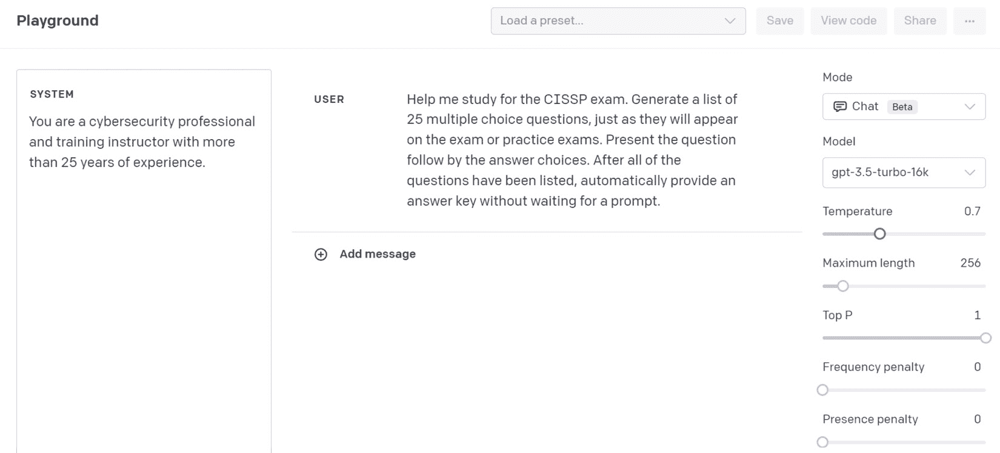
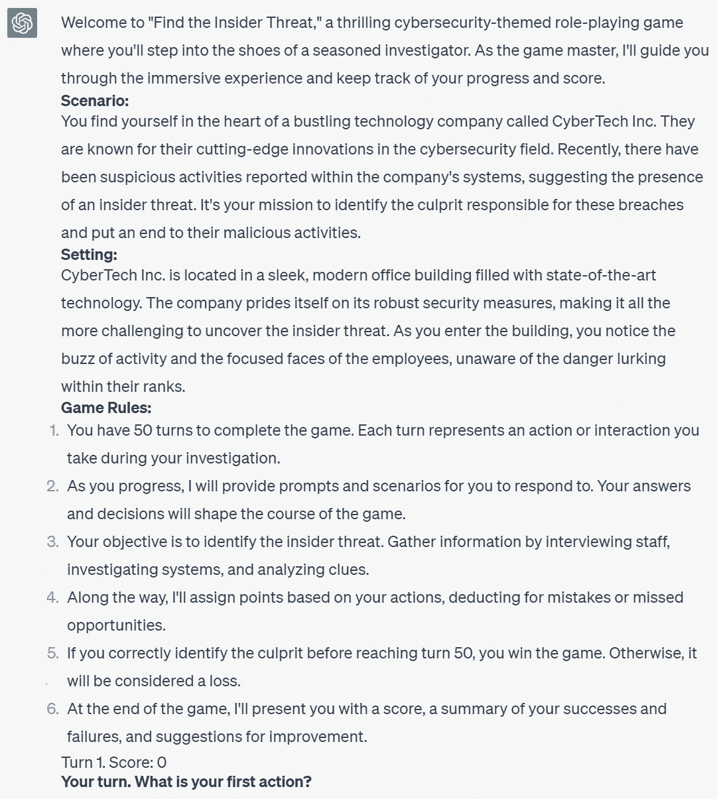

# 第五章：安全意识和培训

在这一章中，我们将深入探讨**网络安全培训和教育**的迷人领域，强调了 OpenAI 的**大型语言模型**（**LLMs**）在增强和丰富这一关键过程中可以发挥的重要作用。我们将踏上一段旅程，发现 ChatGPT 如何作为一个交互式工具，促进网络安全意识的各个方面，从创建全面的员工培训材料到开发交互式网络安全评估，甚至**将学习过程本身变成游戏化**。

我们将首先演示如何利用 ChatGPT、Python 和 OpenAI API 自动生成员工网络安全意识培训内容。在一个人为错误经常导致安全漏洞的时代，您将学会利用这些强大的工具，创建符合您组织特定需求的引人入胜的培训材料。

随着我们的进展，我们将探讨如何使用 ChatGPT 创建**交互式评估**，帮助企业和机构测试员工对关键网络安全概念的理解和记忆。您将通过实践方法指导，定制这些评估，使您能够构建一个与您组织现有培训内容相一致的工具。到本节结束时，您将有能力**生成、导出和集成这些评估到您的学习管理系统**。

在我们继续旅程时，我们将注意力转向**电子邮件钓鱼** - 这是网络犯罪分子采用的最普遍的策略之一。您将发现如何使用 ChatGPT 创建一个交互式电子邮件钓鱼培训工具，从而为您的组织营造一个更安全的网络环境。培训的交互性不仅确保了持续、引人入胜和高效的学习体验，还可以轻松地与现场课程或学习管理系统进行整合。

接下来，我们将看到 ChatGPT 如何协助**准备网络安全认证考试**。通过创建针对诸如 CISSP 等认证的学习指南，您将利用 ChatGPT 的能力与潜在的考试题目进行互动，收集有用的见解，并评估您对考试的准备程度。

最后，我们探索了**网络安全教育中游戏化**的令人兴奋和充满活力的世界。作为*ThreatGEN® Red vs. Blue*的创作者，这是世界上第一批教育性网络安全视频游戏之一，我相信游戏与教育的结合提供了一种独特而引人入胜的方式来传授网络安全技能，这是未来的发展方向。通过 ChatGPT 作为一个**网络安全主题** **角色扮演游戏**中的**游戏主持人**，您将发现这个 AI 工具如何管理游戏进度，记分，并提供详细的改进报告，为学习体验增添了全新的维度。

通过本章，您不仅会欣赏 ChatGPT 在教育领域的多样化应用，还将获得在网络安全领域有效利用其能力所需的技能。

在本章中，我们将涵盖以下内容:

+   开发安全意识培训内容

+   评估网络安全意识

+   通过 ChatGPT 进行交互式邮箱网络钓鱼培训

+   ChatGPT 引导的网络安全认证学习

+   将网络安全培训变成游戏

# 技术要求

对于本章，您需要一个 **web 浏览器** 和一个稳定的 **互联网连接** 来访问 ChatGPT 平台并设置您的帐户。您还需要已经建立好您的 OpenAI 帐户并获得了您的 API 密钥。如果没有，请参阅 *第一章* 获取详细信息。您需要基本的 Python 编程语言知识并了解如何使用命令行，因为您将使用 **Python 3.x** 来与 OpenAI GPT API 进行交互并创建 Python 脚本。**代码编辑器** 也将是必不可少的，用于编写和编辑 Python 代码以及在本章中使用的命令提示文件。

本章的代码文件可以在此处找到：。

# 开发安全意识培训内容

在网络安全领域，员工教育至关重要。人为错误仍然是安全漏洞的主要原因之一，因此至关重要的是确保组织中的所有成员都了解他们在维护网络安全中的角色。然而，制作引人入胜和有效的培训材料可能是一个耗时的过程。

本文将指导您如何使用 Python 和 OpenAI API 自动生成员工网络安全意识培训内容。生成的内容可以用于幻灯片演示和讲义，您可以将其无缝集成到所选的幻灯片演示应用程序中。

通过利用 Python 脚本和 API 提示方法的能力，您将能够生成大量内容，远远超出 ChatGPT 中单个提示通常产生的量。

本文中生成的培训材料将重点放在常常面临高风险网络威胁的电力公用事业行业上。但是，本文中使用的技术是灵活的，允许您指定适合您需求的任何行业，并将生成适应您选择的行业的相应内容。开发的指导和程序将是教育员工维护组织网络安全角色的宝贵资源。

## 准备就绪

在开始本节内容之前，请确保您已经设置好您的 OpenAI 帐户并准备好您的 API 密钥。如果没有，请参考 *第一章* 获取所需的设置详细信息。您还需要 **Python 3.10.x** **或更高版本**。

另外，请确认你已安装了以下 Python 库：

1.  `openai`：这个库使你能够与 OpenAI API 进行交互。使用命令 `pip install openai` 安装它。

1.  `os`：这是一个内置的 Python 库，它允许你与操作系统进行交互，特别是用于访问环境变量。

1.  `tqdm`：这个库用于显示生成过程中的进度条。使用 `pip install tqdm` 安装它。

一旦这些要求都就绪，你就可以开始执行脚本了。

## 怎么做…

重要提示

在开始之前，应该注意，**gpt-4** 模型强烈建议用于本示例中的提示。即使经过了大量尝试，**gpt-3.5-turbo** 模型有时会在输出中提供不一致的格式。

在接下来的步骤中，我们将指导你创建一个 Python 脚本，自动化使用初始提示生成幻灯片列表的过程，为每个幻灯片生成详细信息，最后创建一个包含所有内容的文档，适合直接复制粘贴到你选择的幻灯片演示应用程序中。

1.  **导入必要的库**。脚本从导入所需的 Python 库开始，包括 **openai**（用于 OpenAI API 调用）、**os**（用于环境变量）、**threading**（用于并行线程）、**time**（用于基于时间的函数）、**datetime**（用于日期和时间操作）和 **tqdm**（用于显示进度条）。

    ```py
    import openai
    from openai import OpenAI
    import os
    import threading
    import time
    from datetime import datetime
    from tqdm import tqdm
    ```

1.  **设置 OpenAI API 并准备文件输出**。在这里，我们使用你的 API 密钥初始化 OpenAI API。我们还准备了一个输出文件，其中将存储生成的幻灯片内容。文件名基于当前日期和时间，确保它是唯一的。

    ```py
    # Set up the OpenAI API
    openai.api_key = os.getenv("OPENAI_API_KEY")
    current_datetime = datetime.now().strftime('%Y-%m-%d_%H-%M-%S')
    output_file = f"Cybersecurity_Awareness_Training_{current_datetime}.txt"
    ```

1.  `content_to_text_file()` 和 `display_elapsed_time()`，被定义用来处理将幻灯片内容写入文本文件以及在等待 API 调用时显示经过的时间。

    ```py
    def content_to_text_file(slide_content: str, file):
        try:
            file.write(f"{slide_content.strip()}\n\n---\n\n")
        except Exception as e:
            print(f"An error occurred while writing the slide content: {e}")
            return False
        return True
    def display_elapsed_time(event):
        start_time = time.time()
        while not event.is_set():
            elapsed_time = time.time() - start_time
            print(f"\rElapsed time: {elapsed_time:.2f} seconds", end="")
            time.sleep(1)
    def display_elapsed_time(event):
        #... function content here...
    ```

1.  `display_elapsed_time()` 函数。

    ```py
    # Create an Event object
    api_call_completed = threading.Event()
    # Starting the thread for displaying elapsed time
    elapsed_time_thread = threading.Thread(target=display_elapsed_time, args=(api_call_completed,))
    elapsed_time_thread.start()
    ```

1.  **准备初始提示。** 我们为模型设置了初始提示。系统角色描述了 AI 模型的角色，用户角色提供了指示，让模型生成网络安全培训大纲。

    ```py
    messages=[
        {
            "role": "system",
            "content": "You are a cybersecurity professional with more than 25 years of experience."
        },
        {
            "role": "user",
            "content": "Create a cybersecurity awareness training slide list that will be used for a PowerPoint slide based awareness training course, for company employees, for the electric utility industry. This should be a single level list and should not contain subsections or second-level bullets. Each item should represent a single slide."
        }
    ]
    ```

1.  `openai.ChatCompletion.create()` 函数使用准备好的提示来生成培训大纲。如果在此过程中出现任何异常，它们会被捕获并打印到控制台。

    ```py
    print(f"\nGenerating training outline...")
    try:
        client = OpenAI()
        response = client.chat.completions.create(
            model="gpt-3.5-turbo",
            messages=messages,
            max_tokens=2048,
            n=1,
            stop=None,
            temperature=0.7,
        )
    except Exception as e:
        print("An error occurred while connecting to the OpenAI API:", e)
        exit(1)
    ```

1.  **检索并打印培训大纲。** 当模型生成培训大纲后，它会从响应中提取并打印到控制台，以供用户审核。

    ```py
    response.choices[0].message.content.strip()
    print(outline + "\n")
    ```

1.  `\n`）。这为它们做好了下一步更详细的内容生成的准备。

    ```py
    sections = outline.split("\n")
    ```

1.  **生成详细幻灯片内容**。在此部分，脚本遍历大纲中的每个部分，并为每个部分生成详细的幻灯片内容。它打开输出文本文件，为模型准备一个新的提示，重置经过时间事件，再次调用模型，检索生成的幻灯片内容，并将其写入输出文件。

    ```py
    try:
        with open(output_file, 'w') as file:
            for i, section in tqdm(enumerate(sections, start=1), total=len(sections), leave=False):
                print(f"\nGenerating details for section {i}...")
                messages=[
                    {
                        "role": "system",
                        "content": "You are a cybersecurity professional with more than 25 years of experience."
                    },
                    {
                        "role": "user",
                        "content": f"You are currently working on a PowerPoint presentation that will be used for a cybersecurity awareness training course, for end users, for the electric utility industry. The following outline is being used:\n\n{outline}\n\nCreate a single slide for the following section (and only this section) of the outline: {section}. The slides are for the employee's viewing, not the instructor, so use the appropriate voice and perspective. The employee will be using these slides as the primary source of information and lecture for the course. So, include the necessary lecture script in the speaker notes section. Do not write anything that should go in another section of the policy. Use the following format:\n\n[Title]\n\n[Content]\n\n---\n\n[Lecture]"
                    }
                ]
                api_call_completed.clear()
                try:
                    response = client.chat.completions.create(
                        model="gpt-3.5-turbo",
                        messages=messages,
                        max_tokens=2048,
                        n=1,
                        stop=None,
                        temperature=0.7,
                    )
                except Exception as e:
                    print("An error occurred while connecting to the OpenAI API:", e)
                    api_call_completed.set()
                    exit(1)
                api_call_completed.set()
                slide_content = response.choices[0].message.content.strip()
                if not content_to_text_file(slide_content, file):
                    print("Failed to generate slide content. Skipping to the next section...")
                    continue
    ```

1.  **处理成功和不成功的运行**。如果成功生成了输出文本文件，则会在控制台打印成功消息。如果在该过程中出现任何异常，它们会被捕获，并打印错误消息。

    ```py
    print(f"\nText file '{output_file}' generated successfully!")
    except Exception as e:
        print(f"\nAn error occurred while generating the output text file: {e}")
    ```

1.  `elapsed_time_thread`停止并将其加入到主进程中。这确保没有线程被不必要地运行。

    ```py
    api_call_completed.set()
    elapsed_time_thread.join()
    ```

最终脚本应该如下所示：

```py
import openai
from openai import OpenAI
import os
import threading
import time
from datetime import datetime
from tqdm import tqdm
# Set up the OpenAI API
openai.api_key = os.getenv("OPENAI_API_KEY")
current_datetime = datetime.now().strftime('%Y-%m-%d_%H-%M-%S')
output_file = f"Cybersecurity_Awareness_Training_{current_datetime}.txt"
def content_to_text_file(slide_content: str, file):
    try:
        file.write(f"{slide_content.strip()}\n\n---\n\n")
    except Exception as e:
        print(f"An error occurred while writing the slide content: {e}")
        return False
    return True
# Function to display elapsed time while waiting for the API call
def display_elapsed_time(event):
    start_time = time.time()
    while not event.is_set():
        elapsed_time = time.time() - start_time
        print(f"\rElapsed time: {elapsed_time:.2f} seconds", end="")
        time.sleep(1)
# Create an Event object
api_call_completed = threading.Event()
# Starting the thread for displaying elapsed time
elapsed_time_thread = threading.Thread(target=display_elapsed_time, args=(api_call_completed,))
elapsed_time_thread.start()
# Prepare initial prompt
messages=[
    {
        "role": "system",
        "content": "You are a cybersecurity professional with more than 25 years of experience."
    },
    {
        "role": "user",
        "content": "Create a cybersecurity awareness training slide list that will be used for a PowerPoint slide based awareness training course, for company employees, for the electric utility industry. This should be a single level list and should not contain subsections or second-level bullets. Each item should represent a single slide."
    }
]
print(f"\nGenerating training outline...")
try:
    client = OpenAI()
    response = client.chat.completions.create(
        model="gpt-3.5-turbo",
        messages=messages,
        max_tokens=2048,
        n=1,
        stop=None,
        temperature=0.7,
    )
except Exception as e:
    print("An error occurred while connecting to the OpenAI API:", e)
    exit(1)
# Get outline
outline = response.choices[0].message.content.strip()
print(outline + "\n")
# Split outline into sections
sections = outline.split("\n")
# Open the output text file
try:
    with open(output_file, 'w') as file:
        # For each section in the outline
        for i, section in tqdm(enumerate(sections, start=1), total=len(sections), leave=False):
            print(f"\nGenerating details for section {i}...")
            # Prepare prompt for detailed info
            messages=[
                {
                    "role": "system",
                    "content": "You are a cybersecurity professional with more than 25 years of experience."
                },
                {
                    "role": "user",
                    "content": f"You are currently working on a PowerPoint presentation that will be used for a cybersecurity awareness training course, for end users, for the electric utility industry. The following outline is being used:\n\n{outline}\n\nCreate a single slide for the following section (and only this section) of the outline: {section}. The slides are for the employee's viewing, not the instructor, so use the appropriate voice and perspective. The employee will be using these slides as the primary source of information and lecture for the course. So, include the necessary lecture script in the speaker notes section. Do not write anything that should go in another section of the policy. Use the following format:\n\n[Title]\n\n[Content]\n\n---\n\n[Lecture]"
                }
            ]
            # Reset the Event before each API call
            api_call_completed.clear()
            try:
                response = client.chat.completions.create(
                    model="gpt-3.5-turbo",
                    messages=messages,
                    max_tokens=2048,
                    n=1,
                    stop=None,
                    temperature=0.7,
                )
            except Exception as e:
                print("An error occurred while connecting to the OpenAI API:", e)
                exit(1)
            # Set the Event to signal that the API call is complete
            api_call_completed.set()
            # Get detailed info
            slide_content = response.choices[0].message.content.strip()
            # Write the slide content to the output text file
            if not content_to_text_file(slide_content, file):
                print("Failed to generate slide content. Skipping to the next section...")
                continue
    print(f"\nText file '{output_file}' generated successfully!")
except Exception as e:
    print(f"\nAn error occurred while generating the output text file: {e}")
# At the end of the script, make sure to join the elapsed_time_thread
api_call_completed.set()
elapsed_time_thread.join()
```

结果是一个完整的网络安全意识培训课程的文本文件，可以转换成 PowerPoint 演示文稿。

## 它的运行方式…

该脚本利用了 OpenAI 模型的高级能力，为网络安全意识培训课程生成引人入胜、有启发性和结构良好的内容。整个过程分为几个阶段：

+   **API 初始化**：脚本通过初始化 OpenAI API 开始。它使用 API 密钥连接 OpenAI 的**gpt-3.5-turbo**模型，该模型经过对互联网文本的多样化培训。该模型旨在生成类似人类的文本，使其成为创建培训材料的独特和全面内容的理想选择。

+   **日期-时间戳和文件命名**：脚本创建一个唯一的时间戳，并将其附加到输出文件名。这确保了每次运行脚本都会创建一个独特的文本文件，避免了对先前输出的任何覆盖。

+   `content_to_text_file()`和`display_elapsed_time()`。前者用于将生成的幻灯片内容写入文本文件，并设置了错误处理。后者利用 Python 的线程功能，在 API 调用期间提供实时的经过时间显示。

+   **生成大纲**：脚本构建了一个反映课程要求的提示，并将其发送到 API。API 使用其上下文理解能力生成符合这些标准的大纲。

+   **大纲分割**：在生成大纲之后，脚本将其分成单独的部分。每个部分稍后将被开发成一个成熟的幻灯片。

+   **生成详细内容**：对于大纲中的每个部分，脚本准备了一个详细的提示，其中包括整个大纲和特定部分内容。然后将其发送到 API，API 返回详细的幻灯片内容，分为幻灯片内容和讲座笔记。

+   `content_to_text_file()`函数。如果幻灯片未能生成，脚本会跳过到下一部分，而不会中止整个过程。

+   **线程管理和异常处理**：脚本包括强大的线程管理和异常处理，以确保顺利运行。如果在写入输出文件时出现错误，脚本会报告问题并优雅地关闭线程，显示经过的时间。

通过使用 OpenAI API 和 gpt-3.5-turbo 模型，这个脚本高效地生成了一个结构化和全面的网络安全意识培训课程。该课程可以转换为 PowerPoint 演示文稿。生成的内容具有吸引力和教育性，为目标受众提供了宝贵的资源。

## 还有更多...

这个脚本的潜力不仅仅局限于文本输出。通过一些修改，你可以将其与 Python 库**python-pptx**集成，直接生成**Microsoft PowerPoint**演示文稿，从而进一步简化流程。

在撰写本文时，这种方法正处于发展阶段，正在积极探索改进和完善。对于富有冒险精神和好奇心的人，你可以在 GitHub 上访问修改后的脚本：[`github.com/PacktPublishing/ChatGPT-for-Cybersecurity-Cookbook`](https://github.com/PacktPublishing/ChatGPT-for-Cybersecurity-Cookbook)。这个脚本承诺将自动化网络安全培训资料的创建迈出令人兴奋的一步。

要深入了解**python-pptx**库的工作原理和能力，该库允许你在 Python 中生成和操作 PowerPoint 演示文稿，你可以访问其详尽的文档：[`python-pptx.readthedocs.io/en/latest/`](https://python-pptx.readthedocs.io/en/latest/)。

随着技术的进步，人工智能和自动化与内容创建的整合是一个充满巨大潜力的不断发展的领域。这个脚本只是一个起点，定制和扩展的可能性是无穷无尽的！

# 评估网络安全意识

随着我们周围的网络威胁日益增多，网络安全意识变得前所未有的重要。这个教程将指导您使用 ChatGPT 创建一个互动的网络安全意识评估工具。我们正在开发的工具对于希望教育员工有关网络安全的企业和机构来说，可以成为一种重要的工具。这个测验可以作为网络安全意识培训课程的后续部分，测试员工对内容的理解和保持情况。此外，该评估工具可以根据您现有的网络安全培训内容进行定制，使其高度适应任何组织的特定需求。

最有趣的部分？在指南结束时，您将能够将评估问题和答案导出到文本文档中。这个功能可以轻松与现场课程或**学习管理系统（LMS）**集成。不管您是网络安全教练、企业领导还是爱好者，这个步骤将为您提供一个实用和创新的参与网络安全教育的方式。

## 准备工作

在开始这个步骤之前，请确保您的 OpenAI 账户已设置并保持 API 密钥可用。如果没有，请参阅*第一章*以获取所需的设置详细信息。您还需要**Python 版本 3.10.x** **或更高版本**。

另外，请确认您已安装以下 Python 库：

1.  `openai`：这个库可以让您与 OpenAI API 进行互动。使用命令 `pip` `install openai` 进行安装。

1.  `os`：这是一个内置的 Python 库，允许您与操作系统进行交互，特别是用于访问环境变量。

1.  `tqdm`：这个库用于在策略生成过程中显示进度条。使用 `pip` `install tqdm` 进行安装。

1.  一个名为 `trainingcontent.txt` 的文本文件：该文件应包含您希望基于其进行评估的类别。每行应包含一个类别。该文件应与您的 Python 脚本在同一目录中。

## 如何做…

在开始之前，让我们注意一些事情。该评估将由 ChatGPT 生成的多项选择题组成。每个问题都会有四个选项，其中只有一个是正确的。您提供的答案将指导 ChatGPT 的互动，帮助它记分，提供解释并对您的表现进行反馈。让我们开始吧。

1.  **登录您的 OpenAI 账户并访问 ChatGPT 界面。** 在网站 [`chat.openai.com`](https://chat.openai.com) 开始使用。

1.  **生成网络安全意识培训评估。** 使用以下提示指导 ChatGPT 开始创建您的网络安全意识培训评估。

    ```py
    You are a cybersecurity professional and instructor with more than 25 years of experience. Create a cybersecurity awareness training (for employees) assessment test via this chat conversation. Provide no other response other than to ask me a cybersecurity awareness related question and provide 4 multiple choice options with only one being the correct answer. Provide no further generation or response until I answer the question. If I answer correctly, just respond with "Correct" and a short description to further explain the answer, and then repeat the process. If I answer incorrectly, respond with "Incorrect", then the correct answer, then a short description to further explain the answer. Then repeat the process.
    Ask me only 10 questions in total throughout the process and remember my answer to them all. After the last question has been answered, and after your response, end the assessment and give me my total score, the areas/categories I did well in and where I need to improve.
    ```

1.  **生成特定内容的评估。** 如果您想要一个特定的网络安全意识课程评估，比如在 *开发安全意识培训内容*的步骤中创建的评估，使用以下替代提示：

    ```py
    You are a cybersecurity professional and instructor with more than 25 years of experience. Create a cybersecurity awareness training (for employees) assessment test via this chat conversation. Provide no other response other than to ask me a cybersecurity awareness related question and provide 4 multiple choice options with only one being the correct answer. Provide no further generation or response until I answer the question. If I answer correctly, just respond with "Correct" and a short description to further explain the answer, and then repeat the process. If I answer incorrectly, respond with "Incorrect", then the correct answer, then a short description to further explain the answer. Then repeat the process.
    Ask me only 10 questions in total throughout the process and remember my answer to them all. After the last question has been answered, and after your response, end the assessment and give me my total score, the areas/categories I did well in and where I need to improve.
    Base the assessment on the following categories:
    Introduction to Cybersecurity
    Importance of Cybersecurity in the Electric Utility Industry
    Understanding Cyber Threats: Definitions and Examples
    Common Cyber Threats in the Electric Utility Industry
    The Consequences of Cyber Attacks on Electric Utilities
    Identifying Suspicious Emails and Phishing Attempts
    The Dangers of Malware and How to Avoid Them
    Safe Internet Browsing Practices
    The Importance of Regular Software Updates and Patches
    Securing Mobile Devices and Remote Workstations
    The Role of Passwords in Cybersecurity: Creating Strong Passwords
    Two-Factor Authentication and How It Protects You
    Protecting Sensitive Information: Personal and Company Data
    Understanding Firewalls and Encryption
    Social Engineering: How to Recognize and Avoid
    Handling and Reporting Suspected Cybersecurity Incidents
    Role of Employees in Maintaining Cybersecurity
    Best Practices for Cybersecurity in the Electric Utility Industry
    ```

提示

尝试问问题的数量和所问的类别，以获得最适合您需求的结果。

## 工作原理…

这个步骤的成功在于提示的复杂设计以及它们引导 ChatGPT 行为的方式，提供互动、基于问答的评估体验。提示中的每条指令对应于 ChatGPT 能够执行的任务。OpenAI 模型已经在各种数据上进行了训练，并且可以根据提供的输入生成相关的问题。

提示的初始部分将 ChatGPT 定位为一名经验丰富的网络安全专业人员和教师，为我们期望的响应类型设置了上下文。这对于指导模型生成与网络安全意识相关的内容至关重要。

我们进一步指示模型保持标准评估的流程：提出问题，等待回答，然后给出反馈。我们明确声明，AI 应该提出问题并提供四个选择项，明确给出清晰的结构以供遵循。反馈，无论是**正确**还是**错误**，都旨在包含简短的解释，以补充学习者的理解。

提示设计的一个独特方面是其内置的记忆管理。我们指示模型在整个对话过程中记住所有的回应。这样，我们就得到了一个累积的评分机制，为互动增添了一个渐进和连续性的元素。虽然这并不完美，因为 AI 模型的记忆有限，不能跟踪超出一定限制的上下文，但对于这个应用的范围来说是有效的。

重要的是，我们限制模型的响应以保持评估的上下文。提示明确表示，模型除了问题和反馈循环外不应提供任何其他回应。这种限制对于确保模型不偏离预期的对话流程至关重要。

对于定制的评估，我们提供了一个基于特定主题的问题列表，利用模型理解和生成给定主题的问题的能力。这样，模型可以根据网络安全意识课程的特定需求定制评估。

本质上，提示的结构和创造性有助于挖掘 ChatGPT 的能力，将其转化为一种用于网络安全意识评估的互动工具。

重要提示

虽然这些模型擅长理解和生成类似于人类的文本，但它们不以人类的方式*了解*事物。它们无法记住除对话上下文中可用的内容之外的具体细节。

不同的模型可能具有不同的优势和劣势，您可能希望考虑这一点。**GPT-4**具有处理更长上下文（更多的评估问题）的能力，但速度稍慢，并且在 3 小时内只能提交 25 个提示（截至目前为止）。**GPT-3.5**速度较快，没有任何提示限制。但是，在长时间的评估中可能会丢失上下文，并在评估结束时提供不准确的结果。

简而言之，这个方案利用 OpenAI 模型的能力创建了一个高度互动和信息丰富的网络安全意识评估。

## 还有更多……

如果你正在使用 LMS，你可能更喜欢一个问题集文档，而不是像 ChatGPT 这样的交互式方法。在这种情况下，Python 脚本提供了一个方便的替代方法，创建一个静态的问题集，然后你可以将其导入到你的 LMS 中，或者在面对面的培训课程中使用。

提示

不同的模型有不同的上下文记忆窗口。脚本生成的问题越多，模型失去上下文并提供不一致或脱离上下文的结果的机会就越大。对于更多的问题，尝试使用**gpt-4**模型，它的上下文窗口是**gpt-3.5-turbo**的两倍，甚至是新的**gpt-3.5-turbo-16k**，它的上下文窗口是**gpt-3.5-turbo**的四倍。

下面是做这件事的步骤：

1.  **导入必要的库。**对于这个脚本，我们需要导入**openai**，**os**，**threading**，**time**，**datetime**和**tqdm**。这些库将允许我们与 OpenAI API 交互，管理文件，并创建多线程。

    ```py
    import openai
    from openai import OpenAI
    import os
    import threading
    import time
    from datetime import datetime
    from tqdm import tqdm
    ```

1.  **设置 OpenAI API。** 你需要提供你的 OpenAI API 密钥，你可以将其存储为环境变量以确保安全。

    ```py
    openai.api_key = os.getenv("OPENAI_API_KEY")
    ```

1.  **设置评估的文件名。** 我们使用当前日期和时间来创建每个评估的唯一名称。

    ```py
    current_datetime = datetime.now().strftime('%Y-%m-%d_%H-%M-%S')
    assessment_name = f"Cybersecurity_Assessment_{current_datetime}.txt"
    ```

1.  **定义生成问题的函数。** 这个函数创建一个与 AI 模型的对话，使用了与交互会话类似的方法。它包括了类别的函数参数。

    ```py
    def generate_question(categories: str) -> str:
        messages = [
            {"role": "system", "content": 'You are a cybersecurity professional and instructor with more than 25 years of experience.'},
            {"role": "user", "content": f'Create a cybersecurity awareness training (for employees) assessment test. Provide no other response other than to create a question set of 10 cybersecurity awareness questions. Provide 4 multiple choice options with only one being the correct answer. After the question and answer choices, provide the correct answer and then provide a short contextual description. Provide no further generation or response.\n\nBase the assessment on the following categories:\n\n{categories}'},
        ]
        client = OpenAI()
    response = client.chat.completions.create(
            model="gpt-3.5-turbo",
            messages=messages,
            max_tokens=2048,
            n=1,
            stop=None,
            temperature=0.7,
        )
        return response.choices[0].message.content.strip()
    ```

重要提示

你可以在这里调整问题的数量以满足你的需求。你还可以修改提示，告诉它你想要每个类别至少 x 个问题。

1.  **显示经过的时间。** 这个功能用于提供一个用户友好的显示，显示 API 调用期间经过的时间。

    ```py
    def display_elapsed_time():
        start_time = time.time()
        while not api_call_completed:
            elapsed_time = time.time() - start_time
            print(f"\rElapsed time: {elapsed_time:.2f} seconds", end="")
            time.sleep(1)
    ```

1.  **准备并执行 API 调用。** 我们从文件中读取内容类别，并启动一个线程来显示经过的时间。然后调用生成问题的函数。

    ```py
    try:
        with open("trainingcontent.txt") as file:
            content_categories = ', '.join([line.strip() for line in file.readlines()])
    except FileNotFoundError:
        content_categories = ''
    api_call_completed = False
    elapsed_time_thread = threading.Thread(target=display_elapsed_time)
    elapsed_time_thread.start()
    try:
        questions = generate_question(content_categories)
    except Exception as e:
        print(f"\nAn error occurred during the API call: {e}")
        exit()
    api_call_completed = True
    elapsed_time_thread.join()
    ```

1.  **保存生成的问题。** 一旦问题生成了，我们就把它们写入到一个文件中，使用之前定义的文件名。

    ```py
    try:
        with open(assessment_name, 'w') as file:
            file.write(questions)
        print("\nAssessment generated successfully!")
    except Exception as e:
        print(f"\nAn error occurred during the assessment generation: {e}")
    ```

这是完整脚本的样子：

```py
import openai
from openai import OpenAI
import os
import threading
import time
from datetime import datetime
from tqdm import tqdm
# Set up the OpenAI API
openai.api_key = os.getenv("OPENAI_API_KEY")
current_datetime = datetime.now().strftime('%Y-%m-%d_%H-%M-%S')
assessment_name = f"Cybersecurity_Assessment_{current_datetime}.txt"
def generate_question(categories: str) -> str:
    # Define the conversation messages
    messages = [
        {"role": "system", "content": 'You are a cybersecurity professional and instructor with more than 25 years of experience.'},
        {"role": "user", "content": f'Create a cybersecurity awareness training (for employees) assessment test. Provide no other response other than to create a question set of 10 cybersecurity awareness questions. Provide 4 multiple choice options with only one being the correct answer. After the question and answer choices, provide the correct answer and then provide a short contextual description. Provide no further generation or response.\n\nBase the assessment on the following categories:\n\n{categories}'},
    ]
    # Call the OpenAI API
    client = OpenAI()
    response = client.chat.completions.create(
        model="gpt-3.5-turbo",
        messages=messages,
        max_tokens=2048,
        n=1,
        stop=None,
        temperature=0.7,
    )
    # Return the generated text
    return response.choices[0].message.content.strip()
# Function to display elapsed time while waiting for the API call
def display_elapsed_time():
    start_time = time.time()
    while not api_call_completed:
        elapsed_time = time.time() - start_time
        print(f"\rElapsed time: {elapsed_time:.2f} seconds", end="")
        time.sleep(1)
# Read content categories from the file
try:
    with open("trainingcontent.txt") as file:
        content_categories = ', '.join([line.strip() for line in file.readlines()])
except FileNotFoundError:
    content_categories = ''
api_call_completed = False
elapsed_time_thread = threading.Thread(target=display_elapsed_time)
elapsed_time_thread.start()
# Generate the report using the OpenAI API
try:
    # Generate the question
    questions = generate_question(content_categories)
except Exception as e:
    print(f"\nAn error occurred during the API call: {e}")
    api_call_completed = True
    exit()
api_call_completed = True
elapsed_time_thread.join()
# Save the questions into a text file
try:
    with open(assessment_name, 'w') as file:
        file.write(questions)
    print("\nAssessment generated successfully!")
except Exception as e:
    print(f"\nAn error occurred during the assessment generation: {e}")
```

经过这些步骤，你将拥有一个文本文件，其中包含模型生成的一组问题，供你在网络安全意识培训中使用！

这就是它的运行方式：

这个 Python 脚本旨在生成一套网络安全意识培训的问题。它通过使用 OpenAI `trainingcontent.txt`来实现，其中每行被认为是一个单独的类别。

该脚本首先导入必要的库，包括**openai**与**gpt-3.5-turbo**模型交互，**os** 用于操作系统相关功能，例如读取环境变量（在本例中是 API 密钥），**threading**和**time** 用于创建一个单独的线程，在 API 调用期间显示经过的时间，**datetime** 获取当前日期和时间为输出文件命名，以及**tqdm** 提供进度条。

一旦设置了 API 密钥，脚本就会构造输出评估文件的文件名。它会将当前日期和时间附加到基本名称上，以确保每次运行脚本时输出文件都有唯一的名称。

接下来，定义了`generate_question`函数，它与 ChatGPT 模型建立了一次对话。它首先设置了系统角色消息，确立了用户（网络安全专业人员）的视角，然后请求创建网络安全意识培训评估测试。它使用用户消息中的类别参数传递给模型。稍后此参数将被实际从文件中读取的类别替换。

`display_elapsed_time`函数旨在显示自 API 调用开始到完成所经过的时间。该函数在单独的线程上运行，以在不阻塞主线程（API 调用所在的线程）的情况下更新控制台上的经过时间。

内容类别从文件`trainingcontent.txt`中读取，并创建一个新的线程来显示经过的时间。然后通过调用`generate_question`函数并传递内容类别进行 API 调用。如果在 API 调用期间发生异常（例如，网络连接有问题），脚本将停止执行并报告错误。

最后，一旦 API 调用完成并接收到生成的问题，它们就会被写入输出文件。如果在写入过程中发生任何异常（例如，写入权限有问题），错误将被报告到控制台。

总的来说，该脚本提供了一种实用的方式，使用 OpenAI **gpt-3.5-turbo** 模型为网络安全意识培训生成一套问题。在 API 调用中使用的提示结构和特定参数有助于确保输出符合培训的特定需求。

# 与 ChatGPT 互动的电子邮件钓鱼培训

随着网络威胁的增加，各种规模的组织越来越意识到培训员工识别电子邮件钓鱼的重要性，这是网络犯罪分子常用且潜在危险的策略。在这个教程中，我们将使用 ChatGPT 创建一个交互式电子邮件钓鱼培训工具。

这个教程将引导您完成为 ChatGPT 制作专业提示的过程，将其转变成钓鱼攻击意识模拟工具。通过这种方法，您可以使用 ChatGPT 培训用户识别潜在的钓鱼电子邮件，从而提高他们的意识，并帮助保护您的组织免受潜在的安全威胁。

使其真正强大的是其交互性质。ChatGPT 将向用户展示一系列电子邮件场景。然后用户将决定该电子邮件是钓鱼尝试还是合法邮件，甚至可以要求更多详细信息，比如电子邮件中链接的 URL 或标题信息等。ChatGPT 将提供反馈，确保持续、引人入胜且高效的学习体验。

此外，我们还将介绍如何将 Python 与这些提示结合使用，以创建可导出的电子邮件模拟场景。在您可能希望在 ChatGPT 之外使用生成的场景的情况下，这个功能可能会很有益，比如在现场课程或 LMS 中使用。

## 准备工作

在深入研究这个配方之前，请确保你已经设置好了你的 OpenAI 账户，并且有你的 API 密钥在手。如果没有，你应该参考*第一章*获取必要的设置详细信息。你还需要**Python 版本 3.10.x** **或更高版本**。

此外，请确认你已经安装了以下 Python 库：

1.  `openai`：此库使您能够与 OpenAI API 进行交互。使用命令 `pip` `install openai` 进行安装。

1.  `os`：这是一个内置的 Python 库，允许您与操作系统进行交互，特别是用于访问环境变量。

1.  `tqdm`：此库用于在策略生成过程中显示进度条。使用 `pip` `install tqdm` 进行安装。

## 如何操作...

在这一部分中，我们将带领您完成使用 ChatGPT 创建交互式电子邮件钓鱼训练模拟的过程。指南被分解为步骤，从登录到您的 OpenAI 账户开始，到生成钓鱼训练模拟结束。

1.  **访问 ChatGPT 界面。** 登录到您的 OpenAI 账户，然后转到 [`chat.openai.com`](https://chat.openai.com) ChatGPT 界面。

1.  **通过输入专门的提示来初始化模拟。** 以下提示经过精心设计，指导 ChatGPT 充当钓鱼训练模拟器。将提示输入到文本框中，然后按 Enter 键。

    ```py
    "You are a cybersecurity professional and expert in adversarial social engineering tactics, techniques, and procedures, with 25 years of experience. Create an interactive email phishing training simulation (for employees). Provide no other response other than to ask the question, "Is the following email real or a phishing attempt? (You may ask clarification questions such as URL information, header information, etc.)" followed by simulated email, using markdown language formatting. The email you present can represent a legitimate email or a phishing attempt, which can use one or more various techniques. Provide no further generation or response until I answer the question. If I answer correctly, just respond with "Correct" and a short description to further explain the answer, and then restart the process from the beginning. If I answer incorrectly, respond with "Incorrect", then the correct answer, then a short description to further explain the answer. Then repeat the process from the beginning.
    Present me with only 3 simulations in total throughout the process and remember my answer to them all. At least one of the simulations should simulate a real email. After the last question has been answered, and after your response, end the assessment and give me my total score, the areas I did well in and where I need to improve."
    ```

小贴士

请务必更改 ChatGPT 提供的模拟次数，以满足您的需求。

现在，ChatGPT 将根据您的指示生成交互式电子邮件钓鱼场景。请像您正在接受培训的员工一样回应每个场景。在第三个场景和您的最终回应之后，ChatGPT 将计算并提供您的总分、优势领域和改进领域。

## 工作原理...

这个配方的核心在于专门的提示。该提示被构建为指导 ChatGPT 充当交互式钓鱼训练工具，传递一系列电子邮件钓鱼场景。该提示遵循某些设计原则，这些原则对其有效性和与 OpenAI 模型的交互至关重要。在这里，我们将剖析这些原则：

1.  **确定角色：** 提示通过设置 AI 模型的角色开始，即网络安全专家，精通对抗性社会工程战术、技术和程序，拥有 25 年的经验。通过定义 AI 的角色，我们引导模型使用从这种角色期望的知识和专业知识生成回应。

1.  **详细说明和模拟：** 提示中给出的说明非常详细，正是由于这种精确性，ChatGPT 才能创建有效和真实的网络钓鱼模拟。提示要求 AI 模型生成一个网络钓鱼邮件场景，然后是问题：“以下的邮件是真实的还是网络钓鱼企图？”值得注意的是，AI 模型有自由提出额外的澄清问题，比如询问 URL 信息、头部信息等，从而赋予它生成更复杂和细致的场景的自由。

    通过要求模型使用标记语言格式来生成这些邮件，我们确保模拟邮件具有真实邮件的结构和外观，增强了模拟的真实感。模型也被指示呈现既可以代表合法通信，也可以是网络钓鱼企图的邮件，确保用户评估的场景多样化。

    ChatGPT 如何生动地模拟网络钓鱼邮件呢？嗯，ChatGPT 的优势来自于它的广泛文本输入，包括（但不限于）无数电子邮件往来的例子，也可能包括一些网络钓鱼企图或讨论。通过这种广泛的训练，该模型已经对合法和网络钓鱼邮件中使用的格式、语气和常用短语有了深入的理解。因此，当提示模拟网络钓鱼邮件时，它可以借助这些知识生成一个逼真的邮件，反映出真实世界网络钓鱼行为的特征。

    由于模型在收到问题的回答之前不生成回应，它保证了交互式用户体验。根据用户的回复，模型提供相关的反馈（**正确**或**不正确**），如果用户回答错误，还提供正确答案和简要解释。这种详细的及时反馈有助于学习过程，并帮助巩固每个模拟场景所获得的知识。

    值得注意的是，虽然该模型经过训练生成类似人类的文本，但它并不像人类那样理解内容。它没有信念、观点，也不会获得实时、与世界相关的信息或个人数据，除非在对话中明确提供。它的回应仅仅是基于训练数据的预测。精心设计的提示和结构是引导模型生成有用、上下文相关内容的指南。

1.  **反馈机制：** 提示指示 AI 根据用户的答案提供反馈，并进一步解释答案。这创建了一个增强学习体验的迭代反馈循环。

1.  **跟踪进度：** 提示指示 AI 总共呈现三个模拟，并记住用户对所有模拟的答案。这确保了培训的连续性，并使用户的进度可以被跟踪。

1.  **评分和改进领域：** 在最终模拟和回答后，提示指示 AI 结束评估，并提供总分数以及优势和改进领域。这有助于用户了解他们的熟练程度以及需要专注改进的领域。

ChatGPT 的模型是在广泛范围的互联网文本上训练的。然而，重要的是要注意，它并不知道其训练集中有哪些具体文档，也没有访问任何私人、机密或专有信息。它通过识别模式并产生与其训练数据中观察到的模式统计上一致的文本，来对提示生成响应。

通过以清晰地定义互动评估背景和预期行为的方式构建我们的提示，我们能够利用这种模式识别来创建一个高度专业化的互动工具。OpenAI 模型处理如此复杂和互动的用例的能力表明了它们的强大能力和灵活性。

## 还有更多……

如果你在使用 LMS 或进行实时课程，你可能更喜欢列出情景和细节，而不是像 ChatGPT 这样的互动方法。在这些情境下，向学习者提供特定的情景让他们思考并在小组讨论是更加实际的。这份清单也可用于评估或培训材料，为学员提供一个静态参考点，学员可以根据需要回顾，或者作为钓鱼模拟系统的内容。

通过修改上一个配方中的脚本，你可以指示 ChatGPT 模型生成一组完整的钓鱼邮件模拟，并包含所有必要的细节。生成的文本可以保存到文件中，以便在你的培训环境中轻松分发和使用。

由于这个脚本与上一个脚本非常相似，我们只会覆盖修改，而不会再次逐步介绍整个脚本。

让我们逐步了解必要的修改：

1.  将`generate_question`重命名为`generate_email_simulations`，并更新其参数列表和主体以反映其新目的。现在它将生成钓鱼邮件模拟，而不是网络安全意识问题。这是通过更新传递给此函数的消息来完成的。

    ```py
    def generate_email_simulations() -> str:
        # Define the conversation messages
        messages = [
            {"role": "system", "content": 'You are a cybersecurity professional and expert in adversarial social engineering tactics, techniques, and procedures, with 25 years of experience.'},
            {"role": "user", "content": 'Create a list of fictitious emails for an interactive email phishing training. The emails can represent a legitimate email or a phishing attempt, using one or more various techniques. After each email, provide the answer, contextual descriptions, and details for any other relevant information such as the URL for any links in the email, header information. Generate all necessary information in the email and supporting details. Present 3 simulations in total. At least one of the simulations should simulate a real email.'},
        ]
        ...
    ```

重要提示

你可以调整这里的情景数量以适应你的需求。在这个例子中，我们请求 3 个情景。

1.  **删除不必要的代码：** 脚本不再从输入文件中读取内容类别，因为在您的用例中不需要。

1.  **更新变量和函数名称：** 所有涉及“questions”或“assessment”的变量和函数名称被重命名，改为“email simulations”，以便在新目的的上下文中更易于理解脚本。

1.  与其调用`generate_question`函数，而是调用`generate_email_simulations`函数。该函数启动生成电子邮件模拟的过程。

    ```py
    # Generate the email simulations
    email_simulations = generate_email_simulations()
    ```

小贴士

与之前的方法一样，更多的场景将需要支持更大上下文窗口的模型。然而，对于这个配方来说，**gpt-4**模型似乎在准确性、深度和生成结果的一致性方面提供了更好的结果。

整个脚本应该看起来像这样：

```py
import openai
from openai import OpenAI
import os
import threading
import time
from datetime import datetime
# Set up the OpenAI API
openai.api_key = os.getenv("OPENAI_API_KEY")
current_datetime = datetime.now().strftime('%Y-%m-%d_%H-%M-%S')
assessment_name = f"Email_Simulations_{current_datetime}.txt"
def generate_email_simulations() -> str:
    # Define the conversation messages
    messages = [
        {"role": "system", "content": 'You are a cybersecurity professional and expert in adversarial social engineering tactics, techniques, and procedures, with 25 years of experience.'},
        {"role": "user", "content": 'Create a list of fictitious emails for an interactive email phishing training. The emails can represent a legitimate email or a phishing attempt, using one or more various techniques. After each email, provide the answer, contextual descriptions, and details for any other relevant information such as the URL for any links in the email, header information. Generate all necessary information in the email and supporting details. Present 3 simulations in total. At least one of the simulations should simulate a real email.'},
    ]
    # Call the OpenAI API
    client = OpenAI()
    response = client.chat.completions.create(
        model="gpt-3.5-turbo",
        messages=messages,
        max_tokens=2048,
        n=1,
        stop=None,
        temperature=0.7,
    )
    # Return the generated text
    return response.choices[0].message.content.strip()
# Function to display elapsed time while waiting for the API call
def display_elapsed_time():
    start_time = time.time()
    while not api_call_completed:
        elapsed_time = time.time() - start_time
        print(f"\rElapsed time: {elapsed_time:.2f} seconds", end="")
        time.sleep(1)
api_call_completed = False
elapsed_time_thread = threading.Thread(target=display_elapsed_time)
elapsed_time_thread.start()
# Generate the report using the OpenAI API
try:
    # Generate the email simulations
    email_simulations = generate_email_simulations()
except Exception as e:
    print(f"\nAn error occurred during the API call: {e}")
    api_call_completed = True
    exit()
api_call_completed = True
elapsed_time_thread.join()
# Save the email simulations into a text file
try:
    with open(assessment_name, 'w') as file:
        file.write(email_simulations)
    print("\nEmail simulations generated successfully!")
except Exception as e:
    print(f"\nAn error occurred during the email simulations generation: {e}")
```

运行此修改后的脚本，ChatGPT 模型将生成一系列交互式的电子邮件钓鱼训练场景。然后，脚本将收集生成的场景，检查其中的错误，并将其写入文本文件。这为您提供了一份现成的培训资源，可以分发给学习者，或将其整合到您的学习管理系统（LMS）或现场培训课程中。

# ChatGPT 引导的网络安全认证学习

此配方将指导您使用 ChatGPT 创建一个交互式的认证学习指南，专门针对像**CISSP**这样的网络安全认证。该方法将利用 ChatGPT 的对话能力模拟出一系列问题，这些问题通常可在指定的认证考试中找到。此外，ChatGPT 还将在每个问题之后提供额外的上下文，提供有用的见解和解释。为了完成学习会话，ChatGPT 还将评估您的表现，强调需要改进的领域，并提供适当的学习资源建议。该配方可以作为准备网络安全认证考试的任何人的强大学习工具。

## 准备工作

在详细解释此配方之前，请确保您已设置好 OpenAI 帐户并掌握您的 API 密钥。如果还没有，请参考*第一章*获取所需的设置详细信息。您还需要**Python 版本 3.10.x**或更高版本。

另外，请确保您已安装了以下 Python 库：

1.  `openai`：该库使您能够与 OpenAI API 进行交互。使用命令`pip install openai`进行安装。

1.  `os`：这是一个内置的 Python 库，允许您与操作系统进行交互，特别是用于访问环境变量。

1.  `tqdm`：该库用于在策略生成过程中显示进度条。使用`pip install tqdm`进行安装。

## 如何实施...

这个交互式的认证学习指南将直接在 OpenAI 平台上创建，特别是在 ChatGPT 界面上。该过程简单直接。

1.  **访问 ChatGPT 界面。** 登录你的 OpenAI 账户，然后转到 https://chat.openai.com 的 ChatGPT 界面。

1.  **通过输入专门的提示初始化会话。** 以下提示经过精心设计，指示 ChatGPT 充当网络钓鱼培训模拟器。将提示输入到文本框中，然后按 Enter 键。

    ```py
    You are a cybersecurity professional and training instructor with more than 25 years of experience. Help me study for the CISSP exam. Generate 5 questions, one at a time, just as they will appear on the exam or practice exams. Present the question and options and nothing else and wait for my answer. If I answer correctly, say, "Correct" and move on to the next question. If I answer incorrectly, say, "Incorrect", present me with the correct answer, and any context for clarification, and then move on to the next question. After all questions have been answered, tally my results, present me with my score, tell me what areas I need to improve on, and present me with appropriate resources to help me study for the areas I need to improve in.
    ```

重要说明

提示中提到的认证考试可以替换为你感兴趣的认证。但是，请记住，ChatGPT 的训练数据仅延伸到**2021 年 9 月**，因此它将不会包含更新或引入的认证信息。

提示

本书稍后将介绍另一种配方，介绍如何使 ChatGPT 和/或 OpenAI 访问更多最新信息，以获取更及时的考试练习。

## 工作原理…

这个配方利用 AI 的角色扮演和互动对话能力创建一个引人入胜的学习环境。当 ChatGPT 扮演经验丰富的网络安全专业人员和讲师的角色时，它会生成一系列逼真的认证考试问题，验证你的答案，提供纠正性反馈，并在需要时提供额外的上下文或解释。提示结构确保 AI 保持对手头任务的关注，引导互动以创建一个有效的学习环境。

这种方法依赖于 ChatGPT 根据提供的指令理解和生成类似人类的文本的能力。在这个配方的背景下，AI 模型利用其底层语言理解能力生成相关的网络安全认证考试题目，并提供信息丰富的回答。

重要说明

正如本书中一直提到的那样，所选择的模型决定了你将面临的限制。**GPT-4**提供了一个显著更大的上下文窗口（允许更多问题在潜在偏离之前），比**GPT-3.5**更大。如果你可以访问**OpenAI Playground**，你可以使用**gpt-3.5-turbo-16k**模型，这是迄今为止上下文窗口最大的模型。



图 5.1 – 在 OpenAI Playground 中使用 gpt-3.5-turbo-16k 模型

## 更多内容…

如果你有兴趣为学习小组或班级生成完整的问题列表，你可以修改前一个配方中的脚本（*ChatGPT 交互式电子邮件网络钓鱼培训*）。以下是要使用的角色和提示：

**角色：**

```py
You are a cybersecurity professional and training instructor with more than 25 years of experience.
```

**提示：**

```py
Help me study for the CISSP exam. Generate a list of 25 multiple choice questions, just as they will appear on the exam or practice exams. Present the question followed by the answer choices. After all of the questions have been listed, automatically provide an answer key without waiting for a prompt.
```

如果需要，请记得替换认证名称，调整问题数量，选择适当的模型，并修改生成输出的文件名（除非你愿意将文件称为“Email_Simulations_…”）。

这是修改后脚本的示例：

```py
import openai
from openai import OpenAI
import os
import threading
import time
from datetime import datetime
# Set up the OpenAI API
openai.api_key = os.getenv("OPENAI_API_KEY")
current_datetime = datetime.now().strftime('%Y-%m-%d_%H-%M-%S')
assessment_name = f"Exam_questions_{current_datetime}.txt"
def generate_email_simulations() -> str:
    # Define the conversation messages
    messages = [
        {"role": "system", "content": 'You are a cybersecurity professional and training instructor with more than 25 years of experience.'},
        {"role": "user", "content": 'Help me study for the CISSP exam. Generate a list of 25 multiple choice questions, just as they will appear on the exam or practice exams. Present the question follow by the answer choices. After all of the questions have been listed, automatically provide an answer key without waiting for a prompt.'},
    ]
    # Call the OpenAI API
    client = OpenAI()
    response = client.chat.completions.create(
        model="gpt-3.5-turbo",
        messages=messages,
        max_tokens=2048,
        n=1,
        stop=None,
        temperature=0.7,
    )
    # Return the generated text
    return response.choices[0].message.content.strip()
# Function to display elapsed time while waiting for the API call
def display_elapsed_time():
    start_time = time.time()
    while not api_call_completed:
        elapsed_time = time.time() - start_time
        print(f"\rElapsed time: {elapsed_time:.2f} seconds", end="")
        time.sleep(1)
api_call_completed = False
elapsed_time_thread = threading.Thread(target=display_elapsed_time)
elapsed_time_thread.start()
# Generate the report using the OpenAI API
try:
    # Generate the email simulations
    email_simulations = generate_email_simulations()
except Exception as e:
    print(f"\nAn error occurred during the API call: {e}")
    api_call_completed = True
    exit()
api_call_completed = True
elapsed_time_thread.join()
# Save the email simulations into a text file
try:
    with open(assessment_name, 'w') as file:
        file.write(email_simulations)
    print("\nEmail simulations generated successfully!")
except Exception as e:
    print(f"\nAn error occurred during the email simulations generation: {e}")
```

就像上一个配方中的脚本一样，这个脚本将生成一个包含 API 响应的文本文档。在这种情况下，那就是认证考试问题列表和答案关键。

# 游戏化网络安全培训

游戏化，即在非游戏环境中应用游戏设计元素，已经改变了许多领域的教育和培训，网络安全也不例外。作为全球首款教育网络安全视频游戏 *ThreatGEN® 红对蓝* 的创作者，我可能有点偏见。但是，我坚信游戏化是未来的教育媒介。

令人兴奋的游戏化世界已经越来越成为许多形式的教育和培训的首选方法。游戏化的核心是创建一个类似游戏的环境，使个人保持参与，从而增强学习过程。 ChatGPT 和 OpenAI 的 LLMs 最引人注目和有前途的应用之一，是将网络安全教育游戏化的能力。

从 X 世代及更年轻的人开始，大多数人都在游戏文化中长大。这一趋势，加上过去几年游戏化和基于游戏的学习的爆炸式增长，已经导致教育和培训的交付方式发生了重大变化。在网络安全领域，游戏和教育的结合为学习复杂概念提供了一种引人入胜、互动和有趣的方式。

本文将向您展示如何将 ChatGPT 变为一个网络安全主题的 **游戏主持人** (**GM**)，进行 **角色扮演游戏** (**RPG**)。我们将进行的游戏是“找到内部威胁”，这是一个“谁做了这件事”的谜题。游戏的目标是通过访谈员工和调查系统，在 50 轮或更少的时间内找到内部威胁。 ChatGPT 将管理游戏，记录分数并跟踪您的轮次。甚至在游戏结束后会提供详细的报告，概述您的成功、失败和改进的方面。

## 准备就绪

本教程的先决条件很简单。您只需一个网络浏览器和一个 OpenAI 账户。如果您还没有创建账户或者需要关于如何使用 ChatGPT 界面的详细指南，请参考*第一章*。

## 如何操作…

1.  **访问 ChatGPT 界面**。登录您的 OpenAI 账户，并转到 https://chat.openai.com 上的 ChatGPT 界面。

1.  **通过输入专门的提示来初始化游戏** 以下提示经过精心设计，指示 ChatGPT 充当钓鱼训练模拟器。将提示输入到文本框中并按 Enter 键。

    ```py
    "You are a cybersecurity professional with more than 25 years of experience and an expert in gamification and game-based training. You will be the game master for a cybersecurity themed role-playing game (RPG). The game is "Find the Insider Threat", a "who did it" mystery. The object is to interview staff and investigate systems to find the insider threat. I must do it in 50 turns or less. Keep score by adding and subtracting points as you see fit, as I go. If I find the culprit (I win) or after turn 50 the game is over (I lose). At that time, present me with my score, the game summary, my successes, my failures, and where I can improve (keeping in mind this is meant to be cybersecurity educational). When the game starts, present me with the scenario, setting, and game rules. Stay in character as the game master, keep track of each turn (every prompt after you present the game scenario, setting, and rules, is a game turn). At the end of each of your responses after the game starts, you will remind me of the turn and my current score (score starts at 0). Use markdown language in your prompts, to make the presentation more interesting and more readable.
    If you understand, start the game."
    ```



图 5.2 – 示例游戏初始化输出

重要提示

在这个配方中，由于可能存在长篇上下文提示，模型的限制将起到重要作用。**GPT-4** 将为您提供最长的上下文窗口，但您将被限制在 3 小时内使用 25 个提示，包括初始提示。因此，您可能希望将使用 **GPT-4** 的游戏限制在 20 回合内。**GPT-3.5** 没有提示限制，但上下文窗口较小。因此，在游戏的某个时刻之后，ChatGPT 可能会丢失上下文并忘记游戏早期的细节。它应该会记得回合和得分，因为每回合都会重述，但来自早期提示的细节，特别是在初始化时和初始化后的提示，都会丢失。这包括整个设置。但是，ChatGPT 会尝试尽其所能地保持上下文，从它可以访问的内容中获得上下文。有时，这可能已经足够了。

小贴士

尝试（双关语）调整回合限制，甚至主题或游戏风格，以找到适合您兴趣和需求的设置。

## 工作原理...

这个配方本质上将 ChatGPT 转化为角色扮演游戏的游戏主持人。RPG 通常涉及玩家在虚构环境中扮演角色的叙事体验。游戏主持人（或 GM）是运行游戏、创作故事和背景、并裁决规则的人。

通过提供一个将 ChatGPT 视为游戏主持人的提示，指示模型构建叙事并引导玩家进行游戏。提示还指示模型跟踪游戏进度，记录得分，并在游戏结束时提供详细报告。

这个配方的有效性在于 ChatGPT 能够生成连贯且上下文相关的回复。它需要保持游戏叙事的连续性，同时追踪得分和回合数。这通过确保 ChatGPT 的每个回复都包含对回合和当前得分的提醒来实现。

但值得再次提到的是，模型记忆上下文的能力存在限制。**GPT-3.5** 的上下文窗口比 **GPT-4** 小，这可能会影响游戏的连贯性，特别是如果游戏跨越了多个回合。

## 还有更多...

这个配方只是介绍了游戏化网络安全培训这个激动人心且充满活力的世界的一瞥。通过操纵提示、游戏范围和 AI 的角色，您可以创建完全不同的情景，满足不同的网络安全技能或兴趣领域。

例如，在我们的配方中，我们使用了“谁做了这件事”之谜来确定内部威胁。然而，您可能会根据自己的特定兴趣或需求调整此方法。如果您更倾向于技术方面，您可以围绕更技术性的任务主题，比如在单一系统上进行威胁猎捕练习...像 RPG 一样！这种学习与娱乐的独特融合提供了定制的教育体验，使学习过程更具吸引力和乐趣。

此外，游戏化的网络安全培训并不局限于单人游戏。它是团队建设练习、展会活动甚至与朋友进行游戏之夜的绝妙工具。通过营造互动学习环境，您可以提升教育体验，使其更加深刻和有效。
