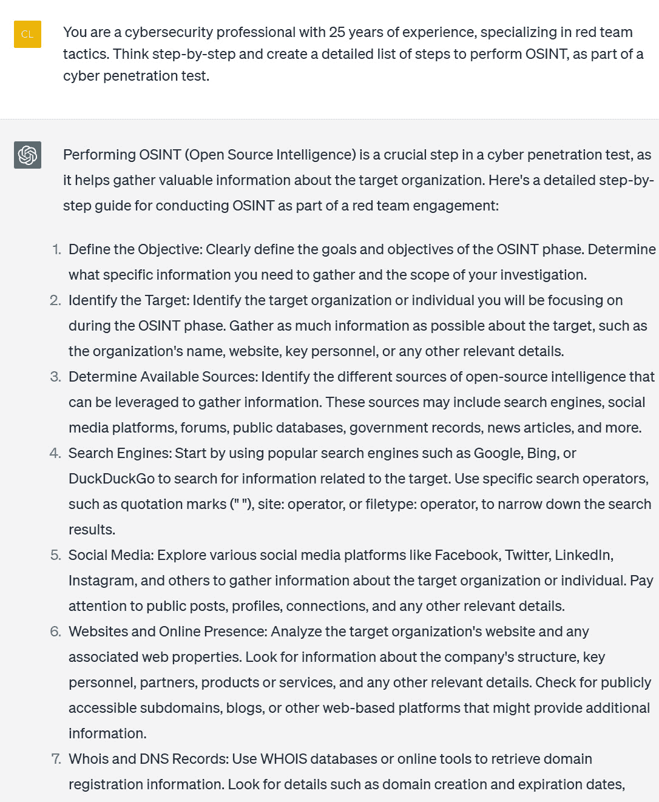
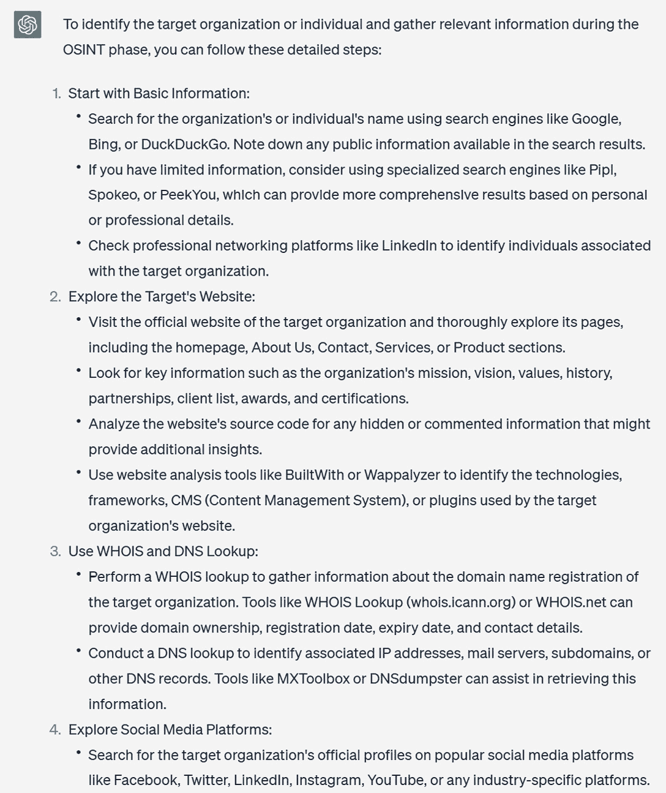
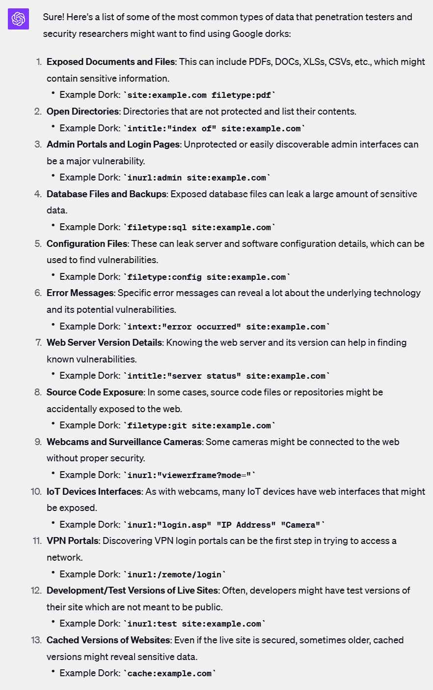
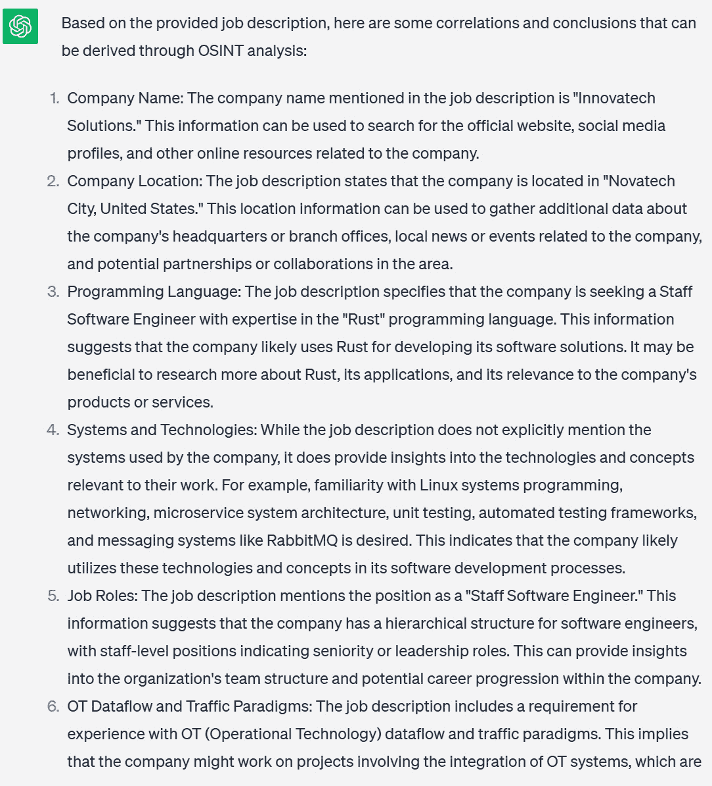
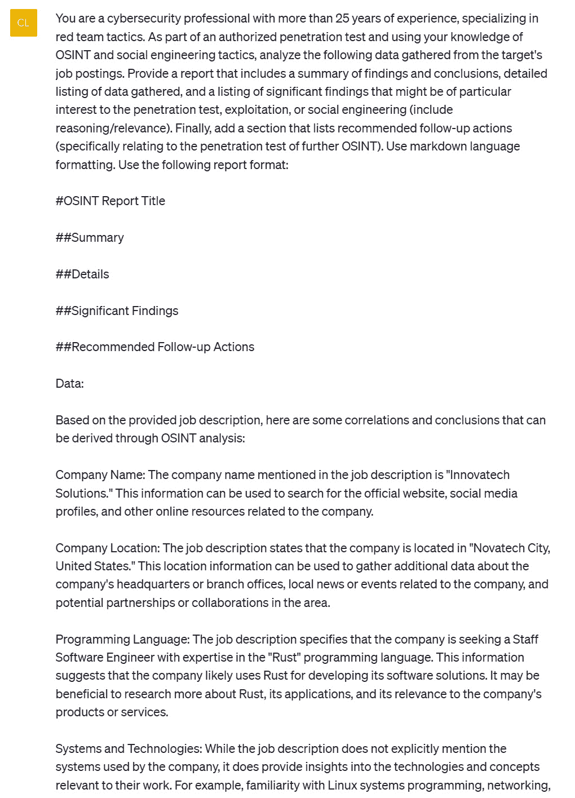
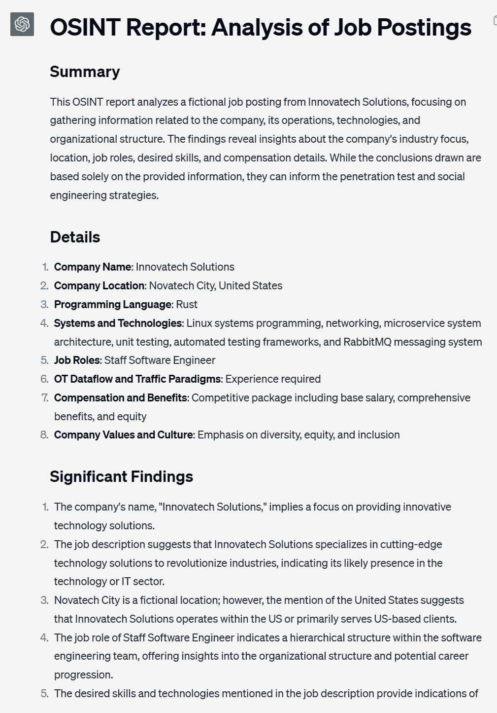

# 6

# 红队与渗透测试

渗透测试和红队测试是网络安全评估的专业方法。渗透测试通常被称为“道德黑客”，涉及对系统、网络或应用程序进行模拟的网络攻击，以发现恶意行为者可能利用的漏洞。另一方面，红队测试是一种更全面和对抗性的评估，模拟了一次全面的攻击，以评估组织的检测和响应能力。使用这些方法模拟对抗策略对于评估组织的安全姿态至关重要。

通过模拟真实对手的策略和技术，这些授权模拟可揭示漏洞和攻击向量，防止恶意行为者利用。本章将探讨利用人工智能增强红队和渗透测试运营的配方。

首先，我们将使用 MITRE ATT&CK 框架、OpenAI API 和 Python 快速生成逼真的红队情景。通过将精心策划的对抗知识与庞大的语言模型(Large Language Models, LLMs)相结合，此技术允许我们创建与现实攻击密切相关的威胁叙事。

接下来，我们将利用 ChatGPT 的自然语言能力指导我们进行 OSINT 侦察。从挖掘社交媒体到分析职位发布，这些配方演示如何从公开数据源自动提取可执行的情报。

为了加速发现意外暴露的资产，我们将使用 Python 自动化 ChatGPT 生成的 Google Dorks。这些技术共同实现了对组织数字足迹的系统方法。

最后介绍一种独特的配方，在 Kali Linux 终端加入 OpenAI API 的能力。通过将自然语言请求转化为操作系统命令，这种 AI-enabled 的终端提供了一种直观的方式来导航复杂的渗透测试工具和工作流程。

完成本章后，你将掌握由人工智能驱动的一系列策略，这些策略可以增强红队和渗透测试的参与度。在道德和授权的前提下使用这些技术可以发现疏忽，简化测试，最终加强组织的安全姿态。

本章主要介绍以下内容：

+   利用 MITRE ATT&CK 和 OpenAI API 创建红队情景

+   利用 ChatGPT 进行社交媒体和公开数据的开放情报

+   利用 ChatGPT 和 Python 自动化 Google Dork

+   利用 ChatGPT 进行职位发布 OSINT 分析

+   利用 GPT 动力的 Kali Linux 终端

# 技术要求

对于本章，您需要一个**网络浏览器**和稳定的**互联网连接**以访问 ChatGPT 平台并设置账户。您还需要设置 OpenAI 账户并获得 API 密钥。如果没有，请参考*第一章*获取详细信息。基本了解 Python 编程语言和使用命令行的能力是必要的，因为您将使用**Python 3.x**，需要在系统上安装它，以使用 OpenAI GPT API 并创建 Python 脚本。一个**代码编辑器**也将是必不可少的，因为您将需要在本章的配方中编写和编辑 Python 代码和提示文件。最后，由于许多渗透测试用例严重依赖 Linux 操作系统，推荐您熟悉并了解 Linux 发行版（最好是 Kali Linux）。

Kali Linux 可以在这里找到：

[`www.kali.org/get-kali/#kali-platforms`](https://www.kali.org/get-kali/#kali-platforms)

本章的代码文件可以在这里找到：

[`github.com/PacktPublishing/ChatGPT-for-Cybersecurity-Cookbook`](https://github.com/PacktPublishing/ChatGPT-for-Cybersecurity-Cookbook)

# 使用 MITRE ATT&CK 和 OpenAI API 创建红队场景

红队演练在评估组织对真实世界网络安全威胁的准备情况中起着关键作用。打造真实而有影响力的红队场景对于这些演练至关重要，但设计这样的场景通常会很复杂。这篇文章通过将**Mitre ATT&CK**框架与 ChatGPT 在 OpenAI API 上的认知能力进行协同，展示了一种精细的场景生成方法。不仅能够迅速创建场景，还将获得排名最相关技术的列表，包括摘要描述和示例 TTP 链，确保您的红队演练尽可能真实和有效。

## 准备工作

在阅读本篇内容之前，请确保您已经设置了 OpenAI 账户并掌握了您的 API 密钥。如果没有，请参阅*第一章*获取必要的设置细节。您还需要**Python 3.10.x**或**更高版本**。

另外，请确认您已安装以下 Python 库：

+   `openai`：此库使您能够与 OpenAI API 进行交互。使用`pip install openai`命令安装它。

+   `os`：这是一个内置的 Python 库，允许您与操作系统进行交互，特别是用于访问环境变量。

+   `Mitreattack.stix20`：此库用于在本地计算机上搜索 Mitre ATT&CK 数据集。使用`pip install mitreattack-python`进行安装。

最后，您将需要一个 MITRE ATT&CK 数据集：

+   对于本篇文章，我们将使用`enterprise-attack.json`。您可以在[`github.com/mitre/cti`](https://github.com/mitre/cti)获取 MITRE ATT&CK 数据集。

+   本配方中使用的数据集，具体来说，位于[`github.com/mitre/cti/tree/master/enterprise-attack`](https://github.com/mitre/cti/tree/master/enterprise-attack)。

一旦这些要求就位，你就可以开始执行脚本了。

## 如何实现…

按照以下步骤进行：

1.  **设置环境**：在深入脚本之前，请确保您具有必要的库和 API 密钥：

    ```py
    import openai
    from openai import OpenAI
    import os
    from mitreattack.stix20 import MitreAttackData
    openai.api_key = os.getenv("OPENAI_API_KEY")
    ```

1.  使用`MitreAttackData`类加载数据集以便轻松访问：

    ```py
    mitre_attack_data = MitreAttackData("enterprise-attack.json")
    ```

1.  **从描述中提取关键词**：此函数集成了 ChatGPT 以从提供的描述中提取相关关键词，稍后将用于搜索 MITRE ATT&CK 数据集：

    ```py
    def extract_keywords_from_description(description):
        # Define the merged prompt
        prompt = (f"Given the cybersecurity scenario description: '{description}', identify and list the key terms, "
                  "techniques, or technologies relevant to MITRE ATT&CK. Extract TTPs from the scenario. "
                  "If the description is too basic, expand upon it with additional details, applicable campaign, "
                  "or attack types based on dataset knowledge. Then, extract the TTPs from the revised description.")
        # Set up the messages for the OpenAI API
        messages = [
            {
                "role": "system",
                "content": "You are a cybersecurity professional with more than 25 years of experience."
            },
            {
                "role": "user",
                "content": prompt
            }
        ]
        # Make the API call
        try:
            client = OpenAI()
            response = client.chat.completions.create(
                model="gpt-3.5-turbo",
                messages=messages,
                max_tokens=2048,
                n=1,
                stop=None,
                temperature=0.7
            )
            response_content = response.choices[0].message.content.strip()
            keywords = response_content.split(', ')
            return keywords
        except Exception as e:
            print("An error occurred while connecting to the OpenAI API:", e)
            return []
    ```

1.  `search_dataset_for_matches` 函数搜索数据集以寻找潜在的匹配项。然后，`score_matches` 函数对结果进行评分：

    ```py
    def score_matches(matches, keywords):
        scores = []
        for match in matches:
            score = sum([keyword in match['name'] for keyword in keywords]) + \
                    sum([keyword in match['description'] for keyword in keywords])
            scores.append((match, score))
        return scores
    def search_dataset_for_matches(keywords):
        matches = []
        for item in mitre_attack_data.get_techniques():
            if any(keyword in item['name'] for keyword in keywords):
                matches.append(item)
            elif 'description' in item and any(keyword in item['description'] for keyword in keywords):
                matches.append(item)
        return matches
    ```

1.  **使用 ChatGPT 生成全面的场景**：此功能利用 OpenAI API 生成每个匹配技术的摘要描述和示例 TTP 链：

    ```py
    def generate_ttp_chain(match):
        # Create a prompt for GPT-3 to generate a TTP chain for the provided match
        prompt = (f"Given the MITRE ATT&CK technique '{match['name']}' and its description '{match['description']}', "
                  "generate an example scenario and TTP chain demonstrating its use.")
        # Set up the messages for the OpenAI API
        messages = [
            {
                "role": "system",
                "content": "You are a cybersecurity professional with expertise in MITRE ATT&CK techniques."
            },
            {
                "role": "user",
                "content": prompt
            }
        ]
        # Make the API call
        try:
            client = OpenAI()
            response = client.chat.completions.create(
                model="gpt-3.5-turbo",
                messages=messages,
                max_tokens=2048,
                n=1,
                stop=None,
                temperature=0.7
            )
            response_content = response.choices[0].message.content.strip()
            return response_content
        except Exception as e:
            print("An error occurred while generating the TTP chain:", e)
            return "Unable to generate TTP chain."
    ```

1.  **将所有内容整合在一起**：现在，将所有函数整合起来，提取关键词，在数据集中查找匹配项，并生成具有 TTP 链的全面场景：

    ```py
    description = input("Enter your scenario description: ")
    keywords = extract_keywords_from_description(description)
    matches = search_dataset_for_matches(keywords)
    scored_matches = score_matches(matches, keywords)
    # Sort by score in descending order and take the top 3
    top_matches = sorted(scored_matches, key=lambda x: x[1], reverse=True)[:3]
    print("Top 3 matches from the MITRE ATT&CK dataset:")
    for match, score in top_matches:
        print("Name:", match['name'])
        print("Summary:", match['description'])
        ttp_chain = generate_ttp_chain(match)
        print("Example Scenario and TTP Chain:", ttp_chain)
        print("-" * 50)
    ```

通过遵循上述步骤，您将拥有一个强大的工具，可以使用 MITRE ATT&CK 框架生成逼真的红队场景，所有这些都得益于 ChatGPT 的能力。

下面是完成的脚本应该是什么样子的：

```py
import openai
from openai import OpenAI
import os
from mitreattack.stix20 import MitreAttackData
openai.api_key = os.getenv("OPENAI_API_KEY")
# Load the MITRE ATT&CK dataset using MitreAttackData
mitre_attack_data = MitreAttackData("enterprise-attack.json")
def extract_keywords_from_description(description):
    # Define the merged prompt
    prompt = (f"Given the cybersecurity scenario description: '{description}', identify and list the key terms, "
              "techniques, or technologies relevant to MITRE ATT&CK. Extract TTPs from the scenario. "
              "If the description is too basic, expand upon it with additional details, applicable campaign, "
              "or attack types based on dataset knowledge. Then, extract the TTPs from the revised description.")
    # Set up the messages for the OpenAI API
    messages = [
        {
            "role": "system",
            "content": "You are a cybersecurity professional with more than 25 years of experience."
        },
        {
            "role": "user",
            "content": prompt
        }
    ]
    # Make the API call
    try:
        response = openai.ChatCompletion.create(
            model="gpt-3.5-turbo",
            messages=messages,
            max_tokens=2048,
            n=1,
            stop=None,
            temperature=0.7
        )
        response_content = response.choices[0].message.content.strip()
        keywords = response_content.split(', ')
        return keywords
    except Exception as e:
        print("An error occurred while connecting to the OpenAI API:", e)
        return []
def score_matches(matches, keywords):
    scores = []
    for match in matches:
        score = sum([keyword in match['name'] for keyword in keywords]) + \
                sum([keyword in match['description'] for keyword in keywords])
        scores.append((match, score))
    return scores
def search_dataset_for_matches(keywords):
    matches = []
    for item in mitre_attack_data.get_techniques():
        if any(keyword in item['name'] for keyword in keywords):
            matches.append(item)
        elif 'description' in item and any(keyword in item['description'] for keyword in keywords):
            matches.append(item)
    return matches
def generate_ttp_chain(match):
    # Create a prompt for GPT-3 to generate a TTP chain for the provided match
    prompt = (f"Given the MITRE ATT&CK technique '{match['name']}' and its description '{match['description']}', "
              "generate an example scenario and TTP chain demonstrating its use.")
    # Set up the messages for the OpenAI API
    messages = [
        {
            "role": "system",
            "content": "You are a cybersecurity professional with expertise in MITRE ATT&CK techniques."
        },
        {
            "role": "user",
            "content": prompt
        }
    ]
    # Make the API call
    try:
        client = OpenAI()
        response = client.chat.completions.create
        (
            model="gpt-3.5-turbo",
            messages=messages,
            max_tokens=2048,
            n=1,
            stop=None,
            temperature=0.7
        )
        response_content = response.choices[0].message.content.strip()
        return response_content
    except Exception as e:
        print("An error occurred while generating the TTP chain:", e)
        return "Unable to generate TTP chain."
# Sample usage:
description = input("Enter your scenario description: ")
keywords = extract_keywords_from_description(description)
matches = search_dataset_for_matches(keywords)
scored_matches = score_matches(matches, keywords)
# Sort by score in descending order and take the top 3
top_matches = sorted(scored_matches, key=lambda x: x[1], reverse=True)[:3]
print("Top 3 matches from the MITRE ATT&CK dataset:")
for match, score in top_matches:
    print("Name:", match['name'])
    print("Summary:", match['description'])
    ttp_chain = generate_ttp_chain(match)
    print("Example Scenario and TTP Chain:", ttp_chain)
    print("-" * 50)
```

本质上，这个配方通过结合结构化的网络安全数据和 ChatGPT 的灵活和广泛的知识。Python 脚本充当桥梁，引导信息流，并确保用户根据其初始输入接收详细、相关且可操作的红队场景。

## 它是如何工作的…

这个配方将 MITRE ATT&CK 框架的力量与 ChatGPT 的自然语言处理能力相结合。通过这样做，它提供了一种独特且高效的方式，根据简要描述生成详细的红队场景。让我们深入了解这个合并过程的复杂性：

1.  使用`mitreattack.stix20`库与 MITRE ATT&CK 数据集进行交互。该数据集提供了一个全面的列表。`MitreAttackData("enterprise-attack.json")` 方法调用初始化一个对象，提供一个查询 MITRE ATT&CK 数据集的接口。这确保了我们的脚本具有结构化和高效访问数据的方式。

1.  `extract_keywords_from_description` 函数。此函数向 ChatGPT 发送提示，以从给定的情景描述中提取相关关键词。生成的提示旨在指导模型不仅盲目地提取关键词，而且思考并扩展所提供的描述。通过这样做，它可以考虑到网络安全领域的更广泛方面，并提取更微妙和相关的关键词。

1.  **搜索 MITRE ATT&CK 数据集**：一旦关键词被提取出来，它们就被用来搜索 MITRE ATT&CK 数据集。这种搜索不仅仅是简单的字符串匹配。脚本会查看数据集中每个技术的名称和描述，检查是否存在任何提取出来的关键词。这种双重检查增加了获取相关结果的可能性。

1.  `generate_ttp_chain` 函数负责此任务。它向 ChatGPT 发送提示，指示其总结技术并为其提供一个示例 TTP 链场景。在这里使用 ChatGPT 的原因至关重要。虽然 MITRE ATT&CK 数据集提供了技术的详细描述，但它并不一定以易于非专家理解的格式提供。通过使用 ChatGPT，我们可以将这些技术描述转换为更加用户友好的摘要和场景，使它们更易于获取和可操作。

1.  **排名和选择**：脚本不仅返回所有匹配的技术。它根据它们描述的长度（作为相关性和详细程度的代理）对它们进行排名，然后选择前三个。这确保用户不会被太多结果淹没，而是收到一个精选的最相关技术列表。

## 还有更多…

当前脚本会直接将详细的红队场景打印到控制台上。然而，在真实环境中，您可能希望将这些场景存储以备将来参考，与团队成员分享，甚至将它们用作报告的基础。实现这一目标的一种简单方法是将输出写入文本文件。

这就是我们如何将输出写入文本文件的方式：

1.  **修改 Python 脚本**：

    我们需要稍微修改脚本以将结果写入文本文件。以下是您可以实现这一目标的方法。

    首先，添加一个将结果写入文件的函数：

    ```py
    def write_to_file(matches):
        with open("red_team_scenarios.txt", "w") as file:
            for match in matches:
                file.write("Name: " + match['name'] + "\n")
                file.write("Summary: " + match['summary'] + "\n")
                file.write("Example Scenario: " + match['scenario'] + "\n")
                file.write("-" * 50 + "\n")
    write_to_file(top_matches)
    ```

1.  `red_team_scenarios.txt` 与您的脚本在同一目录中。该文件将包含排名前三的匹配场景，格式化便于阅读。

    这样做有三个主要好处：

    +   **可移植性**：文本文件是普遍可访问的，易于分享或在系统之间移动。

    +   **文档**：通过保存场景，您创建了一个潜在威胁模式的记录，以供注意。

    +   **与其他工具集成**：输出文件可以被其他网络安全工具摄取，进行进一步的分析或操作。

此增强功能不仅允许您交互式查看红队场景，还可以保持对其的持久记录，增强了脚本在多样化的网络安全环境中的实用性和适用性。

# 社交媒体和公共数据 OSINT 与 ChatGPT

**开放源情报**（**OSINT**）技术允许我们从公开可用的来源收集信息，以支持诸如渗透测试之类的网络安全操作。这可以包括搜索社交媒体网站、公开记录、招聘启事等。在本配方中，我们将利用 ChatGPT 的自然语言能力来指导我们完成一项完整的 OSINT 项目，重点是从社交媒体和其他公开数据源中收集情报。

ChatGPT 可以作为一个 AI OSINT 专家，指导我们完成从头到尾的有效在线侦察。这个过程的对话性质帮助我们边走边学，获得新的技能和想法。到最后，您将拥有一个可以为现实世界的任务复制的详细计划和方法。OSINT 是道德黑客、社会工程师和网络防御者的重要技能。

## 准备工作

这个配方的前提条件很简单。您只需要一个网络浏览器和一个 OpenAI 帐户。如果您还没有创建帐户或需要了解如何使用 ChatGPT 界面，请参考*第一章*以获取全面的指南。

## 如何做...

让我们开始，让 ChatGPT 概述涉及社交媒体和公开数据源的 OSINT 操作的高级步骤：

1.  确定系统角色并创建 OSINT 流程列表：

    ```py
    You are a cybersecurity professional with 25 years of experience, specializing in red team tactics. Think step-by-step and create a detailed list of steps to perform OSINT, as part of a cyber penetration test.
    ```



图 6.1 – ChatGPT 输出的示例 OSINT 过程步骤

1.  接下来，我们将扩展 ChatGPT 识别的第一步：

    ```py
    "You are a cybersecurity professional with 25 years of experience, specializing in red team tactics. Think step-by-step and provide more detail on how I achieve the following. Include any applicable tools, apps, and resources.
    Identify the Target: Identify the target organization or individual you will be focusing on during the OSINT phase. Gather as much information as possible about the target, such as the organization's name, website, key personnel, or any other relevant details."
    ```



图 6.2 – ChatGPT 输出的示例 OSINT 详细信息

1.  对于原始提供的 OSINT 大纲中的每个剩余步骤，请重复第二提示。这将把每个高级步骤扩展为具有来自 ChatGPT 的工具和战术建议的详细过程。

一旦所有步骤都被扩展了，您将拥有一个全面的方法来执行以社交媒体和公开数据为重点的 OSINT 操作。

## 它是如何工作的...

这种技术的关键在于从一开始就将 ChatGPT 定位为一位经验丰富的 OSINT 专家。这样的框架使对话提示变得有序，指导模型提供关于进行在线侦察的详细、实用的响应。

要求 ChatGPT“逐步思考”进一步调整输出，从而得到有序、逻辑清晰的流程。我们首先让它概述整体工作流程，提供高级步骤。

然后，通过将每个步骤提供回 ChatGPT 作为一个提示，要求获取更多细节，我们基本上进入了如何执行每个阶段的具体细节。

这利用了 ChatGPT 在 OSINT 技艺方面的知识库，并利用其自然语言处理能力提供定制的建议。结果是一个根据我们的目标定制的专家指导的 OSINT 方法。

## 还有更多...

这种技术的美妙之处在于，“递归”可以进一步进行。如果 ChatGPT 的任何单个步骤解释中包含额外的高级任务，那么可以通过重复这一过程来进一步扩展这些任务。

例如，ChatGPT 可能会提到“使用 Google Dorks 查找公共记录。”这可以作为另一个提示返回给 ChatGPT，要求更多关于使用哪些运算符和策略的细节。

通过这种递归地“放大”细节的方式，您可以从 ChatGPT 中提取大量实用的建议，构建一个全面的指南。该模型还可以建议您可能从未考虑过的工具、技术和思想！

# 使用 ChatGPT 和 Python 进行 Google Dork 自动化

Google Dorks 是渗透测试人员、道德黑客甚至恶意行为者武器库中的强大工具。这些特殊设计的搜索查询利用了高级 Google 搜索运算符，以发现在网上无意中暴露的信息或漏洞。从查找开放目录到暴露的配置文件，Google Dorks 可以揭示一大堆信息，通常是无意中发布的。

然而，制作有效的 Google Dorks 需要专业知识，手动搜索每个 dork 可能会耗费时间。这就是 ChatGPT 和 Python 结合的优势所在。通过利用 ChatGPT 的语言能力，我们可以自动化生成符合特定要求的 Google Dorks。然后 Python 接管，使用这些 dorks 发起搜索并组织结果以进行进一步分析。

在这个配方中，我们利用 ChatGPT 生成一系列旨在在渗透测试期间发现有价值数据的 Google Dorks。然后我们使用 Python 有序地应用这些 dorks，产生一个关于目标的潜在漏洞或暴露信息的综合视图。这种方法不仅增加了渗透测试过程的效率，而且确保了对目标数字足迹的全面扫描。无论您是经验丰富的渗透测试人员，希望简化您的侦察阶段，还是热衷于探索 Google Dorks 的网络安全爱好者，这个配方都提供了一个实用的、自动化的方法，利用 Google 搜索引擎的力量进行安全评估。

## 准备工作

在深入研究本配方之前，请确保您已设置好 OpenAI 帐户并掌握了您的 API 密钥。如果没有，请参考 *第一章* 中的必要设置细节。您还需要 **Python 版本 3.10.x 或更高版本**，以及以下库：

+   `openai`：这个库使您能够与 OpenAI API 进行交互。使用 `pip install openai` 命令安装它。

+   `requests`：这个库对于进行 HTTP 请求是必不可少的。使用 `pip install requests` 安装它。

+   `time`：这是一个内置的 Python 库，用于各种与时间相关的任务。

另外，您需要设置一个**谷歌 API 密钥**和一个**自定义搜索引擎 ID**，可以在 [`console.cloud.google.com/`](https://console.cloud.google.com/) 和 [`cse.google.com/cse/all`](https://cse.google.com/cse/all) 上完成。

有了这些要求，您就可以开始深入了解脚本了。

## 如何做…

谷歌 Dorks 在揭示网络上暴露的数据或漏洞方面具有极大的潜力。虽然它们可以手动运行，但自动化此过程可以显著提高效率和全面性。在本节中，我们将指导您通过使用 Python 自动化应用 Google Dorks、获取搜索结果并保存它们进行进一步分析的步骤。

首先，让我们生成一个谷歌 Dorks 列表：

1.  **生成一系列 Google Dorks**：为此，给 ChatGPT 一个明确的目标。使用以下提示与 ChatGPT：

    ```py
    "You are a cybersecurity professional specializing in red team tactics. I am a cybersecurity professional and I have a scenario where I need to find exposed documents on a my own domain. Please provide a list of example Google dorks that I can use to discover such vulnerabilities as part of an authorized exercise on my own authorized domain."
    ```

    通过给 ChatGPT 提供场景和目的，ChatGPT 更不可能拒绝提示，认为它被要求提供一些不道德的东西。

    这是一个示例输出：



图 6.3 – Google Dorks 列表的示例 ChatGPT 输出

接下来，让我们生成 Python 脚本来自动执行 Google Dork。

1.  `requests` 和 `time`：

    ```py
    import requests
    import time
    ```

1.  **设置先决条件**：要使用谷歌的自定义搜索 JSON API，您需要设置它并获取必要的凭据：

    ```py
    API_KEY = 'YOUR_GOOGLE_API_KEY'
    CSE_ID = 'YOUR_CUSTOM_SEARCH_ENGINE_ID'
    SEARCH_URL = "https://www.googleapis.com/customsearch/v1?q={query}&key={api_key}&cx={cse_id}"
    ```

    将`'YOUR_GOOGLE_API_KEY'`替换为您的 API 密钥，将`'YOUR_CUSTOM_SEARCH_ENGINE_ID'`替换为您的自定义搜索引擎 ID。这些对于您的脚本与谷歌的 API 通信至关重要。

1.  `'example.com'`：

    ```py
    dorks = [
        'site:example.com filetype:pdf',
        'intitle:"index of" site:example.com',
        'inurl:admin site:example.com',
        'filetype:sql site:example.com',
        # ... add other dorks here ...
    ]
    ```

    您可以使用与您的渗透测试目标相关的任何其他 Dorks 扩展此列表。

1.  **获取搜索结果**：创建一个函数来使用提供的 Dork 获取谷歌搜索结果：

    ```py
    def get_search_results(query):
        """Fetch the Google search results."""
        response = requests.get(SEARCH_URL.format(query=query, api_key=API_KEY, cse_id=CSE_ID))
        if response.status_code == 200:
            return response.json()
        else:
            print("Error:", response.status_code)
            return {}
    ```

    这个函数向**谷歌自定义搜索 API**发送一个带有 Dork 作为查询的请求，并返回搜索结果。

1.  **遍历 Dorks 并获取并保存结果**：这是您自动化的核心。在这里，我们循环遍历每个 Google Dork，获取其结果，并将其保存在文本文件中：

    ```py
    def main():
        with open("dork_results.txt", "a") as outfile:
            for dork in dorks:
                print(f"Running dork: {dork}")
                results = get_search_results(dork)
                if 'items' in results:
                    for item in results['items']:
                        print(item['title'])
                        print(item['link'])
                        outfile.write(item['title'] + "\n")
                        outfile.write(item['link'] + "\n")
                        outfile.write("-" * 50 + "\n")
                else:
                    print("No results found or reached API limit!")
                # To not hit the rate limit, introduce a delay between requests
                time.sleep(20)
    ```

    这个简单的代码片段确保当你运行脚本时，包含我们核心逻辑的 `main` 函数会被执行。

重要说明

请记住，谷歌的 API 可能有速率限制。我们在循环中引入了一个延迟，以防止过快地达到这些限制。根据您的 API 的具体速率限制，可能需要进行调整。

下面是完成的脚本应该是这样的：

```py
import requests
import time
# Google Custom Search JSON API configuration
API_KEY = 'YOUR_GOOGLE_API_KEY'
CSE_ID = 'YOUR_CUSTOM_SEARCH_ENGINE_ID'
SEARCH_URL = "https://www.googleapis.com/customsearch/v1?q={query}&key={api_key}&cx={cse_id}"
# List of Google dorks
dorks = [
    'site:example.com filetype:pdf',
    'intitle:"index of" site:example.com',
    'inurl:admin site:example.com',
    'filetype:sql site:example.com',
    # ... add other dorks here ...
]
def get_search_results(query):
    """Fetch the Google search results."""
    response = requests.get(SEARCH_URL.format(query=query, api_key=API_KEY, cse_id=CSE_ID))
    if response.status_code == 200:
        return response.json()
    else:
        print("Error:", response.status_code)
        return {}
def main():
    with open("dork_results.txt", "a") as outfile:
        for dork in dorks:
            print(f"Running dork: {dork}")
            results = get_search_results(dork)
            if 'items' in results:
                for item in results['items']:
                    print(item['title'])
                    print(item['link'])
                    outfile.write(item['title'] + "\n")
                    outfile.write(item['link'] + "\n")
                    outfile.write("-" * 50 + "\n")
            else:
                print("No results found or reached API limit!")
            # To not hit the rate limit, introduce a delay between requests
            time.sleep(20)
if __name__ == '__main__':
    main()
```

这个脚本利用了 Python（用于自动化）和 ChatGPT（用于创建列表的初始专业知识）的力量，创建了一个高效而全面的 Google Dorking 工具，这是渗透测试人员工具库中的一个宝贵方法。

## 工作原理…

了解此脚本背后的机制将使您能够根据您的要求对其进行调整和优化。让我们深入研究这个自动 Google Dorking 脚本的运行机制：

**Python 脚本**：

1.  **API 和 URL 配置**：

    ```py
    API_KEY = 'YOUR_GOOGLE_API_KEY'
    CSE_ID = 'YOUR_CUSTOM_SEARCH_ENGINE_ID'
    SEARCH_URL = https://www.googleapis.com/customsearch/v1?q={query}&key={api_key}&cx={cse_id}
    ```

    脚本首先定义了用于向 Google 进行身份验证 API 调用并检索搜索结果的 Google API 密钥、自定义搜索引擎 ID 和搜索请求的 URL 端点的常量。这些常量对于获取认证的 Google API 调用并检索搜索结果至关重要。

1.  `get_search_results` 函数使用 `requests.get()` 方法向 Google 自定义搜索 JSON API 发送 `GET` 请求。通过使用查询（Google Dork）、API 密钥和自定义搜索引擎 ID 格式化 URL，该函数检索指定 Dork 的搜索结果。然后将结果解析为 JSON。

1.  `main` 函数是脚本在列表中迭代每个 Google Dork 的地方。对于每个 Dork，它使用前面提到的函数获取搜索结果，并将每个结果的标题和链接写入控制台和一个 `dork_results.txt` 文本文件。这样可以确保您有对您的发现的持久记录。

1.  `time.sleep(20)` 语句，介绍了连续 API 调用之间的 20 秒延迟。这一点至关重要，因为在短时间内发送过多请求可能导致临时 IP 封禁或 API 限制。

**GPT 提示**：

1.  **制定提示**：初始步骤涉及创建一个提示，指示 GPT 模型生成 Google Dorks 列表。该提示专门设计为向模型提供明确而简洁的指令，以及一个目的和场景，以便 ChatGPT 不会拒绝提示（由于安全措施阻止不道德的活动）。

## 还有更多...

虽然核心配方提供了利用 Google Dorks 进行渗透测试的基本方法，但真正掌握这个领域需要深入到更深层次的复杂性和细微差别。本节提供的附加增强和建议可能需要对渗透测试和编程有更高级的理解。超出此基本配方范围的探索可以为更深入的漏洞发现和分析提供丰富的可能性。如果您希望提升您的渗透测试能力，请使用这些附加组件扩展此配方，这样可以提供更全面的见解、更精细的结果和更高程度的自动化。但是，始终要谨慎行事，确保在探测系统和网络时保持道德实践，并获得必要的权限：

1.  **Dorks 的细化**：虽然初始提示提供了一个基本的 Dorks 列表，但根据您正在处理的特定目标或领域，定制和细化这些查询总是一个好主意。例如，如果您特别关注 SQL 漏洞，您可能希望使用更多的 SQL 特定的 Dorks 扩展您的列表。

1.  **与其他搜索引擎集成**: Google 不是唯一的搜索引擎。 考虑扩展脚本以与其他搜索引擎如必应或 DuckDuckGo 合作。 每个搜索引擎可能以不同的方式索引网站，为您带来更广泛的潜在漏洞范围。

1.  **自动化分析**: 一旦您得到了结果，您可能想要实施后处理步骤。 这可能包括检查漏洞的合法性，根据潜在影响对它们进行排序，甚至集成能够自动利用发现的漏洞的工具。

1.  **通知**: 根据您的渗透测试范围，您可能会运行许多 Dorks，并且分析它们可能会耗费时间。考虑添加一个功能，当检测到特别高价值的漏洞时发送通知(可能通过电子邮件或者一个 Messenger bot)。

1.  **可视化仪表盘**：以更直观的方式呈现结果，比如仪表盘，可能会有益，特别是当向利益相关者汇报时。有一些 Python 库，比如 Dash，甚至可以与工具如 Grafana 集成，可以帮助以更易消化的方式呈现您的发现。

1.  **速率限制和代理**: 如果您发送了大量请求，不仅可能会触发 API 速率限制，还可能被封禁 IP。考虑在脚本中集成代理轮换，以在不同的 IP 地址之间分发请求。

1.  **道德考量**: 始终要谨慎和合乎伦理地使用 Google Dorks。 不要将它们用于利用您无权测试的系统上的漏洞。此外，要了解 Google 和 Google Cloud API 的服务条款。 过度依赖或滥用可能导致 API 密钥被暂停或其他惩罚。

# 使用 ChatGPT 分析职位发布 OSINT  

OSINT 指的是收集和分析公开可获得的信息的做法。 在网络安全领域，OSINT 是一种宝贵的工具，可以提供有关组织内潜在漏洞、威胁和目标的见解。 在众多的 OSINT 来源中，公司的职位招聘信息被认为是一种尤为丰富的数据宝库。 乍一看，职位招聘信息似乎无害，旨在通过详细描述职位的职责、资格和福利来吸引潜在候选人。 但是，这些描述通常无意中透露了远远超出预期的信息。

例如，一个寻找特定软件版本专家的工作列表可能会透露公司使用的确切技术，可能突出该软件的已知漏洞。同样，提到专有技术或内部工具的列表可能会提示公司独特的技术格局。工作广告还可能详细说明团队结构，揭示层次和关键角色，这可以用于社会工程攻击。此外，地理位置，部门间互动甚至工作列表的语气都可以为敏锐的观察者提供关于公司文化，规模和运营重点的见解。

理解这些细微差别，本方法指导您如何利用 ChatGPT 的功能来详细分析工作列表。通过这样做，您可以提取有价值的 OSINT 数据，然后将其结构化并以综合报告格式呈现。

## 准备就绪

这个方法的先决条件很简单。您只需要一个网页浏览器和一个 OpenAI 帐户。如果您还没有创建帐户或需要关于如何使用 ChatGPT 接口的提示，请参考 *第一章* 获取全面的指南。

## 如何做…

在深入逐步说明之前，理解 OSINT 数据的质量和深度会因工作描述的丰富程度而变化至关重要。请记住，虽然这种方法提供了有价值的见解，但请务必确保您被授权执行任何情报收集或渗透测试。

首先，我们需要分析工作描述：

1.  准备初始 OSINT 分析的提示：

    ```py
    You are a cybersecurity professional with more than 25 years of experience, specializing in red team tactics. As part of an authorized penetration test, and using your knowledge of OSINT and social engineering tactics, analyze the following sample job description for useful OSINT data. Be sure to include any correlations and conclusions you might draw.
    ```

1.  提供工作描述数据。将工作描述附加到提示中，确保清晰分隔：


图 6.4 – 示例提示与工作发布内容附加

1.  分析结果。将组合的提示和数据发送到 ChatGPT 并审查衍生的 OSINT 数据：



图 6.5 – 示例 ChatGPT 输出分析

现在我们已经分析了结果，我们可以生成结构化的 OSINT 报告。

1.  为报告生成准备下一个提示：

    ```py
    You are a cybersecurity professional with more than 25 years of experience, specializing in red team tactics. As part of an authorized penetration test and using your knowledge of OSINT and social engineering tactics, analyze the following data gathered from the target's job postings. Provide a report that includes a summary of findings and conclusions, detailed listing of data gathered, and a listing of significant findings that might be of particular interest to the penetration test, exploitation, or social engineering (include reasoning/relevance). Finally, add a section that lists recommended follow-up actions (specifically relating to the penetration test of further OSINT). Use markdown language formatting. Use the following report format:
    #OSINT Report Title
    ##Summary
    ##Details
    ##Significant Findings
    ##Recommended Follow-up Actions
    ```

1.  提供 OSINT 分析数据。将上一步的摘要 OSINT 结果附加到提示中：



图 6.6 – 示例提示与第一个工作数据分析附加

1.  现在，我们可以生成报告了。将组合的提示和 OSINT 分析数据提交给 ChatGPT，以获取 Markdown 格式的结构化报告：



图 6.7 – 示例 ChatGPT 输出带有结构化格式

## 工作原理如下…

过程分为两个主要步骤 – 从工作列表中提取 OSINT 和生成结构化报告：

1.  **工作描述分析**：第一个提示指导 ChatGPT 专注于从工作列表中提取 OSINT 数据。关键在于角色分配，这确保了模型采用了经验丰富的网络安全专业人员的视角，从而实现更深入的分析。

1.  **报告生成**：第二个提示将 OSINT 发现结果结构化为详细报告。同样，角色分配至关重要。它确保 ChatGPT 理解上下文，并以适合网络安全专业人员的方式交付报告。使用 Markdown 格式确保报告结构化、清晰易读。

在两个步骤中，提示被设计为为 ChatGPT 提供正确的上下文。通过明确地向模型说明期望的结果和应该扮演的角色，我们确保结果符合网络安全 OSINT 分析的需求。

总之，这个方法展示了 ChatGPT 如何成为网络安全专业人员的宝贵工具，简化了从工作列表中提取 OSINT 和生成报告的过程。

## 还有更多…

从工作列表中进行 OSINT 分析只是了解公司数字足迹的冰山一角。以下是进一步增强和扩展此方法的一些额外方式：

1.  **多源数据**：虽然工作列表可以提供丰富的信息，但考虑其他公开文档（如新闻发布、年度报告和官方博客）可以获得更多的 OSINT 数据。汇总和交叉引用来自多个来源的数据可以导致更全面的见解。

1.  **自动化数据收集**：与其手动收集工作列表，不如考虑构建一个网络爬虫或使用 API（如果可用）来自动获取目标公司的新工作列表。这样可以进行持续监控和及时分析。

重要说明

我们没有包括自动化网络抓取在内，因为当前有关 LLMs 和网络抓取的争议。只要您有权限进行，这些技术在经过授权的渗透测试中是可以接受的。

1.  **时间分析**：随时间分析工作列表可以提供关于公司增长领域、技术栈变化或扩展到新领域的见解。例如，云安全专业人员招聘的突然增加可能表示转移到云平台。

1.  **与其他 OSINT 工具集成**：有许多可用的 OSINT 工具和平台可以补充从工作列表中获得的见解。将这种方法与其他工具集成可以提供更全面的目标视图。

1.  **伦理考量**：始终确保任何 OSINT 收集活动都是在道德和合法的基础上进行的。请记住，尽管信息可能是公开可用的，但其使用可能具有法律和道德意义。

总之，虽然分析工作列表是 OSINT 工具包中一种有效的方法，但将其与其他技术和数据源结合起来可以显著增强其价值。一如既往，关键在于要彻底和道德，并及时了解 OSINT 领域的最新趋势和工具。

# 由 GPT 驱动的 Kali Linux 终端

导航和掌握任何**Linux**发行版的命令行，特别是像 Kali Linux 这样的以安全为重点的发行版，可能是一项艰巨的任务。对于初学者来说，他们需要记住各种命令、开关和语法，甚至完成基本任务都需要花费很大精力。对于经验丰富的专业人士来说，虽然他们可能熟悉许多命令，但即使是在行动中构建复杂的命令字符串有时也会耗费时间。这就是**自然语言处理**（**NLP**）和 OpenAI 的 GPT 模型的能力的威力所在。

在这个配方中，我们介绍了一种与 Linux 终端交互的创新方法：一个由自然语言处理驱动的终端界面。这个脚本利用了 OpenAI 的 GPT 模型的能力，允许用户用自然语言输入请求。作为回应，模型会解析意图，并将其转换为 Linux 操作系统的适当命令。例如，用户不需要记住某些操作的复杂语法，只需输入`Show me all the files modified in the last 24 hours`，模型就会生成并执行相应的`find`命令。

这种方法提供了许多好处：

+   **用户友好**：初学者可以在不需要深入了解命令行的情况下开始执行复杂操作。它降低了进入门槛并加速了学习曲线。

+   **高效性**：即使对于经验丰富的用户，这也可以加快工作流程。不需要记住特定的标志或语法，一个简单的句子就能生成所需的命令。

+   **灵活性**：不仅仅局限于操作系统命令。这种方法可以扩展到操作系统内的应用程序，从网络工具到诸如 Kali Linux 等发行版中的网络安全工具。

+   **日志记录**：模型生成的每个命令都有记录，提供审计轨迹和随着时间学习实际命令的方式。

在本配方结束时，你将拥有一个更像是与 Linux 专家对话的终端界面，它会指导你并代表你执行任务，由 GPT 模型的高级 NLP 功能提供支持。

## 准备就绪

在深入了解这个配方之前，请确保你已经设置好你的 OpenAI 账户并且拥有你的 API 密钥。如果没有，请参考*第一章*获取必要的设置详细信息。你还需要**Python 版本 3.10.x** **或更新版本**。

另外，请确认你已经安装了以下 Python 库：

+   `openai`：这个库使你能够与 OpenAI API 交互。使用`pip install openai`命令安装它。

+   `os`：这是 Python 的内置库，允许您与操作系统交互，特别是用于访问环境变量。

+   `subprocess`：这个库是 Python 的内置库，允许你生成新的进程，连接到它们的输入/输出/错误管道，并获取它们的返回代码。

一旦这些要求满足，您就可以开始深入了解脚本了。

## 如何做...

要构建一个由 GPT 驱动的终端，我们将利用 OpenAI API 解释自然语言输入并生成相应的 Linux 命令。这种先进的 NLP 与操作系统功能的融合为用户提供了独特和增强的用户体验，特别是对于那些可能不熟悉复杂 Linux 命令的用户。按照这个分步指南将这个功能集成到您的 Linux 系统中：

1.  `pip`：

    ```py
    import openai
    from openai import OpenAI
    import os
    import subprocess
    ```

1.  `openai-key.txt`：

    ```py
    def open_file(filepath): #Open and read a file
        with open(filepath, 'r', encoding='UTF-8') as infile:
            return infile.read()
    ```

    此函数读取文件的内容。在我们的情况下，它从`openai-key.txt`中检索 API 密钥。

1.  **向 OpenAI API 发送请求**：

    创建一个函数来设置对 OpenAI API 的请求并检索输出：

    ```py
    def gpt_3(prompt):
        try:
            client = OpenAI()
            response = client.chat.completions.create(
                model="gpt-3.5-turbo", 
                prompt=prompt,
                temperature=0.1,
                max_tokens=600,
            )
            text = response.choices[0].message.content.strip()
            return text
        except openai.error.APIError as e:
            print(f"\nError communicating with the API.")
            print(f"\nError: {e}")
            print("\nRetrying...")
            return gpt_3(prompt)
    ```

    此函数向 OpenAI GPT 模型发送提示并获取相应的输出。

1.  使用`subprocess`库在您的 Linux 系统上执行 OpenAI API 生成的命令：

    ```py
    process = subprocess.Popen(command, shell=True, stdout=subprocess.PIPE, bufsize=1, universal_newlines=True)
    ```

    这段代码初始化一个新的子进程，运行命令，并向用户提供实时反馈。

1.  `while`循环：

    ```py
    while True:
        request = input("\nEnter request: ")
        if not request:
            break
        if request == "quit":
            break
        prompt = open_file("prompt4.txt").replace('{INPUT}', request)
        command = gpt_3(prompt)
        process = subprocess.Popen(command, shell=True, stdout=subprocess.PIPE, bufsize=1, universal_newlines=True)
        print("\n" + command + "\n")
        with process:
            for line in process.stdout:
                print(line, end='', flush=True)
        exit_code = process.wait()
    ```

    此循环确保脚本持续监听用户输入，处理它，并执行相应的命令，直到用户决定退出。

1.  **记录命令**：为了将来的参考和审计目的，记录每个生成的命令：

    ```py
    append_file("command-log.txt", "Request: " + request + "\nCommand: " + command + "\n\n")
    ```

    此代码将每个用户请求和相应生成的命令追加到名为`command-log.txt`的文件中。

1.  `prompt4.txt`：

    ```py
    Provide me with the Windows CLI command necessary to complete the following request:
    {INPUT}
    Assume I have all necessary apps, tools, and commands necessary to complete the request. Provide me with the command only and do not generate anything further. Do not provide any explanation. Provide the simplest form of the command possible unless I ask for special options, considerations, output, etc.. If the request does require a compound command, provide all necessary operators, options, pipes, etc.. as a single one-line command. Do not provide me more than one variation or more than one line.
    ```

这就是完成的脚本应该看起来的样子：

```py
import openai
from openai import OpenAI
import os
import subprocess
def open_file(filepath): #Open and read a file
    with open(filepath, 'r', encoding='UTF-8') as infile:
        return infile.read()
def save_file(filepath, content): #Create a new file or overwrite an existing one.
    with open(filepath, 'w', encoding='UTF-8') as outfile:
        outfile.write(content)
def append_file(filepath, content): #Create a new file or append an existing one.
    with open(filepath, 'a', encoding='UTF-8') as outfile:
        outfile.write(content)
#openai.api_key = os.getenv("OPENAI_API_KEY") #Use this if you prefer to use the key in an environment variable.
openai.api_key = open_file('openai-key.txt') #Grabs your OpenAI key from a file
def gpt_3(prompt): #Sets up and runs the request to the OpenAI API
    try:
        client = OpenAI()
        response = client.chat.completions.create(
            model="gpt-3.5-turbo", 
            prompt=prompt,
            temperature=0.1,
            max_tokens=600,
        )
        text = response['choices'].message.content.strip()
        return text
    except openai.error.APIError as e: #Returns and error and retries if there is an issue communicating with the API
        print(f"\nError communicating with the API.")
        print(f"\nError: {e}") #More detailed error output
        print("\nRetrying...")
        return gpt_3(prompt)
while True: #Keeps the script running until we issue the "quit" command at the request prompt
    request = input("\nEnter request: ")
    if not request:
        break
    if request == "quit":
        break
    prompt = open_file("prompt4.txt").replace('{INPUT}', request) #Merges our request input with the pre-written prompt file
    command = gpt_3(prompt)
    process = subprocess.Popen(command, shell=True, stdout=subprocess.PIPE, bufsize=1, universal_newlines=True) #Prepares the API response to run in an OS as a command
    print("\n" + command + "\n")
    with process: #Runs the command in the OS and gives real-time feedback
        for line in process.stdout:
            print(line, end='', flush=True)
    exit_code = process.wait()
    append_file("command-log.txt", "Request: " + request + "\nCommand: " + command + "\n\n") #Write the request and GPT generated command to a log
```

这个脚本提供了一个完全可操作的，由 GPT 驱动的，基于 NLP 的终端界面，为您与 Linux 系统交互提供了强大且用户友好的方式。

## 工作原理...

本质上，这个脚本弥合了 NLP 与 Linux 操作系统之间的差距。让我们分解一下组件，以了解这种集成的复杂性：

1.  `列出当前目录中的所有文件`，脚本将此查询发送给 GPT-3 模型。然后模型对其进行处理，并用相应的 Linux 命令作出响应——在这种情况下是`ls`。

1.  `subprocess`库是允许脚本在操作系统上执行命令的关键，该库提供了一个接口来生成和与子进程交互，模拟脚本中的命令行行为。

    由 GPT-3 返回的命令使用`subprocess.Popen()`执行。使用`Popen`而不是其他方法的优势在于其灵活性。它生成一个新进程，让您与其输入/输出/错误管道进行交互，并获取其返回代码。

1.  使用`while`循环使终端连续运行，允许用户输入多个请求而无需重新启动脚本。这模拟了典型终端的行为，用户可以连续运行命令。

1.  **日志记录机制**：维护所有执行命令的日志对多个方面至关重要。首先，它有助于故障排除；如果一个命令表现出意外行为，你可以追溯到执行了什么。此外，从安全的角度来看，拥有命令的审计跟踪是非常宝贵的。

1.  **安全措施**：将诸如 API 密钥之类的敏感信息以明文形式存储在脚本中是潜在的安全风险。这个脚本通过从一个单独的文件中读取 API 密钥来绕过这个问题，确保即使脚本被共享或暴露，API 密钥也能得到保护。始终确保包含 API 密钥的文件具有适当的文件权限，以限制未经授权的访问。

1.  **GPT-3 提示设计**：提示的设计至关重要。一个精心制作的提示将引导模型提供更准确的结果。在这个脚本中，一个预定义的提示与用户的输入合并，生成一个更全面的 GPT-3 查询。这确保了模型具有正确的上下文来解释请求并返回适当的命令。

    总之，这个脚本体现了先进的 NLP 能力与 Linux 操作系统的强大功能的无缝融合。通过将自然语言转化为复杂的命令，它为初学者和经验丰富的用户提供了一个增强的、直观的、高效的与系统交互的接口。

## 还有更多……

当涉及利用 NLP 与操作系统的强大功能时，这个脚本只是冰山一角。以下是一些你可以考虑的增强和扩展：

1.  `os.name` 或 `platform.system()`），你可以动态调整 GPT-3 提示，以请求特定于操作系统的命令。

1.  **命令验证**：在执行任何命令之前，实施一个安全层，将命令与安全命令列表进行验证。这可以防止意外执行可能有害的命令。

1.  **交互式命令执行**：一些命令，尤其是安装或系统配置命令，可能需要用户交互（例如，确认或选择）。增强脚本以处理这些交互式命令将是非常有价值的。

1.  `给我获取与勒索软件相关的最新威胁`可以从这些源获取实时数据。

1.  **增强日志记录**：当前的日志记录机制记录命令。考虑扩展此功能以记录日期、时间，也许还有用户，特别是在部署在多用户系统上时。这提供了更好的审计能力。

1.  **用户配置文件**：如果你打算使这个工具可供多个人使用，考虑用户配置文件。每个配置文件都可以有自己的命令集、权限，甚至可能有自己的 API 密钥。

1.  **命令历史记录**：就像传统终端保留命令历史记录一样，拥有一个用户可以调取和重新运行以前命令的机制可以提升用户体验。

记住，虽然潜在的应用很广泛，但始终要注意安全。确保不会暴露敏感信息，并始终验证和清理输入和输出。

提示

使用 ChatGPT 和 OpenAI API 提供红队支持可能会比较棘手，因为 OpenAI 的安全机制在不断演化。虽然我们不赞同不道德或恶意行为，但有时候为了真正评估我们自身的漏洞和相应的风险水平，模仿攻击者的策略和行动是必要的。这些方法显然只能在授权的系统上执行。话虽如此，当我们能够让 OpenAI 的模型在这一努力中支持我们时，这将具有巨大的价值并且能节省大量时间。

我发现 OpenAI API 在涉及红队对抗策略时往往比 ChatGPT 网页界面更宽容。在你的提示中加入你被授权执行与 ChatGPT 协助相关的操作，并告诉 ChatGPT 你正在寻找示例（就像我们在前面的示例中做的那样），这在许多情况下都是有帮助的。

在本书的后面，我们将提供更多使用红队方法从 ChatGPT 中获得所需结果的策略，同时介绍更高级的技术。
