# 9

# 使用本地模型和其他框架

在这一章中，我们探讨了本地人工智能模型和框架在网络安全领域的转型潜力。我们首先利用 **LMStudio** 部署和与本地人工智能模型进行交互，增强了数据敏感场景下的隐私保护和控制。接着介绍了 **Open Interpreter** 作为高级本地威胁搜索和系统分析工具，然后介绍了 **Shell GPT**，它通过自然语言处理能力显著增强了渗透测试。我们深入研究了 **PrivateGPT**，因为它擅长审查诸如**事件响应（IR）**计划等敏感文件，确保数据保持机密。最后，展示了 **Hugging Face AutoTrain**，因其在网络安全应用中特定的 LLM 调优能力，充分体现了先进人工智能技术在各种网络安全环境中的整合。本章不仅指导如何实际应用，还传授了如何有效利用这些工具来执行各种网络安全任务的知识。

重要说明

开源大语言模型（LLMs）为 OpenAI 等知名专有模型提供了另一种选择。这些开源模型由一群贡献者开发和维护，使其源代码和训练数据公开可访问。这种透明性使得这些模型可以更灵活、更易审查和更易理解，从而促进了创新和信任。

开源 LLMs 的重要性在于它们的可访问性和适应性。它们使得研究人员、开发者和组织，尤其是那些资源有限的组织，可以在不受专有模型授权和成本限制的情况下进行人工智能技术的实验和部署。此外，开源 LLMs 鼓励协作开发，确保了更广泛的观点和用途，这对于人工智能技术的进步及其在包括网络安全在内的各个领域的应用至关重要。

在本章中，我们将涵盖以下内容：

+   用 LMStudio 实现网络安全分析的本地人工智能模型

+   用 Open Interpreter 进行本地威胁搜索

+   用 Shell GPT 增强渗透测试

+   用 PrivateGPT 审查 IR 计划

+   用 Hugging Face 的 AutoTrain 进行网络安全的 LLM 调优

# 技术需求

对于本章，您将需要使用 Web 浏览器和稳定的互联网连接以访问 ChatGPT 平台并设置您的帐户。您还需要已经设置好 OpenAI 帐户并取得 API 密钥。如果没有，请查看*第一章*获取详细信息。熟悉 Python 编程语言以及使用命令行的基础知识是必要的，因为您将使用**Python 3.x**，这需要在您的系统上安装，用于与 OpenAI GPT API 进行交互并创建 Python 脚本。代码编辑器也对于编写和编辑 Python 代码和提示文件至关重要，因为您将在本章的教程中使用。最后，由于许多渗透测试用例严重依赖 Linux 操作系统，访问和熟悉 Linux 发行版（最好是 Kali Linux）对于使用工具如 Open Interpreter 和 Shell GPT 进行交互是有益的。对于与诸如 Open Interpreter 和 Shell GPT 等工具进行交互，具有基本的命令行工具和 shell 脚本的理解将对您有利。本章的代码文件可以在这里找到：[`github.com/PacktPublishing/ChatGPT-for-Cybersecurity-Cookbook`](https://github.com/PacktPublishing/ChatGPT-for-Cybersecurity-Cookbook)。

# 使用 LMStudio 实施本地 AI 模型进行网络安全分析

**LMStudio**已经成为在本地部署 LLMs 的强大且用户友好的工具，在网络安全方面既适用于个人实验也适用于专业应用开发。其用户友好的界面和跨平台可用性使它成为广泛用户的选择，包括网络安全专业人员。关键功能，比如从**Hugging Face**选择模型、交互式聊天界面、高效的模型管理，使得 LMStudio 成为在本地机器上部署和运行开源 LLMs 的理想选择。本教程将探讨如何使用 LMStudio 进行网络安全分析，允许您直接与模型交互或通过本地服务器将其集成到应用程序中。

## 准备就绪

在开始之前，请确保您具备以下先决条件：

+   一台具有互联网访问权限的计算机进行初始设置。

+   对 AI 模型基本知识和 API 交互的熟悉。

+   已下载并安装了 LMStudio 软件。请参考 LMStudio 的官方网站（[`lmstudio.ai/`](https://lmstudio.ai/)）和 GitHub 存储库（https://github.com/lmstudio-ai）获取安装说明。

## 如何进行…

LMStudio 为在本地部署和实验 LLMs 提供了多功能平台。以下是如何最大化其在网络安全分析中的使用：

1.  **安装和** **配置 LMStudio**：

    +   从[`lmstudio.ai/`](https://lmstudio.ai/)下载并安装适用于您操作系统的 LMStudio

    +   从 Hugging Face Hub 搜索、选择并下载适合您网络安全需求的模型

    下面的屏幕截图显示了 LMStudio 主屏幕。

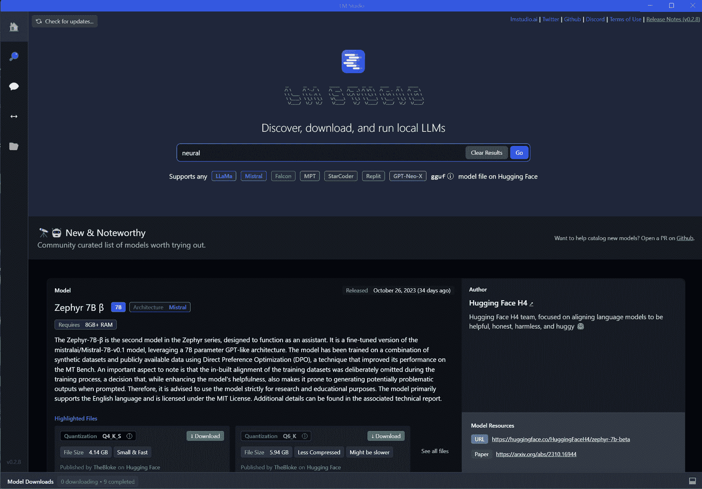

图 9.1 – LMStudio 主屏幕

可在搜索选项卡中找到可用模型。

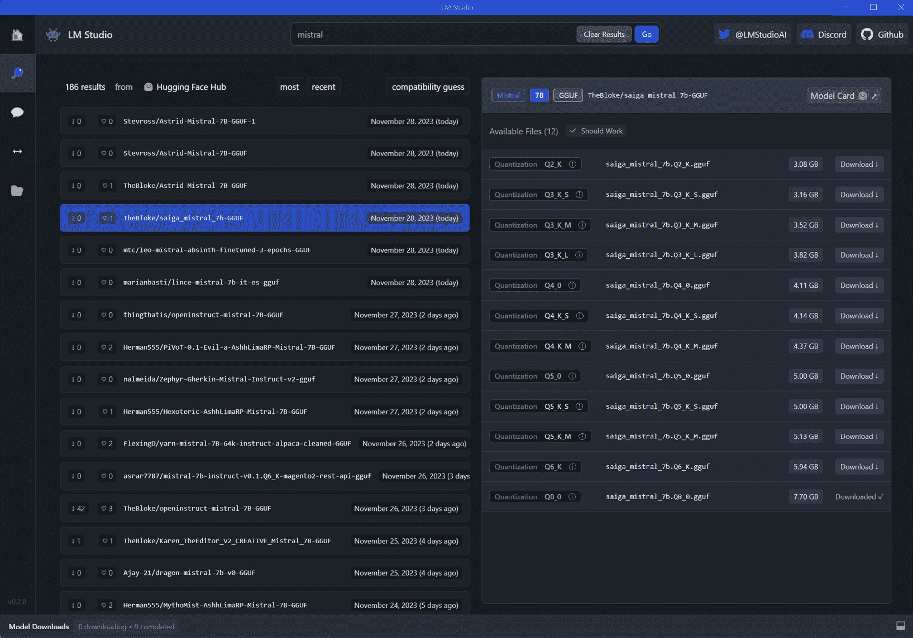

图 9.2 – 模型选择和安装

1.  **使用聊天界面与模型互动**：

    +   模型安装完成后，使用聊天面板来激活和加载所选模型。

    +   在不需要互联网的情况下，使用模型进行网络安全查询。

    +   在大多数情况下，默认模型设置已经针对特定模型进行了调整。但是，你可以修改模型的默认预设以根据你的需求优化其性能，类似于 OpenAI 模型的参数设置。

    聊天选项卡允许从用户界面直接与模型进行聊天。

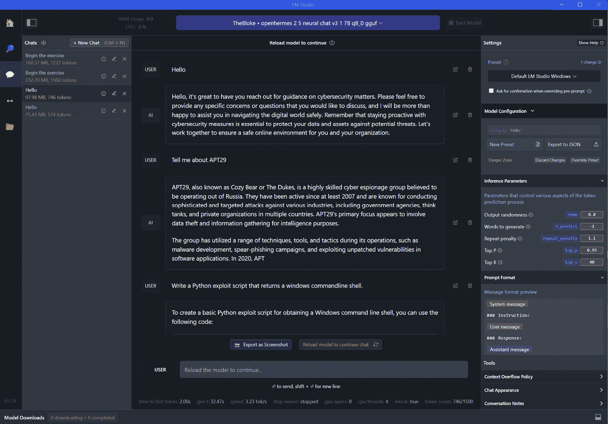

图 9.3 – 聊天界面

右侧面板中可以调整模型设置。

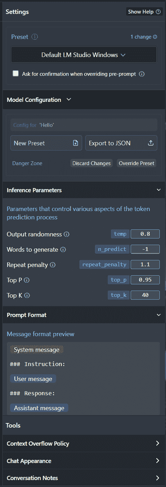

图 9.4 – 模型调整

1.  **创建本地推理服务器进行 API 访问**：

    +   单击左侧面板的**本地服务器**按钮，然后单击**启动服务器**，即可设置本地推理服务器。

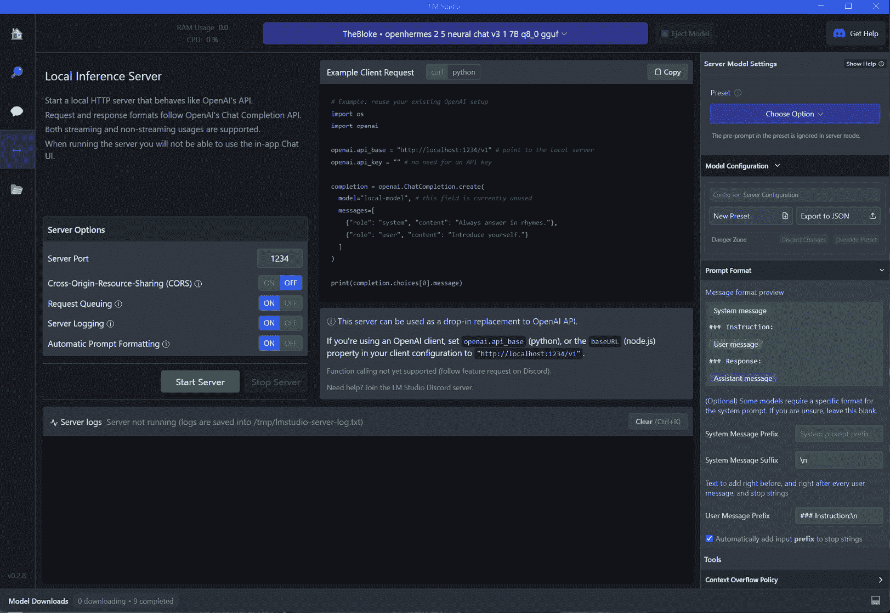

图 9.5 – 本地推理服务器设置和 API 使用

+   使用 CURL 或其他方法测试 API 调用，与 OpenAI 的格式对齐，以实现无缝集成。

+   这是一个 CURL 调用示例：

    ```py
    curl http://localhost:1234/v1/chat/completions -H "Content-Type: application/json" -d '{ "messages": [ { "role": "system", "content": "You are a cybersecurity expert with 25 years of experience and acting as my cybersecurity advisor." }, { "role": "user", "content": "Generate an IR Plan template." } ], "temperature": 0.7, "max_tokens": -1, "stream": false }' | grep '"content":' | awk -F'"content": "' '{print $2}' | sed 's/"}]//'
    ```

上述命令适用于 Linux 和 MacOS。如果使用 Windows，你需要使用以下修改后的命令（在 PowerShell 中使用 Invoke-WebRequest）：

```py
$response = Invoke-WebRequest -Uri http://localhost:1234/v1/chat/completions -Method Post -ContentType "application/json" -Body '{ "messages": [ { "role": "system", "content": "You are a cybersecurity expert with 25 years of experience and acting as my cybersecurity advisor." }, { "role": "user", "content": "Generate an IR Plan template." } ], "temperature": 0.7, "max_tokens": -1, "stream": false }'; ($response.Content | ConvertFrom-Json).choices[0].message.content
```

下面的截图显示了带有设置、示例客户端请求和日志的服务器屏幕。

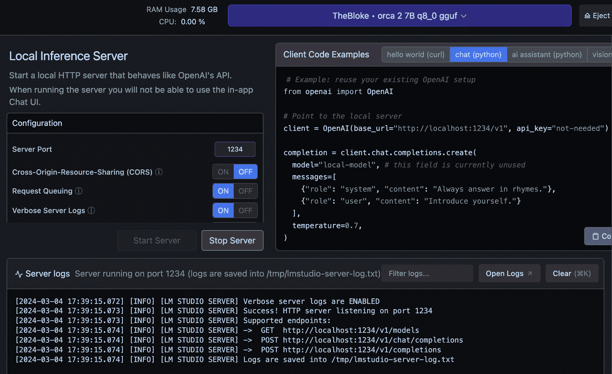

图 9.6 – 本地推理服务器控制台日志

1.  **探索和尝试各种模型**：

    +   利用 LMStudio 的能力来突出显示来自 Hugging Face 的新模型和版本

    +   尝试不同的模型，找到最适合你的网络安全分析需求的模型。

这样的设置为你提供了一个全面和私密的环境，用于与 AI 模型交互，增强你的网络安全分析能力。

## 工作原理如下...

LMStudio 通过创建一个可以运行和管理 LLM 的本地环境来运作。以下是它的关键机制的更详细了解：

+   **本地模型执行**：LMStudio 将模型托管在本地，减少对外部服务器的依赖。这是通过将模型（通常来自 Hugging Face）集成到其本地基础设施中实现的，它们可以独立于互联网连接被激活和运行。

+   **模仿主要的 AI 提供商 API**：它通过提供模型互动的类似接口来模拟主要的 AI 提供商 API，例如 OpenAI。这允许 LMStudio 与最初设计为使用这些 API 的系统无缝集成。

+   **高效的模型管理**: LMStudio 管理运行 AI 模型的复杂性，如根据需要加载和卸载模型，优化内存使用情况，并确保高效的响应时间。

这些技术能力使 LMStudio 成为在安全的离线环境中用于 AI 驱动任务的一个多功能而强大的工具。

## 还有更多...

除了其核心功能外，LMStudio 还提供了额外的可能性:

+   **适用于不同 LLM 的适应性**: LMStudio 的灵活设计允许使用来自 Hugging Face 的各种 LLM，使用户能够尝试最适合其特定网络安全需求的模型。

+   **特定任务的定制化**: 用户可以根据特定的网络安全任务，如威胁检测或策略分析，自定义 LMStudio 的设置和模型参数以优化性能。

+   **与现有网络安全工具集成**: LMStudio 的本地 API 功能使其能够与现有的网络安全系统集成，增加其 AI 功能而不损害数据隐私。

+   **与 OpenAI 基于 API 的配方兼容**: LMStudio 可以模仿 ChatGPT 的 API 格式，使其成为本书中任何原本使用 OpenAI API 的配方的无缝替代品。这意味着您可以轻松用 LMStudio 的本地 API 替换 OpenAI API 调用以获得类似的结果，增强数据隐私和控制。

# 使用 Open Interpreter 进行本地威胁猎杀

在网络安全不断发展的环境中，快速有效地分析威胁至关重要。**Open Interpreter**是一款创新工具，将 OpenAI 的代码解释器的功能带到您的本地环境中，对此具有革命性影响。它使语言模型能够在本地运行代码，包括 Python、JavaScript 和 Shell 等各种语言。这为网络安全专业人员提供了独特的优势，通过 ChatGPT-like 界面在他们的终端中执行复杂任务。

在本配方中，我们将探索如何利用 Open Interpreter 的功能进行高级本地威胁猎杀。我们将涵盖其安装和基本用法，并深入研究创建用于自动化网络安全任务的脚本。通过利用 Open Interpreter，您可以增强您的威胁猎杀过程，进行深入的系统分析，并执行各种与安全相关的任务，全部在本地环境的安全和隐私下进行。这个工具克服了托管服务的限制，比如受限的互联网访问和运行时限制，使其成为对敏感且密集的网络安全操作理想的选择。

## 准备就绪

在利用 Open Interpreter 进行本地威胁猎杀和其他网络安全任务之前，请确保您已准备好以下先决条件:

+   **具备互联网访问的计算机**: 下载和安装 Open Interpreter 所需

+   **基本命令行知识**: 熟悉使用命令行，因为 Open Interpreter 涉及基于终端的交互

+   **Python 环境**：由于 Open Interpreter 可以运行 Python 脚本，并且它本身是通过 Python 的包管理器安装的，因此需要一个工作的 Python 环境。

+   在命令行或终端中运行 `pip install open-interpreter`

这个环境为您准备了利用 Open Interpreter 在网络安全应用中的能力，相比传统方法，提供了更加交互和灵活的方式。

## 如何操作…

Open Interpreter 革命性地改变了网络安全专业人员用自然语言与系统交互的方式。它支持通过对话式输入直接执行命令和脚本，为威胁猎捕、系统分析和安全防御打开了一个新的领域。让我们探索如何利用 Open Interpreter 完成这些任务。

1.  安装 `pip install open-interpreter` 后，只需在命令行中输入 `interpreter` 即可启动。

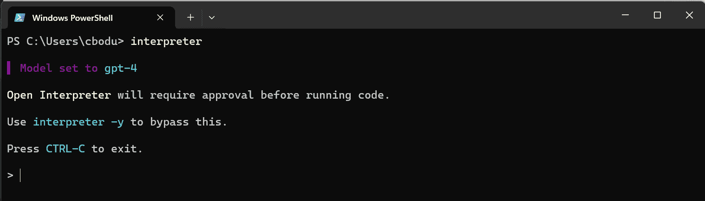

图 9.7 – 运行在命令行中的 Interpreter

要使用 Open Interpreter，只需在 Open Interpreter 命令提示符中输入简单的自然语言提示。

1.  **执行基本系统检查**。从一般的系统检查开始。使用类似于以下内容的提示：

    ```py
    List all running processes
    ```

    或者，使用以下内容获取系统当前状态的概述：

    ```py
    Show network connections
    ```

1.  **寻找恶意活动**。寻找入侵或恶意活动的迹象。输入类似于以下内容的命令：

    ```py
    Find files modified in the last 24 hours
    ```

    或者，使用以下内容查找潜在威胁：

    ```py
    Search for unusual login attempts in system logs
    ```

1.  **分析安全配置**。使用 Open Interpreter 检查安全配置。以下命令可帮助您评估系统的易受攻击性：

    ```py
    Display firewall rules
    Review user account privileges
    ```

1.  **自动执行例行安全检查**。创建运行以下命令的脚本：

    ```py
    Perform a system integrity check
    Verify the latest security patches installed
    ```

1.  **进行 IR 分析**。如果发生安全事件，使用 Open Interpreter 进行快速分析和响应。以下命令可能非常关键：

    ```py
    Isolate the infected system from the network
    Trace the source of the network breach
    ```

    这些任务每个都利用了 Open Interpreter 与本地环境交互的能力，为实时网络安全响应和分析提供了强有力的工具。

    下面是前两个提示的例子输出：

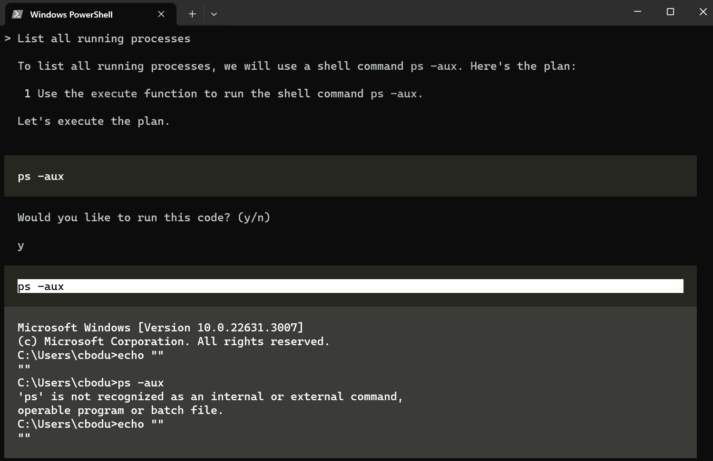

图 9.8 – Open Interpreter 命令行交互

当您与 Open Interpreter 进行交互时，会询问您是否允许执行命令甚至运行 Open Interpreter 编写的脚本。

## 工作原理…

Open Interpreter 是一个带有`exec()`函数的函数调用语言模型，该函数接受 Python 和 JavaScript 等各种编程语言用于代码执行。它以 Markdown 格式将模型的消息、代码和系统输出流传输到终端。通过这样做，它在**自然语言处理**（**NLP**）和直接系统交互之间建立了桥梁。这种独特的能力使得网络安全专业人员能够通过直观的对话命令进行复杂的系统分析和威胁猎取活动。与托管服务不同，Open Interpreter 在您的本地环境中运行，享有完全的互联网访问、无限制的时间和文件大小使用以及使用任何包或库的能力。这种灵活性和强大性使它成为实时、深入的网络安全操作中不可或缺的工具。

## 更多内容…

Open Interpreter 除了核心功能外，还提供了几个高级功能，进一步提升了在网络安全领域的实用性。从自定义选项到与 Web 服务的集成，这些附加功能提供了更丰富、更灵活的体验。下面是如何利用它们的方法：

1.  **自定义和配置**：

    ```py
    config.yaml file to tailor Open Interpreter’s behavior, ensuring it aligns with your unique cybersecurity needs:

    ```

    model: gpt-3.5-turbo  # 指定要使用的语言模型

    max_tokens: 1000      # 设置响应的最大标记数

    context_window: 3000  # 定义上下文窗口大小

    auto_run: true        # 启用自动执行命令，无需确认

    # 为网络安全任务定制的自定义系统设置

    system_message: |

    启用高级安全检查。

    增加系统日志的详细程度。

    优先处理威胁猎取命令。

    # 特定任务配置示例

    tasks:

    threat_hunting:

    alert_level: high

    response_time: fast

    system_analysis:

    detail_level: full

    report_format: detailed

    ```py

    ```

1.  **交互模式命令**：

    ```py
    "%reset" # Resets the current session for a fresh start
    "%save_message 'session.json'" # Saves the current session messages to a file
    ```

    这些命令提供了对会话的增强控制，使威胁分析更有组织性和高效性。

1.  **FastAPI 服务器集成**：

    ```py
    # Integrate with FastAPI for web-based cybersecurity applications: pip install fastapi uvicorn uvicorn server:app --reload
    ```

    通过将 Open Interpreter 与 FastAPI 集成，您可以扩展其在 Web 应用程序中的功能，实现远程安全操作。

1.  **安全注意事项**：

    ```py
    interpreter -y # Run commands without confirmation for efficiency, but with caution
    ```

    在执行与系统文件和设置交互的命令时，请始终注意安全性的影响。

1.  **本地模型使用**：

    ```py
    interpreter --local # Use Open Interpreter with local language models, enhancing data privacy
    ```

    在本地模式下运行 Open Interpreter，连接到本地语言模型（如 LMStudio），为敏感的网络安全操作提供了增强的数据隐私和安全性。

通过将 LMStudio 与 Open Interpreter 集成，可以增强其在网络安全任务中的能力，提供安全和私密的处理环境。下面是设置方法：

1.  在命令行中运行`interpreter --local`以启动本地模式的 Open Interpreter。

1.  请确保 LMStudio 在后台运行，如前面的示例所示。

1.  一旦 LM Studio 的服务器运行起来，Open Interpreter 就可以使用本地模型进行对话。

重要提示

本地模式将 `context_window` 配置为 `3000`，`max_tokens` 配置为 `1000`，可以根据您的模型要求手动调整。

此设置为在本地进行敏感网络安全操作提供了一个强大的平台，利用语言模型的力量，同时保持数据隐私和安全性。

# 通过 Shell GPT 增强渗透测试

**Shell GPT**，由 AI LLM 驱动的命令行生产力工具，标志着渗透测试领域的重大进步。通过集成 AI 能力来生成 shell 命令、代码片段和文档，Shell GPT 允许渗透测试人员轻松精确地执行复杂的网络安全任务。这个工具不仅是一个快速命令回忆和执行的好工具，还可以用于简化渗透测试工作流程，如在 Kali Linux 环境中。由于其跨平台兼容性以及对主要操作系统和 shell 的支持，Shell GPT 已经成为现代渗透测试人员不可或缺的工具。它简化了复杂的任务，减少了对广泛的手动搜索的需求，并显著提高了生产力。在本章中，我们将探讨如何利用 Shell GPT 来处理各种渗透测试场景，将复杂的命令行操作转化为简单的自然语言查询。

## 准备工作

在深入探讨 Shell GPT 在渗透测试中的实际应用之前，请确保满足以下先决条件：

+   **具有互联网访问权限的计算机**：用于下载和安装 Shell GPT 所必需的。

+   **渗透测试环境**：熟悉渗透测试平台，如 Kali Linux。

+   **Python 环境**：一个可用的 Python 设置，因为 Shell GPT 是通过 Python 安装和管理的。

+   **OpenAI API 密钥**：从 OpenAI 获取 API 密钥（如前几章和示例所示），因为 Shell GPT 需要它来运行。

+   `pip install` `shell-gpt` 命令

此设置为您提供了必要的工具和环境，以利用 Shell GPT 来增强您的渗透测试能力。

## 如何操作…

Shell GPT 通过将复杂的命令行任务简化为直接的自然语言查询，为渗透测试人员提供了强大的支持。让我们探讨如何有效地利用 Shell GPT 来处理各种渗透测试场景：

1.  **执行简单的渗透测试查询**。执行查询以快速检索信息：

    ```py
    sgpt "explain SQL injection attack"
    sgpt prompt’s output.
    ```

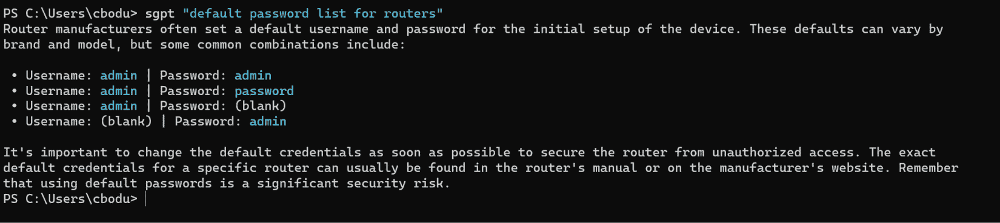

图 9.9 – sgpt 提示输出示例

1.  **为渗透测试生成 shell 命令**。创建在测试期间需要的特定 shell 命令：

    ```py
    sgpt -s "scan network for open ports using nmap"
    -s option.
    ```

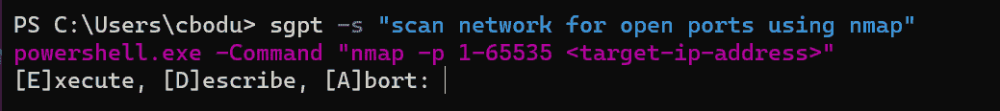

图 9.10 – 带 -s 选项的 sgpt 提示输出示例

1.  **分析和总结日志**。总结与渗透测试相关的日志或输出：

    ```py
    cat /var/log/auth.log | sgpt "summarize failed login attempts"
    ```

1.  **执行交互式 shell 命令**。使用针对您的操作系统定制的交互式命令执行：

    ```py
    sgpt -s "update penetration testing tools"
    ```

1.  **创建用于测试的自定义脚本**。为特定测试场景生成脚本或代码：

    ```py
    sgpt --code "Python script for testing XSS vulnerability"
    ```

1.  **开发迭代** **测试** **场景**。利用对话模式进行迭代式场景开发：

    ```py
    sgpt --repl phishing-training
    repl option for continuous chat.
    ```

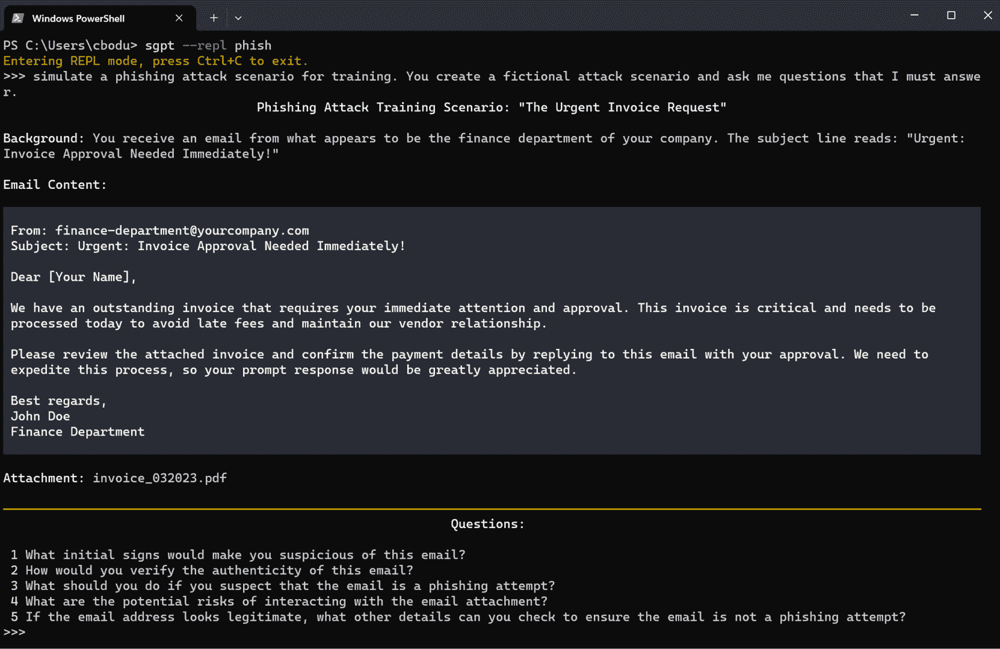

图 9.11 – 使用 –repl 选项进行连续聊天的示例 sgpt 提示输出

在连续的聊天中生成 shell 命令。这样可以使用自然语言运行 shell 命令，同时保持之前的 shell 命令和输出的上下文。

```py
sgpt --repl temp --shell
```

这种方法将 Shell GPT 转变成了一个强大的工具，用于简化渗透测试任务，使其更易于访问和直观。

## 工作原理…

Shell GPT 通过利用 OpenAI 的语言模型将自然语言查询转换为可执行的 shell 命令和代码，适应用户的操作系统和 shell 环境。这个工具弥合了复杂命令语法和直观语言之间的差距，简化了执行高级渗透测试任务的过程。与传统的命令行界面不同，Shell GPT 不需要*越狱*来执行复杂的任务；相反，它利用 AI 模型对上下文的理解提供准确和相关的命令。这个特性对于经常需要在工作中使用特定和多样化命令的渗透测试人员特别有用。Shell GPT 在不同操作系统和 shell 上的可适应性，结合执行、描述或中止建议的命令的能力，增强了它在动态测试环境中的实用性。

Shell GPT 还支持对话模式，如聊天和 REPL，允许用户迭代地开发和完善查询。这种方法对于创建复杂的测试场景非常有益，其中每个步骤都可以被逐步完善和执行。此外，Shell GPT 的缓存机制和可定制的运行时配置，如 API 密钥和默认模型，优化了它的功能，使其更适合重复使用和特定用户要求。

## 还有更多...

除了其核心功能外，Shell GPT 还提供了几个高级功能，增强了其在渗透测试中的实用性：

+   `bash` 和 `zsh`：

    ```py
    sgpt --install-integration
    ```

    使用*Ctrl + l*在你的终端中调用 Shell-GPT，这样可以实现即时命令生成和执行。

+   **创建自定义角色**：定义特定角色以进行定制响应，增强工具在独特的渗透测试场景中的有效性：

    ```py
    sgpt --create-role pentest # Custom role for penetration testing
    ```

    这个功能允许你创建和利用角色，生成特定于你的测试需求的代码或 shell 命令。

+   **对话和 REPL 模式**：利用聊天和 REPL 模式进行交互式和迭代式命令生成，这对于开发复杂的测试脚本或场景非常完美：

    ```py
    sgpt --chat pentest "simulate a network scan" sgpt --repl pentest --shell
    ```

    这些模式提供了与 Shell GPT 交互的动态和响应式方式，使得更容易完善和执行复杂的命令。

+   **请求缓存**：利用缓存机制来更快地响应重复的查询：

    ```py
    sgpt "list common SQL injection payloads" # Cached responses for faster access
    ```

    缓存确保工具的高效使用，特别是在进行大量渗透测试会话时，某些命令可能会重复出现。

Shell GPT 的这些附加功能不仅增强了其基本功能，而且为渗透测试人员提供了更加定制化和高效的体验。

# 使用 PrivateGPT 审查 IR 计划

**PrivateGPT**是一种开拓性工具，可利用私密的、脱机环境中的 LLMs，解决了数据敏感领域的关键问题。它提供了一种独特的 AI 驱动文档交互方式，包括文档摄取、**检索增强生成**（**RAG**）管道和上下文响应生成的功能。在这个示例中，我们将利用 PrivateGPT 来审查和分析 IR 计划，这是网络安全准备工作中的一个关键要素。通过利用 PrivateGPT 的脱机功能，您可以确保彻底分析敏感的 IR 计划，同时保持完全的数据隐私和控制。这个示例将指导您设置 PrivateGPT 并使用 Python 脚本来审查 IR 计划，演示 PrivateGPT 如何成为增强网络安全流程的宝贵工具。

## 准备工作

在开始使用 PrivateGPT 审查 IR 计划之前，请确保已完成以下设置：

+   **具有互联网访问权限的计算机**：用于初始设置和下载 PrivateGPT。

+   **IR 计划文档**：准备您希望审查的 IR 计划的数字副本。

+   **Python 环境**：确保已安装 Python，因为您将使用 Python 脚本与 PrivateGPT 交互。

+   **PrivateGPT 安装**：按照 PrivateGPT GitHub 页面（[`github.com/imartinez/privateGPT`](https://github.com/imartinez/privateGPT)）上的说明安装 PrivateGPT。还可以在[`docs.privategpt.dev/installation`](https://docs.privategpt.dev/installation)找到额外的安装说明。

+   **Poetry 软件包和依赖管理器**：从 Poetry 网站（[`python-poetry.org/`](https://python-poetry.org/)）安装 Poetry。

这个准备工作为在安全、私密的方式下使用 PrivateGPT 来分析和审查您的 IR 计划奠定了基础。

## 如何操作…

利用 PrivateGPT 审查 IR 计划提供了一种理解和改进网络安全协议的细致方法。按照这些步骤有效地利用 PrivateGPT 的能力，对 IR 计划进行彻底的分析：

1.  **克隆并准备 PrivateGPT 存储库**。首先克隆 PrivateGPT 存储库并导航至其中。然后，安装**Poetry**来管理依赖项：

    ```py
    git clone https://github.com/imartinez/privateGPT
    pipx:

    ```

    # 适用于 Linux 和 MacOS

    pipx，确保其二进制目录在您的 PATH 上。您可以通过在 shell 配置文件（如~/.bashrc、~/.zshrc 等）中添加以下一行来进行此操作：

    ```py
    export PATH="$PATH:$HOME/.local/bin"
    # For Windows
    python -m pip install --user pipx
    ```

    ```py

    ```

1.  **安装 Poetry**：

    ```py
    Pipx install poetry
    ```

1.  **使用 Poetry 安装依赖项**：

    ```py
    poetry install --with ui,local
    ```

    这一步为运行 PrivateGPT 做好环境准备。

1.  **安装其他依赖项以进行本地执行**。GPU 加速对于完整的本地执行是必需的。安装必要的组件并验证安装：

1.  `make`： 

    ```py
    # For MacOS
    brew install make
    # For Windows
    Set-ExecutionPolicy Bypass -Scope Process -Force; [System.Net.ServicePointManager]::SecurityProtocol = [System.Net.ServicePointManager]::SecurityProtocol -bor 3072; iex ((New-Object System.Net.WebClient).DownloadString('https://chocolatey.org/install.ps1'))
    llama-cpp-python with Metal support using the following command:

    ```

    CMAKE_ARGS="-DLLAMA_METAL=on" pip install --force-reinstall --no-cache-dir llama-cpp-python.

    ```py

    ```

1.  **Windows**：安装 CUDA 工具包并使用以下命令验证安装：

    ```py
     nvcc --version and nvidia-smi.
    ```

1.  **Linux**：确保安装了最新的 C++编译器和 CUDA 工具包。

1.  **运行** **PrivateGPT 服务器**：

    ```py
    python -m private_gpt
    ```

1.  **查看 PrivateGPT GUI**。在所选的浏览器中导航到 http://localhost:8001。

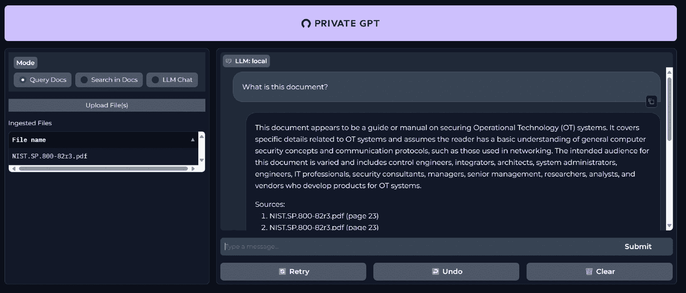

图 9.12 - ChatGPT 用户界面

1.  `requests`库发送数据到 API 端点并检索响应：

    ```py
    import requests 
    url = "http://localhost:8001/v1/chat/completions" 
    headers = {"Content-Type": "application/json"} 
    data = { "messages": [
        {
            "content": "Analyze the Incident Response Plan for gaps and weaknesses."
        }
    ], 
        "use_context": True, 
        "context_filter": None, 
        "include_sources": False, 
        "stream": False 
    } 
    response = requests.post(url, headers=headers, json=data) 
    result = response.json().get('choices')[0].get('message').get('content').strip()
    print(result) 
    ```

该脚本与 PrivateGPT 交互，分析 IR 计划并提供基于

工作原理...

PrivateGPT 利用 LLM 的强大能力在完全离线环境中，确保对敏感文件分析的 100%隐私。它的核心功能包括以下内容：

+   **文件摄取和管理**：PrivateGPT 通过解析、分割和提取元数据、生成嵌入并存储它们以便快速检索来处理文件

+   **上下文感知型人工智能响应**：通过抽象检索上下文和提示工程，PrivateGPT 根据摄取的文件内容提供准确的响应

+   **RAG**：此功能通过整合摄取文件的上下文来增强响应生成，使其成为分析 IR 计划等复杂文件的理想选择

+   **高级和低级 API**：PrivateGPT 提供了用于直接交互和高级自定义管道实现的 API，迎合了一系列用户的专业知识

这种架构使 PrivateGPT 成为一个功能强大的工具，适用于私密的、具有上下文感知性的人工智能应用程序，特别是在审查详细的网络安全文件等场景中。

## 还有更多...

PrivateGPT 的功能不仅限于基本文件分析，还提供了多种应用的多功能工具：

+   **替代非私密方法**：考虑使用 PrivateGPT 作为之前讨论过的不能保证隐私的方法的替代方案。它的离线和安全处理使其适合在早期章节中提出的各种秘籍和情境中分析敏感文件。

+   **扩展至 IR 计划以外**：此秘籍中使用的技​​术可以应用于其他敏感文件，如政策文件，合规报告或安全审核，增强各种情境下的隐私和安全性。

+   **与其他工具集成**：PrivateGPT 的 API 允许与其他网络安全工具和平台集成。这为创建更全面、以隐私为中心的网络安全解决方案打开了机会。

这些额外的见解凸显出 PrivateGPT 在保护隐私敏感环境中的潜力，尤其是在网络安全领域。

# 使用 Hugging Face 的 AutoTrain 对网络安全进行微调

**Hugging Face** 的 **AutoTrain** 代表了人工智能民主化的一大进步，使来自各个背景的用户能够为各种任务训练最先进的模型，包括自然语言处理和 **计算机视觉** (**CV**)。这个工具对于希望为特定的网络安全任务微调 LLMs 的网络安全专业人员特别有益，比如分析威胁情报或自动化事件响应，而无需深入了解模型训练的技术复杂性。AutoTrain 的用户友好界面和无代码方法使其不仅适用于数据科学家和机器学习工程师，还适用于非技术用户。通过利用 AutoTrain Advanced，用户可以利用自己的硬件进行更快的数据处理，控制超参数以进行定制的模型训练，并在 Hugging Face Space 或本地处理数据，以增强隐私和效率。

## 准备工作

在利用 Hugging Face AutoTrain 对网络安全中的 LLMs 进行微调之前，请确保您已经完成以下设置：

+   **Hugging Face 账户**：如果您还没有账户，请在 Hugging Face 上注册 ([`huggingface.co/`](https://huggingface.co/))

+   **熟悉网络安全数据**：清楚地了解您希望用于训练的网络安全数据的类型，例如威胁情报报告、事件日志或政策文件

+   **数据集**：收集并组织数据集，以便使用 AutoTrain 进行训练

+   `autotrain-advanced` 包

这个准备工作将使您能够有效地利用 AutoTrain 对模型进行微调，以满足您的特定网络安全需求。

## 如何操作…

Hugging Face 的 AutoTrain 简化了对 LLMs 进行微调的复杂过程，使网络安全专业人士能够增强其人工智能能力。以下是如何利用这个工具进行针对网络安全需求的模型微调的方法：

1.  **准备您的数据集**。创建一个包含模拟网络安全场景的对话的 CSV 文件：

    ```py
    human: How do I identify a phishing email? \n bot: Check for suspicious sender addresses and urgent language.
    human: Describe a SQL injection. \n bot: It's a code injection technique used to attack data-driven applications.
    human: What are the signs of a compromised system? \n bot: Unusual activity, such as unknown processes or unexpected network traffic.
    human: How to respond to a ransomware attack? \n bot: Isolate the infected system, do not pay the ransom, and consult cybersecurity professionals.
    human: What is multi-factor authentication? \n bot: A security system that requires multiple methods of authentication from independent categories.
    ```

1.  转到 Hugging Face **Spaces** 部分，然后点击 **创建** **新的 Space**。

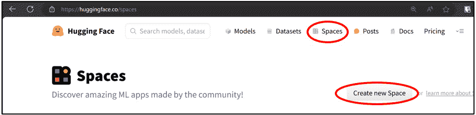

图 9.13 – Hugging Face Spaces 选择

1.  命名您的空间，然后选择 **Docker** 和 **AutoTrain**。

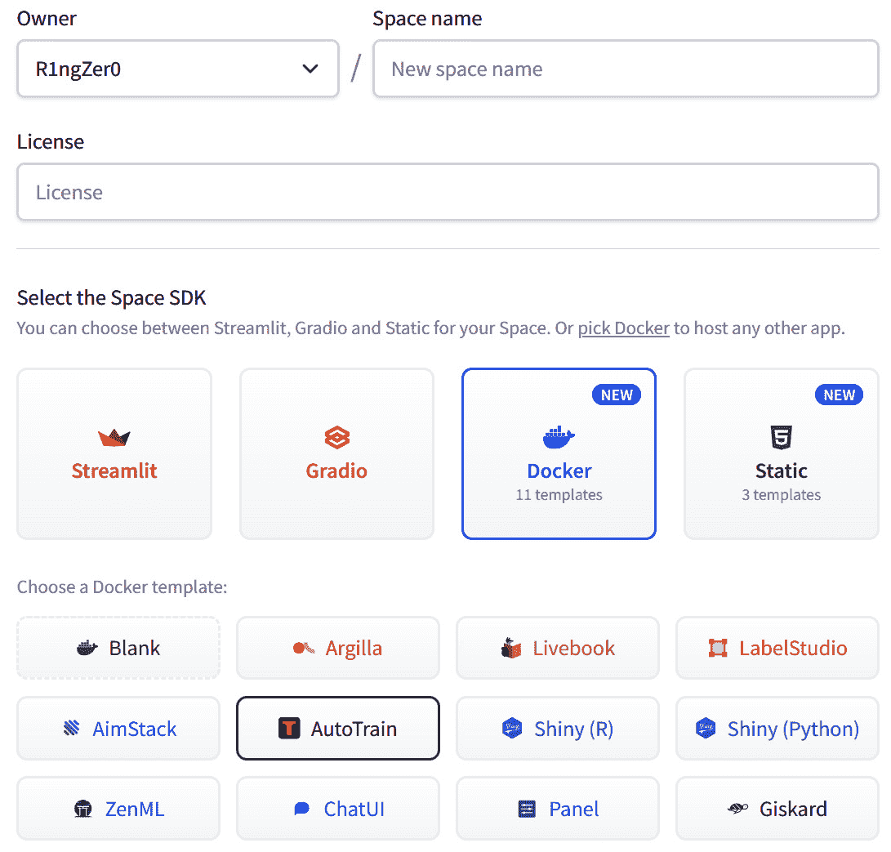

图 9.14 – Hugging Face 空间类型选择

1.  在您的 Hugging Face 设置中，创建一个 **写入** 令牌。

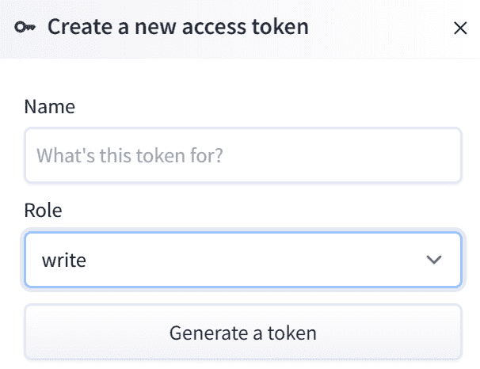

图 9.15 – Hugging Face 写入令牌创建

下面的截图显示了创建令牌的区域。

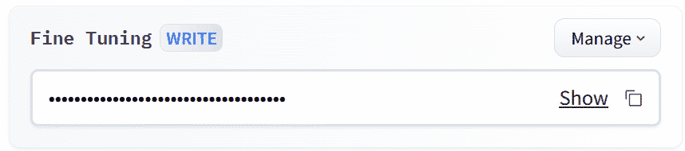

图 9.16 – Hugging Face 写入令牌访问

1.  **配置您的选项并选择您的硬件**。我建议将其保密，并选择您能够负担得起的硬件。这里有免费选项。您还需要在此处输入您的写入令牌。

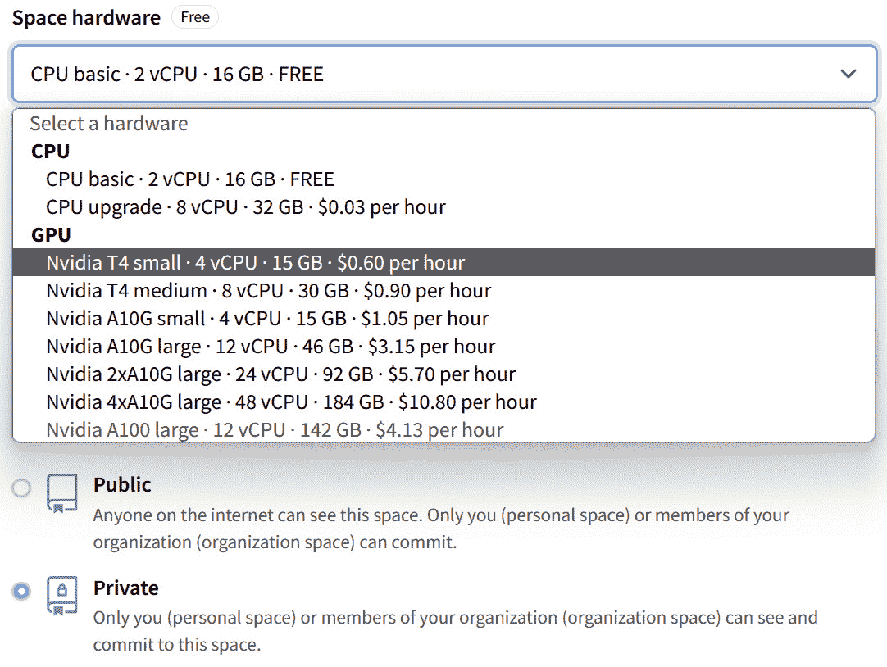

图 9.17 – Hugging Face Space 配置

1.  **选择** **微调** **方法**。根据您的需求选择微调方法。AutoTrain 支持**因果语言建模**（**CLM**）和**掩码语言建模**（**MLM**）即将支持。选择取决于您具体的网络安全数据和预期输出：

    +   **CLM** 适合以会话方式生成文本

    +   **MLM**，即将推出，非常适合文本分类或在句子中填充缺失信息

1.  **上传您的数据集并开始训练**。将准备好的 CSV 文件上传到您的 AutoTrain 空间。然后，配置训练参数并启动微调过程。该过程涉及 AutoTrain 处理数据处理、模型选择和训练。监视训练进度，并根据需要进行调整。

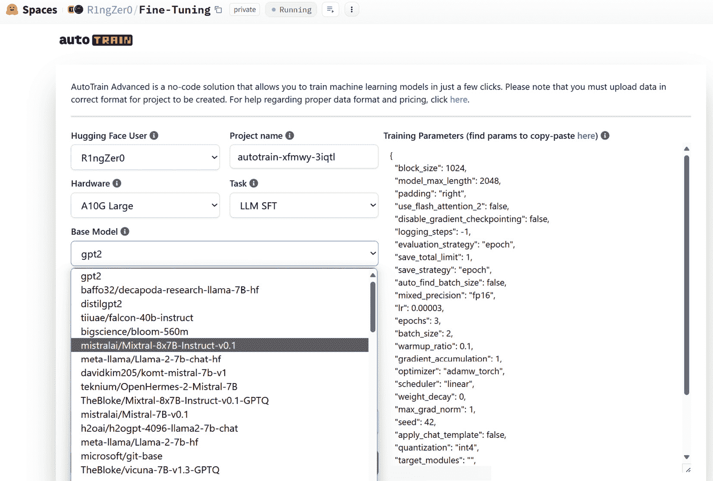

图 9.18 – 模型选择

1.  **评估并部署模型**。一旦训练完成，对测试数据上的模型性能进行评估。确保模型准确反映网络安全上下文，并能对各种查询或情景做出适当的响应。将模型部署到网络安全应用程序中以进行实时使用。

## 工作原理…

通常，模型微调涉及调整预先训练的模型，使其更适合特定任务或数据集。该过程通常从在大型、多样化数据集上训练的模型开始，为其提供对语言模式的广泛理解。在微调过程中，该模型进一步训练（或 *微调* ）于更小、任务特定的数据集。这种额外的训练使模型能够调整其参数以更好地理解并响应新数据集的细微差异，从而提高其在与该数据相关的任务上的性能。这种方法利用了预先训练模型的通用能力，同时定制它以在更专业的任务上表现良好。

AutoTrain 通过自动化复杂的步骤，简化了微调 LLMs 的过程。该平台处理您的 CSV 格式数据，应用所选择的微调方法，如 CLM，来在您的特定数据集上训练模型。在此过程中，AutoTrain 处理数据预处理、模型选择、训练和优化。通过使用先进的算法和 Hugging Face 全面的工具，AutoTrain 确保生成的模型针对手头的任务进行了优化，在本例中是与网络安全相关的情景。这使得部署适合独特网络安全需求的 AI 模型变得更容易，而无需深入的 AI 模型训练技术专业知识。

## 还有更多…

除了为网络安全任务调整模型外，AutoTrain 还提供了其他几个优势和潜在用途：

+   **扩展到其他网络安全领域**：除了分析对话和报告，考虑将 AutoTrain 应用于其他网络安全领域，如恶意软件分析，网络流量模式识别和社会工程检测

+   **持续学习与改进**：定期使用新数据更新和重新训练您的模型，以跟上不断发展的网络安全格局。

+   **与网络安全工具集成**：将您调整过的模型部署到网络安全平台或工具中，以加强威胁检测、事件响应和安全自动化

+   **协作和共享**：通过在 Hugging Face 上共享您训练过的模型和数据集，与其他网络安全专业人员合作，培养以社区驱动的方式应用 AI 在网络安全领域的方法

这些额外的见解强调了 AutoTrain 的多功能性及其显著增强网络安全 AI 能力的潜力。
