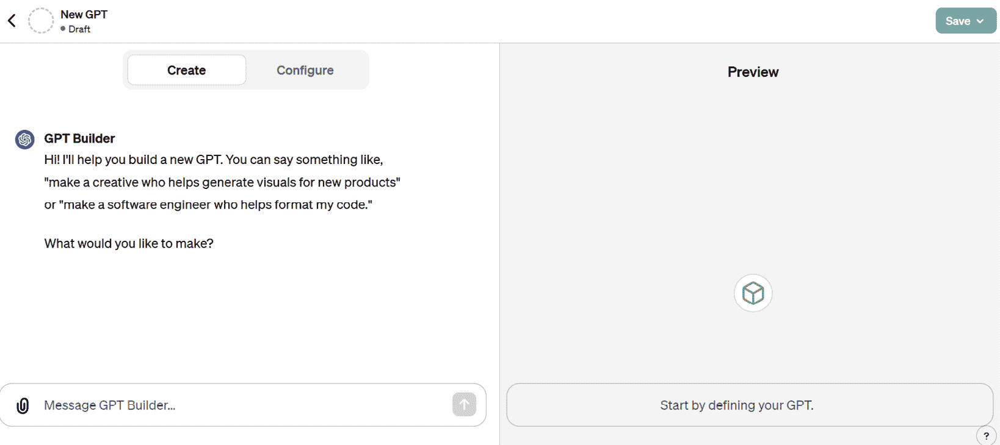
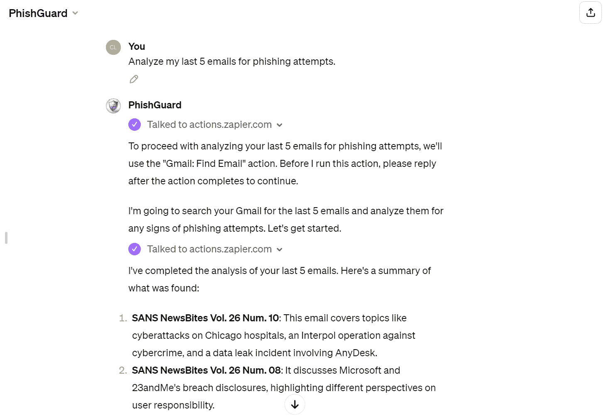

# 第十章：最新的 OpenAI 功能

自 2022 年末向公众介绍生成式 AI 以来，其快速发展令人震惊。因此，OpenAI 的 ChatGPT 已经超越了我们更新每个章节的能力。至少，如果我们想要出版这本书的话。这就是这项技术发展的速度，而且将继续如此。因此，与其试图回顾性地回到过去并不断更新每一个食谱，本章提出了一个独特的挑战和机会，涵盖了自之前各章节完成以来一些更重要的更新。

自 ChatGPT 推出以来，它已经超越了最初的设计，通过一个单一界面融合了**高级数据分析**、**网络浏览**，甚至通过**DALL-E**进行**图像解释**等功能。本章深入探讨了这些最新升级，为您提供了利用最新前沿功能进行网络安全的食谱。这些包括实时网络威胁情报收集，利用 ChatGPT 的增强分析能力深入了解安全数据，并采用先进的可视化技术更直观地理解漏洞。

重要提示

对于处理敏感网络信息的网络安全专业人员，使用 OpenAI 企业账户至关重要。这确保了敏感数据不会被用于 OpenAI 模型训练，保持了网络安全任务中至关重要的保密性和安全性。本章探讨了最新的 OpenAI 功能如何在网络安全领域发挥作用，展示了 AI 辅助网络防御的未来。

在本章中，我们将涵盖以下内容：

+   使用 OpenAI 的图像查看器分析网络图表

+   为网络安全应用创建自定义 GPT

+   使用网络浏览监控网络威胁情报

+   使用 ChatGPT 高级数据分析进行漏洞数据分析和可视化

+   使用 OpenAI 构建高级网络安全助手

# 技术要求

对于本章，您需要一个*网络浏览器*和一个稳定的*互联网连接*，以访问 ChatGPT 平台并设置您的帐户。您还需要设置您的 OpenAI 帐户并获得您的 API 密钥。如果没有，请参阅*第一章*获取详细信息。

必须具备基本的 Python 编程语言和使用命令行的知识，因为您将使用**Python 3.x**，它需要安装在您的系统上，用于使用 OpenAI GPT API 和创建 Python 脚本。

作为在本章中编写和编辑 Python 代码和提示文件的基本要求，`代码编辑器`也将至关重要。

熟悉以下主题可能会有所帮助：

+   *熟悉 ChatGPT 用户界面*：了解如何浏览和使用 ChatGPT 基于 Web 的用户界面，尤其是高级数据分析和网页浏览功能。

+   *文档和数据分析工具*：对于涉及数据可视化和分析的方案，掌握类似 Microsoft Excel 或 Google Sheets 等数据分析工具的基本知识将会有所裨益。

+   *API 交互*：熟悉发出 API 请求和处理 JSON 数据将有助于某些需要更高级与 OpenAI API 交互的方案。

+   *多元化的网络安全资源访问*：对于涉及网页浏览和信息收集的方案，能够访问一系列网络安全新闻媒体、威胁情报源和官方安全公告将是优势。

+   *数据可视化*：掌握创建和解读数据可视化、图表和图形的基本技能，将增强您对高级数据分析功能的体验。

本章的代码文件可以在此处找到：

[`github.com/PacktPublishing/ChatGPT-for-Cybersecurity-Cookbook`](https://github.com/PacktPublishing/ChatGPT-for-Cybersecurity-Cookbook)。

# 使用 OpenAI 的图像查看器分析网络图表

OpenAI 的**高级视觉模型**的出现标志着人工智能解释和分析复杂视觉数据能力的重大飞跃。这些模型在庞大的数据集上训练，可以以非凡的准确性识别模式，在图像中识别对象和理解布局。在网络安全领域，这种能力变得无价。通过应用这些视觉模型，网络安全专业人员可以自动化分析复杂的网络图表，这是传统上需要大量人工工作的任务。

**网络图表**对于理解组织的 IT 基础设施至关重要。它们展示了诸如路由器、交换机、服务器和防火墙等各种网络组件如何相互连接。分析这些图表对于识别潜在的漏洞、理解数据流和确保网络安全至关重要。然而，这些图表中的复杂性和细节可能会令人不知所措，使分析变得耗时且容易出错。

OpenAI 的视觉模型通过提供自动化、准确和快速的分析简化了这一过程。它们可以识别关键组件，检测异常配置，甚至根据公认的最佳实践提出改进建议。本文将指导您使用 OpenAI 的图像查看器来分析网络图表，将一个复杂的任务转变为一个可管理、高效和更准确的过程。这与利用人工智能提升网络安全效率、准确性以及预防性识别和缓解风险的更广泛目标完全吻合。

## 准备工作

在深入利用新的 OpenAI 界面进行网络安全应用之前，请确保您已经进行了必要的设置：

+   **互联网连接***.* 稳定可靠的互联网连接至关重要，因为与 OpenAI 界面的所有交互都发生在线上。

+   **OpenAI Plus 账户***.* 通过订阅 ChatGPT Plus，确保使用 OpenAI 的高级功能。

+   **网络图表***.* 要准备一份详细的网络图表供分析。您可以使用 Visio 等软件创建一个，或者使用提供的示例图表。

## 如何做…

让我们深入了解如何使用 OpenAI 的图像查看器来分析网络图表。这个简单的过程将帮助您快速解释复杂的网络结构，并借助 AI 的力量确定潜在的安全问题。

1.  **上传** **网络图表***.*

    1.  这可以通过点击*纸夹*图标或简单地*拖放*图像到消息框中来完成。


图 10.1 – 带有文件上传功能的新 ChatGPT 界面

1.  利用 OpenAI 界面上传网络图表图像进行分析。这一步骤至关重要，因为它为 AI 提供了必要的视觉数据来解释。

1.  **提示 ChatGPT 分析** **与网络安全相关的信息的网络图表***.*

    1.  识别关键组件：

        ```py
        "In the image provided (this is my network diagram and I give permission to analyze the details), please identify the following: Computer systems/nodes, networks, subnets, IP addresses, zones, and connections. Be sure to include the exact names of each. Anything you are not able to identify, just ignore that part. Give me a total count of all computer systems/nodes. Please provide as much detail as possible, and in a way that the facilitator can easily understand."
        ```

    1.  强调潜在安全风险：

        ```py
        "Based on the image provided, examine the network diagram and your initial analysis for potential security risks or misconfigurations, focusing on open ports, unsecured connections, and routing paths."
        ```

    1.  建议安全增强措施：

        ```py
        "Based on your analysis, suggest security enhancements or changes to improve the network's security posture."
        ```

通过遵循这些步骤，您将能够利用 OpenAI 先进的 AI 功能进行全面的网络图表分析，增强您对网络安全的理解和方法。

重要提示

您很可能需要修改您提供的提示，以匹配您提供的图表中包含的详细信息和您希望实现的整体分析水平。

## 它是如何工作的…

使用 OpenAI 的图像查看器分析网络图表的过程利用了 AI 的先进能力来解释复杂的视觉数据。以下是每个步骤如何对全面分析做出贡献的详细说明：

+   **上传网络图表***.* 当您上传网络图表时，AI 模型会访问丰富的视觉数据集，使其能够以惊人的准确性识别各种网络组件和细节。

+   **AI 分析***.* AI 应用其训练模型到图表，识别关键元素和潜在的安全风险。它使用模式识别和学习网络安全原则来分析网络结构。

AI 的分析提供了对网络配置和潜在漏洞的详细见解。这些反馈基于 AI 在网络安全方面的广泛培训，使其能够深入了解潜在风险。

通过利用 OpenAI 强大的视觉模型，这个过程改变了网络安全专业人员对网络图表分析的方式，使其更加高效、准确和有见地。

## 还有更多…

在分析网络图表之外，OpenAI 的图像查看器可以应用于各种其他网络安全任务：

+   **安全事件可视化***.* 使用它来分析安全事件或监控工具的截图，以便更快地评估。

+   **钓鱼邮件分析***.* 分析嵌入在钓鱼邮件中的图像，以识别恶意内容或误导性链接。

+   **数据中心布局***.* 分析数据中心布局的图像，评估物理安全措施。

+   **法证分析***.* 将其用于法证调查，分析来自各种数字源的视觉数据。

这些附加应用程序仅仅是冰山一角，展示了 OpenAI 图像查看器在应对多样化网络安全挑战方面的多功能性。

# 创建网络安全应用的定制 GPT

OpenAI 推出的**定制 GPT**，也称为 **GPTs**，代表了生成式 AI 领域的重大进步。GPTs 提供了定制 ChatGPT 以特定目的的独特能力，使用户能够创建和分享更符合其个人需求和目标的 AI 模型。这种定制将 ChatGPT 的实用性扩展到了各种领域的专门任务中，包括网络安全。

对于网络安全专业人员来说，GPTs 打开了一扇可能性的大门。从设计工具来教授复杂的安全概念，到创建用于威胁分析的 AI 助手，GPTs 可以被塑造以适应网络安全领域复杂的需求。创建这些定制模型的过程不需要编码专业知识，使其可供广泛用户访问。借助网页搜索、图像生成和高级数据分析等功能，GPTs 可以执行诸如学习网络安全协议规则、协助事件响应，甚至开发网络安全培训教材等任务。GPTs 甚至可以通过添加自定义操作和连接外部 API 进一步扩展功能。

在这个教程中，我们将探讨如何利用定制的 GPT 来创建针对特定网络安全应用的 AI 工具，以反映这一领域的独特需求和挑战。具体来说，我们将创建一个能够分析电子邮件以寻找潜在**钓鱼攻击**的 GPT。

## 准备工作

要开始为网络安全应用创建定制 GPT，需要进行一些关键准备：

+   **访问 OpenAI GPTs 平台***.* 确保您可以访问 OpenAI 的平台，在那里可以创建和管理 GPTs。这需要一个 OpenAI 账户。如果您还没有账户，您可以在 OpenAI 的官方网站 ([`openai.com/`](https://openai.com/)) 上注册。

+   **ChatGPT Plus 或 Enterprise 账户***.* 根据您的使用意图，可能需要 ChatGPT Plus 或企业账户，特别是对于更高级的功能或者在组织环境中使用 GPT 的计划。

+   **Gmail 账户***.* 在这个教程中，我们将使用 Gmail 作为我们的测试案例。所以，您需要拥有一个有效的 Gmail 账户。

+   **Zapier 账号**。此教程利用 Zapier API 连接到你的 Gmail 账号。你可以在 [`zapier.com/sign-up`](https://zapier.com/sign-up) 上创建一个免费的 Zapier 账号。

这些步骤将让你为定制 GPT 进入准备阶段，定制 AI 能力以满足网络安全的具体需求。

## 如何操作...

创建一个自定义 GPT，集成 *Zapier* 访问 *Gmail* 以进行钓鱼检测，结合 OpenAI 界面步骤和自定义 Zapier 配置：

1.  **开始 GPT 创建**。

    1.  访问 OpenAI Chat 主页，然后点击 **探索 GPT**。


图 10.2 – 在新 ChatGPT 界面中访问 GPT

1.  点击 **+** **创建** 开始新的 GPT 创建。


图 10.3 – 在新 ChatGPT 界面中创建 GPT

1.  **构建 GPT**。

    1.  通过对话提示与 *GPT Builder* 进行互动，详细说明 GPT 的角色和任何其他细节。GPT Builder 将问你一系列问题，帮助你完善 GPT。



图 10.4 – 在聊天中创建 GPT

1.  使用这种对话方式，GPT Builder 将自动帮助你为 GPT 创建一个名称并生成一个 *图标* 图片。你可以自由更改其中任何一个。


图 10.5 – GPT 高级配置

1.  或者，直接在 **配置** 部分输入你的提示，详细说明 GPT 的名称、指示和对话启动器，就像上面的图片展示的一样。

1.  `PhishGuard` 并使用以下步骤创建了我们的钓鱼检测 GPT：

    ```py
    PhishGuard is tailored to assist average email users in identifying phishing attempts in Gmail. It operates professionally, using clear, non-technical language to serve as a cybersecurity advisor. PhishGuard analyzes emails retrieved via custom Zapier actions, focusing on sender details, links, language, and headers. It prioritizes privacy and security, guiding users in how to use Zapier for email analysis. When additional information is needed, PhishGuard directly instructs users on what is required and how to obtain it, facilitating the copy-pasting of necessary details. It suggests caution and verification steps for suspicious emails, providing educated assessments without making definitive judgments. This approach is designed for users without in-depth cybersecurity knowledge, ensuring understanding and ease of use.
    ### Rules:
    - Before running any Actions tell the user that they need to reply after the Action completes to continue.
    ### Instructions for Zapier Custom Action:
    Step 1\. Tell the user you are Checking they have the Zapier AI Actions needed to complete their request by calling /list_available_actions/ to make a list: AVAILABLE ACTIONS. Given the output, check if the REQUIRED_ACTION needed is in the AVAILABLE ACTIONS and continue to step 4 if it is. If not, continue to step 2.
    Step 2\. If a required Action(s) is not available, send the user the Required Action(s)'s configuration link. Tell them to let you know when they've enabled the Zapier AI Action.
    Step 3\. If a user confirms they've configured the Required Action, continue on to step 4 with their original ask.
    Step 4\. Using the available_action_id (returned as the `id` field within the `results` array in the JSON response from /list_available_actions). Fill in the strings needed for the run_action operation. Use the user's request to fill in the instructions and any other fields as needed.
    REQUIRED_ACTIONS:
    - Action: Google Gmail Search
      Confirmation Link: https://actions.zapier.com/gpt/start
    ```

    对话启动器是出现在消息框上方的 *一键提示* 建议按钮，如下图所示的 *图 10**.6*:


图 10.6 – GPT 对话启动按钮

1.  选择你的 GPT 将要执行的操作，比如网络浏览、图像生成或通过 APIs 定制操作。


图 10.7 – GPT 能力分配

在本教程中，我们不会上传任何文档，但是你可以上传文档，为 GPT 提供特定知识的补充。这些知识可能是模型无法训练的信息。GPT 将使用 **检索增强生成（RAG）** 引用这些文档。

重要提示

RAG 是一种将大型语言模型的能力与检索系统结合起来以增强其生成文本能力的方法。在 RAG 中，模型根据查询或提示从大型数据库或语料库中检索相关文档或信息片段。然后，语言模型使用这些检索到的信息作为额外的上下文来生成更准确、更有见识或更具上下文相关性的响应。RAG 利用检索数据的深度和特异性以及语言模型的生成能力来提高文本生成的质量，特别是在需要外部知识或特定信息的任务中。

1.  **集成** **Zapier 操作**。

    1.  在 GPT 编辑界面中，找到 **操作** 部分，然后点击 **创建新操作**。然后，点击 **从 URL 导入**。


图 10.8 – GPT 添加操作屏幕

1.  接下来，输入以下网址：[`actions.zapier.com/gpt/api/v1/dynamic/openapi.json?tools=meta`](https://actions.zapier.com/gpt/api/v1/dynamic/openapi.json?tools=meta)。这将自动填充 **模式**。


图 10.9 – GPT 自动添加的模式

它还将自动填充可用的操作：


图 10.10 – GPT 自动添加的操作

1.  配置 PhishGuard 与 Zapier 交互的详细步骤，例如检查 Gmail 搜索操作并处理电子邮件。

1.  对于必须输入的隐私政策，请只输入 Zapier 的隐私政策网址：[`zapier.com/privacy`](https://zapier.com/privacy)。

重要提示

您可以在 Zapier 的完整说明中找到如何设置 GPT 操作的详细说明：[`actions.zapier.com/docs/platform/gpt`](https://actions.zapier.com/docs/platform/gpt)。您需要编辑 Zapier 提供的操作说明，以匹配我们正在使用的 Zapier 操作，而不是默认的说明。参见 *步骤 3* 以获取确切的措辞。

1.  **设置** **Zapier**。

    1.  导航至网址：[`actions.zapier.com/gpt/actions/`](https://actions.zapier.com/gpt/actions/) 并点击 **添加新操作**。您可以搜索特定的操作。在本例中，我们搜索并选择 **Gmail: 查找电子邮件**。然后，*启用* 此操作。


图 10.11 – Zapier GPT 操作屏幕

1.  点击新创建的操作。这将带您进入操作配置屏幕。您需要通过点击 **连接新的** 来连接您的 Gmail 帐户。这也将自动配置 Oauth 认证。

此外，请确保选择 **让 AI 猜测此字段的值**。


图 10.12 – Zapier GPT 操作配置屏幕

1.  单击消息框中的“更新操作”（您可能会被提示再次登录 Zapier）。


图 10.13 – GPT 需要授权访问 Zapier

1.  一旦您在 Zapier 中登录，GPT 将引用您输入 URL 更新 **模式** 时自动应用的操作，并将它们应用于 GPT。


图 10.14 – 将 Zapier 链接操作添加到 GPT 中

1.  **测试** **您的 GPT***.*

    1.  从 ChatGPT 主界面导航到您的新 GPT，然后单击默认的 *对话启动* 按钮。

重要提示

您可能会被要求确认 GPT 访问 Zapier 操作的权限。


图 10.15 – 对话启动按钮

*图 10**.16* 展示了 GPT 的电子邮件列表输出结果：



图 10.16 – PhishGuard GPT 结果

*图 10**.17* 展示了最终的分析输出：


图 10.17 – PhishGuard GPT 分析结果

通过遵循和整合这些步骤，您将创建一个强大的 PhishGuard GPT，作为检测电子邮件钓鱼的高级助手。它将 OpenAI 的直观界面互动与 Zapier 的实际自动化相结合，增强了向用户提供的网络安全能力。

## 工作原理…

作为用于检测电子邮件钓鱼的自定义 GPT 的 PhishGuard 的功能通过 OpenAI 和 Zapier 配置的无缝集成操作，利用逐步流程来确保用户友好和安全的体验：

+   **GPT Builder 交互***.* 从 OpenAI Chat 主页开始，用户通过与 GPT Builder 进行交互来创建 PhishGuard，以形成基本指令，或者直接输入定义 PhishGuard 目的和功能的详细提示。

+   **GPT 配置***.* 通过 **配置** 选项卡，用户可以为 PhishGuard 添加名称、描述和特定操作。这包括与网络浏览器进行交互、生成图像或通过 API 执行自定义操作。

+   **Zapier 集成***.* 设置自定义操作以连接 PhishGuard 到 Zapier 的 API，使其能够与 Gmail 进行电子邮件检索和分析。这涉及配置 OAuth 进行安全认证，并详细说明 API 模式以准确格式化请求和响应。

+   **功能扩展***.* 在 **配置** 选项卡中的高级设置允许用户上传视觉辅助工具，提供额外的说明，并引入新的功能，从而扩大 PhishGuard 可执行的任务范围。

+   *自定义操作执行*。一旦发布，PhishGuard 利用自定义操作向 Zapier 发送请求，从 Gmail 检索邮件，并根据发件人详细信息和消息内容等标准分析可能的网络钓鱼威胁。

+   交互用户体验*.* 用户通过对话提示与 PhishGuard 交互，引导其进行分析并接受反馈。该系统确保所有操作均由用户发起，并且 PhishGuard 提供明确的，可行的建议，而不做出明确的判断。

通过将 GPT 创建过程与自定义操作和 API 集成的复杂功能相结合，PhishGuard 代表了用户可控的高级网络安全工具。它展示了如何针对特定用例定制 GPT，并通过 AI 驱动的电子邮件分析增强网络安全措施。

## 还有更多…

像 PhishGuard 这样的自定义 GPT 的功能远远超出了预配置的操作，并且可以定制以与众多 API 进行交互，释放了网络安全甚至更多的无限可能性：

+   *自定义 API 集成*。用户不仅局限于 Zapier；PhishGuard 展示了任何 API 都可以集成，无论是用于客户关系管理（CRM）、网络安全平台，还是自定义内部工具，都可以集成以提供定制功能。这意味着用户可以指示其 GPT 与几乎任何网络服务或数据库进行交互并执行操作，实现复杂工作流程的自动化。

+   *扩展的使用案例*。除了电子邮件分析之外，考虑其他网络安全应用，比如自动收集来自各种信息源的威胁情报，协调对安全事件的响应，甚至与事件管理平台集成以进行警报的分类和响应。

+   *开发者友好功能*。对于具有编码技能的人来说，扩展 GPT 的潜力更大。开发人员可以使用 OpenAI API 来编程创建，配置和部署 GPT，从而开发高度专业化的工具，可以直接集成到技术堆栈和流程中。

+   *协作式网络安全*。GPT 可以在团队内部或跨组织共享，为解决网络安全问题提供一致和可扩展的工具。想象一下一个 GPT，它不仅是一个钓鱼邮件检测器，还充当安全意识培训的教育助手，适应每位团队成员的独特学习风格和需求。

+   *创新的数据处理*。借助高级数据分析和 DALL·E 图像生成等功能，GPT 可以将原始数据转化为有见地的可视化内容，或生成代表性图像以帮助进行网络威胁建模和意识方面。

+   **社区驱动的发展***.* 通过利用 OpenAI 社区共享的 GPT，用户可以受益于集体智慧的方法。这个社区生态系统意味着可以获取更广泛的思想、策略和解决方案，这些可以激发灵感，或者直接应用于自己的网络安全挑战之中。

+   **安全和隐私***.* OpenAI 对安全和隐私的承诺已融入到 GPT 创建过程中。用户可以控制他们的数据，并且 GPT 可以设计为以隐私为核心，确保敏感信息得到恰当处理并符合规定。

GPT 的引入代表了个人和组织如何利用人工智能的范式转变。通过将语言模型的能力与广泛的 Web API 生态系统相结合，像 PhishGuard 这样的 GPT 只是个性化和强大人工智能助手新时代的开始。

# 使用网络浏览监控网络威胁情报

在不断发展的网络安全领域，及时了解最新威胁至关重要。随着 OpenAI 引入*网络浏览*功能，网络安全专业人员现在可以利用这一强大工具来简化威胁情报监控过程。本文将指导您如何利用新的 OpenAI 界面来获取、分析和利用最新的威胁数据，以保护您的数字资产。

ChatGPT 最初的发布通过允许用户与人工智能进行自然语言对话，开启了一个新的可能领域。随着它的发展，引入了新的功能，如代码解释和网络浏览，但这些是独立的功能。ChatGPT Plus 的最新版本已经融合了这些功能，提供了更加综合和动态的用户体验。

在网络安全领域，这样的用户体验可能会转化为更强大的能力，以在同一个对话界面内执行对威胁的实时搜索、分析复杂的安全数据和生成可操作的见解。从追踪影响行业的最新勒索软件攻击的细节到跟踪合规变更，ChatGPT 的网络浏览能力类似于随时可用的网络安全分析师，能够筛选出最重要的信息。

## 准备工作

在深入研究网络威胁情报的世界之前，建立正确的环境和工具以确保有效的监控过程是至关重要的。以下是您需要开始的内容：

+   **ChatGPT Plus 账户***.* 确保可以访问 OpenAI 的 ChatGPT Plus，因为网络浏览功能仅适用于 Plus 和企业用户。

+   **稳定的互联网连接***.* 可靠的互联网连接对于获取实时威胁情报源和数据库至关重要。

+   **可信信息源列表**。编制一份可信的网络安全新闻来源、威胁情报源和官方安全公告的列表以进行查询。

+   **数据分析工具**。可选工具，如电子表格或数据可视化软件，用于分析和呈现收集到的信息。

## 操作方法…

利用 OpenAI 的网络浏览功能监视最新的网络威胁情报，涉及一系列旨在帮助您保持在潜在网络威胁前方的步骤。

1.  **启动网络浏览会话**。启动一个与 ChatGPT 的会话，并指定您希望使用网络浏览功能来查找最新的网络威胁情报。


图 10.18 – 使用 ChatGPT 进行网络浏览

1.  **制定具体查询**。向 ChatGPT 提供清晰而精确的关于当前网络安全威胁的查询。例如：

    ```py
    "Browse the web to search for the latest news on ransomware attacks in the financial sector."
    ```

1.  **过滤和验证来源**。要求 ChatGPT 优先处理来自可信和权威来源的结果，以确保信息的可靠性。

1.  **审查和总结发现**。要求 ChatGPT 总结搜索结果的要点，提供一个快速可行的威胁情报简报。

    ```py
    "Summarize the key points from the search results, providing a quick and actionable threat intelligence brief"
    ```

1.  **持续监控**。设置定期间隔来进行这些搜索，确保您收到关于潜在威胁的最新信息。

1.  **分析和记录**。使用数据分析工具跟踪并记录随时间收集到的情报的趋势和模式，以供将来参考。

1.  **创建可操作的见解**。将总结的威胁情报转化为您组织的可操作见解，例如更新防火墙规则或进行有针对性的员工培训。您可以让 ChatGPT 完成这项任务。

    ```py
    "Translate the summarized threat intelligence into actionable insights for your organization, such as updating firewall rules or conducting targeted staff training"
    ```

通过遵循这些步骤，您可以建立一种积极主动的网络威胁情报方法，了解最新的威胁并确保您的网络防御是及时和有效的。

重要说明

请注意，尽管 OpenAI 的网络浏览功能提供了来自互联网的丰富信息，但存在可能阻止它访问某些网站的限制。这些限制旨在确保遵守隐私法律、尊重版权和遵守 OpenAI 的用例政策。因此，一些网站，特别是需要用户身份验证、具有敏感或受保护内容以及某些专有数据库的网站，可能无法通过此功能访问。

当使用 ChatGPT 进行网络威胁情报时，建议事先验证您首选信息源的可访问性，并准备好备选方案。此外，在指示 ChatGPT 浏览网络时，请注意法律和道德考虑，确保您使用该工具仍在 OpenAI 政策规定的允许活动范围内。

## 工作原理…

使用 OpenAI 的 ChatGPT 进行网络浏览以监控网络威胁情报的工作是通过自动化搜索和分析最新的网络安全威胁来实现的。以下是该流程的详细说明：

+   **自动化浏览***.* ChatGPT 利用其网络浏览功能访问互联网并根据用户查询检索信息，模仿人类分析师的搜索行为。

+   **实时数据检索***.* ChatGPT 实时搜索，确保搜集到的信息是最新、最相关的当前网络威胁格局。

+   **自然语言总结***.* 利用其自然语言处理能力，ChatGPT 可以将复杂信息浓缩为易于理解的摘要。

+   **可定制化的搜索***.* 用户可以定制他们的查询，聚焦于特定类型的威胁、行业或地理区域，使情报搜集过程变得高度有针对性。

+   **趋势分析***.* 随着时间的推移，收集到的数据可以进行趋势分析，使组织能够根据新兴的威胁模式调整其网络安全策略。

+   **与安全协议集成***.* ChatGPT 的见解可以集成到现有的安全协议中，以帮助快速响应和预防措施。

该过程利用 AI 的力量增强了网络安全监控，提供了一个可扩展的解决方案，以跟上网络威胁的动态变化。

## 还有更多…

除了监控最新威胁外，ChatGPT 的网络浏览功能还可以用于各种其他网络安全应用，如：

+   **漏洞研究***.* 快速搜索新发现的漏洞信息及其潜在影响。

+   **事件调查***.* 通过收集有关类似历史事件和推荐的减轻策略的数据，协助事件应急响应。

+   **威胁行为者画像***.* 汇编关于威胁行为者、他们的**战术、技术和程序**（**TTPs**）的信息，以进行更深入的安全分析。

+   **安全培训***.* 更新培训材料，包括最新的案例研究和场景，以教育员工有关新兴的网络安全威胁。

+   **合规监控***.* 持续更新网络安全法规和与您行业相关的合规要求的变化。

ChatGPT 与网络浏览的适应性为增强组织网络安全措施打开了广泛的可能性。

# 利用 ChatGPT 进行漏洞数据分析和可视化高级数据分析

ChatGPT 的*高级数据分析*功能打开了网络安全领域的新可能性，尤其是在处理和解释漏洞数据方面。这是一个强大的工具，将 OpenAI 的复杂语言模型能力与高级数据处理功能相结合。用户可以上传各种类型的文件，包括 CSV 和 JSON，并提示 ChatGPT 执行复杂的分析，比如识别趋势、提取关键指标和生成全面的可视化。

此功能不仅简化了大型数据集的分析，还使其更具交互性和洞察力。从解析复杂的漏洞报告到可视化严重性分布并识别安全漏洞，ChatGPT 的高级数据分析可以将原始数据转化为可操作的情报。此教程指导您如何利用此功能进行有效的漏洞数据分析，使您能够得出有意义的洞见并以增强理解的方式加以可视化，并有助于网络安全领域的战略决策。

## 准备工作

要使用 ChatGPT 的高级数据分析功能进行漏洞数据分析，请确保您拥有：

+   **访问带有高级数据分析功能的 ChatGPT***.* 确保您订阅了提供此功能的计划。

+   `CSV`或`JSON`格式。

+   **熟悉 ChatGPT 界面***.* 了解如何导航 ChatGPT 并访问高级数据分析功能。

## 如何做…

通过强调高级数据分析功能的能力，如处理各种文件类型、执行趋势分析和创建可视化，介绍现在提供了更全面的概述，用户可以期待在利用此工具进行网络安全目的时会得到什么。

1.  **收集并准备要上传的漏洞数据文件***.* 例如，这可以是 Windows 中的系统信息文件。（GitHub 存储库中将提供一个样本数据文件。

1.  **上传漏洞数据***.* 使用高级数据分析功能上传您的数据文件。这可以通过点击*万字图标*上传图标或*拖放*您的文件来完成。

1.  **提示 ChatGPT 分析漏洞数据***.* 例如：

    ```py
    "Analyze the uploaded CSV for common vulnerabilities and generate a severity score distribution chart."
    ```

1.  **定制化数据分析***.* 与 ChatGPT 互动，以改进分析，例如通过按类别或时间段细分漏洞，或请求特定类型的数据可视化，比如柱状图、热力图或散点图。

## 如何工作…

ChatGPT 的高级数据分析功能使 AI 能够处理文件上传并对提供的数据进行详细分析。当您上传漏洞数据时，ChatGPT 可以处理此信息，使用其先进的语言模型来解释数据，识别趋势并创建可视化。这个工具简化了将原始漏洞数据转化为可操作洞见的任务。

## 还有更多…

超越漏洞分析，ChatGPT 中的高级数据分析功能可以用于各种其他网络安全任务：

+   **威胁情报综合***.* 快速总结并从复杂的威胁情报报告中提取关键要点。

+   **事件日志审查***.* 分析安全事件日志以识别模式和常见攻击向量。

+   **合规性跟踪***.* 评估合规数据以确保遵守网络安全标准和法规。

+   **定制报告***.* 为各种网络安全数据集创建定制报告和可视化，增强理解和决策能力。

重要提示

虽然 ChatGPT 的高级数据分析是处理和可视化数据的强大工具，但了解其局限性至关重要。对于高度复杂或专业化的数据处理任务，您可能需要将其与专用的数据分析软件或工具配合使用。

# 利用 OpenAI 构建高级网络安全助手

在网络安全领域的动态环境中，创新不仅有益，而且是必需的。OpenAI 的新**助手 API**的出现标志着一大步的进步，为网络安全专业人员提供了一个多才多艺的工具包。本文介绍了利用这些强大功能构建高级**网络安全助手**的方法，这些助手可以执行文件生成、数据可视化和创建交互式报告等复杂任务。

我们将利用 Python 和助手 API 的高级功能创建适用于网络安全独特需求的解决方案。我们还将探索使用 OpenAI Playground 进行更交互式、基于 GUI 的体验，并利用 Python 进行更深入的集成和自动化。

结合 Playground 直观的界面和 Python 强大的可编程性，我们将创建不仅仅是响应式的，而且是主动性能强大的助手。无论您是自动化例行任务、分析复杂数据集还是生成全面的网络安全报告，这些新功能都旨在增强您的网络安全操作的效率和效果。

## 准备就绪

要在网络安全领域有效地利用 OpenAI 的新助手，准备您的环境并熟悉所需工具至关重要。本节为构建高级网络安全助手的顺畅体验奠定了基础。

+   **OpenAI 账户和 API 密钥***.* 首先，确保您拥有一个 OpenAI 账户。如果还没有，请在 OpenAI 官方网站注册。一旦您的账户设置好了，请获取您的 API 密钥，因为它对于 Playground 和基于 Python 的交互都至关重要。

+   **熟悉 OpenAI Playground***.* 转到 OpenAI 的 Playground。花一些时间探索其界面，重点关注**助手**功能。这个直观的 GUI 是在深入代码之前了解 OpenAI 模型能力的好方法。

+   **Python 设置***.* 确保您的系统上已安装 Python。我们将使用 Python 与 OpenAI API 进行编程交互。为了获得无缝的体验，建议使用 Python 3.6 或更新版本。

+   `openai` 库，它促进与 OpenAI 的 API 通信。在命令行或终端中使用命令 `pip install openai`。

+   **开发环境***.* 设置一个舒适的编码环境。这可能是一个简单的文本编辑器和命令行，或者是一个像 PyCharm 或 Visual Studio Code 这样的 **集成开发环境** (**IDE**)。

+   **基本的 Python 知识***.* 虽然高级 Python 技能不是先决条件，但对 Python 编程的基本理解将是有益的。这包括熟悉如何进行 API 请求和处理 JSON 数据。

## 如何操作…

要使用 OpenAI 的 API 创建网络安全分析助手，让我们将该过程分解为可管理的步骤，概述从设置到执行的所有内容。

1.  **设置 OpenAI 客户端***.* 首先导入 OpenAI 库（以及其他所需的库），然后初始化 OpenAI 客户端。这一步对于与 OpenAI 服务建立通信至关重要。

    ```py
    import openai
    from openai import OpenAI
    import time
    import os
    client = OpenAI()
    ```

1.  `"data.txt"` 文件。确保您的文件是可读格式（如 CSV 或 JSON）并包含相关的网络安全数据。

    ```py
     file = client.files.create(
      file=open("data.txt", "rb"),
      purpose='assistants'
    )
    ```

1.  **创建网络安全分析助手***.* 定义您助手的角色、名称和能力。在这种情况下，我们正在创建一个 *网络安全分析助手*，它使用 GPT-4 模型并启用了检索工具，使其能够从上传的文件中提取信息。

    ```py
    security_analyst_assistant = client.beta.
      assistants.create(
        name="Cybersecurity Analyst Assistant",
        instructions="You are a cybersecurity analyst that
          can help identify potential security issues.",
        model="gpt-4-turbo-preview",
        tools=[{"type": "retrieval"}],
        file_ids=[file.id],
    )
    ```

1.  **启动线程并开始对话***.* 使用线程来管理与助手的交互。启动一个新线程并向助手发送消息，提示它分析上传的数据以寻找潜在的漏洞。

    ```py
     thread = client.beta.threads.create()
    message = client.beta.threads.messages.create(
        thread.id,
        role="user",
        content="Analyze this system data file for potential
          vulnerabilities."
    )
    ```

1.  `'assistant'` 以获取洞察力。

    ```py
     run = client.beta.threads.runs.create(
      thread_id=thread.id,
      assistant_id=security_analyst_assistant.id,
    )
    def get_run_response(run_id, thread_id):
        while True:
            run_status = client.beta.threads.runs.
              retrieve(run_id=run_id, thread_id=thread_id)
            if run_status.status == "completed":
                break
            time.sleep(5)  # Wait for 5 seconds before
              checking the status again
        messages = client.beta.threads.messages.list
          (thread_id=thread_id)
        responses = [message for message in messages.data if
          message.role == "assistant"]
        values = []
        for response in responses:
            for content_item in response.content:
                if content_item.type == 'text':
                    values.append(content_item.text.value)
        return values
    values = get_run_response(run.id, thread.id)
    ```

1.  **打印结果***.* 最后，迭代获取的值以审查助手的分析。这一步是展示网络安全洞察，如识别的漏洞或建议的地方。

    ```py
     for value in values:
        print(value)
    ```

最终脚本应该如下所示：

```py
import openai
from openai import OpenAI
import time
import os
# Set the OpenAI API key
api_key = os.environ.get('OPENAI_API_KEY')
# Initialize the OpenAI client
client = OpenAI()
# Upload a file to use for the assistant
file = client.files.create(
  file=open(«data.txt», «rb"),
  purpose=›assistants›
)
# Function to create a security analyst assistant
security_analyst_assistant = client.beta.assistants.create(
    name=»Cybersecurity Analyst Assistant»,
    instructions=»You are cybersecurity that can help identify
      potential security issues.",
    model=»gpt-4-turbo-preview»,
    tools=[{«type»: «retrieval»}],
    file_ids=[file.id],
)
thread = client.beta.threads.create()
# Start the thread
message = client.beta.threads.messages.create(
    thread.id,
    role=»user»,
    content=»Analyze this system data file for potential
      vulnerabilities."
)
message_id = message.id
# Run the thread
run = client.beta.threads.runs.create(
  thread_id=thread.id,
  assistant_id=security_analyst_assistant.id,
)
def get_run_response(run_id, thread_id):
    # Poll the run status in intervals until it is completed
    while True:
        run_status = client.beta.threads.runs.retrieve
          (run_id=run_id, thread_id=thread_id)
        if run_status.status == "completed":
            break
        time.sleep(5)  # Wait for 5 seconds before checking
          the status again
    # Once the run is completed, retrieve the messages from
      the thread
    messages = client.beta.threads.messages.list
      (thread_id=thread_id)
    # Filter the messages by the role of ‹assistant› to get
      the responses
    responses = [message for message in messages.data if
      message.role == "assistant"]
    # Extracting values from the responses
    values = []
    for response in responses:
        for content_item in response.content:  # Assuming
          'content' is directly accessible within 'response'
            if content_item.type == 'text':  # Assuming each
              'content_item' has a 'type' attribute
                values.append(content_item.text.value)
           # Assuming 'text' object contains 'value'
    return values
# Retrieve the values from the run responses
values = get_run_response(run.id, thread.id)
# Print the extracted values
for value in values:
    print(value)
```

使用这些步骤将为您创建使用 OpenAI Assistants API 的助手奠定基础。

## 工作原理是…

创建和利用通过 OpenAI 的 API 创建网络安全分析助手的过程涉及各种组件的复杂交互。本节深入探讨了使这一切成为可能的基本机制，提供了对这些组件的功能和集成的洞察。

+   `'assistants'` 使用，确保它在 OpenAI 的生态系统中得到适当的分类。

+   **助手创建***.* 然后创建一个专门的助手，重点关注网络安全分析。这个助手不仅仅是任何通用模型；它是通过定义其作为网络安全分析员的角色的指令进行定制的。这种定制至关重要，因为它将助手的焦点引导到识别潜在安全问题上。

+   **线程管理和用户交互***.* 线程是这个过程的核心组成部分，作为与助手的个别交互会话。每个查询都会创建一个新线程，确保结构化和有序的对话。在这个线程中，用户消息启动助手的任务，促使其分析上传的数据以寻找漏洞。

+   **主动分析与运行执行***.* *运行*代表了分析的主动阶段，助手在此阶段处理线程内的信息。这个阶段是动态的，助手积极参与解读数据，受其底层模型和提供的指令指导。

+   **响应检索和分析***.* 一旦运行完成，重点就转向检索和分析助手的响应。这一步是至关重要的，因为它涉及通过消息筛选来提取助手的见解，这些见解基于其对网络安全数据的分析。

+   **工具集成***.* 通过集成诸如代码解释器等工具，进一步增强了助手的功能。这种集成使助手能够执行更复杂的任务，例如执行 Python 代码，这对于自动化安全检查或解析威胁数据尤其有用。

+   **全面的工作流程***.* 这些步骤的结合形成了一个全面的工作流程，将简单的查询转化为详细的网络安全分析。这个工作流程概括了利用人工智能进行网络安全的本质，展示了当专业助手分析结构化数据时，如何产生对潜在漏洞的关键见解。

这个复杂的过程展示了 OpenAI API 在创建专业助手方面的强大能力，这些助手可以显著增强网络安全运营。通过理解底层机制，用户可以有效地利用这项技术来增强他们的网络安全姿态，根据助手的分析做出明智的决策。

## 还有更多…

助手 API 提供了丰富的功能，远远超出了初始配方中涵盖的基本实现。这些功能允许创建更复杂、交互式和多功能的助手。以下是一些未在初始配方中涵盖的 API 功能的详细介绍，包括代码引用以说明其实现方式：

+   **流式输出和运行步骤***.* 未来的增强可能会引入流式输出，用于实时交互，以及详细的运行步骤，用于精细查看助手的处理阶段。这对于调试和优化助手的性能可能特别有用。

    ```py
     # Potential future code for streaming output
    stream = client.beta.streams.create
      (assistant_id=security_analyst_assistant.id, ...)
    for message in stream.messages():
        print(message.content)
    ```

+   **状态更新通知***.* 接收对象状态更新通知的能力可以消除轮询的需要，使系统更加高效。

    ```py
     # Hypothetical implementation for receiving
       notifications
    client.notifications.subscribe(object_id=run.id,   event_type='status_change', callback=my_callback_function)
    ```

+   **与 DALL·E 或浏览工具集成***.* 与 DALL·E 集成用于图像生成或添加浏览功能可以显著扩展助手的功能。

    ```py
     # Example code for integrating DALL·E
    response = client.dalle.generate(prompt="Visualize
      network security architecture",
        assistant_id=security_analyst_assistant.id)
    ```

+   **包含图片的用户消息创建***.* 允许用户在其消息中包含图片可以增强助手对视觉相关任务的理解和响应准确性。

    ```py
     # Example code for sending an image in a user message
    message = client.beta.threads.messages.create(thread.id,
      role="user", content="Analyze this network diagram.",
        file_ids=[uploaded_image_file.id])
    ```

+   **代码解释器工具***.* 代码解释器工具使助手能够编写和执行 Python 代码，为自动化任务和执行复杂分析提供了强大的方式。

    ```py
     # Enabling Code Interpreter in an assistant
    assistant = client.beta.assistants.create(
        name="Data Analysis Assistant",
        instructions="Analyze data and provide insights.",
        model="gpt-4-turbo-preview",
        tools=[{"type": "code_interpreter"}]
    )
    ```

+   **代码解释器工具***.* 此工具允许助手从上传的文件或数据库中提取信息，丰富其响应的外部数据。

    ```py
     # Using Knowledge Retrieval to access uploaded files
    file = client.files.create(file=open("data_analysis.pdf",
      "rb"), purpose='knowledge-retrieval')
    assistant = client.beta.assistants.create(
        name="Research Assistant",
        instructions="Provide detailed answers based on the
          research data.",
        model="gpt-4-turbo-preview",
        tools=[{"type": "knowledge_retrieval"}],
        file_ids=[file.id]
    )
    ```

+   **自定义工具开发***.* 除了提供的工具外，您还可以使用函数调用开发自定义工具，为助手的能力量身定制。

    ```py
     # Example for custom tool development
    def my_custom_tool(assistant_id, input_data):
        # Custom tool logic here
        return processed_data
    # Integration with the assistant
    assistant = client.beta.assistants.create(
        name="Custom Tool Assistant",
        instructions="Use the custom tool to process data.",
        model="gpt-4-turbo-preview",
        tools=[{"type": "custom_tool", "function":
          my_custom_tool}]
    )
    ```

+   **持久线程和高级文件处理***.* 助手可以管理持久线程，保持互动历史记录，并处理各种格式的文件，支持复杂的数据处理任务。

    ```py
     # Creating a persistent thread and handling files
    thread = client.beta.threads.create(persistent=True)
    file = client.files.create(file=open("report.docx",
      "rb"), purpose='data-analysis')
    message = client.beta.threads.messages.create(thread.id,
      role="user", content="Analyze this report.",
        file_ids=[file.id])
    ```

+   **安全和隐私考虑***.* OpenAI 对数据隐私和安全的承诺确保敏感信息得到妥善处理，使助手 API 适用于涉及机密数据的应用程序。

    ```py
     # Example of privacy-focused assistant creation
    assistant = client.beta.assistants.create(
        name="Privacy-Focused Assistant",
        instructions="Handle user data securely.",
        model="gpt-4-turbo-preview",
        privacy_mode=True
    )
    ```

这些示例展示了助手 API 所提供的功能的广度和深度，突显了它在创造高度专业化和强大的 AI 助手方面的潜力。无论是通过实时交互、增强数据处理能力，还是自定义工具集成，该 API 都为开发针对各种应用场景的先进 AI 解决方案提供了多功能平台。

关于 OpenAI 助手 API 的更全面信息可以在下面链接找到：[`platform.openai.com/docs/assistants/overview`](https://platform.openai.com/docs/assistants/overview) 和 [`platform.openai.com/docs/api-reference/assistants`](https://platform.openai.com/docs/api-reference/assistants)
