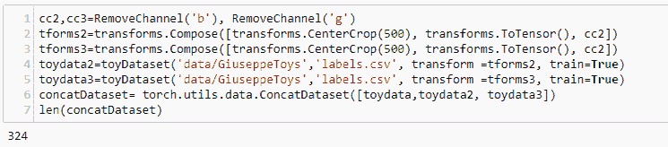

# 第一章：PyTorch 介绍

这是使用 PyTorch 框架进行深度学习的逐步介绍。PyTorch 是进入深度学习的一个绝佳起点，如果你对 Python 有一些了解，那么你会发现 PyTorch 是一个直观、高效和启发性的体验。快速原型设计实验和测试想法的能力是 PyTorch 的核心优势。再加上能够将实验转化为生产可部署资源的可能性，学习曲线挑战将得到丰富的回报。

PyTorch 是理解深度学习概念的相对简单和有趣的方式。你可能会惊讶于解决分类问题（如手写识别和图像分类）所需的代码行数是多么少。尽管说 PyTorch 是*易于使用*，但不能否认深度学习在很多方面都是*困难*的。它涉及一些复杂的数学和一些棘手的逻辑难题。然而，这不应该让人们忘记这一企业的有趣和有用部分。毫无疑问，机器学习可以为我们周围的世界提供深刻的见解，并解决重要的问题，但要到达那里可能需要一些工作。

本书试图不是简单地掠过重要的思想，而是以不带行话且简洁的方式解释它们。如果解决复杂的微分方程的想法让你感到心慌，你并不孤单。这可能与高中时期一位脾气暴躁的数学老师愤怒地要求你引用欧拉公式或三角恒等式有关。这是一个问题，因为数学本身应该是有趣的，洞察力并不是通过费力记忆公式而是通过理解关系和基础概念产生的。

深度学习看起来困难的另一个原因是其具有多样化和动态的研究前沿。对于新手来说，这可能会感到困惑，因为它并没有明显的入门点。如果你理解了一些原则并想测试你的想法，那么找到一个合适的工具集可能会是一个令人困惑的任务。开发语言、框架、部署架构等的组合呈现出一个非平凡的决策过程。

机器学习科学已经发展到一个阶段，即已经出现了一组通用算法来解决分类和回归等问题。随后，几个框架被创建出来，以利用这些算法的力量并将它们用于一般问题解决。这意味着入门点已经达到这样一个水平，以至于这些技术现在已经掌握在非计算机科学专业人士手中。各种领域的专家现在可以使用这些思想来推动他们的努力。通过本书，再加上一点奉献精神，你将能够构建和部署有用的深度学习模型，以帮助解决你感兴趣的问题。

在本章中，我们将讨论以下主题：

+   什么是 PyTorch？

+   安装 PyTorch

+   基本操作

+   加载数据

# 什么是 PyTorch？

PyTorch 是一种用于实验、研究和生产的动态张量深度学习框架。它可以作为 NumPy 的支持 GPU 的替代品，或者作为构建神经网络的灵活高效平台。动态图创建和紧密的 Python 集成使得 PyTorch 在深度学习框架中脱颖而出。

如果你对深度学习生态系统稍有了解，那么像 Theano 和 TensorFlow 这样的框架，或者更高级的衍生框架如 Keras，都是最受欢迎的。PyTorch 是深度学习框架中的相对新进者。尽管如此，它现在已经被 Google、Twitter 和 Facebook 广泛使用。它与其他框架的区别在于，Theano 和 TensorFlow 将计算图编码为静态结构，需要在封闭会话中运行。相反，PyTorch 可以动态实现计算图。对于神经网络来说，这意味着网络在运行时可以更改行为，几乎没有额外开销。而在 TensorFlow 和 Theano 中，要更改行为，实际上需要从头开始重建网络。

这种动态实现是通过一种称为基于“tape”的自动微分过程实现的，允许 PyTorch 表达式自动进行微分。这带来了许多优势。梯度可以即时计算，由于计算图是动态的，因此可以在每次函数调用时更改，允许在循环中和条件调用下以有趣的方式使用。PyTorch 的这种动态行为和极大的灵活性使其成为深度学习实验平台的首选。

PyTorch 的另一个优势是与 Python 语言的紧密集成。对于 Python 编程者来说，它非常直观，并且与 NumPy 和 SciPy 等其他 Python 包无缝交互。PyTorch 非常易于进行实验。它不仅是构建和运行有用模型的理想工具，还是通过直接实验理解深度学习原理的好方式。

如你所料，PyTorch 可以在多个**图形处理单元**（**GPUs**）上运行。深度学习算法可能需要大量计算资源，尤其是在处理大型数据集时更是如此。PyTorch 具有强大的 GPU 支持，在进程间智能地共享张量内存。这基本上意味着在 CPU 和 GPU 之间有一种高效且用户友好的方式来分配处理负载。这可以极大地减少测试和运行大型复杂模型所需的时间。

动态图生成，紧密集成 Python 语言，并且相对简单的 API 使得 PyTorch 成为研究和实验的优秀平台。然而，PyTorch 1 之前的版本存在缺陷，阻碍了其在生产环境中的卓越表现。这一不足正在 PyTorch 1 中得到解决。

研究是深度学习的一个重要应用，但越来越多地，深度学习被嵌入到在 Web 上、设备上或机器人中实时运行的应用程序中。这样的应用程序可能会处理成千上万个同时查询并与大规模动态数据交互。尽管 Python 是人类工作中最好的语言之一，但其他语言，如 C++和 Java，通常具有特定的效率和优化。即使构建特定深度学习模型的最佳方式可能是使用 PyTorch，但这可能不是部署它的最佳方式。这不再是一个问题，因为现在使用 PyTorch 1，我们可以导出 Python free 模型的 PyTorch 表示。

这是 Facebook 和 PyTorch 的主要利益相关者与微软合作的结果，创建了**开放神经网络交换**（**ONNX**），以帮助开发人员在不同框架之间转换神经网络模型。这导致了 PyTorch 与更适合生产的框架 CAFFE2 的合并。在 CAFFE2 中，模型由纯文本模式表示，使其与语言无关。这意味着它们更容易部署到 Android、iOS 或 Raspberry Pi 设备上。

有了这个想法，PyTorch 版本 1 扩展了其 API，包括生产就绪功能，如优化 Android 和 iPhone 的代码，一个**即时**（**JIT**）C++编译器，以及几种方式来创建*Python free*模型的表示。

总之，PyTorch 具有以下特点：

+   动态图表示

+   与 Python 编程语言紧密集成

+   高低级 API 混合使用

+   在多个 GPU 上实现简单

+   能够构建*Python-free*模型表示以进行导出和生产

+   使用 Caffe 框架扩展到大规模数据

# 安装 PyTorch

PyTorch 将在 macOS X、64 位 Linux 和 64 位 Windows 上运行。请注意，Windows 目前不提供（易于）支持 PyTorch 中 GPU 的使用。在安装 PyTorch 之前，您需要在计算机上安装 Python 2.7 或 Python 3.5 / 3.6，并记住为每个 Python 版本安装正确的版本。除非有理由不这样做，建议您安装 Anaconda Python 发行版。这可以从以下地址获取：[`anaconda.org/anaconda/python`](https://anaconda.org/anaconda/python)。

Anaconda 包括 PyTorch 的所有依赖项，以及在深度学习中必不可少的技术、数学和科学库。这些将在整本书中使用，因此，除非您想单独安装它们，否则请安装 Anaconda。

以下是我们在本书中将要使用的软件包和工具列表。它们都已经在 Anaconda 中安装好：

+   `NumPy`: 主要用于处理多维数组的数学库

+   `Matplotlib`: 用于绘图和可视化的库

+   `SciPy`: 用于科学和技术计算的软件包

+   `Skit-Learn`: 用于机器学习的库

+   `Pandas`: 用于处理数据的库。

+   `IPython`: 一种笔记本风格的代码编辑器，用于在浏览器中编写和运行代码。

安装了 Anaconda 之后，现在可以安装 PyTorch 了。请访问 PyTorch 网站：[`pytorch.org/`](https://pytorch.org/)。

此网站上的安装矩阵相当自解释。只需选择您的操作系统、Python 版本，以及如果您有 GPU，则选择您的 CUDA 版本，然后运行适当的命令。

与往常一样，在安装 PyTorch 之前确保您的操作系统和依赖包是最新的是个好习惯。Anaconda 和 PyTorch 支持 Windows、Linux 和 macOS，尽管 Linux 可能是最常用和最一致的操作系统。在本书中，我将使用 Python 3.7 和 Anaconda 3.6.5 运行在 Linux 上。

本书中的代码是在 Jupyter Notebook 上编写的，这些笔记本可以从该书的网站上获取。

您可以选择在本地自己的计算机上设置 PyTorch 环境，也可以选择在云服务器上远程设置。它们各有利弊。在本地工作的优势在于通常更容易和更快地开始。特别是如果您不熟悉 SSH 和 Linux 终端的话。只需安装 Anaconda 和 PyTorch，您就可以开始了。此外，您可以选择和控制自己的硬件，虽然这是一笔前期成本，但通常在长期来看更便宜。一旦您开始扩展硬件需求，云解决方案可能变得昂贵。在本地工作的另一个优势是可以选择和定制您的**集成开发环境**（**IDE**）。事实上，Anaconda 有自己出色的桌面 IDE 称为 Spyder。

在构建自己的深度学习硬件时，需要注意几件事情，您需要 GPU 加速：

+   使用 NVIDIA 兼容 CUDA 的 GPU（例如 GTX 1060 或 GTX 1080）。

+   至少具有 16 个 PCIe 通道的芯片组。

+   至少 16GB 的 RAM。

在云上工作确实提供了从任何计算机工作的灵活性，以及更容易地尝试不同的操作系统、平台和硬件。您还可以更轻松地分享和协作。通常可以廉价开始，每月几美元，甚至免费，但随着项目变得更复杂和数据密集，您需要支付更多的容量。

让我们简要看一下两个云服务器主机的安装过程：Digital Ocean 和 Amazon Web Services。

# Digital Ocean。

Digital Ocean 提供了进入云计算的最简单入口之一。它提供可预测的简单付款结构和直观的服务器管理。不幸的是，Digital Ocean 目前不支持 GPU。其功能围绕着*droplets*（预构建的虚拟专用服务器实例）展开。以下是设置 droplet 所需的步骤：

1.  在[Digital Ocean](https://www.digitalocean.com/)注册一个账号。前往[`www.digitalocean.com/.`](https://www.digitalocean.com/)

1.  点击“创建”按钮并选择“新建 Droplet**”。**

1.  选择 Linux 的 Ubuntu 发行版，并选择两千兆字节或以上的计划。

1.  如果需要，选择 CPU 优化。默认值应该足以开始使用。

1.  可选择设置公共/私有密钥加密。

1.  使用您收到的电子邮件中的信息设置 SSH 客户端（例如 PuTTY）。

1.  通过 SSH 客户端连接到您的 Droplet，并`curl`获取最新的 Anaconda 安装程序。您可以在[`repo.continuum.io/`](https://repo.continuum.io/)找到适合您特定环境的安装程序地址。

1.  使用以下命令安装 PyTorch：

```py
conda install pytorch torchvision -c pytorch
```

一旦您启动了您的 Droplet，您可以通过 SSH 客户端访问 Linux 命令。从命令提示符，您可以`curl`获取最新的 Anaconda 安装程序，地址是：[`www.anaconda.com/download/#linux`](https://www.anaconda.com/download/#linux)。

在[Digital Ocean 教程](https://repo.continuum.io/archive/)部分可以找到完整的逐步指南。

# 远程连接到 IPython

IPython 是通过 Web 浏览器编辑代码的简便方式。如果您使用桌面电脑，只需启动 IPython 并将浏览器指向`localhost:8888`。这是 IPython 服务器 Jupyter 运行的端口。然而，如果您在云服务器上工作，那么通过 SSH 隧道连接到 IPython 是处理代码的常见方式。连接到 IPython 的隧道包括以下步骤：

1.  在 SSH 客户端中，将目标端口设置为`localhost:8888`。在 PuTTY 中，转到 Connection | SSH | Tunnels。

1.  将源端口设置为大于`8000`以避免与其他服务冲突。点击添加。保存这些设置并打开连接。像往常一样登录到您的 Droplet。

1.  通过在服务器实例的命令提示符中键入`jupyter notebook`启动 IPython 服务器。

1.  通过将浏览器指向`localhost: source port`，例如`localhost:8001`，访问 IPython。

1.  启动 IPython 服务器。

请注意，您可能需要一个令牌第一次访问服务器。这可以从您启动 Jupyter 后的命令输出中获取。您可以直接复制此输出中给出的 URL 到浏览器的地址栏，并将端口地址更改为您的本地源端口地址，例如：`8001`，或者您可以选择将令牌（`token=`后面的部分）粘贴到 Jupyter 启动页面，并将其替换为将来方便使用的密码。现在，您应该能够打开、运行和保存 IPython 笔记本。

# 亚马逊网络服务（AWS）

AWS 是最初的云计算平台，以其高度可扩展的架构而闻名。它提供了广泛的产品。我们需要开始的是一个 EC2 实例。这可以从 AWS 控制面板的服务选项卡中访问。从那里，选择 EC2，然后启动实例。在这里，您可以选择所需的机器映像。AWS 提供了几种专门用于深度学习的机器映像类型。可以随意尝试任何其中的一个，但我们将在此使用的是适用于 Ubuntu 版本 10 的深度学习 AMI。它预装了 PyTorch 和 TensorFlow 的环境。选择完毕后，您可以选择其他选项。默认的 T2 微型实例，配备 2GB 内存，对于实验来说应该足够了；然而，如果您需要 GPU 加速，您将需要使用 T2 中型实例类型。最后，在启动实例时，系统将提示您创建和下载公共-私有密钥对。然后，您可以使用 SSH 客户端连接到服务器实例，并按照先前的说明进行到 Jupyter Notebook 的隧道。再次检查文档以获取更详细的信息。亚马逊采用按资源付费的模式，因此重要的是您监控您正在使用的资源，以确保不会收到任何不必要或意外的费用。

# PyTorch 的基本操作

张量是 PyTorch 的核心工具。如果您了解线性代数，它们相当于矩阵。Torch 张量实际上是`numpy.array`对象的扩展。张量是深度学习系统中重要的概念组成部分，因此理解它们的工作原理至关重要。

在我们的第一个示例中，我们将查看大小为 2 x 3 的张量。在 PyTorch 中，我们可以像创建 NumPy 数组一样创建张量。例如，我们可以传递嵌套列表，如下面的代码所示：


在这里，我们创建了两个维度为 2 x 3 的张量。您可以看到，我们创建了一个简单的线性函数（有关线性函数的更多信息，请参见第二章，*深度学习基础*），并将其应用于*x*和*y*，然后打印出结果。我们可以使用以下图表可视化这一点：


正如您可能从线性代数中知道的那样，矩阵乘法和加法是按元素进行的，因此对于*x*的第一个元素，我们将其写为*X[00]*。这与*Y[00]*相乘并加到*y*的第一个元素上，写为*Y[01] = 8，所以*f[01] = 4 + 12*。请注意，索引从零开始。

如果你从未见过任何线性代数，不要太担心，因为我们将在《深度学习基础》第二章中进行概述，并且很快你将开始使用 Python 索引。现在，只需将我们的 2 x 3 张量视为其中带有数字的表即可。

# 默认值初始化

有许多情况下我们需要将 torch 张量初始化为默认值。在这里，我们创建了三个 2 x 3 的张量，分别用零、一和随机浮点数填充它们：


在初始化随机数组时需要考虑的一个重要点是所谓的可重复性种子。看看当你多次运行上述代码时会发生什么。每次都会得到不同的随机数数组。在机器学习中经常需要能够重现结果。我们可以通过使用随机种子来实现这一点。这在下面的代码中进行了演示：


注意，当你多次运行这段代码时，张量的值保持不变。如果删除第一行中的种子，每次运行代码时张量的值将不同。不管你使用什么数字来种子随机数生成器，只要它是一致的，就能实现可重现的结果。

# 张量和 NumPy 数组之间的转换

将 NumPy 数组转换为张量就像对其执行一个操作一样简单。下面的代码应该清楚地表明这一点：


我们可以看到 torch 张量的类型结果。在许多情况下，我们可以互换地使用 NumPy 数组和张量，并始终确保结果是张量。然而，有时我们需要显式地从数组创建张量。这可以通过 `torch.from_numpy` 函数来实现：


要从张量转换为 NumPy 数组，只需调用 `torch.numpy()` 函数：


注意，我们使用了 Python 内置的 `type()` 函数，如 `type(object)`，而不是我们之前使用的 `tensor.type()`。NumPy 数组没有 `type` 属性是另一个重要的理解点。另外一个要注意的是，NumPy 数组和 PyTorch 张量共享同一内存空间。例如，看看当我们像下面的代码演示一样改变一个变量的值时会发生什么：


还要注意，当我们打印一个张量时，它返回一个元组，包含张量本身和其 `dtype`，或数据类型属性。这在这里非常重要，因为有些 `dtype` 的数组不能转换成张量。例如，考虑下面的代码：


这将生成一个错误消息，告诉我们只有支持的`dtype`能够被转换为张量。显然，`int8`不是其中之一。我们可以通过在传递给`torch.from_numpy`之前将我们的`int8`数组转换为`int64`数组来修复这个问题。我们可以使用`numpy.astype`函数来完成，如下面的代码所示：


了解`numpy dtype`数组如何转换为 torch `dtype`也非常重要。在前面的示例中，`numpy int32`转换为`IntTensor`。下表列出了 torch `dtype`及其对应的`numpy`类型：

| **NumPy 类型** | **dtype** | **Torch 类型** | **描述** |
| --- | --- | --- | --- |
| `int64` | `torch.int64` `torch.float` | `LongTensor` | 64 位整数 |
| `int32` | `torch.int32` `torch.int` | `IntegerTensor` | 32 位有符号整数 |
| `uint8 ` | `torch.uint8`  | `ByteTensor` | 8 位无符号整数 |
| `float64 double` | `torch.float64` `torch.double` | `DoubleTensor` | 64 位浮点数 |
| `float32` | `torch.float32` `torch.float` | `FloatTensor` | 32 位浮点数 |
|  | `torch.int16` `torch.short` | `ShortTensor` | 16 位有符号整数 |
|  | `torch.int8` | `CharTensor` | 6 位有符号整数 |

张量的默认`dtype`是`FloatTensor`；但是，我们可以使用张量的`dtype`属性指定特定的数据类型。例如，请看下面的代码：


# 切片、索引和重塑

`torch.Tensor` 具有大部分与 NumPy 相同的属性和功能。例如，我们可以像 NumPy 数组一样对张量进行切片和索引：


在这里，我们打印了`x`的第一个元素，写作*x[0]*，在第二个示例中，我们打印了`x`的第二个元素的一个切片；在这种情况下，*x[11]*和*x[12]*。

如果您还没有接触过切片和索引，可能需要再看一次。请注意，索引从`0`开始，而不是`1`，我们的下标符号保持与此一致。还请注意，切片`[1][0:2]`是元素*x[10]*和*x[11]*，包括*x[12]*。不包括切片结束索引`2`。

我们可以使用`view()`函数创建现有张量的重塑副本。以下是三个示例：


(`3`,`2`)和(`6`,`1`)很明显，但是第一个示例中的`–1`是什么意思？如果您知道需要多少列，但不知道需要多少行，这非常有用。在这里使用`–1`告诉 PyTorch 计算所需的行数。在没有其他维度的情况下使用它将创建一个单行张量。如果您不知道输入张量的形状，但知道它需要有三行，您可以像以下示例两样重新编写：


一个重要的操作是交换轴或转置。对于二维张量，我们可以使用 `tensor.transpose()`，传递我们想要转置的轴。在这个例子中，原始的 2 x 3 张量变成了一个 3 x 2 张量。行变成了列：


在 PyTorch 中，`transpose()` 只能同时交换两个轴。我们可以在多个步骤中使用 `transpose`；然而，一个更方便的方法是使用 `permute()`，传递我们想要交换的轴。以下示例应该能够清楚地说明这一点：


当我们考虑二维张量时，我们可以将它们视为平面表格。当我们移动到更高维时，这种视觉表现变得不可能。我们简单地耗尽了空间维度。深度学习的魔力之一是，数学上所涉及的内容并不太重要。现实世界的特征被编码到数据结构的一个维度中。因此，我们可能处理数千维的张量。虽然这可能令人不安，但大多数可以在二维或三维中说明的想法在更高维中同样适用。

# 就地操作

理解就地操作和赋值操作之间的区别很重要。例如，当我们使用 `transpose(x)` 时，会返回一个值，但 `x` 的值不会改变。在目前的所有示例中，我们一直在执行赋值操作。也就是说，我们将一个变量赋值给操作的结果，或者仅仅将其打印到输出中，就像前面的例子中所示。在任一情况下，原始变量保持不变。或者，我们可能需要就地应用操作。当然，我们可以将一个变量分配给自身，例如 `x = x.transpose(0,1)`；然而，更方便的方法是使用就地操作。一般来说，在 PyTorch 中，就地操作的函数名以下划线结尾。例如，查看以下代码示例：


作为另一个例子，这里是我们在本章开始时使用的线性函数，使用就地操作对 `y` 进行操作：


# 加载数据

大多数时间你会在深度学习项目上花费在处理数据上，一个深度学习项目失败的主要原因之一是因为糟糕或理解不足的数据。当我们使用众所周知且构建良好的数据集时，这个问题常常被忽视。这里的重点是学习模型。使深度学习模型工作的算法本身就足够复杂，不需要由于某些仅部分了解的东西（如不熟悉的数据集）而增加这种复杂性。现实世界的数据是嘈杂的、不完整的和容易出错的。这些混乱的轴意味着，如果一个深度学习算法在消除代码逻辑错误后仍未给出合理结果，那么糟糕的数据或对数据理解的错误很可能是问题的根源。

因此，暂时搁置我们与数据的斗争，并理解深度学习可以提供宝贵的现实世界见解，我们如何学习深度学习？我们的起点是尽可能消除我们能消除的变量。这可以通过使用众所周知且代表特定问题的数据来实现；例如分类问题。这使我们能够在深度学习任务中有一个起点，同时也有一个测试模型想法的标准。

最著名的数据集之一是手写数字的 MNIST 数据集，通常的任务是正确分类每个数字，从零到九。最好的模型的错误率约为 0.2%。我们可以对任何视觉分类任务应用这个表现良好的模型，并且会得到不同的结果。我们几乎不可能获得接近 0.2%的结果，原因在于数据的差异。理解如何调整深度学习模型以考虑数据中这些有时微妙的差异，是成功的深度学习从业者的关键技能之一。

考虑一个从彩色照片中进行面部识别的图像分类任务。任务仍然是分类，但数据类型和结构的差异决定了模型需要如何改变以考虑这一点。如何做到这一点是机器学习的核心。例如，如果我们处理彩色图像而不是黑白图像，我们将需要额外的两个输入通道。对于每个可能的类别，我们还需要输出通道。在手写分类任务中，我们需要 10 个输出通道，即每个数字一个通道。对于面部识别任务，我们会考虑为每个目标面孔（比如警方数据库中的罪犯）设置一个输出通道。

显然，数据类型和结构是重要考虑因素。图像数据在图像中的结构方式与音频信号或医疗设备输出的方式大不相同。如果我们试图通过声音来分类人名，或者通过症状来分类疾病会怎样？它们都是分类任务；然而，在每种具体情况下，代表每种情况的模型将大不相同。为了在每种情况下构建合适的模型，我们需要深入了解正在使用的数据。

本书不讨论每种数据类型、格式和结构的微妙和细微差别。我们能做的是为您提供有关 PyTorch 数据处理工具、技术和最佳实践的简要见解。深度学习数据集通常非常庞大，在内存中处理它们是一项重要考虑因素。我们需要能够转换数据、批量输出数据、洗牌数据，并在将数据馈送给模型之前执行许多其他操作。由于许多数据集太大，无法将整个数据集加载到内存中，因此我们需要能够执行所有这些操作。在处理数据时，PyTorch 采用对象方法，为每个特定的活动创建类对象。我们将在接下来的部分中更详细地讨论这一点。

# PyTorch 数据集加载器

PyTorch 包括几个数据集的数据加载器，帮助您快速入门。`torch.dataloader` 是用于加载数据集的类。以下是包括的 torch 数据集及其简要描述：

| **MNIST** | 手写数字 1-9。是 NIST 手写字符数据集的一个子集。包含 60,000 张训练图像和 10,000 张测试图像。 |
| --- | --- |
| **Fashion-MNIST** | 用于 MNIST 的一种替代数据集。包含时尚物品的图像；例如 T 恤、裤子、套头衫。 |
| **EMNIST** | 基于 NIST 手写字符，包括字母和数字，并分为 47、26 和 10 类分类问题。 |
| **COCO** | 超过 100,000 张分类为日常物体的图像；例如人、背包和自行车。每张图像可以有多个类别。 |
| **LSUN** | 用于大规模场景图像分类；例如卧室、桥梁、教堂。 |
| **Imagenet-12** | 大规模视觉识别数据集，包含 120 万张图像和 1000 个类别。使用 `ImageFolder` 类实现，其中每个类别都在一个文件夹中。 |
| **CIFAR** | 60,000 张低分辨率（32x32）彩色图像，分为 10 个相互排斥的类别；例如飞机、卡车和汽车。 |
| **STL10** | 类似于 CIFAR，但分辨率更高，并有更多未标记的图像。 |
| **SVHN** | 从谷歌街景获得的 60 万张街道数字图像。用于识别现实世界中的数字。 |
| **PhotoTour** | 学习本地图像描述符。由 126 个补丁组成的灰度图像，附带有描述符文本文件。用于模式识别。 |

这是一个典型的示例，展示了如何将其中一个数据集加载到 PyTorch 中：


`CIFAR10`是一个`torch.utils.dataset`对象。在这里，我们传递了四个参数。我们指定了一个相对于代码运行位置的根目录，一个布尔值`train`，表示我们想要加载的是测试集还是训练集，一个布尔值，如果设置为`True`，将检查数据集是否已经下载，如果没有则下载，以及一个可调用的 transform。在这种情况下，我们选择的 transform 是`ToTensor()`。这是`torchvision.transforms`中的一个内置类，使得该类返回一个 tensor。我们将在本章的后面更详细地讨论 transforms。

可以通过简单的索引查找来获取数据集的内容。我们还可以使用`len`函数检查整个数据集的长度。我们也可以按顺序遍历数据集。以下代码演示了这一点：


# 显示图像

`CIFAR10`数据集对象返回一个元组，包含一个图像对象和表示图像标签的数字。从图像数据的大小可以看出，每个样本是一个 3 x 32 x 32 的张量，代表图像中 322 个像素的三种颜色值。需要注意的是，这与`matplotlib`使用的格式不完全相同。张量处理的图像格式是`[颜色，高度，宽度]`，而`numpy`图像的格式是`[高度，宽度，颜色]`。要绘制图像，我们需要使用`permute()`函数交换轴，或者将其转换为 NumPy 数组并使用`transpose`函数。请注意，我们不需要将图像转换为 NumPy 数组，因为`matplotlib`将正确显示调整后的张量。以下代码应该能够清楚地表明这一点：


# DataLoader

在深度学习模型中，我们可能并不总是希望一次加载一个图像，或者每次以相同顺序加载它们。出于这个原因等等，使用`torch.utils.data.DataLoader`对象通常更好。`DataLoader`提供了一个多功能迭代器，可以按指定的方式对数据进行采样，例如按批次或随机顺序。它还是在多处理器环境中分配工作线程的便利位置。

在下面的示例中，我们以每批四个样本的方式对数据集进行采样：


这里 `DataLoader` 返回一个包含两个张量的元组。第一个张量包含批次中所有四个图像的图像数据。第二个张量是图像的标签。每个批次由四个图像标签对或样本组成。在迭代器上调用 `next()` 生成下一组四个样本。在机器学习术语中，对整个数据集的每次遍历称为一个 epoch。正如我们将看到的，这种技术被广泛用于训练和测试深度学习模型。

# 创建自定义数据集

`Dataset` 类是表示数据集的抽象类。它的目的是以一致的方式表示数据集的特定特征。当我们使用不熟悉的数据集时，创建一个 `Dataset` 对象是理解和表示数据结构的好方法。它与 `data loader` 类一起使用，以清晰和高效的方式从数据集中抽取样本。下图说明了这些类的使用方式：


我们使用 `Dataset` 类执行的常见操作包括检查数据的一致性，应用转换方法，将数据分为训练集和测试集，并加载单个样本。

在以下示例中，我们使用一个小型玩具数据集，其中包含被分类为玩具或非玩具的对象图像。这代表了一个简单的图像分类问题，其中模型在一组标记图像上进行训练。深度学习模型需要以一致的方式应用各种转换后的数据。样本可能需要分批抽取并对数据集进行洗牌。拥有表示这些数据任务的框架极大地简化和增强了深度学习模型。

完整的数据集可在 [`www.vision.caltech.edu/pmoreels/Datasets/Giuseppe_Toys_03/`](http://www.vision.caltech.edu/pmoreels/Datasets/Giuseppe_Toys_03/) 上找到。

对于本示例，我创建了数据集的一个较小子集，以及一个 `labels.csv` 文件。这在本书的 GitHub 仓库中的 `data/GiuseppeToys` 文件夹中可以找到。表示这个数据集的类如下所示：


`__init__` 函数是我们初始化类的所有属性的地方。因为它仅在我们首次创建实例时调用一次来执行所有操作，所以我们执行所有的日常管理功能，例如读取 CSV 文件，设置变量并检查数据的一致性。我们只执行整个数据集都会发生的操作，因此我们不下载负载（在这个例子中是图像），但是我们确保数据集的关键信息，如目录路径、文件名和数据集标签被存储在变量中。

`__len__`函数简单地允许我们在数据集上调用 Python 的内置`len()`函数。在这里，我们只需返回标签元组列表的长度，指示数据集中的图像数量。我们希望保持其尽可能简单和可靠，因为我们依赖它正确迭代数据集。

`__getitem__`函数是我们在`Dataset`类定义中覆盖的内置 Python 函数。这使得`Dataset`类具有 Python 序列类型的功能，例如索引和切片的使用。这个方法经常被调用——每当我们进行索引查找时都会调用一次，因此确保它只执行检索样本所需的操作。

要将此功能应用于我们自己的数据集中，我们需要创建我们自定义数据集的实例，如下所示：


# 转换

除了`ToTensor()`转换之外，`torchvision`包还包含一些专门用于 Python 图像库图像的转换。我们可以使用`compose`函数将多个转换应用于数据集对象，如下所示：


`Compose`对象本质上是可以作为单个变量传递给数据集的一系列转换。重要的是要注意图像转换只能应用于 PIL 图像数据，而不能应用于张量。由于在`Compose`列表中按照列出的顺序应用转换，因此`ToTensor`转换放置在 PIL 转换之前会生成错误。

最后，我们可以通过使用`DataLoader`加载带有转换的图像批次来检查所有功能是否正常，就像之前做的那样：


# ImageFolder

我们可以看到数据集对象的主要功能是从数据集中获取样本，而`DataLoader`函数的功能是向深度学习模型提供样本或样本批次进行评估。在编写自己的数据集对象时，需要考虑的主要事项之一是如何从磁盘上组织的文件中的数据构建可访问内存中的数据结构。我们可能希望组织数据的常见方式是按类别命名的文件夹。假设在这个例子中，我们有三个名为`toy`、`notoy`和`scenes`的文件夹，包含在名为`images`的父文件夹中。每个文件夹表示其中包含的文件的标签。我们需要能够加载它们同时保持它们作为单独的标签。幸运的是，有一个专门用于此的类，并且像大多数 PyTorch 中的东西一样，它非常易于使用。这个类是`torchvision.datasets.ImageFolder`，使用方法如下：


在`data/GiuseppeToys/images`文件夹中，有三个文件夹，`toys`、`notoys`和`scenes`，其中包含以其文件夹名称表示标签的图像。请注意，使用`DataLoader`检索的标签由整数表示。由于本示例中有三个文件夹，表示三个标签，`DataLoader`返回整数`1`到`3`，表示图像标签。

# 连接数据集

很明显，将需要连接数据集——我们可以使用`torch.utils.data.ConcatDataset`类来实现这一点。`ConcatDataset`接受一个数据集列表，并返回一个连接后的数据集。在以下示例中，我们添加了两个额外的转换，去除蓝色和绿色通道。然后，我们创建了两个应用了这些转换的数据集对象，并最终将这三个数据集连接成一个，如下所示的代码所示：



# 总结

在本章中，我们介绍了 PyTorch 的一些特性和操作。我们概述了安装平台和流程。您现在应该对张量操作有所了解，并了解如何在 PyTorch 中执行这些操作。您应该清楚地区分了就地操作和通过赋值操作，并且现在应该理解张量索引和切片的基础知识。在本章的后半部分，我们看了如何将数据加载到 PyTorch 中。我们讨论了数据的重要性，以及如何创建表示自定义数据集的`dataset`对象。我们查看了 PyTorch 中的内置数据加载器，并讨论了如何使用`ImageFolder`对象表示文件夹中的数据。最后，我们看了如何连接数据集。

在下一章中，我们将快速浏览深度学习基础知识及其在机器学习中的地位。我们将带您快速了解涉及的数学概念，包括查看线性系统及其常见解决技术。
