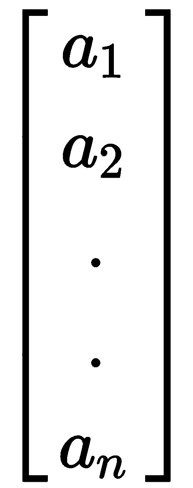
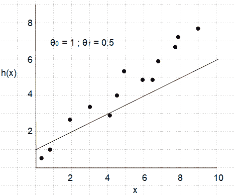
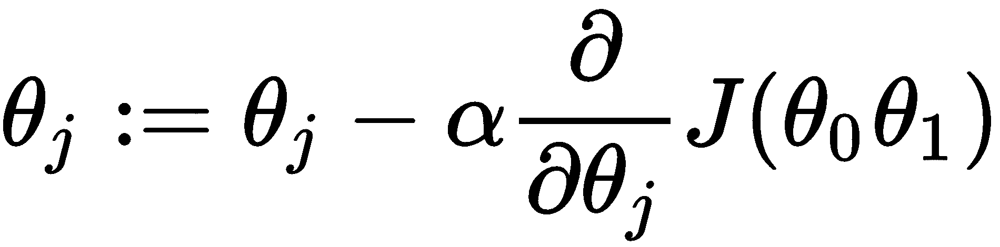

# 深度学习基础

深度学习通常被认为是机器学习的一个子集，涉及**人工神经网络**（**ANNs**）的训练。人工神经网络处于机器学习的前沿。它们有能力解决涉及海量数据的复杂问题。机器学习的许多原则在深度学习中也同样重要，因此我们将在这里花一些时间进行回顾。

在本章中，我们将讨论以下主题：

+   机器学习方法

+   学习任务

+   特征

+   模型

+   人工神经网络

# 机器学习方法

在一般的机器学习出现之前，如果我们想要构建一个垃圾邮件过滤器，我们可以先编制一个常出现在垃圾邮件中的单词列表。然后垃圾邮件检测器会扫描每封电子邮件，当黑名单单词的数量达到阈值时，该电子邮件将被分类为垃圾邮件。这被称为基于规则的方法，如下图所示：

该方法的问题在于，一旦垃圾邮件的撰写者知道了规则，他们就能够制作避开这一过滤器的邮件。负责维护这个垃圾邮件过滤器的人们将不得不不断更新规则列表。通过机器学习，我们可以有效地自动化这个规则更新过程。我们不再需要撰写一长串规则，而是构建和训练一个模型。作为一个垃圾邮件检测器，它将更加准确，因为它可以分析大量数据。它能够检测到数据中的模式，这在有限的时间内对人类来说是不可能做到的。下图说明了这种方法：

有很多种方法可以用来处理机器学习问题，这些方法大致可以根据以下因素进行分类：

+   模型是否是用标记的训练数据进行训练。这里有几种可能性，包括完全监督、半监督、基于强化的或完全无监督的方法。

+   它们是**在线**的（即在提供新数据时即时学习），还是使用预先存在的数据进行学习。这被称为批量学习。

+   它们是基于实例的，只是简单地比较新数据与已知数据，还是基于模型的，涉及检测模式并构建预测模型。

这些方法并不是互斥的，大多数算法都是这些方法的组合。例如，构建一个垃圾邮件检测器的典型方式是使用在线的、基于模型的监督学习算法。

# 学习任务

有几种明显不同的学习任务类型，这些类型部分由它们处理的数据类型定义。基于这一点，我们可以将学习任务分为两大类：

+   **无监督学习**：数据没有标签，因此算法必须推断变量之间的关系或通过找到相似变量的群集来学习。

+   **监督学习**：使用标记数据集构建推断函数，该函数可用于预测未标记样本的标签

数据是否有标签对学习算法的构建方式有着预设的影响。

# 无监督学习

监督学习的一个主要缺点是需要准确标记的数据。大多数现实世界的数据是未标记和非结构化的，这是机器学习和人工智能更广泛努力的主要挑战。无监督学习在发现非结构化数据中的结构方面起重要作用。监督学习和无监督学习之间的区分并不是绝对的。许多无监督算法与监督学习一起使用；例如，在数据只有部分标记或者我们试图找出深度学习模型最重要特征时。

# 聚类

这是最直接的无监督方法之一。在许多情况下，数据是否有标签并不重要；我们关心的是数据聚集在某些点附近的事实。例如，推荐系统可以利用聚类技术推荐在线商店的电影或书籍。在这里，算法分析客户的购买历史，将其与其他客户进行比较，并根据相似性进行推荐。该算法将客户的使用模式*聚类*成群组。在任何时候，算法都不知道这些群组是什么；它能够自行解决这个问题。最常用的聚类算法之一是**k-means**。该算法通过建立基于观察样本均值的聚类中心来运作。

# 主成分分析

另一种无监督方法，通常与监督学习一起使用的是**主成分分析**（**PCA**）。当我们有大量可能相关的特征并且不确定每个特征对确定结果的影响时，可以使用此方法。例如，在天气预测中，我们可以将每个气象观测作为一个特征直接输入模型。这意味着模型需要分析大量数据，其中许多数据是无关的。此外，数据可能相关，因此我们不仅需要考虑单个特征，还需要考虑这些特征如何相互作用。我们需要的是一种工具，能够将这些可能相关和冗余的特征减少到少数几个主成分。PCA 属于一种称为**降维**的算法，因为它减少了输入数据集的维数。

# 强化学习

强化学习与其他方法有些不同，并且通常被归类为无监督方法，因为它使用的数据并非以监督方式标记。强化学习可能更接近人类与世界互动和学习的方式。在强化学习中，学习系统被称为一个**代理**，这个代理通过观察和执行**动作**与**环境**互动。每个动作会导致**奖励**或**惩罚**。代理必须制定策略或**策略**，以在时间内最大化奖励并最小化惩罚。强化学习在许多领域有应用，如博弈论和机器人技术，算法必须学习其环境，而无需直接人类提示。

# 监督学习

在监督学习中，机器学习模型在标记数据集上进行训练。到目前为止，大多数成功的深度学习模型都集中在监督学习任务上。通过监督学习，每个数据实例（如图像或电子邮件）都有两个元素：通常表示为大写*X*的一组特征，以及用小写*y*表示的标签。有时，标签也称为目标或答案。

监督学习通常分为两个阶段进行：训练阶段，模型在此阶段学习数据的特征；测试阶段，对未标记数据进行预测。重要的是，模型在不同的数据集上进行训练和测试，因为目标是对新数据进行泛化，而不是精确学习单一数据集的特征。这可能导致常见的过拟合训练集的问题，从而导致在测试数据集上欠拟合的问题。

# 分类

分类可能是最常见的监督学习任务。基于输入和输出标签的数量，分类问题有几种类型。分类模型的任务是在输入特征中找到模式，并将此模式与一个标签关联起来。模型应该学习数据的区分特征，然后能够预测未标记样本的标签。模型本质上是从训练数据中构建一个推断函数。我们马上会看到这个函数是如何构建的。我们可以区分三种类型的分类模型：

+   **二分类**：就像我们的玩具示例一样，这涉及区分两个标签。

+   **多标签分类**：涉及区分两个以上的类别。例如，如果将玩具示例扩展到区分图像中的玩具类型（汽车、卡车、飞机等）。解决多标签分类问题的常见方法是将问题分解为多个二进制问题。

+   **Multiple output classification**: 每个样本可能有多个输出标签。例如，也许任务是分析场景图像并确定其中的玩具类型。每个图像可以有多种类型的玩具，因此具有多个标签。

# 评估分类器

您可能认为衡量分类器性能的最佳方法是计算成功预测的比例与总预测量之比。然而，考虑一个关于手写数字数据集的分类任务，目标是所有不是 7 的数字。仅猜测每个样本不是 7 将给出一个成功率，假设数据均匀分布，为 90%。在评估分类器时，我们必须考虑四个变量：

+   **TP true positive**: 正确识别目标的预测

+   **TN true negative**: 正确识别非目标的预测

+   **FP false positive**: 错误识别目标的预测

+   **FN false negative**: 错误识别非目标的预测

*精确率*和*召回率*是常一起用来衡量分类器性能的两个指标。*精确率*由以下方程定义：

*召回率*由以下方程定义：

我们可以将这些想法结合在所谓的混淆矩阵中。它被称为混淆矩阵，并不是因为它难以理解，而是因为它总结了分类器混淆目标的情况。下面的图表应该能更清晰地说明这一点：

在确定分类器的成功与否时，我们使用哪种度量或赋予更多权重，实际上取决于应用程序。精确率和召回率之间存在权衡。提高精确率通常会导致召回率降低。例如，增加真阳性的数量通常意味着假阳性率增加。精确率和召回率的合理平衡取决于应用程序的要求。例如，在癌症医学检测中，我们可能需要更高的精确率，因为假阴性意味着癌症实例未被诊断出来，可能导致致命后果。

# 特征

重要的是要记住，图像检测模型不是看到图像，而是一组像素颜色值，或者在垃圾邮件过滤器中，是电子邮件中的字符集合。这些是模型的原始特征。机器学习的一个重要部分是特征转换。我们已经讨论过的一个特征转换是关于主成分分析的降维。以下是常见的特征转换列表：

+   降维以减少特征数量，使用主成分分析等技术

+   缩放或归一化特征使其处于特定的数值范围内

+   转换特征数据类型（例如，将类别分配给数字）

+   添加随机或生成的数据以增加特征

每个特征被编码到我们输入张量 *X* 的一个维度上，为了使学习模型尽可能高效，需要尽量减少特征数量。这就是主成分分析和其他降维技术发挥作用的地方。

另一个重要的特征转换是缩放。当特征的比例不同时，大多数机器学习模型表现不佳。用于特征缩放的两种常见技术是：

+   **归一化或最小-最大缩放**：值被移动和重新缩放到 0 到 1 之间。这是神经网络中最常用的缩放方法。

+   **标准化**：减去均值并除以方差。这并不将变量限制在特定范围内，但结果分布具有单位方差。

# 处理文本和类别

当一个特征是一组类别而不是一个数字时，我们该怎么办？假设我们正在构建一个预测房价的模型。该模型的一个特征可能是房屋的外包材料，可能的值包括木材、铁和水泥。我们如何编码这个特征以供深度学习模型使用？显而易见的解决方案是简单地为每个类别分配一个实数：比如木材为 1，铁为 2，水泥为 3。这种表示方法的问题在于它推断类别值是有序的。也就是说，木材和铁比木材和水泥更接近。

避免这种情况的一种解决方案是**独热编码**。特征值被编码为二进制向量，如下表所示：

| **木材** | 1 | 0 | 0 |
| --- | --- | --- | --- |
| **铁** | 0 | 1 | 0 |
| **水泥** | 0 | 0 | 1 |

当类别值的数量较少时，这种解决方案效果很好。例如，如果数据是一个文本语料库，我们的任务是自然语言处理，使用独热编码是不实际的。类别值的数量，因此特征向量的长度，是词汇表中单词的数量。在这种情况下，特征向量变得庞大且难以管理。

独热编码使用称为稀疏表示的方法。大多数值为 0。除了不太适合缩放外，独热编码在自然语言处理中还有另一个严重的缺点。它不编码单词的含义或其与其他单词的关系。我们可以使用的一种方法称为密集词嵌入。词汇表中的每个单词由一个实数向量表示，表示特定属性的分数。总体思想是，这个向量编码与当前任务相关的语义信息。例如，如果任务是分析电影评论并根据评论确定电影的类型，我们可以创建如下表所示的词嵌入：

| **词语** | **戏剧** | **喜剧** | **纪录片** |
| --- | --- | --- | --- |
| 有趣 | -4 | 4.5 | 0 |
| 操作 | 3.5 | 2.5 | 2 |
| 悬疑 | 4.5 | 1.5 | 3 |

这里，最左边的列列出可能出现在电影评论中的单词。每个单词根据其在相应类型的评论中出现的频率得分。我们可以从分析带标签的电影评论的监督学习任务中构建这样一个表格。然后，可以将训练过的模型应用于非标记的评论，以确定最可能的类型。

# 模型

在机器学习中，选择模型表示是一项重要任务。到目前为止，我们一直把模型称为黑盒子。一些数据被输入，基于训练，模型进行预测。在我们打开这个黑盒子之前，让我们回顾一些我们需要理解深度学习模型所需的线性代数知识。

# 线性代数复习

线性代数涉及通过使用矩阵来表示线性方程。在高中教的代数中，我们关注的是标量，也就是单个数字值。我们有方程式，以及操作这些方程式的规则，以便它们可以被评估。当我们使用矩阵而不是标量值时，情况也是如此。让我们回顾一些涉及的概念。

矩阵只是一个数字的矩形数组。我们看到，通过简单地添加每个对应的元素来添加两个矩阵。可以通过简单地将数组中的每个元素乘以标量来将矩阵乘以标量，如下例所示：

这是矩阵加法的一个例子，正如您预期的那样，您可以以相同的方式执行矩阵减法，除了当然，不是添加对应的元素，而是减去它们。请注意，我们只能添加或减去相同大小的矩阵。

另一个常见的矩阵操作是乘以一个标量：

注意我们使用的索引风格：*X*[*ij*]，其中*i*表示行，*j*表示列。在索引方面有两种惯例。这里，我使用的是零索引；即索引从零开始。这是为了与我们在 PyTorch 中索引张量的方式保持一致。请注意，在一些数学文本中，以及取决于您使用的编程语言，索引可能从 1 开始。此外，我们将矩阵的大小或维度称为*m*乘以*n*，其中*m*是行数，*n*是列数。例如，*A*和*B*都是 3 x 2 矩阵。

有一个矩阵的特殊情况称为向量。这只是一个*n*乘以 1 的矩阵，所以它有一列和任意数量的行，如下例所示：

现在让我们看看如何将一个向量与一个矩阵相乘。在下面的例子中，我们将一个 3 x 2 矩阵与一个大小为 2 的向量相乘：

一个具体的例子可能会使这一点更清楚：

请注意，这里，3 x 2 矩阵的结果是一个 3 向量，在一般情况下，乘以向量的*m*行矩阵将导致一个*m*大小的向量。

我们还可以通过结合矩阵向量乘法来将矩阵与其他矩阵相乘，如以下示例所示：

这里：

另一种理解方式是，我们通过将矩阵*A*与矩阵*B*的第一列组成的向量相乘，得到矩阵*C*的第一列。我们通过将矩阵*A*与从矩阵*B*的第二列获得的向量相乘，得到矩阵*C*的第二列。

让我们看一个具体的例子：

重要的是要理解，只有在矩阵*A*的行数等于矩阵*B*的列数时，我们才能相乘两个矩阵。结果矩阵的行数始终与矩阵*A*相同，并且列数与矩阵*B*相同。请注意，矩阵乘法不是交换的，如下所示：

然而，矩阵乘法是结合的，如下例所示：

矩阵非常有用，因为我们可以用相对简单的方程表示大量操作。对于机器学习来说，有两个矩阵运算特别重要：

+   转置

+   逆矩阵

要转置矩阵，我们只需交换列和行，如以下示例所示：

寻找矩阵的逆矩阵稍微复杂一些。在实数集中，数字 1 扮演**单位**的角色。也就是说，数字 1 乘以任何其他等于那个数字的数字。几乎每个数字都有一个逆元；也就是说，一个乘以自己等于 1 的数字。例如，2 的逆元是 0.5，因为 2 乘以 0.5 等于 1。矩阵和张量也有类似的概念。单位矩阵沿其主对角线为 1，其他位置为 0，如以下 3 x 3 示例所示：

当我们乘以一个逆矩阵时，单位矩阵是其结果。我们用以下方式表示：

重要的是，我们只能找到方阵的逆矩阵。不要期望手工计算逆矩阵，或者说实际上，任何矩阵操作。这是计算机擅长的。矩阵求逆是一个非平凡的操作，即使对于计算机来说，也是计算密集型的。

# 线性模型

在机器学习中，我们将遇到的最简单的模型是线性模型。解决线性模型在许多不同的设置中都很重要，并且它们是许多非线性技术的基础。使用线性模型，我们试图将训练数据拟合成一个线性函数，有时称为**假设函数**。这是通过线性回归的过程完成的。

单变量线性回归的假设函数具有以下形式：

在这里，*θ[0]* 和 *θ[1]* 是模型的**参数**，*x* 是单个独立变量。对于我们的房价示例，*x* 可以代表房屋的地板面积大小，*h(x)* 可以代表预测的房价。

为简单起见，我们将首先看一下只有单变量或单特征的情况。

在下图中，我们展示了许多点，代表着训练数据，并尝试将一条直线拟合到这些点上：

这里，*x* 是单个特征，**θ*[0]** 和 **θ*[1]** 分别表示假设函数的截距和斜率。我们的目标是找到**θ*[0]** 和 **θ*[1]** 这两个模型参数的数值，这将使我们在上图中得到最佳拟合直线。在这张图中，**θ*[0]** 被设为 **1**，**θ*[1]** 被设为 **0.5**。因此，直线的截距是 **1**，斜率为 **0.5**。我们可以看到大多数训练点位于直线上方，只有少数数值较低的点位于直线下方。我们可以猜测 **θ*[1]** 可能略低，因为训练点似乎具有稍陡的斜率。而且 **θ*[0]** 太高，因为左侧有两个数据点位于直线下方，截距似乎略低于 **1**。

很明显，我们需要一种正式的方法来找出假设函数中的误差。这是通过所谓的**代价函数**完成的。代价函数衡量假设函数给出的值与数据实际值之间的总误差。本质上，损失函数对每个点的假设值与实际值之间的距离进行求和。代价函数有时也被称为**均方误差**（**MSE**）。其表达式如下：

在这里，*hθ* 是假设函数对第*i*个训练样本计算出的值，*y^i* 是其实际值。差值被平方是为了统计上的便利性，因为它确保结果始终为正。平方还会增加较大差异的权重；也就是说，它对离群值更加重视。将这些平方误差之和除以训练样本数*m*，可以计算得到均值。此外，将和除以 2 可以使后续的数学运算更为简单。

最后一部分是调整参数值，使得假设函数尽可能地拟合训练数据。我们需要找到能够最小化误差的参数值。

我们可以通过两种方式实现这一点：

+   使用梯度下降迭代训练集并调整参数以最小化成本函数。

+   直接计算模型参数，使用*闭合形式*方程式

# 梯度下降

梯度下降是一种通用的优化算法，具有广泛的应用。梯度下降通过迭代调整模型参数来最小化成本函数。梯度下降通过对成本函数进行偏导数来实现。如果我们将成本函数绘制为参数值的函数，它形成一个凸函数，如下图所示：

当我们在图表中从右向左变化 *θ* 时，成本 *J[θ]* 减少至最小值，然后上升。目标是在梯度下降的每次迭代中，成本更接近最小值，一旦达到最小值就停止。这是通过以下更新规则实现的：

在这里，*α* 是**学习率**，一个可设置的**超参数**。它被称为超参数，以区别于模型参数 theta。偏导数项是成本函数的斜率，需要分别计算 theta *0* 和 theta *1* 的值。当导数和因此斜率为正数时，会从 theta 的先前值中减去正值，在图表中从右向左移动。相反，如果斜率为负数，则 theta 增加，从右向左移动。此外，在最小值处，斜率为零，因此梯度下降会停止。这正是我们想要的，因为无论我们从何处开始梯度下降，更新规则都确保将 theta 向最小值移动。

将成本函数代入上述方程，然后分别对 theta 的两个值进行导数运算，结果得到以下两个更新规则，即以下两个方程：

在迭代和后续更新中，θ将收敛到能够最小化成本函数的值，从而得到最佳拟合的直线。有两件事需要考虑。首先是θ的初始化值；也就是说，我们从哪里开始梯度下降。在大多数情况下，随机初始化效果最好。另一件需要考虑的事情是设置学习率α。这是一个介于零和一之间的数字。如果学习率设置得太高，它可能会超过最小值。如果设置得太低，它将需要较长时间收敛。可能需要对使用的特定模型进行一些实验；在深度学习中，通常会使用自适应学习率以获得最佳结果。这是指在梯度下降的每次迭代中学习率通常会变小。

到目前为止，我们讨论的梯度下降类型称为**批量梯度下降**（**BGD**）。这是因为每次更新时都使用整个训练集。这意味着随着训练集的增大，批量梯度下降变得越来越慢。另一方面，当特征数量很大时，批量梯度下降的性能更好，因此在训练集较小但特征较多时通常会使用它。

一种替代批量梯度下降的方法是**随机梯度下降**（**SGD**）。与使用整个训练集计算梯度不同，SGD 在每次迭代中随机选择一个样本计算梯度。SGD 的优势在于不需要整个训练集一次性存储在内存中，因为每次迭代只处理一个实例。因为随机梯度下降是随机选择样本，其行为比批量梯度下降稍显不规则。使用批量梯度下降时，每次迭代都会平滑地将误差（*J[θ]*）向最小值移动。而使用 SGD 时，并不是每次迭代都能使成本函数更接近最小值。它往往会有些许跳跃，平均而言才会向最小值移动。这意味着它可能会在最小值附近跳动，但在完成迭代时可能并未真正到达最小值。SGD 的随机性在存在多个最小值时可以派上用场，因为它可能会跳出局部最小值找到全局最小值。例如，请考虑以下成本函数：

如果批量梯度下降从**局部最小值**的右侧开始，它将无法找到**全局最小值**。幸运的是，线性回归的成本函数始终是一个具有单一最小值的凸函数。然而，并非总是如此，特别是在神经网络中，成本函数可能具有多个局部最小值。

# 多个特征

在一个实际的例子中，我们会有多个特征，每个特征都有一个关联的参数值需要拟合。我们将多个特征的假设函数写成如下形式：

这里，*x[0]*称为偏置变量并设为 1，*x[1]*到*x[n]*是特征值，*n*是特征的总数。请注意，我们可以编写假设函数的向量化版本。在这里，*θ*是**参数向量**，*x*是**特征向量**。

成本函数与单特征情况基本相同；我们只是在求和误差时需要调整梯度下降规则，并明确所需的符号表示。在单特征梯度下降的更新规则中，我们使用了参数值*θ[0]*和*θ[1]*的符号表示。对于多特征版本，我们简单地将这些参数的值及其关联的特征包装成向量。参数向量表示为*θ[j]*，其中下标*j*表示特征，是介于 1 到*n*之间的整数，*n*是特征的数量。

每个参数都需要有单独的更新规则。我们可以将这些规则概括如下：

每个参数都有一个更新规则；因此，例如特征*j = 1*的参数的更新规则如下：

变量*x^((i))*和*y^((i))*，如单特征示例中所述，分别指预测值和第*i*个训练样本的实际值。然而，在多特征情况下，它们不再是单个值，而是向量。值*x[j]^((i))*指训练样本*i*的特征*j*，*m*是训练集中样本的总数。

# 正规方程

对于某些线性回归问题，闭式解，也称为**正规方程**，是寻找θ的最优值的更好方法。如果你了解微积分，那么为了最小化代价函数，你可以找到代价函数的偏导数，对每个θ的值设为零，然后求解每个θ的值。如果你对微积分不熟悉，不用担心；事实证明，我们可以从这些偏导数中推导出正规方程，结果如下方程所示：

你可能会想知道为什么我们需要费心使用梯度下降及其带来的额外复杂性，因为正规方程允许我们在一步中计算参数。原因是求逆矩阵所需的计算工作并不可忽视。当特征矩阵*X*变得很大时（请记住*X*是一个包含每个训练样本特征值的矩阵），找到这个矩阵的逆仅需太长时间。尽管梯度下降涉及多次迭代，但对于大数据集来说，仍然比正规方程快。

正规方程的一个优势是，与梯度下降不同，它不要求特征具有相同的尺度。正规方程的另一个优点是不需要选择学习率。

# 逻辑回归

我们可以使用线性回归模型通过找到分割两个预测类别的决策边界来进行二元分类。一个常见的方法是使用定义如下的`sigmoid`函数：

`sigmoid`函数的图像如下所示：

`sigmoid`函数可以用于假设函数中，以输出概率，如下所示：

在这里，假设函数的输出是在参数化为θ的条件下，*y = 1* 的概率。为了决定何时预测*y = 0*或*y = 1*，我们可以使用以下两条规则：

`sigmoid`函数的特性（即在*z = 0*时有渐近线为*0*和*1*，并且在*z = 0*时的值为*0.5*），在逻辑回归问题中具有一些吸引人的特性。请注意，决策边界是模型参数的属性，而不是训练集的属性。我们仍然需要调整参数以使成本或误差最小化。为此，我们需要形式化我们已经知道的内容。

我们有一个包含*m*个样本的训练集，如下所示：

每个训练样本由大小为*n*的特征向量*x*组成，其中*n*是特征数量：

每个训练样本还包括一个值*y*，对于逻辑回归来说，这个值要么是零，要么是一。我们还有一个逻辑回归的假设函数，可以重写为以下方程：

使用逻辑回归的假设函数，采用与线性回归相同的成本函数，我们通过`sigmoid`函数引入了非线性。这意味着成本函数不再是凸函数，因此可能存在多个局部最小值，这对梯度下降来说可能是个问题。事实证明，对于逻辑回归而言，一个良好的函数并且导致凸成本函数的函数如下所示：

我们可以为这两种情况绘制这些函数图。

从先前的图表中可以看出，当标签**y**等于**1**而假设值预测为**0**时，成本趋向无穷大。同样，当**y**的实际值为**0**而假设值预测为**1**时，成本也上升至无穷大。或者，当假设值预测正确的值，即**0**或**1**时，成本降至**0**。这正是逻辑回归所期望的。

现在我们需要应用梯度下降来最小化成本。我们可以将二元分类的逻辑回归成本函数重新写成更简洁的形式，通过以下方程对多个训练样本求和：

最后，我们可以使用以下更新规则更新参数值：

表面上看，这与线性回归的更新规则看起来一样；然而，假设是`sigmoid`函数的函数，因此其行为实际上有很大不同。

# 非线性模型

我们已经看到，仅靠线性模型无法表示非线性的现实世界数据。一个可能的解决方案是向假设函数添加多项式特征。例如，一个立方模型可以用以下方程表示：

在这里，我们需要选择两个派生特征添加到我们的模型中。这些添加的项可以简单地是房屋示例中尺寸特征的平方和立方。

在添加多项式项时，一个重要的考虑因素是特征缩放。该模型中的平方和立方项的尺度会有很大的不同。为了使梯度下降正确工作，必须对这些添加的多项式项进行缩放。

选择多项式项是向模型注入知识的一种方式。例如，仅仅知道房价在相对于房屋面积增大时趋于平稳，就建议添加平方和立方项，以便使数据呈现我们期望的形状。然而，在特征选择中，比如在逻辑回归中，当我们试图预测复杂的多维决策边界时，可能意味着成千上万个多项式项。在这种情况下，线性回归的机制将停滞不前。我们将看到，神经网络为复杂的非线性问题提供了更自动化和强大的解决方案。

# 人工神经网络

如其名，人工神经网络受其生物对应物的启发，尽管原因可能被误解。一个人工神经元，或者我们将其称为一个**单元**，在功能和结构上与生物神经元相比都被极大简化了。生物灵感更多地来自这样的洞察力，即大脑中的每个神经元无论是处理声音、视觉还是思考复杂的数学问题，都执行相同的功能。这种单一算法方法基本上是 ANN 的灵感来源。

一个人工神经元，一个单元，执行一个简单的功能。它将其输入相加，并根据激活函数给出输出。人工神经网络的主要好处之一是它们具有高度可扩展性。由于它们由基本单元组成，只需在正确的配置中添加更多单元即可使人工神经网络轻松扩展到大规模、复杂的数据。

人工神经网络（ANNs）的理论已经存在了很长时间，最早是在 1940 年代初提出的。然而，直到最近它们才能够胜过更传统的机器学习技术。这主要有三个原因：

+   算法的改进，特别是实现**反向传播（backpropagation）**，使得 ANN 能够将输出的误差分布到输入层，并相应地调整激活权重

+   大规模数据集的可用性，用于训练人工神经网络

+   处理能力的增加，允许大规模的人工神经网络

# 感知器

最简单的 ANN 模型之一是感知器，由单个逻辑单元组成。我们可以用以下图表现感知器：

每个输入都与一个权重相关联，并且这些输入被馈送到逻辑单元中。请注意，我们添加了一个偏置特征，**x[0] = 1**。这个逻辑单元包括两个元素：一个用于求和输入的函数和一个激活函数。如果我们使用`sigmoid`作为激活函数，那么我们可以写出以下方程：

请注意，这恰好是我们用于逻辑回归的假设；我们只是将*θ*换成了*w*，用来表示逻辑单元中的权重。这些权重与逻辑回归模型的参数完全相同。

要创建一个神经网络，我们将这些逻辑单元连接成层。以下图表示了一个三层神经网络。为了清晰起见，我们省略了偏置单元：

这个简单的人工神经网络包括一个具有三个单元的输入层；一个也有三个单元的隐藏层；最后是一个单一的输出单元。我们使用符号 *ai(j)* 表示层 *j* 中单元 *i* 的激活，并使用 *W* ^((j)) 表示将层 *j* 映射到层 *j+1* 的权重矩阵。利用这个符号表示法，我们可以用以下方程表示三个隐藏单元的激活：

输出单元的激活可以用以下方程表示：

这里，*W*^(*(1)* ) 是一个 3 x 4 的矩阵，控制输入层、第一层和单个隐藏层之间的函数映射。大小为 1 x 4 的权重矩阵 *W^(²)* 控制隐藏层与输出层 H 之间的映射。更一般地，一个具有 *s[j]* 层单元和 *s[k]* 层单元的网络将具有 *s[k]* x (*s[j]+1)* 的大小。例如，对于一个具有五个输入单元和三个在下一个前向层（第二层）的单元的网络，相关的权重矩阵 *W^((1))* 将是 3 x 6 的大小。

建立了假设函数后，下一步是制定成本函数来衡量并最终最小化模型的误差。对于分类问题，成本函数几乎与逻辑回归中使用的函数相同。主要的区别在于，使用神经网络时，我们可以添加输出单元以支持多类分类。我们可以将多输出的成本函数写成如下形式：

这里，*K* 是表示输出类别数量的输出单元数。

最后，我们需要使用反向传播算法来最小化成本函数。基本上，这个算法将误差（成本函数的梯度）从输出单元反向传播到输入单元。为了做到这一点，我们需要计算偏导数。也就是说，我们需要计算以下内容：

这里，*l* 是层，*j* 是单元，*i* 是样本。换句话说，对于每一层中的每一个单元，对于每一个样本，我们需要计算成本函数关于每个参数的偏导数，即梯度。例如，考虑一个具有四层的网络。同时考虑我们正在处理一个单样本。我们需要找到每一层的误差，从输出开始。输出层的误差就是假设的误差：

这是每个单元 *j* 的误差向量。上标 *(4)* 表示这是第四层，即输出层。通过一些我们这里不需要担心的复杂数学，可以用以下方程计算两个隐藏层的误差：

在这里 `.*` 操作符是逐元素向量乘法。请注意，每个方程中都需要下一个前向层的误差向量。也就是说，要计算第三层的误差，需要输出层的误差向量。同样地，要计算第二层的误差，需要第三层的误差向量。

这是单个样本下反向传播的工作方式。要循环遍历整个数据集，我们需要累积每个单元和每个样本的梯度。因此，对于训练集中的每个样本，神经网络执行前向传播以计算隐藏层和输出层的激活。然后，在同一个样本内，也就是在同一个循环内，可以计算输出误差。因此，我们能够依次计算每个前一层的误差，并且神经网络确实这样做，将每个梯度累积在一个矩阵中。循环重新开始，在下一个样本上执行相同的操作，并将这些梯度也累积在误差矩阵中。我们可以写出如下的更新规则：

大写希腊字母 delta 是一个矩阵，它通过将层 *l*、单元 *j* 和样本 *i* 的激活累加起来，然后乘以下一个前向层对于同一样本 *i* 的相关误差，来存储累积梯度。最后，一旦我们完成整个训练集的一次遍历——一个 epoch——我们可以计算每个参数相对于成本函数的导数：

再次强调，不需要了解这个的正式证明；这只是为了让你对反向传播的机制有一些直观的理解。

# 总结

在本章中，我们涵盖了大量的内容。如果你对这里呈现的数学内容不太理解，不要担心。我们的目标是让你对一些常见的机器学习算法如何工作有一些直观的认识，而不是完全理解这些算法背后的理论。阅读完本章后，你应该对以下内容有一些了解：

+   机器学习的一般方法，包括了解监督和无监督方法的区别，在线学习和批量学习，以及基于规则与基于模型的学习

+   一些无监督方法及其应用，如聚类和主成分分析

+   分类问题的类型，如二分类、多类分类和多输出分类

+   特征和特征转换

+   线性回归和梯度下降的机制

+   神经网络及反向传播算法的概述

在第三章，*计算图与线性模型*，我们将运用 PyTorch 应用这些概念。具体来说，我们将展示如何通过构建一个简单的线性模型来找到函数的梯度。您还将通过实现一个简单的神经网络来获得反向传播的实际理解。
