# 第三章：计算图和线性模型

到目前为止，您应该对线性模型和神经网络的理论有所了解，并且对 PyTorch 的基本知识也有所了解。在本章中，我们将通过在 PyTorch 中实现一些 ANN 来整合这些内容。我们将专注于线性模型的实现，并展示如何调整它们以执行多类分类。我们将讨论以下与 PyTorch 相关的主题：

+   autograd

+   计算图

+   线性回归

+   逻辑回归

+   多类分类

# autograd

正如我们在上一章看到的，ANN 的许多计算工作涉及计算导数以找到成本函数的梯度。 PyTorch 使用`autograd`包对 PyTorch 张量上的操作进行自动微分。为了了解其工作原理，让我们看一个例子：

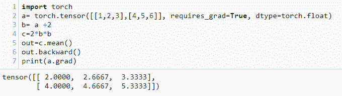

在上述代码中，我们创建了一个 2 x 3 的 torch 张量，并且重要的是将`requires_grad`属性设置为`True`。这使得能够计算随后操作的梯度。还要注意我们将`dtype`设置为`torch.float`，因为这是 PyTorch 用于自动微分的数据类型。我们执行一系列操作，然后取结果的平均值。这返回一个包含单个标量的张量。这通常是`autograd`计算前述操作的梯度所需的内容。这些可以是任何一系列操作；重要的是所有这些操作都被记录下来。输入张量`a`正在跟踪这些操作，即使有两个中间变量也是如此。为了了解这是如何工作的，让我们写出在与输入张量`a`相关的前述代码中执行的操作序列：

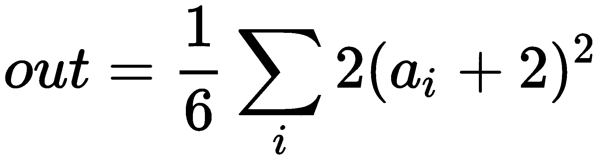

在这里，求和并除以六表示对张量`a`的六个元素进行平均。对于每个元素*ai*，分配给张量`b`的操作，加二和`c`，平方并乘二，这些操作被求和并除以六。

对*out*张量调用`backward()`将计算前一操作的导数。这个导数可以写成以下形式，如果您了解一点微积分，您将很容易确认这一点：

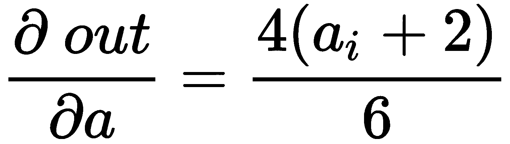

当我们将*a*的值代入前述方程的右侧时，确实可以得到在前面代码中打印出的`a.grad`张量中包含的值。

有时需要在具有`requires_grad=True`的张量上执行不需要被跟踪的操作。为了节省内存和计算量，可以将这样的操作包装在`with torch.no_grad():`块中。例如，请观察以下代码：

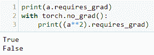

要停止 PyTorch 对张量进行操作的跟踪，可以使用 `.detach()` 方法。这可以防止未来对操作的跟踪，并将张量从跟踪历史中分离出来：

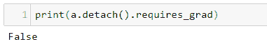

注意，如果我们尝试第二次计算梯度，例如调用 `out.backward()`，将再次生成错误。如果我们确实需要第二次计算梯度，我们需要保留计算图。这通过将 `retain_graph` 参数设置为 `True` 来实现。例如，观察以下代码：

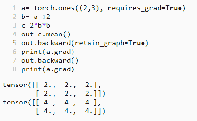

注意，第二次调用 `backward` 会将梯度添加到已经存储在 `a.grad` 变量中的梯度上。请注意，一旦调用 `backward()` 而没有将 `retain_graph` 参数设置为 `True`，`grad` 缓冲区将被释放。

# 计算图

要更好地理解这一点，让我们看看什么是计算图。我们可以为我们迄今使用的函数绘制如下的图形：

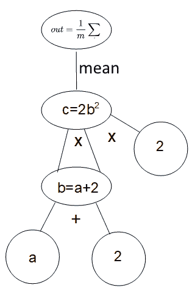

这里，图的叶子表示每一层的输入和参数，输出表示损失。

通常情况下，除非将 `retain_graph` 设置为 `True`，在每个 epoch 的每次迭代中，PyTorch 将创建一个新的计算图。

# 线性模型

线性模型是理解人工神经网络机制的重要途径。线性回归用于预测连续变量，同时在逻辑回归的情况下用于分类预测类别。神经网络在多类分类中非常有用，因为它们的架构可以自然地适应多个输入和输出。

# PyTorch 中的线性回归

让我们看看 PyTorch 如何实现一个简单的线性网络。我们可以使用 `autograd` 和 `backward` 手动迭代通过梯度下降。这种不必要的低级方法给我们带来了大量代码，将会很难维护、理解和升级。幸运的是，PyTorch 有一种非常直观的对象方法来构建人工神经网络，使用类来表示模型。我们自定义的模型类继承了构建人工神经网络所需的所有基础机制，使用超类 `torch.nn.Module`。以下代码演示了在 PyTorch 中实现模块（在本例中为 `linearModel`）的标准方式：

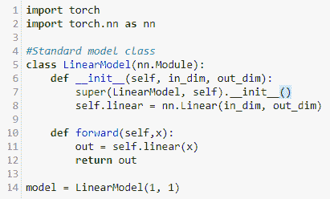

`nn.Module` 是基类，并且在初始化时通过 `super` 函数调用。这确保它继承了 `nn.Module` 中封装的所有功能。我们将一个变量 `self.Linear` 设置为 `nn.Linear` 类，这反映了我们正在构建一个线性模型的事实。记住，具有一个独立变量（即一个特征）`x` 的线性函数可以写成以下形式：

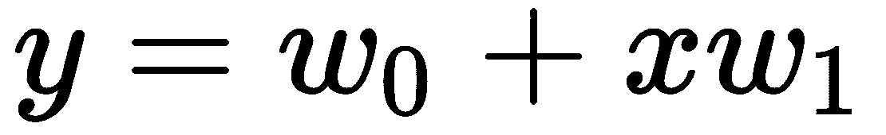

`nn.linear`类包含两个可学习变量：`bias`和`weight`。在我们的单特征模型中，这些是两个参数*w[0]*和*w[1]*。当我们训练模型时，这些变量会更新，理想情况下，它们的值接近于最佳拟合线。最后，在前述代码中，我们通过创建变量`model`并将其设置为我们的`LinearModel`类来实例化模型。

在运行模型之前，我们需要设置学习率、优化器类型以及用于衡量损失的标准。使用以下代码完成此操作：

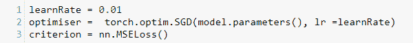

正如您所见，我们将学习率设为`0.01`。这通常是一个很好的起点；如果设置得太高，优化器可能会超过最优点，如果设置得太低，找到最优点可能会花费太长时间。我们将优化器设为随机梯度下降，并传入需要优化的项（在本例中是模型参数），同时设置每个梯度下降步骤要使用的学习率。最后，我们设置损失标准；即用于衡量损失的梯度下降准则，这里我们将其设置为均方误差。

要测试这个线性模型，我们需要向其提供一些数据，为了测试目的，我们创建了一个简单的数据集，`x`，由数字`1`到`10`组成。我们通过在输入值上应用线性变换来创建输出或目标数据。在这里，我们使用线性函数，`y = 3*x + 5`。代码如下所示：

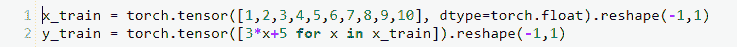

请注意，我们需要调整这些张量的形状，以使输入`x`和目标`y`具有相同的形状。还要注意，我们不需要设置`autograd`，因为这一切都由模型类处理。但是，我们需要告诉 PyTorch 输入张量的数据类型为`torch.float`，因为默认情况下它会将列表视为整数。

现在我们准备运行线性模型，并且我们通过循环运行它来完成。训练循环包括以下三个步骤：

1.  对训练集进行前向传播

1.  向后传播以计算损失

1.  根据损失函数的梯度更新参数

使用以下代码完成此操作：

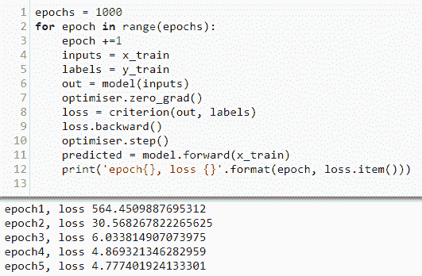

我们将`epoch`设为`1000.`。请记住，每个`epoch`代表对训练集的完整遍历。模型的输入被设置为数据集的`x`值；在这种情况下，它只是从 1 到 10 的数字序列。我们将标签设置为`y`值；在这种情况下，是我们函数计算出的值，`2*x + 5`。

重要的是，我们需要清除梯度，以防它们在周期内累积并扭曲模型。这可以通过在每个周期上调用优化器的 `zero_grad()` 函数来实现。输出张量设置为线性模型的输出，调用 `LinearModel` 类的前向函数。该模型应用当前参数估计的线性函数，并给出预测输出。

一旦有了输出，我们可以使用均方误差计算损失，比较实际的 `y` 值与模型计算的值。接下来，可以通过在损失函数上调用 `backwards()` 方法计算梯度。这确定梯度下降的下一步，使得 `step()` 函数更新参数值。我们还创建了一个 `predicted` 变量，用于存储 `x` 的预测值。稍后在绘制预测值和实际值的图表时将使用它。

为了了解我们的模型是否有效，我们在每个周期打印损失值。注意每次损失都在减少，表明模型按预期运行。确实，当模型完成 `1000` 个周期时，损失非常小。我们可以通过运行以下代码来打印模型的状态（即参数值）：

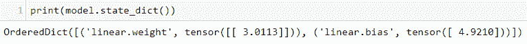

这里，`linear.weight` 张量由数值 `3.0113` 的单个元素组成，而 `linear.bias` 张量包含值 `4.9210`。这与我们通过 `y=3x + 5` 函数创建线性数据集时使用的 *w[0]* (5) 和 *w[1]* (3) 值非常接近。

为了增加一些趣味性，让我们看看当不使用线性函数创建标签，而是将函数中添加一个平方项（例如 `y= 3x² + 5`）时会发生什么。我们可以通过将预测值与实际值绘制图表来可视化模型的结果。以下代码展示了结果：

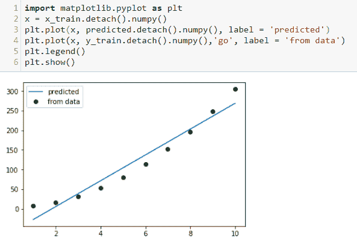

我们使用了 `y = 3x2 + 5` 函数生成标签。平方项赋予训练集特征曲线，而线性模型的预测则是最佳拟合直线。可以看到，经过 1,000 个周期后，该模型在拟合曲线方面表现相当不错。

# 保存模型

构建和训练模型后，通常希望保存模型的状态。在像这样训练所需时间微不足道的情况下，这并不重要。然而，对于大型数据集和许多参数，训练可能需要数小时甚至数天才能完成。显然，我们不希望每次需要模型对新数据进行预测时都重新训练模型。为了保存已训练模型的参数，我们只需运行以下代码：

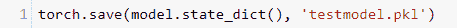

上述代码使用 Python 内置的对象序列化模块 `pickle` 保存模型。当需要恢复模型时，可以执行以下操作：

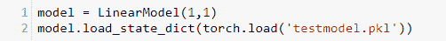

注意，为了使这个工作正常，我们需要在内存中保留我们的`LinearModel`类，因为我们只保存模型的状态，即模型参数，而不是整个模型。一旦我们恢复了模型，要重新训练模型，我们需要重新加载数据并设置模型的超参数（在本例中是优化器、学习率和标准）。

# 逻辑回归

一个简单的逻辑回归模型与线性回归的模型看起来并没有太大的区别。以下是逻辑模型的典型类定义：

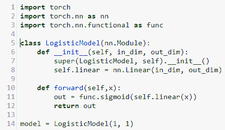

注意，当我们初始化`model`类时，我们仍然使用线性函数。然而，对于逻辑回归，我们需要一个激活函数。在这里，这是在调用`forward`时应用的。像往常一样，我们将模型实例化为我们的`model`变量。

接下来，我们设置标准和优化器：

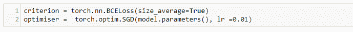

我们仍然使用随机梯度下降；然而，我们需要改变损失函数的标准。

对于线性回归，我们使用`MSELoss`函数计算均方误差。对于逻辑回归，我们使用介于 0 和 1 之间的概率表示的概率。计算概率的均方误差没有太多意义；相反，常见的技术是使用交叉熵损失或对数损失。在这里，我们使用`BCELoss`函数，或者**二元交叉熵损失**。这背后的理论有点复杂。重要的是理解它本质上是一个对数函数，更好地捕捉了概率的概念。因为它是对数函数，所以当预测概率接近 1 时，对数损失会缓慢减小，给出一个正确的预测。记住，我们试图计算一个错误预测的惩罚。损失必须随着预测值偏离真实值而增加。交叉熵损失对高置信度的预测进行惩罚（即它们接近 1 且是错误的），反之，奖励置信度较低但是正确的预测。

我们可以使用与线性回归相同的代码训练模型，在一个`for`循环中运行每个 epoch，进行前向传播计算输出，后向传播计算损失梯度，最后更新参数。

让我们通过创建一个实际示例来更加具体化。假设我们试图通过某种数值度量，比如昆虫翅膀的长度，对昆虫的物种进行分类。我们有以下的训练数据：

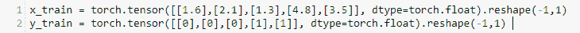

这里，`x_train`值可以表示翅膀长度（毫米），而`y_train`值则表示每个样本的标签；其中一个值表示样本属于目标物种。一旦我们实例化了`LogisticModel`类，就可以使用标准的运行代码来运行它。

一旦我们训练好模型，就可以使用一些新数据进行测试：

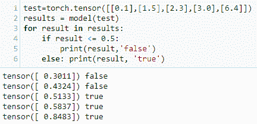

# PyTorch 中的激活函数

使人工神经网络表现出色的一部分诀窍是使用非线性激活函数。最初的想法是简单地使用阶跃函数。在这种情况下，只有当输入超过零时，才会从特定的输出发生。阶跃函数的问题在于它不能被微分，因为它没有定义的梯度。它只由平坦部分组成，并且在零点处不连续。

另一种方法是使用线性激活函数；然而，这将限制我们的输出也成为线性函数。这不是我们想要的，因为我们需要建模高度非线性的现实世界数据。事实证明，我们可以通过使用非线性激活函数将非线性引入我们的网络中。以下是流行激活函数的绘图：

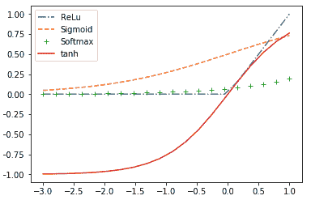

`ReLU`，或**修正线性单元**，通常被认为是最流行的激活函数。尽管在零点不可微，它具有一个特征的肘部，可以使梯度下降跳跃，实际上它的表现非常好。`ReLU`函数的一个优点是它计算非常快。此外，它没有最大值；随着其输入的增加，它会继续上升到无穷大。这在某些情况下可能是有利的。

我们已经遇到了`sigmoid`函数；它的主要优势在于在所有输入值上都是可微的。这可以帮助在`ReLU`函数在梯度下降过程中引起异常行为的情况下使用。与`ReLU`不同，`sigmoid`函数受到渐近线的约束。这对某些人工神经网络也是有益的。

`softmax`函数通常用于多类别分类的输出层。请记住，与多标签分类相比，多类别分类只有一个真正的输出。在这种情况下，我们需要预测的目标尽可能接近 1，而所有其他输出尽可能接近零。`softmax`函数是非线性的归一化形式。我们需要对输出进行归一化，以确保我们正在逼近输入数据的概率分布。与简单地将所有输出除以它们的和进行线性归一化不同，`softmax`应用了一个非线性的指数函数，增加了离群数据点的影响。这倾向于通过增加对低刺激的反应来增加网络的敏感性。它在计算上比其他激活函数更复杂；然而，事实证明它是`sigmoid`函数在多类别分类中的有效泛化。

`tanh`激活函数，或双曲正切函数，主要用于二元分类。它在`-1`和`1`处有渐近线，并且常用作`sigmoid`函数的替代，其中强烈负输入值导致`sigmoid`输出非常接近零，导致梯度下降陷入困境。在这种情况下，`tanh`函数将会负数输出，允许计算有意义的参数。

# 多类别分类示例

到目前为止，我们一直在使用微不足道的示例来演示 PyTorch 中的核心概念。现在我们准备探索一个更真实的例子。我们将使用的数据集是手写数字从 0 到 9 的`MNIST`数据集。任务是正确识别每个样本图像与正确的数字。

我们将构建的分类模型由多层组成，如下图所示：

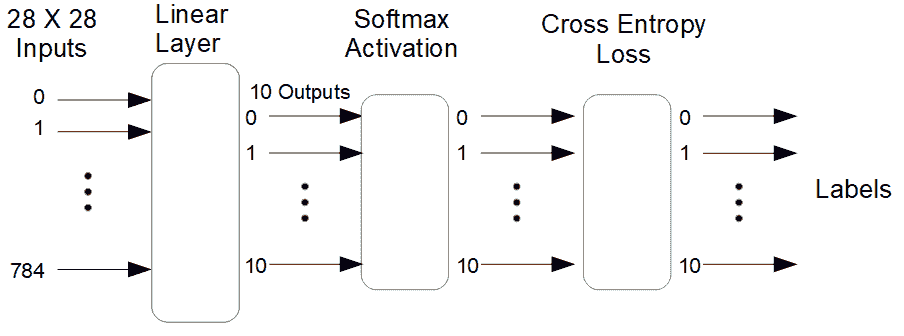

我们正在处理的图像大小为 28 x 28 像素，每个图像中的每个像素由一个单一数字表示其灰度。这就是为什么我们需要 28 x 28 或 784 个输入到模型中。第一层是具有 10 个输出的线性层，每个标签输出一个结果。这些输出被馈送到`softmax`激活层和交叉熵损失层中。这 10 个输出维度代表 10 个可能的类别，即数字零到九。具有最高值的输出表示给定图像的预测标签。

我们首先导入所需的库，以及`MNIST`数据集：

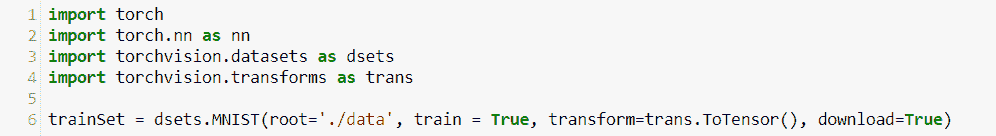

现在让我们打印有关`MNIST`数据集的一些信息：

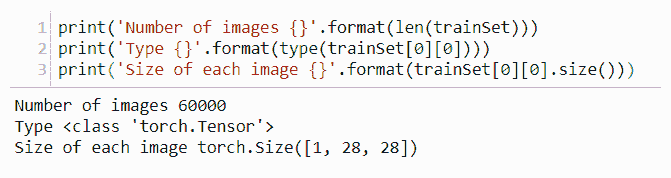

函数`len`返回数据集中单独项目的数量（在本例中为单个图像）。每个图像都被编码为张量类型，并且每个图像的尺寸为 28 x 28 像素。图像中的每个像素被分配一个单一数字，表示其灰度。

要定义我们的多类别分类模型，我们将使用完全相同的模型定义，即我们用于线性回归的模型定义：

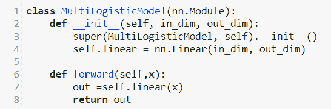

即使最终我们需要执行逻辑回归，但我们以略有不同的方式实现所需的激活和非线性。您会注意到，在模型定义中，由前向函数返回的输出只是一个线性函数。与我们在之前的二元分类示例中使用`sigmoid`函数不同，这里我们使用`softmax`函数，并分配给损失标准。以下代码设置这些变量并实例化模型：

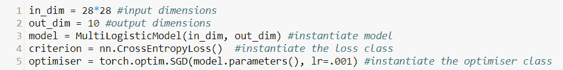

`CrossEntropyLoss()`函数实际上为网络添加了两层：`softmax`激活函数和交叉熵损失函数。网络的每个输入都取自图像的一个像素，因此我们的输入维度为 28 x 28 = 784。优化器使用随机梯度下降和学习率为`.0001`。

接下来，我们设置了批处理大小，运行模型的`epochs`数量，并创建了一个数据加载器对象，以便模型可以迭代数据：

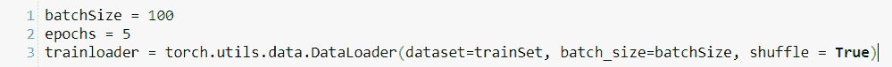

设置批量大小将数据以特定大小的块馈送到模型中。在这里，我们以`100`张图像的批量进行馈送。迭代次数（即网络的总前向后向遍历次数）可以通过将数据集的长度除以批量大小，然后乘以`epochs`的数量来计算。在本例中，总共有 5 x 60,000/100 = 3,000 次迭代。事实证明，这是处理中等到大型数据集更高效和有效的方法，因为在有限内存中，可能无法加载整个数据。此外，由于每批次训练模型时使用不同的数据子集，因此模型往往会做出更好的预测。将`shuffle`设置为`True`会在每个`epoch`上对数据进行洗牌。

要运行此模型，我们需要创建一个外部循环，该循环通过`epochs`进行迭代，并创建一个内部循环，该循环通过每个批次进行迭代。这通过以下代码实现：

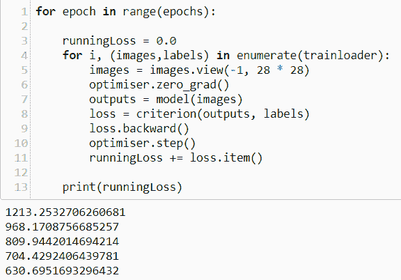

这类似于我们迄今为止用于运行所有模型的代码。唯一的区别在于，这里的模型枚举了`trainloader`中的每个批次，而不是一次迭代整个数据集。在这里，我们打印出每个`epoch`上的损失，并且预期的损失是递减的。

我们可以通过向模型进行前向传播来进行预测：

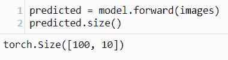

预测变量的大小为`100`乘以`10`。这表示批处理中的`100`张图像的预测结果。对于每张图像，模型输出一个包含`10`个元素的预测张量，其中每个输出表示每个标签的相对强度。以下代码打印出第一个预测张量和实际标签：

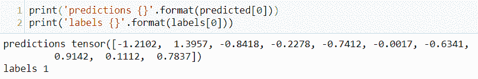

如果我们仔细观察之前的输出，我们会看到模型正确预测了标签，因为第二个元素，表示数字`1`，具有最高值`1.3957`。我们可以通过比较张量中的其他值来看出此预测的相对强度。例如，我们可以看到下一个最强的预测是数字`7`，其值为`0.9142`。

您会发现模型并非对每个图像都正确，要开始评估和改进我们的模型，我们需要能够衡量其性能。最直接的方法是测量其成功率，即正确结果的比例。为此，我们创建了以下函数：

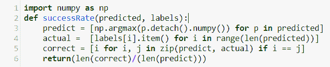

我们在这里使用字符串推导，首先通过找到每个输出的最大值来创建预测列表。接下来，我们创建一个标签列表以比较这些预测。我们通过比较`predict`列表中的每个元素与`actual`列表中对应的元素来创建正确值列表。最后，我们通过将正确值的数量除以总预测次数来返回成功率。我们可以通过将输出预测和标签传递给此函数来计算我们模型的成功率：

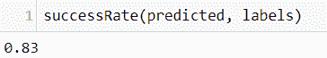

在这里，我们获得了 83%的成功率。请注意，这是使用模型已经训练过的图像计算得出的。要真正测试模型的性能，我们需要在它之前未见过的图像上进行测试。我们通过以下代码来实现这一点：

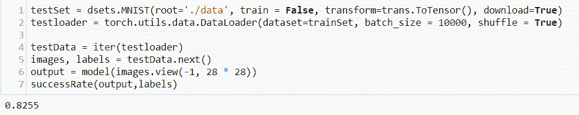

在这里，我们使用了整个`MNIST`测试集的 10,000 张图像来测试模型。我们从数据加载器对象中创建迭代器，然后加载到两个张量`images`和`labels`中。接下来，通过传递模型测试图像，我们获得一个输出（这里是一个 10 乘以 10,000 的预测张量）。最后，我们运行`SuccessRate`函数，传递输出和标签。其值仅略低于训练集上的成功率，因此我们可以合理地确信这是模型性能的准确度量。

# 总结

在本章中，我们探索了线性模型并将其应用于线性回归、逻辑回归和多类别分类的任务中。我们看到了自动求导如何计算梯度以及 PyTorch 如何处理计算图。我们构建的多类别分类模型在预测手写数字方面表现合理，但其性能远非最优。最好的深度学习模型能够在这个数据集上接近 100%的准确率。

我们将在第四章，*卷积网络*中看到如何通过增加更多层和使用卷积网络来提高性能。
