# 第四章：卷积网络

之前，我们构建了几个简单的网络来解决回归和分类问题。这展示了使用 PyTorch 构建人工神经网络所涉及的基本代码结构和概念。

在本章中，我们将通过增加层和使用卷积层来扩展简单的线性模型，解决实际示例中存在的非线性问题。具体来说，我们将涵盖以下主题:

+   超参数和多层网络

+   构建一个简单的基准函数来训练和测试模型

+   卷积网络

# 超参数和多层网络

现在您了解了构建、训练和测试模型的过程，您将会发现将这些简单网络扩展以提高性能是相对简单的。您会发现我们构建的几乎所有模型基本上都包含以下六个步骤:

1.  导入数据并为训练集和测试集创建可迭代的数据加载器对象

1.  构建并实例化一个模型类

1.  实例化一个损失类

1.  实例化一个优化器类

1.  训练模型

1.  测试模型

当然，一旦我们完成这些步骤，我们会通过调整一组超参数来改进我们的模型并重复这些步骤。值得一提的是，尽管我们通常认为超参数是由人类明确设置的东西，但这些超参数的设置可以部分自动化，就像我们将在学习率的情况下看到的那样。以下是最常见的超参数：

+   梯度下降的学习率

+   运行模型的 epochs 数量

+   非线性激活函数的类型

+   网络的深度，即隐藏层的数量

+   网络的宽度，即每层的神经元数量

+   网络的连接性（例如，卷积网络）

我们已经使用过一些超参数。我们知道学习率，如果设置得太小，将比必要的时间多花费，如果设置得太大，将会过度震荡并表现不稳定。Epochs 的数量是对训练集的完全遍历次数。我们预期随着 epochs 的增加，每个 epoch 的准确率都会提高，考虑到数据集和算法的限制。在某个时刻，准确率将会稳定，再多的 epochs 训练将会是一种资源浪费。如果准确率在前几个 epochs 降低，最可能的原因之一是学习率设置得太高。

激活函数在分类任务中起着关键作用，不同类型的激活的效果可能有些微妙。一般认为 ReLU，或修正线性函数，在最常见的实践数据集上表现最好。这不是说其他激活函数，特别是双曲正切函数或 tanh 函数以及这些函数的变体，如渗漏 ReLU，在某些条件下不能产生更好的结果。

随着深度或层数的增加，我们增强了网络的学习能力，使其能够捕获训练集更复杂的特征。显然，这种增强的能力在很大程度上取决于数据集的大小和复杂性以及任务本身。对于小数据集和相对简单的任务（例如使用 MNIST 进行数字分类），很少的层数（一到两层）就可以得到很好的结果。太多层会浪费资源，并且往往会使网络过拟合或表现不稳定。

当我们来增加宽度，也就是每层单元的数量时，这些说法大多是正确的。增加线性网络的宽度是提升学习能力最有效的方法之一。至于卷积网络，正如我们将看到的那样，不是每个单元都连接到下一个前向层的每个单元；连通性，也就是每层的输入和输出通道数，是至关重要的。我们很快会看到卷积网络，但首先我们需要开发一个框架来测试和评估我们的模型。

# 对模型进行基准测试

对任何深度学习探索的成功来说，基准测试和评估至关重要。我们将开发一些简单的代码来评估两个关键性能指标：准确率和训练时间。我们将使用以下模型模板：

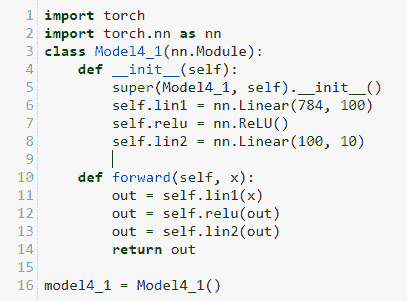

这个模型是解决 MNIST 问题的最常见和基本的线性模板。你可以看到，在`**init**`方法中，我们初始化每一层，通过创建一个赋给 PyTorch `nn`对象的类变量。在这里，我们初始化了两个线性函数和一个 ReLU 函数。`nn.Linear`函数以`28*28`或`784`的输入大小开始。这是每个训练图像的尺寸。输出通道或网络的宽度设置为`100`。这可以设置为任何值，一般情况下，更高的数字将在计算资源的限制和更宽网络过拟合训练数据的倾向中提供更好的性能。

在`forward`方法中，我们创建一个`out`变量。你可以看到，out 变量经过一个线性函数、一个 ReLU 函数和另一个线性函数的有序序列处理后返回。这是一个相当典型的网络架构，由交替的线性和非线性层组成。

现在让我们创建另外两个模型，将 ReLU 函数替换为 tanh 和 sigmoid 激活函数。这是 tanh 版本的代码：

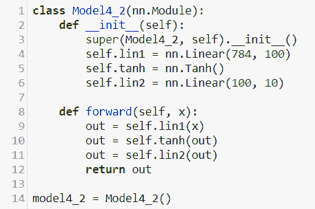

你可以看到，我们只是更改了名称，并用`nn.Tanh()`函数替换了`nn.ReLU()`函数。以完全相同的方式创建第三个模型，用`nn.Tanh()`替换`nn.Sigmoid()`。不要忘记在超级构造函数中更改名称，并在用于实例化模型的变量中进行更改。还要相应地更改前向函数。

现在，让我们创建一个简单的 `benchmark` 函数，用来运行并记录每个模型的准确度和训练时间：

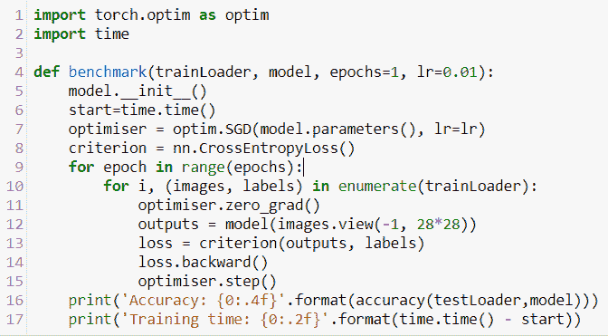

希望这个解释清楚了。`benchmark` 函数接受两个必需的参数：数据和要评估的模型。我们为 epochs 和学习率设置了默认值。我们需要初始化模型，以便可以在同一模型上多次运行它，否则模型参数会累积，扭曲我们的结果。运行的代码与之前的模型使用的代码完全相同。最后，我们打印出准确度和训练时间。这里计算的训练时间实际上只是一个近似值，因为训练时间会受处理器上其他正在进行的操作、内存量和其他我们无法控制的因素的影响。我们只能将此结果用作模型时间性能的相对指标。最后，我们需要一个函数来计算准确率，定义如下：

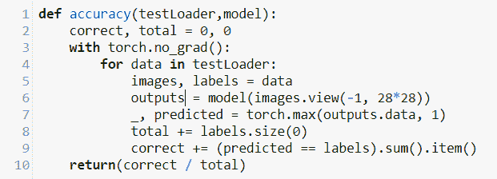

记得加载训练和测试数据集，并确保它们可以像之前一样被迭代。现在，我们可以运行我们的三个模型并使用类似以下方式进行比较：

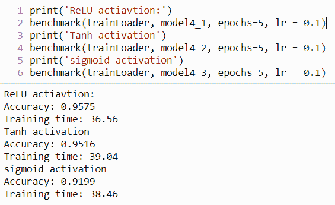

我们可以看到，`Tanh` 和 `ReLU` 函数的性能显著优于 `sigmoid`。对于大多数网络来说，隐藏层上的 `ReLU` 激活函数在准确度和训练时间上都表现最好。`ReLU` 激活函数不用于输出层。对于输出层，由于我们需要计算损失，我们使用 `softmax` 函数。这是损失类的标准，像之前一样，我们使用 `CrossEntropy Loss()`，其中包括 `softmax` 函数。

从这里我们可以改进的几种方法；一个明显的方法就是简单地添加更多层。这通常是通过添加交替的非线性和线性层来完成的。在下面的例子中，我们使用 `nn.Sequential` 来组织我们的层。在我们的前向层中，我们只需调用序列对象，而不是每个单独的层和函数。这使得我们的代码更加紧凑和易读：

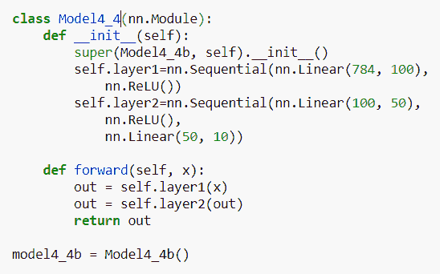

在这里，我们增加了两个更多的层：一个线性层和一个非线性的`ReLU`层。设置输入和输出大小尤为重要。在第一个线性层中，输入大小为`784`，这是图像的大小。该层的输出是我们选择的，设为`100`。因此，第二个线性层的输入必须是`100`。这是输出的宽度，卷积核和特征图的数量。第二个线性层的输出是我们选择的，但一般的想法是减少大小，因为我们试图将特征过滤到只有`10`个目标类别。为了好玩，创建一些模型，尝试不同的输入和输出大小，记住任何层的输入必须与上一层的输出大小相同。以下是三个模型的输出，我们打印每个隐藏层的输出大小，以便您了解可能的情况：

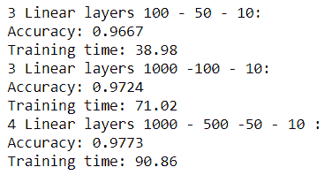

我们可以根据需要添加尽可能多的层和卷积核，但这并不总是一个好主意。我们在网络中设置输入和输出大小的方式与数据的大小、形状和复杂性密切相关。对于简单的数据集，比如 MNIST，几个线性层就能得到非常好的结果。但是，简单地添加线性层和增加卷积核的数量在捕捉复杂数据集的高度非线性特征时并不有效。

# 卷积网络

到目前为止，我们在网络中使用了全连接层，其中每个输入单元表示图像中的一个像素。而使用卷积网络时，每个输入单元则被分配一个小的局部**感受野**。感受野的概念，就像人工神经网络本身一样，是模仿人脑的。1958 年发现，大脑视皮层的神经元对视野中的受刺激有限区域作出反应。更有趣的是，一组神经元仅对某些基本形状作出反应。例如，一组神经元可能对水平线作出反应，而其他组则仅对其他方向的线作出反应。观察到，一组神经元可以具有相同的感受野，但对不同的形状作出反应。还观察到神经元组织成层，深层对更复杂的模式作出反应。这事实上是计算机学习和分类一组图像的一种非常有效的方式。

# 单个卷积层

卷积层组织得使第一层的单元仅对其相应的感受野作出反应。下一层的每个单元仅连接到第一层的一个小区域，第二个隐藏层的每个单元仅连接到第三层的有限区域，依此类推。通过这种方式，网络可以训练以从前一层中存在的低级特征组装出更高级别的特征。

在实践中，这是通过使用**滤波器**或**卷积核**来扫描图像以生成所谓的**特征图**来实现的。卷积核只是一个大小与接受域相同的矩阵。我们可以将其想象为相机以离散步幅扫描图像。我们通过卷积核矩阵与图像接受域中的值进行逐元素乘法来计算特征图矩阵。然后将结果矩阵求和以计算特征图中的单个数值。卷积核矩阵中的值代表我们希望从图像中提取的特征。这些是我们最终希望模型学习的参数。考虑一个简单的例子，我们试图在图像中检测水平和垂直线条。为简化问题，我们将使用一个输入维度；这可以是黑色，用**1**表示，或白色，用**0**表示。请记住，在实践中，这些将是表示灰度或颜色值的缩放和归一化的浮点数。在这里，我们将卷积核设置为 4 x 4 像素，并使用步幅为**1**进行扫描。步幅简单地是我们移动卷积核的距离，因此步幅为**1**将卷积核移动一个像素：

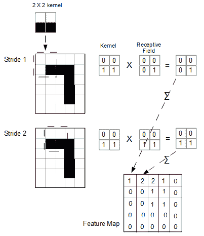

一个卷积是对图像的完整扫描，每个卷积生成一个特征图。在每个步幅上，我们对图像的接受域与卷积核进行逐元素乘法，并将结果矩阵求和。

当我们在图像上移动卷积核时，如前图所示，**步幅 1** 采样左上角，**步幅 2** 采样左边一个像素，**步幅 3** 再次采样左边一个像素，依此类推。当我们到达第一行的末尾时，我们需要添加填充像素，因此将值设置为**0**以便采样图像的边缘。用零填充输入数据称为**有效填充**。如果我们没有对图像进行填充，特征图的维度将小于原始图像。填充用于确保不丢失原始信息。

理解输入和输出大小、卷积核大小、填充和步幅之间的关系非常重要。它们可以用以下公式来表达：

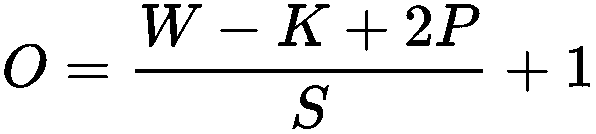

这里，*O* *=* 输出大小，*W* = 输入高度或宽度，*K* = 卷积核大小，*P* = 填充，*S* = 步幅。请注意，输入高度或宽度假设这两者相同，即输入图像是方形的，而不是矩形的。如果输入图像是矩形的，则需要分别计算宽度和高度的输出值。

填充可以如下计算：

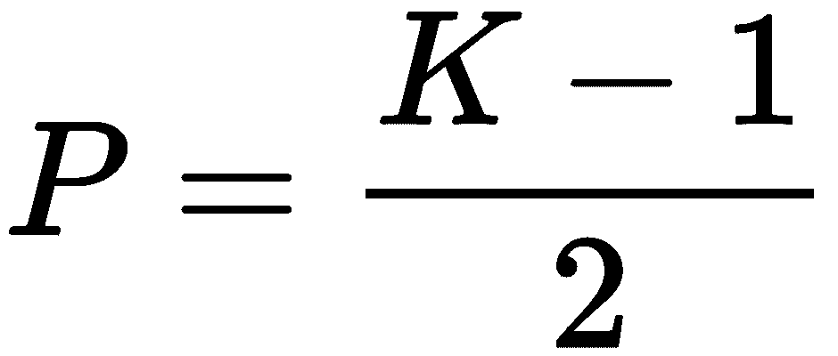

# 多个卷积核

在每个卷积中，我们可以包含多个内核。卷积中的每个内核生成自己的特征图。内核的数量是输出通道的数量，这也是卷积层生成的特征图数量。我们可以通过使用另一个内核生成更多的特征图。作为练习，请计算以下内核将生成的特征图：

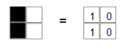

通过堆叠内核或过滤器，并使用不同大小和值的内核，我们可以从图像中提取各种特征。

同时，请记住每个内核不限于一个输入维度。例如，如果我们处理 RGB 彩色图像，则每个内核的输入维度为三。由于我们正在进行逐元素乘法，内核必须与感受野大小相同。当我们有三个维度时，内核需要具有三个输入深度。因此，我们的灰度 2x2 内核对于彩色图像来说变成了一个 2x2x3 矩阵。我们仍然为每个卷积生成单个特征图。我们仍然能够进行逐元素乘法，因为内核大小与感受野相同，只是现在在进行求和时，我们跨三个维度进行求和以获取每个步长所需的单个数字。

正如你可以想象的那样，我们可以以多种方式扫描图像。我们可以更改内核的大小和值，或者更改其步幅，包括填充，甚至包括非连续像素。

要更好地了解一些可能性，请查看 vdumoulin 出色的动画：[`github.com/vdumoulin/conv_arithmetic/blob/master/README.md`](https://github.com/vdumoulin/conv_arithmetic/blob/master/README.md)。

# 多个卷积层

与完全连接的线性层一样，我们可以添加多个卷积层。与线性层一样，同样的限制适用：

+   时间和内存限制（计算负载）

+   倾向于过拟合训练集而不是泛化到测试集

+   需要更大的数据集才能有效工作

适当添加卷积层的好处在于，逐步地，它们能够从数据集中提取更复杂、非线性的特征。

# 池化层

典型地，卷积层是通过**池化层**堆叠的。池化层的目的是减少前面卷积生成的特征图的尺寸，但不减少深度。池化层保留 RGB 信息，但压缩空间信息。我们这样做的原因是使内核能够有选择地专注于某些非线性特征。这意味着我们可以通过专注于具有最强影响力的参数来减少计算负载。具有较少参数还可以减少过拟合的倾向。

有三个主要原因导致使用池层来减少输出特征图的维数：

+   通过丢弃不相关的特征来减少计算负载

+   参数数量较少，因此不太可能过拟合数据。

+   能够提取经过某种方式转换的特征，例如来自不同视角的物体图像。

池化层与普通卷积层非常相似，因为它们使用核矩阵或滤波器对图像进行采样。池化层的不同之处在于我们进行了降采样。降采样会减少输入维度。这可以通过增加核的大小或增加步幅或两者同时实现。请查看单卷积层部分的公式以确认这一点。

记住，在卷积中，我们所做的只是在每个步幅上对图像上的两个张量进行乘法运算。卷积中的每个后续步幅采样输入的另一部分。这种采样是通过核与前一卷积层的输出之间的逐元素乘法实现的，包含在特定步幅内。这种采样的结果是一个单一数字。在卷积层中，这个单一数字是逐元素乘法的总和。在池化层中，这个单一数字通常是由逐元素乘法的平均值或最大值生成的。术语**平均池化**和**最大池化**指的是这些不同的池化技术。

# 构建单层 CNN

现在我们应该有足够的理论来构建一个简单的卷积网络并理解其工作原理了。以下是我们可以开始使用的模型类模板：

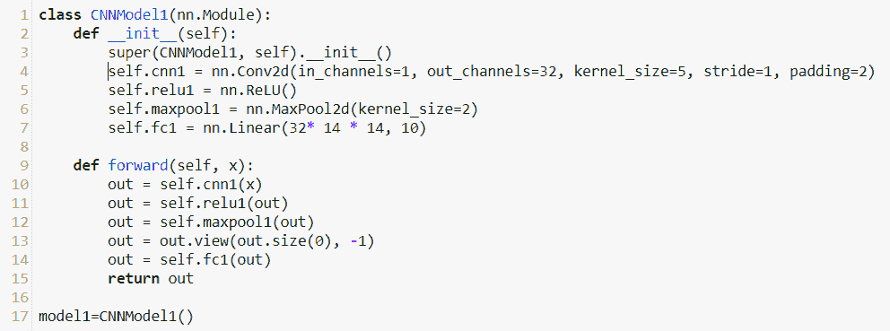

我们将在 PyTorch 中使用的基本卷积单元是`nn.Conv2d`模块。其特征如下所示：

```py
nn.Conv2d(in_channels, outs_channels, kernel_size, stride=1, 
padding = 0)
```

这些参数的值受限于输入数据的大小和上一节讨论的公式。在这个例子中，`in_channels`设置为`1`。这表示我们的输入图像有一个颜色维度。如果我们使用三通道彩色图像，则应将其设置为`3`。`out_channel`是卷积核的数量。我们可以将其设置为任何值，但要记住会有计算惩罚，并且改善性能取决于具有更大、更复杂数据集。在本例中，我们将输出通道数设置为`16`。输出通道数或卷积核实质上是我们认为可能是目标类别的低级特征的数量。我们将步幅设置为`1`，填充设置为`2`。这可以确保输出大小与输入大小相同；可以通过将这些值代入单卷积层部分的输出公式来验证。

在`__init__`方法中，您会注意到我们实例化了一个卷积层，一个`ReLU`激活函数，一个`MaxPool2d`层和一个全连接的线性层。这里重要的是理解我们如何推导传递给`nn.Linear()`函数的值。这是 MaxPool 层的输出大小。我们可以使用我们的输出公式来计算这个值。我们知道卷积层的输出与输入相同。因为输入图像是方形的，我们可以使用 28 来表示输入，因此也可以表示卷积层的输出大小。我们还知道我们设置了`2`的核大小。默认情况下，`MaxPool2d`将步幅分配给核大小，并使用隐含的填充。出于实际目的，这意味着当我们对步幅和填充使用默认值时，我们可以简单地通过核大小除以输入，这里是 28。因为我们的核大小是 2，我们可以计算出输出大小为 14。因为我们使用了全连接的线性层，我们需要展平宽度、高度和通道数。我们有 32 个通道，如在`nn.Conv2d`的`out_channels`参数中设置的那样。因此，输入大小为 16 X 14 X 14。输出大小为 10，因为像线性网络一样，我们使用输出来区分这 10 个类。

模型的`forward`函数非常简单。我们只需将`out`变量通过卷积层、激活函数、池化层和全连接的线性层。注意，我们需要为线性层调整输入大小。假设批量大小为`100`，池化层的输出是一个四维张量：`100, 32, 14, 14`。在这里，`out.view(out.size(0), -1)`将这个四维张量重塑为一个二维张量：`100, 32*14*14`。

为了使这更具体化，让我们训练我们的模型并查看一些变量。我们可以使用几乎相同的代码来训练卷积模型。但是，我们需要在我们的`benchmark()`函数中更改一行。由于卷积层可以接受多个输入维度，我们不需要展平输入的宽度和高度。对于以前的线性模型，在我们的运行代码中，我们使用以下内容来展平输入：

```py
outputs= model(images.view(-1, 28*28))
```

对于我们的卷积层，我们不需要这样做；我们可以简单地将图像传递给模型，如下所示：

```py
outputs = model(images)
```

在我们之前在本章的`bench marking`部分定义的`accuracy()`函数中，我们还必须更改这一行。

# 构建多层 CNN

正如您所期望的那样，我们可以通过添加另一个卷积层来改善这个结果。当我们添加多个层时，将每个层打包成一个序列是很方便的。这就是`nn.Sequential`发挥作用的地方：

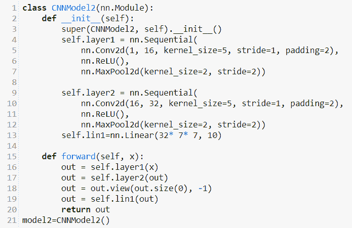

我们初始化了两个隐藏层和一个全连接的线性输出层。注意传递给`Conv2d`实例和线性输出的参数。与以前一样，我们有一个输入维度。从这个维度，我们的卷积层输出`16`个特征图或输出通道。

这个图表代表了双层卷积网络：

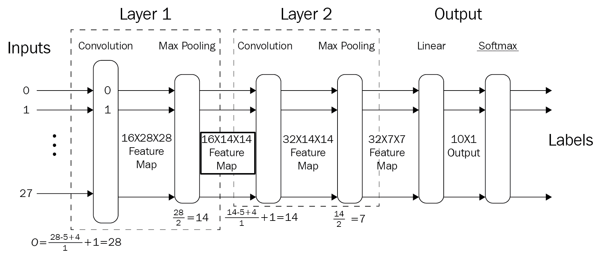

这应该清楚地展示了我们如何计算输出大小，特别是我们如何推导线性输出层的输入大小。我们知道，使用输出公式，第一个卷积层在最大池化之前的输出大小与输入大小相同，即 28 x 28。由于我们使用了 16 个核或通道，生成了 16 个特征图，进入最大池化层的输入是一个 16 x 28 x 28 的张量。最大池化层使用 2 的核大小、步长 2 和默认的隐式填充，这意味着我们只需将特征图大小除以 2 即可计算最大池化输出大小。这给出了一个输出大小为 16 x 14 x 14。这是第二个卷积层的输入大小。再次使用输出公式，我们可以计算出第二个卷积层在最大池化之前生成了 14 x 14 的特征图，与其输入大小相同。由于我们将核的数量设置为 32，进入第二个最大池化层的输入是一个 32 x 14 x 14 的矩阵。我们的第二个最大池化层与第一个相同，核大小和步长设置为 2，使用默认的隐式填充。再次，我们可以简单地除以 2 来计算输出大小，因此是线性输出层的输入。最后，我们需要将这个矩阵展平为一个维度。因此，线性输出层的输入大小是一个维度为 32 * 7 * 7，即 1,568。和往常一样，我们需要最终线性层的输出大小是类的数量，本例中为 10。

我们可以检查模型参数，看看在运行代码时确实发生了什么：

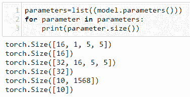

模型参数包括六个张量。第一个张量是第一个卷积层的参数。它包含`16`个核，`1`个颜色维度，以及大小为`5`的核。接下来的张量是偏置，具有大小为`16`的单个维度。列表中的第三个张量是第二个卷积层中的`32`个核，`16`个输入通道，深度和`5 x 5`的核。在最后的线性层中，我们将这些维度展平为`10 x 1568`。

# 批归一化

批量归一化被广泛用于提高神经网络的性能。它通过稳定化层输入的分布来工作。这是通过调整这些输入的均值和方差来实现的。在深度学习研究中，有关批量归一化如此有效的原因的研究者社区存在不确定性是相当典型的。曾经认为这是因为它减少了所谓的**内部协变量偏移**（**ICS**）。这指的是由于前面层参数更新的结果而导致的分布变化。批量归一化最初的动机是减少这种偏移。然而，ICS 与性能之间的明确关联尚未得出结论性结果。更近期的研究表明，批量归一化通过*平滑化*优化的景观。基本上，这意味着梯度下降将更加有效。关于这一点的详细信息可以在 Santurkar 等人的文章*批量归一化如何帮助优化*中找到，可访问[`arxiv.org/abs/1805.11604`](https://arxiv.org/abs/1805.11604)。

使用`nn.BatchNorm2d`函数实现的批量归一化：

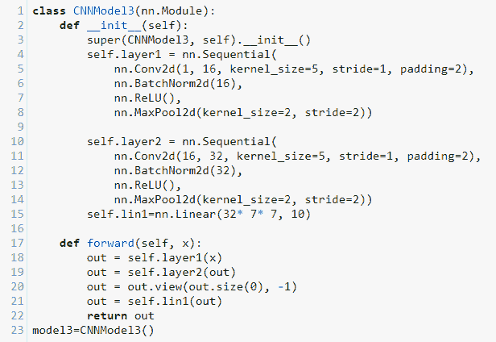

这个模型与之前的双层 CNN 完全相同，只是在卷积层的输出上添加了批量归一化。以下是我们迄今为止构建的三个卷积网络的性能打印输出：

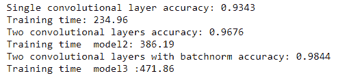

# 摘要

在本章中，我们看到如何改进第三章中开发的简单线性网络，*计算图和线性模型*。我们可以添加线性层，增加网络宽度，增加我们运行模型的时代数，并调整学习率。然而，线性网络将无法捕捉数据集的非线性特征，在某些时候它们的性能将会达到平台期。另一方面，卷积层使用内核来学习非线性特征。我们看到，使用两个卷积层，MNIST 的性能显著提高。

在下一章中，我们将探讨一些不同的网络架构，包括循环网络和长短期网络。
