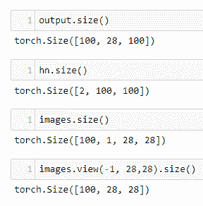

# 第五章：其他神经网络架构

循环网络本质上是保持状态的前馈网络。到目前为止，我们看到的所有网络都需要固定大小的输入，比如图像，并给出固定大小的输出，比如特定类别的概率。循环网络不同之处在于，它们接受任意大小的序列作为输入，并产生序列作为输出。此外，网络的隐藏层的内部状态会随着学习的函数和输入的结果而更新。通过这种方式，循环网络记住了它的状态。后续状态是前几个状态的函数。

在本章中，我们将涵盖以下内容：

+   循环网络简介

+   长短期记忆网络

# 循环网络简介

循环网络在预测时间序列数据方面显示出极强的能力。这对于生物大脑而言是一项基本技能，使我们能够安全驾驶汽车、演奏乐器、躲避捕食者、理解语言以及与动态世界互动。对时间流逝的感知以及事物随时间变化的理解对智能生命至关重要，因此在人工系统中，这种能力的重要性毋庸置疑。

理解时间序列数据的能力在创意工作中也非常重要，循环网络已显示出在作曲旋律、构造语法正确的句子和创建视觉上令人愉悦的图像等方面具有一定的能力。

如我们所见，前馈和卷积网络在诸如静态图像分类等任务中表现出色。然而，处理连续数据，如语音或手写识别、预测股票市场价格或天气预报等任务，需要不同的方法。在这些类型的任务中，输入和输出不再是固定长度的数据，而是任意长度的序列。

# 循环人工神经元

对于前馈网络中的人工神经元，激活的流动只是从输入到输出。**循环人工神经元**（**RANs**）在激活层的输出到其线性输入之间建立了连接，实质上将输出再次加到输入中。RAN 可以在时间上*展开*：每个后续状态都是前几个状态的函数。因此，可以说 RAN 具有其前几个状态的记忆：


在上述示意图中，左侧的图示了一个单个循环神经元。它将其输入`x`与输出`y`相加，产生一个新的输出。右侧的图示了相同单元在三个时间步长上的展开。我们可以写出任意给定时间步长输出关于输入的方程如下：


这里，*y(t)* 是时间 *t* 的输出向量，*x[(t)]* 是时间 *t* 的输入，*y[(t-1)]* 是前一个时间步的输出，*b* 是偏置项，*Φ* 是激活函数，通常是 tanh 或者 RelU。注意，每个单元都有两组权重，*w[x]* 和 *w[y]*，分别用于输入和输出。这本质上是我们在线性网络中使用的公式，其中添加了一个项来表示输出，反馈到时间 *t-1* 的输入中。

就像在 CNNs（卷积神经网络）中可以计算整个层的输出一样，使用前述方程的向量化形式在递归网络中也是可能的。以下是递归层的向量化形式：


这里，*Y[(t)]* 是时间 *t* 的输出。这是一个大小为 (*m*, *n*) 的矩阵，其中 *m* 是批次中实例的数量，*n* 是层中单元的数量。*X[(t)]* 是一个大小为 (*m, i)* 的矩阵，其中 *i* 是输入特征的数量。*W[x]* 是一个大小为 (*i, n)* 的矩阵，包含当前时间步的输入权重。*W[y]* 是一个大小为 (*n*, *n*) 的矩阵，包含前一个时间步的输出权重。

# 实现循环网络

因此，我们可以专注于模型，使用我们熟悉的相同数据集。尽管我们处理的是静态图像，但我们可以将每个 28 像素输入大小在 28 个时间步骤上展开，使网络能够对完整图像进行计算：


在前述模型中，我们使用 `nn.RNN` 类创建了一个具有两个循环层的模型。`nn.RNN` 类的默认签名如下：

```py
nn.RNN(input_size, hidden_size, num_layers, batch_first=False, nonlinearity = 'tanh' 
```

输入是我们的 28 x 28 MNIST 图像。此模型取每个图像的 28 个像素，将它们展开成 28 个时间步骤，以计算整个批次中所有图像的结果。`hidden_size` 参数是隐藏层的维度，这是我们选择的。在这里，我们使用大小为 `100`。`batch_first` 参数指定输入和输出张量的预期形状。我们希望其形状为（批次大小，序列长度，特征数）。在本例中，我们期望的输入/输出张量形状是 (`100, 28, 28`)。即批次大小、序列长度和每步的特征数；然而，默认情况下，`nn.RNN` 类使用的是形状为 (序列长度，批次大小，特征数) 的输入/输出张量。设置 `batch_first = True` 确保输入/输出张量的形状为 (批次大小，序列长度，特征数)。

在`forward`方法中，我们初始化了一个用于隐藏层的张量`h0`，在模型的每次迭代中更新。这个隐藏张量的形状，表示隐藏状态，是（layers, batch, hidden）的形式。在这个例子中，我们有两层。隐藏状态的第二个维度是批处理大小。请记住，我们使用批处理优先，因此这是输入张量`x`的第一个维度，使用`x[0]`进行索引。最后一个维度是隐藏大小，在这个例子中，我们设置为`100`。

`nn.RNN`类要求输入包括输入张量`x`和`h0`隐藏状态。这就是为什么在`forward`方法中，我们传入这两个变量。`forward`方法在每次迭代时被调用，更新隐藏状态并给出输出。请记住，迭代次数是每个批次的数据大小除以批次大小乘以数据集大小的结果。

重要的是，正如你所看到的，我们需要使用以下方法对输出进行索引：

```py
out = self.fc(out[:, -1, :])
```

我们只关注最后一个时间步的输出，因为这是批处理中所有图像的累积知识。如果你记得，输出形状是（batch, sequence, features），在我们的模型中是`(100, 28, 100)`。特征的数量简单地等于隐藏维度或隐藏层中的单元数。现在，我们需要所有批次：这就是为什么我们使用冒号作为第一个索引。在这里，`-1`表示我们只想要序列的最后一个元素。最后的索引，冒号，表示我们想要所有的特征。因此，我们的输出是序列中最后一个时间步的所有特征，针对整个批次。

我们可以使用几乎相同的训练代码；但是，在调用模型时，我们确实需要重塑输出。请记住，对于线性模型，我们使用以下方法重塑输出：

```py
outputs = model(images.view(-1, 28*28) 
```

对于卷积网络，通过使用`nn.CNN`，我们可以传入未展平的图像；而对于循环网络，在使用`nn.RNN`时，我们需要输出的形式为（batch, sequence, features）。因此，我们可以使用以下方法重塑输出：

```py
outputs = model(images.view(-1, 28,28))
```

记住，我们需要在我们的训练代码和测试代码中修改此行。以下是运行三个不同层和隐藏尺寸配置的循环模型的结果打印输出：


要更好地理解这个模型的工作原理，请考虑以下图表，表示我们的具有隐藏大小为`100`的两层模型：


在每一个**28**个时间步骤中，网络接收一个输入，包含**100**张图像中每张图像的**28**个像素（特征）。每个时间步骤基本上是一个两层前馈网络。唯一的区别在于每个隐藏层都有额外的输入。这个输入包括前一个时间步骤中相应层的输出。在每个时间步骤，从每个批次中的**100**张图像中抽取另外**28**个像素。最后，当批次中的所有图像都被处理完毕时，模型的权重会更新，下一个迭代开始。完成所有迭代后，我们读取输出以获取预测结果。

要更好地理解运行代码时发生的情况，请考虑以下内容：


在这里，我们打印出了一个具有`100`隐藏层大小的双层 RNN 模型的权重向量大小。

我们将权重检索为包含`10`个张量的列表。第一个大小为`[100, 28]`的张量包含隐藏层的输入，`100`个单元和输入图像的`28`个特征或像素。这是递归网络向量化形式方程中的*W*[*x* ]项。接下来的参数组，大小为`[100, 100]`，由前述方程中的*W[y]*项表示，是隐藏层的输出权重，包含每个大小为`100`的单元`100`。接下来的两个大小为`100`的单维张量分别是输入和隐藏层的偏置单元。接着我们有第二层的输入权重、输出权重和偏置。最后，我们有读取层权重，大小为`[10, 100]`的张量，用于使用`100`个特征进行`10`个可能的预测。大小为`[10]`的最终单维张量包含读取层的偏置单元。

在下面的代码中，我们复制了模型中递归层在单个图像批次上的操作：


您可以看到我们简单地将`trainLoader`数据集对象创建为一个迭代器，并将一个`images`变量分配给一个图像批次，就像我们在训练代码中所做的那样。隐藏层`h0`需要包含两个张量，每个层次一个。在这些张量中，对于批次中的每个图像，`100`个隐藏单元的权重被存储。这解释了为什么我们需要一个三维张量。第一个大小为`2`，表示层数，第二个维度大小为`100`，来自`images.size(0)`，表示批次大小，第三个维度大小为`100`，表示隐藏单元数量。然后，我们将重塑后的图像张量和隐藏张量传递给模型。这调用了模型的`forward()`函数，进行必要的计算，并返回一个输出张量和一个更新后的隐藏状态张量。

以下确认了这些输出的大小：



这应该帮助您理解为什么我们需要调整`images`张量的大小。请注意，输入的特征是每个图像中的`28`像素，这些像素在`28`个时间步上展开。接下来，让我们将递归层的输出传递给我们的全连接线性层：


您可以看到，这将为输出中的`100`个特征的每个特征给出`10`个预测。这就是为什么我们只需索引序列中的最后一个元素。请记住，从`nn.RNN`输出的大小为（`100, 28, 100`）。观察使用`-1`索引时此张量的大小会发生什么变化：


这是包含`100`个特征的张量，即隐藏单元的输出，每个批次中有`100`张图片。这会传递给我们的线性层，以生成每个图像所需的`10`个预测。

# 长短期记忆网络

**长短期记忆网络（LSTMS）** 是一种特殊类型的 RNN，能够学习长期依赖关系。虽然标准 RNN 在某种程度上可以记住先前的状态，但是它们通过在每个时间步更新隐藏状态的方式来完成这一点。这使得网络能够记住短期依赖关系。隐藏状态作为先前状态的函数，保留了关于这些先前状态的信息。然而，当前状态与先前状态之间的时间步长越多，这个早期状态对当前状态的影响就越小。在当前时间步之前的 10 个时间步的状态上保留的信息要少得多。这样做是尽管较早的时间步可能包含对特定问题或任务具有直接相关性的重要信息。

生物大脑具有出色的记忆长期依赖能力，利用这些依赖形成意义和理解。考虑我们如何跟随电影的情节。我们回忆起电影开始时发生的事件，并且随着情节的发展立即理解它们的相关性。不仅如此，我们还可以通过回忆自己生活中的事件，为故事线赋予相关性和意义。这种有选择地将记忆应用于当前背景的能力，同时过滤掉无关细节，是设计 LSTM 的策略背后的原理。

LSTM 网络试图将这些长期依赖关系整合到人工网络中。它比标准 RNN 复杂得多；然而，它仍基于递归前馈网络，理解这一理论应使您能够理解 LSTM。

下图显示了 LSTM 在单个时间步上的示意图：


与普通的 RNN 一样，每个后续时间步骤都将前一个时间步的隐藏状态 **h[t-1]** 和数据 **x**[**t**][,] 作为其输入。LSTM 还传递在每个时间步骤上计算的细胞状态。您可以看到 **h[t-1]** 和 **x[t]** 各自传递给四个单独的线性函数。这些线性函数的每对被求和。LSTM 的核心是这四个门，这些总和被传递到这些门中。首先，我们有 **遗忘门**。这使用 **sigmoid** 作为激活函数，并且与 **旧细胞状态** 进行逐元素乘法。请记住，**sigmoid** 有效地将 **线性** 输出值压缩到零到一之间的值。乘以零将有效地消除细胞状态中的特定值，而乘以一将保留该值。**遗忘门** 实际上决定了传递到下一个时间步的信息。这是通过与 **旧细胞状态** 的逐元素乘法来实现的。

**输入门** 和 **缩放后的新候选门** 共同决定了保留哪些信息。**输入门** 还使用了 **sigmoid** 函数，并且乘以 **新候选门** 的输出，生成一个临时张量，即 **缩放后的新候选门** **c[2]**。请注意，**新候选门** 使用 **tanh** 激活函数。记住 **tanh** 函数的输出值在 `-1` 和 `1` 之间。通过这种方式使用 **tanh** 和 **sigmoid** 激活函数，即它们的输出进行逐元素乘法，有助于避免梯度消失问题，其中输出变得饱和并且它们的梯度重复接近零，使它们无法执行有意义的计算。通过将 **缩放后的新候选门** 和 **缩放后的旧细胞状态** 相加来计算 **新细胞状态**，从而能够放大输入数据的重要组成部分。

最后一个门，输出门 **O***,*，是另一个 **sigmoid**。新的细胞状态通过 **tanh** 函数传递，然后与输出门进行逐元素乘法，以计算 **隐藏状态**。与标准 RNN 一样，这个 **隐藏状态** 通过最终的非线性传递，即 **sigmoid** 和 **Softmax** 函数，以产生输出。这总体上的效果是增强高能量组分，消除低能量组分，同时减少梯度消失的机会和减少训练集的过拟合。

我们可以将每个 LSTM 门的方程式写成如下形式：


注意，这些方程式与 RNN 的形式完全相同。唯一的区别在于我们需要八个单独的权重张量和八个偏置张量。正是这些额外的权重维度赋予了 LSTM 额外的能力，可以学习和保留输入数据的重要特征，并丢弃不重要的特征。我们可以将某个时间步骤*t*的线性输出层输出写为以下形式：


# 实现一个 LSTM

以下是我们将用于 MNIST 的 LSTM 模型类：


注意，`nn.LSTM`传递的参数与之前的 RNN 相同。这并不奇怪，因为 LSTM 是一个适用于数据序列的循环网络。请记住输入张量具有形式`(batch, sequence, feature)`的轴，因此我们设置`batch_first=True`。我们为输出层初始化一个全连接线性层。请注意，在`forward`方法中，除了初始化隐藏状态张量`h0`，我们还初始化一个用于保存细胞状态的张量`c0`。还要记住`out`张量包含所有`28`个时间步长。对于我们的预测，我们只对序列中的最后一个索引感兴趣。这就是为什么在将其传递给线性输出层之前，我们对`out`张量应用了`[:, -1, :]`索引。我们可以像之前为 RNN 打印出这个模型的参数一样打印出来：


这些是单层 LSTM 的参数，有`100`个隐藏层。这个单层 LSTM 有六组参数。请注意，与 RNN 的情况不同，对于 LSTM，输入和隐藏权重张量的第一个维度大小为`400`，表示每个四个 LSTM 门的`100`隐藏单元。

第一个参数张量用于输入层，大小为`[400,28]`。第一个索引`400`对应权重*w[1]*、*w[3]*、*w[5]*和*w[7]*，每个大小为`100`，用于输入到指定的`100`隐藏单元中。`28`是输入中存在的特征或像素数量。接下来的大小为`[400,100]`的张量是权重*w[2]*、*w[4]*、*w[6]*和*w[8]*，每个对应`100`隐藏单元。接下来的两个大小为`[400]`的一维张量是两组偏置单元，*b[1]*、*b[3]*、*b[5]*、*b[7]* 和 *b[2]*、*b[4]*、*b[6]*、*b[8]*，分别用于每个 LSTM 门。最后，我们有大小为`[10, 100]`的输出张量。这是我们的输出大小`10`，权重张量*w[9]*。最后一个大小为`[10]`的单维张量是偏置，*b9*。

# 构建带门控递归单元的语言模型

为了展示循环网络的灵活性，我们将在本章的最后一节做一些不同的事情。到目前为止，我们一直在使用可能是最常用的测试数据集之一，MNIST。这个数据集具有众所周知的特性，非常适合比较不同类型的模型、测试不同的架构和参数集。然而，有些任务，比如自然语言处理，显然需要完全不同类型的数据集。

到目前为止，我们构建的模型都集中在一个简单的任务上：分类。这是最直接的机器学习任务。为了让你了解其他机器学习任务的风味，并展示循环网络的潜力，我们将构建一个基于字符的预测模型，该模型试图根据前一个字符预测每个后续字符，形成一个学习过的文本体。模型首先学习创建正确的元音—辅音序列、单词，最终生成模仿人类作者构建的形式（但不是意义）的句子和段落。

以下是由 Sean Robertson 和 Pratheek 编写的代码的改编版本，可以在这里找到：[`github.com/spro/practical-pytorch/blob/master/char-rnn-generation/char-rnn-generation.ipynb`](https://github.com/spro/practical-pytorch/blob/master/char-rnn-generation/char-rnn-generation.ipynb)。以下是模型定义：


该模型的目的是在每个时间步骤获取一个输入字符，并输出最可能的下一个字符。在随后的训练中，它开始积累字符序列，模仿训练样本中的文本。我们的输入和输出大小仅仅是输入文本中字符的数量，这作为参数传递给模型进行计算。我们使用`nn.Embedding`类初始化一个编码器张量。与我们使用独热编码为每个单词定义唯一索引类似，`nn.Embedding`模块将词汇表中的每个单词存储为多维张量。这使我们能够在单词嵌入中编码语义信息。我们需要向`nn.Embedding`模块传递一个词汇量大小——这里是输入文本中字符的数量——以及用于编码每个字符的维度——这里是模型的隐藏大小。

我们使用的词嵌入模型基于`nn.GRU`模块，或者 GRU。这与我们在前一节使用的 LSTM 模块非常相似。不同之处在于，GRU 是 LSTM 的稍微简化版本。它将输入门和遗忘门合并为单个更新门，并将隐藏状态与单元状态结合起来。结果是，对于许多任务来说，GRU 比 LSTM 更高效。最后，初始化线性输出层以解码 GRU 的输出。在`forward`方法中，我们调整输入大小，并通过线性嵌入层、GRU 和最终的线性输出层传递它，返回隐藏状态和输出。

接下来，我们需要导入数据，并初始化包含输入文本的可打印字符和输入文本中字符数的变量。请注意使用`unidecode`来删除非 Unicode 字符。如果系统尚未安装此模块，您需要导入并可能在系统上安装它。我们还定义了两个方便的函数：一个函数用于将字符字符串转换为每个 Unicode 字符的整数等效值，另一个函数用于从训练文本中随机采样随机块。`random_training_set`函数返回两个张量。`inp`张量包含块中的所有字符，不包括最后一个字符。`target`张量包含所有偏移一个字符的块中的所有元素，因此包括最后一个字符。例如，如果我们使用块大小为`4`，并且该块由 Unicode 字符表示为`[41, 27, 29, 51]`，那么`inp`张量将是`[41, 27, 29]`，`target`张量将是`[27, 29, 51]`。通过这种方式，目标可以训练模型使用目标数据进行下一个字符的预测：


接下来，我们编写一个评估模型的方法。这是通过逐个字符传递它来完成的：模型输出下一个最有可能字符的多项式概率分布。这样重复操作以构建一个字符序列，并将它们存储在`predicted`变量中：


`evaluate`函数接受一个`temperature`参数，该参数除以输出并找到指数以创建概率分布。`temperature`参数的作用是确定每个预测所需的概率水平。对于大于`1`的温度值，生成较低概率的字符，生成的文本更随机。对于小于`1`的较低温度值，生成较高概率的字符。对于接近`0`的温度值，只生成最可能的字符。对于每次迭代，将字符添加到`predicted`字符串中，直到达到由`predict_len`变量确定的所需长度，并返回`predicted`字符串。

下面的函数训练模型：


我们将输入块和目标块传递给它。`for` 循环在每个块中的每个字符上运行模型一次迭代，更新`hidden`状态，并返回每个字符的平均损失。

现在，我们准备实例化并运行模型。这是通过以下代码完成的：


在这里，通常变量被初始化。请注意，我们的优化器没有使用随机梯度下降，而是使用 Adam 优化器。术语 Adam 代表*自适应矩估计器*。梯度下降使用单一固定学习率来处理所有可学习参数。Adam 优化器使用自适应学习率来维护每个参数的学习率。它可以提高学习效率，特别是在稀疏表示中，例如用于自然语言处理的表示。稀疏表示是那些张量中大部分数值为零的表示，例如单热编码或词嵌入。

一旦我们运行模型，它将打印出预测的文本。起初，文本看起来几乎像是随机的字符序列；然而，在几个训练周期后，模型学会了将文本格式化为类似英语的句子和短语。生成模型是强大的工具，能够帮助我们揭示输入数据中的概率分布。

# 摘要

在本章中，我们介绍了循环神经网络，并演示了如何在 MNIST 数据集上使用 RNN。RNN 特别适用于处理时间序列数据，因为它们本质上是展开在时间上的前馈网络。这使它们非常适合处理手写和语音识别等数据序列任务。我们还看到了 RNN 的更强大变体，即 LSTM。LSTM 使用四个门来决定传递到下一个时间步的信息，从而使其能够发现数据中的长期依赖关系。最后，在本章中，我们构建了一个简单的语言模型，能够从样本输入文本中生成文本。我们使用的模型基于 GRU。GRU 是 LSTM 的稍简化版本，包含三个门，将 LSTM 的输入门和遗忘门结合在一起。该模型使用概率分布从样本输入生成文本。

在最后一章中，我们将探讨一些 PyTorch 的高级特性，例如在多处理器和分布式环境中使用 PyTorch。我们还看到如何微调 PyTorch 模型，并使用预训练模型进行灵活的图像分类。
