# 充分利用 PyTorch

到目前为止，你应该能够构建和训练三种不同类型的模型：线性模型、卷积模型和循环模型。你应该对这些模型架构背后的理论和数学有所了解，并能解释它们如何进行预测。卷积网络可能是最研究的深度学习网络，特别是与图像数据相关的情况。当然，卷积网络和循环网络都广泛使用线性层，因此线性网络背后的理论，尤其是线性回归和梯度下降，对所有人工神经网络都是基础的。

迄今为止，我们的讨论相当有限。我们已经研究了一个被广泛研究的问题，比如使用 MNIST 进行分类，以便让你对 PyTorch 的基本构建块有扎实的理解。这最后一章是你在现实世界中使用 PyTorch 的跳板，阅读完后，你应该可以开始自己的深度学习探索。在本章中，我们将讨论以下主题：

+   使用**图形处理单元**（**GPUs**）以提高性能

+   优化策略和技术

+   使用预训练模型

# 多处理器和分布式环境

有各种多处理器和分布式环境的可能性。使用多处理器的最常见原因当然是为了使模型运行更快。将 MNIST 加载到内存中的时间并不重要，因为它只是一个相对较小的数据集，包含 6 万张图像。然而，考虑到我们有吉格或者 TB 级别的数据，或者数据分布在多台服务器上的情况，情况会更加复杂。当考虑在线模型时，数据实时从多台服务器收集的情况更是如此。显然，这些情况都需要某种形式的并行处理能力。

# 使用 GPU

使模型运行更快的最简单方法是添加 GPU。通过将处理器密集型任务从**中央处理单元**（**CPU**）转移到一个或多个 GPU 上，可以显著减少训练时间。PyTorch 使用`torch.cuda()`模块与 GPU 进行接口交互。CUDA 是由 NVIDIA 创建的并行计算模型，具有延迟分配功能，因此资源只在需要时分配。由此带来的效率提升是显著的。

PyTorch 使用上下文管理器`torch.device()`将张量分配给特定设备。以下截图展示了一个示例：

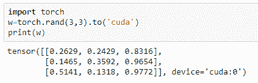

通常的做法是测试 GPU 的存在并使用以下语义将设备分配给变量：

```py
device = torch.device("cuda:0" if torch.cuda.is_available() else "cpu")
```

字符串`"cuda:0"`指的是默认的 GPU 设备。请注意，我们会检查 GPU 设备的存在并将其分配给`device`变量。如果 GPU 设备不可用，则会将设备分配给 CPU。这样可以使代码在可能有或没有 GPU 的机器上运行。

考虑我们在第三章中探讨的线性模型，*计算图和线性模型*。我们可以使用完全相同的模型定义；但是，我们需要在训练代码中做一些改变，以确保处理器密集型操作在 GPU 上执行。一旦创建了我们的`device`变量，我们可以将操作分配给该设备。

在我们之前创建的基准函数中，我们需要在初始化模型后添加以下代码行：

```py
model.to(device)
```

我们还需要确保对图像、标签和输出的操作都在选定的设备上进行。在基准函数的`for`循环中，我们进行如下更改：

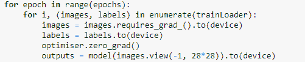

我们需要对在我们的准确度函数中定义的图像、标签和输出做完全相同的事情，只需将`.to(device)`附加到这些张量定义中。一旦做出这些更改，如果在具有 GPU 的系统上运行，速度应明显更快。对于具有四个线性层的模型，此代码运行时间仅稍逾 55 秒，而在我的系统上仅在 CPU 上运行时超过 120 秒。当然，CPU 速度、内存和其他因素会影响运行时间，因此这些基准在不同系统上会有所不同。完全相同的训练代码将适用于逻辑回归模型。同样的修改也适用于我们研究过的其他网络的训练代码。几乎任何东西都可以传输到 GPU，但请注意，每次数据复制到 GPU 时都会产生计算开销，因此除非涉及复杂的计算（例如计算梯度），否则不要不必要地将操作传输到 GPU。

如果您的系统上有多个 GPU 可用，则可以使用`nn.DataParallel`来透明地在这些 GPU 上分发操作。这可以简单地使用一个模型包装器来实现，例如，`model=torch.nn.DataParallel(model)`。当然，我们也可以采用更细粒度的方法，将特定操作分配给特定设备，如下例所示：

```py
with torch.cuda.device("device:2"): w3=torch.rand(3,3)
```

PyTorch 有一个特定的内存空间，可用于加速张量传输到 GPU。当张量重复分配到 GPU 时使用此功能。使用`pin_memory()`函数实现，例如，`w3.pin_memory()`。其中一个主要用途是加速输入数据的加载，这在模型训练周期内反复发生。为此，只需在实例化`DataLoader`对象时传递`pin_memory=True`参数。

# 分布式环境

有时，数据和计算资源不可用于单个物理机。这需要在网络上交换张量数据的协议。在分布式环境中，计算可以在不同类型的物理硬件上通过网络进行，有许多考虑因素，例如网络延迟或错误，处理器的可用性，调度和时间问题以及竞争的处理资源。在 ANN 中，计算必须按照一定的顺序进行。幸运的是，PyTorch 使用更高级的接口大部分隐藏了跨机器和处理器网络的每个计算的分配和时间安排的复杂机制。

PyTorch 有两个主要的包，分别处理分布式和并行环境的各个方面。这是除了我们之前讨论的 CUDA 之外。这些包如下：

+   `torch.distributed`

+   `torch.multiprocessing`

# `torch.distributed`

使用`torch.distributed`可能是最常见的方法。此包提供通信原语，如类，以检查网络中的节点数，确保后端通信协议的可用性，并初始化进程组。它在模块级别上运行。`torch.nn.parallel.DistributedDataParallel()`类是一个容器，包装了一个 PyTorch 模型，使其继承`torch.distributed`的功能。最常见的用例涉及多个进程，每个进程在其自己的 GPU 上操作，可以是本地的也可以是网络上的。通过以下代码初始化进程组到设备：

```py
torch.distributed.init_process_group(backend='nccl', world_size=4, init_method='...')
```

这在每个主机上运行。后端指定了要使用的通信协议。NCCL（发音为 nickel）后端通常是最快且最可靠的。请注意，这可能需要安装在您的系统上。`world_size`是作业中的进程数，`init_method`是指向进程初始化位置和端口的 URL。这可以是网络地址，例如（`tcp://...`），也可以是共享文件系统（`file://... /...`）。

通过`torch.cuda.set_devices(i)`可以设置设备。最后，我们可以使用以下代码短语来分配模型

`model = distributedDataParallel(model, device_ids=[i], output_device=i`。这通常用于生成每个进程并将其分配给处理器的初始化函数。这确保每个进程通过使用相同的 IP 地址和端口通过主进程协调。

# `torch.multiprocessing`

`torch.multiprocessor` 包是 Python 多处理包的替代品，使用方式完全相同，即作为基于进程的线程接口。它通过将 PyTorch 张量放入共享内存并仅发送其句柄到其他进程来扩展 Python 分布式包的方式之一。这是通过 `multiprocessing.Queue` 对象实现的。一般情况下，多进程是异步执行的；也就是说，特定设备的进程会被入队并在达到队列顶部时执行。每个设备按入队顺序执行进程，并且 PyTorch 在设备间复制时定期同步多个进程。这意味着对于多进程函数的调用者来说，进程是同步进行的。

编写多线程应用程序时的主要困难之一是避免死锁，即两个进程竞争一个资源的情况。这种常见情况是后台线程锁定或导入模块并分叉子进程时发生的。子进程很可能会以损坏的状态启动，导致死锁或其他错误。`multiprocessingQueue` 类本身会生成多个后台线程来发送、接收和序列化对象，这些线程也可能导致死锁。对于这些情况，可以使用无线程的 `multiprocessingQueue.queues.SimpleQueue`。

# 优化技术

`torch.optim` 包含多种优化算法，每种算法都有几个参数可以用来微调深度学习模型。优化在深度学习中是一个关键组成部分，因此不同的优化技术对模型的性能可能至关重要。记住，它的作用是基于损失函数的计算梯度来存储和更新参数状态。

# 优化器算法

除了 SGD 外，PyTorch 中还提供了许多优化算法。以下代码展示了其中一种算法：

```py
optim.Adadelta(params, lr=1.0, rho=0.9, eps=1e-06, weight_decay=0)
```

`Adadelta` 算法基于随机梯度下降；然而，不同于每次迭代保持相同的学习率，学习率会随时间调整。`Adadelta` 算法为每个维度维护单独的动态学习率。这可以使训练更快速和更有效率，因为与计算梯度相比，计算新学习率的开销相当小。`Adadelta` 算法在各种模型架构、大梯度和分布式环境中表现良好。`Adadelta` 算法特别适用于大型模型，并且在使用大初始学习率时效果显著。有两个与 `Adadelta` 相关的超参数我们还没有讨论。`rho` 用于计算平方梯度的运行平均值，这决定了衰减率。`eps` 超参数用于提高 `Adadelta` 的数值稳定性，如下代码所示：

```py
optim.Adagrad(params, lr=0.01, lr_decay=0, weight_decay=0, initial_accumulater_value=0)
```

`Adagrad` 算法，或者适应性次梯度方法用于随机优化，是一种技术，它融入了在先前迭代中观察到的训练数据的几何知识。这使得算法能够发现罕见但高度预测的特征。`Adagrad` 算法使用自适应学习率，为频繁出现的特征赋予较低的学习率，为罕见特征赋予较高的学习率。这样做的效果是找到数据中罕见但重要的特征，并相应地计算每个梯度步长。学习率在每次迭代中对于更频繁出现的特征会更快地减小，对于罕见特征则减小得更慢，这意味着罕见特征在更多迭代中保持较高的学习率。`Adagrad` 算法通常对于稀疏数据集效果最佳。其应用示例如下代码所示：

```py
optim.Adam(params, lr=0.001, betas(0.9,0.999), eps=1e-08, weight_decay=0, amsgrad=False)
```

`Adam` 算法（自适应矩估计）根据梯度的均值和未居中方差（梯度的第一和第二时刻）使用自适应学习率。类似于 `Adagrad`，它存储过去平方梯度的平均值。它还存储这些梯度的衰减平均值。它在每次迭代时基于每个维度计算学习率。`Adam` 算法结合了 `Adagrad` 的优点，对稀疏梯度效果显著，并且能够在在线和非静态设置中良好工作。请注意，`Adam` 可以接受一个可选的 beta 参数元组。这些系数用于计算运行平均值及其平方的平均值。当设置 `amsgrad` 标志为 `True` 时，会启用 `Adam` 的一种变体，它结合了梯度的长期记忆。在某些情况下，这有助于收敛，而标准 `Adam` 算法则可能无法收敛。除了 `Adam` 算法之外，PyTorch 还包含 `Adam` 的两个变体。`optim.SparseAdam` 采用惰性参数更新，仅更新梯度中出现的时刻，并将其应用于参数。这提供了一种更有效的处理稀疏张量（如用于词嵌入的张量）的方法。第二个变体 `optim.Adamax` 使用无穷范数来计算梯度，理论上降低了对噪声的敏感性。在实践中，选择最佳优化器通常需要经过试验和错误。

下面的代码演示了 `optim.RMSprop` 优化器：

```py
optim.RMSprop(params, lr=0.01, alpha=0.99, eps=1e-08, weight_decay=0, momentum=0, centered = False)
```

`RMSprop` 算法将每个参数的学习率除以该特定参数最近梯度的平方的运行平均值。这确保每次迭代的步长与梯度的尺度相同。这样做可以稳定梯度下降，并减少消失或爆炸梯度的问题。alpha 超参数是一个平滑参数，有助于使网络对噪声具有鲁棒性。其用法可以在下面的代码中看到：

```py
optim.Rprop(params, lr=0.01, etas(0.5,1.2), step_sizes(1e_06,50))
```

`Rprop` 算法（弹性反向传播）是一种自适应算法，通过使用每个权重的成本函数的偏导数的符号（而不是大小）来计算权重更新。这些独立地为每个权重计算。`Rprop` 算法接受一个元组对参数 `etas`。这些是乘法因子，根据前一个迭代整体损失函数的导数的符号来增加或减少权重。如果最后一个迭代产生与当前导数相反的符号，则更新乘以元组中的第一个值，称为 `etaminus`，一个小于 1 的值，默认为 `0.5`。如果当前迭代的符号与上一个相同，则该权重更新乘以元组中的第二个值，称为 `etaplis`，一个大于 `1` 的值，默认为 `1.2`。通过这种方式，最小化总误差函数。

# 学习率调度器

`torch.optim.lr_schedular` 类作为一个包装器，根据一个特定函数乘以初始学习率来调度学习率。学习率调度器可以分别应用于每个参数组。这可以加快训练时间，因为通常我们能够在训练周期的开始使用更大的学习率，并在优化器接近最小损失时缩小此速率。一旦定义了调度器对象，通常会使用 `scheduler.step()` 来逐个 epoch 进行步进。PyTorch 提供了许多学习率调度器类，其中最常见的一个如下所示：

```py
optim.lr_schedular.LambdaLR(optimizer, lr_lambda, last_epoch =-1)
```

此学习率调度器类采用一个函数，该函数乘以每个参数组的初始学习率，并且如果有多个参数组，则作为单个函数或函数列表传递。`last_epoch` 是最后一个时期的索引，因此默认值 `-1` 是初始学习率。以下是此类的示例截图，假设我们有两个参数组：

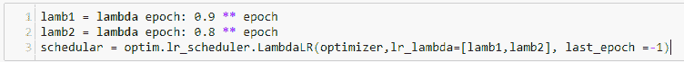

`optim.lr_schedular.StepLR(optimizer, step_size, gamma=0.1, last_epoch=-1)` 每 `step_size` 个 epoch 将学习率按乘法因子 `gamma` 减少。

`optim.lr_schedular.MultiStepLR(optimizer, milestones, gamma=0.1, last_epoch=-1)` 接受一个里程碑列表，以 epoch 数量度量，当学习率减少 `gamma` 时。`milestones` 是一个递增的 `epoch` 索引列表。

# 参数组

当实例化优化器时，它是以及一些超参数，如学习率。优化器还传递了其他每种优化算法特定的超参数。设置这些超参数的组合可以极大地有助于设置模型的不同部分。通过创建参数组，实质上是一个可以传递给优化器的字典列表，可以实现这一点。

`param` 变量必须是 `torch.tens` 的迭代器或指定优化选项默认值的 Python 字典。请注意，参数本身需要指定为有序集合，例如列表，以便在模型运行之间保持参数一致的顺序。

可以将参数指定为参数组。考虑下面截图中显示的代码：

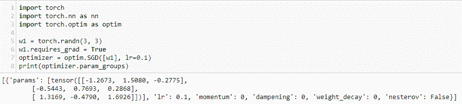

`param_groups` 函数返回包含权重和优化器超参数的字典列表。我们已经讨论了学习率。SGD 优化器还具有几个其他超参数，可用于微调您的模型。`momentum` 超参数修改 SGD 算法，帮助加速梯度张量朝向最优点，通常导致更快的收敛。`momentum` 默认为 `0`；然而，使用较高的值，通常在 `0.9` 左右，往往会导致更快的优化。这在处理嘈杂数据时特别有效。它通过计算数据集的移动平均来工作，有效地平滑数据，从而改善优化效果。`dampening` 参数可以与 `momentum` 一起使用作为抑制因子。`weight_decay` 参数应用 L2 正则化。这向损失函数添加了一个项，效果是缩小参数估计，使模型更简单，更不易过拟合。最后，`nestrove` 参数基于未来的权重预测计算动量。这使得算法可以向前看，通过计算一个梯度，不是针对当前参数，而是针对近似未来参数。

我们可以使用 `param_groups` 函数将不同的参数集分配给每个参数组。考虑下面截图中显示的代码：

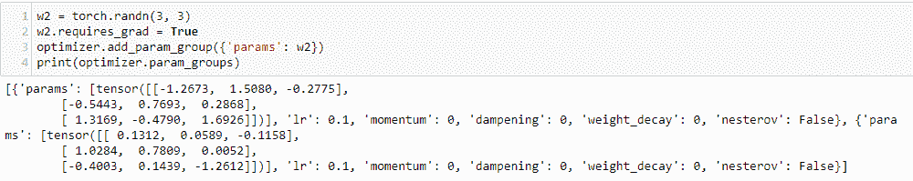

在这里，我们创建了另一个权重 `w2` ，并将其分配给一个参数组。请注意，在输出中我们有两组超参数，每个参数组一个。这使我们能够设置特定于权重的超参数，例如允许在网络的每一层中应用不同的选项。我们可以访问每个参数组并更改参数值，使用其列表索引，如下面截图中的代码所示：

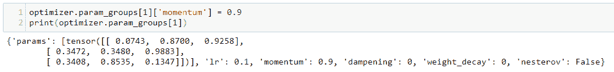

# 预训练模型

图像分类模型的主要困难之一是缺乏标记数据。组装足够大小的标记数据集以很好地训练模型是困难的；这是一项非常耗时且费力的任务。对于 MNIST 来说，这并不是问题，因为这些图像相对简单。它们是灰度的，主要由目标特征组成，没有令人分心的背景特征，所有图像都对齐在同一方式，并且是相同比例的。一个包含 60,000 张图像的小数据集已经足够很好地训练模型。在我们在现实生活中遇到的问题中，很难找到这样一个组织良好且一致的数据集。图像的质量通常是可变的，目标特征可能被遮蔽或扭曲。它们还可以具有广泛可变的尺度和旋转。解决方案是使用一个在非常大的数据集上预训练的模型架构。

PyTorch 包含六种基于卷积网络的模型架构，专为处理分类或回归任务中的图像设计。以下列表详细描述了这些模型：

+   **AlexNet**：这个模型基于卷积网络，通过并行化操作在处理器之间实现显著的性能改进。其原因在于，卷积层的操作与卷积网络的线性层中发生的操作有所不同。卷积层大约占总计算量的 90%，但只操作 55%的参数。对于完全连接的线性层，情况相反，它们占大约 5%的计算量，但包含大约 95%的参数。AlexNet 使用不同的并行化策略来考虑线性层和卷积层之间的差异。

+   **VGG**：用于大规模图像识别的**非常深度卷积网络**（VGG）的基本策略是增加层数的深度，同时对所有卷积层使用一个 3 x 3 的接受领域的非常小过滤器。所有隐藏层都包括 ReLU 非线性，输出层由三个完全连接的线性层和一个 softmax 层组成。VGG 架构提供 `vgg11`、`vgg13`、`vgg16`、`vgg19`、`vgg11_bn`、`vgg13_bn`、`vgg16_bn` 和 `vgg19_bn` 几种变体。

+   **ResNet**：虽然非常深的网络可能提供更强的计算能力，但它们很难进行优化和训练。非常深的网络通常会导致梯度消失或爆炸。ResNet 使用残差网络，其中包括快捷跳过连接以跳过某些层。这些跳过层具有可变权重，因此在初始训练阶段，网络有效地折叠成几层，随着训练的进行，随着新特征的学习，层数会扩展。ResNet 提供 `resnet18`、`resnet34`、`resnet50`、`resnet101` 和 `resnet152` 几种变体。

+   **SqueezeNet**：SqueezeNet 旨在创建更小、参数更少且更易于在分布式环境中导出和运行的模型。这是通过三种策略实现的。首先，将大多数卷积的感受野从 3 x 3 减少到 1 x 1。其次，将输入通道减少到剩余的 3 x 3 过滤器中。第三，对网络的最终层进行下采样。SqueezeNet 可在 `squeezenet1_0` 和 `squeezenet1_1` 变体中找到。

+   **DenseNet**：密集卷积网络与标准 CNN 相比，其中权重从输入传播到输出的每一层，每一层使用所有前一层的特征图作为输入。这导致层之间的连接更短，网络鼓励参数的重复使用。这样可以减少参数数量并增强特征的传播。DenseNet 可在 `Densenet121`、`Densenet169` 和 `Densenet201` 变体中找到。

+   **Inception**：这种架构使用多种策略来提高性能，包括通过逐渐减少输入和输出之间的维度来减少信息瓶颈，将卷积从较大的感受野因子化为较小的感受野，以及平衡网络的宽度和深度。最新版本是 `inception_v3`。重要的是，Inception 要求图像大小为 299 x 299，与其他模型要求的 224 x 224 不同。

这些模型可以通过简单调用其构造函数以随机权重初始化，例如 `model = resnet18()`。要初始化预训练模型，请设置布尔值 `pretrained= True`，例如 `model = resnet18(pretrained=True)`。这将加载预加载的权重数值数据集。这些权重通过在 `Imagenet` 数据集上训练网络来计算。该数据集包含超过 1400 万张图像和超过 100 个索引。

许多这些模型架构具有多种配置，例如 `resnet18`、`resnet34`、`vgg11` 和 `vgg13`。这些变体利用层深度、标准化策略和其他超参数的差异。找出哪种最适合特定任务需要进行一些实验。

还要注意，这些模型设计用于处理图像数据，需要 RGB 图像格式为 `(3, W, H)`。输入图像需要调整大小为 224 x 224，除了 Inception，它需要大小为 299 x 299 的图像。重要的是，它们需要以非常特定的方式进行归一化。可以通过创建一个 `normalize` 变量并将其传递给 `torch.utils.data.DataLoader` 来完成这一点，通常作为 `transforms.compose()` 对象的一部分。非常重要的是，`normalize` 变量必须精确地具有以下值：

```py
normalize=transforms.Normalize(mean=[0.485, 0.456, 0.406], std=[0.229, 0.224, 0.225])
```

这确保了输入图像与它们在 `Imagenet` 数据集上训练的相同分布。

# 实现预训练模型

还记得我们在《PyTorch 入门》的第一章中玩过的 Guiseppé玩具数据集吗？现在我们终于有了工具和知识来创建这些数据的分类模型。我们将使用在`Imagenet`数据集上预训练的模型来实现这一目标。这被称为迁移学习，因为我们正在将在一个数据集上学到的知识迁移到另一个（通常要小得多的）数据集上进行预测。使用具有预训练权重的网络显著提高了在较小数据集上的性能，而且这是非常容易实现的。在最简单的情况下，我们可以将预训练模型传递给带标签图像的数据，并简单地更改输出特征的数量。请记住，`Imagenet`有`100`个索引或潜在标签。对于我们的任务，我们希望将图像分类为三类：`toy`、`notoy`和`scenes`。因此，我们需要将输出特征的数量分配为三。

下图中的代码是基于 Sasank Chilamkurthy 的迁移学习教程中的代码进行调整的，可在[`chsasank.github.io`](https://chsasank.github.io)找到。

首先，我们需要导入数据。这些数据可以从本书的网站(`.../toydata`)获取。将该文件解压缩到您的工作目录中。实际上，您可以使用任何您喜欢的图像数据，只要它具有相同的目录结构：即用于训练和验证集的两个子目录，并在这两个目录中，为每个类别建立子目录。您可能还想尝试的其他数据集包括蜜蜂和蚂蚁的 hymenoptera 数据集，可在[`download.pytorch.org/tutorial/hymenoptera_data.zip`](https://download.pytorch.org/tutorial/hymenoptera_data.zip)获取，以及来自`torchvision/datasets`的 CIFAR-10 数据集，或者更大更具挑战性的植物种子数据集，包含 12 个类别，可在[`www.kaggle.com/c/plant-seedlings-classification`](https://www.kaggle.com/c/plant-seedlings-classification)获取。

我们需要对训练和验证数据集应用单独的数据转换，导入并使数据集可迭代，然后根据下图中的代码将设备分配给 GPU（如果可用）：

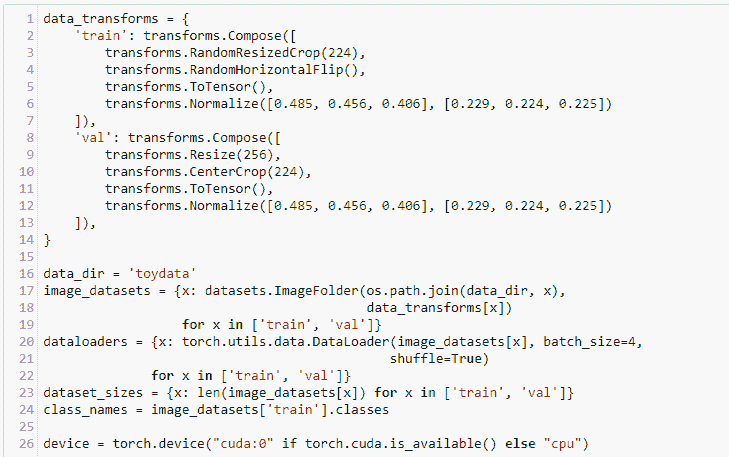

注意，字典用于存储两个`compose`对象列表，以便转换训练和验证集。使用`RandomResizedCrop`和`RandomHorizontalFlip`转换来增强训练集。对于训练和验证集，图像都被调整大小并居中裁剪，并且应用了上一节讨论的特定标准化值。

数据使用字典推导进行解包。这使用`datasets.Imagefolder`类，这是一个通用的数据加载器，用于在数据组织为其类文件夹的情况下使用。在本例中，我们有三个文件夹，`NoToy`、`Scenes`和`SingleToy`，分别对应它们的类。这种目录结构在`val`和`train`目录中都有。共有 117 张训练图像和 24 张验证图像，分为三个类。

通过调用`ImageFolder`的`classes`属性，我们可以简单地检索类名，如下面截图中所示的代码所示：

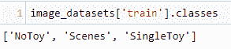

可以使用以下截图中的代码检索一批图像及其类索引：

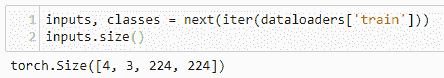

`inputs`张量的大小为`(batch, RGB, W,H)`。第一个大小为`4`的张量包含`0`（`NoToy`）、`1`（`Scenes`）或`2`（`SingleToy`），表示批次中每个图像的类。可以使用以下列表推导来检索批次中每个图像的类名：

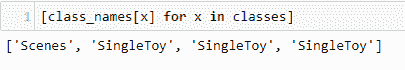

现在，让我们看一下用于训练模型的函数。这与我们先前的训练代码结构类似，但有一些增加。训练分为两个阶段，`train`和`val`。此外，需要在`train`阶段的每个`epoch`中调整学习率调度器，如下面截图中的代码所示：

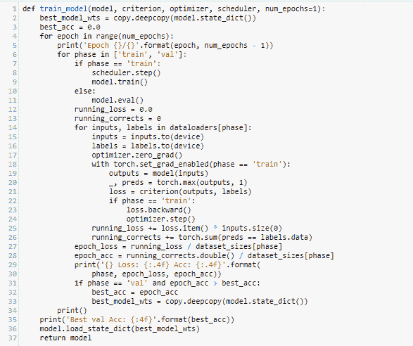

`train_model`函数的参数包括模型、损失标准、学习率调度器和 epoch 数。模型权重通过深复制`model.state_dict()`来存储。深复制确保所有状态字典的元素都被复制，而不仅仅是引用到`best_model_wts`变量中。每个 epoch 分为两个阶段，训练阶段和验证阶段。在验证阶段，使用`model.eval()`将模型设置为评估模式。这会改变一些模型层的行为，通常是 dropout 层，将 dropout 概率设置为零以验证完整模型。每个 epoch 打印训练和验证阶段的准确性和损失。完成后打印最佳验证准确性。

在运行训练代码之前，我们需要实例化模型并设置优化器、损失标准和学习率调度器。在这里，我们使用`resnet18`模型，如下面截图中的代码所示。这段代码适用于所有`resnet`变体，尽管准确性可能有所不同：

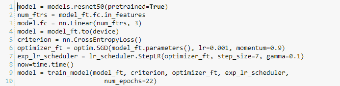

该模型使用了所有权重（不包括输出层），这些权重在`Imagenet`数据集上进行了训练。我们只需要改变输出层，因为所有隐藏层的权重都处于预训练状态并被冻结。这通过设置输出层为具有输出设置为我们预测的类数的线性层来完成。输出层本质上是我们正在处理的数据集的特征提取器。在输出时，我们尝试提取的特征就是类本身。

我们可以通过简单运行`print(model)`来查看模型的结构。最后一层被命名为`fc`，因此我们可以通过`model.fc`访问该层。这被分配了一个线性层，并传递了输入特征的数量，通过`fc.in_features`访问，并且输出类的数量，在这里设置为`3`。当我们运行这个模型时，我们能够达到大约 90%的准确率，这实际上是相当令人印象深刻的，考虑到我们使用的小数据集。这是可能的，因为除了最后一层之外，大部分训练都是在一个更大的训练集上完成的。

可以通过对训练代码进行少量更改来使用其他预训练模型，这是一种值得的练习。例如，DenseNet 模型可以直接替换 ResNet，只需将输出层的名称从`fc`更改为`classifier`，所以我们不再写`model.fc`而是写`model.classifier`。SqueezeNet、VGG 和 AlexNet 将它们的最后层包装在一个顺序容器中，所以要更改输出`fc`层，我们需要经历以下四个步骤：

1.  找出输出层中过滤器的数量

1.  将顺序对象中的层转换为列表，并移除最后一个元素

1.  在列表末尾添加最后一个线性层，指定输出类的数量

1.  将列表转换回顺序容器并将其添加到模型类中

对于`vgg11`模型，可以使用以下代码来实现这四个步骤：

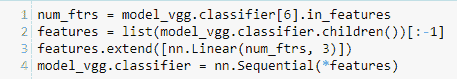

# 摘要

现在您已经对深度学习的基础有了理解，应该能够将这些知识应用于您感兴趣的特定学习问题上。在本章中，我们已经开发了一个使用预训练模型进行图像分类的开箱即用解决方案。正如您所见，这个实现相当简单，并且可以应用于您能想到的几乎任何图像分类问题。当然，每种情况下的实际表现将取决于所呈现的图像数量和质量，以及与每个模型和任务相关的超参数的精确调整。

通过简单地使用预训练模型和默认参数，通常可以在大多数图像分类任务上获得非常好的结果。这不需要理论知识，除了安装程序的运行环境。当你调整一些参数时，你会发现可以改善网络的训练时间和/或准确率。例如，你可能已经注意到，增加学习率可能会在少数 epochs 内显著提高模型的性能，但在后续 epochs 中，准确率实际上会下降。这是梯度下降过冲的一个例子，未能找到真正的最优解。要找到最佳的学习率，需要一些梯度下降的知识。

要充分利用 PyTorch，并将其应用于不同的问题领域——如语言处理、物理建模、天气和气候预测等（应用几乎无穷无尽）——你需要对这些算法背后的理论有一定的了解。这不仅可以改进已知任务，如图像分类，还可以让你洞察深度学习在某些情况下的应用，例如输入数据为时间序列，任务是预测下一个序列。阅读本书后，你应该知道解决方案，也就是使用递归网络。你会注意到，我们用来生成文本的模型——即在序列上做出预测的模型——与用来对静态图像数据进行预测的模型有很大不同。但是，为了帮助你洞察特定过程而建立的模型又是什么样的呢？这可能是网站上的电子流量、道路网络上的物理流量、地球的碳氧循环或人类生物系统。这些是深度学习的前沿，具有巨大的潜力去创造好的影响。希望阅读这篇简短介绍让你感到自信，并激发你开始探索其中一些应用。
