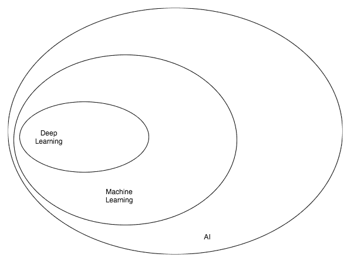
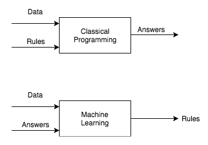
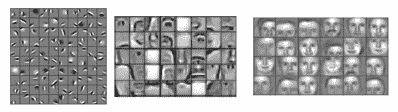
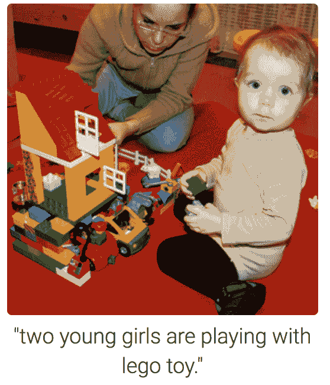
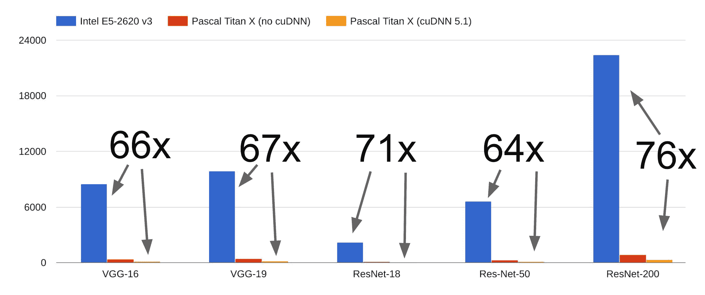

# 使用 PyTorch 入门深度学习

**深度学习**（**DL**）已经彻底改变了一个又一个行业。安德鲁·吴曾在 Twitter 上著名地描述过：

*人工智能是新的电力！*

电力改变了无数行业；**人工智能**（**AI**）现在将做同样的事情。

AI 和 DL 被用作同义词，但两者之间存在重大差异。让我们揭开行业术语的神秘面纱，这样作为从业者的你将能够区分信号和噪音。

在本章中，我们将涵盖以下 AI 的不同部分：

+   AI 本身及其起源

+   在现实世界中的机器学习

+   深度学习的应用

+   为什么现在是深度学习的时代？

+   深度学习框架：PyTorch

# 人工智能

每天都有无数篇讨论 AI 的文章发布。这种趋势在过去两年中有所增加。网络上流传着几种 AI 的定义，我最喜欢的是*自动执行通常由人类执行的智力任务*。

# AI 的历史

*人工智能*这个术语最初由约翰·麦卡锡在 1956 年首次创造，当时他举办了第一届学术会议。关于机器是否会思考的问题的旅程比这早得多。在 AI 的早期阶段，机器能够解决人类难以解决的问题。

例如，恩尼格玛机器是在二战结束时建造的，用于军事通信。艾伦·图灵建造了一个 AI 系统，帮助破译恩尼格玛密码。破译恩尼格玛密码对人类来说是一个非常具有挑战性的任务，分析人员可能需要数周的时间。AI 机器能够在几小时内破译该密码。

计算机难以解决我们直觉上理解的问题，比如区分狗和猫，判断朋友是否因为你迟到而对你生气（情感），区分卡车和汽车，参加研讨会时做笔记（语音识别），或为不理解你的语言的朋友转换笔记（例如，从法语到英语）。大多数这些任务对我们来说都很直观，但我们无法编程或硬编码计算机来执行这些任务。早期 AI 机器的大多数智能是硬编码的，比如一个计算机程序来玩国际象棋。

在 AI 的早期年代，许多研究人员认为可以通过硬编码规则实现 AI。这种类型的 AI 称为**符号 AI**，在解决定义良好的逻辑问题方面很有用，但几乎无法解决复杂的问题，如图像识别、物体检测、物体分割、语言翻译和自然语言理解任务。为了解决这些问题，开发了新的 AI 方法，如机器学习和深度学习。

为了更好地理解 AI、ML 和 DL 之间的关系，让我们将它们想象成同心圆。AI——最先提出的概念（最大的圆），然后是机器学习——稍后发展起来的（位于更大圆的内部），最后是 DL——驱动今天 AI 爆炸的（在两者之内）：

如何 AI、机器学习和深度学习相互配合

# 机器学习

**机器学习**（**ML**）是 AI 的一个子领域，在过去 10 年变得流行，并且有时两者可以互换使用。AI 除了机器学习之外还有许多其他子领域。ML 系统通过展示大量示例来构建，与符号 AI 不同，后者在构建系统时硬编码规则。在高层次上，机器学习系统查看大量数据并提出规则，以预测未见数据的结果：

机器学习与传统编程的比较

大多数 ML 算法在结构化数据上表现良好，比如销售预测、推荐系统和营销个性化。对于任何 ML 算法来说，特征工程是一个重要因素，数据科学家需要花费大量时间来正确获取 ML 算法所需的特征。在某些领域，如计算机视觉和**自然语言处理**（**NLP**），特征工程具有挑战性，因为它们受到高维度的影响。

直到最近，这类问题对于使用典型的机器学习技术（如线性回归、随机森林等）来解决的组织来说是具有挑战性的，原因包括特征工程和高维度。考虑一幅大小为 224 x 224 x 3（高度 x 宽度 x 通道）的图像，图像尺寸中的*3*代表彩色图像中红色、绿色和蓝色通道的值。要将此图像存储在计算机内存中，我们的矩阵将包含每个图像 150,528 个维度。假设您想在大小为 224 x 224 x 3 的 1,000 幅图像上构建分类器，维度将变为 1,000 倍的 150,528。一种名为**深度学习**的机器学习特殊分支允许您使用现代技术和硬件处理这些问题。

# 生活中机器学习的例子

以下是一些由机器学习驱动的酷产品：

+   **示例 1**：Google Photos 使用一种特定形式的机器学习，称为**深度学习来对照片进行分组**

+   **示例 2**：推荐系统是 ML 算法家族的一部分，用于推荐电影、音乐和产品，像 Netflix、Amazon 和 iTunes 这样的大公司。

# 深度学习

传统 ML 算法使用手写特征提取来训练算法，而 DL 算法使用现代技术以自动方式提取这些特征。

例如，一个深度学习算法预测图像是否包含人脸，提取特征如第一层检测边缘，第二层检测形状如鼻子和眼睛，最后一层检测面部形状或更复杂的结构。每一层都基于前一层对数据的表示进行训练。如果你觉得这个解释难以理解，书的后面章节将帮助你直观地构建和检查这样的网络：

可视化中间层的输出（图片来源：https://www.cs.princeton.edu/~rajeshr/papers/cacm2011-researchHighlights-convDBN.pdf）

近年来，随着 GPU、大数据、云服务提供商如**亚马逊网络服务**（**AWS**）和 Google Cloud 的兴起，以及 Torch、TensorFlow、Caffe 和 PyTorch 等框架，深度学习的应用大幅增长。此外，大公司分享在庞大数据集上训练的算法，从而帮助初创公司在多个用例上轻松构建最先进的系统。

# 深度学习的应用

通过深度学习实现的一些热门应用包括：

+   近乎人类水平的图像分类

+   近乎人类水平的语音识别

+   机器翻译

+   自动驾驶汽车

+   Siri、Google Voice 和 Alexa 近年来变得更加准确

+   一位日本农民正在分类黄瓜

+   肺癌检测

+   超过人类水平精度的语言翻译

下面的截图展示了一个简短的总结示例，计算机将大段文本进行概括，用几行来呈现：

由计算机生成的样本段落摘要

在下图中，计算机被给予一张普通的图像，没有告诉它显示的是什么，利用物体检测和字典的帮助，你得到一张图像标题，说**两个年轻女孩正在玩乐高玩具**。这不是很棒吗？

物体检测和图像标题（图片来源：https://cs.stanford.edu/people/karpathy/cvpr2015.pdf）

# 与深度学习相关的炒作

媒体和 AI 领域外的人，或者那些不是真正的 AI 和深度学习从业者的人，一直在暗示像《终结者 2：审判日》的情节可能会随着 AI/DL 的进步成为现实。他们中的一些人甚至谈论到一个时代，我们将被机器人控制，机器人决定什么对人类有益。目前，AI 的能力被夸大到远远超出其真实能力的程度。目前，大多数深度学习系统在非常受控制的环境中部署，并且给出了有限的决策边界。

我的猜测是，当这些系统能够学会做出智能决策时，而不仅仅是完成模式匹配时，当数百或数千个深度学习算法能够共同工作时，也许我们可以期待看到像科幻电影中那样的机器人。实际上，我们离得到机器能够在没有被告知的情况下做任何事情的普遍人工智能还很遥远。当前的深度学习状态更多地是关于从现有数据中找到模式以预测未来结果。作为深度学习从业者，我们需要区分信号和噪音。

# 深度学习的历史

尽管近年来深度学习变得流行，但深度学习背后的理论自 20 世纪 50 年代以来一直在发展。以下表格展示了今天在 DL 应用中使用的一些最流行的技术及其大致时间表：

| **技术** | **年份** |
| --- | --- |
| 神经网络 | 1943 年 |
| 反向传播 | 1960 年代早期 |
| 卷积神经网络 | 1979 |
| 循环神经网络 | 1980 年 |
| 长短期记忆 | 1997 年 |

多年来，深度学习被赋予了几个名字。在 1970 年代被称为**控制论**，在 1980 年代被称为*连接主义*，现在则通常称为*深度学习*或*神经网络*。我们将 DL 和神经网络互换使用。神经网络通常被称为受人类大脑工作启发的算法。然而，作为 DL 从业者，我们需要理解，它主要受数学（线性代数和微积分）、统计学（概率）和软件工程的强大理论支持。

# 为什么现在？

为什么 DL 现在如此流行？一些关键原因如下：

+   硬件可用性

+   数据与算法

+   深度学习框架

# 硬件可用性

深度学习需要在数百万、有时甚至数十亿个参数上执行复杂的数学操作。现有的 CPU 执行这些操作需要很长时间，尽管在过去几年已有所改进。一种新型的硬件称为**图形处理单元**（**GPU**）能够以数量级更快的速度完成这些大规模的数学运算，如矩阵乘法。

最初，GPU 是由 Nvidia 和 AMD 等公司为游戏行业构建的。事实证明，这种硬件不仅在渲染高质量视频游戏时非常有效，还能加速 DL 算法。最近 Nvidia 推出的一款 GPU，*1080ti*，仅需几天即可在`ImageNet`数据集上构建出图像分类系统，而此前可能需要大约一个月。

如果你计划购买用于运行深度学习的硬件，我建议根据预算选择一款来自 Nvidia 的 GPU。根据你的预算选择一款内存足够的 GPU。请记住，你的计算机内存和 GPU 内存是两回事。1080ti 配备了 11 GB 的内存，价格约为 700 美元。

您还可以使用 AWS、Google Cloud 或 Floyd（该公司提供专为深度学习优化的 GPU 机器）等各种云服务提供商。如果您刚开始学习深度学习或者为组织使用设置机器时具有更多的财务自由度，使用云服务提供商是经济的选择。

如果这些系统经过优化，性能可能会有所变化。

下图显示了 CPU 和 GPU 之间性能比较的一些基准：

在 CPU 和 GPU 上神经架构的性能基准（图片来源：http://cs231n.stanford.edu/slides/2017/cs231n_2017_lecture8.pdf）

# 数据和算法

数据是深度学习成功的最重要组成部分。由于互联网的广泛采用和智能手机的增长使用，一些公司（如 Facebook 和 Google）已经能够收集大量数据，包括文本、图片、视频和音频等多种格式。在计算机视觉领域，ImageNet 竞赛在提供了包括 1,000 个类别的 1.4 百万张图像数据集方面发挥了巨大作用。

这些类别是手动注释的，每年有数百个团队参加竞争。在竞赛中成功的一些算法包括 VGG、ResNet、Inception、DenseNet 等。这些算法今天在行业中用于解决各种计算机视觉问题。在深度学习领域中经常用来对比各种算法性能的其他流行数据集如下：

+   MNIST

+   COCO 数据集

+   CIFAR

+   街景房屋数字

+   PASCAL VOC

+   Wikipedia 的数据集

+   20 个新闻组

+   Penn Treebank

+   Kaggle

最近几年不同算法的发展，如批归一化、激活函数、跳跃连接、**长短期记忆网络（LSTM）**、dropout 等，使得能够更快、更成功地训练非常深的网络。在本书的接下来章节中，我们将详细讨论每个技术以及它们如何帮助构建更好的模型。

# 深度学习框架

在早期，人们需要具备 C++和 CUDA 的专业知识来实现深度学习算法。随着许多组织现在开源他们的深度学习框架，具备脚本语言（如 Python）知识的人员就可以开始构建和使用深度学习算法。今天在行业中使用的一些流行的深度学习框架包括 TensorFlow、Caffe2、Keras、Theano、PyTorch、Chainer、DyNet、MXNet 和 CNTK。

如果没有这些框架的存在，深度学习的采用不可能会如此巨大。它们抽象了很多底层复杂性，使我们能够专注于应用。我们仍处于深度学习的早期阶段，在各公司和组织中每天都有许多研究突破。因此，各种框架都有其优缺点。

# PyTorch

PyTorch 以及大多数其他深度学习框架，可以用于两种不同的目的：

+   使用 GPU 加速操作替代类似 NumPy 的操作

+   构建深度神经网络

使 PyTorch 日益流行的原因是其易用性和简单性。与大多数其他流行的深度学习框架使用静态计算图不同，PyTorch 使用动态计算，允许更大的灵活性来构建复杂的架构。

PyTorch 广泛使用 Python 概念，如类、结构和条件循环，使我们能够以纯面向对象的方式构建深度学习算法。大多数其他流行的框架带来了它们自己的编程风格，有时使编写新算法复杂化，并且不支持直观的调试。在后续章节中，我们将详细讨论计算图。

虽然 PyTorch 最近发布并且仍处于 beta 版本阶段，但由于其易用性、更好的性能、易于调试的特性以及来自 SalesForce 等各种公司的强大支持，它已经在数据科学家和深度学习研究人员中广受欢迎。

由于 PyTorch 主要是为研究而构建的，在某些对延迟要求非常高的情况下，不推荐用于生产环境。然而，随着一个名为**Open Neural Network Exchange**（**ONNX**）的新项目的推出（[`onnx.ai/`](https://onnx.ai/)），情况正在发生变化，该项目致力于将在 PyTorch 上开发的模型部署到像 Caffe2 这样的生产就绪平台。在撰写本文时，关于这个项目还为时过早。该项目由 Facebook 和 Microsoft 支持。

在本书的其余部分，我们将学习关于在计算机视觉和自然语言处理领域构建强大深度学习应用程序的各种乐高积木（更小的概念或技术）。

# 摘要

在本章的介绍中，我们探讨了人工智能、机器学习和深度学习的定义，并讨论了它们之间的区别。我们还看了它们在日常生活中的应用。我们深入探讨了为什么深度学习现在才变得更加流行。最后，我们对 PyTorch 进行了初步介绍，这是一个深度学习框架。

在下一章中，我们将在 PyTorch 中训练我们的第一个神经网络。
