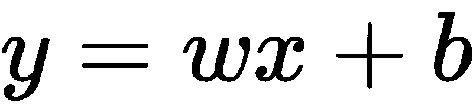
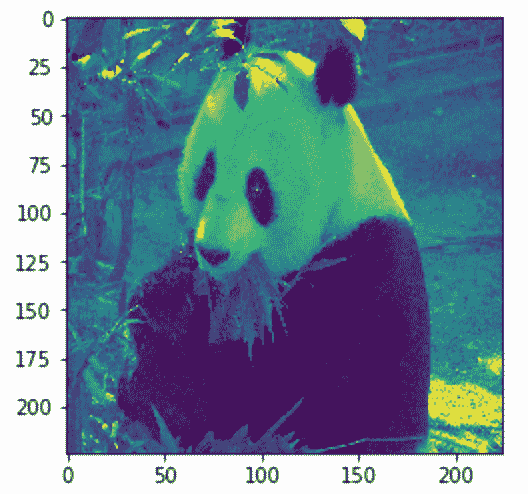
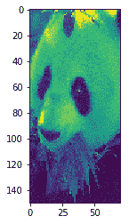
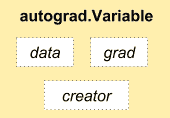
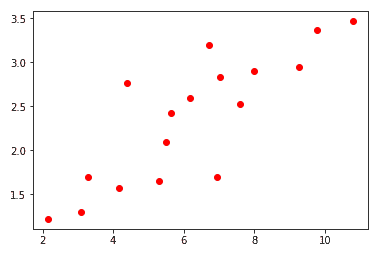
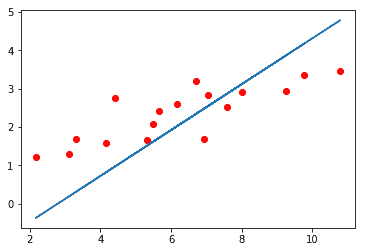

# 神经网络的构建模块

理解神经网络的基本构建模块，如张量、张量操作和梯度下降，对于构建复杂的神经网络至关重要。在本章中，我们将通过以下主题构建我们的第一个`Hello world`神经网络程序：

+   安装 PyTorch

+   实现我们的第一个神经网络

+   将神经网络拆分为功能块

+   逐步了解每个基础模块，涵盖张量、变量、自动微分、梯度和优化器

+   使用 PyTorch 加载数据

# 安装 PyTorch

PyTorch 可作为 Python 包使用，您可以选择使用`pip`或`conda`来安装，或者您可以从源代码构建。本书推荐的方法是使用 Anaconda Python 3 发行版。要安装 Anaconda，请参考 Anaconda 官方文档 [`conda.io/docs/user-guide/install/index.html`](https://conda.io/docs/user-guide/install/index.html)。所有示例将作为 Jupyter Notebook 提供在本书的 GitHub 仓库中。我强烈建议您使用 Jupyter Notebook，因为它允许您进行交互式实验。如果您已经安装了 Anaconda Python，则可以按照以下步骤安装 PyTorch。

基于 CUDA 8 的 GPU 安装

```py
conda install pytorch torchvision cuda80 -c soumith
```

基于 CUDA 7.5 的 GPU 安装：

```py
conda install pytorch torchvision -c soumith
```

非 GPU 安装：

```py
conda install pytorch torchvision -c soumith
```

在撰写本文时，PyTorch 不支持 Windows 操作系统，因此您可以尝试使用**虚拟机**（**VM**）或 Docker 镜像。

# 我们的第一个神经网络

我们展示了我们的第一个神经网络，它学习如何将训练样本（输入数组）映射到目标（输出数组）。假设我们为最大的在线公司之一**奇妙电影**工作，该公司提供视频点播服务。我们的训练数据集包含一个特征，代表用户在平台上观看电影的平均时间，我们想预测每个用户在未来一周内在平台上的使用时间。这只是一个虚构的用例，不要过于深思。构建这样一个解决方案的一些高级活动如下：

+   **数据准备**：`get_data` 函数准备包含输入和输出数据的张量（数组）。

+   **创建可学习参数**：`get_weights` 函数提供了包含随机值的张量，我们将优化以解决问题

+   **网络模型**：`simple_network` 函数为输入数据生成输出，应用线性规则，将权重与输入数据相乘，并添加偏差项（*y = Wx+b*）

+   **损失**：`loss_fn` 函数提供了关于模型性能的信息

+   **优化器**：`optimize` 函数帮助我们调整最初创建的随机权重，以帮助模型更准确地计算目标值

如果您是机器学习的新手，不用担心，因为我们将在本章结束时准确了解每个函数的功能。以下函数将 PyTorch 代码抽象化，以便更容易理解。我们将详细探讨每个功能的细节。上述高级活动对大多数机器学习和深度学习问题都很常见。本书后面的章节讨论了用于改进每个功能以构建有用应用程序的技术。

让我们考虑我们神经网络的线性回归方程：



让我们在 PyTorch 中编写我们的第一个神经网络：

```py
x,y = get_data() # x - represents training data,y -                 represents target variables

w,b = get_weights() # w,b - Learnable parameters

for i in range(500):
    y_pred = simple_network(x) # function which computes wx + b
    loss = loss_fn(y,y_pred) # calculates sum of the squared differences of y and y_pred

if i % 50 == 0: 
        print(loss)
    optimize(learning_rate) # Adjust w,b to minimize the loss
```

在本章末尾，您将对每个函数内部发生的情况有所了解。

# 数据准备

PyTorch 提供了称为`张量`和`变量`的两种数据抽象。张量类似于`numpy`数组，可以在 GPU 上使用，提供了增强的性能。它们提供了在 GPU 和 CPU 之间轻松切换的方法。对于某些操作，我们可以注意到性能的提升，并且只有当表示为数字张量时，机器学习算法才能理解不同形式的数据。张量类似于 Python 数组，并且可以改变大小。例如，图像可以表示为三维数组（高度、宽度、通道（RGB））。在深度学习中使用大小高达五维的张量是很常见的。一些常用的张量如下：

+   标量（0-D 张量）

+   向量（1-D 张量）

+   矩阵（2-D 张量）

+   3-D 张量

+   切片张量

+   4-D 张量

+   5-D 张量

+   GPU 上的张量

# 标量（0-D 张量）

只包含一个元素的张量称为**标量**。通常会是`FloatTensor`或`LongTensor`类型。在撰写本文时，PyTorch 没有零维特殊张量。因此，我们使用一个具有一个元素的一维张量，如下所示：

```py
x = torch.rand(10)
x.size()

Output - torch.Size([10])
```

# 向量（1-D 张量）

`向量`只是一个元素数组。例如，我们可以使用一个向量来存储上周的平均温度：

```py
temp = torch.FloatTensor([23,24,24.5,26,27.2,23.0])
temp.size()

Output - torch.Size([6])
```

# 矩阵（2-D 张量）

大多数结构化数据以表格或矩阵形式表示。我们将使用名为`Boston House Prices`的数据集，它在 Python scikit-learn 机器学习库中已经准备好。数据集是一个`numpy`数组，包含`506`个样本或行和`13`个特征，每个样本表示一个。Torch 提供了一个实用函数`from_numpy()`，它将`numpy`数组转换为`torch`张量。结果张量的形状是`506`行 x `13`列：

```py
boston_tensor = torch.from_numpy(boston.data)
boston_tensor.size()

Output: torch.Size([506, 13])

boston_tensor[:2]

Output:
Columns 0 to 7 
   0.0063 18.0000 2.3100 0.0000 0.5380 6.5750 65.2000 4.0900
   0.0273 0.0000 7.0700 0.0000 0.4690 6.4210 78.9000 4.9671

Columns 8 to 12 
   1.0000 296.0000 15.3000 396.9000 4.9800
   2.0000 242.0000 17.8000 396.9000 9.1400
[torch.DoubleTensor of size 2x13]
```

# 3-D 张量

当我们将多个矩阵相加时，我们得到一个 *3-D 张量*。3-D 张量用于表示类似图像的数据。图像可以表示为矩阵中的数字，这些数字被堆叠在一起。图像形状的一个例子是 `224`、`224`、`3`，其中第一个索引表示高度，第二个表示宽度，第三个表示通道（RGB）。让我们看看计算机如何使用下一个代码片段看到一只熊猫：

```py
from PIL import Image
# Read a panda image from disk using a library called PIL and convert it to numpy array
panda = np.array(Image.open('panda.jpg').resize((224,224)))
panda_tensor = torch.from_numpy(panda)
panda_tensor.size()

Output - torch.Size([224, 224, 3])
#Display panda
plt.imshow(panda)

```

由于显示大小为 `224`、`224`、`3` 的张量会占据书中的几页，我们将显示图像并学习如何将图像切成较小的张量以进行可视化：


显示图像

# 切片张量

对张量进行切片是常见的操作。一个简单的例子可能是选择一维张量 `sales` 的前五个元素；我们使用简单的表示法 `sales[:slice_index]`，其中 `slice_index` 表示要切片张量的索引：

```py
sales = torch.FloatTensor([1000.0,323.2,333.4,444.5,1000.0,323.2,333.4,444.5])

sales[:5]
 1000.0000
  323.2000
  333.4000
  444.5000
 1000.0000
[torch.FloatTensor of size 5]

sales[:-5]
 1000.0000
  323.2000
  333.4000
[torch.FloatTensor of size 3]

```

让我们用熊猫图像做更有趣的事情，比如看看当只选择一个通道时熊猫图像是什么样子，以及如何选择熊猫的脸部。

在这里，我们从熊猫图像中选择了一个通道：

```py
plt.imshow(panda_tensor[:,:,0].numpy())
#0 represents the first channel of RGB
```

输出如下所示：



现在，让我们裁剪图像。假设我们要构建一个熊猫的面部检测器，我们只需要熊猫的面部。我们裁剪张量图像，使其仅包含熊猫的面部：

```py
plt.imshow(panda_tensor[25:175,60:130,0].numpy())
```

输出如下所示：



另一个常见的例子是需要选择张量的特定元素：

```py
#torch.eye(shape) produces an diagonal matrix with 1 as it diagonal #elements.
sales = torch.eye(3,3)
sales[0,1]

Output- 0.00.0
```

我们将在第五章，*深度学习用于计算机视觉*中重新讨论图像数据时，讨论使用 CNN 构建图像分类器。

大多数 PyTorch 张量操作与 `NumPy` 操作非常相似。

# 4-D 张量

四维张量类型的一个常见例子是图像批次。现代 CPU 和 GPU 都经过优化，可以更快地在多个示例上执行相同的操作。因此，它们处理一张图像或一批图像的时间相似。因此，常见的做法是使用一批示例而不是逐个使用单个图像。选择批次大小并不简单；它取决于多个因素。使用更大的批次或完整数据集的一个主要限制是 GPU 内存限制—*16*、*32* 和 *64* 是常用的批次大小。

让我们看一个例子，我们加载一个大小为 `64` x `224` x `224` x `3` 的猫图像批次，其中 *64* 表示批次大小或图像数量，*244* 表示高度和宽度，*3* 表示通道：

```py
#Read cat images from disk
cats = glob(data_path+'*.jpg')
#Convert images into numpy arrays
cat_imgs = np.array([np.array(Image.open(cat).resize((224,224))) for cat in cats[:64]]) 
cat_imgs = cat_imgs.reshape(-1,224,224,3)
cat_tensors = torch.from_numpy(cat_imgs)
cat_tensors.size()

Output - torch.Size([64, 224, 224, 3])
```

# 5-D 张量

一个常见的例子是，您可能需要使用五维张量来处理视频数据。视频可以分割成帧，例如，一个 30 秒的视频包含一个熊猫和一个球玩耍的视频可能包含 30 帧，可以表示为形状为（1 x 30 x 224 x 224 x 3）的张量。一批这样的视频可以表示为形状为（32 x 30 x 224 x 224 x 3）的张量，*30*在这个例子中表示单个视频剪辑中的帧数，其中*32*表示这样的视频剪辑数量。

# GPU 上的张量

我们已经学习了如何在张量表示中表示不同形式的数据。一旦数据以张量形式存在，我们执行的一些常见操作包括加法、减法、乘法、点积和矩阵乘法。所有这些操作可以在 CPU 或 GPU 上执行。PyTorch 提供了一个简单的函数叫做`cuda()`来将一个在 CPU 上的张量复制到 GPU 上。我们将看一些操作并比较在 CPU 和 GPU 上矩阵乘法操作的性能。

张量加法可以通过以下代码获得：

```py
#Various ways you can perform tensor addition
a = torch.rand(2,2) 
b = torch.rand(2,2)
c = a + b
d = torch.add(a,b)
#For in-place addition
a.add_(5)

#Multiplication of different tensors

a*b
a.mul(b)
#For in-place multiplication
a.mul_(b)
```

对于张量矩阵乘法，我们比较在 CPU 和 GPU 上的代码性能。任何张量可以通过调用`.cuda()`函数移动到 GPU 上。

GPU 上的乘法运行如下：

```py
a = torch.rand(10000,10000)
b = torch.rand(10000,10000)

a.matmul(b)

Time taken: 3.23 s

#Move the tensors to GPU
a = a.cuda()
b = b.cuda()

a.matmul(b)

Time taken: 11.2 µs
```

这些基本操作包括加法、减法和矩阵乘法，可以用来构建复杂的操作，比如**卷积神经网络**（**CNN**）和**循环神经网络**（**RNN**），这些我们将在本书的后面章节学习。

# 变量

深度学习算法通常表示为计算图。这里是我们在例子中构建的变量计算图的简单示例：


变量计算图

在上述计算图中，每个圆圈表示一个变量。一个变量围绕一个张量对象、它的梯度和创建它的函数引用形成一个薄包装。下图展示了`Variable`类的组成部分：



变量类

梯度指的是`loss`函数相对于各个参数（**W**、**b**）的变化率。例如，如果**a**的梯度为 2，那么**a**值的任何变化都将使**Y**值增加两倍。如果这不清楚，不要担心——大多数深度学习框架会帮我们计算梯度。在本章中，我们将学习如何利用这些梯度来提高模型的性能。

除了梯度外，变量还有一个指向创建它的函数的引用，该函数反过来指向如何创建每个变量。例如，变量`a`包含它是由`X`和`W`的乘积生成的信息。

让我们看一个例子，我们在其中创建变量并检查梯度和函数引用：

```py
x = Variable(torch.ones(2,2),requires_grad=True)
y = x.mean()

y.backward()

x.grad
Variable containing:
 0.2500  0.2500
 0.2500  0.2500
[torch.FloatTensor of size 2x2]

x.grad_fn
Output - None

x.data
 1 1
 1 1
[torch.FloatTensor of size 2x2]

y.grad_fn
<torch.autograd.function.MeanBackward at 0x7f6ee5cfc4f8>
```

在前面的例子中，我们对变量执行了`backward`操作以计算梯度。默认情况下，变量的梯度为 none。

变量的`grad_fn`指向它创建的函数。如果变量是用户创建的，例如我们的变量`x`，那么函数引用为`None`。对于变量`y`，它指向其函数引用，`MeanBackward`。

数据属性访问与变量相关联的张量。

# 为我们的神经网络创建数据

我们第一个神经网络代码中的`get_data`函数创建了两个变量`x`和`y`，大小分别为（`17`，`1`）和（`17`）。我们将看一下函数内部发生了什么：

```py
def get_data():
    train_X = np.asarray([3.3,4.4,5.5,6.71,6.93,4.168,9.779,6.182,7.59,2.167,
                         7.042,10.791,5.313,7.997,5.654,9.27,3.1])
    train_Y = np.asarray([1.7,2.76,2.09,3.19,1.694,1.573,3.366,2.596,2.53,1.221,
                         2.827,3.465,1.65,2.904,2.42,2.94,1.3])
    dtype = torch.FloatTensor
    X = Variable(torch.from_numpy(train_X).type(dtype),requires_grad=False).view(17,1)
    y = Variable(torch.from_numpy(train_Y).type(dtype),requires_grad=False)
    return X,y

```

# 创建可学习参数

在我们的神经网络示例中，我们有两个可学习参数，`w`和`b`，以及两个固定参数，`x`和`y`。我们在`get_data`函数中创建了变量`x`和`y`。可学习参数是使用随机初始化创建的，并且`require_grad`参数设置为`True`，而`x`和`y`的设置为`False`。有不同的实践方法用于初始化可学习参数，我们将在接下来的章节中探讨。让我们看一下我们的`get_weights`函数：

```py
def get_weights():
    w = Variable(torch.randn(1),requires_grad = True)
    b = Variable(torch.randn(1),requires_grad=True)
    return w,b
```

大部分前面的代码都是不言自明的；`torch.randn`创建给定形状的随机值。

# 神经网络模型

一旦我们使用 PyTorch 变量定义了模型的输入和输出，我们必须构建一个模型，该模型学习如何映射输出到输入。在传统编程中，我们通过手工编码不同的逻辑来构建函数，将输入映射到输出。然而，在深度学习和机器学习中，我们通过向其展示输入和关联输出来学习函数。在我们的例子中，我们实现了一个简单的神经网络，试图将输入映射到输出，假设是线性关系。线性关系可以表示为*y = wx + b*，其中*w*和*b*是可学习参数。我们的网络必须学习*w*和*b*的值，以便*wx + b*更接近实际*y*。让我们可视化我们的训练数据集和我们的神经网络必须学习的模型：



输入数据点

以下图表示在输入数据点上拟合的线性模型：



在输入数据点上拟合的线性模型

图像中的深灰色（蓝色）线代表我们的网络学到的模型。

# 网络实现

由于我们有所有参数（`x`，`w`，`b`和`y`）来实现网络，我们对`w`和`x`进行矩阵乘法。然后，将结果与`b`相加。这将给出我们预测的`y`。函数实现如下：

```py
def simple_network(x):
    y_pred = torch.matmul(x,w)+b
    return y_pred
```

PyTorch 还提供了一个名为 `torch.nn` 的更高级抽象，称为**层**，它将处理大多数神经网络中可用的常见技术的初始化和操作。我们使用较低级别的操作来理解这些函数内部发生的情况。在以后的章节中，即 第五章，计算机视觉的深度学习和 第六章，序列数据和文本的深度学习，我们将依赖于 PyTorch 抽象来构建复杂的神经网络或函数。前面的模型可以表示为一个 `torch.nn` 层，如下所示：

```py
f = nn.Linear(17,1) # Much simpler.
```

现在我们已经计算出了 `y` 值，我们需要知道我们的模型有多好，这是在 `loss` 函数中完成的。

# 损失函数

由于我们从随机值开始，我们的可学习参数 `w` 和 `b` 会导致 `y_pred`，它与实际的 `y` 差距很大。因此，我们需要定义一个函数，告诉模型其预测与实际值的接近程度。由于这是一个回归问题，我们使用一个称为**平方误差和**（**SSE**）的损失函数。我们取预测的 `y` 与实际 `y` 的差值并求平方。SSE 帮助模型理解预测值与实际值的接近程度。`torch.nn` 库提供了不同的损失函数，如 MSELoss 和交叉熵损失。然而，在本章中，让我们自己实现 `loss` 函数：

```py
def loss_fn(y,y_pred):
    loss = (y_pred-y).pow(2).sum()
    for param in [w,b]:
        if not param.grad is None: param.grad.data.zero_()
    loss.backward()
    return loss.data[0]
```

除了计算损失之外，我们还调用 `backward` 操作来计算我们可学习参数 `w` 和 `b` 的梯度。由于我们将多次使用 `loss` 函数，因此通过调用 `grad.data.zero_()` 操作来删除先前计算的任何梯度。第一次调用 `backward` 函数时，梯度为空，因此只有在梯度不为 `None` 时才将梯度清零。

# 优化神经网络

我们从随机权重开始预测我们的目标，并为我们的算法计算损失。通过在最终 `loss` 变量上调用 `backward` 函数来计算梯度。整个过程在一个 epoch 中重复进行，即整个示例集。在大多数实际示例中，我们将在每次迭代中执行优化步骤，这是总集的一个小子集。一旦计算出损失，我们就用计算出的梯度优化值，使损失减少，这在下面的函数中实现：

```py
def optimize(learning_rate):
    w.data -= learning_rate * w.grad.data
    b.data -= learning_rate * b.grad.data
```

学习率是一个超参数，它允许我们通过梯度的微小变化来调整变量的值，其中梯度表示每个变量（`w` 和 `b`）需要调整的方向。

不同的优化器，如 Adam、RmsProp 和 SGD，已经在 `torch.optim` 包中实现供后续章节使用以减少损失或提高精度。

# 加载数据

为深度学习算法准备数据本身可能是一个复杂的流水线。PyTorch 提供许多实用类，通过多线程实现数据并行化、数据增强和批处理等复杂性抽象化。在本章中，我们将深入了解两个重要的实用类，即`Dataset`类和`DataLoader`类。要了解如何使用这些类，让我们从 Kaggle 的`Dogs vs. Cats`数据集（[`www.kaggle.com/c/dogs-vs-cats/data`](https://www.kaggle.com/c/dogs-vs-cats/data)）入手，创建一个数据流水线，以生成 PyTorch 张量形式的图像批次。

# 数据集类

任何自定义数据集类，例如我们的`Dogs`数据集类，都必须继承自 PyTorch 数据集类。自定义类必须实现两个主要函数，即`__len__(self)`和`__getitem__(self, idx)`。任何作为`Dataset`类的自定义类应如以下代码片段所示：

```py
from torch.utils.data import Dataset
class DogsAndCatsDataset(Dataset):
    def __init__(self,):
        pass
    def __len__(self):
        pass
    def __getitem__(self,idx):
        pass
```

我们在`init`方法内进行任何初始化（如果需要），例如读取表的索引和图像文件名，在我们的情况下。`__len__(self)`操作负责返回数据集中的最大元素数。`__getitem__(self, idx)`操作每次调用时根据索引返回一个元素。以下代码实现了我们的`DogsAndCatsDataset`类：

```py
class DogsAndCatsDataset(Dataset):

    def __init__(self,root_dir,size=(224,224)):
        self.files = glob(root_dir)
        self.size = size 

    def __len__(self):
        return len(self.files)

    def __getitem__(self,idx):
        img = np.asarray(Image.open(self.files[idx]).resize(self.size))
        label = self.files[idx].split('/')[-2]
        return img,label
```

一旦创建了`DogsAndCatsDataset`类，我们就可以创建一个对象并对其进行迭代，如下所示：

```py
for image,label in dogsdset:
#Apply your DL on the dataset.
```

在单个数据实例上应用深度学习算法并不理想。我们需要一批数据，因为现代 GPU 在批处理数据上执行时能够提供更好的性能优化。`DataLoader`类通过抽象化大量复杂性来帮助创建批次。

# 数据加载器类

PyTorch 的`utils`类中的`DataLoader`类结合了数据集对象和不同的采样器，例如`SequentialSampler`和`RandomSampler`，并提供了一个图像批次，使用单进程或多进程迭代器。采样器是为算法提供数据的不同策略。以下是我们的`Dogs vs. Cats`数据集的`DataLoader`示例：

```py
dataloader = DataLoader(dogsdset,batch_size=32,num_workers=2)
for imgs , labels in dataloader:
     #Apply your DL on the dataset.
     pass
```

`imgs`将包含形状为(32, 224, 224, 3)的张量，其中*32*表示批处理大小。

PyTorch 团队还维护了两个有用的库，称为`torchvision`和`torchtext`，它们构建在`Dataset`和`DataLoader`类之上。我们将在相关章节中使用它们。

# 摘要

在本章中，我们探讨了由 PyTorch 提供的各种数据结构和操作。我们使用 PyTorch 的基本组件实现了几个部分。对于我们的数据准备，我们创建了算法使用的张量。我们的网络架构是一个模型，用于学习预测用户在我们的 Wondermovies 平台上平均花费的小时数。我们使用损失函数来检查我们模型的标准，并使用`optimize`函数来调整模型的可学习参数，使其表现更好。

我们还探讨了 PyTorch 如何通过抽象化处理数据管道的多个复杂性，这些复杂性原本需要我们进行数据并行化和增强。

在下一章中，我们将深入探讨神经网络和深度学习算法的工作原理。我们将探索用于构建网络架构、损失函数和优化的各种 PyTorch 内置模块。我们还将展示如何在真实世界数据集上使用它们。
