# 第三章：深入研究神经网络

在本章中，我们将探索用于解决真实世界问题的深度学习架构的不同模块。在前一章中，我们使用 PyTorch 的低级操作来构建模块，如网络架构、损失函数和优化器。在本章中，我们将探讨解决实际问题所需的神经网络的重要组件，以及 PyTorch 通过提供大量高级功能来抽象掉许多复杂性。在本章末尾，我们将构建解决回归、二元分类和多类分类等真实世界问题的算法。

在本章中，我们将讨论以下主题：

+   深入探讨神经网络的各种构建模块

+   探索 PyTorch 中的高级功能，构建深度学习架构

+   将深度学习应用于真实世界的图像分类问题

# 深入探讨神经网络的构建模块

正如我们在前一章学到的，训练深度学习算法需要以下步骤：

1.  构建数据流水线

1.  构建网络架构

1.  使用损失函数评估架构

1.  使用优化算法优化网络架构权重

在前一章中，网络由使用 PyTorch 数值操作构建的简单线性模型组成。尽管使用数值操作为玩具问题构建神经架构更容易，但当我们尝试构建解决不同领域（如计算机视觉和自然语言处理）复杂问题所需的架构时，情况很快变得复杂。大多数深度学习框架（如 PyTorch、TensorFlow 和 Apache MXNet）提供高级功能，抽象掉许多这种复杂性。这些高级功能在深度学习框架中被称为**层**。它们接受输入数据，应用类似于我们在前一章中看到的转换，并输出数据。为了解决真实世界问题，深度学习架构由 1 到 150 个层组成，有时甚至更多。通过提供高级函数来抽象低级操作和训练深度学习算法的过程如下图所示：

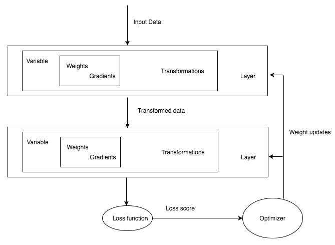

总结前一张图，任何深度学习训练都涉及获取数据，构建一般获取一堆层的架构，使用损失函数评估模型的准确性，然后通过优化权重优化算法。在解决一些真实世界问题之前，我们将了解 PyTorch 提供的用于构建层、损失函数和优化器的更高级抽象。

# 层 - 神经网络的基本构建块

在本章的其余部分中，我们将遇到不同类型的层次。首先，让我们尝试理解最重要的层之一，即线性层，它与我们之前的网络架构完全一样。线性层应用线性变换：

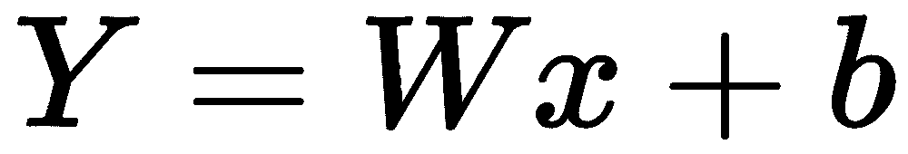

其强大之处在于我们在前一章中编写的整个函数可以用一行代码表示，如下所示：

```py
from torch.nn import Linear
myLayer = Linear(in_features=10,out_features=5,bias=True)
```

在上述代码中，`myLayer`将接受大小为`10`的张量，并在应用线性变换后输出大小为`5`的张量。让我们看一个如何做到这一点的简单示例：

```py
inp = Variable(torch.randn(1,10))
myLayer = Linear(in_features=10,out_features=5,bias=True)
myLayer(inp)
```

我们可以使用`weights`和`bias`属性访问层的可训练参数：

```py
myLayer.weight

Output :
Parameter containing:
-0.2386 0.0828 0.2904 0.3133 0.2037 0.1858 -0.2642 0.2862 0.2874 0.1141
 0.0512 -0.2286 -0.1717 0.0554 0.1766 -0.0517 0.3112 0.0980 -0.2364 -0.0442
 0.0776 -0.2169 0.0183 -0.0384 0.0606 0.2890 -0.0068 0.2344 0.2711 -0.3039
 0.1055 0.0224 0.2044 0.0782 0.0790 0.2744 -0.1785 -0.1681 -0.0681 0.3141
 0.2715 0.2606 -0.0362 0.0113 0.1299 -0.1112 -0.1652 0.2276 0.3082 -0.2745
[torch.FloatTensor of size 5x10]

myLayer.bias
 Output : Parameter containing:-0.2646-0.2232 0.2444 0.2177 0.0897torch.FloatTensor of size 5
```

线性层在不同框架中被称为**密集层**或**全连接层**。解决实际应用场景的深度学习架构通常包含多个层次。在 PyTorch 中，我们可以用多种方式实现，如下所示。

一个简单的方法是将一层的输出传递给另一层：

```py
myLayer1 = Linear(10,5)
myLayer2 = Linear(5,2)
myLayer2(myLayer1(inp))
```

每个层次都有自己可学习的参数。使用多个层次的理念是，每个层次将学习某种模式，后续层次将在此基础上构建。仅将线性层堆叠在一起存在问题，因为它们无法学习超出简单线性层表示的任何新内容。让我们通过一个简单的例子看看为什么堆叠多个线性层没有意义。

假设我们有两个线性层，具有以下权重：

| **层次** | **权重 1** |
| --- | --- |
| 层 1 | 3.0 |
| 层 2 | 2.0 |

具有两个不同层的前述架构可以简单地表示为具有不同层的单一层。因此，仅仅堆叠多个线性层并不会帮助我们的算法学习任何新内容。有时这可能不太清晰，因此我们可以通过以下数学公式可视化架构：

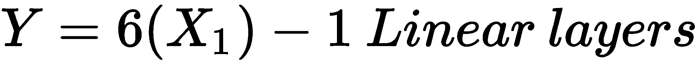

为了解决这个问题，我们有不同的非线性函数，帮助学习不同的关系，而不仅仅是线性关系。

深度学习中提供了许多不同的非线性函数。PyTorch 将这些非线性功能作为层提供，我们可以像使用线性层一样使用它们。

一些流行的非线性函数如下：

+   Sigmoid

+   Tanh

+   ReLU

+   Leaky ReLU

# 非线性激活函数

非线性激活是指接受输入并应用数学变换并产生输出的函数。在实践中，我们会遇到几种流行的非线性激活函数。我们将介绍一些常见的非线性激活函数。

# Sigmoid

Sigmoid 激活函数具有简单的数学形式，如下所示：

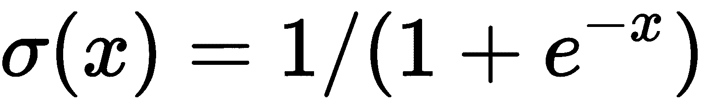

sigmoid 函数直观地接受一个实数，并输出一个介于零和一之间的数字。对于一个大的负数，它返回接近零，对于一个大的正数，它返回接近一。以下图表示不同 sigmoid 函数的输出：

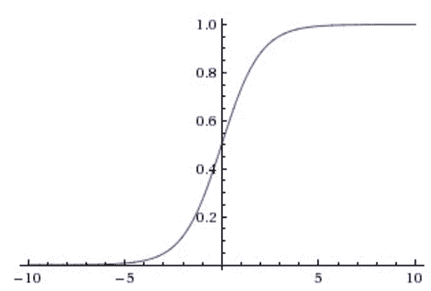

sigmoid 函数在历史上被广泛应用于不同的架构，但近年来已经不那么流行了，因为它有一个主要缺点。当 sigmoid 函数的输出接近零或一时，前 sigmoid 函数层的梯度接近零，因此前一层的可学习参数的梯度也接近零，权重很少被调整，导致死神经元。

# Tanh

tanh 非线性函数将一个实数压缩到-1 到 1 的范围内。当 tanh 输出接近-1 或 1 的极值时，也会面临梯度饱和的问题。然而，与 sigmoid 相比，它更受青睐，因为 tanh 的输出是零中心化的：

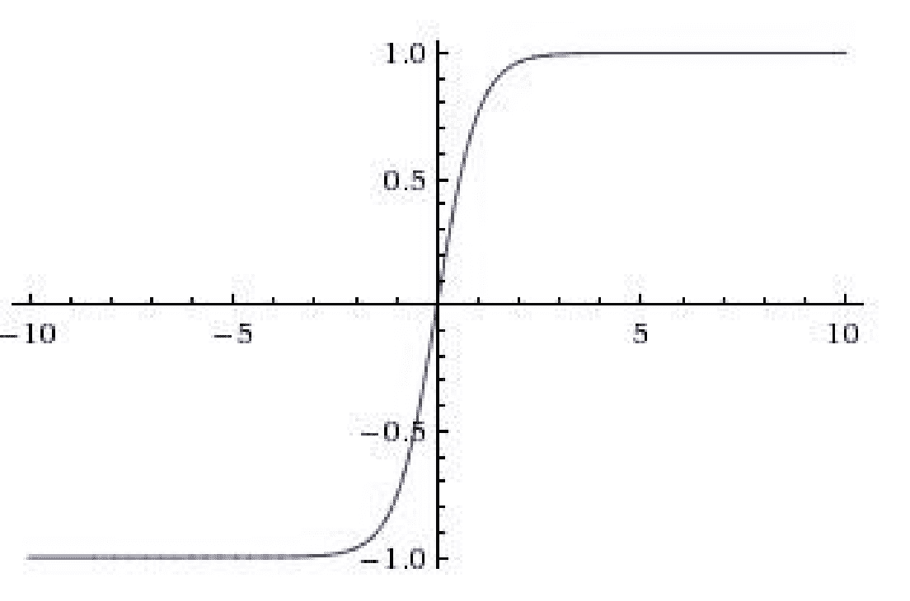

图像来源：http://datareview.info/article/eto-nuzhno-znat-klyuchevyie-rekomendatsii-po-glubokomu-obucheniyu-chast-2/

# ReLU

近年来，ReLU 变得更加流行；我们几乎可以在任何现代架构中找到它的使用或其变体的使用。它有一个简单的数学公式：

*f(x)=max(0,x)*

简单来说，ReLU 将任何负输入压缩为零，并保留正数不变。我们可以将 ReLU 函数可视化如下：

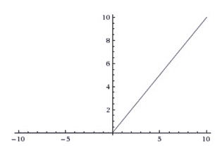

图像来源：http://datareview.info/article/eto-nuzhno-znat-klyuchevyie-rekomendatsii-po-glubokomu-obucheniyu-chast-2/

使用 ReLU 的一些优缺点如下：

+   它帮助优化器更快地找到正确的权重集。从技术上讲，它加快了随机梯度下降的收敛速度。

+   它计算上廉价，因为我们只是进行阈值处理，而不像 sigmoid 和 tanh 函数那样进行计算。

+   ReLU 有一个缺点；在反向传播过程中，当大梯度通过时，它们往往会变得不响应；这些被称为**死神经元**，可以通过谨慎选择学习率来控制。我们将在讨论不同的学习率调整方法时讨论如何选择学习率，参见第四章，《机器学习基础》。

# Leaky ReLU

Leaky ReLU 是解决死亡问题的尝试，它不是饱和为零，而是饱和为一个非常小的数，如 0.001。对于某些用例，这种激活函数提供了比其他函数更好的性能，但其表现不一致。

# PyTorch 非线性激活函数

PyTorch 已经为我们实现了大多数常见的非线性激活函数，并且它可以像任何其他层一样使用。让我们快速看一个如何在 PyTorch 中使用`ReLU`函数的示例：

```py
sample_data = Variable(torch.Tensor([[1,2,-1,-1]]))
myRelu = ReLU()
myRelu(sample_data)

Output:

Variable containing:
 1 2 0 0
[torch.FloatTensor of size 1x4]
```

在前面的示例中，我们取一个具有两个正值和两个负值的张量，并对其应用 `ReLU` 函数，这会将负数阈值化为 `0` 并保留正数。

现在我们已经涵盖了构建网络架构所需的大部分细节，让我们构建一个可以用来解决真实世界问题的深度学习架构。在前一章中，我们使用了一种简单的方法，以便我们可以只关注深度学习算法的工作原理。我们将不再使用那种风格来构建我们的架构；相反，我们将按照 PyTorch 中应有的方式来构建架构。

# 构建深度学习算法的 PyTorch 方式

PyTorch 中的所有网络都实现为类，子类化一个名为`nn.Module`的 PyTorch 类，并且应实现`__init__`和`forward`方法。在`init`函数中，我们初始化任何层，例如我们在前一节中介绍的`linear`层。在`forward`方法中，我们将输入数据传递到我们在`init`方法中初始化的层，并返回最终输出。非线性函数通常直接在`forward`函数中使用，有些也在`init`方法中使用。下面的代码片段显示了如何在 PyTorch 中实现深度学习架构：

```py
class MyFirstNetwork(nn.Module):

    def __init__(self,input_size,hidden_size,output_size):
        super(MyFirstNetwork,self).__init__()
        self.layer1 = nn.Linear(input_size,hidden_size)
        self.layer2 = nn.Linear(hidden_size,output_size)

    def __forward__(self,input): 
        out = self.layer1(input)
        out = nn.ReLU(out)
        out = self.layer2(out)
        return out

```

如果你是 Python 的新手，一些前面的代码可能难以理解，但它所做的就是继承一个父类并在其中实现两个方法。在 Python 中，我们通过将父类作为参数传递给类名来子类化。`init`方法在 Python 中充当构造函数，`super`用于将子类的参数传递给父类，在我们的例子中是`nn.Module`。

# 不同机器学习问题的模型架构

我们要解决的问题类型将主要决定我们将使用的层，从线性层到**长短期记忆**（**LSTM**）适用于序列数据。根据你尝试解决的问题类型，你的最后一层将被确定。通常使用任何机器学习或深度学习算法解决的问题有三种。让我们看看最后一层会是什么样子：

+   对于回归问题，比如预测一件 T 恤的价格，我们将使用具有输出为 1 的线性层作为最后一层，输出一个连续值。

+   要将给定图像分类为 T 恤或衬衫，您将使用 sigmoid 激活函数，因为它输出接近于 1 或 0 的值，这通常被称为**二分类问题**。

+   对于多类分类问题，我们需要分类给定图像是否是 T 恤、牛仔裤、衬衫或连衣裙，我们将在网络的最后使用 softmax 层。让我们试着直观地理解 softmax 在没有深入数学的情况下的作用。它从前面的线性层接收输入，例如，为每种图像类型预测四个概率。请记住，所有这些概率始终总和为一。

# Loss 函数

一旦我们定义了网络架构，我们还剩下两个重要的步骤。一个是计算我们的网络在执行回归、分类等特定任务时的表现如何，另一个是优化权重。

优化器（梯度下降）通常接受标量值，因此我们的`loss`函数应该生成一个标量值，在训练过程中需要最小化它。在一些特定的应用场景中，比如预测道路上的障碍物并将其分类为行人或其他，可能需要使用两个或更多个`loss`函数。即使在这种情况下，我们也需要将这些损失结合成单一标量值，供优化器最小化。在最后一章节中，我们将详细讨论如何在实际应用中结合多个损失函数的例子。

在前一章节中，我们定义了自己的`loss`函数。PyTorch 提供了几种常用的`loss`函数的实现。让我们来看看用于回归和分类的`loss`函数。

回归问题常用的`loss`函数是**均方误差**（**MSE**）。这也是我们在前一章节实现的`loss`函数。我们可以使用 PyTorch 中实现的`loss`函数，如下所示：

```py
loss = nn.MSELoss()
input = Variable(torch.randn(3, 5), requires_grad=True)
target = Variable(torch.randn(3, 5))
output = loss(input, target)
output.backward()
```

对于分类，我们使用交叉熵损失。在看交叉熵的数学之前，让我们理解一下交叉熵损失的作用。它计算分类网络预测概率的损失，这些概率应该总和为一，就像我们的 softmax 层一样。当预测的概率与正确概率偏离时，交叉熵损失增加。例如，如果我们的分类算法预测某个图像是猫的概率为 0.1，但实际上是熊猫，那么交叉熵损失将会更高。如果它预测与实际标签相似，那么交叉熵损失将会更低：

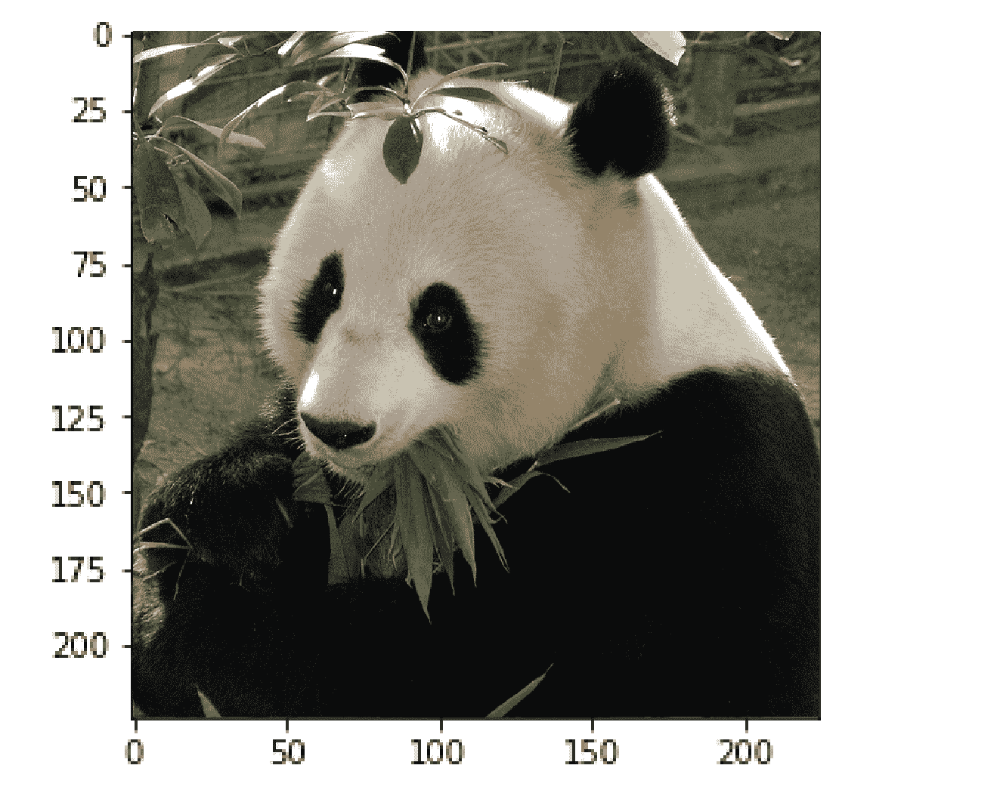

让我们看一个实际在 Python 代码中如何实现的示例：

```py
def cross_entropy(true_label, prediction):
    if true_label == 1:
        return -log(prediction)
    else:
        return -log(1 - prediction)
```

在分类问题中使用交叉熵损失，我们实际上不需要担心内部发生了什么——我们只需要记住，当我们的预测很差时，损失会很高，而当预测很好时，损失会很低。PyTorch 为我们提供了一个`loss`的实现，我们可以使用，如下所示：

```py
loss = nn.CrossEntropyLoss()
input = Variable(torch.randn(3, 5), requires_grad=True)
target = Variable(torch.LongTensor(3).random_(5))
output = loss(input, target)
output.backward()
```

PyTorch 提供的其他一些`loss`函数如下：

| L1 loss | 主要用作正则化器。我们将在第四章，*机器学习基础*中进一步讨论它。 |
| --- | --- |
| MSE loss | 用作回归问题的损失函数。 |
| 交叉熵损失 | 用于二元和多类别分类问题。 |
| NLL Loss | 用于分类问题，并允许我们使用特定权重来处理不平衡的数据集。 |
| NLL Loss2d | 用于像素级分类，主要用于与图像分割相关的问题。 |

# 优化网络架构

一旦我们计算出网络的损失，我们将优化权重以减少损失，从而提高算法的准确性。为了简单起见，让我们将这些优化器视为黑盒子，它们接受损失函数和所有可学习参数，并轻微地移动它们以提高我们的性能。PyTorch 提供了深度学习中大多数常用的优化器。如果您想探索这些优化器内部发生了什么，并且具备数学背景，我强烈建议阅读以下一些博客：

+   [`colah.github.io/posts/2015-08-Backprop/`](http://colah.github.io/posts/2015-08-Backprop/)

+   [`ruder.io/deep-learning-optimization-2017/`](http://ruder.io/deep-learning-optimization-2017/)

PyTorch 提供的一些优化器包括以下几种：

+   ADADELTA

+   Adagrad

+   Adam

+   SparseAdam

+   Adamax

+   ASGD

+   LBFGS

+   RMSProp

+   Rprop

+   SGD

我们将在第四章，*机器学习基础*中详细讨论一些算法，以及一些优缺点。让我们一起走过创建任何`optimizer`的一些重要步骤：

```py
optimizer = optim.SGD(model.parameters(), lr = 0.01)
```

在前面的示例中，我们创建了一个`SGD`优化器，它将您网络中所有可学习参数作为第一个参数，并且一个学习率，决定可学习参数变化的比例。在第四章，*机器学习基础*中，我们将更详细地讨论学习率和动量，这是优化器的一个重要参数。一旦创建了优化器对象，我们需要在循环内调用`zero_grad()`，因为参数会累积前一个`optimizer`调用期间创建的梯度：

```py
for input, target in dataset:
    optimizer.zero_grad()
    output = model(input)
    loss = loss_fn(output, target)
    loss.backward()
    optimizer.step()
```

一旦我们在`loss`函数上调用`backward`，计算出梯度（可学习参数需要改变的量），我们调用`optimizer.step()`，实际上对我们的可学习参数进行更改。

现在，我们已经涵盖了帮助计算机看/识别图像所需的大多数组件。让我们构建一个复杂的深度学习模型，可以区分狗和猫，以便将所有理论付诸实践。

# 图像分类使用深度学习

解决任何现实世界问题中最重要的一步是获取数据。Kaggle 提供了大量关于不同数据科学问题的竞赛。我们将挑选 2014 年出现的一个问题，在本章中用于测试我们的深度学习算法，并在第五章，*计算机视觉的深度学习* 中进行改进，该章将介绍**卷积神经网络**（**CNNs**）以及一些高级技术，可以用来提升我们的图像识别模型的性能。您可以从 [`www.kaggle.com/c/dogs-vs-cats/data`](https://www.kaggle.com/c/dogs-vs-cats/data) 下载数据。数据集包含 25,000 张猫和狗的图像。在实施算法之前，需要进行数据的预处理和创建训练、验证和测试集分割等重要步骤。一旦数据下载完毕，查看数据，可以看到文件夹中包含以下格式的图像：

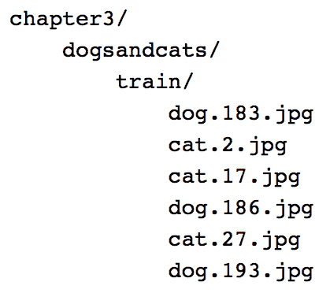

大多数框架在提供以下格式的图像时，使阅读图像并将其标记为其标签变得更加简单。这意味着每个类别应该有一个单独的文件夹包含其图像。在这里，所有猫的图像应该在 `cat` 文件夹中，所有狗的图像应该在 `dog` 文件夹中：

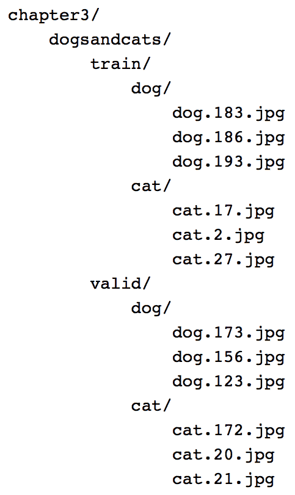

Python 让将数据放入正确的格式变得容易。让我们快速查看代码，然后我们将逐步介绍其重要部分：

```py
path = '../chapter3/dogsandcats/'

#Read all the files inside our folder.
files = glob(os.path.join(path,'*/*.jpg'))

print(f'Total no of images {len(files)}')

no_of_images = len(files)

#Create a shuffled index which can be used to create a validation data set
shuffle = np.random.permutation(no_of_images)

#Create a validation directory for holding validation images.
os.mkdir(os.path.join(path,'valid'))

#Create directories with label names 
for t in ['train','valid']:
     for folder in ['dog/','cat/']:
          os.mkdir(os.path.join(path,t,folder)) 

#Copy a small subset of images into the validation folder.
for i in shuffle[:2000]:
     folder = files[i].split('/')[-1].split('.')[0]
     image = files[i].split('/')[-1]
     os.rename(files[i],os.path.join(path,'valid',folder,image))

#Copy a small subset of images into the training folder.
for i in shuffle[2000:]:
     folder = files[i].split('/')[-1].split('.')[0]
     image = files[i].split('/')[-1]
     os.rename(files[i],os.path.join(path,'train',folder,image))
```

所有上述代码做的就是检索所有文件，并选择 2,000 张图像来创建验证集。它将所有图像分成两类：猫和狗。创建独立的验证集是一个常见且重要的做法，因为在同一数据上测试我们的算法是不公平的。为了创建一个 `validation` 数据集，我们创建一个在打乱顺序的图像长度范围内的数字列表。打乱的数字作为索引，帮助我们选择一组图像来创建我们的 `validation` 数据集。让我们详细地查看代码的每个部分。

我们使用以下代码创建一个文件：

```py
files = glob(os.path.join(path,'*/*.jpg'))
```

`glob` 方法返回特定路径中的所有文件。当图像数量庞大时，我们可以使用 `iglob`，它返回一个迭代器，而不是将名称加载到内存中。在我们的情况下，只有 25,000 个文件名，可以轻松放入内存。

我们可以使用以下代码来对文件进行洗牌：

```py
shuffle = np.random.permutation(no_of_images)
```

上述代码以随机顺序返回从零到 25,000 范围内的 25,000 个数字，我们将使用它们作为索引，选择一部分图像来创建 `validation` 数据集。

我们可以创建一个验证代码，如下所示：

```py
os.mkdir(os.path.join(path,'valid'))
for t in ['train','valid']:
     for folder in ['dog/','cat/']:
          os.mkdir(os.path.join(path,t,folder)) 
```

上述代码创建了一个 `validation` 文件夹，并在 `train` 和 `valid` 目录内基于类别（cats 和 dogs）创建文件夹。

我们可以使用以下代码对索引进行洗牌：

```py
for i in shuffle[:2000]:
     folder = files[i].split('/')[-1].split('.')[0]
     image = files[i].split('/')[-1]
     os.rename(files[i],os.path.join(path,'valid',folder,image))
```

在上述代码中，我们使用打乱的索引随机选择了`2000`张不同的图像作为验证集。我们对训练数据做类似的处理，以将图像分离到`train`目录中。

由于我们的数据格式已经符合要求，让我们快速看一下如何将图像加载为 PyTorch 张量。

# 将数据加载到 PyTorch 张量中

PyTorch 的`torchvision.datasets`包提供了一个名为`ImageFolder`的实用类，可用于加载图像及其相关标签，当数据以前述格式呈现时。通常进行以下预处理步骤是一种常见做法：

1.  将所有图像调整为相同大小。大多数深度学习架构都期望图像大小相同。

1.  使用数据集的平均值和标准差对数据进行标准化。

1.  将图像数据集转换为 PyTorch 张量。

PyTorch 通过在`transforms`模块中提供许多实用函数，使这些预处理步骤变得更加容易。对于我们的示例，让我们应用三种转换：

+   缩放为 256 x 256 的图像尺寸

+   转换为 PyTorch 张量

+   标准化数据（我们将讨论如何在《深度学习计算机视觉》的第五章中得出平均值和标准差）

下面的代码演示了如何应用转换并使用`ImageFolder`类加载图像：

```py
simple_transform=transforms.Compose([transforms.Scale((224,224)),
                             transforms.ToTensor(),
                             transforms.Normalize([0.485, 0.456,                     0.406], [0.229, 0.224, 0.225])])
train = ImageFolder('dogsandcats/train/',simple_transform)
valid = ImageFolder('dogsandcats/valid/',simple_transform)
```

`train`对象包含数据集中所有图像及其关联标签。它包含两个重要属性：一个给出类别与数据集中使用的相关索引之间的映射，另一个给出类别列表：

+   `train.class_to_idx - {'cat': 0, 'dog': 1}`

+   `train.classes - ['cat', 'dog']`

将加载到张量中的数据可视化通常是最佳实践。为了可视化张量，我们必须重塑张量并对值进行反标准化。以下函数为我们执行这些操作：

```py
def imshow(inp):
    """Imshow for Tensor."""
    inp = inp.numpy().transpose((1, 2, 0))
    mean = np.array([0.485, 0.456, 0.406])
    std = np.array([0.229, 0.224, 0.225])
    inp = std * inp + mean
    inp = np.clip(inp, 0, 1)
    plt.imshow(inp)

```

现在，我们可以将我们的张量传递给前面的`imshow`函数，该函数将其转换为图像：

```py
imshow(train[50][0])
```

上述代码生成以下输出：

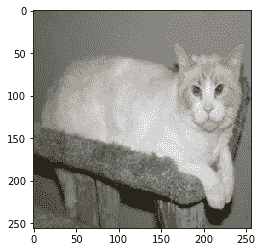

# 将 PyTorch 张量加载为批次

在深度学习或机器学习中，将图像样本分批处理是常见做法，因为现代**图形处理单元**（**GPUs**）和 CPU 在批量图像上运行操作时被优化得更快。批量大小通常根据使用的 GPU 类型而变化。每个 GPU 都有自己的内存，从 2 GB 到 12 GB 不等，商用 GPU 有时甚至更多。PyTorch 提供了`DataLoader`类，它接受一个数据集并返回一个图像批次。它抽象了批处理中的许多复杂性，如使用多个工作进程进行变换应用。以下代码将前述的`train`和`valid`数据集转换为数据加载器：

```py
train_data_gen =  
  torch.utils.data.DataLoader(train,batch_size=64,num_workers=3)
valid_data_gen = 
  torch.utils.data.DataLoader(valid,batch_size=64,num_workers=3)
```

`DataLoader`类为我们提供了许多选项，其中一些最常用的选项如下：

+   `shuffle`: 当为 true 时，每次调用数据加载器时都会对图像进行洗牌。

+   `num_workers`: 这个参数负责并行化。通常的做法是使用比您机器上可用的核心数少的工作线程数。

# 构建网络架构

对于大多数现实世界的用例，特别是在计算机视觉领域，我们很少自己构建架构。有不同的架构可以快速用于解决我们的现实世界问题。例如，我们使用一个称为**ResNet**的流行深度学习算法，该算法在 2015 年赢得了 ImageNet 等不同比赛的第一名。为了更简单地理解，我们可以假设这个算法是一堆不同的 PyTorch 层精心连接在一起，而不关注算法内部发生的事情。当我们学习 CNN 时，在《计算机视觉的深度学习》第五章中，我们将看到 ResNet 算法的一些关键构建块，详见第五章。PyTorch 通过在`torchvision.models`模块中提供这些流行算法，使得使用它们变得更加容易。因此，让我们快速看一下如何使用这个算法，然后逐行分析代码：

```py
model_ft = models.resnet18(pretrained=True)
num_ftrs = model_ft.fc.in_features
model_ft.fc = nn.Linear(num_ftrs, 2)

if is_cuda:
    model_ft = model_ft.cuda()
```

`models.resnet18(pertrained = True)`对象创建了算法的一个实例，这是一组 PyTorch 层。我们可以通过打印`model_ft`来快速查看 ResNet 算法的构成。算法的一个小部分看起来像以下的屏幕截图。我没有包括完整的算法，因为可能需要运行数页：

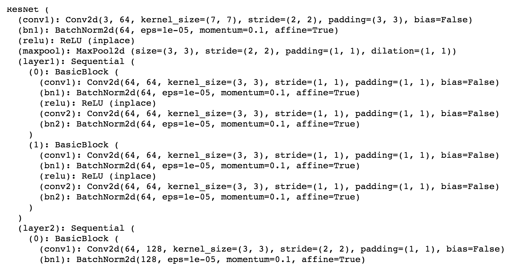

正如我们所见，ResNet 架构是一组层，即`Conv2d`、`BatchNorm2d`和`MaxPool2d`，以特定的方式连接在一起。所有这些算法都会接受一个名为**pretrained**的参数。当`pretrained`为`True`时，算法的权重已经针对预测 ImageNet 分类问题进行了调整，该问题涉及预测包括汽车、船、鱼、猫和狗在内的 1000 个不同类别。这些权重已经调整到一定程度，使得算法达到了最先进的准确性。这些权重被存储并与我们用于该用例的模型共享。与使用随机权重相比，算法在使用精调权重时往往表现更好。因此，对于我们的用例，我们从预训练权重开始。

ResNet 算法不能直接使用，因为它是为了预测 1000 个类别之一而训练的。对于我们的用例，我们只需要预测狗和猫中的一种。为了实现这一点，我们取 ResNet 模型的最后一层，这是一个`linear`层，并将输出特征更改为两个，如下面的代码所示：

```py
model_ft.fc = nn.Linear(num_ftrs, 2)
```

如果您在基于 GPU 的机器上运行此算法，那么为了使算法在 GPU 上运行，我们需要在模型上调用`cuda`方法。强烈建议您在支持 GPU 的机器上运行这些程序；在云端实例上租用一个带 GPU 的实例成本不到一美元。以下代码片段的最后一行告诉 PyTorch 在 GPU 上运行代码：

```py
if is_cuda:
    model_ft = model_ft.cuda()
```

# 训练模型

在前面的章节中，我们创建了`DataLoader`实例和算法。现在，让我们来训练模型。为此，我们需要一个`loss`函数和一个`optimizer`：

```py
# Loss and Optimizer
learning_rate = 0.001
criterion = nn.CrossEntropyLoss()
optimizer_ft = optim.SGD(model_ft.parameters(), lr=0.001, momentum=0.9)
exp_lr_scheduler = lr_scheduler.StepLR(optimizer_ft, step_size=7,  
  gamma=0.1)
```

在前面的代码中，我们基于`CrossEntropyLoss`创建了我们的`loss`函数，并基于`SGD`创建了优化器。`StepLR`函数有助于动态调整学习率。我们将在《机器学习基础》第四章讨论可用于调整学习率的不同策略。

以下的`train_model`函数接受一个模型，并通过运行多个 epochs 和减少损失来调整我们算法的权重：

```py
def train_model(model, criterion, optimizer, scheduler, num_epochs=25):
    since = time.time()

    best_model_wts = model.state_dict()
    best_acc = 0.0

    for epoch in range(num_epochs):
        print('Epoch {}/{}'.format(epoch, num_epochs - 1))
        print('-' * 10)

        # Each epoch has a training and validation phase
        for phase in ['train', 'valid']:
            if phase == 'train':
                scheduler.step()
                model.train(True) # Set model to training mode
            else:
                model.train(False) # Set model to evaluate mode

            running_loss = 0.0
            running_corrects = 0

            # Iterate over data.
            for data in dataloaders[phase]:
                # get the inputs
                inputs, labels = data

                # wrap them in Variable
                if is_cuda:
                    inputs = Variable(inputs.cuda())
                    labels = Variable(labels.cuda())
                else:
                    inputs, labels = Variable(inputs),                 Variable(labels)

                # zero the parameter gradients
                optimizer.zero_grad()

                # forward
                outputs = model(inputs)
                _, preds = torch.max(outputs.data, 1)
                loss = criterion(outputs, labels)

                # backward + optimize only if in training phase
                if phase == 'train':
                    loss.backward()
                    optimizer.step()

                # statistics
                running_loss += loss.data[0]
                running_corrects += torch.sum(preds == labels.data)

            epoch_loss = running_loss / dataset_sizes[phase]
            epoch_acc = running_corrects / dataset_sizes[phase]

            print('{} Loss: {:.4f} Acc: {:.4f}'.format(
                phase, epoch_loss, epoch_acc))

            # deep copy the model
            if phase == 'valid' and epoch_acc > best_acc:
                best_acc = epoch_acc
                best_model_wts = model.state_dict()

        print()

    time_elapsed = time.time() - since
    print('Training complete in {:.0f}m {:.0f}s'.format(
        time_elapsed // 60, time_elapsed % 60))
    print('Best val Acc: {:4f}'.format(best_acc))

    # load best model weights
    model.load_state_dict(best_model_wts)
    return model
```

前述函数执行以下操作：

1.  将图像通过模型并计算损失。

1.  在训练阶段进行反向传播。对于验证/测试阶段，不会调整权重。

1.  损失是在每个 epoch 的各个批次中累积的。

1.  存储最佳模型并打印验证准确率。

在运行了`25`个 epochs 后，前述模型的验证准确率达到了 87%。以下是在我们的《猫狗大战》数据集上运行`train_model`函数时生成的日志；这里只包含了最后几个 epochs 的结果，以节省空间。

```py
Epoch 18/24
----------
train Loss: 0.0044 Acc: 0.9877
valid Loss: 0.0059 Acc: 0.8740

Epoch 19/24
----------
train Loss: 0.0043 Acc: 0.9914
valid Loss: 0.0059 Acc: 0.8725

Epoch 20/24
----------
train Loss: 0.0041 Acc: 0.9932
valid Loss: 0.0060 Acc: 0.8725

Epoch 21/24
----------
train Loss: 0.0041 Acc: 0.9937
valid Loss: 0.0060 Acc: 0.8725

Epoch 22/24
----------
train Loss: 0.0041 Acc: 0.9938
valid Loss: 0.0060 Acc: 0.8725

Epoch 23/24
----------
train Loss: 0.0041 Acc: 0.9938
valid Loss: 0.0060 Acc: 0.8725

Epoch 24/24
----------
train Loss: 0.0040 Acc: 0.9939
valid Loss: 0.0060 Acc: 0.8725

Training complete in 27m 8s
Best val Acc: 0.874000
```

在接下来的章节中，我们将学习更高级的技术，帮助我们以更快的方式训练更精确的模型。前述模型在 Titan X GPU 上运行大约需要 30 分钟。我们将介绍不同的技术，这些技术有助于更快地训练模型。

# 摘要

在本章中，我们探讨了在 Pytorch 中神经网络的完整生命周期，从构建不同类型的层、添加激活函数、计算交叉熵损失，最终通过 SGD 优化网络性能（即最小化损失），调整层权重。

我们已经学习了如何将流行的 ResNET 架构应用于二元或多类别分类问题。

在此过程中，我们尝试解决真实世界的图像分类问题，如将猫图像分类为猫和狗图像分类为狗。这些知识可以应用于分类不同的实体类别/类别，例如分类鱼类的物种、识别不同品种的狗、分类植物种子苗、将宫颈癌分为类型 1、类型 2 和类型 3 等等。

在接下来的章节中，我们将深入探讨机器学习的基础知识。
