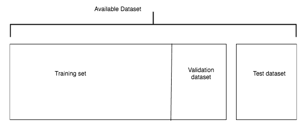
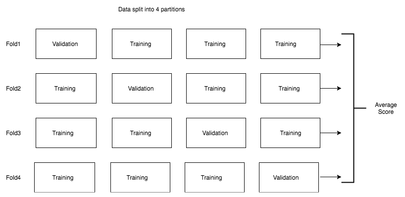
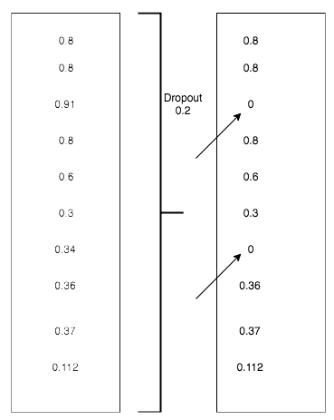
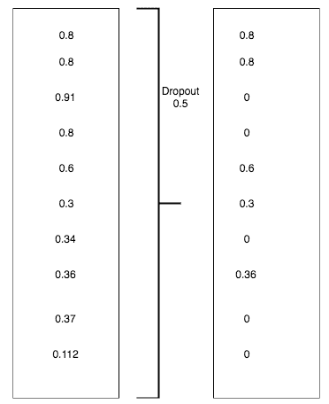

# 第四章：机器学习基础

在前几章中，我们看到了如何构建深度学习模型来解决分类和回归问题的实际示例，比如图像分类和平均用户观看预测。同样地，我们也形成了如何构建深度学习问题框架的直觉。在本章中，我们将详细讨论如何解决不同类型的问题以及我们可能会使用的各种调整来提高模型在问题上的性能。

在本章中，我们将探讨：

+   超出分类和回归的其他问题形式

+   评估问题，理解过拟合、欠拟合及解决方法的问题

+   为深度学习准备数据

请记住，本章讨论的大多数主题对机器学习和深度学习来说都是常见的，除了一些我们用来解决过拟合问题的技术，比如 dropout。

# 三种机器学习问题

在我们之前的所有示例中，我们试图解决分类（预测猫或狗）或回归（预测用户在平台上平均花费的时间）问题。所有这些都是监督学习的例子，其目标是映射训练样本和它们的目标之间的关系，并用它来对未见数据进行预测。

监督学习只是机器学习的一部分，还有其他不同的机器学习部分。机器学习有三种不同的类型：

+   监督学习

+   无监督学习

+   强化学习

让我们详细了解各种算法类型。

# 监督学习

在深度学习和机器学习领域中，大多数成功的用例属于监督学习。本书中我们涵盖的大多数示例也将是其中的一部分。一些常见的监督学习例子包括：

+   **分类问题**：对狗和猫进行分类。

+   **回归问题**：预测股票价格、板球比赛得分等。

+   **图像分割**：进行像素级分类。对于自动驾驶汽车来说，从其摄像头拍摄的照片中识别每个像素属于什么是很重要的。像素可能属于汽车、行人、树木、公共汽车等等。

+   **语音识别**：OK Google、Alexa 和 Siri 是语音识别的良好示例。

+   **语言翻译**：将一种语言的语音翻译成另一种语言。

# 无监督学习

当没有标签数据时，无监督学习技术通过可视化和压缩帮助理解数据。无监督学习中常用的两种技术是：

+   聚类

+   降维

聚类有助于将所有相似的数据点分组在一起。降维有助于减少维度数量，这样我们可以可视化高维数据以发现任何隐藏的模式。

# 强化学习

强化学习是最不受欢迎的机器学习类别。它在现实世界的使用案例中并没有取得成功。然而，近年来情况发生了变化，Google DeepMind 的团队成功地基于强化学习构建系统，并且能够在 AlphaGo 比赛中击败世界冠军。这种技术进步，即计算机可以在游戏中击败人类，被认为需要几十年的时间才能实现。然而，深度学习结合强化学习比任何人预期的都要早地实现了这一点。这些技术已经开始取得初步的成功，可能需要几年时间才能成为主流。

在本书中，我们将主要关注监督技术，以及一些深度学习中特有的无监督技术，例如用于创建特定风格图像的生成网络，称为**风格转移**和**生成对抗网络**。

# 机器学习术语表

在最近的几章中，我们使用了许多可能对您完全陌生的术语，如果您刚刚进入机器学习或深度学习领域，我们将列出许多在机器学习中常用的术语，这些术语也在深度学习文献中使用：

+   **样本** **或输入** **或** **数据点**：这些表示训练集的特定实例。在我们上一章中看到的图像分类问题中，每个图像可以称为样本、输入或数据点。

+   **预测** **或** **输出**：我们的算法生成的值作为输出。例如，在我们的上一个例子中，我们的算法预测特定图像为 0，这是给猫的标签，所以数字 0 是我们的预测或输出。

+   **目标** **或标签**：图像的实际标记标签。

+   **损失值** **或预测误差**：预测值和实际值之间距离的某种度量。值越小，准确性越高。

+   **类别**：给定数据集的可能值或标签集。在我们上一章的例子中，我们有两个类别——猫和狗。

+   **二元分类**：一个分类任务，其中每个输入示例应被分类为两个互斥的类别之一。

+   **多类分类**：一个分类任务，其中每个输入示例可以被分类为超过两个不同的类别。

+   **多标签分类**：一个输入示例可以被打上多个标签，例如标记一个餐馆提供的不同类型的食物，如意大利、墨西哥和印度食物。另一个常用的例子是图像中的物体检测，算法可以识别图像中的不同对象。

+   **标量回归**：每个输入数据点将与一个标量质量相关联，即一个数字。例如，预测房价、股票价格和板球比分。

+   **Vector regression**: 当算法需要预测多个标量量时使用。一个很好的例子是当您尝试识别图像中包含鱼位置的边界框时。为了预测边界框，您的算法需要预测四个标量量，表示正方形的边缘。

+   **Batch**: 对于大多数情况，我们训练算法时使用一组输入样本，称为批处理。批处理的大小通常从 2 到 256 不等，取决于 GPU 的内存。权重也会在每个批次中更新，因此算法的学习速度比在单个示例上训练时要快。

+   **Epoch**: 将算法运行完整数据集称为一个**周期**。通常会进行多个周期的训练（更新权重）。

# 评估机器学习模型

在我们上一章节讨论的图像分类示例中，我们将数据分成两半，一半用于训练，另一半用于验证。使用单独的数据集来测试算法的性能是一个良好的实践，因为在训练集上测试算法可能不能真正反映算法的泛化能力。在大多数真实应用中，根据验证准确率，我们经常以不同的方式调整算法，例如添加更多层或不同的层，或者使用我们将在本章后部分介绍的不同技术。因此，你对调整算法选择的可能性更高是基于验证数据集。通过这种方式训练的算法通常在训练数据集和验证数据集上表现良好，但在未见数据上泛化能力较差。这是由于验证数据集中的信息泄漏，影响了我们对算法进行调整。

为了避免信息泄漏问题并提高泛化能力，通常的做法是将数据集分为三个不同部分，即训练、验证和测试数据集。我们通过训练和验证集进行算法的所有超参数调整和训练。在整个训练结束时，您将在测试数据集上测试算法。我们讨论的有两种类型的参数。一种是算法内部使用的参数或权重，这些参数通过优化器或反向传播进行调整。另一组参数称为**超参数**，控制网络中使用的层数、学习速率和其他类型的参数，通常需要手动更改架构。

特定算法在训练集上表现更好，但在验证或测试集上表现不佳的现象被称为**过拟合**，或者算法泛化能力不足。还有一个相反的现象，算法在训练集上表现不佳，这称为**欠拟合**。我们将看看不同的策略，帮助我们克服过拟合和欠拟合问题。

在讨论过拟合和欠拟合之前，让我们先看看在数据集分割方面的各种策略。

# 训练、验证和测试分割

将数据分成三部分——训练集、验证集和测试集，是最佳实践。使用保留数据集的最佳方法是：

1.  在训练集上训练算法

1.  基于验证数据集执行超参数调优

1.  通过迭代执行前两个步骤，直到达到预期的性能

1.  在冻结算法和超参数后，在测试数据集上评估它

避免将数据分割成两部分，因为这可能导致信息泄露。在同一数据集上进行训练和测试是明确禁止的，因为它不能保证算法的泛化。有三种流行的保留策略可用于将数据分割为训练集和验证集。它们如下：

+   简单保留验证

+   K 折验证

+   迭代 k 折验证

# 简单保留验证

将数据的一部分作为测试数据集。保留多少数据可能非常依赖于具体问题，并且很大程度上取决于可用的数据量。在计算机视觉和自然语言处理领域，特别是收集标记数据可能非常昂贵，因此保留 30% 的大部分数据可能会使算法难以学习，因为训练数据较少。因此，根据数据的可用性，明智地选择它的一部分。一旦测试数据分割完成，在冻结算法及其超参数之前保持其独立。为了选择问题的最佳超参数，选择一个单独的验证数据集。为了避免过拟合，我们通常将可用数据分为三个不同的集合，如下图所示：



我们在上一章节中使用了上述图示的简单实现来创建我们的验证集。让我们来看一下实现的快照：

```py
files = glob(os.path.join(path,'*/*.jpg'))
no_of_images = len(files)
shuffle = np.random.permutation(no_of_images)
train = files[shuffle[:int(no_of_images*0.8)]]
valid = files[shuffle[int(no_of_images*0.8):]]
```

这是最简单的保留策略之一，通常用于起步。使用小数据集时会有一个缺点。验证集或测试集可能无法统计代表手头的数据。我们可以通过在保留前对数据进行洗牌来轻松识别这一点。如果获得的结果不一致，则需要使用更好的方法。为了避免这个问题，我们经常使用 k 折或迭代 k 折验证。

# K 折验证

将数据集的一部分保留用于测试拆分，然后将整个数据集分成 k 折，其中 k 可以是任意数字，通常在两到十之间变化。在任何给定的迭代中，我们保留一个块用于验证，并在其余块上训练算法。最终分数通常是在所有 k 折中获得的所有分数的平均值。以下图示显示了 k 折验证的实现，其中 k 为四；也就是说，数据分为四个部分：



使用 k 折验证数据集时需要注意的一个关键点是它非常昂贵，因为您需要在数据集的不同部分上运行算法多次，这对于计算密集型算法来说可能非常昂贵——特别是在计算机视觉算法的领域，在某些情况下，训练一个算法可能需要从几分钟到几天的时间。因此，明智地使用这种技术。

# 带有洗牌的 k 折验证

要使事情变得复杂和健壮，您可以在每次创建留存验证数据集时对数据进行洗牌。这对于解决那些小幅提升性能可能会产生巨大业务影响的问题非常有帮助。如果您的情况是快速构建和部署算法，并且对性能差异的几个百分点可以妥协，那么这种方法可能不值得。关键在于您试图解决的问题以及准确性对您意味着什么。

在分割数据时还有一些其他需要考虑的事项，例如：

+   数据代表性

+   时间敏感性

+   数据冗余

# 数据代表性

在我们上一章中看到的例子中，我们将图像分类为狗或猫。让我们看一个情况，所有图像都已排序，前 60% 的图像是狗，剩下的是猫。如果我们通过选择前 80% 作为训练数据集，剩下的作为验证集来拆分这个数据集，那么验证数据集将不是数据集的真实代表，因为它只包含猫的图像。因此，在这些情况下，应该小心地通过在拆分之前对数据进行洗牌或进行分层抽样来确保我们有一个良好的混合数据集。

# 时间敏感性

让我们以预测股票价格为例。我们有从一月到十二月的数据。在这种情况下，如果我们进行洗牌或分层抽样，那么我们最终会出现信息泄漏，因为价格可能对时间敏感。因此，要以不会有信息泄漏的方式创建验证数据集。在这种情况下，选择十二月的数据作为验证数据集可能更合理。在股票价格的情况下，这比较复杂，因此在选择验证拆分时，领域专业知识也会起作用。

# 数据冗余

数据中常见重复。应确保训练、验证和测试集中的数据是唯一的。如果存在重复，则模型可能无法很好地推广到未见过的数据。

# 数据预处理和特征工程

我们已经看过了不同的方法来分割我们的数据集以建立评估策略。在大多数情况下，我们收到的数据可能不是我们可以直接用于训练算法的格式。在本节中，我们将介绍一些预处理技术和特征工程技术。虽然大部分特征工程技术是领域特定的，特别是在计算机视觉和文本领域，但也有一些通用的特征工程技术是跨领域通用的，我们将在本章讨论。

用于神经网络的数据预处理是使数据更适合深度学习算法进行训练的过程。以下是一些常用的数据预处理步骤：

+   向量化

+   标准化

+   缺失值

+   特征提取

# 向量化

数据以各种格式出现，如文本、声音、图像和视频。首先要做的事情是将数据转换为 PyTorch 张量。在先前的示例中，我们使用了 `torchvision` 实用函数将**Python Imaging Library** (**PIL**) 图像转换为张量对象，尽管大部分复杂性都被 PyTorch torchvision 库抽象化了。在第七章，*生成网络*，当我们处理**递归神经网络** (**RNNs**) 时，我们将看到如何将文本数据转换为 PyTorch 张量。对于涉及结构化数据的问题，数据已经以向量化格式存在；我们只需将它们转换为 PyTorch 张量即可。

# 值规范化

在将数据传递给任何机器学习算法或深度学习算法之前，将特征规范化是一种常见做法。它有助于更快地训练算法，并帮助实现更高的性能。标准化是一种过程，其中您以某种方式表示属于特定特征的数据，使其平均值为零，标准差为一。

在*狗和猫*的例子中，我们在上一章中进行了分类，通过使用 `ImageNet` 数据集中可用数据的平均值和标准差来对数据进行标准化。我们选择 `ImageNet` 数据集的平均值和标准差作为示例的原因是，我们使用了在 ImageNet 上预训练的 ResNet 模型的权重。通常也是一个常见做法，将每个像素值除以 255，以便所有值都落在零到一之间的范围内，特别是当您不使用预训练权重时。

标准化也适用于涉及结构化数据的问题。比如，我们正在处理一个房价预测问题，可能存在不同尺度的特征。例如，距离最近的机场和房屋年龄是可能处于不同尺度的变量或特征。直接将它们用于神经网络可能会阻止梯度的收敛。简单来说，损失可能不会按预期降低。因此，在训练算法之前，我们应该注意对任何数据应用标准化，以确保算法或模型表现更好。确保数据遵循以下特性：

+   **取小值**：通常在 0 到 1 的范围内

+   **相同范围**：确保所有特征都在相同的范围内

# 处理缺失值

在真实世界的机器学习问题中，缺失值非常普遍。从我们之前预测房价的例子中可以看出，房屋年龄字段可能缺失。通常可以安全地用一个不会出现的数字替换缺失值。算法将能够识别出模式。还有其他更具领域特定性的技术可用于处理缺失值。

# 特征工程

特征工程是利用关于特定问题的领域知识来创建可以传递给模型的新变量或特征的过程。为了更好地理解，让我们看一个销售预测问题。假设我们有关于促销日期、假期、竞争对手的开始日期、距离竞争对手的距离和某一天销售额的信息。在现实世界中，可能有数百个可能对预测商店价格有用的特征。有些信息可能对预测销售很重要。一些重要的特征或派生值包括：

+   距离下一个促销活动的天数

+   距离下一个假期的天数

+   竞争对手业务开展的天数

可以提取许多来自领域知识的特征。提取这些类型的特征对于任何机器学习算法或深度学习算法来说都可能是相当具有挑战性的。对于某些领域，特别是在计算机视觉和文本领域，现代深度学习算法帮助我们摆脱特征工程的限制。除了这些领域外，良好的特征工程始终有助于以下方面：

+   可以用更少的计算资源更快地解决问题。

+   深度学习算法可以通过使用大量数据来学习特征，而无需手动工程化它们。因此，如果数据紧张，那么专注于良好的特征工程是有益的。

# 过拟合和欠拟合

理解过拟合和欠拟合是构建成功的机器学习和深度学习模型的关键。在本章的开头，我们简要介绍了欠拟合和过拟合的概念；让我们详细看看它们以及我们如何解决它们。

在机器学习和深度学习中，过拟合或不能泛化是一个常见问题。我们说一个特定的算法过拟合是指它在训练数据集上表现良好，但在未见过的验证和测试数据集上表现不佳。这主要是由于算法识别出的模式过于特定于训练数据集。简单来说，我们可以说算法找到了一种记住数据集的方式，以便在训练数据集上表现非常好，但在未见数据上表现不佳。有不同的技术可以用来避免算法过拟合。其中一些技术包括：

+   获得更多数据

+   减小网络的大小

+   应用权重正则化器

+   应用 dropout

# 获得更多数据

如果你能够获取更多可以训练算法的数据，这将有助于算法避免过拟合，因为它会专注于一般模式而不是小数据点特定的模式。有几种情况可能会使获取更多标记数据成为一个挑战。

有一些技术，比如数据增强，在与计算机视觉相关的问题中可以用来生成更多的训练数据。数据增强是一种技术，你可以通过执行不同的动作如旋转、裁剪来微调图像，并生成更多的数据。有了足够的领域理解，你甚至可以创建合成数据，如果捕获实际数据是昂贵的话。当你无法获取更多数据时，还有其他方法可以帮助避免过拟合。让我们来看看它们。

# 减小网络的大小

网络的大小通常指网络中使用的层数或权重参数的数量。在我们上一章节看到的图像分类示例中，我们使用了一个 ResNet 模型，它有 18 个块，包含不同的层。PyTorch 中的 torchvision 库提供了不同大小的 ResNet 模型，从 18 个块一直到 152 个块。举个例子，如果我们使用一个包含 152 个块的 ResNet 块并且模型出现了过拟合，那么我们可以尝试使用具有 101 个块或 50 个块的 ResNet。在我们构建的自定义架构中，我们可以简单地删除一些中间线性层，从而防止我们的 PyTorch 模型记住训练数据集。让我们看一个示例代码片段，展示了如何减小网络大小的具体含义：

```py
class Architecture1(nn.Module):
    def __init__(self, input_size, hidden_size, num_classes):
        super(Architecture1, self).__init__()
        self.fc1 = nn.Linear(input_size, hidden_size) 
        self.relu = nn.ReLU()
        self.fc2 = nn.Linear(hidden_size, num_classes)
        self.relu = nn.ReLU()
        self.fc3 = nn.Linear(hidden_size, num_classes)      

    def forward(self, x):
        out = self.fc1(x)
        out = self.relu(out)
        out = self.fc2(out)
        out = self.relu(out)
        out = self.fc3(out)
        return out
```

上述架构有三个线性层，假设它过拟合了我们的训练数据。所以，让我们重新创建一个具有减少容量的架构：

```py
class Architecture2(nn.Module):
    def __init__(self, input_size, hidden_size, num_classes):
        super(Architecture2, self).__init__()
        self.fc1 = nn.Linear(input_size, hidden_size) 
        self.relu = nn.ReLU()
        self.fc2 = nn.Linear(hidden_size, num_classes)  

    def forward(self, x):
        out = self.fc1(x)
        out = self.relu(out)
        out = self.fc2(out)
        return out
```

上述架构只有两个线性层，因此降低了容量，从而潜在地避免了训练数据集的过拟合。

# 应用权重正则化

解决过拟合或泛化问题的一个关键原则是构建更简单的模型。一种构建更简单模型的技术是通过减少其结构的复杂性来降低其大小。另一个重要的事情是确保网络的权重不要取得较大的值。正则化通过对网络施加约束，当模型的权重较大时会对其进行惩罚。正则化有两种可能的类型。它们是：

+   **L1 正则化**：权重系数的绝对值之和被添加到成本中。通常称为权重的 L1 范数。

+   **L2 正则化**：所有权重系数的平方和被添加到成本中。通常称为权重的 L2 范数。

PyTorch 提供了一种简单的方法来使用 L2 正则化，通过在优化器中启用 `weight_decay` 参数：

```py
model = Architecture1(10,20,2)

optimizer = torch.optim.Adam(model.parameters(), lr=1e-4, weight_decay=1e-5)
```

默认情况下，权重衰减参数被设置为零。我们可以尝试不同的权重衰减值；例如 `1e-5` 这样的小值通常效果很好。

# Dropout

Dropout 是深度学习中最常用且最强大的正则化技术之一。它是由 Hinton 及其在多伦多大学的学生开发的。Dropout 被应用于模型的中间层，在训练时使用。让我们看一个例子，说明如何在生成 10 个值的线性层输出上应用 dropout：



上图显示了当在线性层输出上应用 dropout 时，阈值为 **0.2** 的情况。它随机屏蔽或将数据置零 20%，因此模型不会依赖于特定的权重集或模式，从而避免过拟合。让我们看另一个例子，其中我们使用阈值为 **0.5** 的 dropout：



通常使用在 0.2 到 0.5 范围内的 dropout 值的阈值，dropout 应用在不同的层。Dropout 仅在训练时使用，测试时值按 dropout 的因子进行缩放。PyTorch 提供 dropout 作为另一层，从而更容易使用。下面的代码片段显示了如何在 PyTorch 中使用 dropout 层：

```py
nn.dropout(x, training=True)
```

dropout 层接受一个名为 `training` 的参数，它在训练阶段需要设置为 `True`，在验证或测试阶段设置为 `False`。

# 欠拟合

有时候我们的模型可能无法从训练数据中学习到任何模式，这在模型甚至在训练集上表现不佳时会非常明显。当您的模型欠拟合时，一种常见的解决方法是获取更多的数据让算法进行训练。另一种方法是通过增加层次或增加模型使用的权重或参数来增加模型的复杂性。在实际过拟合数据集之前最好不要使用上述任何正则化技术。

# 机器学习项目的工作流程

在这一部分，我们将制定一个解决方案框架，可以通过整合问题陈述、评估、特征工程以及避免过拟合来解决任何机器学习问题。

# 问题定义和数据集创建

要定义问题，我们需要两个重要的东西；即输入数据和问题类型。

我们的输入数据和目标标签将会是什么？例如，假设我们想根据顾客的评价将餐馆分类为意大利餐厅、墨西哥餐厅、中国餐厅和印度餐厅。在开始处理这类问题之前，我们需要手动为训练数据中的一个可能的类别进行标注，然后才能对算法进行训练。数据的可用性在这个阶段通常是一个具有挑战性的因素。

确定问题的类型有助于确定它是二元分类、多类分类、标量回归（房价预测）还是向量回归（边界框）。有时，我们可能需要使用一些无监督技术，如聚类和降维。一旦确定了问题类型，就更容易确定应该使用什么样的架构、损失函数和优化器。

一旦我们有了输入并且确定了问题的类型，那么我们可以根据以下假设开始构建我们的模型：

+   数据中存在隐藏的模式，可以帮助将输入与输出进行映射

+   我们拥有的数据足以让模型进行学习

作为机器学习从业者，我们需要明白，仅凭一些输入数据和目标数据可能无法构建出一个模型。以预测股票价格为例。假设我们有代表历史价格、历史表现和竞争详情的特征，但我们可能仍然无法构建出一个能够预测股票价格的有意义模型，因为股票价格实际上可能受到多种其他因素的影响，如国内政治形势、国际政治形势、天气因素（例如良好的季风）等，这些因素可能不会被我们的输入数据所代表。因此，没有任何机器学习或深度学习模型能够识别出模式。因此，根据领域的不同，精心选择能够成为目标变量真实指标的特征。所有这些都可能是模型欠拟合的原因。

机器学习还做了另一个重要的假设。未来或未见过的数据将接近于历史数据所描述的模式。有时，我们的模型可能失败，因为这些模式在历史数据中从未存在过，或者模型训练时的数据未涵盖某些季节性或模式。

# 成功的衡量标准

成功的衡量标准将直接由您的业务目标决定。例如，当尝试预测风车何时会发生下次机器故障时，我们更关心模型能够预测故障的次数。使用简单的准确率可能是错误的度量标准，因为大多数情况下，模型在预测机器不会故障时会预测正确，这是最常见的输出。假设我们获得了 98%的准确率，并且模型在预测故障率时每次都错误——这样的模型在现实世界中可能毫无用处。选择正确的成功度量标准对于业务问题至关重要。通常，这类问题具有不平衡的数据集。

对于平衡分类问题，所有类别的准确率相似时，ROC 和**曲线下面积**（**AUC**）是常见的度量标准。对于不平衡的数据集，我们可以使用精确率和召回率。对于排名问题，可以使用平均精度。

# 评估协议

一旦确定了如何评估当前进展，决定如何在数据集上进行评估就变得很重要。我们可以从以下三种不同的评估方式中进行选择：

+   **留出验证集**：最常用的方法，特别是在你有足够的数据时。

+   **K 折交叉验证**：当数据有限时，这种策略有助于在数据的不同部分上进行评估，有助于更好地了解性能。

+   **重复 K 折验证**：当您希望模型性能更上一层楼时，这种方法会很有帮助。

# 准备你的数据

将可用数据的不同格式通过向量化转换为张量，并确保所有特征都被缩放和归一化。

# 基准模型

创建一个非常简单的模型，能够击败基准分数。在我们先前的狗和猫分类的例子中，基准准确率应为 0.5，我们的简单模型应能够超过这个分数。如果我们无法击败基准分数，那么可能输入数据不包含进行必要预测所需的信息。请记住，在此步骤中不要引入任何正则化或丢弃。

要使模型工作，我们必须做出三个重要选择：

+   **最后一层的选择**: 对于回归问题，应该是一个生成标量值作为输出的线性层。对于矢量回归问题，将是生成多个标量输出的相同线性层。对于边界框，它输出四个值。对于二元分类，通常使用 sigmoid，而对于多类分类，则使用 softmax。

+   **损失函数的选择**: 问题的类型将帮助您决定损失函数。对于回归问题，如预测房价，我们使用均方误差（MSE），而对于分类问题，我们使用分类交叉熵。

+   **优化**: 选择正确的优化算法及其一些超参数相当棘手，我们可以通过尝试不同的算法来找到它们。对于大多数用例，Adam 或 RMSprop 优化算法效果更好。我们将涵盖一些用于学习率选择的技巧。

让我们总结一下在我们的深度学习算法网络的最后一层中，我们将使用什么样的损失函数和激活函数：

| **问题类型** | **激活函数** | **损失函数** |
| --- | --- | --- |
| 二元分类 | sigmoid 激活 | `nn.CrossEntropyLoss()` |
| 多类分类 | softmax 激活 | `nn.CrossEntropyLoss()` |
| 多标签分类 | sigmoid 激活 | `nn.CrossEntropyLoss()` |
| 回归 | 无 | 均方误差（MSE） |
| 矢量回归 | 无 | 均方误差（MSE） |

# 足够大的模型来过拟合

一旦您有一个具有足够容量以打败基准分数的模型，增加您的基准容量。增加架构容量的几个简单技巧如下：

+   向现有架构添加更多层

+   向现有层添加更多权重

+   将其训练更多个周期

通常我们会对模型进行充分的训练周期。当训练精度持续增加而验证精度停止增加并可能开始下降时，这就是模型开始过拟合的地方。一旦达到这个阶段，我们需要应用正则化技术。

请记住，层数、层大小和 epochs 数可能会因问题而异。对于简单的分类问题，较小的架构可以工作，但对于像面部识别这样的复杂问题，我们需要在架构中具有足够的表达能力，并且模型需要进行比简单分类问题更多的 epochs 训练。

# 应用正则化

找到正则化模型或算法的最佳方法是整个过程中最棘手的部分之一，因为有很多参数需要调整。我们可以调整的一些正则化模型的参数包括：

+   **添加 dropout**：这可能会很复杂，因为它可以添加在不同的层之间，找到最佳位置通常是通过实验来完成的。要添加的 dropout 百分比也很棘手，因为它完全依赖于我们试图解决的问题陈述。通常的良好做法是从小的数字开始，比如 0.2。

+   **尝试不同的架构**：我们可以尝试不同的架构、激活函数、层数、权重或层内参数。

+   **添加 L1 或 L2 正则化**：我们可以使用其中一种正则化。

+   **尝试不同的学习率**：有不同的技术可以使用，我们将在本章后面的部分讨论这些技术。

+   **添加更多特征或更多数据**：这可能通过获取更多数据或增强数据来完成。

我们将使用验证数据集来调整所有上述超参数。随着我们不断迭代和调整超参数，我们可能会遇到数据泄漏的问题。因此，我们应确保我们有保留数据用于测试。如果模型在测试数据上的性能比训练和验证数据好，那么我们的模型很可能在未见过的数据上表现良好。但是，如果模型在测试数据上表现不佳，而在验证和训练数据上表现良好，则验证数据可能不是真实世界数据集的良好代表。在这种情况下，我们可以使用 k 折交叉验证或迭代 k 折交叉验证数据集。

# 学习率选择策略

找到适合训练模型的正确学习率是一个持续研究的领域，在这个领域取得了很多进展。PyTorch 提供了一些技术来调整学习率，在 `torch.optim.lr_scheduler` 包中提供了这些技术。我们将探讨一些 PyTorch 提供的动态选择学习率的技术：

+   **StepLR**：这个调度程序有两个重要参数。一个是步长，它表示学习率必须变化的 epochs 数，另一个参数是 gamma，它决定学习率要变化多少。

对于学习率为`0.01`，步长为 10，以及`0.1`的 gamma 值，在每 10 个 epochs，学习率会按 gamma 倍数变化。也就是说，在前 10 个 epochs 中，学习率会变为 0.001，在接下来的 10 个 epochs 末尾，学习率会变为 0.0001。以下代码解释了`StepLR`的实现：

```py
 scheduler = StepLR(optimizer, step_size=30, gamma=0.1)
 for epoch in range(100):
     scheduler.step()
     train(...)
     validate(...)
```

+   **MultiStepLR**：MultiStepLR 的工作方式类似于 StepLR，不同之处在于步长不是在规则间隔内的，而是以列表形式给出。例如，给定步长列表为 10、15、30，对于每个步长值，学习率将乘以其 gamma 值。以下代码解释了`MultiStepLR`的实现：

```py
 scheduler = MultiStepLR(optimizer, milestones=[30,80], gamma=0.1)
 for epoch in range(100):
     scheduler.step()
     train(...)
     validate(...)
```

+   **ExponentialLR**：这将学习率设置为每个 epoch 的学习率与 gamma 值的倍数。

+   **ReduceLROnPlateau**：这是常用的学习率调整策略之一。在这种情况下，当特定指标（如训练损失、验证损失或准确率）停滞不前时，学习率会进行调整。通常会将学习率降低到其原始值的两到十倍。`ReduceLROnPlateau`的实现如下：

```py
 optimizer = torch.optim.SGD(model.parameters(), lr=0.1,    
   momentum=0.9)
 scheduler = ReduceLROnPlateau(optimizer, 'min')
 for epoch in range(10):
     train(...)
     val_loss = validate(...)
     # Note that step should be called after validate()
     scheduler.step(val_loss)
```

# 总结

在本章中，我们涵盖了解决机器学习或深度学习问题中常见和最佳实践。我们涵盖了诸如创建问题陈述、选择算法、击败基准分数、增加模型容量直到过拟合数据集、应用可以防止过拟合的正则化技术、增加泛化能力、调整模型或算法的不同参数以及探索可以优化和加快深度学习模型训练的不同学习策略等各种重要步骤。

在下一章中，我们将涵盖构建最先进的**卷积神经网络**（**CNNs**）所需的不同组件。我们还将涵盖迁移学习，这有助于在数据有限时训练图像分类器。我们还将涵盖帮助我们更快地训练这些算法的技术。
