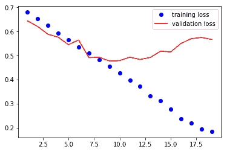
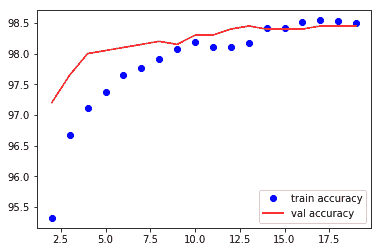

# 深度学习用于计算机视觉

在第三章中，*深入探讨神经网络*，我们使用了一个名为**ResNet**的流行**卷积神经网络**（**CNN**）架构构建了一个图像分类器，但我们将这个模型当作一个黑盒子使用。在本章中，我们将介绍卷积网络的重要构建模块。本章中我们将涵盖的一些重要主题包括：

+   神经网络介绍

+   从头构建 CNN 模型

+   创建和探索 VGG16 模型

+   计算预卷积特征

+   理解 CNN 模型学习的内容

+   可视化 CNN 层的权重

我们将探讨如何从头开始构建架构来解决图像分类问题，这是最常见的用例。我们还将学习如何使用迁移学习，这将帮助我们使用非常小的数据集构建图像分类器。

除了学习如何使用 CNN，我们还将探索这些卷积网络学习了什么。

# 神经网络介绍

在过去几年中，CNN 在计算机视觉领域的图像识别、物体检测、分割等任务中变得非常流行。它们也在**自然语言处理**（**NLP**）领域变得流行起来，尽管目前还不常用。完全连接层和卷积层之间的基本区别在于中间层中权重连接的方式。让我们看一下一幅图像，展示了完全连接或线性层的工作原理：


在计算机视觉中使用线性层或完全连接层的最大挑战之一是它们会丢失所有空间信息，而完全连接层在权重数量上的复杂性太大。例如，当我们将一个 224 像素的图像表示为一个平坦的数组时，我们最终会得到 150,528 个元素（224 x 224 x 3 个通道）。当图像被展平时，我们失去了所有的空间信息。让我们看看简化版 CNN 的样子：


所有卷积层所做的就是在图像上应用称为**滤波器**的权重窗口。在我们试图深入理解卷积和其他构建模块之前，让我们为`MNIST`数据集构建一个简单而强大的图像分类器。一旦我们构建了这个模型，我们将逐步分析网络的每个组成部分。我们将将构建图像分类器分解为以下步骤：

+   获取数据

+   创建验证数据集

+   从头构建我们的 CNN 模型

+   训练和验证模型

# MNIST – 获取数据

`MNIST`数据集包含了 60000 个手写数字（0 到 9）用于训练，以及 10000 张图片用作测试集。PyTorch 的`torchvision`库为我们提供了一个`MNIST`数据集，它可以下载数据并以易于使用的格式提供。让我们使用`MNIST`函数将数据集拉到我们的本地机器上，然后将其包装在一个`DataLoader`中。我们将使用 torchvision 的变换来将数据转换为 PyTorch 张量，并进行数据归一化。以下代码负责下载数据、包装在`DataLoader`中并进行数据归一化：

```py
transformation = 
  transforms.Compose([transforms.ToTensor(),
  transforms.Normalize((0.1307,), (0.3081,))])

train_dataset = 
  datasets.MNIST('data/',train=True,transform=transformation,
    download=True)
test_dataset =  
  datasets.MNIST('data/',train=False,transform=transformation,
    download=True)

train_loader =   
  torch.utils.data.DataLoader(train_dataset,batch_size=32,shuffle=True)
test_loader =  
  torch.utils.data.DataLoader(test_dataset,batch_size=32,shuffle=True)
```

因此，前面的代码为我们提供了`train`和`test`数据集的`DataLoader`。让我们可视化几个图像，以了解我们正在处理的内容。以下代码将帮助我们可视化 MNIST 图像：

```py
def plot_img(image):
    image = image.numpy()[0]
    mean = 0.1307
    std = 0.3081
    image = ((mean * image) + std)
    plt.imshow(image,cmap='gray')
```

现在我们可以通过`plot_img`方法来可视化我们的数据集。我们将使用以下代码从`DataLoader`中提取一批记录，并绘制这些图像：

```py
sample_data = next(iter(train_loader))
plot_img(sample_data[0][1])
plot_img(sample_data[0][2])
```

图像可视化如下所示：

   

# 从头开始构建 CNN 模型

例如，让我们从头开始构建我们自己的架构。我们的网络架构将包含不同的层组合，具体来说是：

+   `Conv2d`

+   `MaxPool2d`

+   **修正线性单元**（**ReLU**）

+   视图

+   线性层

让我们看一下我们将要实现的架构的图示表示：


让我们在 PyTorch 中实现这个架构，然后逐步分析每个单独的层的作用：

```py
class Net(nn.Module):
    def __init__(self):
        super().__init__()
        self.conv1 = nn.Conv2d(1, 10, kernel_size=5)
        self.conv2 = nn.Conv2d(10, 20, kernel_size=5)
        self.conv2_drop = nn.Dropout2d()
        self.fc1 = nn.Linear(320, 50)
        self.fc2 = nn.Linear(50, 10)

    def forward(self, x):
        x = F.relu(F.max_pool2d(self.conv1(x), 2))
        x = F.relu(F.max_pool2d(self.conv2_drop(self.conv2(x)), 2))
        x = x.view(-1, 320)
        x = F.relu(self.fc1(x))
        x = F.dropout(x, training=self.training)
        x = self.fc2(x)
        return F.log_softmax(x)
```

让我们详细了解每一层的作用。

# Conv2d

`Conv2d`负责在我们的 MNIST 图像上应用卷积滤波器。让我们尝试理解如何在一维数组上应用卷积，然后再转向如何在图像上应用二维卷积。我们将查看以下图像，我们将在长度为`7`的张量上应用一个滤波器（或内核）大小为`3`的`Conv1d`：


底部的方框表示我们的输入张量有七个值，连接的方框表示我们应用卷积滤波器后的输出，滤波器大小为三。在图像的右上角，三个方框表示`Conv1d`层的权重和参数。卷积滤波器像窗口一样应用，并通过跳过一个值移动到下一个值。要跳过的值的数量称为**步幅**，默认设置为`1`。让我们通过书写第一个和最后一个输出的计算来了解输出值是如何计算的：

输出 1 –> (*-0.5209 x 0.2286*) + (*-0.0147 x 2.4488*) + (*-0.4281 x -0.9498*)

输出 5 –> (*-0.5209 x -0.6791*) + (*-0.0147 x -0.6535*) + (*-0.4281 x 0.6437*)

所以，到目前为止，应该清楚卷积是做什么的了。它将一个滤波器（或内核），即一堆权重，应用在输入上，并根据步幅的值移动它。在前面的例子中，我们每次移动我们的滤波器一次。如果步幅值为 `2`，那么我们将一次移动两个点。让我们看一个 PyTorch 实现来理解它是如何工作的：

```py
conv = nn.Conv1d(1,1,3,bias=False)
sample = torch.randn(1,1,7)
conv(Variable(sample))

#Check the weights of our convolution filter by 
conv.weight
```

还有另一个重要的参数，称为**填充**（padding），通常与卷积一起使用。如果我们仔细观察前面的例子，我们可能会意识到，如果在数据的末尾没有足够的元素供数据进行跨步时，滤波器将停止。填充通过在张量的两端添加零来防止这种情况。让我们再次看一个关于填充如何工作的一维示例：


在前面的图像中，我们应用了带有填充 `2` 和步幅 `1` 的 `Conv1d` 层。

让我们看看 Conv2d 在图像上是如何工作的：

在我们理解 Conv2d 如何工作之前，我强烈建议你查看这篇精彩的博客（[`setosa.io/ev/image-kernels/`](http://setosa.io/ev/image-kernels/)），其中包含一个卷积演示的实时示例。在你花几分钟玩弄演示后，再阅读下一节。

让我们理解演示中发生了什么。在图像的中心框中，我们有两组不同的数字；一组在框中表示，另一组在框下面。框中表示的是像素值，如左手边的白色框所示。框下面标记的数字是用于锐化图像的滤波器（或内核）值。这些数字是手动选择的以执行特定的任务。在这种情况下，它是用来锐化图像的。就像在我们之前的例子中一样，我们进行元素对元素的乘法，并将所有值相加以生成右侧图像像素的值。生成的值由图像右侧的白色框突出显示。

尽管在这个例子中内核中的值是手动选择的，在 CNN 中我们不会手动选择这些值，而是随机初始化它们，并让梯度下降和反向传播调整内核的值。学习到的内核将负责识别不同的特征，如线条、曲线和眼睛。让我们看看另一张图像，我们把它看作是一个数字矩阵，并看看卷积是如何工作的：


在前一张屏幕截图中，我们假设 6 x 6 矩阵表示一张图像，我们应用大小为 3 x 3 的卷积滤波器，然后展示生成输出的方式。为了简单起见，我们只计算矩阵的突出部分。输出是通过进行以下计算生成的：

输出 –> *0.86 x 0 + -0.92 x 0 + -0.61 x 1 + -0.32 x -1 + -1.69 x -1 + ........*

`Conv2d`函数中使用的另一个重要参数是`kernel_size`，它决定了核的大小。一些常用的核大小包括*1*、*3*、*5*和*7*。核大小越大，滤波器能覆盖的区域就越大，因此在早期层中观察到使用*7*或*9*的滤波器是常见的。

# 池化

在卷积层后添加池化层是一种常见做法，因为它们可以减小特征图的大小和卷积层的输出。

池化提供两种不同的特性：一是减少要处理的数据大小，另一种是强制算法不要关注图像中位置的微小变化。例如，一个人脸检测算法应该能够在图片中检测到人脸，而不管人脸在照片中的位置如何。

让我们来看看 MaxPool2d 是如何工作的。它也有与卷积相同的核大小和步长概念。它与卷积不同的地方在于它没有任何权重，只是作用于上一层每个滤波器生成的数据。如果核大小是*2 x 2*，则它在图像中考虑该大小并选择该区域的最大值。让我们看一下接下来的图像，这将清楚地展示 MaxPool2d 的工作原理：


左侧框中包含特征图的值。应用最大池化后，输出存储在框的右侧。让我们看一下如何计算输出的第一行值的计算方式：


另一个常用的池化技术是**平均池化**。`maximum`函数被`average`函数替换。下图解释了平均池化的工作原理：


在这个例子中，我们不是取四个值的最大值，而是取这四个值的平均值。让我们写下计算方式，以便更容易理解：


# 非线性激活 – ReLU

在应用最大池化或卷积后，添加非线性层是一种常见且最佳的实践。大多数网络架构倾向于使用 ReLU 或不同变体的 ReLU。无论我们选择哪种非线性函数，它都应用于特征图的每个元素。为了更直观地理解，让我们看一个例子，在这个例子中，我们对应用了最大池化和平均池化的相同特征图应用 ReLU：


# 视图

大多数网络在图像分类问题的最后都会使用全连接或线性层。我们使用二维卷积，它将一个数字矩阵作为输入并输出另一个数字矩阵。要应用线性层，我们需要将这个二维张量展平为一个一维向量。接下来的示例将展示`view`函数的工作方式：


让我们看看我们网络中使用的代码，它执行相同的操作：

```py
x.view(-1, 320)
```

正如我们之前看到的，`view`方法将把一个*n*维张量展平为一个一维张量。在我们的网络中，第一维度是每个图像的尺寸。批处理后的输入数据将具有*32 x 1 x 28 x 28*的维度，其中第一个数字*32*表示有*32*张大小为*28*高度、*28*宽度和*1*通道的图像，因为它是一张黑白图像。当我们展平时，我们不希望展平或混合不同图像的数据。因此，我们传递给`view`函数的第一个参数将指导 PyTorch 避免在第一维上展平数据。让我们看看这在下面的图像中是如何工作的：


在前面的例子中，我们有大小为*2 x 1 x 2 x 2*的数据；在应用`view`函数后，它转换为大小为*2 x 1 x 4*的张量。让我们再看另一个例子，这次我们不提到*- 1*：


如果我们忘记提到要展平的维度，可能会导致意外的结果。所以在这一步要特别小心。

# 线性层

在将数据从二维张量转换为一维张量后，我们通过一个线性层，然后是一个非线性激活层。在我们的架构中，我们有两个线性层；一个后面跟着 ReLU，另一个后面跟着`log_softmax`，用于预测给定图像中包含的数字。

# 训练模型

训练模型的过程与我们之前猫狗图像分类问题的过程相同。以下代码片段展示了如何在提供的数据集上训练我们的模型：

```py
def fit(epoch,model,data_loader,phase='training',volatile=False):
    if phase == 'training':
        model.train()
    if phase == 'validation':
        model.eval()
        volatile=True
    running_loss = 0.0
    running_correct = 0
    for batch_idx , (data,target) in enumerate(data_loader):
        if is_cuda:
            data,target = data.cuda(),target.cuda()
        data , target = Variable(data,volatile),Variable(target)
        if phase == 'training':
            optimizer.zero_grad()
        output = model(data)
        loss = F.nll_loss(output,target)

        running_loss += F.nll_loss(output,target,size_average=False).data[0]
        preds = output.data.max(dim=1,keepdim=True)[1]
        running_correct += preds.eq(target.data.view_as(preds)).cpu().sum()
        if phase == 'training':
            loss.backward()
            optimizer.step()

    loss = running_loss/len(data_loader.dataset)
    accuracy = 100\. * running_correct/len(data_loader.dataset)

    print(f'{phase} loss is {loss:{5}.{2}} and {phase} accuracy is {running_correct}/{len(data_loader.dataset)}{accuracy:{10}.{4}}')
    return loss,accuracy
```

这种方法在`training`和`validation`中有不同的逻辑。使用不同模式主要有两个原因：

+   在`train`模式下，dropout 会删除一定百分比的值，在验证或测试阶段不应该发生这种情况。

+   对于`training`模式，我们计算梯度并改变模型的参数值，但在测试或验证阶段不需要反向传播。

前一个函数中的大部分代码是不言自明的，正如前几章中讨论的那样。在函数的最后，我们返回该特定时期模型的`loss`和`accuracy`。

让我们运行模型通过前述函数进行 20 次迭代，并绘制`训练`和`验证`的`损失`和`准确率`，以了解我们的网络表现如何。以下代码运行`fit`方法用于`训练`和`测试`数据集，迭代`20`次：

```py
model = Net()
if is_cuda:
    model.cuda()

optimizer = optim.SGD(model.parameters(),lr=0.01,momentum=0.5)
train_losses , train_accuracy = [],[]
val_losses , val_accuracy = [],[]
for epoch in range(1,20):
    epoch_loss, epoch_accuracy = fit(epoch,model,train_loader,phase='training')
    val_epoch_loss , val_epoch_accuracy = fit(epoch,model,test_loader,phase='validation')
    train_losses.append(epoch_loss)
    train_accuracy.append(epoch_accuracy)
    val_losses.append(val_epoch_loss)
    val_accuracy.append(val_epoch_accuracy)
```

以下代码绘制`训练`和`测试损失`：

```py
plt.plot(range(1,len(train_losses)+1),train_losses,'bo',label = 'training loss')
plt.plot(range(1,len(val_losses)+1),val_losses,'r',label = 'validation loss')
plt.legend()
```

前述代码生成如下图表：


以下代码绘制训练和测试的准确率：

```py
plt.plot(range(1,len(train_accuracy)+1),train_accuracy,'bo',label = 'train accuracy')
plt.plot(range(1,len(val_accuracy)+1),val_accuracy,'r',label = 'val accuracy')
plt.legend()
```

前述代码生成如下图表：


在第 20 个迭代周期结束时，我们实现了`测试`准确率达到了 98.9%。我们的简单卷积模型已经可以工作，并且几乎达到了最先进的结果。让我们看看当我们尝试在之前使用的`狗与猫`数据集上使用相同网络架构时会发生什么。我们将使用我们前一章节中的数据，第三章，*神经网络的构建块*，以及来自 MNIST 示例的架构，并进行一些微小的更改。一旦我们训练模型，让我们评估它，以了解我们的简单架构的表现如何。

# 独自从头构建的 CNN 对狗和猫进行分类

我们将使用与少许更改的相同架构，如下所列：

+   第一个线性层的输入维度发生变化，因为我们猫和狗图像的维度为*256, 256*

+   我们增加另一层线性层以提供模型更多的灵活性学习

让我们看一下实现网络架构的代码：

```py
class Net(nn.Module):
    def __init__(self):
        super().__init__()
        self.conv1 = nn.Conv2d(3, 10, kernel_size=5)
        self.conv2 = nn.Conv2d(10, 20, kernel_size=5)
        self.conv2_drop = nn.Dropout2d()
        self.fc1 = nn.Linear(56180, 500)
        self.fc2 = nn.Linear(500,50)
        self.fc3 = nn.Linear(50, 2)

    def forward(self, x):
        x = F.relu(F.max_pool2d(self.conv1(x), 2))
        x = F.relu(F.max_pool2d(self.conv2_drop(self.conv2(x)), 2))
        x = x.view(x.size(0),-1)
        x = F.relu(self.fc1(x))
        x = F.dropout(x, training=self.training)
        x = F.relu(self.fc2(x))
        x = F.dropout(x,training=self.training)
        x = self.fc3(x)
        return F.log_softmax(x,dim=1)
```

我们将使用与 MNIST 示例相同的`训练`函数。所以，我这里不包括代码。但让我们看一下在训练*20*次迭代时生成的图表。

`训练`和`验证`数据集的损失：



`训练`和`验证`数据集的准确率：


从图表可以清楚地看出，训练损失在每次迭代中都在减少，但验证损失却变得更糟。准确率在训练过程中也在增加，但几乎在 75%时饱和。这是一个明显的例子，显示模型没有泛化。我们将看一下另一种称为**迁移学习**的技术，它帮助我们训练更精确的模型，同时提供使训练更快的技巧。

# 使用迁移学习对狗和猫进行分类

迁移学习是在不从头训练算法的情况下，重新使用已训练算法处理类似数据集的能力。我们人类并不通过分析成千上万张类似图像来学习识别新图像。作为人类，我们只是理解实际区分特定动物（比如狐狸和狗）的不同特征。我们无需从理解线条、眼睛及其他较小特征是什么开始学习什么是狐狸。因此，我们将学习如何利用预训练模型来仅用少量数据构建最先进的图像分类器。

CNN 架构的前几层专注于较小的特征，例如线条或曲线的外观。CNN 的后几层中的滤波器学习更高级的特征，例如眼睛和手指，最后几层学习识别确切的类别。预训练模型是在类似数据集上训练的算法。大多数流行的算法都是在流行的`ImageNet`数据集上预训练，以识别 1,000 个不同的类别。这样一个预训练模型将具有调整后的滤波器权重，用于识别各种模式。因此，让我们了解如何利用这些预训练权重。我们将研究一种名为**VGG16**的算法，这是最早在 ImageNet 竞赛中取得成功的算法之一。尽管现代有更多的算法，但由于其简单易懂且适用于迁移学习，这个算法仍然很受欢迎。让我们先看一下 VGG16 模型的架构，然后尝试理解这个架构以及如何用它来训练我们的图像分类器：


VGG16 模型的架构

VGG16 的架构包含五个 VGG 块。一个块包括一组卷积层、非线性激活函数和最大池化函数。所有的算法参数都调整到达到分类 1,000 个类别的最先进结果。该算法接受批处理形式的输入数据，这些数据是通过`ImageNet`数据集的均值和标准差进行标准化的。在迁移学习中，我们尝试通过冻结大部分层的学习参数来捕捉算法学到的内容。通常的做法是仅微调网络的最后几个线性层，并保持卷积层不变，因为卷积层学到的特征对所有具有相似属性的图像问题都是有效的。在这个例子中，让我们仅训练最后几个线性层，保持卷积层不变。让我们使用迁移学习训练一个 VGG16 模型来分类狗和猫。让我们逐步实施这些不同步骤。

# 创建和探索一个 VGG16 模型

PyTorch 在其`torchvision`库中提供了一组经过训练的模型。当参数`pretrained`为`True`时，大多数模型会下载针对**ImageNet**分类问题调整过的权重。让我们看一下创建 VGG16 模型的代码片段：

```py
from torchvision import models
vgg = models.vgg16(pretrained=True)
```

现在我们有了准备好使用的所有预训练权重的 VGG16 模型。当第一次运行代码时，根据您的网络速度，可能需要几分钟的时间。权重的大小大约为 500 MB。我们可以通过打印来快速查看 VGG16 模型。了解这些网络是如何实现的，在使用现代架构时非常有用。让我们看看这个模型：

```py
VGG (
  (features): Sequential (
    (0): Conv2d(3, 64, kernel_size=(3, 3), stride=(1, 1), padding=(1, 1))
    (1): ReLU (inplace)
    (2): Conv2d(64, 64, kernel_size=(3, 3), stride=(1, 1), padding=(1, 1))
    (3): ReLU (inplace)
    (4): MaxPool2d (size=(2, 2), stride=(2, 2), dilation=(1, 1))
    (5): Conv2d(64, 128, kernel_size=(3, 3), stride=(1, 1), padding=(1, 1))
    (6): ReLU (inplace)
    (7): Conv2d(128, 128, kernel_size=(3, 3), stride=(1, 1), padding=(1, 1))
    (8): ReLU (inplace)
    (9): MaxPool2d (size=(2, 2), stride=(2, 2), dilation=(1, 1))
    (10): Conv2d(128, 256, kernel_size=(3, 3), stride=(1, 1), padding=(1, 1))
    (11): ReLU (inplace)
    (12): Conv2d(256, 256, kernel_size=(3, 3), stride=(1, 1), padding=(1, 1))
    (13): ReLU (inplace)
    (14): Conv2d(256, 256, kernel_size=(3, 3), stride=(1, 1), padding=(1, 1))
    (15): ReLU (inplace)
    (16): MaxPool2d (size=(2, 2), stride=(2, 2), dilation=(1, 1))
    (17): Conv2d(256, 512, kernel_size=(3, 3), stride=(1, 1), padding=(1, 1))
    (18): ReLU (inplace)
    (19): Conv2d(512, 512, kernel_size=(3, 3), stride=(1, 1), padding=(1, 1))
    (20): ReLU (inplace)
    (21): Conv2d(512, 512, kernel_size=(3, 3), stride=(1, 1), padding=(1, 1))
    (22): ReLU (inplace)
    (23): MaxPool2d (size=(2, 2), stride=(2, 2), dilation=(1, 1))
    (24): Conv2d(512, 512, kernel_size=(3, 3), stride=(1, 1), padding=(1, 1))
    (25): ReLU (inplace)
    (26): Conv2d(512, 512, kernel_size=(3, 3), stride=(1, 1), padding=(1, 1))
    (27): ReLU (inplace)
    (28): Conv2d(512, 512, kernel_size=(3, 3), stride=(1, 1), padding=(1, 1))
    (29): ReLU (inplace)
    (30): MaxPool2d (size=(2, 2), stride=(2, 2), dilation=(1, 1))
  )
  (classifier): Sequential (
    (0): Linear (25088 -> 4096)
    (1): ReLU (inplace)
    (2): Dropout (p = 0.5)
    (3): Linear (4096 -> 4096)
    (4): ReLU (inplace)
    (5): Dropout (p = 0.5)
    (6): Linear (4096 -> 1000)
  )
)
```

模型摘要包含两个顺序模型 `特征` 和 `分类器`。 `特征顺序` 模型具有我们将要冻结的层。

# 冻结层

让我们冻结 `特征` 模型的所有层，其中包含卷积块。冻结这些卷积块的权重将防止模型权重。由于模型的权重是训练用于识别许多重要特征，我们的算法将能够从第一个迭代开始做同样的事情。使用最初针对不同用例训练的模型权重的能力称为**迁移学习**。现在让我们看看如何冻结层的权重或参数：

```py
for param in vgg.features.parameters(): param.requires_grad = False
```

此代码防止优化器更新权重。

# 微调 VGG16

VGG16 模型经过训练，用于分类 1000 个类别，但没有经过狗和猫的分类训练。因此，我们需要将最后一层的输出特征从 `1000` 更改为 `2`。以下代码片段执行此操作：

```py
vgg.classifier[6].out_features = 2
```

`vgg.classifier` 提供了顺序模型中所有层的访问权限，第六个元素将包含最后一层。当我们训练 VGG16 模型时，我们只需要训练分类器参数。因此，我们将仅将 `classifier.parameters` 传递给优化器，如下所示：

```py
optimizer = 
  optim.SGD(vgg.classifier.parameters(),lr=0.0001,momentum=0.5)
```

# 训练 VGG16 模型

我们已经创建了模型和优化器。由于我们使用的是 `狗与猫` 数据集，我们可以使用相同的数据加载器和 `train` 函数来训练我们的模型。请记住，当我们训练模型时，只有分类器内部的参数会发生变化。以下代码片段将训练模型 `20` 个 epoch，达到 98.45% 的验证准确率。

```py
train_losses , train_accuracy = [],[]
val_losses , val_accuracy = [],[]
for epoch in range(1,20):
    epoch_loss, epoch_accuracy = fit(epoch,vgg,train_data_loader,phase='training')
    val_epoch_loss , val_epoch_accuracy = fit(epoch,vgg,valid_data_loader,phase='validation')
    train_losses.append(epoch_loss)
    train_accuracy.append(epoch_accuracy)
    val_losses.append(val_epoch_loss)
    val_accuracy.append(val_epoch_accuracy)
```

让我们可视化训练和验证损失：


让我们可视化训练和验证准确率：



我们可以应用一些技巧，例如数据增强和尝试不同的丢弃值来改进模型的泛化能力。下面的代码片段将在 VGG 的分类器模块中将丢弃值从 `0.5` 更改为 `0.2` 并训练模型：

```py
for layer in vgg.classifier.children():
    if(type(layer) == nn.Dropout):
        layer.p = 0.2

#Training
train_losses , train_accuracy = [],[]
val_losses , val_accuracy = [],[]
for epoch in range(1,3):
    epoch_loss, epoch_accuracy = fit(epoch,vgg,train_data_loader,phase='training')
    val_epoch_loss , val_epoch_accuracy = fit(epoch,vgg,valid_data_loader,phase='validation')
    train_losses.append(epoch_loss)
    train_accuracy.append(epoch_accuracy)
    val_losses.append(val_epoch_loss)
    val_accuracy.append(val_epoch_accuracy)
```

对此进行几个 epoch 的训练稍微改进了我的模型；您可以尝试不同的丢弃值。改进模型泛化的另一个重要技巧是增加更多的数据或进行数据增强。我们将进行数据增强，随机水平翻转图像或将图像旋转一个小角度。 `torchvision` 转换提供不同的功能来执行数据增强，它们在每个 epoch 动态地进行更改。我们使用以下代码实现数据增强：

```py
train_transform =transforms.Compose([transforms.Resize((224,224)),
                                     transforms.RandomHorizontalFlip(),
                                     transforms.RandomRotation(0.2),
                                     transforms.ToTensor(),
                                     transforms.Normalize([0.485, 0.456, 0.406], [0.229, 0.224, 0.225])
                                      ])

train = ImageFolder('dogsandcats/train/',train_transform)
valid = ImageFolder('dogsandcats/valid/',simple_transform)

#Training 

train_losses , train_accuracy = [],[]
val_losses , val_accuracy = [],[]
for epoch in range(1,3):
    epoch_loss, epoch_accuracy = fit(epoch,vgg,train_data_loader,phase='training')
    val_epoch_loss , val_epoch_accuracy = fit(epoch,vgg,valid_data_loader,phase='validation')
    train_losses.append(epoch_loss)
    train_accuracy.append(epoch_accuracy)
    val_losses.append(val_epoch_loss)
    val_accuracy.append(val_epoch_accuracy)
```

上述代码的输出生成如下：

```py
#Results

training loss is 0.041 and training accuracy is 22657/23000 98.51 validation loss is 0.043 and validation accuracy is 1969/2000 98.45 training loss is 0.04 and training accuracy is 22697/23000 98.68 validation loss is 0.043 and validation accuracy is 1970/2000 98.5
```

使用增强数据训练模型提高了 0.1%的模型准确性，仅运行两个 epoch 即可。如果继续运行更多 epoch，可以进一步提高准确性。如果你在阅读书籍时一直在训练这些模型，你会意识到每个 epoch 的训练可能会超过几分钟，具体取决于你使用的 GPU。让我们看一下一种技术，可以在几秒钟内完成每个 epoch 的训练。

# 计算预卷积特征

当我们冻结卷积层并训练模型时，完全连接层（或称为密集层）的输入（`vgg.classifier`）始终保持不变。为了更好地理解，让我们将卷积块，在我们的例子中是`vgg.features`块，视为一个已经学习权重且在训练过程中不会改变的函数。因此，计算卷积特征并存储它们将有助于提高训练速度。由于我们只需计算这些特征一次，而不是每个 epoch 都计算，因此模型训练的时间大大缩短。让我们通过可视化的方式理解并实现相同的过程：


第一个框显示了通常的训练方式，这可能会很慢，因为我们为每个 epoch 计算卷积特征，尽管这些值不会改变。在底部框中，我们只计算一次卷积特征并仅训练线性层。为了计算预卷积特征，我们将所有训练数据通过卷积块，并将它们存储起来。为此，我们需要选择 VGG 模型的卷积块。幸运的是，VGG16 的 PyTorch 实现有两个连续模型，因此仅选择第一个连续模型的特征就足够了。以下代码实现了这一点：

```py
vgg = models.vgg16(pretrained=True)
vgg = vgg.cuda()
features = vgg.features

train_data_loader = torch.utils.data.DataLoader(train,batch_size=32,num_workers=3,shuffle=False)
valid_data_loader = torch.utils.data.DataLoader(valid,batch_size=32,num_workers=3,shuffle=False)

def preconvfeat(dataset,model):
    conv_features = []
    labels_list = []
    for data in dataset:
        inputs,labels = data
        if is_cuda:
            inputs , labels = inputs.cuda(),labels.cuda() 
        inputs , labels = Variable(inputs),Variable(labels)
        output = model(inputs)
        conv_features.extend(output.data.cpu().numpy())
        labels_list.extend(labels.data.cpu().numpy())
    conv_features = np.concatenate([[feat] for feat in conv_features])

    return (conv_features,labels_list)

conv_feat_train,labels_train = preconvfeat(train_data_loader,features)
conv_feat_val,labels_val = preconvfeat(valid_data_loader,features)
```

在前面的代码中，`preconvfeat`方法接收数据集和`vgg`模型，并返回了卷积特征以及与之相关联的标签。其余的代码与我们在其他示例中用于创建数据加载器和数据集的代码类似。

一旦我们对`train`和`validation`集合有了卷积特征，让我们创建 PyTorch 数据集和`DataLoader`类，这将简化我们的训练过程。以下代码创建了用于我们卷积特征的`Dataset`和`DataLoader`：

```py
class My_dataset(Dataset):
    def __init__(self,feat,labels):
        self.conv_feat = feat
        self.labels = labels

    def __len__(self):
        return len(self.conv_feat)

    def __getitem__(self,idx):
        return self.conv_feat[idx],self.labels[idx]

train_feat_dataset = My_dataset(conv_feat_train,labels_train)
val_feat_dataset = My_dataset(conv_feat_val,labels_val)

train_feat_loader = 
  DataLoader(train_feat_dataset,batch_size=64,shuffle=True)
val_feat_loader = 
  DataLoader(val_feat_dataset,batch_size=64,shuffle=True)
```

由于我们有新的数据加载器，可以生成带有标签的卷积特征批次，我们可以使用在其他示例中使用过的相同的`train`函数。现在我们将使用`vgg.classifier`作为模型，用于创建`optimizer`和`fit`方法。以下代码训练分类器模块以识别狗和猫。在 Titan X GPU 上，每个 epoch 的时间少于五秒，这相比于原本可能需要几分钟：

```py
train_losses , train_accuracy = [],[]
val_losses , val_accuracy = [],[]
for epoch in range(1,20):
    epoch_loss, epoch_accuracy = fit_numpy(epoch,vgg.classifier,train_feat_loader,phase='training')
    val_epoch_loss , val_epoch_accuracy = fit_numpy(epoch,vgg.classifier,val_feat_loader,phase='validation')
    train_losses.append(epoch_loss)
    train_accuracy.append(epoch_accuracy)
    val_losses.append(val_epoch_loss)
    val_accuracy.append(val_epoch_accuracy)
```

# 理解 CNN 模型学习到了什么

深度学习模型通常被认为是不可解释的。但是，正在探索不同的技术来解释这些模型内部发生的事情。对于图像，卷积网络学习到的特征是可解释的。我们将探索两种流行的技术来理解卷积网络。

# 可视化中间层的输出

可视化中间层的输出将帮助我们理解输入图像如何在不同层次中进行转换。通常，每层的输出称为**激活**。为此，我们应该从中间层提取输出，可以通过不同的方式实现。PyTorch 提供了一个称为 `register_forward_hook` 的方法，允许我们传递一个函数来提取特定层的输出。

默认情况下，PyTorch 模型仅存储最后一层的输出，以便最优化内存使用。因此，在我们检查中间层激活之前，让我们先了解如何从模型中提取输出。让我们看下面的代码片段，该片段提取了输出，我们将逐步分析其过程：

```py
vgg = models.vgg16(pretrained=True).cuda()

class LayerActivations():
    features=None

    def __init__(self,model,layer_num):
        self.hook = model[layer_num].register_forward_hook(self.hook_fn)

    def hook_fn(self,module,input,output):
        self.features = output.cpu()

    def remove(self):
        self.hook.remove()

conv_out = LayerActivations(vgg.features,0)

o = vgg(Variable(img.cuda()))

conv_out.remove()

act = conv_out.features
```

我们从一个预训练的 VGG 模型开始，从中提取特定层的输出。`LayerActivations` 类指示 PyTorch 将层的输出存储到 `features` 变量中。让我们逐个检查 `LayerActivations` 类中的每个函数。

`_init_` 函数接受模型和需要提取输出的层号作为参数。我们在该层上调用 `register_forward_hook` 方法并传递一个函数。当 PyTorch 进行前向传播——即图像通过各层时——会调用传递给 `register_forward_hook` 方法的函数。该方法返回一个句柄，可用于注销传递给 `register_forward_hook` 方法的函数。

`register_forward_hook` 方法向我们传递了三个值，这些值会传递给我们传递给它的函数。`module` 参数允许我们访问层本身。第二个参数是 `input`，指的是流经该层的数据。第三个参数是 `output`，允许访问转换后的输入或层的激活。我们将输出存储到 `LayerActivations` 类的 `features` 变量中。

第三个函数从 `_init_` 函数获取 `hook` 并注销函数。现在我们可以传递模型和我们希望查找激活的层号。让我们看看以下图像不同层级的激活：


让我们可视化第一个卷积层创建的一些激活及其使用的代码：

```py
fig = plt.figure(figsize=(20,50))
fig.subplots_adjust(left=0,right=1,bottom=0,top=0.8,hspace=0,
  wspace=0.2)
for i in range(30):
    ax = fig.add_subplot(12,5,i+1,xticks=[],yticks=[])
    ax.imshow(act[0][i])
```

让我们可视化第五个卷积层创建的一些激活：


让我们看看最后一个 CNN 层：


从观察不同层生成的内容可以看出，早期层检测线条和边缘，而最后的层倾向于学习更高级的特征，并且不那么可解释。在我们继续可视化权重之前，让我们看看在 ReLU 层之后特征映射或激活是如何呈现的。因此，让我们来可视化第二层的输出。

如果您快速查看前一图像的第二行中的第五幅图像，它看起来像是在检测图像中的眼睛。当模型性能不佳时，这些可视化技巧可以帮助我们理解模型可能出现问题的原因。

# 可视化 CNN 层的权重

获得特定层的模型权重非常简单。所有模型权重可以通过`state_dict`函数访问。`state_dict`函数返回一个字典，其中键是层，值是其权重。以下代码演示了如何提取特定层的权重并进行可视化：

```py
vgg.state_dict().keys()
cnn_weights = vgg.state_dict()['features.0.weight'].cpu()
```

前面的代码给出了以下输出：


每个框表示大小为*3 x 3*的过滤器权重。每个过滤器都经过训练来识别图像中的某些模式。

# 总结

在本章中，我们学习了如何使用卷积神经网络构建图像分类器，以及如何使用预训练模型。我们介绍了通过使用这些预卷积特征加快训练过程的技巧。此外，我们了解了可以用来理解 CNN 内部运作过程的不同技术。

在下一章中，我们将学习如何使用循环神经网络处理序列数据。
