# 第六章：序列数据和文本的深度学习

在上一章中，我们介绍了如何使用**卷积神经网络**（**CNNs**）处理空间数据，并构建了图像分类器。在本章中，我们将涵盖以下主题：

+   对于构建深度学习模型有用的文本数据的不同表示形式

+   理解**循环神经网络**（**RNNs**）及其不同实现，如**长短期记忆**（**LSTM**）和**门控循环单元**（**GRU**），它们支持大多数文本和序列数据的深度学习模型

+   使用一维卷积处理序列数据

可以使用 RNN 构建的一些应用包括：

+   **文档分类器**：识别推文或评论的情感，分类新闻文章

+   **序列到序列学习**：用于任务如语言翻译，将英语转换为法语

+   **时间序列预测**：根据前几天的商店销售详情预测商店的销售情况

# 处理文本数据

文本是常用的序列数据类型之一。文本数据可以看作是字符序列或单词序列。对于大多数问题，将文本视为单词序列是很常见的。深度学习序列模型如 RNN 及其变体能够从文本数据中学习重要模式，可以解决以下领域的问题：

+   自然语言理解

+   文档分类

+   情感分类

这些序列模型也是各种系统的重要构建块，如**问答系统**（**QA**）。

尽管这些模型在构建这些应用中非常有用，但由于其固有的复杂性，它们并不理解人类语言。这些序列模型能够成功地找到有用的模式，然后用于执行不同的任务。将深度学习应用于文本是一个快速发展的领域，每个月都有许多新技术问世。我们将介绍支持大多数现代深度学习应用的基本组件。

深度学习模型和其他机器学习模型一样，不理解文本，因此我们需要将文本转换为数值表示。将文本转换为数值表示的过程称为**向量化**，可以用不同的方法进行，如下所述：

+   将文本转换为单词，并将每个单词表示为一个向量

+   将文本转换为字符，并将每个字符表示为一个向量

+   创建*n*-gram 单词并将它们表示为向量

文本数据可以分解为这些表示之一。每个文本的较小单元称为**标记**，将文本分解为标记的过程称为**标记化**。Python 中有很多强大的库可以帮助我们进行标记化。一旦我们将文本数据转换为标记，我们就需要将每个标记映射到一个向量上。一热编码和词嵌入是将标记映射到向量的两种最流行的方法。以下图表总结了将文本转换为其向量表示的步骤：

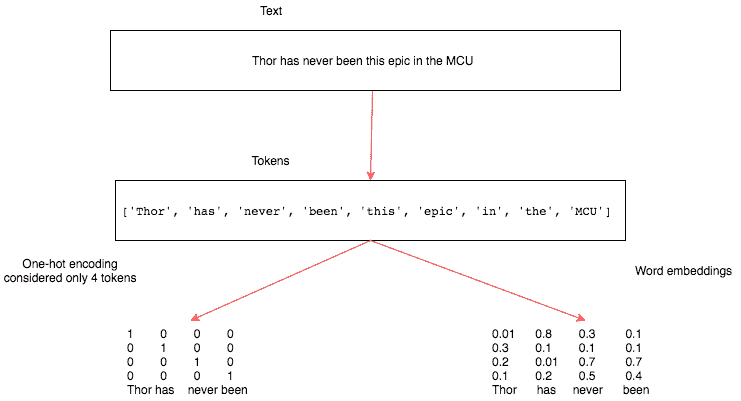

让我们更详细地看一下标记化、*n*-gram 表示和向量化。

# 标记化

给定一个句子，将其拆分为字符或单词称为**标记化**。有一些库，比如 spaCy，提供了复杂的标记化解决方案。让我们使用简单的 Python 函数，比如 `split` 和 `list`，将文本转换为标记。

为了演示标记化在字符和单词上的工作原理，让我们考虑电影《雷神 3：诸神黄昏》的简短评论。我们将使用以下文本：

这部电影的动作场面非常出色。在 MCU 中，Thor 从未如此史诗般。他在这部电影中表现得相当史诗，绝对不再是无能为力。Thor 在这部电影中释放了自我，我喜欢这一点。

# 将文本转换为字符

Python 的 `list` 函数接受一个字符串并将其转换为单个字符的列表。这完成了将文本转换为字符的任务。以下代码块展示了使用的代码和结果：

```py
thor_review = "the action scenes were top notch in this movie. Thor has never been this epic in the MCU. He does some pretty epic sh*t in this movie and he is definitely not under-powered anymore. Thor in unleashed in this, I love that."

print(list(thor_review))

```

结果如下：

```py

#Results
['t', 'h', 'e', ' ', 'a', 'c', 't', 'i', 'o', 'n', ' ', 's', 'c', 'e', 'n', 'e', 's', ' ', 'w', 'e', 'r', 'e', ' ', 't', 'o', 'p', ' ', 'n', 'o', 't', 'c', 'h', ' ', 'i', 'n', ' ', 't', 'h', 'i', 's', ' ', 'm', 'o', 'v', 'i', 'e', '.', ' ', 'T', 'h', 'o', 'r', ' ', 'h', 'a', 's', ' ', 'n', 'e', 'v', 'e', 'r', ' ', 'b', 'e', 'e', 'n', ' ', 't', 'h', 'i', 's', ' ', 'e', 'p', 'i', 'c', ' ', 'i', 'n', ' ', 't', 'h', 'e', ' ', 'M', 'C', 'U', '.', ' ', 'H', 'e', ' ', 'd', 'o', 'e', 's', ' ', 's', 'o', 'm', 'e', ' ', 'p', 'r', 'e', 't', 't', 'y', ' ', 'e', 'p', 'i', 'c', ' ', 's', 'h', '*', 't', ' ', 'i', 'n', ' ', 't', 'h', 'i', 's', ' ', 'm', 'o', 'v', 'i', 'e', ' ', 'a', 'n', 'd', ' ', 'h', 'e', ' ', 'i', 's', ' ', 'd', 'e', 'f', 'i', 'n', 'i', 't', 'e', 'l', 'y', ' ', 'n', 'o', 't', ' ', 'u', 'n', 'd', 'e', 'r', '-', 'p', 'o', 'w', 'e', 'r', 'e', 'd', ' ', 'a', 'n', 'y', 'm', 'o', 'r', 'e', '.', ' ', 'T', 'h', 'o', 'r', ' ', 'i', 'n', ' ', 'u', 'n', 'l', 'e', 'a', 's', 'h', 'e', 'd', ' ', 'i', 'n', ' ', 't', 'h', 'i', 's', ',', ' ', 'I', ' ', 'l', 'o', 'v', 'e', ' ', 't', 'h', 'a', 't', '.']
```

这个结果展示了我们简单的 Python 函数如何将文本转换为标记。

# 将文本转换为单词

我们将使用 Python 字符串对象中的 `split` 函数将文本分割成单词。`split` 函数接受一个参数，根据此参数将文本分割为标记。对于我们的示例，我们将使用空格作为分隔符。以下代码块演示了如何使用 Python 的 `split` 函数将文本转换为单词：

```py
print(Thor_review.split())

#Results

['the', 'action', 'scenes', 'were', 'top', 'notch', 'in', 'this', 'movie.', 'Thor', 'has', 'never', 'been', 'this', 'epic', 'in', 'the', 'MCU.', 'He', 'does', 'some', 'pretty', 'epic', 'sh*t', 'in', 'this', 'movie', 'and', 'he', 'is', 'definitely', 'not', 'under-powered', 'anymore.', 'Thor', 'in', 'unleashed', 'in', 'this,', 'I', 'love', 'that.']
```

在上述代码中，我们没有使用任何分隔符；`split` 函数默认在空格上分割。

# *N*-gram 表示

我们已经看到文本可以表示为字符和单词。有时候，查看两个、三个或更多单词在一起是很有用的。*N*-gram 是从给定文本中提取的一组单词。在 *n*-gram 中，*n* 表示可以一起使用的单词数。让我们看一个 *bigram*（*n=2*）的示例。我们使用 Python 的 `nltk` 包为 `thor_review` 生成了一个 *bigram*。以下代码块展示了 *bigram* 的结果以及生成它所使用的代码：

```py
from nltk import ngrams

print(list(ngrams(thor_review.split(),2)))

#Results
[('the', 'action'), ('action', 'scenes'), ('scenes', 'were'), ('were', 'top'), ('top', 'notch'), ('notch', 'in'), ('in', 'this'), ('this', 'movie.'), ('movie.', 'Thor'), ('Thor', 'has'), ('has', 'never'), ('never', 'been'), ('been', 'this'), ('this', 'epic'), ('epic', 'in'), ('in', 'the'), ('the', 'MCU.'), ('MCU.', 'He'), ('He', 'does'), ('does', 'some'), ('some', 'pretty'), ('pretty', 'epic'), ('epic', 'sh*t'), ('sh*t', 'in'), ('in', 'this'), ('this', 'movie'), ('movie', 'and'), ('and', 'he'), ('he', 'is'), ('is', 'definitely'), ('definitely', 'not'), ('not', 'under-powered'), ('under-powered', 'anymore.'), ('anymore.', 'Thor'), ('Thor', 'in'), ('in', 'unleashed'), ('unleashed', 'in'), ('in', 'this,'), ('this,', 'I'), ('I', 'love'), ('love', 'that.')]
```

`ngrams` 函数接受一系列单词作为第一个参数，并将要分组的单词数作为第二个参数。以下代码块展示了三元组表示法的样子，以及用于它的代码：

```py
print(list(ngrams(thor_review.split(),3)))

#Results

[('the', 'action', 'scenes'), ('action', 'scenes', 'were'), ('scenes', 'were', 'top'), ('were', 'top', 'notch'), ('top', 'notch', 'in'), ('notch', 'in', 'this'), ('in', 'this', 'movie.'), ('this', 'movie.', 'Thor'), ('movie.', 'Thor', 'has'), ('Thor', 'has', 'never'), ('has', 'never', 'been'), ('never', 'been', 'this'), ('been', 'this', 'epic'), ('this', 'epic', 'in'), ('epic', 'in', 'the'), ('in', 'the', 'MCU.'), ('the', 'MCU.', 'He'), ('MCU.', 'He', 'does'), ('He', 'does', 'some'), ('does', 'some', 'pretty'), ('some', 'pretty', 'epic'), ('pretty', 'epic', 'sh*t'), ('epic', 'sh*t', 'in'), ('sh*t', 'in', 'this'), ('in', 'this', 'movie'), ('this', 'movie', 'and'), ('movie', 'and', 'he'), ('and', 'he', 'is'), ('he', 'is', 'definitely'), ('is', 'definitely', 'not'), ('definitely', 'not', 'under-powered'), ('not', 'under-powered', 'anymore.'), ('under-powered', 'anymore.', 'Thor'), ('anymore.', 'Thor', 'in'), ('Thor', 'in', 'unleashed'), ('in', 'unleashed', 'in'), ('unleashed', 'in', 'this,'), ('in', 'this,', 'I'), ('this,', 'I', 'love'), ('I', 'love', 'that.')]
```

在前述代码中唯一改变的是函数的第二个参数*n*-值。

许多监督学习模型，例如朴素贝叶斯，使用*n*-gram 来改善它们的特征空间。*n*-gram 也用于拼写纠正和文本摘要任务。

*n*-gram 表示的一个挑战是它丢失了文本的顺序性质。它通常与浅层机器学习模型一起使用。这种技术在深度学习中很少使用，因为像 RNN 和 Conv1D 这样的架构可以自动学习这些表示。

# 向量化

有两种流行的方法可以将生成的标记映射到数字向量中，称为**单热编码**和**词嵌入**。让我们通过编写一个简单的 Python 程序来了解如何将标记转换为这些向量表示。我们还将讨论每种方法的各种优缺点。

# 单热编码

在单热编码中，每个标记由长度为 N 的向量表示，其中*N*是文档中唯一单词的数量。让我们看一个简单的句子，并观察每个标记如何表示为单热编码向量。以下是句子及其相关标记表示：

*一天一个苹果，医生远离你*。

前述句子的单热编码可以用表格格式表示如下：

| An | 100000000 |
| --- | --- |
| apple | 010000000 |
| a | 001000000 |
| day | 000100000 |
| keeps | 000010000 |
| doctor | 000001000 |
| away | 000000100 |
| said | 000000010 |
| the | 000000001 |

此表描述了标记及其单热编码表示。向量长度为 9，因为句子中有九个唯一单词。许多机器学习库已经简化了创建单热编码变量的过程。我们将编写自己的实现以便更容易理解，并可以使用相同的实现来构建后续示例所需的其他特征。以下代码包含了一个`Dictionary`类，其中包含创建唯一单词字典以及返回特定单词的单热编码向量的功能。让我们看一下代码，然后逐个功能进行解释：

```py
class Dictionary(object):
    def __init__(self):
        self.word2idx = {}
        self.idx2word = []
        self.length = 0

    def add_word(self,word):
        if word not in self.idx2word:
            self.idx2word.append(word)
            self.word2idx[word] = self.length + 1
            self.length += 1
        return self.word2idx[word]

    def __len__(self):
        return len(self.idx2word)

    def onehot_encoded(self,word):
        vec = np.zeros(self.length)
        vec[self.word2idx[word]] = 1
        return vec

```

前述代码提供了三个重要功能：

+   初始化函数`__init__`创建了一个`word2idx`字典，它将存储所有唯一单词及其索引。`idx2word`列表存储所有唯一单词，`length`变量包含文档中唯一单词的总数。

+   `add_word`函数接受一个单词并将其添加到`word2idx`和`idx2word`中，并增加词汇表的长度（假设单词是唯一的）。

+   `onehot_encoded`函数接受一个单词并返回一个长度为 N 的向量，其中除了单词的索引处为一之外，所有其他值都为零。如果传递的单词的索引是二，则向量在索引二处的值将为一，所有其他值将为零。

由于我们已经定义了`Dictionary`类，让我们在`thor_review`数据上使用它。以下代码演示了如何构建`word2idx`以及如何调用我们的`onehot_encoded`函数：

```py
dic = Dictionary()

for tok in thor_review.split():
    dic.add_word(tok)

print(dic.word2idx)
```

前述代码的输出如下：

```py
# Results of word2idx

{'the': 1, 'action': 2, 'scenes': 3, 'were': 4, 'top': 5, 'notch': 6, 'in': 7, 'this': 8, 'movie.': 9, 'Thor': 10, 'has': 11, 'never': 12, 'been': 13, 'epic': 14, 'MCU.': 15, 'He': 16, 'does': 17, 'some': 18, 'pretty': 19, 'sh*t': 20, 'movie': 21, 'and': 22, 'he': 23, 'is': 24, 'definitely': 25, 'not': 26, 'under-powered': 27, 'anymore.': 28, 'unleashed': 29, 'this,': 30, 'I': 31, 'love': 32, 'that.': 33}

```

单词`were`的一热编码如下：

```py
# One-hot representation of the word 'were'
dic.onehot_encoded('were')
array([ 0.,  0.,  0.,  0.,  1.,  0.,  0.,  0.,  0.,  0.,  0.,  0.,  0.,
        0.,  0.,  0.,  0.,  0.,  0.,  0.,  0.,  0.,  0.,  0.,  0.,  0.,
        0.,  0.,  0.,  0.,  0.,  0.,  0.])
```

一热表示法的一个挑战是数据过于稀疏，且随着词汇表中独特单词数量的增加，向量的大小迅速增长，这被认为是一种限制，因此在深度学习中很少使用。

# 词嵌入

词嵌入是在深度学习算法解决的文本数据中表示问题的非常流行的方法。词嵌入提供了一个由浮点数填充的单词的密集表示。向量维度根据词汇表的大小而变化。通常使用的词嵌入维度大小有 50、100、256、300，有时候甚至是 1,000。维度大小是我们在训练阶段需要调整的超参数之一。

如果我们试图用一热表示法表示一个大小为 20,000 的词汇表，那么我们将得到 20,000 x 20,000 个数字，其中大部分将是零。同样的词汇表可以用词嵌入表示为大小为 20,000 x 维度大小的形式，其中维度大小可以是 10、50、300 等。

创建词嵌入的一种方法是从每个标记的随机数密集向量开始，然后训练一个模型，如文档分类器或情感分类器。代表标记的浮点数将以一种使语义上更接近的单词具有类似表示的方式进行调整。为了理解它，让我们看看以下图例，其中我们在五部电影的二维图上绘制了词嵌入向量：

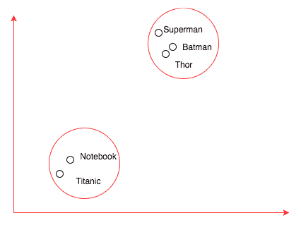

前述图像展示了如何调整密集向量以使语义相似的单词之间具有较小的距离。由于像**Superman**、**Thor**和**Batman**这样的电影标题是基于漫画的动作电影，它们的嵌入更接近，而电影**Titanic**的嵌入则远离动作电影，更接近电影**Notebook**，因为它们是浪漫电影。

学习词嵌入可能在数据量太少时不可行，在这种情况下，我们可以使用由其他机器学习算法训练的词嵌入。从另一个任务生成的嵌入称为**预训练**词嵌入。我们将学习如何构建自己的词嵌入并使用预训练词嵌入。

# 通过构建情感分类器训练词嵌入

在上一节中，我们简要介绍了单词嵌入的概念，但没有实现它。在本节中，我们将下载一个名为`IMDB`的数据集，其中包含评论，并构建一个情感分类器，用于判断评论的情感是积极的、消极的还是未知的。在构建过程中，我们还将为`IMDB`数据集中的单词训练单词嵌入。我们将使用一个名为`torchtext`的库，它通过提供不同的数据加载器和文本抽象化简化了许多与**自然语言处理**（**NLP**）相关的活动。训练情感分类器将涉及以下步骤：

1.  下载 IMDB 数据并执行文本标记化

1.  建立词汇表

1.  生成向量批次

1.  创建带有嵌入的网络模型

1.  训练模型

# 下载 IMDB 数据并执行文本标记化

对于与计算机视觉相关的应用程序，我们使用了`torchvision`库，该库为我们提供了许多实用函数，帮助构建计算机视觉应用程序。同样，还有一个名为`torchtext`的库，它是 PyTorch 的一部分，专门用于处理与 PyTorch 相关的许多文本活动，如下载、文本向量化和批处理。在撰写本文时，`torchtext`不随 PyTorch 安装而提供，需要单独安装。您可以在您的计算机命令行中运行以下代码来安装`torchtext`：

```py
pip install torchtext
```

一旦安装完成，我们将能够使用它。Torchtext 提供了两个重要的模块，称为`torchtext.data`和`torchtext.datasets`。

我们可以从以下链接下载`IMDB Movies`数据集：

[`www.kaggle.com/orgesleka/imdbmovies`](https://www.kaggle.com/orgesleka/imdbmovies)

# torchtext.data

`torchtext.data`实例定义了一个名为`Field`的类，它帮助我们定义数据的读取和标记化方式。让我们看看下面的示例，我们将用它来准备我们的`IMDB`数据集：

```py
from torchtext import data
TEXT = data.Field(lower=True, batch_first=True,fix_length=20)
LABEL = data.Field(sequential=False)
```

在上述代码中，我们定义了两个`Field`对象，一个用于实际文本，另一个用于标签数据。对于实际文本，我们期望`torchtext`将所有文本转换为小写，标记化文本，并将其修剪为最大长度为`20`。如果我们为生产环境构建应用程序，可能会将长度固定为更大的数字。但是对于玩具示例，这个长度可以工作得很好。`Field`构造函数还接受另一个名为**tokenize**的参数，默认使用`str.split`函数。我们还可以指定 spaCy 作为参数，或任何其他的分词器。在我们的示例中，我们将坚持使用`str.split`。

# torchtext.datasets

`torchtext.datasets`实例提供了使用不同数据集的包装器，如 IMDB、TREC（问题分类）、语言建模（WikiText-2）和其他几个数据集。我们将使用`torch.datasets`下载`IMDB`数据集并将其分割为`train`和`test`数据集。以下代码执行此操作，当您第一次运行它时，根据您的宽带连接速度，可能需要几分钟时间从互联网上下载`IMDB`数据集：

```py
train, test = datasets.IMDB.splits(TEXT, LABEL)
```

先前数据集的`IMDB`类将下载、标记和分割数据库到`train`和`test`数据集中所涉及的所有复杂性抽象化。`train.fields`包含一个字典，其中`TEXT`是键，值是`LABEL`。让我们来看看`train.fields`，而每个`train`元素包含：

```py
print('train.fields', train.fields)

#Results 
train.fields {'text': <torchtext.data.field.Field object at 0x1129db160>, 'label': <torchtext.data.field.Field object at 0x1129db1d0>}

print(vars(train[0]))

#Results 

vars(train[0]) {'text': ['for', 'a', 'movie', 'that', 'gets', 'no', 'respect', 'there', 'sure', 'are', 'a', 'lot', 'of', 'memorable', 'quotes', 'listed', 'for', 'this', 'gem.', 'imagine', 'a', 'movie', 'where', 'joe', 'piscopo', 'is', 'actually', 'funny!', 'maureen', 'stapleton', 'is', 'a', 'scene', 'stealer.', 'the', 'moroni', 'character', 'is', 'an', 'absolute', 'scream.', 'watch', 'for', 'alan', '"the', 'skipper"', 'hale', 'jr.', 'as', 'a', 'police', 'sgt.'], 'label': 'pos'}
```

我们可以从这些结果看到，单个元素包含一个字段`text`，以及表示`text`的所有标记，还有一个包含文本标签的`label`字段。现在我们已经准备好对`IMDB`数据集进行批处理。

# 构建词汇表

当我们为`thor_review`创建一位热编码时，我们创建了一个`word2idx`字典，它被称为词汇表，因为它包含文档中所有唯一单词的详细信息。`torchtext`实例使我们更容易。一旦数据加载完毕，我们可以调用`build_vocab`并传递必要的参数，这些参数将负责为数据构建词汇表。以下代码显示了如何构建词汇表：

```py
TEXT.build_vocab(train, vectors=GloVe(name='6B', dim=300),max_size=10000,min_freq=10)
LABEL.build_vocab(train)
```

在上述代码中，我们传递了需要构建词汇表的`train`对象，并要求它使用维度为`300`的预训练嵌入来初始化向量。`build_vocab`对象只是下载并创建将在以后训练情感分类器时使用的维度。`max_size`实例限制了词汇表中单词的数量，而`min_freq`则移除了出现次数不到十次的任何单词，其中`10`是可配置的。

一旦词汇表构建完成，我们可以获取不同的值，如频率、单词索引和每个单词的向量表示。以下代码演示了如何访问这些值：

```py
print(TEXT.vocab.freqs)

# A sample result 
Counter({"i'm": 4174,
         'not': 28597,
         'tired': 328,
         'to': 133967,
         'say': 4392,
         'this': 69714,
         'is': 104171,
         'one': 22480,
         'of': 144462,
         'the': 322198,
```

下面的代码演示了如何访问结果：

```py

print(TEXT.vocab.vectors)

#Results displaying the 300 dimension vector for each word.
0.0000 0.0000 0.0000 ... 0.0000 0.0000 0.0000
0.0000 0.0000 0.0000 ... 0.0000 0.0000 0.0000
0.0466 0.2132 -0.0074 ... 0.0091 -0.2099 0.0539
      ... ⋱ ... 
0.0000 0.0000 0.0000 ... 0.0000 0.0000 0.0000
0.7724 -0.1800 0.2072 ... 0.6736 0.2263 -0.2919
0.0000 0.0000 0.0000 ... 0.0000 0.0000 0.0000
[torch.FloatTensor of size 10002x300]

print(TEXT.vocab.stoi)

# Sample results
defaultdict(<function torchtext.vocab._default_unk_index>,
            {'<unk>': 0,
             '<pad>': 1,
             'the': 2,
             'a': 3,
             'and': 4,
             'of': 5,
             'to': 6,
             'is': 7,
             'in': 8,
             'i': 9,
             'this': 10,
             'that': 11,
             'it': 12,
```

`stoi`提供了一个包含单词及其索引的字典。

# 生成向量的批次

Torchtext 提供了`BucketIterator`，它有助于对所有文本进行批处理，并用单词的索引号替换这些单词。`BucketIterator`实例带有许多有用的参数，如`batch_size`、`device`（GPU 或 CPU）和`shuffle`（数据是否需要洗牌）。以下代码演示了如何创建迭代器以为`train`和`test`数据集生成批次：

```py
train_iter, test_iter = data.BucketIterator.splits((train, test), batch_size=128, device=-1,shuffle=True)
#device = -1 represents cpu , if u want gpu leave it to None.
```

上述代码为`train`和`test`数据集提供了一个`BucketIterator`对象。以下代码将展示如何创建一个批次并显示批次的结果：

```py
batch = next(iter(train_iter))
batch.text

#Results
Variable containing:
 5128 427 19 ... 1688 0 542
   58 2 0 ... 2 0 1352
    0 9 14 ... 2676 96 9
       ... ⋱ ... 
  129 1181 648 ... 45 0 2
 6484 0 627 ... 381 5 2
  748 0 5052 ... 18 6660 9827
[torch.LongTensor of size 128x20]

batch.label

#Results
Variable containing:
 2
 1
 2
 1
 2
 1
 1
 1
[torch.LongTensor of size 128]
```

从前面的代码块的结果中，我们可以看到文本数据如何转换为大小为(`batch_size` * `fix_len`)的矩阵，即(`128x20`)。

# 创建带嵌入的网络模型

我们之前简要讨论了词嵌入。在本节中，我们将词嵌入作为网络架构的一部分，并训练整个模型来预测每个评论的情感。训练结束时，我们将得到一个情感分类器模型，以及针对`IMDB`数据集的词嵌入。以下代码展示了如何创建一个使用词嵌入来预测情感的网络架构：

```py
class EmbNet(nn.Module):
    def __init__(self,emb_size,hidden_size1,hidden_size2=400):
        super().__init__()
        self.embedding = nn.Embedding(emb_size,hidden_size1)
        self.fc = nn.Linear(hidden_size2,3)

    def forward(self,x):
        embeds = self.embedding(x).view(x.size(0),-1)
        out = self.fc(embeds)
        return F.log_softmax(out,dim=-1)
```

在前面的代码中，`EmbNet`创建了用于情感分类的模型。在`__init__`函数内部，我们初始化了`nn.Embedding`类的一个对象，它接受两个参数，即词汇表的大小和我们希望为每个单词创建的维度。由于我们限制了唯一单词的数量，词汇表大小将为 10,000，并且我们可以从小的嵌入大小`10`开始。对于快速运行程序，小的嵌入大小是有用的，但当您尝试为生产系统构建应用程序时，请使用较大的嵌入。我们还有一个线性层，将词嵌入映射到类别（积极、消极或未知）。

`forward`函数确定如何处理输入数据。对于批量大小为 32 且最大长度为 20 个单词的句子，我们将得到形状为 32 x 20 的输入。第一个嵌入层充当查找表，将每个单词替换为相应的嵌入向量。对于嵌入维度为 10，输出将变为 32 x 20 x 10，因为每个单词都被其相应的嵌入替换。`view()`函数将扁平化嵌入层的结果。传递给`view`的第一个参数将保持该维度不变。在我们的情况下，我们不想组合来自不同批次的数据，因此保留第一个维度并扁平化张量中的其余值。应用`view`函数后，张量形状变为 32 x 200。密集层将扁平化的嵌入映射到类别数量。定义了网络架构后，我们可以像往常一样训练网络。

请记住，在这个网络中，我们失去了文本的顺序性，只是把它们作为一个词袋来使用。

# 训练模型

训练模型与构建图像分类器非常相似，因此我们将使用相同的函数。我们通过模型传递数据批次，计算输出和损失，然后优化模型权重，包括嵌入权重。以下代码执行此操作：

```py
def fit(epoch,model,data_loader,phase='training',volatile=False):
    if phase == 'training':
        model.train()
    if phase == 'validation':
        model.eval()
        volatile=True
    running_loss = 0.0
    running_correct = 0
    for batch_idx , batch in enumerate(data_loader):
        text , target = batch.text , batch.label
        if is_cuda:
            text,target = text.cuda(),target.cuda()

        if phase == 'training':
            optimizer.zero_grad()
        output = model(text)
        loss = F.nll_loss(output,target)

        running_loss += F.nll_loss(output,target,size_average=False).data[0]
        preds = output.data.max(dim=1,keepdim=True)[1]
        running_correct += preds.eq(target.data.view_as(preds)).cpu().sum()
        if phase == 'training':
            loss.backward()
            optimizer.step()

    loss = running_loss/len(data_loader.dataset)
    accuracy = 100\. * running_correct/len(data_loader.dataset)

    print(f'{phase} loss is {loss:{5}.{2}} and {phase} accuracy is {running_correct}/{len(data_loader.dataset)}{accuracy:{10}.{4}}')
    return loss,accuracy

train_losses , train_accuracy = [],[]
val_losses , val_accuracy = [],[]

train_iter.repeat = False
test_iter.repeat = False

for epoch in range(1,10):

    epoch_loss, epoch_accuracy = fit(epoch,model,train_iter,phase='training')
    val_epoch_loss , val_epoch_accuracy = fit(epoch,model,test_iter,phase='validation')
    train_losses.append(epoch_loss)
    train_accuracy.append(epoch_accuracy)
    val_losses.append(val_epoch_loss)
    val_accuracy.append(val_epoch_accuracy)
```

在上述代码中，我们通过传递我们为批处理数据创建的 `BucketIterator` 对象调用 `fit` 方法。迭代器默认不会停止生成批次，因此我们必须将 `BucketIterator` 对象的 `repeat` 变量设置为 `False`。如果我们不将 `repeat` 变量设置为 `False`，则 `fit` 函数将无限运行。在大约 10 个 epochs 的训练后，模型的验证准确率约为 70%。

# 使用预训练的词嵌入

在特定领域（如医学和制造业）工作时，预训练的词嵌入非常有用，因为我们有大量数据可以训练嵌入。当我们有少量数据无法进行有意义的训练时，我们可以使用在不同数据集（如维基百科、Google 新闻和 Twitter 推文）上训练的嵌入。许多团队都有使用不同方法训练的开源词嵌入。在本节中，我们将探讨 `torchtext` 如何简化使用不同词嵌入，并如何在我们的 PyTorch 模型中使用它们。这类似于我们在计算机视觉应用中使用的迁移学习。通常，使用预训练嵌入会涉及以下步骤：

+   下载嵌入

+   加载模型中的嵌入

+   冻结嵌入层权重

让我们详细探讨每个步骤的实现方式。

# 下载嵌入

`torchtext` 库在下载嵌入并将其映射到正确单词中，抽象出了许多复杂性。Torchtext 在 `vocab` 模块中提供了三个类，分别是 `GloVe`、`FastText`、`CharNGram`，它们简化了下载嵌入和映射到我们词汇表的过程。每个类别提供了在不同数据集上训练的不同嵌入，使用了不同的技术。让我们看一些提供的不同嵌入：

+   `charngram.100d`

+   `fasttext.en.300d`

+   `fasttext.simple.300d`

+   `glove.42B.300d`

+   `glove.840B.300d`

+   `glove.twitter.27B.25d`

+   `glove.twitter.27B.50d`

+   `glove.twitter.27B.100d`

+   `glove.twitter.27B.200d`

+   `` `glove.6B.50d` ``

+   `glove.6B.100d`

+   `glove.6B.200d`

+   `glove.6B.300d`

`Field` 对象的 `build_vocab` 方法接受一个用于嵌入的参数。以下代码解释了我们如何下载这些嵌入：

```py
from torchtext.vocab import GloVe
TEXT.build_vocab(train, vectors=GloVe(name='6B', dim=300),max_size=10000,min_freq=10)
LABEL.build_vocab(train,)
```

参数向量的值表示使用的嵌入类别。`name` 和 `dim` 参数确定可以使用的嵌入。我们可以轻松地从 `vocab` 对象中访问嵌入。以下代码演示了它，同时展示了结果的样子：

```py
TEXT.vocab.vectors

#Output
0.0000 0.0000 0.0000 ... 0.0000 0.0000 0.0000
 0.0000 0.0000 0.0000 ... 0.0000 0.0000 0.0000
 0.0466 0.2132 -0.0074 ... 0.0091 -0.2099 0.0539
          ... ⋱ ... 
 0.0000 0.0000 0.0000 ... 0.0000 0.0000 0.0000
 0.7724 -0.1800 0.2072 ... 0.6736 0.2263 -0.2919
 0.0000 0.0000 0.0000 ... 0.0000 0.0000 0.0000
[torch.FloatTensor of size 10002x300]
```

现在我们已经下载并将嵌入映射到我们的词汇表中。让我们了解如何在 PyTorch 模型中使用它们。

# 加载模型中的嵌入

`vectors`变量返回一个形状为`vocab_size x dimensions`的 torch 张量，其中包含预训练的嵌入。我们必须将这些嵌入的权重存储到我们的嵌入层权重中。我们可以通过访问嵌入层权重来分配嵌入的权重，如下面的代码所示。

```py
model.embedding.weight.data = TEXT.vocab.vectors
```

`model`代表我们网络的对象，`embedding`代表嵌入层。因为我们使用了新维度的嵌入层，线性层输入会有些变化。下面的代码展示了新的架构，与我们之前训练嵌入时使用的架构类似：

```py
class EmbNet(nn.Module):
    def __init__(self,emb_size,hidden_size1,hidden_size2=400):
        super().__init__()
        self.embedding = nn.Embedding(emb_size,hidden_size1)
        self.fc1 = nn.Linear(hidden_size2,3)

    def forward(self,x):
        embeds = self.embedding(x).view(x.size(0),-1)
        out = self.fc1(embeds)
        return F.log_softmax(out,dim=-1)

model = EmbNet(len(TEXT.vocab.stoi),300,12000)
```

加载嵌入向量后，我们必须确保在训练过程中不改变嵌入层权重。让我们讨论如何实现这一点。

# 冻结嵌入层权重

告诉 PyTorch 不要改变嵌入层权重是一个两步骤过程：

1.  将`requires_grad`属性设置为`False`，告诉 PyTorch 不需要这些权重的梯度。

1.  移除传递给优化器的嵌入层参数。如果不执行此步骤，则优化器会抛出错误，因为它期望所有参数都有梯度。

下面的代码展示了如何轻松冻结嵌入层权重，并告知优化器不使用这些参数：

```py
model.embedding.weight.requires_grad = False
optimizer = optim.SGD([ param for param in model.parameters() if param.requires_grad == True],lr=0.001)
```

通常我们将所有模型参数传递给优化器，但在前面的代码中，我们传递了`requires_grad`为`True`的参数。

我们可以使用这段代码训练模型，并应该获得类似的准确度。所有这些模型架构都没有利用文本的序列性质。在下一节中，我们将探讨两种流行的技术，即 RNN 和 Conv1D，它们利用数据的序列性质。

# 递归神经网络

RNN 是最强大的模型之一，使我们能够处理分类、序列数据标签和文本生成等应用（例如*SwiftKey*键盘应用可以预测下一个词），以及将一种序列转换为另一种语言，例如从法语到英语。大多数模型架构如前馈神经网络没有利用数据的序列性质。例如，我们需要数据来表示每个示例的特征向量，比如代表句子、段落或文档的所有标记。前馈网络设计只是一次性查看所有特征并将其映射到输出。让我们看一个文本示例，展示为什么文本的顺序或序列性质很重要。*I had cleaned my car* 和 *I had my car cleaned* 是两个英语句子，包含相同的单词集合，但只有在考虑单词顺序时它们的含义不同。

人类通过从左到右阅读单词并构建一个强大的模型来理解文本数据。RNN 的工作方式略有相似，它一次查看文本中的一个单词。RNN 也是一种神经网络，其中有一个特殊的层，该层循环处理数据而不是一次性处理所有数据。由于 RNN 可以按顺序处理数据，我们可以使用不同长度的向量并生成不同长度的输出。以下图像提供了一些不同的表示形式：

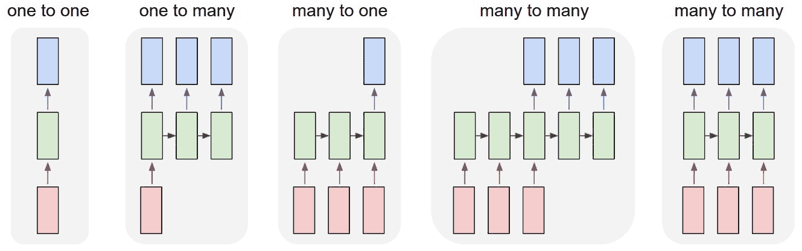

图片来源：[`karpathy.github.io/2015/05/21/rnn-effectiveness/`](http://karpathy.github.io/2015/05/21/rnn-effectiveness/)

上述图片来自 RNN 的一个著名博客（[`karpathy.github.io/2015/05/21/rnn-effectiveness`](http://karpathy.github.io/2015/05/21/rnn-effectiveness))，作者 Andrej Karpathy 讲解如何使用 Python 从头构建 RNN，并将其用作序列生成器。

# 通过示例理解 RNN 的工作原理

让我们从假设我们已经构建了一个 RNN 模型开始，并尝试理解它提供了哪些功能。一旦我们了解了 RNN 的功能，然后让我们探索 RNN 内部发生了什么。

让我们将《雷神》影评作为 RNN 模型的输入。我们正在查看的示例文本是*这部电影的动作场面非常棒……*。我们首先将第一个词**the**传递给我们的模型；模型生成两种不同的东西，一个**状态向量**和一个**输出**向量。状态向量在处理评论中的下一个词时传递给模型，并生成一个新的状态向量。我们只考虑在最后一个序列中模型生成的**输出**。下图总结了这一过程：

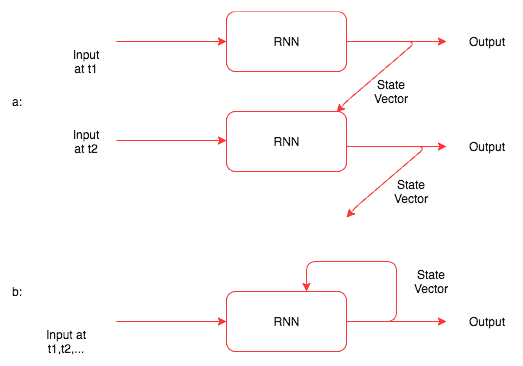

上述图示示了以下内容：

+   如何通过展开和图像来理解 RNN 的工作方式

+   如何递归地将状态传递给相同的模型

到现在为止，您应该已经了解了 RNN 的作用，但还不清楚它是如何工作的。在我们深入了解其工作原理之前，让我们先看一个代码片段，详细展示我们所学的内容。我们仍然将 RNN 视为一个黑匣子：

```py
rnn = RNN(input_size, hidden_size,output_size)
for i in range(len(Thor_review):
        output, hidden = rnn(thor_review[i], hidden)
```

在前面的代码中，`hidden`变量表示状态向量，有时称为**隐藏状态**。到现在为止，我们应该已经了解了 RNN 的使用方式。现在，让我们看一下实现 RNN 并理解 RNN 内部发生了什么的代码。以下代码包含`RNN`类：

```py
import torch.nn as nn
from torch.autograd import Variable

class RNN(nn.Module):
    def __init__(self, input_size, hidden_size, output_size):
        super(RNN, self).__init__()
        self.hidden_size = hidden_size
        self.i2h = nn.Linear(input_size + hidden_size, hidden_size)
        self.i2o = nn.Linear(input_size + hidden_size, output_size)
        self.softmax = nn.LogSoftmax(dim=1)

    def forward(self, input, hidden):
        combined = torch.cat((input, hidden), 1)
        hidden = self.i2h(combined)
        output = self.i2o(combined)
        output = self.softmax(output)
        return output, hidden

    def initHidden(self):
        return Variable(torch.zeros(1, self.hidden_size))
```

除了前面代码中的词语`RNN`外，其他内容听起来与我们在前几章中使用的内容非常相似，因为 PyTorch 隐藏了很多反向传播的复杂性。让我们逐步讲解`init`函数和`forward`函数，以理解发生了什么。

`__init__`函数初始化两个线性层，一个用于计算输出，另一个用于计算状态或隐藏向量。

`forward`函数将`input`向量和`hidden`向量结合起来，并通过两个线性层将其传递，生成一个输出向量和一个隐藏状态。对于`output`层，我们应用了`log_softmax`函数。

`initHidden`函数帮助创建没有状态的隐藏向量，用于第一次调用 RNN。让我们通过下图视觉地了解`RNN`类的作用：

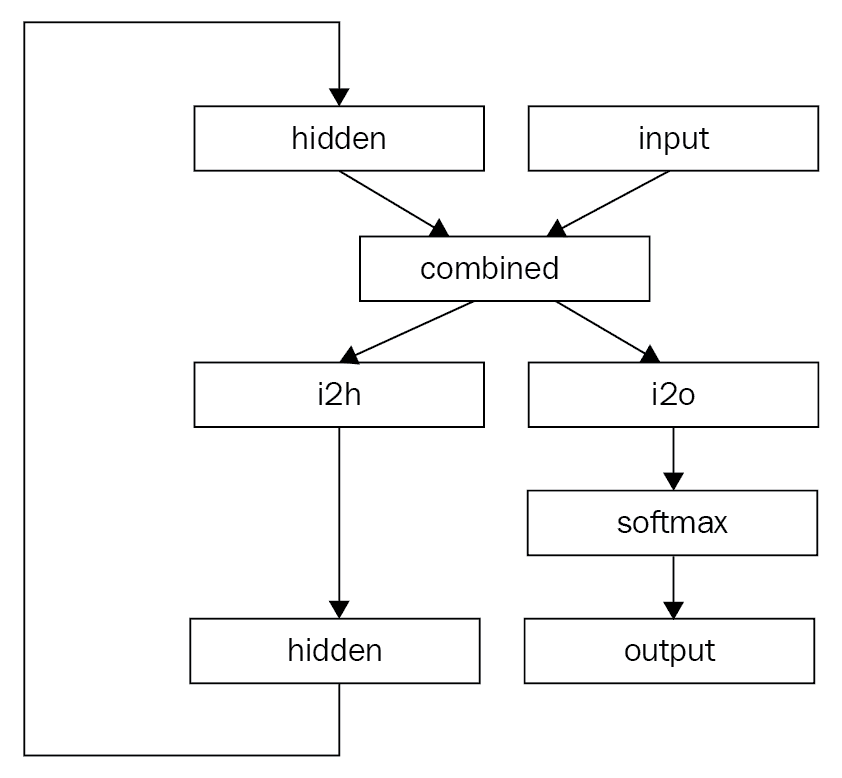

上述图展示了 RNN 的工作方式。

第一次遇到 RNN 这些概念有时可能会感到棘手，因此我强烈建议阅读以下链接提供的一些令人惊叹的博客：[`karpathy.github.io/2015/05/21/rnn-effectiveness/`](http://karpathy.github.io/2015/05/21/rnn-effectiveness/) 和 [`colah.github.io/posts/2015-08-Understanding-LSTMs/.`](http://colah.github.io/posts/2015-08-Understanding-LSTMs/)

在接下来的部分中，我们将学习如何使用一种称为**LSTM**的变种 RNN 来构建一个情感分类器，用于`IMDB`数据集。

# LSTM

RNN 在构建语言翻译、文本分类等许多实际应用中非常流行，但在现实中，我们很少会使用我们在前面部分看到的普通 RNN 版本。普通 RNN 存在梯度消失和梯度爆炸等问题，处理大序列时尤为突出。在大多数真实世界的问题中，会使用像 LSTM 或 GRU 这样的 RNN 变体，这些变体解决了普通 RNN 的局限性，并且能更好地处理序列数据。我们将尝试理解 LSTM 中发生的情况，并基于 LSTM 构建一个网络来解决`IMDB`数据集上的文本分类问题。

# 长期依赖

RNN 在理论上应该从历史数据中学习所有必要的依赖关系，以建立下文的上下文。例如，假设我们试图预测句子“the clouds are in the sky”的最后一个词。RNN 可以预测，因为信息（clouds）仅仅落后几个词。再来看一个更长的段落，依赖关系不必那么紧密，我们想预测其中的最后一个词。句子看起来像“我出生在金奈，一个坐落在泰米尔纳德邦的城市。在印度的不同州接受教育，我说...”。在实践中，普通版本的 RNN 很难记住序列前部发生的上下文。LSTM 及其他不同的 RNN 变体通过在 LSTM 内部添加不同的神经网络来解决这个问题，后者决定可以记住多少或者可以记住什么数据。

# LSTM 网络

LSTM 是一种特殊类型的 RNN，能够学习长期依赖关系。它们于 1997 年引入，并随着可用数据和硬件的进展在过去几年中变得流行起来。它们在各种问题上表现出色，并被广泛使用。

LSTM 的设计旨在通过一种设计自然地记住信息以解决长期依赖问题。在 RNN 中，我们看到它们如何在序列的每个元素上重复自身。在标准 RNN 中，重复模块将具有像单个线性层的简单结构。

下图显示了一个简单的 RNN 如何重复自身：

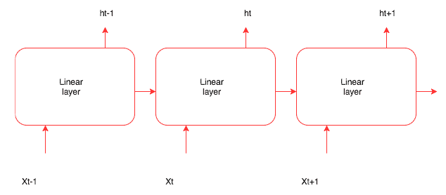

在 LSTM 内部，我们不是使用简单的线性层，而是在 LSTM 内部有较小的网络，这些网络完成独立的工作。以下图表展示了 LSTM 内部发生的情况：

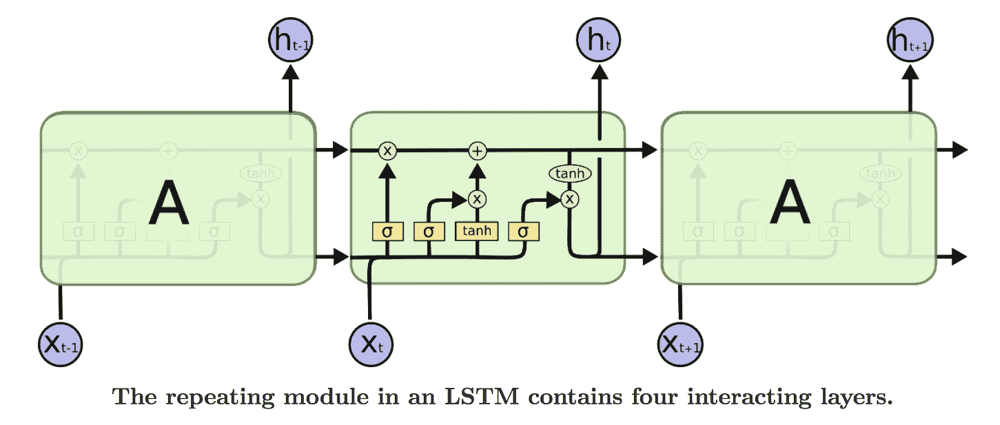

图像来源：http://colah.github.io/posts/2015-08-Understanding-LSTMs/（由 Christopher Olah 绘制的图表）

在上述图表中，第二个框中的每个小矩形（黄色）代表一个 PyTorch 层，圆圈表示元素矩阵或向量加法，合并线表示两个向量正在连接。好消息是，我们不需要手动实现所有这些。大多数现代深度学习框架提供了一个抽象层，可以处理 LSTM 内部的所有功能。PyTorch 提供了 `nn.LSTM` 层的抽象，我们可以像使用任何其他层一样使用它。LSTM 中最重要的是通过所有迭代传递的细胞状态，如上述图表中横跨细胞的水平线所示。LSTM 内部的多个网络控制信息如何在细胞状态之间传播。LSTM 中的第一步（由符号 **σ** 表示的小网络）是决定从细胞状态中丢弃哪些信息。这个网络称为 **遗忘门**，具有 sigmoid 作为激活函数，为细胞状态中的每个元素输出介于 0 和 1 之间的值。该网络（PyTorch 层）由以下公式表示：

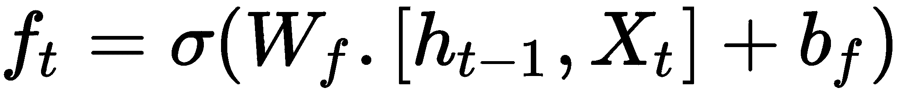

网络的值决定了哪些值将保存在细胞状态中，哪些将被丢弃。下一步是决定要添加到细胞状态的信息。这有两个部分；一个称为 **输入门** 的 sigmoid 层，决定要更新的值；一个 tanh 层，用于创建要添加到细胞状态的新值。数学表示如下：

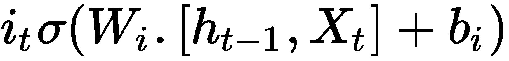

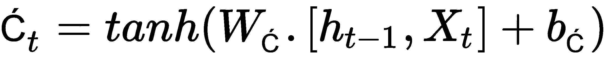

在下一步中，我们将输入门生成的两个值与 tanh 结合。现在我们可以通过以下公式更新细胞状态，即在遗忘门和 *i*[*t* ]与 C[t] 乘积之和的逐元素乘法之间，如下所示：

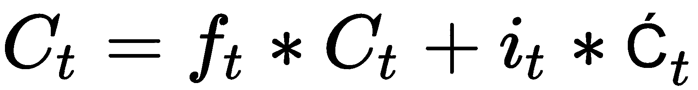

最后，我们需要决定输出，这将是细胞状态的过滤版本。有不同版本的 LSTM 可用，它们大多数都基于类似的原理运作。作为开发人员或数据科学家，我们很少需要担心 LSTM 内部的运作。如果您想更多了解它们，请阅读以下博客链接，这些链接以非常直观的方式涵盖了大量理论。

查看 Christopher Olah 关于 LSTM 的精彩博客（[`colah.github.io/posts/2015-08-Understanding-LSTMs`](http://colah.github.io/posts/2015-08-Understanding-LSTMs)），以及 Brandon Rohrer 的另一篇博客（[`brohrer.github.io/how_rnns_lstm_work.html`](https://brohrer.github.io/how_rnns_lstm_work.html)），他在一个很棒的视频中解释了 LSTM。

由于我们理解了 LSTM，让我们实现一个 PyTorch 网络，我们可以用来构建情感分类器。像往常一样，我们将按照以下步骤创建分类器：

1.  准备数据

1.  创建批次

1.  创建网络

1.  训练模型

# 准备数据

我们使用相同的 torchtext 来下载、分词和构建`IMDB`数据集的词汇表。在创建`Field`对象时，我们将`batch_first`参数保留为`False`。RNN 网络期望数据的形式是`Sequence_length`、`batch_size`和特征。以下用于准备数据集：

```py
TEXT = data.Field(lower=True,fix_length=200,batch_first=False)
LABEL = data.Field(sequential=False,)
train, test = IMDB.splits(TEXT, LABEL)
TEXT.build_vocab(train, vectors=GloVe(name='6B', dim=300),max_size=10000,min_freq=10)
LABEL.build_vocab(train,)
```

# 创建批次

我们使用 torchtext 的`BucketIterator`来创建批次，批次的大小将是序列长度和批次大小。对于我们的情况，大小将为[`200`, `32`]，其中*200*是序列长度，*32*是批次大小。

以下是用于分批的代码：

```py
train_iter, test_iter = data.BucketIterator.splits((train, test), batch_size=32, device=-1)
train_iter.repeat = False
test_iter.repeat = False
```

# 创建网络

让我们看看代码，然后逐步分析代码。您可能会对代码看起来多么相似感到惊讶：

```py
class IMDBRnn(nn.Module):

    def __init__(self,vocab,hidden_size,n_cat,bs=1,nl=2):
        super().__init__()
        self.hidden_size = hidden_size
        self.bs = bs
        self.nl = nl
        self.e = nn.Embedding(n_vocab,hidden_size)
        self.rnn = nn.LSTM(hidden_size,hidden_size,nl)
        self.fc2 = nn.Linear(hidden_size,n_cat)
        self.softmax = nn.LogSoftmax(dim=-1)

    def forward(self,inp):
        bs = inp.size()[1]
        if bs != self.bs:
            self.bs = bs
        e_out = self.e(inp)
        h0 = c0 = Variable(e_out.data.new(*(self.nl,self.bs,self.hidden_size)).zero_())
        rnn_o,_ = self.rnn(e_out,(h0,c0)) 
        rnn_o = rnn_o[-1]
        fc = F.dropout(self.fc2(rnn_o),p=0.8)
        return self.softmax(fc)
```

`init`方法创建一个与词汇表大小和`hidden_size`相同的嵌入层。它还创建一个 LSTM 和一个线性层。最后一层是一个`LogSoftmax`层，用于将线性层的结果转换为概率。

在`forward`函数中，我们传递大小为[`200`, `32`]的输入数据，它经过嵌入层处理，批次中的每个标记都被嵌入替换，大小变为[200, 32, 100]，其中*100*是嵌入维度。LSTM 层使用嵌入层的输出以及两个隐藏变量进行处理。隐藏变量应与嵌入输出相同类型，并且它们的大小应为[`num_layers`, `batch_size`, `hidden_size`]。LSTM 按序列处理数据并生成形状为[`Sequence_length`, `batch_size`, `hidden_size`]的输出，其中每个序列索引表示该序列的输出。在本例中，我们只取最后一个序列的输出，其形状为[`batch_size`, `hidden_dim`]，然后将其传递给线性层以映射到输出类别。由于模型容易过拟合，添加一个 dropout 层。您可以调整 dropout 的概率。

# 训练模型

创建网络后，我们可以使用与前面示例中相同的代码来训练模型。以下是训练模型的代码：

```py
model = IMDBRnn(n_vocab,n_hidden,3,bs=32)
model = model.cuda()

optimizer = optim.Adam(model.parameters(),lr=1e-3)

def fit(epoch,model,data_loader,phase='training',volatile=False):
    if phase == 'training':
        model.train()
    if phase == 'validation':
        model.eval()
        volatile=True
    running_loss = 0.0
    running_correct = 0
    for batch_idx , batch in enumerate(data_loader):
        text , target = batch.text , batch.label
        if is_cuda:
            text,target = text.cuda(),target.cuda()

        if phase == 'training':
            optimizer.zero_grad()
        output = model(text)
        loss = F.nll_loss(output,target)

        running_loss += F.nll_loss(output,target,size_average=False).data[0]
        preds = output.data.max(dim=1,keepdim=True)[1]
        running_correct += preds.eq(target.data.view_as(preds)).cpu().sum()
        if phase == 'training':
            loss.backward()
            optimizer.step()

    loss = running_loss/len(data_loader.dataset)
    accuracy = 100\. * running_correct/len(data_loader.dataset)

    print(f'{phase} loss is {loss:{5}.{2}} and {phase} accuracy is {running_correct}/{len(data_loader.dataset)}{accuracy:{10}.{4}}')
    return loss,accuracy

train_losses , train_accuracy = [],[]
val_losses , val_accuracy = [],[]

for epoch in range(1,5):

    epoch_loss, epoch_accuracy = fit(epoch,model,train_iter,phase='training')
    val_epoch_loss , val_epoch_accuracy = fit(epoch,model,test_iter,phase='validation')
    train_losses.append(epoch_loss)
    train_accuracy.append(epoch_accuracy)
    val_losses.append(val_epoch_loss)
    val_accuracy.append(val_epoch_accuracy)

```

以下是训练模型的结果：

```py
#Results

training loss is   0.7 and training accuracy is 12564/25000     50.26
validation loss is   0.7 and validation accuracy is 12500/25000      50.0
training loss is  0.66 and training accuracy is 14931/25000     59.72
validation loss is  0.57 and validation accuracy is 17766/25000     71.06
training loss is  0.43 and training accuracy is 20229/25000     80.92
validation loss is   0.4 and validation accuracy is 20446/25000     81.78
training loss is   0.3 and training accuracy is 22026/25000      88.1
validation loss is  0.37 and validation accuracy is 21009/25000     84.04
```

对模型进行四次纪元的训练得到了 84%的准确率。训练更多的纪元导致了一个过拟合的模型，因为损失开始增加。我们可以尝试一些我们尝试过的技术，如减少隐藏维度、增加序列长度以及以更小的学习率进行训练以进一步提高准确性。

我们还将探讨如何使用一维卷积来对序列数据进行训练。

# 序列数据上的卷积网络

我们学习了 CNN 如何通过从图像中学习特征解决计算机视觉问题。在图像中，CNN 通过在高度和宽度上进行卷积来工作。同样，时间可以被视为一个卷积特征。一维卷积有时比 RNN 表现更好，并且计算成本更低。在过去几年中，像 Facebook 这样的公司已经展示出在音频生成和机器翻译方面的成功。在本节中，我们将学习如何使用 CNN 构建文本分类解决方案。

# 理解序列数据上的一维卷积

在第五章 *计算机视觉的深度学习* 中，我们看到了如何从训练数据中学习二维权重。这些权重在图像上移动以生成不同的激活。类似地，一维卷积激活在我们的文本分类器训练中也是学习的，这些权重通过在数据上移动来学习模式。以下图解释了一维卷积是如何工作的：

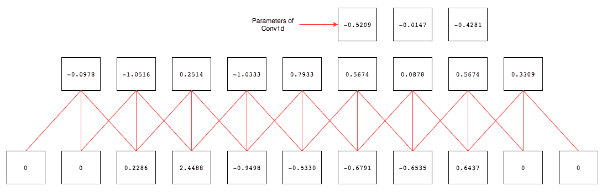

为了在`IMDB`数据集上训练文本分类器，我们将按照构建使用 LSTM 分类器的步骤进行操作。唯一不同的是，我们使用`batch_first = True`，而不像我们的 LSTM 网络那样。因此，让我们看看网络，训练代码以及其结果。

# 创建网络

让我们先看看网络架构，然后逐步分析代码：

```py
class IMDBCnn(nn.Module):

    def __init__(self,vocab,hidden_size,n_cat,bs=1,kernel_size=3,max_len=200):
        super().__init__()
        self.hidden_size = hidden_size
        self.bs = bs
    self.e = nn.Embedding(n_vocab,hidden_size)
    self.cnn = nn.Conv1d(max_len,hidden_size,kernel_size)
    self.avg = nn.AdaptiveAvgPool1d(10)
        self.fc = nn.Linear(1000,n_cat)
        self.softmax = nn.LogSoftmax(dim=-1)

    def forward(self,inp):
        bs = inp.size()[0]
        if bs != self.bs:
            self.bs = bs
        e_out = self.e(inp)
        cnn_o = self.cnn(e_out) 
        cnn_avg = self.avg(cnn_o)
        cnn_avg = cnn_avg.view(self.bs,-1)
        fc = F.dropout(self.fc(cnn_avg),p=0.5)
        return self.softmax(fc)
```

在上面的代码中，我们有一个`Conv1d`层和一个`AdaptiveAvgPool1d`层而不是一个 LSTM 层。卷积层接受序列长度作为其输入大小，输出大小为隐藏大小，内核大小为 3。由于我们必须改变线性层的维度，每次尝试以不同的长度运行时，我们使用一个`AdaptiveAvgpool1d`，它接受任意大小的输入并生成给定大小的输出。因此，我们可以使用一个固定大小的线性层。其余代码与我们在大多数网络架构中看到的代码类似。

# 训练模型

模型的训练步骤与上一个例子相同。让我们看看调用`fit`方法的代码以及它生成的结果：

```py
train_losses , train_accuracy = [],[]
val_losses , val_accuracy = [],[]

for epoch in range(1,5):

    epoch_loss, epoch_accuracy = fit(epoch,model,train_iter,phase='training')
    val_epoch_loss , val_epoch_accuracy = fit(epoch,model,test_iter,phase='validation')
    train_losses.append(epoch_loss)
    train_accuracy.append(epoch_accuracy)
    val_losses.append(val_epoch_loss)
    val_accuracy.append(val_epoch_accuracy)
```

我们对模型进行了四轮训练，达到了大约 83%的准确率。以下是运行模型的结果：

```py
training loss is  0.59 and training accuracy is 16724/25000      66.9
validation loss is  0.45 and validation accuracy is 19687/25000     78.75
training loss is  0.38 and training accuracy is 20876/25000      83.5
validation loss is   0.4 and validation accuracy is 20618/25000     82.47
training loss is  0.28 and training accuracy is 22109/25000     88.44
validation loss is  0.41 and validation accuracy is 20713/25000     82.85
training loss is  0.22 and training accuracy is 22820/25000     91.28
validation loss is  0.44 and validation accuracy is 20641/25000     82.56
```

由于`验证损失`在三轮后开始增加，我停止了模型的运行。我们可以尝试几件事情来改善结果，如使用预训练权重、添加另一个卷积层，并在卷积之间尝试`MaxPool1d`层。我把这些尝试留给你来测试是否能提高准确率。

# 概要

在本章中，我们学习了不同的技术来表示深度学习中的文本数据。我们学习了如何在处理不同领域时使用预训练的词嵌入和我们自己训练的词嵌入。我们使用 LSTM 和一维卷积构建了文本分类器。

在下一章中，我们将学习如何训练深度学习算法来生成时尚图像和新图像，并生成文本。
