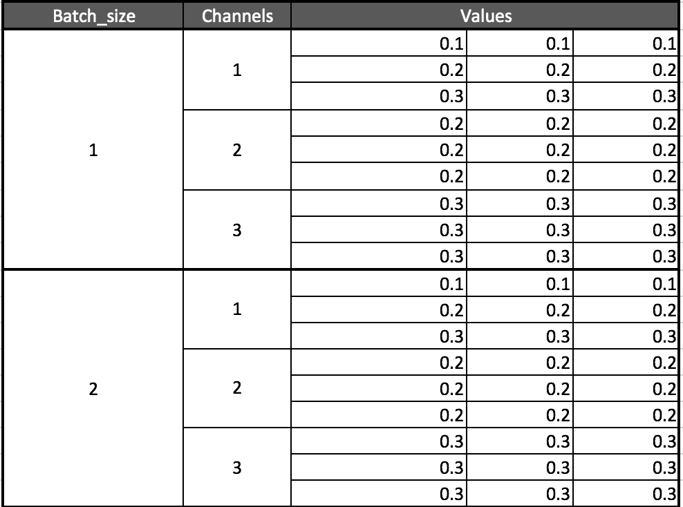
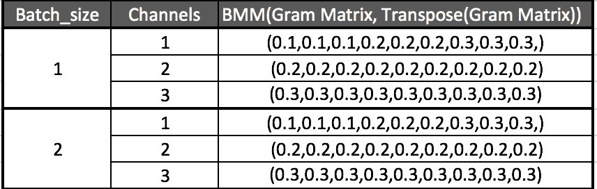
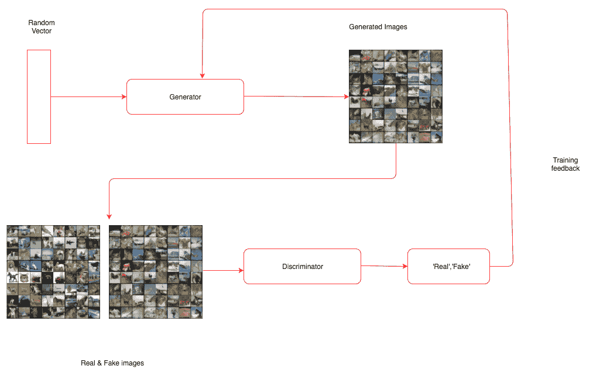
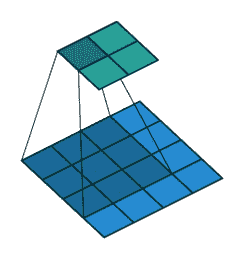
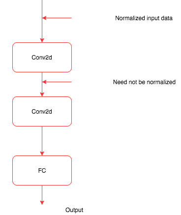
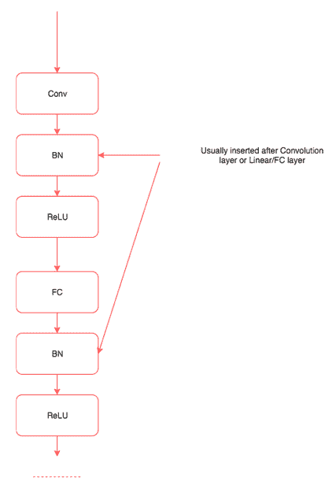
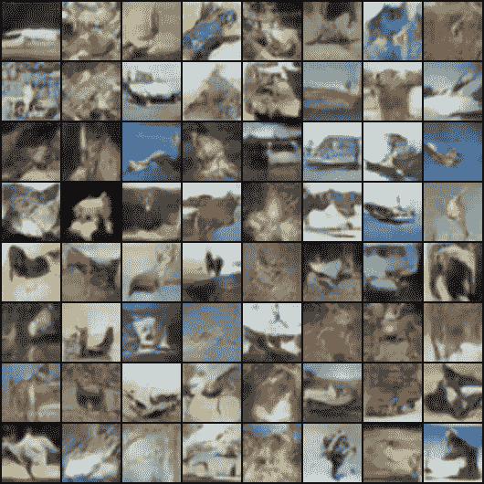
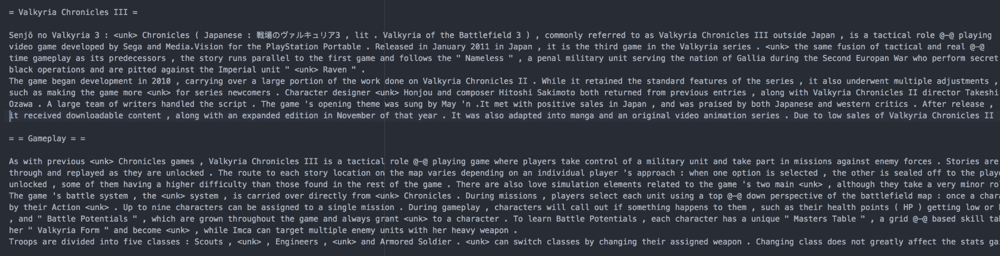
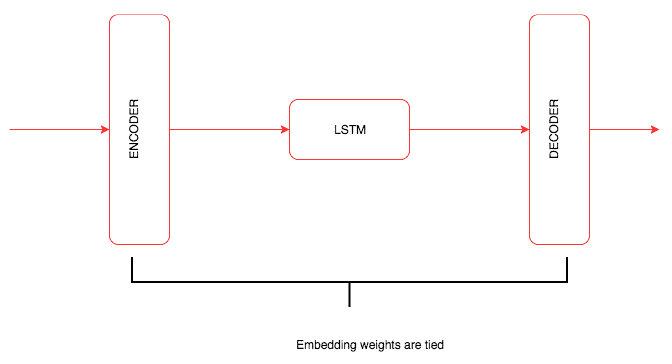

# 第七章：生成网络

在前几章中，我们看到的所有示例都集中在解决分类或回归等问题上。这一章对理解深度学习如何发展以解决无监督学习问题非常有趣和重要。

在本章中，我们将训练网络，学习如何创建：

+   基于内容和特定艺术风格生成的图像，通常称为**风格迁移**

+   使用特定类型的**生成对抗网络（GAN）**生成新人物面孔

+   使用语言建模生成新文本

这些技术构成了深度学习领域大部分高级研究的基础。深入探讨 GAN 和语言建模等子领域的确切细节超出了本书的范围，它们值得有专门的书籍来介绍。我们将学习它们的一般工作原理以及在 PyTorch 中构建它们的过程。

# 神经风格迁移

我们人类以不同的准确度和复杂性生成艺术作品。尽管创作艺术的过程可能非常复杂，但它可以被视为两个最重要因素的结合，即要绘制什么和如何绘制。绘制什么受我们周围所见的启发，而如何绘制也将受到我们周围某些事物的影响。从艺术家的角度来看，这可能是一种过度简化，但对于理解如何使用深度学习算法创建艺术作品，它非常有用。我们将训练一个深度学习算法，从一幅图像中获取内容，然后按照特定的艺术风格进行绘制。如果您是艺术家或从事创意行业，您可以直接利用近年来进行的惊人研究来改进并在您工作的领域内创造出一些很酷的东西。即使您不是，它也会向您介绍生成模型领域，其中网络生成新内容。

让我们在高层次理解神经风格迁移的过程，然后深入细节，以及构建它所需的 PyTorch 代码。风格迁移算法提供了一个内容*图像（C）*和一个风格*图像（S）*，算法必须生成一个新图像（O），该图像具有来自内容图像的内容和来自风格图像的风格。这一创建神经风格迁移的过程由 Leon Gates 等人于 2015 年介绍（[艺术风格的神经算法](https://arxiv.org/pdf/1508.06576.pdf)）。以下是我们将使用的内容图像（C）：


图像来源：https://arxiv.org/pdf/1508.06576.pdf

下面是样式图像（S）：


图像来源：https://arxiv.org/pdf/1508.06576.pdf

这是我们将要生成的图像：


图像来源：https://arxiv.org/pdf/1508.06576.pdf

从理解**卷积神经网络**（**CNNs**）工作方式的角度来看，样式转移的背后思想变得直观。当 CNN 用于对象识别训练时，训练的 CNN 的早期层学习非常通用的信息，如线条、曲线和形状。CNN 的最后层捕捉图像的更高级概念，如眼睛、建筑物和树木。因此，类似图像的最后层的值倾向于更接近。我们将相同的概念应用于内容损失。内容图像和生成图像的最后一层应该是相似的，我们使用**均方误差**（**MSE**）来计算相似性。我们使用优化算法降低损失值。

通过称为**格拉姆矩阵**的技术，CNN 通常在多个层次上捕获图像的样式。格拉姆矩阵计算跨多个层次捕获的特征映射之间的相关性。格拉姆矩阵提供计算样式的一种方法。具有类似风格的图像对于格拉姆矩阵具有相似的值。样式损失也是使用样式图像和生成图像的格拉姆矩阵之间的 MSE 计算的。

我们将使用提供在 torchvision 模型中的预训练 VGG19 模型。训练样式转移模型所需的步骤与任何其他深度学习模型类似，唯一不同的是计算损失比分类或回归模型更复杂。神经风格算法的训练可以分解为以下步骤：

1.  加载数据。

1.  创建 VGG19 模型。

1.  定义内容损失。

1.  定义样式损失。

1.  从 VGG 模型中提取跨层的损失。

1.  创建优化器。

1.  训练 - 生成与内容图像类似的图像，并且风格与样式图像类似。

# 加载数据。

加载数据与我们在第五章中解决图像分类问题所见的方式类似，《计算机视觉深度学习》。我们将使用预训练的 VGG 模型，因此必须使用与预训练模型相同的值对图像进行标准化。

以下代码展示了我们如何做到这一点。代码大部分是自解释的，因为我们已经在前几章中详细讨论过：

```py
#Fixing the size of the image, reduce it further if you are not using a GPU.
imsize = 512 
is_cuda = torch.cuda.is_available()

#Converting image ,making it suitable for training using the VGG model.

prep = transforms.Compose([transforms.Resize(imsize),
                           transforms.ToTensor(),
                           transforms.Lambda(lambda x: x[torch.LongTensor([2,1,0])]), #turn to BGR
                           transforms.Normalize(mean=[0.40760392, 0.45795686, 0.48501961], #subtract imagenet mean
                                                std=[1,1,1]),
                           transforms.Lambda(lambda x: x.mul_(255)),
                          ])

#Converting the generated image back to a format which we can visualise. 

postpa = transforms.Compose([transforms.Lambda(lambda x: x.mul_(1./255)),
                           transforms.Normalize(mean=[-0.40760392, -0.45795686, -0.48501961], #add imagenet mean
                                                std=[1,1,1]),
                           transforms.Lambda(lambda x: x[torch.LongTensor([2,1,0])]), #turn to RGB
                           ])
postpb = transforms.Compose([transforms.ToPILImage()])

#This method ensures data in the image does not cross the permissible range .
def postp(tensor): # to clip results in the range [0,1]
    t = postpa(tensor)
    t[t>1] = 1 
    t[t<0] = 0
    img = postpb(t)
    return img

#A utility function to make data loading easier.
def image_loader(image_name):
    image = Image.open(image_name)
    image = Variable(prep(image))
    # fake batch dimension required to fit network's input dimensions
    image = image.unsqueeze(0)
    return image
```

在此代码中，我们定义了三个功能，`prep`执行所有所需的预处理，并使用与训练 VGG 模型相同的值进行标准化。模型的输出需要恢复到其原始值；`postpa`函数执行所需的处理。生成的模型可能超出接受值的范围，`postp`函数将所有大于 1 的值限制为 1，所有小于 0 的值限制为 0。最后，`image_loader`函数加载图像，应用预处理转换，并将其转换为变量。以下功能加载样式和内容图像：

```py
style_img = image_loader("Images/vangogh_starry_night.jpg")
content_img = image_loader("Images/Tuebingen_Neckarfront.jpg")
```

我们可以创建一个带有噪声（随机数）的图像，也可以使用相同的内容图像。在这种情况下，我们将使用内容图像。以下代码创建内容图像：

```py
opt_img = Variable(content_img.data.clone(),requires_grad=True)
```

我们将使用优化器调整 `opt_img` 的值，以便图像更接近内容图像和样式图像。因此，我们通过指定 `requires_grad=True` 要求 PyTorch 保持梯度。

# 创建 VGG 模型

我们将从 `torchvisions.models` 中加载一个预训练模型。我们将仅使用此模型来提取特征，PyTorch 的 VGG 模型被定义为所有卷积块在 `features` 模块中，而全连接或线性层在 `classifier` 模块中。由于我们不会训练 VGG 模型中的任何权重或参数，我们还将冻结该模型。以下代码演示了同样的操作：

```py
#Creating a pretrained VGG model
vgg = vgg19(pretrained=True).features

#Freezing the layers as we will not use it for training.
for param in vgg.parameters():
    param.requires_grad = False
```

在这段代码中，我们创建了一个 VGG 模型，仅使用其卷积块，并冻结了模型的所有参数，因为我们只会用它来提取特征。

# 内容损失

**内容损失** 是在通过网络传递两个图像后提取的特定层输出上计算的均方误差（MSE）。我们通过使用 `register_forward_hook` 功能从 VGG 中提取中间层的输出来计算这些层的输出的 MSE，如下代码所述。

```py
target_layer = dummy_fn(content_img)
noise_layer = dummy_fn(noise_img)
criterion = nn.MSELoss()
content_loss = criterion(target_layer,noise_layer)
```

在接下来的部分，我们将实现这段代码中的 `dummy_fn` 函数。目前我们只知道，`dummy_fn` 函数通过传递图像返回特定层的输出。我们将通过将内容图像和噪声图像传递给 MSE `loss` 函数来传递生成的输出。

# 样式损失

**样式损失** 在多个层次上计算。样式损失是每个特征图生成的格拉姆矩阵的均方误差（MSE）。格拉姆矩阵表示其特征的相关性值。让我们通过以下图表和代码实现来理解格拉姆矩阵的工作方式。

以下表格显示了具有列属性 `Batch_size`、`Channels` 和 `Values` 的特征图维度为 [2, 3, 3, 3] 的输出：



要计算格拉姆矩阵，我们将所有通道的值展平，然后通过与其转置相乘找到相关性，如下表所示：



我们所做的只是将所有通道的值展平为单个向量或张量。以下代码实现了这一点：

```py
class GramMatrix(nn.Module):

    def forward(self,input):
        b,c,h,w = input.size()
        features = input.view(b,c,h*w)
        gram_matrix = torch.bmm(features,features.transpose(1,2))
        gram_matrix.div_(h*w)
        return gram_matrix
```

我们将 `GramMatrix` 实现为另一个 PyTorch 模块，并具有一个 `forward` 函数，以便我们可以像使用 PyTorch 层一样使用它。在此行中，我们从输入图像中提取不同的维度：

```py
b,c,h,w = input.size()
```

这里，`b`代表批量大小，`c`代表过滤器或通道数，`h`代表高度，`w`代表宽度。在下一步中，我们将使用以下代码保持批量和通道维度不变，并展平所有高度和宽度维度的值，如前图所示：

```py
features = input.view(b,c,h*w)
```

Gram 矩阵通过将其展平的值与其转置向量相乘来计算。我们可以使用 PyTorch 提供的批量矩阵乘法函数`torch.bmm()`来执行此操作，如下代码所示：

```py
gram_matrix = torch.bmm(features,features.transpose(1,2))
```

我们通过将 Gram 矩阵的值除以元素数量来完成 Gram 矩阵的值归一化。这可以防止具有大量值的特定特征图支配得分。一旦计算了`GramMatrix`，就可以简单地计算风格损失，该损失在以下代码中实现：

```py
class StyleLoss(nn.Module):

    def forward(self,inputs,targets):
        out = nn.MSELoss()(GramMatrix()(inputs),targets)
        return (out)
```

`StyleLoss`作为另一个 PyTorch 层实现。它计算输入`GramMatrix`值与风格图像`GramMatrix`值之间的均方误差。

# 提取损失

就像我们在《深度学习计算机视觉》第五章中使用`register_forward_hook()`函数提取卷积层的激活一样，我们可以提取不同卷积层的损失，用于计算风格损失和内容损失。这种情况的一个不同之处在于，我们不是从一个层中提取，而是需要从多个层中提取输出。以下类整合了所需的变更：

```py
class LayerActivations():
    features=[]

    def __init__(self,model,layer_nums):

        self.hooks = []
        for layer_num in layer_nums:
            self.hooks.append(model[layer_num].register_forward_hook(self.hook_fn))

    def hook_fn(self,module,input,output):
        self.features.append(output)

    def remove(self):
        for hook in self.hooks:
            hook.remove()
```

`__init__`方法接受我们需要调用`register_forward_hook`方法的模型以及我们需要提取输出的层编号。`__init__`方法中的`for`循环遍历层编号并注册所需的前向钩子以提取输出。

传递给`register_forward_hook`方法的`hook_fn`将在注册`hook_fn`函数的层之后由 PyTorch 调用。在函数内部，我们捕获输出并将其存储在`features`数组中。

当我们不想捕获输出时，我们需要调用`remove`函数一次。忘记调用`remove`方法可能导致内存不足异常，因为所有输出都会累积。

让我们编写另一个实用函数，它可以提取用于风格和内容图像的输出。以下函数执行相同操作：

```py
def extract_layers(layers,img,model=None):

    la = LayerActivations(model,layers)
    #Clearing the cache 
    la.features = []
    out = model(img)
    la.remove()
    return la.features
```

在`extract_layers`函数内部，我们通过传入模型和层编号来创建`LayerActivations`类的对象。特征列表可能包含先前运行的输出，因此我们将其重新初始化为空列表。然后我们通过模型传入图像，我们不会使用输出。我们更感兴趣的是生成在`features`数组中的输出。我们调用`remove`方法从模型中移除所有注册的钩子并返回特征。以下代码展示了我们如何提取风格和内容图像所需的目标：

```py
content_targets = extract_layers(content_layers,content_img,model=vgg)
style_targets = extract_layers(style_layers,style_img,model=vgg)
```

一旦我们提取了目标，我们需要从创建它们的图中分离输出。请记住，所有这些输出都是保持它们如何创建的 PyTorch 变量。但对于我们的情况，我们只对输出值感兴趣，而不是图，因为我们不会更新`style`图像或`content`图像。以下代码说明了这种技术：

```py
content_targets = [t.detach() for t in content_targets]
style_targets = [GramMatrix()(t).detach() for t in style_targets]
```

一旦我们分离了目标，让我们将所有目标添加到一个列表中。以下代码说明了这种技术：

```py
targets = style_targets + content_targets
```

在计算风格损失和内容损失时，我们传递了称为内容层和风格层的两个列表。不同的层选择将影响生成图像的质量。让我们选择与论文作者提到的相同层。以下代码显示了我们在这里使用的层的选择：

```py
style_layers = [1,6,11,20,25]
content_layers = [21]
loss_layers = style_layers + content_layers
```

优化器期望最小化单一标量量。为了实现单一标量值，我们将所有到达不同层的损失求和。习惯上，对这些损失进行加权求和是常见做法，我们选择的权重与 GitHub 仓库中论文实现中使用的相同（[`github.com/leongatys/PytorchNeuralStyleTransfer`](https://github.com/leongatys/PytorchNeuralStyleTransfer)）。我们的实现是作者实现的略微修改版本。以下代码描述了正在使用的权重，这些权重由所选层中的滤波器数量计算得出：

```py
style_weights = [1e3/n**2 for n in [64,128,256,512,512]]
content_weights = [1e0]
weights = style_weights + content_weights
```

要可视化这一点，我们可以打印 VGG 层。花一分钟观察我们选择了哪些层，并尝试不同的层组合。我们将使用以下代码来`print` VGG 层：

```py
print(vgg)

#Results 

Sequential(
  (0): Conv2d (3, 64, kernel_size=(3, 3), stride=(1, 1), padding=(1, 1))
  (1): ReLU(inplace)
  (2): Conv2d (64, 64, kernel_size=(3, 3), stride=(1, 1), padding=(1, 1))
  (3): ReLU(inplace)
  (4): MaxPool2d(kernel_size=(2, 2), stride=(2, 2), dilation=(1, 1))
  (5): Conv2d (64, 128, kernel_size=(3, 3), stride=(1, 1), padding=(1, 1))
  (6): ReLU(inplace)
  (7): Conv2d (128, 128, kernel_size=(3, 3), stride=(1, 1), padding=(1, 1))
  (8): ReLU(inplace)
  (9): MaxPool2d(kernel_size=(2, 2), stride=(2, 2), dilation=(1, 1))
  (10): Conv2d (128, 256, kernel_size=(3, 3), stride=(1, 1), padding=(1, 1))
  (11): ReLU(inplace)
  (12): Conv2d (256, 256, kernel_size=(3, 3), stride=(1, 1), padding=(1, 1))
  (13): ReLU(inplace)
  (14): Conv2d (256, 256, kernel_size=(3, 3), stride=(1, 1), padding=(1, 1))
  (15): ReLU(inplace)
  (16): Conv2d (256, 256, kernel_size=(3, 3), stride=(1, 1), padding=(1, 1))
  (17): ReLU(inplace)
  (18): MaxPool2d(kernel_size=(2, 2), stride=(2, 2), dilation=(1, 1))
  (19): Conv2d (256, 512, kernel_size=(3, 3), stride=(1, 1), padding=(1, 1))
  (20): ReLU(inplace)
  (21): Conv2d (512, 512, kernel_size=(3, 3), stride=(1, 1), padding=(1, 1))
  (22): ReLU(inplace)
  (23): Conv2d (512, 512, kernel_size=(3, 3), stride=(1, 1), padding=(1, 1))
  (24): ReLU(inplace)
  (25): Conv2d (512, 512, kernel_size=(3, 3), stride=(1, 1), padding=(1, 1))
  (26): ReLU(inplace)
  (27): MaxPool2d(kernel_size=(2, 2), stride=(2, 2), dilation=(1, 1))
  (28): Conv2d (512, 512, kernel_size=(3, 3), stride=(1, 1), padding=(1, 1))
  (29): ReLU(inplace)
  (30): Conv2d (512, 512, kernel_size=(3, 3), stride=(1, 1), padding=(1, 1))
  (31): ReLU(inplace)
  (32): Conv2d (512, 512, kernel_size=(3, 3), stride=(1, 1), padding=(1, 1))
  (33): ReLU(inplace)
  (34): Conv2d (512, 512, kernel_size=(3, 3), stride=(1, 1), padding=(1, 1))
  (35): ReLU(inplace)
  (36): MaxPool2d(kernel_size=(2, 2), stride=(2, 2), dilation=(1, 1))
)
```

我们必须定义`loss`函数和`optimizer`来生成艺术图像。我们将在以下部分初始化它们两个。

# 为每一层创建损失函数

我们已经定义了 PyTorch 层作为`loss`函数。现在，让我们为不同的风格损失和内容损失创建损失层。以下代码定义了该函数：

```py
loss_fns = [StyleLoss()] * len(style_layers) + [nn.MSELoss()] * len(content_layers)
```

`loss_fns`是一个包含一系列风格损失对象和内容损失对象的列表，基于创建的数组长度。

# 创建优化器

一般来说，我们会传递网络（如 VGG）的参数进行训练。但在这个例子中，我们将 VGG 模型作为特征提取器使用，因此不能传递 VGG 的参数。在这里，我们只会提供`opt_img`变量的参数，我们将优化它们以使图像具有所需的内容和风格。以下代码创建了优化器来优化它的值：

```py
optimizer = optim.LBFGS([opt_img]);
```

现在我们已经有了所有的训练组件。

# 训练

与我们之前训练的其他模型相比，`training`方法有所不同。在这里，我们需要在多个层次计算损失，并且每次调用优化器时，它都会改变输入图像，使其内容和样式接近目标的内容和样式。让我们看一下用于训练的代码，然后我们将详细介绍训练的重要步骤：

```py
max_iter = 500
show_iter = 50
n_iter=[0]

while n_iter[0] <= max_iter:

    def closure():
        optimizer.zero_grad()

        out = extract_layers(loss_layers,opt_img,model=vgg)
        layer_losses = [weights[a] * loss_fnsa for a,A in enumerate(out)]
        loss = sum(layer_losses)
        loss.backward()
        n_iter[0]+=1
        #print loss
        if n_iter[0]%show_iter == (show_iter-1):
            print('Iteration: %d, loss: %f'%(n_iter[0]+1, loss.data[0]))

        return loss

    optimizer.step(closure)
```

我们正在运行为期`500`次迭代的训练循环。对于每一次迭代，我们使用我们的`extract_layers`函数计算 VGG 模型不同层的输出。在这种情况下，唯一变化的是`opt_img`的值，它将包含我们的样式图像。一旦计算出输出，我们通过迭代输出并将它们传递给相应的`loss`函数及其各自的目标来计算损失。我们将所有损失相加并调用`backward`函数。在`closure`函数的末尾，返回损失。`closure`方法与`optimizer.step`方法一起调用`max_iter`次。如果在 GPU 上运行，可能需要几分钟；如果在 CPU 上运行，请尝试减小图像大小以加快运行速度。

运行 500 个周期后，在我的设备上生成的图像如下所示。尝试不同的内容和样式组合来生成有趣的图像：


在下一节中，让我们使用**深度卷积生成对抗网络**（**DCGANs**）生成人脸。

# 生成对抗网络

GANs 在过去几年变得非常流行。每周都有一些 GAN 领域的进展。它已成为深度学习的重要子领域之一，拥有非常活跃的研究社区。GAN 是由 Ian Goodfellow 于 2014 年引入的。GAN 通过训练两个深度神经网络，称为*生成器*和*判别器*，它们相互竞争来解决无监督学习的问题。在训练过程中，它们最终都变得更擅长它们所执行的任务。

用仿冒者（生成器）和警察（判别器）的案例直观理解 GAN。最初，仿冒者向警察展示假钞。警察识别出它是假的，并解释为什么是假的。仿冒者根据收到的反馈制作新的假钞。警察发现它是假的，并告知仿冒者为什么是假的。这个过程重复了很多次，直到仿冒者能够制作出警察无法辨别的假钞。在 GAN 场景中，我们最终得到一个生成器生成的假图像与真实图像非常相似，而分类器则变得擅长辨别真假。

GAN 是一个伪造网络和专家网络的组合，每个网络都被训练来击败对方。生成器网络以随机向量作为输入并生成合成图像。鉴别器网络接收输入图像并预测图像是真实的还是伪造的。我们向鉴别器网络传递的是真实图像或伪造图像。

生成器网络被训练来生成图像，并欺骗鉴别器网络认为它们是真实的。鉴别器网络也在不断提高其不被欺骗的能力，因为我们在训练中传递反馈。尽管 GAN 的理念在理论上听起来很简单，但训练一个真正有效的 GAN 模型却非常困难。训练 GAN 也很具挑战性，因为需要训练两个深度神经网络。

DCGAN 是早期展示如何构建自学习并生成有意义图像的 GAN 模型之一。您可以在此了解更多：

[`arxiv.org/pdf/1511.06434.pdf`](https://arxiv.org/pdf/1511.06434.pdf)

下图显示了 GAN 模型的架构：



我们将逐步介绍这种架构的每个组件及其背后的一些理论，然后我们将在下一节中用 PyTorch 实现相同的流程。通过此实现，我们将对 DCGAN 的工作原理有基本的了解。

# 深度卷积 GAN

在本节中，我们将基于我在前面信息框中提到的 *DCGAN 论文* 来实现训练 GAN 架构的不同部分。训练 DCGAN 的一些重要部分包括：

+   一个生成器网络，将某个固定维度的潜在向量（数字列表）映射到某种形状的图像。在我们的实现中，形状是 (3, 64, 64)。

+   一个鉴别器网络，它将生成器生成的图像或来自实际数据集的图像作为输入，并映射到一个评分，用于估计输入图像是真实还是伪造的。

+   为生成器和鉴别器定义损失函数。

+   定义优化器。

+   训练一个 GAN。

让我们详细探讨这些部分的每一个。这些实现基于 PyTorch 示例代码，可在以下位置找到：

[`github.com/pytorch/examples/tree/master/dcgan`](https://github.com/pytorch/examples/tree/master/dcgan)

# 定义生成器网络

生成器网络以固定维度的随机向量作为输入，并对其应用一组转置卷积、批归一化和 ReLU 激活，生成所需尺寸的图像。在查看生成器实现之前，让我们来定义一下转置卷积和批归一化。

# 转置卷积

转置卷积也称为**分数步进卷积**。它们的工作方式与卷积相反。直观地说，它们尝试计算如何将输入向量映射到更高的维度。让我们看下图以更好地理解它：



此图来自 Theano（另一个流行的深度学习框架）的文档（[`deeplearning.net/software/theano/tutorial/conv_arithmetic.html`](http://deeplearning.net/software/theano/tutorial/conv_arithmetic.html)）。如果您想深入了解步进卷积的工作原理，我强烈建议您阅读 Theano 文档中的这篇文章。对我们来说重要的是，它有助于将一个向量转换为所需维度的张量，并且我们可以通过反向传播来训练核的值。

# 批归一化

我们已经多次观察到，所有传递给机器学习或深度学习算法的特征都是经过归一化的；也就是说，特征的值通过减去数据的均值使其居中于零，并通过除以其标准差使数据具有单位标准差。通常我们会使用 PyTorch 的`torchvision.Normalize`方法来实现这一点。以下代码展示了一个示例：

```py
transforms.Normalize((0.5, 0.5, 0.5), (0.5, 0.5, 0.5))
```

在我们所看到的所有示例中，数据在进入神经网络之前都是归一化的；不能保证中间层获得归一化的输入。以下图显示了神经网络中间层无法获取归一化数据的情况：



批归一化就像是一个中间函数，或者一个在训练过程中当均值和方差随时间变化时规范化中间数据的层。批归一化由 Ioffe 和 Szegedy 在 2015 年提出（[`arxiv.org/abs/1502.03167`](https://arxiv.org/abs/1502.03167)）。批归一化在训练和验证或测试时的行为是不同的。训练时，批内数据的均值和方差被计算。验证和测试时，使用全局值。我们需要理解的是它如何规范化中间数据。使用批归一化的一些关键优势是：

+   提升网络中的梯度流，从而帮助我们构建更深的网络

+   允许更高的学习率

+   减少初始化的强依赖

+   作为一种正则化形式，减少了 dropout 的依赖性

大多数现代架构，如 ResNet 和 Inception，在其架构中广泛使用批归一化。批归一化层通常在卷积层或线性/全连接层之后引入，如下图所示：



到目前为止，我们对生成网络的关键组成部分有了直观的理解。

# 生成器

让我们快速查看以下生成器网络代码，然后讨论生成器网络的关键特性：

```py
class Generator(nn.Module):
    def __init__(self):
        super(Generator, self).__init__()

        self.main = nn.Sequential(
            # input is Z, going into a convolution
            nn.ConvTranspose2d(nz, ngf * 8, 4, 1, 0, bias=False),
            nn.BatchNorm2d(ngf * 8),
            nn.ReLU(True),
            # state size. (ngf*8) x 4 x 4
            nn.ConvTranspose2d(ngf * 8, ngf * 4, 4, 2, 1, bias=False),
            nn.BatchNorm2d(ngf * 4),
            nn.ReLU(True),
            # state size. (ngf*4) x 8 x 8
            nn.ConvTranspose2d(ngf * 4, ngf * 2, 4, 2, 1, bias=False),
            nn.BatchNorm2d(ngf * 2),
            nn.ReLU(True),
            # state size. (ngf*2) x 16 x 16
            nn.ConvTranspose2d(ngf * 2, ngf, 4, 2, 1, bias=False),
            nn.BatchNorm2d(ngf),
            nn.ReLU(True),
            # state size. (ngf) x 32 x 32
            nn.ConvTranspose2d( ngf, nc, 4, 2, 1, bias=False),
            nn.Tanh()
            # state size. (nc) x 64 x 64
        )

    def forward(self, input):
        output = self.main(input)
        return output

netG = Generator()
netG.apply(weights_init)
print(netG)
```

在我们看到的大多数代码示例中，我们使用了许多不同的层，并在`forward`方法中定义了流程。在生成器网络中，我们使用顺序模型在`__init__`方法中定义层和数据流动。

模型接受尺寸为`nz`的张量作为输入，然后通过转置卷积将输入映射到需要生成的图像大小。`forward`函数将输入传递给顺序模块并返回输出。

生成器网络的最后一层是一个`tanh`层，它限制了网络可以生成的值的范围。

不使用相同的随机权重，而是使用在论文中定义的权重初始化模型。以下是权重初始化代码：

```py
def weights_init(m):
    classname = m.__class__.__name__
    if classname.find('Conv') != -1:
        m.weight.data.normal_(0.0, 0.02)
    elif classname.find('BatchNorm') != -1:
        m.weight.data.normal_(1.0, 0.02)
        m.bias.data.fill_(0)
```

我们通过将函数传递给生成器对象`netG`调用`weight`函数。每一层都通过函数传递；如果层是卷积层，我们以不同的方式初始化权重，如果是`BatchNorm`，我们稍微不同地初始化它。我们使用以下代码在网络对象上调用函数：

```py
netG.apply(weights_init)
```

# 定义鉴别器网络

让我们快速查看以下鉴别器网络代码，然后讨论鉴别器网络的关键特性：

```py
class Discriminator(nn.Module):
    def __init__(self):
        super(_netD, self).__init__()
        self.main = nn.Sequential(
            # input is (nc) x 64 x 64
            nn.Conv2d(nc, ndf, 4, 2, 1, bias=False),
            nn.LeakyReLU(0.2, inplace=True),
            # state size. (ndf) x 32 x 32
            nn.Conv2d(ndf, ndf * 2, 4, 2, 1, bias=False),
            nn.BatchNorm2d(ndf * 2),
            nn.LeakyReLU(0.2, inplace=True),
            # state size. (ndf*2) x 16 x 16
            nn.Conv2d(ndf * 2, ndf * 4, 4, 2, 1, bias=False),
            nn.BatchNorm2d(ndf * 4),
            nn.LeakyReLU(0.2, inplace=True),
            # state size. (ndf*4) x 8 x 8
            nn.Conv2d(ndf * 4, ndf * 8, 4, 2, 1, bias=False),
            nn.BatchNorm2d(ndf * 8),
            nn.LeakyReLU(0.2, inplace=True),
            # state size. (ndf*8) x 4 x 4
            nn.Conv2d(ndf * 8, 1, 4, 1, 0, bias=False),
            nn.Sigmoid()
        )

    def forward(self, input):
        output = self.main(input)
        return output.view(-1, 1).squeeze(1)

netD = Discriminator()
netD.apply(weights_init)
print(netD)
```

前面网络中有两个重要的事情，即使用**leaky ReLU**作为激活函数，以及在最后一个激活层中使用 sigmoid。首先，让我们了解一下什么是 Leaky ReLU。

Leaky ReLU 是解决 ReLU 死亡问题的一种尝试。Leaky ReLU 不像在输入为负时函数返回零，而是输出一个非常小的数值，如 0.001。论文表明，使用 Leaky ReLU 可以提高鉴别器的效率。

另一个重要的区别是在鉴别器末端不使用全连接层。通常看到最后的全连接层被全局平均池化层替换。但使用全局平均池化会减少收敛速度（构建准确分类器所需的迭代次数）。最后的卷积层被展平并传递给 sigmoid 层。

除了这两个差异之外，网络的其余部分与我们在本书中看到的其他图像分类器网络非常相似。

# 定义损失和优化器

我们将在下面的代码中定义一个二元交叉熵损失和两个优化器，一个用于生成器，另一个用于鉴别器：

```py
criterion = nn.BCELoss()

# setup optimizer
optimizerD = optim.Adam(netD.parameters(), lr, betas=(beta1, 0.999))
optimizerG = optim.Adam(netG.parameters(), lr, betas=(beta1, 0.999))
```

到目前为止，这与我们在所有先前的例子中看到的非常相似。让我们探讨一下如何训练生成器和鉴别器。

# 训练鉴别器

鉴别器网络的损失取决于其在真实图像上的表现和在生成器网络生成的假图像上的表现。损失可以定义为：

*loss = 最大化 log(D(x)) + log(1-D(G(z)))*

因此，我们需要使用真实图像和生成器网络生成的假图像来训练鉴别器。

# 使用真实图像训练鉴别器网络

让我们传递一些真实图像作为地面实况来训练鉴别器。

首先，我们将查看执行相同操作的代码，然后探索重要特性：

```py
output = netD(inputv)
errD_real = criterion(output, labelv)
errD_real.backward()
```

在前述代码中，我们计算了用于鉴别器图像的损失和梯度。`inputv` 和 `labelv` 表示来自 `CIFAR10` 数据集的输入图像和标签，其中真实图像的标签为 1。这非常直观，因为它类似于我们为其他图像分类器网络所做的工作。

# 使用假图像训练鉴别器

现在传递一些随机图像来训练鉴别器。

让我们查看代码，并探索重要特性：

```py
fake = netG(noisev)
output = netD(fake.detach())
errD_fake = criterion(output, labelv)
errD_fake.backward()
optimizerD.step()
```

代码中的第一行传递了一个大小为 100 的向量，生成器网络 (`netG`) 生成一幅图像。我们将图像传递给鉴别器以确定图像是真实还是假的。我们不希望生成器被训练，因为鉴别器正在被训练。因此，我们通过在其变量上调用 `detach` 方法从其图中移除假图像。一旦计算出所有梯度，我们调用 `optimizer` 训练鉴别器。

# 训练生成器网络

让我们查看代码，并探索重要特性：

```py
netG.zero_grad()
labelv = Variable(label.fill_(real_label)) # fake labels are real for generator cost
output = netD(fake)
errG = criterion(output, labelv)
errG.backward()
optimizerG.step()
```

它看起来与我们在训练鉴别器使用假图像时所做的类似，除了一些关键区别。我们传递了由生成器创建的同样的假图像，但这次我们没有从生成图中分离它，因为我们希望训练生成器。我们计算损失 (`errG`) 并计算梯度。然后我们调用生成器优化器，因为我们只想训练生成器，并在生成器生成略微逼真图像之前重复整个过程多次。

# 训练完整网络

我们逐个分析了 GAN 的训练过程。让我们总结如下，并查看用于训练我们创建的 GAN 网络的完整代码：

+   使用真实图像训练鉴别器网络

+   使用假图像训练鉴别器网络

+   优化鉴别器

+   基于鉴别器反馈训练生成器

+   优化生成器网络

我们将使用以下代码来训练网络：

```py
for epoch in range(niter):
    for i, data in enumerate(dataloader, 0):
        ############################
        # (1) Update D network: maximize log(D(x)) + log(1 - D(G(z)))
        ###########################
        # train with real
        netD.zero_grad()
        real, _ = data
        batch_size = real.size(0)
        if torch.cuda.is_available():
            real = real.cuda()
        input.resize_as_(real).copy_(real)
        label.resize_(batch_size).fill_(real_label)
        inputv = Variable(input)
        labelv = Variable(label)

        output = netD(inputv)
        errD_real = criterion(output, labelv)
        errD_real.backward()
        D_x = output.data.mean()

        # train with fake
        noise.resize_(batch_size, nz, 1, 1).normal_(0, 1)
        noisev = Variable(noise)
        fake = netG(noisev)
        labelv = Variable(label.fill_(fake_label))
        output = netD(fake.detach())
        errD_fake = criterion(output, labelv)
        errD_fake.backward()
        D_G_z1 = output.data.mean()
        errD = errD_real + errD_fake
        optimizerD.step()

        ############################
        # (2) Update G network: maximize log(D(G(z)))
        ###########################
        netG.zero_grad()
        labelv = Variable(label.fill_(real_label)) # fake labels are real for generator cost
        output = netD(fake)
        errG = criterion(output, labelv)
        errG.backward()
        D_G_z2 = output.data.mean()
        optimizerG.step()

        print('[%d/%d][%d/%d] Loss_D: %.4f Loss_G: %.4f D(x): %.4f D(G(z)): %.4f / %.4f'
              % (epoch, niter, i, len(dataloader),
                 errD.data[0], errG.data[0], D_x, D_G_z1, D_G_z2))
        if i % 100 == 0:
            vutils.save_image(real_cpu,
                    '%s/real_samples.png' % outf,
                    normalize=True)
            fake = netG(fixed_noise)
            vutils.save_image(fake.data,
                    '%s/fake_samples_epoch_%03d.png' % (outf, epoch),
                    normalize=True)
```

`vutils.save_image` 将把一个张量保存为图像。如果提供一个小批量的图像，则将它们保存为图像网格。

在接下来的部分，我们将看看生成的图像和真实图像的外观。

# 检查生成的图像

所以，让我们比较生成的图像和真实图像。

生成的图像如下：



真实图像如下：


比较两组图像，我们可以看到我们的 GAN 能够学习如何生成图像。除了训练生成新图像之外，我们还有一个判别器，可用于分类问题。当有限数量的标记数据可用时，判别器学习关于图像的重要特征，这些特征可以用于分类任务。当有限的标记数据时，我们可以训练一个 GAN，它将为我们提供一个分类器，可以用于提取特征，并且可以在其上构建一个分类器模块。

在下一节中，我们将训练一个深度学习算法来生成文本。

# 语言建模

我们将学习如何教授**循环神经网络**（**RNN**）如何创建文本序列。简单来说，我们现在要构建的 RNN 模型将能够根据一些上下文预测下一个单词。这就像你手机上的*Swift*应用程序，它猜测你正在输入的下一个单词一样。生成序列数据的能力在许多不同领域都有应用，例如：

+   图像字幕

+   语音识别

+   语言翻译

+   自动电子邮件回复

我们在 第六章 中学到，*使用序列数据和文本的深度学习*，RNN 难以训练。因此，我们将使用一种称为**长短期记忆网络**（**LSTM**）的变体。LSTM 算法的开发始于 1997 年，但在过去几年变得流行起来。它因为强大的硬件和高质量数据的可用性，以及一些进展（如 dropout），使得训练更好的 LSTM 模型比以前更容易。

使用 LSTM 模型生成字符级语言模型或单词级语言模型非常流行。在字符级语言建模中，我们提供一个字符，LSTM 模型被训练来预测下一个字符，而在单词级语言建模中，我们提供一个单词，LSTM 模型预测下一个单词。在本节中，我们将使用 PyTorch LSTM 模型构建一个单词级语言模型。就像训练任何其他模块一样，我们将遵循标准步骤：

+   准备数据

+   生成数据批次

+   基于 LSTM 定义模型

+   训练模型

+   测试模型

本节内容灵感来自于 PyTorch 中稍微简化的词语言建模示例，详情请见 [`github.com/pytorch/examples/tree/master/word_language_model`](https://github.com/pytorch/examples/tree/master/word_language_model)。

# 准备数据

对于本例，我们使用名为`WikiText2`的数据集。`WikiText 语言建模`数据集包含从维基百科上的验证过的`Good`和`Featured`文章中提取的 1 亿多个标记。与另一个广泛使用的数据集**Penn Treebank**（**PTB**）的预处理版本相比，`WikiText-2`大约大两倍。`WikiText`数据集还具有更大的词汇表，并保留了原始大小写、标点和数字。该数据集包含完整的文章，因此非常适合利用长期依赖的模型。

该数据集是在一篇名为*Pointer Sentinel 混合模型*的论文中介绍的（[`arxiv.org/abs/1609.07843`](https://arxiv.org/abs/1609.07843)）。该论文讨论了用于解决特定问题的解决方案，其中 LSTM 与 softmax 层在预测稀有单词时存在困难，尽管上下文不清楚。暂时不要担心这个问题，因为这是一个高级概念，超出了本书的范围。

下面的屏幕截图显示了 WikiText 转储文件内部的数据样式：



通常情况下，`torchtext`通过提供下载和读取数据集的抽象，使使用数据集变得更加容易。让我们看看执行此操作的代码：

```py
TEXT = d.Field(lower=True, batch_first=True)
train, valid, test = datasets.WikiText2.splits(TEXT,root='data')
```

先前的代码负责下载`WikiText2`数据并将其分成`train`、`valid`和`test`数据集。语言建模的关键区别在于如何处理数据。我们在`WikiText2`中有的所有文本数据都存储在一个长张量中。让我们看一下下面的代码和结果，以更好地理解数据的处理方式：

```py
print(len(train[0].text))

#output
2088628
```

如前所述的结果显示，我们只有一个示例字段，其中包含所有文本。让我们快速看一下文本的表示方式：

```py
print(train[0].text[:100])

#Results of first 100 tokens

'<eos>', '=', 'valkyria', 'chronicles', 'iii', '=', '<eos>', '<eos>', 'senjō', 'no', 'valkyria', '3', ':', '<unk>', 'chronicles', '(', 'japanese', ':', '3', ',', 'lit', '.', 'valkyria', 'of', 'the', 'battlefield', '3', ')', ',', 'commonly', 'referred', 'to', 'as', 'valkyria', 'chronicles', 'iii', 'outside', 'japan', ',', 'is', 'a', 'tactical', 'role', '@-@', 'playing', 'video', 'game', 'developed', 'by', 'sega', 'and', 'media.vision', 'for', 'the', 'playstation', 'portable', '.', 'released', 'in', 'january', '2011', 'in', 'japan', ',', 'it', 'is', 'the', 'third', 'game', 'in', 'the', 'valkyria', 'series', '.', '<unk>', 'the', 'same', 'fusion', 'of', 'tactical', 'and', 'real', '@-@', 'time', 'gameplay', 'as', 'its', 'predecessors', ',', 'the', 'story', 'runs', 'parallel', 'to', 'the', 'first', 'game', 'and', 'follows', 'the'
```

现在，快速查看显示初始文本及其如何被标记化的图像。现在我们有一个长度为`2088628`的长序列，表示为`WikiText2`。接下来重要的事情是如何对数据进行分批处理。

# 生成批次

让我们看一下代码，了解序列数据分批过程中涉及的两个关键要素：

```py
train_iter, valid_iter, test_iter = data.BPTTIterator.splits(
    (train, valid, test), batch_size=20, bptt_len=35, device=0)
```

此方法中有两个重要的事情。一个是`batch_size`，另一个是称为**时间反向传播**（**backpropagation through time**，简称`bptt_len`）。它简要说明了数据在每个阶段如何转换。

# 批次

整个数据作为一个序列进行处理相当具有挑战性，而且计算效率不高。因此，我们将序列数据分成多个批次，将每个批次视为单独的序列。尽管这听起来可能并不直接，但效果要好得多，因为模型可以从数据批次中更快地学习。让我们以英文字母顺序为例进行分组。

序列：a, b, c, d, e, f, g, h, i, j, k, l, m, n, o, p, q, r, s, t, u, v, w, x, y, z.

当我们将前述字母序列转换为四批时，我们得到：

*a    g    m    s    y*

*b    h    n    t    z*

*c    i     o    u*

*d   j     p     v*

*e   k    q     w*

*f    l     r     x*

在大多数情况下，我们会剔除最后多余的单词或标记，因为它对文本建模没有太大影响。

对于例子`WikiText2`，当我们将数据分成 20 批次时，我们会得到每个批次 104431 个元素。

# 时间反向传播

我们看到通过迭代器传递的另一个重要变量是**时间反向传播**（**BPTT**）。它实际上是指模型需要记住的序列长度。数字越大，效果越好——但模型的复杂性和需要的 GPU 内存也会增加。

为了更好地理解它，让我们看看如何将前面批量化的字母数据分成长度为两的序列：

*a    g    m    s*

*b    h    n    t*

前面的示例将作为输入传递给模型，并且输出将是来自序列但包含下一个值的：

*b    h    n    t*

*c    I      o    u*

对于例子`WikiText2`，当我们将批量数据分割时，我们得到大小为 30 的数据，每个批次为 20，其中*30*是序列长度。

# 基于 LSTM 定义一个模型

我们定义了一个模型，它有点类似于我们在第六章中看到的网络，*Deep Learning with Sequence Data and Text*，但它有一些关键的不同之处。网络的高级架构如下图所示：



和往常一样，让我们先看看代码，然后逐步讲解其中的关键部分：

```py
class RNNModel(nn.Module):
    def __init__(self,ntoken,ninp,nhid,nlayers,dropout=0.5,tie_weights=False):
        #ntoken represents the number of words in vocabulary.
        #ninp Embedding dimension for each word ,which is the input for the LSTM.
        #nlayer Number of layers required to be used in the LSTM .
        #Dropout to avoid overfitting.
        #tie_weights - use the same weights for both encoder and decoder. 
        super().__init__()
        self.drop = nn.Dropout()
        self.encoder = nn.Embedding(ntoken,ninp)
        self.rnn = nn.LSTM(ninp,nhid,nlayers,dropout=dropout)
        self.decoder = nn.Linear(nhid,ntoken)
        if tie_weights:
            self.decoder.weight = self.encoder.weight

        self.init_weights()
        self.nhid = nhid
        self.nlayers = nlayers

    def init_weights(self):
        initrange = 0.1
        self.encoder.weight.data.uniform_(-initrange,initrange)
        self.decoder.bias.data.fill_(0)
        self.decoder.weight.data.uniform_(-initrange,initrange)

    def forward(self,input,hidden):
        emb = self.drop(self.encoder(input))
        output,hidden = self.rnn(emb,hidden)
        output = self.drop(output)
        s = output.size()
        decoded = self.decoder(output.view(s[0]*s[1],s[2]))
        return decoded.view(s[0],s[1],decoded.size(1)),hidden

    def init_hidden(self,bsz):
        weight = next(self.parameters()).data

        return (Variable(weight.new(self.nlayers,bsz,self.nhid).zero_()),Variable(weight.new(self.nlayers,bsz,self.nhid).zero_()))

```

在`__init__`方法中，我们创建所有的层，如嵌入层、dropout、RNN 和解码器。在早期的语言模型中，通常不会在最后一层使用嵌入。使用嵌入，并且将初始嵌入与最终输出层的嵌入进行绑定，可以提高语言模型的准确性。这个概念是由 Press 和 Wolf 在 2016 年的论文*Using the Output Embedding to Improve Language Models*([`arxiv.org/abs/1608.05859`](https://arxiv.org/abs/1608.05859))以及 Inan 和他的合著者在 2016 年的论文*Tying Word Vectors and Word Classifiers: A Loss Framework for Language Modeling*([`arxiv.org/abs/1611.01462`](https://arxiv.org/abs/1611.01462))中引入的。一旦我们将编码器和解码器的权重绑定在一起，我们调用`init_weights`方法来初始化层的权重。

`forward`函数将所有层连接在一起。最后的线性层将 LSTM 层的所有输出激活映射到与词汇表大小相同的嵌入中。`forward`函数的流程是通过嵌入层传递输入，然后传递给一个 RNN（在本例中是 LSTM），然后传递给解码器，另一个线性层。

# 定义训练和评估函数

模型的训练与本书中之前所有示例中看到的非常相似。我们需要进行一些重要的更改，以便训练后的模型运行得更好。让我们来看看代码及其关键部分：

```py
criterion = nn.CrossEntropyLoss()

def trainf():
    # Turn on training mode which enables dropout.
    lstm.train()
    total_loss = 0
    start_time = time.time()
    hidden = lstm.init_hidden(batch_size)
    for i,batch in enumerate(train_iter):
        data, targets = batch.text,batch.target.view(-1)
        # Starting each batch, we detach the hidden state from how it was previously produced.
        # If we didn't, the model would try backpropagating all the way to start of the dataset.
        hidden = repackage_hidden(hidden)
        lstm.zero_grad()
        output, hidden = lstm(data, hidden)
        loss = criterion(output.view(-1, ntokens), targets)
        loss.backward()

        # `clip_grad_norm` helps prevent the exploding gradient problem in RNNs / LSTMs.
        torch.nn.utils.clip_grad_norm(lstm.parameters(), clip)
        for p in lstm.parameters():
            p.data.add_(-lr, p.grad.data)

        total_loss += loss.data

        if i % log_interval == 0 and i > 0:
            cur_loss = total_loss[0] / log_interval
            elapsed = time.time() - start_time
            (print('| epoch {:3d} | {:5d}/{:5d} batches | lr {:02.2f} | ms/batch {:5.2f} | loss {:5.2f} | ppl {:8.2f}'.format(epoch, i, len(train_iter), lr,elapsed * 1000 / log_interval, cur_loss, math.exp(cur_loss))))
            total_loss = 0
            start_time = time.time()
```

由于我们在模型中使用了 dropout，因此在训练和验证/测试数据集中需要以不同方式使用它。在模型上调用 `train()` 将确保在训练期间启用 dropout，在模型上调用 `eval()` 将确保在验证/测试期间以不同方式使用 dropout：

```py
lstm.train()
```

对于 LSTM 模型，除了输入外，我们还需要传递隐藏变量。`init_hidden` 函数将批量大小作为输入，并返回一个隐藏变量，可以与输入一起使用。我们可以迭代训练数据并将输入数据传递给模型。由于我们处理序列数据，每次迭代都从新的隐藏状态（随机初始化）开始是没有意义的。因此，我们将使用前一次迭代的隐藏状态，在通过调用 `detach` 方法从图中移除它后使用。如果不调用 `detach` 方法，那么我们将计算一个非常长的序列的梯度，直到 GPU 内存耗尽。

然后我们将输入传递给 LSTM 模型，并使用 `CrossEntropyLoss` 计算损失。使用前一个隐藏状态的值是通过以下 `repackage_hidden` 函数实现的：

```py
def repackage_hidden(h):
    """Wraps hidden states in new Variables, to detach them from their history."""
    if type(h) == Variable:
        return Variable(h.data)
    else:
        return tuple(repackage_hidden(v) for v in h)
```

RNN 及其变体，例如 LSTM 和 **门控循环单元（GRU）**，存在一个称为 **梯度爆炸** 的问题。避免这个问题的一个简单技巧是裁剪梯度，以下是实现这个技巧的代码：

```py
torch.nn.utils.clip_grad_norm(lstm.parameters(), clip)
```

我们通过以下代码手动调整参数值。手动实现优化器比使用预建优化器更灵活：

```py
  for p in lstm.parameters():
      p.data.add_(-lr, p.grad.data)
```

我们正在遍历所有参数，并将梯度值乘以学习率相加。一旦更新了所有参数，我们记录所有统计信息，如时间、损失和困惑度。

对于验证，我们编写了类似的函数，在模型上调用 `eval` 方法。使用以下代码定义了 `evaluate` 函数：

```py
def evaluate(data_source):
    # Turn on evaluation mode which disables dropout.
    lstm.eval()
    total_loss = 0 
    hidden = lstm.init_hidden(batch_size)
    for batch in data_source: 
        data, targets = batch.text,batch.target.view(-1)
        output, hidden = lstm(data, hidden)
        output_flat = output.view(-1, ntokens)
        total_loss += len(data) * criterion(output_flat, targets).data
        hidden = repackage_hidden(hidden)
    return total_loss[0]/(len(data_source.dataset[0].text)//batch_size)
```

大多数的训练逻辑和评估逻辑是相似的，除了调用 `eval` 并且不更新模型参数。

# 训练模型

我们对模型进行多次 epoch 的训练，并使用以下代码进行验证：

```py
# Loop over epochs.
best_val_loss = None
epochs = 40

for epoch in range(1, epochs+1):
    epoch_start_time = time.time()
    trainf()
    val_loss = evaluate(valid_iter)
    print('-' * 89)
    print('| end of epoch {:3d} | time: {:5.2f}s | valid loss {:5.2f} | '
        'valid ppl {:8.2f}'.format(epoch, (time.time() - epoch_start_time),
                                   val_loss, math.exp(val_loss)))
    print('-' * 89)
    if not best_val_loss or val_loss < best_val_loss:
        best_val_loss = val_loss
    else:
        # Anneal the learning rate if no improvement has been seen in the validation dataset.
        lr /= 4.0
```

前面的代码训练模型 `40` 个 epoch，我们从一个较高的学习率 20 开始，并在验证损失饱和时进一步减少。模型运行 40 个 epoch 后得到的 `ppl` 分数约为 `108.45`。以下代码块包含了上次运行模型时的日志：

```py
-----------------------------------------------------------------------------------------
| end of epoch  39 | time: 34.16s | valid loss  4.70 | valid ppl   110.01
-----------------------------------------------------------------------------------------
| epoch  40 |   200/ 3481 batches | lr 0.31 | ms/batch 11.47 | loss  4.77 | ppl   117.40
| epoch  40 |   400/ 3481 batches | lr 0.31 | ms/batch  9.56 | loss  4.81 | ppl   122.19
| epoch  40 |   600/ 3481 batches | lr 0.31 | ms/batch  9.43 | loss  4.73 | ppl   113.08
| epoch  40 |   800/ 3481 batches | lr 0.31 | ms/batch  9.48 | loss  4.65 | ppl   104.77
| epoch  40 |  1000/ 3481 batches | lr 0.31 | ms/batch  9.42 | loss  4.76 | ppl   116.42
| epoch  40 |  1200/ 3481 batches | lr 0.31 | ms/batch  9.55 | loss  4.70 | ppl   109.77
| epoch  40 |  1400/ 3481 batches | lr 0.31 | ms/batch  9.41 | loss  4.74 | ppl   114.61
| epoch  40 |  1600/ 3481 batches | lr 0.31 | ms/batch  9.47 | loss  4.77 | ppl   117.65
| epoch  40 |  1800/ 3481 batches | lr 0.31 | ms/batch  9.46 | loss  4.77 | ppl   118.42
| epoch  40 |  2000/ 3481 batches | lr 0.31 | ms/batch  9.44 | loss  4.76 | ppl   116.31
| epoch  40 |  2200/ 3481 batches | lr 0.31 | ms/batch  9.46 | loss  4.77 | ppl   117.52
| epoch  40 |  2400/ 3481 batches | lr 0.31 | ms/batch  9.43 | loss  4.74 | ppl   114.06
| epoch  40 |  2600/ 3481 batches | lr 0.31 | ms/batch  9.44 | loss  4.62 | ppl   101.72
| epoch  40 |  2800/ 3481 batches | lr 0.31 | ms/batch  9.44 | loss  4.69 | ppl   109.30
| epoch  40 |  3000/ 3481 batches | lr 0.31 | ms/batch  9.47 | loss  4.71 | ppl   111.51
| epoch  40 |  3200/ 3481 batches | lr 0.31 | ms/batch  9.43 | loss  4.70 | ppl   109.65
| epoch  40 |  3400/ 3481 batches | lr 0.31 | ms/batch  9.51 | loss  4.63 | ppl   102.43
val loss 4.686332647950745
-----------------------------------------------------------------------------------------
| end of epoch  40 | time: 34.50s | valid loss  4.69 | valid ppl   108.45
-----------------------------------------------------------------------------------------
```

在过去几个月中，研究人员开始探索先前的方法，创建一个语言模型来生成预训练的嵌入。如果您对这种方法更感兴趣，我强烈推荐您阅读 Jeremy Howard 和 Sebastian Ruder 撰写的论文*Fine-tuned Language Models for Text Classification*[(https://arxiv.org/abs/1801.06146](https://arxiv.org/abs/1801.06146))，他们在其中详细介绍了如何使用语言建模技术来准备特定领域的词嵌入，后者可以用于不同的 NLP 任务，如文本分类问题。

# 概要

在本章中，我们讨论了如何训练能够使用生成网络生成艺术风格转换、使用 GAN 和 DCGAN 生成新图像以及使用 LSTM 网络生成文本的深度学习算法。

在下一章中，我们将介绍一些现代架构，例如 ResNet 和 Inception，用于构建更好的计算机视觉模型，以及像序列到序列这样的模型，这些模型可以用于构建语言翻译和图像标题生成等任务。
