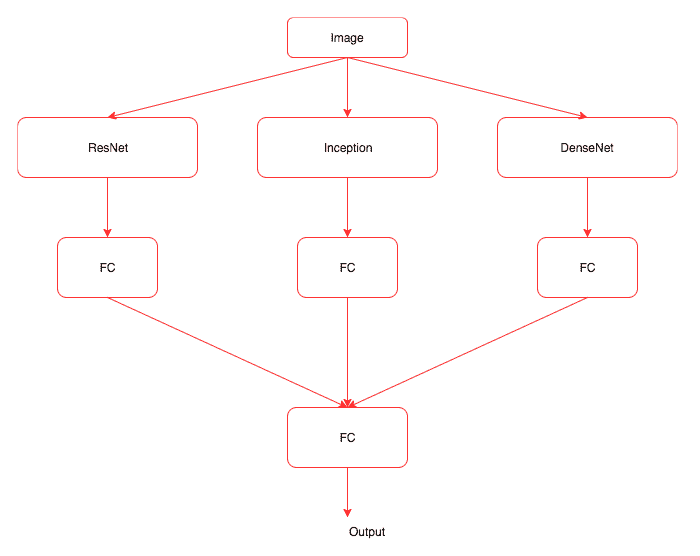

# 现代网络架构

在最后一章中，我们探讨了如何使用深度学习算法创建艺术图像，基于现有数据集创建新图像以及生成文本。在本章中，我们将介绍驱动现代计算机视觉应用和自然语言系统的不同网络架构。本章我们将看到的一些架构包括：

+   ResNet

+   Inception

+   DenseNet

+   编码器-解码器架构

# 现代网络架构

当深度学习模型学习失败时，我们通常会向模型中添加更多的层。随着层的增加，模型的准确性会提高，然后开始饱和。继续添加更多层之后，准确性会开始下降。超过一定数量的层会引入一些挑战，比如梯度消失或爆炸问题，这部分可以通过仔细初始化权重和引入中间归一化层来部分解决。现代架构，如**残差网络**（**ResNet**）和 Inception，尝试通过引入不同的技术，如残差连接，来解决这些问题。

# ResNet

ResNet 通过显式让网络中的层适应一个残差映射来解决这些问题，通过添加快捷连接。下图展示了 ResNet 的工作原理：


在我们看到的所有网络中，我们试图通过堆叠不同的层找到一个将输入（*x*）映射到其输出（*H(x)*）的函数。但是 ResNet 的作者提出了一个修正方法；不再试图学习从 *x* 到 *H(x)* 的基础映射，而是学习两者之间的差异，或者残差。然后，为了计算 *H(x)*，我们可以将残差简单地加到输入上。假设残差为 *F(x) = H(x) - x*；与其直接学习 *H(x)*，我们尝试学习 *F(x) + x*。

每个 ResNet 块由一系列层组成，并通过快捷连接将块的输入添加到块的输出。加法操作是逐元素进行的，输入和输出需要具有相同的大小。如果它们大小不同，我们可以使用填充。以下代码展示了一个简单的 ResNet 块是如何工作的：

```py
class ResNetBasicBlock(nn.Module):

    def __init__(self,in_channels,out_channels,stride):

        super().__init__()
        self.conv1 = nn.Conv2d(in_channels,out_channels,kernel_size=3,stride=stride,padding=1,bias=False)
        self.bn1 = nn.BatchNorm2d(out_channels)
        self.conv2 = nn.Conv2d(out_channels,out_channels,kernel_size=3,stride=stride,padding=1,bias=False)
        self.bn2 = nn.BatchNorm2d(out_channels)
        self.stride = stride

    def forward(self,x):

        residual = x
        out = self.conv1(x)
        out = F.relu(self.bn1(out),inplace=True)
        out = self.conv2(out)
        out = self.bn2(out)
        out += residual
        return F.relu(out)       
```

`ResNetBasicBlock` 包含一个 `init` 方法，用于初始化所有不同的层，如卷积层、批标准化层和 ReLU 层。`forward` 方法与我们之前看到的几乎相同，唯一不同的是在返回之前将输入重新添加到层的输出中。

PyTorch 的 `torchvision` 包提供了一个带有不同层的即用型 ResNet 模型。一些可用的不同模型包括：

+   ResNet-18

+   ResNet-34

+   ResNet-50

+   ResNet-101

+   ResNet-152

我们也可以使用这些模型中的任何一个进行迁移学习。`torchvision` 实例使我们能够简单地创建这些模型并使用它们。我们在书中已经做过几次，以下代码是对此的一次复习：

```py
from torchvision.models import resnet18

resnet = resnet18(pretrained=False)
```

下图展示了 34 层 ResNet 模型的结构：


34 层的 ResNet 模型

我们可以看到这个网络由多个 ResNet 块组成。有些团队进行了实验，尝试了深达 1000 层的模型。对于大多数实际应用场景，我个人推荐从一个较小的网络开始。这些现代网络的另一个关键优势是，它们与需要大量参数训练的模型（如 VGG）相比，需要很少的参数，因为它们避免使用全连接层。在计算机视觉领域解决问题时，另一种流行的架构是**Inception**。在继续研究 Inception 架构之前，让我们在`Dogs vs. Cats`数据集上训练一个 ResNet 模型。我们将使用我们在第五章*深度学习计算机视觉*中使用的数据，并基于从 ResNet 计算的特征快速训练一个模型。像往常一样，我们将按照以下步骤训练模型：

+   创建 PyTorch 数据集

+   创建用于训练和验证的加载器

+   创建 ResNet 模型

+   提取卷积特征

+   创建一个自定义的 PyTorch 数据集类，用于预处理的特征和加载器

+   创建一个简单的线性模型

+   训练和验证模型

完成后，我们将对 Inception 和 DenseNet 重复此步骤。最后，我们还将探讨集成技术，在其中结合这些强大的模型来构建一个新模型。

# 创建 PyTorch 数据集

我们创建一个包含所有基本变换的变换对象，并使用`ImageFolder`从我们在章节*5 中创建的数据目录中加载图像，深度学习计算机视觉。在以下代码中，我们创建数据集：

```py
data_transform = transforms.Compose([
        transforms.Resize((299,299)),
        transforms.ToTensor(),
        transforms.Normalize([0.485, 0.456, 0.406], [0.229, 0.224, 0.225])
    ])

# For Dogs & Cats dataset
train_dset = ImageFolder('../../chapter5/dogsandcats/train/',transform=data_transform)
val_dset = ImageFolder('../../chapter5/dogsandcats/valid/',transform=data_transform)
classes=2
```

到目前为止，前面的大部分代码应该是不言自明的。

# 创建用于训练和验证的加载器

我们使用 PyTorch 加载器以批次形式提供数据集中的数据，同时使用所有优势，如数据洗牌和多线程，以加快处理速度。以下代码演示了这一点：

```py
train_loader = DataLoader(train_dset,batch_size=32,shuffle=False,num_workers=3)
val_loader = DataLoader(val_dset,batch_size=32,shuffle=False,num_workers=3)

```

在计算预处理特征时，我们需要保持数据的确切顺序。当我们允许数据被洗牌时，我们将无法保持标签的顺序。因此，请确保`shuffle`参数为`False`，否则需要在代码中处理所需的逻辑。

# 创建一个 ResNet 模型

使用`resnet34`预训练模型的层，通过丢弃最后一个线性层创建 PyTorch 序列模型。我们将使用这个训练好的模型从我们的图像中提取特征。以下代码演示了这一点：

```py
#Create ResNet model
my_resnet = resnet34(pretrained=True)

if is_cuda:
    my_resnet = my_resnet.cuda()

my_resnet = nn.Sequential(*list(my_resnet.children())[:-1])

for p in my_resnet.parameters():
    p.requires_grad = False
```

在前面的代码中，我们创建了一个在`torchvision`模型中可用的`resnet34`模型。在下面的代码中，我们挑选所有的 ResNet 层，但排除最后一层，并使用`nn.Sequential`创建一个新模型：

```py
for p in my_resnet.parameters():
    p.requires_grad = False
```

`nn.Sequential`实例允许我们快速创建一个使用一堆 PyTorch 层的模型。一旦模型创建完毕，不要忘记将`requires_grad`参数设置为`False`，这将允许 PyTorch 不维护任何用于保存梯度的空间。

# 提取卷积特征

我们通过模型将训练和验证数据加载器传递，并将模型的结果存储在列表中以供进一步计算。通过计算预卷积特征，我们可以在训练模型时节省大量时间，因为我们不会在每次迭代中计算这些特征。在下面的代码中，我们计算预卷积特征：

```py
#For training data

# Stores the labels of the train data
trn_labels = [] 

# Stores the pre convoluted features of the train data
trn_features = [] 

#Iterate through the train data and store the calculated features and the labels
for d,la in train_loader:
    o = m(Variable(d.cuda()))
    o = o.view(o.size(0),-1)
    trn_labels.extend(la)
    trn_features.extend(o.cpu().data)

#For validation data

#Iterate through the validation data and store the calculated features and the labels
val_labels = []
val_features = []
for d,la in val_loader:
    o = m(Variable(d.cuda()))
    o = o.view(o.size(0),-1)
    val_labels.extend(la)
    val_features.extend(o.cpu().data)
```

一旦我们计算了预卷积特征，我们需要创建一个能够从我们的预卷积特征中挑选数据的自定义数据集。让我们为预卷积特征创建一个自定义数据集和加载器。

# 为预卷积特征创建自定义的 PyTorch 数据集类和加载器

我们已经看过如何创建 PyTorch 数据集。它应该是`torch.utils.data`数据集类的子类，并且应该实现`__getitem__(self, index)`和`__len__(self)`方法，这些方法返回数据集中的数据长度。在下面的代码中，我们为预卷积特征实现一个自定义数据集：

```py
class FeaturesDataset(Dataset):

    def __init__(self,featlst,labellst):
        self.featlst = featlst
        self.labellst = labellst

    def __getitem__(self,index):
        return (self.featlst[index],self.labellst[index])

    def __len__(self):
        return len(self.labellst)
```

创建自定义数据集类之后，创建预卷积特征的数据加载器就很简单了，如下面的代码所示：

```py
#Creating dataset for train and validation
trn_feat_dset = FeaturesDataset(trn_features,trn_labels)
val_feat_dset = FeaturesDataset(val_features,val_labels)

#Creating data loader for train and validation
trn_feat_loader = DataLoader(trn_feat_dset,batch_size=64,shuffle=True)
val_feat_loader = DataLoader(val_feat_dset,batch_size=64)
```

现在我们需要创建一个简单的线性模型，它可以将预卷积特征映射到相应的类别。

# 创建一个简单的线性模型

我们将创建一个简单的线性模型，将预卷积特征映射到相应的类别。在这种情况下，类别的数量为两个：

```py
class FullyConnectedModel(nn.Module):

    def __init__(self,in_size,out_size):
        super().__init__()
        self.fc = nn.Linear(in_size,out_size)

    def forward(self,inp):
        out = self.fc(inp)
        return out

fc_in_size = 8192

fc = FullyConnectedModel(fc_in_size,classes)
if is_cuda:
    fc = fc.cuda()
```

现在，我们可以训练我们的新模型并验证数据集。

# 训练和验证模型

我们将使用相同的`fit`函数，该函数我们已经在《第五章》*计算机视觉的深度学习*中使用过。我没有在这里包含它，以节省空间。以下代码片段包含了训练模型和显示结果的功能：

```py
train_losses , train_accuracy = [],[]
val_losses , val_accuracy = [],[]
for epoch in range(1,10):
    epoch_loss, epoch_accuracy = fit(epoch,fc,trn_feat_loader,phase='training')
    val_epoch_loss , val_epoch_accuracy = fit(epoch,fc,val_feat_loader,phase='validation')
    train_losses.append(epoch_loss)
    train_accuracy.append(epoch_accuracy)
    val_losses.append(val_epoch_loss)
    val_accuracy.append(val_epoch_accuracy)
```

上述代码的结果如下：

```py
#Results
training loss is 0.082 and training accuracy is 22473/23000     97.71
validation loss is   0.1 and validation accuracy is 1934/2000      96.7
training loss is  0.08 and training accuracy is 22456/23000     97.63
validation loss is  0.12 and validation accuracy is 1917/2000     95.85
training loss is 0.077 and training accuracy is 22507/23000     97.86
validation loss is   0.1 and validation accuracy is 1930/2000      96.5
training loss is 0.075 and training accuracy is 22518/23000      97.9
validation loss is 0.096 and validation accuracy is 1938/2000      96.9
training loss is 0.073 and training accuracy is 22539/23000      98.0
validation loss is   0.1 and validation accuracy is 1936/2000      96.8
training loss is 0.073 and training accuracy is 22542/23000     98.01
validation loss is 0.089 and validation accuracy is 1942/2000      97.1
training loss is 0.071 and training accuracy is 22545/23000     98.02
validation loss is  0.09 and validation accuracy is 1941/2000     97.05
training loss is 0.068 and training accuracy is 22591/23000     98.22
validation loss is 0.092 and validation accuracy is 1934/2000      96.7
training loss is 0.067 and training accuracy is 22573/23000     98.14
validation loss is 0.085 and validation accuracy is 1942/2000      97.1
```

正如我们从结果中看到的那样，模型达到了 98%的训练精度和 97%的验证精度。让我们了解另一种现代架构及其如何用于计算预卷积特征并用它们来训练模型。

# Inception

在我们看到的大多数计算机视觉模型的深度学习算法中，我们会选择使用卷积层，其滤波器大小为 1 x 1、3 x 3、5 x 5、7 x 7 或映射池化层。Inception 模块结合了不同滤波器大小的卷积，并将所有输出串联在一起。下图使 Inception 模型更清晰：


图片来源：https://arxiv.org/pdf/1409.4842.pdf

在这个 Inception 块图像中，应用了不同尺寸的卷积到输入上，并将所有这些层的输出串联起来。这是一个 Inception 模块的最简单版本。还有另一种 Inception 块的变体，我们在通过 3 x 3 和 5 x 5 卷积之前会先通过 1 x 1 卷积来减少维度。1 x 1 卷积用于解决计算瓶颈问题。1 x 1 卷积一次查看一个值，并跨通道进行。例如，在输入大小为 100 x 64 x 64 的情况下，使用 10 x 1 x 1 的滤波器将导致 10 x 64 x 64 的输出。以下图展示了具有降维的 Inception 块：


图片来源：https://arxiv.org/pdf/1409.4842.pdf

现在，让我们看一个 PyTorch 示例，展示前述 Inception 块的外观：

```py
class BasicConv2d(nn.Module):

    def __init__(self, in_channels, out_channels, **kwargs):
        super(BasicConv2d, self).__init__()
        self.conv = nn.Conv2d(in_channels, out_channels, bias=False, **kwargs)
        self.bn = nn.BatchNorm2d(out_channels)

    def forward(self, x):
        x = self.conv(x)
        x = self.bn(x)
        return F.relu(x, inplace=True)

class InceptionBasicBlock(nn.Module):

    def __init__(self, in_channels, pool_features):
        super().__init__()
        self.branch1x1 = BasicConv2d(in_channels, 64, kernel_size=1)

        self.branch5x5_1 = BasicConv2d(in_channels, 48, kernel_size=1)
        self.branch5x5_2 = BasicConv2d(48, 64, kernel_size=5, padding=2)

        self.branch3x3dbl_1 = BasicConv2d(in_channels, 64, kernel_size=1)
        self.branch3x3dbl_2 = BasicConv2d(64, 96, kernel_size=3, padding=1)

        self.branch_pool = BasicConv2d(in_channels, pool_features, kernel_size=1)

    def forward(self, x):
        branch1x1 = self.branch1x1(x)

        branch5x5 = self.branch5x5_1(x)
        branch5x5 = self.branch5x5_2(branch5x5)

        branch3x3dbl = self.branch3x3dbl_1(x)
        branch3x3dbl = self.branch3x3dbl_2(branch3x3dbl)

        branch_pool = F.avg_pool2d(x, kernel_size=3, stride=1, padding=1)
        branch_pool = self.branch_pool(branch_pool)

        outputs = [branch1x1, branch5x5, branch3x3dbl, branch_pool]
        return torch.cat(outputs, 1)

```

前述代码包含两个类，`BasicConv2d` 和 `InceptionBasicBlock`。`BasicConv2d` 作为一个自定义层，将二维卷积层、批归一化和 ReLU 层应用于传递的输入上。当我们有重复的代码结构时，创建一个新层是良好的做法，使代码看起来更优雅。

`InceptionBasicBlock` 实现了我们在第二个 Inception 图中看到的内容。让我们逐个查看每个较小的片段，并尝试理解它们的实现方式：

```py
branch1x1 = self.branch1x1(x)
```

前述代码通过应用一个 1 x 1 卷积块来转换输入：

```py
branch5x5 = self.branch5x5_1(x)
branch5x5 = self.branch5x5_2(branch5x5)
```

在前述代码中，我们通过应用一个 1 x 1 卷积块后跟一个 5 x 5 卷积块来转换输入：

```py
branch3x3dbl = self.branch3x3dbl_1(x)
branch3x3dbl = self.branch3x3dbl_2(branch3x3dbl)
```

在前述代码中，我们通过应用一个 1 x 1 卷积块后跟一个 3 x 3 卷积块来转换输入：

```py
branch_pool = F.avg_pool2d(x, kernel_size=3, stride=1, padding=1)
branch_pool = self.branch_pool(branch_pool)
```

在前述代码中，我们应用了平均池化以及一个 1 x 1 卷积块，在最后，我们将所有结果串联在一起。一个 Inception 网络将由多个 Inception 块组成。下图展示了 Inception 架构的外观：


Inception 架构

`torchvision` 包含一个 Inception 网络，可以像我们使用 ResNet 网络一样使用。对初始 Inception 块进行了许多改进，PyTorch 提供的当前实现是 Inception v3。让我们看看如何使用 `torchvision` 中的 Inception v3 模型来计算预计算特征。我们将不会详细介绍数据加载过程，因为我们将使用之前 ResNet 部分的相同数据加载器。我们将关注以下重要主题：

+   创建 Inception 模型

+   使用 `register_forward_hook` 提取卷积特征

+   为卷积特征创建新数据集

+   创建全连接模型

+   训练和验证模型

# 创建 Inception 模型

Inception v3 模型有两个分支，每个分支生成一个输出，在原始模型训练中，我们会像样式迁移那样合并损失。目前我们只关心使用一个分支来计算使用 Inception 的预卷积特征。深入了解这一点超出了本书的范围。如果你有兴趣了解更多工作原理，阅读论文和 Inception 模型的源代码（[`github.com/pytorch/vision/blob/master/torchvision/models/inception.py`](https://github.com/pytorch/vision/blob/master/torchvision/models/inception.py)）将有所帮助。我们可以通过将 `aux_logits` 参数设置为 `False` 来禁用其中一个分支。以下代码解释了如何创建模型并将 `aux_logits` 参数设置为 `False`：

```py
my_inception = inception_v3(pretrained=True)
my_inception.aux_logits = False
if is_cuda:
    my_inception = my_inception.cuda()
```

从 Inception 模型中提取卷积特征并不像 ResNet 那样直接，因此我们将使用 `register_forward_hook` 来提取激活值。

# 使用 `register_forward_hook` 提取卷积特征

我们将使用与计算样式迁移激活值相同的技术。以下是 `LayerActivations` 类的一些小修改，因为我们只关注提取特定层的输出：

```py
class LayerActivations():
    features=[]

    def __init__(self,model):
        self.features = []
        self.hook = model.register_forward_hook(self.hook_fn)

    def hook_fn(self,module,input,output):

        self.features.extend(output.view(output.size(0),-1).cpu().data)

    def remove(self):

        self.hook.remove()
```

除了 `hook` 函数外，其余代码与我们用于样式迁移的代码类似。由于我们正在捕获所有图像的输出并存储它们，我们将无法在 **图形处理单元** (**GPU**) 内存中保留数据。因此，我们将从 GPU 中提取张量到 CPU，并仅存储张量而不是 `Variable`。我们将其转换回张量，因为数据加载器只能处理张量。在以下代码中，我们使用 `LayerActivations` 对象来提取 Inception 模型在最后一层的输出，跳过平均池化层、dropout 和线性层。我们跳过平均池化层是为了避免在数据中丢失有用信息：

```py
# Create LayerActivations object to store the output of inception model at a particular layer.
trn_features = LayerActivations(my_inception.Mixed_7c)
trn_labels = []

# Passing all the data through the model , as a side effect the outputs will get stored 
# in the features list of the LayerActivations object. 
for da,la in train_loader:
    _ = my_inception(Variable(da.cuda()))
    trn_labels.extend(la)
trn_features.remove()

# Repeat the same process for validation dataset .

val_features = LayerActivations(my_inception.Mixed_7c)
val_labels = []
for da,la in val_loader:
    _ = my_inception(Variable(da.cuda()))
    val_labels.extend(la)
val_features.remove()
```

让我们创建新的数据集和加载器，以便获取新的卷积特征。

# 为卷积特征创建新数据集

我们可以使用相同的 `FeaturesDataset` 类来创建新的数据集和数据加载器。在以下代码中，我们创建数据集和加载器：

```py
#Dataset for pre computed features for train and validation data sets

trn_feat_dset = FeaturesDataset(trn_features.features,trn_labels)
val_feat_dset = FeaturesDataset(val_features.features,val_labels)

#Data loaders for pre computed features for train and validation data sets

trn_feat_loader = DataLoader(trn_feat_dset,batch_size=64,shuffle=True)
val_feat_loader = DataLoader(val_feat_dset,batch_size=64)
```

让我们创建一个新的模型来在预卷积特征上进行训练。

# 创建一个完全连接的模型

简单的模型可能会导致过拟合，因此让我们在模型中包含 dropout。Dropout 可以帮助避免过拟合。在以下代码中，我们正在创建我们的模型：

```py
class FullyConnectedModel(nn.Module):

    def __init__(self,in_size,out_size,training=True):
        super().__init__()
        self.fc = nn.Linear(in_size,out_size)

    def forward(self,inp):
        out = F.dropout(inp, training=self.training)
        out = self.fc(out)
        return out

# The size of the output from the selected convolution feature 
fc_in_size = 131072

fc = FullyConnectedModel(fc_in_size,classes)
if is_cuda:
    fc = fc.cuda()
```

一旦模型创建完成，我们可以对模型进行训练。

# 训练和验证模型

我们使用与之前的 ResNet 和其他示例中相同的拟合和训练逻辑。我们只会查看训练代码和其结果：

```py
for epoch in range(1,10):
    epoch_loss, epoch_accuracy = fit(epoch,fc,trn_feat_loader,phase='training')
    val_epoch_loss , val_epoch_accuracy = fit(epoch,fc,val_feat_loader,phase='validation')
    train_losses.append(epoch_loss)
    train_accuracy.append(epoch_accuracy)
    val_losses.append(val_epoch_loss)
    val_accuracy.append(val_epoch_accuracy)

#Results

training loss is 0.78 and training accuracy is 22825/23000 99.24
validation loss is 5.3 and validation accuracy is 1947/2000 97.35
training loss is 0.84 and training accuracy is 22829/23000 99.26
validation loss is 5.1 and validation accuracy is 1952/2000 97.6
training loss is 0.69 and training accuracy is 22843/23000 99.32
validation loss is 5.1 and validation accuracy is 1951/2000 97.55
training loss is 0.58 and training accuracy is 22852/23000 99.36
validation loss is 4.9 and validation accuracy is 1953/2000 97.65
training loss is 0.67 and training accuracy is 22862/23000 99.4
validation loss is 4.9 and validation accuracy is 1955/2000 97.75
training loss is 0.54 and training accuracy is 22870/23000 99.43
validation loss is 4.8 and validation accuracy is 1953/2000 97.65
training loss is 0.56 and training accuracy is 22856/23000 99.37
validation loss is 4.8 and validation accuracy is 1955/2000 97.75
training loss is 0.7 and training accuracy is 22841/23000 99.31
validation loss is 4.8 and validation accuracy is 1956/2000 97.8
training loss is 0.47 and training accuracy is 22880/23000 99.48
validation loss is 4.7 and validation accuracy is 1956/2000 97.8

```

查看结果，Inception 模型在训练集上达到了 99% 的准确率，在验证集上达到了 97.8% 的准确率。由于我们预先计算并将所有特征保存在内存中，训练模型只需不到几分钟的时间。如果在运行程序时出现内存不足的情况，则可能需要避免将特征保存在内存中。

我们将看看另一个有趣的架构 DenseNet，在过去一年中变得非常流行。

# 密集连接的卷积网络 – DenseNet

一些成功和流行的架构，如 ResNet 和 Inception，展示了更深更宽网络的重要性。ResNet 使用快捷连接来构建更深的网络。DenseNet 将其提升到一个新水平，通过引入从每一层到所有后续层的连接，即一个层可以接收来自前几层的所有特征图。符号上看，它可能是这样的：


下图描述了一个五层密集块的结构：


图片来源：https://arxiv.org/abs/1608.06993

torchvision 中有 DenseNet 的实现（[`github.com/pytorch/vision/blob/master/torchvision/models/densenet.py`](https://github.com/pytorch/vision/blob/master/torchvision/models/densenet.py)）。让我们看一下两个主要功能，`_DenseBlock` 和 `_DenseLayer`。

# DenseBlock

让我们查看 `DenseBlock` 的代码，然后逐步分析它：

```py
class _DenseBlock(nn.Sequential):
    def __init__(self, num_layers, num_input_features, bn_size, growth_rate, drop_rate):
        super(_DenseBlock, self).__init__()
        for i in range(num_layers):
            layer = _DenseLayer(num_input_features + i * growth_rate, growth_rate, bn_size, drop_rate)
            self.add_module('denselayer%d' % (i + 1), layer)
```

`DenseBlock` 是一个顺序模块，我们按顺序添加层。根据块中的层数（`num_layers`），我们添加相应数量的 `_DenseLayer` 对象以及一个名称。所有的魔法都发生在 `DenseLayer` 内部。让我们看看 `DenseLayer` 内部发生了什么。

# DenseLayer

学习一个特定网络如何工作的一个好方法是查看源代码。PyTorch 实现非常清晰，大多数情况下易于阅读。让我们来看一下 `DenseLayer` 的实现：

```py
class _DenseLayer(nn.Sequential):
    def __init__(self, num_input_features, growth_rate, bn_size, drop_rate):
        super(_DenseLayer, self).__init__()
        self.add_module('norm.1', nn.BatchNorm2d(num_input_features)),
        self.add_module('relu.1', nn.ReLU(inplace=True)),
        self.add_module('conv.1', nn.Conv2d(num_input_features, bn_size *
                        growth_rate, kernel_size=1, stride=1, bias=False)),
        self.add_module('norm.2', nn.BatchNorm2d(bn_size * growth_rate)),
        self.add_module('relu.2', nn.ReLU(inplace=True)),
        self.add_module('conv.2', nn.Conv2d(bn_size * growth_rate, growth_rate,
                        kernel_size=3, stride=1, padding=1, bias=False)),
        self.drop_rate = drop_rate

    def forward(self, x):
        new_features = super(_DenseLayer, self).forward(x)
        if self.drop_rate > 0:
            new_features = F.dropout(new_features, p=self.drop_rate, training=self.training)
        return torch.cat([x, new_features], 1)
```

如果你对 Python 中的继承不熟悉，那么前面的代码可能看起来不直观。`_DenseLayer` 是 `nn.Sequential` 的子类；让我们看看每个方法内部发生了什么。

在`__init__`方法中，我们添加所有需要传递给输入数据的层。这与我们看到的所有其他网络架构非常相似。

魔法发生在`forward`方法中。我们将输入传递给`super`类的`forward`方法，即`nn.Sequential`的方法。让我们看看顺序类的`forward`方法中发生了什么（[`github.com/pytorch/pytorch/blob/409b1c8319ecde4bd62fcf98d0a6658ae7a4ab23/torch/nn/modules/container.py`](https://github.com/pytorch/pytorch/blob/409b1c8319ecde4bd62fcf98d0a6658ae7a4ab23/torch/nn/modules/container.py)）：

```py
def forward(self, input):
    for module in self._modules.values():
        input = module(input)
    return input
```

输入通过之前添加到顺序块中的所有层，并将输出连接到输入。该过程在块中所需数量的层中重复进行。

了解了`DenseNet`块的工作原理后，让我们探索如何使用 DenseNet 计算预卷积特征并在其上构建分类器模型。在高层次上，DenseNet 的实现类似于 VGG 的实现。DenseNet 实现还有一个特征模块，其中包含所有的密集块，以及一个分类器模块，其中包含全连接模型。我们将按照以下步骤构建模型。我们将跳过与 Inception 和 ResNet 相似的大部分内容，例如创建数据加载器和数据集。同时，我们将详细讨论以下步骤：

+   创建一个 DenseNet 模型

+   提取 DenseNet 特征

+   创建一个数据集和加载器

+   创建一个全连接模型并训练

到目前为止，大部分代码都将是不言自明的。

# 创建一个 DenseNet 模型

Torchvision 有一个预训练的 DenseNet 模型，具有不同的层次选项（121、169、201、161）。我们选择了具有`121`层的模型。正如讨论的那样，DenseNet 有两个模块：特征（包含密集块）和分类器（全连接块）。由于我们正在使用 DenseNet 作为图像特征提取器，我们只会使用特征模块：

```py
my_densenet = densenet121(pretrained=True).features
if is_cuda:
    my_densenet = my_densenet.cuda()

for p in my_densenet.parameters():
    p.requires_grad = False
```

让我们从图像中提取 DenseNet 特征。

# 提取 DenseNet 特征

这与我们为 Inception 所做的相似，只是我们没有使用`register_forward_hook`来提取特征。以下代码展示了如何提取 DenseNet 特征：

```py
#For training data
trn_labels = []
trn_features = []

#code to store densenet features for train dataset.
for d,la in train_loader:
    o = my_densenet(Variable(d.cuda()))
    o = o.view(o.size(0),-1)
    trn_labels.extend(la)
    trn_features.extend(o.cpu().data)

#For validation data
val_labels = []
val_features = []

#Code to store densenet features for validation dataset. 
for d,la in val_loader:
    o = my_densenet(Variable(d.cuda()))
    o = o.view(o.size(0),-1)
    val_labels.extend(la)
    val_features.extend(o.cpu().data)
```

前述代码与我们之前看到的 Inception 和 ResNet 类似。

# 创建一个数据集和加载器

我们将使用我们为 ResNet 创建的`FeaturesDataset`类，并在以下代码中使用它来为`train`和`validation`数据集创建数据加载器：

```py
# Create dataset for train and validation convolution features
trn_feat_dset = FeaturesDataset(trn_features,trn_labels)
val_feat_dset = FeaturesDataset(val_features,val_labels)

# Create data loaders for batching the train and validation datasets
trn_feat_loader = DataLoader(trn_feat_dset,batch_size=64,shuffle=True,drop_last=True)
val_feat_loader = DataLoader(val_feat_dset,batch_size=64)
```

是时候创建模型并训练了。

# 创建一个全连接模型并训练

我们将使用一个简单的线性模型，类似于我们在 ResNet 和 Inception 中使用的模型。以下代码展示了我们将用来训练模型的网络架构：

```py
class FullyConnectedModel(nn.Module):

    def __init__(self,in_size,out_size):
        super().__init__()
        self.fc = nn.Linear(in_size,out_size)

    def forward(self,inp):
        out = self.fc(inp)
        return out

fc = FullyConnectedModel(fc_in_size,classes)
if is_cuda:
    fc = fc.cuda()
```

我们将使用相同的`fit`方法来训练前面的模型。以下代码片段显示了训练代码及其结果：

```py
train_losses , train_accuracy = [],[]
val_losses , val_accuracy = [],[]
for epoch in range(1,10):
    epoch_loss, epoch_accuracy = fit(epoch,fc,trn_feat_loader,phase='training')
    val_epoch_loss , val_epoch_accuracy = fit(epoch,fc,val_feat_loader,phase='validation')
    train_losses.append(epoch_loss)
    train_accuracy.append(epoch_accuracy)
    val_losses.append(val_epoch_loss)
    val_accuracy.append(val_epoch_accuracy)

```

上述代码的结果是：

```py
# Results

training loss is 0.057 and training accuracy is 22506/23000 97.85
validation loss is 0.034 and validation accuracy is 1978/2000 98.9
training loss is 0.0059 and training accuracy is 22953/23000 99.8
validation loss is 0.028 and validation accuracy is 1981/2000 99.05
training loss is 0.0016 and training accuracy is 22974/23000 99.89
validation loss is 0.022 and validation accuracy is 1983/2000 99.15
training loss is 0.00064 and training accuracy is 22976/23000 99.9
validation loss is 0.023 and validation accuracy is 1983/2000 99.15
training loss is 0.00043 and training accuracy is 22976/23000 99.9
validation loss is 0.024 and validation accuracy is 1983/2000 99.15
training loss is 0.00033 and training accuracy is 22976/23000 99.9
validation loss is 0.024 and validation accuracy is 1984/2000 99.2
training loss is 0.00025 and training accuracy is 22976/23000 99.9
validation loss is 0.024 and validation accuracy is 1984/2000 99.2
training loss is 0.0002 and training accuracy is 22976/23000 99.9
validation loss is 0.025 and validation accuracy is 1985/2000 99.25
training loss is 0.00016 and training accuracy is 22976/23000 99.9
validation loss is 0.024 and validation accuracy is 1986/2000 99.3
```

前述算法能够达到 99%的最大训练精度和 99%的验证精度。由于您创建的`validation`数据集可能包含不同的图像，因此您的结果可能会有所不同。

DenseNet 的一些优点包括：

+   它大大减少了所需的参数数量

+   它缓解了梯度消失问题

+   它鼓励特征重用

在接下来的部分中，我们将探讨如何构建一个结合使用 ResNet、Inception 和 DenseNet 不同模型计算的卷积特征优势的模型。

# 模型集成

有时，我们需要尝试将多个模型组合在一起构建一个非常强大的模型。有许多技术可以用于构建集成模型。在本节中，我们将学习如何使用由三种不同模型（ResNet、Inception 和 DenseNet）生成的特征来结合输出，从而构建一个强大的模型。我们将使用本章中其他示例中使用的同一数据集。

集成模型的架构将如下所示：



该图显示了我们在集成模型中要做的事情，可以总结为以下步骤：

1.  创建三个模型

1.  使用创建的模型提取图像特征

1.  创建一个自定义数据集，该数据集返回所有三个模型的特征以及标签

1.  创建类似于前面图中架构的模型

1.  训练和验证模型

让我们详细探讨每个步骤。

# 创建模型

让我们按以下代码创建所有三个所需的模型：

```py
#Create ResNet model
my_resnet = resnet34(pretrained=True)

if is_cuda:
    my_resnet = my_resnet.cuda()

my_resnet = nn.Sequential(*list(my_resnet.children())[:-1])

for p in my_resnet.parameters():
    p.requires_grad = False

#Create inception model

my_inception = inception_v3(pretrained=True)
my_inception.aux_logits = False
if is_cuda:
    my_inception = my_inception.cuda()
for p in my_inception.parameters():
    p.requires_grad = False

#Create densenet model

my_densenet = densenet121(pretrained=True).features
if is_cuda:
    my_densenet = my_densenet.cuda()

for p in my_densenet.parameters():
    p.requires_grad = False
```

现在我们有了所有模型，让我们从图像中提取特征。

# 提取图像特征

这里，我们将本章中各算法的各自逻辑组合起来：

```py
### For ResNet

trn_labels = []
trn_resnet_features = []
for d,la in train_loader:
    o = my_resnet(Variable(d.cuda()))
    o = o.view(o.size(0),-1)
    trn_labels.extend(la)
    trn_resnet_features.extend(o.cpu().data)
val_labels = []
val_resnet_features = []
for d,la in val_loader:
    o = my_resnet(Variable(d.cuda()))
    o = o.view(o.size(0),-1)
    val_labels.extend(la)
    val_resnet_features.extend(o.cpu().data)

### For Inception

trn_inception_features = LayerActivations(my_inception.Mixed_7c)
for da,la in train_loader:
    _ = my_inception(Variable(da.cuda()))

trn_inception_features.remove()

val_inception_features = LayerActivations(my_inception.Mixed_7c)
for da,la in val_loader:
    _ = my_inception(Variable(da.cuda()))

val_inception_features.remove()

### For DenseNet

trn_densenet_features = []
for d,la in train_loader:
    o = my_densenet(Variable(d.cuda()))
    o = o.view(o.size(0),-1)

    trn_densenet_features.extend(o.cpu().data)

val_densenet_features = []
for d,la in val_loader:
    o = my_densenet(Variable(d.cuda()))
    o = o.view(o.size(0),-1)
    val_densenet_features.extend(o.cpu().data)
```

到目前为止，我们已经使用所有模型创建了图像特征。如果你遇到内存问题，那么可以删除其中一个模型，或者停止在内存中存储特征，这可能会导致训练速度变慢。如果你在运行这个过程时使用的是 CUDA 实例，那么可以选择更强大的实例。

# 创建一个自定义数据集以及数据加载器

由于`FeaturesDataset`类仅开发用于从一个模型的输出中进行选择，所以我们将无法直接使用它。因此，以下实现对`FeaturesDataset`类进行了微小的更改，以适应所有三个不同生成特征的情况：

```py
class FeaturesDataset(Dataset):

    def __init__(self,featlst1,featlst2,featlst3,labellst):
        self.featlst1 = featlst1
        self.featlst2 = featlst2
        self.featlst3 = featlst3
        self.labellst = labellst

    def __getitem__(self,index):
        return (self.featlst1[index],self.featlst2[index],self.featlst3[index],self.labellst[index])

    def __len__(self):
        return len(self.labellst)

trn_feat_dset = FeaturesDataset(trn_resnet_features,trn_inception_features.features,trn_densenet_features,trn_labels)
val_feat_dset = FeaturesDataset(val_resnet_features,val_inception_features.features,val_densenet_features,val_labels)
```

我们已经对`__init__`方法进行了更改，以存储来自不同模型生成的所有特征，并对`__getitem__`方法进行了更改，以检索图像的特征和标签。使用`FeatureDataset`类，我们为训练和验证数据创建了数据集实例。一旦数据集创建完成，我们可以使用相同的数据加载器批处理数据，如以下代码所示：

```py
trn_feat_loader = DataLoader(trn_feat_dset,batch_size=64,shuffle=True)
val_feat_loader = DataLoader(val_feat_dset,batch_size=64)
```

# 创建一个集成模型

我们需要创建一个与之前展示的架构图类似的模型。以下代码实现了这一点：

```py
class EnsembleModel(nn.Module):

    def __init__(self,out_size,training=True):
        super().__init__()
        self.fc1 = nn.Linear(8192,512)
        self.fc2 = nn.Linear(131072,512)
        self.fc3 = nn.Linear(82944,512)
        self.fc4 = nn.Linear(512,out_size)

    def forward(self,inp1,inp2,inp3):
        out1 = self.fc1(F.dropout(inp1,training=self.training))
        out2 = self.fc2(F.dropout(inp2,training=self.training))
        out3 = self.fc3(F.dropout(inp3,training=self.training))
        out = out1 + out2 + out3
        out = self.fc4(F.dropout(out,training=self.training))
        return out

em = EnsembleModel(2)
if is_cuda:
    em = em.cuda()
```

在前面的代码中，我们创建了三个线性层，这些线性层接收从不同模型生成的特征。我们将这三个线性层的所有输出相加，并将它们传递给另一个线性层，将它们映射到所需的类别。为了防止模型过拟合，我们使用了 dropout。

# 训练和验证模型

我们需要对`fit`方法进行一些小的更改，以适应从数据加载器生成的三个输入值。以下代码实现了新的`fit`函数：

```py
def fit(epoch,model,data_loader,phase='training',volatile=False):
    if phase == 'training':
        model.train()
    if phase == 'validation':
        model.eval()
        volatile=True
    running_loss = 0.0
    running_correct = 0
    for batch_idx , (data1,data2,data3,target) in enumerate(data_loader):
        if is_cuda:
            data1,data2,data3,target = data1.cuda(),data2.cuda(),data3.cuda(),target.cuda()
        data1,data2,data3,target = Variable(data1,volatile),Variable(data2,volatile),Variable(data3,volatile),Variable(target)
        if phase == 'training':
            optimizer.zero_grad()
        output = model(data1,data2,data3)
        loss = F.cross_entropy(output,target)

        running_loss += F.cross_entropy(output,target,size_average=False).data[0]
        preds = output.data.max(dim=1,keepdim=True)[1]
        running_correct += preds.eq(target.data.view_as(preds)).cpu().sum()
        if phase == 'training':
            loss.backward()
            optimizer.step()

    loss = running_loss/len(data_loader.dataset)
    accuracy = 100\. * running_correct/len(data_loader.dataset)

    print(f'{phase} loss is {loss:{5}.{2}} and {phase} accuracy is {running_correct}/{len(data_loader.dataset)}{accuracy:{10}.{4}}')
    return loss,accuracy
```

如您从前面的代码中看到的，大部分代码保持不变，只是加载器返回了三个输入和一个标签。因此，我们对功能进行了更改，这是不言自明的。

以下代码显示了训练代码：

```py
train_losses , train_accuracy = [],[]
val_losses , val_accuracy = [],[]
for epoch in range(1,10):
    epoch_loss, epoch_accuracy = fit(epoch,em,trn_feat_loader,phase='training')
    val_epoch_loss , val_epoch_accuracy = fit(epoch,em,val_feat_loader,phase='validation')
    train_losses.append(epoch_loss)
    train_accuracy.append(epoch_accuracy)
    val_losses.append(val_epoch_loss)
    val_accuracy.append(val_epoch_accuracy)

```

上述代码的结果如下：

```py
#Results 

training loss is 7.2e+01 and training accuracy is 21359/23000 92.87
validation loss is 6.5e+01 and validation accuracy is 1968/2000 98.4
training loss is 9.4e+01 and training accuracy is 22539/23000 98.0
validation loss is 1.1e+02 and validation accuracy is 1980/2000 99.0
training loss is 1e+02 and training accuracy is 22714/23000 98.76
validation loss is 1.4e+02 and validation accuracy is 1976/2000 98.8
training loss is 7.3e+01 and training accuracy is 22825/23000 99.24
validation loss is 1.6e+02 and validation accuracy is 1979/2000 98.95
training loss is 7.2e+01 and training accuracy is 22845/23000 99.33
validation loss is 2e+02 and validation accuracy is 1984/2000 99.2
training loss is 1.1e+02 and training accuracy is 22862/23000 99.4
validation loss is 4.1e+02 and validation accuracy is 1975/2000 98.75
training loss is 1.3e+02 and training accuracy is 22851/23000 99.35
validation loss is 4.2e+02 and validation accuracy is 1981/2000 99.05
training loss is 2e+02 and training accuracy is 22845/23000 99.33
validation loss is 6.1e+02 and validation accuracy is 1982/2000 99.1
training loss is 1e+02 and training accuracy is 22917/23000 99.64
validation loss is 5.3e+02 and validation accuracy is 1986/2000 99.3
```

集成模型达到了 99.6%的训练精度和 99.3%的验证精度。虽然集成模型功能强大，但计算开销大。它们在解决如 Kaggle 竞赛中的问题时是很好的技术。

# 编码器-解码器架构

我们在书中看到的几乎所有深度学习算法都擅长学习如何将训练数据映射到其相应的标签。我们不能直接将它们用于需要模型从序列学习并生成另一个序列或图像的任务。一些示例应用包括：

+   语言翻译

+   图像字幕

+   图像生成（seq2img）

+   语音识别

+   问答系统

这些问题大多可以看作是某种形式的序列到序列映射，可以使用一系列称为**编码器-解码器架构**的体系结构来解决。在本节中，我们将了解这些架构背后的直觉。我们不会看这些网络的实现，因为它们需要更详细的学习。

在高层次上，编码器-解码器架构看起来如下所示：


编码器通常是一个**递归神经网络**（**RNN**）（用于序列数据）或**卷积神经网络**（**CNN**）（用于图像），它接收图像或序列并将其转换为一个固定长度的向量，该向量编码了所有信息。解码器是另一个 RNN 或 CNN，它学习解码编码器生成的向量，并生成新的数据序列。下图展示了用于图像字幕系统的编码器-解码器架构的外观：


图像字幕系统的编码器-解码器架构

图像来源：https://arxiv.org/pdf/1411.4555.pdf

让我们更详细地看一看图像字幕系统中编码器和解码器架构的内部情况。

# 编码器

对于图像字幕系统，我们通常会使用训练好的架构，比如 ResNet 或 Inception，从图像中提取特征。就像我们对集成模型所做的那样，我们可以通过使用一个线性层输出固定长度的向量，然后使该线性层可训练。

# 解码器

解码器是一个**长短期记忆**（**LSTM**）层，用于为图像生成字幕。为了构建一个简单的模型，我们可以只将编码器嵌入作为 LSTM 的输入传递一次。但是解码器要学习起来可能会很有挑战性；因此，常见做法是在解码器的每一步中提供编码器嵌入。直观地说，解码器学习生成一系列最佳描述给定图像字幕的文本序列。

# 总结

在本章中，我们探讨了一些现代架构，如 ResNet、Inception 和 DenseNet。我们还探讨了如何使用这些模型进行迁移学习和集成学习，并介绍了编码器-解码器架构，该架构驱动着许多系统，如语言翻译系统。

在下一章中，我们将总结在书籍学习旅程中取得的成就，同时讨论你接下来可以从哪里继续前行。我们将探讨关于 PyTorch 的大量资源以及一些正在使用 PyTorch 进行研究的酷炫深度学习项目。
