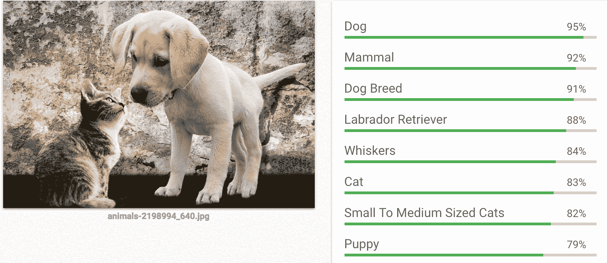

# 下一步是什么？

你做到了！感谢阅读《使用 PyTorch 进行深度学习》。你应该已经对构建深度学习应用所需的核心机制和**应用程序接口**（**API**）有了坚实的理解。到目前为止，你应该已经能够熟练使用支撑大部分现代深度学习算法的所有基本组件。

# 接下来是什么？

在本章中，我们将总结我们在本书中学到的内容，并进一步探讨不同的项目和资源。这些项目和资源将有助于你在保持与最新研究同步的旅程中更进一步。

# 概览

本节提供了我们在整本书中学到的一个鸟瞰视角：

+   人工智能（**AI**）历史，机器学习的历史——硬件和算法的各种改进如何在不同应用中触发了深度学习的巨大成功。

+   如何使用 PyTorch 的各种构建模块，如变量、张量和`nn.module`，来开发神经网络。

+   理解训练神经网络涉及的不同过程，例如用于数据准备的 PyTorch 数据集，用于批处理张量的数据加载器，用于创建网络架构的`torch.nn`包，以及使用 PyTorch 损失函数和优化器。

+   我们看到了不同类型的机器学习问题以及挑战，例如过拟合和欠拟合。我们还通过了不同的技术，如数据增强、添加 dropout，以及使用批归一化来防止过拟合。

+   我们学习了**卷积神经网络**（**CNNs**）的不同构建模块，并学习了迁移学习，这有助于我们使用预训练模型。我们还了解了使用预卷积特征等技术，有助于减少模型训练所需的时间。

+   我们学习了词嵌入（word embeddings）及其在文本分类问题中的应用。我们还探索了如何使用预训练的词嵌入。我们研究了**循环神经网络**（**RNN**）及其变种，如**长短期记忆网络**（**LSTM**），以及如何将它们用于文本分类问题。

+   我们探索了生成模型，并学习了如何使用 PyTorch 进行艺术风格转换，以及如何使用生成对抗网络（**GAN**）创建新的 CIFAR 图像。我们还探索了语言建模技术，这些技术可以用于生成新文本或创建特定领域的嵌入。

+   我们探索了现代架构，如 ResNet、Inception、DenseNet 和编码-解码架构。我们还看到了这些模型如何用于迁移学习。我们还通过结合所有这些模型构建了一个集成模型。

# 探索有趣的想法

我们在书中学到的大部分概念构成了由深度学习驱动的现代应用程序的基础。在本节中，我们将探讨与计算机视觉和**自然语言处理** (**NLP**) 相关的不同有趣项目。

# 目标检测

在这本书中看到的所有例子都有助于检测给定图像是这个（猫）还是那个（狗）。但是，要解决现实世界中的一些问题，你可能需要识别图像中的不同对象，例如这里显示的：

目标检测算法的输出

这张图片显示了一个目标检测算法的输出，算法正在检测诸如一只漂亮的狗和猫等对象。就像有现成的图像分类算法一样，有许多令人惊奇的算法可以帮助构建对象识别系统。以下是一些重要算法及其提到的论文列表：

+   **单次检测多盒子探测器** (**SSD**) [`arxiv.org/abs/1512.02325`](https://arxiv.org/abs/1512.02325)

+   Faster RCNN [`arxiv.org/abs/1506.01497`](https://arxiv.org/abs/1506.01497)

+   YOLO2 [`arxiv.org/abs/1612.08242`](https://arxiv.org/abs/1612.08242)

# 图像分割

假设你正在楼顶阅读这本书。你周围看到了什么？你能勾勒出你看到的东西吗？如果你是个好艺术家，不像我，那么你可能已经画了几座建筑物、树木、鸟类以及周围更多有趣的事物。图像分割算法试图捕捉类似的东西。给定一张图像，它们会为每个像素生成一个预测，识别每个像素属于哪个类别。以下图片展示了图像分割算法的识别结果：

图像分割算法的输出

你可能希望探索用于图像分割的一些重要算法：

+   R-CNN [`arxiv.org/abs/1311.2524`](https://arxiv.org/abs/1311.2524)

+   快速 R-CNN [`arxiv.org/abs/1504.08083`](https://arxiv.org/abs/1504.08083)

+   Faster R-CNN [`arxiv.org/abs/1506.01497`](https://arxiv.org/abs/1506.01497)

+   Mask R-CNN [`arxiv.org/abs/1703.06870`](https://arxiv.org/abs/1703.06870)

# PyTorch 中的 OpenNMT

**开源神经机器翻译** (**OpenNMT**) ([`github.com/OpenNMT/OpenNMT-py`](https://github.com/OpenNMT/OpenNMT-py)) 项目有助于构建许多由编码器-解码器架构驱动的应用程序。你可以构建的一些应用包括翻译系统、文本摘要和图像到文本。

# Alien NLP

Alien NLP 是一个建立在 PyTorch 上的开源项目，能够更轻松地完成许多自然语言处理任务。这里有一个演示页面（[`demo.allennlp.org/machine-comprehension`](http://demo.allennlp.org/machine-comprehension)），你可以查看以了解使用 Alien NLP 可以构建什么。

# fast.ai – 再次让神经网络变得不那么酷

我最喜欢学习深度学习的地方之一，也是一个极好的灵感来源，是由 *fast.ai* 的两位出色导师 Jeremy Howard 和 Rachel Thomas 组织的一个 MOOC，其唯一目的是让深度学习对所有人都更加可达，你可以在 [`www.fast.ai/`](http://www.fast.ai/) 查看。他们为课程的新版本构建了一个令人惊叹的框架（[`github.com/fastai/fastai`](https://github.com/fastai/fastai)），基于 PyTorch，使构建应用程序变得更加简单和快速。如果你还没有开始他们的课程，我强烈建议你开始。探索 *fast.ai* 框架的构建将为你带来许多强大技术的深刻见解。

# 开放神经网络交换

**开放神经网络交换**（**ONNX**）（[`onnx.ai/`](http://onnx.ai/)）是迈向开放生态系统的第一步，使你能够在项目发展过程中选择合适的工具。ONNX 提供了深度学习模型的开源格式。它定义了可扩展的计算图模型，以及内置运算符和标准数据类型的定义。Caffe2、PyTorch、Microsoft Cognitive Toolkit、Apache MXNet 等工具正在开发 ONNX 支持。这个项目有助于将 PyTorch 模型产品化。

# 如何保持更新

社交媒体平台，特别是 Twitter，帮助你在该领域保持更新。有许多人可以关注。如果你不确定从哪里开始，我建议你关注 Jeremy Howard（[`twitter.com/jeremyphoward`](https://twitter.com/jeremyphoward)）及他可能关注的其他有趣的人。这样做可以让 Twitter 的推荐系统为你工作。

另一个你需要关注的重要 Twitter 账号是 PyTorch 的（[`twitter.com/PyTorch`](https://twitter.com/PyTorch)）。PyTorch 背后的惊人团队分享了一些很棒的内容。

如果你在寻找研究论文，可以看看 *arxiv-sanity*（[`www.arxiv-sanity.com/`](http://www.arxiv-sanity.com/)），那里许多聪明的研究人员发布他们的论文。

关于 PyTorch 的更多优秀资源包括其教程（[`pytorch.org/tutorials/`](http://pytorch.org/tutorials/)）、源代码（[`github.com/pytorch/pytorch`](https://github.com/pytorch/pytorch)）以及文档（[`pytorch.org/docs/0.3.0/`](http://pytorch.org/docs/0.3.0/)）。

# 总结

关于深度学习和 PyTorch 还有很多内容。PyTorch 是一个相对较新的框架，在撰写本章时已经一年了。还有很多东西可以学习和探索，祝你学习愉快。一切顺利。
