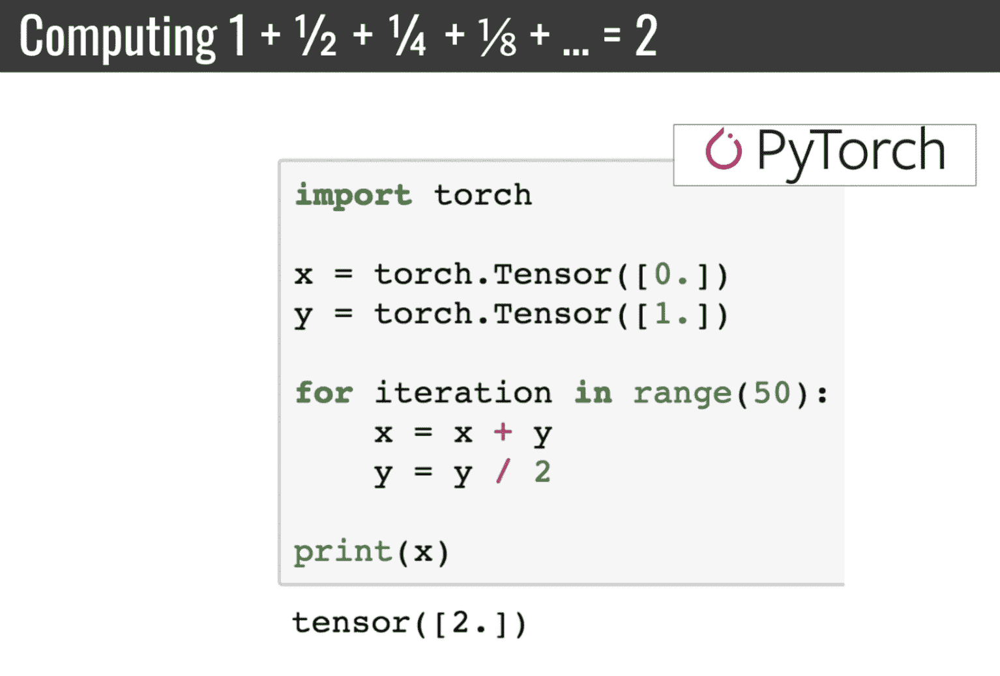

# 使用 PyTorch 入门深度学习

**深度学习**（**DL**）已经彻底改变了一个又一个行业。安德鲁·吴曾在 Twitter 上著名地描述它如下：

*"人工智能是新的电力！"*

电力改变了无数行业；现在，**人工智能**（**AI**）也将如此。

AI 和 DL 被用作同义词，但两者之间存在实质性的区别。让我们揭开行业术语的神秘面纱，这样作为从业者的你就能够区分信号和噪音。

在本章中，我们将涵盖 AI 的以下不同部分：

+   探索人工智能

+   在现实世界中的机器学习

+   深度学习的应用

+   深度学习框架

+   设置 PyTorch 1.x

# 探索人工智能

每天都有无数篇讨论 AI 的文章发表。过去两年这一趋势有所增加。网络上有许多关于 AI 的定义，我最喜欢的是*智能任务的自动化，通常由人类执行*。

# AI 的历史

自从你拿起这本书，你可能已经对 AI 的最近热潮有所了解。但一切都始于约翰·麦卡锡，当时是达特茅斯学院的年轻助理教授，他在 1995 年创造了术语*人工智能*，并将其定义为涉及智能机器科学和工程的领域。这掀起了 AI 的第一波浪潮，主要由符号推理驱动；其成果令人惊叹不已。在此期间开发的 AI 能够阅读和解决高中代数问题[STUDENT]、证明几何定理[SAINT]以及学习英语语言[SHRDLU]。符号推理是复杂规则嵌套在 if-then 语句中的使用。

然而，在这个时代最有前途的工作是感知器，由 Frank Rosenblatt 于 1958 年引入。感知器与后来发现的智能优化技术结合，为我们今天所知的深度学习奠定了基础。

AI 并非一帆风顺，由于初期发现过度宣称以及缺乏数据和计算能力，领域内的资金显著减少。然而，**机器学习**（**ML**）在九十年代初的突出表现扭转了这一趋势，并在该领域引发了极大兴趣。首先，我们需要了解 ML 的范式及其与 DL 的关系。

# 在现实世界中的机器学习

ML 是 AI 的一个子领域，利用算法和统计技术执行任务，无需任何明确的指令，而是依赖于数据中的统计模式。

要构建成功的机器学习模型，我们需要为 ML 算法提供标记数据。这种方法的成功在很大程度上依赖于可用的数据和计算能力，以便能够使用大量数据。

# 那么，为什么要用 DL？

大多数 ML 算法在结构化数据上表现良好，比如销售预测、推荐系统和营销个性化。对于任何 ML 算法来说，特征工程都是一个重要因素，数据科学家需要花费大量时间探索可能对 ML 算法有高预测力的特征。在某些领域，如计算机视觉和**自然语言处理**（**NLP**），特征工程具有挑战性，因为对于一个任务重要的特征可能对其他任务效果不佳。这就是 DL 的优势所在——算法本身在非线性空间中工程化特征，使其对特定任务至关重要。

当数据稀缺时，传统的 ML 算法仍然优于 DL 方法，但随着数据增加，传统机器学习算法的性能往往会趋于平稳，而深度学习算法则往往会显著优于其他学习策略。

以下图示展示了 DL 与 ML 和 AI 的关系：


总结一下，DL 是机器学习的一个子领域；特征工程是算法非线性地探索其空间的地方。

# 深度学习的应用

DL 是 21 世纪最重要创新的中心，从检测肿瘤的误差率低于放射科医生到自动驾驶汽车。让我们快速看一些 DL 应用。

# 文字自动翻译图像

2015 年谷歌的一篇博客详细介绍了谷歌团队如何从图像中翻译文本。以下图片展示了相关步骤：


首先，DL 算法用于执行**光学字符识别**（**OCR**）并识别图像中的文本。随后，另一个 DL 算法用于将文本从源语言翻译到选择的语言。我们今天看到的机器翻译的改进归因于从传统方法转向 DL。

# 自动驾驶车辆中的目标检测

特斯拉在 2019 年向投资者深入介绍了他们的自动驾驶系统，提到了他们如何使用深度神经网络从车辆摄像头中检测物体。该算法的输出被特斯拉开发的专有自动驾驶策略所使用。


前面的图片是一个目标检测深度学习网络的输出。它从视觉图像中捕获的语义信息对于自动驾驶任务至关重要。

# 深度学习框架

以前编写深度学习算法的代码非常困难，因为编写学习步骤的代码（涉及复杂导数链的链接）非常容易出错且冗长。深度学习框架使用巧妙的启发式算法自动计算这些复杂导数。选择这种启发式显著改变了这些框架的工作方式。以下图表显示了当前的深度学习框架生态系统：


TensorFlow 是最流行的深度学习框架，但 PyTorch 的简洁和实用性使得深度学习研究对许多人更加可接近。让我们看看为什么使用 PyTorch 可以显著加速我们的深度学习研究和开发时间。

# 为什么选择 PyTorch？

TensorFlow 使用**定义然后运行**的范式来计算复杂的链式导数，而 PyTorch 则使用更聪明的**定义即运行**范式。让我们通过查看下面的图像深入探讨这个问题，我们将计算系列*1 + 1 / 2 + 1 / 4 + 1 / 8 ...*的总和，结果应该是 2：



我们可以立即看到，在 PyTorch 中编写操作的代码是多么简洁和简单。在更复杂的场景中，这种差异更加显著。

作为特斯拉人工智能部门的负责人和当前计算机视觉领域最重要的思想领袖之一，Andrej Karpathy 发推文说：“我现在已经使用 PyTorch 几个月了，感觉从未如此之好。我更有精力了。我的皮肤更清爽了。我的视力也有所改善。” PyTorch 绝对使得编写深度学习代码的人们生活更加美好。

这种**定义即运行**的范式除了创建更清晰和简单的代码之外还有许多其他优点。调试也变得极其容易，你当前用于调试 Python 代码的所有工具也同样适用于 PyTorch。这是一个重大优势，因为随着网络变得越来越复杂，轻松调试您的网络将是救命稻草。

# PyTorch v1.x 的新功能有哪些？

PyTorch 1.x 在其灵活性上有所扩展，并试图将研究和生产能力统一到一个框架中。Caffe2，一个生产级深度学习框架，已集成到 PyTorch 中，使我们能够将 PyTorch 模型部署到移动操作系统和高性能 C++服务中。PyTorch v1.0 还原生支持将模型导出为 ONNX 格式，这使得 PyTorch 模型可以导入其他深度学习框架。对于 PyTorch 开发者来说，现在真是令人兴奋的时刻！

# CPU 与 GPU

CPU 具有较少但更强大的计算核心，而 GPU 具有大量的性能较低的核心。CPU 更适合顺序任务，而 GPU 适合具有显著并行性的任务。总之，CPU 可以执行大型的顺序指令，但在并行执行少量指令方面不如 GPU，后者可以并行执行数百个小指令：


在使用 DL 时，我们将执行大量线性代数操作，这些操作更适合于 GPU，并且可以显著提升神经网络训练所需的时间。

# 什么是 CUDA？

CUDA 是由 NVIDIA 开发的框架，允许我们在图形处理单元（GPU）上进行通用计算。它是用 C++编写的广泛使用的框架，允许我们编写在 GPU 上运行的通用程序。几乎所有深度学习框架都利用 CUDA 在 GPU 上执行指令。

# 我们应该使用哪些 GPU？

由于大多数深度学习框架，包括 PyTorch，使用 NVIDIA 的 CUDA 框架，强烈建议您购买和使用 NVIDIA GPU 进行深度学习。让我们快速比较几个 NVIDIA GPU 型号：


# 如果没有 GPU，你该怎么办？

有很多云服务，如 Azure、AWS 和 GCP，提供预装有 GPU 和所有必要深度学习软件的实例。FloydHub 是在云中运行深度学习模型的好工具。然而，您绝对应该了解的最重要的工具是 Google 的 Colaboratory，它提供高性能的 GPU 免费供您运行深度学习模型。

# 设置 PyTorch v1.x

在本书中，我们将使用 Anaconda Distribution 进行 Python 和 PyTorch 1.x 开发。您可以通过访问官方 PyTorch 网站（[`pytorch.org/get-started/locally/`](https://pytorch.org/get-started/locally/)）根据您当前的配置执行相关命令来跟随代码。

# 安装 PyTorch

PyTorch 作为 Python 包可用，您可以使用`pip`或`conda`构建它。或者，您可以从源代码构建。本书推荐使用 Anaconda Python 3 发行版。要安装 Anaconda，请参考 Anaconda 官方文档 [`conda.io/docs/user-guide/install/index.html`](https://conda.io/docs/user-guide/install/index.html)。本书的所有示例将作为 Jupyter Notebooks 提供在该书的 GitHub 存储库中。我强烈建议您使用 Jupyter Notebook，因为它允许您进行交互式实验。如果您已经安装了 Anaconda Python，则可以继续执行以下 PyTorch 安装说明。

对于基于 GPU 的安装和 Cuda 8，请使用以下命令：

```py
conda install pytorch torchvision cuda80 -c soumith
```

对于基于 GPU 的安装和 Cuda 7.5，请使用以下命令：

```py
conda install pytorch torchvision -c soumith
```

对于非基于 GPU 的安装，请使用以下命令：

```py
conda install pytorch torchvision -c soumith
```

在撰写本文时，PyTorch 不支持 Windows 机器，因此您可以尝试虚拟机（VM）或 Docker 镜像。

# 总结

在这一章中，我们学习了人工智能的历史，为什么使用深度学习，深度学习生态系统中的多个框架，PyTorch 为何是一个重要工具，为何我们在深度学习中使用 GPU，并且如何设置 PyTorch v1.0。

在下一章中，我们将深入研究神经网络的构建模块，并学习如何编写 PyTorch 代码来进行训练。
