# 神经网络的基本构建模块

理解神经网络的基本构建模块，如张量、张量操作和梯度下降，对于构建复杂的神经网络至关重要。在本章中，我们将对神经网络进行一般性概述，同时深入探讨 PyTorch API 的基础。神经网络的原始想法受到人脑中的生物神经元的启发，但在撰写本文时，二者之间的相似性仅仅是表面的，对这两个系统的任何比较可能导致对其中任何一个系统的错误假设。因此，我们不会深究这两个系统之间的相似之处，而是直接深入探讨用于 AI 中的神经网络的解剖学。

在本章中，我们将涵盖以下主题：

+   什么是神经网络？

+   在 PyTorch 中构建神经网络

+   理解 PyTorch 张量

+   理解张量操作

# 什么是神经网络？

简而言之，神经网络是一种学习输入变量与其关联目标变量之间关系的算法。例如，如果您有一个数据集，其中包含学生的 GPA、GRE 分数、大学排名以及学生的录取状态，我们可以使用神经网络来预测学生在给定其 GPA、GRE 分数和大学排名的情况下的录取状态（目标变量）：

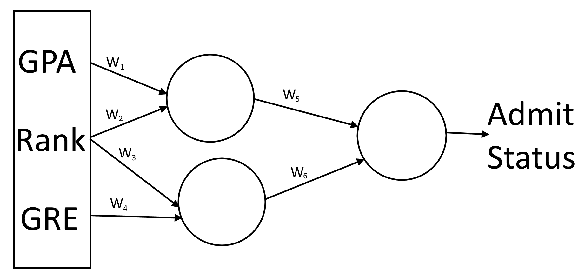

在前述图中，每个箭头代表一个权重。这些权重是从训练数据的实例中学习到的，{ ( (x1, y1), (x2, y2),..., (xm, ym) ) }，以便从操作中创建的复合特征能够预测学生的录取状态。

例如，网络可以学习 GPA/GRE 在院校排名中的重要性，如下图所示：

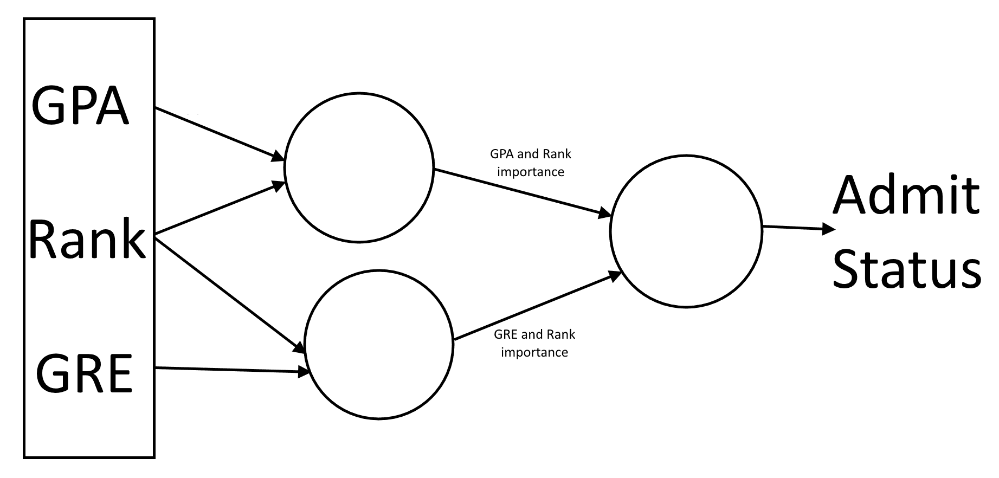

# 理解神经网络的结构

神经网络中的操作由两个基础计算构建。一个是权重向量与其对应的输入变量向量之间的点积，另一个是将产品转换为非线性空间的函数。我们将在下一章节学习几种这些函数的类型。

让我们进一步分解：第一个点积学习到一个混合概念，因为它创建了依赖于每个输入变量重要性的输入变量的混合。将这些重要特征传递到非线性函数中允许我们构建比仅使用传统线性组合更强大的输出：

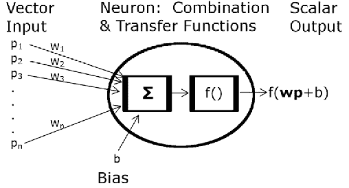

通过这些操作作为构建模块，我们可以构建健壮的神经网络。让我们来详细分析之前的神经网络示例；神经网络学习关于特征的信息，这些特征反过来是目标变量的最佳预测因子。因此，神经网络的每一层都学习到可以帮助神经网络更好地预测目标变量的特征：

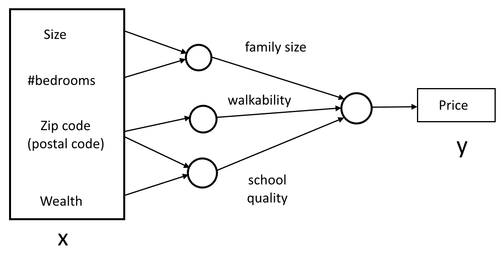

在前面的图表中，我们可以看到如何使用神经网络来预测房屋的价格。

# 在 PyTorch 中构建神经网络

让我们从在 PyTorch 中构建一个神经网络开始，它将帮助我们预测大学生的录取状态。在 PyTorch 中有两种构建神经网络的方式。首先，我们可以使用更简单的`torch.nn.Sequential`类，它允许我们将我们期望的神经网络操作序列作为参数传递给实例化我们的网络。

另一种方式，这是一种更复杂、更强大但优雅的方法，是将我们的神经网络定义为从`torch.nn.Module`类继承的类：

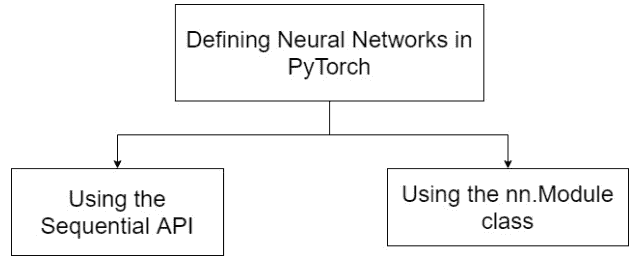

我们将利用这两种模式来构建我们的神经网络，这两种模式都是由 PyTorch API 定义的。

# PyTorch 顺序神经网络

神经网络中所有常用的操作都在`torch.nn`模块中可用。因此，我们需要从引入所需模块开始：

```py
import torch
import torch.nn as nn
```

现在，让我们看看如何使用`torch.nn.Sequential`类构建神经网络。我们使用在`torch.nn`模块中定义的操作，并按顺序将它们作为参数传递给`torch.nn.Sequential`类，以实例化我们的神经网络。在我们导入操作之后，我们的神经网络代码应该如下所示：

```py
My_neuralnet = nn.Sequential(operationOne,operationTwo…)
```

在构建神经网络时最常用的操作是`nn.Linear()`操作。它接受两个参数：`in_features`和`out_features`。`in_features`参数是输入的大小。在我们的情况下，我们有三个输入特征：GPA、GRE 和大学排名。`out_features`参数是输出的大小，对于我们来说是两个，因为我们想要从输入中学习两个特征，以帮助我们预测学生的录取状态。本质上，`nn.Linear(in_features, out_features)`操作接受输入并创建权重向量以执行点积。

在我们的情况下，`nn.Linear(in_features = 3, out_features = 2)`会创建两个向量：[w11, w12, w13] 和 [w21, w22, w23]。当输入 [xGRE, xGPA, xrank] 被传递到神经网络时，我们将创建一个包含两个输出的向量 [h1, h2]，其结果为 [w11 . xGRE +  w12 . xGPA + w13 . xrank ,  w21 . xGRE + w22 . xGPA + w23 . xrank]。

当你想要继续向你的神经网络中添加更多层时，这种模式会继续下游。下图显示了被转换为`nn.Linear()`操作后的神经网络结构：

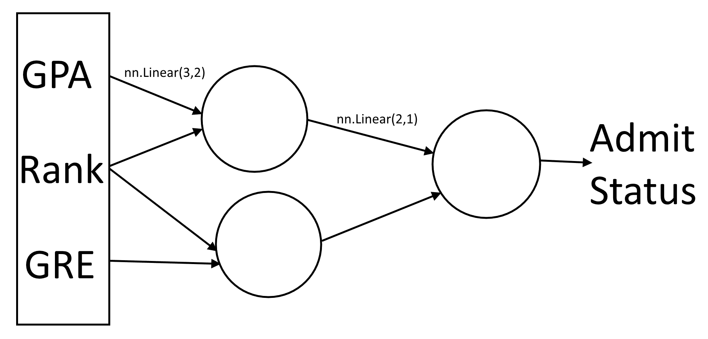

很好！但是添加更多的线性操作并不能充分利用神经网络的能力。我们还必须使用几种非线性函数之一将这些输出转换为非线性空间。这些函数的类型以及每个函数的优点和缺点将在下一章节中更详细地描述。现在，让我们使用其中一种最常用的非线性函数之一，即 **修正线性单元**，也称为 **ReLU**。PyTorch 通过调用 `nn.ReLU()` 提供了一个内置的 ReLU 操作符。以下图展示了非线性函数如何分类或解决线性函数失败的学习问题：

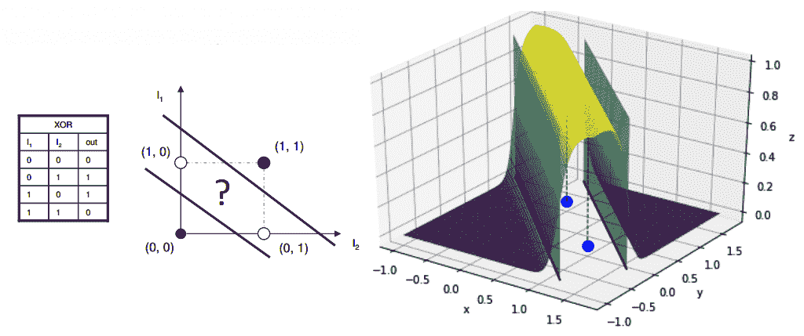

最后，为了获得我们的预测结果，我们需要将输出压缩到 0 到 1 之间。这些状态分别指非录取和录取。Sigmoid 函数，如下图所示，是将连续量转换为介于 0 和 1 之间的值最常用的函数。在 PyTorch 中，我们只需调用 `nn.Sigmoid()` 操作：

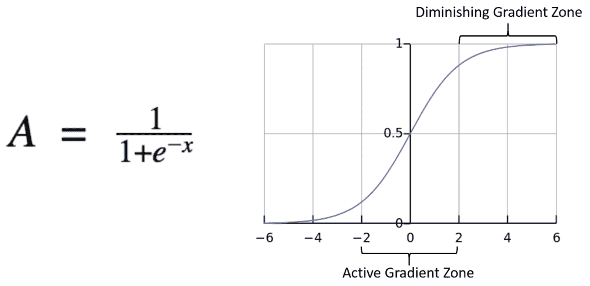

现在，让我们在 PyTorch 中将我们的神经网络代码整合起来，以便获得一个结构如下图所示的网络：


执行这个操作的代码如下：

```py
import torch
import torch.nn as nn
my_neuralnet = nn.Sequential(nn.Linear(3,2),
  nn.ReLU(),
  nn.Linear(2, 1),
  nn.Sigmoid())
```

就是这样！在 PyTorch 中组合一个神经网络就是这么简单。`my_neuralnet` Python 对象包含了我们的神经网络。稍后我们将看看如何使用它。现在，让我们看看如何使用基于定义从 `nn.Module` 类继承的类的更高级 API 来构建神经网络。

# 使用 `nn.Module` 构建 PyTorch 神经网络

使用 `nn.Module` 类定义神经网络也是简单而优雅的。它通过定义一个将继承自 `nn.Module` 类并重写两个方法的类开始：`__init__()` 和 `forward()` 方法。`__init__()` 方法应包含我们期望的神经网络层中的操作。另一方面，`forward()` 方法应描述数据通过这些期望的层操作的流动。因此，代码的结构应类似于以下内容：

```py
class MyNeuralNet(nn.Module):
# define the __init__() method
def __init__(self, other_features_for_initialization):
# Initialize Operations for Layers
# define the forward() method
def forward(self, x):
# Describe the flow of data through the layers
```

让我们更详细地了解这种模式。`class` 关键字帮助定义一个 Python 类，后面跟着你想要为你的类使用的任意名称。在这种情况下，它是 `MyNeuralNet`。然后，括号中传递的参数是我们当前定义的类将继承的类。因此，我们始终从 `MyNeuralNet(nn.Module)` 类开始。

`self` 是传递给类中定义的每个方法的任意第一个参数。它表示类的实例，并可用于访问类中定义的属性和方法。

`__init__()` 方法是 Python 类中的一个保留方法。它也被称为构造函数。每当实例化类的对象时，`__init__()` 方法中包装的代码将被运行。这帮助我们一旦实例化了我们的神经网络类的对象，就设置好所有的神经网络操作。

需要注意的一点是，一旦我们在神经网络类内部定义了 `__init__()` 方法，我们就无法访问 `nn.Module` 类的 `__init__()` 方法中定义的所有代码了。幸运的是，Python 的 `super()` 函数可以帮助我们运行 `nn.Module` 类中的 `__init__()` 方法中的代码。我们只需要在新的 `__init__()` 方法的第一行中使用 `super()` 函数。使用 `super()` 函数来访问 `__init__()` 方法非常简单；我们只需使用 `super(NameOfClass, self).__init__()`。在我们的情况下，这将是 `super(MyNeuralNet, self).__init__()`。

现在我们知道如何编写我们的 `__init__()` 方法的第一行代码，让我们看看我们需要在 `__init__()` 方法的定义中包含哪些其他代码。我们必须将 PyTorch 中定义的操作存储为 `self` 的属性。在我们的情况下，我们有两个 `nn.Linear` 操作：一个从输入变量到神经网络层中的两个节点，另一个从这些节点到输出节点。因此，我们的 `__init__()` 方法如下所示：

```py
class MyNeuralNet(nn.Module):
def __init__(self):
    super(MyNeuralNet, self).__init__()
   self.operationOne = nn.Linear(3, 2)
    self.operationTwo = nn.Linear(2, 1)
```

在上述代码中，我们将所需神经网络的操作存储为 `self` 的属性。您应该习惯将 PyTorch 中的操作存储为 `self` 中的属性。我们用来执行此操作的模式如下：

```py
 self.desiredOperation = PyTorchOperation
```

然而，在上述代码中存在一个明显的错误：`nn.Linear` 的输入是硬编码的，因此如果输入大小发生变化，我们就必须重新编写我们的神经网络类。因此，在实例化对象时，使用变量名而不是硬编码是一个很好的做法，并将它们作为参数传递。代码如下所示：

```py
def __init__(self, input_size, n_nodes, output_size):
super(MyNerualNet, self).__init__()
self.operationOne = nn.Linear(input_size, n_nodes)
self.operationTwo = nn.Linear(n_nodes, output_size)
```

现在，让我们深入了解 `forward()` 方法的实现。此方法接受两个参数：`self` 参数和任意的 `x` 参数，这是我们实际数据的占位符。

我们已经看过 `nn.ReLU` 操作，但 PyTorch 中还有更方便的函数接口，允许我们更好地描述数据流。需要注意的是，这些函数等效物不能在 Sequential API 中使用。我们的第一项工作是将数据传递给由 `x` 参数表示的神经网络中的第一个操作。在 PyTorch 中，将数据传递给我们网络中的第一个操作就像简单地使用 `self.operationOne(x)` 一样。

然后，使用 PyTorch 的功能接口，我们可以通过`torch.nn.functional.relu.self.operationOne(x)`将此操作的输出传递给非线性 ReLU 函数。让我们把一切都放在一起，并定义`forward()`方法。重要的是要记住最终输出必须伴随着`return`关键字：

```py
def forward(self, x):
x = self.operationOne(x)
x = nn.functional.relu(x)
x = self.operationTwo(x)
output = nn.functional.sigmoid(x)
return output
```

现在，让我们进行精加工和编译，以便使用基于类的 API 在 PyTorch 中定义我们的神经网络。以下代码展示了您在开源社区中找到的大部分 PyTorch 代码：

```py
import torch
import torch.nn as nn
import torch.nn.functional as F
class MyNeuralNet(nn.Module):
def __init__(self, input_size, n_nodes, output_size):
    super(MyNeuralNet, self).__init__()
    self.operationOne = nn.Linear(input_size, n_nodes)
    self.operationTwo = nn.Linear(n_nodes, output_size)
def forward(self, x):
    x = F.relu(self.operationOne(x)
   x = self.operationTwo(x)
    x = F.sigmoid(x)
return x
```

最后，为了访问我们的神经网络，我们必须实例化`MyNeuralNet`类的对象。我们可以这样做：

```py
my_network = MyNeuralNet(input_size = 3, n_nodes = 2, output_size = 1)
```

现在，我们可以通过`my_network` Python 变量访问我们想要的神经网络。我们已经构建了我们的神经网络，那么接下来呢？它现在能预测学生的录取状态吗？不行。但我们会到达那里。在此之前，我们需要了解如何在 PyTorch 中表示数据，以便我们的神经网络能够理解。这就是 PyTorch 张量发挥作用的地方。

# 理解 PyTorch 张量

PyTorch 张量是驱动 PyTorch 计算的引擎。如果您之前有使用 Numpy 的经验，理解 PyTorch 张量将会轻而易举。大多数您在 Numpy 数组中学到的模式可以转换为 PyTorch 张量。

张量是数据容器，是向量和矩阵的广义表示。向量是一阶张量，因为它只有一个轴，看起来像[x1, x2, x3..]。矩阵是二阶张量，它有两个轴，看起来像[[x11, x12, x13..], [x21, x22, x23..]]。另一方面，标量是零阶张量，只包含单个元素，如 x1。这在下图中显示：

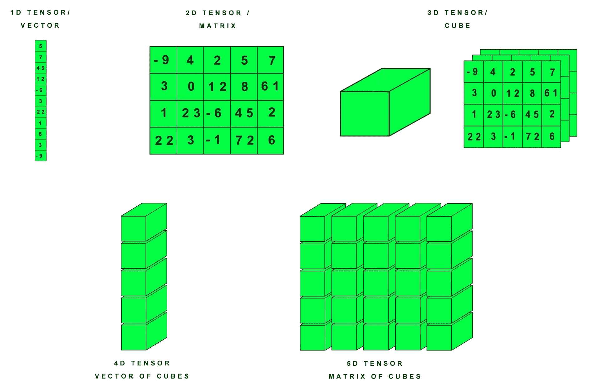

我们可以立即观察到，我们的数据集，其中包含 GPA、GRE、排名和录取状态列，以及各种观察行，可以表示为二阶张量：

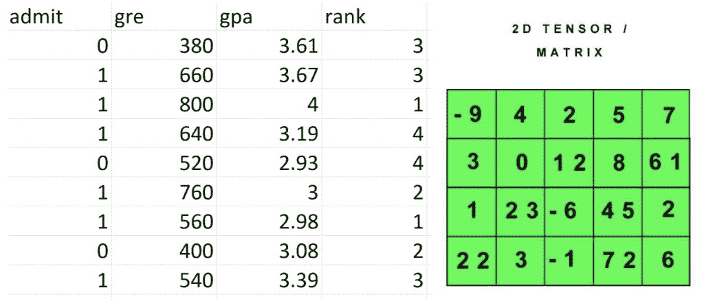

让我们快速看一下如何从 Python 列表创建 PyTorch 张量：

```py
import torch
first_order_tensor = torch.tensor([1, 2, 3])
print(first_order_tensor)
#tensor([1, 2, 3])
```

访问该容器中的元素也很简单，索引从 0 开始，以 n - 1 结束，其中 n 是容器中的元素数目：

```py
print(first_order_tensor[0])
#tensor(1)
```

`tensor(1)`，我们之前打印过的，是一个零阶张量。访问多个元素类似于在 NumPy 和 Python 中的方式，其中 0:2 提取从索引 0 开始的元素，但不包括索引 2 处的元素：

```py
print(first_order_tensor[0:2])
#tensor([1, 2])
```

如果你想访问从特定索引开始的张量的所有元素，你可以使用 k:，其中 k 是你想提取的第一个元素的索引：

```py
print(first_order_tensor[1:])
#tensor([2, 3])
```

现在，让我们了解一下二阶张量的工作原理：

```py
second_order_tensor = torch.tensor([ [ 11, 22, 33 ],
                                     [ 21, 22, 23 ]
                                   ])

print(second_order_tensor)

#tensor([[11, 12, 13],
         [21, 22, 23]])
```

从一个二阶张量中访问元素稍微复杂一些。现在，让我们从之前创建的张量中访问元素 12。重要的是将二阶张量视为由两个一阶张量构成的张量，例如，[[一阶张量], [一阶张量]]。元素 12 位于第一个一阶张量内部，并且在该张量内部位于第二个位置，即索引 1。因此，我们可以使用[0, 1]来访问元素 22，其中 0 描述了一阶张量的索引，1 描述了一阶张量内部元素的索引：

```py
print(second_order_tensor[0, 1])
#tensor(12)
```

现在，让我们做一个小的思维练习：如何从我们创建的张量中访问第 23 个元素？是的！你是对的！我们可以使用[1, 2]来访问它。

对于更高维度的张量，这个模式同样适用。需要注意的是，你需要使用的索引位置数目等于张量的阶数。让我们来做一个四阶张量的练习！

在我们开始之前，让我们想象一个四阶张量；它必须由三阶张量组成。因此，它看起来应该类似于[[张量的三阶]，[张量的三阶]，[张量的三阶]…]。每个这些三阶张量必须依次由二阶张量组成，看起来像[[张量的二阶]，[张量的二阶]，[张量的二阶]，…]，依此类推。

在这里，你会找到一个四阶张量。为了便于可视化，它已经得到了合理的间隔。在这个练习中，我们需要访问元素 1112, 1221, 2122 和 2221：

```py
fourth_order_tensor = torch.tensor(
[
    [
        [
            [1111, 1112],
            [1121, 1122]
        ],
        [
            [1211, 1212],
            [1221, 1222]
        ]
    ],
    [
        [
            [2111, 2112],
            [2121, 2122]
        ],
        [
            [2211, 2212],
            [2221, 2222]
        ]  
    ]
])
```

在这里，张量由两个三阶张量组成，每个张量都有两个二阶张量，而每个二阶张量又包含两个一阶张量。让我们看看如何访问元素 2122；其余的留给你在空闲时间里完成。元素 2122 包含在我们原始张量的第二个三阶张量中[[张量的三阶], [*张量的三阶]]。所以，第一个索引位置是 1。接下来在三阶张量中，我们想要的元素在第一个二阶张量内[[*二阶张量], [二阶张量]]。因此，第二个索引位置是 0。在二阶张量内部，我们想要的元素在第二个一阶张量中[[张量的一阶], [*张量的一阶]]，所以索引位置是 1。最后，在一阶张量中，我们想要的元素是第二个元素[2121, 2122]，索引位置是 1。当我们把这些放在一起时，我们可以使用`fourth_order_tensor[1, 0, 1, 1]`来索引元素 2122。

# 理解张量的形状和重塑张量

现在我们知道如何从张量中访问元素，理解张量形状就很容易了。所有 PyTorch 张量都有一个 `size()` 方法，描述了张量在每个轴上的尺寸。零阶张量，即标量，没有任何轴，因此没有可量化的尺寸。让我们看一下 PyTorch 中几个张量的尺寸：

```py
my_tensor = torch.tensor([1, 2, 3, 4, 5])
print(my_tensor.size())
# torch.Size([5])
```

由于张量沿着第一个轴有五个元素，张量的尺寸是 [5]：

```py
my_tensor = torch.tensor([[11, 12, 13], [21, 22, 23]])
print(my_tensor.size())
# torch.Size([2, 3])
```

由于二阶张量包含两个一阶张量，第一个轴的尺寸是 2，每个一阶张量包含 3 个标量元素，第二个轴的尺寸是 3。因此，张量的尺寸是 [2, 3]。

这种模式可以扩展到更高阶的张量。让我们完成一个关于在前一小节中创建的 `fourth_order_tensor` 的快速练习。有两个三阶张量，每个三阶张量有两个一阶张量，这些一阶张量又包含两个一阶张量，每个一阶张量包含两个标量元素。因此，张量的尺寸是 [2, 2, 2, 2]：

```py
print(fourth_order_tensor.size())
# torch.Size([2, 2, 2, 2])
```

现在我们了解了张量的尺寸，我们可以使用 `torch.rand()` 快速生成具有所需形状的随机元素张量。在本书的后续部分中，我们还会看到其他生成张量的方法。在你的张量中创建的元素可能与这里看到的不同：

```py
random_tensor = torch.rand([4, 2])
print(random_tensor)
#tensor([[0.9449, 0.6247],
        [0.1689, 0.4221],
        [0.9565, 0.0504],
        [0.5897, 0.9584]])
```

有时你可能希望重塑张量，即将张量中的元素移动到不同的轴上。我们使用 `.view()` 方法来重塑张量。让我们深入一个快速的例子，展示如何在 PyTorch 中完成这个操作：

```py
random_tensor.view([2, 4])
#tensor([[0.9449, 0.6247, 0.1689, 0.4221],
         [0.9565, 0.0504, 0.5897, 0.9584]])
```

需要注意的是，这不是一个原地操作，并且原始的 `random_tensor` 仍然是尺寸为 [4, 2] 的。你需要将返回的值赋值给变量以存储结果。有时，当你有很多轴时，可以使用 -1 让 PyTorch 计算特定轴的尺寸：

```py
random_tensor = torch.rand([4, 2, 4])
random_tensor.view([2, 4, -1])
#tensor([[[0.1751, 0.2434, 0.9390, 0.4585],
          [0.5018, 0.5252, 0.8161, 0.9712],
          [0.7042, 0.4778, 0.2127, 0.3466],
          [0.6339, 0.4634, 0.8473, 0.8062]],
        [[0.3456, 0.0725, 0.0054, 0.4665],
         [0.9140, 0.2361, 0.4009, 0.4276],
         [0.3073, 0.9668, 0.0215, 0.5560],
         [0.4939, 0.6692, 0.9476, 0.7543]]])

random_tensor.view([2, -1, 4])
#tensor([[[0.1751, 0.2434, 0.9390, 0.4585],
          [0.5018, 0.5252, 0.8161, 0.9712],
          [0.7042, 0.4778, 0.2127, 0.3466],
          [0.6339, 0.4634, 0.8473, 0.8062]],
        [[0.3456, 0.0725, 0.0054, 0.4665],
         [0.9140, 0.2361, 0.4009, 0.4276],
         [0.3073, 0.9668, 0.0215, 0.5560],
         [0.4939, 0.6692, 0.9476, 0.7543]]])
```

# 理解张量操作

到目前为止，我们已经看过了基本的张量属性，但是使它们如此特殊的是它们执行向量化操作的能力，这对于高效的神经网络非常重要。让我们快速看一下 PyTorch 中可用的一些张量操作。

加法、减法、乘法和除法操作是按元素执行的：

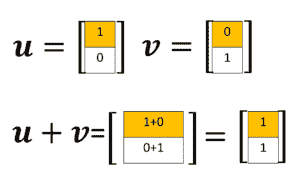

让我们快速看一下这些操作：

```py
x = torch.tensor([5, 3])
y = torch.tensor([3, 2])
torch.add(x, y)
# tensor([8, 5])
torch.sub(x, y)
# tensor([2, 1])
torch.mul(x, y)
# tensor([15,  6])
```

你还可以使用 +、-、* 和 / 运算符在 torch 张量上执行这些操作：

```py
x + y
# tensor([8, 5])
```

让我们快速看一下 torch 张量中的矩阵乘法，可以使用 `torch.matmul()` 或 `@` 运算符来执行：

```py
torch.matmul(x, y)
# tensor(21)
x @ y
# tensor(21)
```

有一个特定的原因，为什么我们还没有对两个张量执行除法操作。现在让我们来做这个操作：

```py
torch.div(x, y)
# tensor([1, 1])
```

什么？那怎么可能？5 / 3 应该约为 1.667，而 3 / 2 应该是 1.5。但为什么我们得到`tensor([1, 1])`作为结果？如果你猜到这是因为张量中存储的元素的数据类型，那你绝对是对的！

# 理解 PyTorch 中的张量类型

PyTorch 张量只能存储单一数据类型的元素。PyTorch 中还定义了需要特定数据类型的方法。因此，了解 PyTorch 张量可以存储的数据类型非常重要。根据 PyTorch 文档，以下是 PyTorch 张量可以存储的数据类型：

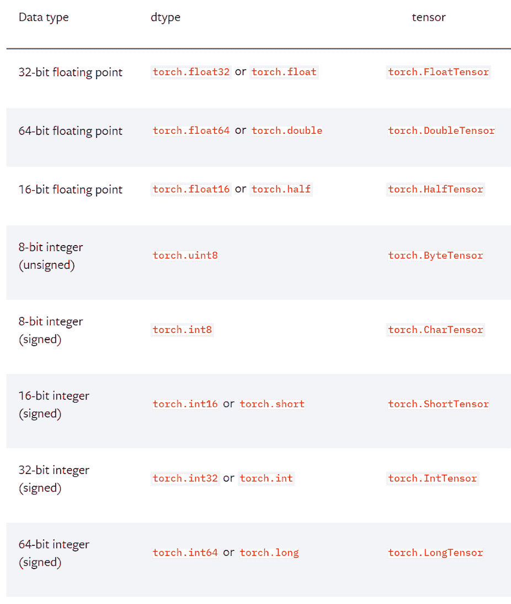

每个 PyTorch 张量都有一个`dtype`属性。让我们来看看之前创建的张量的`dtype`：

```py
x.dtype
# torch.int64
y.dtype
# torch.int64
```

在这里，我们可以看到我们创建的张量中存储的元素的数据类型是 int64。因此，元素之间执行的除法是整数除法！

通过在`torch.tensor()`中传递`dtype`参数，让我们重新创建具有 32 位浮点元素的 PyTorch 张量：

```py
x_float = torch.tensor([5, 3], dtype = torch.float32)
y_float = torch.tensor([3, 2], dtype = torch.float32)
print(x_float / y_float)
# tensor([1.6667, 1.5000])
```

你也可以使用`torch.FloatTensor()`或前述截图中`tensor`列下的其他名称，直接创建所需类型的张量。你也可以使用`.type()`方法将张量转换为其他数据类型：

```py
torch.FloatTensor([5, 3])
# tensor([5., 3.])
x.type(torch.DoubleTensor)
# tensor([5., 3.], dtype=torch.float64)
```

# 将我们的数据集作为 PyTorch 张量导入

现在，让我们将`admit_status.csv`数据集作为 PyTorch 张量导入，以便我们可以将其馈送到我们的神经网络中。为了导入我们的数据集，我们将使用 Python 中的 NumPy 库。我们将要处理的数据集如下图所示：

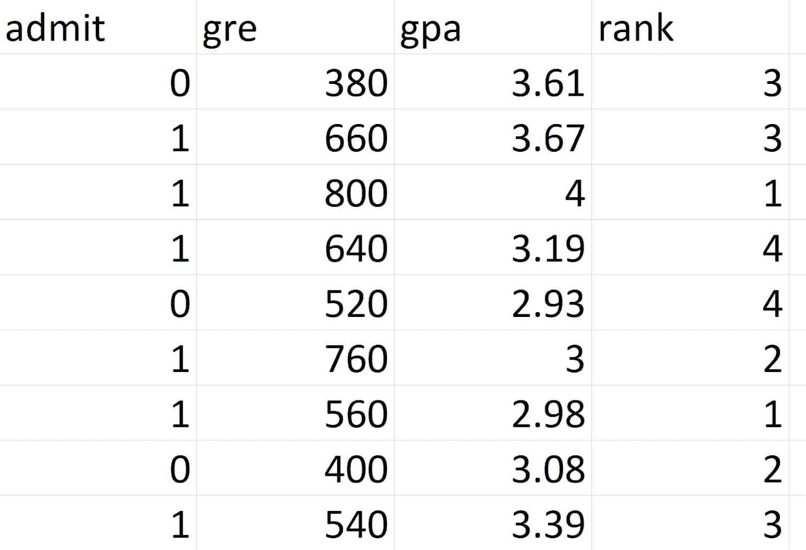

当我们导入数据集时，我们不想导入第一行，即列名。我们将使用 NumPy 库中的`np.genfromtext()`来将数据读取为一个 numpy 数组：

```py
import numpy as np
admit_data = np.genfromtxt('../datasets/admit_status.csv',
delimiter = ',', skip_header = 1)
            print(admit_data)
```

这将给我们以下输出：

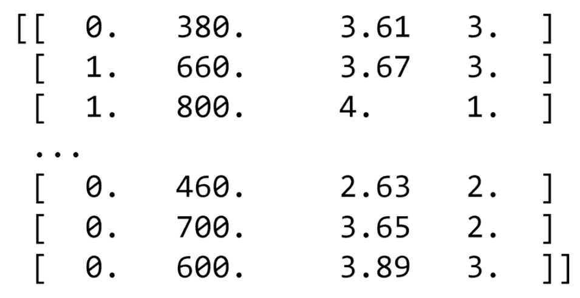

我们可以使用`torch.from_numpy()`直接将 numpy 数组导入为 PyTorch 张量：

```py
admit_tensor = torch.from_numpy(admit_data)
print(admit_tensor)
```

这将给我们以下输出：

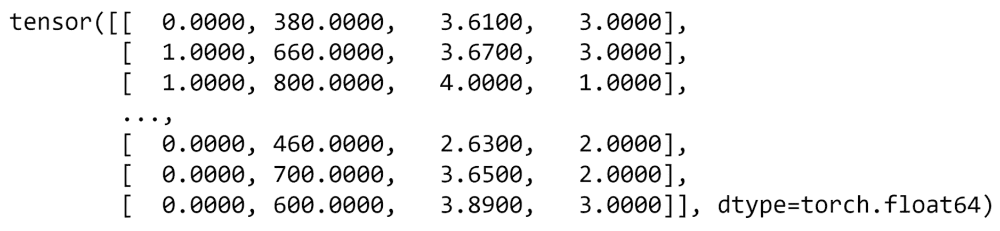

# 在 PyTorch 中训练神经网络

我们已经将数据作为 PyTorch 张量，也有了 PyTorch 神经网络。我们现在可以预测学生的录取状态了吗？不，还不行。首先，我们需要学习可以帮助我们预测录取状态的具体权重：

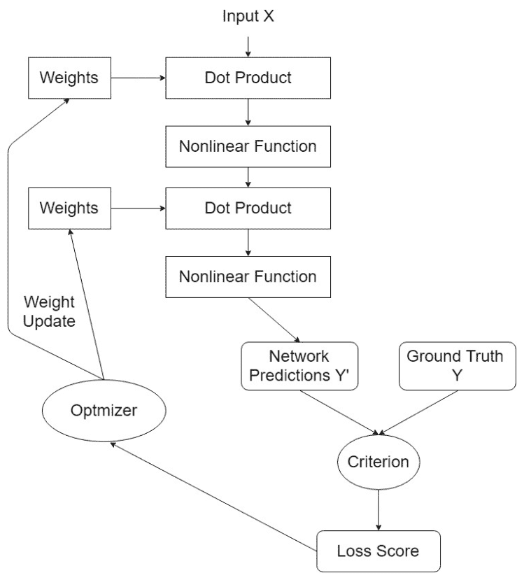

我们之前定义的神经网络首先随机生成权重。因此，如果我们直接将数据传递给神经网络，我们将得到毫无意义的预测结果。

在神经网络中两个在训练过程中起作用的重要组件是**Criterion**和**Optimizer**。Criterion 生成一个损失分数，该分数与神经网络的预测与真实目标值之间的差距成正比，即我们的情况下是录取状态。

优化器使用这个分数来调整神经网络中的权重，使网络的预测尽可能接近真实值。

优化器使用 Criterion 的损失分数来更新神经网络的权重的迭代过程被称为神经网络的训练阶段。现在，我们可以训练我们的神经网络。

在继续训练我们的神经网络之前，我们必须将数据集分割为输入 `x` 和目标 `y`：

```py
x_train = admit_tensor[:300, 1:]
y_train = admit_tensor[:300, 0]
x_test = admit_tensor[300:, 1:]
y_test = admit_tensor[300:, 0]
```

我们需要创建 Criterion 和 Optimizer 的实例，以便训练我们的神经网络。PyTorch 中内置了多个 Criterion，可以从 `torch.nn` 模块中访问。在这种情况下，我们将使用 `BCELoss()`，也被称为**二进制交叉熵损失**，用于二元分类：

```py
criterion = nn.BCELoss()
```

在 PyTorch 中，`torch.optim` 模块内置了几种优化器。在这里，我们将使用**SGD 优化器**，也被称为**随机梯度下降优化器**。该优化器接受神经网络的参数或权重作为参数，并可以通过在之前创建的神经网络实例上使用 `parameters()` 方法来访问：

```py
optimizer = torch.optim.SGD(my_network.parameters(), lr=0.01)
```

我们必须编写一个循环，迭代更新权重的过程。首先，我们需要传递数据以从神经网络中获取预测结果。这非常简单：我们只需将输入数据作为参数传递给神经网络实例，使用 `y_pred = my_neuralnet(x_train)`。然后，我们需要计算损失分数，通过将神经网络的预测结果和真实值传递给 Criterion 来得到 `loss_score = criterion(y_pred, y_train)`。

在继续更新神经网络的权重之前，清除累积的梯度非常重要，可以通过在优化器上使用 `zero_grad()` 方法来实现。然后，我们使用计算的 `loss_score` 上的 `backward()` 方法执行反向传播步骤。最后，使用优化器上的 `step()` 方法更新参数或权重。

所有之前的逻辑必须放在一个循环中，我们在训练过程中迭代，直到我们的网络学习到最佳参数。因此，让我们将所有内容整合成可运行的代码：

```py
for epoch in range(100):
 # Forward Propagation
 y_pred = my_network(x_train)

 # Compute and print loss
 loss_score = criterion(y_pred, y_train)
 print('epoch: ', epoch,' loss: ', loss.item())

 # Zero the gradients
 optimizer.zero_grad()

 # perform a backward pass (backpropagation)
 loss_score.backward()

 # Update the parameters
 optimizer.step()
```

大功告成！我们已经训练好了我们的神经网络，它已准备好进行预测。在下一章中，我们将深入探讨神经网络中使用的各种非线性函数，验证神经网络学到的内容，并深入探讨构建强大神经网络的理念。

# 摘要

在本章中，我们探讨了 PyTorch 提供的各种数据结构和操作。我们使用 PyTorch 的基本模块实现了几个组件。在数据准备阶段，我们创建了张量，这些张量将被我们的算法使用。我们的网络架构是一个模型，它将学习预测用户在我们的 Wondermovies 平台上平均花费的时间。我们使用损失函数来检查我们模型的标准，并使用`optimize`函数来调整模型的可学习参数，使其表现更好。

我们还看到了 PyTorch 如何通过抽象化几个复杂性，使我们能够更轻松地创建数据管道，而不需要我们并行化和增强数据。

在下一章中，我们将深入探讨神经网络和深度学习算法的工作原理。我们将探索各种内置的 PyTorch 模块，用于构建网络架构、损失函数和优化。我们还将学习如何在真实世界的数据集上使用它们。
