# 第四章：深入探讨神经网络

在本章中，我们将探索用于解决实际问题的深度学习架构的不同模块。在前一章中，我们使用 PyTorch 的低级操作来构建模块，如网络架构、损失函数和优化器。在本章中，我们将探讨神经网络的重要组件以及 PyTorch 通过提供大量高级功能来抽象掉许多复杂性。在本章的最后，我们将构建解决实际问题的算法，如回归、二分类和多类分类。

在本章中，我们将讨论以下主题：

+   深入探讨神经网络的各种构建模块

+   非线性激活

+   PyTorch 非线性激活

+   使用深度学习进行图像分类

# 深入了解神经网络的构建模块

正如我们在前一章中学到的，训练深度学习算法需要以下步骤：

1.  构建数据管道

1.  构建网络架构

1.  使用损失函数评估架构

1.  使用优化算法优化网络架构权重

在前一章中，网络由使用 PyTorch 数值操作构建的简单线性模型组成。虽然使用数值操作构建一个虚拟问题的神经架构更容易，但是当我们尝试构建解决不同领域（如计算机视觉和**自然语言处理**（**NLP**））复杂问题所需的架构时，情况很快变得复杂起来。

大多数深度学习框架，如 PyTorch、TensorFlow 和 Apache MXNet，提供了抽象了许多复杂性的高级功能。这些高级功能在深度学习框架中被称为**层**。它们接受输入数据，应用类似于我们在前一章看到的转换，并输出数据。为了解决现实世界的问题，深度学习架构由 1 到 150 个或更多层组成。抽象化低级操作和训练深度学习算法看起来像以下的图示：

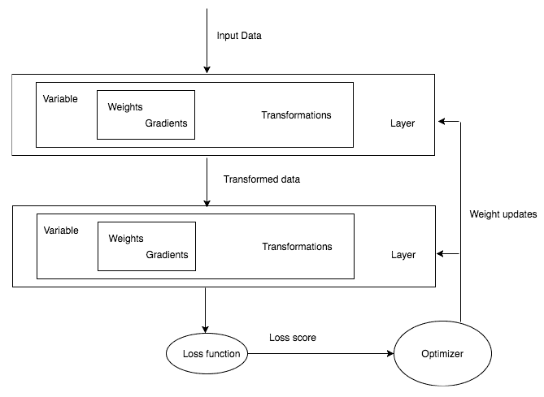

任何深度学习训练都涉及获取数据，构建架构（通常意味着组合一堆层），使用损失函数评估模型的准确性，然后通过优化网络权重来优化算法。在探讨解决一些实际问题之前，我们将了解 PyTorch 提供的用于构建层、损失函数和优化器的高级抽象。

# 层 - 神经网络的基本组件

在本章的其余部分，我们将遇到不同类型的层。首先，让我们试着理解最重要的层之一，线性层，它正是我们在上一章网络架构中所做的事情。线性层应用线性变换：

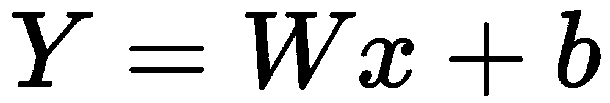

它之所以强大，是因为我们在上一章中编写的整个函数可以用一行代码来表示，如下所示：

```py
from torch.nn import Linear
linear_layer = Linear(in_features=5,out_features=3,bias=True)
```

在上述代码中，`linear_layer`函数将接受一个大小为 5 的张量，并在应用线性变换后输出一个大小为 3 的张量。让我们看一个如何做到这一点的简单示例：

```py
inp = Variable(torch.randn(1,5))
linear_layer(inp)
```

我们可以通过权重访问层的可训练参数：

```py
Linear_layer.weight
```

这将得到以下输出：

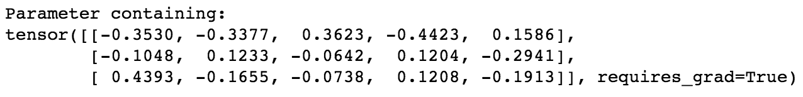

以同样的方式，我们可以使用`bias`属性访问层的可训练参数：

```py
linear_layer.bias
```

这将得到以下输出：

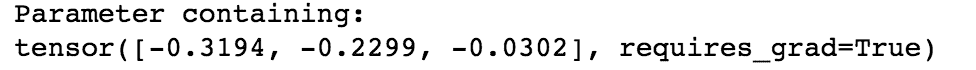

在不同框架中，线性层有不同的称呼，如**稠密**或**全连接**层。用于解决真实用例的深度学习架构通常包含多个层。在 PyTorch 中，我们可以通过将一个层的输出传递给另一个层来简单实现：

```py
linear_layer = Linear(5,3)
linear_layer_2 = Linear(3,2)
linear_layer_2(linear_layer(inp))
```

这将得到以下输出：

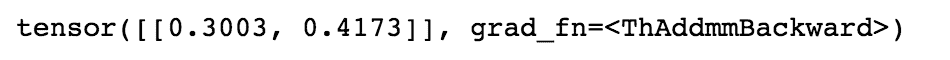

每一层都有其自己的可学习参数。使用多层的想法是，每一层将学习某种模式，后续层将在此基础上构建。但是仅将线性层堆叠在一起存在问题，因为它们无法学习超出简单线性层表示的任何新内容。让我们通过一个简单的例子来看看，为什么将多个线性层堆叠在一起是没有意义的。

假设我们有两个线性层，具有以下权重：

| **层** | **权重 1** |
| --- | --- |
| 层 1 | 3.0 |
| 层 2 | 2.0 |

具有两个不同层的上述架构可以简单地表示为具有不同层的单层。因此，仅仅堆叠多个线性层不会帮助我们的算法学到任何新内容。有时，这可能不太清晰，因此我们可以用以下数学公式来可视化架构：

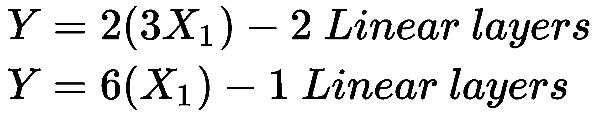

为了解决这个问题，我们有不同的非线性函数，可以帮助学习不同的关系，而不仅仅是线性关系。

在深度学习中有许多不同的非线性函数。PyTorch 将这些非线性功能提供为层，我们可以像使用线性层一样使用它们。

一些流行的非线性函数如下：

+   Sigmoid

+   Tanh

+   ReLU

+   Leaky ReLU

# 非线性激活函数

非线性激活函数是将输入进行数学转换并产生输出的函数。在实践中，我们会遇到几种非线性操作。我们将介绍一些流行的非线性激活函数。

# Sigmoid

Sigmoid 激活函数有一个简单的数学形式，如下所示：

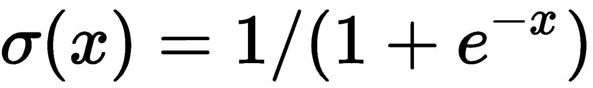

Sigmoid 函数直观地将实数取值并输出一个在 0 到 1 之间的数。对于较大的负数，它接近于 0；对于较大的正数，它接近于 1。以下图表示不同 sigmoid 函数的输出：

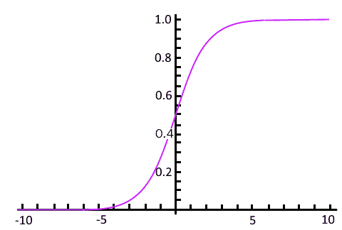

历史上，sigmoid 函数在不同架构中被广泛使用，但近年来，它已经不再流行，因为它有一个主要缺点。当 sigmoid 函数的输出接近 0 或 1 时，前面层的梯度接近于 0，因此前一层的可学习参数的梯度也接近于 0，权重很少被调整，导致死神经元。

# Tanh

Tanh 非线性函数将一个实数压扁到 -1 和 1 的范围内。当 tanh 输出接近 -1 和 1 的极端值时，也会面临梯度饱和的问题。但与 sigmoid 不同的是，tanh 的输出是以零为中心的：

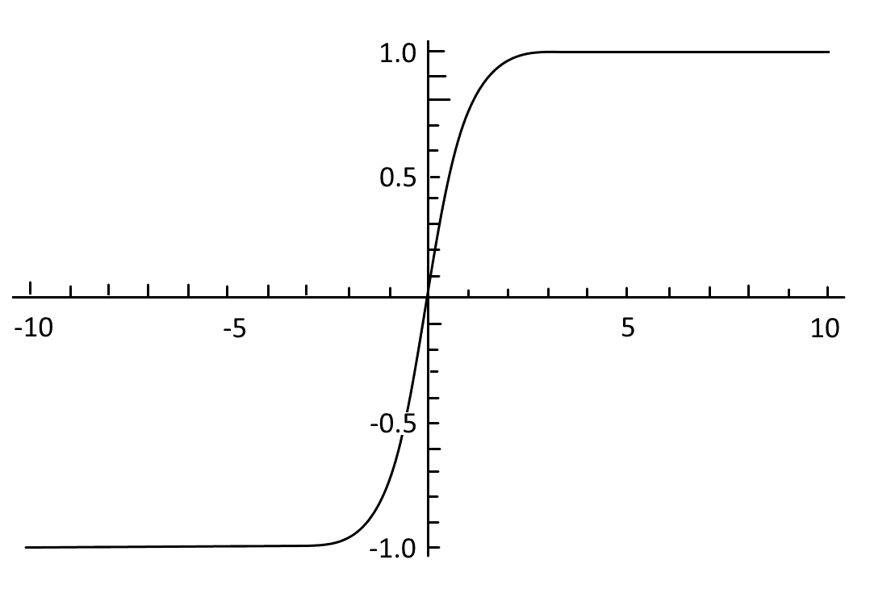

# ReLU

近年来，ReLU 变得越来越流行；我们几乎可以在任何现代架构中找到其使用或其变体的使用。它有一个简单的数学表达式：

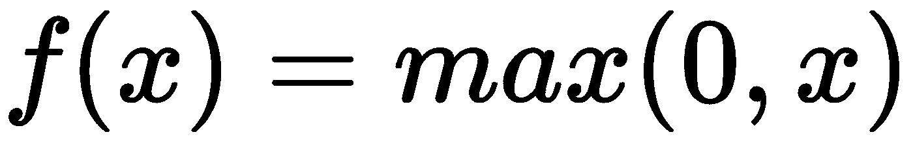

简单来说，ReLU 将任何负数输入压扁为 0，并保留正数不变。我们可以将 ReLU 函数可视化如下：

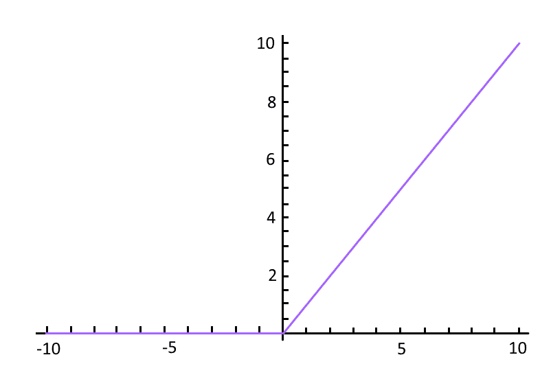

使用 ReLU 的一些优缺点如下：

+   它帮助优化器更快地找到正确的权重集。更具技术性地说，它加快了随机梯度下降的收敛速度。

+   它在计算上廉价，因为我们只是进行阈值处理，而不像 sigmoid 和 tanh 函数那样进行任何计算。

+   ReLU 有一个缺点：在反向传播过程中，当大梯度通过时，它经常变得不响应；这些被称为**死神经元**，可以通过仔细选择学习率来控制。我们将在讨论不同调整学习率方法时讨论如何选择学习率，在 第四章，《计算机视觉的深度学习》中。

# Leaky ReLU

Leaky ReLU 是解决“死亡问题”的一种尝试，而不是饱和到 0，而是饱和到一个非常小的数，例如 0.001。对于某些用例，此激活函数提供了比其他激活函数更好的性能，但不是一致的。

# PyTorch 非线性激活

PyTorch 已经为我们实现了大多数常见的非线性激活函数，并且可以像任何其他层一样使用。让我们快速看一下如何在 PyTorch 中使用 ReLU 函数的示例：

```py
example_data = Variable(torch.Tensor([[10,2,-1,-1]]))
example_relu = ReLU()
example_relu(example_data)
```

这将导致以下输出：

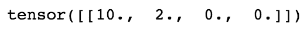

在前面的例子中，我们取一个具有两个正值和两个负值的张量，并对其应用 ReLU 函数，将负数阈值设置为 0，并保留正数。

现在我们已经涵盖了构建网络架构所需的大部分细节，让我们构建一个可以用来解决实际问题的深度学习架构。在前一章中，我们使用了一种简单的方法，这样我们可以专注于深度学习算法的工作方式。我们不再使用那种风格来构建我们的架构；相反，我们将按照 PyTorch 中预期的方式构建架构。

# PyTorch 构建深度学习算法的方式

PyTorch 中的所有网络都是作为类实现的，子类化一个名为`nn.Module`的 PyTorch 类，并应该实现`__init__`和`forward`方法。在`init`函数中，我们初始化任何层，例如我们在前一节中介绍的线性层。在`forward`方法中，我们将输入数据传递到我们在`init`方法中初始化的层中，并返回最终输出。非线性函数通常直接在`forward`函数中使用，有些也在`init`方法中使用。以下代码片段显示了如何在 PyTorch 中实现深度学习架构：

```py
class NeuralNetwork(nn.Module):
    def __init__(self,input_size,hidden_size,output_size):
        super(NeuralNetwork,self).__init__()
        self.layer1 = nn.Linear(input_size,hidden_size)
        self.layer2 = nn.Linear(hidden_size,output_size)
    def __forward__(self,input):
        out = self.layer1(input)
        out = nn.ReLU(out)
        out = self.layer2(out)
        return out
```

如果您是 Python 新手，则可能难以理解前面的一些代码，但它所做的只是继承一个父类并在其中实现两种方法。在 Python 中，我们通过将父类作为参数传递给类名来进行子类化。`init`方法在 Python 中充当构造函数，`super`用于将子类的参数传递给父类，而在我们的情况下是`nn.Module`。

# 不同机器学习问题的模型架构

我们正在解决的问题类型将主要决定我们将使用哪些层，从线性层到用于顺序数据的**长短期记忆**（**LSTM**）层。根据您尝试解决的问题类型，确定您的最后一层。通常有三种问题我们使用任何机器学习或深度学习算法来解决。让我们看看最后一层会是什么样子：

+   对于回归问题，例如预测 T 恤销售价格，我们将使用最后一层作为输出为 1 的线性层，输出连续值。

+   要将给定图像分类为 T 恤或衬衫，您将使用 Sigmoid 激活函数，因为它输出接近于 1 或 0 的值，这通常称为**二元分类问题**。

+   对于多类别分类问题，例如分类一幅图像是 T 恤、牛仔裤、衬衫还是连衣裙，我们会在网络末端使用 softmax 层。让我们尝试直观理解 softmax 的作用，而不深入讨论其数学原理。它从前一层的线性层获取输入，并为一定数量的示例输出概率。在我们的例子中，它将被训练以预测每种类型图像的四个概率。请记住，所有这些概率总是加起来等于 1。

# 损失函数

一旦我们定义了网络架构，我们还剩下两个重要步骤。一个是计算我们的网络在执行回归、分类等特定任务时的表现如何，另一个是优化权重。

优化器（梯度下降）通常接受一个标量值，因此我们的损失函数应生成一个标量值，在训练过程中需要最小化它。在某些情况下，比如预测道路上障碍物的位置并将其分类为行人或其他物体，可能需要使用两个或更多个损失函数。即使在这种情况下，我们也需要将这些损失组合成单个标量以便优化器进行最小化。我们将在第八章，*现代网络架构下的迁移学习*中详细讨论如何将多个损失组合成单个标量的实际示例。

在前一章中，我们定义了自己的损失函数。PyTorch 提供了几种常用损失函数的实现。让我们看看用于回归和分类的损失函数。

对于回归问题，常用的损失函数是**均方误差**（**MSE**）。这是我们在前面章节中实现的相同损失函数。我们可以使用 PyTorch 中实现的损失函数，如下所示：

```py
loss = nn.MSELoss()
input = Variable(torch.randn(2, 6), requires_grad=True)
target = Variable(torch.randn(2, 6))
output = loss(input, target)
output.backward()
```

对于分类问题，我们使用交叉熵损失。在深入探讨交叉熵数学之前，让我们先了解一下交叉熵损失的作用。它计算分类网络的损失，预测的概率应该总和为 1，就像我们的 softmax 层一样。当预测的概率与正确概率偏离时，交叉熵损失会增加。例如，如果我们的分类算法预测某图像是猫的概率为 0.1，但实际上是熊猫，那么交叉熵损失将会较高。如果预测接近实际标签，则交叉熵损失会较低。

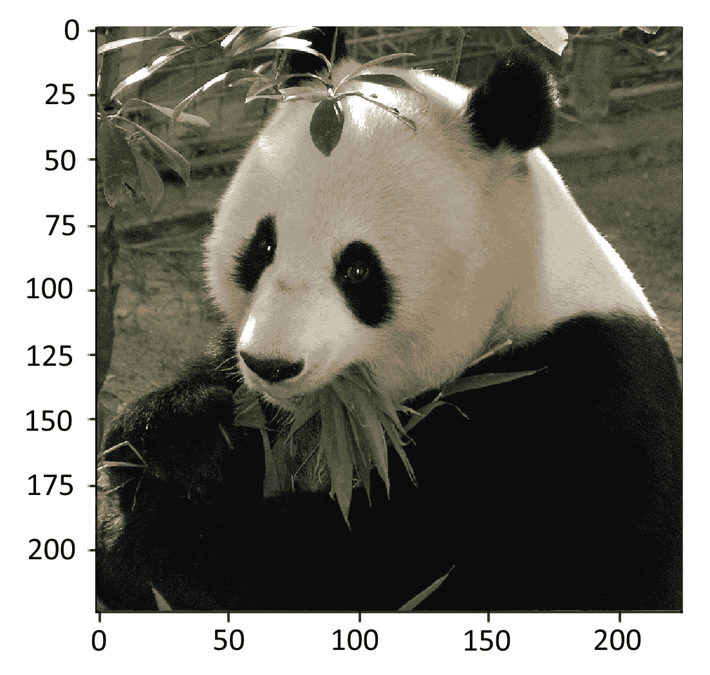

让我们看一个 Python 代码中如何实际发生的示例实现：

```py
def cross_entropy_function(true_label, prediction):
    if true_label == 1:
        return -log(prediction)
    else:
        return -log(1 - prediction)
```

要在分类问题中使用交叉熵损失，我们真的不需要担心内部发生了什么——我们只需要记住，当我们的预测糟糕时，损失会很高，而当预测良好时，损失会很低。PyTorch 为我们提供了损失的实现，我们可以使用，如下所示：

```py
loss = nn.CrossEntropyLoss()
input = Variable(torch.randn(2, 6), requires_grad=True)
target = Variable(torch.LongTensor(2).random_(6))
output = loss(input, target)
output.backward()
```

PyTorch 中的一些其他损失函数如下：

| L1 损失 | 主要用作正则化项；我们将在第四章，*计算机视觉深度学习*中进一步讨论它 |
| --- | --- |
| 均方误差损失 | 用作回归问题的损失函数 |
| 交叉熵损失 | 用于二元和多类分类问题 |
| 负对数似然损失 | 用于分类问题，并允许我们使用特定的权重来处理不平衡数据集 |
| 二维负对数似然损失 | 用于像素级分类，主要用于与图像分割相关的问题 |

# 优化网络架构

一旦计算了网络的损失，我们将优化权重以减少损失，从而提高算法的准确性。为了简单起见，让我们将这些优化器看作黑盒子，它们接收损失函数和所有可学习参数，并微调它们以改善我们的性能。PyTorch 提供了大部分深度学习中常用的优化器。如果您想探索这些优化器内部发生的事情，并且具有数学背景，我强烈推荐以下博客：

+   [`ruder.io/optimizing-gradient-descent/`](http://ruder.io/optimizing-gradient-descent/)

+   [`medium.com/datadriveninvestor/overview-of-different-optimizers-for-neural-networks-e0ed119440c3`](https://medium.com/datadriveninvestor/overview-of-different-optimizers-for-neural-networks-e0ed119440c3)

PyTorch 提供的一些优化器如下：

+   `ASGD`

+   `Adadelta`

+   `Adagrad`

+   `Adam`

+   `Adamax`

+   `LBFGS`

+   `RMSprop`

+   `Rprop`

+   `SGD`

+   `SparseAdam`

我们将详细讨论一些算法在第四章，*计算机视觉深度学习*中的细节，包括一些优点和权衡。让我们走过创建任何优化器中的一些重要步骤：

```py
sgd_optimizer = optim.SGD(model.parameters(), lr = 0.01)
```

在前面的示例中，我们创建了一个 SGD 优化器，它以您网络的所有可学习参数作为第一个参数，并且一个学习率作为决定可学习参数变化比率的参数。在第四章，*计算机视觉深度学习*中，我们将更详细地讨论学习率和动量，这是优化器的一个重要参数。一旦创建了优化器对象，我们需要在循环内调用 `zero_grad()`，因为参数将积累在前一个优化器调用中创建的梯度：

```py
for input, target in dataset:
    sgd_optimizer.zero_grad()
    output = model(input)
   loss = loss_fn(output, target)
    loss.backward()
    sgd_optimizer.step()
```

一旦我们在损失函数上调用 backward，它将计算梯度（可学习参数需要变化的量），我们再调用 `optimizer.step()`，这将实际地改变我们的可学习参数。

现在我们已经涵盖了大多数需要帮助计算机看到或识别图像的组件。让我们构建一个复杂的深度学习模型，能够区分狗和猫，将所有理论付诸实践。

# 使用深度学习进行图像分类

解决任何实际问题的最重要步骤是获取数据。为了在本章中测试我们的深度学习算法，我们将使用由名为`ardamavi`的用户在 GitHub 仓库提供的数据集。我们将在第四章中再次使用此数据集，*计算机视觉的深度学习*，将涵盖**卷积神经网络**（**CNNs**）和一些可以用来提高图像识别模型性能的高级技术。

您可以从以下链接下载数据：[`github.com/ardamavi/Dog-Cat-Classifier/tree/master/Data/Train_Data`](https://github.com/ardamavi/Dog-Cat-Classifier/tree/master/Data/Train_Data)。数据集包含猫和狗的图像。在实施算法之前，需要执行数据预处理和创建训练、验证和测试拆分等重要步骤。

大多数框架使得在提供以下格式的图像和标签时更容易读取图像并对其进行标记。这意味着每个类别应该有其图像的单独文件夹。在这里，所有猫图像应该在`cat`文件夹中，而狗图像应该在`dog`文件夹中：

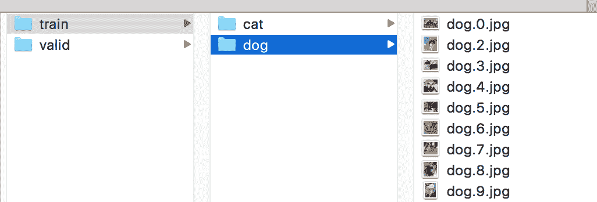

Python 使得将数据放入正确格式变得很容易。让我们快速查看一下代码，然后我们将详细讨论其中的重要部分：

```py
path = 'Dog-Cat-Classifier/Data/Train_Data/'
#Read all the files inside our folder.
dog_files = [f for f in glob.glob('Dog-Cat-Classifier/Data/Train_Data/dog/*.jpg')]
cat_files = [f for f in glob.glob('Dog-Cat-Classifier/Data/Train_Data/cat/*.jpg')]
files = dog_files + cat_files
print(f'Total no of images {len(files)}')
no_of_images = len(files)
```

创建一个可以用来创建验证数据集的洗牌索引：

```py
shuffle = np.random.permutation(no_of_images)
```

创建一个验证目录来保存训练和验证图像：

```py
os.mkdir(os.path.join(path,'train'))
os.mkdir(os.path.join(path,'valid'))
Create directories with label names.
for t in ['train','valid']:
    for folder in ['dog/','cat/']:
         os.mkdir(os.path.join(path,t,folder))
```

将少量图像副本复制到验证文件夹中：

```py
for i in shuffle[:250]:
    folder = files[i].split('/')[-2].split('.')[0]
    image = files[i].split('/')[-1]
    os.rename(files[i],os.path.join(path,'valid',folder,image))
```

将少量图像副本复制到训练文件夹中：

```py
for i in shuffle[250:]:
    folder = files[i].split('/')[-2].split('.')[0]
    image = files[i].split('/')[-1]
    os.rename(files[i],os.path.join(path,'train',folder,image))
```

上述所有代码所做的就是检索所有文件并选择一些图像样本来创建测试和验证集。它将所有图像分成猫和狗两个类别。创建单独的验证集是一种常见且重要的做法，因为在训练的数据上测试算法是不公平的。为了创建数据集，我们创建一个以洗牌顺序排列的数字列表，该列表的范围是图像长度。洗牌的数字充当我们选择一堆图像来创建数据集的索引。让我们详细讨论代码的每个部分。

我们使用`glob`方法返回特定路径中的所有文件：

```py
dog_files = [f for f in glob.glob('Dog-Cat-Classifier/Data/Train_Data/dog/*.jpg')]
cat_files = [f for f in glob.glob('Dog-Cat-Classifier/Data/Train_Data/cat/*.jpg')]
```

当图像数量庞大时，我们也可以使用`iglob`，它返回一个迭代器，而不是将名称加载到内存中。在我们的情况下，我们处理的图像体积较小，可以轻松放入内存，因此不是必需的。

我们可以使用以下代码对文件进行洗牌：

```py
shuffle = np.random.permutation(no_of_images)
```

前面的代码以洗牌顺序返回 0 到 1,399 范围内的数字，我们将使用这些数字作为选择图像子集的索引来创建数据集。

我们可以创建如下的测试和验证代码：

```py
os.mkdir(os.path.join(path,'train'))
os.mkdir(os.path.join(path,'valid'))
for t in ['train','valid']:
    for folder in ['dog/','cat/']:
         os.mkdir(os.path.join(path,t,folder))
```

上述代码在`train`和`valid`目录内基于类别（猫和狗）创建了文件夹。

我们可以用以下代码对索引进行洗牌：

```py
for i in shuffle[:250]:
    folder = files[i].split('/')[-2].split('.')[0]
    image = files[i].split('/')[-1]
    os.rename(files[i],os.path.join(path,'valid',folder,image))
```

在上述代码中，我们使用打乱的索引随机选取了 250 张不同的图像作为验证集。对于训练数据，我们类似地对`train`目录中的图像进行分组。

现在数据格式已经就绪，让我们快速看看如何将图像加载为 PyTorch 张量。

# 将数据加载到 PyTorch 张量中

PyTorch 的`torchvision.datasets`包提供了一个名为`ImageFolder`的实用类，可以用来加载图像及其关联的标签，当数据以前述格式呈现时。通常的做法是执行以下预处理步骤：

1.  将所有图像调整为相同的大小。大多数深度学习架构期望图像具有相同的大小。

1.  使用数据集的均值和标准差进行归一化。

1.  将图像数据集转换为 PyTorch 张量。

PyTorch 通过在`transforms`模块中提供许多实用函数，使得这些预处理步骤更加简单。对于我们的示例，让我们应用三个转换：

+   缩放到 256 x 256 像素大小

+   转换为 PyTorch 张量

+   标准化数据（我们将在下一节讨论如何得到均值和标准差）

下面的代码演示了如何应用转换并使用`ImageFolder`类加载图像：

```py
transform = transforms.Compose([transforms.Resize((224,224))
                                       ,transforms.ToTensor()
                                       ,transforms.Normalize([0.12, 0.11, 0.40], [0.89, 0.21, 0.12])])
train = ImageFolder('Dog-Cat-Classifier/Data/Train_Data/train/',transform)
valid = ImageFolder('Dog-Cat-Classifier/Data/Train_Data/valid/',transform)
```

`train`对象保存了数据集中的所有图像和相关标签。它包含两个重要属性：一个提供了类别与数据集中使用的相关索引之间的映射，另一个提供了类别列表：

+   `train.class_to_idx - {'cat': 0, 'dog': 1}`

+   `train.classes - ['cat', 'dog']`

可视化加载到张量中的数据通常是一种最佳实践。为了可视化张量，我们必须重塑张量并对值进行反归一化。以下函数为我们完成了这些操作：

```py
import matplotlib.pyplot as plt
def imshow(inp):
    """Imshow for Tensor."""
    inp = inp.numpy().transpose((1, 2, 0))
    mean = np.array([0.12, 0.12, 0.40])
    std = np.array([0.22, 0.20, 0.20])
    inp = std * inp + mean
    inp = np.clip(inp, 0, 1)
    plt.imshow(inp) 
```

现在我们可以将张量传递给前面的`imshow`函数，将其转换为图像：

```py
imshow(train[30][0])
```

上述代码生成了以下输出：

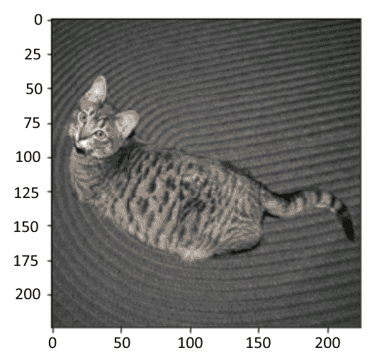

# 加载 PyTorch 张量作为批次

在深度学习或机器学习中，对图像样本进行批处理是常见的做法，因为现代**图形处理单元**（**GPU**）和 CPU 优化了对图像批次的快速操作。批大小通常取决于使用的 GPU 类型。每个 GPU 都有自己的内存，可以从 2 GB 到 12 GB 不等，有时商业 GPU 的内存更多。PyTorch 提供了`DataLoader`类，它接受数据集并返回图像批次，抽象了批处理中的许多复杂性，例如使用多个工作线程进行变换应用。以下代码将先前的`train`和`valid`数据集转换为数据加载器：

```py
train_data_generator = torch.utils.data.DataLoader(train,shuffle=True,batch_size=64,num_workers=8)
valid_data_generator = torch.utils.data.DataLoader(valid,batch_size=64,num_workers=8)
```

`DataLoader`类为我们提供了许多选项，其中一些最常用的选项如下：

+   `shuffle`：当为 true 时，这会在每次数据加载器调用时重新排列图像。

+   `num_workers`：这负责并行化。通常建议在您的机器上使用少于可用核心数的工作线程。

# 构建网络架构

对于大多数实际用例，特别是在计算机视觉领域，我们很少自己构建架构。有不同的架构可以快速用来解决我们的实际问题。在我们的示例中，我们将使用一种名为**ResNet**的流行深度学习算法，该算法在 2015 年赢得了不同竞赛（如 ImageNet）的第一名。

为了更简单地理解，让我们假设这个算法是一堆不同的 PyTorch 层仔细地组合在一起，而不是关注这个算法内部发生了什么。当我们学习 CNN 时，我们将看到 ResNet 算法的一些关键构建块。PyTorch 通过在`torchvision.models`模块中提供这些流行算法使得使用它们变得更加容易。因此，对于这个示例，让我们快速看一下如何使用这个算法，然后逐行走过每一行代码：

```py
pretrained_resnet = models.resnet18(pretrained=True)
number_features = pretrained_resnet.fc.in_features
pretrained_resnet.fc = nn.Linear(number_features, 4)
```

`models.resnet18(pretrained = True)`对象创建了一个算法实例，它是一组 PyTorch 层。我们可以通过打印`pretrained_resnet`快速查看 ResNet 算法的构成。该算法的一个小部分如下截图所示（我没有包含完整的算法，因为它可能运行数页）：

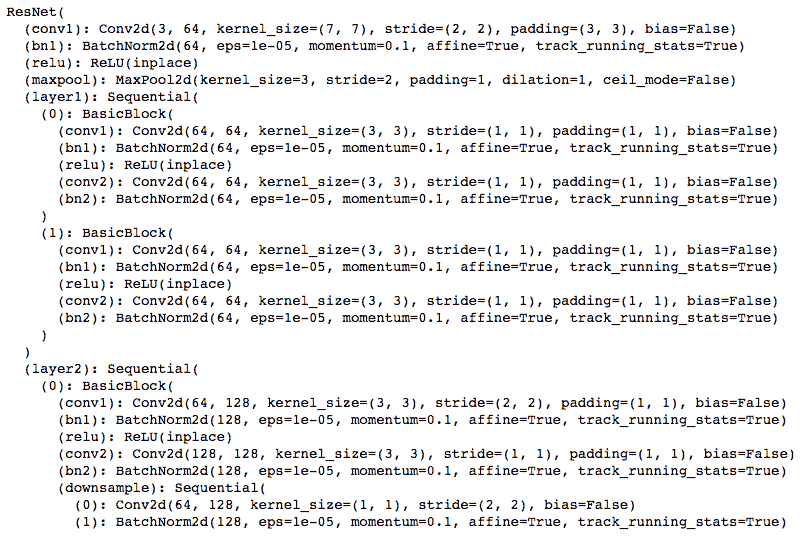

正如我们所看到的，ResNet 架构是一组层，即`Conv2d`、`BatchNorm2d`和`MaxPool2d`，以特定的方式拼接在一起。所有这些算法都会接受一个名为`pretrained`的参数。当`pretrained`为`True`时，算法的权重已经调整到预测 ImageNet 分类问题（包括汽车、船、鱼、猫和狗）的 1000 个不同类别的特定点。这些权重被存储并与我们用于用例的模型共享。算法在使用经过微调的权重启动时通常会表现更好，而不是使用随机权重启动。因此，对于我们的用例，我们将从预训练权重开始。

ResNet 算法不能直接使用，因为它是训练用于预测 1000 个类别中的一个。对于我们的用例，我们需要预测狗和猫中的其中一个类别。为了实现这一点，我们取 ResNet 模型的最后一层，这是一个线性层，并将输出特征更改为`4`，如下面的代码所示：

```py
pretrained_resnet.fc = nn.Linear(number_features, 4)
```

如果您在基于 GPU 的机器上运行此算法，则为了使算法在 GPU 上运行，我们在模型上调用`cuda`方法。强烈建议您在支持 GPU 的机器上运行这些程序；可以轻松地为少于一美元的费用启动一个带 GPU 的云实例。以下代码片段的最后一行告诉 PyTorch 在 GPU 上运行代码：

```py
if is_cuda:
   pretrained_resnet = pretrained_resnet.cuda()
```

# 训练模型

在前几节中，我们创建了一些`DataLoader`实例和算法。现在让我们训练模型。为此，我们需要一个损失函数和一个优化器：

```py
learning_rate = 0.005
criterion = nn.CrossEntropyLoss()
fit_optimizer = optim.SGD(pretrained_resnet.parameters(), lr=0.005, momentum=0.6)
exp_learning_rate_scheduler = lr_scheduler.StepLR(fit_optimizer, step_size=2, gamma=0.05)
```

在上述代码中，我们基于`CrossEntropyLoss`创建了我们的损失函数，并基于`SGD`创建了优化器。`StepLR`函数有助于动态调整学习率。我们将讨论不同可用的策略来调整学习率，详见第四章，*计算机视觉的深度学习*。

下面的`train_my_model`函数接收一个模型，并通过运行多个 epoch 来调整算法的权重以减少损失：

```py
def train_my_model(model, criterion, optimizer, scheduler, number_epochs=20):
    since = time.time()
    best_model_weights = model.state_dict()
    best_accuracy = 0.0
    for epoch in range(number_epochs):
        print('Epoch {}/{}'.format(epoch, number_epochs - 1))
        print('-' * 10)
```

每个 epoch 都有训练和验证阶段：

```py
        for each_phase in ['train', 'valid']:
            if each_phase == 'train':
                scheduler.step()
                model.train(True) 
            else:
                model.train(False)

            running_loss = 0.0
            running_corrects = 0
```

迭代数据：

```py
            for data in dataloaders[each_phase]:
                input_data, label_data = data
                if torch.cuda.is_available():
                    input_data = Variable(inputs.cuda())
                    label_data = Variable(labels.cuda())
                else:
                    input_data, label_data = Variable(input_data), Variable(label_data)
                optimizer.zero_grad()  
                outputs = model(input_data)
                _, preds = torch.max(outputs.data, 1)
                loss = criterion(outputs, label_data)
                if each_phase == 'train':
                    loss.backward()
                    optimizer.step()
                running_loss += loss.data[0]
                running_corrects += torch.sum(preds == label_data.data)
            epoch_loss = running_loss / dataset_sizes[each_phase]
            epoch_acc = running_corrects / dataset_sizes[each_phase]
            print('{} Loss: {:.4f} Acc: {:.4f}'.format(each_phase, epoch_loss, epoch_acc))
            if each_phase == 'valid' and epoch_acc > best_acc:
                best_accuracy = epoch_acc
                best_model_weights = model.state_dict()
        print()
    time_elapsed = time.time() - since
    print('Training complete in {:.0f}m {:.0f}s'.format(time_elapsed // 60, time_elapsed % 60))
    print('Best val Acc: {:4f}'.format(best_accuracy))
    model.load_state_dict(best_model_weights)
    return model
```

函数可以按以下方式运行：

```py
train_my_model(pretrained_resnet, criterion, fit_optimizer, exp_learning_rate_scheduler, number_epochs=20)
```

前述函数执行以下操作：

+   它通过模型传递图像并计算损失。

+   训练阶段进行反向传播。在验证/测试阶段，不调整权重。

+   损失在每个 epoch 中跨批次累积。

+   存储了最佳模型并打印了验证准确率。

在运行了 20 个 epoch 后，上述模型的验证准确率达到了 87%。

在接下来的章节中，我们将学习更高级的技术，帮助我们以更快的方式训练更准确的模型。前面的模型在 Titan X GPU 上运行大约花费了 30 分钟。我们将涵盖不同的技术，有助于加快模型的训练速度。

# 概要

在本章中，我们探讨了在 PyTorch 中神经网络的完整生命周期，从构建不同类型的层，添加激活函数，计算交叉熵损失，到最终优化网络性能（即通过 SGD 优化器调整层的权重）。

我们研究了如何将流行的 ResNet 架构应用于二元或多类分类问题。

在此过程中，我们试图解决真实世界的图像分类问题，将猫图像分类为猫，狗图像分类为狗。这些知识可以应用于分类不同类别/实体的类别，例如分类鱼的物种，识别不同品种的狗，分类植物苗，将宫颈癌分为类型 1、类型 2 和类型 3，以及更多。

在下一章中，我们将深入学习机器学习的基础知识。
