# 第五章：深度学习用于计算机视觉

在第三章中，*深入探讨神经网络*，我们使用了一种名为**ResNet**的流行**卷积神经网络**（**CNN**）架构构建了一个图像分类器，但我们将这个模型当作黑盒子使用。在本章中，我们将探索如何从头开始构建架构来解决图像分类问题，这是最常见的用例之一。我们还将学习如何使用迁移学习，这将帮助我们使用非常小的数据集构建图像分类器。除了学习如何使用 CNN，我们还将探索这些卷积网络学习到了什么。

在本章中，我们将涵盖卷积网络的重要构建模块。本章将涵盖以下重要主题：

+   神经网络介绍

+   从头开始构建 CNN 模型

+   创建和探索 VGG16 模型

+   计算预卷积特征

+   理解 CNN 模型学习的内容

+   可视化 CNN 层的权重

# 神经网络介绍

在过去几年中，CNN 在图像识别、目标检测、分割以及计算机视觉领域的许多其他领域中变得流行起来。尽管在**自然语言处理**（**NLP**）领域中尚不常用，但它们也变得流行起来。完全连接层和卷积层之间的根本区别在于中间层中权重连接的方式。让我们看看以下图表，展示了完全连接或线性层的工作原理：

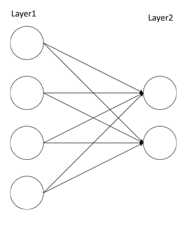

在计算机视觉中使用线性层或完全连接层的最大挑战之一是它们丢失了所有空间信息，并且在使用完全连接层时权重的复杂性太大。例如，当我们将 224 像素图像表示为平面数组时，我们将得到 150,528（224 x 224 x 3 通道）。当图像被展平时，我们失去了所有的空间信息。让我们看看简化版本的 CNN 是什么样子：

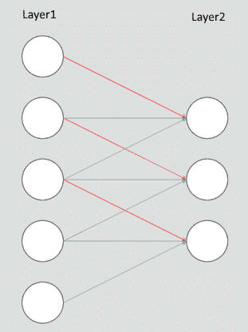

所有的卷积层只是在图像上应用称为**过滤器**的权重窗口。在我们试图详细理解卷积和其他构建模块之前，让我们为 MNIST 数据集构建一个简单而强大的图像分类器。一旦我们建立了这个分类器，我们将逐步分解网络的每个组件。我们将图像分类器的构建分解为以下步骤：

1.  获取数据

1.  创建验证数据集

1.  从头开始构建我们的 CNN 模型

1.  训练和验证模型

# MNIST - 获取数据

MNIST 数据集包含 60,000 个手写数字（从 0 到 9）用于训练和 10,000 张图像用于测试。PyTorch 的`torchvision`库为我们提供了一个 MNIST 数据集，它下载数据并以可直接使用的格式提供。让我们使用 MNIST 函数将数据集下载到本地并将其包装到`DataLoader`中。我们将使用`torchvision`转换将数据转换为 PyTorch 张量并进行数据标准化。以下代码将处理下载数据，将数据包装到`DataLoader`中，并进行数据标准化：

```py
transformation = transforms.Compose([transforms.ToTensor(),
transforms.Normalize((0.14,), (0.32,))])
training_dataset = datasets.MNIST('dataset/',train=True,transform=transformation,
download=True) test_dataset =
datasets.MNIST('dataset/',train=False,transform=transformation, download=True)
training_loader = torch.utils.data.DataLoader(training_dataset,batch_size=32,shuffle=True)
test_loader = torch.utils.data.DataLoader(test_dataset,batch_size=32,shuffle=True)
```

前面的代码为我们提供了用于训练和测试数据集的`DataLoader`变量。让我们可视化几张图像，以便了解我们正在处理的内容。以下代码将帮助我们可视化 MNIST 图像：

```py
def plot_img(image):
image = image.numpy()[0] mean = 0.1307
std = 0.3081
image = ((mean * image) + std) plt.imshow(image,cmap='gray')
```

现在，我们可以传递`plot_img`方法来可视化我们的数据集。我们将使用以下代码从`DataLoader`变量中获取一批记录，并绘制图像：

```py
sample_data = next(iter(training_loader)) plot_img(sample_data[0][1]) plot_img(sample_data[0][2])
```

图像可以如下进行可视化：

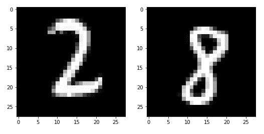

# 从头开始构建 CNN 模型

在这一部分，我们将从头开始构建自己的架构。我们的网络架构将包含不同层的组合，如下所示：

+   Conv2d

+   MaxPool2d

+   **修正线性单元** (**ReLU**)

+   视图

+   线性层

让我们看一下我们打算实现的架构的图示表示：

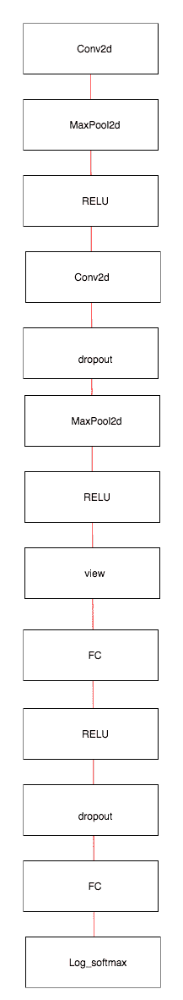

让我们在 PyTorch 中实现这个架构，然后逐步了解每个单独的层的作用：

```py
class Network(nn.Module): def   init  (self):
super(). init  ()
self.conv1 = nn.Conv2d(1, 10, kernel_size=3)
self.conv2 = nn.Conv2d(10, 20, kernel_size=3) self.conv2_drop = nn.Dropout2d()
self.fullyconnected1 = nn.Linear(320, 50) self.fullyconnected2 = nn.Linear(50, 10)

def forward(self, x):
x = F.relu(F.max_pool2d(self.conv1(x), 2))
x = F.relu(F.max_pool2d(self.conv2_drop(self.conv2(x)), 2)) x = x.view(-1, 320)
x = F.relu(self.fullyconnected1(x))
x = F.dropout(x, training=self.training) x = self.fullyconnected2(x)
return F.log_softmax(x)
```

让我们详细了解每一层的作用。

# Conv2d

Conv2d 负责在我们的 MNIST 图像上应用卷积滤波器。让我们尝试理解如何在一维数组上应用卷积，然后学习如何在图像上应用二维卷积。看看以下图表。在这里，我们将对长度为 7 的张量应用一个**Conv1d**大小为 3 的滤波器（或核）：

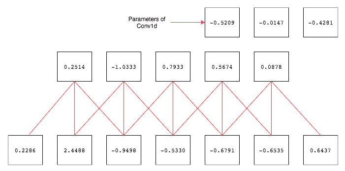

底部的框代表我们的输入张量，共有七个值，而连接的框代表我们应用三个大小的卷积滤波器后的输出。在图像的右上角，三个框代表**Conv1d**层的权重和参数。卷积滤波器像窗口一样应用，并且通过跳过一个值来移动到以下值。要跳过的值的数量称为**步幅**，默认设置为 1。让我们写下第一个和最后一个输出的计算方式来理解输出值是如何被计算出来的：

输出 1 –> (*-0.5209 x 0.2286*) + (*-0.0147 x 2.4488*) + (*-0.321 x -0.9498*)

输出 5 –> (*-0.5209 x -0.6791*) + (*-0.0147 x -0.6535*) + (*-0.321 x 0.6437*)

现在，我们应该清楚卷积是做什么的了。它通过根据步长的值移动一个滤波器（或卷积核），也就是一组权重，来对输入进行处理。在前面的示例中，我们每次移动我们的滤波器一个点。如果步长值为 2，那么我们将一次移动两个点。让我们看一个 PyTorch 的实现来理解它是如何工作的：

```py
conv = nn.Conv1d(1,1,3,bias=False) 
sample = torch.randn(1,1,7) 
conv(Variable(sample))

#Check the weights of our convolution filter by 
conv.weight
```

还有另一个重要的参数叫做**填充（padding）**，通常与卷积一起使用。如前面的例子所示，如果滤波器未应用到数据的末尾，即当数据不足以进行步长时，它就会停止。填充通过向张量的两端添加零来防止这种情况。让我们看一个一维填充如何工作的示例：


在上述图中，我们使用了一个填充为 2 且步长为 1 的**Conv1d**层。让我们看看 Conv2d 在图像上的工作原理。

在我们了解 Conv2d 如何工作之前，我强烈建议您查看一个了不起的博客（[`setosa.io/ev/image-kernels/`](http://setosa.io/ev/image-kernels/)），其中包含卷积如何工作的实时演示。在您花几分钟玩弄演示之后，继续阅读。

让我们来理解演示中发生了什么。在图像的中心框中，我们有两组不同的数字：一组在方框中表示，另一组在方框下方。方框中表示的是像素值，正如演示中左侧照片上的白色框所示。方框下方标记的数字是用于锐化图像的滤波器（或卷积核）值。这些数字是特意挑选出来执行特定的任务。在这种情况下，它们是用来锐化图像的。就像我们之前的例子一样，我们进行逐元素乘法并将所有值求和，以生成右侧图像中像素的值。生成的值由图像右侧的白色框突出显示。

尽管在此示例中卷积核中的值是手动挑选的，在 CNN 中，我们不手动挑选这些值；相反，我们随机初始化它们，并让梯度下降和反向传播调整卷积核的值。学习到的卷积核将负责识别不同的特征，如线条、曲线和眼睛。看看以下截图，我们可以看到一个数字矩阵并了解卷积是如何工作的：

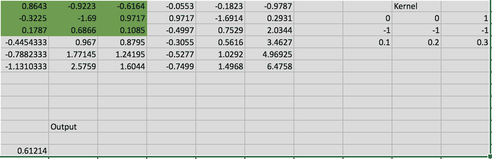

在上述屏幕截图中，我们假设 6 x 6 矩阵表示一幅图像，并应用了大小为 3 x 3 的卷积滤波器。然后，我们展示了如何生成输出。为了保持简单，我们只计算了矩阵的突出部分。输出通过执行以下计算生成：

输出 –> *0.86 x 0 + -0.92 x 0 + -0.61 x 1 + -0.32 x -1 + -1.69 x -1 + ........*

Conv2d 函数中使用的另一个重要参数是`kernel_size`，它决定了卷积核的大小。一些常用的卷积核大小包括*1*、*3*、*5*和*7*。卷积核大小越大，滤波器能够覆盖的区域就越大，因此在早期层中常见到应用大小为*7*或*9*的滤波器对输入数据进行处理。

# 池化

在卷积层后添加池化层是一种常见的做法，因为它们可以减小特征图的大小，并优化卷积层的输出结果。

池化提供了两个不同的功能：一个是减小要处理的数据大小，另一个是强制算法不要专注于图像中位置的微小变化。例如，人脸检测算法应该能够在图片中检测到人脸，而不管人脸在照片中的位置如何。

让我们看看 MaxPool2d 是如何工作的。它也使用与卷积相同的核大小和步幅的概念。与卷积不同的是，它不具有任何权重，只是作用于前一层每个滤波器生成的数据。如果核大小为*2 x 2*，则它会在图像中考虑该大小，并选择该区域的最大值。让我们看一下下面的图表，这将清楚地解释 MaxPool2d 的工作原理：

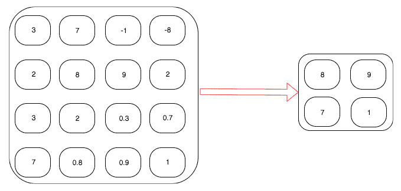

左侧的方框包含特征图的值。在应用最大池化后，输出存储在方框的右侧。让我们通过写出第一行输出中数值的计算来查看输出是如何计算的：

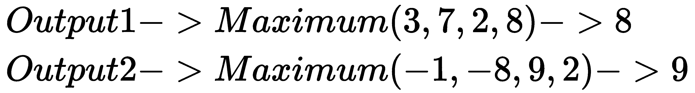

另一种常用的池化技术是**平均池化**。最大函数被替换为平均函数。下图解释了平均池化的工作原理：

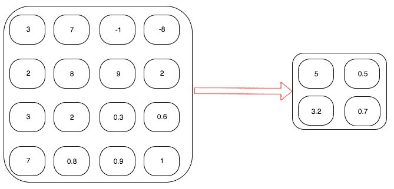

在这个示例中，我们不是取四个值的最大值，而是取这四个值的平均值。让我们写下计算过程，以便更容易理解：

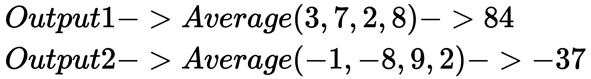

# 非线性激活 - ReLU

在应用最大池化或平均池化后，通常在卷积层后添加非线性层是一种常见且最佳的做法。大多数网络架构倾向于使用 ReLU 或不同变体的 ReLU。无论我们选择哪种非线性函数，它都会应用于特征图的每个元素。为了使其更直观，让我们看一个示例，在该示例中，我们在应用了最大池化和平均池化的同一特征图上应用 ReLU：


# 视图

对于图像分类问题，在大多数网络的最后使用全连接或线性层是一种常见做法。这里，我们使用的是二维卷积，它以一个数字矩阵作为输入，并输出另一个数字矩阵。要应用线性层，我们需要展平矩阵，即将二维张量展平为一维向量。以下图展示了 view 函数的工作原理：

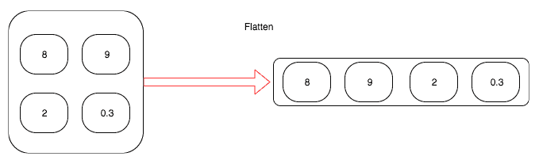

让我们看一下在我们的网络中使用的代码，它确实如此：

```py
x.view(-1, 320)
```

正如我们之前看到的，view 方法将把一个*n*维张量展平成一个一维张量。在我们的网络中，每个图像的第一维是输入数据。在批处理后，输入数据的维度将为*32 x 1 x 28 x 28*，其中第一个数字*32*表示有*32*张大小为*28*高、*28*宽、*1*通道的图像，因为这是一张黑白图像。在展平时，我们不希望展平或混合不同图像的数据。因此，我们传递给 view 函数的第一个参数将指示 PyTorch 避免在第一维上展平数据。以下图展示了其工作原理：

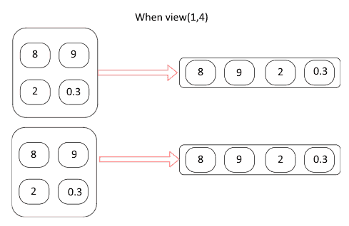

在上图中，我们有大小为*2 x 1 x 2 x 2*的数据；在应用 view 函数后，它将其转换为大小为*2 x 1 x 4*的张量。让我们看另一个例子，这次我们没有提到*- 1*：

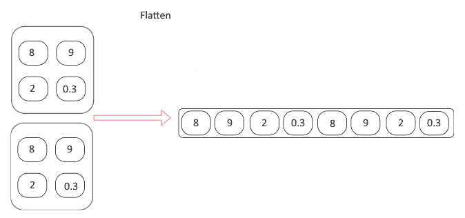

如果我们忘记了指明要展平的维度，可能会导致意外的结果，因此在这一步要特别小心。

# 线性层

当我们将数据从二维张量转换为一维张量后，我们通过一个线性层，然后是一个非线性激活层来处理数据。在我们的架构中，我们有两个线性层，一个后面跟着 ReLU，另一个后面跟着`log_softmax`函数，用于预测给定图像中包含的数字。

# 训练模型

要训练模型，我们需要遵循与之前的狗和猫图像分类问题相同的过程。以下代码片段训练我们的模型，使用提供的数据集：

```py
def fit_model(epoch,model,data_loader,phase='training',volatile=False): if phase == 'training':
model.train()
if phase == 'validation': model.eval() volatile=True
running_loss = 0.0
running_correct = 0
for batch_idx , (data,target) in enumerate(data_loader): if is_cuda:
data,target = data.cuda(),target.cuda()
data , target = Variable(data,volatile),Variable(target) if phase == 'training':
optimizer.zero_grad() output = model(data)
loss = F.null_loss(output,target) running_loss +=
F.null_loss(output,target,size_average=False).data[0] predictions = output.data.max(dim=1,keepdim=True)[1]
running_correct += preds.eq(target.data.view_as(predictions)).cpu().sum() if phase == 'training':
loss.backward() optimizer.step()
loss = running_loss/len(data_loader.dataset)
accuracy = 100\. * running_correct/len(data_loader.dataset) print(f'{phase} loss is {loss:{5}.{2}} and {phase} accuracy is
{running_correct}/{len(data_loader.dataset)}{accuracy:{10}.{4}}') return loss,accuracy
```

这种方法在训练和验证时有不同的逻辑。主要有两个原因使用不同的模式：

+   在训练模式下，dropout 会移除一定比例的数值，而这种情况在验证或测试阶段不应该发生。

+   在训练模式下，我们计算梯度并改变模型的参数值，但在测试或验证阶段不需要反向传播。

在前一个函数中，大部分代码都是不言自明的。在函数的最后，我们返回该特定 epoch 模型的损失和准确度。

让我们通过前面的函数对模型进行 20 次迭代，并绘制训练和验证的损失和准确率，以了解我们的网络表现如何。以下代码运行 `fit` 方法对训练和测试数据集进行 20 次迭代：

```py
model = Network() if is_cuda:
model.cuda()

optimizer = optim.SGD(model.parameters(),lr=0.01,momentum=0.5) training_losses , training_accuracy = [],[]
validation_losses , validation_accuracy = [],[] for epoch in range(1,20):
epoch_loss, epoch_accuracy = fit(epoch,model,training_loader,phase='training')
validation_epoch_loss , validation_epoch_accuracy = fit(epoch,model,test_loader,phase='validation')
training_losses.append(epoch_loss) training_accuracy.append(epoch_accuracy) validation_losses.append(validation_epoch_loss) validation_accuracy.append(validation_epoch_accuracy)
```

以下代码绘制了训练和测试的损失：

```py
plt.plot(range(1,len(training_losses)+1),training_losses,'bo',label = 'training loss')
plt.plot(range(1,len(validation_losses)+1),validation_losses,'r',label = 'validation loss')
plt.legend()
```

前面的代码生成了以下图表：

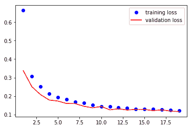

以下代码绘制了训练和测试的准确率：

```py
plt.plot(range(1,len(training_accuracy)+1),training_accuracy,'bo',label = 'train accuracy')
plt.plot(range(1,len(validation_accuracy)+1),validation_accuracy,'r',label = 'val accuracy')
plt.legend()
```

前面的代码生成了以下图表：

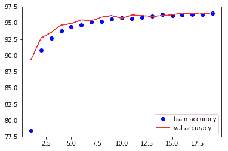

在第 20 个 epoch 结束时，我们实现了 98.9% 的测试准确率。我们已经让我们的简单卷积模型运行，并几乎达到了最新的结果。让我们看看当我们尝试在我们的狗与猫数据集上使用相同的网络架构时会发生什么。我们将使用上一章节第三章*神经网络的基本构建块*中的数据，以及来自 MNIST 示例的架构，并进行一些小的更改。一旦我们训练了模型，我们可以评估它，以了解我们的简单架构表现如何。

# 从头开始分类狗和猫 - CNN

我们将使用相同的架构，但会进行一些小的更改，如下所列：

+   第一线性层的输入维度需要改变，因为我们的猫和狗图像的尺寸是 *256, 256*。

+   我们将添加另一个线性层，以使模型能够更灵活地学习。

让我们看一下实现网络架构的代码：

```py
class Network(nn.Module): def   init  (self):
super(). init  ()
self.conv1 = nn.Conv2d(3, 10, kernel_size=3) self.conv2 = nn.Conv2d(10, 20, kernel_size=3) self.conv2_drop = nn.Dropout2d()
self.fc1 = nn.Linear(56180, 500) self.fc2 = nn.Linear(500,50) self.fc3 = nn.Linear(50, 2)

def forward(self, x):
x = F.relu(F.max_pool2d(self.conv1(x), 2))
x = F.relu(F.max_pool2d(self.conv2_drop(self.conv2(x)), 2)) x = x.view(x.size(0),-1)
x = F.relu(self.fc1(x))
x = F.dropout(x, training=self.training) x = F.relu(self.fc2(x))
x = F.dropout(x,training=self.training) x = self.fc3(x)
return F.log_softmax(x,dim=1)
```

我们将使用与 MNIST 示例相同的训练函数，因此我不会在此处包含代码。然而，让我们看一下在对模型进行 20 次迭代训练时生成的图表。

训练集和验证集的损失绘制如下：

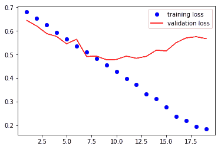

训练集和验证集的准确率绘制如下：

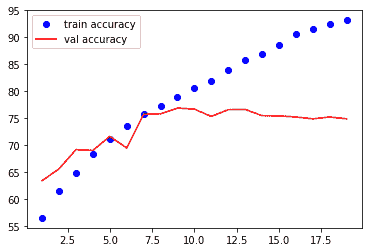

从这些图表中可以看出，训练损失在每次迭代中都在减少，但验证损失却变得更糟。准确率在训练过程中也在增加，但几乎在 75% 时趋于饱和。这是一个明显的例子，显示模型没有泛化能力。在接下来的部分，我们将看一下另一种称为**迁移学习**的技术，它可以帮助我们训练更精确的模型，并提供可以加快训练的技巧。

# 使用迁移学习对狗和猫进行分类

迁移学习是能够在类似数据集上重复使用已训练的算法，而无需从头开始训练它。我们人类在认识新图像时并不通过分析成千上万张类似的图像来学习。我们只需理解不同的特征，这些特征实际上能够区分一个特定的动物，比如狐狸，与狗的不同之处。我们不需要通过理解线条、眼睛和其他更小的特征来学习什么是狐狸。因此，我们将学习如何利用预训练模型，用极少量的数据建立最先进的图像分类器。

CNN 架构的前几层专注于更小的特征，例如线条或曲线的外观。CNN 后面几层的过滤器学习更高级的特征，例如眼睛和手指，最后几层学习识别确切的类别。预训练模型是一种在类似数据集上训练的算法。大多数流行的算法都是在流行的 ImageNet 数据集上预训练，以识别 1000 个不同的类别。这样的预训练模型将有调整后的滤波器权重，用于识别各种模式。因此，让我们了解如何利用这些预训练权重。我们将研究一个名为**VGG16**的算法，它是早期在 ImageNet 竞赛中取得成功的算法之一。尽管有更现代的算法，但这种算法仍然很受欢迎，因为它简单易懂，适合用于迁移学习。让我们先看看 VGG16 模型的架构，然后试着理解这个架构以及如何用它来训练我们的图像分类器：

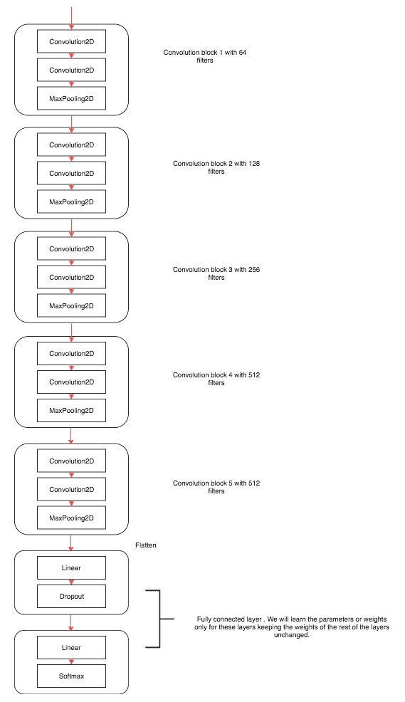

VGG16 架构包含五个 VGG 块。一个块由卷积层、非线性激活函数和最大池化函数组成。所有的算法参数都被调整以达到在分类 1000 个类别时的最先进结果。该算法接受以批次形式的输入数据，并且数据被 ImageNet 数据集的均值和标准差进行了归一化。

在迁移学习中，我们尝试通过冻结大部分层的学习参数来捕捉算法学到的内容。通常，只微调网络的最后几层是一个良好的实践。在这个例子中，我们将仅训练最后几个线性层，保持卷积层不变，因为卷积特征学习的特征大多适用于所有种类的图像问题，这些图像具有相似的属性。让我们使用迁移学习来训练一个 VGG16 模型，用于狗和猫的分类。接下来的章节中，我们将详细介绍实现的步骤。

# 创建和探索 VGG16 模型

PyTorch 在其`torchvision`库中提供了一组经过训练的模型。当参数`pretrained`为`True`时，大多数模型都会接受一个称为`pretrained`的参数，它会下载为解决**ImageNet**分类问题而调整的权重。我们可以使用以下代码创建一个 VGG16 模型：

```py
from torchvision import models
vgg = models.vgg16(pretrained=True)
```

现在，我们已经有了我们的 VGG16 模型和所有预训练的权重准备好使用。当第一次运行代码时，根据您的互联网速度，可能需要几分钟。权重的大小可能约为 500 MB。我们可以通过打印来快速查看 VGG16 模型。当我们使用现代架构时，了解这些网络如何实现实际上非常有用。让我们看看这个模型：

```py
VGG (
  (features): Sequential (
    (0): Conv2d(3, 64, kernel_size=(3, 3), stride=(1, 1), padding=(1, 1))
    (1): ReLU (inplace)
    (2): Conv2d(64, 64, kernel_size=(3, 3), stride=(1, 1), padding=(1, 1))
    (3): ReLU (inplace)
    (4): MaxPool2d (size=(2, 2), stride=(2, 2), dilation=(1, 1))
    (5): Conv2d(64, 128, kernel_size=(3, 3), stride=(1, 1), padding=(1, 1))
    (6): ReLU (inplace)
   (7): Conv2d(128, 128, kernel_size=(3, 3), stride=(1, 1), padding=(1, 1))
    (8): ReLU (inplace)
    (9): MaxPool2d (size=(2, 2), stride=(2, 2), dilation=(1, 1))
    (10):Conv2d(128, 256, kernel_size=(3, 3), stride=(1,1), padding=(1, 1))
    (11): ReLU (inplace)
    (12): Conv2d(256, 256, kernel_size=(3, 3), stride=(1, 1), padding=(1, 1))
    (13): ReLU (inplace)
    (14): Conv2d(256, 256, kernel_size=(3, 3), stride=(1, 1), padding=(1, 1))
    (15): ReLU (inplace)
    (16): MaxPool2d (size=(2, 2), stride=(2, 2), dilation=(1, 1))
    (17): Conv2d(256, 512, kernel_size=(3, 3), stride=(1, 1), padding=(1, 1))
    (18): ReLU (inplace)
    (19): Conv2d(512, 512, kernel_size=(3, 3), stride=(1, 1), padding=(1, 1))
    (20): ReLU (inplace)
    (21): Conv2d(512, 512, kernel_size=(3, 3), stride=(1, 1), padding=(1, 1))
    (22): ReLU (inplace)
    (23): MaxPool2d (size=(2, 2), stride=(2, 2), dilation=(1, 1))
    (24): Conv2d(512, 512, kernel_size=(3, 3), stride=(1, 1), padding=(1,1))
    (25): ReLU (inplace)   
    (26): Conv2d(512, 512, kernel_size=(3, 3), stride=(1, 1), padding=(1, 1))
    (27): ReLU (inplace)
    (28): Conv2d(512, 512, kernel_size=(3, 3), stride=(1, 1), padding=(1, 1))
    (29): ReLU (inplace)
    (30): MaxPool2d (size=(2, 2), stride=(2, 2), dilation=(1, 1))
  )
  (classifier): Sequential ( 
    (0): Linear (25088 -> 4096)
    (1): ReLU (inplace)
    (2): Dropout (p = 0.5)
    (3): Linear (4096 -> 4096)
    (4): ReLU (inplace)
    (5): Dropout (p = 0.5)
    (6): Linear (4096 -> 1000)
  )
)
```

模型摘要包含两个顺序模型：`features` 和 `classifiers`。 `features` 顺序模型包含我们将要冻结的层。

# 冻结层

让我们冻结特征模型的所有层，其中包含卷积块。冻结这些卷积块的权重将阻止这些层的权重更新。由于模型的权重经过训练以识别许多重要特征，我们的算法将能够从第一次迭代开始做同样的事情。使用模型的权重，这些权重最初是为不同用例而训练的能力，称为**迁移学习**。

现在，让我们看看如何冻结层的权重或参数：

```py
for param in vgg.features.parameters(): param.requires_grad = False
```

此代码防止优化器更新权重。

# 微调 VGG16

VGG16 模型已经训练用于分类 1000 个类别，但尚未训练用于狗和猫的分类。因此，我们需要将最后一层的输出特征从 1000 更改为 2。我们可以使用以下代码来实现这一点：

```py
vgg.classifier[6].out_features = 2
```

`vgg.classifier` 函数使我们可以访问顺序模型内的所有层，第六个元素将包含最后一层。当我们训练 VGG16 模型时，只需要训练分类器参数。因此，我们只传递`classifier.parameters` 给优化器，如下所示：

```py
optimizer = optim.SGD(vgg.classifier.parameters(),lr=0.0001,momentum=0.5)
```

# 训练 VGG16 模型

到目前为止，我们已经创建了模型和优化器。由于我们使用的是狗与猫数据集，我们可以使用相同的数据加载器和训练函数来训练我们的模型。请记住：当我们训练模型时，只有分类器内部的参数会发生变化。以下代码片段将训练模型 20 个 epoch，从而达到 98.45%的验证精度：

```py
training_losses , training_accuracy = [],[] 
validation_losses , validation_accuracy = [],[]
for epoch in range(1,20): 
    epoch_loss, epoch_accuracy =
fit(epoch,vgg,training_data_loader,phase='training')
    validation_epoch_loss , validation_epoch_accuracy =
fit(epoch,vgg,valid_data_loader,phase='validation')
    training_losses.append(epoch_loss)
    training_accuracy.append(epoch_accuracy)
    validation_losses.append(validation_epoch_loss)
    validation_accuracy.append(validation_epoch_accuracy)
```

让我们可视化训练和验证损失：

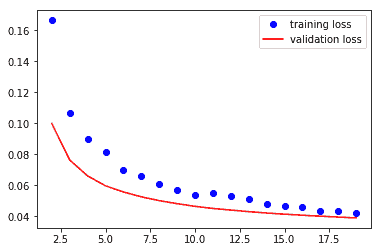

让我们可视化训练和验证精度：

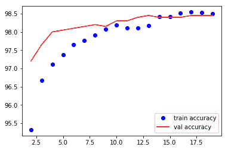

我们可以应用一些技巧，如数据增强，并尝试不同的 dropout 值，以提高模型的泛化能力。以下代码片段将 VGG 分类器模块中的 dropout 值从 0.5 更改为 0.2，并训练模型：

```py
for layer in vgg.classifier.children(): if(type(layer) == nn.Dropout):
layer.p = 0.2

#Training
training_losses , training_accuracy = [],[] validation_losses , validation_accuracy = [],[]
for epoch in range(1,3): 
    epoch_loss, epoch_accuracy =
fit(epoch,vgg,training_data_loader,phase='training')
    validation_epoch_loss , validation_epoch_accuracy =
fit(epoch,vgg,valid_data_loader,phase='validation')
    training_losses.append(epoch_loss)
    training_accuracy.append(epoch_accuracy)
    validation_losses.append(validation_epoch_loss)
    validation_accuracy.append(validation_epoch_accuracy)
```

将模型训练几个 epoch 后，我注意到略有改善；您可以尝试调整不同的 dropout 值，看看是否可以获得更好的结果。我们可以使用另一个重要的技巧来改善模型的泛化能力，即增加数据或进行数据增强。我们可以通过随机水平翻转图像或将图像旋转一小角度来执行数据增强。`torchvision transforms` 模块提供了不同的功能来执行数据增强，并且它们是动态的，每个 epoch 都会变化。我们可以使用以下代码实现数据增强：

```py
training_transform =transforms.Compose([transforms.Resize((224,224)),
                                     transforms.RandomHorizontalFlip(), 
                                        transforms.RandomRotation(0.2), 
                                        transforms.ToTensor(), 
                                        transforms.Normalize([0.485, 0.32, 0.406], [0.229, 0.224, 0.225])
])

train = ImageFolder('dogsandcats/train/',training_transform) valid = ImageFolder('dogsandcats/valid/',simple_transform)

#Training

training_losses , training_accuracy = [],[]
validation_losses , validation_accuracy = [],[]
for epoch in range(1,3):
    epoch_loss, epoch_accuracy = fit(epoch,vgg,training_data_loader,phase='training')
    validation_epoch_loss , validation_epoch_accuracy = fit(epoch,vgg,valid_data_loader,phase='validation')
    training_losses.append(epoch_loss)
    training_accuracy.append(epoch_accuracy)
    validation_losses.append(validation_epoch_loss)
    validation_accuracy.append(validation_epoch_accuracy)
```

上述代码的输出如下：

```py
#Results
training loss is 0.041 and training accuracy is 22657/23000 98.51 validation loss is 0.043 and validation accuracy is 1969/2000 98.45 training loss is 0.04 and training accuracy is 22697/23000 98.68 validation loss is 0.043 and validation accuracy is 1970/2000 98.5
```

使用增强数据训练模型使模型的准确性提高了 0.1%，只需运行两个 epoch；我们可以再运行几个 epoch 来进一步提高。如果您在阅读本书时训练这些模型，您会意识到每个 epoch 的训练时间可能超过几分钟，这取决于您正在使用的 GPU。让我们看看一种技术，可以使每个 epoch 的训练时间缩短到几秒钟。

# 计算预卷积特征

当我们冻结卷积层和训练模型时，完全连接层或稠密层（`vgg.classifier`）的输入始终保持不变。为了更好地理解这一点，让我们将卷积块——在我们的示例中是 `vgg.features` 块——视为一个具有学习权重且在训练过程中不会改变的函数。因此，计算卷积特征并存储它们将有助于提高训练速度。训练模型的时间将减少，因为我们只需计算这些特征一次，而不是在每个 epoch 都计算一次。

让我们通过可视化理解并实现它：

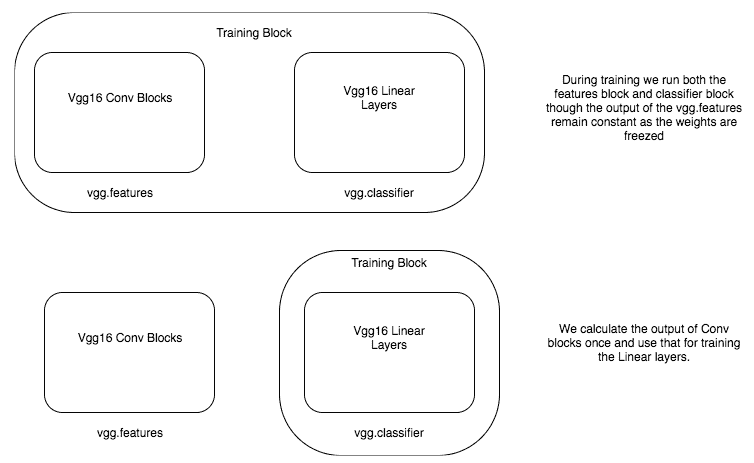

第一个框描述了通常的训练方式，因为我们在每个 epoch 计算卷积特征，尽管值不变，因此可能会很慢。在底部框中，我们只计算一次卷积特征，然后仅训练线性层。为了计算预卷积特征，我们需要通过卷积块传递所有训练数据，并将它们存储起来。为此，我们需要选择 VGG 模型的卷积块。幸运的是，PyTorch 实现的 VGG16 有两个序列模型，因此只需选择第一个序列模型的特征即可。以下代码为我们执行此操作：

```py
vgg = models.vgg16(pretrained=True) vgg = vgg.cuda()
features = vgg.features

training_data_loader = torch.utils.data.DataLoader(train,batch_size=32,num_workers=3,shuffle=False)
valid_data_loader = torch.utils.data.DataLoader(valid,batch_size=32,num_workers=3,shuffle=False)

def preconvfeat(dataset,model):
    conv_features = [] 
    labels_list = []
    for data in dataset: 
        inputs,labels = data
        if is_cuda:
            inputs , labels = inputs.cuda(),labels.cuda() 
        inputs , labels = Variable(inputs),Variable(labels) 
        output = model(inputs)
        conv_features.extend(output.data.cpu().numpy())
        labels_list.extend(labels.data.cpu().numpy())
    conv_features = np.concatenate([[feat] for feat in conv_features])

    return (conv_features,labels_list)
conv_feat_train,labels_train = preconvfeat(training_data_loader,features) conv_feat_val,labels_val = preconvfeat(valid_data_loader,features)
```

在前面的代码中，`preconvfeat` 方法接收数据集和 `vgg` 模型，并返回卷积特征以及相关的标签。其余的代码与前面的示例中用来创建数据加载器和数据集的代码类似。

一旦我们获得了训练集和验证集的卷积特征，我们可以创建一个 PyTorch 数据集和 `DataLoader` 类，这将简化我们的训练过程。以下代码创建了用于我们卷积特征的数据集和 `DataLoader`：

```py
class CustomDataset(Dataset):
def init (self,feat,labels): self.conv_feat = feat self.labels = labels
def len (self):
return len(self.conv_feat) def getitem (self,idx):
return self.conv_feat[idx],self.labels[idx]

training_feat_dataset = CustomDataset(conv_feat_train,labels_train) validation_feat_dataset = CustomDataset(conv_feat_val,labels_val)

training_feat_loader = DataLoader(training_feat_dataset,batch_size=64,shuffle=True)
validation_feat_loader = DataLoader(validation_feat_dataset,batch_size=64,shuffle=True)
```

由于我们有了新的数据加载器，它们生成了一批批的卷积特征和标签，我们可以使用在其他示例中使用过的相同训练函数。现在，我们将使用`vgg.classifier`作为模型来创建优化器和拟合方法。以下代码训练分类器模块以识别狗和猫。在 Titan X GPU 上，每个 epoch 不到五秒，否则可能需要几分钟：

```py
training_losses , training_accuracy = [],[] validation_losses , validation_accuracy = [],[]
for epoch in range(1,20): epoch_loss, epoch_accuracy =
fit_numpy(epoch,vgg.classifier,training_feat_loader,phase='training') validation_epoch_loss , validation_epoch_accuracy =
fit_numpy(epoch,vgg.classifier,validation_feat_loader,phase='validation') training_losses.append(epoch_loss) training_accuracy.append(epoch_accuracy) validation_losses.append(validation_epoch_loss) validation_accuracy.append(validation_epoch_accuracy)
```

# 理解 CNN 模型学习的内容

深度学习模型通常被认为是不可解释的。然而，有不同的技术可以帮助我们解释这些模型内部发生的情况。对于图像，卷积层学习到的特征是可解释的。在本节中，我们将探索两种流行的技术，以便理解卷积层。

# 从中间层可视化输出

可视化中间层的输出将帮助我们理解输入图像在不同层之间的转换方式。通常，每个层的输出称为**激活**。为此，我们应该提取中间层的输出，可以通过不同的方式完成。PyTorch 提供了一种称为`register_forward_hook`的方法，允许我们传递一个函数来提取特定层的输出。

默认情况下，PyTorch 模型只存储最后一层的输出，以便更有效地使用内存。因此，在检查中间层的激活输出之前，让我们学习如何从模型中提取输出。看看以下代码片段，它提取了输出。我们将逐步分析以理解发生了什么：

```py
vgg = models.vgg16(pretrained=True).cuda()

class LayerActivations(): features=None
def   init  (self,model,layer_num):
self.hook = model[layer_num].register_forward_hook(self.hook_fn) def hook_fn(self,module,input,output):
self.features = output.cpu() def remove(self):
self.hook.remove()

conv_out = LayerActivations(vgg.features,0) o = vgg(Variable(img.cuda())) conv_out.remove()
act = conv_out.features
```

我们首先创建一个预训练的 VGG 模型，从中提取特定层的输出。`LayerActivations`类指示 PyTorch 将该层的输出存储在`features`变量中。让我们逐个了解`LayerActivations`类内的每个函数。

`_init_`函数以模型和需要从中提取输出的层的层编号作为参数。我们在该层上调用`register_forward_hook`方法并传入一个函数。当 PyTorch 进行前向传播时，即当图像通过各层时，PyTorch 调用传递给`register_forward_hook`方法的函数。该方法返回一个句柄，可以用于注销传递给`register_forward_hook`方法的函数。

`register_forward_hook`方法将三个值传递给我们传递给它的函数。`module`参数允许我们访问层本身。第二个参数是`input`，它指的是流经该层的数据。第三个参数是`output`，允许我们访问转换后的输入或层的激活。我们将`features`变量的输出存储在`LayerActivations`类中。

第三个函数从`_init_`函数中获取钩子并取消注册函数。现在，我们可以传递模型和我们正在寻找的激活层的层数。让我们看看为不同层次的以下图像创建的激活：

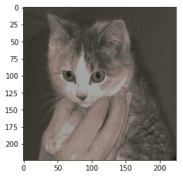

让我们可视化第一个卷积层生成的一些激活以及用于此目的的代码：

```py
fig = plt.figure(figsize=(20,50)) fig.subplots_adjust(left=0,right=1,bottom=0,top=0.8,hspace=0,
wspace=0.2)
for i in range(30):
ax = fig.add_subplot(12,5,i+1,xticks=[],yticks=[]) ax.imshow(act[0][i])
```

让我们可视化第五个卷积层生成的一些激活：

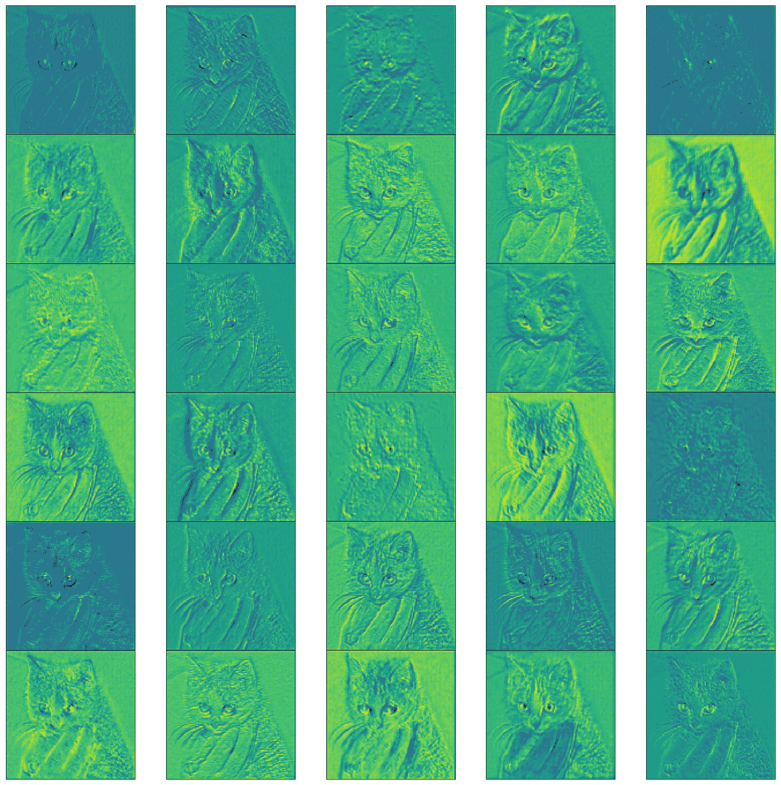

让我们来看看最后的 CNN 层：

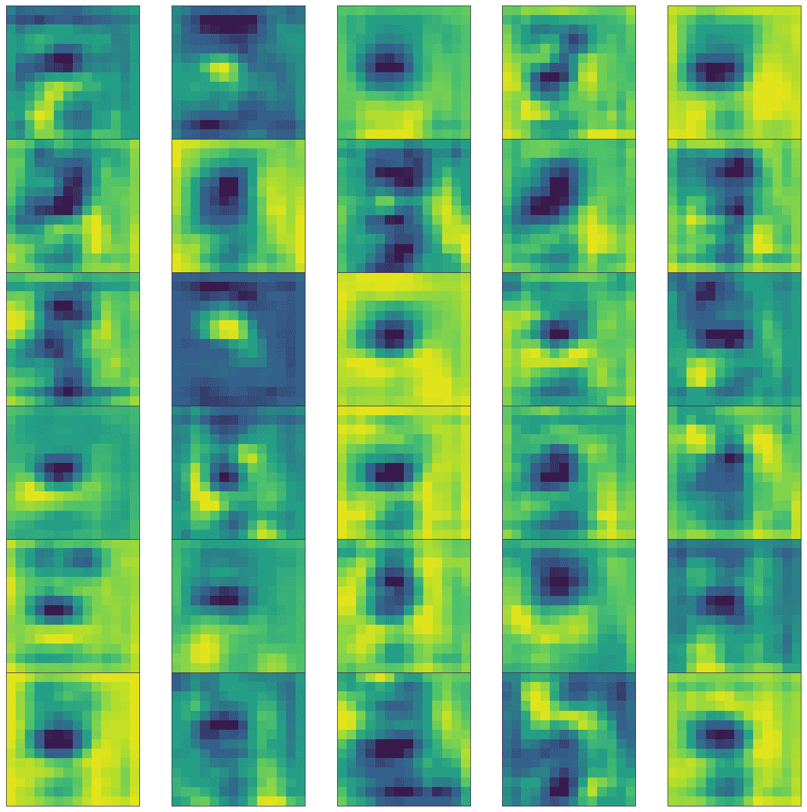

通过查看不同层生成的内容，我们可以看到早期层次检测线条和边缘，而最终层次则倾向于学习高级特征，不太可解释。

在我们继续可视化权重之前，让我们学习一下 ReLU 层之后的特征映射或激活在表现上是如何的。因此，让我们可视化第二层的输出。

如果您快速查看上述图像的第二行第五幅图像，它看起来像是滤波器在检测图像中的眼睛。当模型表现不佳时，这些可视化技巧可以帮助我们理解模型为何可能无法工作。

# 可视化 CNN 层的权重

获取特定层次的模型权重很简单。所有模型权重都可以通过`state_dict`函数访问。`state_dict`函数返回一个字典，其中`keys`为层，`weights`为其值。以下代码演示了如何提取特定层的权重并可视化它们：

```py
vgg.state_dict().keys()
cnn_weights = vgg.state_dict()['features.0.weight'].cpu()
```

上述代码给我们提供了以下输出：

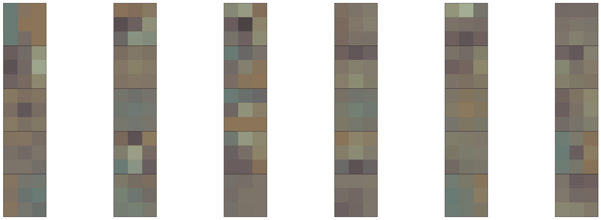

每个框代表一个大小为*3* x *3*的滤波器的权重。每个滤波器都经过训练，用于识别图像中的特定模式。

# 总结

在本章中，我们学习了如何使用卷积神经网络构建图像分类器，以及如何使用预训练模型。我们探讨了通过使用预卷积特征加速训练过程的技巧。我们还研究了了解 CNN 内部运行情况的不同技术。

在下一章中，我们将学习如何使用循环神经网络处理序列数据。
