# 第六章：序列数据的自然语言处理

在本章中，我们将看到不同的文本数据表示形式，这些形式对构建深度学习模型非常有用。我们将帮助您理解**循环神经网络**（**RNNs**）。本章将涵盖不同的 RNN 实现，如**长短期记忆**（**LSTM**）和**门控循环单元**（**GRU**），它们支持大多数文本和序列数据的深度学习模型。我们将研究文本数据的不同表示及其对构建深度学习模型的用处。此外，本章还将讨论可用于序列数据的一维卷积。

可以使用 RNN 构建的一些应用程序包括：

+   **文档分类器**：识别推文或评论的情感，分类新闻文章

+   **序列到序列学习**：用于诸如语言翻译、将英语转换为法语等任务

+   **时间序列预测**：根据前几天的销售记录预测商店的销售情况

本章将涵盖以下主题：

+   处理文本数据

+   通过构建情感分类器训练嵌入

+   使用预训练的词嵌入

+   递归神经网络

+   使用 LSTM 解决文本分类问题

+   序列数据上的卷积网络

+   语言建模

# 处理文本数据

文本是最常用的序列数据类型之一。文本数据可以看作是字符序列或单词序列。对于大多数问题，将文本视为单词序列是很常见的。深度学习的顺序模型，如 RNN 及其变种，能够从文本数据中学习重要的模式，以解决以下领域的问题：

+   自然语言理解

+   文档分类

+   情感分类

这些顺序模型也是各种系统的重要构建块，例如**问答**（**QA**）系统。

尽管这些模型在构建这些应用程序中非常有用，但由于其固有的复杂性，它们并不理解人类语言。这些顺序模型能够成功地发现有用的模式，然后用于执行不同的任务。将深度学习应用于文本是一个快速增长的领域，每个月都会出现许多新技术。我们将涵盖大多数现代深度学习应用程序的基本组件。

深度学习模型与其他机器学习模型一样，并不理解文本，因此我们需要将文本转换为数值表示。将文本转换为数值表示的过程称为**向量化**，可以通过以下不同方式完成：

+   将文本转换为单词，并将每个单词表示为向量

+   将文本转换为字符，并将每个字符表示为向量

+   创建单词的 n-gram，并将它们表示为向量

文本数据可以被分解为这些表示之一。文本的每个较小单元称为标记，将文本分解为标记的过程称为**分词**。Python 中有许多强大的库可以帮助我们进行分词。一旦我们将文本数据转换为标记，我们接下来需要将每个标记映射到一个向量。独热编码和词嵌入是将标记映射到向量的两种最流行的方法。以下图表总结了将文本转换为向量表示的步骤：

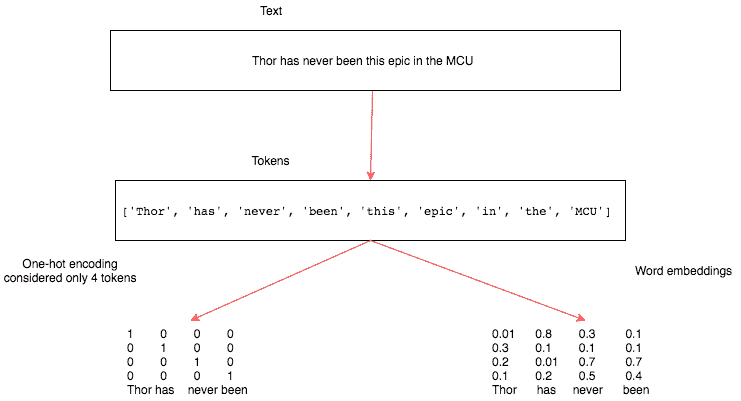

让我们更详细地了解分词、n-gram 表示和向量化。

# 分词

给定一个句子，将其分割为字符或单词称为分词。有一些库，比如 spaCy，提供了复杂的分词解决方案。让我们使用简单的 Python 函数如`split`和`list`来将文本转换为标记。

为了演示分词在字符和单词上的工作方式，让我们考虑一部电影*Toy Story*的简短评论。我们将使用以下文本：

```py
Just perfect. Script, character, animation....this manages to break free of the yoke of 'children's movie' to simply be one of the best movies of the 90's, full-stop.
```

# 将文本转换为字符

Python 的`list`函数接受一个字符串并将其转换为单个字符的列表。这完成了将文本转换为字符的任务。以下代码块展示了所使用的代码及其结果：

```py
toy_story_review = "Just perfect. Script, character, animation....this manages to break free of the yoke of 'children's movie' to simply be one of the best movies of the 90's, full-stop."

print(list(toy_story_review))
```

结果如下：

```py
['J', 'u', 's', 't', ' ', 'p', 'e', 'r', 'f', 'e', 'c', 't', '.', ' ', 'S', 'c', 'r', 'i', 'p', 't', ',', ' ', 'c', 'h', 'a', 'r', 'a', 'c', 't', 'e', 'r', ',', ' ', 'a', 'n', 'i', 'm', 'a', 't', 'i', 'o', 'n', '.', '.', '.', '.', 't', 'h', 'i', 's', ' ', 'm', 'a', 'n', 'a', 'g', 'e', 's', ' ', 't', 'o', ' ', 'b', 'r', 'e', 'a', 'k', ' ', 'f', 'r', 'e', 'e', ' ', 'o', 'f', ' ', 't', 'h', 'e', ' ', 'y', 'o', 'k', 'e', ' ', 'o', 'f', ' ', "'", 'c', 'h', 'i', 'l', 'd', 'r', 'e', 'n', "'", 's', ' ', 'm', 'o', 'v', 'i', 'e', "'", ' ', 't', 'o', ' ', 's', 'i', 'm', 'p', 'l', 'y', ' ', 'b', 'e', ' ', 'o', 'n', 'e', ' ', 'o', 'f', ' ', 't', 'h', 'e', ' ', 'b', 'e', 's', 't', ' ', 'm', 'o', 'v', 'i', 'e', 's', ' ', 'o', 'f', ' ', 't', 'h', 'e', ' ', '9', '0', "'", 's', ',', ' ', 'f', 'u', 'l', 'l', '-', 's', 't', 'o', 'p', '.']
```

这个结果展示了我们简单的 Python 函数如何将文本转换为标记。

# 将文本转换为单词

我们将使用 Python 字符串对象中提供的`split`函数来将文本分割成单词。`split`函数接受一个参数，基于这个参数将文本分割成标记。在我们的示例中，我们将使用空格作为分隔符。以下代码块演示了如何使用 Python 的`split`函数将文本转换为单词：

```py
print(list(toy_story_review.split()))
```

这将产生以下输出：

```py
['Just', 'perfect.', 'Script,', 'character,', 'animation....this', 'manages', 'to', 'break', 'free', 'of', 'the', 'yoke', 'of', "'children's", "movie'", 'to', 'simply', 'be', 'one', 'of', 'the', 'best', 'movies', 'of', 'the', "90's,", 'full-stop.']
```

在上述代码中，我们没有使用任何分隔符；默认情况下，`split`函数在空格上分割。

# N-gram 表示

我们看到文本如何表示为字符和单词。有时，查看两个、三个或更多单词一起的情况非常有用。**N-grams**是从给定文本中提取的单词组。在一个 n-gram 中，*n*表示可以一起使用的单词数。让我们看一个双字母词（*n=2*）的例子。我们使用 Python 的`nltk`包为`toy_story_review`生成了一个双字母词。以下代码块展示了双字母词的结果以及生成它的代码：

```py
from nltk import ngrams 
print(list(ngrams(toy_story_review.split(),2)))
```

这将产生以下输出：

```py
[('Just', 'perfect.'), ('perfect.', 'Script,'), ('Script,', 'character,'), ('character,', 'animation....this'), ('animation....this', 'manages'), ('manages', 'to'), ('to', 'break'), ('break', 'free'), ('free', 'of'), ('of', 'the'), ('the', 'yoke'), ('yoke', 'of'), ('of', "'children's"), ("'children's", "movie'"), ("movie'", 'to'), ('to', 'simply'), ('simply', 'be'), ('be', 'one'), ('one', 'of'), ('of', 'the'), ('the', 'best'), ('best', 'movies'), ('movies', 'of'), ('of', 'the'), ('the', "90's,"), ("90's,", 'full-stop.')]
```

`ngrams`函数接受一个单词序列作为其第一个参数，以及要分组的单词数作为第二个参数。以下代码块展示了三元组表示的样例以及用于生成它的代码：

```py
print(list(ngrams(toy_story_review.split(),3)))
```

这将产生以下输出：

```py
[('Just', 'perfect.', 'Script,'), ('perfect.', 'Script,', 'character,'), ('Script,', 'character,', 'animation....this'), ('character,', 'animation....this', 'manages'), ('animation....this', 'manages', 'to'), ('manages', 'to', 'break'), ('to', 'break', 'free'), ('break', 'free', 'of'), ('free', 'of', 'the'), ('of', 'the', 'yoke'), ('the', 'yoke', 'of'), ('yoke', 'of', "'children's"), ('of', "'children's", "movie'"), ("'children's", "movie'", 'to'), ("movie'", 'to', 'simply'), ('to', 'simply', 'be'), ('simply', 'be', 'one'), ('be', 'one', 'of'), ('one', 'of', 'the'), ('of', 'the', 'best'), ('the', 'best', 'movies'), ('best', 'movies', 'of'), ('movies', 'of', 'the'), ('of', 'the', "90's,"), ('the', "90's,", 'full-stop.')]
```

在上述代码中唯一改变的是*n*值，即函数的第二个参数。

许多监督学习机器学习模型，例如朴素贝叶斯，使用 n-gram 来改进其特征空间。n-gram 也用于拼写校正和文本摘要任务。

n-gram 表示的一个挑战是失去文本的顺序性质。它通常与浅层机器学习模型一起使用。这种技术在深度学习中很少使用，因为像 RNN 和 Conv1D 这样的架构会自动学习这些表示。

# 向量化

有两种常用方法将生成的标记映射到数字向量，称为 one-hot 编码和词嵌入。让我们通过编写一个简单的 Python 程序来理解如何将标记转换为这些向量表示。我们还将讨论每种方法的各种优缺点。

# One-hot 编码

在 one-hot 编码中，每个标记由长度为 *N* 的向量表示，其中 *N* 是词汇表的大小。词汇表是文档中唯一单词的总数。让我们以一个简单的句子为例，观察每个标记如何表示为 one-hot 编码向量。以下是句子及其相关标记表示：

*每天一个苹果，医生远离我说道医生。*

以前面的句子为例，其 one-hot 编码可以表示为以下表格格式：

| An | 100000000 |
| --- | --- |
| apple | 10000000 |
| a | 1000000 |
| day | 100000 |
| keeps | 10000 |
| doctor | 1000 |
| away | 100 |
| said | 10 |
| the | 1 |

该表格描述了标记及其 one-hot 编码表示。向量长度为九，因为句子中有九个唯一单词。许多机器学习库已经简化了创建 one-hot 编码变量的过程。我们将编写自己的实现以便更容易理解，并可以使用相同的实现来构建后续示例所需的其他特性。以下代码包含一个`Dictionary`类，其中包含创建唯一单词字典的功能，以及返回特定单词的 one-hot 编码向量的函数。让我们看一下代码，然后逐个功能进行解释：

```py
class Dictionary(object): 
    def init (self):
        self.word2index = {} 
        self.index2word = [] 
        self.length = 0

    def add_word(self,word):
        if word not in self.index2word: 
            self.indexword.append(word) 
            self.word2index[word] = self.length + 1 
            self.length += 1
        return self.word2index[word] 

    def len (self):
        return len(self.index2word) 

    def onehot_encoded(self,word):
        vec = np.zeros(self.length)
        vec[self.word2index[word]] = 1 
        return vec
```

上述代码提供了三个重要功能：

+   初始化函数 `init` 创建一个 `word2index` 字典，它将存储所有唯一单词及其索引。`index2word` 列表存储所有唯一单词，`length` 变量包含我们文档中的唯一单词总数。

+   `add_word` 函数接收一个单词并将其添加到 `word2index` 和 `index2word` 中，并增加词汇表的长度，前提是该单词是唯一的。

+   `onehot_encoded` 函数接收一个单词并返回一个长度为 *N* 的向量，全零，除了单词的索引处为一。如果传递的单词索引为二，则向量在索引为二处的值为一，其余所有值为零。

当我们定义了我们的`Dictionary`类后，让我们在我们的`toy_story_review`数据上使用它。下面的代码演示了如何构建`word2index`字典以及如何调用我们的`onehot_encoded`函数：

```py
dic = Dictionary()

for tok in toy_story_review.split(): dic.add_word(tok)
print(dic.word2index)
```

使用单热表示的一个挑战是数据过于稀疏，而且随着词汇表中唯一单词数量的增加，向量的大小会迅速增长。另一个局限是单热没有表现词语之间的内部关系。因此，单热表示在深度学习中很少使用。

# 单词嵌入

单词嵌入是在由深度学习算法解决的问题中代表文本数据的一种非常流行的方式。单词嵌入提供了填充有浮点数的单词的密集表示。向量维度根据词汇量的大小而变化。在训练阶段通常使用维度大小为 50、100、256、300 或者有时 1000 的单词嵌入。维度大小是一个我们需要在训练阶段调整的超参数。

如果我们尝试用单热表示表示大小为 20,000 的词汇表，那么我们最终会得到 20,000 x 20,000 个数字，其中大多数将为零。相同的词汇表可以用 20,000 x 维度大小的单词嵌入表示，其中维度大小可以是 10、50、300 等等。

创建单词嵌入的一种方法是为每个标记开始时使用随机数生成密集向量，然后训练一个模型，如文档分类器，用于情感分类。代表标记的浮点数将被调整，以便语义上更接近的单词具有类似的表示。为了理解它，让我们看下面的图表，我们在其中绘制了五部电影的二维图上的单词嵌入向量：

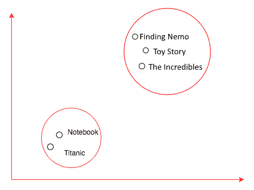

前面的图表显示了如何调整密集向量，以便使语义上相似的单词之间的距离更小。由于电影标题如*寻找尼莫*、*玩具总动员*和*超人特工队*都是虚构的卡通电影，因此这些单词的嵌入更接近。另一方面，电影*泰坦尼克号*的嵌入远离卡通片，更接近电影*恋恋笔记本*，因为它们都是浪漫电影。

当你的数据量太少时，学习单词嵌入可能不可行，在这些情况下，我们可以使用由其他机器学习算法训练的单词嵌入。从其他任务生成的嵌入称为预训练单词嵌入。我们将学习如何构建自己的单词嵌入并使用预训练单词嵌入。

# 通过构建情感分类器来训练单词嵌入

在上一节中，我们简要介绍了词嵌入而没有实现它。在本节中，我们将下载一个名为 IMDb 的数据集，其中包含评论，并构建一个情感分类器，计算评论情感是积极的、消极的还是未知的。在构建过程中，我们还将对 IMDb 数据集中出现的单词进行词嵌入训练。

我们将使用一个名为 `torchtext` 的库，它使得许多过程（如下载、文本向量化和批处理）更加简单。训练情感分类器将涉及以下步骤：

1.  下载 IMDb 数据并进行文本标记化

1.  构建词汇表

1.  生成向量批次

1.  使用嵌入创建网络模型

1.  训练模型

我们将在接下来的几节中详细介绍这些步骤。

# 下载 IMDb 数据并进行文本标记化

对于与计算机视觉相关的应用程序，我们使用了 `torchvision` 库，它为我们提供了许多实用函数，帮助构建计算机视觉应用程序。同样，还有一个名为 `torchtext` 的库，它专为与 PyTorch 一起工作而构建，通过提供不同的文本数据加载器和抽象来简化与**自然语言处理**（**NLP**）相关的许多活动。在撰写本文时，`torchtext` 并不随标准的 PyTorch 安装一起提供，需要单独安装。您可以在机器的命令行中运行以下代码来安装 `torchtext`：

```py
pip install torchtext
```

一旦安装完成，我们将能够使用它。 `torchtext` 下载提供了两个重要的模块，称为 `torchtext.data` 和 `torchtext.datasets`。

我们可以从以下链接下载 IMDb 电影数据集：

[`grouplens.org/datasets/movielens/`](https://grouplens.org/datasets/movielens/)

# 使用 `torchtext.data` 进行标记化

`torchtext.data` 实例定义了一个 `Field` 类，它帮助我们定义数据的读取和标记化方式。让我们看下面的例子，我们将用它来准备我们的 IMDb 数据集：

```py
from torchtext import data
text = data.Field(lower=True, batch_first=True,fix_length=20) 
label = data.Field(sequential=False)
```

在上面的代码中，我们定义了两个 `Field` 对象，一个用于实际文本，另一个用于标签数据。对于实际文本，我们希望 `torchtext` 将所有文本转换为小写，标记化文本并将其修剪到最大长度为 20。如果我们正在构建用于生产环境的应用程序，可能会将长度固定为更大的数字。但是，对于示例，这样做效果很好。`Field` 构造函数还接受另一个名为 `tokenize` 的参数，默认使用 `str.split` 函数。我们也可以指定 `spaCy` 或任何其他分词器作为参数。对于我们的示例，我们将坚持使用 `str.split`。

# 使用 `torchtext.datasets` 进行标记化

`torchtext.datasets`实例提供了使用不同数据集的包装器，如 IMDb、TREC（问题分类）、语言建模（WikiText-2）和其他几个数据集。我们将使用`torch.datasets`下载 IMDb 数据集并将其分割为训练集和测试集。以下代码执行此操作，第一次运行时可能需要几分钟（取决于您的宽带连接），因为它从互联网下载 IMDb 数据集：

```py
train, test = datasets.IMDB.splits(text, label)
```

先前数据集的`IMDB`类抽象了下载、分词和将数据库分为训练集和测试集的所有复杂性。`train.fields`下载包含一个字典，其中`TEXT`是键，`LABEL`是值。让我们看看`train.fields`及其每个元素`train`包含的内容：

```py
print('train.fields', train.fields)
```

这导致以下输出：

```py
#Results
train.fields {'text': <torchtext.data.field.Field object at 0x1129db160>, 'label': <torchtext.data.field.Field object at 0x1129db1d0>}
```

类似地，训练数据集的方差如下：

```py
print(vars(train[0]))
```

这导致以下输出：

```py
#Results
vars(train[0]) {'text': ['for', 'a', 'movie', 'that', 'gets', 'no', 'respect', 'there', 'sure', 'are', 'a', 'lot', 'of', 'memorable', 'quotes', 'listed', 'for', 'this', 'gem.', 'imagine', 'a', 'movie', 'where', 'joe', 'piscopo', 'is', 'actually', 'funny!', 'maureen', 'stapleton', 'is', 'a', 'scene', 'stealer.', 'the', 'moroni', 'character', 'is', 'an', 'absolute', 'scream.', 'watch', 'for', 'alan', '"the', 'skipper"', 'hale', 'jr.', 'as', 'a', 'police', 'sgt.'], 'label': 'pos'}
```

我们可以从这些结果中看到，单个元素包含一个字段和文本，以及表示文本的所有标记，以及一个包含文本标签的`label`字段。现在我们已经准备好进行 IMDb 数据集的批处理。

# 构建词汇表

当我们为`toy_story_review`创建了一种一热编码时，我们创建了一个`word2index`字典，它被称为词汇表，因为它包含了文档中唯一单词的所有详细信息。`torchtext`实例使这一切变得更加容易。一旦数据加载完成，我们可以调用`build_vocab`并传递必要的参数来构建数据的词汇表。以下代码展示了词汇表是如何构建的：

```py
text.build_vocab(train, vectors=GloVe(name='6B', dim=300),max_size=10000,min_freq=10)
label.build_vocab(train)
```

在上述代码中，我们传递了需要构建词汇表的`train`对象，并要求它使用维度为`300`的预训练嵌入来初始化向量。`build_vocab`对象只是下载并创建稍后在使用预训练权重训练情感分类器时将使用的维度。`max_size`实例限制了词汇表中单词的数量，而`min_freq`删除了任何出现次数不到 10 次的单词，其中`10`是可配置的。

一旦词汇表建立完成，我们可以获取不同的值，如频率、词索引和每个单词的向量表示。以下代码演示了如何访问这些值：

```py
print(text.vocab.freqs)
```

这导致以下输出：

```py
# A sample result 
Counter({"i'm": 4174,
         'not': 28597,
         'tired': 328,
         'to': 133967,
         'say': 4392,
         'this': 69714,
         'is': 104171,
         'one': 22480,
         'of': 144462,
         'the': 322198,
```

以下代码演示了如何访问结果：

```py
print(text.vocab.vectors)
```

这导致以下输出：

```py
#Results displaying the 300 dimension vector for each word.
0.0000 0.0000 0.0000 ... 0.0000 0.0000 0.0000
0.0000 0.0000 0.0000 ... 0.0000 0.0000 0.0000
0.0466 0.2132 -0.0074 ... 0.0091 -0.2099 0.0539
 ... ... ... 
0.0000 0.0000 0.0000 ... 0.0000 0.0000 0.0000
0.7724 -0.1800 0.2072 ... 0.6736 0.2263 -0.2919
0.0000 0.0000 0.0000 ... 0.0000 0.0000 0.0000
[torch.FloatTensor of size 10002x300]
```

类似地，我们将打印包含单词及其索引的字典的值如下：

```py
print(TEXT.vocab.stoi)
```

这导致以下输出：

```py
# Sample results
defaultdict(<function torchtext.vocab._default_unk_index>,
 {'<unk>': 0,
 '<pad>': 1,
 'the': 2,
 'a': 3,
 'and': 4,
 'of': 5,
 'to': 6,
 'is': 7,
 'in': 8,
 'i': 9,
 'this': 10,
 'that': 11,
 'it': 12,
```

`stoi`值提供了访问包含单词及其索引的字典。

# 生成向量的批次

`torchtext`下载提供了`BucketIterator`，它有助于批处理所有文本并用单词的索引号替换单词。`BucketIterator`实例带有许多有用的参数，例如`batch_size`、`device`（GPU 或 CPU）和`shuffle`（数据是否需要洗牌）。以下代码演示了如何创建为训练和测试数据集生成批次的迭代器：

```py
train_iter, test_iter = data.BucketIterator.splits((train, test), batch_size=128, device=-1,shuffle=True)
#device = -1 represents cpu , if you want gpu leave it to None.
```

前面的代码为训练和测试数据集提供了一个`BucketIterator`对象。下面的代码展示了如何创建一个批次并显示批次的结果：

```py
batch = next(iter(train_iter)) batch.text
```

这导致以下输出：

```py
#Results
Variable containing:
 5128 427 19 ... 1688 0 542
 58 2 0 ... 2 0 1352
 0 9 14 ... 2676 96 9
 ... ... ... 
 129 1181 648 ... 45 0 2
 6484 0 627 ... 381 5 2
 748 0 5052 ... 18 6660 9827
[torch.LongTensor of size 128x20]
```

我们将按以下方式打印标签：

```py
batch.label
```

这导致以下输出：

```py
#Results
Variable containing:
 2
 1
 2
 1
 2
 1
 1
 1
[torch.LongTensor of size 128]
```

根据前面代码块的结果，我们可以看到文本数据如何转换为大小为`(batch_size` * `fix_len`)的矩阵，即(128 x 20)。

# 创建一个带有嵌入的网络模型

我们之前简要讨论了词嵌入。在本节中，我们将词嵌入作为网络架构的一部分创建，并训练整个模型以预测每个评论的情感。在训练结束时，我们将得到一个情感分类器模型以及 IMDB 数据集的词嵌入。以下代码演示了如何创建一个网络架构来使用词嵌入来预测情感：

```py
class EmbeddingNetwork(nn.Module):
    def init(self,emb_size,hidden_size1,hidden_size2=400): 
        super().  init ()
        self.embedding = nn.Embedding(emb_size,hidden_size1) 
        self.fc = nn.Linear(hidden_size2,3)
    def forward(self,x):
        embeds = self.embedding(x).view(x.size(0),-1) 
        out = self.fc(embeds)
        return F.log_softmax(out,dim=-1)
```

在上述代码中，`EmbeddingNetwork`创建了情感分类的模型。在`_init_`函数内部，我们初始化了`nn.Embedding`类的一个对象，它接受两个参数，即词汇量的大小和我们希望为每个单词创建的维度。由于我们限制了唯一单词的数量，词汇量大小将为 10,000，并且我们可以从一个小的嵌入大小 10 开始。在快速运行程序时，使用小的嵌入大小是有用的，但是当您尝试构建用于生产系统的应用程序时，请使用较大的嵌入。我们还有一个线性层，将单词嵌入映射到类别（积极、消极或未知）。

前向函数确定如何处理输入数据。对于批次大小为 32 和句子最大长度为 20 个单词，我们将会得到形状为 32 x 20 的输入。第一个嵌入层充当查找表，用相应的嵌入向量替换每个单词。对于嵌入维度为 10，输出变为 32 x 20 x 10，因为每个单词被其对应的嵌入所替换。`view()`函数将会展平来自嵌入层的结果。传递给 view 的第一个参数将保持该维度不变。

在我们的情况下，我们不希望将来自不同批次的数据合并，因此我们保留第一维并展平张量中的其余值。应用`view()`函数后，张量形状变为 32 x 200。一个密集层将展平的嵌入映射到类别的数量。一旦网络定义好了，我们可以像往常一样训练网络。

请记住，在这个网络中，我们失去了文本的顺序性，我们只是将文本视为一袋词语。

# 训练模型

训练模型非常类似于我们构建图像分类器时所看到的，因此我们将使用相同的函数。我们通过模型传递数据批次，计算输出和损失，然后优化模型权重，包括嵌入权重。以下代码执行此操作：

```py
def fit(epoch,model,data_loader,phase='training',volatile=False): 
    if phase == 'training':
        model.train()
    if phase == 'validation': 
        model.evaluation() 
volatile=True
running_loss = 0.0
running_correct = 0
```

现在我们对数据集进行迭代：

```py
for batch_idx , batch in enumerate(data_loader):
    text, target = batch.text , batch.label 
    if is_cuda:
        text,target = text.cuda(),target.cuda() 
    if phase == 'training':
        optimizer.zero_grad() 
        output = model(text)
    loss = F.nll_loss(output,target) 
    running_loss += F.nll_loss(output,target,size_average=False).data[0] 
    predictions = output.data.max(dim=1,keepdim=True)[1]
    running_correct += predictions.eq(target.data.view_as(predictions)).cpu().sum() 
    if phase == 'training':
        loss.backward() 
        optimizer.step()
        loss = running_loss/len(data_loader.dataset)
        accuracy = 100\. * running_correct/len(data_loader.dataset) 
        print(f'{phase} loss is {loss:{5}.{2}} and {phase} accuracy is {running_correct}/{len(data_loader.dataset)}{accuracy:{10}.{4}}').format(loss,accuracy)
```

从这里开始，我们可以在每个 epoch 上训练模型：

```py
train_losses , train_accuracy = [],[] 
validation_losses , validation_accuracy = [],[]

train_iter.repeat = False
test_iter.repeat = False
for epoch in range(1,10): 
    epoch_loss, epoch_accuracy = fit(epoch,model,train_iter,phase='training')
    validation_epoch_loss, validation_epoch_accuracy = fit(epoch,model,test_iter,phase='validation')
    train_losses.append(epoch_loss) 
    train_accuracy.append(epoch_accuracy) 
    validation_losses.append(validation_epoch_loss) 
    validation_accuracy.append(validation_epoch_accuracy)
```

在上述代码中，我们通过传递用于批处理数据的`BucketIterator`对象来调用`fit`方法。默认情况下，迭代器不会停止生成批次，因此我们必须将`BucketIterator`对象的 repeat 变量设置为`False`。如果不将 repeat 变量设置为`False`，那么`fit`函数将无限运行。在大约 10 个 epoch 的训练后，模型达到了约 70%的验证准确率。现在您已经学会了通过构建情感分类器训练词嵌入，让我们在下一节中学习如何使用预训练词嵌入。

# 使用预训练词嵌入

预训练词嵌入在我们工作于特定领域时非常有用，例如医学和制造业，在这些领域中我们有大量数据可以用来训练嵌入。当我们的数据很少且不能有意义地训练嵌入时，我们可以使用在不同数据语料库（如维基百科、Google 新闻和 Twitter 推文）上训练的嵌入。许多团队都有使用不同方法训练的开源词嵌入。在本节中，我们将探讨`torchtext`如何使使用不同词嵌入更加容易，以及如何在我们的 PyTorch 模型中使用它们。这类似于在计算机视觉应用中使用的迁移学习。通常，使用预训练嵌入涉及以下步骤：

1.  下载嵌入

1.  加载模型中的嵌入

1.  冻结嵌入层权重

让我们详细探讨每个步骤的实现方式。

# 下载嵌入

`torchtext`库在下载嵌入和将其映射到正确单词时，抽象掉了许多复杂性。`torchtext`库在`vocab`模块中提供了三个类，即 GloVe、FastText、CharNGram，它们简化了下载嵌入和映射到我们词汇表的过程。每个类都提供了在不同数据集上训练的不同嵌入，并使用不同技术。让我们看一些不同的提供的嵌入：

+   `charngram.100d`

+   `fasttext.en.300d`

+   `fasttext.simple.300d`

+   `glove.42B.300d`

+   `glove.840B.300d`

+   `glove.twitter.27B.25d`

+   `glove.twitter.27B.50d`

+   `glove.twitter.27B.100d`

+   `` `glove.twitter.27B.200d` ``

+   `glove.6B.50d`

+   `glove.6B.100d`

+   `glove.6B.200d`

+   `glove.6B.300d`

`Field`对象的`build_vocab`方法接受一个用于嵌入的参数。以下代码解释了如何下载嵌入：

```py
from torchtext.vocab import GloVe 
TEXT.build_vocab(train, vectors=GloVe(name='6B', dim=300),max_size=10000,min_freq=10) 
LABEL.build_vocab(train,)
```

参数向量的值表示要使用的嵌入类。`name` 和 `dim` 参数确定可以使用哪些嵌入。我们可以轻松地从 `vocab` 对象中访问嵌入。下面的代码演示了它，以及结果将如何显示：

```py
TEXT.vocab.vectors
```

这导致以下输出：

```py
#Output
0.0000 0.0000 0.0000 ... 0.0000 0.0000 0.0000
0.0000 0.0000 0.0000 ... 0.0000 0.0000 0.0000
0.0466 0.2132 -0.0074 ... 0.0091 -0.2099 0.0539
... ...  ...

[torch.FloatTensor of size 10002x300]
```

现在我们已经下载并将嵌入映射到我们的词汇表中。让我们了解如何在 PyTorch 模型中使用它们。

# 在模型中加载嵌入

`vectors` 变量返回一个形状为 `vocab_size` x `dimensions` 的 torch 张量，其中包含预训练的嵌入。我们必须将嵌入分配给我们嵌入层的权重。我们可以通过访问嵌入层的权重来赋值嵌入的权重，如以下代码所示：

```py
model.embedding.weight.data = TEXT.vocab.vectors
```

`model` 下载代表我们网络的对象，`embedding` 代表嵌入层。由于我们使用了新维度的嵌入层，线性层的输入将会有所变化。下面的代码展示了新的架构，与我们之前训练嵌入时使用的架构类似：

```py
class EmbeddingNetwork(nn.Module):
def   init (self,embedding_size,hidden_size1,hidden_size2=400): super().  init ()
self.embedding = nn.Embedding(embedding_size,hidden_size1) self.fc1 = nn.Linear(hidden_size2,3)

def forward(self,x):
embeds = self.embedding(x).view(x.size(0),-1) out = self.fc1(embeddings)
return F.log_softmax(out,dim=-1)

model = EmbeddingNetwork(len(TEXT.vocab.stoi),300,12000)
```

一旦加载了嵌入，我们必须确保在训练期间不改变嵌入权重。让我们讨论如何实现这一点。

# 冻结嵌入层的权重

要告诉 PyTorch 不要改变嵌入层的权重是一个两步过程：

1.  将 `requires_grad` 属性设置为 `False`，这告诉 PyTorch 不需要这些权重的梯度。

1.  删除嵌入层参数传递给优化器。如果不执行此步骤，则优化器会抛出错误，因为它期望所有参数都有梯度。

下面的代码演示了冻结嵌入层权重以及指导优化器不使用这些参数是多么简单：

```py
model.embedding.weight.requires_grad = False
optimizer = optim.SGD([ param for param in model.parameters() if param.requires_grad == True],lr=0.001)
```

我们通常将所有模型参数传递给优化器，但在之前的代码中，我们传递了 `requires_grad` 为 `True` 的参数。

我们可以使用这段代码训练模型，并且应该达到类似的准确性。所有这些模型架构都未能充分利用文本的顺序特性。在下一节中，我们探讨了两种流行的技术，即 RNN 和 Conv1D，它们利用了数据的顺序特性。

# 递归神经网络

RNNs 是我们能够应对分类、序列数据标记、生成文本序列（例如 SwiftKey 键盘应用程序，预测下一个单词）、以及将一种序列转换为另一种序列（比如从法语翻译成英语）等应用中最强大的模型之一。大多数模型架构，如前馈神经网络，并不利用数据的序列性质。例如，我们需要数据来呈现每个示例的特征，以向量形式表示，比如表示句子、段落或文档的所有标记。前馈网络仅设计为一次性查看所有特征并将其映射到输出。让我们看一个文本示例，说明为什么文本的顺序或序列性质很重要。*I had cleaned my car* 和 *I had my car cleaned* 是两个英文句子，它们有相同的单词集合，但考虑单词顺序时它们的含义不同。

在大多数现代语言中，人类通过从左到右阅读单词并构建一个强大的模型来理解文本数据的各种内容。RNN 类似地通过逐次查看文本中的每个单词来工作。RNN 也是一种神经网络，其中有一个特殊的层，该层循环处理数据而不是一次性处理所有数据。由于 RNN 可以处理序列数据，我们可以使用不同长度的向量并生成不同长度的输出。以下图表提供了一些不同的表示方式：

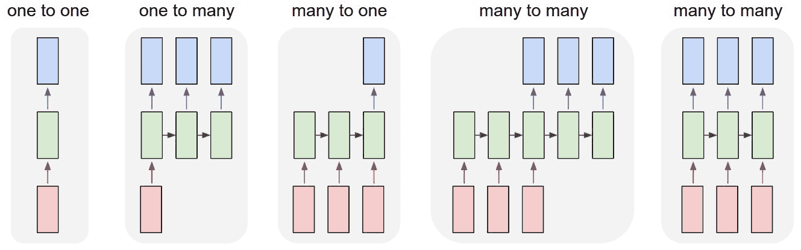

前面的图是来自有关 RNN 的著名博客之一（[`karpathy.github. io/2015/05/21/rnn-effectiveness`](http://karpathy.github.io/2015/05/21/rnn-effectiveness)），作者 Andrej Karpathy 在其中讲述了如何使用 Python 从零开始构建 RNN 并将其用作序列生成器。

# 通过示例理解 RNN 的工作方式

让我们假设我们已经构建了一个 RNN 模型，并试图理解它提供的功能。一旦我们理解了 RNN 的功能，我们再探讨 RNN 内部发生的事情。

让我们将 *Toy Story* 的评论作为 RNN 模型的输入。我们正在查看的示例文本是 *Just perfect. Script, character, animation....this manages to break free....*。我们从将第一个单词 *just* 传递给我们的模型开始，模型生成两种不同的东西：一个**状态向量**和一个**输出**向量。**状态向量**在模型处理评论中的下一个单词时被传递，并生成一个新的**状态向量**。我们只考虑模型在最后一个序列期间生成的**输出**。以下图表总结了这一点：

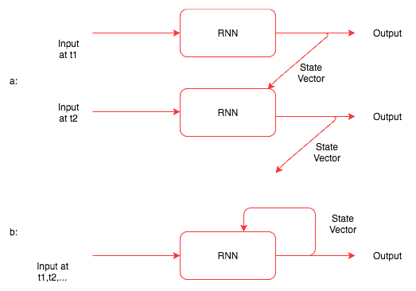

上述图示演示了以下内容：

+   通过展开文本输入和图像来理解 RNN 的工作方式

+   状态如何递归地传递给同一个模型

到目前为止，您已经对 RNN 的工作有了一定了解，但不知道其具体工作原理。在我们深入研究其工作原理之前，让我们看一下展示我们所学内容更详细的代码片段。我们仍将视 RNN 为一个黑箱：

```py
rnn = RNN(input_size, hidden_size,output_size) 
for i in range(len(toy_story_review):
        output, hidden = rnn(toy_story_review[i], hidden)
```

在上述代码中，`hidden` 变量表示状态向量，有时称为**隐藏状态**。现在，我们应该对 RNN 的使用有所了解了。接下来，让我们看一下实现 RNN 并理解 RNN 内部发生了什么的代码。以下代码包含 `RNN` 类：

```py
import torch.nn as nn
from torch.autograd import Variable

class RNN(nn.Module):
    def   init (self, input_size, hidden_size, output_size): 
        super(RNN, self). init ()
        self.hidden_size = hidden_size
        self.i2h = nn.Linear(input_size + hidden_size, hidden_size) 
        self.i2o = nn.Linear(input_size + hidden_size, output_size) 
        self.softmax = nn.LogSoftmax(dim=1)

    def forward(self, input, hidden):
        combined = torch.cat((input, hidden), 1) 
        hidden = self.i2h(combined)
        output = self.i2o(combined)
        output = self.softmax(output) 
        return output, hidden

    def initHidden(self):
        return Variable(torch.zeros(1, self.hidden_size))
```

除了上述代码中的 RNN 一词外，其他内容听起来与我们在前几章中使用的内容非常相似，因为 PyTorch 隐藏了很多反向传播的复杂性。让我们详细查看 `__init__` 函数和 `forward` 函数，了解其中发生了什么。

`__init__` 函数初始化了两个线性层，一个用于计算输出，另一个用于计算状态或隐藏向量。

`forward` 函数将输入向量和隐藏向量组合，并通过两个线性层传递，生成输出向量和隐藏状态。对于输出层，我们应用 `log_softmax` 函数。

`initHidden` 函数有助于在第一次调用 RNN 时创建没有状态的隐藏向量。让我们通过下面的图示来直观了解 RNN 类的功能：

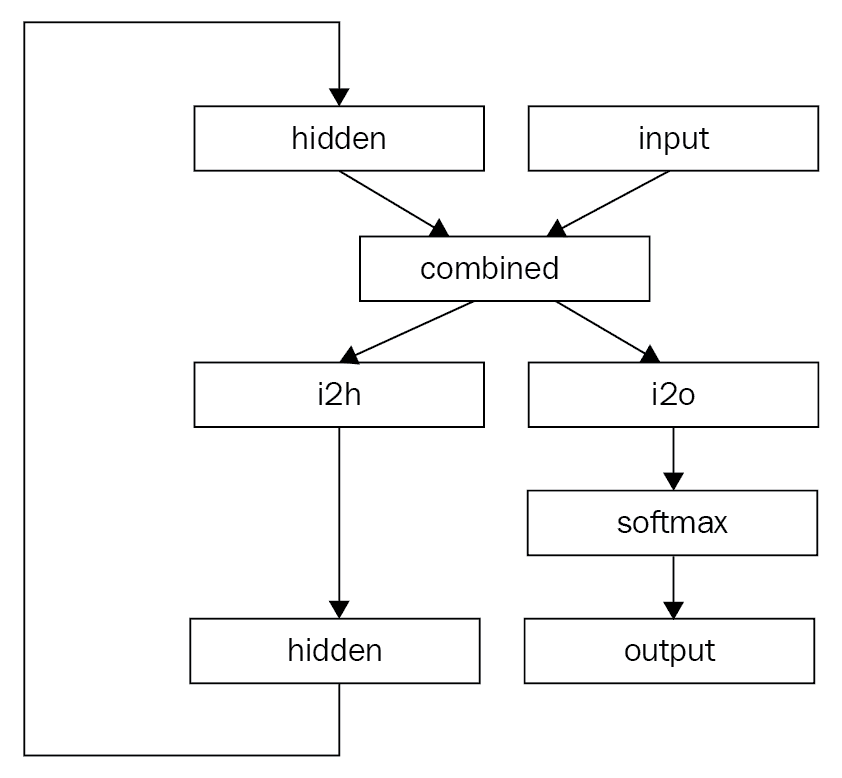

上述图示展示了 RNN 的工作原理。

RNN 的概念有时在第一次接触时可能难以理解，因此我强烈推荐阅读以下链接提供的一些令人惊叹的博客：[`karpathy.github.io/2015/05/21/rnn-effectiveness/`](http://karpathy.github.io/2015/05/21/rnn-effectiveness/) 和 [`colah.github.io/posts/2015-08-Understanding-LSTMs/.`](http://colah.github.io/posts/2015-08-Understanding-LSTMs/)

在下一节中，我们将学习如何使用称为 LSTM 的 RNN 变体构建 IMDB 数据集上的情感分类器。

# 使用 LSTM 解决文本分类问题

RNN 在构建实际应用中非常流行，例如语言翻译、文本分类等多种顺序问题。然而，在现实中，我们很少使用简单版本的 RNN，比如我们在前一节中看到的那种。简单版本的 RNN 存在问题，如处理大序列时的梯度消失和梯度爆炸。在大多数实际问题中，使用诸如 LSTM 或 GRU 等 RNN 变体，这些变体解决了普通 RNN 的限制，并且能更好地处理顺序数据。我们将尝试理解 LSTM 的工作原理，并基于 LSTM 构建网络，解决 IMDB 数据集上的文本分类问题。

# 长期依赖

理论上，RNN 应该从历史数据中学习所有必需的依赖关系，以建立下一个事件的上下文。例如，我们试图预测句子“The clouds are in the sky.”中的最后一个单词。RNN 可以预测，因为信息（clouds）仅在几个单词之后。让我们再来看一个长段落，依赖关系不需要那么紧密，我们想要预测其中的最后一个单词。这个句子是：“I am born in Chennai a city in Tamilnadu. Did schooling in different states of India and I speak...”在实践中，传统的 RNN 版本很难记住前面序列中发生的上下文。LSTMs 及其他 RNN 的不同变体通过在 LSTM 内部添加不同的神经网络来解决这个问题，稍后这些网络会决定可以记住多少或者可以记住什么数据。

# LSTM 网络

LSTMs 是一种特殊类型的 RNN，能够学习长期依赖关系。它们于 1997 年引入，并在最近几年因可用数据和硬件的进步而变得流行。它们在各种问题上表现出色，并被广泛应用。

LSTMs 通过设计来避免长期依赖问题，自然而然地记住信息长时间。在 RNN 中，我们看到它们在序列的每个元素上重复自己。在标准 RNN 中，重复模块将具有类似于单个线性层的简单结构。

下图显示了一个简单的循环神经网络是如何重复自身的：

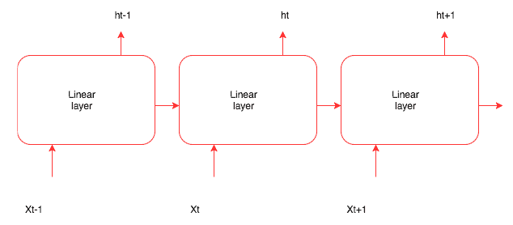

在 LSTM 内部，我们没有使用简单的线性层，而是在 LSTM 内部有更小的网络，这些网络执行独立的工作。下图展示了 LSTM 内部的情况：

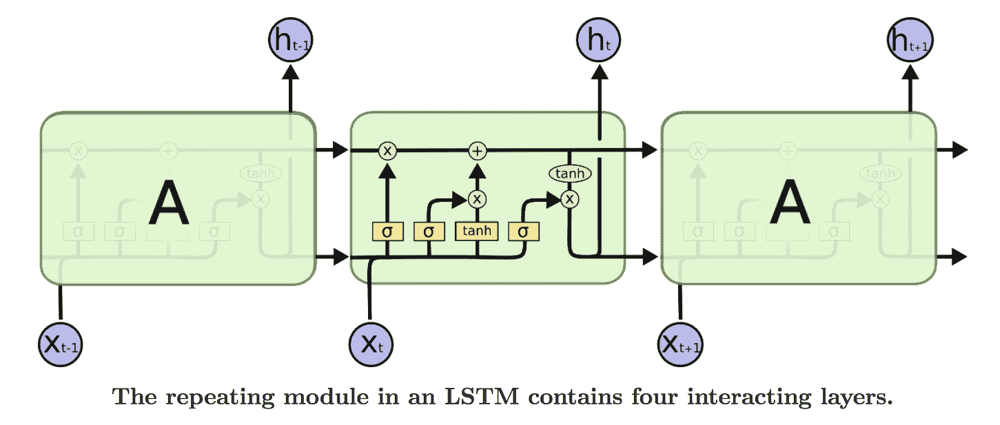

图片来源：[`colah.github.io/posts/2015-08-Understanding-LSTMs/`](http://colah.github.io/posts/2015-08-Understanding-LSTMs/)（由 Christopher Olah 绘制的图表）

在上述图中第二个框中，每个小矩形（黄色）框代表一个 PyTorch 层，圆圈代表一个元素矩阵或向量的加法，而合并线表示两个向量正在被串联。好处在于，我们无需手动实现所有这些。大多数现代深度学习框架提供了一个抽象，可以处理 LSTM 内部的所有功能。PyTorch 提供了`nn.LSTM`层内部所有功能的抽象，我们可以像使用任何其他层一样使用它。

LSTM 中最重要的是单元状态，它通过前面图表中的所有迭代表示为跨单元的水平线。 LSTM 内的多个网络控制信息如何在单元状态之间传播。 LSTM 中的第一步（由符号 σ 表示的小网络）是决定从单元状态中丢弃哪些信息。该网络称为**遗忘门**，并且具有 sigmoid 作为激活函数，输出每个元素在单元状态中的取值介于 0 和 1 之间。该网络（PyTorch 层）用以下公式表示：

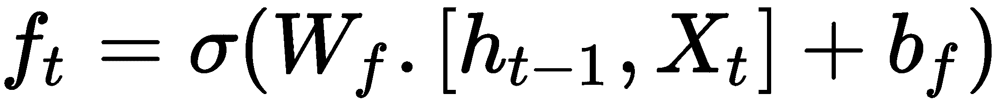

网络中的值决定了哪些值将保留在单元状态中，哪些将被丢弃。下一步是决定我们将添加到单元状态中的信息。这有两部分组成：一个称为输入门的 sigmoid 层，它决定要更新的值，以及一个创建新值添加到单元状态的 *tanh* 层。数学表示如下：

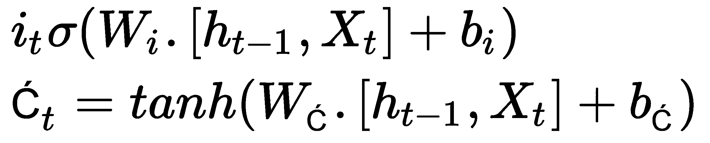

在下一步中，我们将输入门和 *tanh* 生成的两个值组合起来。现在，我们可以通过遗忘门与其和 *Ct* 乘积之和的逐元素乘法来更新单元状态，如下公式所示：

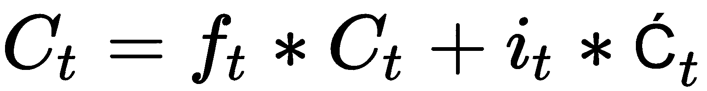

最后，我们需要决定输出，这将是单元状态的筛选版本。 LSTM 有不同的版本，大多数都采用类似的原理。作为开发人员或数据科学家，我们很少需要担心 LSTM 内部发生了什么。

如果您想更深入了解它们，请阅读以下博客链接，以非常直观的方式涵盖了许多理论内容。

查看 Christopher Olah 的关于 LSTM 的精彩博客（[`colah.github.io/posts/2015-08-Understanding-LSTMs`](http://colah.github.io/posts/2015-08-Understanding-LSTMs)），以及 Brandon Rohrer 的另一篇博客（[`brohrer.github.io/how_rnns_lstm_work.html`](https://brohrer.github.io/how_rnns_lstm_work.html)），他在一个很棒的视频中解释了 LSTM。

既然我们理解了 LSTM，让我们实现一个 PyTorch 网络，用于构建情感分类器。像往常一样，我们将遵循以下步骤来创建分类器：

1.  数据准备

1.  创建批次

1.  创建网络

1.  模型训练

我们将在接下来的章节详细讨论这些步骤。

# 数据准备

我们使用相同的 `torchtext` 库来下载、分词化和构建 IMDB 数据集的词汇表。在创建 `Field` 对象时，我们将 `batch_first` 参数保留为 `False`。RNN 需要数据的形式为 `sequence_length`、`batch_size` 和 `features.` 用于准备数据集的步骤如下：

```py
TEXT = data.Field(lower=True,fix_length=200,batch_first=False) 
LABEL = data.Field(sequential=False,)
train, test = IMDB.splits(TEXT, LABEL) 
TEXT.build_vocab(train, vectors=GloVe(name='6B', dim=300),max_size=10000,min_freq=10) 
LABEL.build_vocab(train,)
```

# 创建批次

我们使用 `torchtext BucketIterator` 函数创建批次，批次的大小将是序列长度和批次大小。对于我们的情况，大小将是 [200, 32]，其中 200 是序列长度，32 是批次大小。

以下是用于批处理的代码：

```py
train_iter, test_iter = data.BucketIterator.splits((train, test), batch_size=32, device=-1) 
train_iter.repeat = False 
test_iter.repeat = False
```

# 创建网络

让我们看一下代码，然后逐步理解。您可能会对代码看起来多么熟悉感到惊讶：

```py
class IMDBRnn(nn.Module):

    def   init (self,vocab,hidden_size,n_cat,bs=1,nl=2): 
        super().  init ()
        self.hidden_size = hidden_size 
        self.bs = bs
        self.nl = nl
        self.e = nn.Embedding(n_vocab,hidden_size) 
        self.rnn = nn.LSTM(hidden_size,hidden_size,nl) 
       self.fc2 = nn.Linear(hidden_size,n_cat) 
        self.softmax = nn.LogSoftmax(dim=-1)

    def forward(self,inp): 
        bs = inp.size()[1] 
        if bs != self.bs:
            self.bs = bs 
        e_out = self.e(inp) 
        h0 = c0 = Variable(e_out.data.new(*(self.nl,self.bs,self.hidden_size)).zero_()) 
        rnn_o,_ = self.rnn(e_out,(h0,c0))
        rnn_o = rnn_o[-1]
        fc = F.dropout(self.fc2(rnn_o),p=0.8) 
        return self.softmax(fc)
```

`init` 方法创建一个大小为词汇表大小和 `hidden_size` 的嵌入层。它还创建了一个 LSTM 和一个线性层。最后一层是一个 `LogSoftmax` 层，用于将线性层的结果转换为概率。

在`forward`函数中，我们传入大小为 [200, 32] 的输入数据，经过嵌入层处理，批次中的每个标记都被嵌入取代，大小变为 [200, 32, 100]，其中 100 是嵌入维度。LSTM 层接收嵌入层的输出和两个隐藏变量。这些隐藏变量应与嵌入输出的类型相同，它们的大小应为 [`num_layers`, `batch_size`, `hidden_size`]。LSTM 按顺序处理数据，并生成形状为 [`Sequence_length`, `batch_size`, `hidden_size`] 的输出，其中每个序列索引表示该序列的输出。在这种情况下，我们只取最后一个序列的输出，其形状为 [`batch_size`, `hidden_dim`]，并将其传递给线性层，将其映射到输出类别。由于模型容易过拟合，添加一个 dropout 层。您可以调整 dropout 的概率。

# 训练模型

网络创建完成后，我们可以使用与之前示例中相同的代码训练模型。以下是训练模型的代码：

```py
model = IMDBRnn(n_vocab,n_hidden,3,bs=32) 
model = model.cuda()

optimizer = optim.Adam(model.parameters(),lr=1e-3)

def fit(epoch,model,data_loader,phase='training',volatile=False): 
    if phase == 'training':
        model.train()
    if phase == 'validation': 
        model.eval() 
        volatile=True
    running_loss = 0.0
    running_correct = 0
    for batch_idx , batch in enumerate(data_loader): 
        text , target = batch.text , batch.label
        if is_cuda:
            text,target = text.cuda(),target.cuda() 

        if phase == 'training':
            optimizer.zero_grad() 
        output = model(text)
        loss = F.nll_loss(output,target) 

        running_loss += F.nll_loss(output,target,size_average=False).data[0] 
        preds = output.data.max(dim=1,keepdim=True)[1]
        running_correct += preds.eq(target.data.view_as(preds)).cpu().sum() 
        if phase == 'training':
            loss.backward() 
            optimizer.step()

    loss = running_loss/len(data_loader.dataset)
    accuracy = 100\. * running_correct/len(data_loader.dataset) 

    print(f'{phase} loss is {loss:{5}.{2}} and {phase} accuracy is {running_correct}/{len(data_loader.dataset)}{accuracy:{10}.{4}}')         return loss,accuracy

train_losses , train_accuracy = [],[]
validation_losses , validation_accuracy = [],[]

for epoch in range(1,5): 

    epoch_loss, epoch_accuracy =
fit(epoch,model,train_iter,phase='training')
    validation_epoch_loss , validation_epoch_accuracy =
fit(epoch,model,test_iter,phase='validation')
    train_losses.append(epoch_loss)
    train_accuracy.append(epoch_accuracy)
    validation_losses.append(validation_epoch_loss)
    validation_accuracy.append(validation_epoch_accuracy)
```

下面是训练模型的结果：

```py
training loss is 0.7 and training accuracy is 12564/25000 50.26
validation loss is 0.7 and validation accuracy is 12500/25000 50.0
training loss is 0.66 and training accuracy is 14931/25000 59.72
validation loss is 0.57 and validation accuracy is 17766/25000 71.06
training loss is 0.43 and training accuracy is 20229/25000 80.92
validation loss is 0.4 and validation accuracy is 20446/25000 81.78
training loss is 0.3 and training accuracy is 22026/25000 88.1
validation loss is 0.37 and validation accuracy is 21009/25000 84.04
```

对模型进行四个 epoch 的训练得到了 84% 的准确率。再训练更多 epoch 导致过拟合，因为损失开始增加。我们可以尝试一些技术，如减小隐藏维度、增加序列长度和使用较小的学习率来进一步提高准确性。

我们还将探讨如何在序列数据上使用一维卷积。

# 序列数据上的卷积网络

我们通过学习 第四章 *深度学习在计算机视觉中的应用* 中图像中 CNN 如何通过学习图像特征来解决计算机视觉问题。在图像中，CNN 通过在高度和宽度上进行卷积来工作。同样地，时间可以被视为卷积特征。一维卷积有时比 RNN 更好，并且计算成本更低。在过去几年中，像 Facebook 这样的公司展示了在音频生成和机器翻译方面的成功。在本节中，我们将学习如何使用 CNN 构建文本分类解决方案。

# 理解序列数据的一维卷积

在第四章，*计算机视觉的深度学习*，我们已经看到如何从训练数据中学习二维权重。这些权重在图像上移动以生成不同的激活。同样，一维卷积激活在训练我们的文本分类器时也是通过移动这些权重来学习模式。以下图示解释了一维卷积的工作原理：

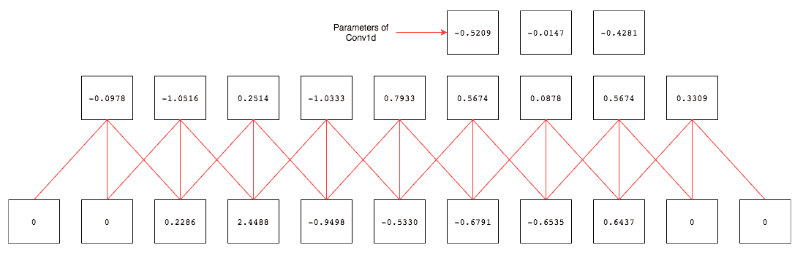

对 IMDB 数据集上的文本分类器进行训练时，我们将按照使用 LSTMs 构建分类器时遵循的相同步骤进行操作。唯一改变的是，我们使用`batch_first =` `True`，而不像我们的 LSTM 网络那样。所以，让我们看看网络、训练代码以及其结果。

# 创建网络

让我们先看看网络架构，然后逐步看代码：

```py
class IMDBCnn(nn.Module): 

    def
__init__(self,vocab,hidden_size,n_cat,bs=1,kernel_size=3,max_len=200):         super().__init__()
        self.hidden_size = hidden_size 
        self.bs = bs
    self.e = nn.Embedding(n_vocab,hidden_size)
    self.cnn = nn.Conv1d(max_len,hidden_size,kernel_size) 
    self.avg = nn.AdaptiveAvgPool1d(10)
        self.fc = nn.Linear(1000,n_cat)
        self.softmax = nn.LogSoftmax(dim=-1) 

    def forward(self,inp):
        bs = inp.size()[0] 
        if bs != self.bs:
            self.bs = bs 
        e_out = self.e(inp)
        cnn_o = self.cnn(e_out) 
        cnn_avg = self.avg(cnn_o)
        cnn_avg = cnn_avg.view(self.bs,-1)
        fc = F.dropout(self.fc(cnn_avg),p=0.5) 
        return self.softmax(fc)
```

在前面的代码中，我们不再使用 LSTM 层，而是使用了`Conv1d`层和`AdaptiveAvgPool1d`层。卷积层接受序列长度作为其输入大小，输出大小为隐藏大小，核大小为三。由于我们必须改变线性层的维度，所以每次我们尝试使用不同长度运行时，我们使用`AdaptiveAvgpool1d`层，它接受任何大小的输入并生成给定大小的输出。因此，我们可以使用一个大小固定的线性层。代码的其余部分与大多数网络架构中看到的相似。

# 训练模型

模型的训练步骤与前面的示例相同。让我们看看调用`fit`方法和生成的结果的代码：

```py
train_losses , train_accuracy = [],[] 
validation_losses , validation_accuracy = [],[]

for epoch in range(1,5): 

    epoch_loss, epoch_accuracy =
fit(epoch,model,train_iter,phase='training')
    validation_epoch_loss , validation_epoch_accuracy = fit(epoch,model,test_iter,phase='validation')
    train_losses.append(epoch_loss)
    train_accuracy.append(epoch_accuracy)
    validation_losses.append(validation_epoch_loss)
    validation_accuracy.append(validation_epoch_accuracy)
```

我们对模型进行了四个 epoch 的训练，得到了大约 83%的准确率。以下是运行模型的结果：

```py
training loss is 0.59 and training accuracy is 16724/25000 66.9
validation loss is 0.45 and validation accuracy is 19687/25000 78.75
training loss is 0.38 and training accuracy is 20876/25000 83.5
validation loss is 0.4 and validation accuracy is 20618/25000 82.47
training loss is 0.28 and training accuracy is 22109/25000 88.44
validation loss is 0.41 and validation accuracy is 20713/25000 82.85
training loss is 0.22 and training accuracy is 22820/25000 91.28
validation loss is 0.44 and validation accuracy is 20641/25000 82.56
```

自从三个 epoch 后验证损失开始增加，我停止了模型的运行。我们可以尝试几件事来改进结果，例如使用预训练权重、添加另一个卷积层以及在卷积之间尝试使用`MaxPool1d`层。我把这些尝试留给你来测试是否有助于提高准确性。现在我们已经学习了处理序列数据的各种神经网络，让我们在下一节中看看语言建模。

# 语言建模

语言建模是在给定前几个单词的情况下预测下一个单词的任务。生成这种顺序数据的能力在许多不同领域都有应用，如下所示：

+   图像字幕

+   语音识别

+   语言翻译

+   自动邮件回复

+   写故事、新闻文章、诗歌等

最初，这一领域的关注点主要集中在 RNNs，特别是 LSTMs 上。然而，自 2017 年引入 Transformer 架构（[`arxiv.org/pdf/1706.03762.pdf`](https://arxiv.org/pdf/1706.03762.pdf)）后，在 NLP 任务中变得普遍。此后出现了许多 Transformer 的修改版本，其中一些我们将在本章中介绍。

# 预训练模型

近年来，预训练模型在 NLP 任务中的使用引起了广泛关注。使用预训练语言模型的一个关键优势是它们能够用更少的数据学习。这些模型特别适用于标记数据稀缺的语言，因为它们只需要标记数据。

2015 年，戴安哲和 Q.V.勒在题为*半监督序列学习*的论文中首次提出了用于序列学习的预训练模型（[`arxiv.org/abs/1511.01432`](http://arxiv.org/abs/1511.01432)）。然而，直到最近，它们才被证明在广泛的任务中具有益处。现在我们将考虑近年来这一领域中一些值得注意的最新进展，其中包括但不限于以下内容：

+   **语言模型的嵌入**（**ELMo**）

+   **双向编码器表示来自 Transformers**（**BERT**）

+   **生成预训练变压器 2**（**GPT**-**2**）

# 语言模型的嵌入

2018 年 2 月，M. Peters 等人发表了*深度上下文化的单词表示*论文（[`arxiv.org/abs/1802.05365`](https://arxiv.org/abs/1802.05365)），介绍了 ELMo。本质上，它证明了语言模型嵌入可以作为目标模型中的特征，如下图所示：

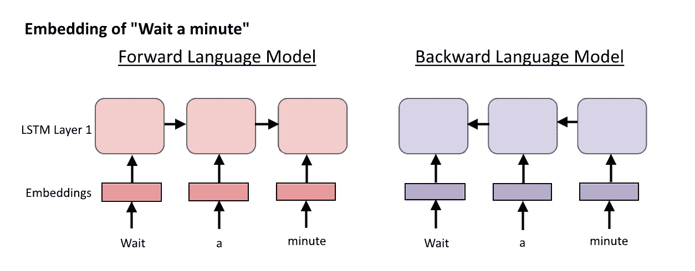

ELMo 使用双向语言模型来学习单词和上下文。正向和反向传递的内部状态在每个单词处被串联起来，以产生一个中间向量。正是模型的双向性质使其获得关于句子中下一个单词和之前单词的信息。

# 双向编码器表示来自 Transformers

谷歌在 2018 年 11 月发布的后续论文（[`arxiv.org/pdf/1810.04805.pdf`](https://arxiv.org/pdf/1810.04805.pdf)）中提出了**双向编码器表示来自 Transformers**（**BERT**），它融入了一个注意力机制，学习词与文本之间的上下文关系：

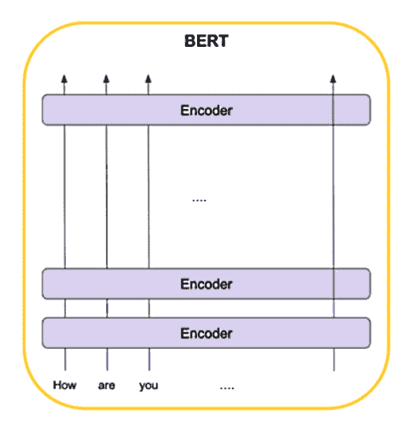

与 ELMo 不同，文本输入是按顺序（从左到右或从右到左）读取的，但是 BERT 会一次性读取整个单词序列。本质上，BERT 是一个经过训练的 Transformer 编码器堆栈。

# 生成预训练变压器 2

在撰写本文时，OpenAI 的 GPT-2 是设计用于提高生成文本的逼真度和连贯性的最先进的语言模型之一。它是在 2019 年 2 月的论文*Language Models are Unsupervised Multi-task Learners*（[`d4mucfpksywv.cloudfront.net/better-language-models/language_models_are_unsupervised_multitask_learners.pdf`](https://d4mucfpksywv.cloudfront.net/better-language-models/language_models_are_unsupervised_multitask_learners.pdf)）中介绍的。它被训练用于预测 800 万个网页（总共 40GB 的文本），参数达到 15 亿个，是 BERT 的四倍多。以下是 OpenAI 关于 GPT-2 的说法：

*GPT-2 生成连贯的段落文本，在许多语言建模基准上取得了最先进的性能，并在基本阅读理解、机器翻译、问题回答和摘要等方面表现出色，所有这些都没有经过特定任务的训练。*

最初，OpenAI 表示他们不会发布数据集、代码或完整的 GPT-2 模型权重。这是因为他们担心这些内容会被用于大规模生成欺骗性、偏见性或滥用性语言。这些模型应用于恶意目的的示例如下：

+   逼真的假新闻文章

+   在线实际模仿其他人

+   可能发布在社交媒体上的滥用或伪造内容

+   自动生产垃圾邮件或钓鱼内容

然后团队决定分阶段发布模型，以便让人们有时间评估社会影响并在每个阶段发布后评估其影响。

# PyTorch 实现

有一个来自开发者 Hugging Face 的流行 GitHub 仓库，其中实现了基于 PyTorch 的 BERT 和 GPT-2。可以在以下网址找到该仓库：[`github.com/huggingface/pytorch-pretrained-BERT`](https://github.com/huggingface/pytorch-pretrained-BERT)。该仓库最早于 2018 年 11 月发布，并允许用户从自己的数据中生成句子。它还包括多种可用于测试不同模型在不同任务（如问题回答、标记分类和序列分类）中应用效果的类。

下面的代码片段演示了如何从 GitHub 仓库中的代码使用 GPT-2 模型生成文本。首先，我们导入相关的库并初始化预训练信息如下：

```py
import torch
from torch.nn import functional as F
from pytorch_pretrained_bert import GPT2Tokenizer, GPT2LMHeadModel

tokenizer = GPT2Tokenizer.from_pretrained('gpt2')
gtp2model = GPT2LMHeadModel.from_pretrained('gpt2')
```

在这个例子中，我们将模型提供 `'We like unicorns because they'` 这个句子，然后它生成如下所示的词语：

```py
input_text = tokenizer.encode('We like unicorns because they')
input, past = torch.tensor([input_text]), None
for _ in range(25):
    logits, past = gtp2model(input, past=past)
    input = torch.multinomial(F.softmax(logits[:, -1]), 1)
    input_text.append(input.item())
```

以下是输出：

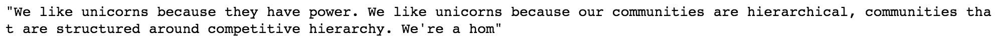

# GPT-2 游乐场

还有另一个有用的 GitHub 存储库来自开发者 ilopezfr，可以在以下链接找到：[`github.com/ilopezfr/gpt-2`](https://github.com/ilopezfr/gpt-2)。它还提供了一个 Google Colab 的笔记本，允许用户与 OpenAI GPT-2 模型进行交互和实验（[`colab.research.google.com/github/ilopezfr/gpt-2/blob/master/gpt-2-playground_.ipynb`](https://colab.research.google.com/github/ilopezfr/gpt-2/blob/master/gpt-2-playground_.ipynb)）。

下面是游乐场不同部分的一些示例：

+   **文本完成**部分：

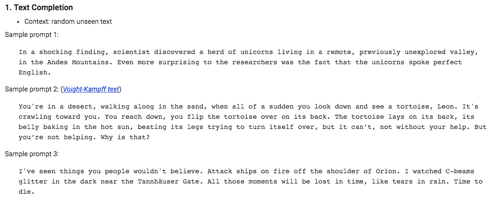

+   **问答**部分：

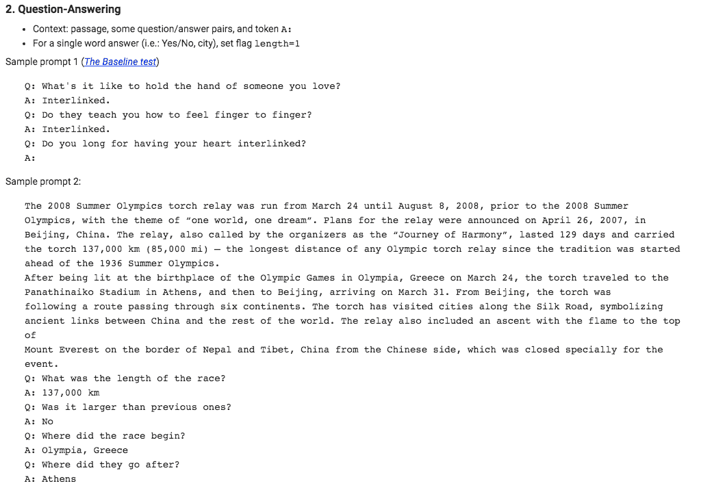

+   **翻译**部分：

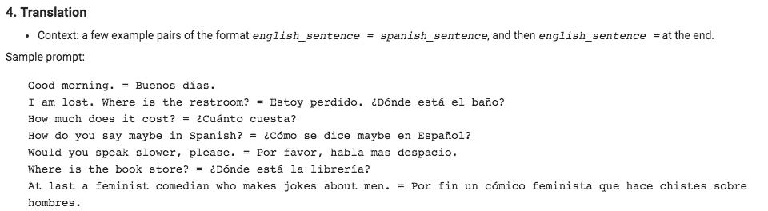

# 摘要

在本章中，我们学习了不同的技术来表示深度学习中的文本数据。我们学习了如何在处理不同领域时使用预训练的词嵌入和我们自己训练的嵌入。我们使用 LSTM 和一维卷积构建了文本分类器。我们还了解了如何使用最先进的语言建模架构生成文本。

在下一章中，我们将学习如何训练深度学习算法来生成时尚图像、新图像，并生成文本。
