# 实现自编码器

本章讨论了半监督学习算法的概念，通过引入自编码器，然后进入**受限玻尔兹曼机**（**RBMs**）和**深度信念网络**（**DBNs**），以理解数据的概率分布。本章将概述这些算法如何应用于一些实际问题。还将提供在 PyTorch 中实现的编码示例。

自编码器是一种无监督学习技术。它可以接收无标签的数据集，并通过建模来重建原始输入，将问题建模为无监督学习，而不是监督学习。自编码器的目标是使输入与输出尽可能相似。

具体来说，本章将涵盖以下主题：

+   自编码器及其应用概述

+   瓶颈和损失函数

+   不同类型的自编码器

+   受限玻尔兹曼机

+   深度信念网络

# 自编码器的应用

自编码器属于表征学习，用于找到输入的压缩表示。它们由编码器和解码器组成。以下图示显示了自编码器的结构：

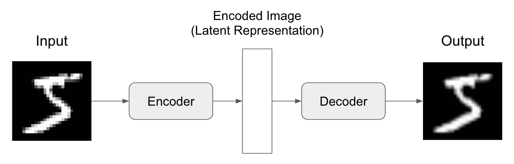

自编码器的应用示例包括以下几种：

+   数据去噪

+   数据可视化的降维

+   图像生成

+   插值文本

# 瓶颈和损失函数

自编码器对网络施加了一个瓶颈，强制使原始输入的知识表示被压缩。如果没有瓶颈的话，网络将简单地学会记忆输入值。因此，这意味着模型在未见数据上的泛化能力不会很好：

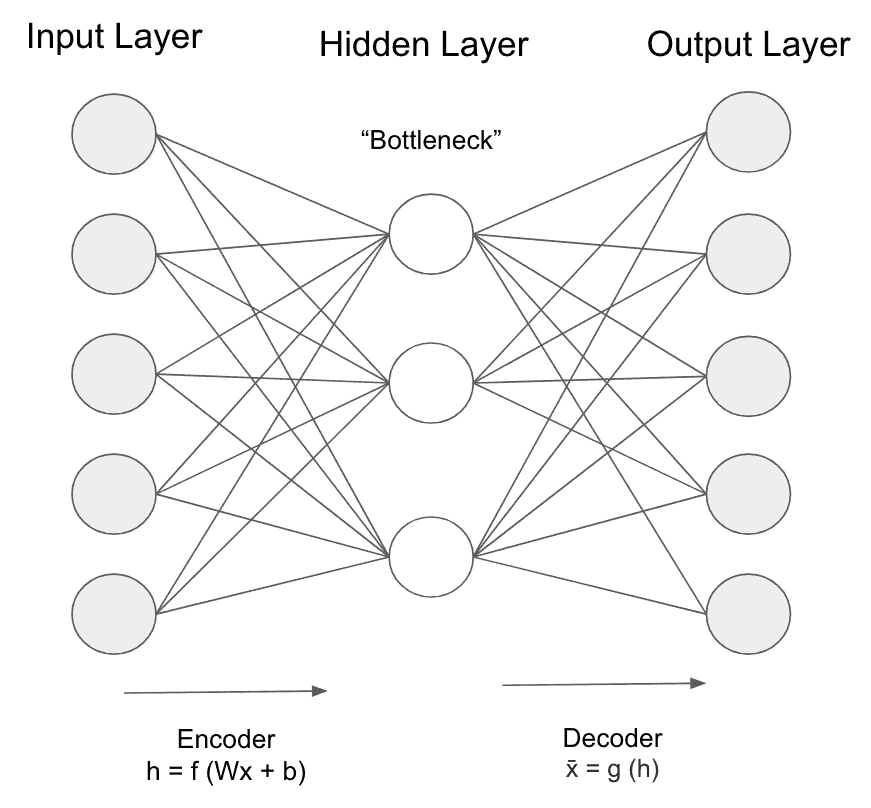

为了使模型能够检测到信号，我们需要它对输入具有敏感性，但不能简单地记住它们，而在未见数据上预测效果不佳。为了确定最优权衡，我们需要构建一个损失/成本函数：

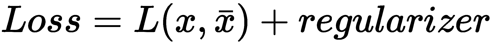

有一些常用的自编码器架构，用于施加这两个约束条件，并确保在两者之间有最优的权衡。

# 编码示例 - 标准自编码器

在本例中，我们将展示如何在 PyTorch 中编译一个自编码器模型：

1.  首先，导入相关的库：

```py
import os
from torch import nn
from torch.autograd import Variable
from torch.utils.data import DataLoader
from torchvision import transforms
from torchvision.datasets import MNIST
from torchvision.utils import save_image
```

1.  现在，定义模型参数：

```py
number_epochs = 10
batch_size = 128
learning_rate = 1e-4
```

1.  然后，初始化一个函数来转换 MNIST 数据集中的图像：

```py
transform_image = transforms.Compose([
    transforms.ToTensor(),
    transforms.Normalize((0.5, 0.5, 0.5), (0.5, 0.5, 0.5))
])

dataset = MNIST('./data', transform=transform_image)
data_loader = DataLoader(dataset, batch_size=batch_size, shuffle=True)
```

1.  定义自编码器类，用于提供数据并初始化模型：

```py
class autoencoder_model(nn.Module):
    def __init__(self):
        super(autoencoder_model, self).__init__()
        self.encoder = nn.Sequential(
            nn.Linear(28 * 28, 128),
            nn.ReLU(True),
            nn.Linear(128, 64),
            nn.ReLU(True), nn.Linear(64, 12), nn.ReLU(True), nn.Linear(12, 3))
        self.decoder = nn.Sequential(
            nn.Linear(3, 12),
           nn.ReLU(True),
            nn.Linear(12, 64),
            nn.ReLU(True),
            nn.Linear(64, 128),
            nn.ReLU(True), nn.Linear(128, 28 * 28), nn.Tanh())

    def forward(self, x):
        x = self.encoder(x)
        x = self.decoder(x)
        return x

model = autoencoder_model()
criterion = nn.MSELoss()
optimizer = torch.optim.Adam(
model.parameters(), lr=learning_rate, weight_decay=1e-5)
```

1.  定义一个函数，它将在每个 epoch 后从模型输出图像：

```py
def to_image(x):
    x = 0.5 * (x + 1)
    x = x.clamp(0, 1)
    x = x.view(x.size(0), 1, 28, 28)
    return x
```

1.  现在在每个 epoch 上运行模型并查看重建图像的结果：

```py
for epoch in range(number_epochs):
    for data in data_loader:
        image, i = data
        image = image.view(image.size(0), -1)
        image = Variable(image)

        # Forward pass
        output = model(image)
        loss = criterion(output, image)

        # Backward pass
        optimizer.zero_grad()
        loss.backward()
        optimizer.step()

    print('Epoch [{}/{}], Loss:{:.4f}'.format(epoch + 1, number_epochs, loss.data[0]))
    if epoch % 10 == 0:
        pic = to_image(output.cpu().data)
        save_image(pic, './mlp_img/image_{}.png'.format(epoch))

torch.save(model.state_dict(), './sim_autoencoder.pth')
```

这将产生以下输出：

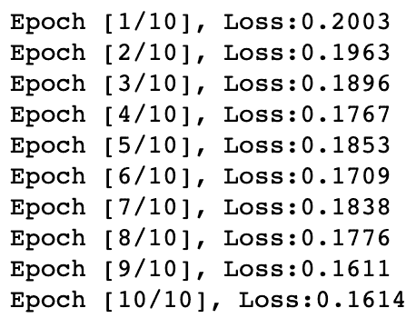

以下图片显示了每个 epoch 的自编码器输出：

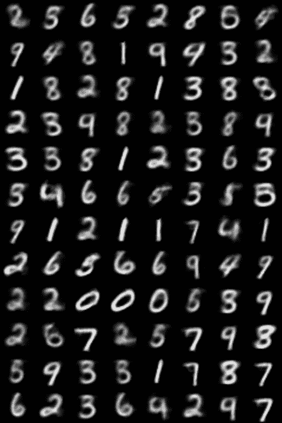

随着经过的 epoch 越来越多，图像变得越来越清晰，因为模型继续学习。

# 卷积自编码器

自编码器可以使用卷积而不是全连接层。这可以通过使用 3D 向量而不是 1D 向量来实现。在图像的背景下，对图像进行下采样迫使自编码器学习其压缩版本。

# 编码示例 – 卷积自编码器

在这个例子中，我们将展示如何编译一个卷积自编码器：

1.  与以前一样，您从 MNIST 数据集获取训练和测试数据集，并定义模型参数：

```py
number_epochs = 10
batch_size = 128
learning_rate = 1e-4

transform_image = transforms.Compose([
    transforms.ToTensor(),
    transforms.Normalize((0.5, 0.5, 0.5), (0.5, 0.5, 0.5))
])

dataset = MNIST('./data', transform=transform_image)
data_loader = DataLoader(dataset, batch_size=batch_size, shuffle=True)
```

1.  从这里开始，启动卷积自编码器模型：

```py
class conv_autoencoder(nn.Module):
    def __init__(self):
        super(conv_autoencoder, self).__init__()
        self.encoder = nn.Sequential(
            nn.Conv2d(1, 16, 3, stride=3, padding=1), 
            nn.ReLU(True),
            nn.MaxPool2d(2, stride=2), 
            nn.Conv2d(16, 8, 3, stride=2, padding=1), 
            nn.ReLU(True),
            nn.MaxPool2d(2, stride=1) 
        )
        self.decoder = nn.Sequential(
            nn.ConvTranspose2d(8, 16, 3, stride=2), 
            nn.ReLU(True),
            nn.ConvTranspose2d(16, 8, 5, stride=3, padding=1), 
            nn.ReLU(True),
            nn.ConvTranspose2d(8, 1, 2, stride=2, padding=1), 
            nn.Tanh()
        )

    def forward(self, x):
        x = self.encoder(x)
        x = self.decoder(x)
        return x

model = conv_autoencoder()
criterion = nn.MSELoss()
optimizer = torch.optim.Adam(model.parameters(), lr=learning_rate, weight_decay=1e-5)
```

1.  最后，在每个 epoch 运行模型同时保存输出图像以供参考：

```py
for epoch in range(number_epochs):
    for data in data_loader:
        img, i = data
        img = Variable(img)

        # Forward pass
        output = model(img)
        loss = criterion(output, img)

        # Backward pass
        optimizer.zero_grad()
        loss.backward()
        optimizer.step()
    # Print results
    print('epoch [{}/{}], loss:{:.4f}'
          .format(epoch+1, number_epochs, loss.data[0]))
    if epoch % 10 == 0:
        pic = to_image(output.cpu().data)
        save_image(pic, './dc_img/image_{}.png'.format(epoch))

torch.save(model.state_dict(), './convolutional_autoencoder.pth')
```

我们可以在代码中提到的文件夹中，每个 epoch 后查看保存的图像。

# 去噪自编码器

去噪编码器故意向网络的输入添加噪声。这些自编码器实质上创建了数据的损坏副本。通过这样做，这有助于编码器学习输入数据中的潜在表示，使其更具普适性：

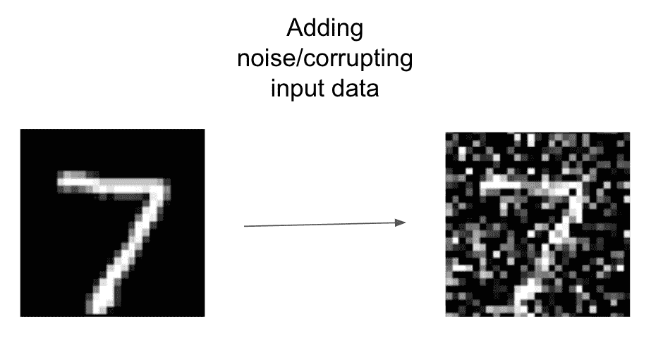

这个损坏的图像与其他标准自编码器一样被送入网络：

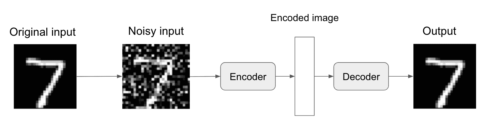

正如我们所见，原始输入中添加了噪声，编码器对输入进行编码并将其发送到解码器，解码器然后将嘈杂的输入解码为清理后的输出。因此，我们已经看过自编码器可以用于的各种应用。现在我们将看看一种特定类型的自编码器，即**变分自编码器**（**VAE**）。

# 变分自编码器

VAEs 与我们迄今考虑过的标准自编码器不同，因为它们以概率方式描述潜在空间中的观察结果，而不是确定性方式。每个潜在属性的概率分布被输出，而不是单个值。

标准自编码器在现实世界中的应用有些受限，因为它们只在您想要复制输入的数据时才真正有用。由于 VAEs 是生成模型，它们可以应用于您不希望输出与输入相同的数据的情况。

让我们在现实世界的背景下考虑这个问题。当在面部数据集上训练自编码器模型时，您希望它能学习潜在属性，比如一个人是否微笑，他们的肤色，是否戴眼镜等等：

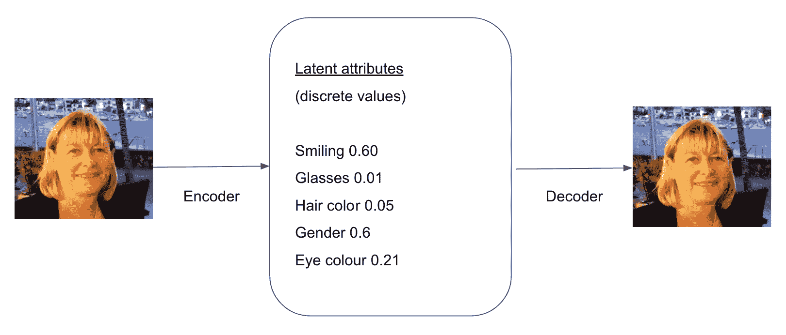

正如在前面的图中所示，标准自编码器将这些潜在属性表示为离散值。

如果我们允许每个特征在可能值的范围内而不是单个值内，我们可以使用 VAEs 以概率术语描述属性：


前面的图示了我们如何将一个人是否微笑表示为离散值或概率分布。

每个潜在属性的分布是从图像中采样的，以生成用作解码器模型输入的向量：

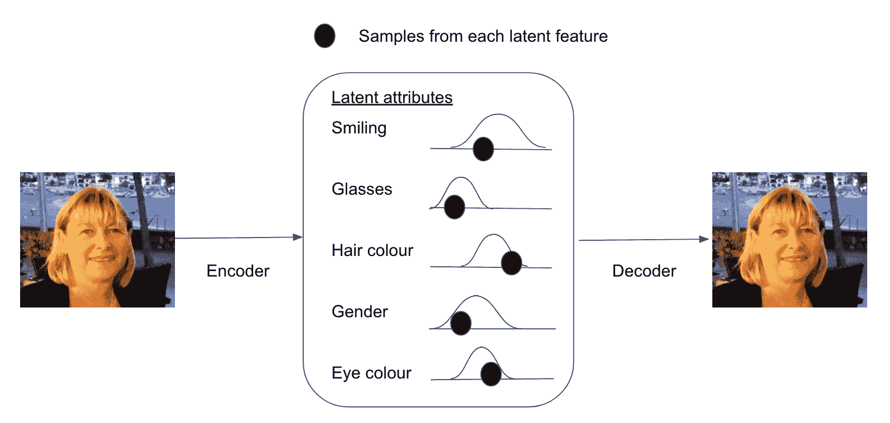

如下图所示，输出两个向量：

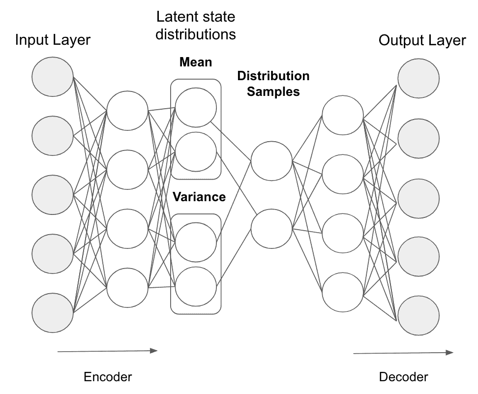

其中一个描述平均值，另一个描述分布的方差。

# 训练 VAE

在训练期间，我们使用反向传播计算网络中每个参数与整体损失的关系。

标准自动编码器使用反向传播来在网络权重上重建损失值。由于 VAE 中的采样操作不可微，不能从重构误差中传播梯度。以下图表进一步解释了这一点：

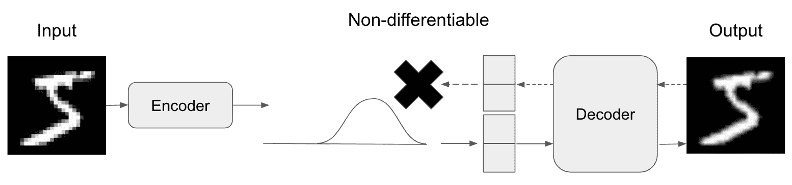

为了克服这一限制，可以使用重参数化技巧。重参数化技巧从单位正态分布中采样ε，将其平移至潜在属性的均值𝜇，并按潜在属性的方差𝜎进行缩放：

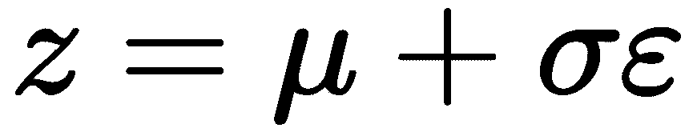

这将采样过程从梯度流中移除，因为现在它位于网络之外。因此，采样过程不依赖于网络中的任何东西。现在我们可以优化分布的参数，同时保持从中随机采样的能力：

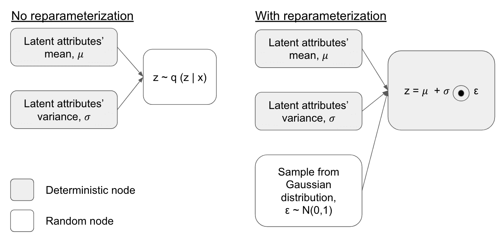

我们可以通过均值𝜇和协方差矩阵∑对其进行变换，因为每个属性的分布是高斯分布：

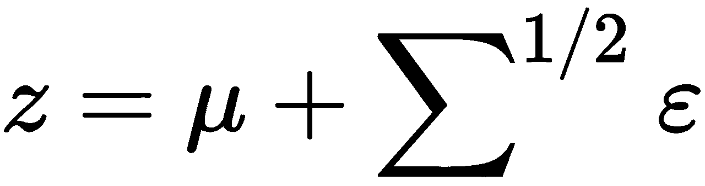

这里，ε ~ N(0,1)。

现在我们可以使用简单的反向传播来训练模型，并引入重参数化技巧：

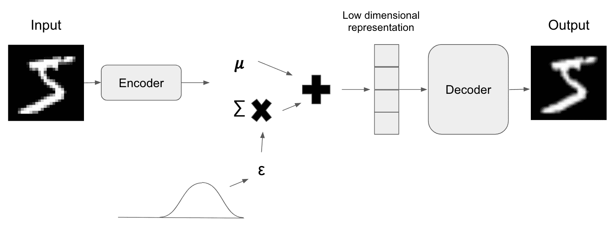

如前面的图表所示，我们已经训练了自动编码器以平滑图像。

# 编码示例 - VAE

要在 PyTorch 中编写 VAE，我们可以像在之前的示例中那样加载库和数据集。从这里，我们可以定义 VAE 类：

```py
class VariationalAutoEncoder(nn.Module):
    def __init__(self):
        super(VariationalAutoEncoder, self).__init__()

        self.fc1 = nn.Linear(784, 400)
        self.fc21 = nn.Linear(400, 20)
        self.fc22 = nn.Linear(400, 20)
        self.fc3 = nn.Linear(20, 400)
        self.fc4 = nn.Linear(400, 784)

    def encode_function(self, x):
        h1 = F.relu(self.fc1(x))
        return self.fc21(h1), self.fc22(h1)

    def reparametrize(self, mu, logvar):
        std = logvar.mul(0.5).exp_()
        if torch.cuda.is_available():
            eps = torch.cuda.FloatTensor(std.size()).normal_()
        else:
            eps = torch.FloatTensor(std.size()).normal_()
        eps = Variable(eps)
        return eps.mul(std).add_(mu)

    def decode_function(self, z):
        h3 = F.relu(self.fc3(z))
        return F.sigmoid(self.fc4(h3))

    def forward(self, x):
        mu, logvar = self.encode_function(x)
        z = self.reparametrize(mu, logvar)
        return self.decode_function(z), mu, logvar
```

然后，我们使用 KL 散度来定义损失函数，并初始化模型：

```py
def loss_function(reconstruction_x, x, mu, latent_log_variance):
    """
    reconstruction_x: generating images
    x: original images
    mu: latent mean
    """
    BCE = reconstruction_function(reconstruction_x, x) 
    # KL loss = 0.5 * sum(1 + log(sigma²) - mu² - sigma²)
    KLD_aspect = mu.pow(2).add_(latent_log_variance.exp()).mul_(-1).add_(1).add_(logvar)
    KLD = torch.sum(KLD_aspect).mul_(-0.5)
    # KL divergence
    return BCE + KLD

optimizer = optim.Adam(model.parameters(), lr=1e-4)
```

从这里，我们可以运行模型的每个时期并保存输出：

```py
for epoch in range(number_epochs):
    model.train()
    train_loss = 0
    for batch_idx, data in enumerate(data_loader):
        img, _ = data
        img = img.view(img.size(0), -1)
        img = Variable(img)
        if torch.cuda.is_available():
            img = img.cuda()
        optimizer.zero_grad()
        recon_batch, mu, logvar = model(img)
        loss = loss_function(recon_batch, img, mu, logvar)
        loss.backward()
        train_loss += loss.data[0]
        optimizer.step()
        if batch_idx % 100 == 0:
            print('Train Epoch: {} [{}/{} ({:.0f}%)]\tLoss: {:.6f}'.format(
                epoch,
                batch_idx * len(img),
                len(data_loader.dataset), 100\. * batch_idx / len(data_loader),
                loss.data[0] / len(img)))

    print('Epoch: {} Average loss: {:.4f}'.format(epoch, train_loss / len(data_loader.dataset)))
    if epoch % 10 == 0:
        save = to_image(recon_batch.cpu().data)
        save_image(save, './vae_img/image_{}.png'.format(epoch))

torch.save(model.state_dict(), './vae.pth')
```

现在我们已经看过各种自动编码器及其如何编译它们，让我们学习如何在推荐系统中实现它们。

# 受限玻尔兹曼机

**RBM**是一种广泛用于协同过滤、特征提取、主题建模和降维等任务的算法。它们可以无监督地学习数据集中的模式。

例如，如果你观看电影并说出你是否喜欢它，我们可以使用一个**RBM**来帮助我们确定你做出这个决定的原因。

RBM 的目标是最小化能量，由以下公式定义，其依赖于可见/输入状态、隐藏状态、权重和偏置的配置：

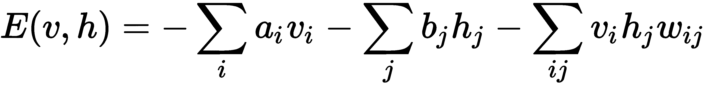

RBM 是 DBN 的基本构建块的两层网络。RBM 的第一层是神经元的可见/输入层，第二层是隐藏层的神经元：

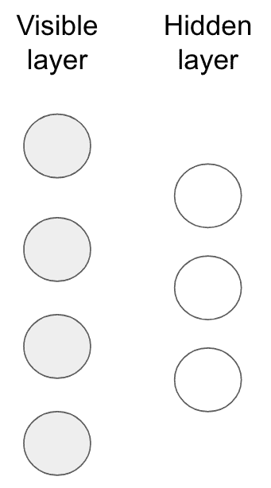

RBM 将输入从可见层翻译成一组数字。通过几次前向和后向传递，该数字然后被翻译回重构输入。在 RBM 中的限制是同一层中的节点不连接。

从训练数据集中的每个节点的低级特征被馈送到可见层的每个节点。在图像分类的情况下，每个节点将为图像中每个像素接收一个像素值：

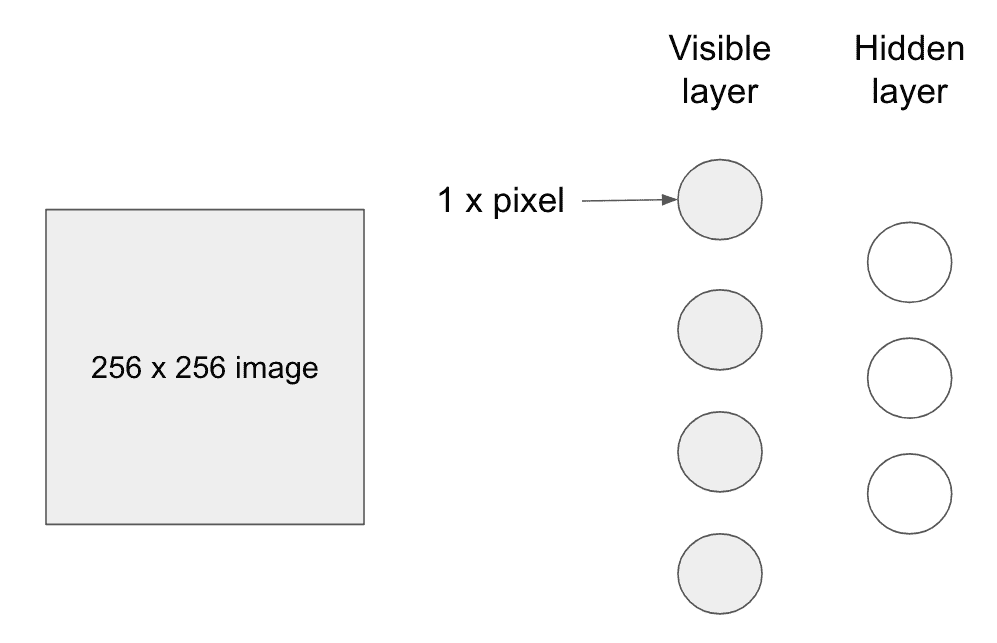

通过网络跟踪一个像素，输入*x*被隐藏层的权重乘以，然后加上偏置。然后，这被输入到激活函数中，产生输出，这实质上是通过它传递的信号强度，给定输入*x*，如下图所示：

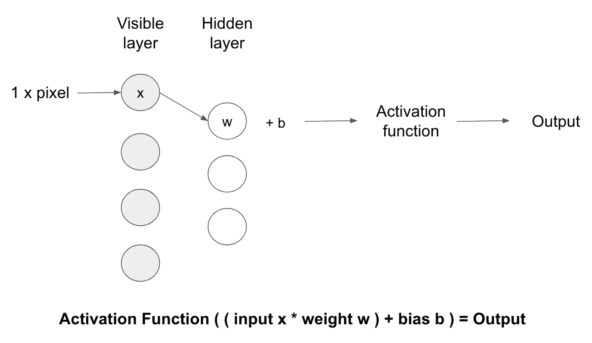

在隐藏层的每个节点，来自每个像素值的*x*被单独的权重乘以。然后将这些乘积求和，并添加偏置。然后将其输出通过激活函数，产生该单个节点的输出：

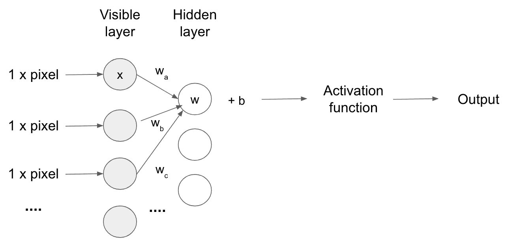

在每个时刻，RBM 处于某种状态，这指的是可见*v*和隐藏*h*层中神经元的值。这种状态的概率可以由以下联合分布函数给出：

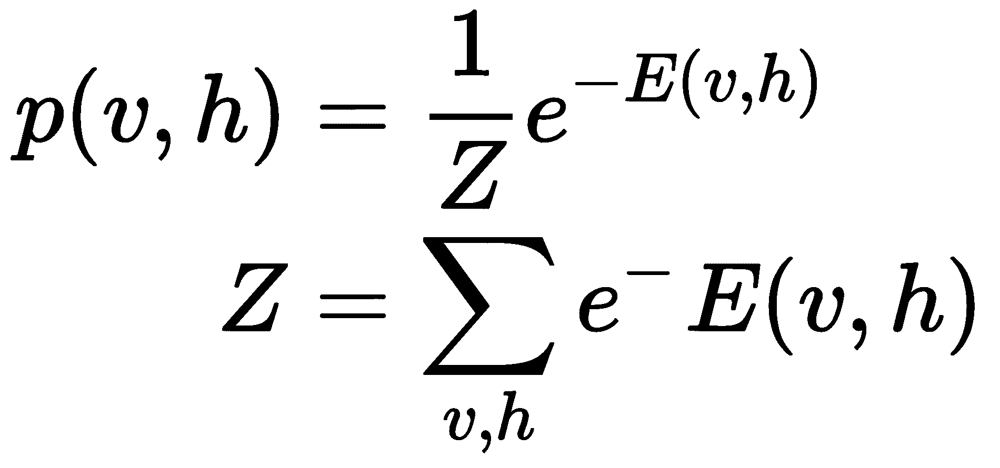

这里，Z 是分区函数，是对所有可能的可见和隐藏向量对的求和。

# 训练 RBM

在训练期间，RBM 执行两个主要步骤：

1.  **吉布斯采样**：训练过程的第一步使用吉布斯采样，它重复以下过程*k*次：

+   给定输入向量的隐藏向量的概率；预测隐藏值。

+   给定隐藏向量的输入向量的概率；预测输入值。从这里，我们获得另一个输入向量，该向量是从原始输入值重新创建的。

1.  **对比散度**：RBM 通过对比散度调整它们的权重。在此过程中，可见节点的权重是随机生成的，并用于生成隐藏节点。然后，隐藏节点再使用相同的权重重构可见节点。用于重构可见节点的权重在整个过程中是相同的。但是生成的节点不同，因为它们之间没有连接。

一旦 RBM 训练完成，它基本上能够表达两件事情：

+   输入数据特征之间的相互关系

+   在识别模式时哪些特征最重要

# 理论示例 - RBM 推荐系统

在电影的背景下，我们可以使用 RBM 揭示一组代表它们类型的潜在因素，从而确定一个人喜欢哪种电影类型。例如，如果我们要求某人告诉我们他们看过哪些电影以及是否喜欢，我们可以将它们表示为二进制输入（1 或 0）到 RBM 中。对于那些他们没看过或没告诉我们的电影，我们需要分配一个值为-1，这样网络在训练时可以识别并忽略它们的关联权重。

让我们考虑一个示例，用户喜欢*老妈妈，我来了*，*宿醉*和*伴娘*，不喜欢*尖叫*或*心理*，还没有看过*霍比特人*。根据这些输入，RBM 可能识别出三个隐藏因子：喜剧、恐怖和奇幻，这些因子对应于电影的类型：

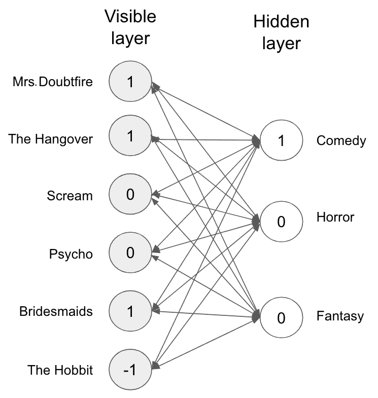

对于每个隐藏神经元，RBM 分配了给定输入神经元的隐藏神经元的概率。神经元的最终二进制值是通过从伯努利分布中抽样得到的。

在上面的例子中，代表喜剧类型的唯一隐藏神经元变得活跃。因此，给定输入到 RBM 的电影评分，它预测用户最喜欢喜剧电影。

对于已训练的 RBM 来说，要预测用户尚未看过的电影，基于他们的喜好，RBM 使用可见神经元给定隐藏神经元的概率。它从伯努利分布中进行抽样，以确定哪个可见神经元可以变为活跃状态。

# 编码示例 - RBM 推荐系统

继续在电影的背景下，我们将展示如何使用 PyTorch 库构建一个 RBM 推荐系统的示例。该示例的目标是训练一个模型来确定用户是否会喜欢一部电影。

在这个示例中，我们使用了 MovieLens 数据集（[`grouplens.org/datasets/movielens/`](https://grouplens.org/datasets/movielens/)），包含 100 万条评分，这个数据集由明尼苏达大学的 GroupLens 研究组创建：

1.  首先，下载数据集。可以通过终端命令完成如下操作：

```py
wget -O moviedataset.zip http://files.grouplens.org/datasets/movielens/ml-1m.zip
unzip -o moviedataset.zip -d ./data
unzip -o moviedataset.zip -d ./data
```

1.  现在导入我们将要使用的库：

```py
import numpy as np
import pandas as pd
import torch
import torch.nn as nn
import torch.nn.parallel
import torch.optim as optim
import torch.utils.data
from torch.autograd import Variable
```

1.  然后导入数据：

```py
movies = pd.read_csv('ml-1m/movies.dat', sep = '::', header = None, engine = 'python', encoding = 'latin-1')
users = pd.read_csv('ml-1m/users.dat', sep = '::', header = None, engine = 'python', encoding = 'latin-1')
ratings = pd.read_csv('ml-1m/ratings.dat', sep = '::', header = None, engine = 'python', encoding = 'latin-1')
```

以下截图展示了我们数据集的结构：

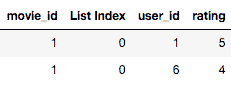

1.  准备测试和训练数据集：

```py
training_dataset = pd.read_csv('ml-100k/u1.base', delimiter = '\t')
training_dataset = np.array(training_set, dtype = 'int')
test_dataset = pd.read_csv('ml-100k/u1.test', delimiter = '\t')
test_dataset = np.array(test_dataset, dtype = 'int') 
```

1.  现在我们需要准备一个包含用户评分的矩阵。该矩阵将以用户为行，电影为列。零用于表示用户未对特定电影评分的情况。我们定义`no_users`和`no_movies`变量，然后考虑训练和测试数据集中的最大值如下：

```py
no_users = int(max(max(training_dataset[:,0]), max(test_dataset[:,0])))
no_movies = int(max(max(training_dataset[:,1]), max(test_dataset[:,1])))
```

1.  现在我们定义一个名为 `convert_dataset` 的函数，将数据集转换为矩阵。它通过创建一个循环来运行数据集，并获取特定用户评分的所有电影及该用户的评分。因为用户没有评级过的电影有许多，所以我们首先创建一个全零矩阵：

```py
def convert_dataset(data):
    converted_data = []
    for id_users in range(1, no_users + 1):
        id_movies = data[:,1][data[:,0] == id_users]
        id_ratings = data[:,2][data[:,0] == id_users]
        movie_ratings = np.zeros(no_movies)
        ratings[id_movies - 1] = id_ratings
        converted_data.append(list(movie_ratings))
    return converted_data

training_dataset = convert_dataset(training_dataset)
test_dataset = convert_dataset(test_dataset)
```

1.  现在我们使用 `FloatTensor` 实用程序将数据转换为 Torch 张量。这将把数据集转换为 PyTorch 数组：

```py
training_dataset = torch.FloatTensor(training_dataset)
test_dataset = torch.FloatTensor(test_dataset)
```

1.  在这个例子中，我们想要进行二元分类，即用户是否喜欢这部电影。因此，我们将评分转换为零和一。但是首先，我们将现有的零替换为 -1，以表示用户从未评级过的电影：

```py
training_dataset[training_dataset == 0] = -1
training_dataset[training_dataset == 1] = 0
training_dataset[training_dataset == 2] = 0
training_dataset[training_dataset >= 3] = 1
test_dataset[test_dataset == 0] = -1
test_dataset[test_dataset == 1] = 0
test_dataset[test_dataset == 2] = 0
test_dataset[test_dataset >= 3] = 1
```

1.  现在，我们需要创建一个类来定义 RBM 的架构。该类通过使用随机正态分布初始化权重和偏置。还定义了两种类型的偏置，其中 `a` 是给定可见节点时隐藏节点的概率，`b` 是给定隐藏节点时可见节点的概率。该类创建了一个 `sample_hidden_nodes` 函数，它以 `x` 作为参数并表示可见神经元。从这里，我们计算给定 `v` 的 `h` 的概率，其中 `h` 和 `v` 分别表示隐藏和可见节点。这代表了 S 型激活函数。它计算为权重向量和 `x` 的乘积加上偏置 `a`。由于我们考虑的是二元分类模型，我们返回隐藏神经元的伯努利样本。从这里，我们创建一个 `sample_visible_function` 函数，它将对可见节点进行采样。最后，我们创建训练函数。它接受包含电影评分的输入向量、*k* 次采样后获得的可见节点、概率向量以及 *k* 次采样后的隐藏节点的概率：

```py
class RBM():
    def __init__(self, num_visible_nodes, num_hidden_nodes):
        self.W = torch.randn(num_hidden_nodes, num_visible_nodes)
        self.a = torch.randn(1, num_hidden_nodes)
        self.b = torch.randn(1, num_visible_nodes)

    def sample_hidden_nodes(self, x):
        wx = torch.mm(x, self.W.t())
        activation = wx + self.a.expand_as(wx)
        p_h_given_v = torch.sigmoid(activation)
        return p_h_given_v, torch.bernoulli(p_h_given_v)

    def sample_visible_nodes(self, y):
        wy = torch.mm(y, self.W)
        activation = wy + self.b.expand_as(wy)
        p_v_given_h = torch.sigmoid(activation)
        return p_v_given_h, torch.bernoulli(p_v_given_h)

    def train(self, v0, vk, ph0, phk):
        self.W += torch.mm(v0.t(), ph0) - torch.mm(vk.t(), phk)
        self.b += torch.sum((v0 - vk), 0)
        self.a += torch.sum((ph0 - phk), 0)
```

1.  现在我们定义我们的模型参数：

```py
num_visible_nodes = len(training_dataset[0])
num_hidden_nodes = 200
batch_size = 100
rbm = RBM(num_visible_nodes, num_hidden_nodes)
```

1.  从这里，我们可以为每个 epoch 训练模型：

```py
nb_epoch = 10
for epoch in range(1, nb_epoch + 1):
    train_loss = 0
    s = 0.
    for id_user in range(0, nb_users - batch_size, batch_size):
        vk = training_dataset[id_user:id_user+batch_size]
        v0 = training_dataset[id_user:id_user+batch_size]
        ph0,_ = rbm.sample_hidden_nodes(v0)
        for k in range(10):
            _,hk = rbm.sample_hidden_nodes(vk)
            _,vk = rbm.sample_visible_nodes(hk)
            vk[v0<0] = v0[v0<0]
        phk,_ = rbm.sample_hidden_nodes(vk)
        rbm.train(v0, vk, ph0, phk)
        train_loss += torch.mean(torch.abs(v0[v0>=0] - vk[v0>=0]))
        s += 1.
    print('epoch: '+str(epoch)+' loss: '+str(train_loss/s))
```

我们可以在训练过程中绘制跨 epoch 的错误：

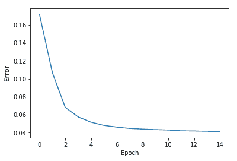

这可以帮助我们确定应该运行多少个 epoch 进行训练。显示在六个 epoch 后，改进的性能率下降，因此我们应该考虑在这个阶段停止训练。

我们已经看到了在 RBM 中实现推荐系统的编码示例，现在让我们简要地浏览一下 DBN 架构。

# DBN 架构

DBN 是一个多层信念网络，每一层都是一个叠加的 RBM。除了 DBN 的第一层和最后一层之外，每一层既作为其前面节点的隐藏层，又作为其后节点的输入层：

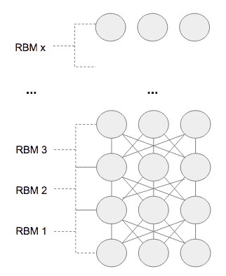

DBN 中的两个层通过权重矩阵连接。DBN 的顶部两层是无向的，它们之间形成对称连接，形成联想存储器。较低的两层直接连接到上面的层。方向感将联想存储器转换为观察变量：

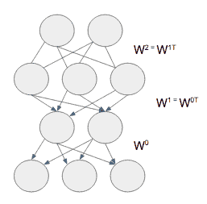

DBN 的两个最显著特性如下：

+   DBN 通过高效的逐层过程学习自顶向下的生成权重。这些权重决定了一个层中的变量如何依赖于上面的层。

+   训练完成后，可以通过单个自下而上的传递推断每层隐藏变量的值。传递从底层的可见数据向量开始，并使用其生成权重相反方向。

联合配置网络的概率在可见层和隐藏层之间的联合配置网络的能量依赖于所有其他联合配置网络的能量：

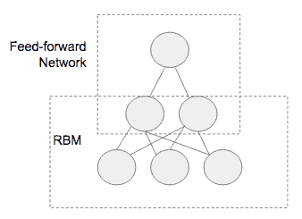

一旦 RBMs 堆栈完成了 DBN 的预训练阶段，就可以使用前向网络进行微调阶段，从而创建分类器或在无监督学习场景中简单地帮助聚类无标签数据。

# 微调

微调的目标是找到层间权重的最优值。它微调原始特征，以获得更精确的类边界。为了帮助模型将模式和特征关联到数据集，使用了一个小的标记数据集。

微调可以作为随机的自下而上传递应用，然后用于调整自上而下的权重。一旦达到顶层，递归被应用于顶层。为了进一步微调，我们可以进行随机的自上而下传递，并调整自下而上的权重。

# 总结

在本章中，我们解释了自编码器及其不同的变体。在整个章节中，我们提供了一些编码示例，展示它们如何应用于 MNIST 数据集。后来我们介绍了受限玻尔兹曼机，并解释了如何将其开发成深度玻尔兹曼机，同时提供了额外的示例。

在下一章中，我们将介绍生成对抗网络，并展示它们如何用于生成图像和文本。

# 进一步阅读

进一步的信息请参考以下内容：

+   *变分自编码器教程*: [`arxiv.org/abs/1606.05908`](https://arxiv.org/abs/1606.05908)

+   *CS598LAZ – 变分自编码器*: [`slazebni.cs.illinois.edu/spring17/lec12_vae.pdf`](http://slazebni.cs.illinois.edu/spring17/lec12_vae.pdf)

+   *自编码变分贝叶斯*: [`arxiv.org/abs/1312.6114`](https://arxiv.org/abs/1312.6114)

+   *深度学习书籍*: [`www.deeplearningbook.org/contents/autoencoders.html`](https://www.deeplearningbook.org/contents/autoencoders.html)

+   *深度信念网快速学习算法*: [`www.cs.toronto.edu/~fritz/absps/ncfast.pdf`](http://www.cs.toronto.edu/~fritz/absps/ncfast.pdf)

+   *训练受限玻尔兹曼机：简介*: [`www.sciencedirect.com/science/article/abs/pii/S0031320313002495`](https://www.sciencedirect.com/science/article/abs/pii/S0031320313002495)

+   *深度玻尔兹曼机*: [`proceedings.mlr.press/v5/salakhutdinov09a/salakhutdinov09a.pdf`](http://proceedings.mlr.press/v5/salakhutdinov09a/salakhutdinov09a.pdf)

+   *训练受限玻尔兹曼机实用指南*: [`www.cs.toronto.edu/~hinton/absps/guideTR.pdf`](https://www.cs.toronto.edu/~hinton/absps/guideTR.pdf)

+   *深度信念网络*: [`link.springer.com/chapter/10.1007/978-3-319-06938-8_8`](https://link.springer.com/chapter/10.1007/978-3-319-06938-8_8)

+   *实战神经网络:* [`www.amazon.co.uk/Hands-Neural-Networks-neural-network-ebook/dp/B07SKDSGB6/`](https://www.amazon.co.uk/Hands-Neural-Networks-neural-network-ebook/dp/B07SKDSGB6/)
