# 第八章：使用生成对抗网络进行工作

我们在前几章中看到的所有示例都集中在解决分类或回归等问题上。对于理解深度学习如何发展以解决无监督学习问题，本章非常有趣且重要。

在本章中，我们将训练网络学习如何创建以下内容：

+   基于内容和特定艺术风格的图像，通常称为风格转移

+   使用特定类型的**生成对抗网络**（**GAN**）生成新人脸。

这些技术构成了深度学习领域正在进行的大部分先进研究的基础。深入研究每个子领域的具体细节，如 GAN 和语言建模，超出了本书的范围，它们值得单独的一本书来探讨。我们将学习它们的一般工作原理以及在 PyTorch 中构建它们的过程。

本章将涵盖以下主题：

+   神经风格转移

+   介绍生成对抗网络

+   DCGANs

# 神经风格转移

我们人类以不同精度和复杂度生成艺术作品。尽管创建艺术的过程可能非常复杂，但可以看作是两个最重要因素的结合，即要画什么和如何画。要画什么受到我们周围所见的启发，而如何画也会受到我们周围某些事物的影响。从艺术家的角度来看，这可能是一种过于简化的看法，但对于理解如何使用深度学习算法创建艺术作品非常有用。

我们将训练一个深度学习算法，从一幅图像中提取内容，然后根据特定的艺术风格进行绘制。如果你是艺术家或者从事创意行业，你可以直接利用最近几年来进行的令人惊叹的研究来改进这一过程，并在你所工作的领域内创造出有趣的东西。即使你不是，它仍然可以向你介绍生成模型的领域，其中网络生成新的内容。

让我们从高层次理解神经风格转移的工作，并深入探讨相关细节，以及构建它所需的 PyTorch 代码。风格转移算法提供了一个内容图像（C）和一个风格图像（S）——算法必须生成一个新图像（O），其中包含来自内容图像的内容和来自风格图像的风格。这种神经风格转移的过程是由 Leon Gates 等人在 2015 年的论文*《艺术风格的神经算法》*中介绍的（[`arxiv.org/pdf/1508.06576.pdf`](https://arxiv.org/pdf/1508.06576.pdf)）。以下是我们将使用的内容图像（C）：


以下是风格图像（S）：


前述图片来源：来自葛饰北斋的《神奈川冲浪里》（[`commons.wikimedia.org/wiki/File:The_Great_Wave_off_Kanagawa.jpg`](https://commons.wikimedia.org/wiki/File:The_Great_Wave_off_Kanagawa.jpg)）

这是我们将得到的结果图片：

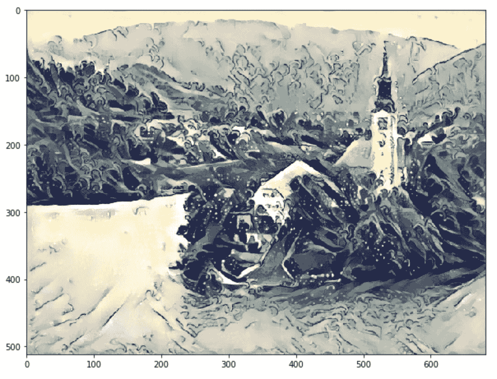

当你理解**卷积神经网络**（**CNNs**）的工作原理时，风格转移背后的思想变得清晰。 当 CNNs 被用于目标识别时，训练的早期层学习非常通用的信息，如线条，曲线和形状。 CNN 的最后几层捕捉图像的更高级概念，如眼睛，建筑物和树木。 因此，类似图像的最后几层的值往往更接近。 我们采用相同的概念并应用于内容损失。 内容图像和生成图像的最后一层应该类似，并且我们使用均方误差（MSE）来计算相似性。 我们使用优化算法降低损失值。

在 CNN 中，通过称为 Gram 矩阵的技术通常捕获图像的风格。 Gram 矩阵计算跨多个层捕获的特征图之间的相关性。 Gram 矩阵提供了计算风格的一种方法。类似风格的图像具有 Gram 矩阵的类似值。风格损失还使用风格图像的 Gram 矩阵与生成图像之间的均方误差（MSE）来计算。

我们将使用预训练的 VGG19 模型，该模型提供在 TorchVision 模型中。 训练样式转移模型所需的步骤与任何其他深度学习模型相似，唯一不同的是计算损失比分类或回归模型更复杂。 神经风格算法的训练可以分解为以下步骤：

1.  加载数据。

1.  创建一个 VGG19 模型。

1.  定义内容损失。

1.  定义风格损失。

1.  从 VGG 模型中提取跨层的损失。

1.  创建优化器。

1.  训练 - 生成类似于内容图像的图像和类似于样式图像的样式。

# 加载数据

加载数据类似于我们在第三章“深入神经网络”的解决图像分类问题中看到的。 我们将使用预训练的 VGG 模型，因此必须使用与预训练模型相同的值对图像进行归一化处理。

以下代码显示了如何实现此目标。 代码大部分是不言自明的，因为我们在前几章中已经详细讨论过它：

```py
image_size = 512 
is_cuda = torch.cuda.is_available()
preprocessing = transforms.Compose([transforms.Resize(image_size),
                           transforms.ToTensor(),
                           transforms.Lambda(lambda x: x[torch.LongTensor([2,1,0])]), 
                           transforms.Normalize(mean=[0.40760392, 0.45795686, 0.48501961], 
                                                std=[1,1,1]),
                           transforms.Lambda(lambda x: x.mul_(255)),
                          ])
processing = transforms.Compose([transforms.Lambda(lambda x: x.mul_(1./255)),
                           transforms.Normalize(mean=[-0.40760392, -0.45795686, -0.48501961], 
                                                std=[1,1,1]),
                           transforms.Lambda(lambda x: x[torch.LongTensor([2,1,0])]), 
                           ])
postprocess = transforms.Compose([transforms.ToPILImage()])

def postprocess_b(tensor): 
    t = processing(tensor)
    t[t>1] = 1 
    t[t<0] = 0
    img = postprocess(t)
    return img
```

在此代码中，我们定义了三个功能：`preprocess` 执行所有必需的预处理，并使用与训练 VGG 模型时相同的标准化值。模型的输出需要被归一化回其原始值；`processing` 函数执行所需的处理。生成的模型可能超出接受值的范围，`postprocess_b` 函数将所有大于一的值限制为一，并将小于零的值限制为零。

现在我们定义 `loader` 函数，它加载图像，应用 `preprocessing` 转换，并将其转换为变量：

```py
def loader(image_name):
    image = Image.open(image_name)
    image = Variable(preprocessing(image))
    # fake batch dimension required to fit network's input dimensions
    image = image.unsqueeze(0)
    return image
```

以下函数加载样式和内容图像：

```py
style_image = loader("Images/style_image.jpg")
content_image = loader("Images/content_image.jpg")
```

我们可以使用噪声（随机数）创建图像，也可以使用相同的内容图像。在这种情况下，我们将使用内容图像。以下代码创建内容图像：

```py
output_image = Variable(content_image.data.clone(),requires_grad=True)
```

我们将使用优化器来调整 `output_image` 变量的值，以使图像更接近内容图像和样式图像。出于这个原因，我们要求 PyTorch 通过提及 `requires_grad=True` 来保持梯度。

# 创建 VGG 模型

我们将从 `torchvisions.models` 中加载预训练模型。我们将仅使用此模型来提取特征，并且 PyTorch 的 VGG 模型是这样定义的：所有卷积块位于特征模块中，全连接或线性层位于分类器模块中。由于我们不会训练 VGG 模型中的任何权重或参数，因此我们还将冻结该模型，如下面的代码所示：

```py
vgg = vgg19(pretrained=True).features
for param in vgg.parameters():
   param.requires_grad = False
```

在此代码中，我们创建了一个 VGG 模型，仅使用其卷积块，并冻结了模型的所有参数，因为我们将仅用它来提取特征。

# 内容损失

**内容损失**是输入图像和输出图像之间的距离。其目的是保持图像的原始内容。它是在通过网络传递两个图像并提取特定层的输出后计算的 MSE。我们通过使用 `register_forward_hook` 功能从 VGG 中提取中间层的输出来实现，传入内容图像和要优化的图像。

我们根据这些层的输出计算得到的 MSE，如下面的代码所述：

```py
target_layer = dummy_fn(content_img)
noise_layer = dummy_fn(noise_img)
criterion = nn.MSELoss()
content_loss = criterion(target_layer,noise_layer)
```

我们将在接下来的部分为此代码实现 `dummy_fn`。现在我们知道的是，`dummy_fn` 函数通过传递图像返回特定层的输出。我们通过将内容图像和噪声图像传递给 MSE 损失函数来传递生成的输出。

# 样式损失

样式损失是跨多个层计算的。样式损失是每个特征图生成的 Gram 矩阵的 MSE。Gram 矩阵表示其特征的相关值。让我们通过以下图表和代码实现来理解 Gram 矩阵的工作原理。

以下表格显示了维度为 [2, 3, 3, 3] 的特征映射的输出，具有列属性 **Batch_size**，**Channels** 和 **Values**：

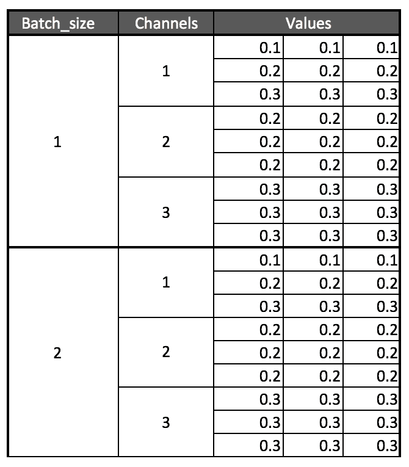

要计算 Gram 矩阵，我们展平每个通道的所有值，然后通过与其转置相乘来找到其相关性，如下表所示：

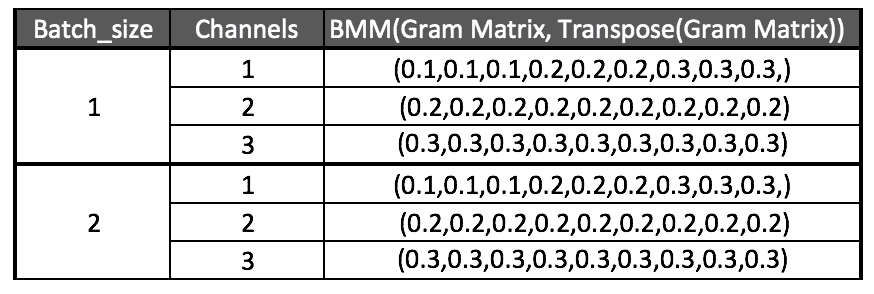

我们做的所有工作就是将所有值按照每个通道展平为单个向量或张量。以下代码实现了这一点：

```py
class GramMatrix(nn.Module):

   def forward(self,input):
       b,c,h,w = input.size()
       features = input.view(b,c,h*w)
       gram_matrix = torch.bmm(features,features.transpose(1,2))
       gram_matrix.div_(h*w)
       return gram_matrix
```

我们将 `GramMatrix` 函数实现为另一个 PyTorch 模块，具有 `forward` 函数，以便像 PyTorch 层一样使用它。在这一行中，我们从输入图像中提取不同的维度：

```py
b,c,h,w = input.size()
```

这里，`b` 表示批次，`c` 表示过滤器或通道，`h` 表示高度，`w` 表示宽度。在下一步中，我们将使用以下代码保持批次和通道维度不变，并在高度和宽度维度上展平所有值，如前面的图示所示：

```py
features = input.view(b,c,h*w)
```

通过将其转置向量与其展平值相乘来计算 Gram 矩阵。我们可以使用 PyTorch 提供的批次矩阵乘法函数 `torch.bmm()` 来实现，如下代码所示：

```py
gram_matrix = torch.bmm(features,features.transpose(1,2))
```

我们完成了通过将其除以元素数量来规范 Gram 矩阵值的工作。这可以防止某个具有大量值的特征映射主导得分。一旦计算了 `GramMatrix`，就可以简单地计算风格损失，这在以下代码中实现：

```py
class StyleLoss(nn.Module):
   def forward(self,inputs,targets):
       out = nn.MSELoss()(GramMatrix()(inputs),targets)
       return (out)
```

`StyleLoss` 类被实现为另一个 PyTorch 层。它计算输入 `GramMatrix` 值与风格图像 `GramMatrix` 值之间的均方误差（MSE）。

# 提取损失

就像我们使用 `register_forward_hook()` 函数提取卷积层的激活一样，我们可以提取不同卷积层的损失，以计算风格损失和内容损失。在这种情况下的一个区别是，我们需要提取多个层的输出而不是一个层的输出。以下类集成了所需的更改：

```py
class LayerActivations():
   features=[]

   def __init__(self,model,layer_numbers):

       self.hooks = []
       for layer_num in layer_numbers:
           self.hooks.append(model[layer_numbers].register_forward_hook(self.hook_fn))

   def hook_fn(self,module,input,output):
       self.features.append(output)

   def remove(self):
       for hook in self.hooks:
           hook.remove()
```

`__init__` 方法接受我们需要调用 `register_forward_hook` 方法的模型和需要提取输出的层编号。`__init__` 方法中的 `for` 循环遍历层编号并注册所需的前向钩子，用于提取输出。

传递给 `register_forward_hook` 方法的 `hook_fn` 函数在注册 `hook_fn` 函数的层之后由 PyTorch 调用。在函数内部，我们捕获输出并将其存储在特征数组中。

当我们不想捕获输出时，需要调用 remove 函数一次。忘记调用 remove 方法可能会导致内存不足异常，因为所有输出都会累积。

让我们写另一个实用函数，可以提取用于样式和内容图像的输出。以下函数执行相同操作：

```py
def extract_layers(layers,image,model=None):

   la = LayerActivations(model,layers)
   la.features = []
   out = model(image)
   la.remove()
   return la.features
```

在 `extract_layers` 函数内部，我们通过向模型和层编号传递来创建 `LayerActivations` 类的对象。特征列表可能包含来自先前运行的输出，因此我们将其重新初始化为空列表。然后我们通过模型传递图像，并且我们不会使用输出。我们更关心的是特征数组中生成的输出。我们调用 remove 方法来从模型中删除所有已注册的钩子，并返回特征。以下代码展示了我们提取样式和内容图像所需目标的方法：

```py
content_targets = extract_layers(content_layers,content_img,model=vgg)
style_targets = extract_layers(style_layers,style_img,model=vgg)
```

一旦我们提取了目标，我们需要将输出从创建它们的图中分离出来。请记住，所有这些输出都是 PyTorch 变量，它们保留了它们创建方式的信息。但是，对于我们的情况，我们只关注输出值，而不是图形，因为我们不会更新样式图像或内容图像。以下代码展示了这一技术：

```py
content_targets = [t.detach() for t in content_targets]
style_targets = [GramMatrix()(t).detach() for t in style_targets]
```

一旦我们分离了，让我们把所有的目标添加到一个列表中。以下代码展示了这一技术：

```py
targets = style_targets + content_targets
```

在计算样式损失和内容损失时，我们传递了称为内容层和样式层的两个列表。不同的层选择将影响生成图像的质量。让我们选择与论文作者提到的相同层。以下代码显示了我们在这里使用的层的选择：

```py
style_layers = [1,6,11,20,25]
content_layers = [21]
loss_layers = style_layers + content_layers
```

优化器期望最小化一个单一的标量数量。为了获得单一标量值，我们将所有到达不同层的损失相加起来。习惯上，对这些损失进行加权和是常见做法，而我们选择与 GitHub 仓库中论文实现中使用的相同权重。我们的实现是作者实现的一个稍微修改的版本。以下代码描述了使用的权重，这些权重是通过所选层中的过滤器数量计算得出的：

```py
style_weights = [1e3/n**2 for n in [64,128,256,512,512]]
content_weights = [1e0]
weights = style_weights + content_weights
```

要进行可视化，我们可以打印 VGG 层。花一分钟观察我们选择了哪些层，并尝试不同的层组合。我们将使用以下代码来打印 VGG 层：

```py
print(vgg)
```

这导致以下输出：

```py
#Results

Sequential(
 (0): Conv2d (3, 64, kernel_size=(3, 3), stride=(1, 1), padding=(1, 1))
 (1): ReLU(inplace)
 (2): Conv2d (64, 64, kernel_size=(3, 3), stride=(1, 1), padding=(1, 1))
 (3): ReLU(inplace)
 (4): MaxPool2d(kernel_size=(2, 2), stride=(2, 2), dilation=(1, 1))
 (5): Conv2d (64, 128, kernel_size=(3, 3), stride=(1, 1), padding=(1, 1))
 (6): ReLU(inplace)
 (7): Conv2d (128, 128, kernel_size=(3, 3), stride=(1, 1), padding=(1, 1))
 (8): ReLU(inplace)
 (9): MaxPool2d(kernel_size=(2, 2), stride=(2, 2), dilation=(1, 1))
 (10): Conv2d (128, 256, kernel_size=(3, 3), stride=(1, 1), padding=(1, 1))
 (11): ReLU(inplace)
 (12): Conv2d (256, 256, kernel_size=(3, 3), stride=(1, 1), padding=(1, 1))
 (13): ReLU(inplace)
 (14): Conv2d (256, 256, kernel_size=(3, 3), stride=(1, 1), padding=(1, 1))
 (15): ReLU(inplace)
 (16): Conv2d (256, 256, kernel_size=(3, 3), stride=(1, 1), padding=(1, 1))
 (17): ReLU(inplace)
 (18): MaxPool2d(kernel_size=(2, 2), stride=(2, 2), dilation=(1, 1))
 (19): Conv2d (256, 512, kernel_size=(3, 3), stride=(1, 1), padding=(1, 1))
 (20): ReLU(inplace)
 (21): Conv2d (512, 512, kernel_size=(3, 3), stride=(1, 1), padding=(1, 1))
 (22): ReLU(inplace)
 (23): Conv2d (512, 512, kernel_size=(3, 3), stride=(1, 1), padding=(1, 1))
 (24): ReLU(inplace)
 (25): Conv2d (512, 512, kernel_size=(3, 3), stride=(1, 1), padding=(1, 1))
 (26): ReLU(inplace)
 (27): MaxPool2d(kernel_size=(2, 2), stride=(2, 2), dilation=(1, 1))
 (28): Conv2d (512, 512, kernel_size=(3, 3), stride=(1, 1), padding=(1, 1))
 (29): ReLU(inplace)
 (30): Conv2d (512, 512, kernel_size=(3, 3), stride=(1, 1), padding=(1, 1))
 (31): ReLU(inplace)
 (32): Conv2d (512, 512, kernel_size=(3, 3), stride=(1, 1), padding=(1, 1))
 (33): ReLU(inplace)
 (34): Conv2d (512, 512, kernel_size=(3, 3), stride=(1, 1), padding=(1, 1))
 (35): ReLU(inplace)
 (36): MaxPool2d(kernel_size=(2, 2), stride=(2, 2), dilation=(1, 1))
)
```

我们必须定义损失函数和优化器来生成艺术图像。我们将在以下部分中初始化它们两个。

# 为每个层创建损失函数

我们已经将损失函数定义为 PyTorch 层。因此，让我们为不同的样式损失和内容损失创建损失层。以下代码定义了这个函数：

```py
loss_fns = [StyleLoss()] * len(style_layers) + [nn.MSELoss()] * len(content_layers)
```

`loss_fns` 函数是一个列表，包含一堆基于创建的数组长度的样式损失对象和内容损失对象。

# 创建优化器

通常，我们传递网络的参数，如 VGG 的参数进行训练。但在本例中，我们将 VGG 模型用作特征提取器，因此不能传递 VGG 的参数。在这里，我们只提供将优化以使图像具有所需内容和风格的`opt_img`变量的参数。以下代码创建优化器以优化其值：

```py
optimizer = optim.LBFGS([output_image]);
```

现在我们已经准备好所有训练组件。

# 训练模型

与我们到目前为止训练过的其他模型相比，训练方法有所不同。在这里，我们需要在多个层级计算损失，并且每次调用优化器时，都会改变输入图像，使其内容和风格接近目标的内容和风格。让我们看一下用于训练的代码，然后我们将逐步介绍训练的重要步骤：

```py
maximum_iterations = 500
show_iteration-1 = 50
n_iter=[0]

optimizer = optim.LBFGS([output_image]);
n_iteration=[0]

while n_iteration[0] <= maximum_iterations:

    def closure():
        optimizer.zero_grad()

        out = extract_layers(loss_layers,output_image,model=vgg)
        layer_losses = [weights[a] * loss_fnsa for a,A in enumerate(out)]
        loss = sum(layer_losses)
        loss.backward()
        n_iteration[0]+=1
        if n_iteration[0]%show_iteration == (show_iteration-1):
            print('Iteration: %d, loss: %f'%(n_iteration[0]+1, loss.data[0]))

        return loss

    optimizer.step(closure)
```

我们正在运行 500 次迭代的训练循环。对于每次迭代，我们使用我们的`extract_layers`函数计算来自 VGG 模型不同层的输出。在这种情况下，唯一改变的是`output_image`的值，它将包含我们的样式图像。一旦计算出输出，我们通过迭代输出并将它们传递给相应的损失函数，同时传递它们的相应目标来计算损失。我们总结所有的损失并调用反向传播函数。在闭包函数的末尾，返回损失。对于`max_iterations`，同时调用闭包方法和`optimizer.step`方法。如果您在 GPU 上运行，可能需要几分钟才能运行；如果您在 CPU 上运行，请尝试减小图像的大小以加快运行速度。

在运行了 500 个 epochs 之后，在我的设备上生成的图像如下所示。尝试不同的内容和风格的组合来生成有趣的图像：


在接下来的部分中，让我们使用深度卷积生成对抗网络（DCGANs）生成人脸。

# 引入 GANs

GANs 是由 Ian Goodfellow 于 2014 年引入，并变得非常流行。最近 GAN 研究取得了许多重要进展，以下时间轴显示了 GAN 研究中一些最显著的进展和关键发展：

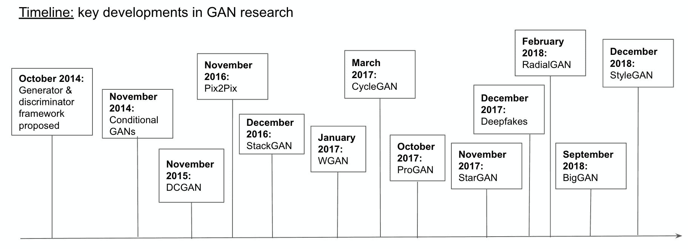

在本章中，我们将专注于 DCGAN 的 PyTorch 实现。然而，有一个非常有用的 GitHub 仓库提供了一堆 PyTorch 实现示例，包括时间轴上显示的 GAN 以及其他模型。可以通过以下链接访问：[`github.com/eriklindernoren/PyTorch-GAN`](https://github.com/eriklindernoren/PyTorch-GAN)。

GAN 通过训练两个深度神经网络——生成器和鉴别器来解决无监督学习问题，它们相互竞争。在训练过程中，两者最终都变得更擅长执行它们所执行的任务。

GAN 可以用一个造假者（生成器）和警察（鉴别器）的案例直观理解。最初，造假者向警察展示假钱。警察识别出它是假的，并解释给造假者为什么是假的。造假者根据收到的反馈制造新的假钱。警察发现它是假的，并告诉造假者为什么是假的。重复进行大量次数，直到造假者能够制造出警察无法识别的假钱。在 GAN 场景中，我们最终得到一个生成器，生成的假图像非常类似于真实图像，而分类器变得擅长识别真伪。

GAN 是伪造者网络和专家网络的结合体，每个网络都经过训练以击败另一个。生成器网络以随机向量作为输入，并生成合成图像。鉴别器网络接收输入图像，并预测图像是真实的还是伪造的。我们向鉴别器网络传递真实图像或伪造图像。

生成器网络被训练生成图像，并欺骗鉴别器网络认为它们是真实的。鉴别器网络也在不断改进，以免受骗，因为我们在训练时传递反馈。

以下图表描述了 GAN 模型的架构：

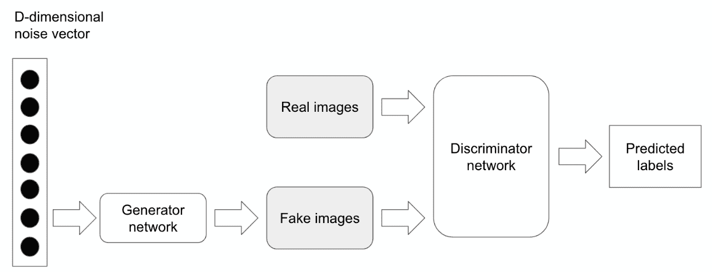

虽然 GAN 的理念在理论上听起来很简单，但训练一个真正有效的 GAN 模型非常困难，因为需要并行训练两个深度神经网络。

DCGAN 是早期展示如何构建一个可以自我学习并生成有意义图像的 GAN 模型之一。您可以在这里了解更多信息：[`arxiv.org/pdf/1511.06434.pdf`](https://arxiv.org/pdf/1511.06434.pdf)。我们将逐步讲解这种架构的每个组成部分以及背后的一些推理，以及如何在 PyTorch 中实现它。

# DCGAN

在本节中，我们将根据我在前面信息框中提到的 DCGAN 论文实现 GAN 架构的不同部分。训练 DCGAN 的一些重要部分包括以下内容：

+   生成器网络，将固定维度的潜在向量（数字列表）映射到某些形状的图像。在我们的实现中，形状是（3, 64, 64）。

+   鉴别器网络，以生成器生成的图像或来自实际数据集的图像作为输入，并映射到评估输入图像是否真实或伪造的分数。

+   定义生成器和鉴别器的损失函数。

+   定义一个优化器。

让我们详细探讨每个部分。这一实现提供了更详细的解释，说明了在 PyTorch GitHub 存储库中提供的代码：[`github.com/pytorch/examples/tree/master/dcgan.`](https://github.com/pytorch/examples/tree/master/dcgan)

# 定义生成器网络

生成器网络将固定维度的随机向量作为输入，并对其应用一组转置卷积、批量归一化和 ReLU 激活函数，生成所需尺寸的图像。在深入研究生成器实现之前，让我们先来定义转置卷积和批量归一化。

# 转置卷积

转置卷积也称为分数步幅卷积。它们的工作方式与卷积相反。直观地说，它们试图计算如何将输入向量映射到更高的维度。

让我们看看下面的图表以更好地理解它：

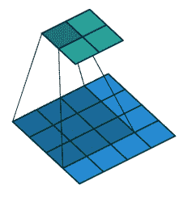

此图表被引用在 Theano 文档中（另一个流行的深度学习框架—[`deeplearning.net/software/theano/tutorial/conv_arithmetic.html`](http://deeplearning.net/software/theano/tutorial/conv_arithmetic.html)）。如果你想更深入地了解步幅卷积的工作原理，我强烈推荐你阅读这篇文章。对我们而言重要的是，它有助于将向量转换为所需维度的张量，并且我们可以通过反向传播训练核的值。

# 批量归一化

我们已经多次观察到，所有传递给机器学习或深度学习算法的特征都经过了归一化处理；即，通过从数据中减去均值来将特征的值居中到零，并通过将数据除以其标准差来给数据一个单位标准差。通常我们会使用 PyTorch 的`torchvision.Normalize`方法来实现这一点。以下代码展示了一个例子：

```py
transforms.Normalize((0.5, 0.5, 0.5), (0.5, 0.5, 0.5))
```

在我们所见的所有示例中，数据在进入神经网络之前都进行了归一化；不能保证中间层得到归一化的输入。下图展示了神经网络中间层未获得归一化数据的情况：

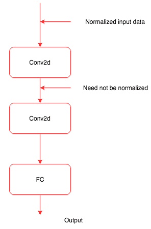

批量归一化充当一个中间函数或层，当训练过程中的均值和方差随时间变化时，它会归一化中间数据。批量归一化是由 Ioffe 和 Szegedy 在 2015 年提出的（[`arxiv.org/abs/1502.03167`](https://arxiv.org/abs/1502.03167)）。批量归一化在训练和验证或测试期间表现不同。训练期间，会计算批次数据的均值和方差。验证和测试期间则使用全局值。我们只需理解它归一化了中间数据。使用批量归一化的一些关键优势包括以下几点：

+   改善了网络中的梯度流，从而帮助我们构建更深的网络

+   允许更高的学习率

+   减少了初始化的强依赖

+   作为正则化的一种形式，并减少了对丢弃的依赖

大多数现代架构，如 ResNet 和 Inception，在它们的架构中广泛使用批标准化。我们将在下一章节深入探讨这些架构。批标准化层是在卷积层或线性/全连接层之后引入的，如下图所示：

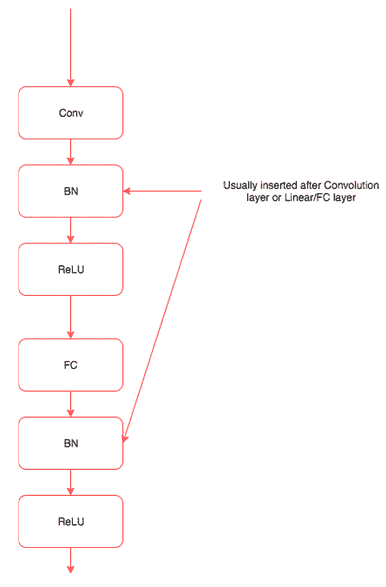

到目前为止，我们对生成器网络的关键组成部分有了直观的理解。

# 生成器

让我们快速浏览以下生成器网络代码，然后讨论生成器网络的关键特性：

```py
class _net_generator(nn.Module):
    def __init__(self):
        super(_net_generator, self).__init__()

        self.main = nn.Sequential(
            nn.ConvTranspose2d( nz, ngf * 8, 4, 1, 0, bias=False),
            nn.BatchNorm2d(ngf * 8),
            nn.ReLU(True),
           nn.ConvTranspose2d(ngf * 8, ngf * 4, 4, 2, 1, bias=False),
            nn.BatchNorm2d(ngf * 4),
            nn.ReLU(True),
            nn.ConvTranspose2d(ngf * 4, ngf * 2, 4, 2, 1, bias=False),
            nn.BatchNorm2d(ngf * 2),
            nn.ReLU(True),
            nn.ConvTranspose2d(ngf * 2, ngf, 4, 2, 1, bias=False),
            nn.BatchNorm2d(ngf),
            nn.ReLU(True),
            nn.ConvTranspose2d( ngf, nc, 4, 2, 1, bias=False),
            nn.Tanh()
        )

    def forward(self, input):
        output = self.main(input)
        return output

net_generator = _net_generator()
net_generator.apply(weights_inititialisation)
print(net_generator)
```

在我们看到的大多数代码示例中，我们使用了一系列不同的层，然后在前向方法中定义数据的流动。在生成器网络中，我们在`__init__`方法中定义了层和数据的流动，使用了顺序模型。该模型接收大小为 nz 的张量作为输入，然后将其传递给转置卷积以映射输入到需要生成的图像大小。前向函数将输入传递给顺序模块并返回输出。生成器网络的最后一层是一个 tanh 层，限制了网络可以生成的值的范围。

我们不再使用相同的随机权重初始化模型，而是根据论文中定义的权重初始化模型。以下是权重初始化代码：

```py
def weights_inititialisation(m):
   class_name = m.__class__.__name__
   if class_name.find('Conv') != -1:
       m.weight.data.normal_(0.0, 0.02)
   elif class_name.find('BatchNorm') != -1:
       m.weight.data.normal_(1.0, 0.02)
       m.bias.data.fill_(0)
```

我们通过将函数传递给生成器对象`net_generator`来调用权重函数。每一层都会传递给该函数；如果该层是卷积层，我们会以不同的方式初始化权重，如果是`BatchNorm`层，则会稍有不同。我们使用以下代码在网络对象上调用该函数：

```py
net_generator.apply(weights_inititialisation)
```

# 定义鉴别器网络

让我们快速浏览一下以下鉴别器网络代码，然后讨论鉴别器网络的关键特性：

```py
class _net_discriminator(nn.Module):
    def __init__(self):
        super(_net_discriminator, self).__init__()
        self.main = nn.Sequential(
            nn.Conv2d(nc, ndf, 4, 2, 1, bias=False),
            nn.LeakyReLU(0.2, inplace=True),
            nn.Conv2d(ndf, ndf * 2, 4, 2, 1, bias=False),
            nn.BatchNorm2d(ndf * 2),
            nn.LeakyReLU(0.2, inplace=True),
            nn.Conv2d(ndf * 2, ndf * 4, 4, 2, 1, bias=False),
            nn.BatchNorm2d(ndf * 4),
            nn.LeakyReLU(0.2, inplace=True),
            nn.Conv2d(ndf * 4, ndf * 8, 4, 2, 1, bias=False),
            nn.BatchNorm2d(ndf * 8),
            nn.LeakyReLU(0.2, inplace=True),
            nn.Conv2d(ndf * 8, 1, 4, 1, 0, bias=False),
            nn.Sigmoid()
        )

    def forward(self, input):
        output = self.main(input)
        return output.view(-1, 1).squeeze(1)

net_discriminator = _net_discriminator()
net_discriminator.apply(weights_inititialisation)
print(net_discriminator)
```

在前述网络中有两个重要点，即使用 Leaky ReLU 作为激活函数，以及在最后使用 sigmoid 作为激活层。首先，让我们了解一下 Leaky ReLU 是什么。

Leaky ReLU 是为了解决 ReLU 激活函数中的“神经元死亡”问题。当输入为负数时，Leaky ReLU 不会返回零，而是输出一个非常小的数值，如 0.001。论文中显示，使用 Leaky ReLU 可以提高鉴别器的效率。

另一个重要的区别是在鉴别器末端不使用全连接层。通常会看到最后的全连接层被全局平均池化替换。但使用全局平均池化会降低收敛速度（构建准确分类器所需的迭代次数）。最后的卷积层被展平并传递给 sigmoid 层。

除了这两个区别外，该网络的其余部分与我们在书中看到的其他图像分类器网络类似。

# 定义损失和优化器

我们将在以下代码中定义二元交叉熵损失和两个优化器，一个用于生成器，另一个用于鉴别器。

```py
criterion = nn.BCELoss()

optimizer_discriminator = optim.Adam(net_discriminator.parameters(), lr, betas=(beta1, 0.95))
optimizer_generator = optim.Adam(net_generator.parameters(), lr, betas=(beta1, 0.95))
```

到目前为止，这与我们在所有先前示例中看到的非常相似。让我们探索如何训练生成器和鉴别器。

# 训练鉴别器

鉴别器网络的损失取决于其在真实图像上的表现以及其在生成器网络生成的假图像上的表现。损失可以定义如下：

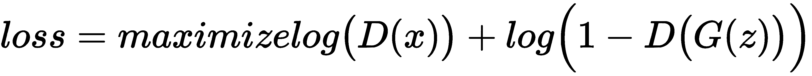

因此，我们需要使用真实图像和生成器网络生成的假图像来训练鉴别器。

# 使用真实图像训练鉴别器

让我们将一些真实图像直接作为信息传递给训练鉴别器。

首先，我们将查看执行相同操作的代码，然后探索其重要特征：

```py
output = net_discriminator(inputv)
err_discriminator_real = criterion(output, labelv)
err_discriminator_real.backward()
```

在前面的代码中，我们计算了鉴别器图像所需的损失和梯度。`inputv` 和 `labelv` 值表示 CIFAR10 数据集中的输入图像和标签，对于真实图像标签为 1。这很简单明了，与我们对其他图像分类器网络所做的工作类似。

# 使用假图像训练鉴别器

现在传递一些随机图像来训练鉴别器。

让我们看一下相关代码，然后探索其重要特征：

```py
fake = net_generator(noisev)
output = net_discriminator(fake.detach())
err_discriminator_fake = criterion(output, labelv)
err_discriminator_fake.backward()
optimizer_discriminator.step()
```

此代码中的第一行传递了一个大小为 100 的向量，生成器网络（`net_generator`）生成一张图像。我们将图像传递给鉴别器，以便其识别图像是真实的还是假的。我们不希望生成器得到训练，因为鉴别器正在训练中。因此，我们通过在其变量上调用 `detach` 方法来从其图中移除假图像。一旦计算出所有梯度，我们调用优化器来训练鉴别器。

# 训练生成器网络

让我们看一下用于训练生成器网络的以下代码，然后探索其重要特征：

```py
net_generator.zero_grad()
labelv = Variable(label.fill_(real_label)) # fake labels are real for generator cost
output = net_discriminator(fake)
err_generator = criterion(output, labelv)
err_generator.backward()
optimizer_generator.step()
```

看起来与我们在训练假图像上训练鉴别器时做的很相似，除了一些关键的不同之处。我们传递了生成器创建的相同假图像，但这次我们没有从生成它的图中分离它，因为我们希望训练生成器。我们计算损失（`err_generator`）并计算梯度。然后我们调用生成器优化器，因为我们只想训练生成器，并在生成器生成略微逼真图像之前重复整个过程多次。

# 训练完整网络

我们已经看了 GAN 训练的各个部分。让我们总结如下，并查看用于训练我们创建的 GAN 网络的完整代码：

+   用真实图像训练鉴别器网络

+   用假图像训练鉴别器网络

+   优化鉴别器

+   根据鉴别器的反馈训练生成器

+   仅优化生成器网络

我们将使用以下代码来训练网络：

```py
for epoch in range(niter):
    for i, data in enumerate(dataloader, 0):
        # train with real
        net_discriminator.zero_grad()
        real_cpu, _ = data
        batch_size = real_cpu.size(0)
        if torch.cuda.is_available():
            real_cpu = real_cpu.cuda()
        input.resize_as_(real_cpu).copy_(real_cpu)
        label.resize_(batch_size).fill_(real_label)
        inputv = Variable(input)
        labelv = Variable(label)

        output = net_discriminator(inputv)
        err_discriminator_real = criterion(output, labelv)
        err_discriminator_real.backward()
        D_x = output.data.mean()

        noise.resize_(batch_size, nz, 1, 1).normal_(0, 1)
        noisev = Variable(noise)
        fake = net_generator(noisev)
        labelv = Variable(label.fill_(fake_label))
        output = net_discriminator(fake.detach())
        err_discriminator_fake = criterion(output, labelv)
        err_discriminator_fake.backward()
        D_G_z1 = output.data.mean()
        err_discriminator = err_discriminator_real + err_discriminator_fake
        optimizer_discriminator.step()

        net_generator.zero_grad()
        labelv = Variable(label.fill_(real_label)) # fake labels are real for generator cost
        output = net_discriminator(fake)
        err_generator = criterion(output, labelv)
        err_generator.backward()
        D_G_z2 = output.data.mean()
        optimizer_generator.step()

        print('[%d/%d][%d/%d] Loss_Discriminator: %.4f Loss_Generator: %.4f D(x): %.4f D(G(z)): %.4f / %.4f'
              % (epoch, niter, i, len(dataloader),
                 err_discriminator.data[0], err_generator.data[0], D_x, D_G_z1, D_G_z2))
        if i % 100 == 0:
            vutils.save_image(real_cpu,
                    '%s/real_samples.png' % outf,
                    normalize=True)
            fake = net_generator(fixed_noise)
            vutils.save_image(fake.data,
                    '%s/fake_samples_epoch_%03d.png' % (outf, epoch),
                    normalize=True)
```

函数 `vutils.save_image` 将接收一个张量并保存为图像。如果提供了一个图像的小批量，则将它们保存为图像网格。

在接下来的章节中，我们将看看生成的图像和真实图像的样子。

# 检查生成的图像

因此，让我们比较生成的图像和真实图像。

生成的图像如下所示：

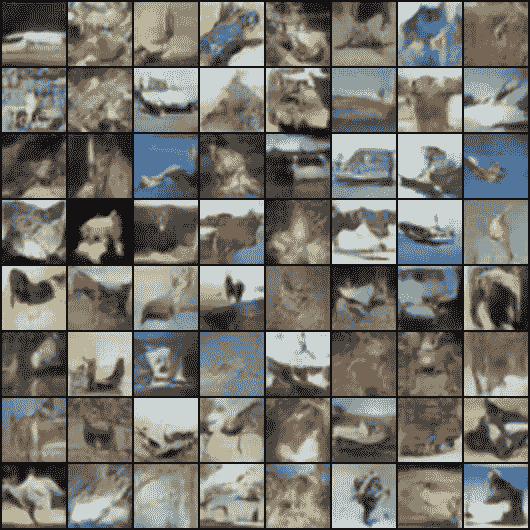

实际图像如下所示：

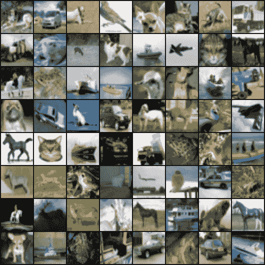

比较这两组图像，我们可以看到我们的 GAN 能够学习如何生成图像。

# 总结

在本章中，我们介绍了如何训练能够使用生成网络生成艺术风格转换的深度学习算法。我们还学习了如何使用 GAN 和 DCGAN 生成新图像。在 DCGAN 中，我们探索了使用真实和虚假图像来训练鉴别器，并检查了生成的图像。除了训练生成新图像外，我们还有一个鉴别器，可以用于分类问题。当有限的标记数据可用时，鉴别器学习有关图像的重要特征，这些特征可以用于分类任务。当有限的标记数据时，我们可以训练一个 GAN，它将给我们一个分类器，可以用来提取特征，然后可以在其上构建一个分类器模块。

在下一章中，我们将介绍一些现代架构，如 ResNet 和 Inception，用于构建更好的计算机视觉模型，以及用于构建语言翻译和图像字幕的序列到序列模型。
