# 第九章：使用现代网络架构进行迁移学习

在上一章中，我们探讨了如何利用深度学习算法创建艺术图像、基于现有数据集生成新图像以及生成文本。在本章中，我们将介绍驱动现代计算机视觉应用和自然语言系统的不同网络架构。我们还将覆盖如何在这些模型中应用迁移学习。

迁移学习是机器学习中的一种方法，其中一个为特定任务开发的模型被重用于另一个任务。例如，如果我们想学习如何驾驶摩托车，但我们已经知道如何驾驶汽车，我们会将关于驾驶汽车的知识转移到新任务，而不是从头开始。

要将这种知识从一个任务转移到另一个任务，网络中的一些层需要被冻结。冻结一层意味着在训练期间不会更新该层的权重。迁移学习的好处在于，它可以通过重复使用预训练模型所学到的知识来加快开发和训练新模型的时间，从而加速结果的产生。

本章将讨论的一些架构如下：

+   **残差网络** (**ResNet**)

+   Inception

+   DenseNet

+   编码器-解码器架构

本章将涵盖以下主题：

+   现代网络架构

+   密集连接卷积网络 – DenseNet

+   模型集成

+   编码器-解码器架构

# 现代网络架构

当深度学习模型无法学习时，我们最好的做法之一是向模型添加更多的层。随着层数的增加，模型的准确性会提高，然后开始饱和。然而，超过一定数量的层会引入一些挑战，例如梯度消失或梯度爆炸。通过精心初始化权重和引入中间的规范化层，部分解决了这个问题。现代架构，如 ResNet 和 Inception，通过引入不同的技术，如残差连接，试图解决这个问题。

# ResNet

ResNet 首次在 2015 年由 Kaiming He 等人在名为《深度残差学习用于图像识别》的论文中提出（[`arxiv.org/pdf/1512.03385.pdf`](https://arxiv.org/pdf/1512.03385.pdf)）。它使我们能够训练成千上万层并实现高性能。ResNet 的核心概念是引入一个跳过一个或多个层的身份快捷连接。下图展示了 ResNet 的工作原理：

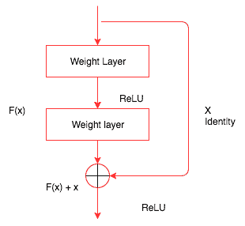

此身份映射没有任何参数。它只是将前一层的输出添加到下一层的输入中。然而，有时候，x 和 F(x)将不具有相同的维度。卷积操作通常会缩小图像的空间分辨率。例如，对 32 x 32 图像进行 3 x 3 卷积会得到一个 30 x 30 图像。此身份映射被线性投影*W*乘以，以扩展捷径的通道以匹配残差。因此，需要将输入 x 和 F(x)结合起来创建下一层的输入：

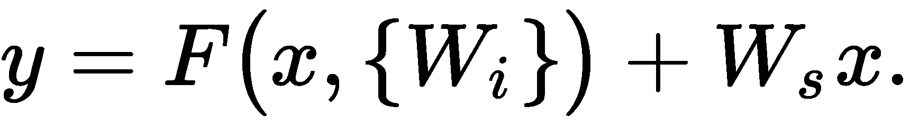

以下代码演示了 PyTorch 中简单 ResNet 块的样子：

```py
class ResNetBlock(nn.Module):
    def __init__(self,in_channels,output_channels,stride):
        super().__init__()
        self.convolutional_1 = nn.Conv2d(input_channels,output_channels,kernel_size=3,stride=stride,padding=1,bias=False)
        self.bn1 = nn.BatchNorm2d(output_channels)
        self.convolutional_2 = nn.Conv2d(output_channels,output_channels,kernel_size=3,stride=stride,padding=1,bias=False)
        self.bn2 = nn.BatchNorm2d(output_channels)
        self.stride = stride
    def forward(self,x):
        residual = x
       out = self.convolutional_1(x)
        out = F.relu(self.bn1(out),inplace=True)
        out = self.convolutional_2(out)
        out = self.bn2(out)
        out += residual
        return F.relu(out)        
```

`ResNetBasicBlock`类包含一个`init`方法，用于初始化各种层次，如卷积层和批量归一化。前向方法几乎与我们到目前为止看到的相同，只是在返回之前将输入添加到层次的输出中。

PyTorch 的`torchvision`包提供了一个即插即用的 ResNet 模型，具有不同的层次结构。以下是一些可用的不同模型：

+   ResNet-18

+   ResNet-34

+   ResNet-50

+   ResNet-101

+   ResNet-152

我们还可以将这些模型之一用于迁移学习。`torchvision`实例允许我们简单地创建其中一个模型并像以下代码中所示使用它：

```py
from torchvision.models import resnet18
resnet_model = resnet18(pretrained=False)
```

以下图表展示了一个 34 层的 ResNet 模型的样子：

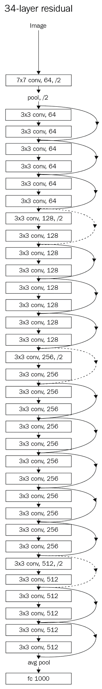

在这里，我们可以看到该网络由多个 ResNet 块组成。与 VGG 等模型相比，这些现代网络的一个关键优势是它们需要很少的参数，因为它们避免使用需要大量参数训练的全连接层。

现在，我们将在狗和猫的数据集上训练一个 ResNet 模型。我们将使用在第三章中使用的数据，*深入神经网络*，并将基于从 ResNet 计算得到的特征快速训练一个模型。像往常一样，我们将按照以下步骤训练模型：

1.  创建 PyTorch 数据集。

1.  创建训练和验证加载器。

1.  创建 ResNet 模型。

1.  提取卷积特征。

1.  为预卷积特征创建自定义 PyTorch 数据集类和加载器。

1.  创建一个简单的线性模型。

1.  训练和验证模型。

完成后，我们将重复这些步骤用于 Inception 和 DenseNet。最后，我们将探索集成技术，将这些强大的模型组合成一个新模型。

# 创建 PyTorch 数据集

首先，我们需要创建一个包含所有基本变换的变换对象，并使用`ImageFolder`函数从我们在第三章中创建的数据目录加载图像。在以下代码中，我们创建数据集：

```py
transform_data = transforms.Compose([
        transforms.Resize((299,299)),
        tansforms.ToTensor(),
        transforms.Normalize([0.30, 0.40, 0.40], [0.20, 0.20, 0.20])
    ])

train_dataset = ImageFolder('../Chapter03/Dog-Cat-Classifier/Data/Train_Data/train/',transform=transform_data)
validation_dataset = ImageFolder('../Chapter03/Dog-Cat-Classifier/Data/Train_Data/valid/',transform=transform_data)
classes=2
```

到目前为止，前面大部分代码将是不言自明的。

# 创建用于训练和验证的加载器

我们使用 PyTorch 加载器加载数据集提供的批量数据，以及其所有优势，如数据洗牌和使用多线程，以加快进程速度。以下代码展示了这一点：

```py
training_data_loader = DataLoader(train_dataset,batch_size=32,shuffle=False,num_workers=4)
validation_data_loader = DataLoader(validation_dataset,batch_size=32,shuffle=False,num_workers=4)
```

我们在计算预卷积特征时需要保持数据的确切顺序。当允许数据被洗牌时，我们将无法保持标签。因此，请确保`shuffle`为`False`；否则，需要在代码内部处理所需的逻辑。

# 创建一个 ResNet 模型

在这里，我们将考虑一个创建 ResNet 模型的编码示例。首先，我们初始化预训练的`resnet34`模型：

```py
resnet_model = resnet34(pretrained=True)
```

然后，我们丢弃最后一个线性层：

```py
m = nn.Sequential(*list(resnet_model.children())[:-1])
```

一旦模型创建完成，我们将`requires_grad`参数设为`False`，这样 PyTorch 就不必维护用于保存梯度的任何空间：

```py
for p in resnet_model.parameters():
   p.requires_grad = False
```

# 提取卷积特征

在这里，我们通过模型传递来自训练和验证数据加载器的数据，并将结果存储在列表中以供进一步计算。通过计算预卷积特征，我们可以节省大量训练模型的时间，因为我们不会在每次迭代中计算这些特征：

```py
# Stores the labels of the train data
training_data_labels = [] 
# Stores the pre convoluted features of the train data
training_features = [] 
```

迭代通过训练数据，并使用以下代码存储计算得到的特征和标签：

```py
for d,la in training_data_loader:
    o = m(Variable(d))
    o = o.view(o.size(0),-1)
    training_data_labels.extend(la)
    training_features.extend(o.data)
```

对于验证数据，迭代通过验证数据，并使用以下代码存储计算得到的特征和标签：

```py
validation_data_labels = []
validation_features = []
for d,la in validation_data_loader:
    o = m(Variable(d))
    o = o.view(o.size(0),-1)
    validation_data_labels.extend(la)
    validation_features.extend(o.data)
```

# 创建用于预卷积特征的自定义 PyTorch 数据集类和加载器

现在我们已经计算出了预卷积特征，我们需要创建一个自定义数据集，以便从中选择数据。在这里，我们将为预卷积特征创建一个自定义数据集和加载器：

```py
class FeaturesDataset(Dataset):
    def __init__(self,features_list,labels_list):
        self.features_list = features_list
        self.labels_list = labels_list
    def __getitem__(self,index):
        return (self.features_lst[index],self.labels_list[index])
    def __len__(self):
        return len(self.labels_list)
#Creating dataset for train and validation
train_features_dataset = FeaturesDataset(training_features,training_data_labels)
validation_features_dataset = FeaturesDataset(validation_features,validation_data_labels)
```

一旦创建了用于预卷积特征的自定义数据集，我们可以使用`DataLoader`函数，如下所示：

```py
train_features_loader = DataLoader(train_features_dataset,batch_size=64,shuffle=True)
validation_features_loader = DataLoader(validation_features_dataset,batch_size=64)
```

这将为训练和验证创建一个数据加载器。

# 创建一个简单的线性模型

现在，我们需要创建一个简单的线性模型，将预卷积特征映射到相应的类别。在这个例子中，有两个类别（狗和猫）：

```py
class FullyConnectedLinearModel(nn.Module):
    def __init__(self,input_size,output_size):
        super().__init__()
        self.fc = nn.Linear(input_size,output_size)

    def forward(self,inp):
        out = self.fc(inp)
        return out

fully_connected_in_size = 8192

fc = FullyConnectedLinearModel(fully_connected_in_size,classes)
if is_cuda:
    fc = fc.cuda()
```

现在，我们准备训练我们的新模型并验证数据集。

# 训练和验证模型

以下代码展示了我们如何训练模型。请注意，`fit`函数与 第三章 中讨论的 *深入神经网络* 的相同。

```py
train_losses , train_accuracy = [],[]
validation_losses , validation_accuracy = [],[]
for epoch in range(1,20):
    epoch_loss, epoch_accuracy = fit(epoch,fc,train_features_loader,phase='training')
    validation_epoch_loss , validation_epoch_accuracy = fit(epoch,fc,validation_features_loader,phase='validation')
    train_losses.append(epoch_loss)
    train_accuracy.append(epoch_accuracy)
    validation_losses.append(validation_epoch_loss)
    validation_accuracy.append(validation_epoch_accuracy)
```

# Inception

Inception 网络是 CNN 分类器发展中的一个重要里程碑，因为它在速度和准确性上都有所提高。Inception 有许多版本，其中一些最著名的版本包括以下几种：

+   Inception v1 ([`arxiv.org/pdf/1409.4842v1.pdf`](https://arxiv.org/pdf/1409.4842v1.pdf))，通常称为 GoogLeNet

+   Inception v2 和 v2 ([`arxiv.org/pdf/1512.00567v3.pdf`](https://arxiv.org/pdf/1512.00567v3.pdf))

+   Inception v4 和 Inception-ResNet ([`arxiv.org/pdf/1602.07261.pdf`](https://arxiv.org/pdf/1602.07261.pdf))

以下图表显示了朴素 Inception 网络的结构（v1）：

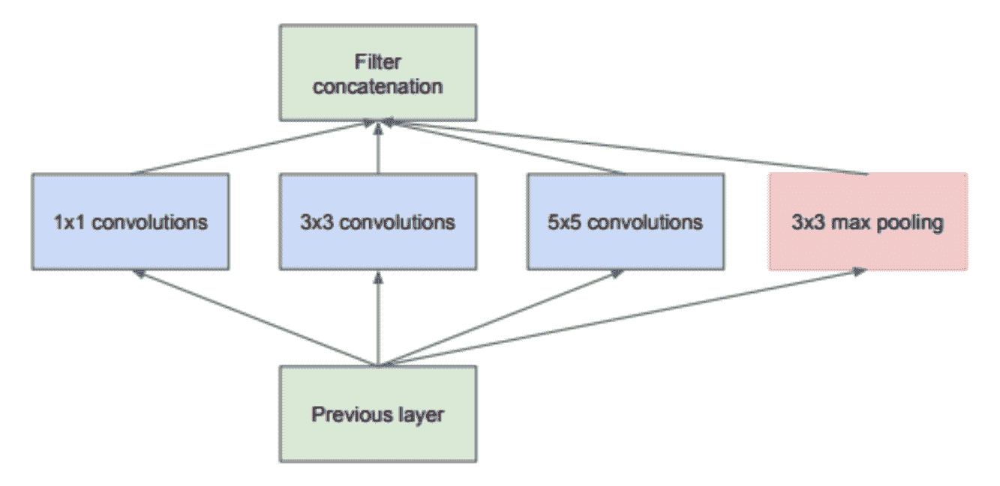

图片来源：[`arxiv.org/pdf/1409.4842.pdf`](https://arxiv.org/pdf/1409.4842.pdf)

在这里，不同大小的卷积应用于输入，并且所有这些层的输出被连接在一起。这是一个 Inception 模块的最简单版本。还有另一种变体的 Inception 块，我们在通过 3 x 3 和 5 x 5 卷积之前会先通过 1 x 1 卷积来降低维度。1 x 1 卷积用于降低计算瓶颈。1 x 1 卷积一次查看一个值，跨通道。例如，在输入大小为 100 x 64 x 64 上使用 10 x 1 x 1 的滤波器将导致 10 x 64 x 64 的输出。以下图表显示了带有降维的 Inception 块：

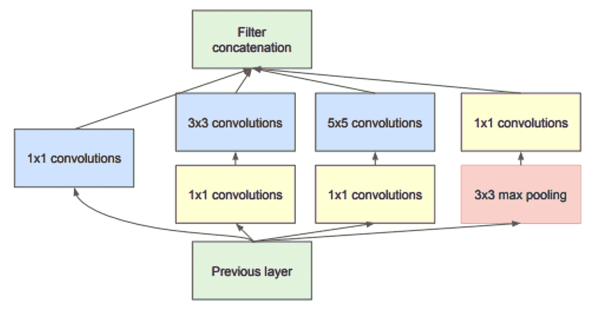

图片来源：[`arxiv.org/pdf/1409.4842.pdf`](https://arxiv.org/pdf/1409.4842.pdf)

现在，让我们看一下 PyTorch 中上述 Inception 块的示例：

```py
class BasicConvolutional2d(nn.Module):

    def __init__(self, input_channels, output_channels, **kwargs):
        super(BasicConv2d, self).__init__()
        self.conv = nn.Conv2d(input_channels, output_channels, bias=False, **kwargs)
        self.bn = nn.BatchNorm2d(output_channels)

    def forward(self, x):
        x = self.conv(x)
        x = self.bn(x)
        return F.relu(x, inplace=True)

class InceptionBlock(nn.Module):

    def __init__(self, input_channels, pool_features):
        super().__init__()
        self.inception_branch_1x1 = BasicConv2d(input_channels, 64, kernel_size=1)

        self.inception_branch_5x5_1 = BasicConv2d(input_channels, 48, kernel_size=1)
        self.inception_branch_5x5_2 = BasicConv2d(48, 64, kernel_size=5, padding=2)

        self.inception_branch_3x3dbl_1 = BasicConv2d(input_channels, 64, kernel_size=1)
        self.inception_branch_3x3dbl_2 = BasicConv2d(64, 96, kernel_size=3, padding=1)

        self.inception_branch_pool = BasicConv2d(input_channels, pool_features, kernel_size=1)

    def forward(self, x):
        inception_branch_1x1 = self.inception_branch1x1(x)

        inception_branch_5x5 = self.inception_branch_5x5_1(x)
        inception_branch_5x5 = self.inception_branch_5x5_2(branch5x5)

        inception_branch_3x3dbl = self.inception_branch_3x3dbl_1(x)
        inception_branch_3x3dbl = self.inception_branch_3x3dbl_2(inception_branch3x3dbl)

        branch_pool = F.avg_pool2d(x, kernel_size=3, stride=1, padding=1)
        branch_pool = self.branch_pool(branch_pool)

        outputs = [inception_branch_1x1, inception_branch_5x5, inception_branch_3x3dbl, inception_branch_pool]
        return torch.cat(outputs, 1)
```

上述代码包含两个类：`BasicConv2d` 和 `InceptionBasicBlock`。`BasicConv2d` 充当自定义层，将二维卷积层、批量归一化和 ReLU 层应用于输入。当我们有重复的代码结构时，创建新的层是很好的做法，以使代码看起来更优雅。

`InceptionBasicBlock` 类实现了第二个 Inception 图表中的内容。让我们逐个查看每个较小片段，并试图理解其如何实现：

```py
inception_branch_1x1 = self.inception_branch_1x1(x)
```

在上述代码中，通过应用一个 1 x 1 卷积块来转换输入：

```py
inception_branch_5x5 = self.inception_branch_5x5_1(x)
inception_branch_5x5 = self.inception_branch_5x5_2(inception_branch5x5)
```

在上述代码中，我们通过应用一个 1 x 1 卷积块，然后是一个 5 x 5 卷积块来转换输入：

```py
inception_branch_3x3dbl = self.inception_branch_3x3dbl_1(x)
inception_branch_3x3dbl = self.inception_branch_3x3dbl_2(inception_branch3x3dbl)
```

在上述代码中，我们通过应用一个 1 x 1 卷积块，然后是一个 3 x 3 卷积块来转换输入：

```py
branch_pool = F.avg_pool2d(x, kernel_size=3, stride=1, padding=1)
branch_pool = self.branch_pool(branch_pool)
```

在上述代码中，我们应用了平均池化以及一个 1 x 1 卷积块。最后，我们将所有结果连接在一起。一个 Inception 网络由多个 Inception 块组成。以下图表显示了 Inception 架构的外观：

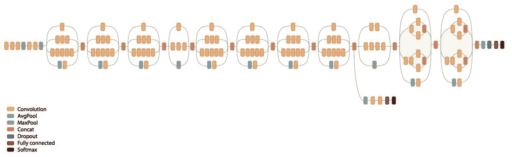

# Inception 架构

`torchvision` 包含一个可以像使用 ResNet 网络一样使用的 Inception 网络。对初始 Inception 块进行了许多改进，PyTorch 提供的当前实现是 Inception v3。让我们看看如何从 `torchvision` 使用 Inception v3 模型来计算预计算特征。我们不会再次介绍数据加载过程，因为我们将使用与 *创建一个 ResNet 模型* 部分相同的数据加载器。我们将查看以下重要主题：

+   创建一个 Inception 模型

+   使用 `register_forward_hook` 提取卷积特征

+   为卷积特征创建一个新的数据集

+   创建一个全连接模型

+   训练和验证模型

# 创建一个 Inception 模型

Inception v3 模型有两个分支，每个分支生成一个输出，在原始模型训练中，我们会合并损失，就像风格迁移一样。目前，我们只关心使用一个分支计算 Inception 的预卷积特征。详细说明超出本书的范围。如果您有兴趣了解更多如何工作的内容，则查阅论文和 Inception 模型的源代码 ([`github.com/pytorch/vision/blob/master/torchvision/models/inception.py`](https://github.com/pytorch/vision/blob/master/torchvision/models/inception.py)) 会有所帮助。我们可以通过将 `aux_logits` 参数设置为 `False` 来禁用其中一个分支。下面的代码解释了如何创建模型以及如何将 `aux_logits` 参数设置为 `False`：

```py
inception_model = inception_v3(pretrained=True)
inception_model.aux_logits = False
if is_cuda:
   inception_model = inception_model.cuda()
```

从 Inception 模型中提取卷积特征并不简单，因此我们将使用 `register_forward_hook` 函数来提取激活值。

# 使用 `register_forward_hook` 提取卷积特征

我们将使用与计算风格迁移激活值相同的技术。以下是 `LayerActivations` 类的代码，进行了一些小的修改，因为我们只关心提取特定层的输出：

```py
class LayerActivations():
   features=[]

   def __init__(self,model):
       self.features = []
       self.hook = model.register_forward_hook(self.hook_function)

   def hook_function(self,module,input,output):

       self.features.extend(output.view(output.size(0),-1).cpu().data)

   def remove(self):

       self.hook.remove()
```

除了 `hook` 函数外，其余代码与我们用于风格迁移的代码类似。因为我们捕获了所有图像的输出并将它们存储起来，所以不能将数据保存在**图形处理单元**（**GPU**）内存中。因此，我们需要从 GPU 和 CPU 提取张量并仅存储张量而不是 `Variable`。我们将它们重新转换为张量，因为数据加载器只能处理张量。在以下代码中，我们使用 `LayerActivations` 对象从 Inception 模型的最后一层提取输出，跳过了平均池化层、dropout 层和线性层。我们跳过平均池化层以避免在数据中丢失有用信息：

```py
# Create LayerActivations object to store the output of inception model at a particular layer.
train_features = LayerActivations(inception_model.Mixed_7c)
train_labels = []

# Passing all the data through the model , as a side effect the outputs will get stored
# in the features list of the LayerActivations object.
for da,la in train_loader:
   _ = inception_model(Variable(da.cuda()))
   train_labels.extend(la)
train_features.remove()

# Repeat the same process for validation dataset .

validation_features = LayerActivations(inception_model.Mixed_7c)
validation_labels = []
for da,la in validation_loader:
   _ = inception_model(Variable(da.cuda()))
   validation_labels.extend(la)
validation_features.remove()
```

让我们创建所需的新卷积特征数据集和加载器。

# 创建用于卷积特征的新数据集

我们可以使用相同的`FeaturesDataset`类来创建新的数据集和数据加载器。在以下代码中，我们正在创建数据集和加载器：

```py
#Dataset for pre computed features for train and validation data sets

train_feat_dset = FeaturesDataset(train_features.features,train_labels)
validation_feat_dset = FeaturesDataset(validation_features.features,validation_labels)

#Data loaders for pre computed features for train and validation data sets

train_feat_loader = DataLoader(train_feat_dset,batch_size=64,shuffle=True)
validation_feat_loader = DataLoader(validation_feat_dset,batch_size=64)
```

让我们创建一个新模型，我们可以在预卷积特征上训练。

# 创建一个全连接模型

一个简单的模型可能会导致过拟合，因此让我们在模型中包含 dropout。Dropout 将帮助我们避免过拟合。在以下代码中，我们正在创建我们的模型：

```py
class FullyConnectedModel(nn.Module):

    def __init__(self,input_size,output_size,training=True):
        super().__init__()
        self.fully_connected = nn.Linear(input_size,output_size)

    def forward(self,input):
        output = F.dropout(input, training=self.training)
        output = self.fully_connected(output)
        return output

# The size of the output from the selected convolution feature
fc_in_size = 131072

fc = FullyConnectedModel(fc_in_size,classes)
if is_cuda:
   fc = fc.cuda()
```

一旦模型创建完成，我们就可以开始训练模型。

# 训练和验证模型

在这里，我们将使用与我们的 ResNet 示例中相同的拟合和训练逻辑。我们只会看一下训练代码和它返回的结果：

```py
for epoch in range(1,10):
   epoch_loss, epoch_accuracy = fit(epoch,fc,train_feat_loader,phase='training')
   validation_epoch_loss , validation_epoch_accuracy = fit(epoch,fc,validation_feat_loader,phase='validation')
   train_losses.append(epoch_loss)
   train_accuracy.append(epoch_accuracy)
   validation_losses.append(validation_epoch_loss)
   validation_accuracy.append(validation_epoch_accuracy)
```

这将产生以下输出：

```py
training loss is 0.78 and training accuracy is 22825/23000 99.24
validation loss is 5.3 and validation accuracy is 1947/2000 97.35
training loss is 0.84 and training accuracy is 22829/23000 99.26
validation loss is 5.1 and validation accuracy is 1952/2000 97.6
training loss is 0.69 and training accuracy is 22843/23000 99.32
validation loss is 5.1 and validation accuracy is 1951/2000 97.55
training loss is 0.58 and training accuracy is 22852/23000 99.36
validation loss is 4.9 and validation accuracy is 1953/2000 97.65
training loss is 0.67 and training accuracy is 22862/23000 99.4
validation loss is 4.9 and validation accuracy is 1955/2000 97.75
training loss is 0.54 and training accuracy is 22870/23000 99.43
validation loss is 4.8 and validation accuracy is 1953/2000 97.65
training loss is 0.56 and training accuracy is 22856/23000 99.37
validation loss is 4.8 and validation accuracy is 1955/2000 97.75
training loss is 0.7 and training accuracy is 22841/23000 99.31
validation loss is 4.8 and validation accuracy is 1956/2000 97.8
training loss is 0.47 and training accuracy is 22880/23000 99.48
validation loss is 4.7 and validation accuracy is 1956/2000 97.8
```

查看结果，Inception 模型在训练数据集上达到了 99%的准确率，在验证数据集上达到了 97.8%的准确率。由于我们预先计算并保存了所有特征在内存中，所以训练模型只需不到几分钟。如果您在运行程序时遇到内存不足的问题，则可能需要避免在内存中保存特征。

在下一节中，我们将看到另一个有趣的架构，DenseNet，这在过去一年中变得非常流行。

# 密集连接卷积网络 – DenseNet

一些最成功和最流行的架构，如 ResNet 和 Inception，显示了更深更宽网络的重要性。ResNet 使用快捷连接来构建更深的网络。DenseNet 通过允许从每一层到后续层的连接，即我们可以接收来自前一层的所有特征映射的层，将这一点推到了一个全新的水平。符号上看，它会如下所示：

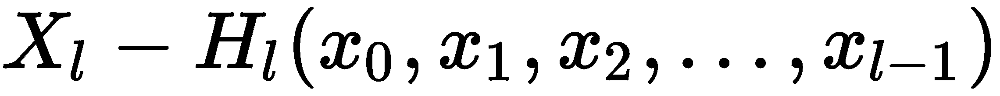

以下图表描述了一个五层密集块的外观：

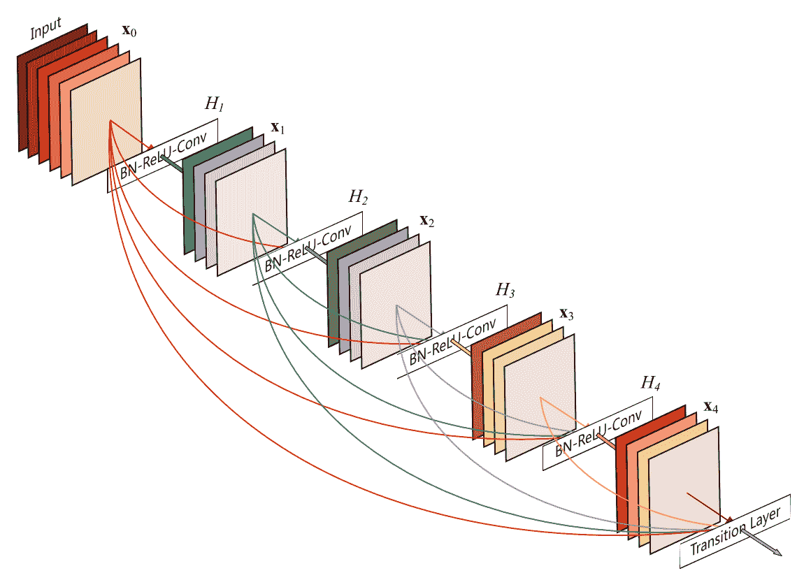

图像来源：[`arxiv.org/abs/1608.06993`](https://arxiv.org/abs/1608.06993)

`torchvision`还有一个 DenseNet 的实现([`github.com/pytorch/vision/blob/master/torchvision/models/densenet.py`](https://github.com/pytorch/vision/blob/master/torchvision/models/densenet.py))。让我们看一下它的两个主要功能，即`_DenseBlock`和`_DenseLayer`。

# `_DenseBlock`对象

让我们来看看`_DenseBlock`的代码，然后逐步解析它：

```py
class _DenseBlock(nn.Sequential):
    def __init__(self, number_layers, number_input_features, bn_size, growth_rate, drop_rate):
        super(_DenseBlock, self).__init__()
        for i in range(number_layers):
            layer = _DenseLayer(number_input_features + i * growth_rate, growth_rate, bn_size, drop_rate)
            self.add_module('denselayer%d' % (i + 1), layer)
```

`_DenseBlock`是一个顺序模块，在这里我们按顺序添加层。基于块中的层数(`number_layers`)，我们添加相应数量的`_DenseLayer`对象，并赋予一个名称。所有的魔法都发生在`_DenseLayer`对象内部。让我们看看`DenseLayer`对象内部发生了什么。

# `_DenseLayer`对象

学习特定网络工作方式的一种方法是查看源代码。PyTorch 的实现非常干净，大多数情况下很容易阅读。让我们来看看 `_DenseLayer` 的实现：

```py
class _DenseLayer(nn.Sequential):
   def __init__(self, number_input_features, growth_rate, bn_size, drop_rate):
       super(_DenseLayer, self).__init__()
       self.add_module('norm.1', nn.BatchNorm2d(number_input_features)),
       self.add_module('relu.1', nn.ReLU(inplace=True)),
       self.add_module('conv.1', nn.Conv2d(number_input_features, bn_size *
                       growth_rate, kernel_size=1, stride=1, bias=False)),
       self.add_module('norm.2', nn.BatchNorm2d(bn_size * growth_rate)),
       self.add_module('relu.2', nn.ReLU(inplace=True)),
       self.add_module('conv.2', nn.Conv2d(bn_size * growth_rate, growth_rate,
                       kernel_size=3, stride=1, padding=1, bias=False)),
       self.drop_rate = drop_rate

   def forward(self, x):
       new_features = super(_DenseLayer, self).forward(x)
       if self.drop_rate > 0:
           new_features = F.dropout(new_features, p=self.drop_rate, training=self.training)
       return torch.cat([x, new_features], 1)
```

如果您对 Python 中的继承还不熟悉，那么前面的代码可能看起来不直观。`_DenseLayer` 对象是 `nn.Sequential` 的子类；让我们看看每个方法内部发生了什么。

在 `__init__` 方法中，我们添加了所有需要传递给输入数据的层。这与我们之前看到的所有其他网络架构非常相似。

`forward` 方法中的魔法发生在这里。我们将输入传递给超类 `nn.Sequential` 的 `forward` 方法。让我们看看序列类 `forward` 方法中发生了什么（[`github.com/pytorch/pytorch/blob/409b1c8319ecde4bd62fcf98d0a6658ae7a4ab23/torch/nn/modules/container.py`](https://github.com/pytorch/pytorch/blob/409b1c8319ecde4bd62fcf98d0a6658ae7a4ab23/torch/nn/modules/container.py))：

```py
def forward(self, input):
   for module in self._modules.values():
       input = module(input)
   return input
```

输入通过之前添加到序列块中的所有层，并将输出连接到输入。这个过程在块中所需的层数中重复进行。

现在我们理解了 DenseNet 块的工作原理，让我们探索如何使用 DenseNet 计算预卷积特征并在其上构建分类器模型。在高层次上，DenseNet 的实现类似于 VGG 的实现。DenseNet 的实现还有一个特征模块，其中包含所有的稠密块，以及一个分类器模块，其中包含全连接模型。在本节中，我们将按照以下步骤构建模型，但将跳过与 Inception 和 ResNet 相似的大部分部分，例如创建数据加载器和数据集。

我们将详细讨论以下步骤：

+   创建 DenseNet 模型

+   提取 DenseNet 特征

+   创建数据集和加载器

+   创建全连接模型并对其进行训练

到目前为止，大多数代码都是不言自明的。

# 创建 DenseNet 模型

Torchvision 提供了预训练的 DenseNet 模型，具有不同的层选项（121、169、201 和 161）。在这里，我们选择了具有 121 层的模型。正如我们之前提到的，DenseNet 模型有两个模块：`features`（包含稠密块）和 `classifier`（全连接块）。由于我们将 DenseNet 用作图像特征提取器，我们只会使用 `features` 模块：

```py
densenet_model = densenet121(pretrained=True).features
if is_cuda:
   densenet_model = densenet_model.cuda()

for p in densenet_model.parameters():
   p.requires_grad = False
```

让我们从图像中提取 DenseNet 特征。

# 提取 DenseNet 特征

这个过程类似于我们对 Inception 所做的操作，只是我们没有使用 `register_forward_hook` 来提取特征。以下代码展示了如何从图像中提取 DenseNet 特征：

```py
#For training data
train_labels = []
train_features = []

#code to store densenet features for train dataset.
for d,la in train_loader:
   o = densenet_model(Variable(d.cuda()))
   o = o.view(o.size(0),-1)
   train_labels.extend(la)
   train_features.extend(o.cpu().data)

#For validation data
validation_labels = []
validation_features = []

#Code to store densenet features for validation dataset.
for d,la in validation_loader:
   o = densenet_model(Variable(d.cuda()))
   o = o.view(o.size(0),-1)
   validation_labels.extend(la)
   validation_features.extend(o.cpu().data)
```

前面的代码与我们看到的 Inception 和 ResNet 类似。

# 创建数据集和加载器

我们将使用我们为 ResNet 创建的相同`FeaturesDataset`类，并用它来为训练和验证数据集创建数据加载器。我们将使用以下代码来实现：

```py
# Create dataset for train and validation convolution features
train_feat_dset = FeaturesDataset(train_features,train_labels)
validation_feat_dset = FeaturesDataset(validation_features,validation_labels)

# Create data loaders for batching the train and validation datasets
train_feat_loader = DataLoader(train_feat_dset,batch_size=64,shuffle=True,drop_last=True)
validation_feat_loader = DataLoader(validation_feat_dset,batch_size=64)
```

现在，是时候创建模型并训练它了。

# 创建一个全连接模型并训练它

现在，我们将使用一个简单的线性模型，类似于我们在 ResNet 和 Inception 中使用的模型，来训练模型。以下代码展示了我们将用于训练模型的网络架构：

```py
class FullyConnectedModel(nn.Module):

    def __init__(self,input_size,output_size):
        super().__init__()
        self.fc = nn.Linear(input_size,output_size)

    def forward(self,input):
        output = self.fc(input)
        return output

fc = FullyConnectedModel(fc_in_size,classes)
if is_cuda:
   fc = fc.cuda()
```

我们将使用相同的`fit`方法来训练前述模型。下面的代码片段显示了训练代码及其结果：

```py
train_losses , train_accuracy = [],[]
validation_losses , validation_accuracy = [],[]
for epoch in range(1,10):
   epoch_loss, epoch_accuracy = fit(epoch,fc,train_feat_loader,phase='training')
   validation_epoch_loss , validation_epoch_accuracy = fit(epoch,fc,validation_feat_loader,phase='validation')
   train_losses.append(epoch_loss)
   train_accuracy.append(epoch_accuracy)
   validation_losses.append(validation_epoch_loss)
   validation_accuracy.append(validation_epoch_accuracy)
```

前述代码的结果如下：

```py
training loss is 0.057 and training accuracy is 22506/23000 97.85
validation loss is 0.034 and validation accuracy is 1978/2000 98.9
training loss is 0.0059 and training accuracy is 22953/23000 99.8
validation loss is 0.028 and validation accuracy is 1981/2000 99.05
training loss is 0.0016 and training accuracy is 22974/23000 99.89
validation loss is 0.022 and validation accuracy is 1983/2000 99.15
training loss is 0.00064 and training accuracy is 22976/23000 99.9
validation loss is 0.023 and validation accuracy is 1983/2000 99.15
training loss is 0.00043 and training accuracy is 22976/23000 99.9
validation loss is 0.024 and validation accuracy is 1983/2000 99.15
training loss is 0.00033 and training accuracy is 22976/23000 99.9
validation loss is 0.024 and validation accuracy is 1984/2000 99.2
training loss is 0.00025 and training accuracy is 22976/23000 99.9
validation loss is 0.024 and validation accuracy is 1984/2000 99.2
training loss is 0.0002 and training accuracy is 22976/23000 99.9
validation loss is 0.025 and validation accuracy is 1985/2000 99.25
training loss is 0.00016 and training accuracy is 22976/23000 99.9
validation loss is 0.024 and validation accuracy is 1986/2000 99.3
```

前述算法能够达到最高 99%的训练精度和 99%的验证精度。由于您可能创建的验证数据集可能具有不同的图像，因此您的结果可能会有所不同。

DenseNet 的一些优点如下：

+   它显著减少了所需的参数数量。

+   它缓解了梯度消失问题。

+   它鼓励特征重用。

在接下来的部分中，我们将探讨如何构建一个模型，结合使用 ResNet、Inception 和 DenseNet 计算的卷积特征的优势。

# 模型集成

有时我们需要尝试结合多个模型来构建一个非常强大的模型。我们可以使用许多技术来构建集成模型。在本节中，我们将学习如何使用由三个不同模型（ResNet、Inception 和 DenseNet）生成的特征来组合输出，以构建一个强大的模型。我们将使用本章中其他示例中使用的相同数据集。

集成模型的架构如下：

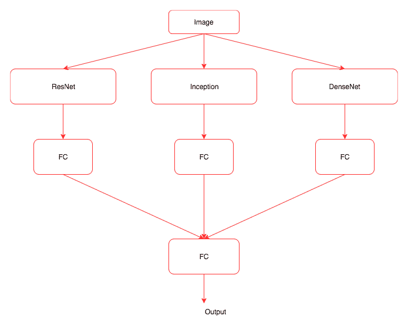

前面的图表显示了我们将在集成模型中执行的操作，可以总结如下步骤：

1.  创建三个模型。

1.  使用创建的模型提取图像特征。

1.  创建一个自定义数据集，返回所有三个模型的特征以及标签。

1.  创建一个与前面图表中显示的架构类似的模型。

1.  训练和验证模型。

让我们详细探讨每个步骤。

# 创建模型

让我们创建所有三个所需的模型，如以下代码块所示。

创建 ResNet 模型的代码如下：

```py
resnet_model = resnet34(pretrained=True)

if is_cuda:
   resnet_model = resnet_model.cuda()

resnet_model = nn.Sequential(*list(resnet_model.children())[:-1])

for p in resnet_model.parameters():
   p.requires_grad = False
```

Inception 模型的代码如下：

```py
inception_model = inception_v3(pretrained=True)
inception_model.aux_logits = False
if is_cuda:
   inception_model = inception_model.cuda()
for p in inception_model.parameters():
   p.requires_grad = False
```

DenseNet 模型的代码如下：

```py
densenet_model = densenet121(pretrained=True).features
if is_cuda:
   densenet_model = densenet_model.cuda()

for p in densenet_model.parameters():
   p.requires_grad = False
```

现在我们已经有了所有的模型，让我们从图像中提取特征。

# 提取图像特征

在这里，我们将结合我们在本章中各个算法中单独看到的所有逻辑。

ResNet 的代码如下：

```py
train_labels = []
train_resnet_features = []
for d,la in train_loader:
   o = resnet_model(Variable(d.cuda()))
   o = o.view(o.size(0),-1)
   train_labels.extend(la)
   train_resnet_features.extend(o.cpu().data)
validation_labels = []
validation_resnet_features = []
for d,la in validation_loader:
   o = resnet_model(Variable(d.cuda()))
   o = o.view(o.size(0),-1)
   validation_labels.extend(la)
   validation_resnet_features.extend(o.cpu().data)
```

Inception 的代码如下：

```py
train_inception_features = LayerActivations(inception_model.Mixed_7c)
for da,la in train_loader:
   _ = inception_model(Variable(da.cuda()))

train_inception_features.remove()

validation_inception_features = LayerActivations(inception_model.Mixed_7c)
for da,la in validation_loader:
   _ = inception_model(Variable(da.cuda()))

validation_inception_features.remove()
```

DenseNet 的代码如下：

```py
train_densenet_features = []
for d,la in train_loader:
   o = densnet_model(Variable(d.cuda()))
   o = o.view(o.size(0),-1)

   train_densenet_features.extend(o.cpu().data)

validation_densenet_features = []
for d,la in validation_loader:
   o = densnet_model(Variable(d.cuda()))
   o = o.view(o.size(0),-1)
   validation_densenet_features.extend(o.cpu().data)
```

现在，我们使用所有模型创建了图像特征。如果您遇到内存问题，则可以删除一个模型或停止存储训练速度较慢的特征。如果您在运行 CUDA 实例，则可以选择更强大的实例。

# 创建自定义数据集及其数据加载器

由于 `FeaturesDataset` 类仅开发用于挑选来自单个模型的输出，因此我们无法使用它。由于这一点，以下实现包含对 `FeaturesDataset` 类所做的轻微更改，以便我们可以容纳所有三个生成的特征：

```py
class FeaturesDataset(Dataset):
   def __init__(self,featlst1,featlst2,featlst3,labellst):
       self.featlst1 = featlst1
       self.featlst2 = featlst2
       self.featlst3 = featlst3
       self.labellst = labellst

   def __getitem__(self,index):
       return (self.featlst1[index],self.featlst2[index],self.featlst3[index],self.labellst[index])

   def __len__(self):
       return len(self.labellst)

train_feat_dset = FeaturesDataset(train_resnet_features,train_inception_features.features,train_densenet_features,train_labels)
validation_feat_dset = FeaturesDataset(validation_resnet_features,validation_inception_features.features,validation_densenet_features,validation_labels)
```

在这里，我们对 `__init__` 方法进行了更改，以便我们可以存储从不同模型生成的所有特征。我们还改变了 `__getitem__` 方法，以便我们可以检索图像的特征和标签。使用 `FeatureDataset` 类，我们为训练和验证数据创建了数据集实例。创建数据集后，我们可以使用相同的数据加载器来批处理数据，如下面的代码所示：

```py
train_feat_loader = DataLoader(train_feat_dset,batch_size=64,shuffle=True)
validation_feat_loader = DataLoader(validation_feat_dset,batch_size=64)
```

# 创建集成模型

现在，我们需要创建一个像我们之前看到的架构图一样工作的模型。以下代码实现了这一点：

```py
class EnsembleModel(nn.Module):

    def __init__(self,output_size,training=True):
        super().__init__()
        self.fully_connected1 = nn.Linear(8192,512)
        self.fully_connected2 = nn.Linear(131072,512)
        self.fully_connected3 = nn.Linear(82944,512)
        self.fully_connected4 = nn.Linear(512,output_size)

    def forward(self,input1,input2,input3):
        output1 = self.fully_connected1(F.dropout(input1,training=self.training))
        output2 = self.fully_connected2(F.dropout(input2,training=self.training))
        output3 = self.fully_connected3(F.dropout(input3,training=self.training))
        output = output1 + output2 + output3
        output = self.fully_connected4(F.dropout(out,training=self.training))
        return output

em = EnsembleModel(2)
if is_cuda:
   em = em.cuda()
```

在上述代码中，我们创建了三个线性层，这些层将由不同模型生成的特征作为输入。我们将这三个线性层的所有输出相加，并将它们传递到另一个线性层，将它们映射到所需的类别。为了防止模型过拟合，我们使用了 dropout。

# 训练和验证模型

我们需要对 `fit` 方法进行一些小的更改，以适应从数据加载器生成的三个输入值。以下代码实现了新的 `fit` 函数：

```py
def fit(epoch,model,data_loader,phase='training',volatile=False):
   if phase == 'training':
       model.train()
   if phase == 'validation':
       model.eval()
       volatile=True
   running_loss = 0.0
   running_correct = 0
   for batch_idx , (data1,data2,data3,target) in enumerate(data_loader):
       if is_cuda:
           data1,data2,data3,target = data1.cuda(),data2.cuda(),data3.cuda(),target.cuda()
       data1,data2,data3,target = Variable(data1,volatile),Variable(data2,volatile),Variable(data3,volatile),Variable(target)
       if phase == 'training':
           optimizer.zero_grad()
       output = model(data1,data2,data3)
       loss = F.cross_entropy(output,target)

       running_loss += F.cross_entropy(output,target,size_average=False).data[0]
       preds = output.data.max(dim=1,keepdim=True)[1]
       running_correct += preds.eq(target.data.view_as(preds)).cpu().sum()
       if phase == 'training':
           loss.backward()
           optimizer.step()

   loss = running_loss/len(data_loader.dataset)
   accuracy = 100\. * running_correct/len(data_loader.dataset)

   print(f'{phase} loss is {loss:{5}.{2}} and {phase} accuracy is {running_correct}/{len(data_loader.dataset)}{accuracy:{10}.{4}}')
   return loss,accuracy
```

正如您所看到的，大部分代码保持不变，除了加载器返回三个输入和一个标签。因此，我们必须对功能进行更改，这是不言自明的。

以下是训练代码：

```py
train_losses , train_accuracy = [],[]
validation_losses , validation_accuracy = [],[]
for epoch in range(1,10):
    epoch_loss, epoch_accuracy = fit(epoch,em,trn_feat_loader,phase='training')
    validation_epoch_loss , validation_epoch_accuracy = fit(epoch,em,validation_feat_loader,phase='validation')
    train_losses.append(epoch_loss)
    train_accuracy.append(epoch_accuracy)
    validation_losses.append(validation_epoch_loss)
    validation_accuracy.append(validation_epoch_accuracy)
```

上述代码的结果如下：

```py
training loss is 7.2e+01 and training accuracy is 21359/23000 92.87
validation loss is 6.5e+01 and validation accuracy is 1968/2000 98.4
training loss is 9.4e+01 and training accuracy is 22539/23000 98.0
validation loss is 1.1e+02 and validation accuracy is 1980/2000 99.0
training loss is 1e+02 and training accuracy is 22714/23000 98.76
validation loss is 1.4e+02 and validation accuracy is 1976/2000 98.8
training loss is 7.3e+01 and training accuracy is 22825/23000 99.24
validation loss is 1.6e+02 and validation accuracy is 1979/2000 98.95
training loss is 7.2e+01 and training accuracy is 22845/23000 99.33
validation loss is 2e+02 and validation accuracy is 1984/2000 99.2
training loss is 1.1e+02 and training accuracy is 22862/23000 99.4
validation loss is 4.1e+02 and validation accuracy is 1975/2000 98.75
training loss is 1.3e+02 and training accuracy is 22851/23000 99.35
validation loss is 4.2e+02 and validation accuracy is 1981/2000 99.05
training loss is 2e+02 and training accuracy is 22845/23000 99.33
validation loss is 6.1e+02 and validation accuracy is 1982/2000 99.1
training loss is 1e+02 and training accuracy is 22917/23000 99.64
validation loss is 5.3e+02 and validation accuracy is 1986/2000 99.3
```

集成模型实现了 99.6%的训练准确率和 99.3%的验证准确率。虽然集成模型功能强大，但计算成本高昂。它们是解决 Kaggle 等竞赛中问题时的好技术。

# 编码器-解码器架构

在本书中，我们看到的几乎所有深度学习算法都擅长于学习如何将训练数据映射到其对应的标签。我们不能直接将它们用于需要从序列学习并生成另一个序列或图像的任务。一些示例应用如下：

+   语言翻译

+   图像字幕

+   图像生成 (`seq2img`)

+   语音识别

+   问答

大多数这些问题可以看作是序列到序列映射的形式，并且可以使用一类称为编码器-解码器架构的家族来解决。在本节中，我们将了解这些架构背后的直觉。我们不会深入研究这些网络的实现，因为它们需要更详细的学习。

在高层次上，编码器-解码器架构如下所示：

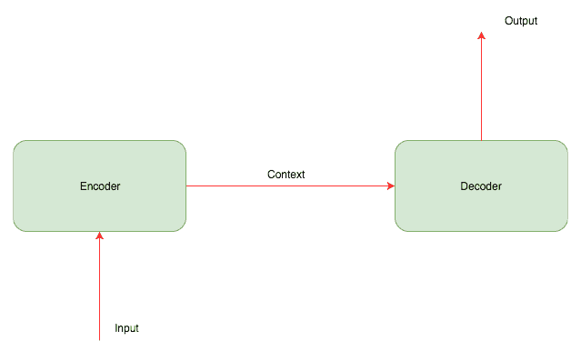

编码器通常是一个**循环神经网络**（**RNN**）（用于序列数据）或者**卷积神经网络**（**CNN**）（用于图像），接收图像或序列并将其转换为一个固定长度的向量，编码了所有信息。解码器是另一个 RNN 或 CNN，它学习解码编码器生成的向量，并生成新的数据序列。以下图表显示了图像字幕系统中编码器-解码器架构的外观：

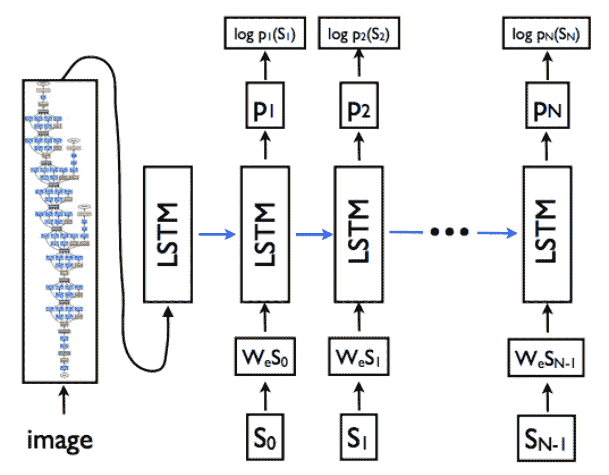

图像来源：[`arxiv.org/pdf/1411.4555.pdf`](https://arxiv.org/pdf/1411.4555.pdf)

现在，让我们看看图像字幕系统中编码器和解码器架构内部发生了什么。

# 编码器

对于图像字幕系统，我们应该使用训练好的架构，比如 ResNet 或 Inception，从图像中提取特征。就像我们为集成模型所做的那样，我们可以通过使用线性层输出一个固定长度的向量，然后使该线性层可训练。

# 解码器

解码器是一个**长短期记忆**（**LSTM**）层，用于为图像生成字幕。为了构建一个简单的模型，我们可以将编码器嵌入作为 LSTM 的输入。然而，对于解码器来说，学习起来可能会有挑战；因此，常见的做法是在解码器的每个步骤中提供编码器嵌入。直观地说，解码器学习生成一系列文本，最好地描述给定图像的字幕。

# 具有注意力机制的编码器-解码器

在 2017 年，阿希什·瓦斯瓦尼和合作者发表了一篇名为*Attention Is All You Need*的论文（[`arxiv.org/pdf/1706.03762.pdf`](https://arxiv.org/pdf/1706.03762.pdf)），该论文引入了注意力机制。在每个时间步，注意力网络计算像素的权重。它考虑到迄今为止已生成的单词序列，并输出接下来应该描述什么：

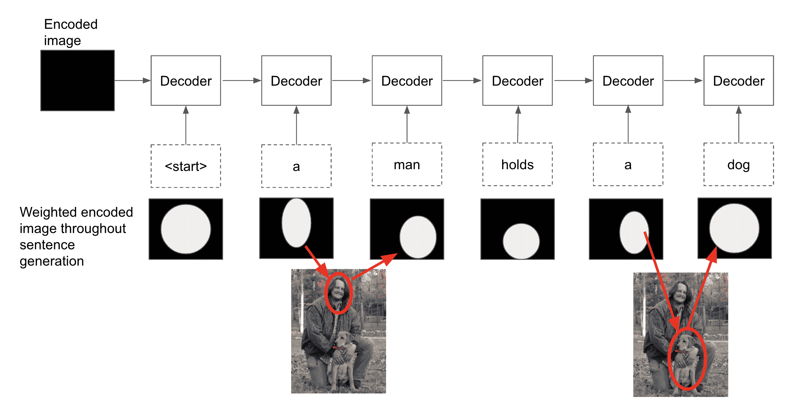

在上面的例子中，我们可以看到 LSTM 保留信息的能力可以帮助它学习在“一个男人”之后逻辑地写入“正在抱着一只狗”。

# 摘要

在本章中，我们探讨了一些现代架构，如 ResNet、Inception 和 DenseNet。我们还探讨了如何利用这些模型进行迁移学习和集成，并介绍了编码器-解码器架构，这种架构驱动了许多系统，如语言翻译系统。

在接下来的章节中，我们将深入探讨深度强化学习，并学习模型如何应用于解决现实世界中的问题。我们还将看看一些 PyTorch 实现，这些实现可以帮助实现这一目标。
