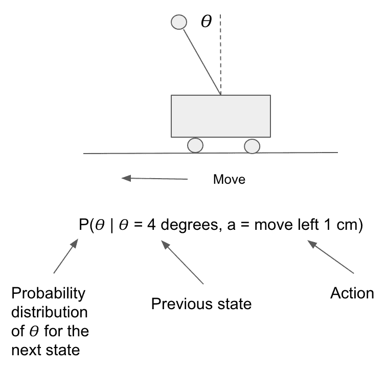
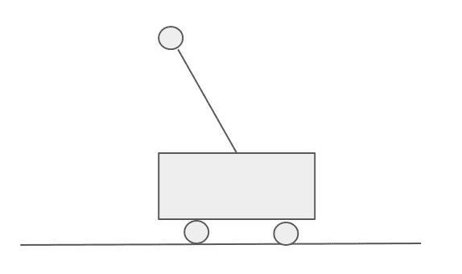

# 第十章：深度强化学习

本章从基本介绍**强化学习**（**RL**）开始，包括代理、状态、动作、奖励和策略。它扩展到基于**深度学习**（**DL**）的架构，用于解决 RL 问题，如策略梯度方法、深度 Q 网络和演员-评论家模型。本章将解释如何使用这些深度学习架构及其手动代码在 OpenAI Gym 环境中解决序列决策问题。

具体而言，将涵盖以下内容：

+   强化学习简介

+   使用深度学习解决强化学习问题

+   策略梯度和 PyTorch 中的代码演示

+   深度 Q 网络和 PyTorch 中的代码演示

+   Actor-critic 网络和 PyTorch 中的代码演示

+   强化学习在现实世界中的应用

# 强化学习简介

强化学习是机器学习的一个分支，其中代理程序学习在给定环境中的最佳行为方式。代理程序执行某些动作并观察奖励/结果。它学习将情况映射到行动的过程，以最大化奖励。

强化学习过程可以建模为一个迭代循环，并可以表示为称为**马尔可夫决策过程**（**MDP**）的数学框架。以下步骤概述了该过程的进行：

1.  强化学习代理从环境中接收状态（*s[0]*）。

1.  强化学习代理根据当前状态（*s[0]*）采取行动（*a[0]*）。在此阶段，由于代理没有关于可能获得的奖励的先前知识，它采取的行动是随机的。

1.  第一次行动发生后，代理现在可以被认为处于状态*s[1]*。

1.  此时，环境向代理提供奖励（*r[1]*）。

这一循环持续重复；它输出一个状态和动作序列，并观察奖励。

该过程本质上是一种学习 MDP 策略的算法：


每个时间步的累积奖励与给定行动相关的表示如下：


在某些应用中，可能有利于更多地重视及时收到的奖励。例如，今天收到£100 比 5 年后收到要好。为了纳入这一点，引入一个折扣因子𝛾是很常见的。

累积折扣奖励表示如下：


强化学习中的一个重要考虑因素是奖励可能是不频繁和延迟的。在存在长时间延迟奖励的情况下，追溯哪些动作序列导致了奖励可能是具有挑战性的。

# 基于模型的强化学习

基于模型的强化学习模拟环境的行为。它预测采取行动后的下一个状态。可以用概率分布的形式数学表示如下：


在此，*p*表示模型，*x*是状态，*a*是控制或动作。

这个概念可以通过考虑平衡杆示例来进行演示。目标是让附着在小车上的杆保持竖直，代理可以决定两种可能的动作之间的选择：将小车向左移动或将小车向右移动。在下面的截图中，P 模拟了采取行动后杆的角度：



下图描述了下一时间步中θ的概率分布输出：


在这种情况下，模型描述了物理定律；然而，模型可能是任何应用的依据。另一个例子是模型可以建立在国际象棋游戏的规则上。

基于模型的强化学习的核心概念是使用模型和成本函数来定位最佳路径的行动或者说状态和行动的轨迹，𝝉：


基于模型的算法的缺点是，随着状态空间和动作空间的扩大，它们可能变得不切实际。

# 无模型强化学习

无模型算法依赖试验和错误来更新其知识。因此，它们不需要空间来存储所有状态和动作的组合。策略梯度、值学习或其他无模型强化学习方法用于找到一个最大化奖励的最佳行动策略。无模型和基于模型方法的一个关键区别在于，无模型方法在真实环境中行动学习。

# 比较基于策略和离策略

策略定义了代理如何行动；它告诉代理在每个状态下应该如何行动。每个强化学习算法必须遵循某种策略来决定其行为方式。

代理试图学习的策略函数可以表示如下，其中*θ*是参数向量，*s*是特定状态，*a*是一个动作：


基于策略的代理学习值（期望的折扣奖励），基于当前动作并源于当前策略。离策略学习值则基于从另一策略（如贪婪策略，如我们接下来介绍的 Q-learning 中）获得的动作。

# Q-learning

Q-learning 是一种无模型强化学习算法，通过创建一个表格来计算每个状态下每个动作的最大预期未来奖励。它被认为是离策略的，因为 Q-learning 函数从当前策略之外的动作中学习。

当进行 Q-learning 时，会创建一个 Q-表格，其中列代表可能的动作，行代表状态。Q-表格中每个单元格的值将是给定状态和动作的最大预期未来奖励：


每个 Q-表格分数将是从最佳策略中获取的动作的最大预期未来奖励。Q-learning 算法用于学习 Q-表格中的每个值。

**Q 函数**（或**动作值函数**）接受两个输入：状态和奖励。Q 函数返回该状态下执行该动作的预期未来奖励。它可以如下表示：


Q 函数基本上通过滚动 Q 表来查找与当前状态相关的行和与动作相关的列。从这里，它返回相应的预期未来奖励 Q 值。

考虑到在下图中展示的倒立摆示例中。在当前状态下，向左移动应该比向右移动具有更高的 Q 值：


随着环境的探索，Q 表将被更新以提供更好的近似值。Q 学习算法的过程如下：

1.  初始化 Q 表。

1.  根据当前的 Q 值估计，选择当前状态（*s*）中的一个动作。

1.  执行一个动作（*a*）。

1.  奖励（*r*）被测量。

1.  使用贝尔曼方程更新 Q 值。

贝尔曼方程如下所示：


*步骤 2-5* 重复执行，直到达到最大的回合数或手动停止训练。

Q 学习算法可以表示为以下方程：


# 值方法

值学习是许多强化学习方法的关键构建模块。值函数 *V(s)* 表示代理所处状态的好坏程度。它等于从状态 *s* 开始代理预期的总奖励。总预期奖励取决于代理通过选择动作执行的策略。如果代理使用给定策略（𝛑）选择其动作，则相应的值函数由以下公式给出：


在倒立摆示例中考虑到这一点，我们可以利用杆子保持直立的时间长度来衡量奖励。在下面的截图中，与状态 s2 相比，状态 s1 杆子保持直立的概率更高。因此，对于大多数策略而言，状态 s1 的值函数可能更高（即更高的期望未来奖励）：


存在一个优化的值函数，其对所有状态都具有比其他函数更高的值，可以表示为以下形式：


存在一个与最优值函数对应的最优策略：


可以通过几种不同的方式找到最优策略。这称为策略评估。

# 值迭代

值迭代是一个通过迭代改进*V(s)*估计来计算最优状态值函数的过程。首先，算法将*V(s)*初始化为随机值。然后，它重复更新*Q(s, a)*和*V(s)*的值，直到它们收敛。值迭代收敛到最优值。

下面是值迭代的伪代码：


# 编码示例 – 值迭代

为了说明这一点，我们将使用 OpenAI Gym 中的 Frozen Lake 环境作为示例。在这个环境中，玩家需要想象自己站在一个部分冻结的湖面上。目标是从起点 S 移动到终点 G 而不掉入洞中：


网格上的字母代表以下内容：

+   S：起点，安全

+   F：冻结表面，安全

+   H：洞，不安全

+   G：目标

代理可以采取四种可能的移动：左、右、下、上，分别表示为 0、1、2、3。因此，有 16 种可能的状态（4 x 4）。对于每个 H 状态，代理会收到-1 的奖励，并在达到目标时收到+1 的奖励。

要在代码中实现值迭代，我们首先导入希望使用的相关库，并初始化`FrozenLake`环境：

```py
import gym
import numpy as np
import time, pickle, os
env = gym.make('FrozenLake-v0')
```

现在，我们为变量赋值：

```py
# Epsilon for an epsilon greedy approach
epsilon = 0.95 
total_episodes = 1000
# Maximum number of steps to be run for every episode
maximum_steps = 100
learning_rate = 0.75
# The discount factor
gamma = 0.96 
```

从这里开始，我们初始化 Q 表，其中`env.observation_space.n`是状态数，`env.action_space.n`是动作数。

```py
Q = np.zeros((env.observation_space.n, env.action_space.n))
```

定义代理选择动作和学习的函数：

```py
def select_action(state):
    action=0
    if np.random.uniform(0, 1) < epsilon:

        # If the random number sampled is smaller than epsilon then a random action is chosen.

        action = env.action_space.sample()
    else:
        # If the random number sampled is greater than epsilon then we choose an action having the maximum value in the Q-table
        action = np.argmax(Q[state, :])
    return action

def agent_learn(state, state_next, reward, action):
    predict = Q[state, action]
    target = reward + gamma * np.max(Q[state_next, :])
    Q[state, action] = Q[state, action] + learning_rate * (target - predict)
```

从这里开始，我们可以开始运行回合并将 Q 表导出到一个 pickle 文件中：

```py
for episode in range(total_episodes):
    state = env.reset()
    t = 0

    while t < maximum_steps:
        env.render()
        action = select_action(state) 
        state_next, reward, done, info = env.step(action) 
        agent_learn(state, state_next, reward, action)
        state = state_next
        t += 1       
        if done:
            break
        time.sleep(0.1)

print(Q)
with open("QTable_FrozenLake.pkl", 'wb') as f:
    pickle.dump(Q, f)
```

我们可以通过运行前面的代码来看到这个过程：


# 策略方法

在基于策略的强化学习中，目标是找到能做出最有益决策的策略，可以数学表示如下：


强化学习中的策略可以是确定性的，也可以是随机的：


随机策略输出的是概率分布而不是单一的离散值：


我们可以将这个目标数学化地表示如下：


# 策略迭代

在值迭代过程中，有时最优策略在值函数之前收敛，因为它只关心找到最优策略。还可以执行另一个称为策略迭代的算法来达到最优策略。这是在每次策略评估之后，下一个策略基于值函数直到策略收敛的过程。以下图示展示了策略迭代过程：


因此，策略迭代算法保证收敛到最优策略，而值迭代算法则不一定。

以下是策略迭代的伪代码：


# 编码示例 - 策略迭代

在这里，我们考虑使用之前介绍的 Frozen Lake 环境的编码示例。

首先，导入相关的库：

```py
import numpy as np
import gym
from gym import wrappers
```

现在，我们定义函数来运行一个 episode 并返回奖励：

```py
def run_episode_return_reward(environment, policy, gamma_value = 1.0, render = False):
    """ Runs an episode and return the total reward """
    obs = environment.reset()
    total_reward = 0
    step_index = 0
    while True:
        if render:
            environment.render()
        obs, reward, done , _ = environment.step(int(policy[obs]))
        total_reward += (gamma_value ** step_index * reward)
        step_index += 1
        if done:
            break
    return total_reward
```

从这里，我们可以定义评估策略的函数：

```py
def evaluate_policy(environment, policy, gamma_value = 1.0, n = 200):
    model_scores = [run_episode_return_reward(environment, policy, gamma_value, False) for _ in range(n)]
    return np.mean(model_scores)
```

然后，定义提取策略的函数：

```py
def extract_policy(v, gamma_value = 1.0):
    """ Extract the policy for a given value function """
    policy = np.zeros(environment.nS)
    for s in range(environment.nS):
        q_sa = np.zeros(environment.nA)
        for a in range(environment.nA):
            q_sa[a] = sum([p * (r + gamma_value * v[s_]) for p, s_, r, _ in environment.P[s][a]])
        policy[s] = np.argmax(q_sa)
    return policy
```

最后，定义计算策略的函数：

```py
def compute_policy_v(environment, policy, gamma_value=1.0):
    """ Iteratively evaluate the value-function under policy.
    Alternatively, we could formulate a set of linear equations in terms of v[s] 
    and solve them to find the value function.
    """
    v = np.zeros(environment.nS)
    eps = 1e-10
    while True:
        prev_v = np.copy(v)
        for s in range(environment.nS):
            policy_a = policy[s]
            v[s] = sum([p * (r + gamma_value * prev_v[s_]) for p, s_, r, _ in environment.P[s][policy_a]])
        if (np.sum((np.fabs(prev_v - v))) <= eps):
            # value converged
            break
    return v
```

从这里，我们可以在 Frozen Lake 环境上运行策略迭代：

```py
env_name = 'FrozenLake-v0'
environment = gym.make(env_name)
optimal_policy = policy_iteration(environment, gamma_value = 1.0)
scores = evaluate_policy(environment, optimal_policy, gamma_value = 1.0)
print('Average scores = ', np.mean(scores))
```

我们观察到它在 *步骤 5* 处收敛：


# 价值迭代与策略迭代的比较

当代理假定对其在环境中的行为影响有一些先验知识时，可以使用价值迭代和策略迭代算法。这些算法假定已知马尔可夫决策过程（MDP）模型。然而，策略迭代通常更加计算效率高，因为它往往需要更少的迭代次数才能收敛。

# 策略梯度算法

策略梯度也是解决强化学习问题的一种方法，旨在直接建模和优化策略：


在策略梯度中，采取以下步骤：

1.  代理观察环境的状态 (*s*)。

1.  代理根据他们对状态 (*s*) 的本能（即策略π）采取行动 *u*。

1.  代理移动并且环境改变；形成一个新的状态。

1.  代理根据观察到的环境状态进一步采取行动。

1.  在运动轨迹（τ）之后，代理根据所获得的总奖励 *R(τ)* 调整其本能。

策略梯度定理如下：

*预期奖励的导数是策略π[θ]​的对数梯度与奖励乘积的期望*。


# 编码示例 - 策略梯度算法

在本例中，我们使用名为 CartPole 的 OpenAI 环境，目标是让连接到小车上的杆尽可能长时间保持直立。代理在每个时间步长内保持杆平衡时会获得奖励。如果杆倒下，那么这一集结束：



在任何时刻，小车和杆都处于一个状态 *s*。该状态由四个元素的向量表示，即杆角度、杆速度、小车位置和小车速度。代理可以选择两种可能的动作：向左移动小车或向右移动小车。

策略梯度采取小步骤，并根据与步骤相关的奖励更新策略。这样做可以训练代理，而无需在环境中为每对状态和动作映射价值。

在这个例子中，我们将应用一种称为蒙特卡洛策略梯度的技术。使用这种方法，代理将根据获得的奖励在每个 episode 结束时更新策略。

我们首先导入我们计划使用的相关库：

```py
import gym
import numpy as np
from tqdm import tqdm, trange
import pandas as pd
import torch
import torch.nn as nn
import torch.optim as optim
import torch.nn.functional as F
from torch.autograd import Variable
from torch.distributions import Categorical
```

现在，我们定义一个前馈神经网络，包含一个隐藏层，有 128 个神经元和 0.5 的 dropout。我们使用 Adam 作为优化器，学习率为 0.02。使用 dropout 显著提高了策略的性能：

```py
class PolicyGradient(nn.Module):
    def __init__(self):
        super(PolicyGradient, self).__init__()

        # Define the action space and state space
        self.action_space = env.action_space.n
        self.state_space = env.observation_space.shape[0]

        self.l1 = nn.Linear(self.state_space, 128, bias=False)
        self.l2 = nn.Linear(128, self.action_space, bias=False)

        self.gamma_value = gamma_value

        # Episode policy and reward history 
        self.history_policy = Variable(torch.Tensor()) 
        self.reward_episode = []

        # Overall reward and loss history
        self.history_reward = []
        self.history_loss = []

    def forward(self, x): 
        model = torch.nn.Sequential(
            self.l1,
            nn.Dropout(p=0.5),
            nn.ReLU(),
            self.l2,
            nn.Softmax(dim=-1)
        )
        return model(x)

policy = PolicyGradient()
optimizer = optim.Adam(policy.parameters(), lr=l_rate)
```

现在，我们定义一个`choose_action`函数。这个函数根据策略分布选择动作，使用了 PyTorch 分布包。策略返回一个数组，表示动作空间上每个可能动作的概率。在我们的例子中，可以是向左移动或向右移动，因此输出可能是[0.1, 0.9]。根据这些概率选择动作，记录历史并返回动作：

```py
def choose_action(state):
    # Run the policy model and choose an action based on the probabilities in state
    state = torch.from_numpy(state).type(torch.FloatTensor)
    state = policy(Variable(state))
    c = Categorical(state)
    action = c.sample() 
    if policy.history_policy.dim() != 0:
        try:
            policy.history_policy = torch.cat([policy.history_policy, c.log_prob(action)])
        except:
            policy.history_policy = (c.log_prob(action))
    else:
        policy.history_policy = (c.log_prob(action))
    return action
```

要更新策略，我们从 Q 函数（动作值函数）中取样。回想一下，这是通过遵循策略 π 在状态中采取行动来预期的回报。我们可以使用每个时间步长的策略梯度来计算，其中在杆保持垂直的每个步骤都有 1 的奖励。我们使用长期奖励 (*vt*)，这是整个 episode 期间所有未来奖励的折现总和。因此，episode 越长，当前状态-动作对的奖励越大，其中 gamma 是折现因子。

折现奖励向量表示如下：


例如，如果一个 episode 持续 4 个时间步，每步的奖励将分别是 [4.90, 3.94, 2.97, 1.99]。从这里，我们可以通过减去均值并除以标准差来缩放奖励向量。

在每个 episode 结束后，我们应用蒙特卡洛策略梯度来改进策略，如下所示：


然后，这个策略乘以奖励值，输入优化器，使用随机梯度下降更新神经网络的权重。

以下函数定义了我们如何在代码中更新策略：

```py
def update_policy():
    R = 0
    rewards = []

    # Discount future rewards back to the present using gamma
    for r in policy.reward_episode[::-1]:
        R = r + policy.gamma_value * R
        rewards.insert(0,R)

    # Scale rewards
    rewards = torch.FloatTensor(rewards)
    x = np.finfo(np.float32).eps
    x = np.array(x)
    x = torch.from_numpy(x)
    rewards = (rewards - rewards.mean()) / (rewards.std() + x)
    # Calculate the loss loss
    loss = (torch.sum(torch.mul(policy.history_policy, Variable(rewards)).mul(-1), -1))

    # Update the weights of the network
    optimizer.zero_grad()
    loss.backward()
    optimizer.step()

    #Save and intialize episode history counters
    policy.history_loss.append(loss.data[0])
    policy.history_reward.append(np.sum(policy.reward_episode))
    policy.history_policy = Variable(torch.Tensor())
    policy.reward_episode= []
```

在这里，我们定义主策略训练循环。在每个训练 episode 的每一步，选择一个动作并记录新状态和奖励。在每个 episode 结束时调用`update_policy`函数，将 episode 历史传入神经网络：

```py
def main_function(episodes):
    running_total_reward = 50
    for e in range(episodes):
        # Reset the environment and record the starting state
        state = env.reset() 
        done = False 

        for time in range(1000):
            action = choose_action(state)
            # Step through environment using chosen action
            state, reward, done, _ = env.step(action.data.item())

            # Save reward
            policy.reward_episode.append(reward)
            if done:
                break

        # Used to determine when the environment is solved.
        running_total_reward = (running_total_reward * 0.99) + (time * 0.01)

        update_policy()

        if e % 50 == 0:
            print('Episode number {}, Last length: {:5d}, Average length: {:.2f}'.format(e, time, running_total_reward))

        if running_total_reward > env.spec.reward_threshold:
            print("Solved! Running reward is now {} and the last episode runs to {} time steps!".format(running_total_reward, time))
            break

episodes = 2000
main_function(episodes)
```

# 深度 Q 网络

**深度 Q 网络** (**DQNs**) 结合了深度学习和强化学习，在多个不同的应用中学习，尤其是在电子游戏中。让我们考虑一个简化的游戏示例，在迷宫中有一只老鼠，目标是让老鼠尽可能多地吃奶酪。老鼠吃的奶酪越多，游戏得分就越高：


在这个例子中，RL 术语如下：

+   代理：由计算机控制的老鼠

+   状态：游戏中的当前时刻

+   动作：老鼠做出的决策（向左、向右、向上或向下移动）

+   奖励：游戏中的分数/老鼠吃掉的奶酪数量，换句话说，代理试图最大化的值

DQN 使用 Q-learning 来学习给定状态的最佳动作。它们使用卷积神经网络作为 Q-learning 函数的函数逼近器。ConvNets 使用卷积层来查找空间特征，例如老鼠当前在网格中的位置。这意味着代理只需学习数百万而不是数十亿种不同的游戏状态的 Q 值：


学习鼠迷宫游戏时 DQN 架构的示例如下：

1.  当前状态（迷宫屏幕）作为输入输入到 DQN 中。

1.  输入通过卷积层传递，以找出图像中的空间模式。请注意，这里没有使用池化，因为在建模电脑游戏时知道空间位置很重要。

1.  卷积层的输出被馈送到全连接线性层。

1.  线性层的输出给出了 DQN 在当前状态下采取行动的概率（向上、向下、向左或向右）。

# DQN 损失函数

DQN 需要一种损失函数以提高得分。该函数可以数学表示如下：


是 Q 网络选择要采取的动作。目标网络是用作地面真实值的近似值。如果我们考虑这样一个情况，即 Q 网络预测在特定状态下正确行动是向左移动的概率为 80%，而目标网络建议向左移动，我们可以通过反向传播调整 Q 网络的参数，使其更有可能在该状态下预测“向左移动”。换句话说，我们通过 DQN 反向传播损失并调整 Q 网络的权重，以减少总体损失。损失方程旨在使移动的概率更接近于 100%的确定性选择。

# 经验回放

一个经验包括当前状态、动作、奖励和下一个状态。代理获得的每个经验都记录在经验回放内存中。从回放内存中随机抽取一个经验来训练网络。

与传统的 Q-learning 相比，经验回放具有一些关键优势。其中一个优势是，由于每个经验可能被用来多次训练 DQN 的神经网络，因此具有更高的数据效率。另一个优势是，在它学习到经验之后，下一个样本的训练是由当前参数决定的。如果我们在迷宫的例子中考虑这一点，如果下一个最佳行动是向左移动，那么训练样本将主要来自屏幕左侧。这种行为可能导致 DQN 陷入局部最小值。通过引入经验回放，用于训练 DQN 的经验来源于时间的许多不同点，从而平滑学习过程并帮助避免性能不佳。

# 编码示例 - DQN

在这个例子中，我们将再次考虑来自 OpenAI Gym 的`CartPole-v0`环境。

首先，我们创建一个类，它将允许我们在训练 DQN 时引入经验回放。这本质上存储了智能体观察到的转换。通过采样过程，构建一个批次的转换是不相关的：

```py
transition_type = namedtuple('transition_type',
                        ('state', 'action', 'next_state', 'reward'))

class ExperienceReplayMemory(object):
    def __init__(self, model_capacity):
        self.model_capacity = model_capacity
        self.environment_memory = []
        self.pole_position = 0

    def push(self, *args):
        """Saves a transition."""
        if len(self.environment_memory) < self.model_capacity:
            self.environment_memory.append(None)
        self.environment_memory[self.pole_position] = transition_type(*args)
        self.pole_position = (self.pole_position + 1) % self.model_capacity

    def sample(self, batch_size):
        return random.sample(self.environment_memory, batch_size)

    def __len__(self):
        return len(self.environment_memory)
```

定义 ConvNet 模型，其中当前和先前的屏幕补丁之间的差异被馈送进去。模型有两个输出—*Q(s,left)和 Q(s,right)*。网络试图预测在给定当前输入时采取行动的预期奖励/回报：

```py
class DQNAlgorithm(nn.Module):

    def __init__(self, h, w, outputs):
        super(DQNAlgorithm, self).__init__()
        self.conv_layer1 = nn.Conv2d(3, 8, kernel_size=5, stride=2)
        self.batch_norm1 = nn.BatchNorm2d(8)
        self.conv_layer2 = nn.Conv2d(8, 32, kernel_size=5, stride=2)
        self.batch_norm2 = nn.BatchNorm2d(32)
        self.conv_layer3 = nn.Conv2d(32, 32, kernel_size=5, stride=2)
        self.batch_norm3 = nn.BatchNorm2d(32)

        # The number of linear input connections depends on the number of conv2d layers
        def conv2d_layer_size_out(size, kernel_size = 5, stride = 2):
            return (size - (kernel_size - 1) - 1) // stride + 1
        convw = conv2d_layer_size_out(conv2d_layer_size_out(conv2d_layer_size_out(w)))
        convh = conv2d_layer_size_out(conv2d_layer_size_out(conv2d_layer_size_out(h)))
        linear_input_size = convw * convh * 32
        self.head = nn.Linear(linear_input_size, outputs)

    # Determines next action during optimisation
    def forward(self, x):
        x = F.relu(self.batch_norm1(self.conv_layer1(x)))
        x = F.relu(self.batch_norm2(self.conv_layer2(x)))
        x = F.relu(self.batch_norm3(self.conv_layer3(x)))
        return self.head(x.view(x.size(0), -1))
```

设置模型的超参数以及一些用于训练的实用程序：

```py
BATCH_SIZE = 128
GAMMA_VALUE = 0.95
EPISODE_START = 0.9
EPISODE_END = 0.05
EPISODE_DECAY = 200
TARGET_UPDATE = 20

init_screen = get_screen()
dummy_1, dummy_2, height_screen, width_screen = init_screen.shape

number_actions = environment.action_space.n

policy_network = DQNAlgorithm(height_screen, width_screen, number_actions).to(device)
target_network = DQNAlgorithm(height_screen, width_screen, number_actions).to(device)
target_network.load_state_dict(policy_network.state_dict())
target_network.eval()

optimizer = optim.RMSprop(policy_network.parameters())
memory = ExperienceReplayMemory(1000)

steps_done = 0

def choose_action(state):
    global steps_done
    sample = random.random()
    episode_threshold = EPISODE_END + (EPISODE_START - EPISODE_END) * \
        math.exp(-1\. * steps_done / EPISODE_DECAY)
    steps_done += 1
    if sample > episode_threshold:
        with torch.no_grad():
            return policy_network(state).max(1)[1].view(1, 1)
    else:
        return torch.tensor([[random.randrange(number_actions)]], device=device, dtype=torch.long)

durations_per_episode = []

def plot_durations():
    plt.figure(2)
    plt.clf()
    durations_timestep = torch.tensor(durations_per_episode, dtype=torch.float)
    plt.title('Training in progress...')
    plt.xlabel('Episode')
    plt.ylabel('Duration')
    plt.plot(durations_timestep.numpy())
    if len(durations_timestep) >= 50:
        mean_values = durations_per_episode.unfold(0, 100, 1).mean(1).view(-1)
        mean_values = torch.cat((torch.zeros(99), mean_values))
        plt.plot(mean_values.numpy())

    plt.pause(0.001) 
    plt.show()
```

最后，我们有训练模型的代码。此函数执行优化的单步。首先，它对批次进行采样并将所有张量连接成一个单一张量。它计算*Q(st,at)*和*V(st+1)=maxaQ(st+1,a)*，并将它们结合成一个损失。根据定义，如果*s*是终端状态，则设置*V(s)=0*。我们还使用目标网络来计算*V(st+1)*以提高稳定性：

```py
def optimize_model():
    if len(memory) < BATCH_SIZE:
        return
    transitions_memory = memory.sample(BATCH_SIZE)
    batch = Transition(*zip(*transitions_memory))
```

计算非最终状态的掩码。之后，我们将批次元素连接起来：

```py
    not_final_mask = torch.tensor(tuple(map(lambda x: x is not None,
                                          batch.next_state)), device=device, dtype=torch.uint8)
    not_final_next_states = torch.cat([x for x in batch.next_state if x is not None])

    state_b = torch.cat(batch.state)
    action_b = torch.cat(batch.action)
    reward_b = torch.cat(batch.reward)
```

计算*Q(s_t, a)*，然后选择所采取的动作列：

```py
    state_action_values = policy_network(state_b).gather(1, action_b)

    next_state_values = torch.zeros(BATCH_SIZE, device=device)
    next_state_values[not_final_mask] = target_net(not_final_next_states).max(1)[0].detach()
```

我们计算预期的 Q 值：

```py
    expected_state_action_values = (next_state_values * GAMMA_VALUE) + reward_b
```

然后我们计算 Huber 损失函数：

```py
    hb_loss = F.smooth_l1_loss(state_action_values, expected_state_action_values.unsqueeze(1))
```

现在，我们优化模型：

```py
    optimizer.zero_grad()
    hb_loss.backward()
    for param in policy_network.parameters():
        param.grad.data.clamp_(-1, 1)
    optimizer.step()

number_episodes = 100
for i in range(number_episodes):
    environment.reset()
    last_screen = get_screen()
    current_screen = get_screen()
    current_state = current_screen - last_screen
    for t in count():
        # Here we both select and perform an action
        action = choose_action(current_state)
        _, reward, done, _ = environment.step(action.item())
        reward = torch.tensor([reward], device=device)
```

现在，我们观察新状态：

```py
        last_screen = current_screen
        current_screen = get_screen()
        if not done:
            next_state = current_screen - last_screen
        else:
            next_state = None
```

我们将转换存储在内存中：

```py
        memory.push(current_state, action, next_state, reward)

        # Move to the next state
        current_state = next_state
```

让我们执行优化的一步（在目标网络上）：

```py
        optimize_model()
        if done:
            durations_per_episode.append(t + 1)
            plot_durations()
            break
```

更新目标网络；复制所有 DQN 中的权重和偏置：

```py
    if i % TARGET_UPDATE == 0:
        target_network.load_state_dict(policy_network.state_dict())

print('Complete')
environment.render()
environment.close()
plt.ioff()
plt.show()
```

这输出一些可视化，以便了解模型在训练过程中的表现：


以下图表总结了此编码示例中模型的操作：


# 双重深度 Q 学习

双深度 Q 学习通常比纯深度 Q 网络表现更好。深度 Q 学习的一个常见问题是，有时代理可以学习到不切实际地高的行动价值，因为它包括对估计行动价值的最大化步骤。这倾向于偏爱过高估计的值而不是低估值。如果过高估计不均匀且不集中在我们希望更多了解的状态上，则可能会对结果策略的质量产生负面影响。

双 Q 学习的思想是减少这些过高估计。它通过将目标中的 max 操作分解为行动选择和行动评估来实现。在纯深度 Q 网络实现中，行动选择和行动评估是耦合的。它使用目标网络来选择行动，并同时估计行动的质量。

我们正在使用目标网络来选择行动，并同时估计行动的质量。双 Q 学习本质上试图将这两个过程解耦。

在双 Q 学习中，时序差分（TD）目标如下所示：


新的 TD 目标的计算可以总结为以下步骤：

1.  Q 网络使用下一个状态*s'*来计算在状态*s'*中每个可能的行动*a*的质量*Q(s',a)*。

1.  应用于*Q(s',a)*的`argmax`操作选择了属于最高质量的行动*a**（行动选择）。

1.  行动的质量 *Q(s',a*)*，属于行动*a**，被选为目标的计算。

双 Q 学习的过程可以如下图所示。AI 代理处于初始状态*s*，基于一些先前的计算，它知道该状态中可能的两个行动*a[1]*和*a[2]*的质量*Q(s, a[1])*和*Q(s, a[2])*。然后代理决定采取行动*a[1]*并进入状态*s'*：


# 演员-评论家方法

演员-评论家方法旨在结合值和基于策略的方法的优势，同时消除它们的缺点：


演员-评论家的基本思想是将模型分为两部分：一部分用于根据状态计算行动，另一部分用于生成行动的 Q 值。

演员是一个神经网络，将状态作为输入并输出最佳行动。通过学习最优策略，它控制代理的行为方式。评论家通过计算价值函数评估行动。换句话说，演员尝试优化策略，评论家尝试优化价值。这两个模型随着时间的推移在各自的角色上得到改进，因此整体架构的学习效率高于单独使用这两种方法：


这两个模型本质上是相互竞争的。这种方法在机器学习领域越来越流行；例如，在生成对抗网络中也有这种情况。

演员的角色性质是探索性的。它经常尝试新事物并探索环境。评论者的角色是要么批评，要么赞扬演员的行动。演员接受这些反馈并相应地调整其行为。随着演员获得越来越多的反馈，它在决定采取哪些行动时变得越来越好。

就像神经网络一样，演员可以是一个函数逼近器，其任务是为给定的状态生成最佳动作。例如，这可以是一个完全连接的或卷积神经网络。评论者也是一个函数逼近器，它接收环境和演员的动作作为输入。它连接这些输入并输出动作值（Q 值）。

这两个网络分别进行训练，并使用梯度上升而不是下降来更新它们的权重，因为它旨在确定全局最大值而不是最小值。权重在每个步骤而不是在每个策略梯度末尾更新。

演员评论已被证明能够学习复杂的环境，并已在许多二维和三维电脑游戏中使用，例如*超级马里奥*和*Doom*。

# 编码示例 - 演员评论模型

在这里，我们将考虑一个在 PyTorch 中的编码实现示例。首先，我们定义`ActorCritic`类：

```py
HistoricalAction = namedtuple('HistoricalAction', ['log_prob', 'value'])

class ActorCritic(nn.Module):
    def __init__(self):
        super(ActorCritic, self).__init__()
        self.linear = nn.Linear(4, 128)
        self.head_action = nn.Linear(128, 2)
        self.head_value = nn.Linear(128, 1)

        self.historical_actions = []
       self.rewards = []

    def forward(self, x):
        x = F.relu(self.linear(x))
        scores_actions = self.head_action(x)
        state_values = self.head_value(x)
        return F.softmax(scores_actions, dim=-1), state_values
```

现在，我们初始化模型：

```py
ac_model = ActorCritic()
optimizer = optim.Adam(ac_model.parameters(), lr=3e-2)
eps = np.finfo(np.float32).eps.item()
```

定义一个基于状态选择最佳动作的函数：

```py
def choose_action(current_state):
    current_state = torch.from_numpy(current_state).float()
    probabilities, state_value = ac_model(current_state)
    m = Categorical(probabilities)
    action = m.sample()
    ac_model.historical_actions.append(HistoricalAction(m.log_prob(action), state_value))
    return action.item()
```

从这里开始，我们需要定义计算总回报并考虑损失函数的函数：

```py
def end_episode():
    R = 0
    historical_actions = ac_model.historical_actions
    losses_policy = []
    losses_value = []
    returns = []
    for r in ac_model.rewards[::-1]:
        R = r + gamma * R
        returns.insert(0, R)
    returns = torch.tensor(returns)
    returns = (returns - returns.mean()) / (returns.std() + eps)
    for (log_prob, value), R in zip(historical_actions, returns):
        advantage = R - value.item()
        losses_policy.append(-log_prob * advantage)
        losses_value.append(F.smooth_l1_loss(value, torch.tensor([R])))
    optimizer.zero_grad()
    loss = torch.stack(losses_policy).sum() + torch.stack(losses_value).sum()
    loss.backward()
    optimizer.step()
    del ac_model.rewards[:]
    del ac_model.historical_actions[:]
```

最后，我们可以训练模型并查看其表现：

```py
    running_reward = 10
    for i_episode in count(1):
        current_state, ep_reward = environment.reset(), 0
        for t in range(1, 10000): 
            action = choose_action(current_state)
            current_state, reward, done, _ = environment.step(action)
            if render:
                environment.render()
            ac_model.rewards.append(reward)
            ep_reward += reward
            if done:
                break

        running_reward = 0.05 * ep_reward + (1 - 0.05) * running_reward
        end_episode()
        if i_episode % log_interval == 0:
            print('Episode number {}\tLast reward: {:.2f}\tAverage reward: {:.2f}'.format(
                  i_episode, ep_reward, running_reward))
        if running_reward > environment.spec.reward_threshold:
            print("Solved! Running reward is {} and "
                  "the last episode runs to {} time steps!".format(running_reward, t))
            break
```

这将给出以下输出：


# 异步演员评论算法

**异步优势演员评论**或**A3C**是由谷歌的 DeepMind 提出的一种算法。该算法已被证明优于其他算法。

在 A3C 中，有多个代理实例，每个代理实例在其自己的独立环境中进行不同的初始化。每个个体代理开始采取行动，并通过强化学习过程来收集自己独特的经验。然后，这些独特的经验用于更新全局神经网络。这个全局神经网络被所有代理共享，它影响所有代理的行动，每个代理的每个新经验都提高了整体网络的速度：


名称中的**优势**术语是指状态的预期平均值与该状态的行动相比是否有改进的价值。优势公式如下：

*A (s,a) = Q(s,a) - V(s)*

# 实际应用

强化学习方法已被应用于解决现实世界中多种领域的问题。在这里，我们考虑了其中一些例子。

+   **机器人技术**: 在机器人领域应用强化学习的工作已经取得了显著进展。如今，制造设施充斥着执行各种任务的机器人，其基础是强化学习方法：


+   **交通信号灯控制**: 在论文*基于强化学习的多智能体网络交通信号控制系统*中，研究人员设计了一个交通信号灯控制器来解决拥堵问题，表现优异，超过了其他方法：


+   **个性化推荐**: 强化学习已经应用于新闻推荐系统中，以应对新闻快速变化的特点，用户的注意力不集中，仅凭点击率无法反映用户的留存率：


+   **生成图像**: 对于将强化学习与其他深度学习架构结合进行研究已经有很多成果。DeepMind 展示了使用生成模型和强化学习成功生成图像的能力：


# 总结

在本章中，我们首先介绍了强化学习的基础，并介绍了一些在真实场景中表现出超越人类能力的先进算法。同时，我们还展示了这些算法如何在 PyTorch 中实现。

在接下来的最后一章中，将概述本书内容，并提供如何保持与数据科学领域最新进展的技巧。

# 进一步阅读

请参考以下链接获取更多信息：

+   *深度强化学习简要概述*: [`arxiv.org/pdf/1708.05866.pdf`](https://arxiv.org/pdf/1708.05866.pdf)

+   *使用深度强化学习玩 Atari 游戏*: [`www.cs.toronto.edu/~vmnih/docs/dqn.pdf`](https://www.cs.toronto.edu/~vmnih/docs/dqn.pdf)

+   *双 Q 学习的深度强化学习*: [`arxiv.org/pdf/1509.06461.pdf`](https://arxiv.org/pdf/1509.06461.pdf)

+   *深度强化学习中的连续控制*: [`arxiv.org/pdf/1509.02971.pdf`](https://arxiv.org/pdf/1509.02971.pdf)

+   *深度强化学习中的异步方法*: [`arxiv.org/pdf/1602.01783.pdf`](https://arxiv.org/pdf/1602.01783.pdf)

+   *软演员-评论家算法：基于最大熵深度强化学习的离策略方法*: [`arxiv.org/pdf/1801.01290.pdf`](https://arxiv.org/pdf/1801.01290.pdf)

+   *基于强化学习的多智能体网络交通信号控制系统*: [`web.eecs.utk.edu/~itamar/Papers/IET_ITS_2010.pdf`](http://web.eecs.utk.edu/~itamar/Papers/IET_ITS_2010.pdf)

+   *端到端训练深度视觉运动策略*: [`arxiv.org/pdf/1504.00702.pdf`](https://arxiv.org/pdf/1504.00702.pdf)

+   *DRN: 一种用于新闻推荐的深度强化学习框架*: [`www.personal.psu.edu/~gjz5038/paper/www2018_reinforceRec/www2018_reinforceRec.pdf`](http://www.personal.psu.edu/~gjz5038/paper/www2018_reinforceRec/www2018_reinforceRec.pdf)

+   *使用增强对抗学习合成图像程序*: [`arxiv.org/pdf/1804.01118.pdf`](https://arxiv.org/pdf/1804.01118.pdf)
