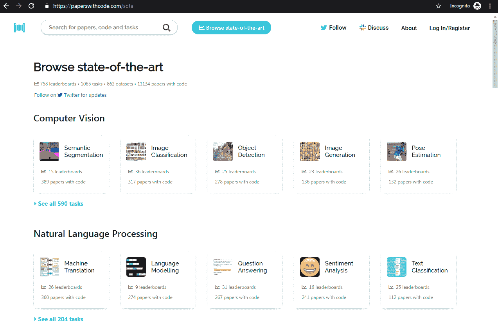
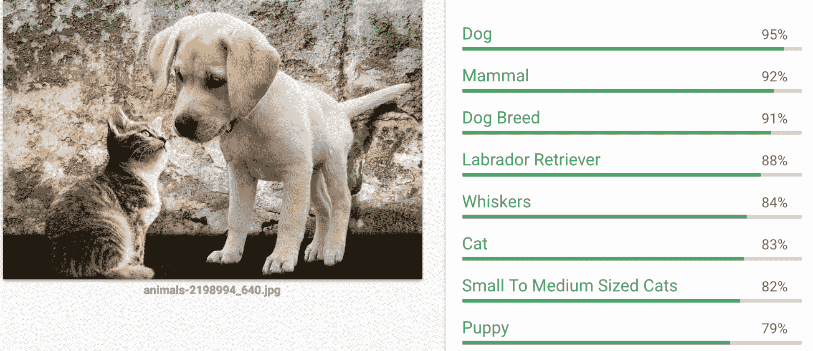
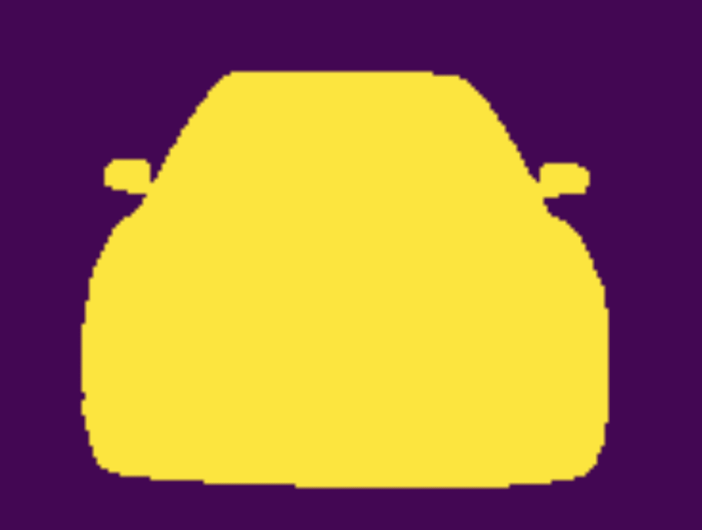

# 第十一章：接下来做什么？

恭喜你完成了这本书！请给自己一个大大的掌声！感谢您阅读本书，真诚希望它能帮助您在未来的道路上，无论是作为数据科学家、机器学习工程师，还是人工智能领域众多不断发展的职称之一。到现在为止，您应该已经对 PyTorch API 及其在计算机视觉、自然语言处理和强化学习等多个任务中的应用有了牢固的掌握。然而，这绝不是您开始的旅程的终点，而是一个美好未来之路的开端！

# 接下来做什么？

在本章中，我们将看一下下一个逻辑步骤序列，以便在书中已经取得的进展基础上继续前进。然而，首先让我们退一步，看看到目前为止学到的所有工具和技术，理解你所学到的一切如何融入更深入的学习背景中。

# 书籍概述

以下项目符号列表将帮助您理解书中每章的要点，并可以作为快速指南，将我们在整本书中学到的内容置于上下文中：

+   AI、神经网络和深度学习的历史。目前使用的各种深度学习框架。PyTorch 的重要性和必要性。PyTorch v1.0 的改进。GPU 与 CPU 的对比。使用 CUDA 并行化张量计算。

+   神经网络的构建模块：网络如何学习表示？我们看了 PyTorch `tensors`、`tensor operations`、`nn.module`、`torch optim`，以及 PyTorch 定义运行时动态 DAG 的工作原理。

+   我们学习了神经网络训练中涉及的不同流程，如 PyTorch 数据集用于数据准备，数据加载器用于批量张量处理，`torch.nn`包用于创建网络架构，以及使用 PyTorch 损失函数和优化器。我们还讨论了处理过拟合的不同技术，如 dropout、l1 和 l2 正则化，以及使用批归一化。

+   我们学习了**卷积神经网络**（**CNNs**）的不同构建模块，还学习了迁移学习，帮助我们使用预训练模型。我们还看到了一些技术，如使用预先计算的特征，有助于减少训练模型所需的时间。

+   我们学习了词嵌入（word embedding）及其在文本分类问题中的应用。我们还探讨了如何使用预训练的词嵌入。我们研究了**循环神经网络**（**RNN**）及其变体，例如**长短期记忆网络**（**LSTM**），以及如何将它们应用于文本分类问题。

+   在本章中，我们研究了使用自编码器进行半监督学习来去噪数据的想法，以及使用变分自编码器生成新图像。

+   我们探讨了生成模型，并学习了如何使用 PyTorch 进行艺术风格转移，以及使用生成对抗网络（**GAN**）创建新的 CIFAR 图像。我们还探讨了语言建模技术，可以用于生成新文本或创建特定领域的嵌入。

+   我们探讨了现代架构，如 ResNet、Inception、DenseNet 和编码-解码架构。我们还看到了这些模型如何用于迁移学习。我们还通过组合所有这些模型构建了一个集成模型。

+   最后，我们研究了如何利用强化学习来训练模型在不确定的顺序环境中做出决策。我们研究了各种深度强化学习策略，如深度 Q 学习、基于策略的方法和演员-评论家模型。我们使用了 OpenAI gym 环境来使用深度强化学习解决著名的倒立摆问题。

# 阅读和实施研究论文

深度学习是一个不断发展的领域，跟上领域中的最新发展将显著影响您在所在团队以及整个领域中的贡献能力。

研究论文起初可能看起来是充满术语且难以理解的混乱文本，但是不断努力阅读和实施这些算法将极大提升您的能力。我最喜欢的论文及其对应代码的存储库之一是 paperswithcode ([`paperswithcode.com/sota`](https://paperswithcode.com/sota))：

paperswithcode 网站

您应该查找关于 CV、NLP、强化学习、语音等人工智能各种任务的最新研究论文和代码。每周至少阅读一篇论文，并通过下载源代码实现代码，将帮助您跟上该领域的最新发展。

# 探索有趣的想法

我们在本书中学到的大部分概念构成了由深度学习驱动的现代应用的基础。在本节中，我们将看看与计算机视觉和**自然语言处理**（**NLP**）相关的不同有趣的项目。

# 对象检测

本书中的所有示例都有助于您检测给定图像是否为这种（猫）或那种（狗）。但是，要解决现实世界中的一些问题，您可能需要识别图像中的不同对象，例如这里展示的对象：

对象检测算法的输出

此图显示了对象检测算法的输出，该算法正在检测一些对象，如一只美丽的狗和猫。就像有现成的图像分类算法一样，有许多令人惊奇的算法可以帮助构建物体识别系统。以下是一些重要的算法和物体检测的论文列表：

+   **单次多框检测器** (**SSD**): [`arxiv.org/abs/1512.02325`](https://arxiv.org/abs/1512.02325)

+   Faster RCNN: [`arxiv.org/abs/1506.01497`](https://arxiv.org/abs/1506.01497)

+   YOLO2: [`arxiv.org/abs/1612.08242`](https://arxiv.org/abs/1612.08242)

# 图像分割

假设你正在建筑物的露台上读这本书。你看到了什么？你能勾勒出你看到的东西吗？如果你是个好艺术家，不像我，那么你可能画了几栋建筑物、树木、鸟类以及周围更多有趣的东西的轮廓。图像分割算法试图捕捉类似的东西。给定一幅图像，它们为每个像素生成预测，识别每个像素属于哪个类别。以下图像显示了图像分割算法识别的内容：

图像分割算法的输出

以下是您可能想探索的一些重要图像分割算法：

+   R-CNN: [`arxiv.org/abs/1311.2524`](https://arxiv.org/abs/1311.2524)

+   Fast R-CNN: [`arxiv.org/abs/1504.08083`](https://arxiv.org/abs/1504.08083)

+   Faster R-CNN: [`arxiv.org/abs/1506.01497`](https://arxiv.org/abs/1506.01497)

+   Mask R-CNN: [`arxiv.org/abs/1703.06870`](https://arxiv.org/abs/1703.06870)

# PyTorch 中的 OpenNMT

**开源神经机器翻译** (**OpenNMT**) ([`github.com/OpenNMT/OpenNMT-py`](https://github.com/OpenNMT/OpenNMT-py)) 项目有助于构建许多由编码器-解码器架构驱动的应用程序。您可以构建的一些应用包括翻译系统、文本摘要和图像到文本的转换。

# Allen NLP

Allen NLP 是基于 PyTorch 的开源项目，可以更轻松地完成许多 NLP 任务。有一个演示页面 ([`demo.allennlp.org/machinecomprehension`](http://demo.allennlp.org/machinecomprehension))，你应该看看以了解可以用 Allen NLP 构建什么。

# fast.ai – 再次让神经网络变得不那么酷

我最喜欢了解深度学习的地方之一，也是灵感的伟大来源，是由两位来自`fast.ai`的出色导师 Jeremy Howard 和 Rachel Thomas 组织的一个 MOOC，他们的唯一动机是使深度学习对所有人都可访问。为了他们课程的一个新版本，他们在 PyTorch 之上建立了一个令人难以置信的框架 ([`github.com/fastai/fastai`](https://github.com/fastai/fastai))，使构建应用程序变得更加简单和快速。如果你还没有开始他们的课程，我强烈建议你开始。探索`fast.ai`框架的构建将为您提供许多强大技术的深入了解。

# 开放神经网络交换

**开放神经网络交换** (**ONNX**) ([`onnx.ai/`](http://onnx.ai/)) 是通向开放生态系统的第一步，使您能够在项目发展中选择合适的工具。ONNX 提供了深度学习模型的开源格式。它定义了可扩展的计算图模型以及内置运算符和标准数据类型的定义。Caffe2、PyTorch、Microsoft Cognitive Toolkit、Apache MXNet 等工具正在开发 ONNX 支持。这个项目可以帮助产品化 PyTorch 模型。

# 如何保持自己的更新

社交媒体平台，特别是 Twitter，帮助您在领域内保持更新。有许多人可以关注。如果你不确定从哪里开始，我建议你关注 Jeremy Howard ([`twitter.com/jeremyphoward`](https://twitter.com/jeremyphoward)) 和他可能关注的任何有趣的人。通过这样做，你将促使 Twitter 的推荐系统为你工作。另一个需要关注的重要 Twitter 账号是 PyTorch ([`twitter.com/PyTorch`](https://twitter.com/PyTorch))。PyTorch 背后的出色人才有一些很棒的内容在分享。如果你正在寻找研究论文，那么请查看[`www.arxiv-sanity.com/`](http://www.arxiv-sanity.com/)，那里有许多聪明的研究人员发布他们的论文。关于 PyTorch 的更多学习资源包括其教程 ([`pytorch.org/tutorials/`](http://pytorch.org/tutorials/))，其源代码 ([`github.com/pytorch/pytorch`](https://github.com/pytorch/pytorch)) 和其文档 ([`pytorch.org/docs/0.3.0/`](http://pytorch.org/docs/0.3.0/))。

# 概要

深度学习和 PyTorch 还有很多值得探索的内容。PyTorch 是一个相对较新的框架，在撰写本章节时已有 3 年历史。还有很多东西可以学习和探索，祝你学习愉快。一切顺利！
