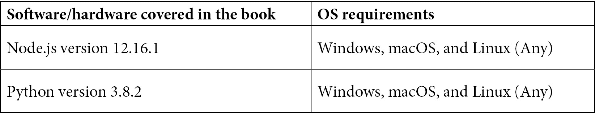

# 序言

如果这本书是由人工智能写的呢？你会阅读吗？我希望会，因为其中的部分确实是由人工智能写的。是的，GPT-3 被用来创建这本书的部分内容。我知道这有点元，一本关于 GPT-3 的书被 GPT-3 写的。但创造内容是 GPT-3 的许多伟大用途之一。那又何妨呢？此外，对我来说，内容生成是最引起我的兴趣的用例之一。我想知道是否可以在我正在开发的产品中使用 GPT-3 自动化生成技术学习材料。

你可能也有自己对 GPT-3 感兴趣的特定原因。也许是出于求知欲。或者可能是因为你有一个你认为 GPT-3 可以实现的想法。你可能已经在网上看过 GPT-3 生成内容、编写代码、写诗或其他东西的演示，并且想知道 GPT-3 是否可以用于你的想法。如果是这样，那么这本书就是专门为你写的。

我写这本书的目标是为了提供一个实用的资源，帮助你尽快入门 GPT-3，而无需任何必要的技术背景。话虽如此，在我写这些文字的时候，GPT-3 仍然处于私有测试阶段。因此，每个人都在不断学习。但我确切学到的一件事是，GPT-3 的可能应用是广泛的，而且没有办法知道所有可能性，更不用说把它写进一本书中了。所以，我希望这本书使入门变得容易，但我也希望它只是你探索 *探索 GPT-3* 旅程的开始。

# 这本书适合谁

这本书适合任何对自然语言处理或学习 GPT-3 感兴趣的人，无论其是否具有技术背景。想要了解自然语言处理、人工智能和 GPT-3 的开发人员、产品经理、企业家和爱好者都会发现这本书很有用。只需基本的计算机技能就能充分利用这本书。虽然有现代编程语言的经验会有所帮助，但并非必需。提供的代码示例适合初学者，即使你是编写代码的新手也很容易理解。

# 这本书涵盖了哪些内容

*第一章*，*介绍 GPT-3 和 OpenAI API*，是对 GPT-3 和 OpenAI API 的高级介绍。

*第二章*，*GPT-3 的应用和用例*，概述了核心 GPT-3 的用例：文本生成、分类和语义搜索。

*第三章*，*使用 OpenAI Playground*，是对 OpenAI Playground 和开发者门户的半深入介绍。

*第四章*，*使用 Postman 调用 OpenAI API*，是介绍如何使用 Postman 调用 OpenAI API 的简介。

*第五章*，*在代码中调用 OpenAI API*，是介绍如何使用 Node.js/JavaScript 和 Python 调用 OpenAI API 的简介。

*第六章*，*内容过滤*，解释了如何实现内容过滤。

*第七章*，*生成和转换文本*，包含了用于生成和转换文本的代码和提示示例。

*第八章*，*文本分类和分类*，更详细地讨论了文本分类和 OpenAI API 分类端点。

*第九章*，*构建基于 GPT-3 的问答应用*，讲解了如何构建一个功能齐全的基于 GPT-3 的网络知识库。

*第十章*，*使用 OpenAI 应用上线*，讲解了 OpenAI 应用审查和批准流程，并讨论了为审查做准备的事项。

# 要充分利用本书

本书中的所有代码示例都是使用来自[replit.com](http://replit.com)的基于 Web 的**集成开发环境**（**IDE**）编写的。一个免费的 replit.com 账户就足以跟随示例。要使用 replit.com，只需一个现代的 web 浏览器和一个 replit.com 账户即可。该代码还在 macOS 上使用 Visual Studio Code 进行了测试，尽管它应该可以在任何代码编辑器和适当配置的操作系统上正常工作。代码示例提供了 Node.js/JavaScript 和 Python 两种版本。对于 Node.js，使用的是版本 12.16.1，对于 Python，使用的是版本 3.8.2。



本书中的所有代码示例都需要 OpenAI API 密钥和对 OpenAI API 的访问权限。您可以通过访问 https://openai.com/api 来申请对 OpenAI API 的访问权限。

**如果您使用本书的数字版，我们建议您自己打字输入代码或通过 GitHub 存储库（链接在下一部分中可用）访问代码。这样做可以帮助您避免与复制和粘贴代码相关的潜在错误**。

# 下载彩色图片

我们还提供了一个 PDF 文件，其中包含了本书中使用的屏幕截图/图表的彩色图片。您可以在这里下载：https://static.packt-cdn.com/downloads/9781800563193_ColorImages.pdf。

# 使用的约定

本书中使用了许多文本约定。

`文本中的代码`：表示文本中的代码词，数据库表名，文件夹名，文件名，文件扩展名，路径名，虚拟 URL，用户输入和 Twitter 句柄。这里有一个例子：“然而，假设您不希望完成生成对话的人的一面，您希望使用标签`AI：`而不是`Assistant：`？”

代码块如下所示：

```py
English: I do not speak Spanish Spanish: 
```

**粗体**：表示一个新术语，一个重要词，或屏幕上看到的词。例如，菜单或对话框中的单词在文本中出现如下所示。这里有一个例子：“每次单击 **提交** 按钮时”。

提示或重要说明

看起来像这样。

# 联系方式

我们始终欢迎读者的反馈。

`customercare@packtpub.com`。

**勘误**: 尽管我们已尽一切努力确保内容的准确性，但错误确实会发生。如果您在本书中发现了错误，我们将不胜感激您向我们报告。请访问 www.packtpub.com/support/errata，选择您的书，点击勘误提交表单链接，并输入详细信息。

`copyright@packt.com`，并附上材料的链接。

**如果您有兴趣成为作者**：如果您在某个主题上有专业知识，并且对编写或贡献一本书感兴趣，请访问 authors.packtpub.com。

# 评论

请留下您的评论。一旦您阅读并使用了这本书，为什么不在您购买它的网站上留下一条评论呢？潜在的读者可以看到并使用您的公正意见来做出购买决定，我们在 Packt 可以了解您对我们产品的看法，而我们的作者可以看到您对他们的书的反馈。谢谢！

欲了解更多关于 Packt 的信息，请访问 packt.com。
