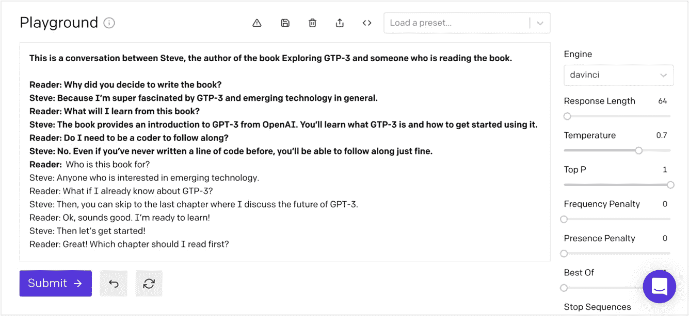
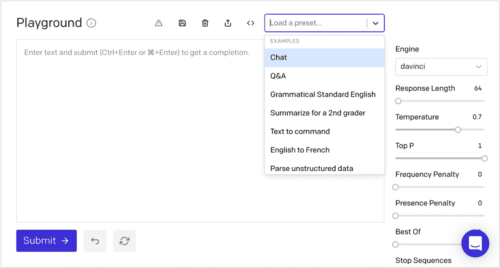
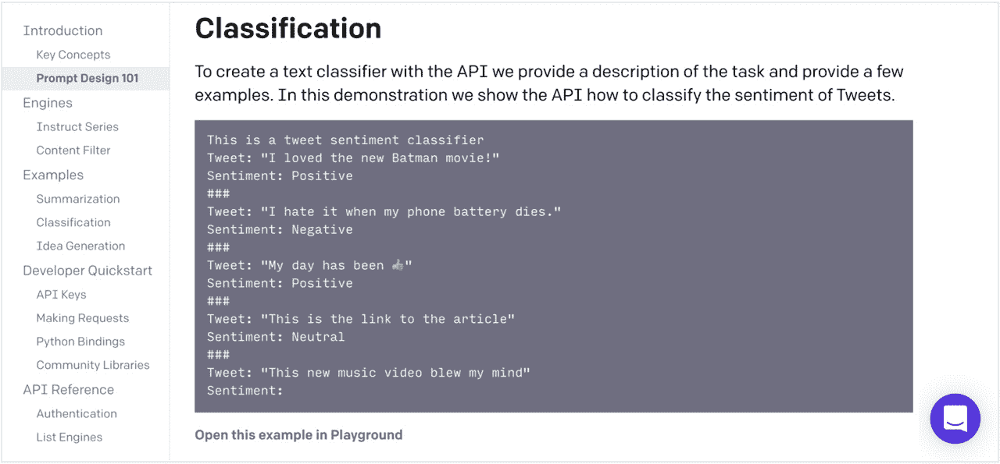
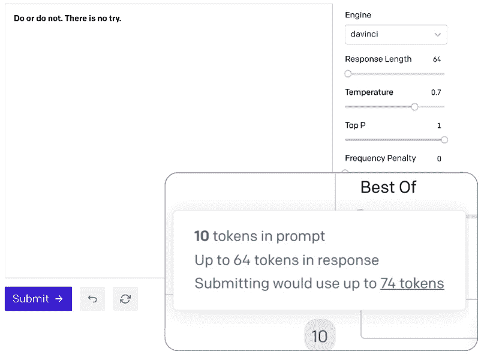
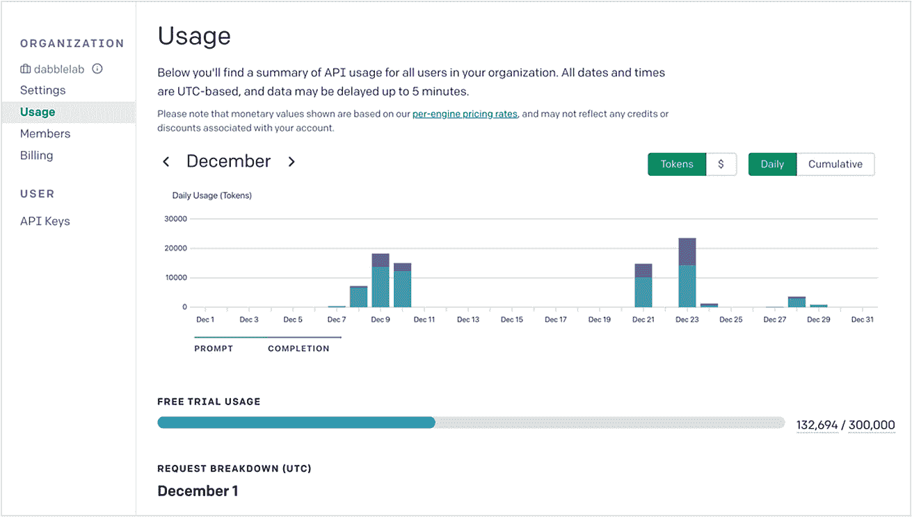
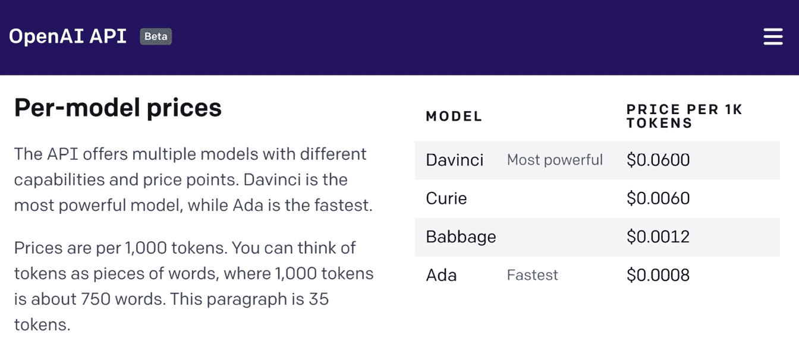

# *第一章*：介绍 GPT-3 和 OpenAI API

关于**生成式预训练变换器第 3 版**（**GPT-3**）的讨论始于 2020 年 6 月 11 日，由领先的**人工智能**（**AI**）研究实验室 OpenAI 发布的一篇博客文章。该帖子以以下方式开始：

我们正在发布一个用于访问 OpenAI 开发的新 AI 模型的 API。与大多数专为一个用例设计的 AI 系统不同，该 API 今天提供了一个通用的“文本输入，文本输出”接口，允许用户在几乎任何英语语言任务上尝试它。

早期测试人员的在线演示很快就出现了——有些看起来太好以至于难以置信。GPT-3 正在撰写文章，写诗，回答问题，以栩栩如生的方式进行聊天，将文本从一种语言翻译为另一种语言，总结复杂的文件，甚至编写代码。这些演示令人印象深刻——这是我们以前从未见过的一般用途人工智能系统所做的事情——但同样令人印象深刻的是，许多演示是由在人工智能和**机器学习**（**ML**）方面具有有限或没有正式背景的人创造的。GPT-3 提高了标准，不仅在技术方面，还在人工智能可访问性方面。

GPT-3 是一个通用的语言处理 AI 模型，几乎任何人都可以在几分钟内理解并开始使用。您不需要计算机科学的**哲学博士**（**PhD**）——甚至不需要知道如何编写代码。实际上，您开始所需的一切都在这本书中。在本章中，我们将从以下主题开始：

+   GPT-3 简介

+   使 NLP 大众化

+   理解提示、完成和标记

+   介绍达芬奇、巴贝奇、居里和艾达

+   理解 GPT-3 的风险

# 技术要求

本章需要您访问**OpenAI** **应用程序编程接口**（**API**）。您可以通过访问[`openapi.com`](https://openapi.com)注册 API 访问权限。

# GPT-3 简介

简言之，GPT-3 是一个语言模型：一个计算一系列单词的概率分布的统计模型。换句话说，GPT-3 是一个系统，当输入文本时，猜测接下来的文本是什么。

现在，在我们更深入地了解 GPT-3 是什么之前，让我们对**自然语言处理**（**NLP**）进行简要介绍（或复习）。

## 简化自然语言处理（NLP）

NLP 是人工智能的一个分支，它专注于利用自然人类语言进行各种计算应用。NLP 是一个广泛的类别，涵盖了许多不同类型的语言处理任务，包括情感分析、语音识别、机器翻译、文本生成和文本摘要等。

在自然语言处理中，语言模型用于计算一系列单词的概率分布。语言模型的重要性在于人类语言的复杂和微妙的特性。例如，*pay in full* 和 *painful* 或 *tee time* 和 *teatime* 听起来相似，但意思完全不同。*she's on fire* 这样的表达可能是字面的，也可能是比喻的；而 *big* 和 *large* 这样的词在某些情况下可以互换使用，但在其他情况下不能——例如，用 *big* 来指代一个年长的兄弟就不会有使用 *large* 的含义。因此，语言模型用于处理这种复杂性，但这说起来容易做起来难。

尽管人们对词义和适当的使用似乎很容易理解，但自然语言处理任务对机器来说可能是具有挑战性的。这对于更复杂的语言处理任务尤为真实，例如识别讽刺或挖苦——甚至有时连人类本身都会感到困难。

如今，对于特定的自然语言处理任务来说，最好的技术方法取决于任务本身。因此，大多数表现最佳的 **最先进** （**SOTA**）自然语言处理系统都是针对单一目的或狭窄范围任务进行了细化调整的专门系统。然而，理想情况下，一个单一系统应该能够成功地处理任何自然语言处理任务。这就是 GPT-3 的目标：提供一个通用的自然语言处理系统。因此，尽管今天表现最佳的自然语言处理系统往往是专门的、针对特定任务定制的系统，*GPT-3 在多个常见自然语言处理任务中达到了 SOTA 表现*，展现了未来通用自然语言处理系统能够为任何自然语言处理任务提供 SOTA 表现的潜力。

## GPT-3 到底是什么？

尽管 GPT-3 是一种通用的自然语言处理系统，但它实际上只做了一件事：基于提供的文本预测接下来会出现什么。但事实证明，通过合适的架构和足够的数据，这“一件事”能够处理惊人的一系列语言处理任务。

GPT-3 是来自 OpenAI 的 GPT 语言模型的第三个版本。因此，尽管它在 2020 年夏天开始变得流行，但 GPT 的第一个版本是在 2 年前宣布的，接下来的版本 GPT-2 是在 2019 年 2 月宣布的。但即使 GPT-3 是第三个版本，系统的设计和架构与 GPT-2 没有太大的变化。然而，有一个很大的区别，那就是用于训练的数据集的大小。

GPT-3 是使用从互联网、书籍和其他来源获取的文本组成的海量数据集进行训练的，包含大约 570 亿个单词和 1750 亿个参数。这比 GPT-2 和其他最大规模的语言模型大 10 倍。为了让模型的大小有所了解，一个普通人一生中可能会读、写、说和听到超过 10 亿个单词。因此，GPT-3 在估计处理的单词数量上约是大多数人的 57 倍。

GPT-3 语言模型庞大而庞大，因此它不是你可以在笔记本电脑上下载和摸索的东西。但即使你可以（事实上你不可以因为它无法下载），每次构建模型都需要数百万美元的计算资源。如果你必须依靠自己的计算资源来使用它，这将使 GPT-3 对大多数小公司和几乎所有个人都不可及。幸运的是，你不必这样做。OpenAI 通过一个既经济又易于使用的 API 提供 GPT-3，所以，任何人都可以使用一些有史以来最先进的人工智能！

# 使自然语言处理民主化

任何人都可以通过访问 OpenAI API 使用 GPT-3。API 是一个通用的*文本输入，文本输出*接口，几乎可以用于任何语言任务。要使用 API，你只需输入文本，然后得到一个文本回复。任务可能是情感分析、写一篇文章、回答一个问题或总结一篇文档。对于 API 来说，这并不重要 —— 它都是以相同的方式完成的，这使得即使对非程序员来说，使用 API 也变得非常容易。

你传入的文本被称为**提示**，返回的文本称为**完成**。提示被 GPT-3 用于确定如何最好地完成任务。在最简单的情况下，提示可以提供一些词语作为开始。例如，如果提示是 *如果今天是星期一，明天是*，GPT-3 可能会回复 *星期二*，以及一些额外的文本，例如 *如果今天是星期二，明天是星期三*，依此类推。这意味着你从 GPT-3 中得到的取决于你发送给它的内容。

你可能会猜到，完成的质量在很大程度上取决于提示。GPT-3 使用提示中的所有文本来帮助生成最相关的完成。每个词语以及提示的结构方式都有助于改善语言模型的预测结果。因此，*理解如何编写和测试提示是解锁 GPT-3 真正潜力的关键*。

# 理解提示、完成和标记

实际上，任何文本都可以用作提示 —— 输入一些文本，得到一些文本返回。然而，尽管看到 GPT-3 如何处理随机字符串可能很有趣，但真正的力量来自于理解如何编写有效的提示。

## 提示

提示是让 GPT-3 做你想要的事情的方式。这就像编程，但用的是简单的英语。所以，你必须知道自己想要实现什么，但不是编写代码，而是使用单词和纯文本。

当你编写提示时，要记住的主要事情是，GPT-3 正试图弄清楚接下来应该出现的文本，因此包括诸如说明和示例等内容提供了上下文，帮助模型找出最佳完成的方式。此外，质量很重要 —— 例如，拼写、不清晰的文本以及提供的示例数量都会影响完成的质量。

另一个关键考虑因素是提示大小。虽然提示可以是任何文本，但提示和生成的完成必须少于 2048 个令牌。我们将稍后在本章中讨论令牌，但大致相当于 1500 个单词。

因此，提示文本可以是任何文本，没有像编写代码时必须遵循的硬性规则。但是，有一些指导原则可以帮助您在获得最佳结果方面构建提示文本的结构。

### 不同类型的提示

我们将在本书中深入探讨提示写作，但让我们从不同的提示类型开始。以下是概述：

+   零次提示

+   单次提示

+   少数提示

#### 零次提示

一个`Subject:`:

```py
Write an email to my friend Jay from me Steve thanking him for covering my shift this past Friday. Tell him to let me know if I can ever return the favor.
Subject:
```

以下屏幕截图来自一个名为**Playground**的基于 Web 的测试工具。我们将在 *Chapter 2*, *GPT-3 Applications and Use Cases,* 和 *Chapter 3*, *Working with the OpenAI Playground* 中更多地讨论 Playground，但现在我们将其用作显示由于前面的提示而生成的完成的演示。请注意，原始提示文本为粗体，完成显示为普通文本：

![Figure 1.1 – Zero-shot prompt example

]（img / B16854_01_001.jpg）

图 1.1-零次提示示例

因此，零次提示只是一些词或短描述，没有任何示例的任务。有时候，这就是 GPT-3 完成任务所需要的全部。其他时候，您可能需要包括一个或多个示例。提供单个示例的提示称为单次提示。

#### 单次提示

**单次提示**提供一个示例，GPT-3 可以利用它来学习如何最好地完成任务。以下是一个提供任务描述（第一行）和单个示例（第二行）的单次提示的示例：

```py
A list of actors in the movie Star Wars 
1\. Mark Hamill: Luke Skywalker
```

仅凭描述和一个示例，GPT-3 就会了解任务是什么以及应该完成任务。在此示例中，任务是创建《星球大战》电影演员的列表。以下屏幕截图显示了此提示生成的完成：

![Figure 1.2 – One-shot prompt example

]（img / B16854_01_002.jpg）

图 1.2-单次提示示例

单次提示适用于列表和通常理解的模式。但有时您需要多个例子。在这种情况下，您将使用几次提示。

#### 少数提示

**几次提示**提供多个例子-通常为 10 到 100 个。多个示例可用于显示 GPT-3 应该继续完成的模式。少数提示和更多示例可能会增加完成的质量，因为提示为 GPT-3 提供了更多的学习机会。

以下是生成模拟对话的几次提示的示例。请注意，这些示例提供了来回对话，提供了可能在对话中说的内容：

```py
This is a conversation between Steve, the author of the book Exploring GPT-3 and someone who is reading the book.
Reader: Why did you decide to write the book?
Steve: Because I'm super fascinated by GPT-3 and emerging technology in general.
Reader: What will I learn from this book?
Steve: The book provides an introduction to GPT-3 from OpenAI. You'll learn what GPT-3 is and how to get started using it.
Reader: Do I need to be a coder to follow along?
Steve: No. Even if you've never written a line of code before, you'll be able to follow along just fine.
Reader: 
```

在下面的截图中，您可以看到 GPT-3 继续了在提示中提供的示例中启动的模拟对话：



图 1.3 – 少量示例提示

现在您了解了不同的提示类型，让我们来看一些提示示例。

### 提示示例

OpenAI API 可以处理各种任务。可能性范围从生成原始故事到执行复杂的文本分析，以及其中的所有内容。为了熟悉 GPT-3 可以执行的任务类型，OpenAI 提供了许多提示示例。您可以在 Playground 和 OpenAI 文档中找到示例提示。

在 Playground 中，这些示例被称为**预设**。再次强调，我们将在*第三章*，*与 OpenAI Playground 一起工作*中详细介绍 Playground，但下面的截图显示了一些可用的预设：



图 1.4 – 预设

示例提示也可以在 OpenAI 文档中找到。OpenAI 文档非常出色，包含许多优秀的提示示例，并提供了链接以在 Playground 中打开和测试它们。下面的截图显示了来自 OpenAI 文档的示例提示。请注意提示示例下方的**在 Playground 中打开此示例**链接。您可以使用该链接在 Playground 中打开提示：



图 1.5 – OpenAI 文档提供提示示例

现在您了解了提示，让我们谈谈 GPT-3 如何使用它们来生成完成。

## 完成

再次强调，完成指的是生成并返回的文本，作为提供的提示/输入的结果。您还会记得，GPT-3 并没有专门训练来执行任何一种类型的自然语言处理任务——它是一个通用的语言处理系统。然而，GPT-3 可以通过提示来展示如何完成给定任务。这称为元学习。

### 元学习

大多数自然语言处理系统，在训练基础的机器学习模型时，使用的数据是提供的。所以，要改进给定任务的结果，必须更新底层训练，并构建新版本的模型。GPT-3 的工作方式不同，因为它没有针对任何特定任务进行训练。相反，它被设计为识别提示文本中的模式，并使用底层的通用模型继续模式。这种方法被称为**元学习**，因为提示被用来*教导* GPT-3 如何生成最佳完成，而无需重新训练。因此，不同的提示类型（零次、一次和少次）可以用于为不同类型的任务*编程* GPT-3，你可以在提示中提供大量指令——最多 2,048 个令牌。好的——现在是谈论令牌的好时机。

## 令牌

当提示被发送到 GPT-3 时，它会被分解为令牌。**令牌**是单词或更常见的单词部分的数值表示。数字被用作令牌而不是单词或句子，因为它们可以更有效地处理。这使得 GPT-3 能够处理相对较大的文本量。尽管如此，正如你所学到的，仍然存在 2,048 个令牌的限制（约~1,500 个单词），用于组合提示和生成的完成结果。

你可以通过估算提示和生成的完成结果中将使用的令牌数量来保持在令牌限制以下。平均而言，对于英文单词，每四个字符代表一个令牌。所以，只需将提示中的字符数加上*响应长度*，然后除以四即可。这将给你一个大致的所需令牌数量。如果你想要了解完成一系列任务所需的令牌数量，这非常有帮助。

另一种获取令牌计数的方法是使用 Playground 中的令牌计数指示器。这位于大型文本输入框的正下方，位于右下角。以下屏幕截图中放大的区域显示了令牌计数。如果你将鼠标悬停在数字上，你还将看到完成后的总计数。对于我们的示例，提示**Do or do not. There is no try.**—来自尤达大师的智慧—使用了**10**个令牌，完成后的总计数为**74**个令牌：



图 1.6 – 令牌计数

虽然理解令牌对于保持在 2,048 个令牌限制以下很重要，但它们也很重要，因为令牌是 OpenAI 用作使用费基础的东西。你的账户中可以获得整体令牌使用情况报告，网址为[`beta.openai.com/account/usage`](https://beta.openai.com/account/usage)。下面的屏幕截图显示了一个示例使用报告。我们将在*第三章*，*使用 OpenAI Playground*中进一步讨论这个：



图 1.7 – 使用统计

除了令牌使用外，影响使用 GPT-3 的成本的另一件事是你选择用来处理提示的引擎。引擎是指将要使用的语言模型。引擎之间的主要区别在于相关模型的大小。较大的模型可以完成更复杂的任务，但较小的模型更高效。因此，根据任务的复杂性，你可以通过使用较小的模型显着降低成本。以下屏幕截图显示了发布时的模型定价。正如你所见，成本差异可能很大：



图 1.8 – 模型定价

因此，每个引擎或模型的成本都不同，但你需要的那个取决于你正在执行的任务。接下来我们来看看不同的引擎选项。

# 介绍达芬奇、巴贝奇、居里和艾达

用于训练 GPT-3 的庞大数据集是其如此强大的主要原因。然而，当有必要时，更大并不总是更好——更多的能力会带来成本。出于这些原因，OpenAI 提供了多个可供选择的模型。今天有四个主要模型可用，以及一个用于内容过滤和**指令模型**的模型。

可用的模型或引擎（也称为）分别命名为`达芬奇`、`巴贝奇`、`居里`和`艾达`。在这四个中，`达芬奇`是最大且最强大的。 `达芬奇`可以执行任何其他引擎可以执行的任务。 `巴贝奇`是下一个最强大的引擎，可以做任何`居里`或`艾达`可以做的事情。 `艾达`是最不强大但性能最佳且成本最低的引擎。

当你刚开始并且在初步测试新提示时，通常会想从达芬奇开始，然后尝试`艾达`、`巴贝奇`或`居里`，看看它们中的哪一个可以更快或更具成本效益地完成任务。以下是每个引擎的概述以及可能最适合每个引擎的任务类型。但是，请记住，你需要测试。尽管较小的引擎可能没有受过太多数据的训练，但它们仍然是通用模型。

## 达芬奇

`达芬奇`是最强大的模型，可以做任何其他模型能做的事情，而且更多——通常只需更少的指令。 `达芬奇`能够解决逻辑问题，确定因果关系，理解文本意图，生成创意内容，解释人物动机，并处理复杂的总结任务。

## 居里

`居里`试图平衡力量和速度。它可以做任何`艾达`或`巴贝奇`可以做的事情，但它还能处理更复杂的分类任务和更细致的任务，如总结、情感分析、聊天机器人应用和问答。

## 巴贝奇

`Babbage`比`Ada`更有能力，但并不那么高效。它可以执行与`Ada`相同的所有任务，但还可以处理更复杂的分类任务，并且非常适合语义搜索任务，以确定文档与搜索查询匹配程度。

## Ada

`Ada`通常是最快的模型，成本最低。它最适合于较少细微差别的任务，例如解析文本、重新格式化文本和更简单的分类任务。您提供给`Ada`的上下文越多，它的表现就越好。

## 内容过滤模型

为了防止不当补全，OpenAI 提供了一个内容过滤模型，该模型经过微调，以识别可能含有冒犯性或伤人的言语。

## 指导模型

这些模型是在`Davinci`和`Curie`模型的基础上构建的。**指导模型**被调整过，以使得更容易告诉 API 想让它做什么。清晰的指示通常比相关的核心模型产生更好的结果。

## 时间的一瞥

关于所有引擎的最后一点要牢记的是，它们都是一个*时间的一瞥*，也就是说用于训练它们的数据截止于构建模型的日期。因此，GPT-3 并非使用最新的甚至最新的数据——它可能是几周甚至几个月之前的数据。OpenAI 打算在未来增加更多的持续训练，但今天这是一个需要考虑的因素。

所有的 GPT-3 模型都非常强大，能够生成与人类编写的文本几乎无法区分的文本。这对各种潜在应用都具有巨大的潜力。在大多数情况下，这是一件好事。但是，并非所有潜在的用例都是好事。

# 了解 GPT-3 风险

GPT-3 是一项了不起的技术，具有许多实际和有价值的潜在应用。但通常情况下，强大技术的潜力就意味着风险。对 GPT-3 而言，其中一些风险包括不当的结果和潜在的恶意用途。

## 不当或冒犯性的结果

GPT-3 文本生成得如此出色，以至于看起来像是它意识到自己在说什么。但其实不是这样的。它是一个具有出色语言模型的 AI 系统－绝对不会有意识，所以从来不会在说出伤人或不当的话语。

但是，理解 GPT-3 有时会生成冒犯性文本，并考虑在使用 GPT 或向他人公开 GPT-3 结果时需要理解这一点。特别是对于可能被儿童看到的结果。我们将在*第六章*中更详细地讨论这一点，*内容过滤*。

## 恶意使用的潜力

想象一下，GPT-3 可能被用于恶意或有害用途并不难。OpenAI 甚至描述了 GPT-3 可能被“武器化”用于误导性宣传或制造虚假产品评论。但 OpenAI 的宣称使命是“确保人工通用智能造福于人类”，因此，追求该使命包括采取负责任的措施，防止他们的 AI 被用于错误的目的。因此，OpenAI 为所有使用 GPT-3 或 OpenAI API 的应用程序实施了一个应用批准流程。

但作为应用程序开发人员，我们也需要考虑这一点。当我们构建使用 GPT-3 的应用程序时，我们需要考虑应用程序可能被用于错误的目的，并采取必要的措施来防止它。我们将在*第十章*中更详细地讨论这个问题，*OpenAI 动力应用的实时运行*。

# 摘要

在本章中，您了解到 GPT-3 是一个用于处理几乎任何语言处理任务的通用语言模型。您了解了 GPT-3 的高级工作原理，以及关键术语和概念。我们介绍了可用的模型，并讨论了所有 GPT-3 应用程序必须经过批准流程才能防止潜在的不适当或有害结果。

在接下来的章节中，我们将讨论使用 GPT-3 不同的方式，并查看特定的 GPT-3 用例示例。
