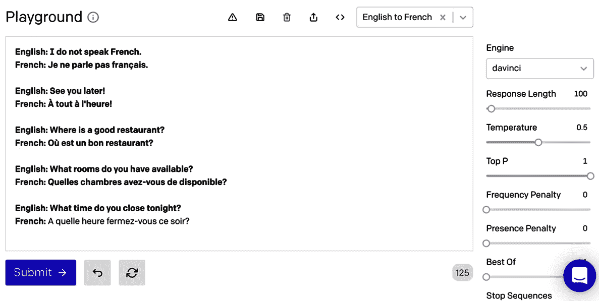

# 第二章：GPT-3 的应用和用例

GPT-3 被设计为通用语言处理模型，这意味着它并未专门针对任何一种语言处理任务进行训练。因此，可能的应用包括几乎任何您能想象到的自然语言处理任务，以及可能还有一些尚未被想象到的任务。新的 GPT-3 用例不断被发现，这对很多用户来说是其魅力的一大部分。当然，它在某些任务上表现更好，但仍然有数百种可能的用途。在本章中，我们将分解一些通用用例，并看看如何开始测试自己的提示。

本章的主题如下：

+   理解通用 GPT-3 用例

+   介绍游乐场

+   处理文本生成和分类任务

+   理解语义搜索

# 技术要求

本章需要您访问 OpenAI API。您可以通过访问[`openapi.com`](https://openapi.com)注册 API 访问权限。

# 理解通用 GPT-3 用例

在上一章中，您了解到 OpenAI API 是一个*文本输入，文本输出*接口。因此，它总是对文本输入（称为**提示**）返回一个文本响应（称为**完成**）。完成可能是生成新文本，分类文本，或为语义搜索提供结果。GPT-3 的通用性意味着它可以用于几乎任何语言处理任务。为了让我们集中精力，我们将看一下以下常见用例：文本生成，分类和语义搜索。

+   **文本生成**：文本生成任务是创建新的原创文本内容的任务。例如包括文章写作和聊天机器人。

+   **分类**：分类任务标记或分类文本。分类任务的例子包括情感分析和内容过滤。

+   **语义搜索**：语义搜索任务将查询与语义相关的文档进行匹配。例如，查询可能是一个问题，会匹配一个或多个提供答案的文档。

为了说明不同的用例，我们将使用 OpenAI **Playground**。因此，在我们深入研究不同的示例用例之前，让我们先熟悉一下游乐场。

# 介绍游乐场

要开始使用 GPT-3，OpenAI 提供了游乐场。游乐场是一个基于 Web 的工具，它可以方便地测试提示，并熟悉 API 的工作原理。几乎你可以通过调用 API 来做的每件事情（我们稍后将更详细地讨论），你也可以在游乐场中完成。最重要的是，通过游乐场，你可以开始使用 GPT-3 而不需要编写一行代码-你只需提供一个用简单英语编写的文本输入（提示）。

## 开始使用游乐场

要访问游乐场，您需要登录[`openai.com`](https://openai.com)。在验证登录后，您将能够从主菜单中导航到游乐场。

游乐场非常简单易用。主要由一个大文本输入组成。您只需将文本输入到大文本输入框中，然后单击**提交**按钮即可开始测试 GPT-3。

单击**提交**按钮后，您将看到原始输入文本之后添加了额外的文本 – 这是由 GPT-3 生成的完成文本。

每次单击**提交**按钮后，GPT-3 将在文本输入框中附加一个附加的完成。附加的完成使用您的原始文本以及先前的完成作为下一个完成的提示。

以下屏幕截图显示了具有初始提示文本的游乐场：**如果今天是星期一，明天就是**。您会注意到原始提示文本以粗体显示，而完成文本则以普通文本显示。在此示例中，单击**提交**按钮多次以说明每个完成是如何在上一个完成的基础上构建的：


图 2.1 – 游乐场窗口

除了用于提示和完成文本的大文本输入外，游乐场还允许您指定各种 API 设置，这些设置可以在 GPT-3 处理提示时提供一些控制。我们稍后将更详细地讨论这些设置，但是如果您查看*图 2.1*中的屏幕截图，您将看到一个**响应长度**设置。这是将返回的响应的长度。因此，每次单击**提交**按钮时，将向文本框添加一个新的具有该长度的响应。

再次，我们稍后将更详细地介绍所有设置。目前，这是每个设置所做的快速介绍：

+   **引擎**：将要使用的语言模型

+   **响应长度**：包含在完成中的文本量

+   **温度**：控制结果的随机性

+   **Top P**：用于控制随机性的**温度**的替代品

+   **频率惩罚**：减少模型重复同一行的可能性

+   **存在惩罚**：增加模型谈论新主题的可能性

+   **最佳选择**：仅返回*n*个完成中的*最佳*一个

+   **停止序列**：用于结束完成的一系列字符

+   **注入起始文本**：将包含在提示之前的文本

+   **注入重新启动文本**：将包含在完成后的文本

+   **显示概率**：显示完成中每个单词/标记的权重

熟悉游乐场就是开始使用 GPT-3 所需的一切。从那里，您可以开始尝试如何使用提示来*编程*GPT-3 来处理不同类型的语言处理任务，例如文本生成和分类任务。

现在我们已经看到了如何开始使用游乐场，让我们再学习一些关于文本生成和分类任务的知识。

# 处理文本生成和分类任务

文本生成和文本分类是自然语言处理任务的两个常见类别。每个类别都涵盖了许多 GPT-3 处理得非常出色的潜在用例。让我们看看其中一些，从文本生成用例开始。

## 文本生成

关于 GPT-3 可以做的所有事情中，文本生成是它的超能力。文本生成有很多潜在的用例，所以我们将进一步将文本生成分为三个子主题：生成文本、总结文本和转换文本。

### 生成文本

GPT-3 能够生成通常与人工书写的文本难以区分的原始文本内容。这可以用于各种应用，从创造网页内容到头脑风暴、对话应用、诗歌、歌词创作、写作编码和创建数据列表。让我们看一些例子。

#### 内容创建

内容创建是 GPT-3 所能做的最酷的事情之一。有了正确的提示，GPT-3 可以创建文章、博客文章或社交媒体内容。下面的截图显示了一个提示的结果，引导 GPT-3 创建首次购房者的建议清单。然而，这种通用方法可以用于创建几乎任何主题的内容：


图 2.2 – 文本生成示例 – 首次购房者的建议

再次，你可以使用 GPT-3 来创建几乎任何主题的列表，因此有很多可能性。另一个很好的示例用例是创意生成。

#### 创意生成

GPT-3 还可以是头脑风暴的一个好工具。以下提示和随后的截图显示了 GPT-3 被用于生成 3D 打印项目创意的制造者日活动。当然，这也可以是几乎任何事情的想法清单：

```py
Maker day 3D printer project ideas 
1\. GoPro Mount A mount for a GoPro camera that mounts the camera on a mountain bike 
2.
```

结果显示在以下截图中：


图 2.3 – 文本生成示例 – 3D 打印项目创意

*图 2.3*中的粗体文本是提供的提示，常规文本是由 GPT-3 生成的。很酷，对吧？这里还有另一个很酷的例子——对话应用。

#### 对话应用

对话应用也是 GPT-3 的一个潜在用例，例如在聊天机器人、IVR 和语音助手中。下面的文本可以用来提示 GPT-3 模拟 AI 支持助手与客户之间的对话：

```py
The following is a conversation with a customer support AI assistant. The assistant is helpful, creative, clever, and very friendly. 
Customer: Hello, can you help me?
AI: I can sure try. I'm an AI support assistant and I'm here to help!
Customer:
```

前面提示的结果显示在以下截图中。在这种情况下，GPT-3 生成了对话的两端，但在现实世界的应用中，对话的用户端会来自实际的客户：


图 2.4 – 文本生成示例 – 客服 AI 助手

您可以使用多种技术来帮助引导 GPT-3 如何作出回应。例如，在*图 2.4*中，您会注意到提示包括 `The` `assistant` `is` `helpful` `creative,` `clever,` `and` `very` `friendly` - 这指导了 GPT-3 关于回应的整体风格和语调。我们将在接下来的章节中更详细地讨论这一点，但现在，让我们继续并看看如何使用 GPT-3 生成列表。

#### 列表生成

以下截图显示了 GPT-3 正在用于创建一份公司及其所属类别的列表。您可以从提示中看到，它正在继续之前开始的模式。所以，您可以用这种方式生成几乎任何列表：

```py
The following is a list of companies and the categories they fall into
Cisco – Technology, Networking, Enterprise Software
AT&T – Telecom, Technology, Conglomerate
United Airlines – Aviation, Transportation
Nvidia – Technology, Computing, Semiconductors
```

上一个提示的结果如下截图所示：


图 2.5 – 文本生成示例 – 列表生成

在*图 2.5*中，您会注意到不仅添加了更多公司到列表中，GPT-3 也能够准确地按行业对公司进行分类。记住，GPT-3 并不是从数据库中提取这些信息 - 而是生成它！但令人印象深刻的是，GPT-3 还能完成更复杂的生成任务。例如，在下一个示例中，我们将看看如何使用 GPT-3 生成一份测验。

#### 测验生成

GPT-3 也能够生成测验。例如，下面的提示可以用于编制测试问题和可能的答案，以测试学生识别押韵单词的能力：

```py
words that rhyme have similar sounding endings 
q: what rhymes with "cat" 
a: bat, hat, mat 
q: what rhymes with "small" 
a: tall, wall, call 
q: what rhymes with "pig" 
a: big, dig, fig 
q:
```

以下截图显示了 GT-3 从先前提示生成的完成状态：


图 2.6 – 文本生成示例 – 测验生成

内容创建，创意生成，对话应用程序，创建列表和生成测验只是可能文本生成用例中的一小部分。但文本生成不仅仅是关于创建新内容；还可以用于其他用例，如总结现有内容。

### 总结文本

除了创作新的原始文本，您还可以使用 GPT-3 创建文档摘要。有多种方法可以用于总结文本。您可以使用基本摘要、一句话总结、年级调整的摘要，或者通过从文档中提取关键点进行总结。让我们快速看一下每种方法。

#### 基本摘要

创建摘要的最简单方法就是在想要总结的文本后加上`tl;dr:`。这将提示 GPT-3 总结前面的文本。在每种情况下这并不是一种可靠的总结方法，但对许多情况来说都很有效。例如，下面的提示提供了有关量子力学的文本，该文本是从 [`en.wikipedia.org/wiki/Quantum_mechanics`](https://en.wikipedia.org/wiki/Quantum_mechanics) 复制的：

```py
Quantum mechanics is a fundamental theory in physics that provides a description of the physical properties of nature at the scale of atoms and subatomic particles.[2]:1.1 It is the foundation of all quantum physics including quantum chemistry, quantum field theory, quantum technology, and quantum information science. 
Classical physics, the description of physics that existed before the theory of relativity and quantum mechanics, describes many aspects of nature at an ordinary (macroscopic) scale, while quantum mechanics explains the aspects of nature at small (atomic and subatomic) scales, for which classical mechanics is insufficient. Most theories in classical physics can be derived from quantum mechanics as an approximation valid at large (macroscopic) scale.[3] 
tl;dr:
```

上一个提示的结果如*图 2.7*所示：


图 2.7 – 文本生成示例 – tl;dr：摘要

您会注意到原始文本由三段组成，但生成的摘要只有几句话。您还可以指示 GPT-3 将文本总结为一句话。

#### 单句摘要

另一种总结文本的方法是在您想总结的文本后面添加 **单句摘要：**。这个与将 **停止序列** 设置为句号一起，将生成提供文本的单句摘要。

以下提示将创建一个单句摘要，摘自位于 [`beta.openai.com/terms-of-use`](https://beta.openai.com/terms-of-use) 的 OpenAI 使用条款页面的段落：

```py
(b) Ownership. As between you and OpenAI, we and our affiliates own all rights, title, and interest in and to the APIs, Content, and Developer Documentation and all associated elements, components, and executables. Subject to the foregoing, you own all rights, title, and interest in and to your Application. You have no right to distribute or allow access to the stand-alone APIs. Except as expressly provided in these Terms, neither party grants, nor shall the other party acquire, any right, title or interest (including any implied license) in or to any property of the first party or its affiliates under these Terms. All rights not expressly granted in these Terms are withheld. 
one-sentence summary:
```

以下截图显示了前述单句摘要提示的结果：


图 2.8 – 文本生成示例 – 单句摘要

根据您要总结的文本，一个单句可以非常有帮助，以简化内容。另一种简化内容的方法是用更简单的文字重新书写它。这可以通过年级摘要来完成。

#### 年级摘要

要用适合某个年龄段的语言总结文本，您可以使用年级摘要。这可以通过在要总结的文本后面跟上类似以下示例提示中的最后一句话来完成。在这个例子中，我们使用了从 [`en.wikipedia.org/wiki/Milky_Way`](https://en.wikipedia.org/wiki/Milky_Way) 复制的文本：

```py
The Milky Way[a] is the galaxy that contains our Solar System, with the name describing the galaxy's appearance from Earth: a hazy band of light seen in the night sky formed from stars that cannot be individually distinguished by the naked eye. The term Milky Way is a translation of the Latin via lactea, from the Greek γαλακτικός κύκλος (galaktikos kýklos, "milky circle").[19][20][21] From Earth, the Milky Way appears as a band because its disk-shaped structure is viewed from within. Galileo Galilei first resolved the band of light into individual stars with his telescope in 1610\. Until the early 1920s, most astronomers thought that the Milky Way contained all the stars in the Universe.[22] Following the 1920 Great Debate between the astronomers Harlow Shapley and Heber Curtis,[23] observations by Edwin Hubble showed that the Milky Way is just one of many galaxies. The Milky Way is a barred spiral galaxy with an estimated visible diameter of 150-200,000 light-years,[9][24][25] an increase from traditional estimates of 100,000 light-years. Recent simulations suggest that a dark matter disk, also containing some visible stars, may extend up to a diameter of almost 2 million light-years.[11][12] 
I rephrased this in plain language that a third grader could understand.
```

在下面的截图中，您可以看到之前提示的结果：


图 2.9 – 文本生成示例 – 年级摘要

请注意 *图 2.9* 中显示的摘要以一种可能被三年级学生理解的方式书写。在这种情况下，GPT-3 正在（以某种方式）为年轻读者翻译文本。但您也可以使用 GPT-3 将文本翻译成不同的语言。

### 转换文本

您还可以使用 GPT-3 转换文本，例如，从一种语言到另一种语言，或者从英语到其他内容，比如表情符号或软件代码。我们先来看一个语言翻译的例子。

#### 翻译

在下面的截图中，GPT-3 正被用于将英语翻译成法语。这是一个在 Playground 中提供的**预设**；我们将在下一章中更多地讨论预设：



图 2.10 – 文本生成示例 – 从英语翻译成法语

你可以在 *图 2.10* 中看到一些翻译示例被用在了提示中。这对一些语言翻译任务是有帮助的，但对于许多简单的翻译来说，你甚至不需要示例。例如，以下提示很可能会用正确的翻译完成：

```py
English: I do not speak Spanish 
Spanish:
```

语言翻译确实令人印象深刻。但如果你想要在英语和除了另一种自然语言以外的其他东西之间进行翻译呢？例如，将英语转换为表情符号文本？

#### 转换

这是 OpenAI 提供的另一个例子。在这个例子中，提示用于将电影名称转换为表情符号形式。这样做是因为表情符号只是文本字符，所以它们是 GPT-3 训练数据的一部分。注意一些表情符号版本不仅使用标题中的单词。例如，**变形金刚** 有一辆汽车和一个机器人表情符号，如果你看过电影就能理解，但如果你只看单词 *变形金刚* 就不知道是什么。所以，这是怎么回事？GPT-3 不仅使用提示中提供的内容，还使用其庞大的模型中包含的有关每部电影的额外细节：


图 2.11 – 文本生成示例 – 从文本转换为表情符号

因此，对于文本生成用例有很多可能性，但请记住，GPT-3 是一个通用的语言处理系统。因此，生成文本只是个开始。另一个常见的 NLP 用例是文本分类。

## 文本分类

文本分类涉及评估一些提供的文本，并为其分配一个标签、分数或其他将文本分类的属性。情感分析是常见的文本分类用例，但这只是 GPT-3 可以用于的许多文本分类任务中的一个。

有多种方法可以让 GPT-3 对文本进行分类。在最简单的情况下，甚至不需要提供示例；这被称为零-shot 分类，这是一种进行基本分类的简单方式，例如情感分析。

### 零-shot 分类

从上一章回想一下，零-shot 提示不提供任何示例。同样，**零-shot 分类** 是一项没有示例的分类任务。

这是一个零-shot 分类提示的例子。在这个例子中，目标是对 Twitter 帖子进行情感分析，以确定它是积极的、中立的还是消极的：

```py
Twitter post: "I think I nailed my interview today!"
Sentiment (positive, neutral, negative): 
```

你可以从以下的截图中看到零-shot 分类示例的情感分类结果：


图 2.12 – 文本生成示例 – 零-shot 分类

这是另一个零-shot 分类的例子。这个例子显示，GPT-3 可以理解文本进行分类任务。注意提示提供了一个问题，GPT-3 对旅行类型进行分类：

```py
Comprehension Question: "What is the best way to travel from New York to London?"
Travel Type (swim, drive, fly):
```

以下是显示结果的截图：


图 2.13 – 文本生成示例 – 零-shot 分类

零样本分类是非常简单的，对于各种分类任务来说也非常有用。但有时分类任务会更为复杂，需要一些示例。对于这些情况，你会使用少样本分类。

### 少样本分类

进行分类的另一种方式是通过示例；这被称为**少样本分类**。当你提供文本分类的示例时，模型可以根据你提供的样本学习如何标记文本。如果模型无法正确分类你的文本，提供示例可能会改善结果。这可以用于使用不同术语的情况 – 例如，*情感*而不是*情绪*。

下面的提示和随后的截图展示了对*动物爱好者*进行少样本分类的示例：

```py
Q:"I like Dalmatians"
A:Dog Lover
Q:"I like Tigers"
A:Cat Lover
Q:"I like Wolves"
A:Dog Lover
```

上一个提示的结果显示在下面的截图中：


图 2.14 – 文本生成示例 – 少样本分类

请注意*图 2.14*，如何只需几个示例就足以让 GPT-3 理解如何对任何动物类型进行分类。在该示例中，分类是逐个进行的，但 GPT-3 也可以进行批量分类。

### 批量分类

如果你能成功地使用少样本分类提示对文本进行分类，你也可以向模型展示如何对一系列项目进行分类。这被称为**批量分类**。

下面的提示展示了一个进行批量分类的提示示例。注意提示中提供了分类示例和批量分类示例：

```py
Tweet: "I loved the new Batman movie!" 
Sentiment: Positive 
### 
Tweet: "I hate it when my phone battery dies" 
Sentiment: Negative 
### 
Tweet: "My day has been great!"
Sentiment: Positive 
### Tweet: "This is the link to the article" 
Sentiment: Neutral 
### 
Tweet text 
1\. "I loved the new Batman movie!" 
2\. "I hate it when my phone battery dies" 
3\. "My day has been great!" 
4\. "This is the link to the article" 
5\. "This new music video blew my mind" 
Tweet sentiment ratings: 
1\. Positive 
2\. Negative 
3\. Positive 
4\. Neutral 
5\. Positive 
### Tweet text 
1\. "I can't stand homework" 
2\. "This sucks. I'm bored " 
3\. "I can't wait for Halloween!!!" 
4\. "My cat is adorable" 
5\. "I hate chocolate" 
Tweet sentiment ratings: 
1.
```

现在我们已经看到了 GPT-3 在文本生成和分类方面的应用，让我们来看一下 GPT-3 如何用于语义搜索。

# 理解语义搜索

语义搜索会将搜索词或查询词与包含任意量文本的语义相似文档进行匹配。简单的关键字搜索可能只会查找查询中匹配文档中单词的单词。然而，语义搜索远不止如此。它会分析单词的含义，并对文档进行排名，排名最高的文档表示与查询最为语义相似的文档。例如，假设我们有一个查询“一种有翅膀的动物”和五个一词文档：*狗，猫，蛇，兔子，老鹰*。语义搜索会对这五个文档进行排名，并将包含单词“老鹰”的文档排名最高，因为它在语义上最接近查询。

每次你查询谷歌，你都在使用语义搜索，和谷歌一样，GPT 3 也可以在文档上进行搜索。不过，与在网络上搜索文档不同，这些文档是作为对 OpenAI API 的请求的一部分或者作为预先上传的文件提供的。

搜索查询可能是一个问题、一个陈述或只是几个词。查询会针对提供的文档进行评估，并在每个文档的结果中提供一个分数。分数通常在 0 和 300 之间，但有时可能会更高。较高的分数，超过 200，通常意味着文档在语义上与查询类似。

当 API 请求附带文档时，最多可以包含 200 个文档。但是，您可以通过上传文档文件或发送多个具有相同查询但不同文档的请求来超出 200 文档限制。我们将在*第四章**，使用 OpenAI API*中更详细地了解其工作原理。

在使用 GPT 3 进行语义搜索时，另一个考虑因素是选择的引擎。回想一下上一章中提到的，尽管 davinci 是最大、最能胜任任务的引擎，但其他引擎在某些任务上往往表现更好且成本更低。在语义搜索方面，准确性方面的折衷通常很小。因此，测试更快、更高效的引擎如 ada 或 babbage 是有意义的，您可以使用**语义搜索工具**来完成这项任务。

## 语义搜索工具

Playground 用于测试提示和补全。但是，语义搜索工具可用于测试搜索查询。您可以通过访问[`gpttools.com/semanticsearch`](https://gpttools.com/semanticsearch)来访问语义搜索工具。这是一个简单的基于 Web 的应用程序（类似于 Playground），让您可以使用不同的引擎测试语义搜索。下面的截图显示了语义搜索工具：


图 2.15 – 语义搜索工具

您会注意到语义搜索工具需要一个 OpenAI **API 密钥**。您可以从[`beta.openai.com/account/api-keys`](https://beta.openai.com/account/api-keys)的 OpenAI API Keys 页面获取您的 API 密钥。您需要登录才能访问 API Keys 页面。我们将在*第四章*中更多地讨论 API 密钥，但目前，最重要的是您应该保持 API 密钥私密，并不与他人分享。

下面的截图显示了 API Keys 页面（API 密钥被有意地模糊掉了），您可以在这里复制您的语义搜索工具的 API 密钥：


图 2.16 – OpenAI API Keys 页面

语义搜索工具还提供了预设，这些是帮助您熟悉不同语义搜索示例的模板。下面的截图显示了使用**导演和电影**预设进行搜索的语义搜索工具的结果：


图 2.17 - 文本生成示例 - 语义搜索工具

希望您能看到，到目前为止，GPT 3 的可能用例相当广泛。我们甚至还没有探讨到可能性的表面，也没有讨论 GPT 3 如何在生产应用中使用。我们将在本书中深入探讨更具体的示例和用例。此外，还有越来越多的基于 GPT 3 的应用程序和在线示例，您应该查看以获取更多的用例和灵感。可以说，在线应用的范围令人印象深刻。您可以开始谷歌搜索使用 GPT-3 的应用程序列表。您将找到越来越多的策划列表和视频，突出了各种各样的 GPT-3 驱动的应用程序和提示示例。位于 [`gpt3demo.com/`](https://gpt3demo.com/) 的 GPT-3 演示值得一看。OpenAI 的博客位于 [`openai.com/blog/gpt-3-apps/`](https://openai.com/blog/gpt-3-apps/)，列出了应用程序和行业用例，以及一些使用和提示示例位于 [`beta.openai.com/examples`](https://beta.openai.com/examples)。  

# 总结

在本章中，我们探讨了 GPT-3 的不同潜在用例。我们讨论了使用 GPT-3 进行文本生成、分类和语义搜索，并举例说明了每种用例。我们介绍了 Playground 网页版测试工具，并讲解了如何访问它以及如何开始使用它。我们探讨了编写文本生成和文本分类提示的不同方法，以及 GPT-3 如何支持语义搜索。

在下一章中，我们将深入探讨 Playground，并看看不同的引擎和 API 设置如何影响完成结果。
