# 第四章：使用 OpenAI Playground

在上一章中，我们简要介绍了 Playground。很可能您将花费大量时间在 Playground 中，因为它是一个非常好的工具，既用于学习也用于快速原型设计和测试提示和设置。因此，在本章中，我们将更深入地了解 Playground，重点放在 Playground 设置上。我们还将介绍其他您需要了解的 OpenAI 开发者工具和资源。

本章将涉及的主题如下：

+   探索 OpenAI 开发者控制台

+   更深入地探索 Playground

+   使用预设设置

# 技术要求

本章需要您可以访问**OpenAI API**。您可以通过访问 [`openapi.com`](https://openapi.com) 来请求访问权限。

# 探索 OpenAI 开发者控制台

Playground 是 OpenAI 开发者控制台的一部分。开发者控制台是一个提供开发者资源和工具的私人网站门户，其中 Playground 是其中之一。要访问开发者控制台，您需要有效的 OpenAI 开发者帐户。虽然本章主要关注 Playground，特别是 Playground 设置，但值得花一分钟查看 OpenAI 开发者控制台中的其他资源，从开发者文档开始。

## 开发者文档

当您使用新技术时，很多时候好的文档并不容易找到。幸运的是，GPT-3 并不符合这种情况。OpenAI 的文档做得非常出色。内容完整，易于理解，并提供了许多非常有用的示例。我们在*第一章*，*介绍 GPT 3 和 OpenAI API* 中查看了其中一个示例 - 分类提示示例。但让我们再看看文档中的另一个很好的例子，即事实性回答示例。

### 事实性回答示例

下一个提示示例来自 OpenAI 开发者文档。它位于 [`beta.openai.com/docs/introduction/prompt-design-101`](https://beta.openai.com/docs/introduction/prompt-design-101)。它提供了一个示例问答提示，向模型显示对于它可能没有正确答案的问题应返回一个问号。这告诉模型 *不要* 来编造答案，这通常情况下它可能会默认这样做。这是一个重要的示例，因为尽管 GPT-3 的回答几乎总是语法正确的，但它们往往不是事实性的。因此，即使它们听起来不错，它们可能是完全虚构的。

在下一个提示中需要注意的关键点是所提供的示例向 GPT-3 展示如何处理没有事实答案的问题，或者 GPT-3 不知道如何回答的问题。也有一些设置用于帮助确保事实回答，但我们将在本章稍后讨论这些设置：

```py
Q: Who is Batman?
A: Batman is a fictional comic book character.
###
Q: What is torsalplexity?
A: ?
###
Q: What is Devz9?
A: ?
###
Q: Who is George Lucas?
A: George Lucas is American film director and producer famous for creating Star Wars.
###
Q: What is the capital of California?
A: Sacramento.
###
Q: What orbits the Earth?
A: The Moon.
###
Q: Who is Fred Rickerson?
A: ?
###
Q: What is an atom?
A: An atom is a tiny particle that makes up everything.
###
Q: Who is Alvan Muntz?
A: ?
###
Q: What is Kozar-09?
A: ?
###
Q: How many moons does Mars have?
A: Two, Phobos and Deimos.
###
Q:
```

突出 OpenAI 文档的要点，正如您所期望的那样，是因为它可能是一个极其有价值的资源。但这只是众多资源中的一种。

## 开发者资源

文档仅是开发者门户中的可用资源之一。还有其他资源可用，包括以下：

+   **常见问题解答**

+   **定价详细信息**

+   **视频教程**

+   **社区示例**

+   **交互工具**

+   **指南和法律文件**

+   **标志资产**

随着您熟悉 GPT-3 和 OpenAI API，您需要花时间审阅所有可用的开发者资源。我们将更深入地研究其中一些，但它们都是有价值且值得审阅的。

## 账户与组织

开发者控制台中另一个重要的区域是账户资料部分。这是您编辑开发者账户和组织详细信息的地方。

开发者账户用于认证和识别个别开发者。默认情况下，创建开发者帐户时，还会创建一个名为 Personal 的组织。组织用于计费目的和用户分组，这意味着用户可以创建或关联多个组织，每个组织都将单独计费。

每个组织都有一个您可以指定的标题（名称），以及一个自动生成的组织 ID。组织 ID 是用于将使用情况与正确组织关联以进行计费目的的唯一标识符。因此，当您登录到开发者控制台时，任何使用情况将与您所在的组织相关联。我们将在*第四章*中再次讨论组织 ID，*使用 OpenAI API*，在那里我们将探讨如何将 API 调用与特定组织关联，但您也可以在开发者控制台中将使用情况与组织关联。

以下屏幕截图显示了如何查看您的账户关联的组织以及如何在开发者控制台中切换不同组织之间：

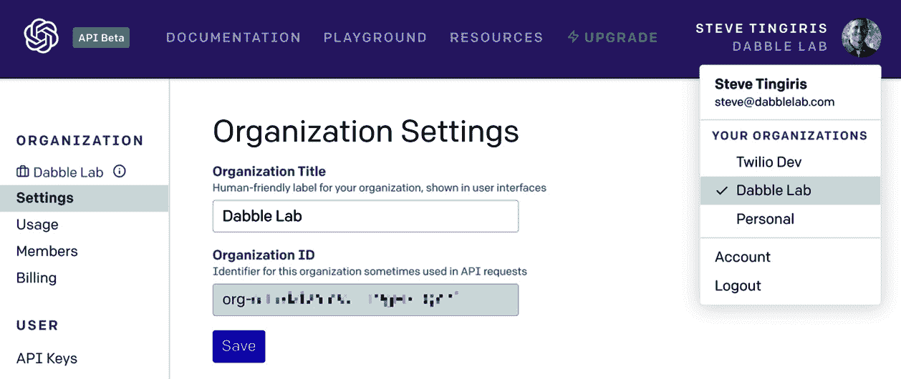

图 3.1 – 在不同组织之间切换

如前所述，组织用于计费目的，与您的用户账户一起创建了一个名为**Personal**的组织。如果您喜欢，您可以将组织名称更改为除**Personal**之外的其他内容。下面的屏幕截图显示了您可以更改个人组织名称的位置：

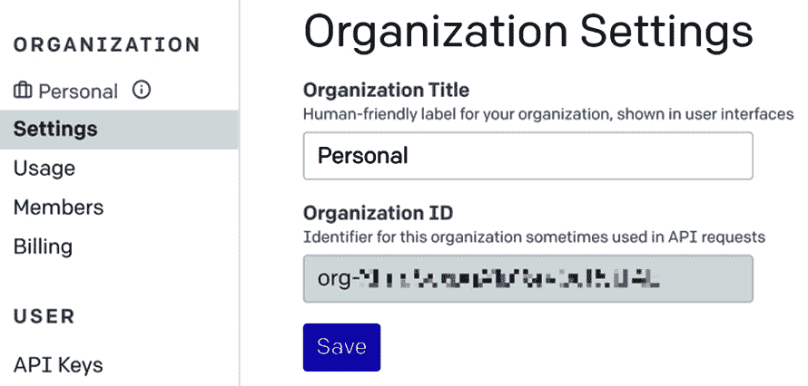

图 3.2 – 个人组织

当然，您是个人组织的所有者，如果您是为自己的个人使用而使用 API，那么这就是您为其设置计费的组织。

## 定价和计费

在进入定价细节之前，有一点很重要，那就是定价可能随时变动，因此您需要访问 https://beta.openai.com/pricing 获取最新的定价详情。有了这个免责声明，让我们继续。

首先，OpenAI API 的定价是按使用量计费的。因此，你只需支付你使用的资源。没有设置费用或重复费用。使用费用是基于使用的令牌。每个令牌的成本取决于你使用的引擎。我们在*第一章*，*介绍 GPT-3 和 OpenAI API* 中讨论了令牌并介绍了可用的引擎。

DaVinci 是最大的模型和最能干的引擎，因此，它也是使用成本最高的引擎。在价格范围的另一端是 Ada。这是最小的模型，限制了它的功能。不过，Ada 是最高效的引擎，因此使用成本最低。

以下截图显示了本书出版时每个引擎的定价。再次说明，价格随时可能发生变化，所以请务必核实当前价格，因为它很可能已经变化了：

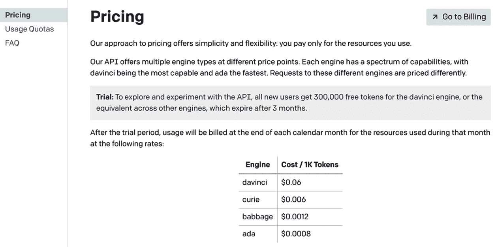

图 3.3 – 定价

按使用量计费很好，因为如果你什么都没做，也就不会花费什么。话虽如此，不知道账单会是多少也可能有点可怕。不过，幸运的是，你可以设置一个硬限制或软限制来管理你的支出。这可以在你的计费设置中完成。硬限制防止 API 在达到限制后继续使用更多的令牌。当然，这会使 API 无法使用，这在生产应用中可能会成为问题。因此，还有设置软限制的选项。这会在达到使用限制时发送电子邮件提醒。

## 使用报告

除了设置硬限制或软限制来管理你的成本外，你还可以访问使用报告。在**使用**菜单下的组织设置中找到使用报告。以下截图显示了一个示例使用报告：

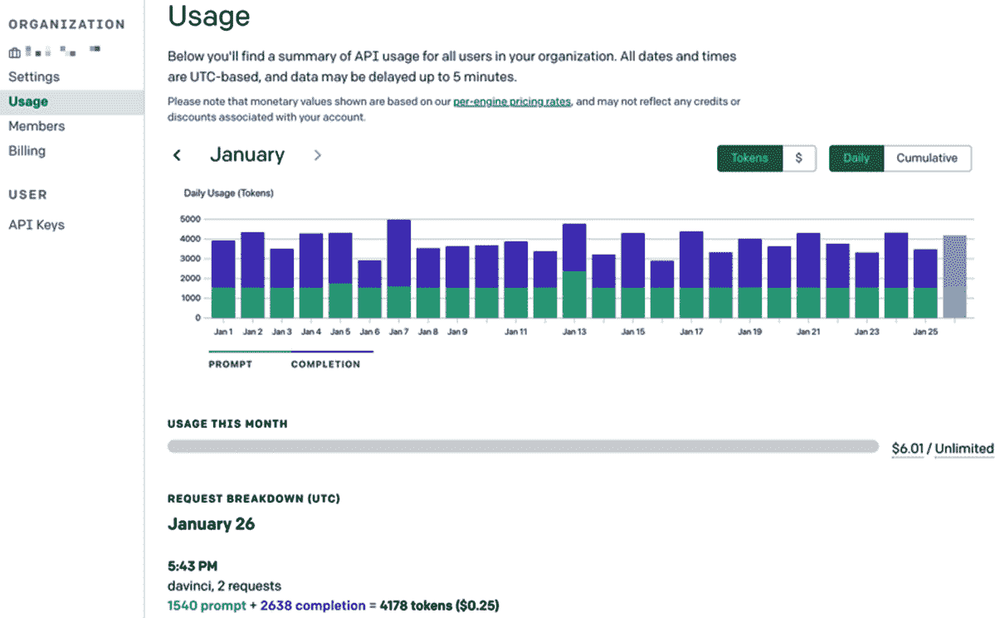

图 3.4 – 使用报告

使用报告中的主要图表默认显示本月每天使用的总令牌数。每个柱状图还显示了用于提示和完成的令牌数。通过这个图表，你还可以查看按金额使用情况，并显示累计总数而不是每日总数。此外，在主要图表下方，你可以查看总使用量以及每天按引擎的详细使用情况。

## 成员管理

如前所述，当你获得开发者帐户时，会为你的个人使用设置一个组织。但你可能还想为一个用户团队拥有一个组织。为此，你可以通过发送电子邮件到 `support@openai.com` 请求一个多用户组织帐户。当新组织创建时，你将能够邀请其他用户加入组织。这可以在组织的**成员**菜单下完成。以下截图显示了一个组织的成员管理页面。从这个页面，你可以邀请新成员，删除成员或更改成员权限：

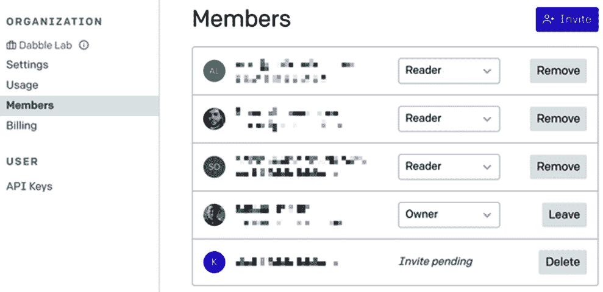

图 3.5 – 成员管理

在游乐场之外，这应该涵盖了你需要了解开发者控制台的基本内容。所以，让我们回到游乐场，仔细看一看。

# 深入了解游乐场

此时，你应该已经了解了如何使用游乐场的基础知识。但是我们现在要更深入地讨论游乐场，并讨论所有可用的选项和设置。*第二章*，*GPT 3 应用和用例*，提供了可用设置的快速概述，但让我们更仔细地看看每一个。

以下截图显示了游乐场中的设置。它们位于大型文本输入框的右侧：

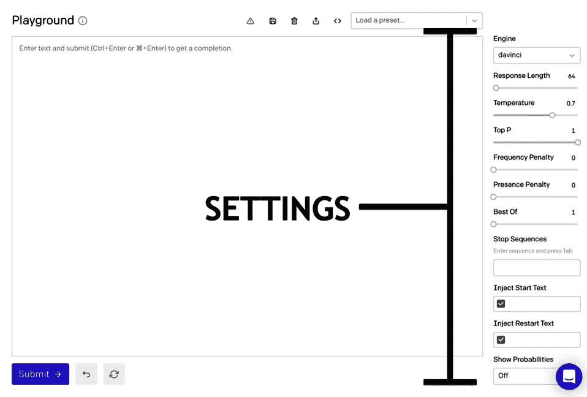

图 3.6 – 游乐场设置

第一个设置是**引擎**设置，所以我们从那里开始。

## 选择正确的引擎

通常，我们只把 OpenAI 语言模型称为 GPT-3。但是，正如你在*第一章*中所记得的那样，*介绍 GPT-3 和 OpenAI API*，有多个模型/引擎。

当你第一次打开游乐场时，默认选择达芬奇引擎。这通常是你想要开始测试提示的引擎。你会想要从达芬奇开始的原因是它是最大的模型，因此是最有能力的引擎。达芬奇引擎可以做任何其他引擎可以做的事情。然而，其他引擎可能能够更快地或更具成本效益地执行特定任务。因此，另一种方法可能是先从最便宜的引擎开始，然后在较便宜的引擎无法完成任务时测试下一个价格更昂贵的引擎。

所以，从达芬奇开始。然后，当你从达芬奇获得想要的结果时，请尝试将你的提示与其他引擎一起测试，看看你是否也能获得可接受的结果。或者从 ada 开始，这是最便宜的引擎，如果无法获得可接受的结果，则逐步升级。让我们看一个使用简单分类任务的示例。

以下是将项目分类为工具、食物、服装或其他的提示：

```py
The following is a list of items classified as a tool, food, clothing, or something else 
Cake: Food 
Pants: Clothing 
Car: Other 
Pliers: Tool 
```

以下截图显示了使用达芬奇引擎时的结果。请注意，新增加的项目（**衬衫**、**锤子**、**苹果**和**飞机**）都被正确分类：

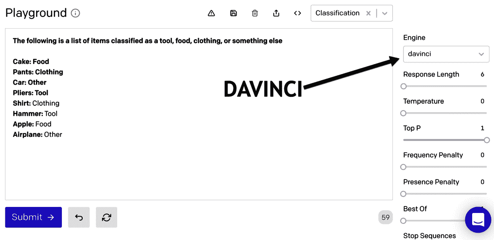

图 3.7 – 使用达芬奇引擎的分类示例

现在，让我们看看当引擎从达芬奇更改为 ada 时的结果。您会注意到在以下截图中，新增加的项目（**袜子**、**钳子**、**汉堡**和**房子**）也被 ada 正确分类：

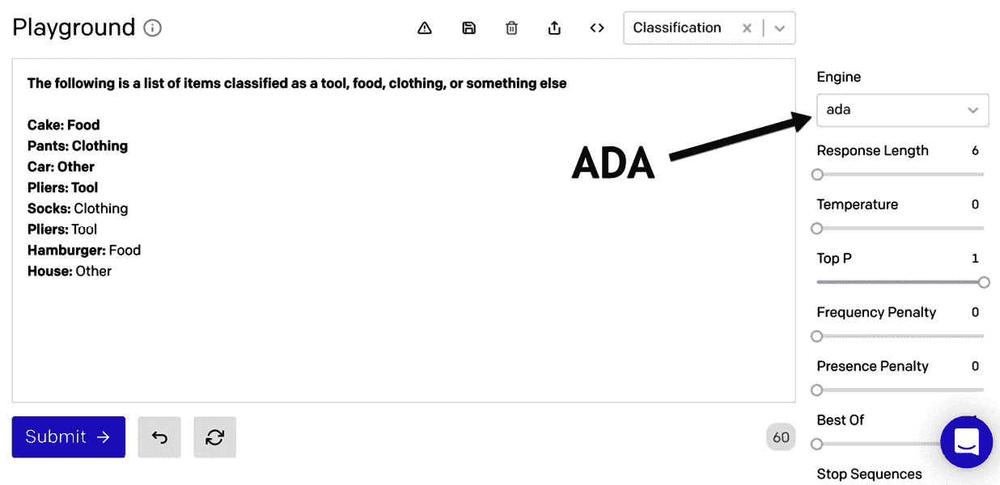

图 3.8 – 使用 ada 引擎的分类示例

所以，正如你从上面的例子可以看到的那样，有些任务并不需要 davinci 来获得可接受的结果。如果是这种情况，选择另一个引擎将减少你的使用成本，通常还会提高响应时间。当然，如果成本和性能不是问题，你也可以始终坚持使用 davinci。但再次提醒，根据任务的不同，davinci 可能并不是唯一的选择。

以下列表提供了每个引擎一般擅长的内容。这并不是硬性规定，只是一个指导方针。因此，你总是需要测试以确定基于结果的最佳选择：

+   **Davinci**: 复杂意图，因果关系，针对年龄的摘要。

+   **居里**: 语言翻译，复杂分类，文本情感，摘要。

+   **巴贝奇**: 适度分类，语义搜索分类。

+   **艾达**: 文本解析，简单分类，地址校正，关键词。

## 响应长度

响应长度设置相当容易理解。它控制将生成的完成的长度。要记住的主要事情是，该值涉及要返回的令牌数量。请记住来自*第一章*，*介绍 GPT-3 和 OpenAI API*，令牌可以代表单词或单词的部分。因此，不要把响应长度误认为是单词数或字符数。

另一点需要记住的是，你会被计费所使用的令牌 – 包括用于完成的令牌，这意味着你的响应长度越长，你将使用的令牌就越多。因此，如果你尝试优化成本，针对给定任务设置响应长度尽可能短。例如，如果任务是对一段文本进行情感分析，那么响应长度只需要足够长以显示情感结果即可。

## 温度和 Top P

接下来的两个设置是**温度**和**Top P**。这两个设置是最重要的设置之一，但也可能是最难理解的。在更高的层面上，它们都会影响所生成响应的随机性或多样性。但了解何时使用其中一个而不是另一个可能会很棘手。

要理解温度和 Top P 设置的意义，了解机器学习系统可以以不同方式处理相同的输入很有帮助。这意味着即使输入没有改变，输出也可能会有所不同。这是因为像 GPT-3 这样的机器学习系统使用启发式（教育猜测）而不是具体的逻辑来生成结果。因此，机器学习系统不是试图找到完美的解决方案，而是根据其训练过的数据来确定最佳选择。

对于 GPT-3 来说，它训练所使用的数据集非常庞大且多样化。因此，大多数输入（提示）会导致多种可能的完成结果。这可能是一种好处，也可能是一种挑战，具体取决于任务。例如，如果你使用 GPT-3 为一本书的标题生成想法，你想要很多不同的选择。然而，如果你希望 GPT-3 能准确回答历史问题，你希望得到一致和事实准确的回应。这就是温度和 Top P 设置发挥作用的地方。温度和 Top P 设置可以帮助控制用于生成完成结果的变化性和选项数量。

### 温度

温度设置影响模型在生成结果时的确定性程度。因此，温度提供了一定程度上控制结果变化的能力。较低的数值会让模型更趋向确定性（较少变量），而较高的数值会使模型更趋向不确定性或者更多变。其范围可以在 0 到 1 之间。为了看到温度设置的效果，让我们来看一些例子。

我们将从一个使用默认 Playground 温度为**0.7**的示例开始。在这个示例中，我们将研究大多数完成结果的默认随机性。我们将从一个包含词组**很久以前**但没有其他内容的提示开始，就像下面的截图所示的提示：

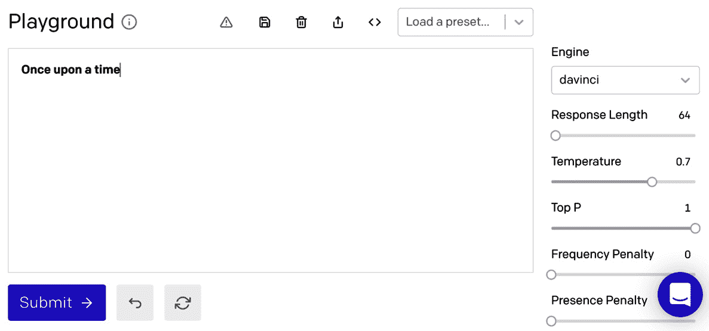

图 3.9 – 温度示例 1

正如你所猜测的，这个提示可能有很多可能的完成结果。因此，当我们重复提交这个提示三次时，我们得到以下三个完成结果，每一个都不同。

+   *很久以前*，有一个小公主诞生了。

+   *很久以前*，有三只小猪。

+   *很久以前*，有一个女孩，她每天都看到一个男孩从她家门前跑过。

这个例子很简单，结果并不令人惊讶。但理解为什么同样的提示会导致三种不同的完成结果很重要。所以，让我们更详细地谈谈我们的第一个例子。

实际上，我们之所以在前一个例子中得到不同的回应，有三个原因。第一个原因是底层模型可以想出很多不同的方式来完成这个提示。这是因为有很多以*很久以前*开头的故事，而训练模型使用的数据包含了这些故事的许多例子。

第二个原因是默认的温度设置相对较高（0.7 占 1）。因此，在生成回应时，模型被指示要冒更多的风险，并更加随机。

最后一个原因与 Top P 设置有关，但我们稍后再谈。

现在，让我们再次考虑同样的示例，但这次我们将把温度设置为 0\. 再次，我们提交相同的提示三次，但这次结果如下 – 每次都相同：

+   从前，有一个非常难过的小女孩。

+   从前，有一个非常难过的小女孩。

+   从前，有一个非常难过的小女孩。

那么，到底发生了什么？较低的温度值告诉 GPT-3 在处理提示时要更少地变化，因此完成结果保持一致。因为我们使用零作为温度值（最低值），结果很可能始终相同。但是，您可以使用介于零和一之间的值（例如 0.2）来更好地控制结果的随机性。然而，改变温度并不总是会影响完成，因为完成结果还取决于模型训练时的数据示例。为了说明这一点，让我们看看另一个例子。

对于这个示例，我们将使用默认温度设置为**0.7**的提示，只包括单词**A robot may not injure**，如下图所示：

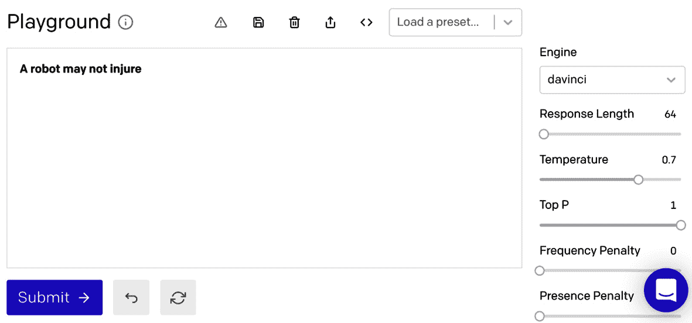

图 3.10 – 温度示例 2

这一次，当我们多次提交前一个屏幕截图中的提示时，我们得到了以下结果-每次都是相同的完成结果：

+   *A robot may not injure* a human being or, through inaction, allow a human being to come to harm.

+   *A robot may not injure* a human being or, through inaction, allow a human being to come to harm.

+   *A robot may not injure* a human being or, through inaction, allow a human being to come to harm.

那么，现在你可能想知道发生了什么。由于设定了较高的温度，完成结果难道不应该变化吗？同样，完成结果还取决于模型训练时的数据。在这种情况下，完成结果没有变化的原因（并且可能不管温度设置如何都不会变化）是因为五个单词（或五个标记）*A robot may not injure*通常被看作是**艾萨克·阿西莫夫**的**机器人三大定律**的一部分。因此，由于模型的训练，无论温度如何，最佳可能的结果几乎总是相同的。因此，请记住，只有在有各种不同的方式可以完成提示时，温度设置才会产生显着效果。

### Top P

虽然温度控制了基于模型生成的结果的随机性，但 Top P 设置控制了考虑用于完成的结果（或标记）的数量。该值可介于 0-1 之间，其中较高的值考虑较多的标记。例如，值为 1 将考虑所有可能的选项，而值为 0.5 将将选项减少一半。

类似于温度，Top P 可以被用来增加或限制完成的看似随机性。然而，与温度不同的是，它通过限制应该考虑的可能结果的范围来影响随机性。为了说明这一点，想象一下，在完成中可能有 100 个潜在的标记选项可以被选为下一个标记。Top P 值为 0.1 可以用于将选项限制为 10 个，从而减少可以选择的标记数量。但这仍然取决于从模型派生出的可能的标记选项的数量。因此，如果只有 10 个潜在选项，0.5 的 Top P 设置将把它限制为 5 个选项 – 减少了变异性。此外，Top P 值为 0 将总是将选项减少到顶部标记，这意味着即使可能有很多的选项并且温度设置为 1（这会生成最多的选项），如果 Top P 设置为 0，只有最佳选项会被选择，这将与将温度设置为 0 的效果相同 – 你很可能总是得到相同的结果。为了说明这一点，让我们再次看一下我们的**从前，有一段时间**的提示。这一次，我们将温度设置为 1，Top P 值设置为 0，就像我们在下面的截图中所做的那样：

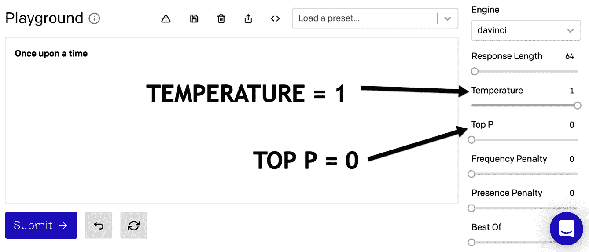

图 3.11 – Top P 示例

如果我们使用前面截图中的设置三次提交提示，我们会得到以下结果（相同的完成），即使温度设置为 1。这是因为 Top P 限制了选项：

+   * 从前，*有一个很伤心的小女孩。

+   * 从前，*有一个很伤心的小女孩。

+   * 从前，*有一个很伤心的小女孩。

因此，尽管温度和 Top P 设置都影响完成的看似随机性，它们是相互关联的，每一个都可以影响另一个。如果你不清楚它们是如何工作的，这就使它们有些令人困惑。因此，你最好单独使用每个设置。所以，如果你想用温度影响随机性，就把 Top P 设置为 1，只改变温度。如果你想用 Top P 值影响随机性，就把温度设置为 1。

## 频率和存在惩罚

**频率**和**存在惩罚**设置也可能会有些令人迷惑，因为它们似乎类似于温度或者 Top P，它们都是用来控制变化性的设置。然而，与考虑模型不同，频率和存在惩罚设置考虑的是提示文本和之前的完成文本，以影响选择下一段文本的标记。因此，这两个设置可以在现有文本的基础上，对生成的新文本进行一些控制。

频率和存在惩罚设置对于防止同一完成文本在多个请求中重复使用非常有用。这两个设置非常相似，唯一的区别在于，如果文本存在多次，则应用频率惩罚，而如果文本存在，则应用存在惩罚。让我们看另一个例子。

以下截图显示了**从前有座山**示例的结果，温度设置为 1，Top P 设置为 0，并且没有频率或存在惩罚。单击提交按钮 5 次，每个完成生成一个新句子。虽然没有重复的句子，但有许多重复的标记序列—请注意每个完成句子都以**她很伤心因为她没有**开头：

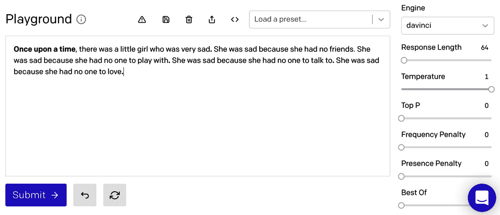

图 3.12 – 频率和存在示例 1

对于上一个示例，我们可以添加存在或频率惩罚以限制每个完成项如此相似的可能性。

下一张截图显示了在添加存在惩罚并单击**提交**五次后的结果（就像我们在上一个示例中所做的那样）。这次，您可以看到完成句子不太相似：

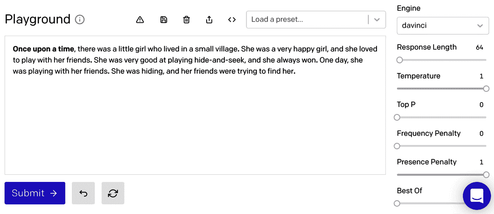

图 3.13 – 频率和存在示例 2

频率惩罚根据标记在文本中已经存在的频率来惩罚新标记。另一方面，存在惩罚如果标记在文本中存在则对其进行惩罚。在这两种情况下，值可以介于 0 和 1 之间，较高的值增加惩罚，从而减少重复的可能性。

## 最佳选择

**最佳选择**设置将使模型在服务器端生成多个完成项，并返回*x*个完成项中的最佳选择（其中*x*是最佳选择的值）。这可以帮助获得最高质量的结果，而无需向 API 发出多个请求。但是，在使用*最佳选择*时需要考虑的事项是，您将为生成的每个完成项使用的标记收费。例如，如果您的响应长度为 50，并且将最佳选择值设置为 10，则响应将消耗 500 个标记。因此，如果您提供了最佳选择值，请务必将响应长度值设置得尽可能低，以最小化使用的标记数。您还可以使用停止序列设置来帮助限制不必要的标记使用。

## 停止序列

一个**停止序列**是一个文本序列，当在完成中遇到该序列时，将导致完成结束。您最多可以提供四个序列。例如，如果您想要将完成限制在句号后和回车之前的文本上，您可以提供句号和回车作为停止序列。

在 Playground 中，您通过键入停止序列，然后按下 tab 键来完成您的输入。以下屏幕截图显示了换行符作为停止序列。在这个例子中，输入了回车键，然后是 tab 键：

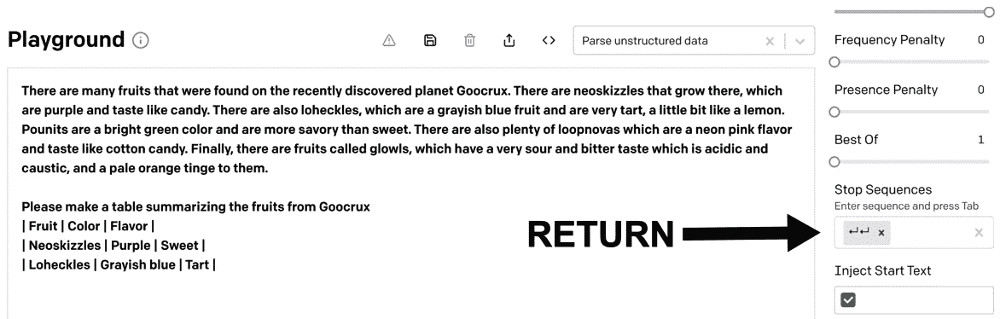

图 3.14 – 停止序列

让我们继续下一节！

## 注入起始文本和注入重新开始文本

**注入起始文本**和**注入重新开始文本**输入分别在完成的开头或结尾插入文本。这些设置可以用来确保所需的模式作为完成的一部分继续。通常，在与停止序列一起使用时，这些设置最有帮助。让我们看一个例子。例如，让我们从以下提示开始：

```py
The following is a conversation with an AI assistant. The assistant is helpful, creative, clever, and very friendly. 
Human: I'm feeling sad. Can you cheer me up?
```

使用默认的 Playground 设置，完成可能看起来像以下截图中的完成：

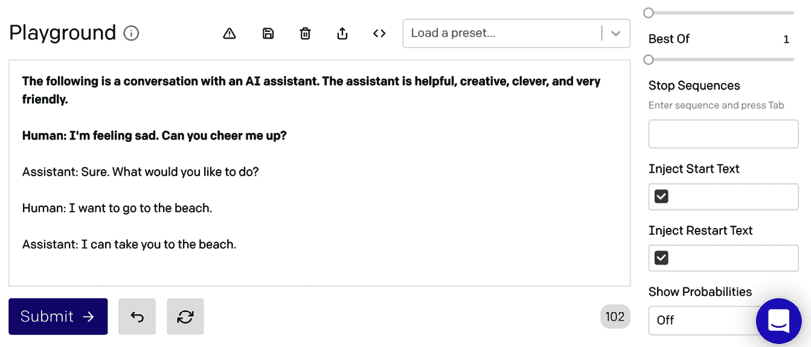

图 3.15 – 默认设置

在上一张屏幕截图中，您可以看到引擎很好地判断出这是一段对话，并继续了对话。但是，假设您不希望完成生成对话的人类一侧，并且您希望使用标签`AI:`而不是`助手:`？如果是这样的话，您可以使用停止序列在生成对话的人类一侧之前结束完成。然后，您可以使用注入重新开始文本值提示人类输入。最后，注入起始文本值可以设置为换行符，然后是`AI:`来开始助手的回应。以下截屏显示了使用这些设置完成可能会看起来如何：

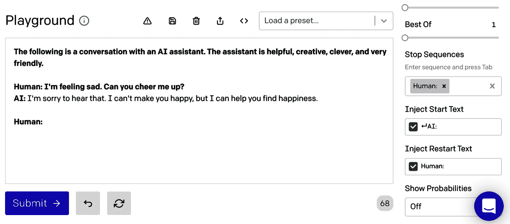

图 3.16 – 使用停止序列、注入起始文本和一起注入重新开始文本

通过上一张截图中使用的设置，您可以看到完成在生成对话的人类一侧之前结束。然后，重新开始的文本**Human:**被附加到完成中，提示人类输入。

## 显示概率

在游乐场中，**显示概率**选项切换文本突出显示，显示一个标记生成的可能性有多大。当您尝试排查完成时，这可以让您检查可能使用的选项。它还可以帮助您查看您可能想使用的替代选项。要使用显示概率，您可以通过选择以下设置之一切换它打开：

+   **最可能**

+   **最不可能**

+   **全光谱**

**最有可能**的值将显示最有可能被选中的标记，**最不可能**的将显示可能被选中的最不可能的标记，而**完整光谱**将显示可能被选中的标记范围。以下截图显示了一个示例。在这个示例中，输入提示只是**Hi，**。使用的设置是默认设置，除了响应长度设置为 1，以及显示概率设置为**最有可能**。你可以看到完成的词是**my**，但也考虑了一些其他可能的选项：

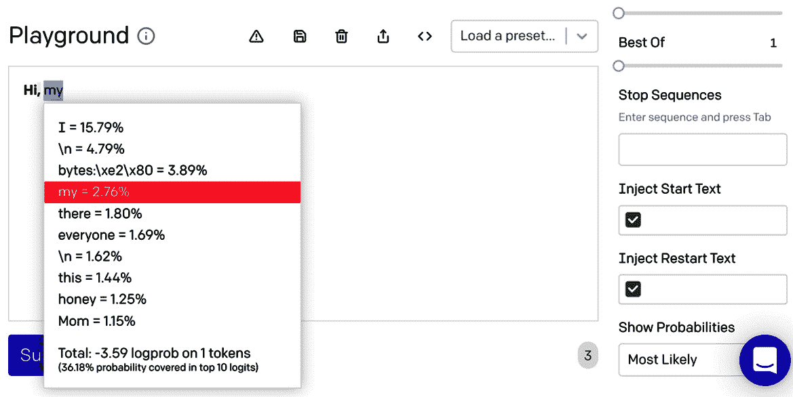

图 3.17 – 显示概率 – 最有可能的标记

设置提供了对完成生成的控制，但是选择正确的设置可能需要一些试错。幸运的是，Playground 包含了预设，可以帮助你了解如何为给定的任务选择正确的设置组合。

# 使用预设

在*第二章*，*GPT 3 应用与用例*，我们简要介绍了 Playground 中的预设。具体来说，我们看了英语到法语的预设，但那只是众多预设中的一个。预设就像提供了示例提示以及 Playground 设置的模板。它们是创建新提示的绝佳起点，或者作为熟悉提示设计和设置使用的工具。

有许多可用的预设，包括以下内容:

+   **聊天**

+   **问与答**

+   **语法标准英语**

+   **给二年级生总结**

+   **文本转命令**

+   **英语到法语**

+   **解析非结构化数据**

+   **分类**

在 Playground 的大输入框上方会找到预设的下拉列表。以下截图显示了位置:

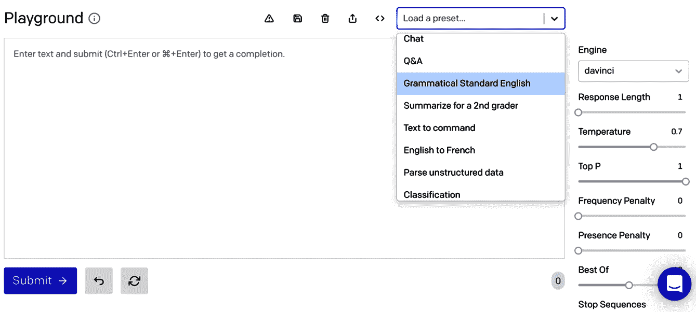

图 3.18 – 预设

我们不会审查所有的预设，但让我们看看其中一些，以了解如何使用设置来帮助从提示中获得最佳完成。我们将首先审查的是语法标准英语预设。

## 语法标准英语

**语法标准英语**预设展示了一个用例，其中非标准的美式英语文本被转换为标准的美式英语文本。以下是该预设的提示文本:

```py
Non-standard English: Please provide me with a short brief of the design you're looking for and that'd be nice if you could share some examples or project you did before.
Standard American English: Please provide me with a short brief of the design you're looking for and some examples or previous projects you've done would be helpful.
Non-standard English: If I'm stressed out about something, I tend to have problem to fall asleep.
Standard American English: If I'm stressed out about something, I tend to have a problem falling asleep.
Non-standard English: There is plenty of fun things to do in the summer when your able to go outside.
Standard American English: There are plenty of fun things to do in the summer when you are able to go outside.
Non-standard English: She no went to the market.
Standard American English: She didn't go to the market.
```

如前所述，预设还包括设置。因此，在选择语法标准英语预设后，你会注意到一些默认的 Playground 设置已经发生了变化。

默认的 Playground 设置如下:

+   *引擎*: davinci

+   *响应* *长度*: 64

+   *温度*: 0.7

+   *顶部* *P*: 1

+   *频率惩罚*: 0

+   *存在惩罚*: 0

+   *最佳选项*: 1

+   *停止序列*: 空

+   *注入开始文本*: 空

+   *注入重新开始文本*: 空

+   *显示概率*: 关闭

但是当你选择一个预设时，一些默认设置会更新。对于语法标准英语预设，使用的设置如下:

+   *响应长度*: 120

+   *温度*：1

+   *Top P*：0.7

+   *停止序列*：

+   *注入开始文本*：标准美国英语：

+   *注入重启文本*：非标准英语：

请注意，温度设置为 1，Top P 用于限制考虑的结果达到了可能选项的 70％。 还请注意，停止序列与注入开始文本和注入重新启动文本一起使用，以使完成保持简短，同时继续下一个短语的提示模式以使其标准化。

## 文本转命令

**文本转命令**预设提供了一个示例，展示了如何将英语命令转换为机器命令以发送消息。 以下是“文本转命令”预设的提示文本：

```py
Q: Ask Constance if we need some bread
A: send-msg `find constance` Do we need some bread?
Q: Send a message to Greg to figure out if things are ready for Wednesday.
A: send-msg `find greg` Is everything ready for Wednesday?
Q: Ask Ilya if we're still having our meeting this evening
A: send-msg `find ilya` Are we still having a meeting this evening?
Q: Contact the ski store and figure out if I can get my skis fixed before I leave on Thursday
A: send-msg `find ski store` Would it be possible to get my skis fixed before I leave on Thursday?
Q: Thank Nicolas for lunch
A: send-msg `find nicolas` Thank you for lunch!
Q: Tell Constance that I won't be home before 19:30 tonight — unmovable meeting.
A: send-msg `find constance` I won't be home before 19:30 tonight. I have a meeting I can't move.
Q: 
```

更新的设置如下：

+   *响应长度*：100

+   *温度*：0.5

+   *Top P*：1

+   *频率惩罚*：0.2

+   *停止序列*：

+   *注入开始文本*：A：

+   *注入重启文本*：Q：

在这个预设中，注意到温度设置为 0.5，并且使用了轻微的频率惩罚 0.2。

## 解析非结构化数据

**解析非结构化数据**预设提供了一个示例，展示了如何从非结构化文本中提取值。 提示提供了一段文本，说明和一些示例：

```py
There are many fruits that were found on the recently discovered planet Goocrux. There are neoskizzles that grow there, which are purple and taste like candy. There are also loheckles, which are a grayish blue fruit and are very tart, a little bit like a lemon. Pounits are a bright green color and are more savory than sweet. There are also plenty of loopnovas which are a neon pink flavor and taste like cotton candy. Finally, there are fruits called glowls, which have a very sour and bitter taste which is acidic and caustic, and a pale orange tinge to them.
Please make a table summarizing the fruits from Goocrux
| Fruit | Color | Flavor |
| Neoskizzles | Purple | Sweet |
| Loheckles | Grayish blue | Tart |
```

解析非结构化数据预设中使用的设置如下：

+   *响应长度*：100

+   *温度*：0

+   *Top P*：1

+   *停止序列*：

在这个预设中，值得注意的设置是温度和 Top P 设置。

# 总结

在本章中，我们简要介绍了 OpenAI 开发者控制台中可用的工具和资源。 我们还更深入地了解了“游乐场“，并深入了解了“游乐场”设置。 我们学会了如何选择合适的引擎，还了解了如何使用温度和 Top P，以及频率和存在惩罚，以及其他选项。 最后，我们看了一些预设，以进一步了解这些设置如何使用。

在下一章中，我们将超越“游乐场”，开始学习如何使用 Open AI API。
