# 第四章：使用 OpenAI API

到目前为止，我们用 GPT-3 所做的一切都是通过 Playground 完成的。虽然 Playground 是学习和测试的好地方，但是当你构建包含 GPT-3 的应用程序时，你也需要理解如何直接使用 OpenAI API。因此，在本章中，我们将通过发出 HTTP 请求来直接使用 OpenAI API。我们将首先对 API 和 HTTP 协议进行一般介绍。然后我们将看一下一些用于处理 API 请求和 JSON 数据交换格式的开发人员工具。

我们将涵盖的主题如下：

+   理解 API

+   熟悉 HTTP

+   查看 OpenAI API 端点

+   介绍 CURL 和 Postman

+   理解 API 身份验证

+   发出对 OpenAI API 的经过身份验证的请求

+   介绍 JSON

+   使用 Completions 端点

+   使用语义搜索端点

# 技术要求

本章需要你能够访问**OpenAI API**。你可以通过访问[`openapi.com`](https://openapi.com)来请求访问权限。

# 理解 API

缩写**API**代表**应用程序编程接口**。API 允许软件在系统之间进行通信和交换数据，共享计算机系统资源和软件功能。由于功能可以共享，它们也可以实现代码重用。这通常提高了系统的质量，同时也降低了开发工作量。

Web-based APIs 是通过 HTTP 在互联网上公开的，这与你在网络浏览器中访问 URL 时使用的协议相同。因此，使用基于 Web 的 API 非常类似于使用网站。例如，当你使用 API 时，你会向**统一资源定位符**（**URL**）发出请求，就像你访问网站时所做的那样。URL 提供了 API 提供的资源、数据或功能的参考。

就像网站一样，每个 API 都是一个或多个 URL 的集合，也被称为端点。每个端点提供对特定资源或功能的访问。一些端点可能接受输入数据并执行任务，而其他端点可能只是返回数据。输入和输出数据的格式取决于 API。但是，大多数 API 使用常见的数据交换格式，如**JavaScript 对象表示**（**JSON**）或纯文本。我们稍后会讨论 JSON 数据交换格式，因为这是 OpenAI API 所使用的格式。

由于基于 web 的 API 可以使用 HTTP 访问并使用常见数据格式，它们不依赖于任何特定的编程语言，这意味着几乎任何可以发出 HTTP 请求的编程语言或开发工具都可以与 HTTP API 互动。实际上，甚至可以使用 web 浏览器与一些基于 web 的 API 互动。例如，如果在您的 web 浏览器中打开 [`api.open-notify.org/astros.json`](http://api.open-notify.org/astros.json)，您将看到提供有关目前在太空的人数的数据的响应。结果并未以美观的格式呈现，因为它们是为机器使用而不是人类消费而设计的，但我们可以在浏览器中看到结果，因为它使用了网站使用的相同的 web 协议，如下面的屏幕截图中所示：

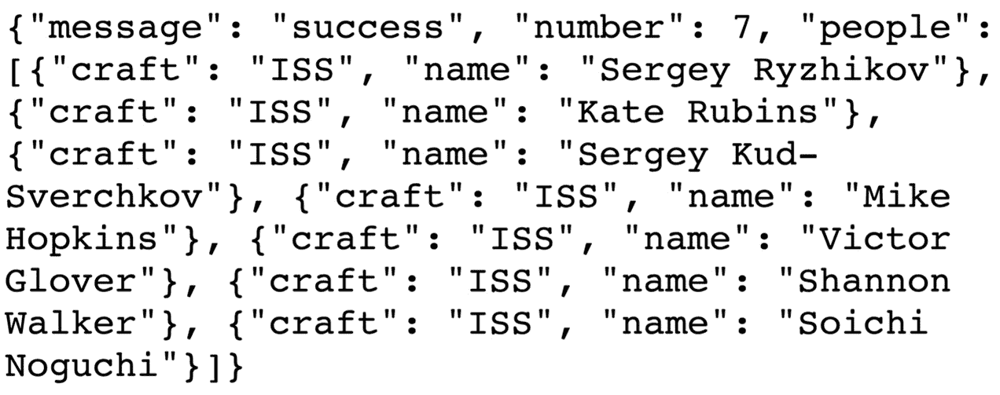

图 4.1 – Open-Notify API – JSON 响应

尽管 HTTP API 不是针对特定语言编程的，但许多 API 发布者提供了一个**软件开发工具包**（**SDK**）或一个软件库，以便在特定语言中更简单地使用 API。例如，OpenAI 提供了简化在 Python 编程语言中使用 OpenAI API 的 Python 绑定（库）。这些工具本质上是 API 的包装器，如果没有库，你可能需要编写的代码会减少。稍后我们会在 *第五章* 中更详细地讨论可用于 OpenAI API 的一些库，*在代码中调用 OpenAI API*。目前，需要注意的重要事项是，只要选择能够发出 HTTP 请求的编程语言即可，编程语言并不重要。此外，SDK 或库可以提供帮助，但并不是使用 API 的必需条件。然而，必不可少的是对 HTTP 协议的基本理解。因此，我们接下来会讨论这个问题。

# 熟悉 HTTP

因为 API 设计用于在代码中使用，为了与其一起工作，你确实需要对 HTTP 协议有更多了解，而不仅仅是访问网站所需的知识。因此，在本节中，你将学习一些 HTTP 基础知识。

起初，HTTP 是一种请求-响应协议。因此，客户端（请求系统）向服务器（接收系统）发出请求，服务器然后响应客户端。客户端使用**统一资源标识符**（**URI**）来引用服务器和所请求的资源。

## 统一资源标识符

HTTP URI 提供了需要向特定服务器请求特定资源的 HTTP 请求所需的详细信息。为了举例说明，让我们分解前面在*理解 API*部分中提到的[`api.open-notify.org/astros.json`](http://api.open-notify.org/astros.json)端点。端点始于对所使用协议的引用。在我们的示例中，这是 `http://`。对于基于 Web 的 API，这将始终是 HTTP 或 HTTPS。当使用 HTTPS 时，这是一个指示请求和响应之间将被加密的指示。URI 的第二部分（在本例中为[api.open-notify.org](http://api.open-notify.org)）是资源所在的服务器的引用。在服务器名称之后是对服务器上资源位置的引用。有些 URI 还会包括参数和值。这些参数和值可用于提供服务器处理请求的附加细节或可变数据。

除 URI 之外，HTTP 协议还支持称为**HTTP 方法**的不同请求类型，它们提供有关正在进行的请求的附加信息。

## HTTP 方法

HTTP 方法允许服务器使用相同的 URL 执行不同的操作。有六种不同的 HTTP 方法，但并非所有 URL 端点都支持所有方法。最常见的两种 HTTP 方法是`GET`和`POST`。GET 方法告诉服务器客户端要检索（或获取）信息，而 POST 方法告诉服务器客户端正在发送数据。因此，如果端点用于检索数据，通常会使用 GET 方法。但是，如果端点预期数据输入，可能会使用 POST 方法。

## HTTP 正文

HTTP 请求或响应的正文包含主要数据负载。在请求的情况下，正文包含将被发送到服务器的数据。在响应的情况下，正文包含从服务器返回的数据。在 HTTP 正文中发送的数据可以是任何基于文本的有效载荷。常用的格式有 JSON、XML 和纯文本。因此，您还需要知道您将与之交互的 API 中发送和接收数据的格式。这通常可以在 API 文档中找到。

## HTTP 头

HTTP 正文不是发送/接收数据的唯一方式。您还可以将数据作为 URL 的一部分或作为 HTTP 头包含在内。HTTP 头是键/值对，可用于在客户端和服务器之间发送/接收值。虽然 HTTP 头可以用于各种原因，但它们通常定义元数据或提供有关请求的详细信息的数据。例如，名为**Content-Type**的 HTTP 头用于告诉服务器传递正文中的数据类型，而**Authorization**头可用于发送认证详细信息，如用户名和密码。

## HTTP 响应状态码

当客户端向有效服务器发出有效请求时，服务器将始终在响应中包含一个 HTTP 响应状态代码。状态代码是一个提供响应的高级结果状态的数字值。例如，200 表示成功的响应，而 500 表示内部服务器错误。有关不同状态代码的完整列表，您可以访问 [`developer.mozilla.org/en-US/docs/Web/HTTP/Status`](https://developer.mozilla.org/en-US/docs/Web/HTTP/Status)。虽然记住不同的状态代码并不重要，但熟悉它们并知道在哪里查找代码的含义是很好的。当您调用 API 端点时遇到问题时，状态代码非常有助于调试问题。

本节只是对 HTTP 提供了一个非常高层次的概述，但对于使用 OpenAI API 和大多数其他基于 Web 的 API，高层次的理解就足够了。

# 查看 OpenAI API 端点

通过 Playground 所做的一切也可以通过 OpenAI API 来完成 - 甚至更多。实际上，Playground 只是调用 OpenAI API 的 Web 接口。它只是使用图形界面暴露了 API 提供的功能。因此，在本节中，我们将审查通过 API 端点可用的 OpenAI 功能。您会对功能很熟悉，因为您已经通过 Playground 使用了它，但在本节之后，您将知道如何在代码中访问特定的功能。

使用 OpenAI API，您可以通过可用的端点执行以下操作：

+   创建完成

+   列出可用引擎

+   获取引擎详情

+   执行语义搜索

所有的 OpenAI API 端点都需要身份验证。因此，它们不能像我们之前查看的 Open-Notify API 那样，只需使用浏览器即可调用。但我们暂时不讨论身份验证，而是审查每个可用的端点。

## 列出引擎

列出引擎端点是一个元数据 API，意味着它提供有关系统本身的数据。具体来说，它提供了一份可用引擎的列表，以及每个引擎的一些基本信息。OpenAI 正在积极开发新引擎并更新现有引擎，因此列出引擎端点将提供当前可用引擎的列表。

列出引擎端点使用 HTTP GET 方法，不需要任何请求参数。以下是列出引擎端点的 HTTP 方法（GET）和 URI：

```py
GET https://api.openai.com/v1/engines
```

接下来是检索引擎端点！

## 检索引擎

检索引擎端点也是一个元数据 API。它返回关于特定引擎的详细信息。与列出引擎端点一样，检索引擎端点也使用 HTTP GET 方法，并且要求将引擎 ID 包含在 URI 路径中。可以从列出引擎端点检索到可能的引擎 ID 值。

Retrieve Engine 端点使用 HTTP GET 方法和以下 URI，其中一个参数是引擎 ID：

```py
GET https://api.openai.com/v1/engines/{engine_id}
```

接下来是 Create Completions 端点 - 你可能会经常使用它。

## Create Completions

Create Completions 端点是你最常使用的端点。这个端点接收一个提示并返回完成结果。这个端点使用 HTTP POST 方法，并且要求引擎 ID 作为 URI 路径的一部分。Create Completions 端点还接受许多其他参数作为 HTTP 正文的一部分。我们将在本章后面讨论这些参数。

Completions 端点也使用 POST 方法，并且需要引擎 ID 作为 URI 参数：

```py
POST https://api.openai.com/v1/engines/{engine_id}/completions
```

还值得注意的是，有一个实验性的 Create Completions 端点，用于将结果流式传输到浏览器。它使用 HTTP GET 方法，并且参数在 URI 中传递。您可以通过访问[`beta.openai.com/docs/api-reference/create-completion-via-get`](https://beta.openai.com/docs/api-reference/create-completion-via-get)了解有关此端点的更多信息。

## Semantic Search

Semantic Search 端点可以用于在文档列表上执行语义搜索。语义搜索将搜索词与文档内容进行比较，以识别语义上相似的文档。要搜索的文档作为 HTTP 正文的一部分传递到端点中，最多可以包含 200 个文档。此端点使用 HTTP POST 方法，并要求将引擎 ID 作为端点 URI 的一部分传递。

Semantic Search 端点使用 POST 方法，并且需要引擎 ID 作为 URI 参数：

```py
POST https://api.openai.com/v1/engines/{engine_id}/search
```

就基于 Web 的 API 而言，OpenAI API 相对简单易用，但在我们开始测试该 API 之前，让我们讨论一些可以用来开始测试 API 的开发工具。

# 介绍 CURL 和 Postman

在本节中，我们将介绍一些用于使用 API 的开发人员工具。如我们所讨论的，API 旨在用于代码中。但是，在开发过程中，您常常希望调用 API 端点，而不编写代码来熟悉功能或进行测试。为此，有许多开发人员工具可用。使用 API 的最受欢迎的两个开发人员工具是 CURL 和 Postman。

### CURL

CURL 是一个流行的命令行工具，用于发起 HTTP 请求。它已经存在了 20 多年，所以非常成熟和广泛使用。许多 API 发布者，包括 OpenAI，在他们的文档中使用 CURL 语法提供 API 示例。下面的截屏显示了 OpenAI API 文档中使用的 CURL 语法示例。因此，即使 CURL 不是你长期决定使用的工具，熟悉它仍然有帮助。

下面的截屏显示了 OpenAI API 文档中的 CURL 语法：

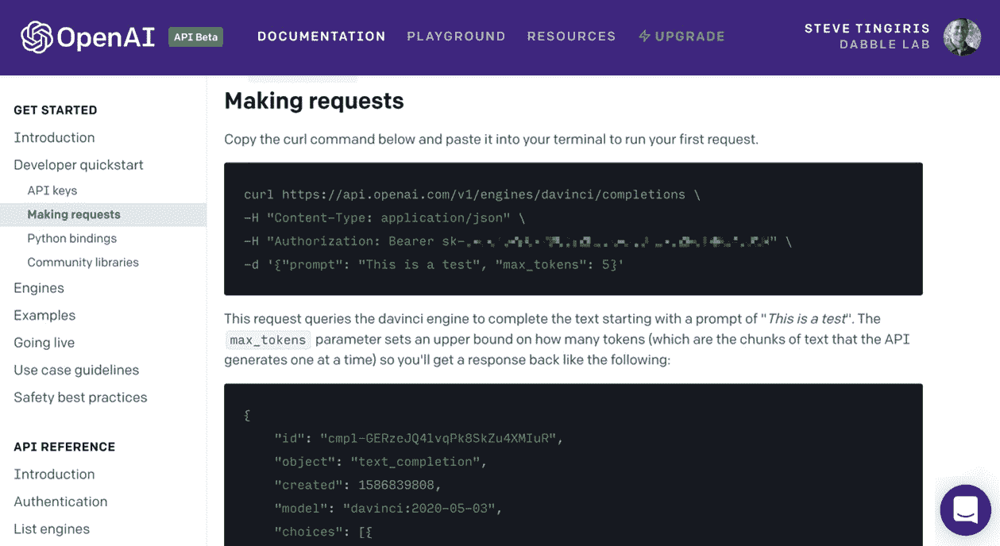

图 4.2 - OpenAI API 文档中的 Curl 命令

CURL 可用于 Linux、Mac 和 Windows，并且默认情况下安装在大多数 Linux 和 Mac 机器上以及运行 Windows 10 Build 1707 或更高版本的 Windows 计算机上。

重要提示

要检查你的 Windows 版本，请在键盘上按下*Windows+R*来打开**运行**对话框。然后，输入*winver*（不带引号）并点击**确定**。

你可以通过命令行验证是否已安装 CURL。在 Linux 和 Mac 上，可以使用终端应用程序访问命令行。在 Windows 上，打开命令提示符以访问命令行。在命令行中，你可以输入 `curl --help` 命令来确认是否已安装 CURL。如果 CURL 已安装，你应该会看到类似以下屏幕截图的内容：

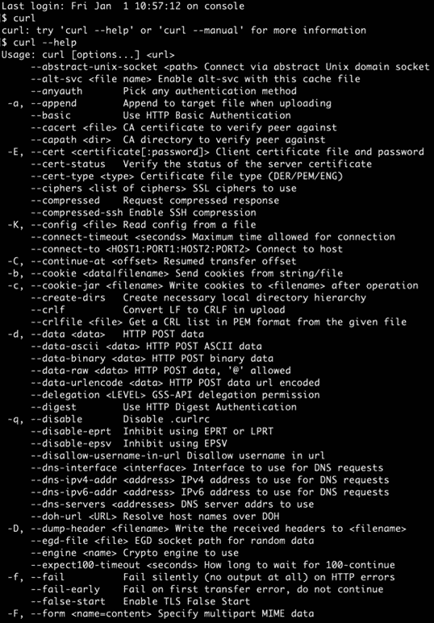

图 4.3 – Curl 帮助命令

如果你尚未安装 CURL，可以从官方 CURL 网站下载，网址为[`curl.se/download.html`](https://curl.se/download.html)。

有关使用 CURL 的整本书籍，因此我们这里只是简单介绍其功能。我们将讨论使用 CURL 处理 API 调用，但不仅限于处理 API – 它可以用来进行任何 HTTP 请求。例如，如果你在命令提示符下输入 `curl` [`dabblelab.com`](https://dabblelab.com) 并按下*回车*键，CURL 将抓取 [dabblelab.com](http://dabblelab.com) 的主页。但是，CURL 不是浏览器，因此你所看到的是原始的 HTML 代码，而不是像使用浏览器时看到的漂亮格式的网页。

当我们更详细地研究 OpenAI API 时，将使用 CURL 进行不同的 API 调用。但在此之前，让我们先看看 Postman，这是使用 CURL 的替代方案。

### Postman

Postman 是另一个用于处理 API 的开发者工具。与 CURL 不同，Postman 具有图形用户界面。因此，如果你不太擅长命令行，可能更喜欢使用 Postman。你可以从浏览器中使用 Postman，或者可以下载适用于 Linux、Mac 或 Windows 的版本。在我们的示例中，我们将使用网络版本，因为无需安装任何软件；你只需在[`postman.com`](https://postman.com)注册一个免费账户。

以下屏幕截图显示了 Postman 的主页。你只需要完成注册过程就能开始使用 Postman：

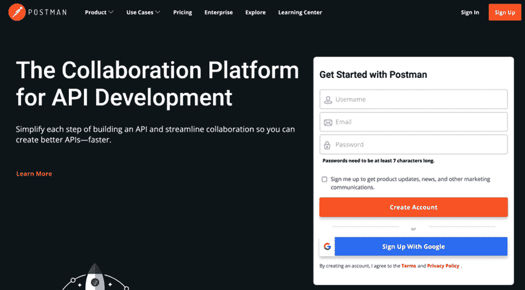

图 4.4 – Postman 主页

注册后，你将进入一个简短的入门流程。完成入门流程后，你应该看到类似以下屏幕截图的界面：


图 4.5 – Postman 欢迎界面

与 CURL 类似，Postman 有很多功能，我们只会查看 Postman 的一小部分。但是在其核心，Postman 是一个用于调用 API 端点并检查 API 端点返回结果的工具。我们将从一个快速的演示开始，向您展示如何使用 Postman 发出您的第一个 API 请求。

### 使用 Postman 发送请求

要开始使用 Postman，请向 Open-Notify API 端点发出我们先前在浏览器中查看过的请求。要做到这一点，请完成以下步骤：

1.  登录到[Postman.com](http://Postman.com)后，单击**创建新建**链接。如果提示下载桌面代理，请单击**现在跳过**按钮。这将带您进入您的工作区，它看起来类似以下截图: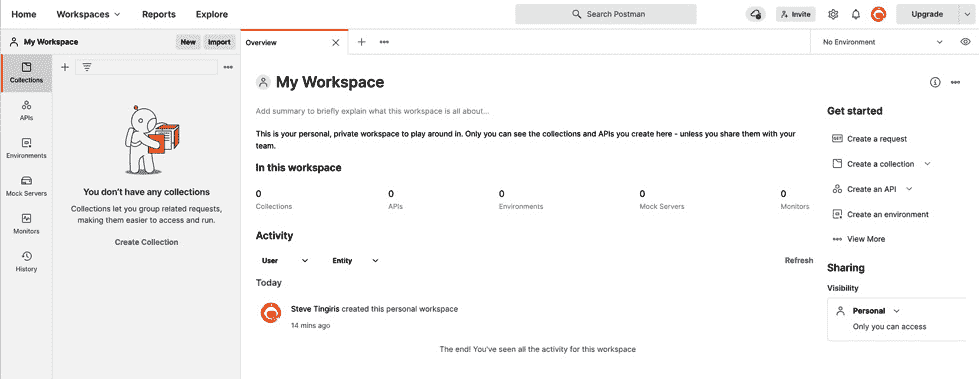

    图 4.6 – 我的工作空间

    请注意，工作区的右侧是一个选项卡界面，默认情况下将打开**概述**选项卡。在右侧，您会看到一个加号，可用于打开一个新选项卡。

1.  单击加号以打开一个新选项卡，输入请求 URL（[`api.open-notify.org/astros.json`](http://api.open-notify.org/astros.json)），然后单击**发送**按钮。您应该会看到类似以下截图的结果:

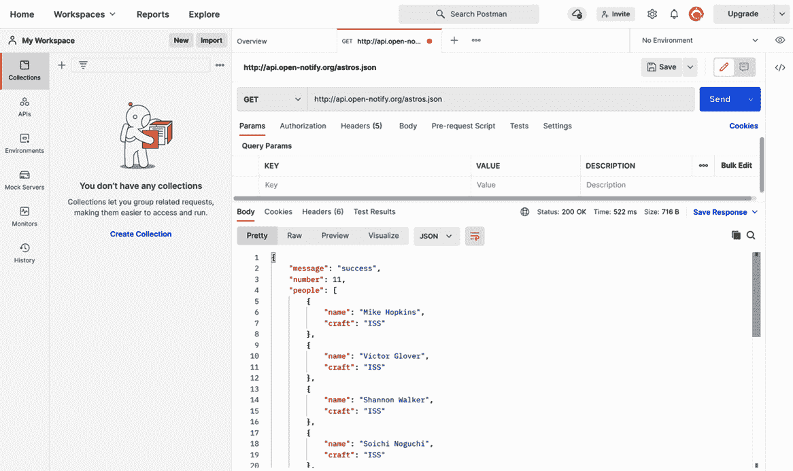

图 4.7 – Postman 请求结果

注意观察*图 4.7*中的 JSON 结果是如何格式化的，以便易于阅读。这只是 Postman 为我们提供的许多有用功能之一。当我们深入研究 OpenAI API 时，我们还将涵盖更多的 Postman 功能。但是让我们继续并讨论如何调用 OpenAI API，因为这需要身份验证。

# 理解 API 身份验证

一些网站是公开的，而其他网站则要求您登录后才能访问内容或功能。对于 API 也是如此。我们在*理解 API*部分中查看的 Open-Notify API 是对公众开放的，并且不需要任何形式的身份验证。另一方面，OpenAI API 是私有的，因此需要身份验证才能使用它。

API 身份验证过程的作用与网站登录相同，但是以适用于应用程序而不是人类的方式进行。API 可以通过许多不同的方式对应用程序请求进行身份验证，但我们将重点放在**基本身份验证**上，因为这是 OpenAI API 使用的方法之一。

基本身份验证是一种原生于 HTTP 的身份验证方法。它允许将用户名和密码包含在 HTTP 头中。为了保护凭据安全，对 API 的请求和响应应进行加密。因此，使用基本身份验证的 API 端点 URL 应始终使用**安全套接字层**（**SSL**），您可以通过 URL 以 HTTPS 开头而不仅仅是 HTTP 来识别。

对于 OpenAI API，你不是发送用户名和密码，而是使用 API 密钥。API 密钥就像一个字符串中的用户名和密码合二为一。使用 API 密钥的好处是可以轻松更改或更新，而不必更改 OpenAI 密码。

我们在*第三章*中介绍了你可以在哪里找到你的 API 密钥，*使用 OpenAI Playground*，但是作为回顾，你可以在用户设置下访问你的 OpenAI API 密钥。从相同位置，你也可以通过点击 **Rotate Key** 按钮来使 API 密钥失效并生成一个新的 API 密钥。

下面的截图显示了账户设置下的 **API 密钥** 屏幕：

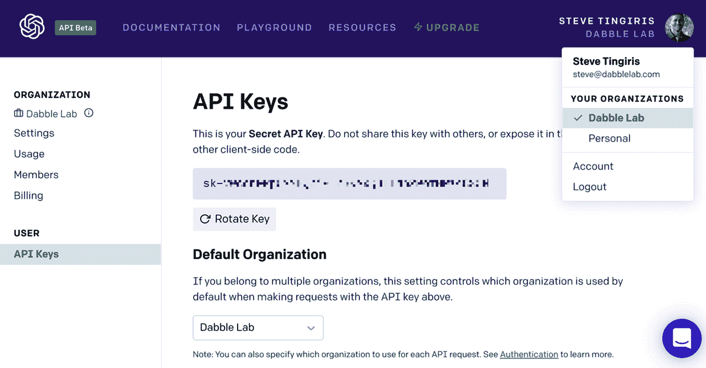

图 4.8 – API 密钥

使用你的 API 密钥，你拥有一切需要向 OpenAI API 发送请求的条件。但在我们进行之前，让我们谈一分钟关于保持 API 密钥私密性的重要性。

## 保持 API 密钥私密

即使 API 密钥可以轻松更改，它们也应该被保持私密，就像用户名和密码一样，因为它们也提供对你的账户的访问。所以，要小心确保你的 API 密钥不会意外泄露。如果你不小心的话，这可能很容易发生错误。例如，OpenAI 文档包含了你的 API 密钥，以便简化尝试代码示例。但是，如果你对博客文章或类似内容的文档进行截图，如果你没有将其模糊处理，你会将你的 API 密钥暴露给任何看到图像的人。以下截图显示了一个包含 API 密钥的文档页面示例。在示例中，密钥已经被模糊处理，但你可以看到如果情况不是这样的话它将会暴露：

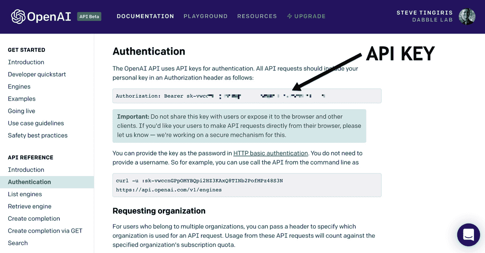

图 4.9 – 文档中的 API 密钥

另一种常见的错误暴露 API 密钥的方式是它们与共享的源代码一起包含。我们将在*第五章*中看到如何避免这种情况，*在代码中调用 OpenAI API*，但这里的主要观点是你需要小心，因为你的 API 密钥，就像你的用户名和密码一样，可以访问你的账户。

现在你知道如何找到你的 API 密钥并保持它安全，让我们看看如何使用它来第一次调用 OpenAI API。

# 对 OpenAI API 发送经过身份验证的请求

是时候直接向 OpenAI API 发送我们的第一个请求了。为此，我们需要将我们的 API 密钥作为 HTTP 标头的一部分。我们将要使用的标头名称是授权，值将是单词 *Bearer*，后跟一个空格，然后是你的 API 密钥。当 API 密钥像这样被使用时，通常也被称为令牌。这是由一种名为 OAuth 2.0 的授权协议定义的标准。你可以通过访问[`oauth.net/2/`](https://oauth.net/2/)来了解更多关于 OAuth 2.0 的信息。

Postman 非常容易使用持有者标记。但在我们进行经过身份验证的请求之前，让我们看看如果我们尝试在没有我们的 API 密钥的情况下发出请求会发生什么。下图显示了向不带任何授权标头的请求`https://api.openai.com/v1/engines`发送的请求。您可以看到返回了一个错误消息。您还会注意到 HTTP 响应状态码为`401 UNAUTHORIZED`：


图 4.10 – 不带 API 密钥的 API 请求

为了解决错误，我们需要将我们的 API 密钥包含为持有者标记。由于我们将为每个请求使用 API 密钥，因此我们将为 API 密钥设置一个 Postman 变量。

### 设置 Postman 变量

Postman 中的变量允许您存储并重复使用值，而不必一遍又一遍地输入。变量还可以被分组到一个 Postman 环境中。因此，我们要设置一个名为**openai-dev**的环境，并添加一个名为**OPENAI_API_KEY**的变量来存储我们的 API 密钥。

要设置 Postman 环境和 API 密钥变量，请按照以下步骤进行操作：

1.  点击请求右上角的眼睛图标。

1.  点击**Add**链接以添加新环境。

1.  将环境命名为`openai-dev`。

1.  添加一个名为`OPENAI_API_KEY`的变量。

1.  在`INITIAL VALUE`输入框中输入您的 API 密钥。

1.  点击**Save**图标以保存环境和变量。

1.  关闭**openai-dev**环境选项卡。

1.  在右上角的环境选项列表中选择新环境。默认情况下，应该显示**无环境**，你将要选择**openai-dev**，如下图所示：

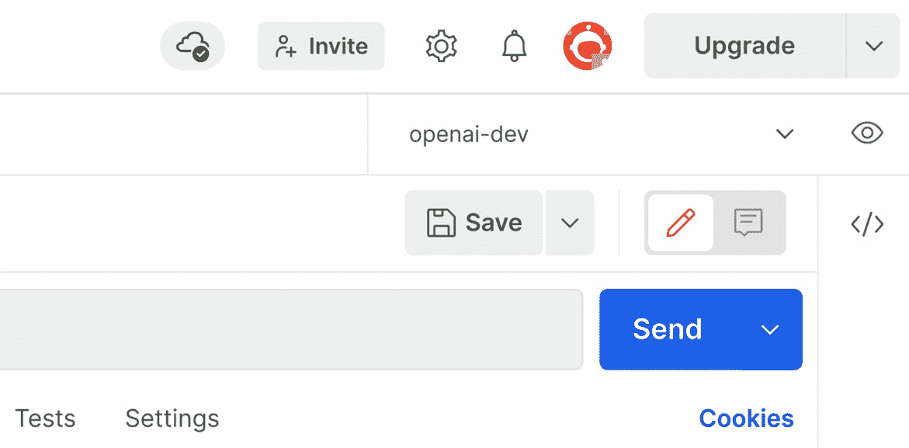

图 4.11 – 设置环境的 Postman

环境和`OPENAI_API_KEY`变量就位后，你可以通过在实际密钥值位置包含`{{OPENAI_API_KEY}}`来使用你的 API 密钥。现在，让我们尝试使用它，将其用于为我们的请求设置授权标头到引擎端点。

### 设置授权标头

现在，您的 OpenAI API 密钥已设置为 Postman 变量，请执行以下步骤进行测试：

1.  在请求 URL 输入框下方点击**Authorization**选项卡。

1.  从**类型**下拉列表中选择**Bearer Token**选项。

1.  在**Token 输入框**中输入**{{OPENAI_API_KEY}}**。

1.  点击**Send**按钮。

您应该看到一个成功的响应（HTTP 状态**200**），如下图所示：


图 4.12 – 使用 API 密钥作为持有者标记的 API 请求

正如前面提到的，承载令牌作为 HTTP 标头发送。在 Postman 中查看标头，点击**标头**选项卡，然后取消隐藏标头，您将看到带有 API 密钥作为承载令牌值的**授权**标头，如下截图所示：


图 4.13 – 使用 API 密钥作为承载令牌的授权标头

当我们谈论授权和 HTTP 标头时，还需要注意，如果您的用户帐户关联多个组织，您还需要提供组织 ID，以将 API 请求与您希望计费的组织关联起来。

## 处理多个组织

要将 API 请求与特定组织关联，您将在请求中包含一个**OpenAI-Organization HTTP 标头**，其中包含您要将请求与的组织的组织 ID。只有在您的用户帐户关联多个组织时才需要这样做。

要在 Postman 中添加 OpenAI-Organization 标头，请滚动到现有标头列表的底部，并添加一个新的标头，名称为**OpenAI-Organization**，并将值设为您的帐户关联的组织 ID。最好的方法是在 Postman 中添加一个名为**OPENAI_ORGANIZATION_ID**的新环境，并将**{{OPENAI_ORGANIZATION_ID}}**添加为值。作为提醒，您可以在 OpenAI 开发者控制台中的帐户设置页面上找到您的组织 ID，如下截图所示：

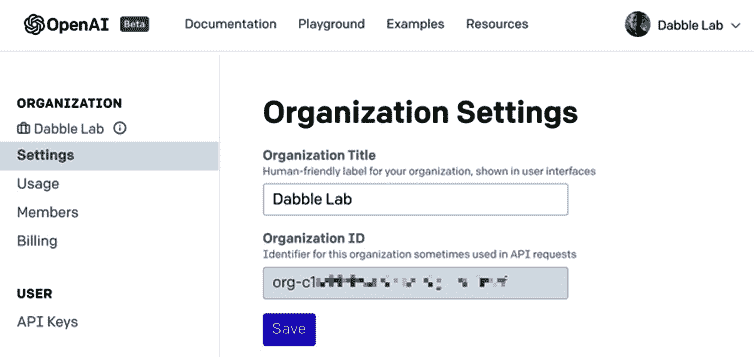

图 4.14 – 查找您的组织 ID

当您在 Postman 中的 OpenAI-Organization 标头中添加了您的组织 ID 值后，您将在标头列表中看到它，如下截图所示：


图 4.15 – 使用 OpenAI-Organization HTTP 标头

在本书的其余部分，我们将使用 Postman 来说明和测试 API 调用。但在我们继续之前，让我们看看如何使用 CURL 进行身份验证的 API 调用。

请记住，CURL 是一个命令行工具。因此，它没有像 Postman 那样的图形用户界面。使用 CURL，HTTP 标头作为命令行参数传递。以下是调用列表引擎端点的 CURL 命令示例：

```py
curl https://api.openai.com/v1/engines \
  -H 'Authorization: Bearer {your-api-key}' \
  -H 'OpenAI-Organization: {your-orgainzation-id}'
```

在替换 `{your-api-key}` 占位符和 `{your-organization-id}` 占位符之后，这条命令将返回类似下面截图中所示的结果：


图 4.16 – 使用 CURL 调用列表引擎端点

现在您知道如何进行对 OpenAI API 的身份验证调用，让我们花点时间来谈谈 JSON，这是 OpenAI API 使用的数据交换格式。

# 介绍 JSON

在本节中，我们将快速介绍 JSON。JSON 是一种流行的数据交换格式，它轻量级，易于机器解析，也易于人类阅读。

JSON 语法基于 JavaScript 编程语言的子集，它定义了两种数据结构：

+   名称/值对的集合

+   有序值列表

这两种数据结构在现代几乎所有编程语言中都以某种方式得到支持。因此，尽管 JSON 语法基于 JavaScript 的子集，但也可以轻松地与其他语言一起使用。

JSON 中的两种数据结构分别定义为对象或数组。对象以左大括号开头，以右大括号结束。一个空对象看起来像下面的示例：

```py
{}
```

对象可以包含一组名称/值对，称为元素。对象中的元素不需要按任何特定顺序排列，值可以是字符串（用双引号括起来）、数字、true 或 false、null、另一个对象或数组。元素名称和值之间用冒号分隔，元素本身用逗号分隔。以下代码块是来自 OpenAI API 响应的 JSON 对象示例。您会注意到它以大括号开头和结束，并包含具有名称和值的不同元素。请注意，`"choices"` 元素的值包含以左方括号开头和以右方括号结尾的值 - 那是一个数组：

```py
{
    "id": "cmpl-2T0IrOkctsOm8uVFvDDEmc1712U9R",
    "object": "text_completion",
    "created": 1613265353,
    "model": "davinci:2020-05-03",
    "choices": [
        {
            "text": ", there was a dog",
            "index": 0,
            "logprobs": null,
            "finish_reason": "length"
        }
    ]
}
```

一个数组是一组有序的值。这些值可以是一组字符串、数字、true 或 false 值、null 值、对象或其他数组。数组始终以左方括号开头，以右方括号结尾，值之间用逗号分隔。

在前面的示例对象中，`"choices"` 元素的值是一个包含一个对象的数组。该对象包含带有值的元素（`text`、`index`、`logprobs`、`finish_reason`）。因此，对象和数组可以嵌套。

关于 JSON 的最后一点是，文本的格式，诸如空格、制表符和换行符，是为了人类可读性而做的，但并不是机器所必需的。因此，只要语法有效，它就可以在代码中使用。

例如，以下两个 JSON 对象是相同的，且都是有效的：

例 1：

```py
{"question":"Is this correct? ","answer":"Yes"}
```

例 2：

```py
{
    "question" : "Is this correct?",
    "answer" : "Yes"
}
```

如本节前面提到的，OpenAI API 使用 JSON 在客户端和服务器之间发送和接收数据。本节的介绍应该足以开始使用 OpenAI API，但要了解更多关于 JSON 的信息，您也可以访问 [`www.json.org/`](https://www.json.org/)。

到目前为止，您已经学会了开始使用主要的 OpenAI API 端点 - Completions 端点所需的所有内容。所以，接下来让我们深入了解一下。

# 使用 Completions 端点

当你使用 OpenAI API 时，你大部分时间可能会涉及到使用 Completions 端点。这是你发送提示的端点。除了提交你的提示外，你还可以包含值来影响完成的生成，就像 Playground 中的设置一样。

使用 Completions 端点比我们在上一节*介绍 JSON*中看到的 List Engines 端点更加复杂。这是因为 Completions 端点使用 HTTP POST 方法，并且需要一个 JSON 对象作为正文。从技术上讲，JSON 正文可以只是一个空对象（就像 `{}` 一样），但至少，你会想至少包含 `prompt` 元素，并将其值设置为你的 `prompt` 字符串，例如以下的 JSON 示例:

```py
{"prompt": "Once upon a time"}
```

前面的例子是一个简单的例子，但这是我们如何使用 Postman 提交它。假设授权如前一节所讨论的设置，从 Postman 完成调用 Completions 端点有五个步骤。这些步骤如下:

1.  将请求类型设置为**POST**。

1.  输入 https://api.openai.com/v1/engines/davinci/completions 作为端点。

1.  将正文设置为**raw**。

1.  选择**JSON**作为正文内容类型。

1.  输入 `{"prompt": "Once upon a time"}` 作为 JSON 正文文本。

    下面的屏幕截图标签显示了每个步骤的完成位置：

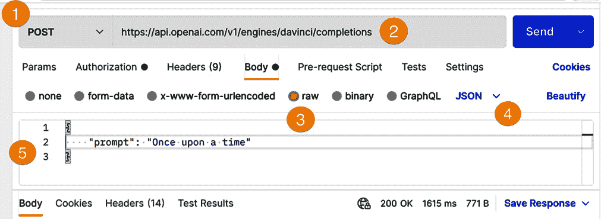

图 4.17 - Completions 终端的 Postman 设置

点击**Send**按钮后，我们得到了 Completions 端点的响应，如下面的屏幕截图所示:

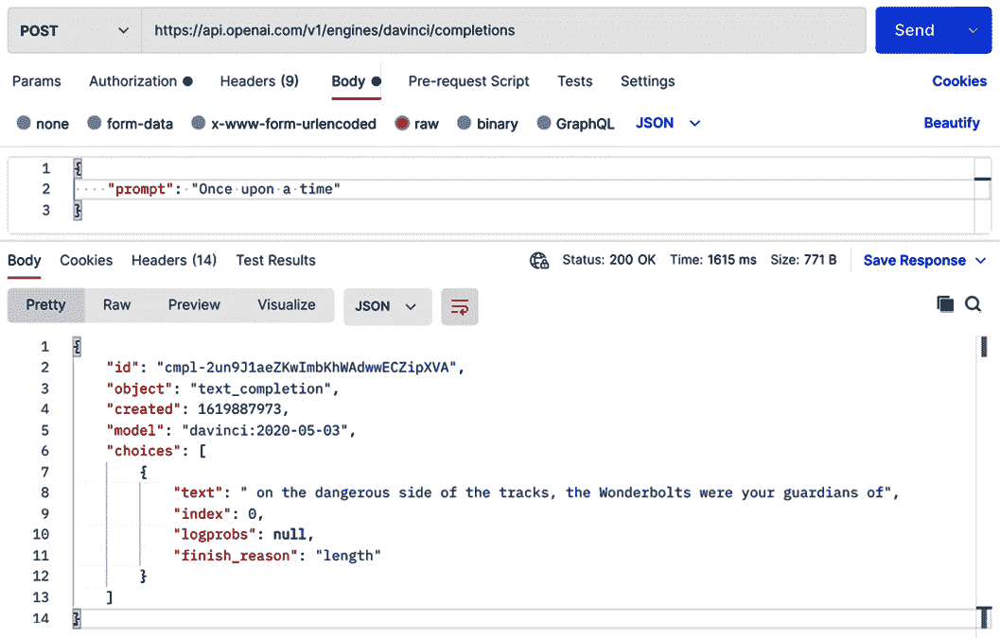

图 4.18 - Completions 终端的 Postman 响应

默认情况下，Postman 将使用**Pretty**设置来显示 JSON 响应，使其对人类查看友好。但是，如果切换到**Raw**设置，你将看到响应实际上是如何发送的，正如下面的屏幕截图所示：


图 4.19 - Completions 终端的 Postman 响应 – Raw

前面的例子是一个简单的例子，只有一个请求参数 - prompt。然而，端点接受许多其他类似于 Playground 设置的额外参数。为了在请求中包含其他参数，这些参数被包含为 JSON 正文对象中的元素。例如，要发送提示并限制返回的标记数（就像 Playground 中的响应长度设置一样），我们可以包含 `max_tokens` 参数，如下面的屏幕截图所示:


图 4.20 - Completions 终端的 Postman 响应含有 max_tokens

注意，为了包含`max_tokens`参数和值，一个新的`max_tokens`元素被添加到 JSON 主体对象中，并且与`"prompt"`元素用逗号分隔。其他参数会以相同的方式添加。

可以在 [`beta.openai.com/docs/api-reference/create-completion`](https://beta.openai.com/docs/api-reference/create-completion) 找到所有可用参数的列表，我们这里不会全部涵盖。然而，大多数参数在 Playground 中都有对应的设置，我们在*第三章*，*使用 OpenAI Playground* 中已经介绍过，所以它们对你来说应该是熟悉的。

在我们继续之前，让我们看看另一个例子，一个你无法从 Playground 中完成的例子。在这个例子中，我们将同时提交多个提示，并针对每个提示返回一个完成。我们将使用以下 JSON：

```py
{
  "prompt": ["The capital of California is:", "Once upon a time"],
  "max_tokens":7,
  "temperature": 0,
  "stop": "\n"
}
```

注意`"prompt"`元素的值是一个 JSON 数组，包含两个值，`"加利福尼亚的首府是："`, 和 `"从前有一只"`。通过发送提示的数组，完成端点将为每个提示返回完成，如下面的截图所示：

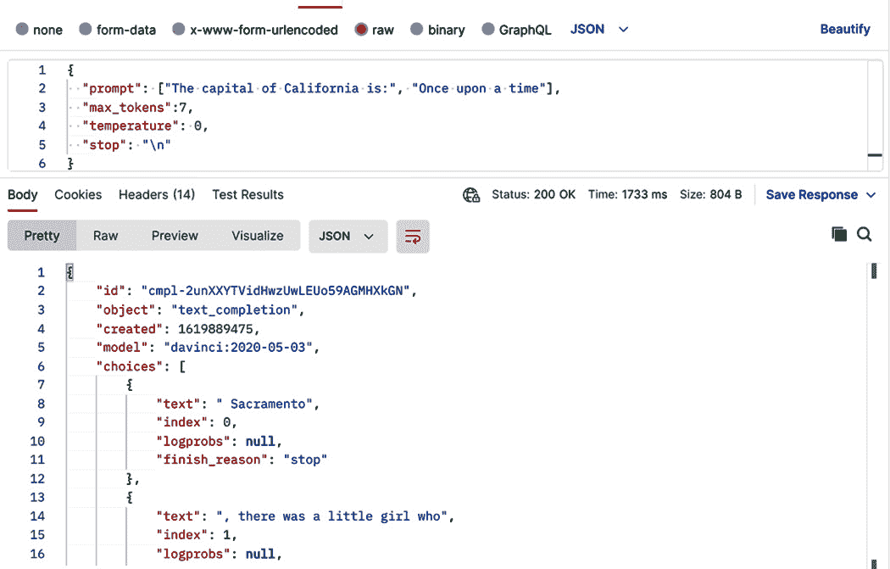

图 4.21 – 发送多个提示

从这个例子中得出的主要结论是，有一些事情你可以通过 API 做到，但在 Playground 中做不到。因此，了解如何使用 OpenAI API 使你能够超越 Playground 的功能。

API 中可以做但 Playground 中无法做的另一个例子是语义搜索。下面我们来看看这个。

# 使用语义搜索端点

在*第二章*，*GPT-3 应用与用例*中，我们讨论了语义搜索。简单回顾一下，语义搜索让你可以在提供的文档列表上执行类似 Google 的搜索。一个查询（一个词、短语、问题或语句）会与文档内容进行比较，以确定是否存在语义相似性。结果是每个文档的排名或得分。得分通常介于 0 和 300 之间，但有时会更高。一个更高的分数，超过 200，通常意味着文档在语义上与查询相似。

要使用 API 进行语义搜索，您需要向语义搜索端点发出 POST 请求。 就像创建补全端点一样，在请求主体中还需要包含一个 JSON 对象。 JSON 主体对象有两个元素-文档元素和查询元素。 文档元素是要搜索的文档数组，数组中的每个项目都是表示文档的字符串。 或者，可以在请求中引用预先上传的文件中提供的文档。 在*第九章*，*构建一个 GPT-3 驱动的问答应用程序*，我们将详细讨论如何使用文件。 然而，现在我们将重点放在通过端点请求提供文档。

一个文档可以是单词，句子，段落或更长的文本。 查询元素的值是包含将与文档进行搜索的搜索词或短语的字符串。 这可能是类似问题或陈述的一些东西。

再次，语义搜索根据其在语义上与一个或多个文档的相似性来对查询进行排名。 因此，这不一定是搜索相似单词。 例如，以下 JSON 对象提供了车辆（飞机，船，宇宙飞船或汽车）的列表作为文档，查询为`"带轮子的车辆"`：

```py
{
  "documents": [
    "plane",
    "boat",
    "spaceship",
    "car"
  ],
  "query": "A vehicle with wheels"
}
```

让我们看看上述 JSON 的结果会是什么样子。 我们将使用 Postman。 请记住，所有 OpenAI API 端点都需要授权，因此在 Postman 中，我们首先确保适当的授权设置得以展开。 从那里开始，步骤与发出对补全端点的请求是一样的：

1.  将请求类型设置为**POST**。

1.  输入**URI**端点。

1.  将主体设置为**原始**。

1.  选择**JSON**作为主体内容类型。

1.  输入 JSON 主体。

语义搜索端点 URI 是 `https://api.openai.com/v1/engines/{engine_id}/search`，其中 `{engine_id}` 被有效的引擎 ID（如 `davinci` 或 `ada`）替换。 在 Postman 中设置并提交 API 调用后，您应该看到类似以下截图的结果：

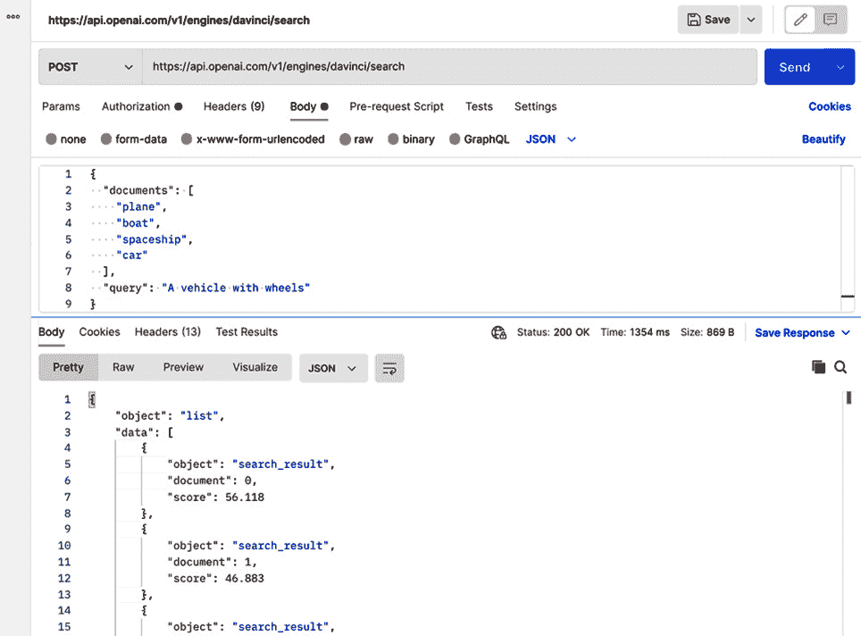

图 4.22 – 语义搜索结果

语义搜索端点返回的 JSON 对象包含三个元素：对象，数据和引擎。 数据元素的值是结果的 JSON 数组-每个文档的一个项目。 从我们之前对 JSON 的介绍中回忆，数组中的项目是有序的，意味着每个项目都可以用数字引用，第一个从零开始。 因此，在我们的例子中，以下值会适用：

+   `0` = 飞机

+   `1` = 船

+   `2` = 太空船

+   `3` = 汽车

知道每个文档都与一个数字值相关联后，当您查看从搜索 API 返回的以下结果时，您会发现文档 `3`（汽车）获得了最高分，因此代表了与语义最相似的文档：

```py
{
    "object": "list",
    "data": [
        {
            "object": "search_result",
            "document": 0,
            "score": 56.118
        },
        {
            "object": "search_result",
            "document": 1,
            "score": 46.883
        },
        {
            "object": "search_result",
            "document": 2,
            "score": 94.42
        },
        {
            "object": "search_result",
            "document": 3,
            "score": 178.947
        }
    ],
    "model": "davinci:2020-05-03"
}
```

数据数组中包含的是文档号而不是文档本身，因为文档本身可能是一长串文本，使用文档号更有效。因此，在匹配返回的结果与发送的文档时，您需要使用文档号。但当您使用代码进行操作时，这相对直接 – 这也是我们将在下一章开始的内容。

# 总结

在本章中，我们讨论了如何使用 OpenAI API。我们从介绍/回顾 API 是什么开始，然后熟悉了 HTTP 协议的基础知识。我们审查了 OpenAI API 的端点，并涵盖了如何使用 OpenAI API 密钥进行基本身份验证以访问 API，以及如何对具有对多个组织访问权限的帐户进行身份验证。然后，我们了解了 JSON 数据交换格式，然后学习了如何使用 Postman 对 Completions 端点、Engines 端点和 Semantic Search 端点进行 API 调用。

在下一章，我们将把本章学到的知识付诸实践，深入了解如何使用代码调用 API。
