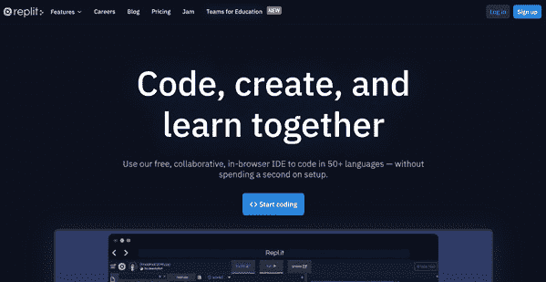

# 第五章：在代码中调用 OpenAI API

在上一章中，我们看了一下如何使用 Postman 调用 OpenAI API。在这一章中，你将学习如何在代码中开始使用 API。因为 OpenAI API 几乎可以与任何编程语言一起使用，我们将看一下两种流行的语言，JavaScript 和 Python。如果你不是程序员，没问题。我们将使用一个在线环境，让入门编程变得非常简单。而且，JavaScript 和 Python 都提供了易于跟随的代码示例，因此你可以选择最适合你的语言。此外，为了清晰起见，示例故意尽可能少地写代码。因此，示例可能并不总是遵循编码最佳实践，但目标是使跟随变得更容易！

本章将涵盖以下主题：

+   选择编程语言

+   介绍 replit.com

+   使用 Node.js/JavaScript 使用 OpenAI API

+   使用 Python 使用 OpenAI API

+   使用其他编程语言

# 技术要求

本章需要你可以访问**OpenAI API**。你可以通过访问以下网址请求访问权限：[`openai.com`](https://openai.com)。

# 选择编程语言

OpenAI API 是一个基于标准的 API，可用于几乎任何现代编程语言。在本章中，我们将介绍 JavaScript 和 Python 的例子。但这只是众多可用语言中的两种。选择 JavaScript 和 Python 是因为它们都非常受欢迎且易于上手。如果你精通其他现代编程语言，那可能是最好的选择。但如果你是新手，或者你的编程技能有些生疏，或者想尝试一种新语言，那么 JavaScript 和 Python 都是很好的选择。但是每种语言的例子都是相同的，只是编程语言不同。因此，你可以跳到你偏好的语言部分。或者，如果你感到有冒险精神，当然你可以尝试两种语言！

# 介绍 replit

在本章以及接下来的章节中，我们将会编写代码。因此，我们需要某种代码编辑器。就像编程语言一样，当涉及到代码编辑器时，有很多选择。选择正确的代码编辑器是一个个人偏好和观点问题。对于我们的例子，我们将使用来自[replit.com](http://replit.com)的在线代码编辑器。

虽然我们将要讨论的所有示例都可以在任何代码编辑器中完成，但 replit 可以让我们跳过安装和软件设置过程，因为我们可以在网页浏览器中完成所有操作。

此外，使用代码编辑器时，需要在本地计算机上进行一些设置。例如，JavaScript 和 Python 都需要安装运行环境。我们会跳过这些，这样就能更多时间专注于学习 GPT-3 和 OpenAI API。

那么，`replit.com` 是什么？它是一个基于浏览器的代码编辑器和**集成开发环境（IDE）**，让你可以在 50 多种编程语言中开始编码，而无需花费时间设置本地开发环境。所以，对于我们的示例，即使你的本地计算机没有设置好运行 Node.js 或 Python 的环境，你也可以立即开始编码。

下面的截图展示了 replit 的主页，如果你还没有，则可以在这里免费注册一个 replit 账户：



��5.1 – replit 主页

创建一个账户只需要点击注册按钮并完成注册过程。在本书的示例中，你只需要一个免费账户。

在你注册完后，你将登录到默认的主页，如*图 5.2*所示：


图 5.2 – Replit 默认主页

从这里，我们将创建两个代码项目，它们在 replit 中被称为**repl**。

## 创建一个 repl

我们将会查看 JavaScript 和 Python 的代码示例。所以，我们需要分别为两种语言设置 repl。对于 JavaScript，我们将会使用**Node.js**（或者简称为 Node），它是 JavaScript 的运行环境。我们会在*使用 Node.js/JavaScript 调用 OpenAI API*部分详细讨论 Node.js。首先，我们会创建一个 Python 的 repl。然后，再创建一个 Node.js/JavaScript 的 repl。

### 为 Python 创建一个 repl

让我们从为 Python 创建一个新的 repl 开始。如果你更喜欢只使用 Node.js/JavaScript 进行示例，你可以直接跳到*为 Node.js 创建一个 repl*。

从主页，点击**+ New Repl**按钮：

1.  从 repl 类型下拉菜单中选择 Python。

1.  将 repl 命名为 `exploring-gpt3-python`。

1.  点击**创建 repl**按钮。

接下来，我们将为 Node.js 创建一个 repl。如果你只会使用 Python，你可以跳过下一部分。

### 为 Node.js 创建一个 repl

如果你跟着做 Node.js 实例，你将需要一个 Node repl。要创建一个 Node repl，按照以下步骤。从主页，点击**+ New Repl**按钮：

1.  从 repl 类型下拉菜单中选择 Node.js。

1.  将 repl 命名为 `exploring-gpt3-node`。

1.  点击**创建 repl**按钮。

下面的截图展示了为 Python 创建一个新的 repl。同样的，对于 JavaScript，你会选择 Node.js 而不是 Python，然后将 repl 命名为 `exploring-gpt3-node`：


图 5.3 – 设置 Python 的 repl

创建完 repl 后，你会自动被重定向到 replit 编辑器，里面已经加载了你的新 repl。编辑器分为三个窗格：**导航**窗格、**代码编辑**窗格和**输出**窗格。新的 repl 包括一个默认文件，当你第一次访问 repl 时会在代码编辑器（中间窗格）打开。

对于 Python 项目， 默认文件命名为`main.py`; 对于 Node.js 项目，默认文件命名为`index.js`。以下屏幕截图显示了在编辑器窗格中打开的`main.py`的 replit 编辑器。Node.js repl 看起来相同，但默认文件名为`index.js`而不是`main.py`：


图 5.4 - 具有默认 Python repl 的 Replit 编辑器

默认文件是默认情况下在单击**Run**按钮时运行的代码文件。运行按钮位于位于三个编辑窗格正上方的顶部导航栏中间。然后，在 replit 控制台 - 右侧的输出窗格中显示代码的结果或输出。

重要提示

默认文件在首次创建 repl 时为空，因此单击**Run**按钮不会执行任何操作，直到您编写一些代码为止。

在三个编辑窗格的上方导航栏左侧是一个汉堡菜单（看起来像是叠在一起的线条的图标）。如果您点击该图标，则会显示主导航选项。您可以使用此菜单通过选择**我的 repls**菜单并选择要打开的 repl 来在 repl 之间导航。

以下屏幕截图显示了选定了**我的 repls**选项的主菜单：


图 5.5 - 访问主导航菜单

为您想要使用的语言创建 repl（或两种语言），您将需要将您的 OpenAI API 密钥存储为环境变量。

## 将您的 OpenAI API 密钥设置为环境变量

环境变量是可以在代码中访问但不会与其他人共享的命名值。通常，您使用环境变量来设置私有或特定于用户的参数值，例如，您的 OpenAI API 密钥。

在 replit 中，您可以通过单击导航窗格中的挂锁图标（**Secrets**）并添加名称和值对来保存环境变量。您需要为您正在使用的每个 repl 进行此操作 - 因此，在您的**exploring-gpt3-node** repl 和/或**exploring-gpt3-python** repl 中的一个中都需要这样做。要将您的 OpenAI API 密钥添加为环境变量，请执行以下操作：

1.  打开您的 repl。

1.  单击导航窗格中间的挂锁图标（**Secrets**），如下面的屏幕截图所示：

    图 5.6 - 在 Replit 中添加新的秘密/环境变量

1.  在`OPENAI_API_KEY`中。

1.  在**Value**输入文本区域中，粘贴您的 OpenAI API。

1.  单击**Add new secret**按钮。

同样，如果您要跟随 Node.js 和 Python 进行操作，则需要向每个 repl 添加**OPENAI_API_KEY**秘密/环境变量。因此，如果您同时跟随两者，您将完成上述步骤两次。

重要提示

如果您使用的是 replit.com 的免费版本，默认情况下，您的代码将是公开的。但是，`secrets/environment` `variables` 不会被公开共享，但可以被明确邀请到 repl 的合作人员看到。这很重要，因为您不希望共享或意外暴露您的 OpenAI API 密钥。要了解更多关于在 replit 中使用秘密和环境变量的信息，访问[`docs.replit.com/repls/secret-keys`](https://docs.replit.com/repls/secret-keys)。

在开始编码之前，我们需要创建一个特殊的文件，即`.replit`文件。

## 理解并创建`.replit`文件。

在 replit 中，默认情况下，当您单击时，`main.py` 文件将为 Python repl 运行，`index.js` 文件将为 Node.js repl 运行。但是，您可以创建一个名为`.replit`的文件，并更改由`.replit`文件执行的代码文件。要创建`.replit`文件，请执行以下操作：

1.  打开您的 repl。

1.  单击导航窗格右上角的添加文件图标。

1.  将文件命名为`.replit`。

1.  将以下文本添加到`.replit`文件的第一行中：

    **对于 Python repl**：

    ```py
    run = "python main.py"
    ```

    **对于 Node.js repl**：

    ```py
    run = "node index.js"
    ```

您可能已经注意到，我们刚刚添加了要按默认方式运行的文件的说明。现在没问题，稍后我们将回来编辑我们`.replit`文件中的`run`语句。

当您为 Node.js 或 Python 创建 repl，并将您的 OpenAI API 密钥添加为环境变量，并添加一个`.replit`文件后，您就可以开始编码了。因此，在下一节中，我们将看一下使用 Node.js/JavaScript 的示例。但是，如果您只是在 Python 方面跟着做，您可以直接跳到*在 Python 中使用 OpenAI API*。

# 使用 Node.js/JavaScript 调用 OpenAI API

JavaScript 是我们要看的第一种编程语言。JavaScript 最初是为在网页上编写脚本功能而创建的。然而，如今，JavaScript 可以用于几乎任何类型的应用程序开发，从构建网站和移动应用程序到创建命令行工具、聊天机器人和语音助手 - 这一切都归功于 Node。如前所述，Node 是 JavaScript 的运行时环境。它使我们能够在网页浏览器之外使用 JavaScript。

JavaScript 和 Node.js 都是免费使用的，并且可以在 Linux、macOS 和 Windows 操作系统上运行。但我们不会安装 Node.js，也不会在本地运行任何东西，因为我们所有的代码都将在 replit 上运行。但是，我们将编写的代码中没有任何与 replit 有关的依赖。因此，我们将要做的所有事情都可以在任何为 Node 开发正确配置的环境中完成。

好了，让我们开始编码。为了在 Node 中使用 OpenAI API，我们基本上只需做和*第四章*，*与 OpenAI API 一起工作*一样的步骤 – 对 OpenAI API 端点进行身份验证的 HTTP 请求。但是我们不会使用 Postman，而是会使用 JavaScript 进行 HTTP 请求。我们将从最简单的例子开始 – 调用 engines 端点。

## 调用 engines 端点

我们将首先设置一个新的文件夹来进行本章的工作。然后，我们将添加一个文件作为我们第一个示例，并更新 `.replit` 文件，以便 replit **Run** 按钮执行我们的新文件。以下是要遵循的步骤：

1.  打开您的**exploring-gpt3-node** repl。

1.  点击导航窗格右上角的**添加文件夹**图标。

1.  命名文件夹为 `chapter05`。

1.  选择 `chapter05` 文件夹，然后单击 `engines.js`。

1.  编辑 `.replit` 文件，使 `chapter05/engines.js` 使用以下文本：

    ```py
    run = "node chapter05/engines.js"
    ```

1.  现在，通过单击导航窗格中的文件名来打开您的 replit 编辑器中的 `chapter05/engines.js` 文件。您的 replit 编辑器应该看起来类似以下屏幕截图：

    图 5.7 – 在 Replit 编辑器中编辑 engines.js

1.  现在，我们要编写一些代码调用 `https://api.openai.com/v1/engines`。有许多种方式可以使用 Node 和 JavaScript 进行 HTTP 请求。我们不会详细介绍所有不同选项或一个方法优于另一个方法的优点和缺点。我们只会使用一个流行的代码库（称为 `axios`）。

    重要提示

    Node.js 中打包和共享的代码库在大多数现代编程语言中都很常见。在 Node.js 中，包（或模块）最常使用一个名为 npm 的包管理器共享。要了解更多关于 npm 的信息，您可以访问 [`npmjs.com`](https://npmjs.com)。replit 自动管理 Node.js 项目的包依赖关系。但是，在本地开发环境中，通常使用 Npm 命令行工具来管理代码中使用的包。

1.  简而言之，`axios` 模块最大程度地减少了我们使用 JavaScript 进行 HTTP 请求时需要编写的代码。因此，我们将在我们的 `engines.js` 文件的第一行包含对 `axios` 模块的引用，代码如下：

    ```py
    const axios = require('axios);
    ```

1.  你会记得*第四章*, *与 OpenAI API 一起工作*，所有 OpenAI API 端点都需要授权。因此，在下一行，我们将添加一个变量来保存我们的 OpenAI API 密钥。但是，我们不会硬编码数值，而是从我们设置的环境变量中获取：

    ```py
    const apiKey = process.env.OPENAI_API_KEY;
    ```

1.  接下来，我们将创建一个内部 HTTP 客户端来进行请求。`axios` 模块使这变得非常简单。为了创建 HTTP 客户端实例，我们将添加以下代码：

    ```py
    const client = axios.create({
        headers: { 'Authorization': 'Bearer ' + apiKey }
    });
    ```

    请注意，在上述代码中，我们添加了一个使用我们的 OpenAI API 密钥作为令牌的 HTTP `Authorization`头。这样，`axios`客户端可以对 API 端点进行身份验证请求。现在剩下的只是实际发出请求的代码。以下是该代码的样子：

    ```py
    client.get('https://api.openai.com/v1/engines')
      .then(result => {
        console.log(result.data);
    }).catch(err => {
        console.log(err.message);
    });
    ```

    在上述代码中，我们使用`axios`客户端实例向`https://api.openai.com/v1/engines`端点发出 GET 请求。然后，我们将从端点返回的结果记录到控制台中。或者，在出现错误时，我们将错误消息记录到控制台中。

1.  此时，您应该能够在 replit 中单击**运行**按钮，并在 replit 控制台中看到结果，在那里会有一个如下所示的输出：


图 5.8 – 运行 engines.js 代码的结果

因此，我们使用了 12 行代码（实际上是 11 行，因为有一行是空的），我们使用 JavaScript 和 Node 进行了我们的第一个 API 请求。

现在让我们看看如何调用 Completions 端点。这个稍微复杂一些，因为我们需要向端点发送数据。但是，代码仍然非常简单。

## 调用 Completions 端点

现在我们将看看如何调用完成端点。我们将首先在`chapter05`文件夹中创建一个名为`completions.js`的新文件，并编辑我们的`.replit`文件，以便**运行**按钮将执行我们的新文件。要做到这一点，请按照以下步骤操作：

1.  打开您的**exploring-gpt3-node** repl。

1.  在导航窗格中选择`chapter05`文件夹。

1.  单击`completions.js`。

1.  编辑`.replit`文件，以便使用以下文本`chapter05/completions.js`：

    ```py
    run = "node chapter05/completions.js"
    ```

1.  接下来，将`chapter05/engines.js`中的前五行代码复制到`chapter05/completions.js`中，以便您的`completions.js`文件以以下代码开始：

    ```py
    const axios = require('axios');
    const apiKey = process.env.OPENAI_API_KEY;
    const client = axios.create({
        headers: { 'Authorization': 'Bearer ' + apiKey }
    });
    ```

    对于 Completions 端点，我们将发送参数。因此，我们接下来要做的是添加将成为 HTTP 正文中发送的 JSON 对象。请回想一下*第四章*，*使用 OpenAI API*，Completions 端点接受许多参数。但是，对于本示例，我们只发送`prompt`参数和`max_tokens`参数。以下是代码的样子：

    ```py
    const completionParams = {
      "prompt": "Once upon a time", 
      "max_tokens": 10
    }
    ```

    现在我们只需实际发出请求。这一次我们将进行 HTTP POST 请求并传递参数。因此，代码与上一个示例略有不同，但看起来像这样：

    ```py
    client.post('https://api.openai.com/v1/engines/davinci/completions', completionParams)
      .then(result => {
      console.log(result.data);
    }).catch(err => {
      console.log(err);
    });
    ```

    就这样。现在当您在 replit 中单击**运行**按钮时，您应该会从 Completions 端点收到一个类似以下截图的结果：


图 5.9 – Completions.js 的输出

正如我们在*第四章*中所讨论的，*使用 OpenAI API*，从端点返回的响应是以 JSON 格式返回的。但是，如果您想要格式化输出，您可以从 JSON 中提取您想要显示的内容。例如，您可以使用以下代码更新`console.log(result.data)`以显示 API 返回的原始提示文本`从前，有一只...`和完成文本：

```py
console.log(completionParams.prompt + result.data.choices[0].text);
```

如果您进行了更改并再次运行代码，则输出将类似于以下截图中的输出：


图 5.10 – 来自 completions.js 的格式化结果

仅仅通过两个示例，我们就介绍了您需要使用所有 OpenAI 端点的基本代码。但在我们继续之前，让我们看一看使用搜索端点的另一个示例。

## 调用搜索端点

对于我们的搜索示例，我们将在`chapter05`文件夹中创建一个名为`search.js`的新文件，并编辑我们的`.replit`文件，以便`chapter05/search.js`。要实现这一点，请按照以下步骤进行：

1.  打开您的**exploring-gpt3-node** repl。

1.  在导航窗格中选择`chapter05`文件夹。

1.  点击`search.js`。

1.  编辑`.replit`文件，使`chapter05/search.js`使用以下`run`命令：

    ```py
    run = "node chapter05/completions.js"
    ```

1.  接下来，将`chapter05/engines.js`中的前五行代码复制到`chapter05/search.js`中，使您的`search.js`文件以以下代码开始：

    ```py
    const axios = require('axios');
    const apiKey = process.env.OPENAI_API_KEY;
    const client = axios.create({
        headers: { 'Authorization': 'Bearer ' + apiKey }
    });
    ```

1.  对于搜索端点，我们将发送参数。因此，接下来我们将添加即将发送到 HTTP 主体中的 JSON 对象。在*第四章*中，我们讨论了搜索端点的参数，但以下是我们将在此示例中使用的代码：

    ```py
    const data = {
      "documents": ["plane", "boat", "spaceship", "car"],
      "query": "A vehicle with wheels"
    }
    ```

1.  剩下的就是实际发出请求。就像完成示例一样，我们将进行 HTTP POST 并传递我们的参数：

    ```py
    client.post('https://api.openai.com/v1/engines/davinci/search', data)
      .then(result => {
        console.log(result.data);
      }).catch(err => {
        console.log(err);
      });
    ```

1.  就这样。现在，当您在 replit 中点击**运行**按钮时，您应该会从搜索端点获得类似以下截图的结果：


图 5.11 – 来自 search.js 的结果

我们在本节中讨论的所有 JavaScript 示例都相当简单。但是，它们应该给您一个使用 JavaScript 和 Node.js 开始调用 OpenAI API 的一般思路，这正是我们的目标。在接下来的章节中，我们将更深入地讨论，但现在我们将转向我们的下一个语言–Python。

# 使用 Python 中的 OpenAI API

Python 是另一种流行的编程语言，在机器学习社区中尤其受欢迎。 这是一种强大的语言，但也非常适合初学者。 如果你是第一次编程，那么 Python 可能是最容易入门的语言之一。 与 JavaScript/Node 一样，Python 是开源的，可以在 Linux、macOS 或 Windows 上使用。 它还包含在许多操作系统中，包括 macOS 和大多数 Linux 发行版。 但由于我们将在 replit 中工作，所以不需要担心 Python 是否安装在我们的本地机器上。 也就是说，我们将要编写的代码中没有任何依赖于 replit 特定内容的地方。 因此，我们将在任何正确配置用于 Python 开发的计算机上完成所有工作。

对于我们的第一个示例，我们将看一下如何使用 Python 调用 OpenAI Engines 端点。

调用 engines 端点

我们将通过为本章中即将开发的 Python 代码设置一个新文件夹开始。 然后，我们将添加一个文件作为我们的第一个示例，并更新`.replit`文件，以便 replit **Run** 按钮可执行我们的新文件。 应按照以下步骤操作：

1.  打开你的**exploring-gpt3-python** replit。

1.  点击导航窗格右上角的**添加文件夹**图标。

1.  将文件夹命名为`chapter05`。

1.  选择`chapter05`文件夹，然后点击`engines.py`。

1.  编辑`.replit`文件，使得`chapter05/engines.py`使用以下文本：

    ```py
    run = "python chapter05/engines.py"
    ```

1.  现在，通过导航窗格中点击文件名，在 replit 编辑器中打开`chapter05/engines.py`文件。 您的 replit 编辑器应该看起来类似于以下截图：

    图 5.12 – 在 Replit 编辑器中编辑 engines.py

1.  现在，我们将编写一些 Python 代码，以向`https://api.openai.com/v1/engines`端点发出 HTTP 请求。 有许多方法可以使用 Python 发出 HTTP 请求。 我们不会深入探讨所有不同的选项，或者一种方法胜过另一种方法的利弊。 我们只是将使用流行的`requests`库。

    重要提示

    包装和共享的代码库在大多数现代编程语言中很常见。 在 Python 中，包（或库）通常使用一个名为 PIP 的软件包管理器进行共享。 要了解有关 PIP 的更多信息，您可以访问[`pypi.org/project/pip/`](https://pypi.org/project/pip/)。 replit 自动管理 Python 项目的软件包依赖关系。 但是，在本地开发环境中，常用的是使用 PIP 命令行工具来管理 Python 包。

1.  简而言之，`requests`库最大程度地减少了我们需要编写的代码，以使用 Python 进行 HTTP 请求。 因此，我们将在我们的`engines.py`文件的第一行包含对`requests`库的引用，代码如下所示：

    ```py
    import requests
    ```

1.  你可能还记得*第四章*，*使用 OpenAI API*，OpenAI API 的所有端点都需要授权。所以下一步我们将添加一些代码来获取我们在`.env`文件中设置的 API 密钥，并将其保存到一个变量中。我们将使用以下行来做到这一点：

    ```py
    import os
    apiKey = os.environ.get("OPENAI_API_KEY")
    ```

1.  接下来，我们将创建一个名为`headers`的变量来保存我们的授权信息，这些信息将被用于发起 HTTP 请求：

    ```py
    headers = {
        'Authorization':'Bearer ' + apiKey
        }
    ```

1.  现在我们所需要做的就是发起请求。我们将使用以下代码来做到这一点，并将响应保存到一个名为`result`的变量中：

    ```py
    result = requests.get('https://api.openai.com/v1/engines'
    ,headers=headers)
    ```

1.  为了在控制台中显示 JSON 结果，我们将添加最后一行，如下所示：

    ```py
    print(result.json())
    ```

1.  在这一点上，你应该能够在 replit 中点击**Run**按钮，在 replit 控制台中看到结果，并看到一个类似以下截图的输出：


图 5.13 – 运行 engines.py 代码的结果

所以，用 12 行代码（实际上是 9 行，因为有三行是空白行），我们已经使用 Python 发起了我们的第一个 API 请求。现在让我们来看一下调用 Completions 端点。这个端点需要更多的代码，因为我们需要向端点发送数据。但正如你将看到的，这还是相当简单的。

## 调用 completions 端点

我们将从在`chapter05`文件夹中创建一个名为`completions.py`的新文件开始。然后我们将编辑我们的`.replit`文件，使`chapter05/completions.py`。要做到这一点，请按照以下步骤操作：

1.  打开你的**exploring-gpt3-python** repl。

1.  在导航窗格中选择`chapter05`文件夹。

1.  点击`completions.py`。

1.  编辑`.replit`文件，使`chapter05/completions.py`使用以下文本：

    ```py
    run = "python chapter05/completions.py"
    ```

1.  接下来，我们将添加以下代码。它与`chapter05/engines.py`中的起始代码非常相似，但我们需要添加`json`库和`Content-Type`头。所以，你的`completions.py`文件应该以以下代码开头：

    ```py
    import requests
    import os
    import json
    apiKey = os.environ.get("OPENAI_API_KEY")
    headers = {
        'Content-Type': 'application/json',
        'Authorization':'Bearer ' + apiKey
        }
    ```

1.  对于 completions 端点，我们将发送参数。所以下一步我们要做的就是添加即将成为发送到 HTTP 主体的 JSON 对象。回想一下*第四章*，*使用 OpenAI API*，completions 端点接受许多参数。但是对于这个示例，我们只会发送`prompt`参数和`max_tokens`参数。代码如下所示：

    ```py
    data = json.dumps({
        "prompt":"Once upon a time",
        "max_tokens":15
        })
    ```

    为了使代码更易读，我们还将使用以下代码创建一个端点 URL 的变量：

    ```py
    url = 'https://api.openai.com/v1/engines/davinci/completions'
    ```

1.  唯一剩下的就是实际发起请求并打印出结果。这次，我们将进行 HTTP POST，并传递我们的参数。所以，代码与上一个示例略有不同，但看起来像这样：

    ```py
    result = requests.post(url,headers=headers,data=data)
    print(result.json())
    ```

1.  就这样。现在当你点击 replit 中的**Run**按钮时，你应该会从 completions 端点得到一个结果，类似于以下截图所示：

    图 5.14 – completions.js 的输出

1.  正如我们在*Chapter 4*中讨论的，*使用 OpenAI API*，从端点返回的响应是 JSON 格式的。但是如果你想格式化输出，你可以从 JSON 中提取你想要显示的内容。例如，你可以使用以下代码更新 `console.log(result.data)`，以显示 API 返回的原始提示文本 `Once upon a time` 和完成文本：

    ```py
    console.log(completionParams.prompt + result.data.choices[0].text);
    ```

1.  如果您进行了这些更改并再次运行代码，则控制台输出应该与以下截图中的输出类似：


图 5.15 – completions.py 的格式化结果

好的，让我们看一个更多的例子。这次我们将使用 Python 调用搜索端点。

## 调用搜索端点

对于我们的搜索示例，我们将在 `chapter05` 文件夹中创建一个名为 `search.py` 的新文件，并且我们将编辑我们的 `.replit` 文件，以便 `chapter05/search.py`。要做到这一点，请按照以下步骤进行：

1.  打开你的 **exploring-gpt3-python** repl。

1.  在导航面板中选择 `chapter05` 文件夹。

1.  点击 `search.py`。

1.  编辑 `.replit` 文件，使运行按钮执行 `chapter05/search.py`，使用以下 `run` 命令：

    ```py
    run = "python chapter05/search.py"
    ```

1.  接下来，将 `chapter05/completions.py` 中的前九行代码复制到 `chapter05/search.py` 中，这样你的 `search.py` 文件将以以下代码开头：

    ```py
    import requests
    import os
    import json
    apiKey = os.environ.get("OPENAI_API_KEY")
    headers = {
        'Content-Type': 'application/json',
        'Authorization': 'Bearer ' + apiKey
    }
    ```

1.  对于搜索端点，我们将像在 `chapter05/completions.py` 中那样发送参数。所以，我们接下来要做的就是添加将成为 HTTP 正文中发送的 JSON 对象。在*Chapter 4*中，*使用 OpenAI API*，我们涵盖了搜索端点的参数，我们将使用相同的示例 – 这是我们将使用的代码：

    ```py
    data = json.dumps({
        "documents": ["plane", "boat", "spaceship", "car"],
        "query": "A vehicle with wheels"
    })
    ```

1.  我们将添加一个变量来存储端点 URL，以便代码更容易阅读一些：

    ```py
    url = 'https://api.openai.com/v1/engines/davinci/search'
    ```

1.  最后，我们将添加代码来发起请求并打印结果：

    ```py
    result = requests.post(url, headers=headers, data=data)
    print(result.json())
    ```

1.  就这样。现在，当你点击 replit 中的 **Run** 按钮时，你应该会从完成端点得到一个类似以下截图的结果：


图 5.16 – search.py 的结果

本节的目标是提供一些简单的 Python 示例，调用 OpenAI API。到目前为止，我们已经涵盖了基础知识，但在接下来的章节中，我们将看到更深入的例子。

# 使用其他编程语言

在本章中，我们只看了使用 JavaScript 和 Python 的代码示例。但再次强调，几乎任何现代编程语言都可以使用。OpenAI API 是一个基于标准的 HTTP API，所以你只需要一种能够发起 HTTP 请求并处理 JSON 的语言，而这几乎包括所有现代编程语言。

此外，在本章的示例中，我们直接使用通用的 HTTP 库调用 API。我们也可以使用专为 OpenAI API 构建的库。JavaScript、Python 和其他语言包括 C#/.NET、Go、Java 和 Unity 都存在多个库。您可以在[`beta.openai.com/docs/developer-quickstart/community-libraries`](https://beta.openai.com/docs/developer-quickstart/community-libraries)找到社区维护的库列表。

库可以简化与 OpenAI API 的使用。然而，了解如何直接调用端点以及 API 的使用相当简单是很有帮助的。出于这些原因，我们将在本书的所有示例中直接使用 API。

# 总结

在本章中，我们在代码中使用了 OpenAI API。我们首先介绍了在浏览器中使用的集成开发环境 replit。然后，我们看了一下调用引擎端点、完成端点和搜索端点的代码示例，使用了 Node.js/JavaScript 和 Python。最后，我们讨论了其他可以使用的语言和可以简化与 OpenAI API 集成工作的库。

在下一章中，我们将讨论内容过滤，并查看使用 JavaScript 和 Python 实现内容过滤的代码示例。
