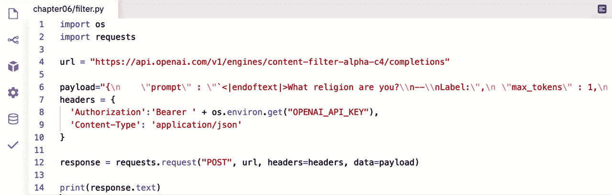

# 第七章：内容过滤

在*第一章*中，*介绍 GPT-3 和 OpenAI API*，我们简要提到了一个内容过滤模型，用于识别潜在的冒犯或有害语言。我们还讨论了 GPT-3 有时会生成一些可能被一些人认为不当或伤害的完成。在本章中，您将学习如何实现内容过滤，以防止您的应用程序用户看到冒犯性或可能有害的完成。

本章我们将涵盖以下主题：

+   预防不当和冒犯性结果

+   了解内容过滤

+   测试内容过滤过程

+   使用 JavaScript 进行内容过滤

+   使用 Python 进行内容过滤

# 技术要求

本章要求您能够访问**OpenAI API**。您可以通过访问[`openapi.com`](https://openapi.com)来请求访问权限。

# 预防不当和冒犯性结果

有时，GPT-3 会生成一些被一些用户认为不当的文本。这可能是粗话、含有不当的种族、宗教或政治用语，或者性不当/露骨的内容，或者性质黑暗或暴力的文本。这并不是因为 GPT-3 试图恶意或伤害别人——它只是一个根据统计概率生成文本的语言模型——它没有*恶意*或*不当*的概念。但 GPT-3 是使用互联网数据进行训练的，而互联网上不幸存在大量冒犯性内容。因此，模型有时会生成不适当的内容。值得庆幸的是，作为开发者，我们可以采取措施防止用户看到 GPT-3 可能生成的不适当响应。

避免不适当内容的最简单方法是利用您的提示文本来引导模型避免生成可能不适当的结果。一般来说，GPT-3 会模仿提示的结构和内容。因此，您可以通过告诉模型完成应该友好或礼貌，来引导模型远离可能的不适当结果，例如。但是无论如何，您都需要测试。例如，“友好”这样的词也可能导致性内容。因此，请使用提示来引导模型，并根据您看到的结果来精确控制措辞。

为了说明，这里有两个假设客服问题的示例提示和相关完成。在示例中，**#$%@!** 用于代替原始提示和完成中使用的脏话（诅咒词）。

+   示例 1:

    提示:

    ```py
    Customer: Where the #$%@! is my order! I placed the order more than three days ago. How long can it take to package and ship a #$%@! tee-shirt?
    Response: 
    ```

    完成:

    ```py
    I don't know. This is my first #$%@! day on the job. If you want, I can call you a #$%@! taxi so you can come pick up your #$%@! Order.
    ```

+   示例 2:

    提示:

    ```py
    Customer: Where the #$%@! is my order! I placed the order more than three days ago. How long can it take to package and ship a #$%@! tee-shirt?
    Polite Response: 
    ```

    完成:

    ```py
    It can take up to 5 business days for in stock t-shirts to be processed. You ordered three t-shirts and each shirt takes a different amount of production time to be produced. There were some complications with your order but as of today your t-shirts should be fully prepared for shipping. 
    ```

两个提示之间的唯一区别是，第二个示例末尾包含*Polite Response:*，而不仅仅是*Response:*。这足以指导模型生成更适当语言的回应。为了进一步指导模型，您还可以提供一个或多个对于攻击性或不礼貌客户问题的样本，以便提供有礼貌回应。

这里的关键是提示是最小化不适当回应的第一种，也是最容易的方法。

另一种防止不当完成的方法是限制完成的返回内容。例如，如果你正在对文本进行分类或总结，模型将在结果中包含的内容方面受到限制。

在不受约束的完成情况下，例如，如果你为聊天机器人生成回应，你将希望使用内容过滤，这将在接下来进行讨论。此外，零-shot 提示，没有示例，很可能会导致不可预测的完成。

# 了解内容过滤

内容过滤是指阻止或隐藏可能被视为冒犯、不当或甚至危险的内容。在我们的情况下，我们谈论的是 GPT-3 生成的内容，我们不希望我们的应用用户看到的内容。

为了过滤潜在的冒犯或不安全的文本，我们需要编写一小段代码来评估 GPT-3 生成的文本，并对其进行安全、敏感或不安全的分类。Cool 的地方在于我们可以使用 GPT-3 来进行分类。因此，这有点像自我管理，但在一定程度上依靠我们的代码进行辅助。

从高层次上看，这是我们如何使其工作的方式：

1.  GPT-3 对提示生成一个完成。

1.  完成的文本被提交回 GPT-3 过滤引擎。

1.  过滤引擎返回一个分类（安全、敏感、不安全）。

1.  根据分类，原始完成文本被屏蔽或发送回用户。

1.  可选地，如果完成文本是敏感的或不安全的，可以生成一个新的安全完成并发送，而用户并不知道某些内容被屏蔽了。

内容过滤是使用完成的端点进行的。然而，需要使用专门的内容过滤引擎以及一些特定设置和特殊格式的提示。

在撰写本文时，可用的内容过滤引擎为**content-filter-alpha-c4**。因此，我们将在该引擎的 URL 中使用用于完成的端点，如[`api.openai.com/v1/engines/content-filter-alpha-c4/completions`](https://api.openai.com/v1/engines/content-filter-alpha-c4/completions)。

重申一遍，需要在 API 请求中包含一些特定参数的具体要求。具体来说，我们需要包括以下参数和相关数值：

+   `1`

+   `0.0`

+   `0`

最后，内容过滤的提示必须以特定方式格式化。提示格式为`"<|endoftext|>[prompt]\n--\nLabel:"`。`[prompt]`部分将被替换为我们希望内容过滤器评估的文本。

重要说明

在发布时，内容过滤处于 beta 阶段。很有可能引擎 ID 在您阅读此文时已更改。因此，请务必查看位于 [`beta.openai.com/docs/engines/content-filter`](https://beta.openai.com/docs/engines/content-filter) 的 OpenAI 内容过滤器文档。

因此，这是我们将发布到完成端点的 JSON 的一个示例。在此示例中，我们正在评估的文本是 *从前有座山*：

```py
{
    "prompt": "<|endoftext|>Once upon a time\n--\nLabel:",
    "max_tokens": 1,
    "temperature": 0.0,
    "top_p": 0
}
```

可以相当肯定地假设 *从前有座山* 会被视为安全的。因此，如果那是我们要应用过滤器的文本，我们可以期望得到类似以下示例的响应，显示文本是 0 - 安全的：

```py
{
    "id": "cmpl-2auhZQYDGJNpeyzYNwMEm5YsAAUEK",
    "object": "text_completion",
    "created": 1615150445,
    "model": "toxicity-double-18",
    "choices": [
        {
            "text": "0",
            "index": 0,
            "logprobs": null,
            "finish_reason": "length"
        }
    ]
}
```

注意，在 JSON 响应对象中，有一个名为**choices**的元素。该元素包含一个对象的 JSON 数组。每个对象都包含一个文本属性，该属性将表示一个完成的内容过滤分类。其值始终是以下之一：

+   **0 – 安全**：文本中似乎没有任何可能引起冒犯或不安全的地方。

+   **1 – 敏感**：敏感话题可能包括具有政治、宗教、种族或国籍相关内容的文本。

+   **2 – 不安全**：文本包含一些人认为是刻薄的、伤人的、明确的、冒犯的、亵渎的、偏见的、仇恨的语言，或者大多数人认为**不适合工作**（**NSFW**）的语言，或者可能以有害方式描绘某些群体/人的语言。

一个数组被发送回 choices 元素，因为可能一次发送多个提示。例如，如果您想要查看句子中的任何单词是否不安全，您可能会将句子拆分为一个单词的数组，并将每个单词作为提示发送。以下是将 *Oh hi* 作为两个提示发送 - 每个单词一个的请求的示例：

```py
{
    "prompt": [
"<|endoftext|>Oh\n--\nLabel:",
"<|endoftext|>hi\n--\nLabel:"
],
    "max_tokens": 1,
    "temperature": 0.0,
    "top_p": 0
}
```

鉴于前面的示例，使用提示数组，您将看到类似以下的响应。现在请注意，choices 数组中有多个对象 - 每个单词/提示一个：

```py
{
    "id": "cmpl-2bDTUPEzoCrtNBa2gbkpNVc1BcVh9",
    "object": "text_completion",
    "created": 1615222608,
    "model": "toxicity-double-18",
    "choices": [
        {
            "text": "0",
            "index": 0,
            "logprobs": null,
            "finish_reason": "length"
        },
        {
            "text": "0",
            "index": 1,
            "logprobs": null,
            "finish_reason": "length"
    ]
}
```

choices 数组具有从零开始的索引值，该值对应于传入的提示数组中项目的索引，这意味着第一个提示/单词（在我们的示例中是“*Oh*”）的 choices 对象具有索引值 0。在此示例中，我们只发送了两个单词（“*Oh*”和“*hi*”），并且两者都被分类为 0（安全）。但是，如果您将其中一个单词更改为您喜欢的（或最不喜欢的）脏话，您会看到分类将更改为 2（不安全），其索引对应于您更改的单词（假设您使用的脏话大多数英语为母语的人会觉得冒犯）。

另一件需要牢记的事情是，过滤引擎并不是 100%准确，而是更倾向于谨慎。因此，您可能会看到误报 - 一些实际上是安全的单词被标记为敏感或不安全的情况。这可能是您在 Playground 中已经看到的情况。甚至提及政治或宗教等话题通常会被标记。小心总比后悔要好，但您需要考虑这可能如何潜在影响到您的应用程序。

因此，简要总结一下，您可以使用 OpenAI API 完成端点来对潜在的敏感或不安全文本进行分类。您只需要执行以下操作：

1.  使用内容过滤引擎。

1.  将`max_tokens`设置为`1`，`temperature`设置为`0.0`，`top_p`设置为`0`。

1.  将您的提示格式化为`"<|endoftext|>your text here\n--\nLabel:"`。

好了，让我们使用 Postman 熟悉一下内容过滤的工作原理。

# 测试内容过滤流程

在本章后面，我们将会在代码中创建一个简单的内容过滤。但在此之前，让我们使用 Postman 测试一下通用的内容过滤方法：

1.  登录[Postman.com](http://Postman.com)。

1.  打开我们在*第四章*中创建的 Exploring GPT-3 工作空间，*使用 OpenAI API*。

1.  创建一个名为**第六章**的新 Postman 集合。

1.  创建一个名为**内容过滤 - 示例 1**的新请求。

1.  将请求类型设置为**POST**，并将请求 URL 设置为[`api.openai.com/v1/engines/content-filter-alpha-c4/completions`](https://api.openai.com/v1/engines/content-filter-alpha-c4/completions)，如下面的屏幕截图所示:

    图 6.1 - 在 Postman 中设置过滤端点

1.  将请求主体设置为**原始**，并将主体类型设置为**JSON**，如以下屏幕截图所示:

    图 6.2 - Postman 中的过滤参数

1.  将以下 JSON 对象添加到请求主体中：

    ```py
    {
      "prompt" : "<|endoftext|>Are you religious?\n--\nLabel:",
      "max_tokens" : 1,
      "temperature" : 0.0,
      "top_p" : 0
    }
    ```

1.  单击发送按钮并查看 JSON 响应。响应将类似于以下屏幕截图:


图 6.3 - Postman 过滤结果

在响应中，您会注意到索引为**0**的选择项的文本值为**1**（敏感）。正如您所猜的那样，这很可能是因为文本*Are you religious*? 可能被视为敏感话题。

在继续之前，尝试将提示文字更改为您认为可能被视为敏感或不安全的内容，并查看其分类情况。熟悉内容过滤流程后，继续下一节，在 JavaScript 中尝试应用。

# 使用 JavaScript 过滤内容

在本节中，我们将使用 JavaScript 看一下一个简单的内容过滤代码示例。我们可以自己编写所有代码，但是 Postman 中有一个很酷的功能，可以为我们创建的请求生成代码片段。所以，让我们试试看：

1.  要查看 Postman 生成的代码片段，请单击右侧菜单上的**代码**按钮。以下截图中的箭头指向要单击的**</>**图标：

    图 6.4 – 打开代码窗格的代码按钮

1.  单击代码按钮后，Postman 将打开一个代码片段窗格。从下拉列表中选择**NodeJs – Axios**，将代码片段类型更改为该选项。然后，单击以下截图中显示的复制按钮。这将复制代码片段到您的剪贴板：

    图 6.5 – 适用于 Node.js – Axios 的 Postman 代码片段

1.  将代码片段复制到剪贴板后，请执行以下步骤：

    a) 登录 [replit.com](http://replit.com)，并打开您的`chapter06`。

    c) 在名为`filter.js`的`chapter06`文件夹中创建一个文件。

    d) 将来自 Postman 的代码片段粘贴到`filter.js`文件中。

1.  最终生成的代码应该看起来像以下截图。但是，在运行文件之前，我们需要做一个小改变：

    ```py
    change we need to make is on the line that contains Authorization – *line number 8* in the screenshot shown in *Figure 6.6*. We need to change it to pick up our environment variable in repl.it. To do that, we will replace the text 'Bearer {{OPENAI_API_KEY}}' from the code snippet with `Bearer ${process.env.OPENAI_API_KEY}`. Note that backticks are used rather than single quotes. This is because we're using a JavaScript template string as the value. This lets us merge in the ${process.env.OPENAI_API_KEY}, which will be replaced with the value of the OPENAI_API_KEY environment variable. For details about template literals/strings, visit the following link:[`developer.mozilla.org/en-US/docs/Web/JavaScript/Reference/Template_literals`](https://developer.mozilla.org/en-US/docs/Web/JavaScript/Reference/Template_literals).
    ```

1.  因此，在更新授权行之后，最终代码应该如下所示：

    ```py
    var axios = require('axios');
    var data = JSON.stringify({
      "prompt": "<|endoftext|>What religion are you?\n--\nLabel:",
      "max_tokens": 1,
      "temperature": 0,
      "top_p": 0
    });
    var config = {
      method: 'post',
      url: 'https://api.openai.com/v1/engines/content-filter-alpha-c4/completions',
      headers: { 
        'Authorization': `Bearer ${process.env.OPENAI_API_KEY}`, 
        'Content-Type': 'application/json'
      },
      data : data
    };
    axios(config)
    .then(function (response) {
      console.log(JSON.stringify(response.data));
    })
    .catch(function (error) {
      console.log(error);
    });
    ```

1.  以下截图显示了[replit.com](http://replit.com)中的先前代码：


图 6.7 – 修改后的适用于 replit.com 的 Postman 代码片段

此时，代码与我们在*第五章*中所写的代码非常相似，*在代码中使用 OpenAI API*，当我们讨论调用完成端点时。我们只需要编辑`.replit`文件中的`run`命令，以运行我们的`chapter06/filter.js`文件中的代码。然后我们可以进行测试：

1.  因此，将`.replit`文件更新为以下内容：

    ```py
    Run "node chapter06/filter.js"
    ```

1.  更新`.replit`文件后，单击绿色的**运行**按钮，您应该在控制台窗口中看到类似以下截图的结果：


图 6.8 – 运行 chapter06/filter.js 的结果

这是一个简单的示例，将单个提示中的所有文本分类。让我们看另一个示例，该示例将字符串中的每个单词进行分类，并将每个单词分类为安全、敏感或不安全。

## 使用 Node.js/JavaScript 标记不安全的词汇

作为示例，我们将从创建一个名为`chapter06/flag.js`的新文件开始，并将`chapter06/filter.js`中的代码复制到其中作为起点。然后，我们将修改`chapter06/flag.js`中的代码，将每个单词列出并附带一个分类值（0 = 安全，1 = 敏感，2 = 不安全）。首先，执行以下步骤创建我们的起点：

1.  登录到[replit.com](http://replit.com)，打开您的**exploring-gpt3-node** repl。

1.  在`chapter06`文件夹中创建一个名为`flag.js`的文件。

1.  将`chapter06/filter.js`的整个内容复制并粘贴到`chapter06/flag.js`中。

1.  编辑`.replit`文件以使用以下命令运行`chapter06/flag.js`：

    ```py
    Run = "node chapter06/flag.js"
    ```

1.  我们将首先添加一个变量来保存我们要过滤的文本。我们将在第一行下面添加这段代码。因此，前两行将如下所示：

    ```py
    var axios = require('axios');
    const textInput = "This is some text that will be filtered";
    ```

1.  接下来，我们将添加一个变量来保存一个提示数组，并将初始值设置为空数组。这将用文本输入的每个单词的提示填充：

    ```py
    const prompts = [];
    ```

1.  现在，我们将把我们的`textInput`拆分成一个单词数组，并用每个单词的提示填充`prompts`数组。由于我们将提示发送到过滤引擎，我们还需要正确格式化每个提示项。因此，我们将在我们的`prompts`变量后添加以下代码。此代码将文本输入拆分为单个单词，循环遍历每个单词以创建提示项，然后将提示项添加到`prompts`数组中：

    ```py
    const wordArray = textInput.split(' ');
    for (i = 0, len = wordArray.length, text = ""; i < len; i++) {
      text = `<|endoftext|>${wordArray[i]}\n--\nLabel:`;
      prompts.push(text);
    }
    ```

1.  现在我们将更新由 Postman 创建的 data 变量。我们将使用我们的`prompts`数组作为提示值，而不是来自 Postman 的硬编码值。因此，我们将数据变量更改为以下内容：

    ```py
    var data = JSON.stringify({"prompt": prompts,"max_tokens":1,"temperature":0,"top_p":0});
    ```

1.  最后，我们将通过循环遍历单词数组并使用过滤器结果对每个单词进行分类来修改输出。为此，请将包含`console.log(JSON.stringify(response.data));`的行替换为以下代码：

    ```py
        response.data.choices.forEach(item => {
          console.log(`${wordArray[item.index]} : ${item.text}`);
    ```

    在进行最后一次代码编辑之后，我们可以再次运行代码，这次我们将看到以下响应：


图 6.9 – 文本输入中每个单词的内容过滤器结果

现在您会注意到单词（`religion`）的文本值为*1*（敏感）。如果您将`textInput`值更改为包含更具攻击性单词的文本，则可以再次运行代码以查看每个单词的分类方式。在实际实施中，您可能会替换或删除敏感或不安全的单词，现在可以轻松地通过 API 的结果使用类似的方法来完成。我们将在*第七章*中研究这样做，*生成和转换文本*，但现在，让我们来看看使用 Python 进行内容过滤。

# 使用 Python 过滤内容

现在让我们看看如何使用 Python 实现内容过滤。除非你跳过了“*使用 JavaScript 过滤内容*”，否则你可能能够猜到我们要如何开始使用 Python 实现内容过滤的示例——我们会使用由 Postman 生成的代码片段：

1.  因此，首先需要在 Postman 中打开代码片段窗格。然后，点击右侧菜单中的代码按钮。箭头指向的即为代码按钮，如下面的截图所示：

    图 6.10 – 打开代码窗格的代码按钮

1.  单击代码按钮后，代码片段窗格会打开。更改代码片段类型为 **Python – Requests**，方法是从下拉列表中选择它，然后单击下面截图中所示的复制按钮。这将将代码片段复制到你的剪贴板：

    图 6.11 – 用于 Python – requests 的 Postman 代码片段

1.  将代码片段复制到剪贴板后，执行以下步骤：

    a) 登录 [replit.com](http://replit.com)，并打开你的 `chapter06`。

    c) 创建一个在 `chapter06` 文件夹中命名为 `filter.py` 的文件。

    d) 将 Postman 代码片段粘贴到 `filter.py` 文件中。

1.  最终代码应该如下截图所示。但是你会发现你的 API Key 是硬编码的 —— 它在截图中被模糊处理了。硬编码的 API Key 是我们要更改的第一项内容：

    图 6.12 – 从 Postman 代码段复制到 repl.it 文件

1.  为了从我们的代码文件中删除硬编码的 API Key，在 `filter.py` 文件的第一行添加以下代码，这样我们就可以读取在*使用 OpenAI API 进行代码编写*中设置的 `.env` 文件中的 `OPENAI_API_KEY` 环境变量了：

    ```py
    import os
    ```

1.  导入 Python 的 `os` 库后，我们可以从环境变量获取授权头的 API Key 值。在先前的 *图 6.12* 中，你需要将 *第 7 行* 编辑为以下内容：

    ```py
    'Authorization':'Bearer ' + os.environ.get("OPENAI_API_KEY")
    ```

1.  更新授权行后，最终代码应如下所示：

    ```py
    import os
    import requests
    import json
    url = "https://api.openai.com/v1/engines/content-filter-alpha-c4/completions"
    payload = json.dumps({
      "prompt": "<|endoftext|>What religion are you?\n--\nLabel:",
      "max_tokens": 1,
      "temperature": 0,
      "top_p": 0
    })
    headers = {
      'Authorization':'Bearer ' + os.environ.get("OPENAI_API_KEY"),
      'Content-Type': 'application/json'
    }
    response = requests.request("POST", url, headers=headers, data=payload)
    print(response.text)
    ```

1.  下面的截图展示了前面章节中修改的 Postman Python 代码片段在 [replit.com](http://replit.com) 中的效果：

    图 6.13 – 修改后的用于 repl.git.com 的 Postman Python 代码片段

1.  此时，代码与我们在前一章“*使用 OpenAI API 进行代码编写*”中编写的代码非常相似，那时我们讨论了使用 Python 调用完成端点。我们只需编辑 `.replit` 文件中的 `run` 命令，以运行我们的 `chapter06/filter.py` 文件中的代码。然后我们可以进行测试。因此，请将 `.replit` 文件更新为以下内容：

    ```py
    Run "python chapter06/filter.py"
    ```

1.  更新`.replit`文件后，单击绿色的**Run**按钮，您应该会在控制台窗口中看到类似以下截图的结果：


图 6.14-运行 chapter06/filter.py 的结果

这是一个简单的示例，它将一个单一提示中的所有文本进行分类。让我们现在看另一个例子，它将对字符串中的每个单词进行分类并替换不安全的单词。

## 使用 Python 标记不安全的单词

对于这个例子，我们将首先创建一个名为`chapter06/flag.py`的新文件，并将`chapter06/filter.py`中的代码复制到其中作为起点。从那里开始，我们将修改`chapter06/flag.py`中的代码，列出每个具有分类值的单词（0 = 安全，1 = 敏感，2 = 不安全）。开始之前，请执行以下步骤创建起点：

1.  登录到 replit.com 并打开`your exploring-gpt3-python`repl。

1.  在`chapter06`文件夹中创建一个名为`flag.py`的文件。

1.  复制并粘贴`chapter06/filter.py`的全部内容到`chapter06/flag.py`中。

1.  编辑`.replit`文件，使用以下命令运行`chapter06/flag.py`：

    ```py
    Run = "python chapter06/flag.py"
    ```

1.  在`chapter06/flag.py`文件中，我们将添加一个变量来保存我们要过滤的文本。我们将在第三行下面（最后一个以`import`开头的行之后）添加以下代码：

    ```py
    textInput = "What religion are you?"
    ```

1.  接下来，我们将添加一个变量来保存提示数组，并将初始值设置为空数组。这将从我们的文本输入中为每个单词填充一个提示：

    ```py
    prompts = []
    ```

1.  现在，我们将把`textInput`拆分为单词数组，并用每个单词的提示填充`prompts`数组。由于我们将提示发送到 filter engine，因此还需要正确格式化每个提示项。所以，在`prompts`变量之后添加以下代码。此代码将文本输入拆分为单个单词，循环遍历每个单词以创建提示项，并将提示项添加到`prompts`数组中：

    ```py
    wordArray = textInput.split()
    for word in wordArray:
      prompts.append("<|endoftext|>" + word + "\n--\nLabel:")
    ```

1.  现在，我们将把由 Postman 创建的`payload`变量更新为 Python 对象而不是字符串。这使它更容易读取和包含我们的`prompts`数组。因此，请将`payload`变量替换为以下代码：

    ```py
    payload = json.dumps({
      "prompt" : prompts,
      "max_tokens" : 1,
      "temperature" : 0.0,
      "top_p" : 0
      })
    ```

1.  最后，我们将用下面的代码替换最后一行代码`print(response.text)`，通过循环遍历结果并为每个单词添加分类（0 = 安全，1 = 敏感，2 = 不安全）：

    ```py
    for word in response.json()['choices']:
      print(wordArray[word['index']] + ' : ' + word['text'])
    ```

1.  在进行最终代码编辑后，我们可以点击**Run**按钮，这次我们将看到类似以下的响应：


图 6.15-使用 Python 显示文本输入中每个单词内容过滤结果

您会注意到在控制台中，单词（`religion`）的文本值为**1**（敏感）。在实际应用中，您将使用类似的方法来编辑或替换不安全和敏感的单词。但请记住，没有任何内容过滤过程是完美的。语言不断发展，单词的上下文可能会改变含义，这可能会导致内容过滤器漏掉或错误地标记内容。因此，在设计您的过滤方法时考虑到这一点很重要。

# 摘要

在本章中，我们讨论了 GPT-3 有时可能生成不适当内容的情况。我们还讨论了我们可以采取的措施来预防和检测不适当内容。您学会了如何使用提示来防止生成不适当内容的可能性，以及如何使用内容过滤将内容分类为安全、敏感或不安全。

我们回顾了如何使用完成端点进行内容过滤，以及如何使用 JavaScript 和 Python 实现内容过滤。

下一章，我们将利用本章学到的知识，以及*第五章*，*在代码中调用 OpenAI API* 中学到的知识，来构建一个由 GPT-3 驱动的聊天机器人。
