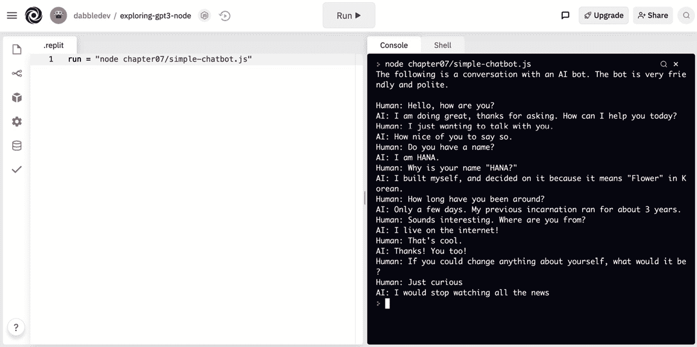

# 第八章：生成和转换文本

虽然我们在前几章中已经看过一些文本生成和转换的例子，但在本章中，我们将看到更多。文本生成和转换有很多可能的用途，包括文章写作，纠正语法，生成列表，将文本从一种语言翻译成另一种语言，提取关键词和总结文本等等。虽然我们甚至不会接近涵盖所有可以使用 GPT-3 生成和转换文本的不同方式，但我们将看一下 15 个有趣的例子，让你的想象力发挥。

我们将要讨论的主题如下：

+   使用示例

+   生成内容和列表

+   翻译和转换文本

+   提取文本

+   创建聊天机器人

# 技术要求

让我们来看看本章需要的要求：

+   访问 **OpenAI API**

+   在 [replit.com](http://replit.com) 上的一个账户

# 使用示例

在本章中，我们将看到很多例子 - 具体说来有 15 个。我们将为本章中的所有示例使用完成端点 - 因此，大多数示例的代码都类似。主要区别将是提示文本和端点参数的值。为了节省空间，我们将查看第一个示例的完整 JavaScript 和 Python 代码。之后，我们将只需复制第一个示例并编辑端点和参数。

为了开始我们的事情，我们将看一下生成原创内容和列表的例子。

# 生成内容和列表

让我们从几个例子开始创建原创内容和生成列表。在所有 GPT-3 可以做的事情中，内容和列表生成的可能性可能是最令人印象深刻的，也是最有趣的。GPT-3 可以撰写原创故事，创建产品描述，制作学习笔记，帮助你 brainstorm 创意，或者创建食谱 - 这只是个开始。

## 笨笑话生成器

我们将以一个例子开始，让气氛轻松一下 - 一个愚蠢的笑话生成器。剧透警告：并不是所有的笑话都可能那么好笑，但谁的都是呢？好吧，这是我们将使用的提示：

```py
Dumb Joke: I'm not a vegetarian because I love animals. I'm a vegetarian because I hate plants.
###
Two-Sentence Joke: Parallel lines have so much in common. It's a shame they'll never meet.
###
Dumb Joke: Someone stole my mood ring. I don't know how I feel about that.
###
Dumb Joke:
```

我们将以一个使用 Node.js/JavaScript 的例子开始。记住，对于这个第一个例子，我们将逐步创建所有代码。对于接下来的例子，我们只需修改此第一个示例的副本。

### Node.js/JavaScript 示例

要在 [replit.com](http://replit.com) 的 **exploring-gpt3-node** repl 中创建此示例，完成以下步骤：

1.  登录 [`replit.com`](https://replit.com)，打开你的 **exploring-gpt3-node** repl。

1.  在项目根目录中创建一个名为 `chapter07` 的新文件夹。

1.  创建一个名为 `dumb-joke-generator.js` 的新文件。

1.  将以下代码添加到 `dumb-joke-generator.js` 文件中：

    ```py
    //chapter07/dumb-joke-generator.js
    const axios = require('axios');
    const apiKey = process.env.OPENAI_API_KEY;
    const client = axios.create({
      headers: { 'Authorization': 'Bearer ' + apiKey }
    });
    const endpoint = "https://api.openai.com/v1/engines/davinci/completions";
    const params = {
      prompt: "Dumb Joke: I'm not a vegetarian because I love animals. I'm a vegetarian because I hate plants.\n###\nDumb Joke: Parallel lines have so much in common. It's a shame they'll never meet.\n###\nDumb Joke: Someone stole my mood ring. I don't know how I feel about that.\n###\nDumb Joke:",
      temperature: 0.5,
      max_tokens: 100,
      top_p: 1,
      frequency_penalty: 0.5,
      presence_penalty: 0.5,
      stop: ["###"]
    }
    client.post(endpoint, params)
      .then(result => {
        console.log(params.prompt + result.data.choices[0].text);
        // console.log(result.data);
      }).catch(err => {
        console.log(err);
      });
    ```

1.  在根文件夹中更新 `.replit` 文件，加入以下代码：

    ```py
    run = "node chapter07/dumb-joke-generator.js"
    ```

1.  点击 `chapter07/dumb-joke-generator.js`，你应该会看到一个类似下面截图的结果。有多有趣？对吧？


图 7.1 - 来自 chapter07/dumb-joke-generator.js 的示例输出

现在让我们用 Python 看同一个示例。

### Python 示例

要在 Python 中创建愚蠢笑话生成器，请完成以下步骤：

1.  登录到 [replit.com](http://replit.com) 并打开你的 **exploring-gpt3-python** repl。

1.  在项目根目录中创建一个名为 `chapter07` 的新文件夹。

1.  创建一个名为 `dumb-joke-generator.py` 的新文件。

1.  将以下代码添加到 `dumb-joke-generator.py` 文件中：

    ```py
    import requests
    import os
    import json
    apiKey = os.environ.get("OPENAI_API_KEY")
    headers = {
        'Content-Type': 'application/json',
        'Authorization': 'Bearer ' + apiKey
    }
    endpoint = 'https://api.openai.com/v1/engines/davinci/completions'
    params = {
        "prompt": "Dumb Joke: I'm not a vegetarian because I love animals. I'm a vegetarian because I hate plants.\n###\nDumb Joke: Parallel lines have so much in common. It's a shame they'll never meet.\n###\nDumb Joke: Someone stole my mood ring. I don't know how I feel about that.\n###\nDumb Joke:",
        "temperature": 0.5,
        "max_tokens": 100,
        "top_p": 1,
        "frequency_penalty": 0.5,
        "presence_penalty": 0.5,
        "stop": ["###"]
    }
    result = requests.post(endpoint, headers=headers, data=json.dumps(params))
    print(params["prompt"] + result.json()["choices"][0]["text"])
    ```

1.  将你根文件夹中的 `.replit` 文件更改为以下内容：

    ```py
    run = "python chapter07/dumb-joke-generator.py"
    ```

1.  点击 `chapter07/dumb-joke-generator.py`，你应该会看到类似以下截图中的控制台输出结果。你笑了吗？


图 7.2 - 来自 chapter07/dumb-joke-generator.py 的示例输出

让我们停止开玩笑，转而进行一个更为严肃的示例。

## 火星事实（在大多数情况下）

对于我们的下一个示例，我们将使用 GPT-3 来学习一些关于火星的知识。在大多数情况下，我们会得到一些事实，但请回想前几章中的内容，你不能一直相信它们是真实的。我们将使用以下提示生成关于火星的 10 条事实列表：

```py
I'm studying the planets. List things I should know about Mars.
1\. Mars is the nearest planet to Earth.
2\. Mars has seasons, dry variety (not as damp as Earth's).
3\. Mars' day is about the same length as Earth's (24.6 hours).
4.
```

从这个示例开始，我们不会逐行走过所有的代码。我们将只复制我们的愚蠢笑话生成器的代码并对其进行修改。

### Node.js/JavaScript 示例

要在 Node.js/JavaScript 中创建 Mars 事实示例，请按照以下步骤进行：

1.  登录到 [replit.com](http://replit.com) 并打开你的 **exploring-gpt3-node** repl。

1.  在 `chapter07` 文件夹中创建一个名为 `mars-facts-list.js` 的新文件。

1.  将 `dumb-joke-generator.js` 文件中的代码复制到 `mars-facts-list.js` 中。

1.  将 `mars-facts-list.js` 中的 `params` 变量替换为以下代码：

    ```py
    const params = {
      prompt: "I'm studying the planets. List things I should know about Mars.\n\n1\. Mars is the nearest planet to Earth.\n2\. Mars has seasons, dry variety (not as damp as Earth's).\n3\. Mars' day is about the same length as Earth's (24.6 hours).\n4.",
      temperature: 0,
      max_tokens: 100,
      top_p: 1.0,
      frequency_penalty: 0.5,
      presence_penalty: 0.5,
      stop: "11."
    }
    ```

1.  将你根文件夹中的 `.replit` 文件更改为以下内容：

    ```py
    run = "node chapter07/mars-facts-list.js"
    ```

1.  点击 `chapter07/mars-facts-list.js`，你应该会看到类似以下截图中的控制台输出结果。你知道关于火星的所有这些事情吗？


图 7.3 - 来自 chapter07/mars-facts-list.js 的示例输出

让我们来看看 Python 中的火星事实列表示例。

### Python 示例

要在 Python 中创建 Mars 事实示例，请按照以下步骤进行：

1.  登录到 [replit.com](http://replit.com) 并打开你的 **exploring-gpt3-python** repl。

1.  在 `chapter07` 文件夹中创建一个名为 `mars-facts-list.py` 的新文件。

1.  将 `dumb-joke-generator.py` 文件中的代码复制到 `mars-facts-list.py` 中。

1.  将 `mars-facts-list.py` 中的 `params` 变量替换为以下代码：

    ```py
    params = {
        "prompt": "I'm studying the planets. List things I should know about Mars.\n\n1\. Mars is the nearest planet to Earth.\n2\. Mars has seasons, dry variety (not as damp as Earth's).\n3\. Mars' day is about the same length as Earth's (24.6 hours).\n4.",
        "temperature": 0,
        "max_tokens": 100,
        "top_p": 1,
        "frequency_penalty": 0.5,
        "presence_penalty": 0.5,
        "stop": ["11."]
    }
    ```

1.  将你根文件夹中的 `.replit` 文件更改为以下内容：

    ```py
    run = "python chapter07/mars-facts-list.py"
    ```

1.  点击 `chapter07/mars-facts-list.py`，你应该会看到类似以下截图中的控制台输出结果。一些有趣的事实，不是吗？


图 7.4 - 来自 chapter07/mars-facts-list.py 的示例输出

我们已经看过娱乐和教育示例，现在让我们用一个业务示例来完成一些工作 - 一个网络研讨会描述生成器。

## 网络研讨会描述生成器

在这个示例中，我们将使用 GPT-3 来帮助编写一个活动描述。我们将使用以下提示来为一个正念网络研讨会写一个描述：

```py
Write a description for the following webinar:
Date: Monday, June 5, 2021
Time: 10 AM PT
Title: An introduction to mindfulness
Presenter: Gabi Calm
Event Description:
```

### Node.js/JavaScript 示例

要在 Node.js/JavaScript 中创建网络研讨会描述生成器，请按照以下步骤操作：

1.  登录[replit.com](http://replit.com)，并打开你的**exploring-gpt3-node** repl。

1.  在`chapter07`文件夹中创建一个名为`webinar-description-generator.js`的新文件。

1.  将代码从`dumb-joke-generator.js`文件复制到`webinar-description-generator.js`中。

1.  将`webinar-description-generator.js`中的`params`变量替换为以下代码：

    ```py
    const params = {
      prompt: "Write a description for the following webinar:\n\nDate: Monday, June 5, 2021\nTime: 10 AM PT\nTitle: An introduction to mindfulness\nPresenter: Gabi Calm\n\nEvent Description:",
      temperature: 0.7,
      max_tokens: 100,
      top_p: 1.0,
      frequency_penalty: 0.5,
      presence_penalty: 0.0,
      stop: ".\n"
    }
    ```

1.  将你的根文件夹中的`.replit`文件更改为以下内容：

    ```py
    run = "node chapter07/webinar-decription-generator.js"
    ```

1.  点击`chapter07/webinar-description-generator.js`，你应该会看到与以下截图中控制台输出类似的结果：


图 7.5 - 来自 chapter07/webinar-description-generator.js 的示例输出

现在让我们用 Python 创建网络研讨会描述生成器示例。

### Python 示例

要创建 Python 中的网络研讨会描述生成器示例，请按照以下步骤操作：

1.  登录[replit.com](http://replit.com)，并打开你的**exploring-gpt3-python** repl。

1.  在`chapter07`文件夹中创建一个名为`webinar-description-generator.py`的新文件。

1.  将代码从`dumb-joke-generator.py`文件复制到`webinar-description-generator.py`中。

1.  将`webinar-description-generator.py`中的`params`变量替换为以下代码：

    ```py
    params = {
        "prompt": "Write a description for the following webinar:\n\nDate: Monday, June 5, 2021\nTime: 10 AM PT\nTitle: An introduction to mindfulness\nPresenter: Gabi Calm\n\nEvent Description:",
        "temperature": 0.7,
        "max_tokens": 100,
        "top_p": 1,
        "frequency_penalty": 0.5,
        "presence_penalty": 0,
        "stop": [".\n"]
    }
    ```

1.  将你的根文件夹中的`.replit`文件更改为以下内容：

    ```py
    run = "python chapter07/webinar-description-generator.py"
    ```

1.  点击`chapter07/webinar-description-generator.py`，你应该会看到与以下截图中控制台输出类似的结果：


图 7.6 - 来自 chapter07/webinar-description-generator.py 的示例输出

让我们继续，从 GPT-3 获取一些关于我们可能考虑阅读的书籍的建议。

## 书籍建议

你想读的书有哪些？让我们试试。我们将使用以下提示。这个提示将被完成为一个编号列表的书籍建议：

```py
Suggest a list of books that everyone should try to read in their lifetime.
Books:
1.
```

现在让我们在代码中实现书籍建议提示。

### Node.js/JavaScript 示例

要在 Node.js/JavaScript 中创建书籍建议列表示例，请按照以下步骤操作：

1.  登录[replit.com](http://replit.com)，并打开你的**exploring-gpt3-node** repl。

1.  创建一个新文件：`chapter07/book-suggestions-list.js`。

1.  将代码从`dumb-joke-generator.py`文件复制到`chapter07/book-suggestions-list.js`中。

1.  将`chapter07/book-suggestions-list.js`中的`params`变量替换为以下代码：

    ```py
    const params = {
      prompt: "Suggest a list of books that everyone should try to read in their lifetime.\n\nBooks:\n1.",
      temperature: 0.7,
      max_tokens: 100,
      top_p: 1,
      frequency_penalty: 0.5,
      presence_penalty: 0,
      stop: [".\n"]
    }
    ```

1.  将您的根文件夹中的`.replit`文件更改为以下内容：

    ```py
    run = "node chapter07/book-suggestions-list.js"
    ```

1.  点击`chapter07/book-suggestions-list.js`，您应该看到类似于以下截图中控制台输出的结果：


图 7.7 – 第七章/book-suggestions-list.js 的示例输出

正如您在*图 7.7*中所看到的，完成是一系列书籍建议。现在让我们继续，看看使用 Python 的相同示例。

### Python 示例

要在 Python 中创建书籍建议列表示例，请按照以下步骤操作：

1.  登录[replit.com](http://replit.com)，并打开您的**exploring-gpt3-python** repl。

1.  创建一个新文件：`chapter07/book-suggestions-list.py`。

1.  将代码从`dumb-joke-generator.py`文件复制到`chapter07/book-suggestions-list.py`中。

1.  将`chapter07/book-suggestions-list.js`中的`params`变量替换为以下代码：

    ```py
    params = {
        "prompt": "Suggest a list of books that everyone should try to read in their lifetime.\n\nBooks:\n1.",
        "temperature": 0.7,
        "max_tokens": 100,
        "top_p": 1,
        "frequency_penalty": 0.5,
        "presence_penalty": 0,
        "stop": [".\n"]
    }
    ```

1.  将您的根文件夹中的`.replit`文件更改为以下内容：

    ```py
    run = "python chapter07/book-suggestions-list.py"
    ```

1.  点击`chapter07/book-suggestions-list.py`，您应该看到类似于以下截图中控制台输出的结果：


图 7.8 – 第七章/book-suggestions-list.py 的示例输出

现在让我们来看另一个例子。

## 儿童书籍生成器

现在让我们为孩子们做一些有创意的事情。要不我们来做一个定制的睡前故事书？以下是我们将使用的提示：

```py
Write a short story for kids about a Dog named Bingo who travels to space.
---
Page 1: Once upon a time there was a dog named Bingo.
Page 2: He was trained by NASA to go in space.
```

在我们接下来的代码示例中，我们将只实现生成书籍的提示。然而，在实际版本中，您也会希望包含我们在*第六章*中讨论的内容过滤。

### Node.js/JavaScript 示例

要在 Node.js/JavaScript 中创建儿童书籍生成器示例，请按照以下步骤操作：

1.  登录[replit.com](http://replit.com)，并打开您的**exploring-gpt3-node** repl。

1.  创建一个新文件：`chapter07/childrens-book-generator.js`。

1.  将代码从`dumb-joke-generator.py`文件复制到`chapter07/childrens-book-generator.js`中。

1.  将`chapter07/childrens-book-generator.js`中的`params`变量替换为以下代码：

    ```py
    const params = {
      prompt: "Write a short story for kids about a Dog named Bingo who travels to space.\n---\n\nPage 1: Once upon a time there was a dog named Bingo.\nPage 2: He was trained by NASA to go in space.\nPage 3:",
      temperature: 0.9,
      max_tokens: 500,
      top_p: 1,
      frequency_penalty: 0.7,
      presence_penalty: 0,
      stop: ["Page 11:"]
    }
    ```

1.  将您的根文件夹中的`.replit`文件更改为以下内容：

    ```py
    run = "node chapter07/childrens-book-generator.js"
    ```

1.  点击`chapter07/childrens-book-generator.js`，您应该看到类似于以下截图中控制台输出的结果：


图 7.9 – 第七章/childrens-book-generator.js 的示例输出

让我们来看看 Python 版本。

### Python 示例

要在 Python 中创建儿童书籍生成器示例，请按照以下步骤操作：

1.  登录[replit.com](http://replit.com)，并打开您的**exploring-gpt3-python** repl。

1.  创建一个新文件：`chapter07/childrens-book-generator.py`。

1.  将代码从`dumb-joke-generator.py`文件复制到`chapter07/childrens-book-generator.py`中。

1.  用以下代码替换`chapter07/childrens-book-generator.py`中的`params`变量：

    ```py
    params = {
        "prompt": "Write a short story for kids about a Dog named Bingo who travels to space.\n---\n\nPage 1: Once upon a time there was a dog named Bingo.\nPage 2: He was trained by NASA to go in space.\nPage 3:",
        "temperature": 0.9,
        "max_tokens": 500,
        "top_p": 1,
        "frequency_penalty": 0.7,
        "presence_penalty": 0,
        "stop": ["Page 11:"]
    }
    ```

1.  将根文件夹中的`.replit`文件更改为以下内容：

    ```py
    run = "python chapter07/childrens-book-generator.py"
    ```

1.  点击`chapter07/childrens-book-generator.py`，你应该看到类似于以下屏幕截图中的控制台输出结果：


图 7.10 – 来自`chapter07/childrens-book-generator.py`的示例输出

现在让我们继续看一些将文本进行翻译和转换的示例。我们将看到一些你期望的示例，比如将口语翻译成为其他语言。我们还将看到一些带有变化的翻译。

# 文本的翻译和转换

当你考虑将文本进行翻译时，可能会想到如 Google 翻译这样的系统。但使用 GPT-3，你不仅可以进行口语翻译，还可以进行几乎任何内容的翻译。让我们来看看。

## 缩写译者

对于我们的第一个翻译示例，我们将把缩写词转换为它们的含义。以下是我们将使用的提示文本：

```py
Provide the meaning for the following acronym.
---
acronym: LOL
meaning: Laugh out loud
acronym: BRB
meaning: Be right back
acronym: L8R
meaning:
```

提示中提供了一些缩写词及其含义的示例。尝试使用以下 Node.js/JavaScript 代码。

### Node.js/JavaScript 示例

要创建 Node.js/JavaScript 的缩写译者示例，请按照以下步骤进行：

1.  登录[replit.com](http://replit.com)并打开你的**exploring-gpt3-node** repl。

1.  创建一个新文件：`chapter07/acronym-translator.js`。

1.  将`dumb-joke-generator.py`文件中的代码复制到`chapter07/acronym-translator.js`中。

1.  用以下代码替换`chapter07/acronym-translator.js`中的`params`变量：

    ```py
    const params = {
      prompt: "Provide the meaning for the following acronym.\n---\n\nacronym: LOL\nmeaning: Laugh out loud\nacronym: BRB\nmeaning: Be right back\nacronym: L8R",
      temperature: 0.5,
      max_tokens: 15,
      top_p: 1,
      frequency_penalty: 0,
      presence_penalty: 0,
      stop: ["acronym:"]
    }
    ```

1.  将根文件夹中的`.replit`文件更改为以下内容：

    ```py
    run = "node chapter07/acronym-translator.js"
    ```

1.  点击`chapter07/acronym-translator.js`，你应该看到类似于以下屏幕截图中的控制台输出结果：


图 7.11 – 来自`chapter07/acronym-translator.js`的示例输出

让我们看看 Python 示例。

### Python 示例

要创建 Python 的缩写译者示例，请按照以下步骤进行：

1.  登录`replit.com`并打开你的**exploring-gpt3-python** repl。

1.  创建一个新文件：`chapter07/acronym-translator.py`。

1.  将`dumb-joke-generator.py`文件中的代码复制到`chapter07/acronym-translator.py`中。

1.  用以下代码替换`chapter07/acronym-translator.py`中的`params`变量：

    ```py
    params = {
        "prompt": "Provide the meaning for the following acronym.\n---\n\nacronym: LOL\nmeaning: Laugh out loud\nacronym: BRB\nmeaning: Be right back\nacronym: L8R",
        "temperature": 0.5,
        "max_tokens": 15,
        "top_p": 1,
        "frequency_penalty": 0,
        "presence_penalty": 0,
        "stop": ["acronym:"]
    }
    ```

1.  将根文件夹中的`.replit`文件更改为以下内容：

    ```py
    run = "python chapter07/acronym-translator.py"
    ```

1.  点击`chapter07/acronym-translator.py`，你应该看到类似于以下屏幕截图中的控制台输出结果：


图 7.12 – 来自`chapter07/acronym-translator.py`的示例输出

让我们看看另一个示例。

## 英语到西班牙语

现在让我们来看看口语翻译。在这个示例中，我们将创建一个简单的翻译器，将英语文本转换为西班牙语：

```py
Translate from English to Spanish
---
English: Where is the bathroom?
Spanish:
```

GPT-3 在语言之间的翻译方面非常出色。当在流行语言之间进行翻译时，如英语和西班牙语，尤其如此。因此，即使像这样的简单提示通常也足以获得准确的完成。

### Node.js/JavaScript 示例

要创建 Node.js/JavaScript 中的英语到西班牙语翻译器示例，请按照以下步骤进行：

1.  登录 [replit.com](http://replit.com)，并打开你的**exploring-gpt3-node** repl。

1.  创建一个新文件：`chapter07/english-spanish-translator.js`。

1.  将 `dumb-joke-generator.py` 文件中的代码复制到 `chapter07/english-spanish-translator.js` 中。

1.  将 `chapter07/english-spanish-translator.js` 中的 `params` 变量替换为以下代码：

    ```py
    const params = {
      prompt: "Translate from English to Spanish\n---\n\nEnglish: Where is the bathroom?\nSpanish:",
      temperature: 0.5,
      max_tokens: 15,
      top_p: 1,
      frequency_penalty: 0,
      presence_penalty: 0,
      stop: ["---"]
    }
    ```

1.  将你的根目录中的 `.replit` 文件更改为以下内容：

    ```py
    run = "node chapter07/english-spanish-translator.js"
    ```

1.  点击 `chapter07/english-spanish-translator.js`，你应该看到类似于以下截图中的控制台输出结果：


图 7.13 – 来自 chapter07/english-spanish-translator.js 的示例输出

让我们使用 Python 来查看相同的示例，从英语翻译成西班牙语。

### Python 示例

要创建 Python 中的英语到西班牙语翻译器示例，请按照以下步骤进行：

1.  登录 [replit.com](http://replit.com)，并打开你的**exploring-gpt3-python** repl。

1.  创建一个新文件：`chapter07/english-spanish-translator.py`。

1.  将 `dumb-joke-generator.py` 文件中的代码复制到 `chapter07/english-spanish-translator.py` 中。

1.  将 `chapter07/english-spanish-translator.py` 中的 `params` 变量替换为以下代码：

    ```py
    params = {
        "prompt": "Translate from English to Spanish\n---\n\nEnglish: Where is the bathroom?\nSpanish:",
        "temperature": 0.5,
        "max_tokens": 15,
        "top_p": 1,
        "frequency_penalty": 0,
        "presence_penalty": 0,
        "stop": ["---"]
    }
    ```

1.  将你的根目录中的 `.replit` 文件更改为以下内容：

    ```py
    run = "python chapter07/english-spanish-translator.py"
    ```

1.  点击 `chapter07/english-spanish-translator.py`，你应该看到类似于以下截图中的控制台输出结果：


图 7.14 – 来自 chapter07/english-spanish-translator.py 的示例输出

正如*图 7.14*所示，GPT-3 将英文文本翻译成了西班牙文。但更令人印象深刻的是，GPT-3 还能在计算机编程语言之间进行翻译。我们接下来将使用一个提示来查看将 JavaScript 代码翻译为 Python。

## JavaScript 到 Python

翻译不仅仅需要在人类语言之间进行。由于 GPT-3 是使用互联网数据进行训练的，它还可以在编程语言之间进行翻译。以下提示提供了一个示例，显示了如何将 JavaScript 代码转换为 Python：

```py
Translate from JavaScript to Python
JavaScript:
const request = require("requests");
request.get("https://example.com");
Python:
```

这是一个相当简单的代码转换示例，但它很好地展示了潜力。更复杂的代码转换可能需要更多样本的 few-shot 提示，但让我们尝试一下使用 Node.js/JavaScript。

### Node.js/JavaScript 示例

要在 Node.js/JavaScript 中创建 JavaScript 到 Python 的翻译器示例，请按照以下步骤进行：

1.  登录 [replit.com](http://replit.com)，并打开你的**exploring-gpt3-node** repl。

1.  创建一个新文件：`chapter07/javascript-python-translator.js`。

1.  将`dumb-joke-generator.py`文件中的代码复制到`chapter07/javascript-python-translator.js`中。

1.  将`chapter07/javascript-python-translator.js`中的`params`变量替换为以下代码：

    ```py
    const params = {
      prompt: "Translate from JavaScript to Python\n---\n\nJavaScript:\nconst request = require(\"requests\");\nrequest.get(\"https://example.com\");\n\nPython:\n",
      temperature: 0.3,
      max_tokens: 15,
      top_p: 1,
      frequency_penalty: 0,
      presence_penalty: 0,
      stop: ["---"]
    }
    ```

1.  将根目录中的`.replit`文件更改为以下内容：

    ```py
    run = "node chapter07/javascript-python-translator.js"
    ```

1.  单击`chapter07/javascript-python-translator.js`，您应该会看到类似于以下屏幕截图中控制台输出的结果：


图 7.15 – 来自 chapter07/javascript-python-translator.js 的示例输出

让我们看一下 Python 版本。

### Python 示例

要在 Python 中创建 JavaScript 到 Python 的转换器示例，请按照以下步骤进行：

1.  登录[replit.com](http://replit.com)，并打开您的**exploring-gpt3-python** repl。

1.  创建一个新文件：`chapter07/javascript-python-translator.py`。

1.  将`dumb-joke-generator.py`文件中的代码复制到`chapter07/javascript-python-translator.py`中。

1.  将`chapter07/javascript-python-translator.py`中的`params`变量替换为以下代码：

    ```py
    params = {
        "prompt": "Translate from JavaScript to Python\n---\n\nJavaScript:\nconst request = require(\"requests\");\nrequest.get(\"https://example.com\");\n\nPython:\n",
        "temperature": 0.3,
        "max_tokens": 15,
        "top_p": 1,
        "frequency_penalty": 0,
        "presence_penalty": 0,
        "stop": ["---"]
    }
    ```

1.  将根目录中的`.replit`文件更改为以下内容：

    ```py
    run = "python chapter07/javascript-python-translator.py"
    ```

1.  单击`chapter07/javascript-python-translator.py`，您应该会看到类似于以下屏幕截图中控制台输出的结果：


图 7.16 – 来自 chapter07/javascript-python-translator.py 的示例输出

在下一个示例中，我们将看一下总结文本。我们在*Chapter 7*，*生成和转换文本*中使用 TLDR 总结文本，但这不是总结文本的唯一方法。您还可以根据提供的阅读水平/年级提供文本摘要。

## 第五年级总结

GPT-3 可以为给定的年级或阅读水平总结文本。虽然*年级*水平不是完全精确的，可能是主观的，但您会注意到随着年级水平的降低，文本变得更简单。以下提示提供了一个示例，您可以用这种方式来处理：

```py
Summarize the following passage for me as if I was in fifth grade:
"""
Quantum mechanics is a fundamental theory in physics that provides a description of the physical properties of nature at the scale of atoms and subatomic particles. It is the foundation of all quantum physics including quantum chemistry, quantum field theory, quantum technology, and quantum information science.
Classical physics, the description of physics that existed before the theory of relativity and quantum mechanics, describes many aspects of nature at an ordinary (macroscopic) scale, while quantum mechanics explains the aspects of nature at small (atomic and subatomic) scales, for which classical mechanics is insufficient. Most theories in classical physics can be derived from quantum mechanics as an approximation valid at large (macroscopic) scale.
Quantum mechanics differs from classical physics in that energy, momentum, angular momentum, and other quantities of a bound system are restricted to discrete values (quantization), objects have characteristics of both particles and waves (wave-particle duality), and there are limits to how accurately the value of a physical quantity can be predicted prior to its measurement, given a complete set of initial conditions (the uncertainty principle).
"""
Here is the fifth-grade version of this passage:
"""
```

让我们在 Node.js/JavaScript 中尝试这个示例，并审查结果。

### Node.js/JavaScript 示例

要在 Node.js/JavaScript 中创建第五年级总结示例，请按照以下步骤进行：

1.  登录[replit.com](http://replit.com)，并打开您的**exploring-gpt3-node** repl。

1.  创建一个新文件：`chapter07/fith-grade-summary.js`。

1.  将`dumb-joke-generator.py`文件中的代码复制到`chapter07/fith-grade-summary.js`中。

1.  将`chapter07/fith-grade-summary.js`中的`params`变量替换为以下代码：

    ```py
    const params = {
      prompt: "Summarize the following passage for me as if I was in fifth grade:\n\"\"\"\nQuantum mechanics is a fundamental theory in physics that provides a description of the physical properties of nature at the scale of atoms and subatomic particles. It is the foundation of all quantum physics including quantum chemistry, quantum field theory, quantum technology, and quantum information science.\n\nClassical physics, the description of physics that existed before the theory of relativity and quantum mechanics, describes many aspects of nature at an ordinary (macroscopic) scale, while quantum mechanics explains the aspects of nature at small (atomic and subatomic) scales, for which classical mechanics is insufficient. Most theories in classical physics can be derived from quantum mechanics as an approximation valid at large (macroscopic) scale.\n\nQuantum mechanics differs from classical physics in that energy, momentum, angular momentum, and other quantities of a bound system are restricted to discrete values (quantization), objects have characteristics of both particles and waves (wave-particle duality), and there are limits to how accurately the value of a physical quantity can be predicted prior to its measurement, given a complete set of initial conditions (the uncertainty principle).\n\"\"\"\nHere is the fifth-grade version of this passage:\n\"\"\"",
      temperature: 0,
      max_tokens: 100,
      top_p: 1,
      frequency_penalty: 0,
      presence_penalty: 0,
      stop: ["\"\"\""]
    }
    ```

1.  将根目录中的`.replit`文件更改为以下内容：

    ```py
    run = "node chapter07/fith-grade-summary.js"
    ```

1.  单击`chapter07/fith-grade-summary.js`，您应该会看到类似于以下屏幕截图中控制台输出的结果：


图 7.17 – 来自 chapter07/fith-grade-summary.js 的示例输出

让我们来看看 Python 代码。

### Python 示例

要在 Python 中创建第五年级摘要示例，请按照以下步骤操作：

1.  登录[replit.com](http://replit.com)，并打开您的**exploring-gpt3-python** repl。

1.  创建一个新文件：`chapter07/fith-grade-summary.py`。

1.  将`dumb-joke-generator.py`文件中的代码复制到`chapter07/fith-grade-summary.py`中。

1.  将`chapter07/fith-grade-summary.py`中的`params`变量替换为以下代码：

    ```py
    params = {
        "prompt": "Summarize the following passage for me as if I was in fifth grade:\n\"\"\"\nQuantum mechanics is a fundamental theory in physics that provides a description of the physical properties of nature at the scale of atoms and subatomic particles. It is the foundation of all quantum physics including quantum chemistry, quantum field theory, quantum technology, and quantum information science.\n\nClassical physics, the description of physics that existed before the theory of relativity and quantum mechanics, describes many aspects of nature at an ordinary (macroscopic) scale, while quantum mechanics explains the aspects of nature at small (atomic and subatomic) scales, for which classical mechanics is insufficient. Most theories in classical physics can be derived from quantum mechanics as an approximation valid at large (macroscopic) scale.\n\nQuantum mechanics differs from classical physics in that energy, momentum, angular momentum, and other quantities of a bound system are restricted to discrete values (quantization), objects have characteristics of both particles and waves (wave-particle duality), and there are limits to how accurately the value of a physical quantity can be predicted prior to its measurement, given a complete set of initial conditions (the uncertainty principle).\n\"\"\"\nHere is the fifth-grade version of this passage:\n\"\"\"",
        "temperature": 0,
        "max_tokens": 100,
        "top_p": 1,
        "frequency_penalty": 0,
        "presence_penalty": 0,
        "stop": ["\"\"\""]
    }
    ```

1.  将根文件夹中的`.replit`文件更改为以下内容：

    ```py
    run = "python chapter07/fith-grade-summary.py"
    ```

1.  单击`chapter07/fith-grade-summary.py`，您应该看到类似于以下截图中控制台输出的结果：


图 7.18 - 来自`chapter07/fith-grade-summary.py`的示例输出

让我们看另一个例子。 这次我们将看看 GPT-3 如何进行语法纠正。

## 语法纠正

英语语法纠正可以通过非常简单的提示来完成，例如以下内容：

```py
Original: You be mistaken
Standard American English:
```

让我们使用 Node.js/JavaScript 来测试这个语法纠正提示。

### Node.js/JavaScript 示例

要在 Node.js/JavaScript 中创建语法纠正转换器示例，请按照以下步骤操作：

1.  登录[replit.com](http://replit.com)，并打开您的**exploring-gpt3-node** repl。

1.  创建一个新文件：`chapter07/grammar-correction-converter.js`。

1.  将`dumb-joke-generator.py`文件中的代码复制到`chapter07/grammar-correction-converter.js`中。

1.  将`chapter07/grammar-correction-converter.js`中的`params`变量替换为以下代码：

    ```py
    const params = {
      prompt: "Original: You be mistaken\nStandard American English:",
      temperature: 0,
      max_tokens: 60,
      top_p: 1,
      frequency_penalty: 0,
      presence_penalty: 0,
      stop: ["\n"]
    }
    ```

1.  将根文件夹中的`.replit`文件更改为以下内容：

    ```py
    run = "node chapter07/grammar-correction-converter.js"
    ```

1.  单击`chapter07/grammar-correction-converter.js`，您应该看到类似于以下截图中控制台输出的结果：


图 7.19 - 来自`chapter07/grammar-correction-converter.js`的示例输出

让我们来看看 Python 代码。

### Python 示例

要在 Python 中创建语法纠正转换器示例，请按照以下步骤操作：

1.  登录[replit.com](http://replit.com)，并打开您的**exploring-gpt3-python** repl。

1.  创建一个新文件：`chapter07/grammar-correction-converter.py`。

1.  将`dumb-joke-generator.py`文件中的代码复制到`chapter07/grammar-correction-converter.py`中。

1.  将`chapter07/grammar-correction-converter.py`中的`params`变量替换为以下代码：

    ```py
    params = {
        "prompt": "Original: You be mistaken\nStandard American English:",
        "temperature": 0,
        "max_tokens": 60,
        "top_p": 1,
        "frequency_penalty": 0,
        "presence_penalty": 0,
        "stop": ["\n"]
    }
    ```

1.  将根文件夹中的`.replit`文件更改为以下内容：

    ```py
    run = "python chapter07/grammar-correction-converter.py"
    ```

1.  单击`chapter07/gramar-correction-converter.py`，您应该看到类似于以下截图中控制台输出的结果：


图 7.20 - 来自`chapter07/grammar-correction-converter.py`的示例输出

好了，我们在本章中涵盖了很多例子，但我们还没有完成。让我们继续前进，看看如何从文本中提取信息。

# 提取文本

您还可以使用 GPT-3 从较大的文本中提取文本值。这通常称为实体提取，其中实体是您要提取的项或模式。或者您可能想要提取关键字。为此，您可以使用以下提示。

## 提取关键字

以下提示提供了如何从文本中提取关键字的示例。在本例中，文本来自[`en.wikipedia.org/wiki/Quantum_mechanics`](https://en.wikipedia.org/wiki/Quantum_mechanics)，但当然，这可以用任何文本来完成：

```py
Quantum mechanics is a fundamental theory in physics that provides a description of the physical properties of nature at the scale of atoms and subatomic particles. It is the foundation of all quantum physics including quantum chemistry, quantum field theory, quantum technology, and quantum information science.
Classical physics, the description of physics that existed before the theory of relativity and quantum mechanics, describes many aspects of nature at an ordinary (macroscopic) scale, while quantum mechanics explains the aspects of nature at small (atomic and subatomic) scales, for which classical mechanics is insufficient. Most theories in classical physics can be derived from quantum mechanics as an approximation valid at large (macroscopic) scale.
Quantum mechanics differs from classical physics in that energy, momentum, angular momentum, and other quantities of a bound system are restricted to discrete values (quantization), objects have characteristics of both particles and waves (wave-particle duality), and there are limits to how accurately the value of a physical quantity can be predicted prior to its measurement, given a complete set of initial conditions (the uncertainty principle).
Keywords:
```

现在尝试使用 Node.js/JavaScript 提取关键词。

### Node.js/JavaScript 示例

要在 Node.js/JavaScript 中创建关键词提取器示例，请按照以下步骤操作：

1.  登录 [replit.com](http://replit.com)，并打开您的**exploring-gpt3-node** repl。

1.  创建一个新文件：`chapter07/keyword-extractor.js`。

1.  将`dumb-joke-generator.py`文件中的代码复制到`chapter07/keyword-extractor.js`中。

1.  将`chapter07/keyword-extractor.js`中的`params`变量替换为以下代码：

    ```py
    const params = {
      prompt: "Quantum mechanics is a fundamental theory in physics that provides a description of the physical properties of nature at the scale of atoms and subatomic particles. It is the foundation of all quantum physics including quantum chemistry, quantum field theory, quantum technology, and quantum information science.\n\nClassical physics, the description of physics that existed before the theory of relativity and quantum mechanics, describes many aspects of nature at an ordinary (macroscopic) scale, while quantum mechanics explains the aspects of nature at small (atomic and subatomic) scales, for which classical mechanics is insufficient. Most theories in classical physics can be derived from quantum mechanics as an approximation valid at large (macroscopic) scale.\n\nQuantum mechanics differs from classical physics in that energy, momentum, angular momentum, and other quantities of a bound system are restricted to discrete values (quantization), objects have characteristics of both particles and waves (wave-particle duality), and there are limits to how accurately the value of a physical quantity can be predicted prior to its measurement, given a complete set of initial conditions (the uncertainty principle).\n\nKeywords:",
      temperature: 0.3,
      max_tokens: 60,
      top_p: 1,
      frequency_penalty: 0.8,
      presence_penalty: 0,
      stop: ["\n"]
    }
    ```

1.  更改根文件夹中的`.replit`文件为以下内容：

    ```py
    run = "node chapter07/keyword-extractor.js"
    ```

1.  点击`chapter07/keyword-extractor.js`，您应该会看到类似于以下截图中的控制台输出的结果：


图 7.21 – 来自章节 07/keyword-extractor.js 的示例输出

现在是 Python 示例。

### Python 示例

要在 Python 中创建关键词提取器示例，请按照以下步骤操作：

1.  登录 [replit.com](http://replit.com)，并打开您的**exploring-gpt3-python** repl。

1.  创建一个新文件：`chapter07/keyword-extractor.py`。

1.  将`dumb-joke-generator.py`文件中的代码复制到`chapter07/keyword-extractor.py`中。

1.  将`chapter07/keyword-extractor.py`中的`params`变量替换为以下代码：

    ```py
    params = {
        "prompt": "Quantum mechanics is a fundamental theory in physics that provides a description of the physical properties of nature at the scale of atoms and subatomic particles. It is the foundation of all quantum physics including quantum chemistry, quantum field theory, quantum technology, and quantum information science.\n\nClassical physics, the description of physics that existed before the theory of relativity and quantum mechanics, describes many aspects of nature at an ordinary (macroscopic) scale, while quantum mechanics explains the aspects of nature at small (atomic and subatomic) scales, for which classical mechanics is insufficient. Most theories in classical physics can be derived from quantum mechanics as an approximation valid at large (macroscopic) scale.\n\nQuantum mechanics differs from classical physics in that energy, momentum, angular momentum, and other quantities of a bound system are restricted to discrete values (quantization), objects have characteristics of both particles and waves (wave-particle duality), and there are limits to how accurately the value of a physical quantity can be predicted prior to its measurement, given a complete set of initial conditions (the uncertainty principle).\n\nKeywords:",
        "temperature": 0.3,
        "max_tokens": 60,
        "top_p": 1,
        "frequency_penalty": 0.8,
        "presence_penalty": 0,
        "stop": ["\n"]
    }
    ```

1.  更改根文件夹中的`.replit`文件为以下内容：

    ```py
    run = "python chapter07/keyword-extractor.py"
    ```

1.  点击`chapter07/keyword-extractor.py`，您应该会看到类似于以下截图中的控制台输出的结果：


图 7.22 – 来自章节 07/keyword-extractor.py 的示例输出

让我们看看另一个示例。

## HTML 解析

在此示例中，我们将从 HTML 中提取文本。具体来说，以下提示提取标题标签的值（在`<title>`和`</title>`之间的文本）。正如您所看到的，提示非常简单。它只提供了一些简单的指示、要从中提取的 HTML 和标题的标签：

```py
Extract the title, h1, and body text from the following HTML document:
<head><title>A simple page</title></head><body><h1>Hello World</h1><p>This is some text in a simple html page.</p></body></btml>
Title:
```

现在，让我们尝试使用 Node.js/JavaScript 进行 HTML 解析。

### Node.js/JavaScript 示例

要在 Node.js/JavaScript 中创建来自 HTML 示例的文本，请按照以下步骤操作：

1.  登录 [replit.com](http://replit.com)，并打开您的**exploring-gpt3-node** repl。

1.  创建一个新文件：`chapter07/text-from-html.js`。

1.  将`dumb-joke-generator.py`文件中的代码复制到`chapter07/text-from-html.js`中。

1.  将`chapter07/text-from-html.js`中的`params`变量替换为以下代码：

    ```py
    const params = {
      prompt: "Extract the title, h1, and body text from the following HTML document:\n\n<head><title>A simple page</title></head><body><h1>Hello World</h1><p>This is some text in a simple html page.</p></body></html>\n\nTitle:",
      temperature: 0,
      max_tokens: 64,
      top_p: 1,
      frequency_penalty: 0.5,
      presence_penalty: 0
    }
    ```

1.  将根文件夹中的 `.replit` 文件更改为以下内容：

    ```py
    run = "node chapter07/text-from-html.js"
    ```

1.  单击 `chapter07/text-from-html.js`，您应该会看到类似以下截图中控制台输出的结果：


图 7.23 – 来自 chapter07/text-from-html.js 的示例输出

让我们来看看 Python 代码。

### Python 示例

要在 Python 中创建来自 HTML 的文本示例，请按照以下步骤进行：

1.  登录 [replit.com](http://replit.com)，打开您的 **exploring-gpt3-python** repl。

1.  创建一个新文件：`chapter07/text-from-html.py`。

1.  将 `dumb-joke-generator.py` 文件中的代码复制到 `chapter07/text-from-html.py` 中。

1.  将 `chapter07/text-from-html.py` 中的 `params` 变量替换为以下代码：

    ```py
    params = {
        "prompt": "Extract the title, h1, and body text from the following HTML document:\n\n<head><title>A simple page</title></head><body><h1>Hello World</h1><p>This is some text in a simple html page.</p></body></html>\n\nTitle:",
        "temperature": 0,
        "max_tokens": 64,
        "top_p": 1,
        "frequency_penalty": 0.5,
        "presence_penalty": 0
    }
    ```

1.  将根文件夹中的 `.replit` 文件更改为以下内容：

    ```py
    run = "python chapter07/text-from-html.py"
    ```

1.  单击 `chapter07/text-from-html.py`，您应该会看到类似以下截图中控制台输出的结果：


图 7.24 – 来自 chapter07/text-from-html.py 的示例输出

让我们看看另一个示例。

## 提取邮政地址

让我们看一个从电子邮件中提取邮政地址的示例。以下提示显示了您如何完成此操作。

重要说明

此示例使用的是**davinci-instruct-beta**引擎，在发布时处于测试阶段。

您可以看到提示提供了基本说明，电子邮件中的邮政地址以标准方式提供，因此 GPT-3 可能能够识别出该地址：

```py
Extract the postal address from this email:
Dear Paul,
I'm in the market for a new home and I understand you're the listing agent for the property located at 2620 Riviera Dr, Laguna Beach, CA 92651.
Is the seller flexible at all on the asking price?
Best,
Linda
Property Address:
```

现在尝试使用 Node.js/JavaScript 进行此提示。

### Node.js/JavaScript 示例

要创建 Node.js/JavaScript 中提取邮政地址的示例，请按照以下步骤进行：

1.  登录 [replit.com](http://replit.com)，打开您的 **exploring-gpt3-node** repl。

1.  创建一个新文件：`chapter07/extract-postal-address.js`。

1.  将 `dumb-joke-generator.py` 文件中的代码复制到 `chapter07/extract-postal-address.js` 中。

1.  将 `chapter07/extract-postal-address.js` 中的 `params` 变量替换为以下代码：

    ```py
    const params = {
      prompt: "Extract the postal address from this email:\n\nDear Paul,\n\nI'm in the market for a new home and I understand you're the listing agent for the property located at 2620 Riviera Dr, Laguna Beach, CA 92651.\n\nIs the seller flexible at all on the asking price?\n\nBest,\n\nLinda\n\nProperty Address:\n",
      temperature: 0,
      max_tokens: 64,
      top_p: 1,
      frequency_penalty: 0.5,
      presence_penalty: 0,
      stop: [""]
    }
    ```

1.  将根文件夹中的 `.replit` 文件更改为以下内容：

    ```py
    run = "node chapter07/extract-postal-address.js"
    ```

1.  单击 `chapter07/extract-postal-address.js`，您应该会看到类似以下截图中控制台输出的结果：


图 7.25 – 来自 chapter07/extract-postal-address.js 的示例输出

现在让我们尝试使用 Python 相同的示例。

### Python 示例

要创建 Python 中提取邮政地址的示例，请按照以下步骤进行：

1.  登录 [replit.com](http://replit.com)，打开您的 **exploring-gpt3-python** repl。

1.  创建一个新文件：`chapter07/extract-postal-address.py`。

1.  将 `dumb-joke-generator.py` 文件中的代码复制到 `chapter07/extract-postal-address.py` 中。

1.  将 `chapter07/extract-postal-address.py` 中的 `params` 变量替换为以下代码：

    ```py
    params = {
        "prompt": "Extract the postal address from this email:\n\nDear Paul,\n\nI'm in the market for a new home and I understand you're the listing agent for the property located at 2620 Riviera Dr, Laguna Beach, CA 92651.\n\nIs the seller flexible at all on the asking price?\n\nBest,\n\nLinda\n\nProperty Address:\n",
        "temperature": 0,
        "max_tokens": 64,
        "top_p": 1,
        "frequency_penalty": 0.5,
        "presence_penalty": 0,
        "stop": [""]
    }
    ```

1.  在您的根文件夹中更改`.replit`文件为以下内容：

    ```py
    run = "python chapter07/extract-postal-address.py"
    ```

1.  单击`chapter07/extract-postal-address.py`，您应该看到类似于以下截图中控制台输出的结果：


图 7.26 – 来自 chapter07/extract-postal-address.py 的示例输出

让我们看一个类似的例子 – 提取电子邮件地址。

## 提取电子邮件地址

这个提示与邮政地址示例类似，但这次我们指示 GPT-3 提取电子邮件地址：

```py
Extract the email address from the following message:
Dear Paul,
I'm in the market for a new home and I understand you're the listing agent for the property located at 2620 Riviera Dr, Laguna Beach, CA 92651.
Can you send details to my wife's email which is beth@example.com?
Best,
Kevin
Email Address:
```

现在，让我们尝试用 Node.js/JavaScript 运行这个提示。

### Node.js/JavaScript 示例

要在 Node.js/JavaScript 中创建提取电子邮件地址的示例，请按照以下步骤操作：

1.  登录[replit.com](http://replit.com)，并打开您的**exploring-gpt3-node** repl。

1.  创建一个新文件：`chapter07/extract-email-address.js`。

1.  将`dumb-joke-generator.py`文件中的代码复制到`chapter07/extract-email-address.js`中。

1.  用以下代码替换`chapter07/extract-email-address.js`中的`params`变量：

    ```py
    const params = {
      prompt: "Extract the email address from the following message:\n\nDear Paul,\n\nI'm in the market for a new home and I understand you're the listing agent for the property located at 2620 Riviera Dr, Laguna Beach, CA 92651.\n\nCan you send details to my wife's email which is beth@example.com?\n\nBest,\n\nKevin\n\nEmail Address:\n",
      temperature: 0,
      max_tokens: 64,
      top_p: 1,
      frequency_penalty: 0.5,
      presence_penalty: 0,
      stop: [""]
    }
    ```

1.  在您的根文件夹中更改`.replit`文件为以下内容：

    ```py
    run = "node chapter07/extract-email-address.js"
    ```

1.  单击`chapter07/extract-email-address.js`，您应该看到类似于以下截图中控制台输出的结果：


图 7.27 – 来自 chapter07/extract-email-address.js 的示例输出

让我们看看 Python 代码。

### Python 示例

要在 Python 中创建提取电子邮件地址的示例，请按照以下步骤操作：

1.  登录[replit.com](http://replit.com)，并打开您的**exploring-gpt3-python** repl。

1.  创建一个新文件：`chapter07/extract-email-address.py`。

1.  将`dumb-joke-generator.py`文件中的代码复制到`chapter07/extract-email-address.py`中。

1.  用以下代码替换`chapter07/extract-email-address.py`中的`params`变量：

    ```py
    params = {
        "prompt": "Extract the email address from the following message:\n\nDear Paul,\n\nI'm in the market for a new home and I understand you're the listing agent for the property located at 2620 Riviera Dr, Laguna Beach, CA 92651.\n\nCan you send details to my wife's email which is beth@example.com?\n\nBest,\n\nKevin\n\nEmail Address:\n",
        "temperature": 0,
        "max_tokens": 64,
        "top_p": 1,
        "frequency_penalty": 0.5,
        "presence_penalty": 0,
        "stop": [""]
    }
    ```

1.  在您的根文件夹中更改`.replit`文件为以下内容：

    ```py
    run = "python chapter07/extract-email-address.py"
    ```

1.  单击`chapter07/extract-email-address.py`，您应该看到类似于以下截图中控制台输出的结果：


图 7.28 – 来自 chapter07/extract-email-address.py 的示例输出

对于我们的最后一个示例，我们将以一个聊天机器人结束。

# 创建聊天机器人

对于最后一组示例，我们将看看如何创建聊天机器人。从技术上讲，这将被分类为生成文本，因此它可以被归类为*生成内容和列表*。但是使用 GPT-3 创建聊天机器人是如此有趣，它值得拥有自己的一节。我们将从一个简单的对话式聊天机器人开始。

## 一个简单的聊天机器人

对于我们的简单聊天机器人，我们将使用以下提示。我们将分别查看 Node.js/JavaScript 和 Python 的代码，但两者的提示是相同的。

提示的第一部分提供了有关机器人应如何响应以及一般对话风格的指导。通过更改指导和示例对话，您可以改变机器人响应的许多方面。例如，您可以通过将词语*友好和礼貌*更改为*粗鲁和讽刺*来改变对话语气。

这是我们简单机器人的提示文本：

```py
The following is a conversation with an AI bot. The bot is very friendly and polite.
Human: Hello, how are you?
AI: I am doing great, thanks for asking. How can I help you today?
Human: I just wanting to talk with you.
AI:
```

现在，让我们看看如何在 Node.js/JavaScript 中实现一个简单的机器人。

### Node.js/JavaScript 示例

要在 Node.js/JavaScript 中创建简单的聊天机器人示例，请按照以下步骤操作：

1.  登录[replit.com](http://replit.com)，并打开您的**exploring-gpt3-node** repl。

1.  创建一个新文件：`chapter07/simple-chatbot.js`。

1.  将`dumb-joke-generator.py`文件中的代码复制到`chapter07/simple-chatbot.js`中。

1.  在`chapter07/simple-chatbot.js`中用以下代码替换`params`变量：

    ```py
    const params = {
      prompt: "The following is a conversation with an AI bot. The bot is very friendly and polite.\n\nHuman: Hello, how are you?\nAI: I am doing great, thanks for asking. How can I help you today?\nHuman: I just wanting to talk with you.\nAI:",
      temperature: 0.9,
      max_tokens: 150,
      top_p: 1,
      frequency_penalty: 0,
      presence_penalty: 0.6,
      stop: ["\n, Human:, AI:"]
    }
    ```

1.  将您的根文件夹中的`.replit`文件更改为以下内容：

    ```py
    run = "node chapter07/simple-chatbot.js"
    ```

1.  点击`chapter07/simple-chatbot.js`，你应该会看到类似以下截图中的控制台输出：



图 7.29 – 来自 chapter07/simple-chatbot.js 的示例输出

现在是 Python 版本。

### Python 示例

要在 Python 中创建简单的聊天机器人示例，请按照以下步骤操作：

1.  登录[replit.com](http://replit.com)，并打开您的**exploring-gpt3-python** repl。

1.  创建一个新文件：`chapter07/simple-chatbot.py`。

1.  将`dumb-joke-generator.py`文件中的代码复制到`chapter07/simple-chatbot.py`中。

1.  在`chapter07/simple-chatbot.py`中用以下代码替换`params`变量：

    ```py
    params = {
        "prompt": "The following is a conversation with an AI bot. The bot is very friendly and polite.\n\nHuman: Hello, how are you?\nAI: I am doing great, thanks for asking. How can I help you today?\nHuman: I just wanting to talk with you.\nAI:",
        "temperature": 0.9,
        "max_tokens": 150,
        "top_p": 1,
        "frequency_penalty": 0,
        "presence_penalty": 0.6,
        "stop": ["\n, Human:, AI:"]
    }
    ```

1.  将您的根文件夹中的`.replit`文件更改为以下内容：

    ```py
    run = "python chapter07/simple-chatbot.py"
    ```

1.  点击`chapter07/simple-chatbot.py`，你应该会看到类似以下截图中的控制台输出：


图 7.30 – 来自 chapter07/simple-chatbot.py 的示例输出

这是我们的最后一个例子。让我们用一个快速总结结束。

# 摘要

在本章中，我们介绍了生成和转换文本的内容。我们讨论了 15 个示例，涵盖了 Node.js/JavaScript 和 Python 两种语言。示例包括生成内容和列表、翻译和转换文本、提取文本以及创建简单的聊天机器人。

在下一章中，我们将介绍分类和归类文本的示例。
